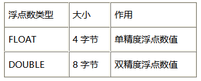

# 数据库基本概念

（1）数据
所谓数据（Data）是指对客观事物进行描述并可以鉴别的符号，这些符号是可识别的、抽象的。它不仅仅指狭义上的数字，而是有多种表现形式：字母、文字、文本、图形、音频、视频等。现在计算机存储和处理的数据范围十分广泛，而描述这些数据的符号也变得越来越复杂了。

（2）数据库
数据库（Database，DB）指的是以一定格式存放、能够实现多个用户共享、与应用程序彼此独立的数据集合。

（3）数据库管理系统
数据库管理系统（Database Management System，DBMS）是用来定义和管理数据的软件。如何科学的组织和存储数据，如何高效的获取和维护数据，如何保证数据的安全性和完整性，这些都需要靠数据库管理系统完成。目前，比较流行的数据库管理系统有：Oracle、MySQL、SQL Server、DB2等。

（4）数据库应用程序
数据库应用程序（Database Application System，DBAS）是在数据库管理系统基础上，使用数据库管理系统的语法，开发的直接面对最终用户的应用程序，如学生管理系统、人事管理系统、图书管理系统等。

（5）数据库管理员
数据库管理员（Database Administrator，DBA）是指对数据库管理系统进行操作的人员，其主要负责数据库的运营和维护。


（6）最终用户
最终用户（User）指的是数据库应用程序的使用者。用户面向的是数据库应用程序（通过应用程序操作数据），并不会直接与数据库打交道。

（7） 数据库系统
数据库系统（Database System，DBS）一般是由数据库、数据库管理系统、数据库应用程序、数据库管理员和最终用户构成。其中DBMS是数据库系统的基础和核心。


# MySQL介绍

MySQL数据库最初是由瑞典MySQL AB公司开发，2008年1月16号被Sun公司收购。2009年，SUN又被Oracle收购。MySQL是目前IT行业最流行的开放源代码的数据库管理系统，同时它也是一个支持多线程高并发多用户的关系型数据库管理系统。MySQL之所以受到业界人士的青睐，主要是因为其具有以下几方面优点：
1. 开放源代码
MySQL最强大的优势之一在于它是一个开放源代码的数据库管理系统。开源的特点是给予了用户根据自己需要修改DBMS的自由。MySQL采用了General Public License，这意味着授予用户阅读、修改和优化源代码的权利，这样即使是免费版的MySQL的功能也足够强大，这也是为什么MySQL越来越受欢迎的主要原因。
2. 跨平台
MySQL可以在不同的操作系统下运行，简单地说，MySQL可以支持Windows系统、UNIX系统、Linux系统等多种操作系统平台。这意味着在一个操作系统中实现的应用程序可以很方便地移植到其他的操作系统下。
3. 轻量级
MySQL的核心程序完全采用多线程编程，这些线程都是轻量级的进程，它在灵活地为用户提供服务的同时，又不会占用过多的系统资源。因此MySQL能够更快速、高效的处理数据。
4. 成本低
MySQL分为社区版和企业版，社区版是完全免费的，而企业版是收费的。即使在开发中需要用到一些付费的附加功能，价格相对于昂贵的Oracle、DB2等也是有很大优势的。其实免费的社区版也支持多种数据类型和正规的SQL查询语言，能够对数据进行各种查询、增加、删除、修改等操作，所以一般情况下社区版就可以满足开发需求了，而对数据库可靠性要求比较高的企业可以选择企业版。
另外，PHP中提供了一整套的MySQL函数，对MySQL进行了全方位的强力支持。 
总体来说，MySQL是一款开源的、免费的、轻量级的关系型数据库，其具有体积小、速度快、成本低、开放源码等优点，其发展前景是无可限量的。 

PS：社区版与企业版主要的区别是：
1. 社区版包含所有MySQL的最新功能，而企业版只包含稳定之后的功能。换句话说，社区版可以理解为是企业版的测试版。 
2.MySQL官方的支持服务只是针对企业版，如果用户在使用社区版时出现了问题，MySQL官方是不负责任的。  


#  MySQL安装

## 1、卸载原来的版本

### 1、查看mysql的安装情况

```sh
rpm -qa | grep -i mysql
```


### 2、删除上图安装的软件

```sh
rpm -ev --nodeps mysql57-community-release-el5-7.noarch
rpm -ev --nodeps mysql-community-server-5.7.18-1.el5.x86_64
rpm -ev --nodeps mysql-community-client-5.7.18-1.el5.x86_64
rpm -ev --nodeps mysql-community-libs-5.7.18-1.el5.x86_64
rpm -ev --nodeps mysql-community-common-5.7.18-1.el5.x86_64
rpm -ev --nodeps mysql-5.7.18-1.el5.x86_64
rpm -ev --nodeps mysql-community-libs-compat-5.7.18-1.el5.x86_64

```

### 3、都删除成功之后，查找相关的mysql的文件

```sh
find / -name mysql
```


### 4、删除全部文件

```sh
rm -rf /etc/selinux/targeted/active/modules/100/mysql
rm -rf /root/mysql
rm -rf /root/mysql/data/mysql
rm -rf /var/lib/mysql
rm -rf /var/lib/mysql/mysql
rm -rf /usr/share/mysql
```

### 5、再次执行命令

```shell
rpm -qa | grep -i mysql
#如果没有显式则表示卸载完成
```


## 2、删除mariadb-libs(不可省略)

```sh
# 检查mariadb-libs
rpm -qa|grep mariadb
# 卸载mariadb-libs
yum remove -y mariadb-libs

```


## 3、安装MySQL

### 1，输入：

wegt https://dev.mysql.com/get/mysql版本号-community-release-el大版本-小版本.noarch.rpm

```sh
wget https://dev.mysql.com/get/mysql57-community-release-el5-7.noarch.rpm

```

### 2、安装数据源

```sh
yum install -y mysql57-community-release-el5-7.noarch.rpm

```

### 3、查看mysql源是否安装成功

```sh
yum repolist enabled | grep "mysql.*-community.*"

```

### 4、安装数据库

```sh
yum install -y  mysql-community-server


# 如果过期可以在运行安装程序之前导入密钥
rpm --import https://repo.mysql.com/RPM-GPG-KEY-mysql-2022
```

### 5、启动mysql

```sh
# centos7
systemctl restart mysqld
systemctl status mysqld


# centos6
service mysqld start
service mysqld status

```

### 6、显示mysql的随机密码

```sh
grep 'temporary password' /var/log/mysqld.log

```


### 7、登录并修改mysql密码

登录：mysql -u root -p   		然后输入上面生成的密码

**_修改自定义密码，设置自己想要的密码_**

```sql
-- ALTER USER 'root'@'localhost' IDENTIFIED BY '密码';

ALTER USER 'root'@'localhost' IDENTIFIED BY 'root';
```

**_失败了的话就修改策略，将策略降低一下就可以了_**

查看密码策略：

```sql
SHOW VARIABLES LIKE '%validate_password%';
```

修改密码策略

```sql
-- 修改密码长度：（长度）
set global validate_password.length=1;
set global validate_password_length=1;
-- 修改密码等级：（等级）
set global validate_password.policy=0;
set global validate_password_policy=0;
```


## 4、其他配置

### 1.开机自启

```sh
# 开机启动
systemctl enable mysql
# 关闭自动启动
systemctl disable mysqld

```


### 2.远程连接

#### 方法一、创建一个用户 支持远程连接

①登录 ：mysql -u root -p

②创建用户： create user 'aaa'@'%' identified by '123456';

③授权所有权限给user这个新用户 ：grant all on *.* to 'aaa'@'%';

④退出mysql：quit;

#### 方法二、设置root用户支持远程连接

①登录：mysql -u root -p （ 注：系统提示输入数据库root用户的密码，输入完成后即进入mysql控制台，这个命令的第一个mysql是执行命令，第二个mysql是系统数据名称，不一样的。）

②设置权限：

赋予权限格式： grant 权限 on 数据库对象 to 用户@IP(或者相应正则)

```sql
-- 新建用户规则或者直接修改root用户的规则 ，2 选一
use mysql;

-- 这里表示赋予该用户所有数据库所有表（*.*表示所有表），%表示所有IP地址。
GRANT ALL PRIVILEGES ON *.* TO 'root'@'%' IDENTIFIED BY '123456' WITH GRANT OPTION;
-- 使root能再任何host访问
update user set host = '%' where user = 'root';      

-- 刷新
FLUSH PRIVILEGES;
```

③查看：

```sql
use mysql;
SELECT HOST,USER FROM USER;
```


 ④退出mysql：quit;


## 其他安装方式

### docker

#### 1、查询镜像

```shell
docker search mysql
```

#### 2、拉取镜像

```shell
docker pull mysql:5.7
```

#### 3、构建容器

先自己创建配置文件基础模板（**要是后期要修改配置文件必须加入 模板中的两个元素，不然容器启动会出错**）

```shell
mkdir -p /root/mysql/conf
vim  /root/mysql/conf/my.cnf
```

**模板内容：**

```shell
!includedir /etc/mysql/conf.d/
!includedir /etc/mysql/mysql.conf.d/

[mysql]
default-character-set=utf8mb4
[mysqld]
character_set_server=utf8mb4
init_connect='SET NAMES utf8'
lower_case_table_names = 1

```

**构建容器**

```shell
docker run \
-p 3306:3306 \
-v /root/mysql/data:/var/lib/mysql \
-v /root/mysql/logs:/logs \
-v /root/mysql/conf/my.cnf:/etc/mysql/my.cnf \
-e MYSQL_ROOT_PASSWORD=root \
--name mysql \
--hostname node1 \
--restart=always \
-d mysql:5.7
```

**注**：出错时将本地映射文件检查一下，要是不需要配置，只需映射直接删掉就可，以后再改配置文件

#### 4、进入容器

```shell
docker exec -it mysql /bin/bash
或者
docker exec -it mysql mysql -uroot -p
```


### docker-compose

> 前提安装了 docker-compose

#### 配置  docker-comose.yml 文件

5.7：

```yml
version: "3.0"
services:
  mysql8:
    image: mysql:5.7.32
    container_name: my_db57
    restart: always
    volumes:
      - ./db:/var/lib/mysql
      - ./conf/my.cnf:/etc/my.cnf
      # 数据库初始化脚本，当Mysql容器首次启动时，会在 /docker-entrypoint-initdb.d目录下扫描 .sh，.sql，.sql.gz类型的文件。如果这些类型的文件存在，将执行它们来初始化一个数据库；
      - ./init/:/docker-entrypoint-initdb.d/
    environment:
      - MYSQL_ROOT_PASSWORD=123456
      # 指定初始化sql文件的数据库，简单来书就是新建一个数据库
      - MYSQL_DATABASE=my_db
      - TZ=Asia/Shanghai
    ports:
      - 3311:3306
```

8.0

```yml
version: "3.0"
services:
  mysql8:
    image: mysql:8.0.25
    container_name: my_db8
    restart: always
    volumes:
      - ./db:/var/lib/mysql
      - ./conf/my.cnf:/etc/my.cnf
      # 数据库初始化脚本，当Mysql容器首次启动时，会在 /docker-entrypoint-initdb.d目录下扫描 .sh，.sql，.sql.gz类型的文件。如果这些类型的文件存在，将执行它们来初始化一个数据库；
      - ./init/:/docker-entrypoint-initdb.d/
    environment:
      - MYSQL_ROOT_PASSWORD=123456
      # 指定初始化sql文件的数据库，简单来书就是新建一个数据库
      - MYSQL_DATABASE=my_db
      - TZ=Asia/Shanghai
    ports:
      - 3301:3306
```

#### 配置文件 my.cnf

5.7：

```shell
[mysql]
# 设置mysql客户端默认字符集
default-character-set=utf8mb4

[mysqld]
datadir=/var/lib/mysql
socket=/var/lib/mysql/mysql.sock

symbolic-links=0

log-error=/var/log/mysqld.log
pid-file=/var/run/mysqld/mysqld.pid
# 服务端使用的字符集默认为8比特编码的latin1字符集
character-set-server=utf8mb4

# 创建新表时将使用的默认存储引擎
default-storage-engine=INNODB
```

8.0：

```shell
[mysql]
# 设置mysql客户端默认字符集
default-character-set=utf8mb4
[mysqld]
# 允许最大连接数
max_connections=200

# 服务端使用的字符集默认为8比特编码的latin1字符集
character-set-server=utf8mb4

# 创建新表时将使用的默认存储引擎
default-storage-engine=INNODB
```

#### 问题

1、Can't create/write to file '/var/run/mysqld/mysqld.pid

去配置文件中找到 errorlog的地址，查看错误日志


错误原因为：/var/run/mysqld/目录的拥有者为root，mysql不能在其中创建文件

使用如下命令修改目录使用者

```shell
# 先查看目录是否存在
ls -ld /var/run/mysqld/
# 权限
chown mysql.mysql /var/run/mysqld/
# 修改后重启mysql服务
/etc/init.d/mysqld start
```

## 查看MySQL的安装结果

1)安装了Windows Service：MySQL80，并且已经启动。

2)安装了MySQL软件。安装位置为：C:\Program Files\MySQL。

（MySQL文件下放的是软件的内容）
3)安装了MySQL数据文件夹，用来存放MySQL基础数据和以后新增的数据。安装位置为C:\ProgramData\MySQL\MySQL Server 8.0。

（ProgramData文件夹可能是隐藏的，显示出来即可）
（MySQL文件下的内容才是真正的MySQL中数据）
4)在MySQL数据文件夹中有MySQL的配置文件：my.ini。它是MySQL数据库中使用的配置文件，修改这个文件可以达到更新配置的目的。以下几个配置项需要大家特别理解。
² port=3306：监听端口是3306

² basedir="C:/Program Files/MySQL/MySQL Server 8.0/"：软件安装位置

² datadir=C:/ProgramData/MySQL/MySQL Server 8.0/Data：数据文件夹位置

² default_authentication_plugin=caching_sha2_password：默认验证插件

² default-storage-engine=INNODB：默认存储引擎

（这些内容在Linux下可能会手动更改）


# 数据库的卸载

【1】卸载数据库
1)停止MySQL服务：在命令行模式下执行net stop mysql或者在Windows服务窗口下停止服务


2)在控制面板中删除MySQL软件


3)删除软件文件夹：直接删除安装文件夹C:\Program Files\MySQL，其实此时该文件夹已经被删除或者剩下一个空文件夹。
4)删除数据文件夹：直接删除文件夹C:\ProgramData\MySQL。此步不要忘记，否则会影响MySQL的再次安装。
==（ProgramData文件夹可能是隐藏的，显示出来即可）
（MySQL文件下的内容才是真正的MySQL中数据）==
5)删除path环境变量中关于MySQL安装路径的配置 


# SQL语言入门

## 【1】SQL语言入门

​      我们都知道，==数据库管理人员（DBA）通过数据库管理系统（DBMS）可以对数据库（DB）中的数据进行操作==，但具体是如何操作的呢？这就涉及到我们本节要讲的SQL语言。
SQL（Structured Query Language）是结构化查询语言的简称，它是一种数据库查询和程序设计语言，同时也是目前使用最广泛的关系型数据库操作语言。在数据库管理系统中，使用SQL语言来实现数据的存取、查询、更新等功能。==SQL是一种非过程化语言，只需提出“做什么”，而不需要指明“怎么做”==。
​      SQL是由IBM公司在1974~1979年之间根据E.J.Codd发表的关系数据库理论为基础开发的，其前身是“SEQUEL”，后更名为SQL。由于SQL语言具有集数据查询、数据操纵、数据定义和数据控制功能于一体，类似自然语言、简单易用以及非过程化等特点，得到了快速的发展，并于1986年10月，被美国国家标准协会（American National Standards Institute，ANSI）采用为关系数据库管理系统的标准语言，后为国际标准化组织（International Organization for Standardization，ISO）采纳为国际标准。


## 【2】SQL语言分为五个部分

数据查询语言（Data Query Language，DQL）：<font color=red>DQL主要用于==数据的查询==，其基本结构是使用SELECT子句，FROM子句和WHERE子句的组合来查询一条或多条数据。
数据操作语言（Data Manipulation Language，DML）：<font color=red>DML</font>主要用于对数据库中的<font color=red>数据进行增加、修改和删除</font>的操作，其主要包括：
                                        1) INSERT：增加数据
                                        2) UPDATE：修改数据
                                        3) DELETE：删除数据
数据定义语言（Data Definition Language，DDL）：<font color=red>DDL</主要用针对是<font color=red>数据库对象（数据库、表、索引、视图、触发器、存储过程、函数）进行创建、修改和删除</font>操作。其主要包括：
                                        1) CREATE：创建数据库对象
                                        2) ALTER：修改数据库对象
                                        3) DROP：删除数据库对象
 数据控制语言（Data Control Language，DCL）：<font color=red>DCL用来<font color=red>授予或回收访问 数据库的权限</font>，其主要包括：
                                        1) GRANT：授予用户某种权限
                                        2) REVOKE：回收授予的某种权限

 事务控制语言（Transaction Control Language，TCL）：<font color=red>TCL</font>用于数据库的<font color=red>事务管理</font>。其主要包括：
                                        1) START TRANSACTION：开启事务
                                        2) COMMIT：提交事务
                                        3) ROLLBACK：回滚事务
                                        4) SET TRANSACTION：设置事务的属性 


## DDL_DML_创建数据库表

### 【1】认识数据库表

表（Table）是数据库中数据存储最常见和最简单的一种形式，==数据库可以将复杂的数据结构用较为简单的二维表来表示==。二维表是由行和列组成的，分别都包含着数据，如表所示。


每个表都是由若干行和列组成的，在数据库中表中的行被称为==记录==，表中的列被称为是这些记录的==字段==。

记录也被称为一行数据，是表里的一行。在关系型数据库的表里，一行数据是指一条完整的记录。

字段是表里的一列，用于保存每条记录的特定信息。如上表所示的学生信息表中的字段包括“学号”、“姓名”、“性别”和“年龄”。数据表的一列包含了某个特定字段的全部信息。 

### 【2】创建数据库表 t_student

建立一张用来存储学生信息的表
字段包含学号、姓名、性别，年龄、入学日期、班级，email等信息
学号是主键 = 不能为空 +  唯一
姓名不能为空
性别默认值是男
Email唯一
（1）创建数据库：


（2）新建查询：


（3）创建数据库表：

```sql
##这是一个单行注释
/*
多行注释
多行注释
多行注释
*/
/*
建立一张用来存储学生信息的表
字段包含学号、姓名、性别，年龄、入学日期、班级，email等信息
*/
-- 创建数据库表：
create table t_student(
    sno int(6), -- 6显示长度 
    sname varchar(5), -- 5个字符
    sex char(1),
    age int(3),
    enterdate date,
    classname varchar(10),
    email varchar(15)
);
-- 查看表的结构：展示表的字段详细信息
desc t_student;
-- 查看表中数据：
select * from t_student;
-- 查看建表语句：
show create table t_student;
/*
CREATE TABLE `t_student` (
  `sno` int DEFAULT NULL,
  `sname` varchar(5) DEFAULT NULL,
  `sex` char(1) DEFAULT NULL,
  `age` int DEFAULT NULL,
  `enterdate` date DEFAULT NULL,
  `classname` varchar(10) DEFAULT NULL,
  `email` varchar(15) DEFAULT NULL
) ENGINE=InnoDB DEFAULT CHARSET=utf8mb4 COLLATE=utf8mb4_0900_ai_ci
*/

```


## 数据库表列类型

### 整数类型


MySQL支持选择在该类型关键字后面的括号内指定整数值的==显示宽度==(例如，INT(4))。显示宽度并不限制可以在列内保存的值的范围，也不限制超过列的指定宽度的值的显示
主键自增：不使用序列，通过auto_increment，要求是整数类型

### 浮点数类型



需要注意的是与整数类型不一样的是，浮点数类型的宽度不会自动扩充。 score double(4,1)
 score double(4,1)--小数部分为1位，总宽度4位，并且不会自动扩充。

### 字符串类型


CHAR和VARCHAR类型相似，均用于存于较短的字符串，主要的不同之处在于存储方式。==CHAR类型长度固定，VARCHAR类型的长度可变==。
因为VARCHAR类型能够根据字符串的实际长度来动态改变所占字节的大小，所以在不能明确该字段具体需要多少字符时推荐使用VARCHAR类型，这样可以大大地节约磁盘空间、提高存储效率。
CHAR和VARCHAR表示的是字符的个数，而不是字节的个数

### 日期和时间类型


TIMESTEMP类型的数据指定方式与DATETIME基本相同，两者的不同之处在于以下几点：
(1) 数据的取值范围不同，TIMESTEMP类型的取值范围更小。
(2) 如果我们对TIMESTAMP类型的字段没有明确赋值，或是被赋与了NULL值，MySQL会自动将该字段赋值为系统当前的日期与时间。
(3) TIMESTEMP类型还可以使用CURRENT_TIMESTAMP来获取系统当前时间。
(4) TIMESTEMP类型有一个很大的特点，那就是时间是根据时区来显示的。例如，在东八区插入的TIMESTEMP数据为2017-07-11 16:43:25，在东七区显示时，时间部分就变成了15:43:25，在东九区显示时，时间部分就变成了17:43:25。  


## DML_添加数据

注意事项
1. int  宽度是显示宽度，如果超过，可以自动增大宽度 int底层都是4个字节
2. 时间的方式多样  '1256-12-23'  "1256/12/23"  "1256.12.23"
3. 字符串不区分单引号和双引号
4. 如何写入当前的时间  now() , sysdate() , CURRENT_DATE()
5. char varchar 是字符的个数，不是字节的个数，可以使用binary，varbinary表示定长和不定长的字节个数。
6. 如果不是全字段插入数据的话，需要加入字段的名字

```sql
-- 查看表记录：
select * from t_student;
-- 在t_student数据库表中插入数据：
insert into t_student values (1,'张三','男',18,'2022-5-8','软件1班','123@126.com');
insert into t_student values (10010010,'张三','男',18,'2022-5-8','软件1班','123@126.com');
insert into t_student values (2,'张三','男',18,'2022.5.8','软件1班','123@126.com');
insert into t_student values (2,"张三",'男',18,'2022.5.8','软件1班','123@126.com');
insert into t_student values (7,"张三",'男',18,now(),'软件1班','123@126.com');
insert into t_student values (9,"易烊千玺",'男',18,now(),'软件1班','123@126.com');
insert into t_student (sno,sname,enterdate) values (10,'李四','2023-7-5');
```


## DML_修改，删除数据

注意事项
1. 关键字，表名，字段名不区分大小写
2. 默认情况下，内容不区分大小写
3. 删除操作from关键字不可缺少
4. 修改，删除数据别忘记加限制条件

```sql
-- 修改表中数据
update t_student set sex = '女' ;
update t_student set sex = '男' where sno = 10 ;
UPDATE T_STUDENT SET AGE = 21 WHERE SNO = 10;
update t_student set CLASSNAME = 'java01' where sno = 10 ;
update t_student set CLASSNAME = 'JAVA01' where sno = 9 ;
update t_student set age = 29 where classname = 'java01';
-- 删除操作：
delete from t_student where sno = 2;
```


## DDL_修改，删除数据库表

```sql
-- 查看数据：
select * from t_student;
-- 修改表的结构：
-- 增加一列：
alter table t_student add score double(5,2) ; -- 5:总位数  2：小数位数 
update t_student set score = 123.5678 where sno = 1 ;
-- 增加一列（放在最前面）
alter table t_student add score double(5,2) first;
-- 增加一列（放在sex列的后面）
alter table t_student add score double(5,2) after sex;
-- 删除一列：
alter table t_student drop score;
-- 修改一列：
alter table t_student modify score float(4,1); -- modify修改是列的类型的定义，但是不会改变列的名字
alter table t_student change score score1 double(5,1); -- change修改列名和列的类型的定义
-- 删除表：
drop table t_student;
```


# 表的完整性约束

​		为防止不符合规范的数据存入数据库，在用户对数据进行插入、修改、删除等操作时，MySQL提供了一种机制来检查数据库中的数据是否满足规定的条件，==以保证数据库中数据的准确性和一致性==，这种机制就是==完整性约束==。

MySQL中主要支持以下几种种完整性约束，如表所示。 其中Check约束是MySQL8中提供的支持。


 


## 非外键约束

### 代码演示非外键约束：

```sql
/*
建立一张用来存储学生信息的表
字段包含学号、姓名、性别，年龄、入学日期、班级，email等信息
约束：
建立一张用来存储学生信息的表
字段包含学号、姓名、性别，年龄、入学日期、班级，email等信息
【1】学号是主键 = 不能为空 +  唯一 ，主键的作用：可以通过主键查到唯一的一条记录【2】如果主键是整数类型，那么需要自增
【3】姓名不能为空
【4】Email唯一
【5】性别默认值是男
【6】性别只能是男女
【7】年龄只能在18-50之间
*/
-- 创建数据库表：
create table t_student(
        sno int(6) primary key auto_increment, 
        sname varchar(5) not null, 
        sex char(1) default '男' check(sex='男' || sex='女'),
        age int(3) check(age>=18 and age<=50),
        enterdate date,
        classname varchar(10),
        email varchar(15) unique
);
-- 添加数据：
--  1048 - Column 'sname' cannot be null 不能为null
-- 3819 - Check constraint 't_student_chk_1' is violated. 违反检查约束
insert into t_student values (1,'张三','男',21,'2023-9-1','java01班','zs@126.com');
-- 1062 - Duplicate entry '1' for key 't_student.PRIMARY' 主键重复
-- > 1062 - Duplicate entry 'ls@126.com' for key 't_student.email' 违反唯一约束
insert into t_student values (2,'李四','男',21,'2023-9-1','java01班','ls@126.com');
insert into t_student values (3,'露露','男',21,'2023-9-1','java01班','ls@126.com');
-- 如果主键没有设定值，或者用null.default都可以完成主键自增的效果
insert into t_student (sname,enterdate) values ('菲菲','2029-4-5');
insert into t_student values (null,'小明','男',21,'2023-9-1','java01班','xm@126.com');
insert into t_student values (default,'小刚','男',21,'2023-9-1','java01班','xg@126.com');
-- 如果sql报错，可能主键就浪费了，后续插入的主键是不连号的，我们主键也不要求连号的
insert into t_student values (null,'小明','男',21,'2023-9-1','java01班','oo@126.com');
-- 查看数据：
select * from t_student;
```

### 约束从作用上可以分为两类

(1)   表级约束：可以约束表中任意一个或多个字段。与列定义相互独立，不包含在列定义中；与定义用‘，’分隔；必须指出要约束的列的名称；

(2)   列级约束：包含在列定义中，直接跟在该列的其它定义之后 ，用空格分隔；不必指定列名；

```sql

-- 删除表：
drop table t_student;
-- 创建数据库表：
create table t_student(
        sno int(6) auto_increment, 
        sname varchar(5) not null, 
        sex char(1) default '男',
        age int(3),
        enterdate date,
        classname varchar(10),
        email varchar(15),
        constraint pk_stu primary key (sno),  -- pk_stu 主键约束的名字
        constraint ck_stu_sex check (sex = '男' || sex = '女'),
        constraint ck_stu_age check (age >= 18 and age <= 50),
        constraint uq_stu_email unique (email)
);
-- 添加数据：
insert into t_student values (1,'张三','男',21,'2023-9-1','java01班','zs@126.com');
-- > 3819 - Check constraint 'ck_stu_sex' is violated.
-- > 3819 - Check constraint 'ck_stu_age' is violated.
-- > 1062 - Duplicate entry 'zs@126.com' for key 't_student.uq_stu_email'
insert into t_student values (3,'李四','男',21,'2023-9-1','java01班','zs@126.com');
-- 查看数据：
select * from t_student;
```

### 在创建表以后添加约束：

```sql
-- 删除表：
drop table t_student;
-- 创建数据库表：
create table t_student(
        sno int(6), 
        sname varchar(5) not null, 
        sex char(1) default '男',
        age int(3),
        enterdate date,
        classname varchar(10),
        email varchar(15)
);
-- > 1075 - Incorrect table definition; there can be only one auto column and it must be defined as a key
-- 错误的解决办法：就是auto_increment去掉
-- 在创建表以后添加约束：
alter table t_student add constraint pk_stu primary key (sno) ; -- 主键约束
alter table t_student modify sno int(6) auto_increment; -- 修改自增条件
alter table t_student add constraint ck_stu_sex check (sex = '男' || sex = '女');
alter table t_student add constraint ck_stu_age check (age >= 18 and age <= 50);
alter table t_student add constraint uq_stu_email unique (email);
-- 查看表结构：
desc t_student;
```

验证约束添加成功：查看表结构：


### 总结：

1. **主键约束** 

主键约束（PRIMARY KEY，缩写PK），是数据库中最重要的一种约束，其作用是约束表中的某个字段可以==**唯一标识一条记录**==。因此，使用主键约束可以快速查找表中的记录。就像人的身份证、学生的学号等等，**==设置为主键的字段取值不能重复（唯一），也不能为空（非空）==**，否则无法唯一标识一条记录。

**==主键可以是单个字段，也可以是多个字段组合==**。对于单字段主键的添加可使用表级约束，也可以使用列级约束；而对于多字段主键的添加只能使用表级约束。

2. **非空约束** 

非空约束（NOT NULL，缩写NK）规定了一张表中指定的某个字段的值不能为空（NULL）。设置了非空约束的字段，在插入的数据为NULL时，数据库会提示错误，导致数据无法插入。

无论是单个字段还是多个字段非空约束的添加只能使用列级约束（非空约束无表级约束）

**为已存在表中的字段添加非空约束** 

```sql
 alter   table student8 modify stu_sex varchar(1) not null;
```

**使用ALTER TABLE语句删除非空约束** 

```sql
 alter  table student8 modify stu_sex varchar(1) null;
```

3. **唯一约束**


唯一约束（UNIQUE，缩写UK）比较简单，它规定了一张表中指定的某个字段的值不能重复，即这一字段的每个值都是唯一的。如果想要某个字段的值不重复，那么就可以为该字段添加为唯一约束。

无论单个字段还是多个字段唯一约束的添加均可使用列级约束和表级约束

4. **检查约束**

检查约束（CHECK）用来限制某个字段的取值范围，可以定义为列级约束，也可以定义为表级约束。MySQL8开始支持检查约束。 

5. **默认值约束** 

默认值约束（DEFAULT）用来规定字段的默认值。如果某个被设置为DEFAULT约束的字段没插入具体值，那么该字段的值将会被默认值填充。

 默认值约束的设置与非空约束一样，也只能使用列级约束。

6. **字段值自动增加约束**

自增约束（AUTO_INCREMENT）可以使表中某个字段的值自动增加。一张表中只能有一个自增长字段，并且该字段必须定义了约束（该约束可以是主键约束、唯一约束以及外键约束），如果自增字段没有定义约束，数据库则会提示“Incorrect table definition; there can be only one auto column and it must be defined as a key”错误。

由于自增约束会自动生成唯一的ID，所以自增约束通常会配合主键使用，并且只适用于整数类型。一般情况下，设置为自增约束字段的值会从1开始，每增加一条记录，该字段的值加1。

**为已存在表中的字段添加自增约束** 

```sql
/*创建表student11*/
 create   table student11 (
       stu_id int(10) primary key,
       stu_name varchar(3),
       stu_sex varchar (1)
);

/*为student11表中的主键字段添加自增约束*/
alter   table student11 modify stu_id int(10) auto_increment;
```

**使用ALTER TABLE语句删除自增约束** 

```sql
alter   table studen11 modify stu_id int(10);
```


## 外键约束

### 简介

外键约束（FOREIGN KEY，缩写FK）是用来实现数据库表的参照完整性的。外键约束可以使两张表紧密的结合起来，特别是针对修改或者删除的级联操作时，会保证数据的完整性。
外键是指表中某个字段的值依赖于另一张表中某个字段的值，而被依赖的字段必须具有主键约束或者唯一约束。被依赖的表我们通常称之为父表或者主表，设置外键约束的表称为子表或者从表。

举个例子：如果想要表示学生和班级的关系，首先要有学生表和班级表两张表，然后学生表中有个字段为stu_clazz（该字段表示学生所在的班级），而该字段的取值范围由班级表中的主键cla_no字段（该字段表示班级编号）的取值决定。那么班级表为主表，学生表为从表，且stu_clazz字段是学生表的外键。通过stu_clazz字段就建立了学生表和班级表的关系。


主表（父表）：班级表  -  班级编号 - 主键
从表（子表）：学生表 - 班级编号 - 外键

### sql展示： 

```sql
-- 先创建父表：班级表：
create table t_class(
        cno int(4) primary key auto_increment,
        cname varchar(10) not null,
        room char(4)
)
-- 添加班级数据：
insert into t_class values (null,'java001','r803');
insert into t_class values (null,'java002','r416');
insert into t_class values (null,'大数据001','r103');
-- 可以一次性添加多条记录：
insert into t_class values (null,'java001','r803'),(null,'java002','r416'),(null,'大数据001','r103');
-- 查询班级表：
select * from t_class;
-- 学生表删除：
drop table t_student;
-- 创建子表,学生表：
create table t_student(
        sno int(6) primary key auto_increment, 
        sname varchar(5) not null, 
        classno int(4)  -- 取值参考t_class表中的cno字段，不要求字段名字完全重复，但是类型长度定义 尽量要求相同。
);
-- 添加学生信息：
insert into t_student values (null,'张三',1),(null,'李四',1),(null,'王五',2);
-- 查看学生表：
select * from t_student;
-- 出现问题：
-- 1.添加一个学生对应的班级编码为4：
insert into t_student values (null,'丽丽',4);
-- 2.删除班级2：
delete from t_class where cno = 2;
-- 出现问题的原因：
-- 因为你现在的外键约束，没用语法添加进去，现在只是逻辑上认为班级编号是外键，没有从语法上定义
-- 解决办法，添加外键约束：
-- 注意：外键约束只有表级约束，没有列级约束：
create table t_student(
        sno int(6) primary key auto_increment, 
        sname varchar(5) not null, 
        classno int(4),-- 取值参考t_class表中的cno字段，不要求字段名字完全重复，但是类型长度定义 尽量要求相同。
                                constraint fk_stu_classno foreign key (classno) references t_class (cno)
);
create table t_student(
        sno int(6) primary key auto_increment, 
        sname varchar(5) not null, 
        classno int(4)
);
-- 在创建表以后添加外键约束：
alter table t_student add constraint fk_stu_classno foreign key (classno) references t_class (cno)
-- 上面的两个问题都解决了：
-- 添加学生信息：
-- > 1452 - Cannot add or update a child row: a foreign key constraint fails (`mytestdb`.`t_student`, CONSTRAINT `fk_stu_classno` FOREIGN KEY (`classno`) REFERENCES `t_class` (`cno`))
insert into t_student values (null,'张三',1),(null,'李四',1),(null,'王五',2);
-- 删除班级1：
-- 2.删除班级2：
insert into t_student values (null,'张三',3),(null,'李四',3),(null,'王五',3);
-- > 1451 - Cannot delete or update a parent row: a foreign key constraint fails (`mytestdb`.`t_student`, CONSTRAINT `fk_stu_classno` FOREIGN KEY (`classno`) REFERENCES `t_class` (`cno`))
delete from t_class where cno = 3;
```


### 外键约束策略

```sql
-- 学生表删除：
drop table t_student;
-- 班级表删除：
drop table t_class;
-- 注意：先删除从表，再删除主表。（视频中这个位置笔误，笔记现在已经更正）
-- 先创建父表：班级表：
create table t_class(
        cno int(4) primary key auto_increment,
        cname varchar(10) not null,
        room char(4)
)
-- 可以一次性添加多条记录：
insert into t_class values (null,'java001','r803'),(null,'java002','r416'),(null,'大数据001','r103');
-- 添加学生表，添加外键约束：
create table t_student(
        sno int(6) primary key auto_increment, 
        sname varchar(5) not null, 
        classno int(4),
                                                                        -- 取值参考t_class表中的cno字段，不要求字段名字完全重复，但是类型长度定义 尽量要求相同。
        constraint fk_stu_classno foreign key (classno) references t_class (cno)
);
-- 可以一次性添加多条记录：
insert into t_student values (null,'张三',1),(null,'李四',1),(null,'王五',2),(null,'朱六',3);
-- 查看班级表和学生表：
select * from t_class;
select * from t_student;
-- 删除班级2：如果直接删除的话肯定不行因为有外键约束：
-- 加入外键策略：
-- 策略1：no action 不允许操作
-- 通过操作sql来完成：
-- 先把班级2的学生对应的班级 改为null 
update t_student set classno = null where classno = 2;
-- 然后再删除班级2：
delete from t_class where cno = 2;
-- 策略2：cascade 级联操作：操作主表的时候影响从表的外键信息：
-- 先删除之前的外键约束：
alter table t_student drop foreign key fk_stu_classno;
-- 重新添加外键约束：
alter table t_student add constraint fk_stu_classno foreign key (classno) references t_class (cno) on update cascade on delete cascade;
-- 试试更新：
update t_class set cno = 5 where cno = 3;
-- 试试删除：
delete from t_class where cno = 5;
-- 策略3：set null  置空操作：
-- 先删除之前的外键约束：
alter table t_student drop foreign key fk_stu_classno;
-- 重新添加外键约束：
alter table t_student add constraint fk_stu_classno foreign key (classno) references t_class (cno) on update set null on delete set null;
-- 试试更新：
update t_class set cno = 8 where cno = 1;
-- 注意：
-- 1. 策略2 级联操作  和  策略2 的  删除操作  可以混着使用：
alter table t_student add constraint fk_stu_classno foreign key (classno) references t_class (cno) on update cascade on delete set null ;
-- 2.应用场合：
-- （1）朋友圈删除，点赞。留言都删除  --  级联操作
-- （2）解散班级，对应的学生 置为班级为null就可以了，-- set null
```


# DDL和DML的补充

## sql展示：

```sql
-- 创建表：
create table t_student(
        sno int(6) primary key auto_increment, 
        sname varchar(5) not null, 
        sex char(1) default '男' check(sex='男' || sex='女'),
        age int(3) check(age>=18 and age<=50),
        enterdate date,
        classname varchar(10),
        email varchar(15) unique
);
-- 添加数据：
insert into t_student values (null,'张三','男',21,'2023-9-1','java01班','zs@126.com');
insert into t_student values (null,'李四','男',21,'2023-9-1','java01班','ls@126.com');
insert into t_student values (null,'露露','男',21,'2023-9-1','java01班','ll@126.com');
-- 查看学生表：
select * from t_student;
-- 添加一张表：快速添加：结构和数据跟t_student 都是一致的
create table t_student2
as
select * from t_student;
select * from t_student2;
-- 快速添加，结构跟t_student一致，数据没有：
create table t_student3
as
select * from t_student where 1=2;
select * from t_student3;
-- 快速添加：只要部分列，部分数据：
create table t_student4
as
select sno,sname,age from t_student where sno = 2;
select * from t_student4;
-- 删除数据操作 :清空数据
delete from t_student;
truncate table t_student;
```

## delete和truncate的区别

从最终的结果来看，虽然使用TRUNCATE操作和使用DELETE操作都可以删除表中的全部记录，但是两者还是有很多区别的，其区别主要体现在以下几个方面：

1. DELETE为数据操作语言DML；TRUNCATE为数据定义语言DDL。

2.  DELETE操作是将表中所有记录一条一条删除直到删除完；TRUNCATE操作则是保留了表的结构，重新创建了这个表，所有的状态都相当于新表。因此，TRUNCATE操作的效率更高。

3. DELETE操作可以回滚；TRUNCATE操作会导致隐式提交，因此不能回滚（在第十章中会讲解事务的提交和回滚）。
4. DELETE操作执行成功后会返回已删除的行数（如删除4行记录，则会显示“Affected rows：4”）；截断操作不会返回已删除的行量，结果通常是“Affected rows：0”。DELETE操作删除表中记录后，再次向表中添加新记录时，对于设置有自增约束字段的值会从删除前表中该字段的最大值加1开始自增；TRUNCATE操作则会重新从1开始自增。


# DQL-查询操作

表的准备

```sql
-- 准备四张表：dept(部门表),emp(员工表),salgrade(薪资等级表),bonus(奖金表)
create table DEPT(  
  DEPTNO int(2) not null,  
  DNAME  VARCHAR(14),  
  LOC    VARCHAR(13)  
);  
alter table DEPT  
  add constraint PK_DEPT primary key (DEPTNO); 
        
create table EMP  
(  
  EMPNO    int(4) primary key,  
  ENAME    VARCHAR(10),  
  JOB      VARCHAR(9),  
  MGR      int(4),  
  HIREDATE DATE,  
  SAL      double(7,2),  
  COMM     double(7,2),  
  DEPTNO   int(2)  
);  
alter table EMP  
  add constraint FK_DEPTNO foreign key (DEPTNO)  
  references DEPT (DEPTNO);  
        
create table SALGRADE  
(  
  GRADE int primary key,  
  LOSAL double(7,2),  
  HISAL double(7,2)  
);  
create table BONUS  
(  
  ENAME VARCHAR(10),  
  JOB   VARCHAR(9),  
  SAL   double(7,2),  
  COMM  double(7,2)  
);  
insert into DEPT (DEPTNO, DNAME, LOC)  
values (10, 'ACCOUNTING', 'NEW YORK');  
insert into DEPT (DEPTNO, DNAME, LOC)  
values (20, 'RESEARCH', 'DALLAS');  
insert into DEPT (DEPTNO, DNAME, LOC)  
values (30, 'SALES', 'CHICAGO');  
insert into DEPT (DEPTNO, DNAME, LOC)  
values (40, 'OPERATIONS', 'BOSTON');  
insert into EMP (EMPNO, ENAME, JOB, MGR, HIREDATE, SAL, COMM, DEPTNO)  
values (7369, 'SMITH', 'CLERK', 7902, '1980-12-17', 800, null, 20);  
insert into EMP (EMPNO, ENAME, JOB, MGR, HIREDATE, SAL, COMM, DEPTNO)  
values (7499, 'ALLEN', 'SALESMAN', 7698, '1981-02-20', 1600, 300, 30);  
insert into EMP (EMPNO, ENAME, JOB, MGR, HIREDATE, SAL, COMM, DEPTNO)  
values (7521, 'WARD', 'SALESMAN', 7698, '1981-02-22', 1250, 500, 30);  
insert into EMP (EMPNO, ENAME, JOB, MGR, HIREDATE, SAL, COMM, DEPTNO)  
values (7566, 'JONES', 'MANAGER', 7839, '1981-04-02', 2975, null, 20);  
insert into EMP (EMPNO, ENAME, JOB, MGR, HIREDATE, SAL, COMM, DEPTNO)  
values (7654, 'MARTIN', 'SALESMAN', 7698, '1981-09-28', 1250, 1400, 30);  
insert into EMP (EMPNO, ENAME, JOB, MGR, HIREDATE, SAL, COMM, DEPTNO)  
values (7698, 'BLAKE', 'MANAGER', 7839, '1981-05-01', 2850, null, 30);  
insert into EMP (EMPNO, ENAME, JOB, MGR, HIREDATE, SAL, COMM, DEPTNO)  
values (7782, 'CLARK', 'MANAGER', 7839, '1981-06-09', 2450, null, 10);  
insert into EMP (EMPNO, ENAME, JOB, MGR, HIREDATE, SAL, COMM, DEPTNO)  
values (7788, 'SCOTT', 'ANALYST', 7566, '1987-04-19', 3000, null, 20);  
insert into EMP (EMPNO, ENAME, JOB, MGR, HIREDATE, SAL, COMM, DEPTNO)  
values (7839, 'KING', 'PRESIDENT', null, '1981-11-17', 5000, null, 10);  
insert into EMP (EMPNO, ENAME, JOB, MGR, HIREDATE, SAL, COMM, DEPTNO)  
values (7844, 'TURNER', 'SALESMAN', 7698, '1981-09-08', 1500, 0, 30);  
insert into EMP (EMPNO, ENAME, JOB, MGR, HIREDATE, SAL, COMM, DEPTNO)  
values (7876, 'ADAMS', 'CLERK', 7788, '1987-05-23', 1100, null, 20);  
insert into EMP (EMPNO, ENAME, JOB, MGR, HIREDATE, SAL, COMM, DEPTNO)  
values (7900, 'JAMES', 'CLERK', 7698, '1981-12-03', 950, null, 30);  
insert into EMP (EMPNO, ENAME, JOB, MGR, HIREDATE, SAL, COMM, DEPTNO)  
values (7902, 'FORD', 'ANALYST', 7566, '1981-12-03', 3000, null, 20);  
insert into EMP (EMPNO, ENAME, JOB, MGR, HIREDATE, SAL, COMM, DEPTNO)  
values (7934, 'MILLER', 'CLERK', 7782, '1982-01-23', 1300, null, 10);  
insert into SALGRADE (GRADE, LOSAL, HISAL)  
values (1, 700, 1200);  
insert into SALGRADE (GRADE, LOSAL, HISAL)  
values (2, 1201, 1400);  
insert into SALGRADE (GRADE, LOSAL, HISAL)  
values (3, 1401, 2000);  
insert into SALGRADE (GRADE, LOSAL, HISAL)  
values (4, 2001, 3000);  
insert into SALGRADE (GRADE, LOSAL, HISAL)  
values (5, 3001, 9999);  
-- 查看表：
select * from dept; 
-- 部门表：dept:department 部分 ，loc - location 位置
select * from emp;
-- 员工表：emp:employee 员工   ,mgr :manager上级领导编号，hiredate 入职日期  firedate 解雇日期 ，common：补助
-- deptno 外键 参考  dept - deptno字段
-- mgr 外键  参考  自身表emp - empno  产生了自关联
select * from salgrade;
-- losal - lowsal
-- hisal - highsal
select * from bonus;
```


## 单表查询

### 简单SQL 查询

```sql

-- 对emp表查询：
select * from emp; -- *代表所有数据
-- 显示部分列：
select empno,ename,sal from emp;
-- 显示部分行：where子句
select * from emp where sal > 2000;
-- 显示部分列，部分行：
select empno,ename,job,mgr from emp where sal > 2000;
-- 起别名：
select empno 员工编号,ename 姓名,sal 工资 from emp; -- as 省略，''或者""省略了
-- as alias 别名
select empno as 员工编号,ename as 姓名,sal as 工资 from emp;
select empno as '员工编号',ename as "姓名",sal as 工资 from emp;
-- > 1064 - You have an error in your SQL syntax; check the manual that corresponds to your MySQL server version for the right syntax to use near '编号,ename as "姓 名",sal as 工资 from emp' at line 1
-- 错误原因：在别名中有特殊符号的时候，''或者""不可以省略不写
select empno as 员工 编号,ename as "姓 名",sal as 工资 from emp;
-- 算术运算符：
select empno,ename,sal,sal+1000 as '涨薪后',deptno from emp where sal < 2500;
select empno,ename,sal,comm,sal+comm from emp;  -- ？？？后面再说
-- 去重操作：
select job from emp;
select distinct job from emp;
select job,deptno from emp;
select distinct job,deptno from emp; -- 对后面的所有列组合 去重 ，而不是单独的某一列去重
-- 排序：
select * from emp order by sal; -- 默认情况下是按照升序排列的
select * from emp order by sal asc; -- asc 升序，可以默认不写
select * from emp order by sal desc; -- desc 降序
select * from emp order by sal asc ,deptno desc; -- 在工资升序的情况下，deptno按照降序排列
```

### where子句

```sql
-- 指定查询条件使用where子句，可以查询符合条件的部分记录。
-- 查看emp表：
select * from emp;
-- where子句：将过滤条件放在where子句的后面，可以筛选/过滤出我们想要的符合条件的数据：
-- where 子句 + 关系运算符
select * from emp where deptno = 10;
select * from emp where deptno > 10;
select * from emp where deptno >= 10;
select * from emp where deptno < 10;
select * from emp where deptno <= 10;
select * from emp where deptno <> 10;
select * from emp where deptno != 10;
select * from emp where job = 'CLERK'; 
select * from emp where job = 'clerk'; -- 默认情况下不区分大小写 
select * from emp where binary job = 'clerk'; -- binary区分大小写
select * from emp where hiredate < '1981-12-25';
-- where 子句 + 逻辑运算符：and 
select * from emp where sal > 1500 and sal < 3000;  -- (1500,3000)
select * from emp where sal > 1500 && sal < 3000; 
select * from emp where sal > 1500 and sal < 3000 order by sal;
select * from emp where sal between 1500 and 3000; -- [1500,3000]
-- where 子句 + 逻辑运算符：or
select * from emp where deptno = 10 or deptno = 20;
select * from emp where deptno = 10 || deptno = 20;
select * from emp where deptno in (10,20);
select * from emp where job in ('MANAGER','CLERK','ANALYST');
-- where子句 + 模糊查询：
-- 查询名字中带A的员工  -- %代表任意多个字符 0,1,2，.....
select * from emp where ename like '%A%' ;
-- -任意一个字符
select * from emp where ename like '__A%' ;
-- 关于null的判断：
select * from emp where comm is null;
select * from emp where comm is not null;
-- 小括号的使用  ：因为不同的运算符的优先级别不同，加括号为了可读性
select * from emp where job = 'SALESMAN' or job = 'CLERK' and sal >=1500; -- 先and再or  and > or
select * from emp where job = 'SALESMAN' or (job = 'CLERK' and sal >=1500); 
select * from emp where (job = 'SALESMAN' or job = 'CLERK') and sal >=1500;
```

### 使用函数

​		MySQL中提供了大量函数来简化用户对数据库的操作，比如字符串的处理、日期的运算、数值的运算等等。使用函数可以大大提高SELECT语句操作数据库的能力，同时也给数据的转换和处理提供了方便。 （在sql中使用函数）

​		函数只是对查询结果中的数据进行处理，不会改变数据库中数据表的值。MySQL中的函数主要分为单行函数和多行函数两大类，下面我们将详细讲解这两大类函数。 

**单行函数** 

​		单行函数是指对每一条记录输入值进行计算，并得到相应的计算结果，然后返回给用户，也就是说，每条记录作为一个输入参数，经过函数计算得到每条记录的计算结果。 

常用的单行函数主要包括字符串函数、数值函数、日期与时间函数、流程函数以及其他函数。 

**多行函数** 

​		多行函数是指对一组数据进行运算，针对这一组数据（多行记录）只返回一个结果，也称为分组函数。 

 ```sql
-- 函数举例：
select empno,ename,lower(ename),upper(ename),sal from emp;
-- 函数的功能：封装了特定的一些功能，我们直接拿过来使用，可以实现对应的功能
-- 函数作用：为了提高select的能力
-- 注意：函数没有改变数据自身的值，而是在真实数据的上面进行加工处理，展示新的结果而已。
select max(sal),min(sal),count(sal),sum(sal),avg(sal) from emp;
-- 函数的分类：
-- lower(ename),upper(ename) ：改变每一条结果，每一条数据对应一条结果  -- 单行函数
-- max(sal),min(sal),count(sal),sum(sal),avg(sal):多条数据，最终展示一个结果  -- 多行函数
 ```

PS：除了多行函数（max,min,count,sum,avg），都是单行函数


### group_by分组

【1】group by : 用来进行分组   

【2】sql展示：

```sql
select * from emp;
-- 统计各个部门的平均工资 
select deptno,avg(sal) from emp; -- 字段和多行函数不可以同时使用
select deptno,avg(sal) from emp group by deptno; -- 字段和多行函数不可以同时使用,除非这个字段属于分组
select deptno,avg(sal) from emp group by deptno order by deptno desc;
-- 统计各个岗位的平均工资
select job,avg(sal) from emp group by job;
select job,lower(job),avg(sal) from emp group by job;
```

### having分组后筛选

```sql
-- 统计各个部门的平均工资 ,只显示平均工资2000以上的  - 分组以后进行二次筛选 having
select deptno,avg(sal) from emp group by deptno having avg(sal) > 2000;
select deptno,avg(sal) 平均工资 from emp group by deptno having 平均工资 > 2000;
select deptno,avg(sal) 平均工资 from emp group by deptno having 平均工资 > 2000 order by deptno desc;
-- 统计各个岗位的平均工资,除了MANAGER
-- 方法1：
select job,avg(sal) from emp where job != 'MANAGER' group by job;
-- 方法2：
select job,avg(sal) from emp group by job having job != 'MANAGER' ;
-- where在分组前进行过滤的，having在分组后进行后滤。
```

### 单表查询总结

【1】select语句总结

```sql
select column, group_function(column) 
from table 
[where condition] 
[group by  group_by_expression] 
[having group_condition] 
[order by column]; 
```

注意：顺序固定，不可以改变顺序

【2】select语句的执行顺序

> from	-->	where	-->	group  by	-->	select  	-->	having	-->	   order  by

【3】单表查询练习：

```sql
-- 单表查询练习：
-- 列出工资最小值小于2000的职位
select job,min(sal)
from emp
group by job
having min(sal) < 2000 ;
-- 列出平均工资大于1200元的部门和工作搭配组合
select deptno,job,avg(sal)
from emp
group by deptno,job
having avg(sal) > 1200
order by deptno;
-- 统计[人数小于4的]部门的平均工资。 
select deptno,count(1),avg(sal)
from emp
group by deptno
having count(1) < 4
-- 统计各部门的最高工资，排除最高工资小于3000的部门。
select deptno,max(sal)
from emp 
group by deptno
having max(sal) < 3000;
```


## 多表查询

### 99语法：交叉连接，自然连接，内连接查询

【1】多表查询引入：
实际开发中往往需要针对两张甚至更多张数据表进行操作，而这多张表之间需要使用主键和外键关联在一起，然后使用连接查询来查询多张表中满足要求的数据记录。

一条SQL语句查询多个表，得到一个结果，包含多个表的数据。效率高。在SQL99中，连接查询需要使用join关键字实现。

提供了多种连接查询的类型： cross   natural   using   on

交叉连接（CROSS JOIN）是对两个或者多个表进行笛卡儿积操作，所谓笛卡儿积就是关系代数里的一个概念，表示两个表中的每一行数据任意组合的结果。比如：有两个表，左表有m条数据记录，x个字段，右表有n条数据记录，y个字段，则执行交叉连接后将返回m*n条数据记录，x+y个字段。笛卡儿积示意图如图所示。  


【2】sql展示：

```sql
-- 查询员工的编号，姓名，部门编号：
select * from emp;
select empno,ename,deptno from emp;
-- 查询员工的编号，姓名，部门编号,部门名称：
select * from emp; -- 14条记录
select * from dept; -- 4条记录 
-- 多表查询 ：
-- 交叉连接：cross join
select * 
from emp
cross join dept; -- 14*4 = 56条 笛卡尔乘积 ： 没有实际意义，有理论意义
select * 
from emp
join dept; -- cross 可以省略不写，mysql中可以，oracle中不可以
-- 自然连接：natural join 
-- 优点：自动匹配所有的同名列 ,同名列只展示一次 ，简单
select * 
from emp
natural join dept;
select empno,ename,sal,dname,loc 
from emp
natural join dept;
-- 缺点： 查询字段的时候，没有指定字段所属的数据库表，效率低
-- 解决： 指定表名：
select emp.empno,emp.ename,emp.sal,dept.dname,dept.loc,dept.deptno
from emp
natural join dept;
-- 缺点：表名太长
-- 解决：表起别名
select e.empno,e.ename,e.sal,d.dname,d.loc,d.deptno
from emp e
natural join dept d;
-- 自然连接 natural join 缺点：自动匹配表中所有的同名列，但是有时候我们希望只匹配部分同名列：
-- 解决： 内连接 - using子句：
select * 
from emp e
inner join dept d -- inner可以不写
using(deptno) -- 这里不能写natural join了 ,这里是内连接
-- using缺点：关联的字段，必须是同名的 
-- 解决： 内连接 - on子句：
select * 
from emp e
inner join dept d
on (e.deptno = d.deptno);
-- 多表连接查询的类型： 1.交叉连接  cross join  2. 自然连接  natural join  
-- 3. 内连接 - using子句   4.内连接 - on子句
-- 综合看：内连接 - on子句
select * 
from emp e
inner join dept d
on (e.deptno = d.deptno)
where sal > 3500;
-- 条件：
-- 1.筛选条件  where  having
-- 2.连接条件 on,using,natural 
-- SQL99语法 ：筛选条件和连接条件是分开的
```


### 99语法：外连接查询

```sql

-- inner join - on子句： 显示的是所有匹配的信息
select * 
from emp e
inner join dept d
on e.deptno = d.deptno;
select * from emp;
select * from dept;
-- 问题：
-- 1.40号部分没有员工，没有显示在查询结果中
-- 2.员工scott没有部门，没有显示在查询结果中
-- 外连接：除了显示匹配的数据之外，还可以显示不匹配的数据
-- 左外连接： left outer join   -- 左面的那个表的信息，即使不匹配也可以查看出效果
select * 
from emp e
left outer join dept d
on e.deptno = d.deptno;
-- 右外连接： right outer join   -- 右面的那个表的信息，即使不匹配也可以查看出效果
select * 
from emp e
right outer join dept d
on e.deptno = d.deptno;
-- 全外连接  full outer join -- 这个语法在mysql中不支持，在oracle中支持 -- 展示左，右表全部不匹配的数据 
-- scott ，40号部门都可以看到
select * 
from emp e
full outer join dept d
on e.deptno = d.deptno;
-- 解决mysql中不支持全外连接的问题：
select * 
from emp e
left outer join dept d
on e.deptno = d.deptno
union -- 并集 去重 效率低
select * 
from emp e
right outer join dept d
on e.deptno = d.deptno;
select * 
from emp e
left outer join dept d
on e.deptno = d.deptno
union all-- 并集 不去重 效率高
select * 
from emp e
right outer join dept d
on e.deptno = d.deptno;
-- mysql中对集合操作支持比较弱，只支持并集操作，交集，差集不支持（oracle中支持）
-- outer可以省略不写
```

### 99语法：三表连接查询

```sql
-- 查询员工的编号、姓名、薪水、部门编号、部门名称、薪水等级
select * from emp;
select * from dept;
select * from salgrade;
select e.ename,e.sal,e.empno,e.deptno,d.dname,s.* 
from emp e
right outer join dept d
on e.deptno = d.deptno
inner join salgrade s 
on e.sal between s.losal and s.hisal
```

### 99语法：自连接查询


```sql
-- 查询员工的编号、姓名、上级编号,上级的姓名
select * from emp;
select e1.empno 员工编号,e1.ename 员工姓名,e1.mgr 领导编号,e2.ename 员工领导姓名
from emp e1
inner join emp e2
on e1.mgr = e2.empno;
-- 左外连接：
select e1.empno 员工编号,e1.ename 员工姓名,e1.mgr 领导编号,e2.ename 员工领导姓名
from emp e1
left outer join emp e2
on e1.mgr = e2.empno;
```

### 92语法：多表查询

```sql
-- 查询员工的编号，员工姓名，薪水，员工部门编号，部门名称：
select e.empno,e.ename,e.sal,e.deptno,d.dname
from emp e,dept d
-- 相当于99语法中的cross join ,出现笛卡尔积，没有意义
select e.empno,e.ename,e.sal,e.deptno,d.dname
from emp e,dept d
where e.deptno = d.deptno;
-- 相当于99语法中的natural join 
-- 查询员工的编号，员工姓名，薪水，员工部门编号，部门名称，查询出工资大于2000的员工
select e.empno,e.ename,e.sal,e.deptno,d.dname
from emp e,dept d
where e.deptno = d.deptno and e.sal > 2000;
-- 查询员工的名字，岗位，上级编号，上级名称（自连接）：
select e1.ename,e1.job,e1.mgr ,e2.ename 
from emp e1,emp e2
where e1.mgr = e2.empno;
-- 查询员工的编号、姓名、薪水、部门编号、部门名称、薪水等级
select e.empno,e.ename,e.sal,e.deptno,d.dname,s.grade 
from emp e,dept d,salgrade s
where e.deptno = d.deptno and e.sal >= s.losal and e.sal <= s.hisal;
-- 总结：
-- 1.92语法麻烦 
-- 2.92语法中 表的连接条件 和  筛选条件  是放在一起的没有分开
-- 3.99语法中提供了更多的查询连接类型：cross,natural,inner,outer 
```

## 子查询

### 不相关子查询

#### 什么是子查询？

一条SQL语句含有多个select

```sql
-- 引入子查询：
-- 查询所有比“CLARK”工资高的员工的信息  
-- 步骤1：“CLARK”工资
select sal from emp where ename = 'CLARK'  -- 2450
-- 步骤2：查询所有工资比2450高的员工的信息  
select * from emp where sal > 2450;
-- 两次命令解决问题 --》效率低 ，第二个命令依托于第一个命令，第一个命令的结果给第二个命令使用，但是
-- 因为第一个命令的结果可能不确定要改，所以第二个命令也会导致修改
-- 将步骤1和步骤2合并 --》子查询：
select * from emp where sal > (select sal from emp where ename = 'CLARK');
-- 一个命令解决问题 --》效率高
```

#### 执行顺序

先执行子查询，再执行外查询；

#### 不相关子查询

子查询可以独立运行，称为不相关子查询。

#### 不相关子查询分类

根据子查询的结果行数，可以分为**单行子查询**和**多行子查询**。


#### 单行子查询

```sql
-- 单行子查询：
-- 查询工资高于平均工资的雇员名字和工资。
select ename,sal
from emp
where sal > (select avg(sal) from emp);
-- 查询和CLARK同一部门且比他工资低的雇员名字和工资。
select ename,sal
from emp
where deptno = (select deptno from emp where ename = 'CLARK') 
      and 
      sal < (select sal from emp where ename = 'CLARK')
-- 查询职务和SCOTT相同，比SCOTT雇佣时间早的雇员信息  
select * 
from emp
where job = (select job from emp where ename = 'SCOTT') 
      and 
      hiredate < (select hiredate from emp where ename = 'SCOTT')
```

#### 多行子查询

```sql
-- 【1】查询【部门20中职务同部门10的雇员一样的】雇员信息。
-- 查询雇员信息
select * from emp;
-- 查询部门20中的雇员信息
select * from emp where deptno = 20;-- CLERK,MANAGER,ANALYST
-- 部门10的雇员的职务：
select job from emp where deptno = 10; -- MANAGER,PRESIDENT,CLERK
-- 查询部门20中职务同部门10的雇员一样的雇员信息。
select * from emp 
where deptno = 20 
and job in (select job from emp where deptno = 10)
-- > Subquery returns more than 1 row
select * from emp 
where deptno = 20 
and job = any(select job from emp where deptno = 10)
-- 【2】查询工资比所有的“SALESMAN”都高的雇员的编号、名字和工资。
-- 查询雇员的编号、名字和工资
select empno,ename,sal from emp
-- “SALESMAN”的工资：
select sal from emp where job = 'SALESMAN'
-- 查询工资比所有的“SALESMAN”都高的雇员的编号、名字和工资。
-- 多行子查询：
select empno,ename,sal 
from emp 
where sal > all(select sal from emp where job = 'SALESMAN');
-- 单行子查询：
select empno,ename,sal 
from emp 
where sal > (select max(sal) from emp where job = 'SALESMAN');
-- 【3】查询工资低于任意一个“CLERK”的工资的雇员信息。  
-- 查询雇员信息
select * from emp;
-- 查询工资低于任意一个“CLERK”的工资的雇员信息
select * 
from emp
where sal < any(select sal from emp where job = 'CLERK')
and job != 'CLERK'
-- 单行子查询：
select * 
from emp
where sal < (select max(sal) from emp where job = 'CLERK')
and job != 'CLERK'
```


### 相关子查询

【1】相关的子查询引入：
**不相关的子查询**：子查询==可以独立运行==，==先运行子查询，再运行外查询==。
**相关子查询**：子查询==不可以独立运行==，并且==先运行外查询，再运行子查询==

【2】相关的子查询优缺点：
好处：简单   功能强大（一些使用不相关子查询不能实现或者实现繁琐的子查询，可以使用相关子查询实现）
缺点：稍难理解

【3】sql展示：

```sql
-- 【1】查询最高工资的员工  （不相关子查询）
select * from emp where sal = (select max(sal) from emp)
-- 【2】查询本部门最高工资的员工   （相关子查询）
-- 方法1：通过不相关子查询实现：
select * from emp where deptno = 10 and sal = (select max(sal) from emp where deptno = 10)
union
select * from emp where deptno = 20 and sal = (select max(sal) from emp where deptno = 20)
union
select * from emp where deptno = 30 and sal = (select max(sal) from emp where deptno = 30)
-- 缺点：语句比较多，具体到底有多少个部分未知
-- 方法2： 相关子查询
select * from emp e where sal = (select max(sal) from emp where deptno = e.deptno) order by deptno
-- 【3】查询工资高于其所在岗位的平均工资的那些员工  （相关子查询）
-- 不相关子查询：
select * from emp where job = 'CLERK' and sal >= (select avg(sal) from emp where job = 'CLERK')
union ......
-- 相关子查询：
select * from emp e where sal >= (select avg(sal) from emp e2 where e2.job = e.job)
```


# 数据库对象

## 视图

### 视图的概念

视图（view）是一个从单张或多张基础数据表或其他视图中构建出来的==虚拟表==。同基础表一样，视图中也包含了一系列带有名称的列和行数据，但是==数据库中只是存放视图的定义==，也就是==动态检索数据的查询语句，而并不存放视图中的数据==，这些数据依旧存放于构建视图的基础表中，只有当用户使用视图时才去数据库请求相对应的数据，即视图中的数据是在引用视图时动态生成的。因此视图中的数据依赖于构建视图的基础表，如果==基本表中的数据发生了变化，视图中相应的数据也会跟着改变==。


PS:视图本质上就是：一个查询语句，是一个虚拟的表，不存在的表，你查看视图，其实就是查看视图对应的sql语句

### 视图的好处

简化用户操作：视图可以使用户将注意力集中在所关心地数据上，而不需要关心数据表的结构、与其他表的关联条件以及查询条件等。

对机密数据提供安全保护：有了视图，就可以在设计数据库应用系统时，对不同的用户定义不同的视图，避免机密数据（如，敏感字段“salary”）出现在不应该看到这些数据的用户视图上。这样视图就自动提供了对机密数据的安全保护功能

### SQL展示：

```sql
-- 创建/替换单表视图：
create or replace view myview01
as
select empno,ename,job,deptno 
from emp
where deptno = 20
with check option;
-- 查看视图：
select * from myview01;
-- 在视图中插入数据：
insert into myview01 (empno,ename,job,deptno) values (9999,'lili','CLERK',20);
insert into myview01 (empno,ename,job,deptno) values (8888,'nana','CLERK',30);
insert into myview01 (empno,ename,job,deptno) values (7777,'feifei','CLERK',30); 
-- > 1369 - CHECK OPTION failed 'mytestdb.myview01'
-- 创建/替换多表视图：
create or replace view myview02
as 
select e.empno,e.ename,e.sal,d.deptno,d.dname
from emp e
join dept d
on e.deptno = d.deptno
where sal > 2000 ;
select * from myview02;
-- 创建统计视图：
create or replace view myview03
as
select e.deptno,d.dname,avg(sal),min(sal),count(1)
from emp e
join dept d
using(deptno)
group by e.deptno ;
select * from myview03;
-- 创建基于视图的视图：
create or replace view myview04
as
select * from myview03 where deptno = 20;
select * from myview04;
```


## 存储过程

### 什么是存储过程(Stored Procedure)

通过前面章节的学习，我们已经知道SQL是一种非常便利的语言。从数据库抽取数据，或者对特定的数据集中更新时，都能通过简洁直观的代码实现。

但是这个所谓的“简洁”也是有限制，SQL基本是一个命令实现一个处理，是所谓的非程序语言。

在不能编写流程的情况下，所有的处理只能通过一个个命令来实现。当然，通过使用连接及子查询，即使使用SQL的单一命令也能实现一些高级的处理，但是，其局限性是显而易见的。例如，在SQL中就很难实现针对不同条件进行不同的处理以及循环等功能。

这个时候就出现了存储过程这个概念，简单地说，存储过程就是数据库中保存(Stored)的一系列SQL命令（Procedure）的集合。也可以将其看作相互之间有关系的SQL命令组织在一起形成的一个小程序。

### 存储过程的优点

1. 提高执行性能。存储过程执行效率之所高，在于普通的SQL语句，每次都会对语法分析，编译，执行，而存储过程只是在第一次执行语法分析，编译，执行，以后都是对结果进行调用。

2.  可减轻网络负担。使用存储过程，复杂的数据库操作也可以在数据库服务器中完成。只需要从客户端(或应用程序)传递给数据库必要的参数就行，比起需要多次传递SQL命令本身，这大大减轻了网络负担。
3.  可将数据库的处理黑匣子化。应用程序中完全不用考虑存储过程的内部详细处理，只需要知道调用哪个存储过程就可以了

### 图解


### 展示存储过程

```sql
-- 定义一个没有返回值 存储过程
-- 实现：模糊查询操作：
select * from emp where ename like '%A%';
create procedure mypro01(name varchar(10))
begin
        if name is null or name = "" then
                select * from emp;
        else
    select * from emp where ename like concat('%',name,'%');
        end if;	
end;
-- 删除存储过程：
drop procedure mypro01;
-- 调用存储过程：
call mypro01(null);
call mypro01('R');
-- 定义一个  有返回值的存储过程：
-- 实现：模糊查询操作：
-- in 参数前面的in可以省略不写
-- found_rows()mysql中定义的一个函数，作用返回查询结果的条数
create procedure mypro02(in name varchar(10),out num int(3))
begin
        if name is null or name = "" then
                select * from emp;
        else
    select * from emp where ename like concat('%',name,'%');
        end if;	
        select found_rows() into num;
end;
-- -- 调用存储过程：
call mypro02(null,@num);
select @num;
call mypro02('R',@aaa);
select @aaa;
```


## 事务

### 事务及其特征

​	事务（Transaction）是用来维护数据库完整性的，它能够保证一系列的MySQL操作要么全部执行，要么全不执行。


例子1：
举一个例子来进行说明，例如转账操作：A账户要转账给B账户，那么A账户上减少的钱数和B账户上增加的钱数必须一致，也就是说A账户的转出操作和B账户的转入操作要么全部执行，要么全不执行；如果其中一个操作出现异常而没有执行的话，就会导致账户A和账户B的转入转出金额不一致的情况，为而事实上这种情况是不允许发生的，所以为了防止这种情况的发生，需要使用事务处理。

例子2：
在淘宝购物下订单的时候，商家库存要减少，订单增加记录，付款我的账号少100元...操作要么全部执行，要么全不执行

#### 事务的概念

事务（Transaction）指的是一个操作序列，该操作序列中的多个操作要么都做，要么都不做，是一个不可分割的工作单位，是数据库环境中的逻辑工作单位，由DBMS（数据库管理系统）中的事务管理子系统负责事务的处理。
目前常用的存储引擎有InnoDB（MySQL5.5以后默认的存储引擎）和MyISAM（MySQL5.5之前默认的存储引擎），其中InnoDB支持事务处理机制，而MyISAM不支持。

#### 事务的特性

事务处理可以确保除非事务性序列内的所有操作都成功完成，否则不会永久更新面向数据的资源。通过将一组相关操作组合为一个要么全部成功要么全部失败的序列，可以简化错误恢复并使应用程序更加可靠。
但并不是所有的操作序列都可以称为事务，这是因为一个操作序列要成为事务，必须满足事务的==原子性（Atomicity）==、==一致性（Consistency）==、==隔离性（Isolation）==和==持久性（Durability==）。这四个特性简称为==ACID==特性。


1. 原子性
    原子是自然界最小的颗粒，具有不可再分的特性。事务中的所有操作可以看做一个原子，事务是应用中不可再分的最小的逻辑执行体。
    使用事务对数据进行修改的操作序列，要么全部执行，要么全不执行。通常，某个事务中的操作都具有共同的目标，并且是相互依赖的。如果数据库系统只执行这些操作中的一部分，则可能会破坏事务的总体目标，而原子性消除了系统只处理部分操作的可能性。

2. 一致性
    一致性是指事务执行的结果必须使数据库从一个一致性状态，变到另一个一致性状态。当数据库中只包含事务成功提交的结果时，数据库处于一致性状态。一致性是通过原子性来保证的。
    例如：在转账时，只有保证转出和转入的金额一致才能构成事务。也就是说事务发生前和发生后，数据的总额依然匹配。

3.  隔离性
    隔离性是指各个事务的执行互不干扰，任意一个事务的内部操作对其他并发的事务，都是隔离的。也就是说：并发执行的事务之间既不能看到对方的中间状态，也不能相互影响。
    例如：在转账时，只有当A账户中的转出和B账户中转入操作都执行成功后才能看到A账户中的金额减少以及B账户中的金额增多。并且其他的事务对于转账操作的事务是不能产生任何影响的。

4. 持久性
    持久性指事务一旦提交，对数据所做的任何改变，都要记录到永久存储器中，通常是保存进物理数据库，即使数据库出现故障，提交的数据也应该能够恢复。但如果是由于外部原因导致的数据库故障，如硬盘被损坏，那么之前提交的数据则有可能会丢失。

#### sql展示：使用事务保证转账安全

```sql
-- 创建账户表：
create table account(
        id int primary key auto_increment,
        uname varchar(10) not null,
        balance double
);
-- 查看账户表：
select * from account;
-- 在表中插入数据：
insert into account values (null,'丽丽',2000),(null,'小刚',2000);
-- 丽丽给小刚 转200元：
update account set balance = balance - 200 where id = 1;
update account set balance = balance + 200 where id = 2;
-- 默认一个DML语句是一个事务，所以上面的操作执行了2个事务。
update account set balance = balance - 200 where id = 1;
update account set balance = balance2 + 200 where id = 2;
-- 必须让上面的两个操作控制在一个事务中：
-- 手动开启事务：
start transaction;
update account set balance = balance - 200 where id = 1;
update account set balance = balance + 200 where id = 2;
-- 手动回滚：刚才执行的操作全部取消：
rollback;
-- 手动提交：
commit;
-- 在回滚和提交之前，数据库中的数据都是操作的缓存中的数据，而不是数据库的真实数据
```

### 事务并发问题

#### 脏读（Dirty read） 

当一个事务正在访问数据并且对数据进行了修改，而这种修改还没有提交到数据库中，这时另外一个事务也访问了这个数据，然后使用了这个数据。因为这个数据是还没有提交的数据，那么另外一个事务读到的这个数据是“脏数据”，依据“脏数据”所做的操作可能是不正确的。

 

#### 不可重复读 

（Unrepeatableread）: 指在一个事务内多次读同一数据。在这个事务还没有结束时，另一个事务也访问该数据。那么，在第一个事务中的两次读数据之间，由于第二个事务的修改导致第一个事务两次读取的数据可能不太一样。这就发生了在一个事务内两次读到的数据是不一样的情况，因此称为不可重复读。

 

#### 幻读 

（Phantom read）: 幻读与不可重复读类似。它发生在一个事务（T1）读取了几行数据，接着另一个并发事务（T2）插入了一些数据时。在随后的查询中，第一个事务（T1）就会发现多了一些原本不存在的记录，就好像发生了幻觉一样，所以称为幻读。

 

#### 不可重复度和幻读区别：

**不可重复读的重点是修改，幻读的重点在于新增或者删除。**

**==解决不可重复读的问题只需锁住满足条件的行，解决幻读需要锁表==** 

例1（同样的条件, 你读取过的数据, 再次读取出来发现值不一样了 ）：事务1中的A先生读取自己的工资为 1000的操作还没完成，事务2中的B先生就修改了A的工资为2000，导 致A再读自己的工资时工资变为 2000；这就是不可重复读。

例2（同样的条件, 第1次和第2次读出来的记录数不一样 ）：假某工资单表中工资大于3000的有4人，事务1读取了所有工资大于3000的人，共查到4条记录，这时事务2 又插入了一条工资大于3000的记录，事务1再次读取时查到的记录就变为了5条，这样就导致了幻读 


### 事务隔离级别

​	事务的隔离级别用于决定如何控制并发用户读写数据的操作。数据库是允许多用户并发访问的，如果多个用户同时开启事务并对同一数据进行读写操作的话，有可能会出现脏读、不可重复读和幻读问题，所以MySQL中提供了四种隔离级别来解决上述问题。


​	事务的隔离级别从低到高依次为：

> READ UNCOMMITTED【==**读未提交**==】	READ COMMITTED【**==读已提交==**】
>
> REPEATABLE READ	 【**==重复读取==**】	SERIALIZABLE		 【**==串行读取==**】

隔离级别越低，越能支持高并发的数据库操作。


 PS：√  代表会出现问题   ， ×代表不会出现问题 = 解决问题

```sql
-- 查看默认的事务隔离级别  MySQL默认的是repeatable read  
select @@transaction_isolation;  
-- 设置事务的隔离级别   （设置当前会话的隔离级别）
set session transaction isolation level read uncommitted;  
set session transaction isolation level read committed;  
set session transaction isolation level repeatable read;  
set session transaction isolation level serializable;  
start transaction ;
select * from account where id = 1;
```


​                                   

