# MySQL性能调优

> 环境：CentOS7.5					 Version：MySQL57.39

# 主要内容

[1、MySQL的架构介绍](#MySQL的架构介绍)

[2、索引优化分析](#索引优化分析)

[3、查询截取分析](#查询截取分析)

[4、MySQL的锁机制](#MySQL的锁机制)


<div name=MySQL的架构介绍 >

# MySQL文件目录结构

| 路径              | 解释                      | 备注                              |
| :---------------- | :------------------------ | :-------------------------------- |
| /var/lib/mysql/   | mysql数据库文件的存放路径 | /var/lib/mysql/atguidgu.cloud.pid |
| /usr/share/mysql  | 配置文件目录              | mysql.server命令及配置及文件      |
| /usr/bin/         | 相关命令目录              | mysqladmin 、mysqldump等相关命令  |
| /ect/init.d/mysql | 启停相关脚本              |                                   |


# 主要配置文件

1、二进制日志 log-bin ：主从复制

2、错误日志 log-error ：默认是关闭的，记录严重的警告和错误信息，每次启动和关闭的详细信息等

3、查询日志 log ：默认关闭，记录查询的SQL语句，如果开启就会降低mysql的整体性能

4、数据文件 : 

* 系统
    * Windows：本地安装的目录下/data  目录下可以挑选很多库
    * Windows：本地安装的目录下/data  目录下可以挑选很多库

* frm文件： 存放表结构
* myd文件：存放表数据
* myi文件： 存放表索引


# 逻辑架构

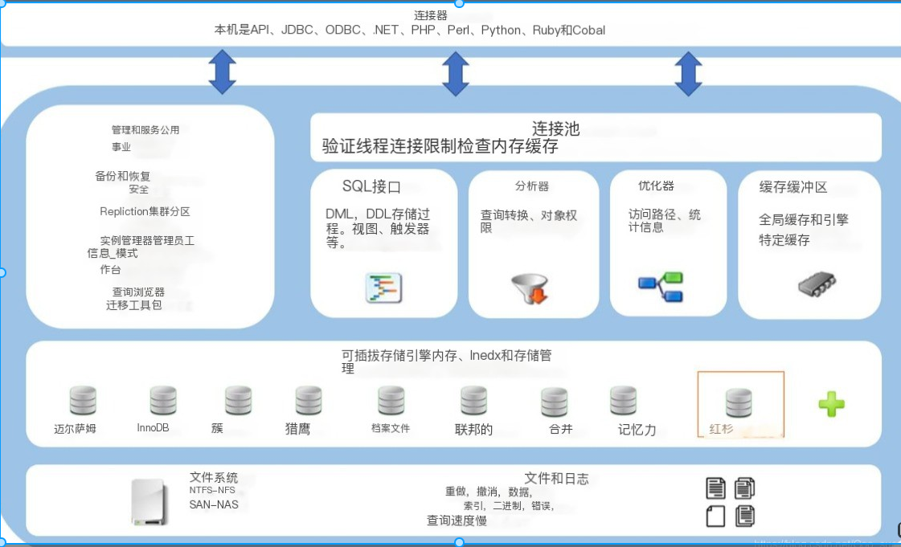


## 1.连接层

​	最上层是一些客户端和连接服务，包含本地sock通信和大多数基于客户端/服务端工具实现的类似于tcplip的通信。主要完成一些类似于连接处理、授权认证、及相关的安全方案。在该层上引入了线程池的概念，为通过认证安全接入的客户端提供线程。同样在该层上可以实现基于SSL的安全链接。服务器也会为安全接入的每个客户端验证它所具有的操作权限。

## ⒉服务层

​	第二层架构主要完成大多少的核心服务功能，如SQL接口，并完成缓存的查询，SQL的分析和优化及部分内置函数的执行。所有跨存储引擎的功能也在这一层实现，如过程、函数等。在该层，服务器会解析查询并创建相应的内部解析树，并对其完成相应的优化如确定查询表的顺序，是否利用索引等，最后生成相应的执行操作。如果是select语句，服务器还会查询内部的缓存。如果缓存空间足够大，这样在解决大量读操作的环境中能够很好的提升系统的性能。

## 3.引擎层

​	存储引擎层，存储引擎真正的负责了MySQL中数据的存储和提取，服务器通过API与存储引擎进行通信。不同的存储引擎具有的功能不同，这样我们可以根据自己的实际需要进行选取。后面介绍MylSAM和InnoDB

常用的存储引擎：MyISAM、InnoDB(最常用)

| 对比项   |                          MylSAM                           |                            InnoDB                            |
| :------- | :-------------------------------------------------------: | :----------------------------------------------------------: |
| 主外键   |                          不支持                           |                             支持                             |
| 事务     |                           不馳                            |                             支持                             |
| 行表锁   | 表锁，即使操作一条记录也会锁住整 个表，不适合高并发的操作 | 行锁,操作时只锁某一行，不对其它 行有影响， 适合高并发的操作  |
| 緩存     |                只緩存索引，不缓存真实数据                 | 不仅缓存索引还要缓存真实数据，对 内存要求较高，而且内存大小对性能 有决定性的影响 |
| 表空间   |                            小                             |                              大                              |
| 关注点   |                           性能                            |                             事务                             |
| 默认安装 |                             Y                             |                              Y                               |

## 4.存储层

​	数据存储层，主要是将数据存储在运行于裸设备的文件系统之上，并完成与存储引擎的交互。

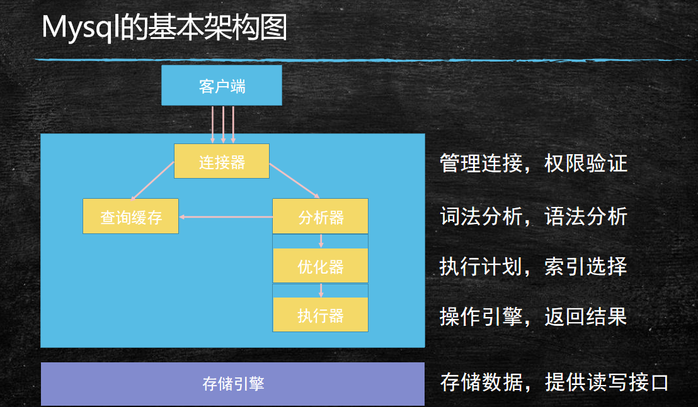


## 连接器

▪  连接器负责跟客户端建立连接，获取权限、维持和管理连接
– 用户名密码验证
– 查询权限信息，分配对应的权限
– 可以使用show processlist查看现在的连接
– 如果太长时间没有动静，  就会自动断开，通过wait_timeout控制，默认8小时

▪  连接可以分为两类：

– 长连接：推荐使用，但是要周期性的断开长连接

– 短链接：

## 查询缓存

▪  当执行查询语句的时候，会先去查询缓存中查看结果，之前执行 过的sql语句及其结果可能以key-value的形式存储在缓存中，如 果能找到则直接返回，如果找不到，就继续执行后续的阶段。
==▪  但是，不推荐使用查询缓存：==
– 1、查询缓存的失效比较频繁，只要表更新，缓存就会清空

– 2、缓存对应新更新的数据命中率比较低

## 分析器

▪  词法分析：  Mysql需要把输入的字符串进行识别每个部分代表什 么意思
– 把字符串 T 识别成 表名 T
– 把字符串 ID 识别成 列ID
▪  语法分析：

▪  根据语法规则判断这个sql语句是否满足mysql的语法，如果不符 合就会报错“You have an error in your SQL synta”

## 优化器

▪  在具体执行SQL语句之前，要先经过优化器的处理
– 当表中有多个索引的时候，决定用哪个索引
– 当sql语句需要做多表关联的时候，  决定表的连接顺序
– 等等
▪ 不同的执行方式对SQL语句的执行效率影响很大
– RBO:基于规则的优化

– CBO:基于成本的优化


# SQL性能下降原因

1. 查询语句写的烂
2. 索引失效
3. 关联查询太多 join 
4. 服务器调优及各个参数设置（缓冲、线程数）
5. ..........etc


# SQL语句机读过程

人工：

```sql
    SELECT DISTINCT
        <SELECT_list>
    FROM
        <left_table> <join_type>
    Join <right_table> on <join_condition>
    WHERE 
    	<WHERE_Condition>
    GROUP BY
    	<group_by_list>
    HAVING
    	<having_condition>
    ORDER BY
    	<order_by_condition>
	LIMIT <limit_num>
```

机器：

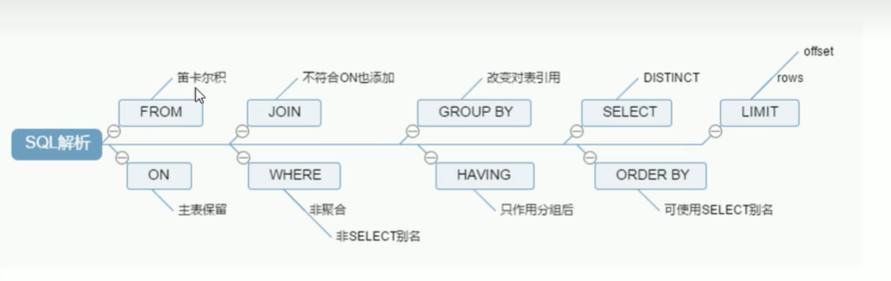


注意第一步是 from --> on --> join -->where -->group by -->having -->select -->order by -->limit

```sql
    from <left table>
 	   on <on_condition>
    <join_type> join <join_table>
    where <where_condition>
    group by <group_by_list>
    	<sum()avg()等聚合函数>
    having <having_condition>
    select <select_list>
    distinct
    order by <order_by_condition>
    limit <limit_number>
```

## on和where的区别？

​	简单地说，当有外关联表时，on主要是针对外关联表进行筛选，主表保留，当没有关联表时，二者作用相同。

例如在左外连时，首先执行on，筛选掉外连表中不符合on表达式的数据，而where的筛选是对主表的筛选。

# MySql执行顺序理解

第一步：加载from子句的前两个表计算笛卡尔积，生成虚拟表vt1；

第二步：筛选关联表符合on表达式的数据，保留主表，生成虚拟表vt2；

第三步：如果使用的是外连接，执行on的时候，会将主表中不符合on条件的数据也加载进来，做为外部行

第四步：如果from子句中的表数量大于2，则重复第一步到第三步，直至所有的表都加载完毕，更新vt3；

第五步：执行where表达式，筛选掉不符合条件的数据生成vt4；

第六步：执行group by子句。group by 子句执行过后，会对子句组合成唯一值并且对每个唯一值只包含一行，生成vt5,。一旦执行group by，后面的所有步骤只能得到vt5中的列（group by的子句包含的列）和聚合函数。

第七步：执行聚合函数，生成vt6；

第八步：执行having表达式，筛选vt6中的数据。having是唯一一个在分组后的条件筛选，生成vt7;

第九步：从vt7中筛选列，生成vt8；

第十步：执行distinct，对vt8去重，生成vt9。其实执行过group by后就没必要再去执行distinct，因为分组后，每组只会有一条数据，并且每条数据都不相同。

第十一步：对vt9进行排序，此处返回的不是一个虚拟表，而是一个游标，记录了数据的排序顺序，此处可以使用别名；

第十二步：执行limit语句，将结果返回给客户端


<div name=索引优化分析 >

# 索引

​	MySQL官方对索引的定义为：索引(Index）是帮助MySQL高效获取数据的数据结构。可以得到索引的本质:==索引是数据结构==。

<font color=red >可以简单理解为 “排好序的快速查找数据结构”</font>

一般来说索引本身也很大，不可能全部存储在内存中，因此索引往往以索引文件的形式存储的磁盘上

我们平常所说的==索引，如果没有特别指明，都是指B树(多路搜索树，并不一定是二叉的)结构组织的索引==。其中聚集索引，次要索引，复合索引，前缀索引，唯一索引默认都是使用B+树索引，统称索引。当然，除了B+树这种类型的索引之外还有哈稀索引(hash，index)等。

简单来说==最大的作用==就是 ==排序== 和 ==查询== 

## 目的

提高查询效率，可以类比字典，
如果要查“mysql”这个单询，我们肯定需要定位到m字母，然后从下往下找到y字母，再找到剩下的sql。
如果没有索引，那么你可能需要a----z，如果我想找到Java开头的单词呢?或者Oracle开头的单词呢?
是不是觉得如果没有索引，这个事情根本无法完成?

##  详解

​	在数据之外，数据库系统还维护着满足特定查找算法的数据结构，这些数据结构以某种方式引用（指向）数据，这样就可以在这些数据结构上实现高级查找算法。这种数据结构，就是索引。

下图就是一种可能的索引方式示例:

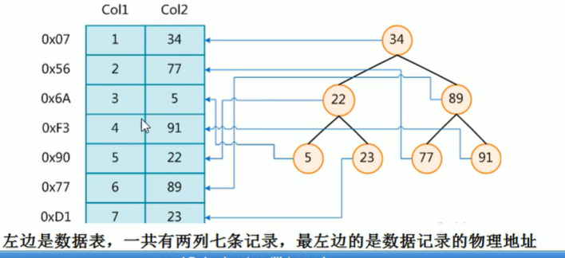


​				左边是数据表，一共有两列七条记录，最左边的是数据记录的物理地址

​	为了加快Col2的查找，可以维护一个右边所示的二叉查找树，每个节点分别包含索引键值和一个指向对应数据记录物理地址的指针，这样就可以运用二叉查找在一定的复杂度内获取到相应数据，从而快速的检索出符合条件的记录.

## 优劣

优势：

​	类似大学图书馆建书目索引，提高数据检索的效率，降低数据库的IO成本

​	 通过索引列对数据进行排序，降低数据排序的成本，降低了CPU的消耗


劣势：

​	1、实际上索引也是一张表，该表保存了主键与索引字段，并指向实体表的记录，所以索引列也是要占用空间

​	2、虽然索引大大提高了查询速度，同时却会降低更新表的速度，如对表进行INSERT、UPDATE和DELETE。因为更新表时，MySQL不仅要保存数据，还要保存一下索引文件每次更新添加了索引列的字段，
都会调整因为更新所带来的键值变化后的索引信息
​	3、索引只是提高效率的一个因素，如果你的MySQL有大数据量的表，就需要花时间研究建立最优秀的索引

## 分类

* 单值索引：即一个索引只包含单个列，一个表可以有多个单列索引
* 唯一索引：索引列的值必须唯一，但允许有空值
* 复合索引：即一个索引包含多个列

## 基本语法

* 创建：
    * CREATE	 [UNIQUE ]INDEX  	indexName   	ON   	mytable(columnname(length));
    * CREATE	 [UNIQUE ]INDEX      indexName   	ON   	mytable(columnname(length));	

* 删除 
    * DROP 	INDEX 	[indexName] 	ON 	mytable;

* 查看  
    * SHOW 		INDEX 		FROM 		table_name\G

* 使用ALTER命令

## MySQL索引结构

* BTree索引

* Hash索引
* Full-Text全文索引
* R-Tree索引


## 哪些情况下需要创建索引

1. 主键自动建立唯一索引

2. 频繁作为查询条件的字段应该创建索引

3. 查询中与其它表关联的字段，外键关系建立索引

4. 频繁更新的字段不适合创建索引or因为每次更新不单单是更新了记录还会更新索引

5. Where条件里用不到的字段不创建索引

6. 单键/组合索引的选择问题，who?(在高并发下倾向创建组合索引)

7. 查询中排序的字段，排序字段若通过索引去访问将大大提高排序速度

8. 查询中统计或者分组字段

## 哪些情况不建索引

1. 表记录太少

2. 经常增删改的表

    Why:提高了查询速度，同时却会降低更新表的速度，如对表进行INSERT、UPDATE和DELETE。因为更新表时，MySQL不仅要保存数据，还要保存一下索引文件

3. 数据重复且分布平均的表字段，因此应该只为最经常查询和最经常排序的数据列建立索引。注意，如果某个数据列包含许多重复的内容，为它建立索引就没有太大的实际效果。

# 性能分析

## MySql Query Optimizer

1. Mysql中有专门负责优化SELECT语句的优化器模块，主要功能:通过计算分析系统中收集到的统计信息，为客户端请求的Query提供他认为最优的执行计划（他认为最优的数据检索方式，但不见得是DBA认为是最优的，这部分最耗费时间)

2. 当客户端向MySQL请求一条Query，命令解析器模块完成请求分类，区别出是SELECT并转发给MySQLQuery Optimizer时，MySQL Query Optimizer首先会对整条Query进行优化，处理掉一些常量表达式的预算，直接换算成常量值。并对Query中的查询条件进行简化和转换，如去掉一些无用或显而易见的条件、结构调整等。然后分析Query 中的Hint信息(如果有），看显示Hint信息是否可以完全确定该Query 的执行计划。如果没有Hint 或Hint 信息还不足以完全确定执行计划，则会读取所涉及对象的统计信息，根据Query进行写相应的计算分析，然后再得出最后的执行计划。

## MysQL常见瓶颈

CPU:CPU在饱和的时候一般发生在数据装入内存或从磁盘上读取数据时候

IO:磁盘I/O瓶颈发生在装入数据远大于内存容量的时候

服务器硬件的性能瓶颈: top,free, iostat和vmstat来查看系统的性能状态

## Explain

### 作用

​	查看执行计划

​	使用EXPLAIN关键字可以模拟优化器执行sQL查询语句，从而知道MySQL是如何处理你的SQL语句的。分析你的查询语句或是表结构的性能瓶颈

### 作用范围

1. 表的读取顺序   __ id__

2. 数据读取操作的操作类型哪些索引可以使用  __possible key__

3. 哪些索引被实际使用表之间的引用  __key__

4. 每张表有多少行被优化器查询    __rows__
5. 表之间的引用 __table__
6. 每张表有多少行被优化     __rows__

### 使用方法

explain + SQL语句

### 执行计划包含的信息

[MySQL ：： MySQL 5.7 参考手册 ：： 8.8.2 EXPLAIN 输出格式](https://dev.mysql.com/doc/refman/5.7/en/explain-output.html#explain_select_type)

|                              列                              |   JSON名称    |            意义            |
| :----------------------------------------------------------: | :-----------: | :------------------------: |
|                              id                              |   select_id   |        标识符SELECT        |
|                 [select type](#select_type)                  |     没有      |         类型SELECT         |
|                            table                             |  table_name   |         输出行的表         |
|                          partitions                          |  partitions   |         匹配的分区         |
| [type](https://dev.mysql.com/doc/refman/5.7/en/explain-output.html#explain-join-types) |  access_type  |           联接頰           |
|                        possible keys                         | possible_keys |     可供选择的可能索引     |
|                             key                              |      key      |       实际选择的索引       |
|                           key 丄en                           |  key_length   |       所选密钥的长度       |
|                             ref                              |      ref      |       与索引相比的列       |
|                             rows                             |     rows      |     要检查的行的估计值     |
|                           filtered                           |   filtered    | 符合某条件的记录数百分比。 |
|                            Extra                             |     None      |          附加信息          |

### 字段解释

#### id

id相同，执行顺序由上至下

id不同，如果是子查询，id的序号会递增，id值越大优先级越高，越先被执行

null 为结果集的整合

总结：

* ==id如果相同，可以认为是一组，从上往下顺序执行==;
* id值越大，优先级越高，越先执行

#### select_type

[见下方附录](#select_type)

#### table

对应行正在访问哪一个表，表名或者别名，可能是临时表或者union合并结果集
		1、如果是具体的表名，则表明从实际的物理表中获取数据，当然也可以是表的别名

​		2、表名是derivedN的形式，表示使用了id为N的查询产生的衍生表

​		3、当有union result的时候，表名是union n1,n2等的形式，n1,n2表示参与union的id

#### type

[例子见下方附录](#type_example)

|  类型  | 性能 | 注释                                                         |
| :----: | :--: | ------------------------------------------------------------ |
| system |  1   | ==表只有一行记录==(等于系统表),这是const类型的特例，平时不会出现，可忽略 |
| const  |  2   | 表示该表最多有一个匹配行通过索引一次就找到了,const用于比较primary key或者<br/>unique索引。因为只匹配一行数据，所以很快如将主键置于where列表中<br/>MySQL就能将该查询转换为一个常量 |
| eq_ref |  3   | ==唯一性索引==扫描，对于==每个索引键，表中只有一条记录与之匹配==。<br/>常见于主键或唯一索引扫描 |
|  ref   |  4   | ==非唯一性索引==扫描，==返回匹配某个单独值的所有行==.<br/>本质上也是一种索引访问，它返回所有匹配某个单独值的行，然而， <br/>它可能会找到多个符合条件的行，所以他应该属于查找和扫描的混合体 |
| range  |  5   | ==只检索给定范围的行,使用一个索引来选择行==。key列显示使用了哪个索引，<br/>一般就是在你的where语句中出现了between、<、>、in等的查询  <br/>这种范围扫描索引扫描比全表扫描要好，，这样避免了index的全索引扫描<br/>因为它只需要开始于索引的某一点，而结束语另一点，不用扫描全部索引 |
| index  |  6   | 联接类型与 [`ALL`](https://dev.mysql.com/doc/refman/5.7/en/explain-output.html#jointype_all) 相同，只是扫描了索引树。这以两种方式发生：`index` <br/>Full Index Scan，index与ALL区别为index类型只遍历索引树。这通常比ALL快，<br/>因为索引文件通常比数据文件小。(也就是说虽然all和Index都是读全表，<br/>但index是从索引中读取的，而all是从硬盘中读的)<br/>全索引扫描这个比all的效率要好，主要有两种情况,一种是当前的查询时覆盖索引<br/>即我们需要的数据在索引中就可以索取，或者是使用了索引进行排序，<br/>这样就避免数据的重排序 |
|  all   |  7   | 将遍历全表以找到匹配的行<br/>全表扫描，一般情况下出现这样的sql语句而且数据量比较大的话那么就需要进行优化。 |

<font color=red>一般来说，得保证查询至少要达到 range 级别，最好能达到 ref </font>

#### possible_key

显示可能应用在这张表中的索引，一个或多个

查询涉及到的字段上若存在索引，则该索引将被列出，<font color=red>但不一定被查询实际使用</font>。

#### key

==实际使用的索引。如果为NULL，则没有使用索引==

查询中若使用了覆盖索引，则该索引仅出现在key列表中

<font color=red>引申：</font>

覆盖索引：简单来说就是你查询到的字段数目和你建立索引所对应字段相同且数量相同

#### key_len

​	表示索引中使用的字节数，可通过该列计算查询中使用的索引的长度。在不损失精确性的情况下，==长度越短越好==
​	key_len显示的值为索刳字段的最大可能长度，<font color=red>并非实际使用长度</font>，即key_len是根据表定义计算而得，不是通过表内检索出的

#### ref

​	显示索引的哪一列被使用了，如果可能的话，是一个常数。哪些列或常量被用于查找索引列上的值

#### rows

​	根据表的统计信息及索引使用情况，大致估算出找出所需记录需要读取的行数，此参数很重要，直接反应的sql找了多少数据，在完成目的的情况下越少越好

#### extra

包含不适合在其他列中显示但十分重要的额外信息

* Using filesort(<font color=red>索引本来就是排序和查找,这种等于只用了一半,而且排序本身就比较耗时</font>)

    说明mysq|会对数据使用一个外部的索引排序，而不是按照表内的索引顺序进行读取。

    MySQL中无法利用索引完成的排序操作称为“文件排序"

* Using temporay(<font color=red>严重影响性能</font>)

    使了用临时表保存中间结果,MySQL在对查询结果排序时使用临时表。

    常见于排序orderby和分组查询groupby。

* Using  index

    表示相应的select操作中使用了覆盖索引(Covering Index)，避免访问了表的数据行，效率不错!如果同时出现

    using where，表明索引被用来执行索引键值的查找;

    如果没有同时出现using where，表明索引用来读取数据而非执行查找动作。

    **==覆盖索引(Covering Index)==**

    理解方式：就是select的数据列只用从索引中就能够取得，不必读取数据行，MySQL可 以利用索引返回select列表中的字段，而不必根据索引再次读取数据文件,换句话说查询列要被所建的索引覆盖。

    ==**注意:**==
    如果要使用覆盖索引，一-定 要注意select列表中只取出需要的列，不可   **==Select   *==**
    因为如果将所有字段一起做索引会导致索引文件过大，查询性能下降。

[具体事例见附录](#extra_example)

# 索引优化

## 单表优化

准备

```sql
CREATE TABLE IF NOT EXISTS article (
id INT(10) UNSIGNED NOT NULL PRIMARY KEY auto_INCREMENT,
author_id INT(10) UNSIGNED NOT NULL,
category_id INT(10) UNSIGNED NOT NULL,
views INT(10) UNSIGNED NOT NULL,
comments INT(10) UNSIGNED NOT NULL,
title VARBINARY(255) NOT NULL,
content TEXT NOT NULL
);

INSERT INTO article ( author_id ,category_id ,views ,comments ,title,content ) VALUES
(1, 1, 1, 1,'1','1'),
(2,2, 2,2, '2','2'),
(1, 1,3,3, '3','3');


-- ----------------------------------------------
-- 01
explain select id,author_id
from article 
where category_id =1 and comments >1 
order by views desc 
limit 1\G
-- 01-1
create index idx_id_article_ccv on article(category_id,comments,views);
drop index idx_id_article_ccv on article;
create index idx_id_article_cv on article(category_id,views);
drop index idx_id_article_cv on article;
-- 查看之后发现因为 > 1 的原因导致我们索引失效 我们直接放弃这个字段从三个改为两个字段的索引，性能更优
explain select id,author_id from article where category_id =1 and comments >1  order by views desc limit 1 ;
explain select id,author_id from article where category_id =1 and comments =1  order by views desc limit 1 ;
```

## 双表优化

```sql
CREATE TABLE IF NOT EXISTS `class`(
`id` INT(10) UNSIGNED NOT NULL AUTO_INCREMENT,
`card`INT(10) UNSIGNED NOT NULL,
 PRIMARY KEY (id)
 );
create TABLE IF NOT EXISTS `book` (
`bookid` INT(10) UNSIGNED NOT NULL AUTO_INCREMENT,
`card`  INT(10) UNSIGNED NOT NULL,
 PRIMARY KEY (bookid)
);
INSERT INTO class(card) VALUES(FLOOR(1 + (rand() * 20)));
INSERT INTO class(card) VALUES(FLOOR(1 + (rand() * 20)));
INSERT INTO class(card) VALUES(FLOOR(1 + (rand() * 20)));
INSERT INTO class(card) VALUES(FLOOR(1 + (rand() * 20)));
INSERT INTO class(card) VALUES(FLOOR(1 + (rand() * 20)));
INSERT INTO class(card) VALUES(FLOOR(1 + (rand() * 20)));
INSERT INTO class(card) VALUES(FLOOR(1 + (rand() * 20)));
INSERT INTO class(card) VALUES(FLOOR(1 + (rand() * 20)));
INSERT INTO book(card) VALUES(FLOOR(1 + (rand() * 20)));
INSERT INTO book(card) VALUES(FLOOR(1 + (rand() * 20)));
INSERT INTO book(card) VALUES(FLOOR(1 + (rand() * 20)));
INSERT INTO book(card) VALUES(FLOOR(1 + (rand() * 20)));
INSERT INTO book(card) VALUES(FLOOR(1 + (rand() * 20)));
INSERT INTO book(card) VALUES(FLOOR(1 + (rand() * 20)));
INSERT INTO book(card) VALUES(FLOOR(1 + (rand() * 20)));
INSERT INTO book(card) VALUES(FLOOR(1 + (rand() * 20)));
-- ----------------------------------------------
select * from book;
select * from class;

-- type=all
show index from book;
show index from class;

create index idx_card on  book(card);
create index idx_card on  class(card);
drop index idx_card on  book;
drop index idx_card on  class;

explain select * from  book left join class on class.card=book.card;

explain select * from  class left join book on class.card=book.card;
```

__左连接__

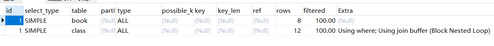


结果显示，在没有用索引的状况下我们的索引类型均为ALL。

因为是==左连接==的缘故我们的==左表是根据右表搜索行==的，==左边一定都有==,所以==右边是我们的关键点==，一定需要建立索引。

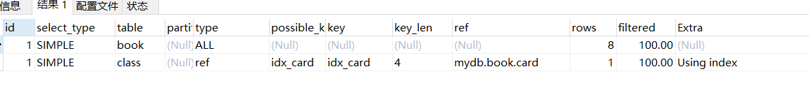


可以看到第二行的type变为了ref，rows 也变成了优化比较明显。这是由左连接特性决定的。LEFT  JOIN条件用于确定如何从右表搜索行。所以右边是我们的关键点,-定需要建立索引。

__同理可证右连接__
因为RIGHTJOIN条件用于确定如何从左表搜索行，右边一定都有,所以左边是我们的关键点，一定需要建立索引。

## 三表优化

```sql
CREATE TABLE IF NOT EXISTS phone(
	phoneid INT(10) UNSIGNED NOT null AUTO_INCREMENT,
	card INT(10) UNSIGNED NOT NULL,
	PRIMARY KEY (phoneid)
) ENGINE = INNODB;
INSERT INTO phone(card) VALUES(FLOOR(1 + (RAND() * 20)));
INSERT INTO phone(card) VALUES(FLOOR(1 + (RAND() * 20)));
INSERT INTO phone(card) VALUES(FLOOR(1 + (RAND() * 20)));
INSERT INTO phone(card) VALUES(FLOOR(1 + (RAND() * 20)));
INSERT INTO phone(card) VALUES(FLOOR(1 + (RAND() * 20)));
INSERT INTO phone(card) VALUES(FLOOR(1 + (RAND() * 20)));
INSERT INTO phone(card) VALUES(FLOOR(1 + (RAND() * 20)));
INSERT INTO phone(card) VALUES(FLOOR(1 + (RAND() * 20)));
INSERT INTO phone(card) VALUES(FLOOR(1 + (RAND() * 20)));
INSERT INTO phone(card) VALUES(FLOOR(1 + (RAND() * 20)));
INSERT INTO phone(card) VALUES(FLOOR(1 + (RAND() * 20)));
INSERT INTO phone(card) VALUES(FLOOR(1 + (RAND() * 20)));
INSERT INTO phone(card) VALUES(FLOOR(1 + (RAND() * 20)));
-- --------===============================================
select * from phone;

alter table class add index X (card); 
alter table phone add index Y (card); 
drop index X on class;
drop index Y on phone;

explain select * from class left join book on class.card = book.card join phone on book.card = phone.card;

show index from phone;
show index from book;
show index from class;
```

初始结果

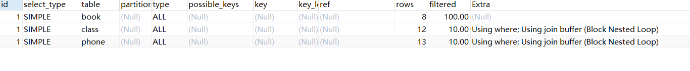


优化后

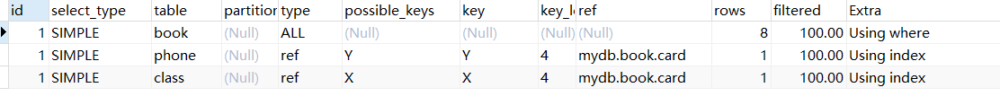


后2行的type都是ref且总rows优化很好效果不错。

因此索引最好设置在需要经常查询的字段中

解释：不论是class还是phone都是需要book.card来确定而且在第二个join中还需要全部扫描book所以尽管他是一个与class的左连接，理论上要给book建立一个索引，但是因为phone的关系我们倒不如给phone和class做索引，减少可以减少的，book反正要全表无所谓。

总结就是==小结果集推动大结果集==就可以起到优化作用

## [结论]

Join语句的优化

尽可能减少Join语句中的NestedL oop的循环总次数;“ 永远用小结果集驱动大的结果集”。

优先优化Nested L oop的内层循环;

保证Join语句中被驱动表上Join条件 字段已经被索引;

当无法保证被驱动表的Join条件字段被索引且内存资源充足的前提下，不要太吝惜JoinBuffer的设置;


# 索引失效

1. 全值匹配我最爱

> ​	每个索引字段都存在

2. 最佳左前缀法则(==where条件==)

>​	如果索引了多列(==3个及以上==)，要遵守最左前缀法则。指的是查询==从索引的最左前列开始==并且==不跳过索引中的列==。
>​	简单来说就是==每个字段的带头大哥不能丢，中间兄弟不能断== 
>
>```sql
>drop table if exists tbl_user;
>create table if not exists tbl_user(
>	id int(10) primary key auto_increment,
>    name varchar(20) not null,
>    age int(10),
>		sex int(2) check( sex in (1,2)),
>    email varchar(20)
>);
>-- 添加测试数据
>delete from  tbl_user;
>insert into tbl_user(name,age,sex,email) values 
> ('aa11aa',12,1,'123@qq.com'),('aa22aa',22,2,'456@qq.com'),('aa33aa',32,2,'789@qq.com');
> ('aa11aa',22,1,'123@qq.com'),('aa22aa',22,1,'456@qq.com'),('aa33aa',32,1,'789@qq.com');
>-- 走索引且key_len越来越长
>explain select * from tbl_user where name = 'aa11aa';
>explain select * from tbl_user where name = 'aa11aa' and age = 11;
>explain select * from tbl_user where name = 'aa11aa' and age = 11 and sex = 1;
>
>-- 走索引
>explain select * from tbl_user where name = 'aa11aa'  and sex = 1;
>-- 不走索引带头大哥没了
>explain select * from tbl_user where age = 11 and sex = 1;
>```

3. 不在索引列上做任何操作(计算、函数(自动or手动)类型转换)，会导致索引失效而转向全表扫描 

4. 存储引擎 ==不能使用索引中范围条件==<font color=red>右边的列</font> (==自己是最后一个==)

    ```sql
    -- 范围条件
    alter table tbl_user add index idx_tbl_user_age_sex_email (age,sex,email);
    -- 全部走了索引
    explain select age from tbl_user ;
    explain select age,sex from tbl_user ;
    explain select age,sex,email from tbl_user ;
    -- 部分走了索引
    explain select age from tbl_user where sex > 1;
    explain select age,sex from tbl_user where sex > 1;
    explain select age,sex,email from tbl_user where sex > 1;
    ```

5. ==尽量使用覆盖索引==(只访问索引的查询(索引列和查询列一致))， 减少 select  *

6. mysql在==使用不等于(!=或者<> )==的时候==无法使用索引==会导致==全表扫描团==

7. is null ,is not null也无法使用索引

8. like==以通配符开头(=='%abc...)mysq|==索引失效==会变成全表扫描的操作。(==放右边可以==)

    **问题:解决like'%字符串%'时索引不被使用的方法??**

    ```sql
    -- 建立索引
    alter table tbl_user add index idx_tbl_user_name_age (name,age);
    
    -- 测试
    select * from tbl_user;
    -- 走索引
    explain select id from tbl_user where name like '%aa%';
    explain select name from tbl_user where name like '%aa%';
    explain select age from tbl_user where name like '%aa%';
    -- 走索引
    explain select id,name from tbl_user where name like '%aa%';
    explain select id,name,age from tbl_user where name like '%aa%';
    explain select name,age from tbl_user where name like '%aa%';
    -- 不走索引
    explain select * from tbl_user where name like '%aa%';
    explain select id,name,email from tbl_user where name like '%aa%';
    explain select id,name,age,email from tbl_user where name like '%aa%';
    ```

9. ==字符串不加单引号索引失效==

10. 少用or，用它来连接时会索引失效

## 面试题

```sql
-- indexc1234
select * from test03 where c1='a1' and c2='a2' and c5='a5' order by c3,c2;
select * from test03 where c1='a1' and c5='a5' order by c3,c2;
```

___这两种SQL的区别在哪？___

> 都走了索引，但是在第2条SQL会产生文件的内排序，为什么呢？这是因为本来应该是自动的顺序排列，即c1,c2,c3.....默认，但是我们写了 order by 所以产生了内排。但是同样第1条SQL为什么没有呢？因为我们在where 条件中使用了他让他固定成了一个常量 constant ，即 c3虽然一直在动，但是c2已经固定没有了排序的过程所以不会产生内排的步骤
>
> ```sql
> drop table if exists t1;
> create table t1(
> 	id int(10) primary key auto_increment,
> 	c1 int(10),
> 	c2 int(10),
> 	c3 int(10),
> 	c4 int(10),
> 	c5 int(10)
> );
> insert into t1(c1,c2,c3,c4,c5) values
> (1,1,1,1,1)
> (2,2,2,2,2),
> (3,3,3,3,3),
> (4,4,4,4,4),
> (5,5,5,5,5);
> 
> alter table t1 add index idx_c1234 (c1,c2,c3,c4); 
> explain select * from t1 where c1 =1 and c2 = 1 and c4 = 1 ORDER BY c3,c2 desc;
> explain select * from t1 where c1 =1 and c4 = 1 ORDER BY c3,c2 ;  
> ```

结果：

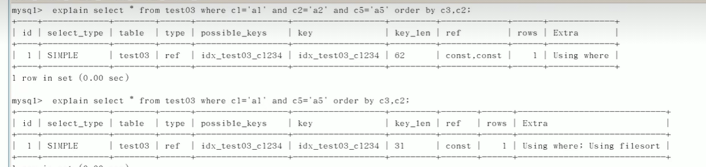


___同理论证gourp by___

* 分组之前比排序，可能会产生临时表的产生

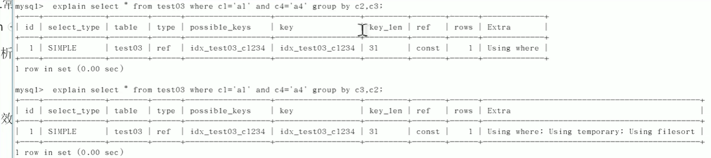


## 建议

* 对于单键索引，尽量选择针对当前query过滤性更好的索引

* 在选择组合索引的时候，当前Query中过滤性最好的字段在索引字段顺序中，位置越靠前越好。

* 在选择组合索引的时候，尽量选择可以能够包含当前query中的where字句中更多字段的索引

* 尽可能通过分析统计信息和调整query的写法来达到选择合适索引的目的

## 口诀

全值匹配我最爱	，最左前缀要遵守;

帶头大哥不能死	，中间兄弟不能断;

索引列上少计算	，范围之后全失效;

LIKE百分写最右	，覆盖索引不写星;

不等空值还有or     ，索引失效要少用;

VAR的引号不可丢，SQL高级也不难 !


<div name=查询截取分析 >

# 查询截取分析

## 内容：

​	查询优化

​	慢查询日志

​	批量数据脚本

​	show profile

​	全局查询日志


## 工作一般流程(分析过程)

1. 观察，至少跑1天，看看生产的慢SQL情况。
2. 开启慢查询日志，设置阙值，比如超过5秒钟的就是慢SQL，并将它抓取出来。
3. explain+慢SQL分析
4. show profile
5. 运维经理or DBA，进行SQL数据库服务器的参数调优。。

==总结==

1. 慢查询的开启并捕获

2. explain+慢SQL分析

3. show profile查询SQL在Mysql服务器里面的执行细节和生命周期情况

4. SQL数据库服务器的参数调优。

## 查询优化

### 永远小表驱动大表,即小的数据集驱动大的数据集

小表驱动大表，类似嵌套循环 Nested Loop

#### Case 1：

```java
for(int i =5;;){
    for(int j = 1000;;){
        
    }
}
for(int i =1000;;){
    for(int j = 5;;){
        
    }
}
```

两个简单的 for循环，但是在SQL中我们就应该选择 第一个循环而不是第二个

- 小的循环在外层,表连接需要5次
- 大的循环在外层,表连接需要1000次,浪费数据库资源

**总结:** 小表驱动大表的主要目的是通过减少表连接创建的次数,加快查询速度.

#### Case 2

```sql
select * from A where  id in (select id from B)
-- 等价于
for select id from B
for select * from A where A.id = B.id
for（B){
	for(A){
		A.id=B.id
	}
}
```

当B表的数据集小于A表的数据集时，用in优于exists。

```sql
select * from A where exists (select 1 from B where B.id = A.id)
-- 等价于
for select* from A
for select * from B where B.id = A.id
for（A){
	for(B){
		A.id=B.id
	}
}
```

当A表的数据集小于B表的数据集时，用exists优于in。

注意:A表与B表的ID字段应建立索引。


* EXISTS

> 语法：SELECT .….. FROM table WHERE EXISTS (subquery)

​	该语法可以理解为。==将主查询的数据，放到子查询中做条件验证，根据验证结果（TRUE或FALSE)来决定主查询的数据结果是否得以保留==。 

* 提示
    1. ==EXSTS (stbuey)只返回TRUE或FALSE，因此子查询中的 SELECT *也可以是 SELECT  1或是 SELECT ‘X’。官方说法是：实际执行时会忽略SELECT清单，因此没有区别==
    2. EXSTS子查询的实际执行过程可能经过了优化而不是我们理解上的逐条对比，如果担忧效率问题，可进行实际检验以确定是否有效率问题。
    3. EXISTS子查询往往也可以用条件表达式、其他子查询或者JOIN来替代，==何种最优需要具体问题具体分析==


### 为排序使用索引OrdeBy优化

MySQL支持==二种方式的排序==，==FileSort==和==Index==，==Index效率高。==

它指MySQL扫描索引本身完成排序。FileSort方式效率较低。

<font color=red>ORDER BY满足两情况，会使用Index方式排序：</font>

* ORDER BY语句使用索引最左前列

* 使用where 字句与Order By字句条件列组合满足==索引最左前列==

建议：

​	尽量使用Index方式排序，避免使用FileSort方式排序尽可能在索引列上完成排序操作，遵照索引建的最佳左前缀


<font color=red>如果不在索引列上，filesort有两种算法：mysql就要启动双路排序和单路排序</font>

==*双路排序*==

> MySQL 4.1之前是使用双路排序,字面意思就是两次扫描磁盘，最终得到数据，
> 读取行指针和orderby列，对他们进行排序，然后扫描已经排序好的列表，按照列表中的值重新从列表中读取对应的数据输出
>
> 
>
> 从磁盘取排序字段，在buffer进行排序，再从磁盘取其他字段。
>
> 
>
> 取一批数据， 要对磁盘进行了两次扫描，众所周知，I\O是很耗时的，所以在mysql4.1之后，出现了第二种改进的算法，就是单路排序

==*单路排序*==

> 从磁盘读取查询需要的所有列，按照order by列在buffer对它们进行排序，然后扫描排序后的列表进行输出，它的效率更快一些，避免了第二次读取数据。并且把随机IO变成了顺序I0,但是它会使用更多的空间，因为它把每一行都保存在内存中了。

结论：

​	**由于单路是后出的，总体而言好过双路!**

引申出来的问题：

> ​	在sort_buffer中，方法B比方法A要多占用很多空间，因为方法B是把所有字段都取出,所以有可能取出的数据的总大小超出了sort_buffer的容量，导致每次只能取sort_buffer容量大小的数据，进行排序（创建tmp文件，多路合并〉，排完再取取 sort_buffer 容量大小，再排……从而多次I/O。本来想省一次I/O操作，反而导致了大量的I/O操作，反而得不偿失。

优化策略

* 增大sort_buffer_size参数的设置
* 增大max_length_for_sort_data参数的设置


<font color=red>提高Order By的速度</font>

1. Order by时select是一个大忌只Query需要的字段，这点非常重要。在这里的影响是:
    1. 当Query的字段共小总和小于max_length_for_sort_data而且排序字段不是TEXTIBLOB类型时，会用改进后的算法——单路排序，否则用老算法——多路排序。
    2. 两种算法的数据都有可能超出sort_buffer的容量，超出之后，会创建tmp文件进行合并排序，导致多次IO，但是用单路排序算法的风险会更大一些,所以要提高sort_buffer_size.

2. 尝试提高sort_buffer_size
    不管用哪种算法，提高这个参数都会提高效率，当然，要根据系统的能力去提高，因为这个参数是针对每个进程的

3. 尝试提高max_length_for_sort_data
    提高这个参数，会增加用改进算法的概率。但是如果设的太高，数据总容量超出sort_buffer_size的概率就增大，明显症状是高的磁盘I/O活动和低的处理器使用率.

### Group By

 group by实质是==先排序==后进行==分组==，==遵照索引建的最佳左前缀==

当无法使用索引列，增大max_length_for_sort_data参数的设置+增大sort_buffer_size参数的设置

where高于having，能写在where限定的条件就不要去having限定了。

其余均和Order by相同


## 慢查询日志

* MySQL的慢查询日志是MySQL提供的一种日志记录，它用来记录在MySQL中响应时间超过阀值的语句, 具体指运行时间超过long_query_time值的SQL，则会被记录到慢查询日志中。

* 具体指运行时间超过long_query_time值的SQL，则会被记录到慢查询日志中。long_query_time的默认值为10，意思是运行10秒以上的语句。

* 由他来查看哪些SQL超出了我们的最大忍耐时间值，比如一条sql执行超过5秒钟，我们就算慢SQL，希望能收集超过5秒的sql，结合之前explain进行全面分析。

### 操作说明

<font color=red>默认情况下，MySQL数据库没有开启慢查询日志</font>，需要我们手动来设置这个参数。

<font color=red>当然，如果不是调优需要的话，一般不建议启动该参数</font>，因为开启慢查询日志会或多或少带来一定的性能影响。慢查询日志支持将日志记录写入文件

### 查看是否开启及开启

默认：

```sql
show variables like '%slow_query_log%'; -- OFF关闭
```

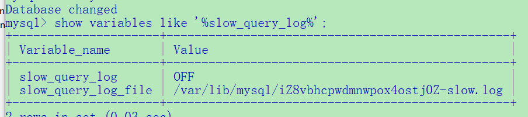


开启

开启了慢查询日志只对当前数据库生效，如果MySQL重启后则会失效。

```sql
set global slow_query_log=1;
```

如果要永久生效，就必须修改配置文件my.cnf（其它系统变量也是如此)

修改my.cnf文件，[mysqld]下增加或修改参数
slow_query_log和slow_query_log_file后，然后重启MySQL服务器。也即将如下两行配置进my.cnf文件

```sh
slow_query_log =1
slow_query_log_file=/var/lib/mysqlslow-slow.log
```


关于慢查询的参数slow_query_log_file，它指定慢查询日志文件的存放路径，<font color=red>系统默认会给一个缺省的文件host_name-slow.log</font>(如果没有指定参数slow_query_log_file的话)

### 那么开启了慢查询日志后，什么样的SQL才会记录到慢查询日志里面呢?

这个是由参数long_query_time控制，默认情况下long_query_time的值为10秒，命令:

```sql
SHoW VARIABLES LIKE 'long_query_time%;
```

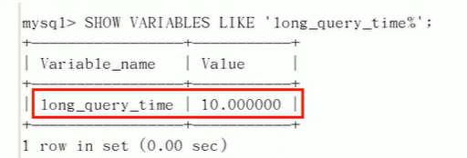


可以使用命令修改，也可以在my.cnf参数里面修改。

假如运行时间正好等于long_query_time的情况，并不会被记录下来。也就是说，在mysql源码里是<font color=red>判断大于long_query_time，而非大于等于</font>。

### Case

1. 查看当前多少秒算慢 

```sql
SHOW VARIABLES LIKE 'long_query_time%';
```

2. 设置慢的阙值时间

```sql
set global long_query_time=3;
```

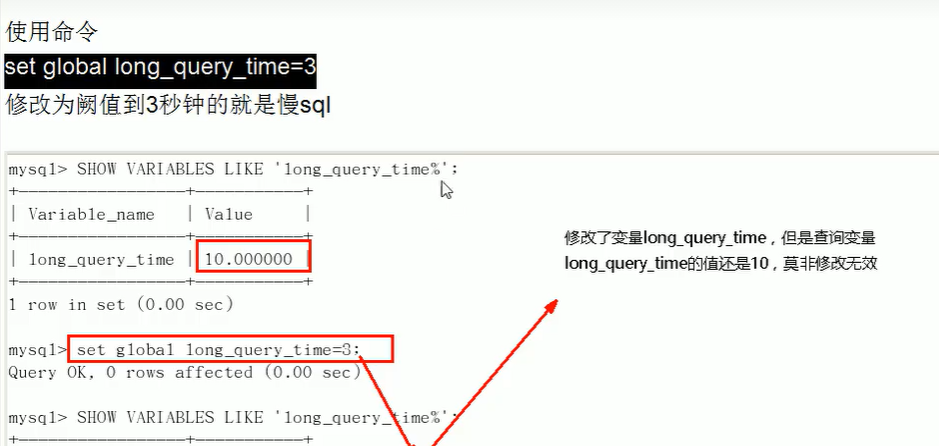


3. 为什么设置后看不出变化?

需要==重新连接或新开一个会话==才能看到修改值

```sql
SHow VARIABLES LIKE 'long _query_time%';

show global variables like 'long_query_time';
```

4. 记录慢SQL并后续分析R

```sql
select sleep(4);-- 睡4s
-- 查看日志
```

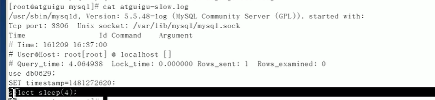


5. 查询当前系统中有多少条慢查询记录冒R

```sql
show global status like '%Slow_queries%';
```

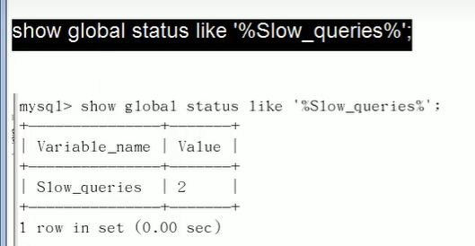


### 配置版

【mysqld】下配置:

```sh
# 开启查询日志
slow_query_log=1;
# 日志地址
slow_query_log_file=/var/lib/mysql/atguigu-slow.log
# 最大的查询时间，超过就算是慢查询
long_query_time=3;
# 日志输出
log_output=FILE
```


### 日志分析工具—mysqldumpslow

​	在生产环境中，如果要手工分析日志，查找、分析SQL，显然是个体力活，MySQL提供了日志分析工具mysqldumpslow 


查看mysqldumpslow的帮助信息

```sh
mysqldumpslow --help
```

| 常用参数 |                   注解                    |
| :------: | :---------------------------------------: |
|    s     |          是表示按照何种方式排序           |
|    c     |                 访问次数                  |
|    l     |                 锁定时间                  |
|    r     |                 返回记录                  |
|    t     |                 查询时间                  |
|    al    |               平均锁定时间                |
|    ar    |              平均返回记录数               |
|    at    |               平均查询时间                |
|    t     |         即为返回前面多少条的数据;         |
|    g     | 后边搭配一个正则匹配模式，大小写不敏感的; |

```sh
得到返回记录集最多的10个SQL
mysqldumpslow -s r -t 10 /var/lib/mysql/atguigu-slow.log

得到访问次数最多的10个SQL
mysqldumpslow -s c -t 10 /var/lib/mysql/atguigu-slow.log

得到按照时间排序的前10条里面含有左连接的查询语句
mysqldumpslow -s t -t 10 -g "left join"lar/lib/mysql/atguigu-slow.log

另外建议在使用这些命令时结合|和more使用，否则有可能出现爆屏情况
mysqldumpslow -s r -t 10 /ar/lib/mysql/atguigu-slow.log | more
```


## 批量数据脚本

1.建表(dept,emp)

2.设置参数log_bin_trust_function_creatorst

```sql
-- 创建函数，假如报错:This function has none of DETERMINISTIC

-- 由于开启过慢查询日志，因为我们开启了bin-log,我们就必须为我们的function指定一个参数。
show variables like 'log_bin_trust_function_creators';
set global log_bin_trust_function_creators=1;
-- 这样添加了参数以后，如果mysqld重启，上述参数又会消失，永久方法:
I
windows下my.ini[mysqld]加上log_bin_trust_function_creators=1
linux下letc/my.cnf 下my.cnf[mysqld]加上log_bin_trust_function_creators=1
```

3.创建函数,保证每条数据都不同

随机产生字符串

随机产生部门编号

```sql
DELIMITER $$
CREATE FUNCTION rand_string(n lNT) RETURNS VARCHAR(255）
BEGIN
    DECLARE chars_str VARCHAR(100) DEFAULT 'abcdefghijlklmnoparstuvwxyABCDEFJHIJKLMNOPQRSTUWWXYZ';
    DECLARE return_str VARCHAR(255) DEFAULT '' ;
    DECLARE i INT DEFAULT 0;
    WHILE i < n DO
        SET return_str =CONCAT(return_str,SUBSTRING(chars_str,FLOOR(1+RAND()*52),1);
        SET i =i+ 1;
    END WHILE;
    RETURN return_str;
END
$$
DFLIMITER ;
                               
delimiter $$
CREATE FUNCTLON rand_num( )RETURNS INT(5)
BEGIN
    DECLARE i int default 0;
    SET i = FLOOR(100+RAND()*10);
    RETURN i;
END 
delimiter $$
DFLIMITER ;
```

4.创建存储过程

```sql
创建往emp表中插入数据的存储过程
DELIMITER $$
CREATE PROCEDURE insert_emp(IN START INT(10),IN max_num INT(10))
BEGIN
    DECLARE i INT DEFAULT 0;
    #set autocomnit = 0 把autocommit设置成0
    SET autocommit =0;
    REPEAT
    SET i=i+ 1;
    INSERT INTo emp(empno，ename , job ,mgr ,hiredate ,sal ,comm ,deptno ) values((SEAR+i) ,rand_string(6), 'sAESLsy',0001,now(),1000,0,10);
    UNTIL i = max_num;
    END REPEAT;
    COMMIT;
END 
$$
DFLIMITER ;

创建往dept表中插入数据的存储过程
DFLIMITER $$
CREATE PROCEDURE insert_dept(IN START INT(10),IN max_num lNT(10))
BEGIN
    DECLARE i lNT DEFAULT 0;
    SET autocommit = 0;
    REPEAT
    SETi= i+1;
    INSERT INTO dept (deptno ,dname,loc ) VALUES((START+i) ,rand_string(10),rand_string(8);
    UNTIL i = max_num;
    END REPEAT;COMMIT;
END $$
DFLIMITER ;
```

5.调用存储过程

```sql
call insert_emp(10001,50000);
call inser_dept(100,10);
```


## Show profile

是什么:是mysql提供可以用来分析当前会话中语句执行的资源消耗情况。可以用于SQL的调优的测量

官网: http://dev.mysql.com/doc/refman/5.5/en/show-profile.html

默认情况下，参数处于关闭状态，并保存最近15次的运行结果


分析步骤

1.是否支持，看看当前的mysql版本是否支持

```sql
show variables like 'profiling';
-- 默认是关闭，使用前需要开启
```

2.开启功能，默认是关闭，使用前需要开启

```sql
set profiling=on;
show variables like 'profiling';
```

3.运行SQL

```sql
select * from emp;

select * from emp e join dept d on e.deptno =d.deptno;

select * from emp group by id%10 limit 1500;

select * from emp group by id%20 order by 5;
```

4.查看结果，show profiles;

```sql
show profiles;
```

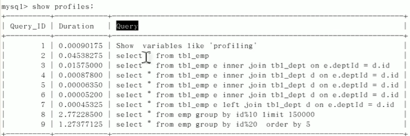


5.诊断SQL， 

```sql
show profile cpu,block io for query 3;-- 最后数字是上一步前面的SQL的Id;
```

|     常用参数     | 注释                                                         |
| :--------------: | ------------------------------------------------------------ |
|       ALL        | 显示所有的开销信息                                           |
|     BLOCK IO     | 显示块IO相关开销                                             |
| CONTEXT SWITCHES | 上下文切换相关开销                                           |
|       CPU        | 显示CPU相关开销信息                                          |
|       IPC        | 显示发送和接收相关开销信息                                   |
|      MEMORY      | 显示内存相关开销信息                                         |
|   PAGE FAULTS    | 显示页面错误相关开销信息\|                                   |
|      SOURCE      | 显示和Source_function，Source_file，Source_line相关的开销信息 |
|      SWAPS       | 显示交换次数相关开销的信息                                   |

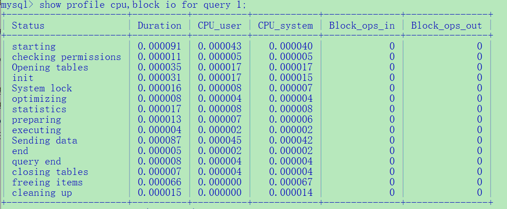


6.日常开发需要注意的结论

* converting HEAP to MyISAM     查询结果太大，内存都不够用了往磁盘上搬了。

* Creating tmp table       创建临时表
    * 拷贝数据到临时表
    * 用完再删除

* Copying to tmp table on disk      把内存中临时表复制到磁盘，危险!! !

* locked    (死锁)


## 全局查询日志

<font color=red>**永远不要在生产环境开启这个功能**。</font>

配置启用

```sh
#在mysql的my.cnf中，设置如下:
#开启
general_log=1
#记录日志文件的路径
general_log_file=/path/logfile
#输出格式
log_output=FILE
```

编码启用

```sql
-- 命令
set global general_log=1;
set global log_output='TABLE';

-- 此后，你所编写的sql语句，将会记录到mysql库里的general_log表，可以用下面的命令查看
select * from mysql.general_lpg;
```


<div name=MySQL的锁机制>

# MySQL锁机制

概述：锁是计算机协调多个进程或线程并发访问某一资源的机制。在数据库中，除传统的计算资源〈如CPU、RAM、V/O等）的争用以外，数据也是一种供许多用户共享的资源。如何保证数据并发访问的一致性、有效性是所有数据库必须解决的一个问题，锁冲突也是影响数据库并发访问性能的一个重要因素。从这个角度来说，锁对数据库而言显得尤其重要，也更加复杂。[


打个比方，我们到淘宝上买一件商品，商品只有一件库存，这个时候如果还有另一个人买，那么如何解决是你买到还是另一个人买到的问题?


这里肯定要用到事务，我们先从库存表中取出物品数量，然后插入订单，付款后插入付款表信息，然后更新商品数量。在这个过程中，使用锁可以对有限的资源进行保护，解决隔离和并发的矛盾。


## 锁的分类

* 从对数据操作的粒度分
    * 表锁(偏读，解决幻读(一个事务中对数据添加、删除，并且多次查询，每次结果不都相同))
    * 行锁(偏写，解决重复读(一个事务中对一条数据多次修改，并且多次查询，每次结果不都相同))

* 从对数据操作的类型（读\写)分
    * ==读锁(共享锁)==：针对同一份数据，多个读操作可以同时进行而不会互相影响。
    * ==写锁(排它锁)==：当前写操作没有完成前，它会阻断其他写锁和读锁。


## 读锁(案例介绍)

准备：

```sql
create table mylock(
id int not null primary key auto_increment,
name varchar(20)
)engine myisam;

insert into mylock(name) values('a');
insert into mylock(name) values('b');
insert into mylock(name) values('c');
insert into mylock(name) values('d');
insert into mylock(name) values('e');
select * from mylock;

CREATE TABLE `book` ( 
    `bookid` int(10) unsigned NOT NULL AUTO_INCREMENT,
    `card` int(10) unsigned NOT NULL,
    PRIMARY KEY (`bookid`),
    KEY `idx_card` (`card`)
) ENGINE=InnoDB AUTO_INCREMENT=9 DEFAULT CHARSET=utf8;
insert into book(card) values(1);
insert into book(card) values(2);
insert into book(card) values(3);
insert into book(card) values(4);
insert into book(card) values(5);
```


```sql
-- 手动添加表锁
-- 语法：lock table Table_1_Name  read/write,Table_2_name read/write,..;
lock table mylock read ;

-- 查看锁
show open tables;

-- 释放锁
unlock tables;
	
select * from mylock;	
-- 读锁没有释放之前这个回话只能读取这个读锁表，其他回话可以查询或者更新未锁定的表
-- 其他回话插入或者更新表的时候会进入阻塞状态，直至锁的释放
update mylock set name = 'aa' where id =1;
select * from book;
```


## 写锁(案例介绍)

Session 1(产生锁)

```sql 
lock table mylock write;

select * from mylock; --ok

update mylock set name ='aa' where  id =1; -- ok

select * from book;
/*
ERROR 1064 (42000): You have an error in your SQL syntax; check the manual that corresponds to your MySQL server version for the right syntax to use near 'uplock tables' at line 1
*/

unlock tables; 
```


Session 2

```sql
 select * from mylock; -- block 阻塞住了 ,直至锁的释放才看到了
```


## 读写结论

MyISAM在执行查询语句〈SELECT)前，会自动给涉及的所有表加读锁，在执行增删改操作前，会自动给涉及的表加写锁。

MySQL的表级锁有两种模式:

​	表共享读锁(Table Read Lock)

​	表独享读锁(Table Write Lock)

| lock_type | 是否共享 | 读锁 | 写锁 |
| :-------: | :------: | :--: | :--: |
|   读锁    |    是    |  是  |  否  |
|   写锁    |    是    |  否  |  否  |

==结论:==

结合上表，所以对MyISAM表进行操作，会有以下情况:

1、对MyISAM表的读操作〈加读锁)，不会阻塞其他进程对同一表的读请求，但会阻塞对同一表的写请求。只有当读锁释放后，才会执行其它进程的写操作。

2、对MyISAM表的写操作（加写锁)，会阻塞其他进程对同一表的读和写操作，只有当写锁释放后，才会执行其它进程的读写操作。

<font color=red>**简而言之，就是读锁会阻塞写，但是不会堵塞读。而写锁则会把读和写都堵塞**。</font>

## 表锁(案例介绍)

【如何分析表锁定】
可以通过检查table_locks_waited和table_locks_immedlate状态变量来分析系统上的表锁定:

```sql
show status like 'table%';
```

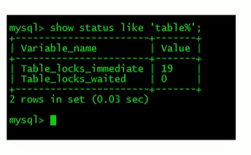


这里有两个状态变量记录MySQL内部表级锁定的情况，两个变量说明如下:

<font color=blue>T**able_locks_immediate:产生表级锁定的次数，表示可以立即获取锁的查询次数，每立即获取锁值加1**</font>

<font color=blue>**Table_locks_waited:出现表级锁定争用而发生等待的次数(不能立即获取锁的次数，每等待一次锁值加1),**
**此值高则说明存在着较严重的表级锁争用情况;**</font>

<font color=red>**此外，<u>___Myisam___</u>的读写锁调度是写优先，这也是<u>___myisam___</u>不适合做写为主表的引擎。因为写锁后，其他线程不能做任何操作，大量的更新会使查询很难得到锁，从而造成永远阻塞**</font>


## 行锁(案例介绍)

### 特点

> ​	偏向InnoDB存储引擎，开销大，加锁慢;会出现死锁;锁定粒度最小，发生锁冲突的概率最低,并发度也最高。
>
> ​	InnoDB与MyISAM的最大不同有两点:
>
> ​	一、是支持事务（TRANSACTION);
>
> ​	二、是采用了行级锁

### 事务知识复习

#### 四大特性

事务是由一组SQL语句组成的逻辑处理单元，事务具有以下4个属性，通常简称为事务的ACID属性。

* <font color=red>原子性（Atomicity)</font>﹔事务是一个原子操作单元，其对数据的修改，要么全都执行，要么全都不执行。
* <font color=red>一致性（Consistent)</font>:在事务开始和完成时，数据都必须保持一致状态。这意味着所有相关的数据规则都必须应用于事务的修改，以保持数据的完整性;事务结束时，所有的内部数据结构（如B树索引或双向链表）也都必须是正确的。
* <font color=red>隔离性（lsolation)</font>:数据库系统提供一定的隔离机制，保证事务在不受外部并发操作影响的“独立”环境执行。这意味着事务处理过程中的中间状态对外部是不可见的，反之亦然。
* <font color=red>持久性（Durable)</font>:事务完成之后，它对于数据的修改是永久性的，即使出现系统故障也能够保持。


#### 并发带来的问题

更新丢失(Lost Update)

> 当两个或多个事务选择同一行，然后基于最初选定的值更新该行时，由于每个事务都不知道其他事务的存在，就会发生丢失更新问题――最后的更新覆盖了由其他事务所做的更新。
> 例如，两个程序员修改同一java文件。每程序员独立地更改其副本，然后保存更改后的副本，这样就覆盖了原始文档。最后保存其更改副本的编辑人员覆盖前一个程序员所做的更改。
> 如果在一个程序员完成并提交事务之前，另一个程序员不能访问同一文件，则可避免此问题。

脏读(Dirty Reads)

> 简单来说就是 读了未提交的，此时事务级别在最低，改善方法就是提高级别即可

不可重复读(Non-Repeatable Reads)

> 简单来说就是在一个事务中多次读取某些数据，数据的条数没有变，但是数据却变了。
>
> 重在修改

幻读(Phantom Reads)

> 简单来说就是在一个事务中多次读取某些数据，数据的条数变了
>
> 重在添加、删除


#### 事务的隔离级别

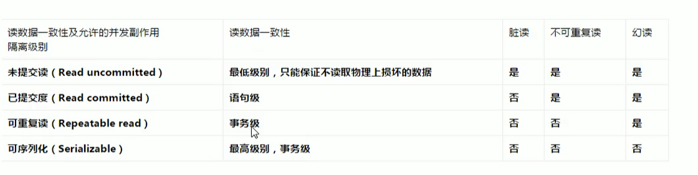


#### 面试题

不可重复读和幻读的区别？如何解决？

> ​	他们都是在一个事务中对某些数据进行多次读取，但是不可重复读的问题重在多次读取的数据不都一致；幻读重在多次读取确得到不一样数据量的数据
>
> 解决办法：
>
> ​	重复读加行数
>
> ​	幻读加表锁


### 案例分析

准备

```sql
create table test_innodb_lock (
a int(11),
b varchar(16)
)engine=innodb;I

insert into test_innodb_lock values(1,'b2');
insert into test_innodb_lock values(3,'3');
insert into test_innodb_lock values(4,'4000');
insert into test_innodb_lock values(5,'5000');
insert into test_innodb_lock values(6,'6000');
insert into test_innodb_lock values(7,'7000');
insert into test_innodb_lock values(8,'80O0');
insert into test_innodb_lock values(9,'9000');
insert into test_innodb_lock values(10,'b1');

create index test_innodb_a_ind  on test_innodb_lock(a);
create index test_innodb_b_ind  on test_innodb_lock(b);
-- 打开两个会话 并且都关闭自动提交
set autocommit=0;
```

#### 行锁演示

<style>
    table td{
        text-align:center;
        border-bottom: 1px solid #000000;
        border-right: 1px solid #000000;
    }
    table tr:first-child td{
        text-align:center;
        border-top: 1px solid #000000;
    }
    table tr td:first-child{
        text-align:center;
        border-left: 1px solid #000000;
    }
</style>
<table  border="1px solid red;" >
    <tr >
        <th>Session 1</th>
        <th>Session 2</th>
        <th>explain  </th>
    </tr>
    <tr>
        <th style="text-align:center; " colspan='3'>case 1</th>
    </tr>
    <tr>
        <td>
            <br/>
            <p style="text-align:center; ">
                关闭 Session 1 的自动提交
            </p><br/>
        </td>
        <td>
            <br/>
            <p>
                关闭 Session 2 的自动提交
            </p>
        </td>
        <td>
             <p style="text-align:center; ">
                目的是:模拟高并发的情况下事务的处理情况，就好比一个SQL在修改但是没又被提交
            </p><br/>
            <p style="text-align:center; ">
                在Innodb引擎作用下默认行锁，可以自动锁住我们当行数据保证数据的准确性
            </p>
        </td>
    </tr>
    <tr>
      <th colspan="3" style="text-align:center;"  >case 2</th>
    </tr>
    <tr>
        <td>
            <br/>
            <p style="text-align:center; ">
                Session 1 修改a=4的数据，不提交
            </p>
        </td>
        <td>
            <br/>
            <p style="text-align:center; ">
                Session 2 无法查询到原有数据
            </p>
        </td>
        <td>
        	<p>
            </p>
        </td>
    </tr>
    <tr>
      <th colspan="3"  style="text-align:center;" >case 3</th>
    </tr>
    <tr>
        <td>
            <br/>
            <p style="text-align:center; ">
                Session 1 提交事务
            </p>
        </td>
        <td>
            <br/>
            <p style="text-align:center; ">
                Session 2 提交事务()
            </p>
        </td>
        <td>
        	<p style="text-align:center; ">>
                Session 2 这里也可以当做是清除之前数据库累计事务
            </p>
            <br/>
            <p style="text-align:center; ">
               如果不提交，我们的Session 2 还是原来的数据
            </p>
        </td>
    </tr>
    <tr>
      <th colspan="3" style="text-align:center;" >case 4</th>
    </tr>
    <tr>
        <td>
            
            <br/>
            <p style="text-align:center; ">
                Session 1 修改a=4的数据，不提交
            </p>
        </td>
        <td>
            <br/>            
            <p style="text-align:center; ">
                Session 2 修改a=9的数据，不提交
            </p>
        </td>
        <td>
        	<p style="text-align:center; ">
                两个 Session 操作不同的数据，互补影响，充分的体现了行锁的作用
            </p>
        </td>
    </tr>
    <tr>
      <th colspan="3" style="text-align:center;" >case 5</th>
    </tr>
    <tr>
        <td>
            
            <br/>
            <p style="text-align:center; ">
                Session 1 修改a=1的数据，不提交
            </p>
        </td>
        <td>
            <br/>            
            <p style="text-align:center; ">
                Session 2 修改a=1的数据，不提交
            </p>
        </td>
        <td>
        	<p style="text-align:center; ">
                两个 Session 操作相同的数据，互相影响
            </p><br/>
        	<p style="text-align:center; ">
                Session2 在 Session1 没有提交之前，直接处于阻塞状态
            </p>
        </td>
    </tr>
    <tr>
      <th colspan="3" style="text-align:center;" >case 5</th>
    </tr>
    <tr>
        <td>
            
            <br/>
            <p style="text-align:center; ">
                Session 1 修改a=4的数据，不提交
            </p>
        </td>
        <td>
            <br/>            
            <p style="text-align:center; ">
                Session 2 修改a=9的数据，不提交
            </p>
        </td>
        <td>
        	<p style="text-align:center; ">
                两个 Session 操作不同的数据，互补影响，充分的体现了行锁的作用
            </p>
        </td>
    </tr>
    </table>


#### 索引失效导致行锁变成表锁

<style>
    table td{
        text-align:center;
        border-bottom: 1px solid #000000;
        border-right: 1px solid #000000;
    }
    table tr:first-child td{
        text-align:center;
        border-top: 1px solid #000000;
    }
    table tr td:first-child{
        text-align:center;
        border-left: 1px solid #000000;
    }
</style>
<table  border="1px solid red;" >
    <tr >
        <th>Session 1</th>
        <th>Session 2</th>
        <th>explain  </th>
    </tr>
    <tr>
        <td>
            <br/>
        </td>
        <td>
            <br/>
        </td>
        <td>
        	<p style="text-align:center; ">        
	            我们在最开始准备阶段，就创建了关于a ,b 的索引(单索引)
            </p><br/>
        	<p style="text-align:center; ">        
	            我们之前说过，在where上不要进行隐式转换，这样会导致索引失效
            </p><br/>
        	<p style="text-align:center; ">        
	            从这个例子中我们左边进行了隐式操作，导致索引失效，第二个 Session
            </p><br/>
        	<p style="text-align:center; ">        
	            直接进入到了阻塞状态，<a font="color:'red'">表明了我们的索引失效让行锁变成了表锁</a>
            </p>
    	</td>
    </tr>
    <tr>
        <td>
            <br/>
        </td>
        <td>
            <br/>
        </td>
        <td>
        	<p style="text-align:center; ">        
	           上面的例子中直至Session 1 回话结束，这时候释放了锁
            </p><br/>
        	<p style="text-align:center; ">        
	          我们的 Session 2 才接受到了锁，进入了表
            </p><br/>
        	<p style="text-align:center; ">        
	           这个例子充分的表明了，我们在操作中一定要注意索引失效的问题
            </p><br/>
        	<p style="text-align:center; ">        
                他有可能会导致我们效率更低
            </p>
    	</td>
    </tr>
</table>


#### 间隙锁的危害

【概念】

​	当我们用范围条件而不是相等条件检索数据，并请求共享或排他锁时，InnoDB会给符合条件的已有数据记录的索引项加锁;对于键值在条件范围内但并木存在的记录，叫做“间隙（GAP)”，

InnoDB也会对这个“间隙”加锁，这种锁机制就是所谓的间隙锁（Next-Key锁）。

【危害】
因为Query执行过程中通过过范围查找的话，他会锁定整个范围内所有的索引键值，即使这个键值并不存在间隙锁有一个比较致命的弱点，就是当锁定一个范围键值之后，即使某些不存在的键值也会被无辜的锁定，
而造成在锁定的时候无
法插入锁定键值范围内的任何数据。在某些场景下这可能会对性能造成很大的危害

```sql
-- session 1
update t1 set b='12312' where a>1 and a<8;

-- session 2
insert into t1 values(5,'asda');
```

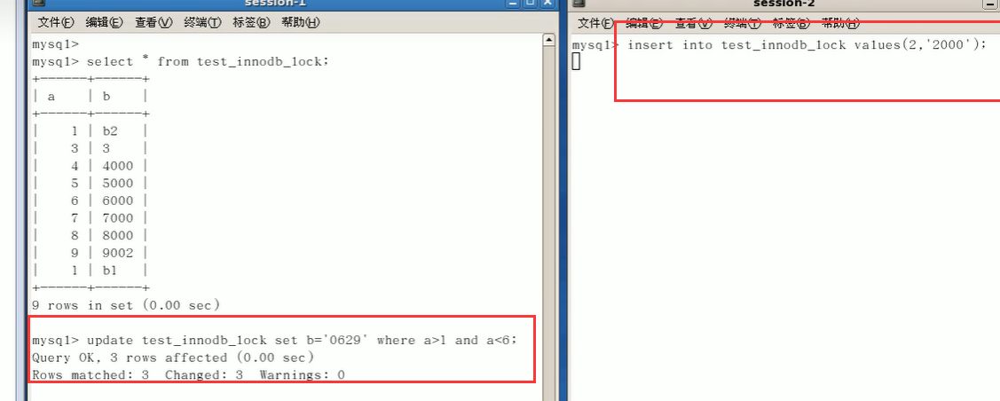


明显的看到在Session 1执行结束之后，执行Session 2 即使他们操作的不是同一行也会因为间隙锁的缘故锁定这一行，即使不存在也是如此，直到commit之后 Session 2才反应

#### 如何锁定一行

```sql
/*
select xoo.... for update锁定某一行后，其它的操作会械阻塞，直到锁定行的会话提交commit
*/
begin;
select * from test_innodb_lock where a = 8 for update;
commit;
```


### 案例结论

​	Innodb存储引擎由于实现了行级锁定，虽然在锁定机制的实现方面所带来的性能损耗可能比表级锁定会要更高一些，但是在整体并发处理能力方面要远远优于MyISAM的表级锁定的。当系统并发量较高的时候，Innodb的整体性能和MyIlSAM相比就会有比较明显的优势了。

​	但是，Innodb的行级锁定同样也有其脆弱的一面，当我们使用不当的时候，可能会让Innodb的整体性能表现不仅不能比MyISAM高，甚至可能会更差。(索引失效行锁变表锁)


### 如何分析行锁定

通过检查InnoDB_row_lock状态变量来分析系统上的行锁的争夺情况

```sql
show status like 'innodb_row_lock%';
```

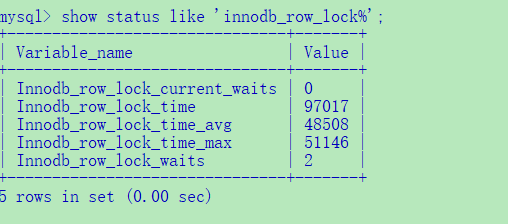


对各个状态量的说明如下:

Innodb_row_lock_current_waits：当前正在等待锁定的数量;

Innodb_row_lock_time：队系统启动到现在锁定总时间长度;

Innodb_row_lock_time_avg：每次等待所花平均时间;

Innodb_row_lock_time_max：从系统启动到现在等待最常的一次所花的时间;

Innodb_row_lock_waits：系统启动后到现在总共等待的次数;


对于这5个状态变量，比较重要的主要是

<font color=red>Innodb_row_lock_time_avg（等待平均时长）</font>，

<font color=red>Innodb_row_lock_waits（等待总次数)</font> ，

<font color=red>lnnodb_row_lock_time（等待总时长）这三项</font>。

尤其是当等踌次数很高，而且每次等待时长也不小的时候，我们就需要分析系统中为什么会有如此多的等待
然后根据分析结果着手指定优化计划。


### 优化意见

1. 尽可能让所有数据检索都通过索引来完成，避免无索引行锁升级为表锁。

2. 合理设计索引，尽量缩小锁的范围

3. 尽可能较少检索条件，避免间隙锁

4. 尽量控制事务大小，减少锁定资源量和时间长度

5. 尽可能低级别事务隔离


## 页锁(案例介绍)

开销和加锁时间界于表锁和行锁之间;会出现死锁;锁定粒度界于表锁和行锁之间，并发度一般。


# 主从复制

在总结MySQL的分库分表时候再将，Mycat章节(也有可能是Shardingsphere)


# 附录

<h2>
    <div name=select_type>
    	<a style="color:red; " >Select_Type</a>
	</div>
</h2>

|   select_type价值    |          JSON名称          |                             意义                             |
| :------------------: | :------------------------: | :----------------------------------------------------------: |
|        SIMPLE        |            没有            |               简单选择（不使用UNION或子查询）                |
|       PRIMARY        |            没有            |                    多层子查询中最外层选择                    |
|        UNION         |            没有            | 联盟中的第二个或稍后的SELECT语句<br/>若第二个SELECT出现在UNION之后，则被标记为UNION;<br/>若UNION包含在FROM子句的子查询中,外层SELECT将被标记为:DERIVED |
|   DEPENDENT UNION    |      dependent(true)       |    UNION中的第二个或更高版本的SELECT语句，依赖于外部查询     |
|     UNION RESULT     |        union_result        |                  从UNION表获取结果的SELECT                   |
|       SUBQUERY       |            没有            | 子查询中的第一个SELECT<br/>在SELECT 或 WHERE列表中包含了子查询 |
|  DEPENDENT SUBQUERY  |      dependent(true)       |            子查询中的第一个SELECT,依赖于外部查询             |
|       DERIVED        |            没有            | 派生表<br/>在FROM列表中包含的子查询被标记为DERIVED(衍生)MySQL会递归执行这些子查询，把结果放在临时表里。 |
|     MATERIALIZED     | material!zed_from_subquery |                         实例化子查询                         |
| UNCACHEABLE SU3QUERY |      cacheable(false)      | 无法缓存其结果并且必须为外部查询的每一行重新计算其结果的子查询 |
|  UNCACHEABLE UNION   |      cacheable(false)      | 在属于不可缓存子查询的UNION中的第二个或更高版本选择（请参见UNCACHEABLE SUBQUERY） |

```sql
--sample:简单的查询，不包含子查询和union
explain select * from emp;

--primary:查询中若包含任何复杂的子查询，最外层查询则被标记为Primary
explain select staname,ename supname from (select ename staname,mgr from emp) t join emp on t.mgr=emp.empno ;

--union:若第二个select出现在union之后，则被标记为union
explain select * from emp where deptno = 10 union select * from emp where sal >2000;

--dependent union:跟union类似，此处的depentent表示union或union all联合而成的结果会受外部表影响
explain select * from emp e where e.empno  in ( select empno from emp where deptno = 10 union select empno from emp where sal >2000)

--union result:从union表获取结果的select
explain select * from emp where deptno = 10 union select * from emp where sal >2000;

--subquery:在select或者where列表中包含子查询
explain select * from emp where sal > (select avg(sal) from emp) ;

--dependent subquery:subquery的子查询要受到外部表查询的影响
explain select * from emp e where e.deptno in (select distinct deptno from dept);

--DERIVED: from子句中出现的子查询，也叫做派生类，
explain select staname,ename supname from (select ename staname,mgr from emp) t join emp on t.mgr=emp.empno ;

--UNCACHEABLE SUBQUERY：表示使用子查询的结果不能被缓存
 explain select * from emp where empno = (select empno from emp where deptno=@@sort_buffer_size);
 
--uncacheable union:表示union的查询结果不能被缓存：sql语句未验证
```


<h2>
	<div name=extra_example >
        <p style="color:red; font-size:25px; " >
        	type_example
        </p>
	</div> 
</h2>

```sql
--all:全表扫描，一般情况下出现这样的sql语句而且数据量比较大的话那么就需要进行优化。
explain select * from emp;

--index：全索引扫描这个比all的效率要好，主要有两种情况，一种是当前的查询时覆盖索引，即我们需要的数据在索引中就可以索取，或者是使用了索引进行排序，这样就避免数据的重排序
explain  select empno from emp;

--range：表示利用索引查询的时候限制了范围，在指定范围内进行查询，这样避免了index的全索引扫描，适用的操作符： =, <>, >, >=, <, <=, IS NULL, BETWEEN, LIKE, or IN() 
explain select * from emp where empno between 7000 and 7500;

--index_subquery：利用索引来关联子查询，不再扫描全表
explain select * from emp where emp.job in (select job from t_job);

--unique_subquery:该连接类型类似与index_subquery,使用的是唯一索引
 explain select * from emp e where e.deptno in (select distinct deptno from dept);
 
--index_merge：在查询过程中需要多个索引组合使用，没有模拟出来

--ref_or_null：对于某个字段即需要关联条件，也需要null值的情况下，查询优化器会选择这种访问方式
explain select * from emp e where  e.mgr is null or e.mgr=7369;

--ref：使用了非唯一性索引进行数据的查找
 create index idx_3 on emp(deptno);
 explain select * from emp e,dept d where e.deptno =d.deptno;

--eq_ref ：使用唯一性索引进行数据查找
explain select * from emp,emp2 where emp.empno = emp2.empno;

--const：这个表至多有一个匹配行，
explain select * from emp where empno = 7369;
 
--system：表只有一行记录（等于系统表），这是const类型的特例，平时不会出现
```


<h2>
	<div name=extra_example >
        <p style="color:red; font-size:25px; " >extra_example</p>
	</div> 
</h2>

```sql
--using filesort:说明mysql无法利用索引进行排序，只能利用排序算法进行排序，会消耗额外的位置
explain select * from emp order by sal;

--using temporary:建立临时表来保存中间结果，查询完成之后把临时表删除
explain select ename,count(*) from emp where deptno = 10 group by ename;

--using index:这个表示当前的查询时覆盖索引的，直接从索引中读取数据，而不用访问数据表。如果同时出现using where 表名索引被用来执行索引键值的查找，如果没有，表面索引被用来读取数据，而不是真的查找
explain select deptno,count(*) from emp group by deptno limit 10;

--using where:使用where进行条件过滤
explain select * from t_user where id = 1;

--using join buffer:使用连接缓存，情况没有模拟出来

--impossible where：where语句的结果总是false
explain select * from emp where empno = 7469;
```


