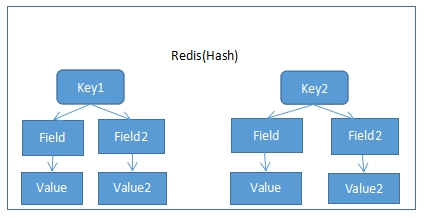
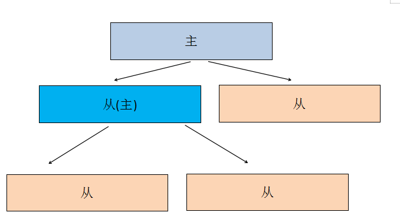
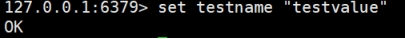
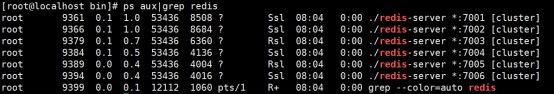

# Redis

## 一.Redis简介

### 1.NoSQL简介

​	目前市场主流数据存储都是使用关系型数据库。每次操作关系型数据库时都是I/O操作，I/O操作是主要影响程序执行性能原因之一，连接数据库关闭数据库都是消耗性能的过程。尽量减少对数据库的操作，能够明显的提升程序运行效率。

​	针对上面的问题，市场上就出现了各种NoSQL(Not Only SQL,不仅仅可以使用关系型数据库)数据库，它们的宣传口号：不是什么样的场景都必须使用关系型数据库，一些特定的场景使用NoSQL数据库更好。

常见NoSQL数据库：

​	memcached ：键值对，内存型数据库，所有数据都在内存中。


​	Redis:和Memcached类似，还具备持久化能力。


​	HBase：以列作为存储。


​	MongoDB：以Document做存储。


### 2.**Redis简介**

​	Redis是以Key-Value形式进行存储的NoSQL数据库。

​	Redis是使用C语言进行编写的。

​	平时操作的数据都在内存中，效率特高，读的效率110000/s，写81000/s，所以多把Redis当做缓存工具使用。

​	Redis以solt（槽）作为数据存储单元，每个槽中可以存储N多个键值对。Redis中固定具有16384。理论上可以实现一个槽是一个Redis。每个向Redis存储数据的key都会进行crc16算法得出一个值后对16384取余就是这个key存放的solt位置。

​	同时通过Redis Sentinel提供高可用，通过Redis Cluster提供自动分区。


##  二. Redis单机版安装


​	1.安装依赖C语言依赖

​	redis使用C语言编写，所以需要安装C语言库

```shell

yum install -y gcc-c++ automake autoconf libtool make tcl 

```

​	2.上传并解压

​	把redis-5.0.5.tar.gz上传到/usr/local/tmp中

​	解压文件

```
# cd /usr/local/tmp

# tar zxf redis-5.0.5.tar.gz
```


​	3.编译并安装

​	进入解压文件夹

```

# cd /usr/local/tmp/redis-5.0.5/

```

​	编译

```

# make

```

​	安装	

```

# make install PREFIX=/usr/local/redis

```

​	4.开启守护进程

​	复制cd /usr/local/tmp/redis-5.0.5/中redis.conf配置文件	

```

# cp redis.conf /usr/local/redis/bin/

```

​	修改配置文件	

```
# cd /usr/local/redis/bin/

# vim redis.conf

```

​	把daemonize的值由no修改为yes


​	5.修改外部访问

​	在redis5中需要修改配置文件redis.conf允许外部访问。需要修改两处。

​	注释掉下面

​	bind 127.0.0.1

```
#bind 127.0.0.1

```

​	protected-mode yes 改成 no


​	6.启动并测试

​	启动redis

 ```shell

./redis-server redis.conf

 ```

​	重启redis

```
./redis-cli shutdown

./redis-server redis.conf

```

​	启动客户端工具

​	在redis5中客户端工具对命令会有提供功能。

 ```shell
./redis-cli 

 ```


##  二.、docker安装Redis

1、拉取镜像文件

```shell

docker pull redis[:(版本号)]

```


2、去gitee库中下载redis配置文件（docker不自带配置文件）【也可不进行此步骤】


**建议看完，先别操作，再看三，看完三之后再决定如何操作**


然后按照文章内容进行，忽略下载。


文章地址： https://www.jb51.net/article/203274.htm 


、


3、创建一个redis 服务容器 


**第二步进行了的**


```shell

docker run -p 6379:6379 --name myredis -v /usr/local/docker/redis.conf:/etc/redis/redis.conf -v /usr/local/docker/data:/data -d redis redis-server /etc/redis/redis.conf --appendonly yes


```


**第二步没有进行的**


```shell

docker run -p 6379:6379 --name myredis -v /root/myredis/data:/data -v /root/myredis/conf/redis.conf:/usr/local/etc/redis/redis.conf -d redis redis-server /usr/local/etc/redis/redis.conf --appendonly yes


```


**区别：**


​	其实也没有什么区别，只是映射的文件不同，也可以将第二步的文件直接创建到第二种创建服务容器的配置文件地址中去，这样也可使用第二个创建方式。


## 三.Redis常用的五大类型


​	 Redis不仅仅支持简单的k/v类型的数据，同时还提供list，set，zset，hash等数据结构的存储，它还支持数据的备份，即master-slave模式的数据备份，同样Redis支持数据的持久化，可以将内存中的数据保持在磁盘中，重启的时候可以再次加载进行使用。


​        Redis支持的五大数据类型包括String（字符串  用法： 键  值），Hash（哈希 类似Java中的 map  用法： 键  键值对），List（列表  用法：键 集合 不可以重复），Set（集合 用法：键 集合 可以重复），Zset（sorted set 有序集合    用法： 键  值 值）


 


### String（字符串）


​	string 是 redis 最基本的类型，你可以理解成与 Memcached 一模一样的类型，一个 key 对应一个 value。string 类型是二进制安全的。意思是 redis 的 string 可以包含任何数据。比如jpg图片或者序列化的对象。string 类型是 Redis 最基本的数据类型，string 类型的值最大能存储 512MB。


应用场景：  


​	String是最常用的一种数据类型，普通的key/value存储都可以归为此类，value其实不仅是String，  


也可以是数字：比如想知道什么时候封锁一个IP地址(访问超过几次)。


 


### Hash（哈希）


​	Redis hash 是一个键值(key=>value)对集合。


​	Redis hash 是一个 string 类型的 field 和 value 的映射表，hash 特别适合用于存储对象。


​	使用场景：存储、读取、修改用户属性


​	我们简单举个实例来描述下Hash的应用场景，比如我们要存储一个用户信息对象数据，包含以下信息：    用户ID，为查找的key，  


​    	存储的value用户对象包含姓名name，年龄age，生日birthday 等信息，  如果用普通的key/value结构来存储，主要有以下2种存储方式：  


​    	第一种方式将用户ID作为查找key,把其他信息封装成一个对象以序列化的方式存储，  


​           如：set u001 "李三,18,20010101"  


​     	这种方式的缺点是，增加了序列化/反序列化的开销，并且在需要修改其中一项信息时，需要把整个对象取回，并且修改操作需要对并发进行保护，引入CAS等复杂问题。  


​     	第二种方法是这个用户信息对象有多少成员就存成多少个key-value对儿，用用户ID+对应属性的名称作为唯一标识来取得对应属性的值，  


​       	如：mset user:001:name "李三 "user:001:age18 user:001:birthday "20010101"  虽然省去了序列化开销和并发问题，但是用户ID为重复存储，如果存在大量这样的数据，内存浪费还是非常可观的。  


​    	那么Redis提供的Hash很好的解决了这个问题。


  


### List（列表）


​	Redis 列表是简单的字符串列表，按照插入顺序排序。你可以添加一个元素到列表的头部（左边）或者尾部（右边）。


应用场景：  


   	 Redis list的应用场景非常多，也是Redis最重要的数据结构之一。  


​    	我们可以轻松地实现最新消息排行等功能。  


  	 Lists的另一个应用就是消息队列，可以利用Lists的PUSH操作，将任务存在Lists中，然后工作线程再用POP操作将任务取出进行执行。  


   


### Set（集合）


​	Redis的Set是string类型的无序集合。


​	使用场景：1.共同好友、二度好友 


​			   2. 利用唯一性，可以统计访问网站的所有独立 IP 


 	 Redis set对外提供的功能与list类似是一个列表的功能，特殊之处在于set是可以自动排重的，当你需要存储一个列表数据，又不希望出现重复数据时，set是一个很好的选择，并且set提供了判断某个成员是否在一个set集合内的重要接口，这个也是list所不能提供的。  


 	

 	 比如在微博应用中，每个人的好友存在一个集合（set）中，这样求两个人的共同好友的操作，可能就只需要用求交集命令即可。  


​    	Redis还为集合提供了求交集、并集、差集等操作，可以非常方便的实  


  	实现方式：  


​    	set 的内部实现是一个 value永远为null的HashMap，实际就是通过计算hash的方式来快速排重的，这也是set能提供判断一个成员是否在集合内的原因。 


 


### zset(sorted set：有序集合)


 	Redis zset 和 set 一样也是string类型元素的集合,且不允许重复的成员。不同的是每个元素都会关联一个double类型的分数。redis正是通过分数来为集合中的成员进行从小到大的排序。zset的成员是唯一的,但分数(score)却可以重复。


使用场景：1.带有权重的元素，比如一个游戏的用户得分排行榜 


​		   2.比较复杂的数据结构，一般用到的场景不算太多


## 四. Redis常用命令


Redis命令相关手册有很多，下面为其中比较好用的两个


  1.<https://www.redis.net.cn/order/>


  2.http://doc.redisfans.com/text-in


### 1. Key操作


#### 1.1  exists


​	判断key是否存在。


​	语法：exists key名称


​	返回值：存在返回数字，不存在返回0


#### 1.2 expire


​	设置key的过期时间，单位秒


​	语法：expire key 秒数


​	返回值：成功返回1，失败返回0


#### 1.3 ttl


​	查看key的剩余过期时间


​	语法：ttl key


​	返回值：返回剩余时间，如果不过期返回-1


#### 1.4 del


​	根据key删除键值对。


​	语法：del key


​	返回值：被删除key的数量


### 2. **字符串值(String)**


#### 2.1 **set**


​	设置指定key的值


​	语法：set key value


​	返回值：成功OK


#### 2.2 **get**


​	获取指定key的值


​	语法：get key


​	返回值：key的值。不存在返回nil


#### 2.3 **setnx**


​	当且仅当key不存在时才新增。


​	语法：setnx key value


​	返回值：不存在时返回1，存在返回0


#### 2.4 **setex**


​	设置key的存活时间，无论是否存在指定key都能新增，如果存在key覆盖旧值。同时必须指定过期时间。


​	语法：setex key seconds value


​	返回值：OK


### 3.**哈希表(Hash)**


​	Hash类型的值中包含多组field value。





#### 3.1 **hset**


​	给key中field设置值。


​	语法：hset key field value


​	返回值：成功1，失败0


#### 3.2 **hget**


​	获取key中某个field的值


​	语法：hget key field 


​	返回值：返回field的内容


#### 3.3 **hmset**


​	给key中多个filed设置值


​	语法：hmset key field value field value


​	返回值：成功OK


#### 3.4 **hmget**


​	一次获取key中多个field的值


​	语法：hmget key field field


​	返回值：value列表


#### 3.5 **hvals**


​	获取key中所有field的值


​	语法：hvals key


​	返回值：value列表


#### 3.6 **hgetall**


​	获取所有field和value


​	语法：hgetall key


​	返回值：field和value交替显示列表


#### 3.7 **hdel**


​	删除key中任意个field


​	语法：hdel key field field


​	返回值：成功删除field的数量


### 4. **列表（List）**


#### 4.1 **Rpush**


​	向列表末尾中插入一个或多个值


​	语法；rpush key value value


​	返回值：列表长度


#### 4.2 **lrange**


​	返回列表中指定区间内的值。可以使用-1代表列表末尾


​	语法：lrange list 0 -1


​	返回值：查询到的值


#### 4.3 **lpush**


​	将一个或多个值插入到列表前面


​	语法：lpush key value value


​	返回值：列表长度


#### 4.4 **llen**


​	获取列表长度


​	语法：llen key


​	返回值：列表长度


#### 4.5 **lrem**


​	删除列表中元素。count为正数表示从左往右删除的数量。负数从右往左删除的数量。


​	语法：lrem key count value


​	返回值：删除数量。


### 5 **集合(Set)**


​	set和java中集合一样。


#### 5.1 **sadd**


​	向集合中添加内容。不允许重复。


​	语法：sadd key value value value


​	返回值：集合长度


#### 5.2 **scard**


​	返回集合元素数量


​	语法：scard key


​	返回值：集合长度


#### 5.3 **smembers **


​	查看集合中元素内容


​	语法：smembers key


​	返回值：集合中元素


### 6 .**有序集合（Sorted Set）**


​	有序集合中每个value都有一个分数（score），根据分数进行排序。


#### 6.1 **zadd**


​	向有序集合中添加数据


​	语法：zadd key score value score value


​	返回值：长度


#### 6.2 **zrange**


​	返回区间内容想·，withscores表示带有分数


​	语法：zrange key 区间 [withscores]


​	返回值：值列表


## 五、 **Redis持久化策略**


​	Redis不仅仅是一个内存型数据库，还具备持久化能力。


### 1. **RDB**


​	rdb模式是默认模式，可以在指定的时间间隔内生成数据快照（snapshot），默认保存到dump.rdb文件中。当redis重启后会自动加载dump.rdb文件中内容到内存中。


​	用户可以使用SAVE（同步）或BGSAVE（异步）手动保存数据。


​	可以设置服务器配置的save选项，让服务器每隔一段时间自动执行一次BGSAVE命令，可以通过save选项设置多个保存条件，但只要其中任意一个条件被满足，服务器就会执行BGSAVE命令。

　　	例如：

　　	save 900 1

　　	save 300 10

　　	save 60 10000

　　那么只要满足以下三个条件中的任意一个，BGSAVE命令就会被执行

　　服务器在900秒之内，对数据库进行了至少1次修改

　　服务器在300秒之内，对数据库进行了至少10次修改

　　服务器在60秒之内，对数据库进行了至少10000次修改


 


#### 1.1 **优点**


​	rdb文件是一个紧凑文件，直接使用rdb文件就可以还原数据。


​	数据保存会由一个子进程进行保存，不影响父进程。


​	恢复数据的效率要高于aof


#### 1.2 **缺点**


​	每次保存点之间导致redis不可意料的关闭，可能会丢失数据。


​	由于每次保存数据都需要fork()子进程，在数据量比较大时可能会比较耗费性能。


### 2 **AOF** 


​	AOF默认是关闭的，需要在配置文件中开启AOF。Redis支持AOF和RDB同时生效，如果同时存在，AOF优先级高于RDB（Redis重新启动时会使用AOF进行数据恢复）


​	监听执行的命令，如果发现执行了修改数据的操作，同时直接同步到数据库文件中。


#### 2.1 **优点**


​	相对RDB数据更加安全。


#### 2.2 **缺点**


​	相同数据集AOF要大于RDB。


​	相对RDB可能会慢一些。


#### 2.3 **开启办法**


​	修改redis.conf中


```

# 默认no

appendonly yes

# aof文件名

appendfilename "appendonly.aof"

```


## 六. **Redis主从复制**


​	Redis支持集群功能。为了保证单一节点可用性，redis支持主从复制功能。每个节点有N个复制品（replica），其中一个复制品是主（master），另外N-1个复制品是从（Slave），也就是说Redis支持一主多从。


​	一个主可有多个从，而一个从又可以看成主，它还可以有多个从。





### 1. **主从优点**


​	增加单一节点的健壮性，从而提升整个集群的稳定性。（Redis中当超过1/2节点不可用时，整个集群不可用）


​	从节点可以对主节点数据备份，提升容灾能力。


​	读写分离。在redis主从中，主节点一般用作写（具备读的能力），从节点只能读，利用这个特性实现读写分离，写用主，读用从。


#### 1.1 **一主多从搭建**


​	在已经搭建的单机版redis基础上进行操作。


​	并且关闭redis单机版


```

./redis-cli shutdown

```


#### 1.2 **新建目录**


```

# mkdir /usr/local/replica

```


#### 1.3 **复制目录**


​	把之前安装的redis单机版中bin目录复制三份，分别叫做：master、slave1、slave2


```

# cp -r /usr/local/redis/bin /usr/local/replica/master

# cp -r /usr/local/redis/bin /usr/local/replica/slave1

# cp -r /usr/local/redis/bin /usr/local/replica/slave2

```


#### 1.4 **修改从的配置文件**


​	修改2个从的redis.conf，指定主节点ip和端口。并修改自身端口号防止和其他redis冲突。


```

# vim /usr/local/replica/slave1/redis.conf

```


​	指定主节点ip和端口


```

replicaof 192.168.93.10 6379

```


​	修改自己端口


```

port 6380

```


```

# vim /usr/local/replica/slave2/redis.conf

```


​	指定主节点ip和端口


```

replicaof 192.168.93.10 6379

```


​	修改自己端口


```

port 6381

```


#### 1.5 **启动三个redis实例**


​	注意：一定要关闭单机的redis，否则端口冲突。


```

# cd /usr/local/replica

# vim startup.sh

```


​	在文件中添加下面内容


```

cd /usr/local/replica/master/

./redis-server redis.conf

  cd /usr/local/replica/slave1

./redis-server redis.conf

  cd /usr/local/replica/slave2

./redis-server redis.conf

```


 	赋予权限


```

# chmod a+x startup.sh

```


​	开启


```

# ./startup.sh

```


#### 1.6 **查看启动状态**


```

# ps aux|grep redis

```


#### 1.7 **测试***


```

# cd /usr/local/replica/master/

# ./redis-cli 

```


​	在客户端命令行模式下，添加一条数据：





​	进去slave查看数据是否同步。


```

# cd /usr/local/replica/slave1

# ./redis-cli -p 6380

```


###  2、docker下操作


​	可以自定义**redis.conf**文件只写要修改的，不改的就别写，这里主要是要书写**新的端口号**以及**父节点**的**ip和端口**


**注意：**所有修改必须在容器外，容器内修改无效，在退出重启的那一刻就已经还原了


我们通常使用  CP 来修改


```shell

docker  cp  本机文件路径   容器id: 容器内文件路径

#所有路径是所在文件夹路径，并不是文件的路径，简单来说就是写到文件夹所在路径即可，不需要指定特定文件

```


#### 1、修改端口号


同上


#### 2、指定父节点


同上


#### 3、重启


**（如果在启动前修改不需要，这里是指已经启动了的容器，在修改之后的操作）**


```shell

docker restart 容器id

```


#### 4、测试并查看


·同上


```shell

role


或者


info replication

```


## 七.  **哨兵（Sentinel）**


​	在redis主从默认是只有主具备写的能力，而从只能读。如果主宕机，整个节点不具备写能力。但是如果这是让一个从变成主，整个节点就可以继续工作。即使之前的主恢复过来也当做这个节点的从即可。


​	Redis的哨兵就是帮助监控整个节点的，当节点主宕机等情况下，帮助重新选取主。


​	Redis中哨兵支持单哨兵和多哨兵。单哨兵是只要这个哨兵发现master宕机了，就直接选取另一个master。而多哨兵是根据我们设定，达到一定数量哨兵认为master宕机后才会进行重新选取主。我们以多哨兵演示。


### 1. **没有哨兵下主从效果**


​	只要杀掉主，整个节点无法在写数据，从身份不会变化，主的信息还是以前的信息。


### 2.**搭建多哨兵**


​	前提：安装了单机的redis


#### 2.1 **新建目录**


```

# mkdir /usr/local/sentinel

```


#### 2.2 **复制redis**


```

# cp -r /usr/local/redis/bin/* /usr/local/sentinel

```


#### 2.3 **复制配置文件**


​	从redis解压目录中复制sentinel配置文件


```

# cd /usr/local/tmp/redis-5.0.5/

# cp sentinel.conf /usr/local/sentinel/

```


#### 2.4 **修改配置文件**


```

# cd /usr/local/sentinel

# vim sentinel.conf


port 26379

daemonize yes

#这个提示里面的/var/log/redis/redis.log日志文件指的是容器中的文件，千万别理解为宿主机中的路径，如果你在宿主机创建此文件并授权，最后结果也是一样的，理解这一点很重要。

logfile “/usr/local/sentinel/26379.log”


sentinel monitor mymaster 192.168.93.10 6379 2

```


​	复制sentinel.conf，命名为sentinel-26380.conf


```

# cp sentinel.conf sentinel-26380.conf

# vim sentinel-26380.conf


port 26380

daemonize yes

logfile “/usr/local/sentinel/26380.log”

sentinel monitor mymaster 192.168.93.10 6379 2

```


复制sentinel.conf，命名为sentinel-26381.conf


```

# cp sentinel.conf sentinel-26381.conf

# vim sentinel-26381.conf


port 26381

daemonize yes

logfile “/usr/local/sentinel/26381.log”

sentinel monitor mymaster 192.168.93.10 6379 2

```


#### 2.5 **启动主从**


​	如果已经启动状态，忽略下面命令。如果启动部分，全部kill后重新启动。


​	使用kill杀死全部redis


```

# ps aux|grep redis

# kill -9 进程号

```


​	启动redis主从


```

# cd /usr/local/replica

# ./startup.sh

```


#### 2.6 **启动三个哨兵**


```

# cd /usr/local/sentinel

# ./redis-sentinel sentinel.conf

# ./redis-sentinel sentinel-26380.conf

# ./redis-sentinel sentinel-26381.conf

```


#### 2.7 **查看日志**


```

# cat 26379.log

```


#### 2.8 **测试宕机**


​	查看redis进程号


```

# ps aux|grep redis

```


​	杀死主进程号


```

# kill -9 进程号

```


​	查看日志，短暂延迟后会发现，出现新的主。


```

# cat 26379.log

```


## 八. 集群(Cluster)--nt have doc


​	前提：已经安装好redis单机版。


​	当集群中超过或等于1/2节点不可用时，整个集群不可用。为了搭建稳定集群，都采用奇数节点。


### 1 .**复制redis配置文件**


​	从/usr/local/redis/bin下把redis.conf复制到当前目录中，命名为redis-7001.conf


```

# cp /usr/local/redis/bin/redis.conf /usr/local/redis/bin/redis-7001.conf

```


### 2. **修改redis-7001.conf**


```

# cd /usr/local/redis/bin

# vim redis-7001.conf

```


​	需要修改如下


```

port 7001

cluster-enabled yes

cluster-config-file nodes-7001.conf

cluster-node-timeout 15000

# appendonly yes 如果开启aof默认，需要修改为yes。如果使用rdb，此处不需要修改

daemonize yes

protected-mode no

pidfile /var/run/redis_7001.pid

```


### 3 .**复制配置文件，并修改内容**


​	把redis-7001.conf 复制5份，分别叫做redis-7002.conf、redis-7003.conf、redis-7004.conf、redis-7005.conf、redis-7006.conf 


```

# cp redis-7001.conf redis-7002.conf

# cp redis-7001.conf redis-7003.conf

# cp redis-7001.conf redis-7004.conf

# cp redis-7001.conf redis-7005.conf

# cp redis-7001.conf redis-7006.conf

```


 	新复制的5个配置文件都需要需改三处。


​	例如nodes-7002.conf中需要把所有7001都换成7002。


​	可以使用 :%s/7001/7002/g 进行全局修改。 


```

port 7002

cluster-config-file nodes-7002.conf

pidfile /var/run/redis_7002.pid

```


### 4 .**启动6个redis**


​	可以使用redis-server结合6个配置文件进行启动6个实例。


​	执行之前一定要先删除dump.rdb


```

# rm -f dump.rdb

# vim startup.sh


./redis-server redis-7001.conf

./redis-server redis-7002.conf

./redis-server redis-7003.conf

./redis-server redis-7004.conf

./redis-server redis-7005.conf

./redis-server redis-7006.conf


# chmod a+x startup.sh

# ./startup.sh

```


### 5. **查看启动状态**





### 6. **建立集群** 


​	在redis3的时候需要借助ruby脚本实现集群。在redis5中可以使用自带的redis-cli实现集群功能，比redis3的时候更加方便了。


​	建议配置静态ip，ip改变集群失效


```

./redis-cli --cluster create 192.168.93.10:7001 192.168.93.10:7002 192.168.93.10:7003 192.168.93.10:7004 192.168.93.10:7005 192.168.93.10:7006 --cluster-replicas 1

```


  


### 7. **测试**


​	集群测试时，千万不要忘记最后一个-c参数。


```

# ./redis-cli -p 7001 -c

# set age 18

```


### 8 .**编写关闭脚本**


```

# vim stop.sh

# chmod a+x stop.sh


./redis-cli -p 7001 shutdown

./redis-cli -p 7002 shutdown

./redis-cli -p 7003 shutdown

./redis-cli -p 7004 shutdown

./redis-cli -p 7005 shutdown

./redis-cli -p 7006 shutdown

```


## 八. 集群(Cluster)-PATH:docker


​	**注：**1.如果是配置修改之前**已经创建过的集群时**，要先进行第七步操作。


​			2.要是想重启集群可以省略第一步，但是得**先删除已经创建的容器**，重新进行2、3（合并也行）


### 0、创建网络


**目的：**让宿主机可以访问到自身


```shell

docker network create net-redis --subnet 172.38.0.0/16

```


补充：关于虚拟机的三种网路连接方式区别


 http://blog.csdn.net/bifengmiaozhuan/article/details/79887692?spm=1001.2101.3001.6661.1&utm_medium=distribute.pc_relevant_t0.none-task-blog-2~default~CTRLIST~Rate-1.pc_relevant_default&depth_1-utm_source=distribute.pc_relevant_t0.none-task-blog-2~default~CTRLIST~Rate-1.pc_relevant_default&utm_relevant_index=1 


### 1、创建并修改配置文件


**注：**


```

In certain deployments, Redis Cluster nodes address discovery fails, because addresses are NAT-ted or because ports are forwarded (the typical case is Docker and other containers).


在某些部署中，Redis群集节点地址发现失败，因为地址是NAT，或者端口是转发的（典型情况是Docker和其他容器）。


In order to make Redis Cluster working in such environments, a static configuration where each node knows its public address is needed. The following two options are used for this scope, and are:


为了让Redis集群在这样的环境中工作，需要一种静态配置，其中每个节点都知道自己的公共地址。以下两个选项用于此范围，分别是：


cluster-announce-ip


cluster-announce-port

---------------------------------------------------------------------------------------

你的docker内网是172，你宿主的IP是192网段


根据redis的配置文件中的解释


要在你的配置文件上加上上面的2个配置

```


**方法一：**参考上面的方法一样行。


**方法二：**使用脚本


```shell

#cat <<EOF EOF在这里没有特殊的含义，你可以使用FOE或000等;

#表示以cat <<EOF 开始输入以 EOF 结束结束输入

#cat>创建文件，并把标准输入输出到后面的filename文件


 * cluster-announce-ip					192.168.1.195	#*群集ip

 * cluster-announce-port				700${port}		#*群集总线端口

 * cluster-announce-bus-port#*群集ip    1700${port}	   #*群集公布端口

# 集群 ip 是固定+10000


# 可以使用 :  %s/7001/7002/g     进行全局修改。 ---将全局的7001修改成7002


for port in $(seq 1 6); \ 

do \

mkdir  -p  /root/myredis/conf700${port}

touch  /root/myredis/conf700${port}/redis.conf

cat <<TTT > /root/myredis/conf700${port}/redis.conf port 6379

bind 0.0.0.0

port 700${port}

cluster-enabled yes

cluster-config-file nodes-700${port}.conf

cluster-node-timeout 15000

protected-mode no

pidfile /var/run/redis_ 700${port}.pid

cluster-announce-ip  192.168.1.195 

cluster-announce-port  700${port) 

cluster-announce-bus-port 1700${port) 

appendonly yes 

TTT 

done

```


### 2、创建容器


**方法一：**手动创建容器，并启动


```shell

docker run -p 7001:7001   -p 17001:17001  --name redis7001  -v /root/myredis/conf7001/redis.conf:/etc/redis/redis.conf -v /root/myredis/data7001:/data -d redis redis-server /etc/redis/redis.conf --appendonly yes

```


​	7002 ~~~7006同上，自行修改参数


**方法二：**脚本一键启动，效果同上


​	**注意：**


* 其中要指定两个端口号**-p 1700${port}:1700${port}**不要忘记，否则会在创建几群的时候出现  **Waiting for the cluster to join   ** 。【具体原因，我还没查出来，后面补充】

* 在docker创建集群容器的时候，**一定要** 指定  ip 


**补充：**


* 那肯定是你端口没有开启，不要质疑，这里的端口不是7000-7005，而是17000-17005，因为redis设置集群的端口号是”redis端口+10000“，这个非常重要。并且7001:7006也是必须打开的。 


```shell

for port in $(seq 1 6);  \

do \

docker run -p 700${port}:700${port}   -p 1700${port}:1700${port}  --name redis700${port}  \

-v /root/redis/redis700${port}.conf:/etc/redis/redis.conf \

-v /root/redis/data700${port}:/data \

-d --ip 192.168.1.195 redis redis-server /etc/redis/redis.conf 

done

```


  


### 3、进入容器


```shell

docker exec -it redis7001 /bin/bash

```


### 4、创建集群


​	**注：**有一步操作，要自行进行确认，一定要输入 **yes** 而不是 **y** 或者其他之类的，除了 yes一律视为 **no** 。


```shell

redis-cli --cluster create 192.168.1.195:7001 192.168.1.195:7002 192.168.1.195:7003 192.168.1.195:7004 192.168.1.195:7005 192.168.1.195:7006 --cluster-replicas 1

```


### 5、测试


​	集群测试时，千万不要忘记最后一个-c参数。


```shel

redis-cli -p 7001 -c

```


### 6、关闭集群


**方法一：**


​	自行手动一个一个停止，并且删除容器


```shell

docker stop redis7001 #7002 ~~~7006


docker rm -f redis7001

```


**方法二：**


​	脚本程序，一劳永逸


```shell

for port in $(seq 1 6);  \

do \

docker stop redis700${port}

docker rm -f redis700${port}

done

```


### 7、清空集群文件


```shell

for port in $(seq 1 6);  \

do \

rm  -rf  ./data700${port}/* 

done

```


## 九. **Jedis**


​	Redis给Java语言提供了客户端API，称之为Jedis。


​	Jedis API和Redis 命令几乎是一样的。


​	例如：Redis对String值新增时set命令，Jedis中也是set方法。所以本课程中没有重点把所有方法进行演示，重要演示Jedis如何使用。


​	Jedis API特别简单，基本上都是创建对象调用方法即可。


### 1. **单机版**


```

public void testStandalone(){

    Jedis jedis = new Jedis("192.168.93.10",6379);

    jedis.set("name","msb-standalone");

    String value = jedis.get("name");

    System.out.println(value);

}

```


### 2. **带有连接池** 


```

public void testPool(){

    JedisPoolConfig jedisPoolConfig = new JedisPoolConfig();

    jedisPoolConfig.setMaxTotal(20);

    jedisPoolConfig.setMaxIdle(5);

    jedisPoolConfig.setMinIdle(3);

    JedisPool jedisPool = new JedisPool(jedisPoolConfig,"192.168.93.10",6379);

    Jedis jedis = jedisPool.getResource();

    jedis.set("name","msb-pool");

    String value = jedis.get("name");

    System.out.println(value);

}

```


### 3. **集群**


```

public void testCluster(){

    Set<HostAndPort> set = new HashSet<>();

    set.add(new HostAndPort("192.168.93.10",7001));

    set.add(new HostAndPort("192.168.93.10",7002));

    set.add(new HostAndPort("192.168.93.10",7003));

    set.add(new HostAndPort("192.168.93.10",7004));

    set.add(new HostAndPort("192.168.93.10",7005));

    set.add(new HostAndPort("192.168.93.10",7006));

    JedisCluster jedisCluster = new JedisCluster(set);

    jedisCluster.set("name","bjmsb");

    String value = jedisCluster.get("name");

    System.out.println(value);

}

```


 


## 十. **使用SpringBoot整合SpringDataRedis操作redis**


​	Spring Data是Spring公司的顶级项目，里面包含了N多个二级子项目，这些子项目都是相对独立的项目。每个子项目是对不同API的封装。


​	所有Spring Boot整合Spring Data xxxx的启动器都叫做spring-boot-starter-data-xxxx


​	Spring Data 好处很方便操作对象类型。


​	把Redis不同值得类型放到一个opsForXXX方法中。


​		opsForValue : String值


​		opsForList : 列表List


​		opsForHash: 哈希表Hash


​		opsForZSet: 有序集合Sorted Set


​		opsForSet : 集合


### 1. **添加依赖**


```

 	<parent>

        <groupId>org.springframework.boot</groupId>

        <artifactId>spring-boot-starter-parent</artifactId>

        <version>2.2.2.RELEASE</version>

    </parent>


    <dependencies>

        <dependency>

            <groupId>org.springframework.boot</groupId>

            <artifactId>spring-boot-starter-web</artifactId>

        </dependency>

        <dependency>

            <groupId>org.springframework.boot</groupId>

            <artifactId>spring-boot-starter-data-redis</artifactId>

            <version>2.2.5.RELEASE</version>

        </dependency>

        <dependency>

            <groupId>org.mybatis.spring.boot</groupId>

            <artifactId>mybatis-spring-boot-starter</artifactId>

            <version>2.1.1</version>

        </dependency>

        <dependency>

            <groupId>mysql</groupId>

            <artifactId>mysql-connector-java</artifactId>

            <version>5.1.47</version>

        </dependency>

        <dependency>

            <groupId>org.springframework.boot</groupId>

            <artifactId>spring-boot-starter-thymeleaf</artifactId>

            <version>2.2.2.RELEASE</version>

        </dependency>

        <dependency>

            <groupId>org.projectlombok</groupId>

            <artifactId>lombok</artifactId>

            <version>1.18.20</version>

        </dependency>

        <dependency>

            <groupId>redis.clients</groupId>

            <artifactId>jedis</artifactId>

            <version>3.3.0</version>

        </dependency>

    </dependencies>

```


### 2. **配置配置文件**


**注：**


* spring.redis.host=localhost 默认值


* spring.redis.port=6379 端口号默认值


```

mybatis:

  mapper-locations: classpath:mybatis/*

  type-aliases-package: com.msb.pojo

spring:

  datasource:

    url: jdbc:mysql://localhost:3306/mydb

    username: root

    password: root

    driver-class-name: com.mysql.jdbc.Driver

  redis:

    host: 192.168.1.195

    cluster:

      nodes: 192.168.1.195:7001,192.168.1.195:7002,192.168.1.195:7003,192.168.1.195:7004,192.168.1.195:7005,192.168.1.195:7006

```


### 3.**编写配置类**（可直接复制）


```

@Configuration

public class RedisConfig {

    @Bean

    public RedisTemplate<String,Object> redisTemplate(RedisConnectionFactory 		  factory){

        RedisTemplate<String,Object> redisTemplate = new RedisTemplate<>();

        redisTemplate.setConnectionFactory(factory);

        redisTemplate.setKeySerializer(new StringRedisSerializer());

        redisTemplate.setValueSerializer(new Jackson2JsonRedisSerializer<Object>(Object.class));

        return redisTemplate;

    }

}

```


### 4. **编写代码**


#### 4.1 **编写对象新增**


```

@Autowired

private RedisTemplate<String, Object> redisTemplate;


@Test

public void testString() {

    People peo = new People(1, "张三");

    redisTemplate.opsForValue().set("peo1", peo);

}

```


#### 4.2 **编写对象获取**


此处必须编写值序列化器。不指定时返回类型为LinkedHashMap


```

@Test

public void testGetString() {

    redisTemplate.setValueSerializer(new Jackson2JsonRedisSerializer<People>(People.class));

    People peo = (People) redisTemplate.opsForValue().get("peo1");

    System.out.println(peo);

}

```


#### 4.3 **编写List**


```

@Test

public void testList() {

    List<People> list = new ArrayList<>();

    list.add(new People(1, "张三"));

    list.add(new People(2, "李四"));

    redisTemplate.opsForValue().set("list2", list);

}

```


#### 4.4 **编写List取值**


```

@Test

public void testGetList(){

    redisTemplate.setValueSerializer(new Jackson2JsonRedisSerializer<List>(List.class));

    List<People> list2 = (List<People>) redisTemplate.opsForValue().get("list2");

    System.out.println(list2);

}

```


## 十一. **使用Redis效果**


​	使用缓存流程


​	1. 先判断缓存中是否存在。如果存在直接从缓存中取出数据。不执行2，3步骤


​	2. 如果不存在，从mysql中获取数据


​	3. 获取数据后，把数据缓存到redis中


