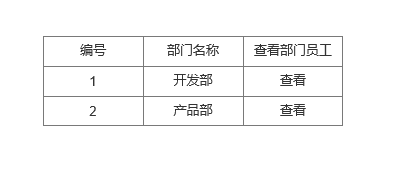
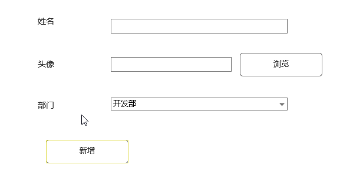

# Dubbo

### 主要内容

1. Dubbo简介
2. Dubbo架构讲解
3. Dubbo支持的协议
4. Dubbo支持的注册中心
5. 第一个Dubbo的Provider
6. Admin管理界面搭建
7. 成Dubbo的Consumer
8. 负载均衡
9. 完整Dubbo项目演示

### 学习目标

| 知识点                | 要求 |
| --------------------- | ---- |
| Dubbo简介             | 掌握 |
| Dubbo架构讲解         | 精通 |
| Dubbo支持的协议       | 掌握 |
| Dubbo支持的注册中心   | 掌握 |
| 第一个Dubbo的Provider | 掌握 |
| Admin管理界面搭建     | 掌握 |
| 完成Dubbo的Consumer   | 掌握 |
| 负载均衡              | 掌握 |
| 完整Dubbo项目演示     | 掌握 |

### 一、Dubbo简介

#### 1,官方说明 


​	Apache Dubbo 是一个高可用的，基于Java的开源RPC框架。

​	Dubbo框架不仅仅是具备RPC访问功能，还包含服务治理功能。

#### 2.发展历史

​	Dubbo是最开始是阿里巴巴内部使用的RPC框架。

​	2011年对外提供。

​	2012年停止更新。

​	2017年开始继续更新。

​	2019年捐献给Apache，由Apache维护2.7以上版本。

#### 3.Dubbo架构讲解

##### 3.1架构图


#### 3.2架构说明

##### 3.2.1虚线

​	虚线表示异步，实线表示同步。异步不阻塞线程性能高，同步阻塞线程必须等待响应结果才能继续执行，相对性能低。

##### 3.2.2Provider

​	提供者。编写持久层和事务代码。

##### 3.2.3Container

​	容器（Spring容器），Dubbo完全基于Spring实现的。

##### 3.2.4Registry

​	注册中心。放置所有Provider对外提供的信息。包含Provider的IP，访问端口，访问遵守的协议，对外提供的接口，接口中有哪些方法等相关信息。

##### 3.2.5Consumer

​	消费者（RPC调用者，SOA调用服务的项目）开发中也是一个项目，编写service和controller（还可以报页面等）。调用XXXXServiceImpl中的方法。

##### 3.2.6Monitor

​	监控中心。监控Provider的压力情况等。每隔2分钟Consumer和Provider会把调用次数发送给Monitor，由Monitor进行统计。

#### 4.执行流程

0. start：启动Spring容器时会把Provider启动。 
1. register：把Provider相关信息注册到Registry里
2. subscribe：Consumer从Registry中订阅Provider的信息
3. notify：通知给Consumer
4. invoke：Consumer根据Registry通知的信息进行调用Provider中方法。
5. count:Consumer和Provider把调用次数信息异步发送给Monitor进行统计。

### 二、Dubbo支持的协议

#### 1.Dubbo协议(官方推荐协议)

​	优点：

​		采用NIO复用单一长连接，并使用线程池并发处理请求，减少握手和加大并发效率，性能较好（推荐使用）

​	缺点：

​		大文件上传时,可能出现问题(不使用Dubbo文件上传)

#### 2.RMI(Remote Method Invocation)协议

​	优点:

​		JDK自带的能力。

​	缺点:

​		偶尔连接失败.

#### 3.Hessian协议

​	优点:

​		可与原生Hessian互操作，基于HTTP协议

​	缺点:

​		需hessian.jar支持，http短连接的开销大

### 三、Dubbo支持的注册中心

#### 1.Zookeeper(官方推荐)

​	1) 优点:

​		支持分布式.很多周边产品.

​	2) 缺点: 

​		受限于Zookeeper软件的稳定性.Zookeeper专门分布式辅助软件,稳定较优

#### 2.Multicast

​	1) 优点:

​		去中心化,不需要单独安装软件.

​	2) 缺点:

​		2.2.1 Provider和Consumer和Registry不能跨机房(路由)

#### 3.Redis

​	1) 优点:

​		支持集群,性能高

​	2) 缺点:

​		要求服务器时间同步.否则可能出现集群失败问题.

#### 4.Simple

​	1) 优点: 

​		标准RPC服务.没有兼容问题

​	2) 缺点: 

​		不支持集群.

### 四、第一个Dubbo的Provider

​	新建父项目Parent1。最终结构如下：


​	编写pom.xml继承SpringBoot父项目。

```
<parent>
    <groupId>org.springframework.boot</groupId>
    <artifactId>spring-boot-starter-parent</artifactId>
    <version>2.1.10.RELEASE</version>
</parent> 
```

#### 1.新建api项目

##### 1.1创建接口

​	创建com.msb.**dubbo**.service.Demo**Dubbo**Service接口

```
public interface DemoDubboService {
    String demo();
}
```

#### 2.新建provider项目

##### 2.1编写pom.xml

​	注意：不需要依赖web，如果依赖spring-boot-start-web还需要考虑端口问题。

```
<dependencies>
    <dependency>
        <artifactId>api</artifactId>
        <groupId>com.msb</groupId>
        <version>1.0-SNAPSHOT</version>
    </dependency>
    <dependency>
        <groupId>org.springframework.boot</groupId>
        <artifactId>spring-boot-starter</artifactId>
        <version>2.1.10.RELEASE</version>
    </dependency>
    <dependency>
        <groupId>org.apache.dubbo</groupId>
        <artifactId>dubbo-spring-boot-starter</artifactId>
        <version>2.7.3</version>
    </dependency>
    <dependency>
        <groupId>org.apache.curator</groupId>
        <artifactId>curator-recipes</artifactId>
        <version>4.2.0</version>
    </dependency>
    <dependency>
        <groupId>org.apache.curator</groupId>
        <artifactId>curator-framework</artifactId>
        <version>4.2.0</version>
    </dependency>
</dependencies>   
```

##### 2.2编写配置文件

​	新建application.yml

```
dubbo:
  application:
    name: dubbo-provider
  registry:
    address: zookeeper://192.168.32.128:2181
```

##### 2.3新建实现类

​	新建com.msb.dubbo.service.impl.DemoDubboServiceImpl

​	注意：注解是apache的注解。

```
import com.msb.dubbo.service.DemoDubboService;
import org.apache.dubbo.config.annotation.Service;

@Service
public class DemoDubboServiceImpl implements DemoDubboService {
    @Override
    public String demo() {
        System.out.println("demo方法");
        return "123";
    }
}
```

##### 2.4新建启动类

​	新建com.msb.ProviderApplication。

​	必须要有@EnableDubbo注解，否则Dubbo不生效。

```
@SpringBootApplication
@EnableDubbo
public class ProviderApplication {
    public static void main(String[] args) {
        SpringApplication.run(ProviderApplication.class,args);
    }
}
```


###  五、完成Dubbo的Consumer

​	创建consumer项目

#### 1.编写pom.xml

```
<dependencies>
    <dependency>
        <artifactId>api</artifactId>
        <groupId>com.msb</groupId>
        <version>1.0-SNAPSHOT</version>
    </dependency>
    <dependency>
        <groupId>org.springframework.boot</groupId>
        <artifactId>spring-boot-starter-web</artifactId>
        <version>2.1.10.RELEASE</version>
    </dependency>
    <dependency>
        <groupId>org.apache.dubbo</groupId>
        <artifactId>dubbo-spring-boot-starter</artifactId>
        <version>2.7.3</version>
    </dependency>
    <dependency>
        <groupId>org.apache.curator</groupId>
        <artifactId>curator-recipes</artifactId>
        <version>4.2.0</version>
    </dependency>
    <dependency>
        <groupId>org.apache.curator</groupId>
        <artifactId>curator-framework</artifactId>
        <version>4.2.0</version>
    </dependency>
</dependencies>   
```

#### 2.新建配置文件

​	新建application.yml

```
dubbo:
  application:
    name: dubbo-consumer
  registry:
    address: zookeeper://192.168.32.128:2181
```

#### 3.新建service及实现类

​	新建com.msb.service.DemoService

​	新建com.msb.service.impl.DemoServiceImpl

​	调用服务使用@Reference注解，不要倒错包了，有两个。

```
public interface DemoService {
    String consumerDemo();
}
```

```
import com.msb.dubbo.service.DemoDubboService;
import com.msb.service.DemoService;
import org.apache.dubbo.config.annotation.Reference;
import org.springframework.stereotype.Service;

@Service
public class DemoServiceImpl implements DemoService {

    @Reference
    private DemoDubboService demoDubboService;

    @Override
    public String consumerDemo() {
        return demoDubboService.demo();
    }
}
```

#### 4.新建控制器

​	新建控制器com.msb.controller.DemoController

```
@Controller
public class DemoController {
    @Autowired
    private DemoService demoService;

    @RequestMapping("/demo")
    @ResponseBody
    public String demo(){
        return demoService.consumerDemo();
    }
}
```

#### 5.新建启动器

​	新建com.msb.ConsumerApplication

```
@SpringBootApplication
@EnableDubbo
public class ConsumerApplication {
    public static void main(String[] args) {
        SpringApplication.run(ConsumerApplication.class,args);
    }
}
```

### 六、Admin管理界面搭建

​	资料中把dubbo-admin-0.2.0.jar\BOOT-INF\classes 中application.properties里面注册中心的ip设置正确

​	使用java -jar dubbo-admin-0.2.0.jar运行即可。

​	注意：占用8080端口，不要冲突了。


### 七、负载均衡

​	集群：一个内容，部署多次，形成的整体称为集群。集群中每个个体应该部署到不同的服务器上。

​	伪集群：集群中内容部署到同一台服务器上，通过不同端口区分不同个体。

​	负载均衡是在集群前提下，当访问整个集群时，集群中每个节点被访问次数或频率的规则。

​	Dubbo 内置了四个负载均衡策略。默认为Random

#### 1.内置策略

##### 1.1Random

​	随机。随机访问集群中节点。访问概率和权重有关。

##### 1.2RoundRobin

​	轮询。访问频率和权重有关。

​	权重（weight）：占有比例。集群中每个项目部署的服务器的性能可能是不同，性能好的服务器权重应该高一些。

##### 1.3LeastActive

​	活跃数相同的随机，不同的活跃数高的放前面。

##### 1.4ConsistentHash

​	一致性Hash。相同参数请求总是发到一个提供者。

#### 2.Provider集群

​	新建四个启动类。

​	每次启动启动类修改配置文件dubbo.protocal.port

#### 3.设置负载均衡

##### 3.1@Reference

​	调用的服务采用的负载均衡

```
@Reference(loadbalance = "roundrobin")
private DemoDubboService demoDubboService;
```

##### 3.2 @Service

​	当前服务采用的负载均衡算法

```
@Service(loadbalance = "random")
public class DemoDubboServiceImpl implements DemoDubboService {
```

​	设置权重

```
@Service(weight = 4)
```

##### 3.3配置文件

​			全局设置所有provider和consumer的负载均衡效果。

```
dubbo:
  application:
    name: dubbo-provider
  registry:
    address: zookeeper://192.168.32.128:2181
  protocol:
    port: 20884
  provider:
    loadbalance: random
  consumer:
    loadbalance: random
```


### 八、完整Dubbo项目演示

#### 1.原型

##### 1.1部门显示

​	显示全部部门信息




##### 1.2员工新增




##### 1.3查看部门员工


#### 2.按照分布式架构进行设计项目

​		设定员工管理和部门管理不在同一个模块中，需要有一个员工管理项目和一个部门管理项目。

​	为了方便，不去每个项目使用一个窗口，而是使用聚合项目。      


#### 3.创建数据库表

```
create table dept(
id int(11) primary key auto_increment,
name varchar(20)
);

insert into dept values(default,'开发部');
insert into dept values(default,'产品部');

create table emp(
id int(11) primary key auto_increment,
name varchar(20),
photo varchar(200),
did int(11),
CONSTRAINT fk_emp_dept FOREIGN key (did) REFERENCES dept(id)
);
```


#### 4.创建父项目

​	创建项目parent。


编写pom.xml

```
<parent>
    <groupId>org.springframework.boot</groupId>
    <artifactId>spring-boot-starter-parent</artifactId>
    <version>2.1.10.RELEASE</version>
</parent>
<dependencyManagement>
    <dependencies>
        <dependency>
            <groupId>org.springframework.boot</groupId>
            <artifactId>spring-boot-starter</artifactId>
            <version>2.1.10.RELEASE</version>
        </dependency>
        <dependency>
            <groupId>org.springframework.boot</groupId>
            <artifactId>spring-boot-starter-web</artifactId>
            <version>2.1.10.RELEASE</version>
        </dependency>
        <dependency>
            <groupId>org.springframework.boot</groupId>
            <artifactId>spring-boot-starter-thymeleaf</artifactId>
            <version>2.1.10.RELEASE</version>
        </dependency>
        <dependency>
            <groupId>org.apache.dubbo</groupId>
            <artifactId>dubbo-spring-boot-starter</artifactId>
            <version>2.7.3</version>
        </dependency>
        <dependency>
            <groupId>org.apache.curator</groupId>
            <artifactId>curator-recipes</artifactId>
            <version>4.2.0</version>
        </dependency>
        <dependency>
            <groupId>org.apache.curator</groupId>
            <artifactId>curator-framework</artifactId>
            <version>4.2.0</version>
        </dependency>
        <dependency>
            <groupId>org.mybatis.spring.boot</groupId>
            <artifactId>mybatis-spring-boot-starter</artifactId>
            <version>2.1.1</version>
        </dependency>
        <dependency>
            <groupId>mysql</groupId>
            <artifactId>mysql-connector-java</artifactId>
            <version>5.1.6</version>
        </dependency>
        <dependency>
            <groupId>commons-io</groupId>
            <artifactId>commons-io</artifactId>
            <version>2.6</version>
        </dependency>
         <dependency>
             <groupId>org.projectlombok</groupId>
             <artifactId>lombok</artifactId>
             <version>1.18.12</version>
             <scope>provided</scope>
         </dependency>
    </dependencies>
</dependencyManagement>
```


#### 5.创建pojo项目


#### 6.创建mapper项目

##### 6.1编写pom.xml

```
<dependencies>
    <dependency>
        <artifactId>pojo</artifactId>
        <groupId>com.msb</groupId>
        <version>1.0.0</version>
    </dependency>
    <dependency>
        <groupId>org.mybatis.spring.boot</groupId>
        <artifactId>mybatis-spring-boot-starter</artifactId>
    </dependency>
    <dependency>
        <groupId>mysql</groupId>
        <artifactId>mysql-connector-java</artifactId>
    </dependency>
</dependencies>    
```

##### 6.2新建配置文件

​	新建application-mybatis.yml

```
spring:
  datasource:
    driver-class-name: com.mysql.jdbc.Driver
    url: jdbc:mysql://localhost:3306/maven
    username: root
    password: root

mybatis:
  mapper-locations: classpath:mybatis/*.xml
  type-aliases-package: com.msb.pojo
```


#### 7.新建api项目

##### 7.1编写pom.xml

```
<dependencies>
    <dependency>
        <artifactId>pojo</artifactId>
        <groupId>com.bjsxt</groupId>
        <version>1.0-SNAPSHOT</version>
    </dependency>
</dependencies>    
```

#### 8.新建provider

##### 8.1编写pom.xml

```
<dependencies>
    <dependency>
        <artifactId>mapper</artifactId>
        <groupId>com.msb</groupId>
        <version>1.0.0</version>
    </dependency>
    <dependency>
        <artifactId>api</artifactId>
        <groupId>com.msb</groupId>
        <version>1.0.0</version>
    </dependency>
    <dependency>
        <groupId>org.springframework.boot</groupId>
        <artifactId>spring-boot-starter</artifactId>
    </dependency>
    <dependency>
        <groupId>org.apache.dubbo</groupId>
        <artifactId>dubbo-spring-boot-starter</artifactId>
    </dependency>
    <dependency>
        <groupId>org.apache.curator</groupId>
        <artifactId>curator-recipes</artifactId>
    </dependency>
    <dependency>
        <groupId>org.apache.curator</groupId>
        <artifactId>curator-framework</artifactId>
    </dependency>
</dependencies>
```

##### 8.2新建配置文件

​	新建application.yml

```
dubbo:
  application:
    name: dubbo-provider
  registry:
    address: zookeeper://192.168.52.128:2181

# 加载其他配置文件,加载其他application-*.yml文件，多个名称之间使用逗号分隔
spring:
  profiles:
    active: mybatis
```

##### 8.3新建启动类

​	新建com.msb.ProviderApplication

```
@SpringBootApplication
@EnableDubbo
@MapperScan("com.msb.mapper")
public class ProviderApplication {
    public static void main(String[] args) {
        SpringApplication.run(ProviderApplication.class,args);
    }
}
```

#### 9.完成Dept查询功能

##### 9.1在api中新建接口

​	com.msb.dubbo.service.DeptDubboService

```
public interface DeptDubboService {
    List<Dept> selectAll();
}
```

##### 9.2在provider中新建实现类

​	com.msb.dubbo.service.impl.DeptDubboServiceImpl

```
@Service
public class DeptDubboServiceImpl implements DeptDubboService {
    @Autowired
    private DeptMapper deptMapper;
    @Override
    public List<Dept> selectAll() {
        return deptMapper.selectByExample(null);
    }
}
```

##### 9.3新建项目dept

###### 9.3.1添加依赖

```
<dependencies>
    <dependency>
        <artifactId>api</artifactId>
        <groupId>com.msb</groupId>
        <version>1.0.0</version>
    </dependency>
    <dependency>
        <groupId>org.springframework.boot</groupId>
        <artifactId>spring-boot-starter-web</artifactId>
    </dependency>
    <dependency>
        <groupId>org.springframework.boot</groupId>
        <artifactId>spring-boot-starter-thymeleaf</artifactId>
    </dependency>
    <dependency>
        <groupId>org.apache.dubbo</groupId>
        <artifactId>dubbo-spring-boot-starter</artifactId>
    </dependency>
    <dependency>
        <groupId>org.apache.curator</groupId>
        <artifactId>curator-recipes</artifactId>
    </dependency>
    <dependency>
        <groupId>org.apache.curator</groupId>
        <artifactId>curator-framework</artifactId>
    </dependency>
</dependencies>   
```

###### 9.3.2编写配置文件

​	新建application.yml

```
dubbo:
  application:
    name: dubbo-dept-consumer
  registry:
    address: zookeeper://192.168.52.128:2181
```

###### 9.3.3新建启动类

​	com.msb.DeptApplication

```
@SpringBootApplication
@EnableDubbo
public class DeptApplication {
    public static void main(String[] args) {
        SpringApplication.run(DeptApplication.class,args);
    }
}
```

###### 9.3.4新建接口及实现类

​	接口：com.msb.service.DeptService

​	实现类：com.msb.service.impl.DeptServiceImpl

```
public interface DeptService {
    List<Dept> showAll();
}
```

```
@Service
public class DeptServiceImpl implements DeptService {
    @Reference
    private DeptDubboService deptDubboService;
    @Override
    public List<Dept> showAll() {
        return deptDubboService.selectAll();
    }
}
```

###### 9.3.5新建控制器

​	com.msb.controller.DeptController

```
@Controller
public class DeptController {

    @Autowired
    private DeptService deptService;

    @GetMapping("/dept")
    public String shwoDept(Model model){
        model.addAttribute("list",deptService.showAll());
        return "dept";
    }
}
```

##### 9.3.6  新建页面

​	在resources /templates新建dept.html

```
<!DOCTYPE html>
<html lang="en" xmlns:th="http://www.thymeleaf.org">
<head>
    <meta charset="UTF-8">
    <title>Title</title>
</head>
<body>
    <table border="1" width="500">
        <tr>
            <th>编号</th>
            <th>部门名称</th>
            <th>查看</th>
        </tr>
        <tr th:each="dept : ${list}">
            <td th:text="${dept.id}"></td>
            <td th:text="${dept.name}"></td>
            <td> <a th:href="@{/showEmp(did=${dept.id})}">查看</a> </td>
        </tr>
    </table>
</body>
</html>             
```


 
