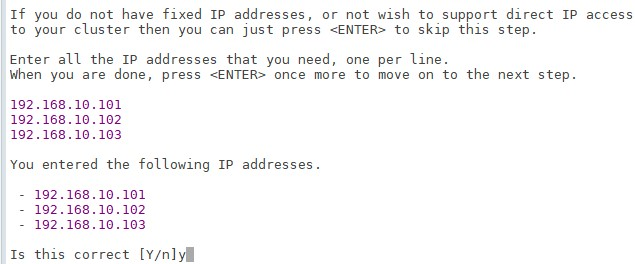

> 尚硅谷项目课程系列之 **Elasticsearch8.X**

{width="4.240972222222222in"
height="2.0944444444444446in"}

尚硅谷 JavaEE 教研组

# 第1章 Elasticsearch 8.X 概述 

## 1.1 Elasticsearch 8.X 来了

{width="5.7625in" height="3.3381944444444445in"} 距
2019 年 Elasticsearch 上一大版本 7.0 发布至今已经过去了 3 年。这 3
年中，由于疫情等众所周知的原因，程序员对很多软件技术的更新和迭代其实并不会抱有太多的期待和幻想。不过，2022
年 2 月 11 日，Elasticsearch 发布了全新的 8.0
正式版本，这着实给了我们不小的惊喜！新版本中通过改进 Elasticsearch
的矢量搜索功能、对现代自然语言处理模型的原生支持、不断简化的数据上线过程，以及精简的安全防护体验，在速度、扩展幅度、相关性和简便性方面，让搜索引擎技术迎来了一个全新的时代。

## **1.2 Elasticsearch** 新特性 

从 2019 年 4 月 10 日 Elasticsearch7.0 版本的发布，到 2022 年 2 月 11 日
Elasticsearch8.0 版本的发布的近 3
年间，基于不断优化的开发设计理念，Elasticsearch
发布了一系列的小版本。这些小版本在以下方面取得了长足的进步并同时引入一些全新的功能：

-   减少内存堆使用，完全支持 ARM
    架构，引入全新的方式以使用更少的存储空间，从而让每个节点托管更多的数据

-   降低查询开销，在大规模部署中成效尤为明显

-   提高日期直方图和搜索聚合的速度，增强了页面缓存的性能，并创建了一个新的

> "pre-filter"搜索短语

-   在 Elasticsearch 7.3 和 Elasticsearch 7.4
    版中，引入了对矢量相似函数的支持在最新发布的 8.0
    版本中，也同样增加和完善了很多新的功能

-   增加对自然语言处理 (NLP)
    模型的原生支持，让矢量搜索功能更容易实现，让客户和员工能够使用他们自己的文字和语言来搜索并收到高度相关的结果。

-   直接在 Elasticsearch
    中执行命名实体识别、情感分析、文本分类等，而无需使用额外的组件或进行编码。

-   Elasticsearch 8.0 基于 Lucene 9.0 开发的，那些利用现代 NLP
    的搜索体验，都可以借助（新增的）对近似最近邻搜索的原生支持，快速且大规模地实现。通过
    ANN，可以快速并高效地将基于矢量的查询与基于矢量的文档语料库（无论是小语料库、大语料库

> 还是巨型语料库）进行比较。

-   可以直接在 Elasticsearch 中使用 PyTorch Machine Learning 模型（如
    BERT），并在

> Elasticsearch 中原生使用这些模型执行推理。

## **1.3 Elasticsearch** 课程升级 

之前课程中的 Elasticsearch 软件是基于 7.8 版本进行讲解的，既然
Elasticsearch 升级到了 8.X
版本，我们也要与时俱进，不断更新课件，拥抱最新版本。

虽然之前的课程内容是基于 7.8
版本，但其实讲解时主要还是侧重于入门级基础内容，这一次我们不仅仅要将 8.X
新版本的特性介绍给大家，同时课程中还会融合一些新的 7.X 版

本特性的内容。

# 第2章 Elasticsearch 安装 & 使用

{width="5.254389763779527in"
height="2.2141754155730533in"}

从官网截图上可以看到，Elasticsearch最新版本也终于开始拥抱号称史上最快的JDK了。

所以在安装 ES 软件前，需要下载使用 Java JDK17

## 2.1.1 下载软件

Java 的官方地址：https://www.oracle.com/java

Java 最新的版本是 18.0.1.1（截止 2022.6.15），我们选择 17.0.3 版本

下载地址：https://www.oracle.com/java/technologies/downloads

{width="5.837723097112861in"
height="1.951000656167979in"}

对于 Java 开发人员来讲，更熟悉的开发版本应该是 JDK1.8，突然需要升级到
JDK17，其实本身会感觉有点不适应，甚至会有点排斥。担心升级后会对现有的程序代码造成影响。其实，对于
JDK1.8，最新版本的 JDK17 增加了很多的语法特性:

> {width="2.98875in" height="1.2983464566929135in"}
>
> {width="4.092361111111111in"
> height="7.0061242344706915in"}

{width="4.626388888888889in"
height="4.358333333333333in"}

对于大多数项目而言，想要利用这些新的特性，是需要修改代码的，但性能除外。也就是说，升级
JDK
版本，现有代码即使不进行修改，也不会出现兼容问题，但性能会得到极大的提升，并且高吞吐量垃圾回收器比低延迟垃圾回收器更快，更重要的是它可以免费商用。

对于升级版本而言，如果你依然有顾虑，一个好的消息就是我们可以下载含有适配
JDK 的 ES 版本，上面提到的内容基本上就不用考虑，一切就是这么顺滑，对吗？

## **2.2 Elasticsearch** 安装 **&** 使用 

### 2.2.1 下载软件 

Elasticsearch 的官方地址：https://www.elastic.co/cn/

Elasticsearch 最新的版本是 8.2.3（截止 2022.06.15），我们选择略早的
8.1.0
版本下载地址：https://www.elastic.co/cn/downloads/past-releases\#elasticsearch

> {width="5.822778871391076in"
> height="1.2757086614173228in"}

可以根据情况自行选择不同操作系统的版本。

{width="5.829388670166229in"
height="1.9764162292213474in"}

本课程着重讲解新版 ES 软件的特性及应用，所以采用 linux 集群配置。

1)  集群规划为了演示软件的使用，我们这里准备三台 linux 虚拟机，用于配置
    Elasticsearch 集群。启动集群后，每台虚拟机的进程如下：

  主机名   linux1                     linux2                     linux3

-------- -------------------------- -------------------------- --------------------------

  进程名   Elasticsearch(es-node-1)   Elasticsearch(es-node-2)   Elasticsearch(es-node-3)

> Linux 系统环境配置请参考之前课程内容。这里我们给三台虚拟机搭建 ES
> 集群，集群
>
> 中-节点名称依次为 es-node-1，es-node-2，es-node-3

2)  将压缩包 elasticsearch-8.1.0-linux-x86_64.tar.gz 上传到虚拟机中

> {width="5.614444444444445in"
> height="0.9016797900262468in"}
>
> 解压缩文件到自定义路径，笔者解压路径为：/opt/module,解压后，软件路径为：
>
> /opt/module/elasticsearch-8.1.0
>
> \# 切换目录

cd. software

> \# 解压缩
>
> tar -zxvf elasticsearch-8.1.0-linux-x86_64.tar.gz -C /opt/module
>
> 解压后的 Elasticsearch 的目录结构如下
>
> {width="4.322361111111111in"
> height="1.8808464566929133in"}

+---------+------------------+
| 目录    | > 含义           |
+=========+==================+
| bin     | > 可执行脚本目录 |
+---------+------------------+
| config  | > 配置目录       |
+---------+------------------+
| jdk     | > 内置 JDK 目录  |
+---------+------------------+
| lib     | > 类库           |
+---------+------------------+
| logs    | > 日志目录       |
+---------+------------------+
| modules | > 模块目录       |
+---------+------------------+
| plugins | > 插件目录       |
+---------+------------------+

3)  当前安装 ES 版本为 8.1.0，自带 JDK，所以当前 Linux
    虚拟机节点无需配置 Java 环境

4)  创建 linux 新用户 es, 数据文件，证书目录, 并修改 Elasticsearch
    文件拥有者

> \# 新增es用户
>
> useradd es
>
> \# 为es用户设置密码
>
> passwd es
>
> \# 创建数据文件目录
>
> mkdir /opt/module/elasticsearch-8.1.0/data
>
> \# 创建证书目录
>
> mkdir /opt/module/elasticsearch-8.1.0/config/certs
>
> \#切换目录

cd. /opt/module/elasticsearch-8.1.0

> \# 修改文件拥有者
>
> chown -R es:es /opt/module/elasticsearch-8.1.0

5)  在第一台服务器节点 es-node-1 设置集群多节点通信密钥

> \# 切换用户
>
> su es
>
> \# 签发ca证书，过程中需按两次回车键
>
> bin/elasticsearch-certutil ca
>
> \# 用ca证书签发节点证书，过程中需按三次回车键
>
> bin/elasticsearch-certutil cert \--ca elastic-stack-ca.p12
>
> \# 将生成的证书文件移动到config/certs目录中
>
> mv elastic-stack-ca.p12 elastic-certificates.p12 config/certs

6)  在第一台服务器节点 es-node-1 设置集群多节点 HTTP 证书

> \# 签发Https证书
>
> {width="2.995416666666667in"
> height="1.3232786526684164in"}
>
> 指定证书路径

{width="3.279861111111111in"
height="0.36527777777777776in"}

> 无需输入密码
>
> {width="3.6173611111111112in"
> height="0.4027777777777778in"}
>
> 设置证书失效时间

{width="4.288888888888889in"
height="0.4152777777777778in"}

> 无需每个节点配置证书

{width="3.31875in" height="0.5020833333333333in"}

> 输出连接到第一个节点的所有主机名称
>
> {width="2.9054166666666665in"
> height="1.2348753280839895in"}
>
> 输出连接到第一个节点的所有主机 IP 地址
>
> {width="3.092361111111111in"
> height="1.3182075678040246in"}
>
> 不改变证书选项配置

{width="2.7354166666666666in"
height="0.4951388888888889in"}

> {width="5.474445538057743in"
> height="2.4377766841644792in"}
>
> \# 解压文件
>
> unzip elasticsearch-ssl-http.zip
>
> 将解压后的证书文件移动到 config/certs 目录中
>
> \# 移动文件
>
> mv elasticsearch/http.p12 kibana/elasticsearch-ca.pem config/certs

7)  修改主配置文件：config/elasticsearch.yml

+----------------------------------------------------------------------+
| ~\#~ 设置ES集群名称                                                  |
|                                                                      |
| cluster.name: es-cluster                                             |
|                                                                      |
| \# 设置集群中当前节点名称                                            |
|                                                                      |
| node.name: es-node-1                                                 |
|                                                                      |
| \# 设置数据，日志文件路径                                            |
|                                                                      |
| path.data: /opt/module/elasticsearch-8.1.0/data                      |
|                                                                      |
| path.logs: /opt/module/elasticsearch-8.1.0/log                       |
|                                                                      |
| \# 设置网络访问节点                                                  |
|                                                                      |
| network.host: linux1                                                 |
|                                                                      |
| \# 设置网络访问端口                                                  |
|                                                                      |
| http.port: 9200                                                      |
|                                                                      |
| \# 初始节点                                                          |
|                                                                      |
| discovery.seed_hosts: \[\"linux1\"\]                                 |
|                                                                      |
| \# 安全认证                                                          |
|                                                                      |
| xpack.security.enabled: true xpack.security.enrollment.enabled: true |
| xpack.security.http.ssl:                                             |
|                                                                      |
| enabled: true keystore.path:                                         |
| /opt/module/elasticsearch-8.1.0/config/certs/http.p12                |
| truststore.path:                                                     |
| /opt/module/elasticsearch-8.1.0/config/certs/http.p12                |
| xpack.security.transport.ssl: enabled: true verification_mode:       |
| certificate keystore.path:                                           |
|                                                                      |
| /                                                                    |
| opt/module/elasticsearch-8.1.0/config/certs/elastic-certificates.p12 |
| truststore.path:                                                     |
|                                                                      |
| /                                                                    |
| opt/module/elasticsearch-8.1.0/config/certs/elastic-certificates.p12 |
|                                                                      |
| \# 此处需注意，es-node-1为上面配置的节点名称                         |
|                                                                      |
| cluster.initial_master_nodes: \[\"es-node-1\"\] http.host:           |
| \[\_local\_, \_site\_\] ingest.geoip.downloader.enabled: false       |
| xpack.security.http.ssl.client_authentication: none                  |
+----------------------------------------------------------------------+

8)  启动 ES 软件

> \# 启动ES软件
>
> bin/elasticsearch
>
> 第一次成功启动后，会显示密码，请记住，访问时需要。只有第一次才有哟！
>
> {width="5.531112204724409in"
> height="2.1725131233595802in"}
>
> 上面图形内容因为涉及到多节点集群配置以及 **kibana**
> 配置，所以极其重要！！！如果没有出现上面图片，出现下面图片也可以按照指定方式进行配置。
>
> {width="5.547777777777778in"
> height="1.4765409011373578in"}
>
> \# ━━━━━━━━━━━━━━━━━━━━━━━━━━━━━━━━━━━━━━━━━━
> ━━━━━━━━━━━━━━━━━━━━━━━━━━━━━━━━━━━━━━━━━━━ ━━━━━━━━━━━
>
> ✅ Elasticsearch security features have been automatically configured!
>
> ✅ Authentication is enabled and cluster connections are encrypted.
>
> ℹ️ Password for the elastic user (reset with
>
> \`bin/elasticsearch-reset-password -u elastic\`):
>
> **O3x0hfu7i=ZbQvlktCnd**
>
> ❌ Unable to generate an enrollment token for Kibana instances, try
> invoking \`bin/elasticsearch-create-enrollment-token -s kibana\`.
>
> ❌ An enrollment token to enroll new nodes wasn\'t generated. To add
> nodes and enroll them into this cluster:

-   On this node:

> ⁃ Create an enrollment token with
>
> \`bin/elasticsearch-create-enrollment-token -s node\`.
>
> ⁃ Restart Elasticsearch.

-   On other nodes:

> ⁃ Start Elasticsearch with \`bin/elasticsearch \--enrollment-token
> \<token\>\`, using the enrollment token that you generated.
>
> ━━━━━━━━━━━━━━━━━━━━━━━━━━━━━━━━━━━━━━━━━━━
>
> ━━━━━━━━━━━━━━━━━━━━━━━━━━━━━━━━━━━━━━━━━━━ ━━━━━━━━━━
>
> 注意：9300 端口为 Elasticsearch 集群间组件的通信端口，9200
> 端口为浏览器访问的

http 协议 RESTful 端口。

9)  访问服务器节点 https://虚拟机地址:9200

因为配置了安全协议，所以使用 https
协议进行访问，但由于证书是自己生成的，并不 可靠，所以会有安全提示

> {width="5.471111111111111in"
> height="2.3408464566929132in"}
>
> {width="1.9756944444444444in"
> height="1.44375in"}
>
> {width="5.474445538057743in"
> height="2.589443350831146in"}

10) 修改集群中其他节点的配置文件：config/elasticsearch.yml

> linux2: 证书直接拷贝，其他步骤完全相同，配置文件中修改如下内容即可
>
> \# 设置节点名称
>
> node.name: es-node-2
>
> \# 设置网络访问主机
>
> network.host: linux2
>
> linux3:证书直接拷贝，其他步骤完全相同，配置文件中修改如下内容即可
>
> \# 设置节点名称
>
> node.name: es-node-3
>
> \# 设置网络访问主机
>
> network.host: linux3

11) 依次启动集群的三台服务器节点, 不要忘记切换用户后再启动

> linux1:
>
> \# 后台启动服务
>
> bin/elasticsearch -d
>
> linux2:
>
> \# 后台启动服务
>
> bin/elasticsearch -d
>
> linux3:
>
> \# 后台启动服务
>
> bin/elasticsearch -d

### 2.2.3 问题解决 

-   Elasticsearch 是使用 java 开发的，8.1 版本的 ES 需要 JDK17
    及以上版本。默认安装包中带有 JDK 环境，如果系统配置 **ES_JAVA_HOME**
    环境变量，那么会采用系统配置的 **JDK**。如果没有配置该环境变量，ES
    会使用自带捆绑的 JDK。虽然自带的 JDK 是 ES 软件推荐的 Java
    版本，但一般建议使用系统配置的 JDK。

-   Windows 环境中出现下面的错误信息，是因为开启了 SSL 认证：

{width="5.368055555555555in"
height="1.1993055555555556in"}

> 修改 config/elasticsearch.yml 文件，将 enabled 的值修改为 false

+----------------------------------------------------------------------+
| \# Enable encryption for HTTP API client connections, such as        |
| Kibana, Logstash,                                                    |
+======================================================================+
| and Agents xpack.security.http.ssl:                                  |
|                                                                      |
| enabled: **false** keystore.path: certs/http.p12                     |
+----------------------------------------------------------------------+

-   启动成功后，如果访问 localhost:9200 地址后，弹出登录窗口

> {width="1.8333333333333333in"
> height="1.3395833333333333in"}

第一次启动时，因为开启了密码验证模式，在启动窗口中会显示输入账号和密码。如果
没有注意到或没有找到账号密码，可以设置免密登录：

> \# Enable security features xpack.security.enabled: **false**

-   双击启动窗口闪退，通过路径访问追踪错误，如果是"空间不足"，请修改

> config/jvm.options 配置文件
>
> \#
> 设置JVM初始内存为1G。此值可以设置与-Xmx相同，以避免每次垃圾回收完成后JVM重新分配内存
>
> \# Xms represents the initial size of total heap space
>
> \# 设置JVM最大可用内存为1G
>
> \# Xmx represents the maximum size of total heap space
>
> -Xms4g
>
> -Xmx4g

-   启动后，如果密码忘记了，怎么办？可以采用指令重置密码

+-------------------------------------------------------------------------+
| \# 使用es用户，执行指令，重置elastic用户密码                            |
|                                                                         |
| bin/elasticsearch-reset-password -u elastic                             |
+=========================================================================+
| > {width="5.438888888888889in" height="1.0375in"} |
+-------------------------------------------------------------------------+

> 如果只启动单一节点，此操作可能会失败，至少启动 2 个节点，测试成功

## **2.3 Kibana** 安装 **&** 使用 

Elasticsearch 的开源分析可视化工具，与存储在 Elasticsearch
中的数据进行交互

{width="5.829388670166229in"
height="1.7539162292213473in"}

Elasticsearch 下载的版本是 8.1.0，这里我们选择同样的 8.1.0 版本

下载地址：https://www.elastic.co/cn/downloads/past-releases\#kibana

> {width="5.822778871391076in"
> height="1.215430883639545in"}

**2.3.2** 安装软件本课程着重讲解新版 ES 软件的特性及应用，所以对应的
Kibana 也采用 linux 集群配置。

1\) 将压缩包 kibana-8.1.0-linux-x86_64.tar.gz 上传到虚拟机中

> {width="5.490972222222222in"
> height="0.5208333333333334in"}

解压缩文件到自定义路径，笔者解压路径为：/opt/module，解压后，软件路径为：

> /opt/module/kibana-8.1.0
>
> \# 切换目录
>
> cd software
>
> \# 解压缩
>
> tar -zxvf kibana-8.1.0-linux-x86_64.tar.gz -C /opt/module

{width="5.766056430446194in"
height="2.4376377952755908in"}

+----------------------------------------------------------------------+
| \# 在ES服务器中生成证书，输入回车即可                                |
|                                                                      |
| cd /opt/module/elasticsearch-8.1.0 bin/elasticsearch-certutil csr    |
| -name kibana -dns linux1                                             |
|                                                                      |
| \# 解压文件                                                          |
|                                                                      |
| unzip csr-bundle.zip                                                 |
|                                                                      |
| \# 将解压后的文件移动到kibana的config目录中                          |
|                                                                      |
| mv kibana.csr kibana.key /opt/module/kibana-8.1.0/config/            |
|                                                                      |
| \# 生成crt文件                                                       |
|                                                                      |
| openssl x509 -req -in kibana.csr -signkey kibana.key -out kibana.crt |
+----------------------------------------------------------------------+

3)  修改配置文件：kibana.yml

> \# 服务端口
>
> server.port: 5601
>
> \# 服务主机名
>
> server.host: \"linux1\"
>
> \# 国际化 - 中文
>
> i18n.locale: \"zh-CN\"
>
> \# ES服务主机地址
>
> elasticsearch.hosts: \[\"https://linux1:9200\"\]
>
> \# 访问ES服务的账号密码

+----------------------------------------------------------------------+
| elasticsearch.username: \"kibana\" elasticsearch.password:           |
| \"fnqIYLQGv81iyW5nWeZ-\"                                             |
|                                                                      |
| elasticsearch.ssl.verificationMode: none                             |
|                                                                      |
| elasticsearch.ssl.certificateAuthorities:                            |
|                                                                      |
| \[                                                                   |
| \                                                                    |
| "/opt/module/elasticsearch-8.1.0/config/certs/elasticsearch-ca.pem\" |
| \]                                                                   |
|                                                                      |
| server.ssl.enabled: true server.ssl.certificate:                     |
| /opt/module/kibana-8.1.0/config/kibana.crt server.ssl.key:           |
| /opt/module/kibana-8.1.0/config/kibana.key                           |
+----------------------------------------------------------------------+

4)  修改软件目录拥有者

> \# 切换目录
>
> chown -R es:es /opt/module/kibana-8.1.0/

5)  切换用户，启动软件

> \# 切换用户
>
> su es
>
> \# 启动软件
>
> bin/kibana
>
> \# 也可以后台启动
>
> nohup /opt/module/kibana-8.1.0/bin/kibana \>kibana.log 2\>&1 &

{width="5.829388670166229in"
height="1.9029451006124234in"}

> 打开浏览器，输入访问地址：https://linux1:5601
>
> {width="5.384445538057743in"
> height="2.1720964566929135in"}
>
> {width="5.384445538057743in"
> height="1.75501312335958in"}
>
> 输入 elastic 账号和密码即可访问
>
> {width="5.467778871391076in"
> height="6.554875328083989in"}
>
> {width="5.447778871391076in"
> height="1.35876312335958in"}

# 第3章 Elasticsearch 基础功能 

在之前 7.X 的课程视频中，已经给大家讲解了 Elasticsearch
软件的基础功能，这里咱们以 8.X 版本为基础通过 Kibana
软件给大家演示基本操作。

## **3.1** 索引操作 

### 3.1.1 创建索引 

ES 软件的索引可以类比为 MySQL
中表的概念，创建一个索引，类似于创建一个表。

查询完成后，Kibana 右侧会返回响应结果及请求状态

{width="5.7555555555555555in"
height="0.7381944444444445in"} 重复创建索引时，Kibana
右侧会返回响应结果，其中包含错误信息。

{width="5.829388670166229in"
height="1.7218339895013124in"}

根据索引名称查询指定索引，如果查询到，会返回索引的详细信息

> {width="5.822778871391076in"
> height="1.9222364391951006in"}

如果查询的索引未存在，会返回错误信息

{width="5.829388670166229in"
height="1.9764162292213474in"}

为了方便，可以查询当前所有索引数据。这里请求路径中的_cat
表示查看的意思，indices 表示索引，所以整体含义就是查看当前 ES
服务器中的所有索引，就好像 MySQL 中的 show

{width="5.829388670166229in"
height="1.5590266841644795in"}

这里的查询结果表示索引的状态信息，按顺序数据表示结果如下：

+------------------------+------------------+------------------------+
| 内容                   | > 含义           | 具体描述               |
+========================+==================+========================+
| green                  | > health         | 当前服务器健康状态：   |
|                        |                  |                        |
|                        |                  | **green**(集群完整)    |
|                        |                  | **yellow**             |
|                        |                  | (单点正常、集群不完整) |
|                        |                  | red(单点不正常)        |
+------------------------+------------------+------------------------+
| open                   | > status         | 索引打开、关闭状态     |
+------------------------+------------------+------------------------+
| myindex                | > index          | 索引名                 |
+------------------------+------------------+------------------------+
| Swx2xWHLR6yv23kTrK3sAg | > uuid           | 索引统一编号           |
+------------------------+------------------+------------------------+
| 1                      | > pri            | 主分片数量             |
+------------------------+------------------+------------------------+
| 1                      | > rep            | 副本数量               |
+------------------------+------------------+------------------------+
| 0                      | > docs.count     | 可用文档数量           |
+------------------------+------------------+------------------------+
| 0                      | > docs.deleted   | 文                     |
|                        |                  | 档删除状态（逻辑删除） |
+------------------------+------------------+------------------------+
| 450b                   | > store.size     | 主分片                 |
|                        |                  | 和副分片整体占空间大小 |
+------------------------+------------------+------------------------+
| 225b                   | > pri.store.size | 主分片占空间大小       |
+------------------------+------------------+------------------------+

### 3.1.4 删除索引 

{width="5.829388670166229in"
height="1.489303368328959in"}

如果删除一个不存在的索引，那么会返回错误信息

{width="5.829388670166229in"
height="2.0225360892388453in"}

文档是 ES 软件搜索数据的最小单位,
不依赖预先定义的模式，所以可以将文档类比为表的一行JSON类型的数据。我们知道关系型数据库中，要提前定义字段才能使用，在Elasticsearch
中，对于字段是非常灵活的，有时候，我们可以忽略该字段，或者动态的添加一个新的字段。

### 3.2.1 创建文档 

索引已经创建好了，接下来我们来创建文档，并添加数据。这里的文档可以类比为关系型数据库中的表数据，添加的数据格式为
JSON 格式

> {width="5.822778871391076in"
> height="1.2137642169728784in"}

此处因为没有指定数据唯一性标识，所以无法使用 PUT 请求，只能使用 POST
请求，且对数据会生成随机的唯一性标识。否则会返回错误信息

> {width="5.822778871391076in"
> height="0.9012642169728784in"}

如果在创建数据时，指定唯一性标识，那么请求范式 POST，PUT 都可以

> {width="5.80111220472441in"
> height="1.421984908136483in"}

### 3.2.2 查询文档 

{width="5.829388670166229in"
height="1.9311089238845145in"}

### 3.2.3 修改文档 

修改文档本质上和新增文档是一样的，如果存在就修改，如果不存在就新增

{width="5.834388670166229in"
height="2.4237139107611547in"}

删除一个文档不会立即从磁盘上移除，它只是被标记成已删除（逻辑删除）。

> {width="5.822778871391076in"
> height="2.172652012248469in"}

#### 3.2.5 查询所有文档 

{width="5.807723097112861in"
height="2.5968416447944005in"}

{width="5.829388670166229in"
height="2.844303368328959in"}

#### 3.3.1 查询所有文档 

{width="5.763888888888889in"
height="1.9666666666666666in"}

**3.3.2** 匹配查询文档这里的查询表示文档数据中 JSON 对象数据中的 name
属性是 zhangsan。

{width="5.829388670166229in"
height="2.8372495625546805in"}

默认情况下，Elasticsearch 在搜索的结果中，会把文档中保存在_source
的所有字段都返回。

如果我们只想获取其中的部分字段，我们可以添加_source 的过滤

{width="5.829388670166229in"
height="2.2137871828521436in"}

聚合允许使用者对 es 文档进行统计分析，类似与关系型数据库中的 group
by，当然还有很多其他的聚合，例如取最大值、平均值等等。

{width="5.829388670166229in"
height="2.6654582239720037in"}

### 3.4.2 求和 

{width="5.829388670166229in"
height="1.9544717847769029in"}

{width="5.829388670166229in"
height="1.9344728783902012in"}

{width="5.829388670166229in"
height="3.0547583114610672in"}

我们之前对索引进行一些配置信息设置，但是都是在单个索引上进行设置。在实际开发中，我们可能需要创建不止一个索引，但是每个索引或多或少都有一些共性。比如我们在设计关系型数据库时，一般都会为每个表结构设计一些常用的字段，比如：创建时间，更新时间，备注信息等。elasticsearch
在创建索引的时候，就引入了模板的概念，你可以先设置一些通用的模板，在创建索引的时候，elasticsearch
会先根据你创建的模板对索引进行设置。 elasticsearch
中提供了很多的默认设置模板，这就是为什么我们在新建文档的时候，可以为你自动设置一些信息，做一些字段转换等。

索引可使用预定义的模板进行创建,这个模板称作 Index
templates。模板设置包括 settings

和 mappings

### 3.5.1 创建模板 

\# 模板名称小写

PUT \_template/mytemplate

{

\"index_patterns\" : \[

\"my\*\"

\],

\"settings\" : {

\"index\" : {

\"number_of_shards\" : \"1\"

}

},

\"mappings\" : {

\"properties\" : {

\"now\": {

\"type\" : \"date\",

\"format\" : \"yyyy/MM/dd\"

}

}

{width="5.821056430446194in"
height="1.731890857392826in"}

### 3.5.2 查看模板 

{width="5.837723097112861in"
height="1.9820297462817147in"}

#### 3.5.3 验证模板是否存在 

\#

HEAD /\_template/mytemplate

{width="5.7652777777777775in"
height="0.37916666666666665in"}

### 3.5.4 创建索引 

\#

PUT testindex

{width="5.821056430446194in"
height="1.9503619860017498in"}

### 3.5.5 删除模板 

\#

DELETE /\_template/mytemplate

## **3.6** 中文分词 

我们在使用 Elasticsearch
官方默认的分词插件时会发现，其对中文的分词效果不佳，经常分词后得效果不是我们想要得。

GET \_analyze

{

\"analyzer\": \"chinese\",

{width="5.837723097112861in"
height="2.6045188101487313in"}

为了能够更好地对中文进行搜索和查询，就需要在Elasticsearch中集成好的分词器插件，而
IK 分词器就是用于对中文提供支持得插件。

### 3.6.1 集成 IK 分词器 

#### 3.6.1.1 下载 

下载地址：[[https://github.com/medcl/elasticsearch-analysis-ik/releases]{.ul}](https://github.com/medcl/elasticsearch-analysis-ik/releases)

注意：选择下载的版本要与 Elasticsearch 版本对应。我们这里选择 8.1.0

{width="5.837723097112861in"
height="2.3147353455818025in"}

在安装目录得 plugins 目中，将下载得压缩包直接解压缩得里面即可

{width="5.837723097112861in"
height="1.0816797900262467in"}

### 3.6.2 使用 IK 分词器 

IK 分词器提供了两个分词算法：

-   ik_smart: 最少切分

-   Ik_max_word:最细粒度划分

接下来咱们使用 ik_smart
算法对之前得中文内容进行分词，明显会发现和默认分词器得区

别。

GET \_analyze

{

\"analyzer\": \"ik_smart\",

\"text\": \[\"我是一个学生\"\] }

> {width="5.814444444444445in"
> height="2.1254297900262467in"}

接下来，再对比 ik_max_word 算法分词后的效果

{width="5.821056430446194in"
height="2.5806583552055993in"}

我们在使用 IK
分词器时会发现其实有时候分词的效果也并不是我们所期待的,有时一些特殊得术语会被拆开，比如上面得中文"一个学生"希望不要拆开，怎么做呢？其实
IK 插件给我们提供了自定义分词字典，我们就可以添加自己想要保留得字了。

> {width="5.772916666666666in"
> height="1.9034722222222222in"}
>
> {width="5.214027777777778in"
> height="1.6420953630796151in"}

接下来我们修改配置文件：IKAnalyzer.cfg.xml

\<?xml version=\"1.0\" encoding=\"UTF-8\"?\> \<!DOCTYPE properties
SYSTEM \"http://java.sun.com/dtd/properties.dtd\"\>

\<properties\>

\<comment\>IK Analyzer 扩展配置\</comment\>

\<!\--用户可以在这里配置自己的扩展字典 \--\>

\<entry key=\"ext_dict\"\>test.dic\</entry\>

\<!\--用户可以在这里配置自己的扩展停止词字典\--\>

\<entry key=\"ext_stopwords\"\>\</entry\>

\<!\--用户可以在这里配置远程扩展字典 \--\>

\<!\-- \<entry key=\"remote_ext_dict\"\>words_location\</entry\> \--\>

\<!\--用户可以在这里配置远程扩展停止词字典\--\>

\<!\-- \<entry key=\"remote_ext_stopwords\"\>words_location\</entry\>
\--\>

\</properties\>

重启 Elasticsearch 服务器查看效果

GET \_analyze

{

\"analyzer\": \"ik_smart\",

{width="5.821056430446194in"
height="2.002435476815398in"}

## **3.7** 文档得分 

> Lucene 和 ES 的得分机制是一个基于词频和逆文档词频的公式，简称为 TF-IDF
> 公式

{width="5.769444444444445in"
height="0.5486111111111112in"}

公式中将查询作为输入，使用不同的手段来确定每一篇文档的得分，将每一个因素最后通过公式综合起来，返回该文档的最终得分。这个综合考量的过程，就是我们希望相关的文档被优先返回的考量过程。在
Lucene 和 ES 中这种相关性称为得分。

考虑到查询内容和文档得关系比较复杂，所以公式中需要输入得参数和条件非常得多。但是其中比较重要得其实是两个算法机制

-   TF (词频)

Term Frequency :
搜索文本中的各个词条（term）在查询文本中出现了多少次，出现次数越多，就越相关，得分会比较高

-   IDF(逆文档频率)

Inverse Document Frequency :
搜索文本中的各个词条（term）在整个索引的所有文档中出现了多少次，出现的次数越多，说明越不重要，也就越不相关，得分就比较低。

### 3.7.1 打分机制 

接下来咱们用一个例子简单分析一下文档的打分机制：

1)  首先，咱们先准备一个基础数据

\# 创建索引

PUT /atguigu

\# 增加文档数据

\# 此时索引中只有这一条数据

PUT /atguigu/\_doc/1

{

\"text\":\"hello\"

}

2)  查询匹配条件的文档数据

\#

GET /atguigu/\_search

{

\"query\": {

\"match\": {

\"text\": \"hello\"

}

}

}

{width="5.821056430446194in"
height="2.114443350831146in"}

这里文档的得分为：0.2876821，很奇怪，此时索引中只有一个文档数据，且文档数据中可以直接匹配查询条件，为什么分值这么低？这就是公式的计算结果，咱们一起来看看

3)  分析文档数据打分过程

\# 增加分析参数

GET /atguigu/\_search**?explain=true**

{

\"query\": {

\"match\": {

\"text\": \"hello\"

}

}

}

执行后，会发现打分机制中有 2 个重要阶段：计算 TF 值和 IDF 值

{width="5.837723097112861in"
height="5.9991808836395455in"}

> {width="5.831112204724409in"
> height="0.7591797900262467in"}

4)  计算 TF 值

{width="4.965277777777778in"
height="0.4736111111111111in"}

+----------------+--------------------------------+------------------+
| 参数           | > 含义                         | > 取值           |
+================+================================+==================+
| freq           | > 文档中出现词条的次数         | > 1.0            |
+----------------+--------------------------------+------------------+
| k1             | > 术语饱和参数                 | > 1.2（默认值）  |
+----------------+--------------------------------+------------------+
| b              | > 长度规格化参数（单           | > 0.75（默认值） |
|                | 词长度对于整个文档的影响程度） |                  |
+----------------+--------------------------------+------------------+
| dl             | > 当前文中分解的字段长度       | > 1.0            |
+----------------+--------------------------------+------------------+
| avgdl          | > 查询文                       | > 1.0            |
|                | 档中分解字段数量/查询文档数量  |                  |
+----------------+--------------------------------+------------------+
| **TF**（词频） | > **1.0/(1 + 1.2 \* (1 - 0.75  | > **0.454545**   |
|                | > + 0.75\*1.0/1.0))**          |                  |
+----------------+--------------------------------+------------------+

5)  计算 IDF 值

{width="4.415277777777778in"
height="0.6236111111111111in"}

+-----------------------+-------------------------+---------------+
| 参数                  | > 含义                  | 取值          |
+=======================+=========================+===============+
| N                     | >                       | 1             |
|                       |  包含查询字段的文档总数 |               |
|                       | （不一定包含查询词条）  |               |
+-----------------------+-------------------------+---------------+
| n                     | > 包含查询词条的文档数  | 1             |
+-----------------------+-------------------------+---------------+
| **IDF**（逆文档频率） | > **log(1 + (1 - 1 +    | **0.2876821** |
|                       | > 0.5) / (1 + 0.5))**   |               |
+-----------------------+-------------------------+---------------+

注：这里的 **log** 是底数为 **e** 的对数

6)  计算文档得分

> {width="1.4736111111111112in"
> height="0.36527777777777776in"}

+-------------------+-----------------------+-----------------------+
| 参数              | > 含义                | > 取值                |
+===================+=======================+=======================+
| boost             | > 词条权重            | > **                  |
|                   |                       | 2.2**（基础值）**\*** |
|                   |                       | > 查询权重**(1)**     |
+-------------------+-----------------------+-----------------------+
| idf               | > 逆文档频率          | > **0.2876821**       |
+-------------------+-----------------------+-----------------------+
| tf                | > 词频                | > **0.454545**        |
+-------------------+-----------------------+-----------------------+
| **Score**（得分） | > **2.2 \* 0.2876821  | > **0.2876821**       |
|                   | > \* 0.454545**       |                       |
+-------------------+-----------------------+-----------------------+

7)  增加新的文档，测试得分

⚫ 增加一个毫无关系的文档

\# 增加文档

PUT /atguigu/\_doc/2

{

\"text\" : \"spark\"

}

\# 因为新文档无词条相关信息，所以匹配的文档数据得分就应该较高：

\# 0.6931741

GET /atguigu/\_search

{

\"query\": {

\"match\": {

\"text\": \"hello\"

}

}

{width="5.821056430446194in"
height="1.9970286526684164in"}

⚫ 增加一个一模一样的文档

\# 增加文档

PUT /atguigu/\_doc/2

{

\"text\" : \"hello\"

}

\#
因为新文档含词条相关信息，且多个文件含有词条，所以显得不是很重要，得分会变低

\# 0.18232156

GET /atguigu/\_search

{

\"query\": {

\"match\": {

\"text\": \"hello\"

}

}

{width="5.821056430446194in"
height="2.4303619860017496in"}

⚫ 增加一个含有词条，但是内容较多的文档

\# 增加文档

PUT /atguigu/\_doc/2

{

\"text\" : \"hello **elasticsearch**\"

}

\#
因为新文档含词条相关信息，但只是其中一部分，所以查询文档的分数会变得更低一些。

\# 0.14874382

GET /atguigu/\_search

{

\"query\": {

\"match\": {

\"text\": \"hello\"

}

{width="5.821056430446194in"
height="2.6086953193350833in"}

### 3.7.2 案例 

需求：

查询文档标题中含有"Hadoop","Elasticsearch","Spark"的内容。

优先选择"Spark"的内容

1\) 准备数据

\# 准备数据

PUT /testscore/\_doc/1001

{

\"title\" : \"Hadoop is a Framework\",

\"content\" : \"Hadoop 是一个大数据基础框架\"

}

PUT /testscore/\_doc/1002

{

\"title\" : \"Hive is a SQL Tools\",

\"content\" : \"Hive 是一个SQL工具\"

}

PUT /testscore/\_doc/1003

{

\"title\" : \"Spark is a Framework\",

\"content\" : \"Spark是一个分布式计算引擎\"

}

2\) 查询数据

\# 查询文档标题中含有"Hadoop","Elasticsearch","Spark"的内容

GET /testscore/\_search?explain=true

{

\"query\": {

\"bool\": {

\"should\": \[

{

\"match\": {

\"title\": {\"query\": \"Hadoop\", \"boost\": 1}

}

},

{

\"match\": {

\"title\": {\"query\": \"Hive\", \"boost\": 1}

}

},

{

\"match\": {

\"title\": {\"query\": \"Spark\", \"boost\": 1}

}

}

\]

}

}

}

此时，你会发现，Spark 的结果并不会放置在最前面

> {width="5.814444444444445in"
> height="2.209458661417323in"}

此时，咱们可以更改 Spark 查询的权重参数 boost.看看查询的结果有什么不同

\# 查询文档标题中含有"Hadoop","Elasticsearch","Spark"的内容

GET /testscore/\_search?explain=true

{

\"query\": {

\"bool\": {

\"should\": \[

{

\"match\": {

\"title\": {\"query\": \"Hadoop\", \"boost\": 1}

}

},

{

\"match\": {

\"title\": {\"query\": \"Hive\", \"boost\": 1}

}

},

{

\"match\": {

\"title\": {\"query\": \"Spark\", \"boost\": 2}

}

} \]

+----------------------------------------------------------------------+
| }                                                                    |
|                                                                      |
| }                                                                    |
|                                                                      |
| }                                                                    |
+======================================================================+
| > {width="5.761111111111111in"                |
| > height="2.1131944444444444in"}                                     |
+----------------------------------------------------------------------+

# 第4章 Elasticsearch 进阶功能 

## **4.1 Java API** 操作 

随着 Elasticsearch 8.x 新版本的到来，Type
的概念被废除，为了适应这种数据结构的改

变，Elasticsearch 官方从 7.15 版本开始建议使用新的 Elasticsearch Java
Client。

### 4.1.1 增加依赖关系 

\<properties\>

\<maven.compiler.source\>8\</maven.compiler.source\>

\<maven.compiler.target\>8\</maven.compiler.target\>

\<elastic.version\>8.1.0\</elastic.version\>

\</properties\>

\<dependencies\>

\<dependency\>

\<groupId\>org.elasticsearch.plugin\</groupId\>

\<artifactId\>x-pack-sql-jdbc\</artifactId\>

\<version\>8.1.0\</version\>

\</dependency\>

\<dependency\>

\<groupId\>co.elastic.clients\</groupId\>

\<artifactId\>elasticsearch-java\</artifactId\>

\<version\>\${elastic.version}\</version\>

\</dependency\>

\<dependency\>

\<groupId\>com.fasterxml.jackson.core\</groupId\>

\<artifactId\>jackson-databind\</artifactId\>

\<version\>2.12.3\</version\>

\</dependency\>

\<dependency\>

\<groupId\>jakarta.json\</groupId\>

\<artifactId\>jakarta.json-api\</artifactId\>

\<version\>2.0.1\</version\>

\</dependency\>

\</dependencies\>

**4.1.2** 获取客户端对象就像连接 MySQL 数据库一样，Java 通过客户端操作
Elasticsearch 也要获取到连接后才可以。咱们现在使用的基于 https 安全的
Elasticsearch 服务，所以首先我们需要将之前的证书进行一个转换

openssl pkcs12 -in elastic-stack-ca.p12 -clcerts -nokeys -out
**java-ca.crt**

> {width="5.831112204724409in"
> height="1.1591797900262468in"}

配置证书后，我们就可以采用 https 方式获取连接对象了。

+----------------------------------------------------------------------+
| \# 导入的类                                                          |
|                                                                      |
| import co.elastic.clients.elasticsearch.\*; import                   |
| co.elastic.clients.json.jackson.JacksonJsonpMapper; import           |
| co.elastic.clients.transport.ElasticsearchTransport; import          |
| co.elastic.clients.transport.rest_client.RestClientTransport; import |
| org.apache.http.HttpHost; import org.apache.http.auth.\*; import     |
| org.apache.http.client.\*; import                                    |
| org.apache.http.conn.ssl.NoopHostnameVerifier; import                |
| org.apache.http.impl.client.\*; import                               |
| org.apache.http.impl.nio.client.HttpAsyncClientBuilder; import       |
| org.apache.http.ssl.\*; import org.elasticsearch.client.\*;          |
|                                                                      |
| import javax.net.ssl.SSLContext; import java.io.InputStream; import  |
| java.nio.file.\*; import java.security.KeyStore; import              |
| java.security.cert.\*;                                               |
|                                                                      |
| \# 获取客户端对象                                                    |
|                                                                      |
| final CredentialsProvider credentialsProvider = new                  |
| BasicCredentialsProvider();                                          |
| credentialsProvider.setCredentials(AuthScope.ANY,                    |
|                                                                      |
| new UsernamePasswordCredentials(\"**elastic**\",                     |
| \"**O3x0hfu7i=ZbQvlktCnd**\"));                                      |
|                                                                      |
| Path caCertificatePath = Paths.get(\"**ca.crt**\");                  |
|                                                                      |
| CertificateFactory factory =                                         |
|                                                                      |
| CertificateFactory.getInstance(\"X.509\"); Certificate trustedCa;    |
| try (InputStream is = Files.newInputStream(caCertificatePath)) {     |
| trustedCa = factory.generateCertificate(is);                         |
|                                                                      |
| }                                                                    |
|                                                                      |
| KeyStore trustStore = KeyStore.getInstance(\"pkcs12\");              |
| trustStore.load(null, null);                                         |
|                                                                      |
| trustStore.setCertificateEntry(\"ca\", trustedCa);                   |
|                                                                      |
| SSLContextBuilder sslContextBuilder = SSLContexts.custom()           |
|                                                                      |
| .loadTrustMaterial(trustStore, null); final SSLContext sslContext =  |
| sslContextBuilder.build();                                           |
|                                                                      |
| RestClientBuilder builder = RestClient.builder( new                  |
| HttpHost(\"linux1\", 9200, \"https\"))                               |
| .setHttpClientConfigCallback(new                                     |
|                                                                      |
| RestClientBuilder.HttpClientConfigCallback() {                       |
|                                                                      |
| \@Override                                                           |
|                                                                      |
| public HttpAsyncClientBuilder customizeHttpClient(                   |
| HttpAsyncClientBuilder httpClientBuilder) { return                   |
| httpClientBuilder.setSSLContext(sslContext)                          |
|                                                                      |
| .setSSLHostnameVerifier(NoopHostnameVerifier.INSTANCE)               |
|                                                                      |
| .setDefaultCredentialsProvider(credentialsProvider);                 |
|                                                                      |
| }                                                                    |
|                                                                      |
| });                                                                  |
|                                                                      |
| RestClient restClient = builder.build();                             |
|                                                                      |
| ElasticsearchTransport transport = new RestClientTransport(          |
| restClient, new JacksonJsonpMapper());                               |
|                                                                      |
| ElasticsearchClient client = new ElasticsearchClient(transport);     |
|                                                                      |
| ElasticsearchAsyncClient asyncClient = new                           |
| ElasticsearchAsyncClient(transport); \...                            |
|                                                                      |
| transport.close();                                                   |
+----------------------------------------------------------------------+

### 4.1.3 操作数据（普通操作） 

#### 4.1.3.1 索引操作 

// 创建索引

CreateIndexRequest request = new

CreateIndexRequest.Builder().index(\"myindex\").build();

final CreateIndexResponse createIndexResponse =
client.indices().create(request);

System.out.println(\"创建索引成功：\" +
createIndexResponse.acknowledged());

// 查询索引

GetIndexRequest getIndexRequest = new

GetIndexRequest.Builder().index(\"myindex\").build();

final GetIndexResponse getIndexResponse =
client.indices().get(getIndexRequest);

System.out.println(\"索引查询成功：\" + getIndexResponse.result());

// 删除索引

DeleteIndexRequest deleteIndexRequest = new

DeleteIndexRequest.Builder().index(\"myindex\").build(); final
DeleteIndexResponse delete =
client.indices().delete(deleteIndexRequest); final boolean acknowledged
= delete.acknowledged(); System.out.println(\"删除索引成功：\" +
acknowledged);

#### 4.1.3.2 文档操作 

+----------------------------------------------------------------------+
| // 创建文档                                                          |
|                                                                      |
| IndexRequest indexRequest = new IndexRequest.Builder()               |
|                                                                      |
| .index(\"myindex\")                                                  |
|                                                                      |
| .id(user.getId().toString())                                         |
|                                                                      |
| .document(user) .build();                                            |
|                                                                      |
| final IndexResponse index = client.index(indexRequest);              |
|                                                                      |
| System.out.println(\"文档操作结果:\" + index.result());              |
|                                                                      |
| // 批量创建文档                                                      |
|                                                                      |
| final List\<BulkOperation\> operations = new                         |
| ArrayList\<BulkOperation\>(); for ( int i= 1;i \<= 5; i++ ) {        |
|                                                                      |
| final CreateOperation.Builder builder = new                          |
| CreateOperation.Builder(); builder.index(\"myindex\");               |
| builder.id(\"200\" + i); builder.document(new User(2000 + i, 30 + i  |
| \* 10, \"zhangsan\" + i, \"beijing\",                                |
|                                                                      |
| 1000 + i\*1000)); final CreateOperation\<Object\>                    |
| objectCreateOperation = builder.build();                             |
|                                                                      |
| final BulkOperation bulk = new                                       |
|                                                                      |
| BulkOperation.Builder().create(objectCreateOperation).build();       |
| operations.add(bulk);                                                |
|                                                                      |
| }                                                                    |
|                                                                      |
| BulkRequest bulkRequest = new                                        |
|                                                                      |
| BulkRequest.Builder().operations(operations).build(); final          |
| BulkResponse bulkResponse = client.bulk(bulkRequest);                |
| System.out.println(\"数据操作成功：\" + bulkResponse);               |
|                                                                      |
| // 删除文档                                                          |
|                                                                      |
| DeleteRequest deleteRequest = new                                    |
|                                                                      |
| DeleteRequest.Builder().index(\"myindex\").id(\"1001\").build();     |
| client.delete(deleteRequest);                                        |
+----------------------------------------------------------------------+

#### 4.1.3.3 文档查询 

+--------------------------------------------------+---+-------+
| final SearchRequest.Builder searchRequestBuilder | = | > new |
+==================================================+===+=======+
| > SearchRequest.Builder().index(\"myindex1\");   |   |       |
+--------------------------------------------------+---+-------+

MatchQuery matchQuery = new

MatchQuery.Builder().field(\"city\").query(FieldValue.of(\"beijing\")).build();
Query query = new Query.Builder().match(matchQuery).build();
searchRequestBuilder.query(query);

SearchRequest searchRequest = searchRequestBuilder.build();

final SearchResponse\<Object\> search = client.search(searchRequest,

Object.class);

System.out.println(search);

### 4.1.4 操作数据（函数操作） 

#### 4.1.4.1 索引操作 

+----------------------------+---+---------------------------+-----+
| > // 创建索引              | = | client.indices().create(p | -\> |
|                            |   |                           |     |
| final Boolean acknowledged |   |                           |     |
+============================+===+===========================+=====+
| > p.in                     |   | > )                       |     |
| dex(\"\")).acknowledged(); |   |                           |     |
| >                          |   |                           |     |
| > System.out.              |   |                           |     |
| println(\"创建索引成功\"); |   |                           |     |
| >                          |   |                           |     |
| > // 获取索引              |   |                           |     |
| >                          |   |                           |     |
| > System.out.println(      |   |                           |     |
| > client.indices().get(    |   |                           |     |
| >                          |   |                           |     |
| > req -\>                  |   |                           |     |
| > req.index(\"myindex1\")  |   |                           |     |
| >                          |   |                           |     |
| > ).result());             |   |                           |     |
| >                          |   |                           |     |
| > // 删除索引              |   |                           |     |
| >                          |   |                           |     |
| > client.indices().delete( |   |                           |     |
| > reqbuilder -\>           |   |                           |     |
| > re                       |   |                           |     |
| qbuilder.index(\"myindex\" |   |                           |     |
| > ).acknowledged();        |   |                           |     |
+----------------------------+---+---------------------------+-----+

#### 4.1.4.2 文档操作 

+---------------------------------------------------------------+-----+
| > // 创建文档                                                 | -\> |
| >                                                             |     |
| > System.out.println( client.index( req -\>                   |     |
| > req.index(\"myindex\")                                      |     |
| >                                                             |     |
| > .id(user.getId().toString())                                |     |
| >                                                             |     |
| > .document(user)                                             |     |
| >                                                             |     |
| > ).result()                                                  |     |
| >                                                             |     |
| > );                                                          |     |
| >                                                             |     |
| > // 批量创建文档 client.bulk( req -\> { users.forEach( u -\> |     |
| > { req.operations( b -\> {                                   |     |
| >                                                             |     |
| > b.create(                                                   |     |
| >                                                             |     |
| > d                                                           |     |
| >                                                             |     |
| > d.id(u.getId().toString()).index(\"myindex\").document(u)   |     |
| > );                                                          |     |
| >                                                             |     |
| > return b;                                                   |     |
| >                                                             |     |
| > }                                                           |     |
| >                                                             |     |
| > );                                                          |     |
| >                                                             |     |
| > } );                                                        |     |
| >                                                             |     |
| > return req;                                                 |     |
| >                                                             |     |
| > }                                                           |     |
| >                                                             |     |
| > );                                                          |     |
| >                                                             |     |
| > // 删除文档                                                 |     |
| >                                                             |     |
| > client.delete( req -\> req.index(\"myindex\").id(\"1001\")  |     |
| > );                                                          |     |
+---------------------------------------------------------------+-----+

#### 4.1.4.3 文档查询 

+-----------------------------------------------------+
| client.search( req -\> { req.query( q -\>           |
|                                                     |
| q.match( m -\> m.field(\"city\").query(\"beijing\") |
|                                                     |
| ) );                                                |
|                                                     |
| return req;                                         |
|                                                     |
| }                                                   |
|                                                     |
| , Object.class                                      |
|                                                     |
| );                                                  |
+-----------------------------------------------------+

### 4.1.5 客户端异步操作 

ES Java API
提供了同步和异步的两种客户端处理。之前演示的都是同步处理，异步客户端的处理和同步客户端处理的
API 基本原理相同，不同的是需要异步对返回结果进行相应的处理。

+----------------------------------------------------------------------+
| // 创建索引                                                          |
|                                                                      |
| asyncClient.indices().create( req -\> { req.index(\"newindex\");     |
| return req;                                                          |
|                                                                      |
| }                                                                    |
|                                                                      |
| ).**whenComplete**(                                                  |
|                                                                      |
| (resp, error) -\> {                                                  |
|                                                                      |
| System.out.println(\"回调函数\"); if ( resp != null ) {              |
|                                                                      |
| System.out.println(resp.acknowledged());                             |
|                                                                      |
| } else { error.printStackTrace();                                    |
|                                                                      |
| }                                                                    |
|                                                                      |
| }                                                                    |
|                                                                      |
| );                                                                   |
|                                                                      |
| System.out.println(\"主线程操作\...\");                              |
+======================================================================+
|                                                                      |
+----------------------------------------------------------------------+
| asyncClient.indices().create(                                        |
|                                                                      |
| req -\> {                                                            |
|                                                                      |
| req.index(\"newindex\"); return req;                                 |
|                                                                      |
| }                                                                    |
|                                                                      |
| )                                                                    |
|                                                                      |
| .thenApply( resp -\> {                                               |
|                                                                      |
| return resp.acknowledged();                                          |
|                                                                      |
| }                                                                    |
|                                                                      |
| )                                                                    |
|                                                                      |
| .whenComplete(                                                       |
|                                                                      |
| (resp, error) -\> {                                                  |
|                                                                      |
| System.out.println(\"回调函数\");                                    |
|                                                                      |
| if ( !resp ) {                                                       |
|                                                                      |
| System.out.println();                                                |
|                                                                      |
| } else { error.printStackTrace();                                    |
|                                                                      |
| }                                                                    |
|                                                                      |
| }                                                                    |
|                                                                      |
| );                                                                   |
+----------------------------------------------------------------------+

## **4.2 EQL** 操作 

EQL 的全名是 Event Query Language
(EQL)。事件查询语言（EQL）是一种用于基于事件的时间序列数据（例如日志，指标和跟踪）的查询语言。在
Elastic Security 平台上，当输入有效的 EQL
时，查询会在数据节点上编译，执行查询并返回结果。这一切都快速、并行地发生，让用户立即看到结果。

> EQL 的优点：

-   EQL 使你可以表达事件之间的关系

许多查询语言允许您匹配单个事件。 EQL
使你可以匹配不同事件类别和时间跨度的一

系列事件。

-   EQL 的学习曲线很低

EQL 语法看起来像其他常见查询语言，例如 SQL。 EQL
使你可以直观地编写和读取查

询，从而可以进行快速，迭代的搜索。

-   EQL 设计用于安全用例

尽管你可以将其用于任何基于事件的数据，但我们创建了 EQL 来进行威胁搜寻。
EQL 不仅支持危害指标（IOC）搜索，而且可以描述超出 IOC 范围的活动。

{width="5.761111111111111in"
height="2.542361111111111in"}

### 4.2.1 基础语法 

#### 4.2.1.1 数据准备 

要运行 EQL 搜索，搜索到的数据流或索引必须包含时间戳和事件类别字段。
默认情况下，

EQL 使用 Elastic 通用模式（ECS）中的 \@timestamp 和 event.category
字段。

\@timestamp 表示时间戳，event.category 表示事件分类。

咱们准备一些简单的数据,用于表示电商网站页面跳转

\# 创建索引

PUT /gmall

\# 批量增加数据

PUT \_bulk

{\"index\":{\"\_index\":\"gmall\"}}

{\"\@timestamp\":\"2022-06-01T12:00:00.00+08:00\",

\"event\":{\"category\":\"page\"},\"page\" : {\"session_id\" :

\"42FC7E13-CB3E-5C05-0000-0010A0125101\",\"last_page_id\" :
\"\",\"page_id\" :

\"login\",\"user_id\" : \"\"}}

{\"index\":{\"\_index\":\"gmall\"}}

{\"\@timestamp\":\"2022-06-01T12:01:00.00+08:00\",

\"event\":{\"category\":\"page\"},\"page\" : {\"session_id\" :

\"42FC7E13-CB3E-5C05-0000-0010A0125101\",\"last_page_id\" :
\"login\",\"page_id\" :

\"good_list\",\"user_id\" : \"1\"}}

{\"index\":{\"\_index\":\"gmall\"}}

{\"\@timestamp\":\"2022-06-01T12:05:00.00+08:00\",

\"event\":{\"category\":\"page\"},\"page\" : {\"session_id\" :

\"42FC7E13-CB3E-5C05-0000-0010A0125101\",\"last_page_id\" :
\"good_list\",\"page_id\" :

\"good_detail\",\"user_id\" : \"1\"}}

{\"index\":{\"\_index\":\"gmall\"}}

{\"\@timestamp\":\"2022-06-01T12:07:00.00+08:00\",

\"event\":{\"category\":\"page\"},\"page\" : {\"session_id\" :
\"42FC7E13-CB3E-5C05-0000-0010A0125101\",\"last_page_id\" :

\"good_detail\",\"page_id\" : \"order\",\"user_id\" : \"1\"}}

{\"index\":{\"\_index\":\"gmall\"}}

{\"\@timestamp\":\"2022-06-01T12:08:00.00+08:00\",

\"event\":{\"category\":\"page\"},\"page\" : {\"session_id\" :

\"42FC7E13-CB3E-5C05-0000-0010A0125101\",\"last_page_id\" :
\"order\",\"page_id\" :

\"payment\",\"user_id\" : \"1\"}}

{\"index\":{\"\_index\":\"gmall\"}}

{\"\@timestamp\":\"2022-06-01T12:08:00.00+08:00\",

\"event\":{\"category\":\"page\"},\"page\" : {\"session_id\" :

\"42FC7E13-CB3E-5C05-0000-0010A0125102\",\"last_page_id\" :
\"\",\"page_id\" :

\"login\",\"user_id\" : \"2\"}}

{\"index\":{\"\_index\":\"gmall\"}}

{\"\@timestamp\":\"2022-06-01T12:08:00.00+08:00\",

\"event\":{\"category\":\"page\"},\"page\" : {\"session_id\" :

\"42FC7E13-CB3E-5C05-0000-0010A0125102\",\"last_page_id\" :
\"login\",\"page_id\" :

\"payment\",\"user_id\" : \"2\"}}

#### 4.2.1.2 数据窗口搜索 

在事件响应过程中，有很多时候，了解特定时间发生的所有事件是很有用的。使用一种名为
any
的特殊事件类型，针对所有事件进行匹配，如果想要匹配特定事件，就需要指明事件分类名称

\#

GET /gmall/\_eql/search

{

\"query\" : \"\"\" any where page.user_id == \"1\"

\"\"\"

}

**4.2.1.3** 统计符合条件的事件

+-----------------------------------+
| \#                                |
|                                   |
| GET /gmall/\_eql/search           |
|                                   |
| {                                 |
|                                   |
| \"query\" : \"\"\" any where true |
|                                   |
| \"\"\",                           |
+-----------------------------------+

\"filter\": {

\"range\": {

\"\@timestamp\": {

\"gte\": \"1654056000000\",

\"lt\": \"1654056005000\"

}

}

} }

#### 4.2.1.4 事件序列 

+--------------------------------------------------+
| \# 页面先访问login,后面又访问了good_detail的页面 |
|                                                  |
| GET /gmall/\_eql/search                          |
|                                                  |
| {                                                |
|                                                  |
| \"query\" : \"\"\" sequence by page.session_id   |
|                                                  |
| \[page where page.page_id==\"login\"\]           |
|                                                  |
| \[page where page.page_id==\"good_detail\"\]     |
|                                                  |
| \"\"\"                                           |
|                                                  |
| }                                                |
+--------------------------------------------------+

### 4.2.2 安全检测 

EQL 在 Elastic Securit 中被广泛使用。实际应用时，我们可以使用 EQL
语言来进行检测安全威胁和其他可疑行为。

#### 4.2.2.1 数据准备 

regsvr32.exe 是一个内置的命令行实用程序，用于在 Windows 中注册.dll
库。作为本机工具，regsvr32.exe
具有受信任的状态，从而使它可以绕过大多数允许列表软件和脚本阻止程序。
有权访问用户命令行的攻击者可以使用 regsvr32.exe 通过.dll
库运行恶意脚本，即使在其他情况下也不允许这些脚本运行。

regsvr32 滥用的一种常见变体是 Squfullydoo 攻击。 在 Squfullydoo
攻击中，regsvr32.exe 命令使用 scrobj.dll 库注册并运行远程脚本。

测试数据来自 Atomic Red Team 的测试数据集，其中包括模仿 Squibledoo
攻击的事件。

数据已映射到 Elastic
通用架构（ECS）字段：normalized-T1117-AtomicRed-regsvr32.json

将文件内容导入到 ES 软件中：

\# 创建索引

PUT my-eql-index

\# 导入数据

POST my-eql-index/\_bulk?pretty&refresh

{width="5.829388670166229in"
height="2.3033475503062117in"}

\# 导入数据

GET /\_cat/indices/my-eql-index?v=true&h=health,status,index,docs.count

{width="5.807723097112861in"
height="1.0391797900262467in"}

获取与 regsvr32.exe 进程关联的事件数

+----------------------------------------------------------------------+
| \# 查询数据                                                          |
|                                                                      |
| \# ?filter_path=-hits.events 从响应中排除 hits.events 属性。         |
| 此搜索仅用于获取事件计数，                                           |
|                                                                      |
| 而不是匹配事件的列表                                                 |
|                                                                      |
| \# query : 匹配任何进程名称为 regsvr32.exe 的事件                    |
|                                                                      |
| \# size : 最多返回 200 个匹配事件的匹配,实际查询结果为143个          |
|                                                                      |
| GET my-eql-index/\_eql/search?filter_path=-hits.events               |
|                                                                      |
| {                                                                    |
|                                                                      |
| \"query\": \"\"\" any where process.name == \"regsvr32.exe\"         |
|                                                                      |
| \"\"\",                                                              |
|                                                                      |
| \"size\": 200 }                                                      |
+----------------------------------------------------------------------+

{width="5.829388670166229in"
height="1.485152012248469in"}

regsvr32.exe 进程与 143 个事件相关联。 但是如何首先调用
regsvr32.exe？谁调用的？ regsvr32.exe
是一个命令行实用程序。将结果缩小到使用命令行的进程

\# 增加过滤条件查询数据

GET my-eql-index/\_eql/search

{

\"query\": \"\"\" process where process.name == \"regsvr32.exe\" and
process.command_line.keyword != null \"\"\"

+----------------------------------------------------------------------+
| }                                                                    |
+======================================================================+
| > {width="5.748611111111111in"                |
| > height="2.5618055555555554in"}                                     |
+----------------------------------------------------------------------+

该查询将一个事件与创建的 event.type 相匹配，指示 regsvr32.exe
进程的开始。根据事件的

process.command_line 值，regsvr32.exe 使用 scrobj.dll 注册了脚本
RegSvr32.sct.这符合

Squibledoo 攻击的行为

**4.2.4** 检查恶意脚本加载

检查 regsvr32.exe 以后是否加载 scrobj.dll 库

\# 增加过滤条件查询数据

GET my-eql-index/\_eql/search

{

\"query\": \"\"\" library where process.name == \"regsvr32.exe\" and
dll.name == \"scrobj.dll\" \"\"\"

{width="5.829388670166229in"
height="2.667029746281715in"}

**4.2.5**
检查攻击成功可能性在许多情况下，攻击者使用恶意脚本连接到远程服务器或下载其他文件。
使用 EQL 序列查询来检查以下一系列事件：

-   regsvr32.exe 进程

-   通过相同的进程加载 scrobj.dll 库

-   同一过程中的任何网络事件

根据上一个响应中看到的命令行值，你可以期望找到一个匹配项。但是，此查询并非针对该特定命令而设计。取而代之的是，它寻找一种可疑行为的模式，这种模式足以检测出相似的威胁

+----------------------------------------------------+
| \# 增加过滤条件查询数据                            |
|                                                    |
| GET my-eql-index/\_eql/search                      |
|                                                    |
| {                                                  |
|                                                    |
| \"query\": \"\"\" sequence by process.pid          |
|                                                    |
| \[process where process.name == \"regsvr32.exe\"\] |
|                                                    |
| \[library where dll.name == \"scrobj.dll\"\]       |
|                                                    |
| \[network where true\]                             |
|                                                    |
| \"\"\" }                                           |
+----------------------------------------------------+

{width="5.829388670166229in"
height="1.6270920822397201in"}

一般使用 Elasticsearch 的时候，会使用 Query DSL 来查询数据，从
Elasticsearch6.3 版本以后，Elasticsearch 已经支持 SQL 查询了。

Elasticsearch SQL 是一个 X-Pack 组件，它允许针对 Elasticsearch
实时执行类似 SQL 的查询。无论使用 REST 接口，命令行还是
JDBC，任何客户端都可以使用 SQL 对 Elasticsearch
中的数据进行原生搜索和聚合数据。可以将 Elasticsearch SQL
看作是一种翻译器，它可以将

SQL 翻译成 Query DSL。

> Elasticsearch SQL 具有如下特性：

-   原生支持：Elasticsearch SQL 是专门为 Elasticsearch 打造的。

-   没有额外的零件：无需其他硬件，处理器，运行环境或依赖库即可查询
    Elasticsearch，

> Elasticsearch SQL 直接在 Elasticsearch 内部运行。

-   轻巧高效：Elasticsearch SQL
    并未抽象化其搜索功能，相反的它拥抱并接受了 SQL
    来实现全文搜索，以简洁的方式实时运行全文搜索。

### 4.3.1 SQL 和 Elasticsearch 的对应关系 

虽然 SQL 和 Elasticsearch
对数据的组织方式（以及不同的语义）有不同的术语，但它们的目的本质上是相同的。

+----------+-----------------+---------------------------------------+
| SQL      | > Elasticsearch | > 描述                                |
+==========+=================+=======================================+
| Column   | > field         | > 对比两个，数据都存储在              |
|          |                 | 命名条目中，具有多种数据类型，包含一  |
|          |                 | >                                     |
|          |                 | > 个值。SQL 将此类条目称为列，而      |
|          |                 | > Elasticsearch 称为字段。请注意，    |
|          |                 | >                                     |
|          |                 | > 在 Elasticsearch                    |
|          |                 | > 中，一个字段可以包含多个相          |
|          |                 | 同类型的值（本质上是一个列表），而在  |
|          |                 | > SQL                                 |
|          |                 | > 中，一个列可以                      |
|          |                 | 只包含一个所述类型的值。Elasticsearch |
|          |                 | > SQL 将尽最大努力保留 SQL            |
|          |                 | > 语义，并根据查                      |
|          |                 | 询拒绝那些返回具有多个值的字段的查询  |
+----------+-----------------+---------------------------------------+
| Row      | > document      | > Columns 和 fields                   |
|          |                 | > 本身不存在；它们是 row 或 a         |
|          |                 | > 的一部分                            |
|          |                 | > document。两者的语义略有不同：row   |
|          |                 | >                                     |
|          |                 |  趋于严格（并且有更多的强制执行），而 |
|          |                 | > document                            |
|          |                 | > 趋于                                |
|          |                 | 更加灵活或松散（同时仍然具有结构）。  |
+----------+-----------------+---------------------------------------+
| Table    | > Index         | > 执行查询的目标                      |
+----------+-----------------+---------------------------------------+
| Schema   | > Mapping       | > 在 RDBMS 中，schem                  |
|          |                 | > 主                                  |
|          |                 | 要是表的命名空间，通常用作安全边界。  |
|          |                 | >                                     |
|          |                 | > Elasticsearch                       |
|          |                 | > 没有为它提                          |
|          |                 | 供等效的概念。但是，当启用安全性时，  |
|          |                 | >                                     |
|          |                 | > Elasticsearch                       |
|          |                 | > 会自动应用安全性强制                |
|          |                 | ，以便角色只能看到它被允许访问的数据  |
+----------+-----------------+---------------------------------------+
| Database | > Cluster 实例  | > 在 SQL 中，catalog 或者 database    |
|          |                 | > 从概念上可以                        |
|          |                 | 互换使用，表示一组模式，即多个表。在  |
|          |                 | > Elasticsearch                       |
|          |                 | > 中，可用的索引集被分组在一个        |
|          |                 | > cluster，语义也有所不同。database   |
|          |                 | > 本质上是另一个命名空间（            |
|          |                 | 可能对数据的存储方式有一些影响），而  |
|          |                 | > Elasticsearch cluster 是一个运      |
|          |                 | >                                     |
|          |                 | > 行                                  |
|          |                 | 时实例，或者更确切地说是一组至少一个  |
|          |                 | > Elasticsearch                       |
|          |                 | > 实例（通常是分                      |
|          |                 | 布式运行）。在实践中，这意味着虽然在  |
|          |                 | > SQL                                 |
|          |                 | > 中，一个实例中可能有多个目录，但在  |
|          |                 | > Elasticsearch                       |
|          |                 | > 中，一个目录仅限于一个              |
+----------+-----------------+---------------------------------------+

虽然概念之间的映射并不完全是一对一的，语义也有所不同，但共同点多于差异。事实上，

SQL 的许多概念可以在 Elasticsearch
中找到对应关系，并且这两者的术语也很类似

### 4.3.2 数据准备 

\# 创建索引并增加数据，等同于创建表和数据

PUT my-sql-index/\_bulk?refresh

{\"index\":{\"\_id\": \"JAVA\"}}

{\"name\": \"JAVA\", \"author\": \"zhangsan\", \"release_date\":
\"2022-05-01\",

\"page_count\": 561}

{\"index\":{\"\_id\": \"BIGDATA\"}}

{\"name\": \"BIGDATA\", \"author\": \"lisi\", \"release_date\":
\"2022-05-02\", \"page_count\":

482}

{\"index\":{\"\_id\": \"SCALA\"}}

{\"name\": \"SCALA\", \"author\": \"wangwu\", \"release_date\":
\"2022-05-03\", \"page_count\":

604}

{width="5.829388670166229in"
height="2.213976377952756in"}

现在可以使用 SQL 对数据进行查询了。

+----------------------------------------------------------------------+
| \# SQL                                                               |
|                                                                      |
| \# 这里的表就是索引                                                  |
|                                                                      |
| \# 可以通过format参数控制返回结果的格式，默认为json格式 \#           |
| txt:表示文本格式，看起来更直观点.                                    |
|                                                                      |
| \# csv:使用逗号隔开的数据                                            |
|                                                                      |
| \# json:JSON格式数据                                                 |
|                                                                      |
| \# tsv: 使用tab键隔开数据                                            |
|                                                                      |
| \# yaml:属性配置格式                                                 |
|                                                                      |
| POST \_sql?format=txt                                                |
|                                                                      |
| {                                                                    |
|                                                                      |
| \"query\": \"\"\"                                                    |
|                                                                      |
| SELECT \* FROM \"my-sql-index\"                                      |
|                                                                      |
| \"\"\"                                                               |
|                                                                      |
| }                                                                    |
+======================================================================+
| > {width="5.751388888888889in"                |
| > height="1.0090277777777779in"}                                     |
+----------------------------------------------------------------------+
| \# 条件查询                                                          |
|                                                                      |
| POST \_sql?format=txt                                                |
|                                                                      |
| {                                                                    |
|                                                                      |
| \"query\": \"\"\"                                                    |
|                                                                      |
| SELECT \* FROM \"my-sql-index\" where page_count \> 500              |
|                                                                      |
| \"\"\"                                                               |
|                                                                      |
| }                                                                    |
+----------------------------------------------------------------------+

> {width="5.822778871391076in"
> height="0.9654297900262467in"}

实际上会发现，和 JDBC 操作时的 SQL 语法是基本是一样的。

**4.3.3 SQL** 转换为 **DSL** 使用当我们需要使用 Query DSL
时，也可以先使用 SQL 来查询，然后通过 Translate API
转换即可，查询的结果为 DSL 方式的结果

\# 转换SQL为DSL进行操作

POST \_sql/translate

{

\"query\": \"\"\"

SELECT \* FROM \"my-sql-index\" where page_count \> 500

\"\"\"

{width="5.787722003499563in"
height="2.2936964129483814in"}

**4.3.4 SQL** 和 **DSL** 混合使用我们如果在优化 SQL
语句之后还不满足查询需求，可以拿 SQL 和 DSL 混用，ES 会先根据

SQL 进行查询，然后根据 DSL 语句对 SQL 的执行结果进行二次查询

\# SQL和DSL混合使用

\#
由于索引中含有横线，所以作为表名时需要采用双引号，且外层需要三个引号包含

POST \_sql?format=txt

{

\"query\": \"\"\"SELECT \* FROM \"my-sql-index\" \"\"\",

\"filter\" : {

\"range\": {

\"page_count\": {

\"gte\": 400,

\"lte\": 600

}

} },

{width="5.829388670166229in"
height="1.5866130796150482in"}

### 4.3.5 常用 SQL 操作 

#### 4.3.5.1 查询所有索引 

GET \_sql?format=txt

{

\"query\": \"\"\" show tables

\"\"\"

}

{width="5.75625in" height="0.8486111111111111in"}

#### 4.3.5.2 查询指定索引 

GET \_sql?format=txt

{

\"query\": \"\"\" show tables like \'myindex\'

\"\"\"

}

{width="5.766666666666667in"
height="0.8430555555555556in"}

#### 4.3.5.3 模糊查询索引 

GET \_sql?format=txt

{

\"query\": \"\"\"

show tables like \'my-%\'

\"\"\"

}

{width="5.751388888888889in"
height="0.8458333333333333in"}

#### 4.3.5.4 查看索引结构 

GET \_sql?format=txt

{

\"query\": \"\"\" describe myindex

\"\"\"

}

{width="5.75in" height="1.0791666666666666in"}

#### 4.3.5.5 基础查询操作 

在 ES 中使用 SQL 查询的语法与在数据库中使用基本一致，具体格式如下:

\# 基本SQL格式

SELECT select_expr \[, \...\]

\[ FROM table_name \]

\[ WHERE condition \]

\[ GROUP BY grouping_element \[, \...\] \]

\[ HAVING condition\]

\[ ORDER BY expression \[ ASC \| DESC \] \[, \...\] \]

\[ LIMIT \[ count \] \]

\[ PIVOT ( aggregation_expr FOR column IN ( value \[ \[ AS \] alias \]
\[, \...\] ) ) \]

➢ where

\# 条件过滤

POST \_sql?format=txt

{

\"query\": \"\"\" SELECT \* FROM \"my-sql-index\" where name = \'JAVA\'
\"\"\" }

{width="5.829388670166229in"
height="1.2285564304461942in"}

\# 查询所有数据

GET \_sql?format=txt

{

\"query\": \"\"\"

SELECT \* FROM \"my-sql-index\"

{width="5.821056430446194in"
height="1.1336953193350832in"}

\# 按照日期进行分组

GET \_sql?format=txt

{

\"query\": \"\"\"

SELECT release_date FROM \"my-sql-index\" group by release_date

\"\"\" }

{width="5.837723097112861in"
height="1.090430883639545in"}

\# 对分组后的数据进行过滤

GET \_sql?format=txt

{

\"query\": \"\"\"

SELECT sum(page_count), release_date as datacnt FROM \"my-sql-index\"
group by release_date having sum(page_count) \> 1000

\"\"\"

{width="5.821056430446194in"
height="1.1549453193350832in"}

-   order by

\# 对页面数量进行排序（降序）

GET \_sql?format=txt

{

\"query\": \"\"\"

select \* from \"my-sql-index\" order by page_count desc

\"\"\"

}

{width="5.7625in" height="0.8666666666666667in"}

-   limit

\# 限定查询数量

GET \_sql?format=txt

{

\"query\": \"\"\"

select \* from \"my-sql-index\" limit 3

\"\"\"

}

{width="5.75in" height="0.8361111111111111in"}

-   cursor

游标（cursor）是系统为用户开设的一个数据缓冲区，存储 sql
语句的执行结果，每个游标区都有一个名字，用户可以用 sql
语句逐一从游标中获取记录，并赋给主变量，交由主语言进一步处理。就本质而言，游标实际上是一种能从包括多条数据记录的结果集中每次提取一条或多条记录的机制

\# 查询数据

\#
因为查询结果较多，但是获取的数据较少，所以为了提高效果，会将数据存储到临时缓冲区中

\# 此处数据展示格式为 json

POST \_sql?format=json

{

\"query\": \"\"\" SELECT \* FROM \"my-sql-index\" order by page_count
desc \"\"\",

\"fetch_size\": 2

{width="5.821056430446194in"
height="2.705363079615048in"}

返回结果中的 cursor
就是缓冲区的标识，这就意味着可以从缓冲区中直接获取后续数据，操作上有点类似于迭代器，可多次执行。

\# 此处游标cursor值需要根据读者执行的操作进行修改，请勿直接使用

POST /\_sql?format=json

{

\"cursor\":

\"8/LoA0RGTABEissKgkAYRh2QiAh8FZVcuExKaWisxEbHTUzO7wVH7TKSb19Gi87ig8N3UIaeox/
IgdmjlQW0YLY7iICuhO9aIpHNJvWtLMXOKXGaqKUms0vPb8wXSSJCtyE7N3JP2ggfKCZRjHdxmq9
/eFc8Zndi0wJoeGY0PJLOq7lZVWJrJXFaee8JQ0fFjA+q6h9IVzAqTUOF3vEW/rq48RIueT90Cum
y78pvs3yABP6Ei+AK0Py7qm5huowPAAAA//8DAA==\"

}

> {width="5.831112204724409in"
> height="1.6764031058617672in"}

如果执行后，无任何结果返回，说明数据已经读取完毕

> {width="5.814444444444445in"
> height="0.8933891076115485in"}

此时再次执行，会返回错误信息

{width="5.837723097112861in"
height="2.3908464566929135in"}

\# 此处游标cursor值需要根据读者执行的操作进行修改，请勿直接使用

POST \_sql/close

{

\"cursor\":

\"8/LoA0RGTABEissKgkAYRh2QiAh8FZVcuExKaWisxEbHTUzO7wVH7TKSb19Gi87ig8N3UIaeox/

IgdmjlQW0YLY7iICuhO9aIpHNJvWtLMXOKXGaqKUms0vPb8wXSSJCtyE7N3JP2ggfKCZRjHdxmq9
/eFc8Zndi0wJoeGY0PJLOq7lZVWJrJXFaee8JQ0fFjA+q6h9IVzAqTUOF3vEW/rq48RIueT90Cum
y78pvs3yABP6Ei+AK0Py7qm5huowPAAAA//8DAA==\"

}

{width="5.753472222222222in"
height="0.9652777777777778in"}

#### 4.3.5.6 基础聚合操作 

在 ES 中使用 SQL 查询的聚合语法与在数据库中使用基本一致

-   Min

-   Max

-   Avg

-   Sum

-   Count(\*)

-   Distinct

GET \_sql?format=txt

{

\"query\": \"\"\"

SELECT

MIN(page_count) min,

MAX(page_count) max,

AVG(page_count) avg,

SUM(page_count) sum,

COUNT(\*) count,

COUNT(DISTINCT name) dictinct_count FROM \"my-sql-index\"

\"\"\"

{width="5.829388670166229in"
height="1.4116119860017498in"}

#### 4.3.6 支持的函数和运算 

##### 4.3.6.1 比较运算符 

+----------------------------------------------------------------------+
| \# Equality                                                          |
|                                                                      |
| SELECT \* FROM \"my-sql-index\" WHERE name **=** \'JAVA\'            |
|                                                                      |
| \# Null Safe Equality                                                |
|                                                                      |
| SELECT \'elastic\' **\<=\>** null AS \"equals\"                      |
|                                                                      |
| SELECT null **\<=\>** null AS \"equals\"                             |
|                                                                      |
| \# Inequality                                                        |
|                                                                      |
| SELECT \* FROM \"my-sql-index\" WHERE name **\<\>** \'JAVA\' SELECT  |
| \* FROM \"my-sql-index\" WHERE name **!=** \'JAVA\'                  |
|                                                                      |
| \# Comparison                                                        |
|                                                                      |
| SELECT \* FROM \"my-sql-index\" WHERE page_count **\>** 500          |
|                                                                      |
| SELECT \* FROM \"my-sql-index\" WHERE page_count **\>=** 500         |
|                                                                      |
| SELECT \* FROM \"my-sql-index\" WHERE page_count **\<** 500 SELECT   |
| \* FROM \"my-sql-index\" WHERE page_count **\<=** 500                |
|                                                                      |
| \# BETWEEN                                                           |
|                                                                      |
| SELECT \* FROM \"my-sql-index\" WHERE page_count **between 100 and   |
| 500**                                                                |
|                                                                      |
| \# Is Null / Is Not Null                                             |
|                                                                      |
| SELECT \* FROM \"my-sql-index\" WHERE name **is not null**           |
|                                                                      |
| SELECT \* FROM \"my-sql-index\" WHERE name **is null**               |
|                                                                      |
| \# IN                                                                |
|                                                                      |
| SELECT \* FROM \"my-sql-index\" WHERE name **in** (\'JAVA\',         |
| \'SCALA\')                                                           |
+----------------------------------------------------------------------+

##### 4.3.6.2 逻辑运算符 

\# AND

SELECT \* FROM \"my-sql-index\" WHERE name = \'JAVA\' **AND** page_count
\> 100

\# OR

SELECT \* FROM \"my-sql-index\" WHERE name = \'JAVA\' **OR** name =
\'SCALA\'

\# NOT

SELECT \* FROM \"my-sql-index\" WHERE NOT name = \'JAVA\'

##### 4.3.6.3 数学运算符 

\# 加减乘除

select 1 + 1 as x select 1 - 1 as x select - 1 as x select 6 \* 6 as x
select 30 / 5 as x select 30 % 7 as x

##### 4.3.6.4 ^类型转换^ 

\# 类型转换

SELECT \'123\'::long AS long

##### 4.3.6.5 ^模糊查询^ 

+----------------------------------------------------------------------+
| \# LIKE 通配符                                                       |
|                                                                      |
| SELECT \* FROM \"my-sql-index\" WHERE name **like** \'JAVA%\' SELECT |
| \* FROM \"my-sql-index\" WHERE name **like** \'JAVA\_\'              |
|                                                                      |
| \# 如果需要匹配通配符本身,使用转义字符                               |
|                                                                      |
| SELECT \* FROM \"my-sql-index\" WHERE name **like** \'JAVA/%\'       |
| ESCAPE \'/\'                                                         |
|                                                                      |
| \# RLIKE 不要误会，这里的R表示的不是方向，而是正则表示式Regex        |
|                                                                      |
| SELECT \* FROM \"my-sql-index\" WHERE name **like** \'JAV\*A\'       |
| SELECT \* FROM \"my-sql-index\" WHERE name **rlike** \'JAV\*A\'      |
|                                                                      |
| \# 尽管**LIKE**在 **Elasticsearch SQL**                              |
| 中搜索或过滤时是一个有效的选项，但全文搜索 **MATCH**和**QUERY**      |
| 速度更快、功能更强大，并且是首选替代方案。                           |
+----------------------------------------------------------------------+

##### 4.3.6.6 聚合分析函数 

\# FIRST / FIRST_VALUE : FIRST(第一个字段，排序字段)

SELECT **first**(name, release_date) FROM \"my-sql-index\"

SELECT **first_value**(substring(name,2,1)) FROM \"my-sql-index\"

\# LAST / LAST_VALUE : LAST (第一个字段，排序字段)

SELECT **last**(name, release_date) FROM \"my-sql-index\"

SELECT **last_value**(substring(name,2,1)) FROM \"my-sql-index\"

\# KURTOSIS 量化字段的峰值分布

SELECT **KURTOSIS**(page_count) FROM \"my-sql-index\"

\# MAD

SELECT **MAD**(page_count) FROM \"my-sql-index\"

##### 4.3.6.7 ^分组函数^ 

\# HISTOGRAM : 直方矩阵

SELECT HISTOGRAM(page_count, 100) as c， count(\*) FROM \"my-sql-index\"
group by c

##### 4.3.6.8 数学通用函数 

+----------------------------------------------------------------------+
| \# ABS：求数字的绝对值                                               |
|                                                                      |
| select ABS(page_count) from \"myindex\" limit 5                      |
|                                                                      |
| \# CBRT：求数字的立方根，返回double                                  |
|                                                                      |
| select page_count v,CBRT(page_count) cbrt from \"myindex\" limit 5   |
|                                                                      |
| \# CEIL：返回大于或者等于指定表达式最小整数（double）                |
|                                                                      |
| select page_count v,CEIL(page_count) from \"myindex\" limit 5        |
|                                                                      |
| \# CEILING：等同于CEIL select page_count v,CEILING(page_count) from  |
| \"myindex\" limit 5                                                  |
|                                                                      |
| \# E：返回自然常数e(2.718281828459045) select                        |
| page_count,E(page_count) from \"myindex\" limit 5                    |
|                                                                      |
| \# ROUND：四舍五入精确到个位                                         |
|                                                                      |
| select ROUND(-3.14)                                                  |
|                                                                      |
| \# FLOOR：向下取整                                                   |
|                                                                      |
| select FLOOR(3.14)                                                   |
+----------------------------------------------------------------------+

\# LOG：计算以2为底的自然对数

select LOG(4)

\# LOG10：计算以10为底的自然对数

select LOG10(100)

\# SQRT：求一个非负实数的平方根

select SQRT(9)

\# EXP：此函数返回e(自然对数的底)的X次方的值 select EXP(3)

##### 4.3.6.9 ^三角函数^ 

\# DEGREES：返回X从弧度转换为度值

select DEGREES(x)

\# RADIANS：返回X从度转换成弧度的值

select RADIANS(x)

\# SIN：返回X的正弦

select SIN(x)

\# COS：返回X，X值是以弧度给出的余弦值

select COS(角度)

\# TAN：返回参数X，表示以弧度的切线值

select TAN(角度)

\# ASIN：返回X的反正弦，X的值必须在-1至1范围内，返回NULL

select ASIN(x)

\# ACOS：返回X的反正弦，X值必须-1到1之间范围否则将返回NULL

select ACOS(x)

\# ATAN：返回X的反正切

select ATAN(x)

\# SINH：返回X的双曲正弦值

select SINH(x)

\# COSH：返回X的双曲余弦值 select COSH(x)

##### 4.3.6.10 ^日期时间函数^ 

+----------------------------------------------------------------------+
| \# YEAR：                                                            |
|                                                                      |
| SELECT YEAR(CAST(\'2022-05-01T00:00:00Z\' AS TIMESTAMP)) AS year     |
|                                                                      |
| \# MONTH_OF_YEAR() or MONTH()：                                      |
|                                                                      |
| SELECT MONTH(CAST(\'2022-05-01T00:00:00Z\' AS TIMESTAMP)) AS month   |
|                                                                      |
| \# WEEK_OF_YEAR() or WEEK()：                                        |
|                                                                      |
| SELECT WEEK(CAST(\'2022-05-01T00:00:00Z\' AS TIMESTAMP)) AS week     |
|                                                                      |
| \# DAY_OF_YEAR() or DOY() ， 效 果 等 同 于                          |
| EXTRACT(\<datetime_function\> FROM                                   |
|                                                                      |
| \<expression\>)：                                                    |
|                                                                      |
| SELECT DOY(CAST(\'2022-05-01T00:00:00Z\' AS TIMESTAMP)) AS day       |
|                                                                      |
| \# DAY_OF_MONTH(), DOM(), or DAY()：                                 |
|                                                                      |
| SELECT DAY(CAST(\'2022-05-01T00:00:00Z\' AS TIMESTAMP)) AS day       |
+======================================================================+
| \# DAY_OF_WEEK() or DOW()：                                          |
|                                                                      |
| SELECT DOW(CAST(\'2022-05-01T00:00:00Z\' AS TIMESTAMP)) AS day       |
|                                                                      |
| \# HOUR_OF_DAY() or HOUR()：                                         |
|                                                                      |
| SELECT HOUR(CAST(\'2022-05-01T00:00:00Z\' AS TIMESTAMP)) AS hour     |
|                                                                      |
| \# MINUTE_OF_DAY()：                                                 |
|                                                                      |
| SELECT MINUTE_OF_DAY(CAST(\'2022-05-01T00:00:00Z\' AS TIMESTAMP)) AS |
| minute                                                               |
|                                                                      |
| \# MINUTE_OF_HOUR() or MINUTE()：                                    |
|                                                                      |
| SELECT MINUTE(CAST(\'2022-05-01T00:00:00Z\' AS TIMESTAMP)) AS minute |
|                                                                      |
| \# SECOND_OF_MINUTE() or SECOND()：                                  |
|                                                                      |
| SELECT SECOND(CAST(\'2022-05-01T00:00:00Z\' AS TIMESTAMP)) AS second |
+----------------------------------------------------------------------+

##### 4.3.6.11 全文检索函数 

+----------------------------------------------------------------------+
| \# MATCH：MATCH(匹配字段，规则, 配置参数(可选))                      |
|                                                                      |
| SELECT \* FROM \"my-sql-index\" where **MATCH**(name, \'JAVA\')      |
| SELECT \* FROM \"my-sql-index\" where **MATCH**(name, \'java\')      |
|                                                                      |
| \# MATCH：MATCH((\'匹配字段\^权重1,匹配字段\^权重2\'，规则,          |
| 配置参数(可选))                                                      |
|                                                                      |
| SELECT \* FROM \"my-sql-index\" where                                |
| **MATCH**(\'author\^2,name\^5\', \'java\')                           |
|                                                                      |
| \# QUERY                                                             |
|                                                                      |
| SELECT \* FROM \"my-sql-index\" where **QUERY**(\'name:Java\')       |
|                                                                      |
| \# SCORE : 评分                                                      |
|                                                                      |
| SELECT \*, **score**() FROM \"my-sql-index\" where                   |
| QUERY(\'name:Java\')                                                 |
+----------------------------------------------------------------------+

##### 4.3.6.12 字符串检索函数 

\# ASCII : 字符串转成ASC码

SELECT **ASCII**(\'Elastic\')

\# BIT_LENGTH ： 位长度

SELECT **BIT_LENGTH**(\'Elastic\')

SELECT **BIT_LENGTH**(\'中国\')

\# CHAR ：转换字符

SELECT **CHAR**(69)

\# CHAR_LENGTH ：字符长度

SELECT **CHAR_LENGTH**(\'Elastic\')

\# CONCAT:合并

SELECT **CONCAT**(\'Elastic\', \'search\')

\# INSERT : INSERT(字符串，起始位置，长度，插入的内容)

SELECT **INSERT**(\'Elastic\', 8, 1, \'search\')

SELECT **INSERT**(\'Elastic\', 7, 1, \'search\')

\# LCASE ：转换小写

SELECT **LCASE**(\'Elastic\')

\# LEFT : 获取左边最多N个字符

SELECT **LEFT**(\'Elastic\',3)

\# LENGTH

SELECT **length**(\'Elastic\')

SELECT **length**(\'中国\')

\# LOCATE : LOCATE(表达式，字符串，起始位置)，获取满足条件的位置 SELECT
**LOCATE**(\'a\', \'Elasticsearch\')

SELECT **LOCATE**(\'a\', \'Elasticsearch\', 5)

\# LTRIM ：去除左边的空格

SELECT **LTRIM**(\' Elastic\')

\# OCTET_LENGTH : 字节长度

SELECT **OCTET_LENGTH**(\'Elastic\')

SELECT **OCTET_LENGTH**(\'中国\')

\# POSITION ：获取指定字符串的位置

SELECT **POSITION**(\'Elastic\', \'Elasticsearch\')

\# REPEAT ：将字符串重复指定次数

SELECT **REPEAT**(\'Elastic\', 3)

\# REPLACE ：替换数据

SELECT **REPLACE**(\'Elastic\',\'El\',\'Fant\')

\# RIGHT ：从右边获取指定数量的数据

SELECT **RIGHT**(\'Elastic\',3)

\# RTRIM ：去除右边的空格

SELECT **RTRIM**(\'Elastic \')

\# SPACE : 生成指定数量的空格

SELECT concat(**SPACE**(3),\'abc\')

\# STARTS_WITH : 判断是否以指定字符串开头

SELECT **STARTS_WITH**(\'Elasticsearch\', \'Elastic\')

\# SUBSTRING ： 截取字符串，必须传递三个参数

SELECT **SUBSTRING**(\'Elasticsearch\', 0, 7)

\# TRIM ：去掉首尾空格

SELECT **TRIM**(\' Elastic \') AS trimmed

\# UCASE : 转换大写 SELECT **UCASE**(\'Elastic\')

##### 4.3.6.13 条件分支函数 

+----------------------------------------------------------------------+
| \# 多重分支判断                                                      |
|                                                                      |
| SELECT CASE 5                                                        |
|                                                                      |
| WHEN 1 THEN \'elastic\'                                              |
|                                                                      |
| WHEN 2 THEN \'search\'                                               |
|                                                                      |
| WHEN 3 THEN \'elasticsearch\'                                        |
|                                                                      |
| ELSE \'default\'                                                     |
|                                                                      |
| END AS \"case\"                                                      |
|                                                                      |
| SELECT CASE WHEN 1 \> 2 THEN \'elastic\'                             |
|                                                                      |
| WHEN 2 \> 10 THEN \'search\'                                         |
|                                                                      |
| ELSE \'default\'                                                     |
|                                                                      |
| END AS \"case\"                                                      |
|                                                                      |
| \# IFNULL                                                            |
|                                                                      |
| SELECT IFNULL(\'elastic\', null) AS \"ifnull\" SELECT IFNULL(null,   |
| \'search\') AS \"ifnull\"                                            |
|                                                                      |
| \# IIF                                                               |
|                                                                      |
| SELECT IIF(1 \< 2, \'TRUE\', \'FALSE\') AS result1, IIF(1 \> 2,      |
| \'TRUE\', \'FALSE\') AS result2                                      |
+======================================================================+
| \# ISNULL                                                            |
|                                                                      |
| SELECT ISNULL(\'elastic\', null) AS \"isnull\" SELECT ISNULL(null,   |
| \'search\') AS \"isnull\"                                            |
|                                                                      |
| \# LEAST:获取除null外的最小值                                        |
|                                                                      |
| SELECT LEAST(null, 2, 11) AS \"least\"                               |
|                                                                      |
| SELECT LEAST(null, null, null, null) AS \"least\"                    |
|                                                                      |
| \# NULLIF :                                                          |
| 如果两个字符串不相同，则返回第一个字符串，如果相同，返回null         |
|                                                                      |
| SELECT NULLIF(\'elastic\', \'search\') AS \"nullif\"                 |
|                                                                      |
| SELECT NULLIF(\'elastic\', \'elastic\') AS \"nullif\"                |
|                                                                      |
| \# NVL : 返回第一个不是null的字符串，如果都是null,那么返回Null       |
|                                                                      |
| SELECT NVL(\'elastic\', null) AS \"nvl\"                             |
|                                                                      |
| SELECT NVL(null, null) AS \"nvl\"                                    |
+----------------------------------------------------------------------+

##### 4.3.6.14 系统函数 

\# ES集群

SELECT DATABASE()

\# 用户

SELECT USER()

### 4.3.7 SQL 客户端 - DataGrip 

DataGrip 是 JetBrains 发布的多引擎数据库环境, 这里采用 DataGrip 工具连接
Elasticsearch

{width="4.3125in" height="2.6958333333333333in"}

#### 4.3.7.1 新建驱动 

{width="1.4944444444444445in"
height="1.8722222222222222in"}

#### 4.3.7.2 配置驱动 

可以先通过 maven 增加依赖，下载驱动程序

\<dependency\>

\<groupId\>org.elasticsearch.plugin\</groupId\>

\<artifactId\>x-pack-sql-jdbc\</artifactId\>

\<version\>8.1.0\</version\>

\</dependency\>

配置驱动时，选择对应的 ES 软件版本即可

{width="3.7402777777777776in"
height="2.6118055555555557in"}

#### 4.3.7.3 配置参数 

\# 用户名和账号采用ES自带的elastic即可

\# URL地址

jdbc:es://https://linux1:9200

{width="4.446527777777778in"
height="3.1055555555555556in"}

**4.3.7.4** 配置 **SSL** 连接选择 Elasticseach 生成的证书即可

{width="3.9347222222222222in"
height="2.747916666666667in"}

#### 4.3.7.5 更改 license 类型 

默认情况下，JDBC 客户端必须为白金级别才可以使用

{width="5.829388670166229in"
height="2.961958661417323in"}

> {width="5.822778871391076in"
> height="1.5062642169728784in"}

为了能够使用相关功能，这里可以将当前的 ES 软件的 License
暂时设置为试用版。测试完

成后，改回 basic 版即可

\# 更改License类型 - trial

POST \_license/start_trial?acknowledge=true

\# 更改License类型 - basic

POST \_license/start_basic?acknowledge=true

{width="5.829388670166229in"
height="1.0904297900262467in"}

{width="5.829388670166229in"
height="2.8312871828521433in"}

随着 8.0 的发布，Elastic 很高兴能够将 PyTorch 机器学习模型上传到
Elasticsearch 中，

以在 Elastic Stack 中提供现代自然语言处理 (NLP)。现在，Elasticsearch
用户能够集成用于构建 NLP 模型的最流行的格式之一，并将这些模型作为 NLP
数据管道的一部分通过我们的

Inference processor 整合到 Elasticsearch 中

#### 4.4.1 什么是自然语言处理？ 

NLP 是指我们可以使用软件来操作和理解口语或书面文本或自然语言的方式。
2018 年，Google 开源了一种用于 NLP 预训练的新技术，称为来自 Transformers
的双向编码器呈现，或 BERT。 BERT
通过在没有任何人工参与的情况下对互联网大小的数据集（例如，想想所有的维基百科和数字书籍）进行训练来利用
"transfer learning"。

Transfer learning 允许对 BERT
模型进行预训练以进行通用语言理解。一旦模型只经过一次预训练，它就可以被重用并针对更具体的任务进行微调，以了解语言的使用方式。

为了支持类 BERT 模型（使用与 BERT 相同的标记器的模型），Elasticsearch
将首先通过 PyTorch 模型支持支持大多数最常见的 NLP 任务。 PyTorch
是最受欢迎的现代机器学习库之一，拥有大量活跃用户，它是一个支持深度神经网络的库，例如
BERT 使用的

Transformer 架构。

> 以下是一些示例 NLP 任务：

-   情绪分析：用于识别正面与负面陈述的二元分类

-   命名实体识别
    (NER)：从非结构化文本构建结构，尝试提取名称、位置或组织等细节

-   文本分类：零样本分类允许你根据你选择的类对文本进行分类，而无需进行预训练。

-   文本嵌入：用于 k 近邻 (kNN) 搜索

### 4.4.2 Elasticsearch 中的自然语言处理 

在将 NLP 模型集成到 Elastic
平台时，我们希望为上传和管理模型提供出色的用户体验。使用用于上传 PyTorch
模型的 Eland 客户端和用于管理 Elasticsearch 集群上模型的 Kibana 的 ML
模型管理用户界面，用户可以尝试不同的模型并很好地了解它们在数据上的表现。我们还希望使其可跨集群中的多个可用节点进行扩展，并提供良好的推理吞吐量性能。

为了使这一切成为可能，我们需要一个机器学习库来执行推理。在 Elasticsearch
中添加对 PyTorch 的支持需要使用原生库 libtorch，它支持
PyTorch，并且仅支持已导出或保存为 TorchScript 表示的 PyTorch 模型。这是
libtorch 需要的模型的表示，它将允许

Elasticsearch 避免运行 Python 解释器。

{width="5.759722222222222in" height="2.75in"}
通过与在 PyTorch 模型中构建 NLP
模型的最流行的格式之一集成，Elasticsearch
可以提供一个平台，该平台可处理大量 NLP
任务和用例。许多优秀的库可用于训练 NLP
模型，因此我们暂时将其留给其他工具。无论你是使用 PyTorch NLP、Hugging
Face Transformers 还是 Facebook 的 fairseq
等库来训练模型，你都可以将模型导入 Elasticsearch 并对这些模型进行推理。
Elasticsearch
推理最初将仅在摄取时进行，未来还可以扩展以在查询时引入推理。

### 4.4.3 NLP 在 Elasticsearch 7.x 和 8.x 中的区别 

Elasticsearch 一直是进行 NLP 的好地方，但从历史上看，它需要在
Elasticsearch 之外进行一些处理，或者编写一些非常复杂的插件。 借助
8.0，用户现在可以在 Elasticsearch
中更直接地执行命名实体识别、情感分析、文本分类等操作------无需额外的组件或编码。
不仅在 Elasticsearch
中本地计算和创建向量在水平可扩展性方面是"胜利"（通过在服务器集群中分布计算）------这一变化还为
Elasticsearch 用户节省了大量时间和精力。

{width="5.760416666666667in"
height="3.370138888888889in"} 借助 Elastic 8.0，用户可以直接在
Elasticsearch 中使用 PyTorch 机器学习模型（例如 BERT），并在
Elasticsearch 中使用这些模型进行推理。通过使用户能够直接在 Elasticsearch
中执行推理，将现代 NLP
的强大功能集成到搜索应用程序和体验、本质上更高效（得益于 Elasticsearch
的分布式计算能力）和 NLP 本身比以往任何时候都更容易
变得更快，因为你不需要将数据移出到单独的进程或系统中。

### 4.4.4 NLP 演示 

这里我们使用
https://github.com/spinscale/elasticsearch-ingest-opennlp/releases/tag/8.1.1.1
来进行演示。我们必须安装和自己的 **Elasticsearch** 一致的版本。

> {width="5.814444444444445in"
> height="2.89251312335958in"}

目前这个 NLP 支持检测 Date， Person， Location, POS (part of speech)
及其它。

#### 4.4.4.1 安装 opennlp 

将下载下来的插件上传到所有 **ES** 服务器节点的 plugins 路径中。

{width="5.771527777777778in"
height="0.6152777777777778in"}

**4.4.4.2** 下载 **NER** 模型我们需要从 sourceforge 下载最新的 NER 模型

bin/ingest-opennlp/download-models

执行时，可能会提示脚本路径不对等问题。直接修改脚本文件改正即可

{width="5.772222222222222in"
height="0.7305555555555555in"}

执行后，会出现如下内容

{width="5.837723097112861in"
height="1.5155686789151357in"}

修改配置文件：config/elasticsearch.yml

ingest.opennlp.model.file.persons: en-ner-persons.bin
ingest.opennlp.model.file.dates: en-ner-dates.bin
ingest.opennlp.model.file.locations: en-ner-locations.bin

重新启动 **Elasticsearch**

#### 4.4.4.4 运用 opennlp 创建一个支持 NLP 的 pipeline 

PUT \_ingest/pipeline/opennlp-pipeline

{

\"description\": \"A pipeline to do named entity extraction\",

\"processors\": \[

{

\"opennlp\" : {

\"field\" : \"message\"

}

}

\]

}

增加数据

PUT my-nlp-index

PUT my-nlp-index/\_doc/1?pipeline=opennlp-pipeline

{

\"message\": \"Shay Banon announced the release of Elasticsearch 6.0 in
November

2017\"

}

PUT my-nlp-index/\_doc/2?pipeline=opennlp-pipeline

{

\"message\" : \"Kobe Bryant was one of the best basketball players of
all times. Not even Michael Jordan has ever scored 81 points in one
game. Munich is really an awesome city, but New York is as well.
Yesterday has been the hottest day of the year.\"

}

查看数据

GET my-nlp-index/\_doc/1

GET my-nlp-index/\_doc/2

从结果我们可以看出来，它正确地识别了 dates，persons 及 locations。

> {width="5.763888888888889in"
> height="1.6979166666666667in"}

# 第5章 Elasticsearch 优化 

## **5.1** 性能优化之缓存 

Elasticsearch
应用时会使用各种缓存，而缓存是加快数据检索速度的王道。接下来，我

们将着重介绍以下三种缓存：

-   页缓存

-   分片级请求缓存

-   查询缓存

### 5.1.1 ^页缓存^ 

为了数据的安全、可靠，常规操作中，数据都是保存在磁盘文件中的。所以对数据的访问，绝大数情况下其实就是对文件的访问，为了提升对文件的读写的访问效率，Linux
内核会以页大小（4KB）为单位，将文件划分为多个数据块。当用户对文件中的某个数据块进行读写操作时，内核首先会申请一个内存页（称为
PageCache 页缓存）与文件中的数据块进行绑定。

{width="3.607638888888889in"
height="2.3097222222222222in"}

页缓存的基本理念是从磁盘读取数据后将数据放入可用内存中，以便下次读取时从内存返回数据，而且获取数据不需要进行磁盘查找。所有这些对应用程序来说是完全透明的，应用程序发出相同的系统调用，但操作系统可以使用页缓存而不是从磁盘读取。

Java
程序是跨平台的，所以没有和硬件（磁盘，内存）直接交互的能力，如果想要和磁盘文件交互，那么必须要通过
OS
操作系统来完成文件的读写，我们一般就称之为用户态转换为内核态。而操作系统对文件进行读写时，实际上就是对文件的页缓存进行读写。所以对文件进行读写操作时，会分以下两种情况进行处理：

-   当从文件中读取数据时，如果要读取的数据所在的页缓存已经存在，那么就直接把页缓存的数据拷贝给用户即可。否则，内核首先会申请一个空闲的内存页（页缓存），然后

> 从文件中读取数据到页缓存，并且把页缓存的数据拷贝给用户。

-   当向文件中写入数据时，如果要写入的数据所在的页缓存已经存在，那么直接把新数据写入到页缓存即可。否则，内核首先会申请一个空闲的内存页（页缓存），并且把新数据写入到页缓存中。对于被修改的页缓存，内核会定时把这些页缓存刷新到文件中。

页缓存对 Elasticsearch
来说意味着什么？与访问磁盘上的数据相比，通过页缓存可以更快地访问数据。这就是为什么建议的
Elasticsearch
内存通常不超过总可用内存的一半，这样另一半就可用于页缓存了。这也意味着不会浪费任何内存

> 如果数据本身发生更改，页缓存会将数据标记为脏数据，并将这些数据从页缓存中释放。

由于 Elasticsearch 和 Lucene
使用的段只写入一次，因此这种机制非常适合数据的存储方式。段在初始写入之后是只读的，因此数据的更改可能是合并或添加新数据。在这种情况下，需要进行新的磁盘访问。另一种可能是内存被填满了。在这种情况下，缓存数据过期的操作为
LRU。

#### 5.1.2 分片级请求缓存 

对一个或多个索引发送搜索请求时，搜索请求首先会发送到 ES
集群中的某个节点，称之为协调节点；协调节点会把该搜索请求分发给其他节点并在相应分片上执行搜索操作，我们把分片上的执行结果称为"本地结果集"，之后，分片再将执行结果返回给协调节点；协调节点获得所有分片的本地结果集之后，合并成最终的结果并返回给客户端。Elasticsearch
会在每个分片上缓存了本地结果集，这使得频繁使用的搜索请求几乎立即返回结果。这里的缓存，称之为
Request Cache, 全称是 Shard Request Cache，即分片级请求缓存。

ES 能够保证在使用与不使用 Request Cache 情况下的搜索结果一致，那 ES
是如何保证的呢？这就要通过 Request Cache 的失效机制来了解啦。Request
Cache 缓存失效是自动的，当索引 refresh
时就会失效，也就是说在默认情况下， Request Cache 是每 1
秒钟失效一次，但需要注意的是，只有在分片的数据实际上发生了变化时，刷新分片缓存才会失效。也就是说当一个文档被索引
到 该文档变成 Searchable
的这段时间内，不管是否有请求命中缓存该文档都不会被返回。

> 所以我们可以通过 index.refresh_interval 参数来设置 refresh
> 的刷新时间间隔，刷新间

隔越长，缓存的数据越多，当缓存不够的时候，将使用 LRU
最近最少使用策略删除数据。

> 当然，我们也可以手动设置参数 indices.request.cache.expire
> 指定失效时间（单位为分

钟），但是基本上我们没必要去这样做，因为缓存在每次索引 refresh
时都会自动失效。

⚫ Request Cache 的使用

> 默认情况下，Request Cache 是关闭的，我们可以在创建新的索引时启用
>
> curl -XPUT 服务器IP:端口/索引名 -d
>
> \'{
>
> \"settings\": {
>
> \"index.requests.cache.enable\": true
>
> }
>
> }\'
>
> 也可以通过动态参数配置来进行设置：
>
> curl -XPUT 服务器IP:端口/索引名/\_settings -d
>
> \'{
>
> \"index.requests.cache.enable\": true
>
> }\'
>
> 开启缓存后，需要在搜索请求中加上 request_cache=true
> 参数，才能使查询请求被缓存，

比如：

+----------------------------------------------------------------------+
| curl -XGET                                                           |
| \'服务器IP:端口/索引名/\_search?request_cache=true&pretty\' -H       |
+======================================================================+
| \'Content-Type: application/json\' -d                                |
|                                                                      |
| \'{                                                                  |
|                                                                      |
| \"size\": 0,                                                         |
|                                                                      |
| \"aggs\": {                                                          |
|                                                                      |
| \"popular_colors\": {                                                |
|                                                                      |
| \"terms\": {                                                         |
|                                                                      |
| \"field\": \"colors\"                                                |
|                                                                      |
| }                                                                    |
|                                                                      |
| }                                                                    |
|                                                                      |
| }                                                                    |
|                                                                      |
| }\'                                                                  |
+----------------------------------------------------------------------+

> 两个注意事项：第一：参数 size：0
> 必须强制指定才能被缓存，否则请求是不会缓存的，即使手动的

设置 request_cache=true

> 第二：在使用 script
> 脚本执行查询时，由于脚本的执行结果是不确定的（比如使用

random 函数或使用了当前时间作为参数），一定要指定 request_cache=false
禁用 Request

Cache 缓存。

⚫ Request Cache 的设置

Request Cache 作用域为 Node，在 Node 中的 Shard 共享这个 Cache
空间。默认最大 大小为 JVM 堆内存的 1％。可以使用以下命令在
config/elasticsearch.yml 文件中进行

更改：

> indices.requests.cache.size: 1%

Request Cache 是以查询的整个 DSL 语句做为 key
的，所以如果要命中缓存，那么查询 生成的 DSL
一定要一样，即使修改了一个字符或者条件顺序，都不能利用缓存，需要
重新生成 Cache。

### 5.1.3 查询缓存 

这种缓存的工作方式也与其他缓存有着很大的不同。页缓存方式缓存的数据与实际从查询中读取的数据量无关。当使用类似查询时，分片级请求缓存会缓存数据。查询缓存更精细些，可以缓存在不同查询之间重复使用的数据。

Elasticsearch 具有 IndicesQueryCache 类。这个类与 IndicesService
的生命周期绑定在一起，这意味着它不是按索引，而是按节点的特性 ---
这样做是有道理的，因为缓存本身使用了 Java
堆。这个索引查询缓存占用以下两个配置选项

indices.queries.cache.count：缓存条目总数，默认为 10,000

indices.queries.cache.size：用于此缓存的 Java 堆的百分比，默认为 10%

> 查询缓存已进入下一个粒度级别，可以跨查询重用！凭借其内置的启发式算法，它只缓

存多次使用的筛选器，还根据筛选器决定是否值得缓存，或者现有的查询方法是否足够快，以避免浪费任何堆内存。这些位集的生命周期与段的生命周期绑定在一起，以防止返回过时的数据。一旦使用了新段，就需要创建新的位集。

{width="0.3736111111111111in"
height="0.38472222222222224in"}缓存是加快检索速度的唯一方法吗？

-   io_uring。这是一种在 Linux 下使用自 Linux 5.1
    以来发布的完成队列进行异步 I/O 的

> 新方法。请注意，io_uring 仍处于大力开发阶段。但是，Java
> 中有一些首次使用 io_uring 的尝试，例如
> netty。简单应用程序的性能测试结果十分惊人。我想我们还得等一段时间才能看到实际的性能数据，尽管我预计这些数据也会有重大变化。我们希望
> JDK 将来也能提供对这一功能的支持。有一些计划支持 io_uring 作为 Project
> Loom 的一部分，这可能会将 io_uring 引入 JVM。更多的优化，比如能够通过
> madvise() 提示 Linux 内核的访问模式，还尚未内置于 JVM
> 中。这个提示可防止预读问题，即内核尝试读取的数据会比预期下次读取的数据要多，这在需要随机访问时是无用的。

-   Lucene
    开发人员一如既往地忙于从任何系统中获得最大的收益。目前已经有使用
    Foreign Memory API 重写 Lucene MMapDirectory 的初稿，这可能会成为
    Java 16
    中的一个预览功能。然而，这样做并不是出于性能原因，而是为了克服当前
    MMap 实现的某些限制

-   Lucene最近的另一个变化是通过在FileChannel 类中使用直接i/o
    (O_DIRECT)来摆脱原生扩展。这意味着写入数据将不会让页缓存出现"抖动"现象，这将是
    Lucene 9 的功能

## **5.2** 性能优化之减少内存堆 

由于 Elasticsearch 用户不断突破在 Elasticsearch
节点上存储的数据量的极限，所以他们有时会在耗尽磁盘空间之前就将堆内存用完了。对于这些用户来说，这个问题难免让他们沮丧，因为每个节点拟合尽可能多的数据通常是降低成本的重要手段。

但为什么 Elasticsearch
需要堆内存来存储数据呢？为什么它不能只用磁盘空间呢？这其中有几个原因，但最主要的一个是，Lucene
需要在内存中存储一些信息，以便知道在磁盘的什么位置进行查找。例如，Lucene
的倒排索引由术语字典和术语索引组成，术语字典将术语按排序顺序归入磁盘上的区块，术语索引用于快速查找术语字典。该术语索引将术语前缀与磁盘上区块（包含具有该前缀的术语）起始位置的偏移量建立映射。术语字典在磁盘上，但是术语索引直到最近还在堆上。

索引需要多少内存？通常情况下，每 GB 索引需要几 MB
内存。这并不算多，但随着用户在节点上安装 TB
数越来越大的磁盘，索引很快就需要 10-20 GB 的堆内存来存储这些 TB
量级的索引。鉴于 Elastic 的建议，不要超过 30
GB，不然就没有给聚合等其他堆内存消耗者留下太多空间，而且，如果 JVM
没有为集群管理操作留出足够的空间，就会导致稳定性问题。

> 使用 **7.7** 版本减少 **Elasticsearch** 堆！

## **5.3** 功能优化之冻结层和可搜索快照 

Elasticsearch 7.12
版中推出了冻结层的技术预览版，让您能够将计算与存储完全分离，并直接在对象存储（如
AWS S3、Microsoft Azure Storage 和 Google Cloud
Storage）中搜索数据。作为我们数据层旅程的下一个重要里程碑，冻结层实现以超低成本长期存储大量数据的同时，还能保持数据处于完全活动和可搜索状态，显著扩展了您的数据覆盖范围。

长期以来，我们一直支持通过多个数据层来进行数据生命周期管理：热层用于提供较高的处理速度，温层则用于降低成本，但性能也较低。两者都利用本地硬件来存储主数据和冗余副本。最近，我们引入了冷层，通过消除在本地存储冗余副本的需要，您可以在相同数量的硬件上最多存储两倍于热层的数据。尽管为了获得最佳性能，主数据仍然存储在本地，但冷层中的索引由存储在对象存储中的可搜索快照提供支持，以实现冗余。
冻结层更进一步，完全不需要在本地存储任何数据。相反，它会使用可搜索快照来直接搜索存储在对象存储中的数据，而无需先将其解冻。本地缓存存储最近查询的数据，以便在进行重复搜索时提供最佳性能。因此，存储成本显著下降：与热层或温层相比，最多可降低
90%；与冷层相比，最多可降低
80%。数据的全自动生命周期现已成为完整体：从热到温到冷，然后再到冻结，同时还可确保以尽可能低的存储成本获得所需的访问和搜索性能。

冻结层利用可搜索快照将计算与存储完全分离。在根据索引生命周期管理 (ILM)
策略将数据从温层或冷层迁移到冻结层时，本地节点上的索引将迁移到 S3
或您选择的对象存储中。冷层将索引迁移到对象存储，但它仍然在本地节点上保留数据的单个完整副本，以确保提供快速而一致的搜索体验。另一方面，冻结层完全消除了本地副本，而是直接搜索对象存储中的数据。它会为最近查询的数据构建本地缓存，以便加快重复搜索的速度，但缓存大小只是存储在冻结层中的完整数据大小的一小部分。

对于典型的 10%
本地缓存大小，这意味着您只需少数几个本地层节点即可处理数百 TB
的冻结层数据。下面简单比较一下：如果 RAM 为 64 GB 的典型温层节点可管理
10 TB，冷层节点将能够处理大约两倍于此的 20 TB，而冻结层节点将跃升至 100
TB。这相当于 1:1500 的 RAM 与存储比率，这还只是一个保守的估计。

## **5.4** 功能优化之原生矢量搜索 

Elasticsearch 8.0
版引入了一整套原生矢量搜索功能，让客户和员工能够使用他们自己的文字和语言来搜索并收到高度相关的结果。早在
Elasticsearch 7.0 版中，我们就针对高维矢量引入了字段类型。在
Elasticsearch 7.3 和 Elasticsearch 7.4
版中，引入了对矢量相似函数的支持。在 Elasticsearch 8.0
版中，将对自然语言处理 (NLP) 模型的原生支持直接引入了
Elasticsearch，让矢量搜索功能更容易实现。此外，Elasticsearch 8.0
版还包含了对近似最近邻 (ANN)
搜索的原生支持，因此可以快速且大规模地比较基于矢量的查询与基于矢量的文档语料库。

自然语言处理（Natural Language
Processing）是计算科学领域与人工智能领域中的一个重要方向。它研究能实现人与计算机之间用自然语言进行有效通信的各种理论和方法。自然语言处理是一门融语言学、计算机科学、数学于一体的科学。因此，这一领域的研究将涉及自然语言，即人们日常使用的语言，所以它与语言学的研究有着密切的联系，但又有重要的区别。自然语言处理并不是一般地研究自然语言，而在于研制能有效地实现自然语言通信的计算机系统，特别是其中的软件系统。因而它是计算机科学的一部分

-   NLP 的目标

NLP
的目标是让计算机在理解语言方面像人类一样智能，最终的目标是弥补人类交流（自然语言）和计算机理解（机器语言）之间的差距。

-   为什么需要 NLP 有了
    NLP，就可能完成自动语音、自动文本的编写等任务。让我们从大量的数据中解放出来，让计算机去执行。这些任务包括自动生成给定文本的摘要、机器翻译及其他的任务。

## **5.5** 功能优化之搜索聚合 

Elasticsearch 7.13 版新增功能可以实现更快的聚合。在 date_histogram
聚合方面， Elasticsearch 通过在内部将其重写为 filters
聚合，获得了巨大的性能提升。具体来说，它变成了一个包含 range 查询的
filters 聚合。这就是 Elasticsearch 优化的内容 --- range 查询。

为了加快 terms 和 date_histogram 这两个聚合的速度。可以将它们作为
filters 运行，

然后加快 filters 的聚合速度。