# 分布式文件存储系统FastDFS

# 一、分布式文件存储

## 1.分布式文件存储的由来

&emsp;&emsp;在我们的项目中有很多需要存储的内容出现，比如图片，视频，文件等等，在早期的时候用户量不大，产生的文件也不是很多，这时我们可以把文件和服务程序放在一个服务器中。

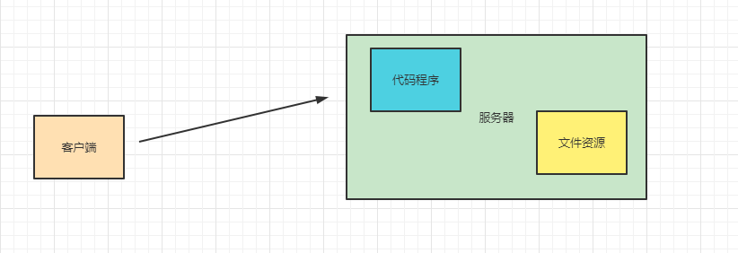


&emsp;&emsp;后面随着文件越来越多，服务器的资源会被文件资源大量占据，从而影响到服务器的稳定，这时我们可以单独的把文件服务器拆出来。

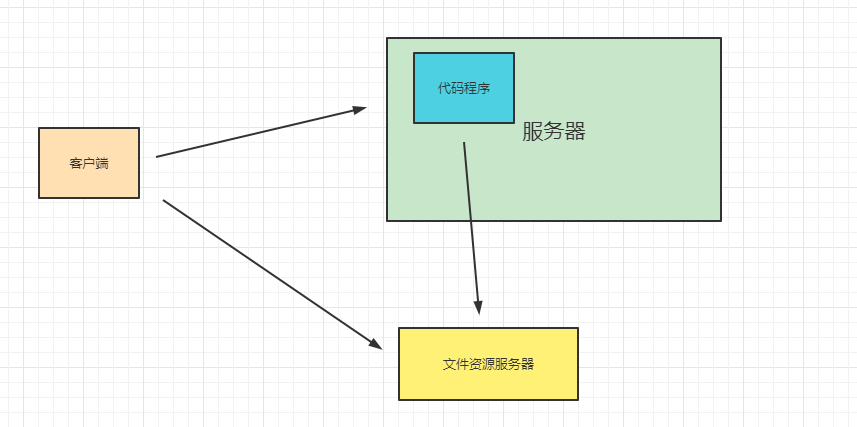


&emsp;&emsp;拆解出来后，文件服务的使用不会影响到我们的系统服务的稳定，但是当用户量越来越大，存储的文件就会越来越多，这时如果还是单台的文件服务，比如100T的文件，这时是存储不下去的，这时就产生了我们将的分布式文件存储，

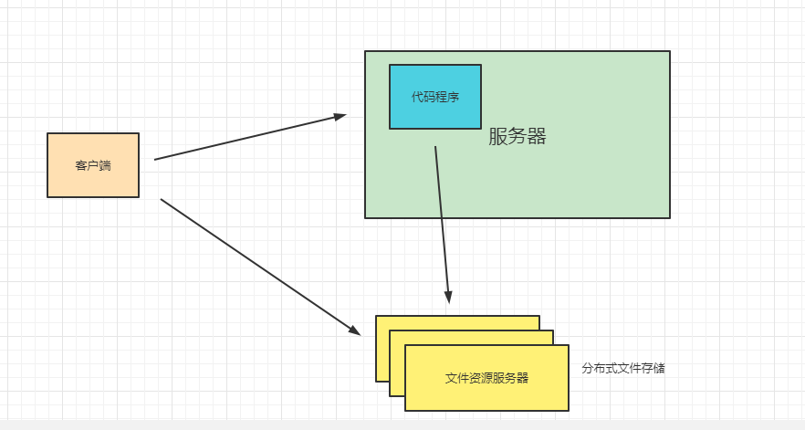


&emsp;&emsp;也就是我们解决如何将这100T的文件分散的存储到各个节点上，然后当我们需要读取文件的时候又能非常快的帮我们把文件找到。这个就是分布式文件系统帮我们解决的问题了。

## 2.常见的分布式存储框架

&emsp;&emsp;接下来我们看看在国内常用的分布式存储的框架选择有哪些

| 分布式框架     | 说明                                                         |
| -------------- | ------------------------------------------------------------ |
| FastDFS        | 我们介绍的主角，国产                                         |
| HDFS           | Hadoop组件中分布式存储框架                                   |
| MinIO          | MinIO是在Apache下的产品，最适合存储非结构化的数据，<br />比如照片，视频，日志文件，备份和容器等。 |
| 阿里云对象存储 | 当然我们还可以花费一点费用来使用其他厂商提供的对象存储服务   |

&emsp;&emsp;好了就介绍这么几个，其他的我们也用不到了。

# 二、FastDFS介绍

&emsp;&emsp;FastDFS是余庆国人开发的一个开源的轻量级分布式文件系统，它对文件进行管理，功能包括：文件存储、文件同步、文件访问（文件上传、文件下载）等，解决了大容量存储和负载均衡的问题。特别适合以文件为载体的在线服务，如相册网站、视频网站等等。

&emsp;&emsp;FastDFS为互联网量身定制，充分考虑了冗余备份、负载均衡、线性扩容等机制，并注重高可用、高性能等指标，使用FastDFS很容易搭建一套高性能的文件服务器集群提供文件上传、下载等服务。

FastDFS的特点：

* FastDFS是一个轻量级的开源分布式文件系统
* FastDFS主要解决了大容量的文件存储和高并发访问的问题，文件存取时实现了负载均衡
* FastDFS实现了软件方式的RAID，可以使用廉价的IDE硬盘进行存储
* 支持存储服务器在线扩容
* 支持相同内容的文件只保存一份，节约磁盘空间
* FastDFS只能通过Client API访问，不支持POSIX访问方式
* FastDFS特别适合大中型网站使用，用来存储资源文件（如：图片、文档、音频、视频等等）

架构图：

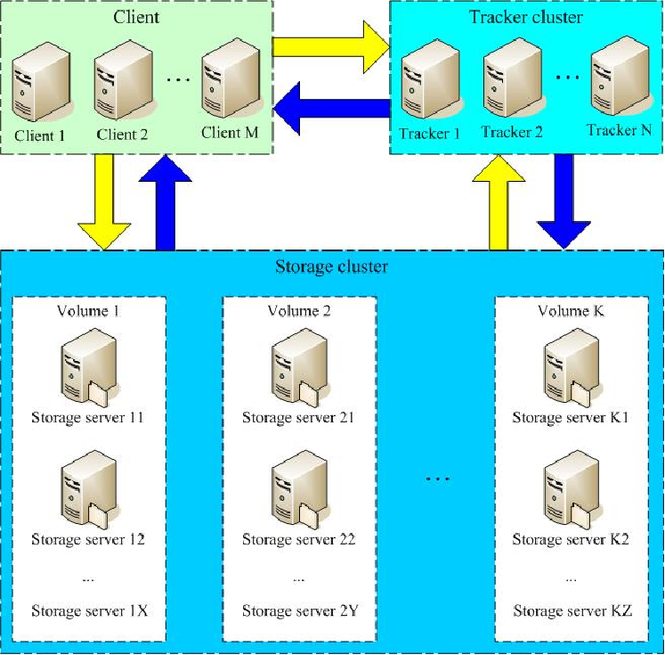


相关术语讲解：

| 名词           | 描述                                                         |
| -------------- | ------------------------------------------------------------ |
| Tracker Server | 跟踪服务器，主要做调度工作，在访问上起负载均衡的作用。<br />记录storage server的状态，是连接Client和Storage server的枢纽 |
| Storage Server | 存储服务器，文件和meta data都保存到存储服务器上              |
| group          | 组，也可称为卷。同组内服务器上的文件是完全相同的             |
| 文件标识       | 包括两部分：组名和文件名（包含路径）                         |
| meta-data      | 文件相关属性，键值对（Key Value Pair）方式，如：width=1024,heigth=768 |

架构解读：

* 只有两个角色，tracker server和storage server，不需要存储文件索引信息。
* 所有服务器都是对等的，不存在Master-Slave关系。
* 存储服务器采用分组方式，同组内存储服务器上的文件完全相同（RAID 1）。
* 不同组的storage server之间不会相互通信。
* 由storage server主动向tracker server报告状态信息，tracker server之间不会相互通信。

# 三、FastDFS安装

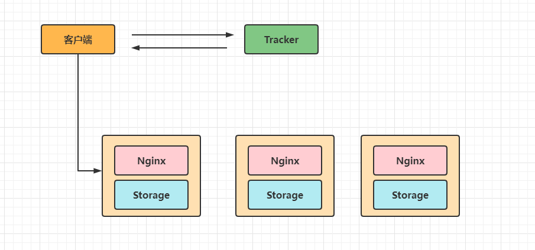


&emsp;&emsp;FastDFS的安装我们还是通过Docker来安装实现吧，直接在Linux上还装还是比较繁琐的，但就学习而言Docker安装还是非常高效的。Docker环境请自行安装哦，不清楚的可以看看我的Docker专题的内容。[https://blog.csdn.net/qq_38526573/category_9619681.html](Docker学习资料 "Docker学习资料")

## 1.拉取镜像文件

&emsp;&emsp;首先我们可以通过 `docker search fastdfs` 来查询下有哪些镜像文件。


&emsp;&emsp;我们看到搜索到的镜像还是蛮多的，这里我们使用 `delron/fastdfs` 你也可以尝试使用其他的镜像来安装，你也可以制作自己的镜像来给别人使用哦，只是不同的镜像在使用的时候配置会有一些不一样，有些镜像没有提供Nginx的相关配置，使用的时候会繁琐一点。接下来通过 `docker pull delron/fastdfs`命令把镜像拉取下来。

```shell
docker pull delron/fastdfs
```


## 2.构建Tracker服务

&emsp;&emsp;首先我们需要通过Docker命令来创建Tracker服务。命令为

```shell
docker run -d --name tracker --network=host -v /mydata/fastdfs/tracker:/var/fdfs delron/fastdfs tracker
```

&emsp;&emsp;tracker服务默认的端口为22122，-v 实现了容器和本地目录的挂载操作。


## 3.构建Storage服务

&emsp;&emsp;接下来创建Storage服务，具体的执行命令如下

```shell
docker run -d --name storage --network=host  -e TRACKER_SERVER=192.168.1.195:22122 -v /mydata/fastdfs/storage:/var/fdfs -e GROUP_NAME=group1 delron/fastdfs storage
```

&emsp;&emsp;在执行上面命令的时候要注意对应的修改下，其中TRACKER_SERVER中的ip要修改为你的Tracker服务所在的服务IP地址。

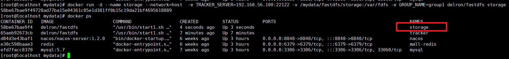


&emsp;&emsp;默认情况下在Storage服务中是帮我们安装了Nginx服务的，相关的端口为

| 服务    | 默认端口 |
| ------- | -------- |
| tracker | 22122    |
| storage | 23000    |
| Nginx   | 8888     |

&emsp;&emsp;当然如果你发现这些相关的端口被占用了，或者想要对应的修改端口信息也可以的。要修改你可以先进入容器中查看下相关的配置文件信息。

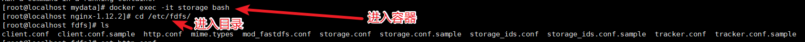


&emsp;&emsp;然后查看storage.conf文件


&emsp;&emsp;这个是storage监听的Nginx的端口8888，如果要修改那么我们还需要修改Nginx中的服务配置，这块的配置在 `/usr/local/nginx/conf`目录下

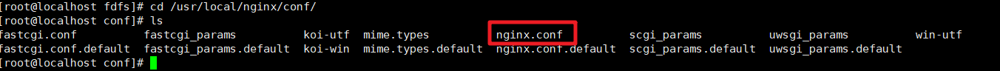


&emsp;&emsp;查看下文件

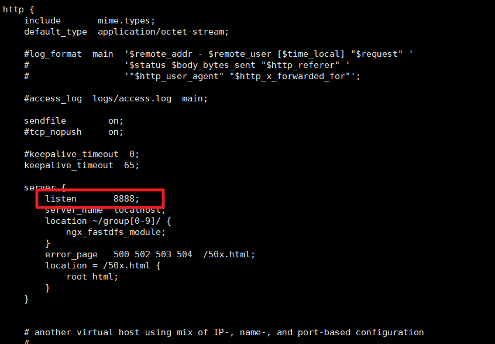


所以要修改端口号的话，这两个位置都得修改了。当然本文我们就使用默认的端口号来使用了。

## 4.测试图片上传

&emsp;&emsp;好了，安装我们已经完成了，那么到底是否可以使用呢？我们来测试下。首先在虚拟机的/mydata/fastdfs/storage下保存一张图片。


&emsp;&emsp;然后我们再进入到storage容器中。并且进入到 `/var/fdfs`目录下,可以看到我们挂载的文件了


&emsp;&emsp;然后执行如下命令即可完成图片的上传操作

```shell
/usr/bin/fdfs_upload_file /etc/fdfs/client.conf 1.jpg
```

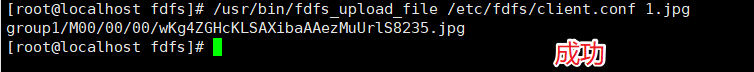


&emsp;&emsp;通过上面的提示我们看到文件上传成功了，而且返回了文件在storage中存储的信息。这时我们就可以通过这个信息来拼接访问的地址在浏览器中访问了：http://192.168.56.100:8888/group1/M00/00/00/wKg4ZGHcKLSAXibaAAezMuUrlS8235.jpg


&emsp;&emsp;好了到这儿FastDFS的服务安装成功了。

# 四、客户端操作

## 1.Fastdfs-java-client

&emsp;&emsp;首先我们来看下如何实现FastDFS中提供的JavaAPI来直接实现对应的文件上传和下载操作。

### 1.1 文件上传

&emsp;&emsp;先来看下文件上传的流程

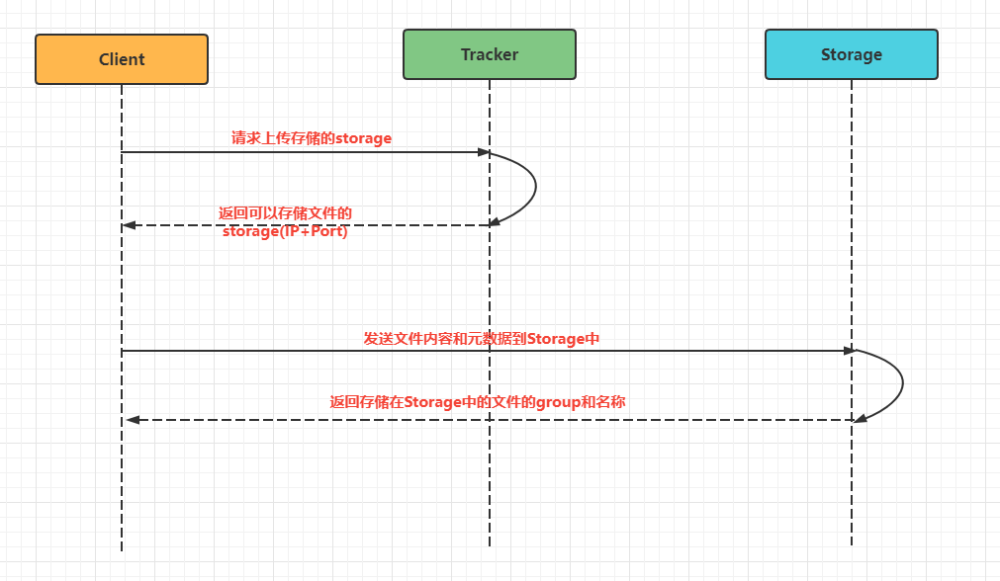


&emsp;&emsp;上传流程的文字梳理为：

1. 客户端访问Tracker
2. Tracker 返回Storage的ip和端口
3. 客户端直接访问Storage，把文件内容和元数据发送过去。
4. Storage返回文件存储id。包含了组名和文件名

&emsp;&emsp;首先创建一个普通的maven项目，然后引入对应的依赖

```xml
<dependencies>
    <dependency>
        <groupId>cn.bestwu</groupId>
        <artifactId>fastdfs-client-java</artifactId>
        <version>1.27</version>
    </dependency>
    <dependency>
        <groupId>org.apache.commons</groupId>
        <artifactId>commons-lang3</artifactId>
        <version>3.4</version>
    </dependency>
</dependencies>
```

&emsp;&emsp;然后编写FastDFS的配置文件，内容如下：注意ip修改为你自己对应的ip即可

```xml
connect_timeout = 10
network_timeout = 30
charset = UTF-8
http.tracker_http_port = 8080
tracker_server = 192.168.56.100:22122
```

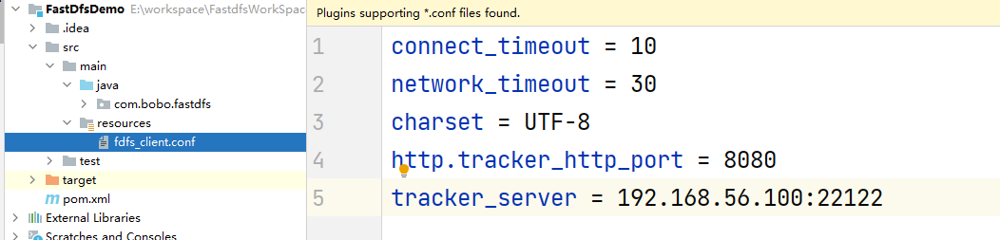


&emsp;&emsp;然后导入对应的工具类，在工具类中完成了StorageClient的实例化，并提供了相关的上传和下载的方法。

```java
package com.bobo.fastdfs.config;

import org.apache.commons.lang3.StringUtils;
import org.csource.common.NameValuePair;
import org.csource.fastdfs.*;

import java.io.*;

public class FastDFSClient {
    private static final String CONF_FILENAME = Thread.currentThread().getContextClassLoader().getResource("").getPath() + "fdfs_client.conf";

    private static StorageClient storageClient = null;

    /**
     * 只加载一次.
     */
    static {
        try {
            ClientGlobal.init(CONF_FILENAME);
            TrackerClient trackerClient = new TrackerClient(ClientGlobal.g_tracker_group);
            TrackerServer trackerServer = trackerClient.getConnection();
            StorageServer storageServer = trackerClient.getStoreStorage(trackerServer);
            storageClient = new StorageClient(trackerServer, storageServer);
        } catch (Exception e) {
            e.printStackTrace();
        }
    }

    /**
     *
     * @param inputStream
     *    上传的文件输入流
     * @param fileName
     *    上传的文件原始名
     * @return
     */
    public static String[] uploadFile(InputStream inputStream, String fileName) {
        try {
            // 文件的元数据
            NameValuePair[] meta_list = new NameValuePair[2];
            // 第一组元数据，文件的原始名称
            meta_list[0] = new NameValuePair("file name", fileName);
            // 第二组元数据
            meta_list[1] = new NameValuePair("file length", inputStream.available()+"");
            // 准备字节数组
            byte[] file_buff = null;
            if (inputStream != null) {
                // 查看文件的长度
                int len = inputStream.available();
                // 创建对应长度的字节数组
                file_buff = new byte[len];
                // 将输入流中的字节内容，读到字节数组中。
                inputStream.read(file_buff);
            }
            // 上传文件。参数含义：要上传的文件的内容（使用字节数组传递），上传的文件的类型（扩展名），元数据
            String[] fileids = storageClient.upload_file(file_buff, getFileExt(fileName), meta_list);
            return fileids;
        } catch (Exception ex) {
            ex.printStackTrace();
            return null;
        }
    }

    /**
     *
     * @param file
     *            文件
     * @param fileName
     *            文件名
     * @return 返回Null则为失败
     */
    public static String[] uploadFile(File file, String fileName) {
        FileInputStream fis = null;
        try {
            NameValuePair[] meta_list = null; // new NameValuePair[0];
            fis = new FileInputStream(file);
            byte[] file_buff = null;
            if (fis != null) {
                int len = fis.available();
                file_buff = new byte[len];
                fis.read(file_buff);
            }

            String[] fileids = storageClient.upload_file(file_buff, getFileExt(fileName), meta_list);
            return fileids;
        } catch (Exception ex) {
            return null;
        }finally{
            if (fis != null){
                try {
                    fis.close();
                } catch (IOException e) {
                    e.printStackTrace();
                }
            }
        }
    }

    /**
     * 根据组名和远程文件名来删除一个文件
     *
     * @param groupName
     *            例如 "group1" 如果不指定该值，默认为group1
     * @param remoteFileName
     *            例如"M00/00/00/wKgxgk5HbLvfP86RAAAAChd9X1Y736.jpg"
     * @return 0为成功，非0为失败，具体为错误代码
     */
    public static int deleteFile(String groupName, String remoteFileName) {
        try {
            int result = storageClient.delete_file(groupName == null ? "group1" : groupName, remoteFileName);
            return result;
        } catch (Exception ex) {
            return 0;
        }
    }

    /**
     * 修改一个已经存在的文件
     *
     * @param oldGroupName
     *            旧的组名
     * @param oldFileName
     *            旧的文件名
     * @param file
     *            新文件
     * @param fileName
     *            新文件名
     * @return 返回空则为失败
     */
    public static String[] modifyFile(String oldGroupName, String oldFileName, File file, String fileName) {
        String[] fileids = null;
        try {
            // 先上传
            fileids = uploadFile(file, fileName);
            if (fileids == null) {
                return null;
            }
            // 再删除
            int delResult = deleteFile(oldGroupName, oldFileName);
            if (delResult != 0) {
                return null;
            }
        } catch (Exception ex) {
            return null;
        }
        return fileids;
    }

    /**
     * 文件下载
     *
     * @param groupName 卷名
     * @param remoteFileName 文件名
     * @return 返回一个流
     */
    public static InputStream downloadFile(String groupName, String remoteFileName) {
        try {
            byte[] bytes = storageClient.download_file(groupName, remoteFileName);
            InputStream inputStream = new ByteArrayInputStream(bytes);
            return inputStream;
        } catch (Exception ex) {
            return null;
        }
    }

    public static NameValuePair[] getMetaDate(String groupName, String remoteFileName){
        try{
            NameValuePair[] nvp = storageClient.get_metadata(groupName, remoteFileName);
            return nvp;
        }catch(Exception ex){
            ex.printStackTrace();
            return null;
        }
    }

    /**
     * 获取文件后缀名（不带点）.
     *
     * @return 如："jpg" or "".
     */
    private static String getFileExt(String fileName) {
        if (StringUtils.isBlank(fileName) || !fileName.contains(".")) {
            return "";
        } else {
            return fileName.substring(fileName.lastIndexOf(".") + 1); // 不带最后的点
        }
    }

}

```

&emsp;&emsp;然后我们就可以来测试上传的操作了。

```java
    public static void main(String[] args) {
        try {
            File file = new File("D:/2.jpg");
            InputStream is = new FileInputStream(file);
            String fileName = UUID.randomUUID().toString()+".jpg";
            String[] result = FastDFSClient.uploadFile(is, fileName);
            System.out.println(Arrays.toString(result));
        } catch (Exception e) {
            e.printStackTrace();
        }
    }
```

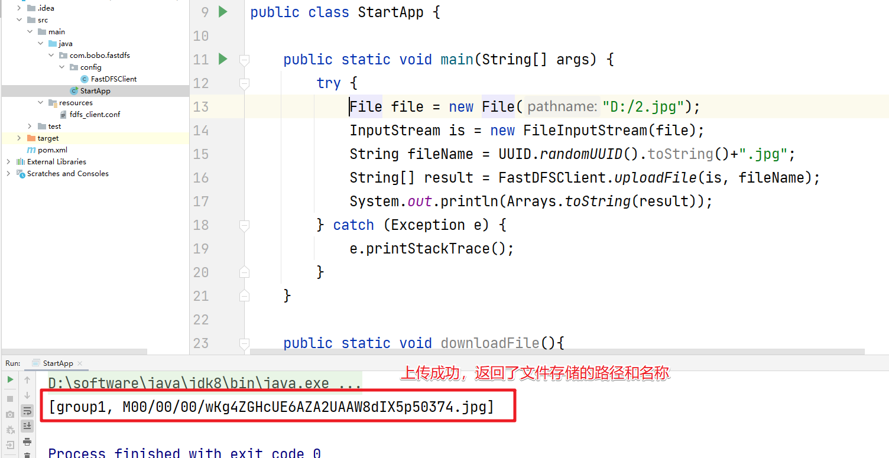


访问即可：http://192.168.56.100:8888/group1/M00/00/00/wKg4ZGHcUE6AZA2UAAW8dIX5p50374.jpg

&emsp;&emsp;返回后的字符串的结构说明

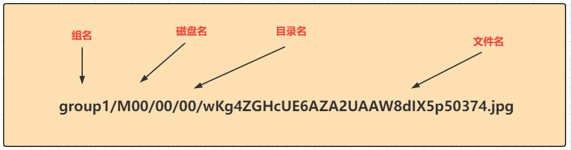


### 1.2 文件下载

&emsp;&emsp;文件下载的流程，如下

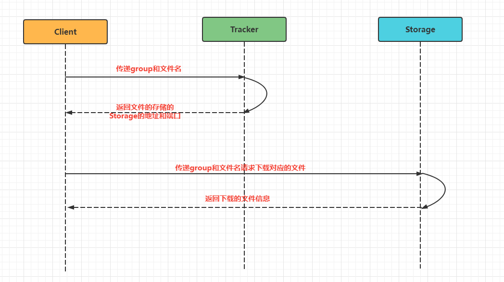


&emsp;&emsp;文件下载的流程为：

1. client询问tracker需要下载的文件的storage，参数为文件的标识(group加文件名)。
2. tracker根据客户端的参数返回一台可用的storage。
3. client根据返回的storage直接完成对应的文件的下载。

&emsp;&emsp;有了上面的基础，文件下载就非常简单了，我们只需要根据前面上传的文件的group和文件的存储路径就可以通过StorageClient中提供的downloadFile方法把对应的文件下载下来了，具体的代码如下

```java
    /**
     * 文件下载
     */
    public static void downloadFile(){
        try {
            InputStream is = FastDFSClient
                    .downloadFile("group1", "M00/00/00/wKg4ZGHcUE6AZA2UAAW8dIX5p50374.jpg");
            OutputStream os = new FileOutputStream(new File("D:/12.jpg"));
            int index = 0 ;
            while((index = is.read())!=-1){
                os.write(index);
            }
            os.flush();
            os.close();
            is.close();
        } catch (Exception e) {
            e.printStackTrace();
        }
    }
```

注意：StorageClient是线程不安全的。那么我们的解决方案

1. 对文件的操作的每个方法我们做同步处理
2. 每次操作文件的时候我们都获取一个新的StorageClient对象

第一种方式效率肯定是最低的，第二种方式每次都要建立新的连接效率同样的会受到影响，这时最好的方式其实是把StorageClient交给我们自定义的连接池来管理

## 2.SpringBoot整合

&emsp;&emsp;我们在实际工作中基本都是和SpringBoot整合在一起来使用的，那么我们就来看看FastDFS是如何在SpringBoot项目中来使用的。首先创建一个普通的SpringBoot项目，然后导入fastdfs-spring-boot-starter这个依赖。

```xml
    <dependencies>
        <dependency>
            <groupId>org.springframework.boot</groupId>
            <artifactId>spring-boot-starter-web</artifactId>
        </dependency>

        <dependency>
            <groupId>org.springframework.boot</groupId>
            <artifactId>spring-boot-starter-test</artifactId>
            <scope>test</scope>
        </dependency>

        <dependency>
            <groupId>com.luhuiguo</groupId>
            <artifactId>fastdfs-spring-boot-starter</artifactId>
            <version>0.2.0</version>
        </dependency>
    </dependencies>
```

&emsp;&emsp;既然是一个starter，那么必然会在spring.factories文件中提供对应的自动配置类。

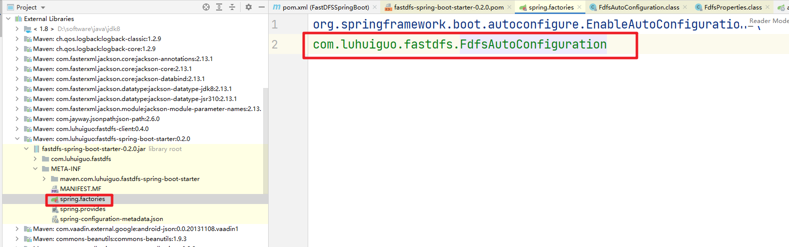


&emsp;&emsp;可以看到给我们提供的配置类为FdfsAutoConfiguration进入后可以看到帮我们注入了很多的核心对象。

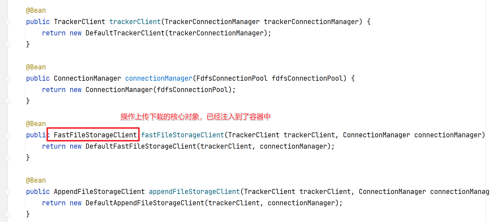


&emsp;&emsp;然后可以看到系统提供的配置信息，前缀为 `fdfs`

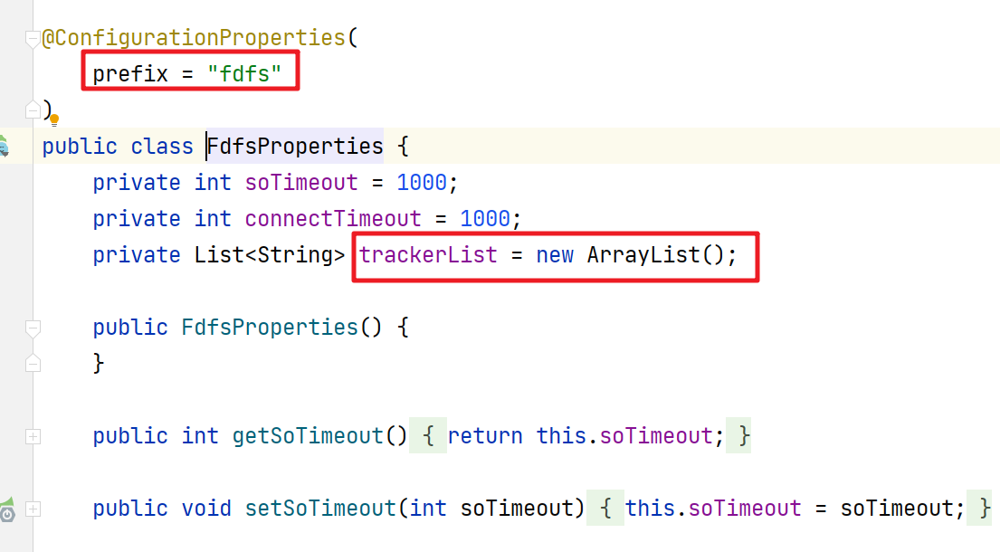


&emsp;&emsp;然后我们就可以在application.properties中配置FastDFS的配置信息了。

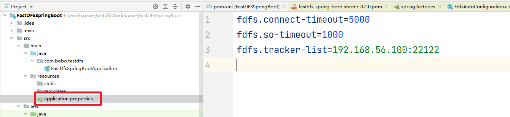


&emsp;&emsp;配置完成后我们就可以测试文件的上传下载操作了

```java
@SpringBootTest
class FastDfsSpringBootApplicationTests {

    @Autowired
    public FastFileStorageClient storageClient;


    @Test
    void contextLoads() throws Exception{
        File file = new File("d:\\2.jpg");
        StorePath path = storageClient.uploadFile(null,new FileInputStream(file),file.length(),file.getName());
        System.out.println(path.getFullPath());
    }

}
```

文件操作成功

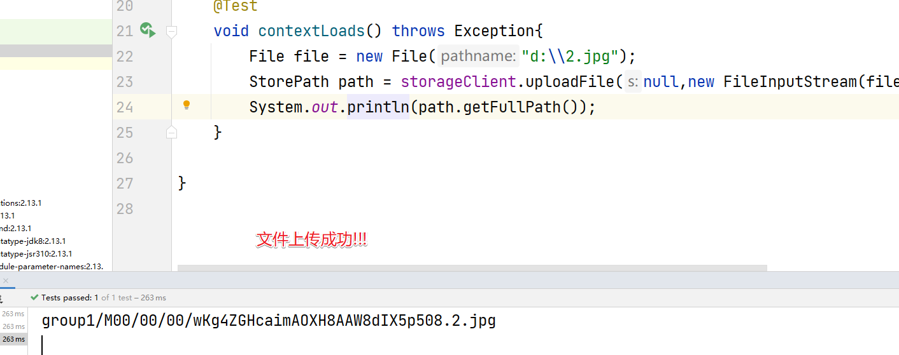

