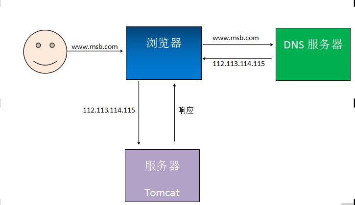
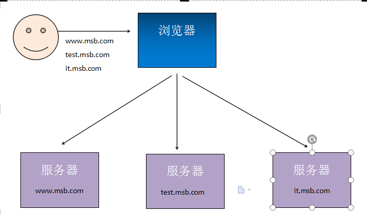
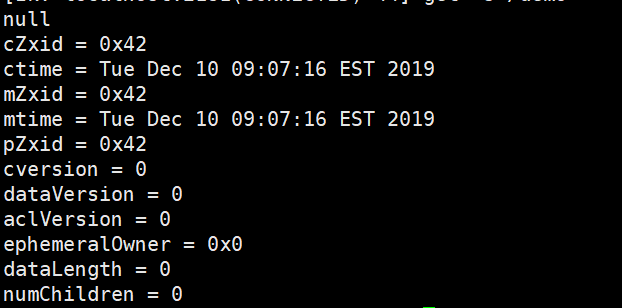

# 【RPC】

## 主要内容

1. 项目结构变化

2. RPC简介

3. RMI实现RPC

4. HttpClient实现RPC

5. Zookeeper安装

6. Zookeeper客户端常用命令

7. 向Zookeeper中注册内容

8. 从Zookeeper中发现内容

9. 手写RPC框架

## 学习目标

| 知识点                  | 要求 |
| ----------------------- | ---- |
| 项目架构变化            | 掌握 |
| RPC简介                 | 掌握 |
| RMI实现RPC              | 掌握 |
| HttpClient实现RPC       | 了解 |
| Zookeeper安装           | 掌握 |
| Zookeeper客户端常用命令 | 掌握 |
| 向Zookeeper中注册内容   | 掌握 |
| 从zookeeper中发现内容   | 掌握 |
| 手写RPC框架             | 掌握 |

### 一、今天学什么？为什么讲？

​	 现在学习RPC。后期学习的Dubbo是一个RPC框架，学习好现在的内容，学习Dubbo将会变得容易一些。

### 二、项目架构变化

#### 1     单体架构

##### 1.1   架构图

​	单体架构就是一个项目里面包含这个项目中全部代码。一个应用搞定全部功能。

​	DNS 服务器可以是单映射，也可以配置多个映射。





##### 1.2   软件代码结构

​	在单体架构项目中，团队都是通过包(package)进行区分每个模块。

​	总体包结构：com.msb.*.分层包。

```
项目名：
  -- com
    --msb
      -- common
        -- utils
      --user
        -- controller
        -- service
        -- mapper
      -- sys
        -- controller
        -- service
        -- mapper
```


#### 1.3   优缺点

##### 1.3.1    优点

​	部署简单

​	维护方便

​	成本低

##### 1.3.2    缺点

​	当项目规模大、用户访问频率高、并发量大、数据量大时，会大大降低程序执行效率，甚至出现服务器宕机等情况。

#### 1.4   适用项目

传统管理项目，小型互联网项目。

#### 2     分布式架构

##### 2.1   架构图（简易版）

​	分布式架构会把一个项目按照特定要求（多按照模块或功能）拆分成多个项目，每个项目分别部署到不同的服务器上。




##### 2.2   软件代码结构

```
项目1：
  --com.msb.xxx
    -- controller
    -- service
    -- mapper
项目2
  --com.msb.mmm
    -- controller
    -- service
    -- mapper
```

#### 2.3   优缺点

##### 2.3.1    优点

​	增大了系统可用性。减少单点故障，导致整个应用不可用。

​	增加重用性。因为模块化，所以重用性更高。

​	增加可扩展性。有新的模块增加新的项目即可。

​	增加每个模块的负载能力。因为每个模块都是一个项目，所以每个模块的负载能力更强。

##### 2.3.2    缺点

​	成本更高。

​	架构更加复杂。

​	整体响应之间变长，一些业务需要多项目通信后给出结果。

​	吞吐量更大。吞吐量= 请求数/秒。

#### 2.4   待解决问题

​	分布式架构中各个模块如何进行通信？

​	可以使用Http协议，也可以使用RPC协议通信，也可以使用其他的通信方式。我们本阶段使用的是RPC协议，因为它比HTTP更适合项目内部通信。

### 三、RPC简介

#### 1     RFC

​	RFC(Request For Comments) 是由互联网工程任务组(IETF)发布的文件集。文件集中每个文件都有自己唯一编号，例如：rfc1831。目前RFC文件由互联网协会(Internet Society，ISOC)赞助发型。

​	RPC就收集到了rfc 1831中。可以通过下面网址查看：

​	https://datatracker.ietf.org/doc/rfc1831/

#### 2     RPC

​	RPC在rfc 1831中收录 ，RPC（Remote Procedure Call） 远程过程调用协议

​	RPC协议规定允许互联网中一台主机程序调用另一台主机程序，而程序员无需对这个交互过程进行编程。在RPC协议中强调当A程序调用B程序中功能或方法时，A是不知道B中方法具体实现的。

​	RPC是上层协议，底层可以基于TCP协议，也可以基于HTTP协议。一般我们说RPC都是基于RPC的具体实现，如：Dubbo框架。从广义上讲只要是满足网络中进行通讯调用都统称为RPC，甚至HTTP协议都可以说是RPC的具体实现，但是具体分析看来RPC协议要比HTTP协议更加高效，基于RPC的框架功能更多。

​	RPC协议是基于分布式架构而出现的，所以RPC在分布式项目中有着得天独厚的优势。

#### 3     RPC和HTTP对比

##### 3.1   具体实现

​	RPC：可以基于TCP协议，也可以基于HTTP协议。

​	HTTP：基于HTTP协议

##### 3.2   效率

​	RPC：自定义具体实现可以减少很多无用的报文内容，使得报文体积更小。

​	HTTP：如果是HTTP 1.1 报文中很多内容都是无用的。如果是HTTP2.0以后和RPC相差不大，比RPC少的可能就是一些服务治理等功能。

##### 3.3   连接方式

​	RPC：长连接支持。

​	HTTP：每次连接都是[三次握手四次挥手](https://www.cnblogs.com/nevermorewang/p/8906833.html)。

##### 3.4   性能

​	RPC可以基于很多序列化方式。如：thrift

​	HTTP 主要是通过JSON，序列化和反序列效率更低。

##### 3.5   注册中心

​	RPC ：一般RPC框架都带有注册中心。

​	HTTP：都是直连。

##### 3.6   负载均衡

​	RPC：绝大多数RPC框架都带有负载均衡测量。

​	HTTP：一般都需要借助第三方工具。如：nginx

##### 3.7   综合结论

​	RPC框架一般都带有丰富的服务治理等功能，更适合企业内部接口调用。而HTTP更适合多平台之间相互调用。

### 四、HttpClient实现RPC

#### 1     HttpClient简介

​	在JDK中java.net包下提供了用户HTTP访问的基本功能，但是它缺少灵活性或许多应用所需要的功能。

​	HttpClient起初是Apache Jakarta Common 的子项目。用来提供高效的、最新的、功能丰富的支持 HTTP 协议的客户端编程工具包，并且它支持 HTTP 协议最新的版本。2007年成为顶级项目。

​	通俗解释：HttpClient可以实现使用Java代码完成标准HTTP请求及响应。

#### 2     代码实现

##### 2.1   服务端

​	新建项目HttpClientServer

##### 2.1.1    新建控制器

com.msb.controller.DemoController

```java
@Controller
public class DemoController {
    @RequestMapping("/demo")
    @ResponseBody
    public String demo(String param){
        return "demo"+param;
    }
}
```

##### 2.1.2    新建启动器

​	新建启动器

com.msb.HttpClientServerApplication

```java
@SpringBootApplication
public class HttpClientServerApplication {
    public static void main(String[] args) {
    SpringApplication.run(HttpClientServerApplication.class,args);
    }
}
```

#### 2.2   客户端

​	新建HttpClientDemo项目

##### 2.2.1    添加依赖

```xml
 <dependency>
        <groupId>org.apache.httpcomponents</groupId>
        <artifactId>httpclient</artifactId>
        <version>4.5.10</version>
 </dependency>
```

##### 2.2.2    新建类

​	新建com.msb.HttpClientDemo，编写主方法。

###### 2.2.2.1 使用GET方法访问

```java
public static void main(String[] args) {
    try {
    	//创建http工具（理解成:浏览器） 发起请求，解析响应
        CloseableHttpClient httpClient = HttpClients.createDefault();
        //请求路径
        URIBuilder uriBuilder = new URIBuilder("http://localhost:8080/demo");
        uriBuilder.addParameter("param", "get123");
        //创建HttpGet请求对象
        HttpGet get = new HttpGet(uriBuilder.build());
        //创建响应对象
        CloseableHttpResponse response = httpClient.execute(get);
        //由于响应体是字符串，因此把HttpEntity类型转换为字符串类型，并设置字符编码
        String result = EntityUtils.toString(response.getEntity(), "utf-8");
        //输出结果
        System.out.println(result);
        //释放资源
        response.close();
        httpClient.close();
    } catch (URISyntaxException e) {
        e.printStackTrace();
    } catch (IOException e) {
        e.printStackTrace();
    }
}
```

 

###### 2.2.2.2 使用POST方式访问

```java
public class HttpClientDemo {
    public static void main(String[] args) {
        try {
        	//创建http工具（理解成:浏览器） 发起请求，解析响应
            CloseableHttpClient httpClient = HttpClients.createDefault();
            //创建HttpPOST请求对象
            HttpPost post = new HttpPost("http://localhost:8080/demo");
            //所有请求参数
            List<NameValuePair> params = new ArrayList<>();
            params.add(new BasicNameValuePair("param","123"));
            //创建HttpEntity接口的文本实现类的对象，放入参数并设置编码
            HttpEntity httpEntity = new UrlEncodedFormEntity(params,"utf-8");
            //放入到HttpPost对象中
            post.setEntity(httpEntity);            
            //创建响应对象
            CloseableHttpResponse response = httpClient.execute(post);
            //由于响应体是字符串，因此把HttpEntity类型转换为字符串类型
            String result = EntityUtils.toString(response.getEntity());
            //输出结果
            System.out.println(result);
            //释放资源
            response.close();
            httpClient.close();
        } catch (IOException e) {
            e.printStackTrace();
        }
    }
}
```

 

####  3. Jackson用法

##### 3.1   把对象转换为json字符串

```java
ObjectMapper objectMapper = new ObjectMapper();
People peo = new People();
objectMapper.writeValueAsString(peo);
```

##### 3.2   把json字符串转换为对象

```java
ObjectMapper objectMapper = new ObjectMapper();
People peo = objectMapper.readValue(content, People.class);
```

##### 3.3   把json字符串转换为List集合

```java
ObjectMapper objectMapper = new ObjectMapper();
JavaType javaType = objectMapper.getTypeFactory().constructParametricType(List.class, People.class);
List<People> list = objectMapper.readValue(content, javaType);
```


#### 4     HttpClient请求包含JSON

##### 4.1   java代码实现

```java
public class HttpClientDemo {
    public static void main(String[] args) {
        try {
            CloseableHttpClient httpClient = HttpClients.createDefault();
            HttpPost post = new HttpPost("http://localhost:8080/demo");
            HttpEntity httpEntity= null;
			String json = "{}";
            StringEntity entity = new StringEntity(json, ContentType.APPLICATION_JSON);
            post.setEntity(entity);
            CloseableHttpResponse response = httpClient.execute(post);
            String result = EntityUtils.toString(response.getEntity());
            System.out.println(result);
            response.close();
            httpClient.close();
        } catch (IOException e) {
            e.printStackTrace();
        }
    }
}

 @Test
    public void testInputSteam(){
        try {

            CloseableHttpClient httpClient = HttpClients.createDefault();

            URIBuilder uriBuilder = new URIBuilder("http://localhost:8080/demo4");

            HttpPost httpPost = new HttpPost(uriBuilder.build());
            //创建集合
            List<User> users = new ArrayList<>();
            users.add(new User(2,"李四"));
            users.add(new User(1,"张三"));
            //将集合对象转化成JSON字符串
            ObjectMapper objectMapper = new ObjectMapper();
            String UserJson = objectMapper.writeValueAsString(users);
            System.out.println(UserJson);
            StringEntity stringEntity = new StringEntity(UserJson, 		  ContentType.APPLICATION_JSON);
            //设置请求体
            httpPost.setEntity(stringEntity);
            CloseableHttpResponse response= httpClient.execute(httpPost);
            String result = EntityUtils.toString(response.getEntity());
            System.out.println(result);

            response.close();
            httpClient.close();
        } catch (Exception e) {
            e.printStackTrace();
        }
    }
```

#### 5     控制器接口参数

​	@RequestBody把请求体中流数据转换为指定的对象。多用在请求参数是json数据且请求的Content-Type=”application/json”

```java
@RequestMapping("/demo4")
@ResponseBody
public String demo4(@RequestBody List<People> list) {
    System.out.println(list);
    return list.toString();
}
```

####    6   Ajax发送json参数写法

```html
var json = '[{"id":123,"name":"msb"},{"id":123,"name":"mashibing"}]';
 $.ajax({
     url:'/demo5',
     type:'post',
     success:function(data){
         alert(data);
         for(var i = 0 ;i<data.length;i++){

             alert(data[i].id +"  "+data[i].name);
         }
     },
     contentType:'application/json',//请求体中内容类型
     dataType:'json',//响应内容类型。
     data:json
 });
```

####  7     跨域

​	跨域：协议、ip、端口中只要有一个不同就是跨域请求。

​	同源策略：浏览器默认只允许ajax访问同源(协议、ip、端口都相同)内容。

​	解决同源策略：

​	在控制器接口上添加@CrossOrigin。表示允许跨域。本质在响应头中添加Access-Control-Allow-Origin: *

```html
var json = '[{"id":123,"name":"msb"},{"id":456,"name":"mashibing"}]';
 $.ajax({
     url:'/demo5',
     type:'post',
     success:function(data){
         alert(data);
         for(var i = 0 ;i<data.length;i++){

             alert(data[i].id +"  "+data[i].name);
         }
     },
     contentType:'application/json',//请求体中内容类型
     dataType:'json',//响应内容类型。
     data:json
 });
```

###  五、RMI实现RPC

#### 1     RMI简 介

​	RMI(Remote Method Invocation) 远程方法调用。

​	RMI是从JDK1.2推出的功能，它可以实现在一个Java应用中可以像调用本地方法一样调用另一个服务器中Java应用（JVM）中的内容。

​	RMI 是Java语言的远程调用，无法实现跨语言。

#### 2     执行流程


​	Registry(注册表)是放置所有服务器对象的命名空间。 每次服务端创建一个对象时，它都会使用bind()或rebind()方法注册该对象。 这些是使用称为绑定名称的唯一名称注册的。 

​	要调用远程对象，客户端需要该对象的引用。即通过服务端绑定的名称从注册表中获取对象(lookup()方法)。

#### 3     API介绍

##### 3.1   Remote

​	java.rmi.Remote 定义了此接口为远程调用接口。如果接口被外部调用，需要继承此接口。

```java
public interface Remote{}
```

#### 3.2   RemoteException

​	java.rmi.RemoteException

​	继承了Remote接口的接口中，如果方法是允许被远程调用的，需要抛出此异常。

#### 3.3   UnicastRemoteObject

​	java.rmi.server.UnicastRemoteObject

​	此类实现了Remote接口和Serializable接口。

​	自定义接口实现类除了实现自定义接口还需要继承此类。

#### 3.4   LocateRegistry

​	java.rmi.registry.LocateRegistry

​	可以通过LocateRegistry在本机上创建Registry，通过特定的端口就可以访问这个Registry。

#### 3.5   Naming

​	java.rmi.Naming

​	Naming定义了发布内容可访问RMI名称。也是通过Naming获取到指定的远程方法。

#### 4     代码实现

##### 4.1   服务端创建

​	创建RmiServer项目

##### 4.1.1    编写接口

​	com.msb.service.DemoService 编写

```java
public interface DemoService extends Remote {
    String demo(String demo) throws RemoteException;
}
```

#####  4.1.2    编写实现类

​	com.msb.service.impl.DemoServiceImpl 编写。

​	注意：构造方法是public的。默认生成protected

```java
public class DemoServiceImpl extends UnicastRemoteObject implements DemoService {
    public DemoServiceImpl() throws RemoteException {
    }
    @Override
    public String demo(String demo) throws RemoteException {
        return demo+"123";
    }
}
```

#####  4.1.3    编写主方法

​	编写com.msb.DemoServer类，生成主方法

```java
public class DemoServiceImpl extends UnicastRemoteObject implements DemoService {
    public DemoServiceImpl() throws RemoteException {
    }
    @Override
    public String demo(String demo) throws RemoteException {
        return demo+"123";
    }
}
```


```java
public class DemoStart {
    public static void main(String[] args) {
        try {
            //1创建接口实现类
            RmiDemo rmiDemo = new RmiDemoImpl();
            //2创建注册表
            LocateRegistry.createRegistry(8099);
            //3绑定服务
            Naming.bind("rmi://localhost:8099/rmiDemo",rmiDemo);

            System.out.println("服务器启动！");
        } catch (RemoteException e) {
            e.printStackTrace();
        } catch (AlreadyBoundException e) {
            e.printStackTrace();
        } catch (MalformedURLException e) {
            e.printStackTrace();
        }
    }
}

```


##### 4.1.4    运行项目

​	运行后项目，项目一直处于启动状态，表示可以远程访问此项目中的远程方法。


#### 4.2   创建客户端代码

​	创建项目RmiClient

##### 4.2.1    复制服务端接口

​	把服务端com.msb.service.DemoService粘贴到项目中

##### 4.2.2    创建主方法类

​	新建com.msb.DemoClient

```java
public class DemoServiceImpl extends UnicastRemoteObject implements DemoService {
    public DemoServiceImpl() throws RemoteException {
    }
    @Override
    public String demo(String demo) throws RemoteException {
        return demo+"123";
    }
}
```

 

### 六、Zookeeper安装

#### 1     Zookeeper简介

​	zookeeper分布式管理软件。常用它做注册中心（依赖zookeeper的发布/订阅功能）、配置文件中心、分布式锁配置、集群管理等。

​	zookeeper一共就有两个版本。主要使用的是java语言写的。

#### 2     安装

##### 2.1   上传压缩文件

​	上传到 /usr/local/tmp中

#### 2.2   解压

```sh
tar zxf apache-zookeeper-3.5.5-bin.tar.gz
cp -r apache-zookeeper-3.5.5-bin ../zookeeper
```

#### 2.3   新建data目录

进入到zookeeper中

```sh
cd /usr/local/zookeeper
mkdir data
```

#### 2.4   修改配置文件

进入conf中

```sh
cd conf
cp zoo_sample.cfg zoo.cfg
vim zoo.cfg
```

修改dataDir为data文件夹路径

```sh
dataDir=/usr/local/zookeeper/data
```


#### 2.5   启动zookeeper

进入bin文件夹

```sh
cd /usr/local/zookeeper/bin
./zkServer.sh start
```

通过status查看启动状态。稍微有个等待时间

\# ./zkServer.sh status

### 六、Zookeeper安装(Docker)

**资料：**

https://www.cnblogs.com/kingkoo/p/8732448.html

https://www.bilibili.com/video/av80874666?from=search&seid=1629145025211999104&spm_id_from=333.337.0.0

#### 1     Zookeeper简介

​	zookeeper分布式管理软件。常用它做注册中心（依赖zookeeper的发布/订阅功能）、配置文件中心、分布式锁配置、集群管理等。

​	zookeeper一共就有两个版本。主要使用的是java语言写的。

#### 2     安装

##### 2.1   拉取镜像

 * 自定义zookeeper目录

    ```shell
    mkdir /root/zookeeper
    
    mkdir /root/zookeeper/data #原因参照上面 -在docker中data其实也不用在宿主机行自己生成(目前如此)
    
    #仓库官网查看版本或者用命令直接查
    docker search zookeeper
    
    #拉取特定版本（3.5）
    docker pull zookeeper:3.5
    
    ```

#### 2.2 创建并启动容器

​	**注：就目前而且 好像直接在docker中使用 zookeeper 不需要过多的配置，直接用命令创建吧，下面的解释先不看，具体原因后面补充**

命令：

```shell
docker run -d --name zookeeper -v /root/zookeeper/data:/data -p 2181:2181 --restart always zookeeper:3.5
```

- `--restart always`：始终重启
- https://www.cnblogs.com/ageovb/p/15328796.html

**解释**

* 1、这里为啥只挂载了 data 目录--》因为当我们 没有直接的安装压缩包时，我们的就没有配置文件，所以我们直接生成，容器中就回自动生成conf文件，其中就有我们需要的 一系列配置文件，我们第一次创建的时候就可以如此，我们在进**行配置文件的修改完成**后，要将所有配置文件放到我们  bash 目录中的 conf 文件中去。

* 2、第一次进入容器

    * 在bash目录下进入bin 目录然后输入开启客户端命令

        ```shell
        ./zkCli.sh
        ```

* 3、第二次进入容器

    ```shell
    docker exec -it zookeeper /bin/bash  -p    端口号
    或
    docker exec -it zookeeper zkCli.sh
    ```

**只看到这就可*，容器创建成功就可以直接用了，还没有出现问题。有待补充**

#### 2.3   修改配置文件

* 配置文件来源
    * 1、可以去我们的资料中直接解压出**conf**目录粘贴到我们的 zookeeper 目录中去
    * 2、可以直接进行第 3 步，完事之后直接会在容器中生成。找到conf文件，修改其中的 zoo.cfg文件，

进入容器后，找到conf中的 **zoo.cfg文件，接下来就是修改 **dataDir** 路径为容器中的 data文件目录。

前提是要下载 vim ，因为容器中没有，命令是：

```sh
apt-get update

apt-get install -y vim

cd conf
# 没有zoo.cfg 就先拷贝 zoo_sample.cfg 两个其实是一个文件，内容相同
#cp zoo_sample.cfg zoo.cfg
vim zoo.cfg
```

修改dataDir为data文件夹路径

```sh
dataDir=/usr/local/zookeeper/data
```


### 注：docker集群搭建在solr笔记中

### 七、Zookeeper客户端常用命令

​	进入到./zkCli.sh命令行工具后，可以使用下面常用命令

#### 1    ls

​	ls [-s][-R] /path

​	-s 详细信息，替代老版的ls2

​	-R 当前目录和子目录中内容都罗列出来

​	例如：ls -R / 显示根目录下所有内容

#### 2     create

​	create /path [data]

​	[data] 包含内容

​	创建指定路径信息

​	例如：create /demo 创建/demo

#### 3     get

​	get [-s] /path

​	[-s] 详细信息

​	查看指定路径下内容。

​	例如： get -s /demo




​	null:存放的数据

​	cZxid:创建时zxid(znode每次改变时递增的事务id)

​	ctime:创建时间戳

​	mZxid:最近一次更新的zxid

​	mtime:最近一次更新的时间戳

​	pZxid:子节点的zxid

​	cversion:子节点更新次数

​	dataversion:节点数据更新次数

​	aclVersion:节点ACL(授权信息)的更新次数

​	ephemeralOwner:如果该节点为ephemeral节点(临时，生命周期与session一样), ephemeralOwner值表示与该节点绑定的session id. 如果该节点不是ephemeral节点, ephemeralOwner值为0.

​	dataLength:节点数据字节数

​	numChildren:子节点数量

#### 4     set

​	set /path data

​	设置节点内容

#### 5     delete

​	delete /path

​	删除节点

### 八、向Zookeeper中注册内容

​	新建项目ZookeeperClient

#### 1     创建/demo

​	使用zookeeper的客户端命令工具创建/demo

```sh
./zkCli.sh
create /demos
```

#### 2     添加依赖

```xml
    <dependency>
        <groupId>org.apache.zookeeper</groupId>
        <artifactId>zookeeper</artifactId>
        <version>3.5.5</version>
    </dependency>

```

#### 3     编写代码

​	创建类com.msb.MyApp。

​	ZooDefs.Ids.OPEN_ACL_UNSAFE 表示权限。

​	CreateMode.PERSISTENT_SEQUENTIAL 永久存储，文件内容编号递增。

```java
public class SendContent {
    public static void main(String[] args) {
        try {
            /**
             * 创建ZooKeeper对象
             * param1: zookeeper_IP+端口号
             * param2: 访问超时设置---时间设置长一点
             * param3: 通过观察者模式发出访问回复，当连接成功后，编写成功信息
             */
            ZooKeeper zooKeeper = new ZooKeeper(
                    "192.168.88.128:2181",
                    1000000,
                    new Watcher() {
                        @Override
                        public void process(WatchedEvent watchedEvent) {
                            System.out.println("获取链接");
                        }
                    }
            );

            /**
             * 发送内容  向zookeeper服务器中
             * param1: 发送的文件
             * param2: 发送的内容(要转变成Bytes[])
             * param3: 权限
             * param4: 内容的模式
             */
            String result = zooKeeper.create(
                    "/demos/rmi_address",
                    "rmi:localhost:8080/demoService".getBytes(),
                    ZooDefs.Ids.OPEN_ACL_UNSAFE,
                    CreateMode.PERSISTENT_SEQUENTIAL
            );

            System.out.println("result  -> "+result);
        } catch (IOException e) {
            e.printStackTrace();
        } catch (KeeperException e) {
            e.printStackTrace();
        } catch (InterruptedException e) {
            e.printStackTrace();
        }

    }
}

```

 

#### 4     查看上传数据

​	ls -R /            :查看列表

​	get  /demo/nn0000000002     :查看内容

### 九、    从zookeeper中发现内容

​	在原有项目中新建一个类，类中编写主方法。

```java
public static void main(String[] args) {
    try {
        ZooKeeper zookeeper = new ZooKeeper("192.168.32.128:2181", 10000, new Watcher() {
            @Override
            public void process(WatchedEvent watchedEvent) {
                System.out.println("获取连接");
            }
        });
        //获取列表
        List<String> list = zookeeper.getChildren("/demo", false);
        for (String child : list) {
            byte[] result = zookeeper.getData("/demo/" + child, false, null);
            System.out.println(new String(result));
        }
    } catch (IOException e) {
        e.printStackTrace();
    } catch (KeeperException e) {
        e.printStackTrace();
    } catch (InterruptedException e) {
        e.printStackTrace();
    }
}
```

###  十、手写RPC框架

​	使用Zookeeper作为注册中心，RMI作为连接技术，手写RPC框架。

#### 1     创建项目ParentDemo

​	创建父项目ParentDemo。

​	包含3个聚合子项目。

​	pojo: service中需要的实体类

​	service：包含被serviceimpl和consumer依赖的接口。

​	serviceimpl:provider提供的服务内容

​	consumer：消费者，调用服务内容。


#### 2     在父项目中添加依赖

```java
public static void main(String[] args) {
    try {
        ZooKeeper zookeeper = new ZooKeeper("192.168.32.128:2181", 10000, new Watcher() {
            @Override
            public void process(WatchedEvent watchedEvent) {
                System.out.println("获取连接");
            }
        });
        //获取列表
        List<String> list = zookeeper.getChildren("/demo", false);
        for (String child : list) {
            byte[] result = zookeeper.getData("/demo/" + child, false, null);
            System.out.println(new String(result));
        }
    } catch (IOException e) {
        e.printStackTrace();
    } catch (KeeperException e) {
        e.printStackTrace();
    } catch (InterruptedException e) {
        e.printStackTrace();
    }
}
```

####  3     创建service项目


#### 4     创建DemoService接口

​	创建com.msb.DemoService

```java
public interface DemoService extends Remote {
    String demo(String param) throws RemoteException;
}
```

####  5     创建serviceimpl项目

​	此项目编写接口具体实现，RMI服务发布和把信息发送到Zookeeper中。

​	项目结构如下：

​	在pom.xml中添加对service项目的依赖

```xml
<dependencies>
    <dependency>
        <artifactId>service</artifactId>
        <groupId>com.msb</groupId>
        <version>1.0.0</version>
    </dependency>
</dependencies>
```

####  6     创建DemoServiceImpl

​	创建com.bjsxt.service.impl.DemoServiceImpl

```java
public class DemoServiceImpl extends UnicastRemoteObject implements DemoService {
    public DemoServiceImpl() throws RemoteException {
    }

    @Override
    public String demo(String param) throws RemoteException{
        return param+"123";
    }
}
```

#### 7     创建RmiRun

​	创建com.msb.RmiRun。实现RMI服务的发布和Zookeeper消息的发布。

```java
public class RmiRun {
    public static void main(String[] args) {
        try {
            DemoService demoService = new DemoServiceImpl();
            LocateRegistry.createRegistry(8888);
            String url = "rmi://localhost:8888/demoService";
            Naming.bind(url,demoService);
            ZooKeeper zookeeper = new ZooKeeper("192.168.32.128:2181", 10000, new Watcher() {
                @Override
                public void process(WatchedEvent watchedEvent) {
                    System.out.println("获取连接");
                }
            });
            String content = zookeeper.create("/demo/demoService",url.getBytes(), ZooDefs.Ids.OPEN_ACL_UNSAFE, CreateMode.PERSISTENT);
            System.out.println("服务发布成功。。。。");
        } catch (AlreadyBoundException e) {
            e.printStackTrace();
        } catch (IOException e) {
            e.printStackTrace();
        } catch (KeeperException e) {
            e.printStackTrace();
        } catch (InterruptedException e) {
            e.printStackTrace();
        }
    }
}
```

####  8     创建Consumer项目

​	新建consumer项目，此项目需要从zookeeper中获取rmi信息，并调用rmi服务

​	在pom.xml中添加对service项目的依赖

```xml
<dependencies>
    <dependency>
        <artifactId>service</artifactId>
        <groupId>com.msb</groupId>
        <version>1.0.0</version>
    </dependency>
</dependencies>
```

 

#### 9     创建接口和实现类

​	创建com.msb.service.ConsumerService接口

​	创建com.msb.service.impl.ConsumerServiceImpl实现类 

```java
public interface ConsumerService {
    String consumerService(String param);
}
```

```java
@Service
public class ConsumerServiceImpl implements ConsumerService {
    @Override
    public String consumerService(String param) {
        try {
            ZooKeeper zookeeper = new ZooKeeper("192.168.32.128:2181", 10000, new Watcher() {
                @Override
                public void process(WatchedEvent watchedEvent) {
                    System.out.println("获取连接");
                }
            });
            byte[] urlByte = zookeeper.getData("/demo/demoService", false, null);
            DemoService demoService =(DemoService) Naming.lookup(new String(urlByte));
            String result = demoService.demo(param);
            System.out.println(result);
            return result;
        } catch (IOException e) {
            e.printStackTrace();
        } catch (KeeperException e) {
            e.printStackTrace();
        } catch (InterruptedException e) {
            e.printStackTrace();
        } catch (NotBoundException e) {
            e.printStackTrace();
        }
        return null;
    }
}
```

#### 10  创建控制器

​	创建com.msb.controller.DemoController控制器

```java
@Controller
public class DemoController {

    @Autowired
    private ConsumerService consumerService;

    @RequestMapping("/demo")
    @ResponseBody
    public String demo(String param){
        return consumerService.consumerService(param);
    }
}
```

####  11  创建启动器

​	创建com.msb.ConsumerApplication

```java
@SpringBootApplication
public class ConsumerApplication {
    public static void main(String[] args) {
        SpringApplication.run(ConsumerApplication.class,args);
    }
}
```

####  12  测试

​	在浏览器输入：http://localhost:8080/demo?param=demo

​	观察结果是否是：demo123
