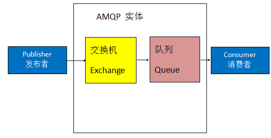
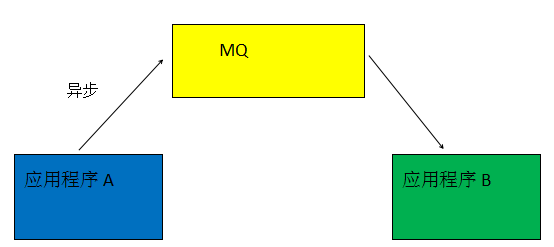
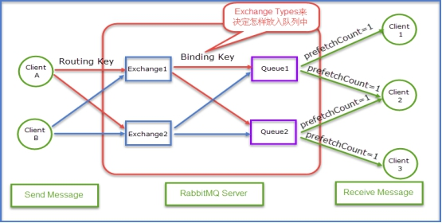
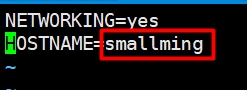
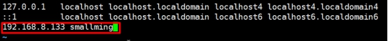
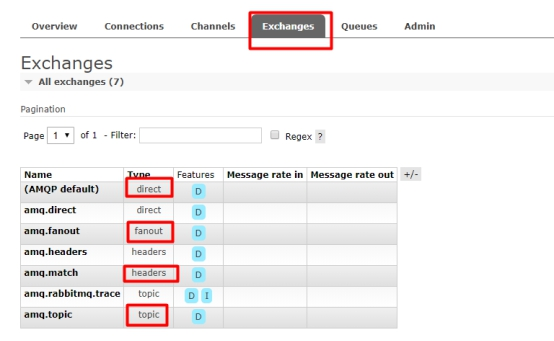

## **主要内容**

1. AMQP简介

2. RabbitMQ简介

3. RabbitMQ原理

4. Erlang安装

5. 安装RabbitMQ

6. RabbitMQ账户管理

7. 交换器

## **学习目标**

| 知识点           | 要求 |
| ---------------- | ---- |
| AMQP简介         | 掌握 |
| RabbmitMQ简介    | 掌握 |
| RabbitMQ原理     | 掌握 |
| Erlang安装       | 掌握 |
| 安装RabbitMQ     | 掌握 |
| RabbitMQ账户管理 | 掌握 |
| 交换器           | 掌握 |

### 一、 **AMQP简介**

#### 1 **AMQP是什么?**

​	AMQP(Advanced Message Queuing Protocol,高级消息队列协议)是进程之间传递异步消息的网络协议。

### 2 **AMQP工作过程**

​	发布者(Publisher)发布消息(Message),经过交换机(Exchange)，交换机根据路由规则将收到消息分发给交换机绑定的队列(Queue)，最后AMQP代理会将消息投递给订阅了此队列的消费者，或者消费者按照需求自行获取。




### 3 **队列**

​	队列是数据结构中概念。数据存储在一个队列中，数据是有顺序的，先进的先出，后进后出。其中一侧负责进数据，另一侧负责出数据。

MQ（消息队列）很多功能都是基于此队列结构实现的!

### 二、 **RabbitMQ简介**

#### 1 **RabbitMQ介绍**

​	RabbitMQ是由Erlang语言编写的基于AMQP的消息中间件。而消息中间件作为分布式系统重要组件之一，可以解决应用耦合，异步消息，流量削峰等问题。

##### 1.1 **解决应用耦合**

###### 1.1.1 **不使用MQ时**


###### 1.1.2 **使用MQ解决耦合**





#### 2 **RabbitMQ适用场景**

​	排队算法 : 使用消息队列特性

​	秒杀活动 : 使用消息队列特性

​	消息分发 : 使用消息异步特性

​	异步处理 : 使用消息异步特性

​	数据同步 : 使用消息异步特性

​	处理耗时任务 : 使用消息异步特性

​	流量销峰

### 三、 **RabbitMQ原理**




| 1.Message                                                    |
| ------------------------------------------------------------ |
| 消息。消息是不具名的，它由消息头消息体组成。消息体是不透明的，而消息头则由一系列可选属性组成，这些属性包括：routing-key(路由键)、priority(相对于其他消息的优先权)、delivery-mode(指出消息可能持久性存储)等。 |
| **2**.**Publisher**                                          |
| 消息的生产者。也是一个向交换器发布消息的客户端应用程序。     |
| **3**.**Consumer**                                           |
| 消息的消费者。表示一个从消息队列中取得消息的客户端应用程序。 |
| **4.Exchange**                                               |
| 交换器。用来接收生产者发送的消息并将这些消息路由给服务器中的队列。三种常用的交换器类型1. direct(发布与订阅 完全匹配)2. fanout(广播)3. topic(主题，规则匹配) |
| **5.Binding**                                                |
| 绑定。用于消息队列和交换器之间的关联。一个绑定就是基于路由键将交换器和消息队列连接起来的路由规则，所以可以将交换器理解成一个由绑定构成的路由表。 |
| **6.Queue**                                                  |
| 消息队列。用来保存消息直到发送给消费者。它是消息的容器，也是消息的终点。一个消息可投入一个或多个队列。消息一直在队列里面，等待消费者链接到这个队列将其取走。 |
| **7.Routing-key**                                            |
| 路由键。RabbitMQ决定消息该投递到哪个队列的规则。（也可以理解为队列的名称，路由键是key，队列是value）队列通过路由键绑定到交换器。消息发送到MQ服务器时，消息将拥有一个路由键，即便是空的，RabbitMQ也会将其和绑定使用的路由键进行匹配。如果相匹配，消息将会投递到该队列。如果不匹配，消息将会进入黑洞。 |
| **8.Connection**                                             |
| 链接。指rabbit服务器和服务建立的TCP链接。                    |
| **9.Channel**                                                |
| 信道。1，Channel中文叫做信道，是TCP里面的虚拟链接。例如：电缆相当于TCP，信道是一个独立光纤束，一条TCP连接上创建多条信道是没有问题的。2，TCP一旦打开，就会创建AMQP信道。3，无论是发布消息、接收消息、订阅队列，这些动作都是通过信道完成的。 |
| **10.Virtual Host**                                          |
| 虚拟主机。表示一批交换器，消息队列和相关对象。虚拟主机是共享相同的身份认证和加密环境的独立服务器域。每个vhost本质上就是一个mini版的RabbitMQ服务器，拥有自己的队列、交换器、绑定和权限机制。vhost是AMQP概念的基础，必须在链接时指定，RabbitMQ默认的vhost是**/** |
| **11.Borker**                                                |
| 表示消息队列服务器实体。                                     |
| **12.交换器和队列的关系**                                    |
| 交换器是通过路由键和队列绑定在一起的，如果消息拥有的路由键跟队列和交换器的路由键匹配，那么消息就会被路由到该绑定的队列中。     也就是说，消息到队列的过程中，消息首先会经过交换器，接下来交换器在通过路由键匹配分发消息到具体的队列中。     路由键可以理解为匹配的规则。 |
| **13.RabbitMQ为什么需要信道？为什么不是TCP直接通信？**       |
| 1. TCP的创建和销毁开销特别大。创建需要3次握手，销毁需要4次分手。2. 如果不用信道，那应用程序就会以TCP链接Rabbit，高峰时每秒成千上万条链接会造成资源巨大的浪费，而且操作系统每秒处理TCP链接数也是有限制的，必定造成性能瓶颈。3. 信道的原理是一条线程一条通道，多条线程多条通道同用一条TCP链接。一条TCP链接可以容纳无限的信道，即使每秒成千上万的请求也不会成为性能的瓶颈。 |

### 四、 **Erlang安装**

​	RabbitMQ是使用Erlang语言编写的，所以需要先配置Erlang

#### 1 **修改主机名**

​	RabbitMQ是通过主机名进行访问的，必须指定能访问的主机名。

```
  vim /etc/sysconfig/network
```




```
  vim /etc/hosts
```

​	新添加了一行，前面为服务器ip，空格后面添加计算机主机名




#### 2 **安装依赖**

```
  yum -y install make gcc gcc-c++ kernel-devel m4 ncurses-devel openssl-devel unixODBC unixODBC-devel
```

#### 3 **上传并解压**

​	上传otp_src_22.0.tar.gz到/usr/local/tmp目录中，进入目录并解压。

 	解压时注意，此压缩包不具有gzip属性，解压参数没有z，只有xf

```
  cd /usr/local/tmp
  tar xf otp_src_22.0.tar.gz -C /usr/local/tmp
```

#### 4 **配置参数**

​	先新建/usr/local/erlang文件夹，作为安装文件夹

```
  mkdir -p /usr/local/erlang
```

​	 进入文件夹

```
  cd otp_src_22.0
```

​	 配置参数

```
  ./configure --prefix=/usr/local/erlang --with-ssl --enable-threads --enable-smp-support --enable-kernel-poll --enable-hipe --without-javac
```

####  5 **编译并安装**

​	编译 

```
  make
```

​	 安装

```
  make install
```

####  6 **修改环境变量**

​	修改/etc/profile文件

```
 vim /etc/profile
```

​	 在文件中添加下面代码 

```
export PATH=$PATH:/usr/local/erlang/bin
```

​	运行文件，让修改内容生效

```
  source /etc/profile
```

####  7 **查看配置是否成功**

```
  erl -version
```


### 五、 **安装RabbitMQ**

#### 1 **上传并解压**

​	上传rabbitmq-server-generic-unix-3.7.18.tar.xz到/usr/loca/tmp中

```
  cd /usr/local/tmp
  tar xf rabbitmq-server-generic-unix-3.7.18.tar.xz
```

#### 2 **复制到local下**

​	复制解压文件到/usr/local下，命名为rabbitmq

```
  cp -r rabbitmq_server-3.7.18 /usr/local/rabbitmq
```

#### 3 **配置环境变量**

```
  vim /etc/profile
```

​	在文件中添加 

```
export PATH=$PATH:/usr/local/rabbitmq/sbin
```

​	解析文件

```
# source /etc/profile
```

####  4 **开启web管理插件**

​	进入rabbitmq/sbin目录

```
# cd /usr/local/rabbitmq/sbin
```

 	查看插件列表

```
# ./rabbitmq-plugins list
```

 	生效管理插件

```
# ./rabbitmq-plugins enable rabbitmq_management
```

####  5 **后台运行**

​	启动rabbitmq。

```
# ./rabbitmq-server -detached
```

​	停止命令，如果无法停止，使用kill -9 进程号进行关闭

```
# ./rabbitmqctl stop_app
```

#### 6 **查看web管理界面**

​	默认可以在安装rabbitmq的电脑上通过用户名：guest密码guest进行访问web管理界面

​	端口号：15672（放行端口，或关闭防火墙）

​	在虚拟机浏览器中输入：

​	<http://localhost:15672>

### 六、 **RabbitMq账户管理**

#### 1 **创建账户**

​	语法：./rabbitmqctl add_user username password

```
# cd /usr/local/rabbitmq/sbin
# ./rabbitmqctl add_user mashibing mashibing
```

#### 2 **给用户授予管理员角色**

​	其中smallming为新建用户的用户名

```
# ./rabbitmqctl set_user_tags mashibing administrator
```

####  3 **给用户授权**

​	“/” 表示虚拟机

​	mashibing 表示用户名

​	".*" ".*" ".*" 表示完整权限

```
# ./rabbitmqctl set_permissions -p "/" mashibing ".*" ".*" ".*"
```

####  4 **登录**

​	使用新建账户和密码在windows中访问rabbitmq并登录 

​	在浏览器地址栏输入：

​	<http://ip:15672/>

 	用户名：mashibing

​	密码：mashibing

###  七、 **交换器（交换机）**

​	交换器负责接收客户端传递过来的消息，并转发到对应的队列中。在RabbitMQ中支持四种交换器

​	1.Direct Exchange：直连交换器（默认）

​	2.Fanout Exchange：扇形交换器

​	3.Topic Exchange：主题交换器

​	4.Header Exchange：首部交换器。

​	在RabbitMq的Web管理界面中Exchanges选项卡就可以看见这四个交换器。




#### 1 **direct交换器**

​	direct交换器是RabbitMQ默认交换器。默认会进行公平调度。所有接受者依次从消息队列中获取值。Publisher给哪个队列发消息，就一定是给哪个队列发送消息。对交换器绑定的其他队列没有任何影响。

​	（代码演示）一个队列需要绑定多个消费者

​	需要使用注解/API：

​	org.springframework.amqp.core.Queue:队列

​	AmqpTemplate：操作RabbitMQ的接口。负责发送或接收消息

​	@RabbitListener(queues = "") 注解某个方法为接收消息方法

#### 1.1 **代码实现**

##### 1.1.1 **新建项目Publisher**

###### 1.1.1.1 **添加依赖**

```
<parent>
    <groupId>org.springframework.boot</groupId>
    <artifactId>spring-boot-starter-parent</artifactId>
    <version>2.2.2.RELEASE</version>
</parent>

<dependencies>
    <dependency>
        <groupId>org.springframework.boot</groupId>
        <artifactId>spring-boot-starter-test</artifactId>
    </dependency>
    <dependency>
        <groupId>org.springframework.boot</groupId>
        <artifactId>spring-boot-starter-amqp</artifactId>
    </dependency>
</dependencies>
```

###### 1.1.1.2 **编写配置文件**

​	新建application.yml.

​	host:默认值localhost

​	username默认值：guest

​	password默认值：guest	

```
spring:
  rabbitmq:
    host: 192.168.1.195
    username: mashibing
    password: mashibing
```

###### 1.1.1.3 **编写配置类**

新建com.config.RabbitmqConfig

​	队列的创建只有没有这个队列的时候需要编写。以后没有这个queue()方法也可以。

```
@Configuration
public class RabbitmqConfig {
    @Bean
    protected Queue queue(){
        Queue queue = new Queue("myqueue");
        return queue;
    }
}
```

###### 1.1.1.4 **编写启动类**

略

###### 1.1.1.5 **编写测试类**

SpringBoot整合Spring-AMQP后包含内置对象AmqpTemplate

```
@SpringBootTest(classes = PublisherApplication.class)
@RunWith(SpringJUnit4ClassRunner.class)
public class MyTest {
    @Autowired
    private AmqpTemplate amqpTemplate;

    @Test
    public void test(){
        amqpTemplate.convertAndSend("myqueue","这是内容1");
        System.out.println("发送成功");
    }
}
```

##### 1.1.2 **创建Consumer**

​	新建项目consumer

###### 1.1.2.1 **添加依赖**

​	和Publisher一样

###### 1.1.2.2 **编写配置文件**

​	和Publisher一样

###### 1.1.2.3 **编写监听器方法**

​	注意：

​	类上要有@Componet，项目启动时此类生效。

​	@RabbitListener 监听指定队列。

```
@Component
public class DemoReceive {

    @RabbitListener(queues = "myqueue")
    public void demo(String msg){
        System.out.println("获取到的消息1111："+msg);
    }

    @RabbitListener(queues = "myqueue")
    public void demo2(String msg){
        System.out.println("获取到的消息2222："+msg);
    }
}
```

###### 1.1.2.4 **新建启动类**

​	略。启动后此项目一直处于运行状态。属于长连接。

#### 2 **fanout交换器**

​	扇形交换器，实际上做的事情就是广播，fanout会把消息发送给所有的绑定在当前交换器上的队列。且每个队列消息中第一个Consumer能收到消息。

​	（代码演示）一个交换器需要绑定多个队列

​	需要使用注解/API：

​	FanoutExchange：fanout交换器

​	Binding：绑定交换器和队列

​	BindingBuilder：Binding的构建器

​	amq.fanout:内置fanout交换器名称

#### 2.1 **代码**

##### 2.1.1 **Publisher**

###### 2.1.1.1 **修改配置类**

```
@Bean
protected Queue fanoutQuque1(){
    return new Queue("fanout1");
}

@Bean
protected Queue fanoutQuque2(){
    return new Queue("fanout2");
}

@Bean
protected FanoutExchange fanoutExchange(){
    return new FanoutExchange("amq.fanout");
}

@Bean
protected Binding fanoutBinding(Queue fanoutQuque1,FanoutExchange fanoutExchange){
    return BindingBuilder.bind(fanoutQuque1).to(fanoutExchange);
}

@Bean
protected Binding fanoutBinding2(Queue fanoutQuque2,FanoutExchange fanoutExchange){
    return BindingBuilder.bind(fanoutQuque2).to(fanoutExchange);
}
```

##### 2.1.2 **编写发送方法******

​	第二个参数routingKey对于fanout没有意义的

```
@Test
public void test2(){
    amqpTemplate.convertAndSend("amq.fanout","asdfadsf","fanout msg");
    System.out.println("发送成功");
}
```

##### 2.1.3 **Consumer**

​	Consumer代码和Direct完全相同。一个队列给一个监听方法即可。

#### 3 **topic交换器**

​	允许在路由键（RoutingKey）中出现匹配规则。

​	路由键的写法和包写法相同。com.msb.xxxx.xxx格式。

​	在绑定时可以带有下面特殊符号，中间可以出现:

​	* : 代表一个单词（两个.之间内容）

​	\# : 0个或多个字符

​	接收方依然是公平调度，同一个队列中内容轮换获取值。

​	需要使用注解/API：

​	TopicExchange：Topic交换器

​	amq.topic:内置topic交换器名称

#### 3.1 **代码**

##### 3.1.1 **Publisher**

###### 3.1.1.1 **配置类。**

​	之所以建立两个队列目的是为了演示使用Topic完成Fanout效果。

```
@Bean
protected Queue topicQueue() {
    return new Queue("topic1");
}

@Bean
protected Queue topicQueue2() {
    return new Queue("topic2");
}

@Bean
protected TopicExchange topicExchange() {
    return new TopicExchange("amq.topic");
}

@Bean
protected Binding topicBinding(Queue topicQueue, TopicExchange topicExchange) {
    return BindingBuilder.bind(topicQueue).to(topicExchange).with("com.a");
}

@Bean
protected Binding topicBinding2(Queue topicQueue2, TopicExchange topicExchange) {
    return BindingBuilder.bind(topicQueue2).to(topicExchange).with("com.#");
}
```

###### 3.1.1.2 **发送消息**

​	第二个参数为路由键，匹配配置类中绑定时的路由规则。

```
@Test
public void test3(){
    amqpTemplate.convertAndSend("amq.topic","com.bjsxt.a.b","topic msg");
    System.out.println("发送成功");
}
```

 3.1.2 **Consumer**

​	Consumer代码与以前一样，注意队列名称topic1,topic2不要写路由键名称。( queues取值)

```
@RabbitListener(queues = "topic2")
public void demo10(String msg){
    System.out.println("topic2-2:"+msg);
}
```

### 八、 **传递对象类型参数**

​	如果消息是对象类型，此对象的类型必须进行序列化，且需要给定序列化值

```
public class People implements Serializable 
{
    public static final long serialVersionUID=1L;
}
```

