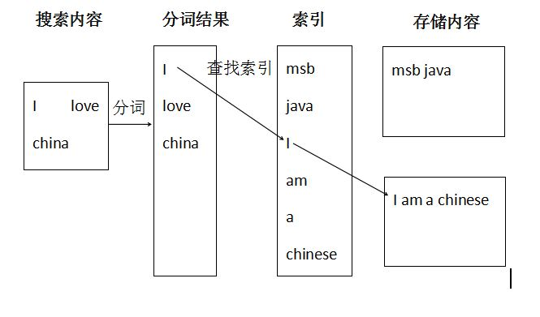
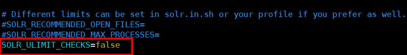
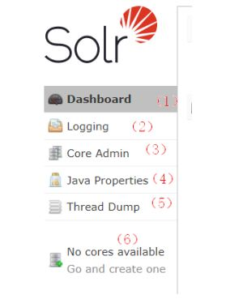
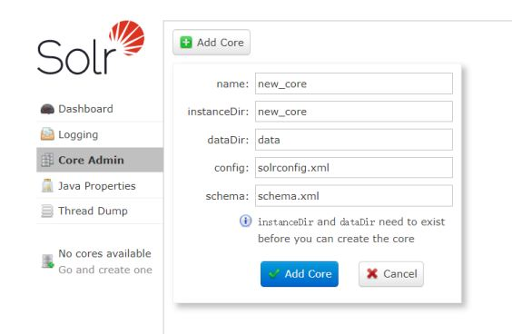
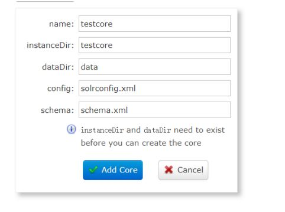
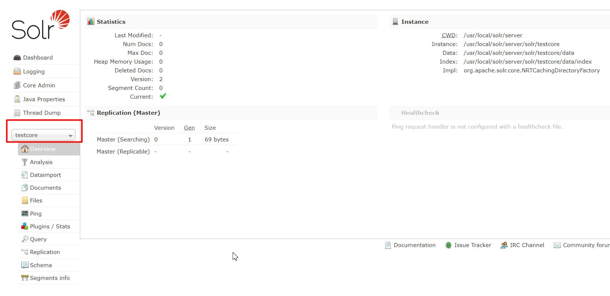
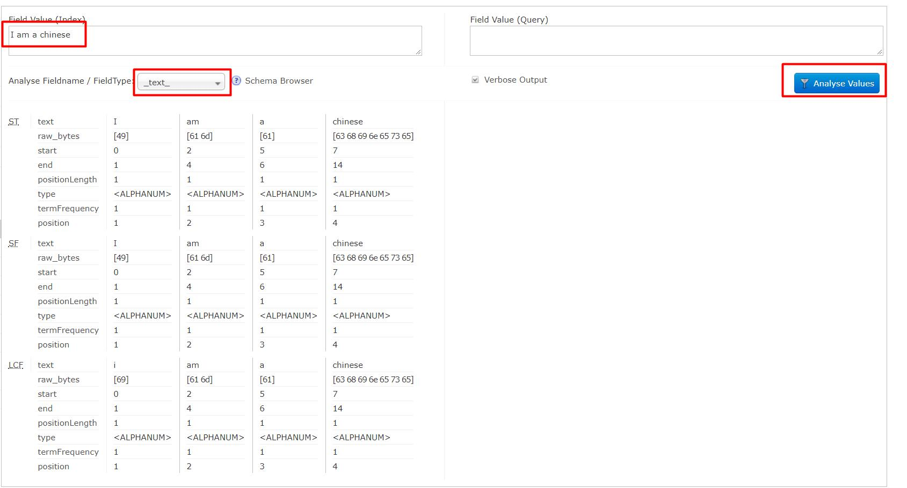
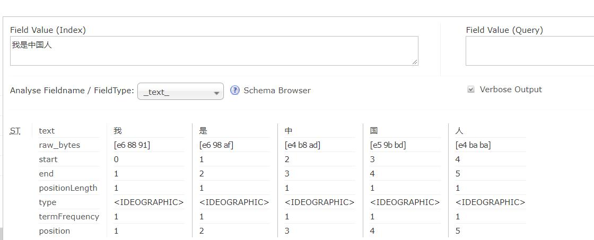
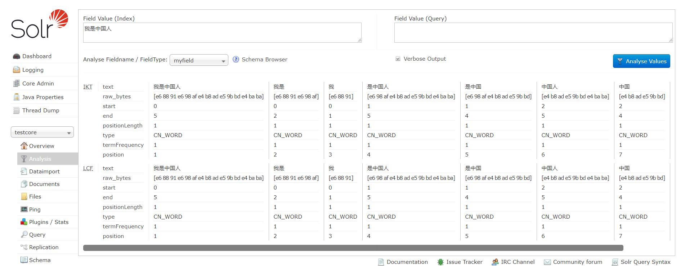
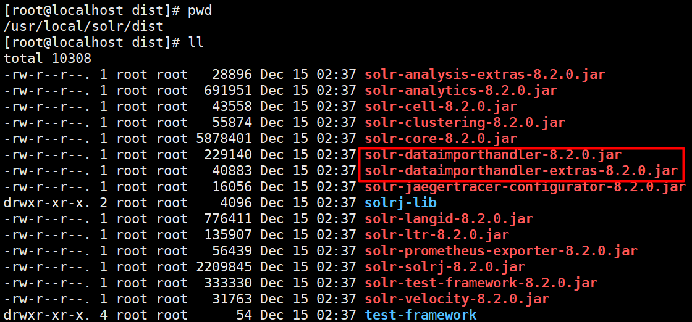

# Solr

### 主要内容

1. Solr简介

2. Solr搜索原理

3. Solr单机版安装

4. 可视化管理界面

5. 新建核心

6. 分词

7. Dataimport

8. 使用SolrJ操作Solr

9. Spring Data for Apache Solr

    10. SolrCloud

### 学习目标

| 知识点                      | 要求 |
| --------------------------- | ---- |
| Solr简介                    | 掌握 |
| Solr搜索原理                | 掌握 |
| Solr单机版安装              | 掌握 |
| 可视化管理界面              | 掌握 |
| 新建核心                    | 掌握 |
| 分词                        | 掌握 |
| Dataimport                  | 掌握 |
| 使用SolrJ操作Solr           | 掌握 |
| SolrCloud                   | 掌握 |
| Spring Data for Apache Solr | 掌握 |

### 一、Solr简介

#### 1.为什么使用Solr

​	在海量数据下，对MySQL或Oracle进行模糊查询或条件查询的效率是很低的。而搜索功能在绝大多数项目中都是必须的，如何提升搜索效率是很多互联网项目必须要考虑的问题。

​	既然使用关系型数据库进行搜索效率比较低，最直接的解决方案就是使用专用搜索工具进行搜索，从而提升搜索效率。

#### 2.常见搜索解决方案

​	基于Apache Lucene（全文检索工具库）实现搜索。但是Lucene的使用对于绝大多数的程序员都是“噩梦级”的。

​	基于谷歌API实现搜索。

​	基于百度API实现搜索。

#### 3.Solr简介

​	Solr是基于Apache Lucene构建的用于搜索和分析的开源解决方案。可提供可扩展索引、搜索功能、高亮显示和文字解析功能。

​	Solr本质就是一个Java web 项目，且内嵌了Jetty服务器，所以安装起来非常方便。客户端操作Solr的过程和平时我们所写项目一样，就是请求Solr中控制器，处理完数据后把结果响应给客户端。

#### 4.正向索引和反向索引

​	只要讨论搜索就不得不提的两个概念：正向索引（forward index）和反向索引(inverted index)。

​	正向索引：从文档内容到词组的过程。每次搜索的实收需要搜索所有文档，每个文档比较搜索条件和词组。

| 文档           | 词组           |
| -------------- | -------------- |
| I am a chinese | I,am,a,chinese |

​	反向索引：是正向索引的逆向。建立词组和文档的映射关系。通过找到词组就能找到文档内容。（和新华字典找字很像）

| 词组           | 文档           |
| -------------- | -------------- |
| I,am,a,chinese | I am a chinese |

### 二、Solr搜索原理

#### 1.搜索原理

​	Solr能够提升检索效率的主要原因就是分词和索引（反向索引，通过）。

​	分词：会对搜索条件/存储内容进行分词，分成日常所使用的词语。

​	索引：存储在Solr中内容会按照程序员的要求来是否建立索引。如果要求建立索引会把存储内容中关键字（分词）建立索引。



#### 2.Solr中数据存储说明

​	Solr为了给内容建立索引，所以Solr就必须具备数据存储能力。所有需要被搜索的内容都需要存储在Solr中，在开发中需要把数据库中数据添加到Solr中进行初始化，每次修改数据库中数据还需要同步Solr中的数据。

​	Solr中数据存储是存储在Document对象中，对象中可以包含的属性和属性类型都定义在scheme.xml中。如果需要自定义属性或自定义属性类型都需要修改scheme.xml配置文件。从Solr5开始schema.xml更改名称为managed-scheme(没有扩展名)

### 三、Solr单机版安装

​	Solr是使用Java编写，所以必选先安装JDK。

#### 1.上传并解压

​	上传压缩包solr-7.7.2.tgz到/usr/local/tmp中。

解压

```
# cd /usr/local/tmp
# tar zxf solr-7.7.2.tgz
```

#### 2.复制到/usr/local中

```
# cp -r solr-7.7.2 ../solr
```

#### 3.修改启动参数

​	修改启动参数，否则启动时报警告。提示设置SOLR_ULIMIT_CHECKS=false

```
# cd /usr/local/solr/bin
# vim solr.in.sh
```



####  4.启动Solr

​	Solr内嵌Jetty，直接启动即可。监听8983端口。

​	solr默认不推荐root账户启动，如果是root账户启动需要添加-force参数。

```
# ./solr start -force
```

### 四、可视化管理界面

​	在关闭防火墙的前提下，可以在windows的浏览器中访问Solr。

​	输入: http://192.168.93.10:8983 就可以访问Solr的可视化管理界面。

​	左侧有5个菜单。分别是：

​	（1）Dashboard：面板显示Solr的总体信息。

​	（2）Logging：日志

​	（3）Core Admin：Solr的核心。类似于数据的Database

​	（4）Java Perperties：所有Java相关属性。

​	（5）Thread Dump：线程相关信息。

​	（6）如果有Core，将显示在此处。



### 五、新建核心

​	Solr安装完成后默认是没有核心的。需要手动配置。

​	需要在solr/server/solr下新建文件夹，并给定配置文件，否则无法建立。



#### 1.新建目录

​	在/usr/local/solr/server/solr中新建自定义名称目录。此处示例名称为testcore。

```
# cd /usr/local/solr/server/solr
# mkdir testcore
```

#### 2.复制配置文件

​	在configsets里面包含了_default和sample_techproducts_configs。里面都是配置文件示例。_default属于默认配置，较纯净。sample_techproducts_configs是带有了一些配置示例。

```
# cp -r configsets/_default/conf/ testcore/
```

#### 3.填写Core信息

​	在可视化管理界面中Core Admin中编写信息后点击Add Core后，短暂延迟后testcore就会创建成功。schema处不用更改。



#### 4.出现testcore

​	在客户端管理界面中，选择新建的Core后，就可以按照自己项目的需求进行操作了。



### 六、分词Analysis

​	在Solr可视化管理界面中，Core的管理菜单项中都会有Analysis。表示根据Scheme.xml(managed-schema)中配置要求进行解析。

​	对英文解析就比较简单了，只要按照空格把英文语句拆分成英文单词即可。



​	但是如果条件是中文时，把一句话按照字进行拆分就不是很合理了。正确的方式是按照合理的词组进行拆分。

#### 1.配置步骤

​	上传ik-analyzer.jar到webapps中。

​	去https://search.maven.org/search?q=com.github.magese下载对应版本的ik-analyzer。可以在资料中直接获取。

##### 1.1上传jar到指定目录

​	上传ik-analyzer-7.7.0.jar到

​	/usr/local/solr/server/solr-webapp/webapp/WEB-INF/lib目录中

##### 1.2修改配置文件

​	修改/usr/local/solr/server/solr/testcore/conf/managed-schema

```sh
vim /usr/local/solr/server/solr/testcore/conf/managed-schema
```

​	添加下面内容。

​	排版：Esc 退出编辑状态下：gg=G

```
<field name="myfield" type="text_ik" indexed="true" stored="true" />
    <fieldType name="text_ik" class="solr.TextField">
            <analyzer type="index">
                    <tokenizer class="org.wltea.analyzer.lucene.IKTokenizerFactory" useSmart="false" conf="ik.conf"/>
                    <filter class="solr.LowerCaseFilterFactory"/>
            </analyzer>
            <analyzer type="query">
                    <tokenizer class="org.wltea.analyzer.lucene.IKTokenizerFactory" useSmart="true" conf="ik.conf"/>
                    <filter class="solr.LowerCaseFilterFactory"/>
            </analyzer>
    </fieldType>
```

##### 1.3重启

```
# cd /usr/local/solr/bin
# ./solr stop -all
# ./solr start -force
```

##### 1.4验证

​	可以在可视化管理界面中找到myfield属性进行验证。



#### 2.managed-schema配置说明

##### 2.1< fieldType/>

​	表示定义一个属性类型。在Solr中属性类型都是自定义的。在上面配置中name=”text_ik”为自定义类型。当某个属性取值为text_ik时IK Analyzer才能生效。

##### 2.2< field/>

​	表示向Document中添加一个属性。

​	常用属性：

​		name: 属性名

​		type:属性类型。所有类型都是solr使用<fieldType>配置的

​		indexed: 是否建立索引

​		stored: solr是否把该属性值响应给搜索用户。

​		required：该属性是否是必须的。默认id是必须的。

​		multiValued：如果为true，表示该属性为复合属性，此属性中包含了多个其他的属性。常用在多个列作为搜索条件时，把这些列定义定义成一个新的复合属性，通过搜索一个复合属性就可以实现搜索多个列。当设置为true时与< copyField source="" dest=""/>结合使用

##### 2.3< uniqueKey>

​	唯一主键，Solr中默认定义id属性为唯一主键。ID的值是不允许重复的。

##### 2.4< dynamicField>

​	名称中允许*进行通配。代表满足特定名称要求的一组属性。

 	msb_java    

​	msb_bigdata

​	msb_UI

​        msb_*

### 七、Dataimport

​	可以使用Solr自带的Dataimport功能把数据库中数据快速导入到solr中.

​	**必须保证managed-schema和数据库中表的列对应。，添加配置**


#### 1.修改配置文件

​	修改solrconfig.xml，添加下面内容

```
 <!-- 配置数据导入的处理器 -->
  <requestHandler name="/dataimport" class="org.apache.solr.handler.dataimport.DataImportHandler">
    <lst name="defaults">
	  <!--  加载data-config.xml  -->
      <str name="config">data-config.xml</str>
     </lst>
  </requestHandler>
```

#### 2.新建data-config.xml

​	和solrconfig.xml同一目录下新建data-config.xml

```
<?xml version="1.0" encoding="UTF-8"?>
<dataConfig>
        <dataSource type="JdbcDataSource"   
                driver="com.mysql.jdbc.Driver"   
                url="jdbc:mysql://192.168.1.135:3306/mytest"   
                user="root"   
                password="root"/>
        <document>
            <entity name="product" query="SELECT id,name,price from t_product">
                <!-- 
                 实现数据库的列和索引库的字段的映射
                 column 指定数据库的列表
                 name  指定索引库的字段名字，必须和schema.xml中定义的一样
                 -->
                 <field column="id" name="id"/>
                 <field column="name" name="name"/>
				 <field column="price" name="price"/>
            </entity>
         </document>
</dataConfig>
```

#### 3.添加jar

​	向solr-webapp中添加三个jar。在dist中两个还有一个数据库驱动。



#### 4.操作   

​	重启solr后，在可视化管理页面中进行数据导入。

​	注意：

​	点击导入按钮后，要记得点击刷新按钮。

### 八、菜单项目Documents使用办法

​	以XML格式举例

#### 1.新增/修改

​	当id不存在时新增，当id存在修改。

```
<doc>
<field name="id">8</field>
<field name="name">明天更大卖</field>
<field name="price">98</field>
</doc>
```

#### 2.删除

##### 2.1根据主键删除

```
<delete>
	<id>8</id>
</delete>
<commit/>
```

##### 2.2根据条件删除

```
<delete>
	<query>*:*</query>
</delete>
```

#### 3.solr可视化界面使用（QUERY）


参数：

​	**q：**query，等于。格式  ——> parameter/columns : value	**具有分词时，相当于模糊查询--like**

​	**fq：**【在 q 的情况下再加条件】（要有分词功能）注意这里的keyword是用来检索的字段，他包含name、address、gender、expert_skill，这几个属性，所以我搜索“海”能够查询出来有海字的记录。

​	**sort：**排序 。 parameter/columns    desc逆序/asc

​	**start,rows：**从查询结果的start开始，显示到rows结束【下标】

​	**fl：**想显示的属性。

​	**df：**不想显示的属性。

​	**wt：**返回值类型

​	**hl：**高亮

		*  hl.fl						 value
		*  hl.simple.pre        <font color='red'>
		*  hl.simple.post     </font>

​	

### 九、使用SolrJ操作Solr

​	SolrJ是Solr提供的Java客户端API。通过SolrJ可以实现Java程序对Solr中数据的操作。

​	大前提：添加SolrJ依赖。依赖版本和Solr版本严格对应

```
<dependencies>
    <dependency>
        <groupId>org.apache.solr</groupId>
        	<artifactId>solr-solrj</artifactId>
        <version>7.7.2</version>
    </dependency>
</dependencies>
```

#### 1.新增/修改实现

```
String url = "http://192.168.93.10:8983/solr/testcore";
HttpSolrClient solrClient =  new HttpSolrClient.Builder(url).build();
SolrInputDocument inputDocument = new SolrInputDocument();
inputDocument.addField("id","3");
inputDocument.addField("myfield","myfield3");
solrClient.add(inputDocument);
solrClient.commit();
```

- 使用solrj进行索引的添加
    - - **每个索引的添加必须要ID**
        - **添加key值要和schema.xml文件内的field域保持一致**
        - **添加数据后一定要提交数据，不然是不存在数据的**
        - **连接Solr的对象需要连接到项目名**
        - **每个document是一组Json数据对象**

#### 2.删除实现

```
String url = "http://192.168.93.10:8983/solr/testcore";
HttpSolrClient solrClient =  new HttpSolrClient.Builder(url).build();
solrClient.deleteById("3");
solrClient.commit();
```

- **删除**
- 删除支持两种删除方式
    - - **1.根据ID**
        - 2.执行查询删除
            - - **查询删除的格式：查询的域:值**

#### 3.查询实现

```
public void testQuery(){
    try {
        String url = "http://192.168.93.10:8983/solr/testcore";
        HttpSolrClient solrClient = new HttpSolrClient.Builder(url).build();

        //封装了所有查询条件
        SolrQuery params = new SolrQuery();
        params.setQuery("name:丰富的");
        //排序
        params.setSort("price", SolrQuery.ORDER.desc);
        //分页
        params.setStart(0);
 params.setRows(1);
        //高亮
        params.setHighlight(true);
        params.addHighlightField("name");
        params.setHighlightSimplePre("<span>");
        params.setHighlightSimplePost("</span>");

        QueryResponse response = solrClient.query(params);
        SolrDocumentList list = response.getResults();
        System.out.println("总条数："+list.getNumFound());

        //高亮数据
        Map<String, Map<String, List<String>>> highlighting = response.getHighlighting();

        for(SolrDocument doc :list){
            System.out.println(doc.get("id"));
            Map<String, List<String>> map = highlighting.get(doc.get("id"));
            List<String> HLList = map.get("name");
            if(HLList!=null&&HLList.size()>0){//显示高亮数据
                System.out.println(HLList.get(0));
            }else{
                System.out.println(doc.get("name"));
            }
            System.out.println(doc.get("price"));
            System.out.println("===================");
        }
        solrClient.close();
    } catch (SolrServerException e) {
        e.printStackTrace();
    } catch (IOException e) {
        e.printStackTrace();
    }
}
```

**使用到的对象**

* 1.SolrQuery查询对象
    * 1.setQuery()：设置查询的关键字
        2.set（）:设置查询的域
        3.setStart():设置开始
        4.setRows（）：设置结束

****

* 2.QueryResponse：响应结果集
    * 1.getNumFound():返回查询到的数量
        2.getResults（）；返回封装的list集合

* 3.SolrDocumentList：结果集合
    * 1.get():获取指定域的值

### 十、Spring Data for Apache Solr

#### 1.Spring Data简介

​	Spring Data 是Spring的顶级项目。里面包含了N多个二级子项目，每个子项目对应一种技术或工具。其目的为了让数据访问更加简单，更加方便的和Spring进行整合。

​	Spring Data 项目如果单独使用是还需要配置XML配置文件的，当和Spring Boot整合后使用起来非常方便。spring-boot-starter-data-xx就是对应的启动器。

#### 2.实现步骤

##### 2.1添加依赖

```
 <dependencies>
        <dependency>
            <groupId>org.springframework.boot</groupId>
            <artifactId>spring-boot-starter-web</artifactId>
        </dependency>
        <dependency>
            <groupId>org.springframework.boot</groupId>
            <artifactId>spring-boot-starter-test</artifactId>
        </dependency>
        <dependency>
            <groupId>org.springframework.boot</groupId>
            <artifactId>spring-boot-starter-data-solr</artifactId>
        </dependency>
    </dependencies>
```

##### 2.2编写配置文件

```
spring:
  data:
    solr:
      host: http://192.168.9.132:8080/solr
      # zk-host: 192.168.9.132:2181,192.168.9.132:2182,192.168.9.132:2183
```

##### 2.3编写测试类

```
@RunWith(SpringJUnit4ClassRunner.class)
@SpringBootTest(classes = MyApplication.class)
public class MyTest {
    @Autowired
    private SolrTemplate solrTemplate;

    public void testInsert(){
        SolrInputDocument doc = new SolrInputDocument();
        doc.setField("id","002");
        doc.setField("item_title","这是一个手机3");
        UpdateResponse ur = solrTemplate.saveBean("collection1", doc);
        if(ur.getStatus()==0){
            System.out.println("成功");
        }else{
            System.out.println("失败");
        }
        solrTemplate.commit("collection1");
    }

    public void testDelete(){
        UpdateResponse ur = solrTemplate.deleteByIds("collection1", "change.me");
        if(ur.getStatus()==0){
            System.out.println("成功");
        }else{
            System.out.println("失败");
        }
        solrTemplate.commit("collection1");
    }


    public void query(){
        SimpleQuery query = new SimpleQuery();
        Criteria c = new Criteria("item_keywords");
        c.is("手机");
        query.addCriteria(c);
        query.setOffset(1L);
        query.setRows(1);
        ScoredPage<DemoPojo> sp = solrTemplate.queryForPage("collection1", query, DemoPojo.class);
        System.out.println(sp.getContent());
    }

    @Test
    public void queryHL(){

        List<DemoPojo> listResult = new ArrayList<>();
        SimpleHighlightQuery query = new SimpleHighlightQuery();
        //设置查询条件
        Criteria c = new Criteria("item_keywords");
        c.is("手机");
        query.addCriteria(c);
        //分页
        query.setOffset(0L);
        query.setRows(10);
        //排序
        Sort sort = new Sort(Sort.Direction.DESC,"id");
        query.addSort(sort);
        //高亮设置
        HighlightOptions hlo = new HighlightOptions();
        hlo.addField("item_title item_sell_point");
        hlo.setSimplePrefix("<span style='color:red;'>");
        hlo.setSimplePostfix("</span>");
        query.setHighlightOptions(hlo);
        HighlightPage<DemoPojo> hl = solrTemplate.queryForHighlightPage("collection1", query, DemoPojo.class);
//        System.out.println(hl.getContent());
        List<HighlightEntry<DemoPojo>> highlighted = hl.getHighlighted();
        for(HighlightEntry<DemoPojo> hle : highlighted){
            List<HighlightEntry.Highlight> list = hle.getHighlights();
            DemoPojo dp = hle.getEntity();
            for (HighlightEntry.Highlight h : list){//一个对象里面可能多个属性是高亮属性
                if(h.getField().getName().equals("item_title")){
                    dp.setItem_title( h.getSnipplets().get(0));
                }
            }
            listResult.add(dp);
        }
        System.out.println(listResult);
    }
}
```

### 十一. 使用zookeepr管理solr集群

1.上传压缩包到/usr/local/tmp 下 并解压。

2.在 /usr/local下新建文件夹 zookeeper

```
# mkdir /usr/local/zookeeper
```

3.把解压的所有文件复制到zookeeper下， 并命名为zk1

```
# cp -r /usr/local/temp/zookeeper-3.4.8 /usr/local/zookeeper/zk1
```

4.在zk1下新建文件夹 data

5.在data下新建文件 myid, 里面写上 1

```
# vim myid
```

6.进入到zk1/conf 下 把 zoo_sample.cfg 复制一份叫做 zoo.cfg

7.编辑 zoo.cfg 内容，设置 dataDIR为 data文件夹， 并在文件最下面添加下面内容

```
server.1=192.168.93.10:2688:3888
server.2=192.168.93.10:2689:3889
server.3=192.168.93.10:2690:3890
```

 7.1 server.1中的1是myid的内容

 7.2 2688 2689 2690 是 zookeeper内部端口

 7.3 3888 3889 3890 是 leader端口

8.把zk1复制两份，分部叫做 zk2  zk3  并修改 myid 的值为 2，3 修改zoo.cfg中 dataDIR和clientPort

9.启动三个zookeeper

```
# ./zkServer.sh start
```

10.查看状态

```
# ./zkServer.sh status
```

### 十一. 使用zookeepr管理solr集群(Dokcer )

#### **1、准备**docker-compose.yml**文件**

```shell
version: '2'
services:
  zoo1:
    image: zookeeper:3.5
    restart: always
    container_name: zoo1
    ports:
      - "2181:2181"
    environment:
      ZOO_MY_ID: 1
      ZOO_SERVERS: server.1=0.0.0.0:2688:3888 server.2=zoo2:2689:3888 server.3=zoo3:2690:3888

  zoo2:
    image: zookeeper:3.5
    restart: always
    container_name: zoo2
    ports:
      - "2182:2181"
    environment:
      ZOO_MY_ID: 2
      ZOO_SERVERS: server.1=zoo1:2688:3888 server.2=0.0.0.0:2689:3888 server.3=zoo3:2690:3888

  zoo3:
    image: zookeeper:3.5
    restart: always
    container_name: zoo3
    ports:
      - "2183:2181"
    environment:
      ZOO_MY_ID: 3
      ZOO_SERVERS: server.1=zoo1:2688:3888 server.2=zoo2:2689:3888 server.3=0.0.0.0:2690:3888


```

#### **2、创建镜像**

* 要在创建的docker-compose.yml文件中使用命令

```shell
docker-compose up -d
```

#### **3、进入容器**

```shell
docker exec -it zoo1 /bin/bash

#查看zoo1 的状态
cd bin
./zkServer.sh status
```

* 如果出现，以下情况：

```
ZooKeeper JMX enabled by default
Using config: /conf/zoo.cfg
Client port not found in static config file. Looking in dynamic config file.
grep: : No such file or directory
Client port not found in the server configs
Client port not found. Looking for secureClientPort in the static config.
Unable to find either secure or unsecure client port in any configs. Terminating.
```

​	通过阅读我们知道他在conf中的zoo.cfg文件中缺少 **clientPort **我们只需要自行添加即可

```shell
#修改之前我们先装一下 vim
apt-get update

apt-get install -y vim 

#修改zoo.fcg文件
vim /conf/zoo.fcg

clientPort=2181
```

* 完事之后**重启**zoo1

    

    成功！！

    

#### 4、查看所有zookeeper的状态

```shell
docker exec -it zoo3 bash ./bin/zkServer.sh status
```

#### 5、进去客户端

```shell
docker exec -it zoo3 zkCli.sh
```


### 十二、SolrCloud

​	Solr可以搭建具备容错能力和高可用的Solr集群。集群中集群配置、自动负载均衡和查询故障转移、			Zookeeper集群实现集群协调管理，这些全部功能统称为SolrCloud。

​	SolrCloud是基于Zookeeper进行管理的。在Solr中已经内置了Zookeeper相关内容，当执行集群创建命令会自动创建Zookeeper相关内容。这个使用的是Zookeeper的集群管理功能实现的。

#### 1.搭建

##### 1.1创建

​	SolrCloud已经包含在了Solr中，可以直接启动Solr集群。

```
 ./solr -e cloud -noprompt -force
```

​	此命令等同于# ./solr -e cloud -force全部参数为默认值。

​	运行成功后会在example文件夹多出cloud文件夹。

##### 1.2停止

```
 ./solr stop -all
```

##### 1.3重新运行

```
 ./solr start -c -p 8983 -s ../example/cloud/node1/solr/ -force
 ./solr start -c -p 7574 -z localhost:9983 -s ../example/cloud/node2/solr/ -force
```

