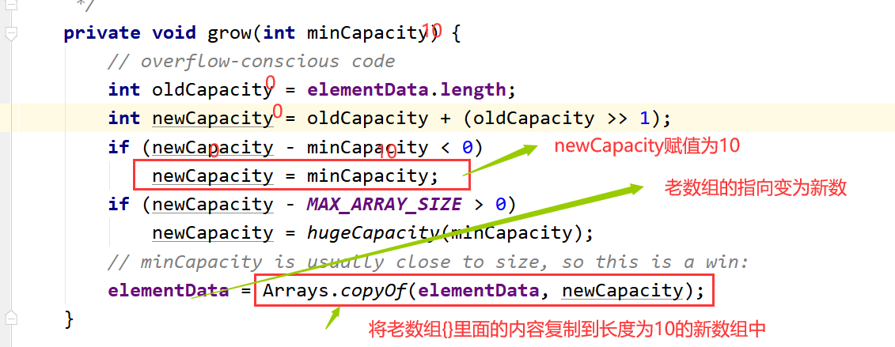
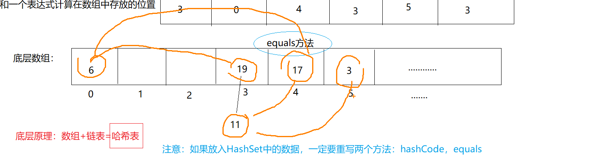

# 11 集合


# Colletion接口

## 1.1 常用方法

```java
package com.msb.test01;
import java.util.ArrayList;
import java.util.Arrays;
import java.util.Collection;
import java.util.List;
/**
 * @author : msb-zhaoss
 */
public class Test01 {
    //这是main方法，程序的入口
    public static void main(String[] args) {
        /*
        Collection接口的常用方法：
        增加：add(E e) addAll(Collection<? extends E> c)
        删除：clear() remove(Object o)
        修改：
        查看：iterator() size()
        判断：contains(Object o)  equals(Object o) isEmpty()
         */
        //创建对象：接口不能创建对象，利用实现类创建对象：
        Collection col = new ArrayList();
        //调用方法：
        //集合有一个特点：只能存放引用数据类型的数据，不能是基本数据类型
        //基本数据类型自动装箱，对应包装类。int--->Integer
        col.add(18);
        col.add(12);
        col.add(11);
        col.add(17);
        System.out.println(col/*.toString()*/);
        List list = Arrays.asList(new Integer[]{11, 15, 3, 7, 1});
        col.addAll(list);//将另一个集合添加入col中
        System.out.println(col);
        //col.clear();清空集合
        System.out.println(col);
        System.out.println("集合中元素的数量为："+col.size());
        System.out.println("集合是否为空："+col.isEmpty());
        boolean isRemove = col.remove(15);
        System.out.println(col);
        System.out.println("集合中数据是否被删除："+isRemove);
        Collection col2 = new ArrayList();
        col2.add(18);
        col2.add(12);
        col2.add(11);
        col2.add(17);
        Collection col3 = new ArrayList();
        col3.add(18);
        col3.add(12);
        col3.add(11);
        col3.add(17);
        System.out.println(col2.equals(col3));
        System.out.println(col2==col3);//地址一定不相等  false
        System.out.println("是否包含元素："+col3.contains(117));
    }
}

```

## 1.2 Collection集合的遍历

```java
迭代器简要原理图：


package com.msb.test01;
import java.util.ArrayList;
import java.util.Collection;
import java.util.Iterator;
/**
 * @author : msb-zhaoss
 */
public class Test02 {
    //这是main方法，程序的入口
    public static void main(String[] args) {
        Collection col = new ArrayList();
        col.add(18);
        col.add(12);
        col.add(11);
        col.add(17);
        col.add("abc");
        col.add(9.8);
        //对集合遍历（对集合中元素进行查看）
        //方式1：普通for循环
        /*for(int i= 0;i<col.size();i++){
            col.
        }*/
        //方式2：增强for循环
        for(Object o:col){
            System.out.println(o);
        }
        System.out.println("------------------------");
        //方式3：iterator()
        Iterator it = col.iterator();
        while(it.hasNext()){
            System.out.println(it.next());
        }
    }
}

```


## 2 List接口

### 2.1 常用方法和遍历方式

```java
package com.msb.test01;
import com.sun.org.apache.xerces.internal.dom.PSVIAttrNSImpl;
import java.util.ArrayList;
import java.util.Iterator;
import java.util.List;
/**
 * @author : msb-zhaoss
 */
public class Test03 {
    //这是main方法，程序的入口
    public static void main(String[] args) {
        /*
        List接口中常用方法：
        增加：add(int index, E element)
        删除：remove(int index)  remove(Object o)
        修改：set(int index, E element)
        查看：get(int index)
        判断：
         */
        List list = new ArrayList();
        list.add(13);
        list.add(17);
        list.add(6);
        list.add(-1);
        list.add(2);
        list.add("abc");
        System.out.println(list);
        list.add(3,66);
        System.out.println(list);
        list.set(3,77);
        System.out.println(list);
        list.remove(2);//在集合中存入的是Integer类型数据的时候，调用remove方法调用的是：remove(int index)
        System.out.println(list);
        list.remove("abc");
        System.out.println(list);
        Object o = list.get(0);
        System.out.println(o);
        //List集合 遍历：
        //方式1：普通for循环：
        System.out.println("---------------------");
        for(int i = 0;i<list.size();i++){
            System.out.println(list.get(i));
        }
        //方式2：增强for循环：
        System.out.println("---------------------");
        for(Object obj:list){
            System.out.println(obj);
        }
        //方式3：迭代器：
        System.out.println("---------------------");
        Iterator it = list.iterator();
        while(it.hasNext()){
            System.out.println(it.next());
        }
    }
}
```

### 2.2 ArrayList实现类（JDK1.7）

底层重要属性：


在JDK1.7中：在调用构造器的时候给底层数组elementData初始化，<font color=#FF0000>数组初始化长度为10</font>：


对应内存：


调用add方法：

```java
	     ArrayList al = new ArrayList();
        System.out.println(al.add("abc"));
        System.out.println(al.add("def"));
```


当数组中的10个位置都满了的时候就开始进行数组的扩容，扩容长度为 <font color=#FF0000>原数组的1.5倍</font>：


### 2.3 ArrayList实现类（JDK1.8）

【1】JDK1.8底层依旧是Object类型的数组，size:数组中有效长度：


【2】ArrayList al = new ArrayList();调用空构造器：


【3】add方法：





### 2.4 Vector实现类

【1】底层Object数组，int类型属性表示数组中有效长度：


【2】Vector v=new Vector();调用构造器：


【3】add方法：


### 2.5 泛型

【1】什么是泛型（Generic）：
泛型就相当于标签
形式：<>  
集合容器类在设计阶段/声明阶段不能确定这个容器到底实际存的是什么类型的对象，所以在JDK1.5之前只能把元素类型设计为Object，
JDK1.5之 后使用泛型来解决。因为这个时候除了元素的类型不确定，其他的部分是确定的，例如关于这个元素如何保存，如何管理等是确定的，因此此时把元素的类型设计成一个参数，这个类型参数叫做泛型。
Collection<E>, List<E>， ArrayList<E> 这个<E>就是类型参数，即泛型。

【2】没有泛型的时候使用集合：

```java
package com.msb.test01;
import java.util.ArrayList;
/**
 * @author : msb-zhaoss
 */
public class Test01 {
    //这是main方法，程序的入口
    public static void main(String[] args) {
        //创建一个ArrayList集合，向这个集合中存入学生的成绩：
        ArrayList al = new ArrayList();
        al.add(98);
        al.add(18);
        al.add(39);
        al.add(60);
        al.add(83);
        al.add("丽丽");
        //对集合遍历查看：
        for(Object obj:al){
            System.out.println(obj);
        }
    }
}
```

如果不使用泛型的话，有缺点：
一般我们在使用的时候基本上往集合中存入的都是相同类型的数据--》便于管理，所以现在什么引用数据类型都可以存入集合，不方便！

【3】JDK1.5以后开始使用泛型，集合中使用泛型：

```java
package com.msb.test01;
import java.util.ArrayList;
/**
 * @author : msb-zhaoss
 */
public class Test01 {
    //这是main方法，程序的入口
    public static void main(String[] args) {
        //创建一个ArrayList集合，向这个集合中存入学生的成绩：
        //加入泛型的优点：在编译时期就会对类型进行检查，不是泛型对应的类型就不可以添加入这个集合。
        ArrayList<Integer> al = new ArrayList<Integer>();
        al.add(98);
        al.add(18);
        al.add(39);
        al.add(60);
        al.add(83);
        /*al.add("丽丽");
        al.add(9.8);*/
        //对集合遍历查看：
        /*for(Object obj:al){
            System.out.println(obj);
        }*/
        for(Integer i:al){
            System.out.println(i);
        }
    }
}
```

【4】泛型总结：
（1）JDK1.5以后
（2）泛型实际就是 一个<>引起来的 参数类型，这个参数类型  具体在使用的时候才会确定具体的类型。


（3）使用了泛型以后，可以确定集合中存放数据的类型，在编译时期就可以检查出来。
（4）使用泛型你可能觉得麻烦，实际使用了泛型才会简单，后续的遍历等操作简单。
（5）泛型的类型：都是引用数据类型，不能是基本数据类型。
（6）ArrayList<Integer> al = new ArrayList<Integer>();在JDK1.7以后可以写为：
ArrayList<Integer> al = new ArrayList<>();  --<>  ---钻石运算符


#### 2.5.1 自定义泛型结构

泛型类，泛型接口

【1】泛型类的定义和实例化：

```java
package com.msb.test02;
/**
 * @author : msb-zhaoss
 * GenericTes就是一个普通的类
 * GenericTest<E> 就是一个泛型类
 * <>里面就是一个参数类型，但是这个类型是什么呢？这个类型现在是不确定的，相当于一个占位
 * 但是现在确定的是这个类型一定是一个引用数据类型，而不是基本数据类型
 */
public class GenericTest<E> {
    int age;
    String name;
    E sex;
    public void a(E n){
    }
    public void b(E[] m){
    }
}
class Test{
    //这是main方法，程序的入口
    public static void main(String[] args) {
        //GenericTest进行实例化：
        //(1)实例化的时候不指定泛型：如果实例化的时候不明确的指定类的泛型，那么认为此泛型为Object类型
        GenericTest gt1 = new GenericTest();
        gt1.a("abc");
        gt1.a(17);
        gt1.a(9.8);
        gt1.b(new String[]{"a","b","c"});
        //（2）实例化的时候指定泛型：---》推荐方式
        GenericTest<String> gt2 = new GenericTest<>();
        gt2.sex = "男";
        gt2.a("abc");
        gt2.b(new String[]{"a","b","c"});
        
    }
}
```

【2】继承情况：
（1）父类指定泛型：

```java
class SubGenericTest extends GenericTest<Integer>{
}
class Demo{
    //这是main方法，程序的入口
    public static void main(String[] args) {
        //指定父类泛型，那么子类就不需要再指定泛型了，可以直接使用
        SubGenericTest sgt = new SubGenericTest();
        sgt.a(19);
    }
}
```

（2）父类不指定泛型：
如果父类不指定泛型，那么子类也会变成一个泛型类，那这个E的类型可以在创建子类对象的时候确定：

```java
class SubGenericTest2<E> extends GenericTest<E>{
}

class Demo2{
    //这是main方法，程序的入口
    public static void main(String[] args) {
        SubGenericTest2<String> s = new  SubGenericTest2<>();
        s.a("abc");
        s.sex = "女";
    }
}
```

【3】应用场合：


【4】细节：
（1）泛型类可以定义多个参数类型


（2）泛型类的构造器的写法：


（3）不同的泛型的引用类型不可以相互赋值：


（4）泛型如果不指定，那么就会被擦除，反应对应的类型为Object类型：


（5）反省类中的静态方法不能使用类的泛型：


（6）不能直接使用E[]的创建：


#### 2.5.2 泛型方法

```java
package com.msb.test04;
/**
 * @author : msb-zhaoss
 * 1.什么是泛型方法：
 * 不是带泛型的方法就是泛型方法
 * 泛型方法有要求：这个方法的泛型的参数类型要和当前的类的泛型无关
 * 换个角度：
 * 泛型方法对应的那个泛型参数类型 和  当前所在的这个类 是否是泛型类，泛型是啥  无关
 * 2.泛型方法定义的时候，前面要加上<T>
 *     原因：如果不加的话，会把T当做一种数据类型，然而代码中没有T类型那么就会报错
 * 3.T的类型是在调用方法的时候确定的
 * 4.泛型方法可否是静态方法？可以是静态方法
 */
public class TestGeneric<E> {
    //不是泛型方法 （不能是静态方法）
    public static void a(E e){
    }
    //是泛型方法
    public static <T>  void b(T t){
    }
}
class Demo{
    //这是main方法，程序的入口
    public static void main(String[] args) {
        TestGeneric<String> tg = new TestGeneric<>();
        tg.a("abc");
        tg.b("abc");
        tg.b(19);
        tg.b(true);
    }
}
```

#### 2.5.3 泛型参数存在继承关系的情况


#### 2.5.4 通配符

【1】在没有通配符的时候：
下面的a方法，相当于方法的重复定义，报错

```java
public class Test {
    /*public void a(List<Object> list){
    }
    public void a(List<String> list){
    }
    public void a(List<Integer> list){
    }*/
}
```

【2】引入通配符：

```java
public class Demo {
    //这是main方法，程序的入口
    public static void main(String[] args) {
        List<Object> list1 = new ArrayList<>();
        List<String> list2 = new ArrayList<>();
        List<Integer> list3 = new ArrayList<>();
        List<?> list = null;
        list = list1;
        list = list2;
        list = list3;
    }
}
```

发现： A 和 B是子类父类的关系，G<A>和G<B>不存在子类父类关系，是并列的
加入通配符？后，G<?>就变成了 G<A>和G<B>的父类

【3】使用通配符：

```java
package com.msb.test06;
import java.util.ArrayList;
import java.util.List;
/**
 * @author : msb-zhaoss
 */
public class Test {
    /*public void a(List<Object> list){
    }
    public void a(List<String> list){
    }
    public void a(List<Integer> list){
    }*/
    public void a(List<?> list){
        //内部遍历的时候用Object即可，不用？
        for(Object a:list){
            System.out.println(a);
        }
    }
}
class T{
    //这是main方法，程序的入口
    public static void main(String[] args) {
        Test t = new Test();
        t.a(new ArrayList<Integer>());
        t.a(new ArrayList<String>());
        t.a(new ArrayList<Object>());
    }
}
```

【4】查看API中应用位置：


#### 2.5.5 使用通配符后的细节

```java
public class Test {
    public void a(List<?> list){
        //1.遍历：
        for(Object a:list){
            System.out.println(a);
        }
        //2.数据的写入操作 ：
        //list.add("abc");-->出错，不能随意的添加数据
        list.add(null);
        //3.数据的读取操作：
        Object s = list.get(0);
    }
}
class T{
    //这是main方法，程序的入口
    public static void main(String[] args) {
        Test t = new Test();
        t.a(new ArrayList<Integer>());
        t.a(new ArrayList<String>());
        t.a(new ArrayList<Object>());
    }
}
```

#### 2.5.6 泛型受限

```java
package com.msb.test07;
import java.util.ArrayList;
import java.util.List;

public class Test {
    //这是main方法，程序的入口
    public static void main(String[] args) {
        //a,b,c三个集合是并列的关系：
        List<Object> a = new ArrayList<>();
        List<Person> b = new ArrayList<>();
        List<Student> c = new ArrayList<>();
        /*开始使用泛型受限：泛型的上限
        List<? extends Person>:
        就相当于：
        List<? extends Person>是List<Person>的父类，是List<Person的子类>的父类
         */
        List<? extends Person> list1 = null;
        /*list1 = a;
        list1 = b;
        list1 = c;*/
        /*开始使用泛型受限：泛型的下限
        List<? super Person>
        就相当于：
        List<? super Person>是List<Person>的父类，是List<Person的父类>的父类
         */
        List<? super Person> list2 = null;
        list2 = a;
        list2 = b;
        list3 = c;
    }
}
```


### 2.6 LinkedList实现类

#### 2.6.1 基本方法使用

```java
package com.msb.test04;
import java.util.Iterator;
import java.util.LinkedList;
/**
 * @author : msb-zhaoss
 */
public class Test {
    //这是main方法，程序的入口
    public static void main(String[] args) {
        /*
        LinkedList常用方法：
        增加 addFirst(E e) addLast(E e)
             offer(E e) offerFirst(E e) offerLast(E e)
        删除 poll()
            pollFirst() pollLast()  ---》JDK1.6以后新出的方法，提高了代码的健壮性
            removeFirst() removeLast()
        修改
        查看 element()
             getFirst()  getLast()
             indexOf(Object o)   lastIndexOf(Object o)
             peek()
             peekFirst() peekLast()
        判断
         */
        //创建一个LinkedList集合对象：
        LinkedList<String> list = new LinkedList<>();
        list.add("aaaaa");
        list.add("bbbbb");
        list.add("ccccc");
        list.add("ddddd");
        list.add("eeeee");
        list.add("bbbbb");
        list.add("fffff");
        list.addFirst("jj");
        list.addLast("hh");
        list.offer("kk");//添加元素在尾端
        list.offerFirst("pp");
        list.offerLast("rr");
        System.out.println(list);//LinkedList可以添加重复数据
        System.out.println(list.poll());//删除头上的元素并且将元素输出
        System.out.println(list.pollFirst());
        System.out.println(list.pollLast());
        System.out.println(list.removeFirst());
        System.out.println(list.removeLast());
        System.out.println(list);//LinkedList可以添加重复数据
        /*list.clear();//清空集合
        System.out.println(list);*/
        /*System.out.println(list.pollFirst());*/
        /*System.out.println(list.removeFirst());报错：Exception in thread "main" java.util.NoSuchElementException*/
        //集合的遍历：
        System.out.println("---------------------");
        //普通for循环：
        for(int i = 0;i<list.size();i++){
            System.out.println(list.get(i));
        }
        System.out.println("---------------------");
        //增强for：
        for(String s:list){
            System.out.println(s);
        }
        System.out.println("---------------------");
        //迭代器：
        /*Iterator<String> it = list.iterator();
        while(it.hasNext()){
            System.out.println(it.next());
        }*/
        //下面这种方式好，节省内存
        for(Iterator<String> it = list.iterator();it.hasNext();){
            System.out.println(it.next());
        }
    }
}
```

#### 2.6.2 简要底层原理图


#### 2.6.3 模拟LinkedList源码

```java
package com.msb.test05;
/**
 * @author : msb-zhaoss
 */
public class MyLinkedList {
    //链中一定有一个首节点：
    Node first;
    //链中一定有一个尾节点：
    Node last;
    //计数器：
    int count = 0;
    //提供一个构造器：
    public MyLinkedList(){
    }
    //添加元素方法：
    public void add(Object o){
        if(first == null){//证明你添加的元素是第一个节点：
            //将添加的元素封装为一个Node对象：
            Node n = new Node();
            n.setPre(null);
            n.setObj(o);
            n.setNext(null);
            //当前链中第一个节点变为n
            first = n;
            //当前链中最后一个节点变为n
            last = n;
        }else{//证明已经不是链中第一个节点了
            //将添加的元素封装为一个Node对象：
            Node n = new Node();
            n.setPre(last);//n的上一个节点一定是当前链中的最后一个节点last
            n.setObj(o);
            n.setNext(null);
            //当前链中的最后一个节点的下一个元素 要指向n
            last.setNext(n);
            //将最后一个节点变为n
            last = n;
        }
        //链中元素数量加1
        count++;
    }
    //得到集合中元素的数量：
    public int getSize(){
        return count;
    }
    //通过下标得到元素：
    public Object get(int index){
        //获取链表的头元素：
        Node n = first;
        //一路next得到想要的元素
        for(int i=0;i<index;i++){
            n = n.getNext();
        }
        return n.getObj();
    }
}
class Test{
    //这是main方法，程序的入口
    public static void main(String[] args) {
        //创建一个MyLinkedList集合对象：
        MyLinkedList ml = new MyLinkedList();
        ml.add("aa");
        ml.add("bb");
        ml.add("cc");
        System.out.println(ml.getSize());
        System.out.println(ml.get(0));
    }
}
```

#### 2.6.4 LinkedList源码解析

【1】JDK1.7和JDK1.8的LinkedList的源码是一致的
【2】源码：

```java
public class LinkedList<E>{//E是一个泛型，具体的类型要在实例化的时候才会最终确定
        transient int size = 0;//集合中元素的数量
        //Node的内部类
        private static class Node<E> {
        E item;//当前元素
        Node<E> next;//指向下一个元素地址
        Node<E> prev;//上一个元素地址
        Node(Node<E> prev, E element, Node<E> next) {
            this.item = element;
            this.next = next;
            this.prev = prev;
        }
    }
        transient Node<E> first;//链表的首节点
        transient Node<E> last;//链表的尾节点
        //空构造器：
        public LinkedList() {
    }
        //添加元素操作：
        public boolean add(E e) {
        linkLast(e);
        return true;
    }
        void linkLast(E e) {//添加的元素e
        final Node<E> l = last;//将链表中的last节点给l 如果是第一个元素的话 l为null
                //将元素封装为一个Node具体的对象：
        final Node<E> newNode = new Node<>(l, e, null);
                //将链表的last节点指向新的创建的对象：
        last = newNode;
                
        if (l == null)//如果添加的是第一个节点
            first = newNode;//将链表的first节点指向为新节点
        else//如果添加的不是第一个节点 
            l.next = newNode;//将l的下一个指向为新的节点
        size++;//集合中元素数量加1操作
        modCount++;
    }
        //获取集合中元素数量
        public int size() {
        return size;
    }
        //通过索引得到元素：
        public E get(int index) {
        checkElementIndex(index);//健壮性考虑
        return node(index).item;
    }
        
    Node<E> node(int index) {
        //如果index在链表的前半段，那么从前往后找
        if (index < (size >> 1)) {
            Node<E> x = first;
            for (int i = 0; i < index; i++)
                x = x.next;
            return x;
        } else {//如果index在链表的后半段，那么从后往前找
            Node<E> x = last;
            for (int i = size - 1; i > index; i--)
                x = x.prev;
            return x;
        }
    }
}
```

### 面试题：

> iterator(),Iterator,Iterable关系

【1】面试题：对应的关系：


【2】hasNext(),next()的具体实现：


ListIterator迭代器

【1】加入字符串：

```java
package com.msb.test06;
import java.util.ArrayList;
import java.util.Iterator;
import java.util.List;
/**
 * @author : msb-zhaoss
 */
public class Test2 {
    //这是main方法，程序的入口
    public static void main(String[] args) {
        ArrayList<String> list = new ArrayList<>();
        list.add("aa");
        list.add("bb");
        list.add("cc");
        list.add("dd");
        list.add("ee");
        //在"cc"之后添加一个字符串"kk"
        Iterator<String> it = list.iterator();
        while(it.hasNext()){
            if("cc".equals(it.next())){
                list.add("kk");
            }
        }
    }
}
```

发现报错：


出错原因：就是迭代器和list同时对集合进行操作：


解决办法：事情让一个“人”做 --》引入新的迭代器：ListIterator
迭代和添加操作都是靠ListIterator来完成的：

```java
package com.msb.test06;
import java.util.ArrayList;
import java.util.Iterator;
import java.util.List;
import java.util.ListIterator;
/**
 * @author : msb-zhaoss
 */
public class Test2 {
    //这是main方法，程序的入口
    public static void main(String[] args) {
        ArrayList<String> list = new ArrayList<>();
        list.add("aa");
        list.add("bb");
        list.add("cc");
        list.add("dd");
        list.add("ee");
        //在"cc"之后添加一个字符串"kk"
        ListIterator<String> it = list.listIterator();
        while(it.hasNext()){
            if("cc".equals(it.next())){
                it.add("kk");
            }
        }
        System.out.println(it.hasNext());
        System.out.println(it.hasPrevious());
        //逆向遍历：
        while(it.hasPrevious()){
            System.out.println(it.previous());
        }
        System.out.println(it.hasNext());
        System.out.println(it.hasPrevious());
        System.out.println(list);
    }
}
```


## 3 Set接口

### 3.1 HashSet实现类的使用

【1】放入Integer类型数据：

```java
package com.msb.test07;
import java.util.HashSet;
/**
 * @author : msb-zhaoss
 */
public class TestInteger {
    //这是main方法，程序的入口
    public static void main(String[] args) {
        //创建一个HashSet集合：
        HashSet<Integer> hs = new HashSet<>();
        System.out.println(hs.add(19));//true
        hs.add(5);
        hs.add(20);
        System.out.println(hs.add(19));//false 这个19没有放入到集合中
        hs.add(41);
        hs.add(0);
        System.out.println(hs.size());//唯一，无序
        System.out.println(hs);
    }
}

```


【2】放入String类型数据：

```java
package com.msb.test07;
import java.util.HashSet;
/**
 * @author : msb-zhaoss
 */
public class TestString {
    //这是main方法，程序的入口
    public static void main(String[] args) {
        //创建一个HashSet集合：
        HashSet<String> hs = new HashSet<>();
        hs.add("hello");
        hs.add("apple");
        hs.add("banana");
        hs.add("html");
        hs.add("apple");
        hs.add("css");
        System.out.println(hs.size());
        System.out.println(hs);
    }
}
```


【3】放入自定义的引用数据类型的数据：

```java
package com.msb.test07;
import java.util.HashSet;
/**
 * @author : msb-zhaoss
 */
public class TestStudent {
    //这是main方法，程序的入口
    public static void main(String[] args) {
        //创建一个HashSet集合：
        HashSet<Student> hs = new HashSet<>();
        hs.add(new Student(19,"lili"));
        hs.add(new Student(20,"lulu"));
        hs.add(new Student(18,"feifei"));
        hs.add(new Student(19,"lili"));
        hs.add(new Student(10,"nana"));
        System.out.println(hs.size());
        System.out.println(hs);
    }
}

```

上面自定义的类型不满足 唯一，无序的特点。为什么呢？

【4】HashSet原理图：（简要原理图）


【5】疑问：
1.数组的长度是多少。
2.数组的类型是什么？
3.hashCode，equals方法真的调用了吗？验证
4.底层表达式是什么？
5.同一个位置的数据 向前放  还是 向后放？
6.放入数组中的数据，是直接放的吗？是否封装为对象了？


### 3.2LinkedHashSet使用

其实就是在HashSet的基础上，多了一个总的链表，这个总链表将放入的元素串在一起，方便有序的遍历：
（可以看到LinkedHashMap.Entry 继承自HashMap.Node 除了Node 本身有的几个属性外，额外增加了before after 用于指向前一个Entry 后一个Entry。也就是说，元素之间维持着一条总的链表数据结构。）




```java
package com.msb.test07;
import java.util.HashSet;
import java.util.LinkedHashMap;
import java.util.LinkedHashSet;
/**
 * @author : msb-zhaoss
 */
public class TestInteger {
    //这是main方法，程序的入口
    public static void main(String[] args) {
        //创建一个HashSet集合：
        LinkedHashSet<Integer> hs = new LinkedHashSet<>();
        System.out.println(hs.add(19));//true
        hs.add(5);
        hs.add(20);
        System.out.println(hs.add(19));//false 这个19没有放入到集合中
        hs.add(41);
        hs.add(0);
        System.out.println(hs.size());//唯一，无序
        System.out.println(hs);
    }
}
```

### 3.3 比较器的使用

【1】以int类型为案例：
比较的思路：将比较的数据做差，然后返回一个int类型的数据，将这个int类型的数值  按照 =0  >0  <0

```java
		  int a = 10;
        int b = 20;
        System.out.println(a-b); // =0  >0  <0
```

【2】比较String类型数据：
String类实现了Comparable接口，这个接口中有一个抽象方法compareTo，String类中重写这个方法即可

```java
		  String a = "A";
        String b = "B";
        System.out.println(a.compareTo(b));
```

【3】比较double类型数据：

```java
		 double a = 9.6;
        double b = 9.3;
       /* System.out.println((int)(a-b));*/
        System.out.println(((Double) a).compareTo((Double) b));
```

【4】比较自定义的数据类型：
（1）内部比较器：

```java
public class Student implements Comparable<Student>{
    private int age;
    private double height;
    private String name;
    public int getAge() {
        return age;
    }
    public void setAge(int age) {
        this.age = age;
    }
    public double getHeight() {
        return height;
    }
    public void setHeight(double height) {
        this.height = height;
    }
    public String getName() {
        return name;
    }
    public void setName(String name) {
        this.name = name;
    }
    public Student(int age, double height, String name) {
        this.age = age;
        this.height = height;
        this.name = name;
    }
    @Override
    public String toString() {
        return "Student{" +
                "age=" + age +
                ", height=" + height +
                ", name='" + name + '\'' +
                '}';
    }
    @Override
    public int compareTo(Student o) {
        //按照年龄进行比较：
        /*return this.getAge() - o.getAge();*/
        //按照身高比较
        /*return ((Double)(this.getHeight())).compareTo((Double)(o.getHeight()));*/
        //按照名字比较：
        return this.getName().compareTo(o.getName());
    }
}
```

```java
public class Test02 {
    //这是main方法，程序的入口
    public static void main(String[] args) {
        //比较两个学生：
        Student s1 = new Student(14,160.5,"alili");
        Student s2 = new Student(14,170.5,"bnana");
        System.out.println(s1.compareTo(s2));
    }
}
```

（2）外部比较器：

```java
public class Student{
    private int age;
    private double height;
    private String name;
    public int getAge() {
        return age;
    }
    public void setAge(int age) {
        this.age = age;
    }
    public double getHeight() {
        return height;
    }
    public void setHeight(double height) {
        this.height = height;
    }
    public String getName() {
        return name;
    }
    public void setName(String name) {
        this.name = name;
    }
    public Student(int age, double height, String name) {
        this.age = age;
        this.height = height;
        this.name = name;
    }
    @Override
    public String toString() {
        return "Student{" +
                "age=" + age +
                ", height=" + height +
                ", name='" + name + '\'' +
                '}';
    }
}
class BiJiao01 implements Comparator<Student> {
    @Override
    public int compare(Student o1, Student o2) {
        //比较年龄：
        return o1.getAge()-o2.getAge();
    }
}
class BiJiao02 implements Comparator<Student> {
    @Override
    public int compare(Student o1, Student o2) {
        //比较姓名：
        return o1.getName().compareTo(o2.getName());
    }
}
```

```java
class BiJiao03 implements Comparator<Student> {
    @Override
    public int compare(Student o1, Student o2) {
        //在年龄相同的情况下 比较身高  年龄不同比较年龄
        if((o1.getAge()-o2.getAge())==0){
            return ((Double)(o1.getHeight())).compareTo((Double)(o2.getHeight()));
        }else{//年龄不一样
            return o1.getAge()-o2.getAge();
        }
    }
}
```

```java
public class Test02 {
    //这是main方法，程序的入口
    public static void main(String[] args) {
        //比较两个学生：
        Student s1 = new Student(9,160.5,"alili");
        Student s2 = new Student(14,170.5,"bnana");
        //获取外部比较器：
        Comparator bj1 = new BiJiao03();
        System.out.println(bj1.compare(s1, s2));
    }
}

```

【5】外部比较器和内部比较器 谁好呀？
答案：外部比较器，多态，扩展性好


### 3.4 TreeSet实现类的使用

【1】存入Integer类型数据：（底层利用的是内部比较器）

```java
package com.msb.test10;
import java.util.TreeSet;
/**
 * @author : msb-zhaoss
 */
public class Test01 {
    //这是main方法，程序的入口
    public static void main(String[] args) {
        //创建一个TreeSet:
        TreeSet<Integer> ts = new TreeSet<>();
        ts.add(12);
        ts.add(3);
        ts.add(7);
        ts.add(9);
        ts.add(3);
        ts.add(16);
        System.out.println(ts.size());
        System.out.println(ts);
    }
}

```

特点：唯一，无序（没有按照输入顺序进行输出）， 有序（按照升序进行遍历）

【2】原理：底层：二叉树（数据结构中的一个逻辑结构）


【3】放入String类型数据：（底层实现类内部比较器）

```java
public class Test02 {
    //这是main方法，程序的入口
    public static void main(String[] args) {
        //创建一个TreeSet:
        TreeSet<String> ts = new TreeSet<>();
        ts.add("elili");
        ts.add("blili");
        ts.add("alili");
        ts.add("elili");
        ts.add("clili");
        ts.add("flili");
        ts.add("glili");
        System.out.println(ts.size());
        System.out.println(ts);
    }
}
```

【4】想放入自定义的Student类型的数据：
（1）利用内部比较器：

```java
public class Student implements Comparable<Student> {
    private int age;
    private String name;
    public int getAge() {
        return age;
    }
    public void setAge(int age) {
        this.age = age;
    }
    public String getName() {
        return name;
    }
    public void setName(String name) {
        this.name = name;
    }
    public Student(int age, String name) {
        this.age = age;
        this.name = name;
    }
    @Override
    public String toString() {
        return "Student{" +
                "age=" + age +
                ", name='" + name + '\'' +
                '}';
    }
    @Override
    public int compareTo(Student o) {
        return this.getAge()-o.getAge();
    }
}
```

```java
public class Test03 {
    //这是main方法，程序的入口
    public static void main(String[] args) {
        //创建一个TreeSet:
        TreeSet<Student> ts = new TreeSet<>();
        ts.add(new Student(10,"elili"));
        ts.add(new Student(8,"blili"));
        ts.add(new Student(4,"alili"));
        ts.add(new Student(9,"elili"));
        ts.add(new Student(10,"flili"));
        ts.add(new Student(1,"dlili"));
        System.out.println(ts.size());
        System.out.println(ts);
    }
}
```

（2）通过外部比较器：

```java
public class Student  {
    private int age;
    private String name;
    public int getAge() {
        return age;
    }
    public void setAge(int age) {
        this.age = age;
    }
    public String getName() {
        return name;
    }
    public void setName(String name) {
        this.name = name;
    }
    public Student(int age, String name) {
        this.age = age;
        this.name = name;
    }
    @Override
    public String toString() {
        return "Student{" +
                "age=" + age +
                ", name='" + name + '\'' +
                '}';
    }
}
class BiJiao implements Comparator<Student>{
    @Override
    public int compare(Student o1, Student o2) {
        return o1.getName().compareTo(o2.getName());
    }
}
```


```java
public class Test03 {
    //这是main方法，程序的入口
    public static void main(String[] args) {
        //创建一个TreeSet:
        //利用外部比较器，必须自己制定：
        Comparator<Student> com = new BiJiao();
        TreeSet<Student> ts = new TreeSet<>(com);//一旦指定外部比较器，那么就会按照外部比较器来比较
        ts.add(new Student(10,"elili"));
        ts.add(new Student(8,"blili"));
        ts.add(new Student(4,"alili"));
        ts.add(new Student(9,"elili"));
        ts.add(new Student(10,"flili"));
        ts.add(new Student(1,"dlili"));
        System.out.println(ts.size());
        System.out.println(ts);
    }
}
```

实际开发中利用外部比较器多，因为扩展性好（多态）

换一种写法：

```java
public class Test03 {
    //这是main方法，程序的入口
    public static void main(String[] args) {
        //创建一个TreeSet:
        //利用外部比较器，必须自己制定：
        /*Comparator<Student> com = new Comparator<Student>() {
            @Override
            public int compare(Student o1, Student o2) {
                return o1.getName().compareTo(o2.getName());
            }
        };*/
        TreeSet<Student> ts = new TreeSet<>(new Comparator<Student>() {
            @Override
            public int compare(Student o1, Student o2) {
                return o1.getName().compareTo(o2.getName());
            }
        });//一旦指定外部比较器，那么就会按照外部比较器来比较
        ts.add(new Student(10,"elili"));
        ts.add(new Student(8,"blili"));
        ts.add(new Student(4,"alili"));
        ts.add(new Student(9,"elili"));
        ts.add(new Student(10,"flili"));
        ts.add(new Student(1,"dlili"));
        System.out.println(ts.size());
        System.out.println(ts);
    }
}
```

【5】TreeSet底层的二叉树的遍历是按照升序的结果出现的，这个升序是靠中序遍历得到的：


### 3.5 Collection部分整体结构图


# Map接口

## 1 常用方法

```java
package com.msb.test11;
import java.util.Collection;
import java.util.HashMap;
import java.util.Map;
import java.util.Set;
/**
 * @author : msb-zhaoss
 */
public class Test01 {
    //这是main方法，程序的入口
    public static void main(String[] args) {
        /*
        增加：put(K key, V value)
        删除：clear() remove(Object key)
        修改：
        查看：entrySet() get(Object key) keySet() size() values()
        判断：containsKey(Object key) containsValue(Object value)
            equals(Object o) isEmpty()
         */
        //创建一个Map集合：无序，唯一
        Map<String,Integer> map = new HashMap<>();
        System.out.println(map.put("lili", 10101010));
        map.put("nana",12345234);
        map.put("feifei",34563465);
        System.out.println(map.put("lili", 34565677));
        map.put("mingming",12323);
        /*map.clear();清空*/
        /*map.remove("feifei");移除*/
        System.out.println(map.size());
        System.out.println(map);
        System.out.println(map.containsKey("lili"));
        System.out.println(map.containsValue(12323));
        Map<String,Integer> map2 = new HashMap<>();
        System.out.println(map2.put("lili", 10101010));
        map2.put("nana",12345234);
        map2.put("feifei",34563465);
        System.out.println(map2.put("lili", 34565677));
        map2.put("mingming2",12323);
        System.out.println(map==map2);
        System.out.println(map.equals(map2));//equals进行了重写，比较的是集合中的值是否一致
        System.out.println("判断是否为空："+map.isEmpty());
        System.out.println(map.get("nana"));
        System.out.println("-----------------------------------");
        //keySet()对集合中的key进行遍历查看：
        Set<String> set = map.keySet();
        for(String s:set){
            System.out.println(s);
        }
        System.out.println("-----------------------------------");
        //values()对集合中的value进行遍历查看：
        Collection<Integer> values = map.values();
        for(Integer i:values){
            System.out.println(i);
        }
        System.out.println("-----------------------------------");
        //get(Object key) keySet()
        Set<String> set2 = map.keySet();
        for(String s:set2){
            System.out.println(map.get(s));
        }
        System.out.println("-----------------------------------");
        //entrySet()
        Set<Map.Entry<String, Integer>> entries = map.entrySet();
        for(Map.Entry<String, Integer> e:entries){
            System.out.println(e.getKey()+"----"+e.getValue());
        }
    }
}
```


## 2 TreeMap

【1】key的类型为String类型：

```java
public class Test02 {
    //这是main方法，程序的入口
    public static void main(String[] args) {
        Map<String,Integer> map = new TreeMap<>();
        map.put("blili",1234);
        map.put("alili",2345);
        map.put("blili",5467);
        map.put("clili",5678);
        map.put("dlili",2345);
        System.out.println(map.size());
        System.out.println(map);
    }
}
```

【2】key的类型是一个自定义的引用数据类型：
（1）内部比较器：

```java
public class Test03 {
    //这是main方法，程序的入口
    public static void main(String[] args) {
        Map<Student,Integer> map = new TreeMap<>();
        map.put(new Student(19,"blili",170.5),1001);
        map.put(new Student(18,"blili",150.5),1003);
        map.put(new Student(19,"alili",180.5),1023);
        map.put(new Student(17,"clili",140.5),1671);
        map.put(new Student(10,"dlili",160.5),1891);
        System.out.println(map);
        System.out.println(map.size());
    }
}
```

```java
public class Student implements Comparable<Student>{
    private int age;
    private String name;
    private double height;
    public int getAge() {
        return age;
    }
    public void setAge(int age) {
        this.age = age;
    }
    public String getName() {
        return name;
    }
    public void setName(String name) {
        this.name = name;
    }
    public double getHeight() {
        return height;
    }
    public void setHeight(double height) {
        this.height = height;
    }
    public Student(int age, String name, double height) {
        this.age = age;
        this.name = name;
        this.height = height;
    }
    @Override
    public String toString() {
        return "Student{" +
                "age=" + age +
                ", name='" + name + '\'' +
                ", height=" + height +
                '}';
    }
    @Override
    public int compareTo(Student o) {
       /* return this.getAge()-o.getAge();*/
        return this.getName().compareTo(o.getName());
    }
}

```

（2）外部比较器：

```java
public class Test03 {
    //这是main方法，程序的入口
    public static void main(String[] args) {
        Map<Student,Integer> map = new TreeMap<>(new Comparator<Student>() {
            @Override
            public int compare(Student o1, Student o2) {
                return ((Double)(o1.getHeight())).compareTo((Double)(o2.getHeight()));
            }
        });
        map.put(new Student(19,"blili",170.5),1001);
        map.put(new Student(18,"blili",150.5),1003);
        map.put(new Student(19,"alili",180.5),1023);
        map.put(new Student(17,"clili",140.5),1671);
        map.put(new Student(10,"dlili",160.5),1891);
        System.out.println(map);
        System.out.println(map.size());
    }
}
```

## 3 Map部分整体结构图


## 4 源码部分

### 4.1 HashMap

#### 4.1.1 代码展示特性

```java
public class Test {
    //这是main方法，程序的入口
    public static void main(String[] args) {
        //JDK1.7以后支持后面的<>中内容可以不写
        HashMap<Integer,String> hm = new HashMap<>();
        System.out.println(hm.put(12,"丽丽"));
        System.out.println(hm.put(7,"菲菲"));
        System.out.println(hm.put(19,"露露"));
        System.out.println(hm.put(12,"明明"));
        System.out.println(hm.put(6,"莹莹"));
        System.out.println("集合的长度："+hm.size());
        System.out.println("集合中内容查看："+hm);
    }
}
```

结果展示：


#### 4.1.2 先演示原理

先演示原理图，再看源码，直接看的话，有的人接不上就蒙了：
相当于先看原理，然后从源码中验证这个原理是否正确：把图搞懂了，就是事倍功半的效果
原理如下：(JDK1.7)


#### 4.1.3 源码（JDK1.7版本）

```java
public class HashMap<K,V>
    extends AbstractMap<K,V> //【1】继承的AbstractMap中，已经实现了Map接口
        //【2】又实现了这个接口，多余，但是设计者觉得没有必要删除，就这么地了
    implements Map<K,V>, Cloneable, Serializable{
                
                
        //【3】后续会用到的重要属性：先粘贴过来：
    static final int DEFAULT_INITIAL_CAPACITY = 16;//哈希表主数组的默认长度
        //定义了一个float类型的变量，以后作为：默认的装填因子，加载因子是表示Hsah表中元素的填满的程度
        //太大容易引起哈西冲突，太小容易浪费  0.75是经过大量运算后得到的最好值
        //这个值其实可以自己改，但是不建议改，因为这个0.75是大量运算得到的
        static final float DEFAULT_LOAD_FACTOR = 0.75f;
        transient Entry<K,V>[] table;//主数组,每个元素为Entry类型
        transient int size;
        int threshold;//数组扩容的界限值,门槛值   16*0.75=12 
        final float loadFactor;//用来接收装填因子的变量
        
        //【4】查看构造器：内部相当于：this(16,0.75f);调用了当前类中的带参构造器
        public HashMap() {
        this(DEFAULT_INITIAL_CAPACITY, DEFAULT_LOAD_FACTOR);
    }
        //【5】本类中带参数构造器：--》作用给一些数值进行初始化的！
        public HashMap(int initialCapacity, float loadFactor) {
        //【6】给capacity赋值，capacity的值一定是 大于你传进来的initialCapacity 的 最小的 2的倍数
        int capacity = 1;
        while (capacity < initialCapacity)
            capacity <<= 1;
                //【7】给loadFactor赋值，将装填因子0.75赋值给loadFactor
        this.loadFactor = loadFactor;
                //【8】数组扩容的界限值,门槛值
        threshold = (int)Math.min(capacity * loadFactor, MAXIMUM_CAPACITY + 1);
                
                //【9】给table数组赋值，初始化数组长度为16
        table = new Entry[capacity];
                   
    }
        //【10】调用put方法：
        public V put(K key, V value) {
                //【11】对空值的判断
        if (key == null)
            return putForNullKey(value);
                //【12】调用hash方法，获取哈希码
        int hash = hash(key);
                //【14】得到key对应在数组中的位置
        int i = indexFor(hash, table.length);
                //【16】如果你放入的元素，在主数组那个位置上没有值，e==null  那么下面这个循环不走
                //当在同一个位置上放入元素的时候
        for (Entry<K,V> e = table[i]; e != null; e = e.next) {
            Object k;
                        //哈希值一样  并且  equals相比一样   
                        //(k = e.key) == key  如果是一个对象就不用比较equals了
            if (e.hash == hash && ((k = e.key) == key || key.equals(k))) {
                V oldValue = e.value;
                e.value = value;
                e.recordAccess(this);
                return oldValue;
            }
        }
        modCount++;
                //【17】走addEntry添加这个节点的方法：
        addEntry(hash, key, value, i);
        return null;
    }
        
        //【13】hash方法返回这个key对应的哈希值，内部进行二次散列，为了尽量保证不同的key得到不同的哈希码！
        final int hash(Object k) {
        int h = 0;
        if (useAltHashing) {
            if (k instanceof String) {
                return sun.misc.Hashing.stringHash32((String) k);
            }
            h = hashSeed;
        }
                //k.hashCode()函数调用的是key键值类型自带的哈希函数，
                //由于不同的对象其hashCode()有可能相同，所以需对hashCode()再次哈希，以降低相同率。
        h ^= k.hashCode();
        // This function ensures that hashCodes that differ only by
        // constant multiples at each bit position have a bounded
        // number of collisions (approximately 8 at default load factor).
                /*
                接下来的一串与运算和异或运算，称之为“扰动函数”，
                扰动的核心思想在于使计算出来的值在保留原有相关特性的基础上，
                增加其值的不确定性，从而降低冲突的概率。
                不同的版本实现的方式不一样，但其根本思想是一致的。
                往右移动的目的，就是为了将h的高位利用起来，减少哈西冲突
                */
        h ^= (h >>> 20) ^ (h >>> 12);
        return h ^ (h >>> 7) ^ (h >>> 4);
    }
        //【15】返回int类型数组的坐标
        static int indexFor(int h, int length) {
                //其实这个算法就是取模运算：h%length，取模效率不如位运算
        return h & (length-1);
    }
        //【18】调用addEntry
        void addEntry(int hash, K key, V value, int bucketIndex) {
                //【25】size的大小  大于 16*0.75=12的时候，比如你放入的是第13个，这第13个你打算放在没有元素的位置上的时候
        if ((size >= threshold) && (null != table[bucketIndex])) {
                        //【26】主数组扩容为2倍
            resize(2 * table.length);
                        //【30】重新调整当前元素的hash码
            hash = (null != key) ? hash(key) : 0;
                        //【31】重新计算元素位置
            bucketIndex = indexFor(hash, table.length);
        }
                //【19】将hash,key,value,bucketIndex位置  封装为一个Entry对象：
        createEntry(hash, key, value, bucketIndex);
    }
        //【20】
        void createEntry(int hash, K key, V value, int bucketIndex) {
                //【21】获取bucketIndex位置上的元素给e
        Entry<K,V> e = table[bucketIndex];
                //【22】然后将hash, key, value封装为一个对象，然后将下一个元素的指向为e （链表的头插法）
                //【23】将新的Entry放在table[bucketIndex]的位置上
        table[bucketIndex] = new Entry<>(hash, key, value, e);
                //【24】集合中加入一个元素 size+1
        size++;
    }
    //【27】
        void resize(int newCapacity) {
        Entry[] oldTable = table;
        int oldCapacity = oldTable.length;
        if (oldCapacity == MAXIMUM_CAPACITY) {
            threshold = Integer.MAX_VALUE;
            return;
        }
                //【28】创建长度为newCapacity的数组
        Entry[] newTable = new Entry[newCapacity];
        boolean oldAltHashing = useAltHashing;
        useAltHashing |= sun.misc.VM.isBooted() &&
                (newCapacity >= Holder.ALTERNATIVE_HASHING_THRESHOLD);
        boolean rehash = oldAltHashing ^ useAltHashing;
                //【28.5】转让方法：将老数组中的东西都重新放入新数组中
        transfer(newTable, rehash);
                //【29】老数组替换为新数组
        table = newTable;
                //【29.5】重新计算
        threshold = (int)Math.min(newCapacity * loadFactor, MAXIMUM_CAPACITY + 1);
    }
        //【28.6】
        void transfer(Entry[] newTable, boolean rehash) {
        int newCapacity = newTable.length;
        for (Entry<K,V> e : table) {
            while(null != e) {
                Entry<K,V> next = e.next;
                if (rehash) {
                    e.hash = null == e.key ? 0 : hash(e.key);
                }
                                //【28.7】将哈希值，和新的数组容量传进去，重新计算key在新数组中的位置
                int i = indexFor(e.hash, newCapacity);
                                //【28.8】头插法
                e.next = newTable[i];//获取链表上元素给e.next
                newTable[i] = e;//然后将e放在i位置 
                e = next;//e再指向下一个节点继续遍历
            }
        }
    }
}
```


#### 4.1.4  细节讲解：主数组的长度为2的倍数

【1】主数组的长度为2的倍数，


因为这个length的长度，会影响 key的位置：
key的位置的计算：


实际上这个算法就是：  h%length   ,但是取模的话  效率太低，所以用位运算效率会很高。


**原因1：**
和等效的前提就是  length必须是2的整数倍
**原因2：**

如果不是2的整数倍，那么 哈西碰撞 哈西冲突的概率就高了很多

位运算 就  涉及  到  length是不是2的整数倍：
比如是2的整数倍：


并且这个得到的索引值，一定在 0-15之间（数组是16的时候）：


当然如果你扩容后数组长度为 32，那么这个索引就在0-31之间

比如如果不是2的整数倍：


发现：如果不是2的整数倍，那么 哈西碰撞 哈西冲突的概率就高了很多


#### 4.1.5 细节讲解：装填因子0.75的原因

如果装填因子是1， 那么数组满了再扩容，可以做到  最大的空间利用率
但是这是一个理想状态，元素不可能完全的均匀分布，很可能就哈西碰撞产生链表了。产生链表的话 查询时间就长了。
---》空间好，时间不好

那么有人说 ，把装填因子搞小一点，0.5，  如果是0.5的话，就浪费空间，但是可以做到 到0.5就扩容 ，然后哈西碰撞就少，
不产生链表的话，那么查询效率很高   
---》时间好，空间不好

所以在空间和时间中，
取中间值，平衡这个因素 就取值为 0.75


**1.8版本**

## 1.8底层遵照 <font color=red >哈希表结构 + 红黑树</font>

```java
// HashMap<String,Integer> map = new HashMap<>(); -->JDK 1.7开始类型推断，后面用钻石运算符即可。
public class HashMap<K,V> extends AbstractMap<K,V> 		//【1】继承的AbstractMap中，已经实现了Map接口
    implements Map<K,V>, Cloneable, Serializable { //【2】又实现了这个接口，多余，但是集合的设计者觉得没有必要删除，就这么地了

	//------------------属性部分：
	final float loadFactor;//【3-2】用来接收装填因子的变量
	/*
		【3-3】
		定义了一个float类型的变量，以后作为：默认的装填因子，加载因子是表示Hsah表中元素的填满的程度
        太大容易引起哈西冲突，太小容易浪费  0.75是经过大量运算后得到的最好值
        这个值其实可以自己改，但是不建议改，因为这个0.75是大量运算得到的
	*/
	static final float DEFAULT_LOAD_FACTOR = 0.75f;
	int threshold;//【6-3】数组扩容的界限值,门槛值
	transient Node<K,V>[] table;//【7-5】底层主数组
	//------------------构造器：
	//【3】调用空构造器
	public HashMap() {
		//【3-1】给装填因子loadFactor赋值
        this.loadFactor = DEFAULT_LOAD_FACTOR; // all other fields defaulted
    }
	
	//【4】调用有参构造器：
	public HashMap(int initialCapacity) {
		//【5】调用两个参数构造器
        this(initialCapacity, DEFAULT_LOAD_FACTOR);
    }
	//【6】
	public HashMap(int initialCapacity, float loadFactor) {
		//【6-1】健壮性考虑，传入的数据过小不行，过大不行
        if (initialCapacity < 0)
            throw new IllegalArgumentException("Illegal initial capacity: " +
                                               initialCapacity);
        if (initialCapacity > MAXIMUM_CAPACITY)
            initialCapacity = MAXIMUM_CAPACITY;
        if (loadFactor <= 0 || Float.isNaN(loadFactor))
            throw new IllegalArgumentException("Illegal load factor: " +
                                               loadFactor);
		//【6-2】给装填因子loadFactor赋值，赋值为0.75，这个值可以单独传入改变，但是不建议改变，一般都用默认的0.75
        this.loadFactor = loadFactor;
		//【6-3】给threshold赋值 
        this.threshold = tableSizeFor(initialCapacity);
    }
	//【6-4】返回的是大于initialCapacity的最接近的2的整数倍  ，比如initialCapacity传入10，这个方法返回16
	static final int tableSizeFor(int cap) {//（内部内容讲源码时候不用管，面试题中详讲）
        int n = cap - 1;
        n |= n >>> 1;
        n |= n >>> 2;
        n |= n >>> 4;
        n |= n >>> 8;
        n |= n >>> 16;
        return (n < 0) ? 1 : (n >= MAXIMUM_CAPACITY) ? MAXIMUM_CAPACITY : n + 1;
    }
	
	//------------------方法：
	//【7】调用put方法
	public V put(K key, V value) {
		//【7-1】首先调用hash方法计算哈希值：
		//【7-3】调用putVal方法传入五个参数：
        return putVal(hash(key), key, value, false, true);
    }
	//【7-2】计算hash值
	static final int hash(Object key) {
        int h;
        return (key == null) ? 0 : (h = key.hashCode()) ^ (h >>> 16);
    }
	//【7-4】调用
	final V putVal(int hash, K key, V value, boolean onlyIfAbsent,
                   boolean evict) {
        Node<K,V>[] tab;
		Node<K,V> p; 
		int n, i;
		//【7-6】将底层主数组table给tab，判断是否为null，第一次放数据一定是null
        if ((tab = table) == null || (n = tab.length) == 0)
			//【7-7】走入if分支：table是null，就对table进行扩容，走进resize方法
            n = (tab = resize()).length;//【7-21】table的length为16 ，n为16
		/*
		【7-22】
		i = (n - 1) & hash 根据哈希值和n计算放入数组的位置
		取出这个位置上的元素，看是否为空，如果是第一个元素，一定是null
		*/
        if ((p = tab[i = (n - 1) & hash]) == null)
			//【7-23】在这个位置上将元素封装为Node对象，放入对应位置
            tab[i] = newNode(hash, key, value, null);//封装Node节点new Node<>(hash, key, value, null);
        else {
            Node<K,V> e; K k;
            if (p.hash == hash &&
                ((k = p.key) == key || (key != null && key.equals(k))))
                e = p;
            else if (p instanceof TreeNode)
                e = ((TreeNode<K,V>)p).putTreeVal(this, tab, hash, key, value);
            else {
                for (int binCount = 0; ; ++binCount) {
                    if ((e = p.next) == null) {
                        p.next = newNode(hash, key, value, null);
                        if (binCount >= TREEIFY_THRESHOLD - 1)  
                            treeifyBin(tab, hash);
                        break;
                    }
                    if (e.hash == hash &&
                        ((k = e.key) == key || (key != null && key.equals(k))))
                        break;
                    p = e;
                }
            }
            if (e != null) {  
                V oldValue = e.value;
                if (!onlyIfAbsent || oldValue == null)
                    e.value = value;
                afterNodeAccess(e);
                return oldValue;
            }
        }
        ++modCount;
		//【7-25】size指的是放入集合的键值总数，size++操作，不大于threshold，resize方法不走
        if (++size > threshold)
            resize();
        afterNodeInsertion(evict);
        return null;
    }
	//【7-8】resize方法：---》假设最开始走的是HashMap的空构造器：
	final Node<K,V>[] resize() {
        Node<K,V>[] oldTab = table;//【7-9】table 是null
        int oldCap = (oldTab == null) ? 0 : oldTab.length; //【7-10】oldCap:0
        int oldThr = threshold;//【7-11】threshold为16，oldThr：16
        int newCap, newThr = 0;
        if (oldCap > 0) {//【7-12】不走
            if (oldCap >= MAXIMUM_CAPACITY) {
                threshold = Integer.MAX_VALUE;
                return oldTab;
            }
            else if ((newCap = oldCap << 1) < MAXIMUM_CAPACITY &&
                     oldCap >= DEFAULT_INITIAL_CAPACITY)
                newThr = oldThr << 1;
        }
        else if (oldThr > 0)  //【7-13】走
            newCap = oldThr;//newCap=16
        else {               //【7-14】不走
			 
            newCap = DEFAULT_INITIAL_CAPACITY;
			 
            newThr = (int)(DEFAULT_LOAD_FACTOR * DEFAULT_INITIAL_CAPACITY);
        }
        if (newThr == 0) {//【7-15】走
            float ft = (float)newCap * loadFactor;//【7-16】ft: 16*0.75=12
            newThr = (newCap < MAXIMUM_CAPACITY && ft < (float)MAXIMUM_CAPACITY ?
                      (int)ft : Integer.MAX_VALUE); //【7-17】newThr = 12
        }
		//【7-18】threshold赋值为newThr为12， ---》所以走空构造器这里threshold赋值为12，走有参构造器里面threshold赋值为12？？？？
        threshold = newThr;
        @SuppressWarnings({"rawtypes","unchecked"})
		//【7-19】创建Node数组，长度为newCap16
            Node<K,V>[] newTab = (Node<K,V>[])new Node[newCap];
		//【7-20】table赋值为newTab
        table = newTab;
        if (oldTab != null) {
            for (int j = 0; j < oldCap; ++j) {
                Node<K,V> e;
                if ((e = oldTab[j]) != null) {
                    oldTab[j] = null;
                    if (e.next == null)
                        newTab[e.hash & (newCap - 1)] = e;
                    else if (e instanceof TreeNode)
                        ((TreeNode<K,V>)e).split(this, newTab, j, oldCap);
                    else { 
                        Node<K,V> loHead = null, loTail = null;
                        Node<K,V> hiHead = null, hiTail = null;
                        Node<K,V> next;
                        do {
                            next = e.next;
                            if ((e.hash & oldCap) == 0) {
                                if (loTail == null)
                                    loHead = e;
                                else
                                    loTail.next = e;
                                loTail = e;
                            }
                            else {
                                if (hiTail == null)
                                    hiHead = e;
                                else
                                    hiTail.next = e;
                                hiTail = e;
                            }
                        } while ((e = next) != null);
                        if (loTail != null) {
                            loTail.next = null;
                            newTab[j] = loHead;
                        }
                        if (hiTail != null) {
                            hiTail.next = null;
                            newTab[j + oldCap] = hiHead;
                        }
                    }
                }
            }
        }
        return newTab;
    }
}
```


```java
public class HashMap<K,V> extends AbstractMap<K,V> 
    implements Map<K,V>, Cloneable, Serializable { 
	final float loadFactor;
	static final float DEFAULT_LOAD_FACTOR = 0.75f;
	int threshold;
	transient Node<K,V>[] table;
	public HashMap() {
        this.loadFactor = DEFAULT_LOAD_FACTOR; 
    }
	
	public HashMap(int initialCapacity) {
        this(initialCapacity, DEFAULT_LOAD_FACTOR);
    }
	public HashMap(int initialCapacity, float loadFactor) {
        if (initialCapacity < 0)
            throw new IllegalArgumentException("Illegal initial capacity: " +
                                               initialCapacity);
        if (initialCapacity > MAXIMUM_CAPACITY)
            initialCapacity = MAXIMUM_CAPACITY;
        if (loadFactor <= 0 || Float.isNaN(loadFactor))
            throw new IllegalArgumentException("Illegal load factor: " +
                                               loadFactor);
        this.loadFactor = loadFactor;
        this.threshold = tableSizeFor(initialCapacity);
    }
	static final int tableSizeFor(int cap) {
        int n = cap - 1;
        n |= n >>> 1;
        n |= n >>> 2;
        n |= n >>> 4;
        n |= n >>> 8;
        n |= n >>> 16;
        return (n < 0) ? 1 : (n >= MAXIMUM_CAPACITY) ? MAXIMUM_CAPACITY : n + 1;
    }
	
	//【8-1】put方法
	public V put(K key, V value) {
		//计算hash值
        return putVal(hash(key), key, value, false, true);
    }

	static final int hash(Object key) {
        int h;
        return (key == null) ? 0 : (h = key.hashCode()) ^ (h >>> 16);
    }
	//【8-2】调用putVal方法
	final V putVal(int hash, K key, V value, boolean onlyIfAbsent,
                   boolean evict) {
        Node<K,V>[] tab;
		Node<K,V> p; 
		int n, i;
		
		//【8-3】table不空了，不走if		
        if ((tab = table) == null || (n = tab.length) == 0)
            n = (tab = resize()).length;
		//【8-4】tab[i]不null，不走if
        if ((p = tab[i = (n - 1) & hash]) == null)
            tab[i] = newNode(hash, key, value, null);
        else {
            Node<K,V> e; K k;
			/*
				【8-5】
				判断p.hash == hash哈希值是否相等，即使hash相等也要做&&后续的判断，因为两个对象哈希值相等是有可能的
				(k = p.key) == key   == 比较地址值，String的话一样，不是字符串地址也不一样，
				Animal a1 = new Animal(19);		和 	Animal a2 = new Animal(19);	地址一定不同，就需要用后面的equals进行比较
			*/
            if (p.hash == hash &&
                ((k = p.key) == key || (key != null && key.equals(k))))   //----》哈希值相等，出现哈西碰撞
				//【8-6】将该数组位置的数据给e
                e = p;
            else if (p instanceof TreeNode)
                e = ((TreeNode<K,V>)p).putTreeVal(this, tab, hash, key, value);
            else {
                for (int binCount = 0; ; ++binCount) {
                    if ((e = p.next) == null) {
                        p.next = newNode(hash, key, value, null);
                        if (binCount >= TREEIFY_THRESHOLD - 1)  
                            treeifyBin(tab, hash);
                        break;
                    }
                    if (e.hash == hash &&
                        ((k = e.key) == key || (key != null && key.equals(k))))
                        break;
                    p = e;
                }
            }
            if (e != null) {  
                V oldValue = e.value;
                if (!onlyIfAbsent || oldValue == null)
                    e.value = value;//【8-7】新value替换老value
                afterNodeAccess(e);
                return oldValue;//【8-8】返回老value
            }
        }
        ++modCount;

        if (++size > threshold)
            resize();
        afterNodeInsertion(evict);
        return null;
    }

	final Node<K,V>[] resize() {
        Node<K,V>[] oldTab = table;
        int oldCap = (oldTab == null) ? 0 : oldTab.length; 
        int oldThr = threshold;
        int newCap, newThr = 0;
        if (oldCap > 0) {
            if (oldCap >= MAXIMUM_CAPACITY) {
                threshold = Integer.MAX_VALUE;
                return oldTab;
            }
            else if ((newCap = oldCap << 1) < MAXIMUM_CAPACITY &&
                     oldCap >= DEFAULT_INITIAL_CAPACITY)
                newThr = oldThr << 1;
        }
        else if (oldThr > 0) 
            newCap = oldThr;
        else {    
            newCap = DEFAULT_INITIAL_CAPACITY;
            newThr = (int)(DEFAULT_LOAD_FACTOR * DEFAULT_INITIAL_CAPACITY);
        }
        if (newThr == 0) {
            float ft = (float)newCap * loadFactor;
            newThr = (newCap < MAXIMUM_CAPACITY && ft < (float)MAXIMUM_CAPACITY ?
                      (int)ft : Integer.MAX_VALUE);
        }
        threshold = newThr;
        @SuppressWarnings({"rawtypes","unchecked"})
            Node<K,V>[] newTab = (Node<K,V>[])new Node[newCap];
        table = newTab;
        if (oldTab != null) {
            for (int j = 0; j < oldCap; ++j) {
                Node<K,V> e;
                if ((e = oldTab[j]) != null) {
                    oldTab[j] = null;
                    if (e.next == null)
                        newTab[e.hash & (newCap - 1)] = e;
                    else if (e instanceof TreeNode)
                        ((TreeNode<K,V>)e).split(this, newTab, j, oldCap);
                    else { 
                        Node<K,V> loHead = null, loTail = null;
                        Node<K,V> hiHead = null, hiTail = null;
                        Node<K,V> next;
                        do {
                            next = e.next;
                            if ((e.hash & oldCap) == 0) {
                                if (loTail == null)
                                    loHead = e;
                                else
                                    loTail.next = e;
                                loTail = e;
                            }
                            else {
                                if (hiTail == null)
                                    hiHead = e;
                                else
                                    hiTail.next = e;
                                hiTail = e;
                            }
                        } while ((e = next) != null);
                        if (loTail != null) {
                            loTail.next = null;
                            newTab[j] = loHead;
                        }
                        if (hiTail != null) {
                            hiTail.next = null;
                            newTab[j + oldCap] = hiHead;
                        }
                    }
                }
            }
        }
        return newTab;
    }
}
```


```java
public class HashMap<K,V> extends AbstractMap<K,V> 
    implements Map<K,V>, Cloneable, Serializable { 
	final float loadFactor;
	static final float DEFAULT_LOAD_FACTOR = 0.75f;
	int threshold;
	transient Node<K,V>[] table;
	public HashMap() {
        this.loadFactor = DEFAULT_LOAD_FACTOR; 
    }
	
	public HashMap(int initialCapacity) {
        this(initialCapacity, DEFAULT_LOAD_FACTOR);
    }
	public HashMap(int initialCapacity, float loadFactor) {
        if (initialCapacity < 0)
            throw new IllegalArgumentException("Illegal initial capacity: " +
                                               initialCapacity);
        if (initialCapacity > MAXIMUM_CAPACITY)
            initialCapacity = MAXIMUM_CAPACITY;
        if (loadFactor <= 0 || Float.isNaN(loadFactor))
            throw new IllegalArgumentException("Illegal load factor: " +
                                               loadFactor);
        this.loadFactor = loadFactor;
        this.threshold = tableSizeFor(initialCapacity);
    }
	static final int tableSizeFor(int cap) {
        int n = cap - 1;
        n |= n >>> 1;
        n |= n >>> 2;
        n |= n >>> 4;
        n |= n >>> 8;
        n |= n >>> 16;
        return (n < 0) ? 1 : (n >= MAXIMUM_CAPACITY) ? MAXIMUM_CAPACITY : n + 1;
    }
	
	//【9-1】put方法
	public V put(K key, V value) {
		//计算hash值
        return putVal(hash(key), key, value, false, true);
    }

	static final int hash(Object key) {
        int h;
        return (key == null) ? 0 : (h = key.hashCode()) ^ (h >>> 16);
    }
	//【9-2】调用putVal方法
	final V putVal(int hash, K key, V value, boolean onlyIfAbsent,
                   boolean evict) {
        Node<K,V>[] tab;
		Node<K,V> p; 
		int n, i;
		
		//【9-3】table不空了，不走if		
        if ((tab = table) == null || (n = tab.length) == 0)
            n = (tab = resize()).length;
		//【9-4】tab[i]不null，不走if
        if ((p = tab[i = (n - 1) & hash]) == null)
            tab[i] = newNode(hash, key, value, null);
        else {
            Node<K,V> e; K k;
			/*
				【9-5】
				判断p.hash == hash哈希值是否相等，即使hash相等也要做&&后续的判断，因为两个对象哈希值相等是有可能的
				此时“通话”和“重地”的哈希值一致，但是key不一致，if不走
			*/
            if (p.hash == hash &&
                ((k = p.key) == key || (key != null && key.equals(k))))
                e = p;
            else if (p instanceof TreeNode)//【9-6】p也不是红黑树，不走if
                e = ((TreeNode<K,V>)p).putTreeVal(this, tab, hash, key, value);
            else {
				//【9-7】走到这里，证明数组的这个位置是个链表了
                for (int binCount = 0; ; ++binCount) {//【9-8】无条件的死循环   binCount 链表上节点的个数
					//随着循环  p.next就是一路找链上元素
					//p.next要是没有元素，就要开始追加了呗
                    if ((e = p.next) == null) {//【9-10】一路next比较都没有key相同的数据
					
                        p.next = newNode(hash, key, value, null);//【9-11】追加在链表尾部 ---》 前七后八
						//【9-12】如果节点个数大于8，进行树化：要从链表转为红黑树
                        if (binCount >= TREEIFY_THRESHOLD - 1)  
                            treeifyBin(tab, hash);//【9-13】这里还涉及 剪枝 问题，树节点在6个以下，就又变成链表了
                        break;
                    }
					//【9-9】比较过程中：如果比较链表某个key相同，就break结束了，不用继续走了
                    if (e.hash == hash &&
                        ((k = e.key) == key || (key != null && key.equals(k))))
                        break;
                    p = e;
                }
            }
            if (e != null) {  
                V oldValue = e.value;
                if (!onlyIfAbsent || oldValue == null)
                    e.value = value;//【8-7】新value替换老value
                afterNodeAccess(e);
                return oldValue;//【8-8】返回老value
            }
        }
        ++modCount;

        if (++size > threshold)
            resize();
        afterNodeInsertion(evict);
        return null;
    }

	final Node<K,V>[] resize() {
        Node<K,V>[] oldTab = table;
        int oldCap = (oldTab == null) ? 0 : oldTab.length; 
        int oldThr = threshold;
        int newCap, newThr = 0;
        if (oldCap > 0) {
            if (oldCap >= MAXIMUM_CAPACITY) {
                threshold = Integer.MAX_VALUE;
                return oldTab;
            }
            else if ((newCap = oldCap << 1) < MAXIMUM_CAPACITY &&
                     oldCap >= DEFAULT_INITIAL_CAPACITY)
                newThr = oldThr << 1;
        }
        else if (oldThr > 0) 
            newCap = oldThr;
        else {    
            newCap = DEFAULT_INITIAL_CAPACITY;
            newThr = (int)(DEFAULT_LOAD_FACTOR * DEFAULT_INITIAL_CAPACITY);
        }
        if (newThr == 0) {
            float ft = (float)newCap * loadFactor;
            newThr = (newCap < MAXIMUM_CAPACITY && ft < (float)MAXIMUM_CAPACITY ?
                      (int)ft : Integer.MAX_VALUE);
        }
        threshold = newThr;
        @SuppressWarnings({"rawtypes","unchecked"})
            Node<K,V>[] newTab = (Node<K,V>[])new Node[newCap];
        table = newTab;
        if (oldTab != null) {
            for (int j = 0; j < oldCap; ++j) {
                Node<K,V> e;
                if ((e = oldTab[j]) != null) {
                    oldTab[j] = null;
                    if (e.next == null)
                        newTab[e.hash & (newCap - 1)] = e;
                    else if (e instanceof TreeNode)
                        ((TreeNode<K,V>)e).split(this, newTab, j, oldCap);
                    else { 
                        Node<K,V> loHead = null, loTail = null;
                        Node<K,V> hiHead = null, hiTail = null;
                        Node<K,V> next;
                        do {
                            next = e.next;
                            if ((e.hash & oldCap) == 0) {
                                if (loTail == null)
                                    loHead = e;
                                else
                                    loTail.next = e;
                                loTail = e;
                            }
                            else {
                                if (hiTail == null)
                                    hiHead = e;
                                else
                                    hiTail.next = e;
                                hiTail = e;
                            }
                        } while ((e = next) != null);
                        if (loTail != null) {
                            loTail.next = null;
                            newTab[j] = loHead;
                        }
                        if (hiTail != null) {
                            hiTail.next = null;
                            newTab[j + oldCap] = hiHead;
                        }
                    }
                }
            }
        }
        return newTab;
    }
}
```


**总结：**

默认**数组长度为16**，**最大程度${2^{30}}$**,**负载因子为0.75**，扩容时**扩大2倍**，

1.8比1.7改变了底层数据结构而已


#### 4.1.6 HashSet底层原理

```java
public class HashSet<E>{
    //重要属性：
    private transient HashMap<E,Object> map;
    private static final Object PRESENT = new Object();
    //构造器：
    public HashSet() {
        map = new HashMap<>();//HashSet底层就是利用HashMap来完成的
    }
        
    public boolean add(E e) {
        return map.put(e, PRESENT)==null;
    }      
}
```


### 4.2TreeMap

【1】原理大致介绍：


【2】源码：

```java
public class TreeMap<K,V>{
        //重要属性：
        //外部比较器：
        private final Comparator<? super K> comparator;
        //树的根节点：
        private transient Entry<K,V> root = null;
        //集合中元素的数量：
        private transient int size = 0;
        //空构造器:
        public TreeMap() {
        comparator = null;//如果使用空构造器，那么底层就不使用外部比较器
    }
        //有参构造器：
        public TreeMap(Comparator<? super K> comparator) {
        this.comparator = comparator;//如果使用有参构造器，那么就相当于指定了外部比较器
    }
        
        public V put(K key, V value) {//k,V的类型在创建对象的时候确定了
        //如果放入的是第一对元素，那么t的值为null
        Entry<K,V> t = root;//在放入第二个节点的时候，root已经是根节点了
                //如果放入的是第一个元素的话，走入这个if中：
        if (t == null) {
                        //自己跟自己比
            compare(key, key); // type (and possibly null) check
                        //根节点确定为root
            root = new Entry<>(key, value, null);
                        //size值变为1
            size = 1;
            modCount++;
            return null;
        }
                
        int cmp;
        Entry<K,V> parent;
        // split comparator and comparable paths
                //将外部比较器赋给cpr:
        Comparator<? super K> cpr = comparator;
                //cpr不等于null，意味着你刚才创建对象的时候调用了有参构造器，指定了外部比较器
        if (cpr != null) {
            do {
                parent = t;
                cmp = cpr.compare(key, t.key);//将元素的key值做比较
                                //cmp返回的值就是int类型的数据：
                                //要是这个值《0 =0  》0
                if (cmp < 0)
                    t = t.left;
                else if (cmp > 0)
                    t = t.right;
                else//cpm==0
                                //如果key的值一样，那么新的value替换老的value  但是key不变 因为key是唯一的
                    return t.setValue(value);
            } while (t != null);
        }
                //cpr等于null，意味着你刚才创建对象的时候调用了空构造器，没有指定外部比较器，使用内部比较器
        else {
            if (key == null)
                throw new NullPointerException();
            Comparable<? super K> k = (Comparable<? super K>) key;
            do {
                parent = t;
                cmp = k.compareTo(t.key);//将元素的key值做比较
                if (cmp < 0)
                    t = t.left;
                else if (cmp > 0)
                    t = t.right;
                else
                    return t.setValue(value);
            } while (t != null);
        }
        Entry<K,V> e = new Entry<>(key, value, parent);
        if (cmp < 0)
            parent.left = e;
        else
            parent.right = e;
        fixAfterInsertion(e);
        size++;//size加1 操作
        modCount++;
        return null;
    }
        
        
}
 static final class Entry<K,V> implements Map.Entry<K,V> {
        K key;
        V value;
        Entry<K,V> left = null;
        Entry<K,V> right = null;
        Entry<K,V> parent;
        boolean color = BLACK;
 }
```

#### TreeSet源码

```java
public class TreeSet<E> extends AbstractSet<E>
    implements NavigableSet<E>, Cloneable, java.io.Serializable{
                //重要属性：
                private transient NavigableMap<E,Object> m;
                private static final Object PRESENT = new Object();
                
                //在调用空构造器的时候，底层创建了一个TreeMap
                public TreeSet() {
                        this(new TreeMap<E,Object>());
                }
                
                TreeSet(NavigableMap<E,Object> m) {
                        this.m = m;
                }
                
                public boolean add(E e) {
        return m.put(e, PRESENT)==null;
    }
                
                
        }
```

# Collections工具类

```java
public class Test01 {
    //这是main方法，程序的入口
    public static void main(String[] args) {
        //Collections不支持创建对象，因为构造器私有化了
        /*Collections cols = new Collections();*/
        //里面的属性和方法都是被static修饰，我们可以直接用类名.去调用即可：
        //常用方法：
        //addAll：
        ArrayList<String> list = new ArrayList<>();
        list.add("cc");
        list.add("bb");
        list.add("aa");
        Collections.addAll(list,"ee","dd","ff");
        Collections.addAll(list,new String[]{"gg","oo","pp"});
        System.out.println(list);
        //binarySearch必须在有序的集合中查找：--》排序：
        Collections.sort(list);//sort提供的是升序排列
        System.out.println(list);
        //binarySearch
        System.out.println(Collections.binarySearch(list, "cc"));
        //copy:替换方法
        ArrayList<String> list2 = new ArrayList<>();
        Collections.addAll(list2,"tt","ss");
        Collections.copy(list,list2);//将list2的内容替换到list上去
        System.out.println(list);
        System.out.println(list2);
        //fill 填充
        Collections.fill(list2,"yyy");
        System.out.println(list2);
    }
}
```


# 数据结构

## 栈

```java
public class Test {
    //这是main方法，程序的入口
    public static void main(String[] args) {
        /*
        Stack是Vector的子类，Vector里面两个重要的属性：
        Object[] elementData;底层依然是一个数组
        int elementCount;数组中的容量
         */
        Stack s = new Stack();
        s.add("A");
        s.add("B");
        s.add("C");
        s.add("D");
        System.out.println(s);//[A, B, C, D]
        System.out.println("栈是否为空：" + s.empty());
        System.out.println("查看栈顶的数据，但是不移除：" + s.peek());
        System.out.println(s);
        System.out.println("查看栈顶的数据，并且不移除：" + s.pop());
        System.out.println(s);
        s.push("D");//和add方法执行的功能一样，就是返回值不同
        System.out.println(s);
    }
}
```

## 同步类容器

比如ArrayList，HashMap，线程不安全，现在想把线程不安全的集合转换为线程安全的集合：

```java
public class Test01 {
    //这是main方法，程序的入口
    public static void main(String[] args) {
        //ArrayList为案例：从线程不安全  转为线程安全：
        List list = Collections.synchronizedList(new ArrayList());
    }
}
```

试试ArrayList的线程不安全：

```java
public class Demo {
    //这是main方法，程序的入口
    public static void main(String[] args) {
        //创建一个ArrayList集合：
        ArrayList list = new ArrayList();
        //创建一个线程池：线程池定长100
        ExecutorService es = Executors.newFixedThreadPool(100);
        //并发向集合中添加10000个数据：
        for (int i = 0; i < 10000; i++) {
            //每个线程处理任务：run方法中的内容就是线程单元，任务，实际线程执行的部分
            es.execute(new Runnable() {
                @Override
                public void run() {
                    list.add("aaa");
                }
            });
        }
        //关闭线程池：
        es.shutdown();
        //监控线程是否执行完毕：
        while(true){
            //线程都执行完以后返回true
            if(es.isTerminated()){
                System.out.println("所有的子线程都执行完毕了！");
                //执行完毕以后看一下集合中元素的数量：
                System.out.println(list.size());
                if(list.size() == 10000){
                    System.out.println("线程安全！");
                }else{
                    System.out.println("线程不安全！");
                }
                //线程执行完以后，while循环可以停止：
                break;
            }
        }
    }
}
```

结果：


利用同步类容器解决：

```java
public class Demo {
    //这是main方法，程序的入口
    public static void main(String[] args) {
        //创建一个ArrayList集合：
        ArrayList oldlist = new ArrayList();
        List list = Collections.synchronizedList(oldlist);
        //创建一个线程池：线程池定长100
        ExecutorService es = Executors.newFixedThreadPool(100);
        //并发向集合中添加10000个数据：
        for (int i = 0; i < 10000; i++) {
            //每个线程处理任务：run方法中的内容就是线程单元，任务，实际线程执行的部分
            es.execute(new Runnable() {
                @Override
                public void run() {
                    list.add("aaa");
                }
            });
        }
        //关闭线程池：
        es.shutdown();
        //监控线程是否执行完毕：
        while(true){
            //线程都执行完以后返回true
            if(es.isTerminated()){
                System.out.println("所有的子线程都执行完毕了！");
                //执行完毕以后看一下集合中元素的数量：
                System.out.println(list.size());
                if(list.size() == 10000){
                    System.out.println("线程安全！");
                }else{
                    System.out.println("线程不安全！");
                }
                //线程执行完以后，while循环可以停止：
                break;
            }
        }
    }
}
```

结果：


源码解析：


## ConcurrentMap并发容器

JDK5.0之后提供了多种并发类容器可以替代同步类容器，提升性能、吞吐量
ConcurrentHashMap替代HashMap、HashTable
ConcurrentSkipListMap替代TreeMap


简单原理：


并发情况下，验证提高性能：

ConcunrrentHashMap :

```java
public class Test {
    //这是main方法，程序的入口
    public static void main(String[] args) {
        //选择一个容器：
        ConcurrentHashMap<String,Integer> map = new ConcurrentHashMap<>();
        
        //创建10个线程：
        for (int i = 0; i < 10; i++) {
            new Thread(new Runnable() {
                @Override
                public void run() {
                    long startTime = System.currentTimeMillis();
                    for (int j = 0; j < 1000000; j++) {
                        map.put("test" + j , j);
                    }
                    long endTime = System.currentTimeMillis();
                    System.out.println("一共需要的时间：" + (endTime - startTime));
                }
            }).start();
        }
    }
}
```

结果：


Hashtable：

```java
public class Test {
    //这是main方法，程序的入口
    public static void main(String[] args) {
        //选择一个容器：
        //ConcurrentHashMap<String,Integer> map = new ConcurrentHashMap<>();
        Hashtable map = new Hashtable();
        //创建10个线程：
        for (int i = 0; i < 10; i++) {
            new Thread(new Runnable() {
                @Override
                public void run() {
                    long startTime = System.currentTimeMillis();
                    for (int j = 0; j < 1000000; j++) {
                        map.put("test" + j , j);
                    }
                    long endTime = System.currentTimeMillis();
                    System.out.println("一共需要的时间：" + (endTime - startTime));
                }
            }).start();
        }
    }
}
```


HashMap：

```java
public class Test {
    //这是main方法，程序的入口
    public static void main(String[] args) {
        //选择一个容器：
        //ConcurrentHashMap<String,Integer> map = new ConcurrentHashMap<>();
        //Hashtable map = new Hashtable();
        HashMap map = new HashMap();
        //创建10个线程：
        for (int i = 0; i < 10; i++) {
            new Thread(new Runnable() {
                @Override
                public void run() {
                    long startTime = System.currentTimeMillis();
                    for (int j = 0; j < 1000000; j++) {
                        map.put("test" + j , j);
                    }
                    long endTime = System.currentTimeMillis();
                    System.out.println("一共需要的时间：" + (endTime - startTime));
                }
            }).start();
        }
    }
}

```


线程安全的HashMap：

```java
public class Test {
    //这是main方法，程序的入口
    public static void main(String[] args) {
        //选择一个容器：
        //ConcurrentHashMap<String,Integer> map = new ConcurrentHashMap<>();
        //Hashtable map = new Hashtable();
        HashMap oldmap = new HashMap();
        Map map = Collections.synchronizedMap(oldmap);
        //创建10个线程：
        for (int i = 0; i < 10; i++) {
            new Thread(new Runnable() {
                @Override
                public void run() {
                    long startTime = System.currentTimeMillis();
                    for (int j = 0; j < 1000000; j++) {
                        map.put("test" + j , j);
                    }
                    long endTime = System.currentTimeMillis();
                    System.out.println("一共需要的时间：" + (endTime - startTime));
                }
            }).start();
        }
    }
}
```


总结：

|  ConcurrentHashMap  | 性能高，线程安全 |
| :-----------------: | :--------------: |
| Hashtable: 线程安全 |      性能低      |
| HashMap:线程不安全  |      性能高      |

线程安全的HashMap：线程安全，性能低


## COW并发容器

【1】COW类并发容器，全称：Copy  On  Write容器，写时复制容器。（读写分离容器）

【2】原理：
向容器中添加元素时，先将容器进行Copy复制出一个新容器，然后将元素添加到新容器中，再将原容器的引用指向新容器。
并发读的时候不需要锁定容器，因为原容器没有变化，所以可以读取原容器中的值，使用的是一种读写分离的思想。


【3】这种设计的好处是什么呢？
注意上面的操作arr数组本身是无锁的，没有锁，在添加数据的时候，做了额外的复制，
此时如果有线程来读数据，那么读取的是老arr的数据，此时arr的地址还没有改呢，在我添加元素的过程中，
无论有多少个线程来读数据，都是读的原来的arr，不是新的arr
所以性能很高，读写分离。提高了并发的性能。如果再读再复制...

【4】注意：
CopyOnWrite容器只能保证数据的最终一致性，不能保证数据实时一致性。
所以如果你希望写入的的数据，马上能读到，请不要使用CopyOnWrite容器。


【5】适合特定场合：
这个应用场景显而易见，适合读多写少的情况。如果一万个线程都添加操作，都在集合中添加数据，那数组不断复制，长度不断+1，
那JVM肯定一直往上飙升，你用的时候肯定要评估使用场景的。
由于每次更新都会复制新容器，所以如果数据量较大并且更新操作频繁则对内存消耗很高，建议在高并发读的场景下使用。

【6】主要讲解：
COW容器有两种一种是CopyonWriteArrayList，一种是CopyOnWriteArraySet
一个是替代ArrayList，一个是代替Set


### CopyOnWriteArrayList

```java
public class Test {
    //这是main方法，程序的入口
    public static void main(String[] args) {
        CopyOnWriteArrayList<Integer> list = new CopyOnWriteArrayList<>();
        //添加方法：
        list.add(1);
        list.add(2);
        list.add(3);
        list.add(4);
        System.out.println(list);//[1, 2, 3, 4]
        list.add(3);//add方法无论元素是否存在，都可以添加进去--》添加重复的元素
        System.out.println(list);//[1, 2, 3, 4, 3]
        //adj. 缺席的；缺少的；心不在焉的；茫然的
        list.addIfAbsent(33);//添加不存在的元素--》不可以添加重复的数据
        System.out.println(list);//[1, 2, 3, 4, 3, 33]
    }
}
```

源码分析：

```java
public class CopyOnWriteArrayList<E>{
        //底层基于数组实现的
        private transient volatile Object[] array;
        
        public CopyOnWriteArrayList() {
        setArray(new Object[0]);
    }
        
        final void setArray(Object[] a) {
        array = a; // array = new Object[0]
    }
        //add方法：
        public boolean add(E e) {
        final ReentrantLock lock = this.lock;
        lock.lock();
        try {
                        //返回底层array数组,给了elements
            Object[] elements = getArray();
                        //获取elements的长度---》获取老数组的长度
            int len = elements.length;
                        //完成数组的复制，将老数组中的元素复制到新数组中，并且新数组的长度加1操作
            Object[] newElements = Arrays.copyOf(elements, len + 1);
                        //将e元素放入新数组最后位置
            newElements[len] = e;
                        //array数组的指向从老数组变为新数组
            setArray(newElements);
            return true;
        } finally {
            lock.unlock();
        }
    }
        
        
        final Object[] getArray() {
        return array;//返回底层数组
    }
        
        
        private boolean addIfAbsent(E e, Object[] snapshot) {
        final ReentrantLock lock = this.lock;
        lock.lock();
        try {
                        //取出array数组给current
            Object[] current = getArray();
            int len = current.length;
            if (snapshot != current) {
                // Optimize for lost race to another addXXX operation
                int common = Math.min(snapshot.length, len);
                                //遍历老数组：
                for (int i = 0; i < common; i++)
                                        //eq(e, current[i])将放入的元素和老数组的每一个元素进行比较，如果有重复的元素，就返回false，不添加了
                    if (current[i] != snapshot[i] && eq(e, current[i]))
                        return false;
                if (indexOf(e, current, common, len) >= 0)
                        return false;
            }
                        //完成数组的复制，将老数组中的元素复制到新数组中，并且新数组的长度加1操作
            Object[] newElements = Arrays.copyOf(current, len + 1);
                        //将e元素放入新数组最后位置
            newElements[len] = e;
                        //array数组的指向从老数组变为新数组
            setArray(newElements);
            return true;
        } finally {
            lock.unlock();
        }
    }             
}
```


### CopyOnWriteArraySet

```java
public class Test02 {
    //这是main方法，程序的入口
    public static void main(String[] args) {
        //创建一个集合：
        CopyOnWriteArraySet<Integer> set = new CopyOnWriteArraySet<>();
        //在这里也体现出Set和List的本质区别，就在于是否重复
        //所以add方法直接不可以添加重复数据进去
        set.add(1);
        set.add(2);
        set.add(2);
        set.add(7);
        System.out.println(set);//[1, 2, 7]
        
    }
}
```

源码：

```java
public class CopyOnWriteArraySet<E>{
        //CopyOnWriteArraySet底层基于CopyOnWriteArrayList
        private final CopyOnWriteArrayList<E> al;
        
        public CopyOnWriteArraySet() {
        al = new CopyOnWriteArrayList<E>();
    }
        
        //添加方法：
        public boolean add(E e) {
        return al.addIfAbsent(e);//底层调用的还是CopyOnWriteArrayList的addIfAbsent
    }
}
```

总结：

由上面的源码看出，每次调用CopyOnWriteArraySet的add方法时候，其实底层是基于CopyOnWriteArrayList的addIfAbsent，
每次在addIfAbsent方法中每次都要对数组进行遍历，所以CopyOnWriteArraySet的性能低于CopyOnWriteArrayList


## 队列

数据结构分为：
（1）逻辑结构 ：--》思想上的结构--》卧室，厨房，卫生间 ---》线性表（数组，链表），图，树，栈，队列
（2）物理结构 ：--》真实结构--》钢筋混凝土+牛顿力学------》紧密结构（顺序结构），跳转结构（链式结构）

队列：特点：先进先出 （FIFO）（first in first out）


他有两端，一端是让新元素进去，一端是让老元素出去

在需要公平且经济地对各种自然或社会资源做管理或分配的场合，无论是调度银行和医院的服务窗口，还是管理轮耕的田地和轮伐的森林，队列都可大显身手。

甚至计算机及其网络自身内部的各种计算资源，无论是多进程共享的 CPU 时间，还是多用户共享的打印机，也都需要借助队列结构实现合理和优化的分配。

双端队列：两端都可以进行进队，出队的队列：

（1）前端，后端都可以进出：


（2）进行限制：


（3）特殊情况，双端队列实现栈操作:


栈和队列的物理结构实现 可以用线性表的数组，链表都可以


## 队列Queue

### 阻塞队列

#### BlockingQueue介绍


总结：BlockingQueue继承Queue，Queue继承自Collection
所以Collection最基础的增删改查操作是有的，在这个基础上，多了Queue的特点，在这个基础上又多了阻塞的特点，最终形成了BlockingQueue


什么叫阻塞？


常用的API：
添加：


put是阻塞的

查询：


take是阻塞的

删除：


#### 常见子类

[ArrayBlockingQueue](#queue_impl1)

[LinkedBlockingQueue](#queue_impl2)

[SynchronousQueue](#queue_impl3)

[PriorityBlockingQueue](#queue_impl4)

[DelayQueue](#queue_impl5)


<div name=queue_impl1>


> ArrayBlockingQueue

源码中的注释的解释说明：


【1】添加元素：

```java
public class Test01 {
    //这是main方法，程序的入口
    public static void main(String[] args) throws InterruptedException {
        //创建一个队列，队列可以指定容量指定长度3：
        ArrayBlockingQueue aq = new ArrayBlockingQueue(3);
        //添加元素：
        //【1】添加null元素：不可以添加null元素，会报空指针异常：NullPointerException
        //aq.add(null);
        //aq.offer(null);
        //aq.put(null);
        //【2】正常添加元素：
        aq.add("aaa");
        aq.offer("bbb");
        aq.put("ccc");
        System.out.println(aq);//[aaa, bbb, ccc]
        //【3】在队列满的情况下，再添加元素：
        //aq.add("ddd");//在队列满的情况下，添加元素 出现异常：Queue full
        //System.out.println(aq.offer("ddd"));//没有添加成功，返回false
        //设置最大阻塞时间，如果时间到了，队列还是满的，就不再阻塞了
        //aq.offer("ddd",2, TimeUnit.SECONDS);
        //真正阻塞的方法： put ,如果队列满，就永远阻塞 
        aq.put("ddd");
        System.out.println(aq);
    }
}
```

【2】获取元素：

```java
public class Test02 {
    //这是main方法，程序的入口
    public static void main(String[] args) throws InterruptedException {
        //创建一个队列，队列可以指定容量指定长度3：
        ArrayBlockingQueue aq = new ArrayBlockingQueue(3);
        aq.add("aaa");
        aq.add("bbb");
        aq.add("ccc");
        //得到头元素但是不移除
        System.out.println(aq.peek());
        System.out.println(aq);
        //得到头元素并且移除
        System.out.println(aq.poll());
        System.out.println(aq);
        //得到头元素并且移除
        System.out.println(aq.take());
        System.out.println(aq);
        //清空元素：
        aq.clear();
        System.out.println(aq);
        System.out.println(aq.peek());//null
        System.out.println(aq.poll());//null
        //设置阻塞事件，如果队列为空，返回null，时间到了以后就不阻塞了
        //System.out.println(aq.poll(2, TimeUnit.SECONDS));
        //真正阻塞：队列为空，永远阻塞
        System.out.println(aq.take());
    }
}
```

【3】源码：

```java
public class ArrayBlockingQueue<E> {
        //底层就是一个数组：
        final Object[] items;
        //取元素用到的索引，初始结果为0
        int takeIndex;
        //放元素用到的索引，初始结果为0
        int putIndex;
        //数组中元素的个数：
        int count;
        
        //一把锁：这个锁肯定很多方法中用到了，所以定义为属性，初始化以后可以随时使用
    final ReentrantLock lock;
    //锁伴随的一个等待吃：notEmpty
    private final Condition notEmpty;
    //锁伴随的一个等待吃：notFull
    private final Condition notFull;
        
        //构造器：
        public ArrayBlockingQueue(int capacity) {//传入队列指定的容量
        this(capacity, false);
    }
        
        public ArrayBlockingQueue(int capacity, boolean fair) {//传入队列指定的容量
                //健壮性考虑
        if (capacity <= 0)
            throw new IllegalArgumentException();
                //初始化底层数组
        this.items = new Object[capacity];
                //初始化锁 和  等待队列
        lock = new ReentrantLock(fair);
        notEmpty = lock.newCondition();
        notFull =  lock.newCondition();
    }
        
        //两个基本方法：一个是入队，一个是出队  ，是其他方法的基础：
        //入队：
        private void enqueue(E x) {
        // assert lock.getHoldCount() == 1;
        // assert items[putIndex] == null;
        final Object[] items = this.items;//底层数组赋给items
                //在对应的下标位置放入元素
        items[putIndex] = x;
        if (++putIndex == items.length) //++putIndex putIndex 索引 加1 
            putIndex = 0;
                //每放入一个元素，count加1操作
        count++;
        notEmpty.signal();
    }
        
        
        //出队：
        private E dequeue() {
        // assert lock.getHoldCount() == 1;
        // assert items[takeIndex] != null;
        final Object[] items = this.items;//底层数组赋给items
        @SuppressWarnings("unchecked")
        E x = (E) items[takeIndex];//在对应的位置取出元素
        items[takeIndex] = null;//对应位置元素取出后就置为null
        if (++takeIndex == items.length)//++takeIndex 加1操作
            takeIndex = 0;
        count--;//每取出一个元素，count减1操作
        if (itrs != null)
            itrs.elementDequeued();
        notFull.signal();
        return x;//将取出的元素作为方法的返回值
    }       
}
```

takeIndex和putIndex置为0的原因：


【4】其他的添加或者获取的方法都是依托与这个入队和出队的基础方法


【5】感受一下put和take的阻塞：


上面的while不可以换为if，因为如果notFull中的线程被激活的瞬间，有其他线程放入元素，那么队列就又满了
那么沿着await后面继续执行就不可以，所以一定要反复确定队列是否满的，才能放入元素

<div name=queue_impl2>


> LinkedBlockingQueue

一个可选择的有边界的队列：意思就是队列的长度可以指定，也可以不指定


【1】添加元素：

```java
public class Test01 {
    //这是main方法，程序的入口
    public static void main(String[] args) throws InterruptedException {
        //创建一个队列，队列可以指定容量指定长度3：
        LinkedBlockingQueue aq = new LinkedBlockingQueue(3);
        //添加元素：
        //【1】添加null元素：不可以添加null元素，会报空指针异常：NullPointerException
        //aq.add(null);
        //aq.offer(null);
        aq.put(null);
        //【2】正常添加元素：
        aq.add("aaa");
        aq.offer("bbb");
        aq.put("ccc");
        System.out.println(aq);//[aaa, bbb, ccc]
        //【3】在队列满的情况下，再添加元素：
        //aq.add("ddd");//在队列满的情况下，添加元素 出现异常：Queue full
        //System.out.println(aq.offer("ddd"));//没有添加成功，返回false
        //设置最大阻塞时间，如果时间到了，队列还是满的，就不再阻塞了
        //aq.offer("ddd",2, TimeUnit.SECONDS);
        //真正阻塞的方法： put ,如果队列满，就永远阻塞
        aq.put("ddd");
        System.out.println(aq);
    }
}
```

【2】取出元素：

```java
public class Test02 {
    //这是main方法，程序的入口
    public static void main(String[] args) throws InterruptedException {
        //创建一个队列，队列可以指定容量指定长度3：
        LinkedBlockingQueue aq = new LinkedBlockingQueue();
        aq.add("aaa");
        aq.add("bbb");
        aq.add("ccc");
        //得到头元素但是不移除
        System.out.println(aq.peek());
        System.out.println(aq);
        //得到头元素并且移除
        System.out.println(aq.poll());
        System.out.println(aq);
        //得到头元素并且移除
        System.out.println(aq.take());
        System.out.println(aq);
        //清空元素：
        aq.clear();
        System.out.println(aq);
        System.out.println(aq.peek());//null
        System.out.println(aq.poll());//null
        //设置阻塞事件，如果队列为空，返回null，时间到了以后就不阻塞了
        //System.out.println(aq.poll(2, TimeUnit.SECONDS));
        //真正阻塞：队列为空，永远阻塞
        System.out.println(aq.take());
    }
}
```

【3】特点：
ArrayBlockingQueue ： 不支持读写同时操作，底层基于数组的。
LinkedBlockingQueue：支持读写同时操作，并发情况下，效率高。底层基于链表。

【4】源码：
入队操作：


出队操作：


```java
public class LinkedBlockingQueue<E>{
        //内部类Node就是链表的节点的对象对应的类：
        static class Node<E> {
        E item;//封装你要装的那个元素
        
        Node<E> next;//下一个Node节点的地址
        Node(E x) { item = x; }//构造器
    }
        //链表的长度
        private final int capacity;
        //计数器：
        private final AtomicInteger count = new AtomicInteger();
        //链表的头结点
        transient Node<E> head;
        //链表的尾结点
        private transient Node<E> last;
        //取元素用的锁
        private final ReentrantLock takeLock = new ReentrantLock();
        //等待池
    private final Condition notEmpty = takeLock.newCondition();
    //放元素用的锁
    private final ReentrantLock putLock = new ReentrantLock();
    //等待池
    private final Condition notFull = putLock.newCondition();
        
        public LinkedBlockingQueue() {
        this(Integer.MAX_VALUE);//调用类本类的空构造器，传入正21亿
    }
        
        public LinkedBlockingQueue(int capacity) {
                //健壮性考虑
        if (capacity <= 0) throw new IllegalArgumentException();
                //给队列指定长度  
        this.capacity = capacity;
                //last，head指向一个新的节点，新的节点中 元素为null 
        last = head = new Node<E>(null);
    }
        
        
        //入队：
        private void enqueue(Node<E> node) {
        last = last.next = node;
    }
        
        //出队：
        private E dequeue() {
        Node<E> h = head;//h指向了head
        Node<E> first = h.next;//first 指向head的next
        h.next = h; // help GC   h.next指向自己，更容易被GC发现 被GC
        head = first;//head的指向指为first
        E x = first.item;//取出链中第一个元素，给了x
        first.item = null;
        return x;//把x作为方法的返回值
    }
}
```

【5】put的阻塞：

阻塞的前提是  队列是固定长度的


<div name=queue_impl3>


> SynchronousQueue


这个特殊的队列设计的意义：


测试1：先添加元素：

```java
public class Test01 {
    //这是main方法，程序的入口
    public static void main(String[] args) {
        SynchronousQueue sq = new SynchronousQueue();
        sq.add("aaa");
    }
}
```

直接报错：说队列满了，因为队列没有容量，理解为满也是正常的：


测试2：put方法  阻塞：队列是空的，可以理解为队列满了，满的话放入元素 put 一定会阻塞：

```java
public class Test01 {
    //这是main方法，程序的入口
    public static void main(String[] args) throws InterruptedException {
        SynchronousQueue sq = new SynchronousQueue();
        sq.put("aaa");
    }
}
```


测试3：先取  再放：

```java
public class Test02 {
    //这是main方法，程序的入口
    public static void main(String[] args) {
        SynchronousQueue sq = new SynchronousQueue();
        //创建一个线程，取数据：
        new Thread(new Runnable() {
            @Override
            public void run() {
                while(true){
                    try {
                        System.out.println(sq.take());
                    } catch (InterruptedException e) {
                        e.printStackTrace();
                    }
                }
            }
        }).start();
        //搞一个线程，往里面放数据：
        new Thread(new Runnable() {
            @Override
            public void run() {
                try {
                    sq.put("aaa");
                    sq.put("bbb");
                    sq.put("ccc");
                    sq.put("ddd");
                } catch (InterruptedException e) {
                    e.printStackTrace();
                }
            }
        }).start();
    }
}
```


测试4：poll方法：

```java
public class Test02 {
    //这是main方法，程序的入口
    public static void main(String[] args) {
        SynchronousQueue sq = new SynchronousQueue();
        //创建一个线程，取数据：
        new Thread(new Runnable() {
            @Override
            public void run() {
                while(true){
                    try {
                        //设置一个阻塞事件：超出事件就不阻塞了
                        Object result = sq.poll(5, TimeUnit.SECONDS);
                        System.out.println(result);
                        if(result == null){
                            break;
                        }
                    } catch (InterruptedException e) {
                        e.printStackTrace();
                    }
                }
            }
        }).start();
        //搞一个线程，往里面放数据：
        new Thread(new Runnable() {
            @Override
            public void run() {
                try {
                    sq.put("aaa");
                    sq.put("bbb");
                    sq.put("ccc");
                    sq.put("ddd");
                } catch (InterruptedException e) {
                    e.printStackTrace();
                }
            }
        }).start();
    }
}

```


注意：取出元素 不能用peek，因为peek不会将元素从队列中拿走，只是查看的效果；


<div name=queue_impl4>


> PriorityBlockingQueue

带有优先级的阻塞队列。
优先级队列，意味着队列有先后顺序的，数据有不同的权重。

无界的队列，没有长度限制，但是在你不指定长度的时候，默认初始长度为11，也可以手动指定，
当然随着数据不断的加入，底层（底层是数组Object[]）会自动扩容，直到内存全部消耗殆尽了，导致 OutOfMemoryError内存溢出 程序才会结束。


不可以放入null元素的，不允许放入不可比较的对象（导致抛出ClassCastException），对象必须实现内部比较器或者外部比较器。

测试1：添加null数据：

```java
public class Test {
    //这是main方法，程序的入口
    public static void main(String[] args) {
        PriorityBlockingQueue pq = new PriorityBlockingQueue();
        pq.put(null);
    }
}
```


测试2：添加四个数据：

```java
public class Student implements Comparable<Student> {
    String name;
    int age;
    public Student() {
    }
    public Student(String name, int age) {
        this.name = name;
        this.age = age;
    }
    @Override
    public String toString() {
        return "Student{" +
                "name='" + name + '\'' +
                ", age=" + age +
                '}';
    }
    @Override
    public int compareTo(Student o) {
        return this.age - o.age;
    }
}
```


```java
public class Test02 {
    //这是main方法，程序的入口
    public static void main(String[] args) {
        PriorityBlockingQueue<Student> pq = new PriorityBlockingQueue<>();
        pq.put(new Student("nana",18));
        pq.put(new Student("lulu",11));
        pq.put(new Student("feifei",6));
        pq.put(new Student("mingming",21));
        System.out.println(pq);
    }
}
```

结果


发现结果并没有按照优先级顺序排列

测试3：取出数据：

```java
public class Test02 {
    //这是main方法，程序的入口
    public static void main(String[] args) throws InterruptedException {
        PriorityBlockingQueue<Student> pq = new PriorityBlockingQueue<>();
        pq.put(new Student("nana",18));
        pq.put(new Student("lulu",11));
        pq.put(new Student("feifei",6));
        pq.put(new Student("mingming",21));
        System.out.println("------------------------------------------");
        System.out.println(pq.take());
        System.out.println(pq.take());
        System.out.println(pq.take());
        System.out.println(pq.take());
    }
}
```


从结果证明，这个优先级队列，并不是在put数据的时候计算谁在前谁在后
而是取数据的时候，才真正判断谁在前 谁在后

优先级 --》取数据的优先级


<div name=queue_impl5>


> DelayQueue

一、DelayQueue是什么
DelayQueue是一个无界的BlockingQueue，用于放置实现了Delayed接口的对象，其中的对象只能在其到期时才能从队列中取走。


​	 当生产者线程调用put之类的方法加入元素时，会触发Delayed接口中的compareTo方法进行排序，也就是说队列中元素的顺序是按到期时间排序的，而非它们进入队列的顺序。排在队列头部的元素是最早到期的，越往后到期时间赿晚。

消费者线程查看队列头部的元素，注意是查看不是取出。然后调用元素的getDelay方法，如果此方法返回的值小０或者等于０，则消费者线程会从队列中取出此元素，并进行处理。如果getDelay方法返回的值大于0，则消费者线程wait返回的时间值后，再从队列头部取出元素，此时元素应该已经到期。

​	注意：不能将null元素放置到这种队列中。


二、DelayQueue能做什么

1. 淘宝订单业务:下单之后如果三十分钟之内没有付款就自动取消订单。
2. 饿了吗订餐通知:下单成功后60s之后给用户发送短信通知。

3. 关闭空闲连接。服务器中，有很多客户端的连接，空闲一段时间之后需要关闭之。

4. 缓存。缓存中的对象，超过了空闲时间，需要从缓存中移出。

5. 任务超时处理。在网络协议滑动窗口请求应答式交互时，处理超时未响应的请求等。


案例：

```java
public class User implements Delayed {
    private int id;//用户id
    private String name;//用户名字
    private long endTime;//结束时间
    public int getId() {
        return id;
    }
    public void setId(int id) {
        this.id = id;
    }
    public String getName() {
        return name;
    }
    public void setName(String name) {
        this.name = name;
    }
    public long getEndTime() {
        return endTime;
    }
    public void setEndTime(long endTime) {
        this.endTime = endTime;
    }
    public User(int id, String name, long endTime) {
        this.id = id;
        this.name = name;
        this.endTime = endTime;
    }
    //只包装用户名字就可以
    @Override
    public String toString() {
        return "User{" +
                "name='" + name + '\'' +
                '}';
    }
    @Override
    public long getDelay(TimeUnit unit) {
        //计算剩余时间 剩余时间小于0 <=0  证明已经到期
        return this.getEndTime() - System.currentTimeMillis();
    }
    @Override
    public int compareTo(Delayed o) {
        //队列中数据 到期时间的比较
        User other = (User)o;
        return ((Long)(this.getEndTime())).compareTo((Long)(other.getEndTime()));
    }
}
```

compareTo：看谁先被移除
getDelay ：看剩余时间

```java
public class TestDelayQueue {
    //创建一个队列：
    DelayQueue<User> dq = new DelayQueue<>();
    //登录游戏：
    public void login(User user){
        dq.add(user);
        System.out.println("用户：[" + user.getId() +"],[" + user.getName() + "]已经登录，预计下机时间为：" + user.getEndTime() );
    }
    //时间到，退出游戏，队列中移除：
    public void logout(){
        //打印队列中剩余的人：
        System.out.println(dq);
        try {
            User user = dq.take();
            System.out.println("用户：[" + user.getId() +"],[" + user.getName() + "]上机时间到，自动退出游戏");
        } catch (InterruptedException e) {
            e.printStackTrace();
        }
    }
    //获取在线人数：
    public int onlineSize(){
        return dq.size();
    }
    //这是main方法，程序的入口
    public static void main(String[] args) {
        //创建测试类对象：
        TestDelayQueue test = new TestDelayQueue();
        //添加登录的用户：
        test.login(new User(1,"张三",System.currentTimeMillis()+5000));
        test.login(new User(2,"李四",System.currentTimeMillis()+2000));
        test.login(new User(3,"王五",System.currentTimeMillis()+10000));
        //一直监控
        while(true){
            //到期的话，就自动下线：
            test.logout();
            //队列中元素都被移除了的话，那么停止监控，停止程序即可
            if(test.onlineSize() == 0){
                break;
            }
        }
    }
}

```


### 双端队列Deque

```java
public class Test03 {
    //这是main方法，程序的入口
    public static void main(String[] args) {
        /*
        双端队列：
        Deque<E> extends Queue
        Queue一端放 一端取的基本方法  Deque是具备的
        在此基础上 又扩展了 一些 头尾操作（添加，删除，获取）的方法
         */
        Deque<String> d = new LinkedList<>() ;
        d.offer("A");
        d.offer("B");
        d.offer("C");
        System.out.println(d);//[A, B, C]
        d.offerFirst("D");
        d.offerLast("E");
        System.out.println(d);//[D, A, B, C, E]
        System.out.println(d.poll());
        System.out.println(d);//[A, B, C, E]
        System.out.println(d.pollFirst());
        System.out.println(d.pollLast());
        System.out.println(d);
    }
}
```


