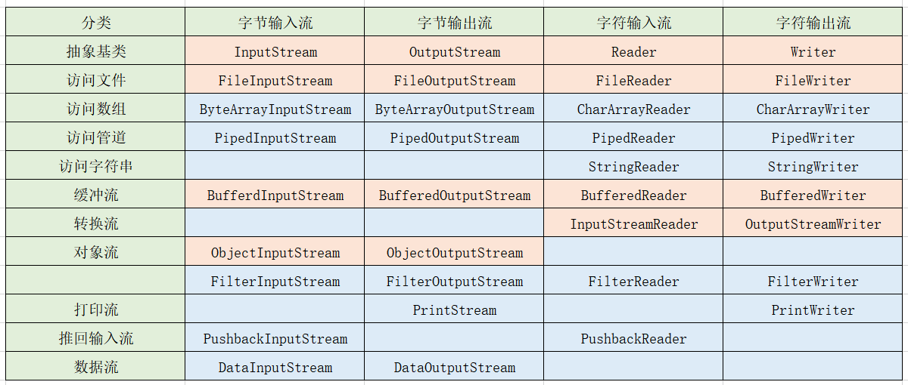

# 12 IO流

# File类

## 1 对文件进行操作

```java
public class Test01 {
    //这是一个main方法，是程序的入口：
    public static void main(String[] args) throws IOException {
        //将文件封装为一个File类的对象：
        File f = new File("d:\\test.txt");
        File f1 = new File("d:\\test.txt");
        File f2 = new File("d:/test.txt");
        //File.separator属性帮我们获取当前操作系统的路径拼接符号
       //在windows，dos下，系统默认用“\”作为路径分隔符 ，在unix，url中，使用“/”作为路径分隔符。
        File f3 = new File("d:"+File.separator+"test.txt");//建议使用这种
        //常用方法：
        System.out.println("文件是否可读："+f.canRead());
        System.out.println("文件是否可写："+f.canWrite());
        System.out.println("文件的名字："+f.getName());
        System.out.println("上级目录："+f.getParent());
        System.out.println("是否是一个目录："+f.isDirectory());
        System.out.println("是否是一个文件："+f.isFile());
        System.out.println("是否隐藏："+f.isHidden());
        System.out.println("文件的大小："+f.length());
        System.out.println("是否存在："+f.exists());
        /*if(f.exists()){//如果文件存在，将文件删除操作
            f.delete();
        }else{//如果不存在，就创建这个文件
            f.createNewFile();
        }*/
        System.out.println(f == f1);//比较两个对象的地址
        System.out.println(f.equals(f1));//比较两个对象对应的文件的路径
        //跟路径相关的：
        System.out.println("绝对路径："+f.getAbsolutePath());
        System.out.println("相对路径："+f.getPath());
        System.out.println("toString:"+f.toString());
        System.out.println("----------------------");
        File f5 = new File("demo.txt");
        if(!f5.exists()){
            f5.createNewFile();
        }
        //绝对路径指的就是：真实的一个精准的，完整的路径
        System.out.println("绝对路径："+f5.getAbsolutePath());
        //相对路径：有一个参照物，相对这个参照物的路径。
        //在main方法中，相对位置指的就是：D:\IDEA_workspace\TestJavaSE
        //在junit的测试方法中，相对路径指的就是模块位置
        System.out.println("相对路径："+f5.getPath());
        //toString的效果永远是  相对路径
        System.out.println("toString:"+f5.toString());
        File f6 = new File("a/b/c/demo.txt");
        if(!f5.exists()){
            f5.createNewFile();
        }
        System.out.println("绝对路径："+f6.getAbsolutePath());
        System.out.println("相对路径："+f6.getPath());
    }
}
```


## 2 对目录进行操作

```java
public class Test02 {
    //这是一个main方法，是程序的入口：
    public static void main(String[] args) {
        //将目录封装为File类的对象：
        File f = new File("D:\\IDEA_workspace");
        System.out.println("文件是否可读："+f.canRead());
        System.out.println("文件是否可写："+f.canWrite());
        System.out.println("文件的名字："+f.getName());
        System.out.println("上级目录："+f.getParent());
        System.out.println("是否是一个目录："+f.isDirectory());
        System.out.println("是否是一个文件："+f.isFile());
        System.out.println("是否隐藏："+f.isHidden());
        System.out.println("文件的大小："+f.length());
        System.out.println("是否存在："+f.exists());
        System.out.println("绝对路径："+f.getAbsolutePath());
        System.out.println("相对路径："+f.getPath());
        System.out.println("toString:"+f.toString());
        //跟目录相关的方法：
        File f2 = new File("D:\\a\\b\\c");
        //创建目录：
        //f2.mkdir();//创建单层目录
        //f2.mkdirs();//创建多层目录
        //删除：如果是删除目录的话，只会删除一层，并且前提：这层目录是空的，里面没有内容，如果内容就不会被删除
        f2.delete();
        //查看：
        String[] list = f.list();//文件夹下目录/文件对应的名字的数组
        for(String s:list){
            System.out.println(s);
        }
        System.out.println("=========================");
        File[] files = f.listFiles();//作用更加广泛
        for(File file:files){
            System.out.println(file.getName()+","+file.getAbsolutePath());
        }
    }
}
```


# IO流

## 1 引入

【1】File类：封装文件/目录的各种信息，对目录/文件进行操作，但是我们不可以获取到文件/目录中的内容。
【2】引入：IO流：
I/O ： Input/Output的缩写，用于处理设备之间的数据的传输。
【3】形象理解：IO流 当做一根 “管”：


【4】IO流的体系结构：




## 2 案例：通过java程序完成文件的复制操作

### 功能分解1：文件--》程序：FileReader

一个字符一个字符的将文件中的内容读取到程序中了：

```java
public class Test01 {
    //这是一个main方法，是程序的入口：
    public static void main(String[] args) throws IOException {
        //文件--》程序：
        //1.有一个文件：----》创建一个File类的对象
        File f = new File("d:\\Test.txt");
        //2.利用FileReader这个流，这个“管”怼到源文件上去   ---》创建一个FileReader的流的对象
        FileReader fr = new FileReader(f);
        //3.进行操作“吸”的动作  ---》读取动作
        /*下面的代码我们验证了：如果到了文件的结尾处，那么读取的内容为-1
        int n1 = fr.read();
        int n2 = fr.read();
        int n3 = fr.read();
        int n4 = fr.read();
        int n5 = fr.read();
        int n6 = fr.read();
        System.out.println(n1);
        System.out.println(n2);
        System.out.println(n3);
        System.out.println(n4);
        System.out.println(n5);
        System.out.println(n6);*/
        //方式1：
        /*int n = fr.read();
        while(n!=-1){
            System.out.println(n);
            n = fr.read();
        }*/
        //方式2：
        int n;
        while((n = fr.read())!=-1){
            System.out.println((char)n);
        }
        //4.“管”不用了，就要关闭  ---》关闭流
        //流，数据库，网络资源，靠jvm本身没有办法帮我们关闭，此时必须程序员手动关闭：
        fr.close();
    }
}
```

想一次性读取五个字符，不够的话下次再读五个字符：

```java
public class Test02 {
    //这是一个main方法，是程序的入口：
    public static void main(String[] args) throws IOException {
        //文件--》程序：
        //1.创建一个File类的对象
        File f = new File("d:\\Test.txt");
        //2.创建一个FileReader的流的对象
        FileReader fr = new FileReader(f);
        //3.读取动作
        //引入一个“快递员的小车”，这个“小车”一次拉5个快递：
        char[] ch = new char[5];//缓冲数组
        int len = fr.read(ch);//一次读取五个:返回值是这个数组中 的有效长度
        while(len!=-1){
            //System.out.println(len);
            //错误方式：
            /*for (int i = 0 ;i < ch.length;i++){
                System.out.println(ch[i]);
            }*/
            //正确方式：
            /*for (int i = 0 ;i < len;i++){
                System.out.println(ch[i]);
            }*/
            //正确方式2：将数组转为String：
            String str = new String(ch,0,len);
            System.out.print(str);
            len = fr.read(ch);
        }
        //4.关闭流
        fr.close();
    }
}
```


### 功能分解2：程序--》文件：FileWriter

一个字符一个字符的向外输出：

```java
public class Test03 {
    //这是一个main方法，是程序的入口：
    public static void main(String[] args) throws IOException {
        //1.有个目标文件：
        File f = new File("d:\\demo.txt");
        //2.FileWriter管怼到文件上去：
        FileWriter fw = new FileWriter(f);
        //3.开始动作：输出动作：
        //一个字符一个字符的往外输出：
        String str = "hello你好";
        for (int i = 0 ;i < str.length();i++){
            fw.write(str.charAt(i));
        }
        //4.关闭流：
        fw.close();
    }
}

```

发现：
如果目标文件不存在的话，那么会自动创建此文件。
如果目标文件存在的话：
new FileWriter(f)   相当于对原文件进行覆盖操作。
new FileWriter(f,false)  相当于对源文件进行覆盖操作。不是追加。
new FileWriter(f,true)   对原来的文件进行追加，而不是覆盖。


**利用缓冲数组：向外输出（利用缓冲数组：）**

```java
public class Test03 {
    //这是一个main方法，是程序的入口：
    public static void main(String[] args) throws IOException {
        //1.有个目标文件：
        File f = new File("d:\\demo.txt");
        //2.FileWriter管怼到文件上去：
        FileWriter fw = new FileWriter(f,true);
        //3.开始动作：输出动作：
        //一个字符一个字符的往外输出：
        String str = "你好中国";
        char[] chars = str.toCharArray();
        fw.write(chars);
        //4.关闭流：
        fw.close();
    }
}
```


### 功能分解3：利用FileReader，FileWriter文件复制

```java
public class Test04 {
    //这是一个main方法，是程序的入口：
    public static void main(String[] args) throws IOException {
        //1.有一个源文件
        File f1 = new File("d:\\Test.txt");
        //2.有一个目标文件：
        File f2 = new File("d:\\Demo.txt");
        //3.搞一个输入的管 怼到源文件上：
        FileReader fr = new FileReader(f1);
        //4.搞一个输出的管，怼到目标文件上：
        FileWriter fw = new FileWriter(f2);
        //5.开始动作：
        //方式1：一个字符一个字符的复制：
        /*int n = fr.read();
        while(n!=-1){
            fw.write(n);
            n = fr.read();
        }*/
        //方式2：利用缓冲字符数组：
        /*char[] ch = new char[5];
        int len = fr.read(ch);
        while(len!=-1){
            fw.write(ch,0,len);//将缓冲数组中有效长度写出
            len = fr.read(ch);
        }*/
        //方式3：利用缓冲字符数组，将数组转为String写出。
        char[] ch = new char[5];
        int len = fr.read(ch);
        while(len!=-1){
            String s = new String(ch,0,len);
            fw.write(s);
            len = fr.read(ch);
        }
        //6.关闭流：(关闭流的时候，倒着关闭，后用先关)
        fw.close();
        fr.close();
    }
}
```


## 3 警告：不要用字符流去操作非文本文件

文本文件：.txt   .java  .c  .cpp  ---》建议使用字符流操作
非文本文件：.jpg,  .mp3  ,   .mp4 , .doc  , .ppt  ---》建议使用字节流操作


## 4 用try-catch-finally处理异常方式

```java
public class Test04 {
    //这是一个main方法，是程序的入口：
    public static void main(String[] args)  {
        //1.有一个源文件
        File f1 = new File("d:\\Test.txt");
        //2.有一个目标文件：
        File f2 = new File("d:\\Demo.txt");
        //3.搞一个输入的管 怼到源文件上：
        FileReader fr = null;
        FileWriter fw = null;
        try {
            fr = new FileReader(f1);
            //4.搞一个输出的管，怼到目标文件上：
            fw = new FileWriter(f2);
            //5.开始动作：
            char[] ch = new char[5];
            int len = fr.read(ch);
            while(len!=-1){
                String s = new String(ch,0,len);
                fw.write(s);
                len = fr.read(ch);
            }
        } catch (FileNotFoundException e) {
            e.printStackTrace();
        } catch (IOException e) {
            e.printStackTrace();
        } finally {
            //6.关闭流：(关闭流的时候，倒着关闭，后用先关)
            try {
                if(fw!=null){//防止空指针异常
                    fw.close();
                }
            } catch (IOException e) {
                e.printStackTrace();
            }
            try {
                if(fr!=null){
                    fr.close();
                }
            } catch (IOException e) {
                e.printStackTrace();
            }
        }
    }
}
```


## 5 FileInputStream读取文件中内容

【1】读取文本文件：

```java
public class Test01 {
    //这是一个main方法，是程序的入口：
    public static void main(String[] args) throws IOException {
        //功能：利用字节流将文件中内容读到程序中来：
        //1.有一个源文件：
        File f = new File("D:\\Test.txt");
        //2.将一个字节流这个管 怼  到 源文件上：
        FileInputStream fis = new FileInputStream(f);
        //3.开始读取动作
        /*
        细节1：
        文件是utf-8进行存储的，所以英文字符 底层实际占用1个字节
        但是中文字符，底层实际占用3个字节。
        细节2：
        如果文件是文本文件，那么就不要使用字节流读取了，建议使用字符流。
        细节3：
        read()读取一个字节，但是你有没有发现返回值是 int类型，而不是byte类型？
        read方法底层做了处理，让返回的数据都是“正数”
        就是为了避免如果字节返回的是-1的话，那到底是读入的字节，还是到文件结尾呢。
         */
        int n = fis.read();
        while(n!=-1){
            System.out.println(n);
            n = fis.read();
        }
        //4.关闭流：
        fis.close();
    }
}
```

【2】利用字节流读取非文本文件：（以图片为案例：）--》一个字节一个字节的读取：

```java
public class Test02 {
    //这是一个main方法，是程序的入口：
    public static void main(String[] args) throws IOException {
        //功能：利用字节流将文件中内容读到程序中来：
        //1.有一个源文件：
        File f = new File("D:\\LOL.jpg");
        //2.将一个字节流这个管 怼  到 源文件上：
        FileInputStream fis = new FileInputStream(f);
        //3.开始读取动作
        int count = 0;//定义一个计数器，用来计读入的字节的个数
        int n = fis.read();
        while(n!=-1){
            count++;
            System.out.println(n);
            n = fis.read();
        }
        System.out.println("count="+count);
        //4.关闭流：
        fis.close();
    }
}
```

【3】利用字节类型的缓冲数组：

```java
public class Test03 {
    //这是一个main方法，是程序的入口：
    public static void main(String[] args) throws IOException {
        //功能：利用字节流将文件中内容读到程序中来：
        //1.有一个源文件：
        File f = new File("D:\\LOL.jpg");
        //2.将一个字节流这个管 怼  到 源文件上：
        FileInputStream fis = new FileInputStream(f);
        //3.开始读取动作
        //利用缓冲数组：（快递员的小车）
        byte[] b = new byte[1024*6];
        int len = fis.read(b);//len指的就是读取的数组中的有效长度
        while(len!=-1){
            //System.out.println(len);
            for(int i = 0;i<len;i++){
                System.out.println(b[i]);
            }
            len = fis.read(b);
        }
        //4.关闭流：
        fis.close();
    }
}
```


## 6 FileInputStream,FileOutputStream完成非文本文件的复制

【1】读入一个字节，写出一个字节：

```java
public class Test04 {
    //这是一个main方法，是程序的入口：
    public static void main(String[] args) throws IOException {
        //功能：完成图片的复制：
        //1.有一个源图片
        File f1 = new File("d:\\LOL.jpg");
        //2.有一个目标图片：
        File f2 = new File("d:\\LOL2.jpg");
        //3.有一个输入的管道 怼 到 源文件：
        FileInputStream fis = new FileInputStream(f1);
        //4.有一个输出的管道 怼到  目标文件上：
        FileOutputStream fos = new FileOutputStream(f2);
        //5.开始复制：（边读边写）
        int n = fis.read();
        while(n!=-1){
            fos.write(n);
            n = fis.read();
        }
        //6.关闭流：(倒着关闭流，先用后关)
        fos.close();
        fis.close();
    }
}
```

【2】利用缓冲字节数组：

```java
public class Test05 {
    //这是一个main方法，是程序的入口：
    public static void main(String[] args) throws IOException {
        //功能：完成图片的复制：
        //1.有一个源图片
        File f1 = new File("d:\\LOL.jpg");
        //2.有一个目标图片：
        File f2 = new File("d:\\LOL2.jpg");
        //3.有一个输入的管道 怼 到 源文件：
        FileInputStream fis = new FileInputStream(f1);
        //4.有一个输出的管道 怼到  目标文件上：
        FileOutputStream fos = new FileOutputStream(f2);
        //5.开始复制：（边读边写）
        //利用缓冲数组：
        byte[] b = new byte[1024*8];
        int len = fis.read(b);
        while(len!=-1){
            fos.write(b,0,len);
            len = fis.read(b);
        }
        //6.关闭流：(倒着关闭流，先用后关)
        fos.close();
        fis.close();
    }
}
```


## 7 缓冲字节流(处理流)-BufferedInputStream ,BufferedOutputStream

【1】读入一个字节，写出一个字节：

【2】利用缓冲字节数组：

【3】利用缓冲区：

想要完成上面的效果，单纯的靠FileInputStream,FileOutputStream是不可以完成的，这个时候就需要功能的加强，
这个加强就需要引入新的流（在FileInputStream,FileOutputStream外面再套一层流）：BufferedInputStream ,BufferedOutputStream. ----->处理流

代码：

```java
public class Test06 {
    //这是一个main方法，是程序的入口：
    public static void main(String[] args) throws IOException {
        //1.有一个源图片
        File f1 = new File("d:\\LOL.jpg");
        //2.有一个目标图片：
        File f2 = new File("d:\\LOL2.jpg");
        //3.有一个输入的管道 怼 到 源文件：
        FileInputStream fis = new FileInputStream(f1);
        //4.有一个输出的管道 怼到  目标文件上：
        FileOutputStream fos = new FileOutputStream(f2);
        //5.功能加强，在FileInputStream外面套一个管：BufferedInputStream:
        BufferedInputStream bis = new BufferedInputStream(fis);
        //6.功能加强，在FileOutputStream外面套一个管：BufferedOutputStream:
        BufferedOutputStream bos = new BufferedOutputStream(fos);
        //7.开始动作 ：
        byte[] b = new byte[1024*6];
        int len = bis.read(b);
        while(len!=-1){
            bos.write(b,0,len);
           /* bos.flush(); 底层已经帮我们做了刷新缓冲区的操作，不用我们手动完成：底层调用flushBuffer()*/
            len = bis.read(b);
        }
        //8.关闭流：
        //倒着关：
        //如果处理流包裹着节点流的话，那么其实只要关闭高级流（处理流），那么里面的字节流也会随之被关闭。
        bos.close();
        bis.close();
        /*fos.close();
        fis.close();*/
    }
}
```


## 8 比对非文本文件复制的三种方法的效率

【1】读入一个字节，写出一个字节：


【2】利用缓冲字节数组：


【3】利用缓冲区：


代码：

```java
public class Test06 {
    //这是一个main方法，是程序的入口：
    public static void main(String[] args) throws IOException {
        //1.有一个源图片
        File f1 = new File("d:\\LOL.jpg");
        //2.有一个目标图片：
        File f2 = new File("d:\\LOL2.jpg");
        //3.有一个输入的管道 怼 到 源文件：
        FileInputStream fis = new FileInputStream(f1);
        //4.有一个输出的管道 怼到  目标文件上：
        FileOutputStream fos = new FileOutputStream(f2);
        //5.功能加强，在FileInputStream外面套一个管：BufferedInputStream:
        BufferedInputStream bis = new BufferedInputStream(fis);
        //6.功能加强，在FileOutputStream外面套一个管：BufferedOutputStream:
        BufferedOutputStream bos = new BufferedOutputStream(fos);
        //7.开始动作 ：
        long startTime = System.currentTimeMillis();
        byte[] b = new byte[1024];
        int len = bis.read(b);
        while(len!=-1){
            bos.write(b,0,len);
           /* bos.flush(); 底层已经帮我们做了刷新缓冲区的操作，不用我们手动完成：底层调用flushBuffer()*/
            len = bis.read(b);
        }
        long endTime = System.currentTimeMillis();
        System.out.println("复制完成的时间为："+(endTime-startTime));
        //8.关闭流：
        //倒着关：
        //如果处理流包裹着节点流的话，那么其实只要关闭高级流（处理流），那么里面的字节流也会随之被关闭。
        bos.close();
        bis.close();
        /*fos.close();
        fis.close();*/
    }
}
```


## 9 缓冲字符流(处理流)-BufferedReader,BufferedWriter完成文本文件的复制

```java
public class Test07 {
    //这是一个main方法，是程序的入口：
    public static void main(String[] args) throws IOException {
        //1.有一个源文件：
        File f1 = new File("d:\\Test.txt");
        //2.有一个目标文件：
        File f2 = new File("d:\\Demo.txt");
        //3.需要一个管 怼到 源文件：
        FileReader fr = new FileReader(f1);
        //4.需要一根管怼到目标文件：
        FileWriter fw = new FileWriter(f2);
        //5.套一根管在输入字符流外面：
        BufferedReader br = new BufferedReader(fr);
        //6.套一根管在输出字符流外面：
        BufferedWriter bw = new BufferedWriter(fw);
        //7.开始动作：
        //方式1：读取一个字符，输出一个字符：
        /*int n = br.read();
        while(n!=-1){
            bw.write(n);
            n = br.read();
        }*/
        //方式2:利用缓冲数组：
        /*char[] ch = new char[30];
        int len = br.read(ch);
        while(len!=-1){
            bw.write(ch,0,len);
            len = br.read(ch);
        }*/
        //方式3：读取String：
        String str = br.readLine();//每次读取文本文件中一行，返回字符串
        while(str!=null){
            bw.write(str);
            //在文本文件中应该再写出一个换行：
            bw.newLine();//新起一行
            str = br.readLine();
        }
        //8.关闭流
        bw.close();
        br.close();
    }
}
```


## 10 转换流-InputStreamReader,OutputStreamWriter

【1】转换流：作用：将字节流和字符流进行转换。
【2】转换流  属于 字节流还是字符流？属于字符流
InputStreamReader  ：字节输入流 ---》字符的输入流
OutputStreamWriter  ： 字符输出流 --》字节的输出流

【3】图解：


【4】将输入的字节流转换为输入的字符流，然后完成文件--》程序 ：

```java
public class Test01 {
    //这是一个main方法，是程序的入口：
    public static void main(String[] args) throws IOException {
        //文件---》程序：
        //1.有一个源文件：
        File f = new File("d:\\Test.txt");
        //2.需要一个输入的字节流接触文件：
        FileInputStream fis = new FileInputStream(f);
        //3.加入一个转换流，将字节流转换为字符流：（转换流属于一个处理流）
        //将字节转换为字符的时候，需要指定一个编码，这个编码跟文件本身的编码格式统一
        //如果编码格式不统一的话，那么在控制台上展示的效果就会出现乱码
        //InputStreamReader isr = new InputStreamReader(fis,"utf-8");
        //获取程序本身的编码--》utf-8
        InputStreamReader isr = new InputStreamReader(fis);
        //4.开始动作，将文件中内容显示在控制台：
        char[] ch = new char[20];
        int len = isr.read(ch);
        while(len!=-1){
            //将缓冲数组转为字符串在控制台上打印出来
            System.out.print(new String(ch,0,len));
            len = isr.read(ch);
        }
        //5.关闭流：
        isr.close();
    }
}
```


## 11 转换流-InputStreamReader,OutputStreamWriter实现文本文件的复制

```java
public class Test02 {
    //这是一个main方法，是程序的入口：
    public static void main(String[] args) throws IOException {
        //1.有一个源文件
        File f1 = new File("d:\\Test.txt");
        //2.有一个目标文件：
        File f2 = new File("d:\\Demo.txt");
        //3.输入方向：
        FileInputStream fis = new FileInputStream(f1);
        InputStreamReader isr = new InputStreamReader(fis,"utf-8");
        //4.输出方向：
        FileOutputStream fos = new FileOutputStream(f2);
        OutputStreamWriter osw = new OutputStreamWriter(fos,"gbk");
        //5.开始动作：
        char[] ch = new char[20];
        int len = isr.read(ch);
        while(len!=-1){
            osw.write(ch,0,len);
            len = isr.read(ch);
        }
        //6.关闭流：
        osw.close();
        isr.close();
    }
}
```


## 12 System类对IO流的支持

【1】System的属性：
System.in  : “标准”输入流。---》默认情况下  从键盘输入
System.out  :“标准”输出流。 ---》默认情况下，输出到控制台。

【2】System.in ：“标准”输入流。---》默认情况下  从键盘输入

```java
public class Test01 {
    //这是一个main方法，是程序的入口：
    public static void main(String[] args) throws IOException {
        //得到的是标准的输入流：--》从键盘输入：
        //InputStream in = System.in;
        //调用方法：
        //int n = in.read();//read方法等待键盘的录入，所以这个方法是一个阻塞方法。
        //System.out.println(n);
        //以前案例：从键盘录入一个int类型的数据：
        //从上面的代码证明，键盘录入实际上是：System.in
        //形象的理解：System.in管，这个管怼到键盘上去了，所以你从键盘录入的话，就从这个管到程序中了
        //Scanner的作用：扫描器：起扫描作用的，扫键盘的从这根管出来的数据
        /*Scanner sc = new Scanner(System.in);
        int i = sc.nextInt();
        System.out.println(i);*/
        //既然Scanner是扫描的作用，不一定非得扫 System.in进来的东西，还可以扫描其他管的内容：
        Scanner sc = new Scanner(new FileInputStream(new File("d:\\Test.txt")));
        while(sc.hasNext()){
            System.out.println(sc.next());
        }
    }
}
```

【3】System.out  : 返回的输出流 、 打印流（PrintStream）

```java
public class Test02 {
    //这是一个main方法，是程序的入口：
    public static void main(String[] args) {
        //写到控制台：
        PrintStream out = System.out;
        //调用方法：
        out.print("你好1");//直接在控制台写出，但是不换行
        out.print("你好2");
        out.print("你好3");
        out.print("你好4");
        out.println("我是中国人1");//直接在控制台写出，并且换行操作
        out.println("我是中国人2");
        out.println("我是中国人3");
        out.println("我是中国人4");
        System.out.println("你是");
        System.out.print("中国人");
    }
}
```


## 13 练习：键盘录入内容输出到文件中

【1】解决思路：


【2】代码：

```java
public class Test03 {
    //这是一个main方法，是程序的入口：
    public static void main(String[] args) throws IOException {
        //1.先准备输入方向：
        //键盘录入：
        InputStream in = System.in;//属于字节流
        //字节流--》字符流：
        InputStreamReader isr = new InputStreamReader(in);
        //在isr外面再套一个缓冲流：
        BufferedReader br = new BufferedReader(isr);
        //2.再准备输出方向：
        //准备目标文件
        File f = new File("d:\\Demo1.txt");
        FileWriter fw = new FileWriter(f);
        BufferedWriter bw = new BufferedWriter(fw);
        //3.开始动作：
        String s = br.readLine();
        while(!s.equals("exit")){
            bw.write(s);
            bw.newLine();//文件中换行
            s = br.readLine();
        }
        //4.关闭流：
        bw.close();
        br.close();
    }
}
```


## 14 数据流-DataInputStream,DataOutputStream

【1】数据流：用来操作基本数据类型和字符串的
【2】
DataInputStream:将文件中存储的基本数据类型和字符串  写入  内存的变量中
DataOutputStream:  将内存中的基本数据类型和字符串的变量 写出  文件中

【3】代码：

利用DataOutputStream向外写出变量：

```java
public class Test01 {
    //这是一个main方法，是程序的入口：
    public static void main(String[] args) throws IOException {
        //DataOutputStream:  将内存中的基本数据类型和字符串的变量 写出  文件中
        /*File f = new File("d:\\Demo2.txt");
        FileOutputStream fos = new FileOutputStream(f);
        DataOutputStream dos = new DataOutputStream(fos);*/
        DataOutputStream dos = new DataOutputStream(new FileOutputStream(new File("d:\\Demo2.txt")));
        //向外将变量写到文件中去：
        dos.writeUTF("你好");
        dos.writeBoolean(false);
        dos.writeDouble(6.9);
        dos.writeInt(82);
        //关闭流：
        dos.close();
    }
}
```

在Demo2.txt文件中，我们看到：


发现：这个内容我们看不懂，是给程序看的

所以下面我们开始读取的程序：

```java
public class Test02 {
    //这是一个main方法，是程序的入口：
    public static void main(String[] args) throws IOException {
        //DataInputStream:将文件中存储的基本数据类型和字符串  写入  内存的变量中
        DataInputStream dis = new DataInputStream(new FileInputStream(new File("d:\\Demo2.txt")));
        //将文件中内容读取到程序中来：
        System.out.println(dis.readUTF());
        System.out.println(dis.readBoolean());
        System.out.println(dis.readDouble());
        System.out.println(dis.readInt());
        //关闭流：
        dis.close();
    }
}

```


验证：那个文件，我们看不懂，程序看得懂
要求：
写出的类型跟读入的类型 必须 要匹配！


## 15 对象流-ObjectInputStream,ObjectOutputStream

【1】对象流：ObjectInputStream，ObjectInputStream
用于存储和读取基本数据类型数据或对象的处理流。
它的强大之处就是可以把Java中的对象写入到数据源中，也能把对象从数据源中还原回来。

【2】序列化和反序列化：
ObjectOutputStream 类 ： 把内存中的Java对象转换成平台无关的二进制数据，从而允许把这种二进制数据持久地保存在磁盘上，或通过网络将这种二进制数据传输到另一个网络节点。----》序列化
用ObjectInputStream类 ： 当其它程序获取了这种二进制数据，就可以恢复成原来的Java对象。----》反序列化

【3】代码：操作字符串对象：
首先将一个字符串对象写到文件中去：----》序列化


```java
public class Test01 {
    //这是一个main方法，是程序的入口：
    public static void main(String[] args) throws IOException {
        ObjectOutputStream oos = new ObjectOutputStream(new FileOutputStream(new File("d:\\Demo3.txt")));
        //将内存中的字符串写出到文件中：
        oos.writeObject("你好");
        //关闭流：
        oos.close();
    }
}
```

查看文件：


我们看不懂文件的内容，但是程序是可以看懂的，所以可以写一个程序读文件中内容：----》反序列化


```java
public class Test02 {
    //这是一个main方法，是程序的入口：
    public static void main(String[] args) throws IOException, ClassNotFoundException {
        //将文件中保存的字符串 读入到 内存：
        ObjectInputStream ois = new ObjectInputStream(new FileInputStream(new File("d:\\Demo3.txt")));
        //读取：
        String s = (String)(ois.readObject());
        System.out.println(s);
        //关闭流：
        ois.close();
    }
}
```


【4】代码：操作自定义类的对象：
自定义的Person类：

```java
public class Person {
    private String name;
    private int age;
    public String getName() {
        return name;
    }
    public void setName(String name) {
        this.name = name;
    }
    public int getAge() {
        return age;
    }
    public void setAge(int age) {
        this.age = age;
    }
    public Person() {
    }
    public Person(String name, int age) {
        this.name = name;
        this.age = age;
    }
}
```

测试类：

```java
public class Test01 {
    //这是一个main方法，是程序的入口：
    public static void main(String[] args) throws IOException {
        //序列化：将内存中对象 ---》 文件：
        //有一个对象：
        Person p = new Person("lili",19);
        //有对象流：
        ObjectOutputStream oos = new ObjectOutputStream(new FileOutputStream(new File("d:\\Demo4.txt")));
        //向外写：
        oos.writeObject(p);
        //关闭流：
        oos.close();
    }
}
```

运行的时候发现出现异常：


出现异常的原因：


起到标识作用，标识什么呢？只要实现这个接口的类的对象才能序列化，否则不可以。</font>

解决办法：将Person 实现这个标识接口就可以：

```java
public class Person implements Serializable {
    private String name;
    private int age;
    public String getName() {
        return name;
    }
    public void setName(String name) {
        this.name = name;
    }
    public int getAge() {
        return age;
    }
    public void setAge(int age) {
        this.age = age;
    }
    public Person() {
    }
    public Person(String name, int age) {
        this.name = name;
        this.age = age;
    }
}
```


测试：发现序列化成功，Person具备了序列化的能力。


这个二进制数据我们看不懂，但是程序可以看懂，所以我们可以用程序实现 反序列化操作：
将这个对象 恢复到内存中来：

```java
public class Test02 {
    //这是一个main方法，是程序的入口：
    public static void main(String[] args) throws IOException, ClassNotFoundException {
        ObjectInputStream ois = new ObjectInputStream(new FileInputStream(new File("d:\\Demo4.txt")));
        //读入内存：
        Person p = (Person)(ois.readObject());
        System.out.println(p/*.toString()*/);
        //关闭流：
        ois.close();
    }
}

```

结果：
因为我们没有重写toString方法，所以结果为：


证明了反序列化成功：   将二进制数据 --》内存


【5】serialVersionUID：
凡是实现Serializable接口（标识接口）的类都有一个表示序列化版本标识符的静态常量:
➢private static final long serialVersionUID;
➢serialVersionUID用来表明类的不同版本间的兼容性。简言之，其目的是以序列化对象进行版本控制，有关各版本反序加化时是否兼容。
➢如果类没有显示定义这个静态变量，它的值是Java运行时环境根据类的内部细节自动生成的。若类的实例变量做了修改，serialVersionUID 可能发生变化。故建议，显式声明。

➢简单来说，Java的序列化机制是通过在运行时判断类的serialVersionUID来验证版本一致性的。在进行反序列化时，JVM会把传来的字节流中的serialVersionUID与本地相应实体类的serialVersionUID进行比较，如果相同就认为是一致的，可以进行反序列化，否则就会出现序列化版本不一致的异常。(InvalidCastException)


我现在在Person类中加入toString方法：

```java
public class Person implements Serializable {
    private String name;
    private int age;
    public String getName() {
        return name;
    }
    public void setName(String name) {
        this.name = name;
    }
    public int getAge() {
        return age;
    }
    public void setAge(int age) {
        this.age = age;
    }
    public Person() {
    }
    public Person(String name, int age) {
        this.name = name;
        this.age = age;
    }
    @Override
    public String toString() {
        return "Person{" +
                "name='" + name + '\'' +
                ", age=" + age +
                '}';
    }
}
```

再次运行测试类：
出现异常：


出现异常的原因：

解决：给这个类 加入一个 序列号：serialVersionUID


【6】IDEA中配置序列化版本号：


在Person类上：alt+enter:


回车即可生成


【7】序列化细节：
（1）被序列化的类的内部的所有属性，必须是可序列化的 （基本数据类型都是可序列化的）


（2）static，transient修饰的属性 不可以被序列化。

```java
public class Person implements Serializable {
    private static final long serialVersionUID = 8027651838638826533L;
    private transient String name;
    private static int age;
    private Famaily f = new Famaily();
    public String getName() {
        return name;
    }
    public void setName(String name) {
        this.name = name;
    }
    public int getAge() {
        return age;
    }
    public void setAge(int age) {
        this.age = age;
    }
    public Person() {
    }
    @Override
    public String toString() {
        return "Person{" +
                "name='" + name + '\'' +
                ", f=" + f + ",age=" + age +
                '}';
    }
}
```


