# 简介

【1】程序，进程，线程
➢程序(program)：是为完成特定任务、用某种语言编写的一组指令的集合,是一段静态的代码。 （程序是静态的）


➢进程(process)：是程序的一次执行过程。正在运行的一个程序，进程作为资源分配的单位，在内存中会为每个进程分配不同的内存区域。 （进程是动态的）是一个动的过程 ，进程的生命周期  :  有它自身的产生、存在和消亡的过程

➢线程(thread)，进程可进一步细化为线程， 是一个程序内部的一条执行路径。
若一个进程同一时间并行执行多个线程，就是支持多线程的。


【2】单核CPU与多核CPU的任务执行：

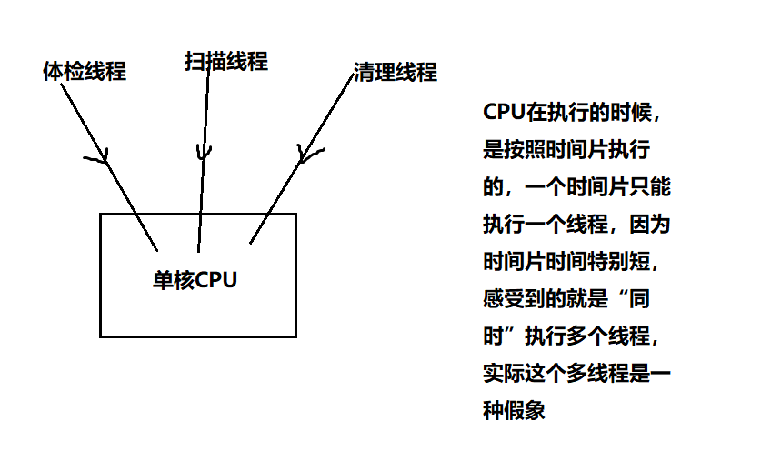


【3】并行和并发：
并行：多个CPU同时执行多个任务
并发：一个CPU“同时”执行多个任务（采用时间片切换）


# 1 创建线程的三种方式

## 第一种：继承Thread类

【1】在学习多线程一章之前，以前的代码是单线程的吗？不是，以前也是有三个线程同时执行的。

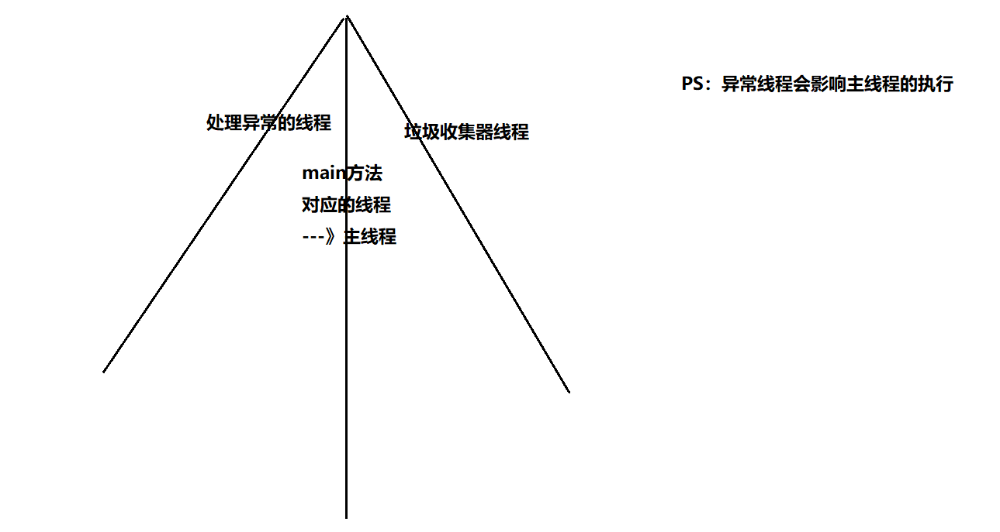


【2】现在我想自己制造多线程---》创建线程 ？？
线程类--》线程对象

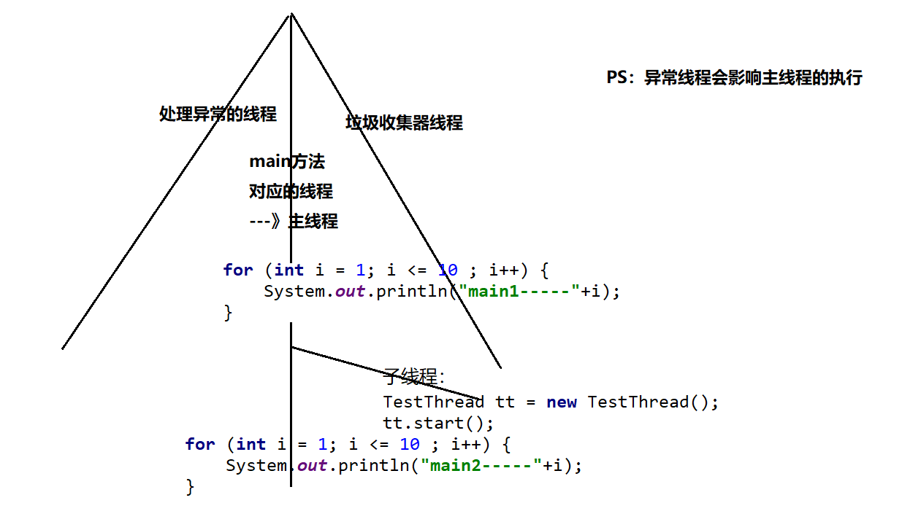


```java
/**
 * 线程类叫：TestThread，不是说你名字中带线程单词你就具备多线程能力了（争抢资源能力）
 * 现在想要具备能力，继承一个类：Thread，具备了争抢资源的能力
 */
public class TestThread extends Thread{
    /*
    一会线程对象就要开始争抢资源了，这个线程要执行的任务到底是啥？这个任务你要放在方法中
    但是这个方法不能是随便写的一个方法，必须是重写Thread类中的run方法
    然后线程的任务/逻辑写在run方法中
     */
    @Override
    public void run() {
        //输出1-10
        for (int i = 1; i <= 10 ; i++) {
            System.out.println(i);
        }
    }
}
```

```java
public class Test {
    //这是main方法，程序的入口
    public static void main(String[] args) {
        //主线程中也要输出十个数：
        for (int i = 1; i <= 10 ; i++) {
            System.out.println("main1-----"+i);
        }
        //制造其他线程，要跟主线程争抢资源：
        //具体的线程对象：子线程
        TestThread tt = new TestThread();
        //tt.run();//调用run方法，想要执行线程中的任务 -->这个run方法不能直接调用，直接调用就会被当做一个普通方法
        //想要tt子线程真正起作用比如要启动线程：
        tt.start();//start()是Thread类中的方法
        //主线程中也要输出十个数：
        for (int i = 1; i <= 10 ; i++) {
            System.out.println("main2-----"+i);
        }
    }
}

```

运行结果：

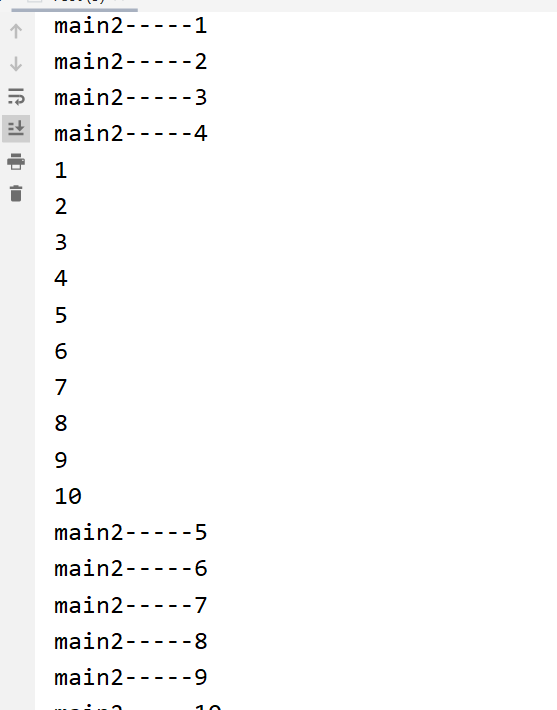


### 设置读取线程名字

【1】setName,getName方法来进行设置读取：

```java
/**
 * 线程类叫：TestThread，不是说你名字中带线程单词你就具备多线程能力了（争抢资源能力）
 * 现在想要具备能力，继承一个类：Thread，具备了争抢资源的能力
 */
public class TestThread extends Thread{
    /*
    一会线程对象就要开始争抢资源了，这个线程要执行的任务到底是啥？这个任务你要放在方法中
    但是这个方法不能是随便写的一个方法，必须是重写Thread类中的run方法
    然后线程的任务/逻辑写在run方法中
     */
    @Override
    public void run() {
        //输出1-10
        for (int i = 1; i <= 10 ; i++) {
            System.out.println(this.getName()+i);
        }
    }
}
```

```java
public class Test {
    //这是main方法，程序的入口
    public static void main(String[] args) {
        //给main方法这个主线程设置名字：
        //Thread.currentThread()作用获取当前正在执行的线程
        Thread.currentThread().setName("主线程");
        //主线程中也要输出十个数：
        for (int i = 1; i <= 10 ; i++) {
            System.out.println(Thread.currentThread().getName()+"1-------"+i);
        }
        //制造其他线程，要跟主线程争抢资源：
        //具体的线程对象：子线程
        TestThread tt = new TestThread();
        tt.setName("子线程");
        //tt.run();//调用run方法，想要执行线程中的任务 -->这个run方法不能直接调用，直接调用就会被当做一个普通方法
        //想要tt子线程真正起作用比如要启动线程：
        tt.start();//start()是Thread类中的方法
        //主线程中也要输出十个数：
        for (int i = 1; i <= 10 ; i++) {
            System.out.println(Thread.currentThread().getName()+"2-------"+i);
        }
    }
}
```

【2】通过构造器设置 名字：

```java
/**
 * 线程类叫：TestThread，不是说你名字中带线程单词你就具备多线程能力了（争抢资源能力）
 * 现在想要具备能力，继承一个类：Thread，具备了争抢资源的能力
 */
public class TestThread extends Thread{
    public TestThread(String name){
        super(name);//调用父类的有参构造器
    }
    /*
    一会线程对象就要开始争抢资源了，这个线程要执行的任务到底是啥？这个任务你要放在方法中
    但是这个方法不能是随便写的一个方法，必须是重写Thread类中的run方法
    然后线程的任务/逻辑写在run方法中
     */
    @Override
    public void run() {
        //输出1-10
        for (int i = 1; i <= 10 ; i++) {
            System.out.println(this.getName()+i);
        }
    }
}
```


### 习题：买火车票

【1】原理：每个窗口都是一个线程对象：

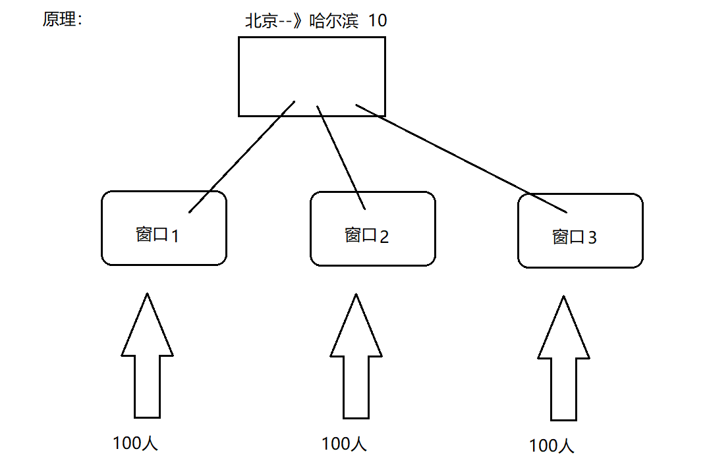


【2】代码：

```java
public class BuyTicketThread extends Thread {
    public BuyTicketThread(String name){
        super(name);
    }
    //一共10张票：
    static int ticketNum = 10;//多个对象共享10张票
    //每个窗口都是一个线程对象：每个对象执行的代码放入run方法中
    @Override
    public void run() {
        //每个窗口后面有100个人在抢票：
        for (int i = 1; i <= 100 ; i++) {
            if(ticketNum > 0){//对票数进行判断，票数大于零我们才抢票
                System.out.println("我在"+this.getName()+"买到了从北京到哈尔滨的第" + ticketNum-- + "张车票");
            }
        }
    }
}
```

```java
public class Test {
    public static void main(String[] args) {
        //多个窗口抢票：三个窗口三个线程对象：
        BuyTicketThread t1 = new BuyTicketThread("窗口1");
        t1.start();
        BuyTicketThread t2 = new BuyTicketThread("窗口2");
        t2.start();
        BuyTicketThread t3 = new BuyTicketThread("窗口3");
        t3.start();
    }
}

```


## 第二种：实现Runnable接口

【1】代码：

```java
/**
 * TestThread实现了这个接口，才会变成一个线程类
 */
public class TestThread implements Runnable{
    @Override
    public void run() {
        //输出1-10数字：
        for (int i = 1; i <= 10 ; i++) {
            System.out.println(Thread.currentThread().getName()+"----"+i);
        }
    }
}
```


```java
public class Test {
    public static void main(String[] args) {
        //创建子线程对象：
        TestThread tt = new TestThread();
        Thread t = new Thread(tt,"子线程");
        t.start();
        //主线程里面也是打印1-10数字：
        for (int i = 1; i <= 10 ; i++) {
            System.out.println(Thread.currentThread().getName()+"---"+i);
        }
    }
}
```

运行结果：

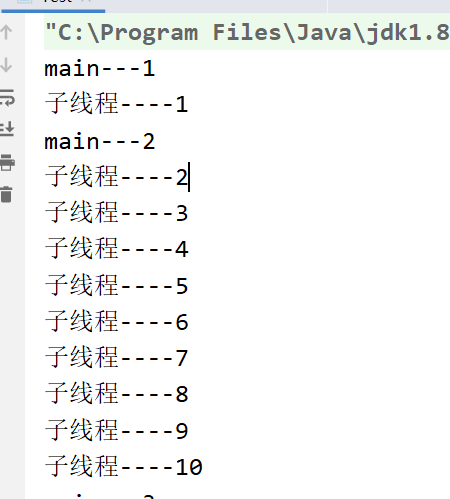


### 习题：买火车票

【1】代码：

```java
public class BuyTicketThread implements Runnable {
    int ticketNum = 10;
    @Override
    public void run() {
        for (int i = 1; i <= 100 ; i++) {
            if(ticketNum > 0){
                System.out.println("我在"+Thread.currentThread().getName()+"买到了北京到哈尔滨的第" + ticketNum-- + "张车票");
            }
        }
    }
}
```


```java
public class Test {
    //这是main方法，程序的入口
    public static void main(String[] args) {
        //定义一个线程对象：
        BuyTicketThread t = new BuyTicketThread();
        //窗口1买票：
        Thread t1 = new Thread(t,"窗口1");
        t1.start();
        //窗口2买票：
        Thread t2 = new Thread(t,"窗口2");
        t2.start();
        //窗口3买票：
        Thread t3 = new Thread(t,"窗口3");
        t3.start();
    }
}
```


【2】实际开发中，方式1 继承Thread类   还是  方式2 实现Runnable接口这种方式多呢？--》方式2

（1）方式1的话有 Java单继承的局限性，因为继承了Thread类，就不能再继承其它的类了

（2）方式2的共享资源的能力也会强一些，不需要非得加个static来修饰

【3】Thread类 Runnable接口 有联系吗？

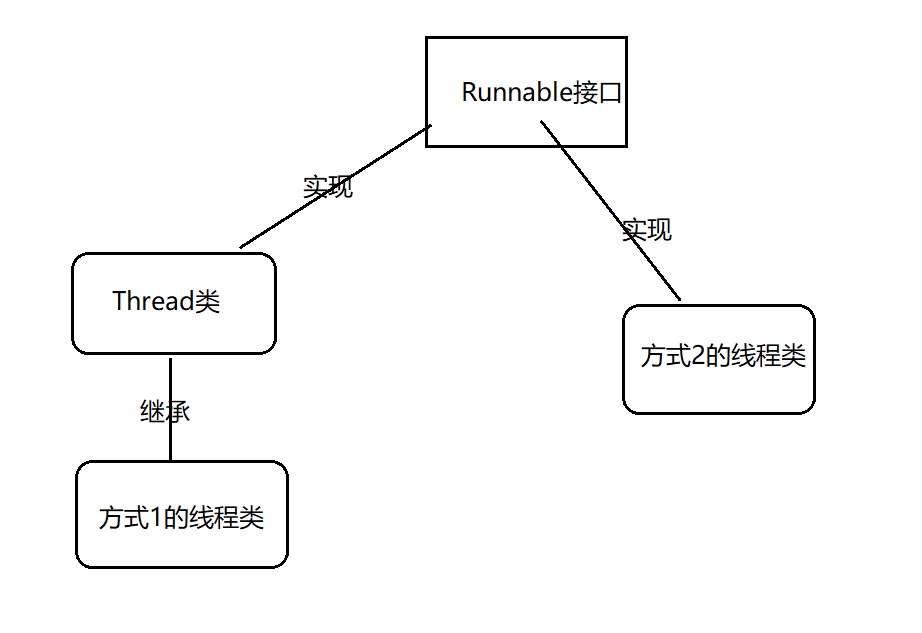


对比第一种和第二种创建线程的方式发现，无论第一种继承Thread类的方式还是第二种实现Runnable接口的方式，都需要有一个run方法，
但是这个run方法有不足：

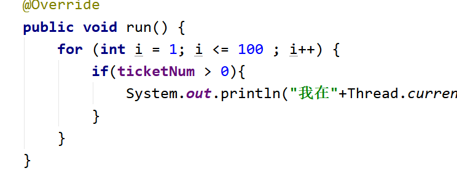


（1）没有返回值
（2）不能抛出异常

基于上面的两个不足，在JDK1.5以后出现了第三种创建线程的方式：实现Callable接口：

实现Callable接口好处：（1）有返回值  （2）能抛出异常
缺点：线程创建比较麻烦


```java
public class TestRandomNum implements Callable<Integer> {
    /*
    1.实现Callable接口，可以不带泛型，如果不带泛型，那么call方式的返回值就是Object类型
    2.如果带泛型，那么call的返回值就是泛型对应的类型
    3.从call方法看到：方法有返回值，可以跑出异常
     */
    @Override
    public Integer call() throws Exception {
        return new Random().nextInt(10);//返回10以内的随机数
    }
}
class Test{
    //这是main方法，程序的入口
    public static void main(String[] args) throws ExecutionException, InterruptedException {
        //定义一个线程对象：
        TestRandomNum trn = new TestRandomNum();
        FutureTask ft = new FutureTask(trn);
        Thread t = new Thread(ft);
        t.start();
        //获取线程得到的返回值：
        Object obj = ft.get();
        System.out.println(obj);
    }
}
```

# 2 线程的生命周期

【1】线程声明周期：线程开始--》线程消亡
【2】线程经历哪些阶段：

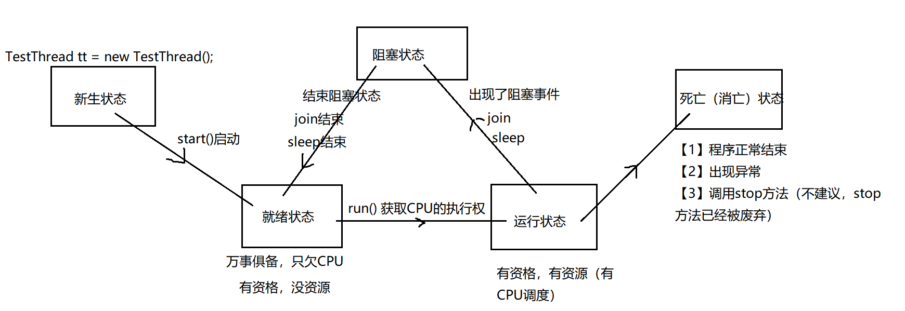


# 3 线程常见方法

（1）start() :  启动当前线程，表面上调用start方法，实际在调用线程里面的run方法

（2）run() : 线程类 继承 Thread类 或者 实现Runnable接口的时候，都要重新实现这个run方法，run方法里面是线程要执行的内容

（3）currentThread :Thread类中一个静态方法：获取当前正在执行的线程

（4）setName 设置线程名字

（5）getName 读取线程名字

## 设置优先级

【1】同优先级别的线程，采取的策略就是先到先服务，使用时间片策略

【2】如果优先级别高，被CPU调度的概率就高

【3】级别：1-10   默认的级别为5

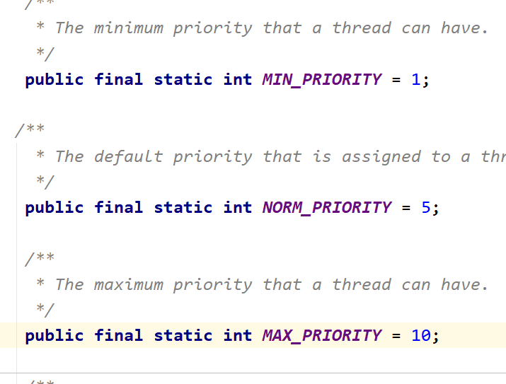


【4】代码：

```java
public class TestThread01 extends Thread {
    @Override
    public void run() {
        for (int i = 1; i <= 10; i++) {
            System.out.println(i);
        }
    }
}
class TestThread02 extends Thread{
    @Override
    public void run() {
        for (int i = 20; i <= 30 ; i++) {
            System.out.println(i);
        }
    }
}
class Test{
    //这是main方法，程序的入口
    public static void main(String[] args) {
        //创建两个子线程，让这两个子线程争抢资源：
        TestThread01 t1 = new TestThread01();
        t1.setPriority(10);//优先级别高
        t1.start();
        TestThread02 t2 = new TestThread02();
        t2.setPriority(1);//优先级别低
        t2.start();
    }
}
```

## join

join方法：当一个线程调用了join方法，这个线程就会先被执行，它执行结束以后才可以去执行其余的线程。

> 注意：必须先start，再join才有效。

```java
public class TestThread extends Thread {
    public TestThread(String name){
        super(name);
    }
    @Override
    public void run() {
        for (int i = 1; i <= 10 ; i++) {
            System.out.println(this.getName()+"----"+i);
        }
    }
}
class Test{
    //这是main方法，程序的入口
    public static void main(String[] args) throws InterruptedException {
        for (int i = 1; i <= 100 ; i++) {
            System.out.println("main-----"+i);
            if(i == 6){
                //创建子线程：
                TestThread tt = new TestThread("子线程");
                tt.start();
                tt.join();//“半路杀出个程咬金”
            }
        }
    }
}
```

## sleep

https://go.zbj.com/news/20146.html （段子）

【1】sleep : 人为的制造阻塞事件

```java
public class Test01 {
    //这是main方法，程序的入口
    public static void main(String[] args) {
        try {
            Thread.sleep(3000);
        } catch (InterruptedException e) {
            e.printStackTrace();
        }
        System.out.println("00000000000000");
    }
}
```

【2】案例：完成秒表功能：

```java
public class Test02 {
    //这是main方法，程序的入口
    public static void main(String[] args) {
        //2.定义一个时间格式：
        DateFormat df = new SimpleDateFormat("HH:mm:ss");
        while(true){
            //1.获取当前时间：
            Date d = new Date();
            //3.按照上面定义的格式将Date类型转为指定格式的字符串：
            System.out.println(df.format(d));
            try {
                Thread.sleep(1000);
            } catch (InterruptedException e) {
                e.printStackTrace();
            }
        }
    }
}
```

## setDaemon

【1】设置伴随线程
将子线程设置为主线程的伴随线程，主线程停止的时候，子线程也不要继续执行了
案例：皇上 --》驾崩 ---》妃子陪葬

```java
public class TestThread extends Thread {
    @Override
    public void run() {
        for (int i = 1; i <= 1000 ; i++) {
            System.out.println("子线程----"+i);
        }
    }
}
class Test{
    //这是main方法，程序的入口
    public static void main(String[] args) {
        //创建并启动子线程：
        TestThread tt = new TestThread();
        tt.setDaemon(true);//设置伴随线程  注意：先设置，再启动
        tt.start();
        //主线程中还要输出1-10的数字：
        for (int i = 1; i <= 10 ; i++) {
            System.out.println("main---"+i);
        }
    }
}
```

结果：


## stop

```java
public class Demo {
    //这是main方法，程序的入口
    public static void main(String[] args) {
        for (int i = 1; i <= 100 ; i++) {
            if(i == 6){
                Thread.currentThread().stop();//过期方法，不建议使用
            }
            System.out.println(i);
        }
    }
}
```


# 4 线程安全问题

## 方法1：同步代码块

【1】同步代码块演示1：

```java
package com.msb.test04;
/**
 * @author : msb-zhaoss
 */
public class BuyTicketThread implements Runnable {
    int ticketNum = 10;
    @Override
    public void run() {
        //此处有1000行代码
        for (int i = 1; i <= 100 ; i++) {
            synchronized (this){//把具有安全隐患的代码锁住即可，如果锁多了就会效率低 --》this就是这个锁
                if(ticketNum > 0){
                    System.out.println("我在"+Thread.currentThread().getName()+"买到了北京到哈尔滨的第" + ticketNum-- + "张车票");
                }
            }
        }
        //此处有1000行代码
    }
}
```

【2】同步代码块演示2：

```java
public class BuyTicketThread extends Thread {
    public BuyTicketThread(String name){
        super(name);
    }
    //一共10张票：
    static int ticketNum = 10;//多个对象共享10张票
    //每个窗口都是一个线程对象：每个对象执行的代码放入run方法中
    @Override
    public void run() {
        //每个窗口后面有100个人在抢票：
        for (int i = 1; i <= 100 ; i++) {
            synchronized (BuyTicketThread.class){//锁必须多个线程用的是同一把锁！！！
                if(ticketNum > 0){//对票数进行判断，票数大于零我们才抢票
                    System.out.println("我在"+this.getName()+"买到了从北京到哈尔滨的第" + ticketNum-- + "张车票");
                }
            }
        }
    }
}
```


## 方法2：同步方法

【1】代码展示：

```java
public class BuyTicketThread implements Runnable {
    int ticketNum = 10;
    @Override
    public void run() {
        //此处有1000行代码
        for (int i = 1; i <= 100 ; i++) {
            buyTicket();
        }
        //此处有1000行代码
    }
    public synchronized void buyTicket(){//锁住的是this
        if(ticketNum > 0){
            System.out.println("我在"+Thread.currentThread().getName()+"买到了北京到哈尔滨的第" + ticketNum-- + "张车票");
        }
    }
}
```


```java
public class BuyTicketThread extends Thread {
    public BuyTicketThread(String name){
        super(name);
    }
    //一共10张票：
    static int ticketNum = 10;//多个对象共享10张票
    //每个窗口都是一个线程对象：每个对象执行的代码放入run方法中
    @Override
    public void run() {
        //每个窗口后面有100个人在抢票：
        for (int i = 1; i <= 100 ; i++) {
            buyTicket();
        }
    }
    public static synchronized void buyTicket(){//锁住的  同步监视器： BuyTicketThread.class
        if(ticketNum > 0){//对票数进行判断，票数大于零我们才抢票
            System.out.println("我在"+Thread.currentThread().getName()+"买到了从北京到哈尔滨的第" + ticketNum-- + "张车票");
        }
    }
}
```

【2】总结：
总结1：
多线程在争抢资源，就要实现线程的同步（就要进行加锁，并且这个锁必须是共享的，必须是唯一的。
咱们的锁一般都是引用数据类型的。

目的：解决了线程安全问题。


总结2：关于同步方法
1) 不要将run()定义为同步方法
2) 非静态同步方法的同步监视器是this
   静态同步方法的同步监视器是 类名.class 字节码信息对象
3) 同步代码块的效率要高于同步方法
   原因：同步方法是将线程挡在了方法的外部，而同步代码块锁将线程挡在了代码块的外部，但是却是方法的内部
4) 同步方法的锁是this，一旦锁住一个方法，就锁住了所有的同步方法；同步代码块只是锁住使用该同步监视器的代码块，而没有锁住使用其他监视器的代码块


## 方法3：Lock锁

【1】Lock锁引入：
JDK1.5后新增新一代的线程同步方式:Lock锁
与采用synchronized相比，lock可提供多种锁方案，更灵活


synchronized是Java中的关键字，这个关键字的识别是靠JVM来识别完成的呀。是虚拟机级别的。
但是Lock锁是API级别的，提供了相应的接口和对应的实现类，这个方式更灵活，表现出来的性能优于之前的方式。


【2】代码演示：

```java
public class BuyTicketThread implements Runnable {
    int ticketNum = 10;
    //拿来一把锁：
    Lock lock = new ReentrantLock();//多态  接口=实现类  可以使用不同的实现类
    @Override
    public void run() {
        //此处有1000行代码
        for (int i = 1; i <= 100 ; i++) {
            //打开锁：
            lock.lock();
            try{
                if(ticketNum > 0){
                    System.out.println("我在"+Thread.currentThread().getName()+"买到了北京到哈尔滨的第" + ticketNum-- + "张车票");
                }
            }catch (Exception ex){
                ex.printStackTrace();
            }finally {
                //关闭锁：--->即使有异常，这个锁也可以得到释放
                lock.unlock();
            }
        }
        //此处有1000行代码
    }
}
```

【3】 Lock和synchronized的区别

        1.Lock是显式锁（手动开启和关闭锁，别忘记关闭锁），synchronized是隐式锁
        2.Lock只有代码块锁，synchronized有代码块锁和方法锁
        3.使用Lock锁，JVM将花费较少的时间来调度线程，性能更好。并且具有更好的扩展性（提供更多的子类）

【4】优先使用顺序：

        Lock----同步代码块（已经进入了方法体，分配了相应资源）----同步方法（在方法体之外）


## 线程同步的优缺点

【1】对比：
线程安全，效率低
线程不安全，效率高

【2】可能造成死锁：
死锁

>不同的线程分别占用对方需要的同步资源不放弃，都在等待对方放弃自己需要的同步资源，就形成了线程的死锁
>出现死锁后，不会出现异常，不会出现提示，只是所有的线程都处于阻塞状态，无法继续

【3】代码演示：

```java
public class TestDeadLock implements Runnable {
    public int flag = 1;
    static Object o1 = new Object(),o2 = new Object();
        
        
    public void run(){
        System.out.println("flag=" + flag);
        // 当flag==1锁住o1
        if (flag == 1) {
            synchronized (o1) {
                try {
                    Thread.sleep(500);
                } catch (Exception e) {
                    e.printStackTrace();
                }
                // 只要锁住o2就完成
                synchronized (o2) {
                    System.out.println("2");
                }
            }
        }
        // 如果flag==0锁住o2
        if (flag == 0) {
            synchronized (o2) {
                try {
                    Thread.sleep(500);
                } catch (Exception e) {
                    e.printStackTrace();
                }
                // 只要锁住o1就完成
                synchronized (o1) {
                    System.out.println("3");
                }
            }
        }
    }
        
        
    public static void main(String[] args) {
        // 实例2个线程类
        TestDeadLock td1 = new TestDeadLock();
        TestDeadLock td2 = new TestDeadLock();
        td1.flag = 1;
        td2.flag = 0;
        // 开启2个线程
        Thread t1 = new Thread(td1);
        Thread t2 = new Thread(td2);
        t1.start();
        t2.start();
    }
}
```

【4】解决方法： 减少同步资源的定义，避免嵌套同步


# 5 线程通信问题

应用场景：生产者和消费者问题
假设仓库中只能存放一件产品，生产者将生产出来的产品放入仓库，消费者将仓库中产品取走消费
如果仓库中没有产品，则生产者将产品放入仓库，否则停止生产并等待，直到仓库中的产品被消费者取走为止
如果仓库中放有产品，则消费者可以将产品取走消费，否则停止消费并等待，直到仓库中再次放入产品为止


代码结果展示：

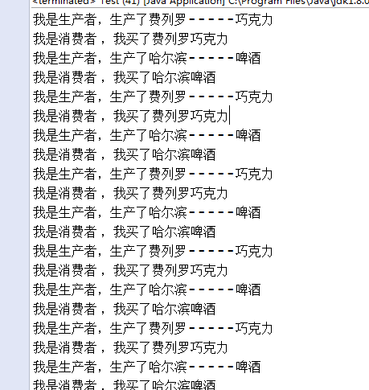


代码：
1.商品：属性：品牌 ，名字
2.线程1：生产者
3.线程2：消费者

## 分解1

出现问题：
1.生产者和消费者没有交替输出

2.打印数据错乱
哈尔滨 - null
费列罗啤酒
哈尔滨巧克力
----没有加同步


代码展示：

```java
public class Product {//商品类
    //品牌
    private String brand;
    //名字
    private String name;
    //setter,getter方法；
    public String getBrand() {
        return brand;
    }
    public void setBrand(String brand) {
        this.brand = brand;
    }
    public String getName() {
        return name;
    }
    public void setName(String name) {
        this.name = name;
    }
}

```

```java
public class ProducerThread extends Thread{//生产者线程
    //共享商品：
    private Product p;
    public ProducerThread(Product p) {
        this.p = p;
    }
    @Override
    public void run() {
        for (int i = 1; i <= 10 ; i++) {//生产十个商品 i:生产的次数
            if(i % 2 == 0){
                //生产费列罗巧克力
                p.setBrand("费列罗");
                try {
                    Thread.sleep(100);
                } catch (InterruptedException e) {
                    e.printStackTrace();
                }
                p.setName("巧克力");
            }else{
                //生产哈尔滨啤酒
                p.setBrand("哈尔滨");
                try {
                    Thread.sleep(100);
                } catch (InterruptedException e) {
                    e.printStackTrace();
                }
                p.setName("啤酒");
            }
            //将生产信息做一个打印：
            System.out.println("生产者生产了：" + p.getBrand() + "---" + p.getName());
        }
    }
}
```

```java
public class CustomerThread extends Thread{//消费者线程
    //共享商品：
    private Product p;
    public CustomerThread(Product p) {
        this.p = p;
    }
    @Override
    public void run() {
        for (int i = 1; i <= 10 ; i++) {//i:消费次数
            System.out.println("消费者消费了：" + p.getBrand() + "---" + p.getName());
        }
    }
}
```


## 分解2

【1】利用同步代码块解决问题：

```java
public class ProducerThread extends Thread{//生产者线程
    //共享商品：
    private Product p;
    public ProducerThread(Product p) {
        this.p = p;
    }
    @Override
    public void run() {
        for (int i = 1; i <= 10 ; i++) {//生产十个商品 i:生产的次数
            synchronized (p){
                if(i % 2 == 0){
                    //生产费列罗巧克力
                    p.setBrand("费列罗");
                    try {
                        Thread.sleep(100);
                    } catch (InterruptedException e) {
                        e.printStackTrace();
                    }
                    p.setName("巧克力");
                }else{
                    //生产哈尔滨啤酒
                    p.setBrand("哈尔滨");
                    try {
                        Thread.sleep(100);
                    } catch (InterruptedException e) {
                        e.printStackTrace();
                    }
                    p.setName("啤酒");
                }
                //将生产信息做一个打印：
                System.out.println("生产者生产了：" + p.getBrand() + "---" + p.getName());
            }
        }
    }
}
```


```java
public class CustomerThread extends Thread{//消费者线程
    //共享商品：
    private Product p;
    public CustomerThread(Product p) {
        this.p = p;
    }
    @Override
    public void run() {
        for (int i = 1; i <= 10 ; i++) {//i:消费次数
            synchronized (p){
                System.out.println("消费者消费了：" + p.getBrand() + "---" + p.getName());
            }
        }
    }
}
```

【2】利用同步方法解决问题：

```java
public class Product {//商品类
    //品牌
    private String brand;
    //名字
    private String name;
    //setter,getter方法；
    public String getBrand() {
        return brand;
    }
    public void setBrand(String brand) {
        this.brand = brand;
    }
    public String getName() {
        return name;
    }
    public void setName(String name) {
        this.name = name;
    }
    //生产商品
    public synchronized void setProduct(String brand,String name){
        this.setBrand(brand);
        try {
            Thread.sleep(100);
        } catch (InterruptedException e) {
            e.printStackTrace();
        }
        this.setName(name);
        //将生产信息做一个打印：
        System.out.println("生产者生产了：" + this.getBrand() + "---" + this.getName());
    }
    //消费商品：
    public synchronized void getProduct(){
        System.out.println("消费者消费了：" + this.getBrand() + "---" + this.getName());
    }
}
```


```java
public class CustomerThread extends Thread{//消费者线程
    //共享商品：
    private Product p;
    public CustomerThread(Product p) {
        this.p = p;
    }
    @Override
    public void run() {
        for (int i = 1; i <= 10 ; i++) {//i:消费次数
            p.getProduct();;
        }
    }
}
```

```java
public class ProducerThread extends Thread{//生产者线程
    //共享商品：
    private Product p;
    public ProducerThread(Product p) {
        this.p = p;
    }
    @Override
    public void run() {
        for (int i = 1; i <= 10 ; i++) {//生产十个商品 i:生产的次数
            if(i % 2 == 0){
                p.setProduct("费列罗","巧克力");
            }else{
                p.setProduct("哈尔滨","啤酒");
            }
        }
    }
}
```

（这个else中的代码在分解3中 演示了错误）


## 分解3

【1】原理：

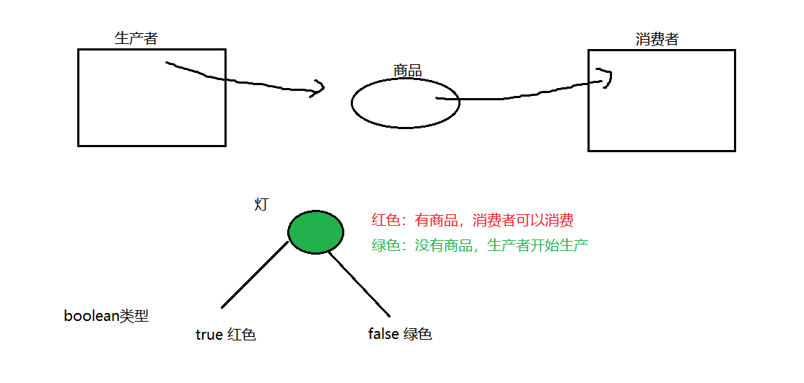


【2】代码：

```java
public class Product {//商品类
    //品牌
    private String brand;
    //名字
    private String name;
    //引入一个灯：true:红色  false 绿色
    boolean flag = false;//默认情况下没有商品 让生产者先生产  然后消费者再消费
    //setter,getter方法；
    public String getBrand() {
        return brand;
    }
    public void setBrand(String brand) {
        this.brand = brand;
    }
    public String getName() {
        return name;
    }
    public void setName(String name) {
        this.name = name;
    }
    //生产商品
    public synchronized void setProduct(String brand,String name){
        if(flag == true){//灯是红色，证明有商品，生产者不生产，等着消费者消费
            try {
                wait();
            } catch (InterruptedException e) {
                e.printStackTrace();
            }
        }
        //灯是绿色的，就生产：
        this.setBrand(brand);
        try {
            Thread.sleep(100);
        } catch (InterruptedException e) {
            e.printStackTrace();
        }
        this.setName(name);
        //将生产信息做一个打印：
        System.out.println("生产者生产了：" + this.getBrand() + "---" + this.getName());
        //生产完以后，灯变色：变成红色：
        flag = true;
        //告诉消费者赶紧来消费：
        notify();
    }
    //消费商品：
    public synchronized void getProduct(){
        if(!flag){//flag == false没有商品，等待生产者生产：
            try {
                wait();
            } catch (InterruptedException e) {
                e.printStackTrace();
            }
        }
        //有商品，消费：
        System.out.println("消费者消费了：" + this.getBrand() + "---" + this.getName());
        //消费完：灯变色：
        flag = false;
        //通知生产者生产：
        notify();
    }
}
```

【3】原理：

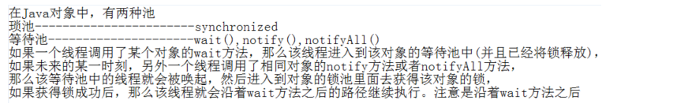


注意：wait方法和notify方法  是必须放在同步方法或者同步代码块中才生效的 （因为在同步的基础上进行线程的通信才是有效的）
注意：sleep和wait的区别：sleep进入阻塞状态没有释放锁，wait进入阻塞状态但是同时释放了锁
【4】线程生命周期完整图：

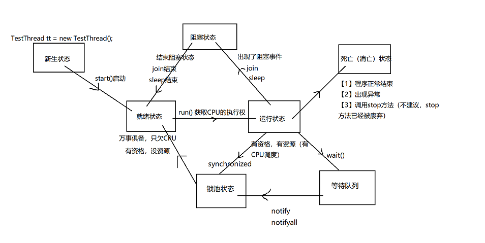


## Loc锁情况下的线程通信

Condition是在Java 1.5中才出现的，它用来替代传统的Object的wait()、notify()实现线程间的协作，相比使用Object的wait()、notify()，使用Condition1的await()、signal()这种方式实现线程间协作更加安全和高效。


它的更强大的地方在于：能够更加精细的控制多线程的休眠与唤醒。对于同一个锁，我们可以创建多个Condition，在不同的情况下使用不同的Condition

一个Condition包含一个等待队列。一个Lock可以产生多个Condition，所以可以有多个等待队列。

在Object的监视器模型上，一个对象拥有一个同步队列和等待队列，<font color="red">而Lock（同步器）拥有一个同步队列和多个等待队列</font>。

Object中的wait(),notify(),notifyAll()方法是和"同步锁"(synchronized关键字)捆绑使用的；而Condition是需要与"互斥锁"/"共享锁"捆绑使用的。

调用Condition的await()、signal()、signalAll()方法，都必须在lock保护之内，<font color="red">就是说必须在lock.lock()和lock.unlock之间才可以使用 </font>

· Conditon中的await()对应Object的wait()；

· Condition中的signal()对应Object的notify()；
· Condition中的signalAll()对应Object的notifyAll()。

void await()  throws InterruptedException

造成当前线程在接到信号或被中断之前一直处于等待状态。

与此 Condition 相关的锁以原子方式释放，并且出于线程调度的目的，将禁用当前线程，且在发生以下四种情况之一 以前，当前线程将一直处于休眠状态：

· 其他某个线程调用此 Condition 的 signal() 方法，并且碰巧将当前线程选为被唤醒的线程；或者
· 其他某个线程调用此 Condition 的 signalAll() 方法；或者
· 其他某个线程中断当前线程，且支持中断线程的挂起；或者
· 发生“虚假唤醒”

在所有情况下，在此方法可以返回当前线程之前，都必须重新获取与此条件有关的锁。在线程返回时，可以保证它保持此锁。

void **signal()**

唤醒一个等待线程。

如果所有的线程都在等待此条件，则选择其中的一个唤醒。在从 await 返回之前，该线程必须重新获取锁。

void **signalAll()**

唤醒所有等待线程。

如果所有的线程都在等待此条件，则唤醒所有线程。在从 await 返回之前，每个线程都必须重新获取锁。


更改代码：

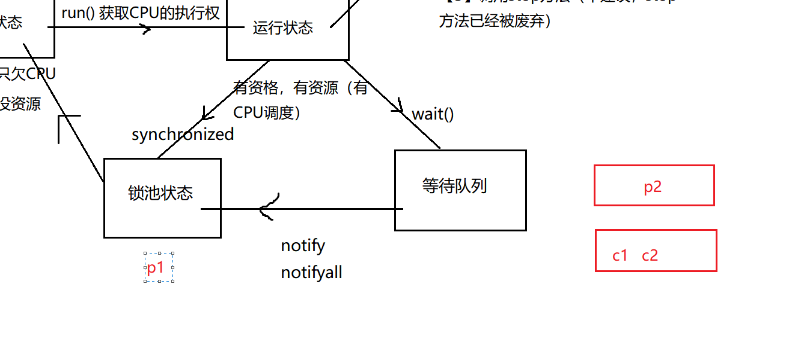


```java
public class Product {//商品类
    //品牌
    private String brand;
    //名字
    private String name;
    //声明一个Lock锁：
    Lock lock = new ReentrantLock();
    //搞一个生产者的等待队列：
    Condition produceCondition = lock.newCondition();
    //搞一个消费者的等待队列：
    Condition consumeCondition = lock.newCondition();
    //引入一个灯：true:红色  false 绿色
    boolean flag = false;//默认情况下没有商品 让生产者先生产  然后消费者再消费
    //setter,getter方法；
    public String getBrand() {
        return brand;
    }
    public void setBrand(String brand) {
        this.brand = brand;
    }
    public String getName() {
        return name;
    }
    public void setName(String name) {
        this.name = name;
    }
    //生产商品
    public void setProduct(String brand,String name){
        lock.lock();
        try{
            if(flag == true){//灯是红色，证明有商品，生产者不生产，等着消费者消费
                try {
                    //wait();
                    //生产者阻塞，生产者进入等待队列中
                    produceCondition.await();
                } catch (InterruptedException e) {
                    e.printStackTrace();
                }
            }
            //灯是绿色的，就生产：
            this.setBrand(brand);
            try {
                Thread.sleep(100);
            } catch (InterruptedException e) {
                e.printStackTrace();
            }
            this.setName(name);
            //将生产信息做一个打印：
            System.out.println("生产者生产了：" + this.getBrand() + "---" + this.getName());
            //生产完以后，灯变色：变成红色：
            flag = true;
            //告诉消费者赶紧来消费：
            //notify();
            consumeCondition.signal();
        }finally {
            lock.unlock();
        }
    }
    //消费商品：
    public void getProduct(){
        lock.lock();
        try{
            if(!flag){//flag == false没有商品，等待生产者生产：
                try {
                   // wait();
                    //消费者等待，消费者线程进入等待队列：
                    consumeCondition.await();
                } catch (InterruptedException e) {
                    e.printStackTrace();
                }
            }
            //有商品，消费：
            System.out.println("消费者消费了：" + this.getBrand() + "---" + this.getName());
            //消费完：灯变色：
            flag = false;
            //通知生产者生产：
            //notify();
            produceCondition.signal();
        }finally {
            lock.unlock();
        }
    }
}
```


# 未完成！！！！！！！！！！


