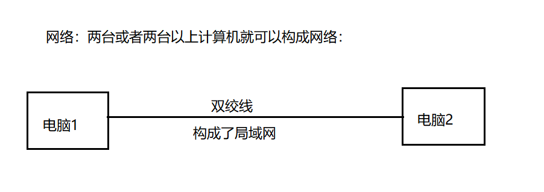
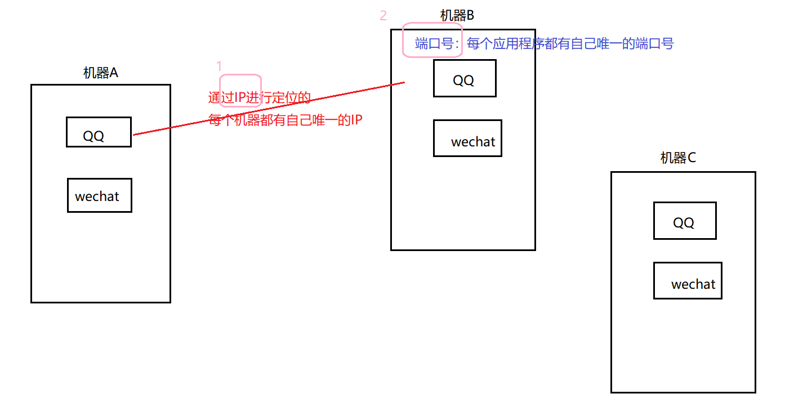
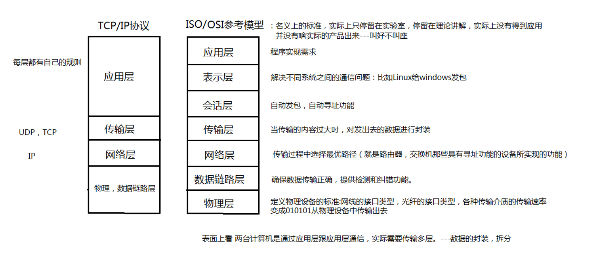
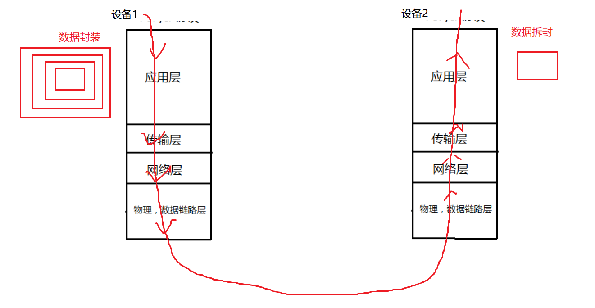
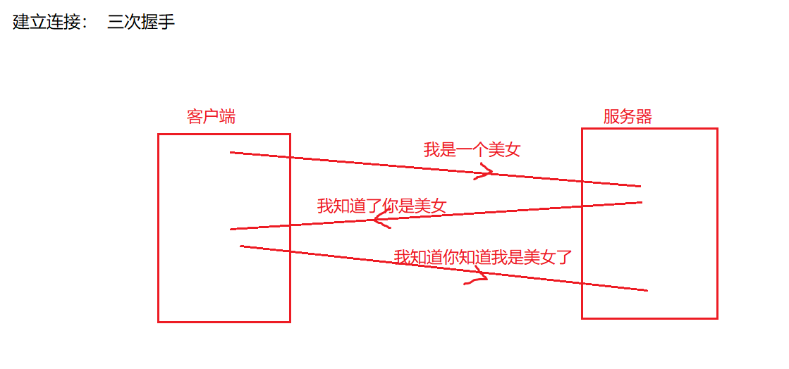
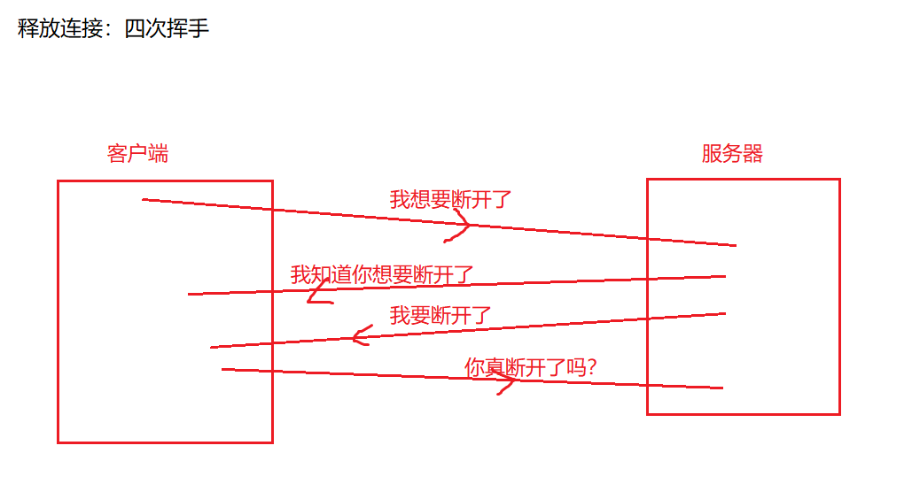
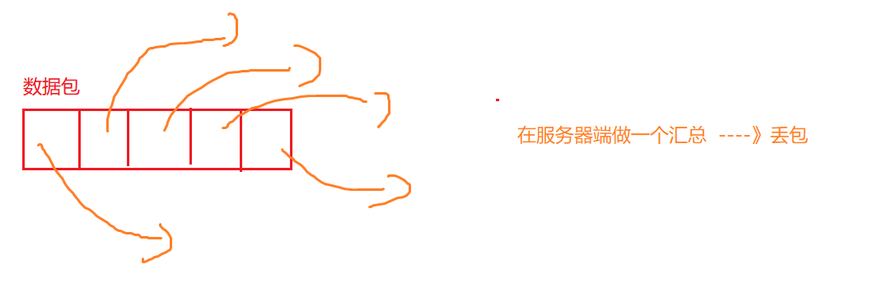
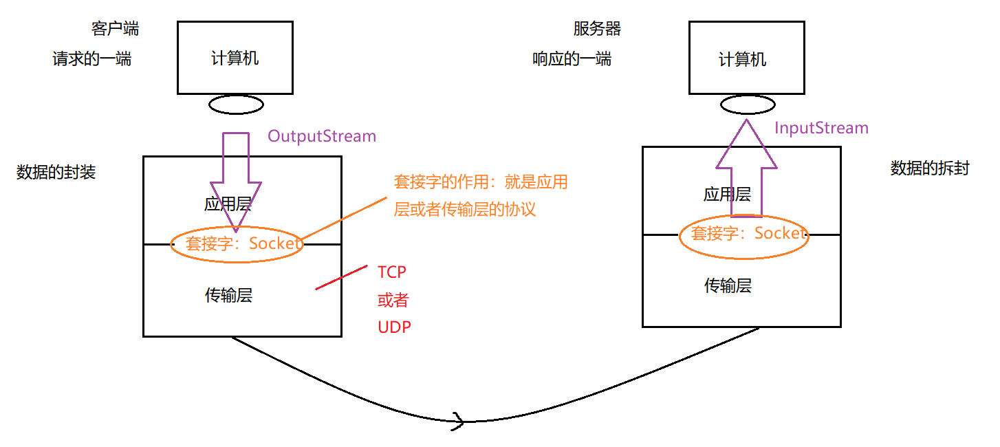
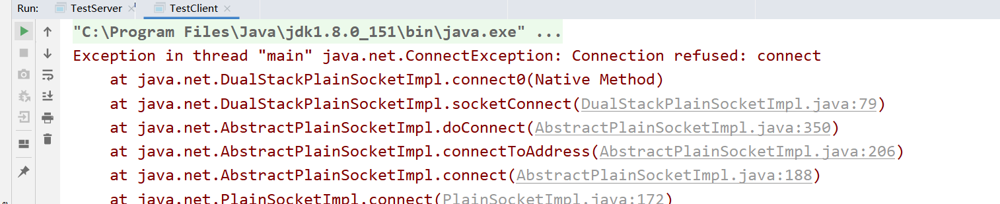
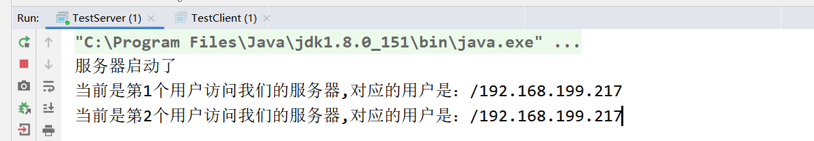

# 引入

【1】网络编程：

把分布在不同地理区域的计算机与专门的外部设备用通信线路互连成一个规模大、功能强的网络系统，从而使众多的计算机可以方便地互相传递信息、共享硬件、软件、数据信息等资源。

设备之间在网络中进行数据的传输，发送/接收数据。




【2】通信两个重要的要素：IP+PORT




域名：www.baidu.com ------\>DNS服务器解析 ----\> IP地址

www.mashibing.com

www.sina.com

www.wanda.com

www.bbbb.com

【3】设备之间进行传输的时候，必须遵照一定的规则 ---》通信协议：







【4】TCP协议：可靠的

建立连接： 三次握手




释放连接：四次挥手




【5】UDP协议：不可靠的




# InetAddress,InetSocketAddress

前情提要：File ---》 封装盘符一个文件

【1】InetAddress ---》 封装了IP

```java
public class Test01 {
    //这是一个main方法，是程序的入口：
    public static void main(String[] args) throws UnknownHostException {
        //封装IP：
        //InetAddress ia = new InetAddress();不能直接创建对象，因为InetAddress()被default修饰了。
        InetAddress ia = InetAddress.getByName("192.168.199.217");
        System.out.println(ia);
        InetAddress ia2 = InetAddress.getByName("localhost");//localhost指代的是本机的ip地址
        System.out.println(ia2);
        InetAddress ia3 = InetAddress.getByName("127.0.0.1");//127.0.0.1指代的是本机的ip地址
        System.out.println(ia3);
        InetAddress ia4 = InetAddress.getByName("LAPTOP-CRIVSRRU");//封装计算机名
        System.out.println(ia4);
        InetAddress ia5 = InetAddress.getByName("www.mashibing.com");//封装域名
        System.out.println(ia5);

        System.out.println(ia5.getHostName());//获取域名
        System.out.println(ia5.getHostAddress());//获取ip地址
    }
}
```


【2】InetSocketAddress ---》封装了IP，端口号

```java
public class Test02 {
    //这是一个main方法，是程序的入口：
    public static void main(String[] args) {
        InetSocketAddress isa = new InetSocketAddress("192.168.199.217",8080);
        System.out.println(isa);
        System.out.println(isa.getHostName());
        System.out.println(isa.getPort());

        InetAddress ia = isa.getAddress();
        System.out.println(ia.getHostName());
        System.out.println(ia.getHostAddress());
    }
}
```


# 网络通信原理--套接字




## 基于TCP的网络编程

功能：模拟网站的登录，客户端录入账号密码，然后服务器端进行验证。

### 功能分解1：单向通信

功能：客户端发送一句话到服务器：

客户端：

```java
public class TestClient {//客户端

    //这是一个main方法，是程序的入口：
    public static void main(String[] args) throws IOException {
        //1.创建套接字：指定服务器的ip和端口号：
        Socket s = new Socket("192.168.199.217",8888);
        //2.对于程序员来说，向外发送数据 感受 --》利用输出流：
        OutputStream os = s.getOutputStream();
        DataOutputStream dos = new DataOutputStream(os);
        //利用这个OutputStream就可以向外发送数据了，但是没有直接发送String的方法
        //所以我们又在OutputStream外面套了一个处理流：DataOutputStream
        dos.writeUTF("你好");

        //3.关闭流 + 关闭网络资源：
        dos.close();
        os.close();
        s.close();
    }
}
```


服务器：

```java
public class TestServer {//服务器

    //这是一个main方法，是程序的入口：
    public static void main(String[] args) throws IOException {
        //1.创建套接字： 指定服务器的端口号
        ServerSocket ss = new ServerSocket(8888);
        //2.等着客户端发来的信息：
        Socket s = ss.accept();//阻塞方法:等待接收客户端的数据，什么时候接收到数据，什么时候程序继续向下执行。
        //accept()返回值为一个Socket，这个Socket其实就是客户端的Socket
        //接到这个Socket以后，客户端和服务器才真正产生了连接，才真正可以通信了
        //3.感受到的操作流：
        InputStream is = s.getInputStream();
        DataInputStream dis = new DataInputStream(is);

        //4.读取客户端发来的数据：
        String str = dis.readUTF();
        System.out.println("客户端发来的数据为："+str);

        //5.关闭流+关闭网络资源：
        dis.close();
        is.close();
        s.close();
        ss.close();
    }
}

```

测试：

（1）先开启客户端还是先开启服务器：先开服务器，再开启客户端

侧面验证：先开客户端：出错：




### 

### 功能分解2：双向通信

服务器端：

2.  

```java
import java.io.\*;
import java.net.ServerSocket;
import java.net.Socket;

/\*\*
    \* @author : msb-zhaoss
        \*/
        public class TestServer {//服务器

            //这是一个main方法，是程序的入口：
            public static void main(String[] args) throws IOException {
                //1.创建套接字： 指定服务器的端口号
                ServerSocket ss = new ServerSocket(8888);
                //2.等着客户端发来的信息：
                Socket s = ss.accept();//阻塞方法:等待接收客户端的数据，什么时候接收到数据，什么时候程序继续向下执行。
                //accept()返回值为一个Socket，这个Socket其实就是客户端的Socket
                //接到这个Socket以后，客户端和服务器才真正产生了连接，才真正可以通信了
                //3.感受到的操作流：
                InputStream is = s.getInputStream();
                DataInputStream dis = new DataInputStream(is);

                //4.读取客户端发来的数据：
                String str = dis.readUTF();
                System.out.println("客户端发来的数据为："+str);

                //向客户端输出一句话：---》操作流---》输出流
                OutputStream os = s.getOutputStream();
                DataOutputStream dos = new DataOutputStream(os);
                dos.writeUTF("你好，我是服务器端，我接受到你的请求了");


                //5.关闭流+关闭网络资源：
                dos.close();
                os.close();
                dis.close();
                is.close();
                s.close();
                ss.close();
            }
        }


```

客户端：

2.  

```java
import java.io.\*;
import java.net.Socket;

public class TestClient {//客户端

    //这是一个main方法，是程序的入口：
    public static void main(String[] args) throws IOException {
        //1.创建套接字：指定服务器的ip和端口号：
        Socket s = new Socket("192.168.199.217",8888);
        //2.对于程序员来说，向外发送数据 感受 --》利用输出流：
        OutputStream os = s.getOutputStream();
        DataOutputStream dos = new DataOutputStream(os);
        //利用这个OutputStream就可以向外发送数据了，但是没有直接发送String的方法
        //所以我们又在OutputStream外面套了一个处理流：DataOutputStream
        dos.writeUTF("你好");

        //接收服务器端的回话--》利用输入流：
        InputStream is = s.getInputStream();
        DataInputStream dis = new DataInputStream(is);
        String str = dis.readUTF();
        System.out.println("服务器端对我说："+str);

        //3.关闭流 + 关闭网络资源：
        dis.close();
        is.close();
        dos.close();
        os.close();
        s.close();
    }
}


```

注意：关闭防火墙

### 功能分解3：对象流传送

封装的User类：

2.  

```java
import java.io.Serializable;


public class User implements Serializable {
    private static final long serialVersionUID = 9050691344308365540L;
    private String name;
    private String pwd;

    public String getName() {
        return name;
    }

    public void setName(String name) {
        this.name = name;
    }

    public String getPwd() {
        return pwd;
    }

    public void setPwd(String pwd) {
        this.pwd = pwd;
    }

    public User(String name, String pwd) {
        this.name = name;
        this.pwd = pwd;
    }
}


```

客户端：

2.  

```java
import java.io.\*;
import java.net.Socket;
import java.util.Scanner;

public class TestClient {//客户端

    //这是一个main方法，是程序的入口：
    public static void main(String[] args) throws IOException {
        //1.创建套接字：指定服务器的ip和端口号：
        Socket s = new Socket("192.168.199.217",8888);

        //录入用户的账号和密码：
        Scanner sc = new Scanner(System.in);
        System.out.println("请录入您的账号：");
        String name = sc.next();
        System.out.println("请录入您的密码：");
        String pwd = sc.next();
        //将账号和密码封装为一个User的对象：
        User user = new User(name,pwd);


        //2.对于程序员来说，向外发送数据 感受 --》利用输出流：
        OutputStream os = s.getOutputStream();
        ObjectOutputStream oos = new ObjectOutputStream(os);
        oos.writeObject(user);


        //接收服务器端的回话--》利用输入流：
        InputStream is = s.getInputStream();
        DataInputStream dis = new DataInputStream(is);
        boolean b = dis.readBoolean();
        if(b){
            System.out.println("恭喜，登录成功");
        }else{
            System.out.println("对不起，登录失败");
        }

        //3.关闭流 + 关闭网络资源：
        dis.close();
        is.close();
        oos.close();
        os.close();
        s.close();
    }
}


```

服务器：

2.  

```java
import java.io.\*;
import java.net.ServerSocket;
import java.net.Socket;


public class TestServer {//服务器

    //这是一个main方法，是程序的入口：
    public static void main(String[] args) throws IOException, ClassNotFoundException {
        //1.创建套接字： 指定服务器的端口号
        ServerSocket ss = new ServerSocket(8888);
        //2.等着客户端发来的信息：
        Socket s = ss.accept();//阻塞方法:等待接收客户端的数据，什么时候接收到数据，什么时候程序继续向下执行。
        //accept()返回值为一个Socket，这个Socket其实就是客户端的Socket
        //接到这个Socket以后，客户端和服务器才真正产生了连接，才真正可以通信了
        //3.感受到的操作流：
        InputStream is = s.getInputStream();
        ObjectInputStream ois = new ObjectInputStream(is);

        //4.读取客户端发来的数据：
        User user = (User)(ois.readObject());

        //对对象进行验证：
        boolean flag = false;
        if(user.getName().equals("娜娜")&&user.getPwd().equals("123123")){
            flag = true;
        }

        //向客户端输出结果：---》操作流---》输出流
        OutputStream os = s.getOutputStream();
        DataOutputStream dos = new DataOutputStream(os);
        dos.writeBoolean(flag);


        //5.关闭流+关闭网络资源：
        dos.close();
        os.close();
        ois.close();
        is.close();
        s.close();
        ss.close();
    }
}


```

### 功能分解4：加入完整的处理异常方式

服务器端：

2.  

```java
import java.io.\*;
import java.net.ServerSocket;
import java.net.Socket;


public class TestServer {//服务器

    //这是一个main方法，是程序的入口：
    public static void main(String[] args) {
        //1.创建套接字： 指定服务器的端口号
        ServerSocket ss = null;
        Socket s = null;
        InputStream is = null;
        ObjectInputStream ois = null;
        OutputStream os = null;
        DataOutputStream dos = null;
        try {
            ss = new ServerSocket(8888);
            //2.等着客户端发来的信息：
            s = ss.accept();//阻塞方法:等待接收客户端的数据，什么时候接收到数据，什么时候程序继续向下执行。
            //accept()返回值为一个Socket，这个Socket其实就是客户端的Socket
            //接到这个Socket以后，客户端和服务器才真正产生了连接，才真正可以通信了
            //3.感受到的操作流：
            is = s.getInputStream();
            ois = new ObjectInputStream(is);

            //4.读取客户端发来的数据：
            User user = (User)(ois.readObject());

            //对对象进行验证：
            boolean flag = false;
            if(user.getName().equals("娜娜")&&user.getPwd().equals("123123")){
                flag = true;
            }

            //向客户端输出结果：---》操作流---》输出流
            os = s.getOutputStream();
            dos = new DataOutputStream(os);
            dos.writeBoolean(flag);
        } catch (IOException \| ClassNotFoundException e) {
            e.printStackTrace();
        } finally {
            //5.关闭流+关闭网络资源：
            try {
                if(dos!=null){
                    dos.close();
                }
            } catch (IOException e) {
                e.printStackTrace();
            }
            try {
                if(os!=null){
                    os.close();
                }
            } catch (IOException e) {
                e.printStackTrace();
            }
            try {
                if(ois!=null){
                    ois.close();
                }
            } catch (IOException e) {
                e.printStackTrace();
            }
            try {
                if(is!=null){
                    is.close();
                }
            } catch (IOException e) {
                e.printStackTrace();
            }
            try {
                if(s!=null){
                    s.close();
                }
            } catch (IOException e) {
                e.printStackTrace();
            }
            try {
                if(ss!=null){
                    ss.close();
                }
            } catch (IOException e) {
                e.printStackTrace();
            }
        }


    }
}


```

客户端：

2.  

```java
import java.io.\*;
import java.net.Socket;
import java.util.Scanner;


public class TestClient {//客户端

    //这是一个main方法，是程序的入口：
    public static void main(String[] args){
        //1.创建套接字：指定服务器的ip和端口号：
        Socket s = null;
        OutputStream os = null;
        ObjectOutputStream oos = null;
        InputStream is = null;
        DataInputStream dis = null;
        try {
            s = new Socket("192.168.199.217",8888);
            //录入用户的账号和密码：
            Scanner sc = new Scanner(System.in);
            System.out.println("请录入您的账号：");
            String name = sc.next();
            System.out.println("请录入您的密码：");
            String pwd = sc.next();
            //将账号和密码封装为一个User的对象：
            User user = new User(name,pwd);
            //2.对于程序员来说，向外发送数据 感受 --》利用输出流：
            os = s.getOutputStream();
            oos = new ObjectOutputStream(os);
            oos.writeObject(user);
            //接收服务器端的回话--》利用输入流：
            is = s.getInputStream();
            dis = new DataInputStream(is);
            boolean b = dis.readBoolean();
            if(b){
                System.out.println("恭喜，登录成功");
            }else{
                System.out.println("对不起，登录失败");
            }
        } catch (IOException e) {
            e.printStackTrace();
        } finally{
            //3.关闭流 + 关闭网络资源：
            try {
                if(dis!=null){
                    dis.close();
                }
            } catch (IOException e) {
                e.printStackTrace();
            }
            try {
                if(is!=null){
                    is.close();
                }
            } catch (IOException e) {
                e.printStackTrace();
            }
            try {
                if(oos!=null){
                    oos.close();
                }
            } catch (IOException e) {
                e.printStackTrace();
            }
            try {
                if(os!=null){
                    os.close();
                }
            } catch (IOException e) {
                e.printStackTrace();
            }
            try {
                if(s!=null){
                    s.close();
                }
            } catch (IOException e) {
                e.printStackTrace();
            }
        }


    }
}


```

### 功能分解5：多线程接收用户请求

遗留问题：服务器针对一个请求服务，之后服务器就关闭了（程序自然结束了）

现在需要解决：服务器必须一直在监听 ，一直开着，等待客户端的请求

在当前代码中，客户端不用动了




更改服务器代码：

2.  

```java
import java.io.\*;
import java.net.Socket;


public class ServerThread extends Thread {//线程：专门处理客户端的请求
    InputStream is = null;
    ObjectInputStream ois = null;
    OutputStream os = null;
    DataOutputStream dos = null;
    Socket s = null;
    public ServerThread(Socket s){
        this.s = s;
    }
    @Override
    public void run() {
        try{
            //2.等着客户端发来的信息：

            is = s.getInputStream();
            ois = new ObjectInputStream(is);

            //4.读取客户端发来的数据：
            User user = (User)(ois.readObject());

            //对对象进行验证：
            boolean flag = false;
            if(user.getName().equals("娜娜")&&user.getPwd().equals("123123")){
                flag = true;
            }

            //向客户端输出结果：---》操作流---》输出流
            os = s.getOutputStream();
            dos = new DataOutputStream(os);
            dos.writeBoolean(flag);
        }catch (IOException \| ClassNotFoundException e) {
            e.printStackTrace();
        }finally {
            try {
                if(dos!=null){
                    dos.close();
                }
            } catch (IOException e) {
                e.printStackTrace();
            }
            try {
                if(os!=null){
                    os.close();
                }
            } catch (IOException e) {
                e.printStackTrace();
            }
            try {
                if(ois!=null){
                    ois.close();
                }
            } catch (IOException e) {
                e.printStackTrace();
            }
            try {
                if(is!=null){
                    is.close();
                }
            } catch (IOException e) {
                e.printStackTrace();
            }
        }
    }
}


```

```java
import java.io.\*;
import java.net.ServerSocket;
import java.net.Socket;

public class TestServer {//服务器

    //这是一个main方法，是程序的入口：
    public static void main(String[] args) {
        System.out.println("服务器启动了");
        //1.创建套接字： 指定服务器的端口号
        ServerSocket ss = null;
        Socket s = null;
        int count = 0;//定义一个计数器，用来计数 客户端的请求
        try {
            ss = new ServerSocket(8888);
            while(true){//加入死循环，服务器一直监听客户端是否发送数据
                s = ss.accept();//阻塞方法:等待接收客户端的数据，什么时候接收到数据，什么时候程序继续向下执行。
                //每次过来的客户端的请求 靠 线程处理：
                new ServerThread(s).start();
                count++;
                //输入请求的客户端的信息：
                System.out.println("当前是第"+count+"个用户访问我们的服务器,对应的用户是："+s.getInetAddress());
            }
        } catch (IOException e) {
            e.printStackTrace();
        }
    }
}


```

## 基于UDP的网络编程

TCP:

客户端：Socket

程序感受到的 使用流 ：输出流

服务器端： ServerSocket ---\>Socket 程序感受到的 使用流 ：输入流

（客户端和服务器端地位不平等。）

UDP:

发送方：DatagramSocket 发送：数据包 DatagramPacket

接收方：DatagramSocket 接收：数据包 DatagramPacket

（发送方和接收方的地址是平等的。）

UDP案例： 完成网站的咨询聊天

### 功能分解1：单向通信

发送方：

2.  

```java
import java.io.IOException;
import java.net.\*;


public class TestSend {//发送方：

    //这是一个main方法，是程序的入口：
    public static void main(String[] args) throws IOException {
        System.out.println("学生上线。。。");
        //1.准备套接字： 指定发送方的端口号
        DatagramSocket ds = new DatagramSocket(8888);
        //2.准备数据包
        String str = "你好";
        byte[] bytes = str.getBytes();
        /\*
            需要四个参数：
            1.指的是传送数据转为字节数组
            2.字节数组的长度
            3.封装接收方的ip
            4.指定接收方的端口号
            \*/
            DatagramPacket dp = new DatagramPacket(bytes,bytes.length, InetAddress.getByName("localhost"),9999);
        //发送：
        ds.send(dp);

        //关闭资源
        ds.close();
    }
}


```

接收方：

2.  

```java
import java.io.IOException;
import java.net.DatagramPacket;
import java.net.DatagramSocket;
import java.net.SocketException;


public class TestReceive {//接收方

    //这是一个main方法，是程序的入口：
    public static void main(String[] args) throws IOException {
        System.out.println("老师上线了。。");
        //1.创建套接字：指定接收方的端口
        DatagramSocket ds = new DatagramSocket(9999);
        //2.有一个空的数据包，打算用来接收 对方传过来的数据包：
        byte[] b = new byte[1024];
        DatagramPacket dp = new DatagramPacket(b,b.length);
        //3.接收对方的数据包，然后放入我们的dp数据包中填充
        ds.receive(dp);//接收完以后 dp里面就填充好内容了

        //4.取出数据：
        byte[] data = dp.getData();
        String s = new String(data,0,dp.getLength());//dp.getLength()数组包中的有效长度
        System.out.println("学生对我说："+s);

        //5.关闭资源：
        ds.close();


    }
}


```

### 

### 功能分解2：双向通信

发送方：

2.  

```java
import java.io.IOException;
import java.net.\*;
import java.util.Scanner;

public class TestSend {//发送方：

    //这是一个main方法，是程序的入口：
    public static void main(String[] args) throws IOException {
        System.out.println("学生上线。。。");
        //1.准备套接字： 指定发送方的端口号
        DatagramSocket ds = new DatagramSocket(8888);
        //2.准备数据包
        Scanner sc = new Scanner(System.in);
        System.out.print("学生：");
        String str = sc.next();
        byte[] bytes = str.getBytes();
        /\*
            需要四个参数：
            1.指的是传送数据转为Z字节数组
            2.字节数组的长度
            3.封装接收方的ip
            4.指定接收方的端口号
            \*/
            DatagramPacket dp = new DatagramPacket(bytes,bytes.length, InetAddress.getByName("localhost"),9999);
        //发送：
        ds.send(dp);

        //接收老师发送回来的信息：
        byte[] b = new byte[1024];
        DatagramPacket dp2 = new DatagramPacket(b,b.length);
        ds.receive(dp2);//接收完以后 dp2里面就填充好内容了

        //取出数据：
        byte[] data = dp2.getData();
        String s = new String(data,0,dp2.getLength());//dp.getLength()数组包中的有效长度
        System.out.println("老师对我说："+s);

        //关闭资源
        ds.close();
    }
}


```

接收方：

2.  

```java
import java.io.IOException;
import java.net.DatagramPacket;
import java.net.DatagramSocket;
import java.net.InetAddress;
import java.net.SocketException;
import java.util.Scanner;


public class TestReceive {//接收方

    //这是一个main方法，是程序的入口：
    public static void main(String[] args) throws IOException {
        System.out.println("老师上线了。。");
        //1.创建套接字：指定接收方的端口
        DatagramSocket ds = new DatagramSocket(9999);
        //2.有一个空的数据包，打算用来接收 对方传过来的数据包：
        byte[] b = new byte[1024];
        DatagramPacket dp = new DatagramPacket(b,b.length);
        //3.接收对方的数据包，然后放入我们的dp数据包中填充
        ds.receive(dp);//接收完以后 dp里面就填充好内容了

        //4.取出数据：
        byte[] data = dp.getData();
        String s = new String(data,0,dp.getLength());//dp.getLength()数组包中的有效长度
        System.out.println("学生对我说："+s);

        //老师进行回复：
        Scanner sc = new Scanner(System.in);
        System.out.print("老师：");
        String str = sc.next();
        byte[] bytes = str.getBytes();
        //封装数据，并且指定学生的ip和端口号
        DatagramPacket dp2 = new DatagramPacket(bytes,bytes.length, InetAddress.getByName("localhost"),8888);
        //发送：
        ds.send(dp2);
        //5.关闭资源：
        ds.close();


    }
}


```

### 功能分解3：加入完整的处理异常方式

发送方：

2.  

```java
import java.io.IOException;
import java.net.\*;
import java.util.Scanner;


public class TestSend {//发送方：

    //这是一个main方法，是程序的入口：
    public static void main(String[] args) {
        System.out.println("学生上线。。。");
        //1.准备套接字： 指定发送方的端口号
        DatagramSocket ds = null;
        try {
            ds = new DatagramSocket(8888);
            //2.准备数据包
            Scanner sc = new Scanner(System.in);
            System.out.print("学生：");
            String str = sc.next();
            byte[] bytes = str.getBytes();
            /\*
                需要四个参数：
                1.指的是传送数据转为Z字节数组
                2.字节数组的长度
                3.封装接收方的ip
                4.指定接收方的端口号
                \*/
                DatagramPacket dp = new DatagramPacket(bytes,bytes.length, InetAddress.getByName("localhost"),9999);
            //发送：
            ds.send(dp);

            //接收老师发送回来的信息：
            byte[] b = new byte[1024];
            DatagramPacket dp2 = new DatagramPacket(b,b.length);
            ds.receive(dp2);//接收完以后 dp2里面就填充好内容了

            //取出数据：
            byte[] data = dp2.getData();
            String s = new String(data,0,dp2.getLength());//dp.getLength()数组包中的有效长度
            System.out.println("老师对我说："+s);
        } catch (SocketException e) {
            e.printStackTrace();
        } catch (UnknownHostException e) {
            e.printStackTrace();
        } catch (IOException e) {
            e.printStackTrace();
        } finally {
            //关闭资源
            ds.close();
        }


    }
}


```

接收方：

2.  

```java
import java.io.IOException;
import java.net.\*;
import java.util.Scanner;

public class TestReceive {//接收方

    //这是一个main方法，是程序的入口：
    public static void main(String[] args){
        System.out.println("老师上线了。。");
        //1.创建套接字：指定接收方的端口
        DatagramSocket ds = null;
        try {
            ds = new DatagramSocket(9999);
            //2.有一个空的数据包，打算用来接收 对方传过来的数据包：
            byte[] b = new byte[1024];
            DatagramPacket dp = new DatagramPacket(b,b.length);
            //3.接收对方的数据包，然后放入我们的dp数据包中填充
            ds.receive(dp);//接收完以后 dp里面就填充好内容了

            //4.取出数据：
            byte[] data = dp.getData();
            String s = new String(data,0,dp.getLength());//dp.getLength()数组包中的有效长度
            System.out.println("学生对我说："+s);

            //老师进行回复：
            Scanner sc = new Scanner(System.in);
            System.out.print("老师：");
            String str = sc.next();
            byte[] bytes = str.getBytes();
            //封装数据，并且指定学生的ip和端口号
            DatagramPacket dp2 = new DatagramPacket(bytes,bytes.length, InetAddress.getByName("localhost"),8888);
            //发送：
            ds.send(dp2);
        } catch (SocketException e) {
            e.printStackTrace();
        } catch (UnknownHostException e) {
            e.printStackTrace();
        } catch (IOException e) {
            e.printStackTrace();
        } finally {
            //5.关闭资源：
            ds.close();
        }


    }
}

```

### 功能分解4：正常通信

发送方：

2.  

```java
import java.io.IOException;
import java.net.\*;
import java.util.Scanner;

public class TestSend {//发送方：

    //这是一个main方法，是程序的入口：
    public static void main(String[] args) {
        System.out.println("学生上线。。。");
        //1.准备套接字： 指定发送方的端口号
        DatagramSocket ds = null;
        try {
            ds = new DatagramSocket(8888);
            while(true){
                //2.准备数据包
                Scanner sc = new Scanner(System.in);
                System.out.print("学生：");
                String str = sc.next();

                byte[] bytes = str.getBytes();
                /\*
                    需要四个参数：
                    1.指的是传送数据转为Z字节数组
                    2.字节数组的长度
                    3.封装接收方的ip
                    4.指定接收方的端口号
                    \*/
                    DatagramPacket dp = new DatagramPacket(bytes,bytes.length, InetAddress.getByName("localhost"),9999);
                //发送：
                ds.send(dp);
                if(str.equals("byebye")){
                    System.out.println("学生下线。。");
                    break;
                }
                //接收老师发送回来的信息：
                byte[] b = new byte[1024];
                DatagramPacket dp2 = new DatagramPacket(b,b.length);
                ds.receive(dp2);//接收完以后 dp2里面就填充好内容了

                //取出数据：
                byte[] data = dp2.getData();
                String s = new String(data,0,dp2.getLength());//dp.getLength()数组包中的有效长度
                System.out.println("老师对我说："+s);
            }
        } catch (SocketException e) {
            e.printStackTrace();
        } catch (UnknownHostException e) {
            e.printStackTrace();
        } catch (IOException e) {
            e.printStackTrace();
        } finally {
            //关闭资源
            ds.close();
        }


    }
}


```

接收方：

2.  

```java
import java.io.IOException;
import java.net.\*;
import java.util.Scanner;


public class TestReceive {//接收方

    //这是一个main方法，是程序的入口：
    public static void main(String[] args){
        System.out.println("老师上线了。。");
        //1.创建套接字：指定接收方的端口
        DatagramSocket ds = null;
        try {
            ds = new DatagramSocket(9999);
            while(true){
                //2.有一个空的数据包，打算用来接收 对方传过来的数据包：
                byte[] b = new byte[1024];
                DatagramPacket dp = new DatagramPacket(b,b.length);
                //3.接收对方的数据包，然后放入我们的dp数据包中填充
                ds.receive(dp);//接收完以后 dp里面就填充好内容了

                //4.取出数据：
                byte[] data = dp.getData();
                String s = new String(data,0,dp.getLength());//dp.getLength()数组包中的有效长度
                System.out.println("学生对我说："+s);
                if(s.equals("byebye")){
                    System.out.println("学生已经下线了，老师也下线。。。");
                    break;
                }

                //老师进行回复：
                Scanner sc = new Scanner(System.in);
                System.out.print("老师：");
                String str = sc.next();
                byte[] bytes = str.getBytes();
                //封装数据，并且指定学生的ip和端口号
                DatagramPacket dp2 = new DatagramPacket(bytes,bytes.length, InetAddress.getByName("localhost"),8888);
                //发送：
                ds.send(dp2);
            }
        } catch (SocketException e) {
            e.printStackTrace();
        } catch (UnknownHostException e) {
            e.printStackTrace();
        } catch (IOException e) {
            e.printStackTrace();
        } finally {
            //5.关闭资源：
            ds.close();
        }


    }

```

