# 第15章_Junit_注解_枚举

# Junit单元测试

## 引入

【1】软件测试的目的：

软件测试的目的是在规定的条件下对程序进行操作,以发现程序错误,衡量软件质量,并对其是否能满足设计要求进行评估的过程。

【2】测试分类：

（1）黑盒测试：

软件的黑盒测试意味着测试要在软件的接口处进行。这种方法是把测试对象看做一个黑盒子,测试人员完全不考虑程序内部的逻辑结构和内部特性,只依据程序的需求规格说明书,检查程序的功能是否符合它的功能说明。因此黑盒测试又叫功能测试。

（2）白盒测试：---》Junit属于白盒测试。

软件的白盒测试是对软件的过程性细节做细致的检查。这种方法是把测试对象看做一个打开的盒子,它允许测试人员利用程序内部的逻辑结构及有关信息,设计或选择测试用例,对程序的所有逻辑路径进行测试,通过在不同点检查程序状态,确定实际状态是否与预期的状态一致。因此白盒测试又称为结构测试。

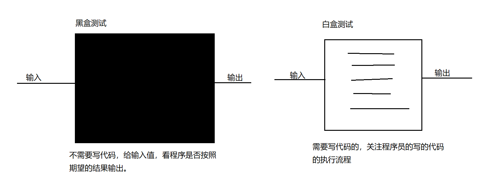


## 没有Junit的情况下如何测试

在没有使用Junit的时候，缺点：

（1）测试一定走main方法，是程序的入口，main方法的格式必须不能写错。

（2）要是在同一个main方法中测试的话，那么不需要测试的东西必须注释掉。

（3）测试逻辑如果分开的话，需要定义多个测试类，麻烦。

（4）业务逻辑和测试代码，都混淆了。

代码：

```java
public class Calculator {
    //加法：
    public int add(int a,int b){
        return a+b;
    }

    //减法：
    public int sub(int a,int b){
        return a-b;
    }
}

public class Test {
    //这是一个main方法，是程序的入口：
    public static void main(String[] args) {
        //测试加法：
        Calculator cal = new Calculator();
        int result = cal.add(10, 20);
        System.out.println(result);
        //测试减法：
        /\* int result = cal.sub(30, 10);
        System.out.println(result);\*/
    }
}
public class Test02 {
    //这是一个main方法，是程序的入口：
    public static void main(String[] args) {
        Calculator cal = new Calculator();
        //测试减法：
        int result = cal.sub(30, 10);
        System.out.println(result);
    }
}


```

## Junit的使用

【1】一般测试和业务做一个分离，分离为不同的包：

建议起名：公司域名倒着写+test

以后测试类就单独放在这个包下

【2】测试类的名字：\*\*\*\*Test ---\>见名知意

【3】测试方法的定义--》这个方法可以独立运行，不依托于main方法

建议：

名字：testAdd() testSub() 见名知意

参数：无参

返回值：void

【4】测试方法定义完以后，不能直接就独立运行了，必须要在方法前加入一个注解： @Test

【5】导入Junit的依赖的环境：

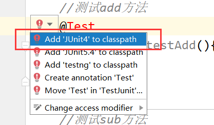


【6】代码：

```java
public class CalculatorTest {
    //测试add方法
    @Test
    public void testAdd(){
        System.out.println("测试add方法");
        Calculator cal = new Calculator();
        int result = cal.add(10, 30);
        System.out.println(result);
    }

    //测试sub方法
    @Test
    public void testSub(){
        System.out.println("测试sub方法");
        Calculator cal = new Calculator();
        int result = cal.sub(10, 30);
        System.out.println(result);
    }
}


```

【7】判定结果：

绿色：正常结果

红色：出现异常

【8】即使出现绿色效果，也不意味着你的测试就通过了，因为代码中逻辑也可能出现问题，这种情况怎么解决呢？

加入断言

```java
public class CalculatorTest {
    //测试add方法
    @Test
    public void testAdd(){
        System.out.println("测试add方法");
        Calculator cal = new Calculator();
        int result = cal.add(10, 30);
        //System.out.println(result);--》程序的运行结果可以不关注
        //加入断言：预测一下结果，判断一下我预测的结果和 实际的结果是否一致：
        Assert.assertEquals(40,result);//第一个参数：预测结果 第二个参数：实际结果
    }

    //测试sub方法
    @Test
    public void testSub(){
        System.out.println("测试sub方法");
        Calculator cal = new Calculator();
        int result = cal.sub(10, 30);
        System.out.println(result);
    }
}


```

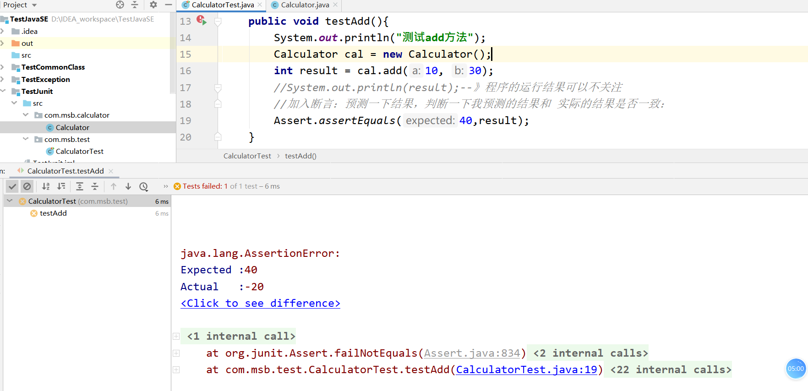


## @Before_@After

@Before:

某一个方法中，加入了@Before注解以后，那么这个方法中的功能会在测试方法执行前先执行

一般会在@Beforer修饰的那个方法中加入：加入一些申请资源的代码：申请数据库资源，申请IO资源，申请网络资源。。。

@After:

某一个方法中，加入了@After注解以后，那么这个方法中的功能会在测试方法执行后先执行

一般会在@After修饰的那个方法中加入：加入释放资源的代码：释放数据库资源，释放IO资源，释放网络资源。。。

代码：

```java
public class CalculatorTest {
    @Before
    public void init(){
        System.out.println("方法执行开始了。。。");
    }
    @After
    public void close(){
        System.out.println("方法执行结束了。。。");
    }
    //测试add方法
    @Test
    public void testAdd(){
        System.out.println("测试add方法");
        Calculator cal = new Calculator();
        int result = cal.add(10, 30);
        //System.out.println(result);--》程序的运行结果可以不关注
        //加入断言：预测一下结果，判断一下我预测的结果和 实际的结果是否一致：
        Assert.assertEquals(40,result);//第一个参数：预测结果 第二个参数：实际结果
    }

    //测试sub方法
    @Test
    public void testSub(){
        System.out.println("测试sub方法");
        Calculator cal = new Calculator();
        int result = cal.sub(10, 30);
        System.out.println(result);
    }
}


```

# 注解

## 引入

【1】历史：

JDK5.0 新增 --- 注解（Annotation）,也叫元数据

【2】什么是注解？

注解其实就是代码里的特殊标记，这些标记可以在编译,类加载,运行时被读取,并执行相应的处理。通过使用注解,程序员可以在不改变原有逻辑的情况下，在源文件中嵌入一些补充信息。代码分析工具、开发工具和部署工具可以通过这些补充信息进行验证或者进行部署。

使用注解时要在其前面增加@符号,并把该注解当成一个修饰符使用。用于修饰它支持的程序元素。

【3】注解的重要性：

Annotation 可以像修饰符一样被使用，可用于修饰包，类，构造器,方法，成员变量,参数，局部变量的声明，这些信息被保存在Annotation的"name=value"对中。在JavaSE中，注解的使用目的比较简单，例如标记过时的功能，忽略警告等。在JavaEE/ArIdroid中注解占据了更重要的角色，例如用来配置应用程序的任何切面，代替JavaEE旧版中所遗留的繁冗代码和XML配置等。未来的开发模式都是基于注解的，JPA(java的持久化API)是基于注解的，Spring2.5以. E都是基于注解的，Hibernate3.x以后也是基于注解的，现在的Struts2有一部分也是基于注解的了，注解是一种趋势，一定程度上可以说 ：框架=注解+反射+设计模式。

## 注解的使用实例

### Junit的注解

@Test

@Before

@After

代码：

```java


 public class CalculatorTest {
 @Before
 public void init(){
 System.out.println("方法执行开始了。。。");
 }
 @After
 public void close(){
 System.out.println("方法执行结束了。。。");
 }
 @Test
 public void testAdd(){
 System.out.println("测试add方法");
 Calculator cal = new Calculator();
 int result = cal.add(10, 30);
 Assert.assertEquals(40,result);//第一个参数：预测结果 第二个参数：实际结果
 }
 }
```


### 文档相关的注解

说明注释允许你在程序中嵌入关于程序的信息。你可以使用 javadoc 工具软件来生成信息，并输出到HTML文件中。

说明注释，使你更加方便的记录你的程序信息。

文档注解我们一般使用在文档注释中，配合javadoc工具

javadoc 工具软件识别以下标签：

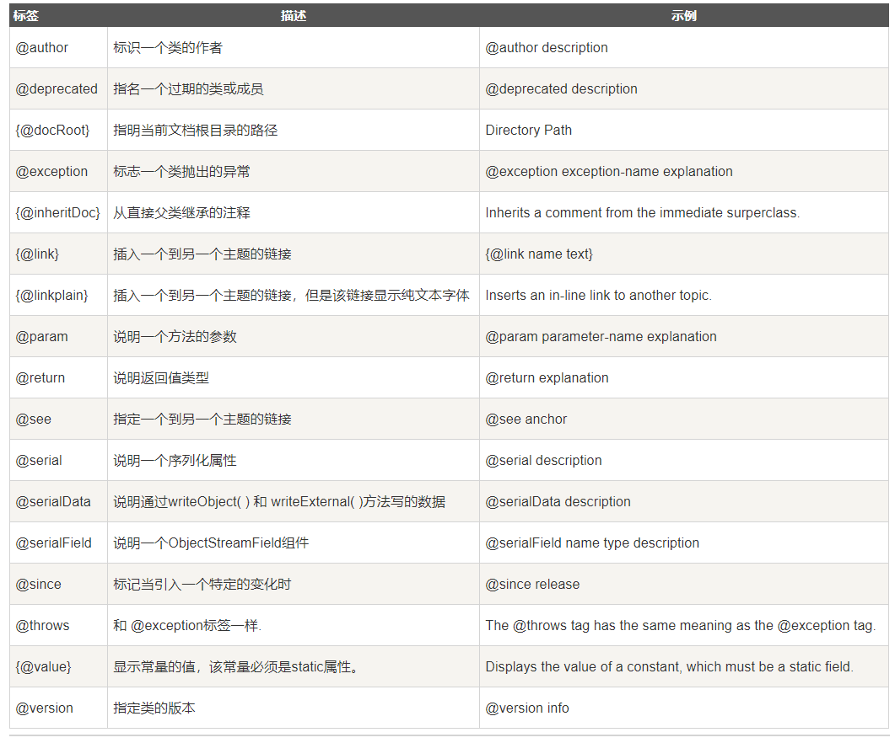


其中注意：

Ø @param @return和@exception这三个标记都是只用于方法的。

Ø @param的格式要求: @param 形参名 形参类型 形参说明

Ø @return的格式要求: @return 返回值类型返回值说明，如果方法的返回值类型是void就不能写

Ø @exception的格式要求: @exception 异常类型异常说明

Ø @param和@exception可以并列多个

代码：

```java
public class Person {
    /**
 * 下面是eat方法，实现了XXX功能。
 * @param num1 就餐人数
 * @param num2 点了几个菜
 */
    public void eat(int num1,int num2){

    }

    /\*\*
        \* @param age 年龄
        \* @return int
        \* @exception RuntimeException 当年龄过大的时候
        \* @exception IndexOutOfBoundsException 当年龄过小的时候
        \* @see Student
        \*/
        public int sleep(int age){
        new Student();
        if(age\>100){
            throw new RuntimeException();
        }
        if(age\<0){
            throw new IndexOutOfBoundsException();
        }
        return 10;
    }
}

```

IDEA中的javadoc使用：

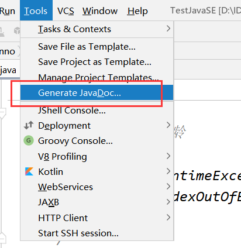


防止乱码：

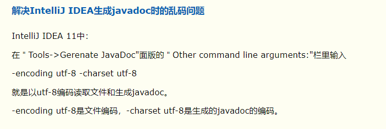


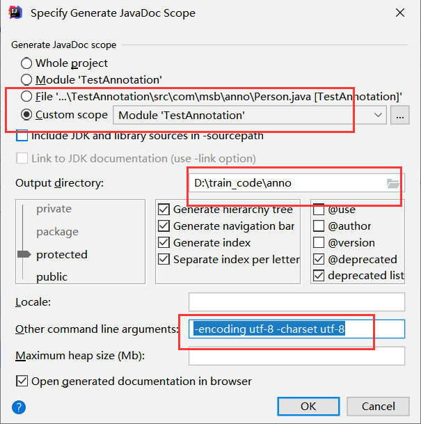


### JDK内置的3个注解

@Override:限定重写父类方法，该注解只能用于方法

```java

```

| ------------------------------------------------------------ |

```java

```

@Deprecated:用于表示所修饰的元素(类,方法，构造器，属性等)已过时。通常是因为所修饰的结构危险或存在更好的选择

```java
public class Student extends Person {
    /\*
        @Override的作用：限定重写的方法，只要重写方法有问题，就有错误提示。
        \*/
        @Override
        public void eat(){
        System.out.println("子类eat..");
    }
    /\*
        在方法前加入@Deprecated，这个方法就会变成一个废弃方法/过期方法/过时方法
        \*/

        @Deprecated
        public void study(){
        System.out.println("学习。。");
    }
}

```

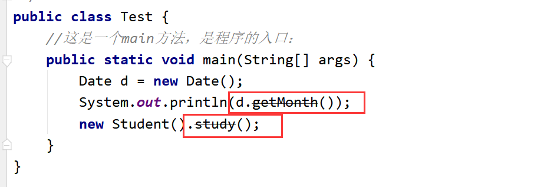


@SuppressWarnings:抑制编译器警告

```java
public class Test02 {
    //这是一个main方法，是程序的入口：
    public static void main(String[] args) {
        @SuppressWarnings("unused")
        int age = 10;

        int num = 10;
        System.out.println(num);
        @SuppressWarnings({"unused","rwatypes"})
        ArrayList al = new ArrayList();
    }
}

```


### 实现替代配置文件功能的注解

在servlet3.0之前的配置：

| \<?xml version="1.0" encoding="UTF-8"?\>  \<web-app xmlns="http://xmlns.jcp.org/xml/ns/javaee"   xmlns:xsi="http://www.w3.org/2001/XMLSchema-instance"   xsi:schemaLocation="http://xmlns.jcp.org/xml/ns/javaee http://xmlns.jcp.org/xml/ns/javaee/web-app_4_0.xsd"   version="4.0"\>   \<!--配置Servlet--\>   \<!--配置Servlet的信息--\>   \<servlet\>   \<servlet-name\>HelloServlet\</servlet-name\>   \<servlet-class\>com.bjsxt.servlet.HelloServlet\</servlet-class\>   \</servlet\>   \<!--配置Servlet的映射路径--\>   \<servlet-mapping\>   \<servlet-name\>HelloServlet\</servlet-name\>   \<!--http://localhost:8080/01-hello-servlet/hello--\>   \<url-pattern\>/hello\</url-pattern\>   \</servlet-mapping\>  \</web-app\>  |
|-----------------------------------------------------------------------------------------------------------------------------------------------------------------------------------------------------------------------------------------------------------------------------------------------------------------------------------------------------------------------------------------------------------------------------------------------------------------------------------------------------------------------------------------------------------------------------------------------------------------------------------------------------------------------------------------------------------------------------------------|

在servlet3.0之后使用注解：替代配置文件。

```java

```

|--------------------------------------------------------------------------------------------------------------------------------------------------------------------------------------------------------------------------------------------------------------------------------------------------------------------------------------------------------------------------------------------------------------------------------------------------------------------------------------------------------------------------------------------------------------------------------------------------------------------------------------------------------------------------------------------------------------------------------------------------------------------------------------------|

## 自定义注解

【1】自定义注解使用很少，一般情况下都是用现成的注解。

【2】如何自定义注解：

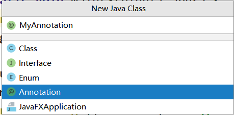


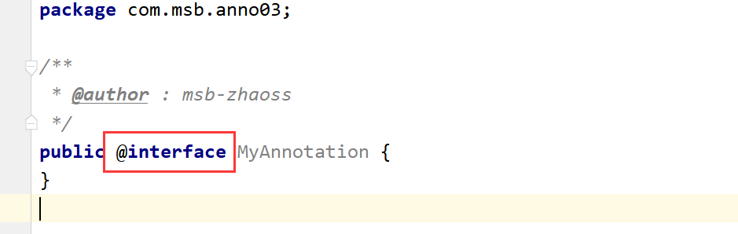


发现定义的注解的声明使用的关键字：[@interface](file:///D:\下载\@interface)，跟接口没有一点关系。

【3】注解的内部：

以[@SuppressWarnings](file:///D:\下载\@SuppressWarnings)为例，发现内部：

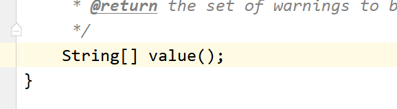


这value是属性还是方法？

答案：看上去是无参数方法，实际上理解为一个成员变量，一个属性

无参数方法名字--》成员变量的名字

无参数方法的返回值--》成员变量的类型

这个参数叫 配置参数

无参数方法的类型：基本数据类型（八种），String，枚举，注解类型，还可以是以上类型对应的数组。

PS：注意：如果只有一个成员变量的话，名字尽量叫value。

【4】使用注解：

（1）使用注解的话，如果你定义了配置参数，就必须给配置参数进行赋值操作：

```java
@MyAnnotation(value={"abc","def","hij"})
public class Person {
 }

```

（2）如果只有一个参数，并且这个参数的名字为value的话，那么value=可以省略不写。

```java
@MyAnnotation({"abc","def","hij"})
public class Person {
 }

```

（3）如果你给配置参数设置默认的值了，那么使用的时候可以无需传值：

1.  public @interface MyAnnotation2 {
2.  String value() default "abc";
3.  }

使用：

```java
@MyAnnotation2
@MyAnnotation({"abc","def","hij"})
public class Person {
    
 }

```

（4）一个注解的内部是可以不定义配置参数的：

```java
  public @interface MyAnnotation3 {
  }
```


内部没有定义配置参数的注解--》可以叫做标记

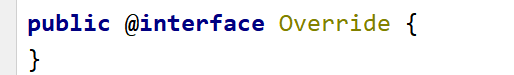


内部定义配置参数的注解--》元数据

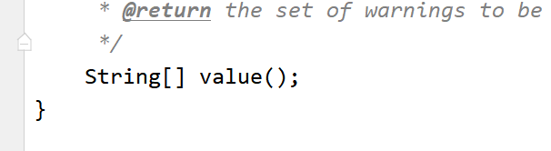


【5】注解的使用：

现在只学习注解的大致技能点，具体怎么应用 后面慢慢学习。

## 元注解

元注解是用于修饰其它注解的注解。

举例：

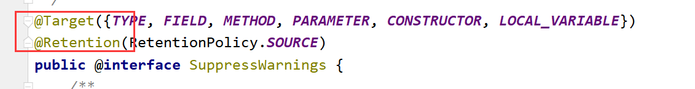


JDK5.0提供了四种元注解：Retention, Target, Documented, Inherited

### Retention

@Retention:用于修饰注解，用于指定修饰的那个注解的生命周期，@Rentention包含一个RetentionPolicy枚举类型的成员变量,使用@Rentention时必须为该value成员变量指定值:

➢RetentionPolicy.SOURCE:在源文件中有效(即源文件保留),编译器直接丢弃这种策略的注释，在.class文件中不会保留注解信息

案例：

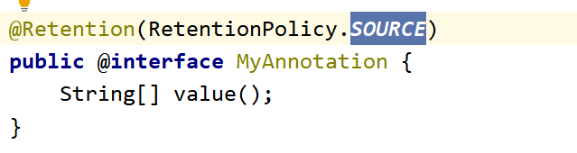


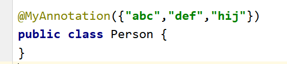


反编译查看字节码文件：发现字节码文件中没有MyAnnotation这个注解：

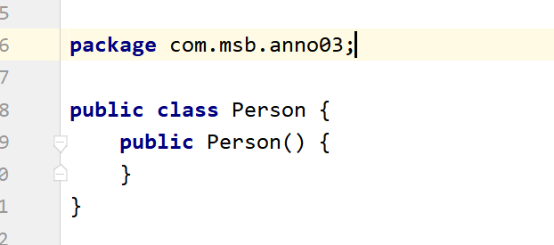


➢RetentionPolicy.CLASS:在class文件中有效(即class保留)，保留在.class文件中，但是当运行Java程序时，他就不会继续加载了，不会保留在内存中，JVM不会保留注解。如果注解没有加Retention元注解，那么相当于默认的注解就是这种状态。

案例：

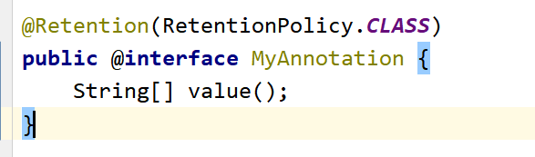


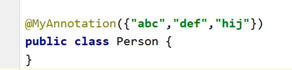


反编译看字节码文件，字节码文件中带有MyAnnotation注解：

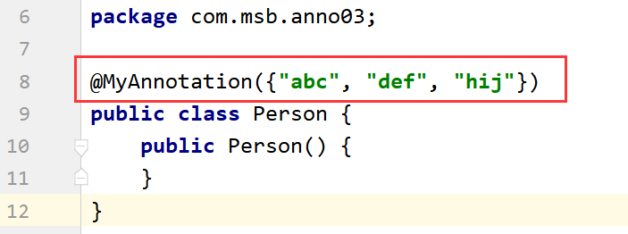


➢RetentionPolicy.RUNTIME:在运行时有效(即运行时保留),当运行 Java程序时，JVM会保留注释，加载在内存中了，那么程序可以通过反射获取该注释。

### Target

用于修饰注解的注解，用于指定被修饰的注解能用于修饰哪些程序元素。@Target也包含一个名为value的成员变量。

案例：

```java
@Target({TYPE,CONSTRUCTOR,METHOD})
public @interface MyAnnotation4 {
}
```


使用：

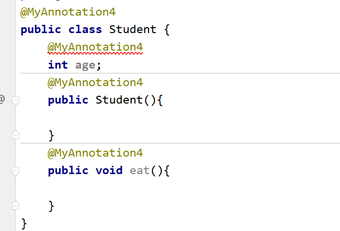


### Documented（很少）

用于指定被该元注解修饰的注解类将被javadoc工具提取成文档。默认情况下，javadoc是 不包括注解的，但是加上了这个注解生成的文档中就会带着注解了

案例：

如果：Documented注解修饰了Deprecated注解，

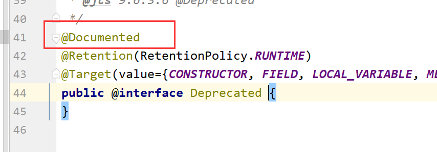


那么Deprecated注解就会在javadoc提取的时候，提取到API中：

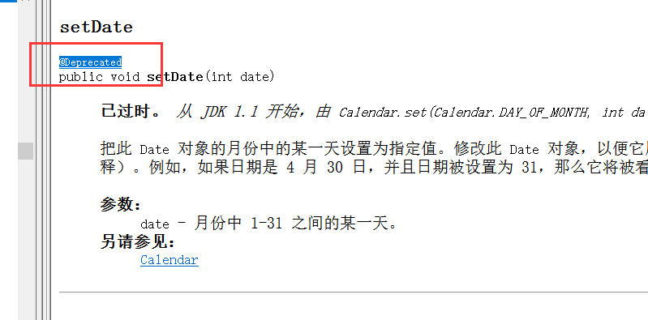


### Inherited（极少）

被它修饰的Annotation将具有继承性。如果某个类使用了被

@Inherited修饰的Annotation,则其子类将自动具有该注解。

案例：

注解：如果MyAnno注解使用了@Inherited之后，就具备了继承性，那么相当于子类Student也使用了这个MyAnno

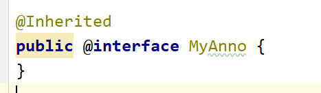


父类：  
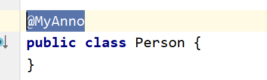


子类：

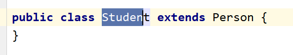


# 枚举

## 引入

【1】数学：枚举法：

1\<x\<4

2\<y\<5

求x+y=6

枚举法：一枚一枚的列举出来。前提：有限，确定

【2】在java中，类的对象是有限个，确定的。这个类我们可以定义为枚举类。

举例：

星期：一二三四五六日

性别：男女

季节：春夏秋冬

【3】自定义枚举类：（JDK1.5之前自定义枚举类）

2.  
3.  /\*\*
4.  \* @author : msb-zhaoss
5.  \* 定义枚举类：季节
6.  \*/

```java
public class Season {
    //属性：
    private final String seasonName ;//季节名字
    private final String seasonDesc ;//季节描述
    //利用构造器对属性进行赋值操作：
    //构造器私有化，外界不能调用这个构造器，只能Season内部自己调用
    private Season(String seasonName,String seasonDesc){
        this.seasonName = seasonName;
        this.seasonDesc = seasonDesc;
    }

    //提供枚举类的有限的 确定的对象：
    public static final Season SPRING = new Season("春天","春暖花开");
    public static final Season SUMMER = new Season("夏天","烈日炎炎");
    public static final Season AUTUMN = new Season("秋天","硕果累累");
    public static final Season WINTER = new Season("冬天","冰天雪地");

    //额外因素：

    public String getSeasonName() {
        return seasonName;
    }

    public String getSeasonDesc() {
        return seasonDesc;
    }

    //toString();

    @Override
    public String toString() {
        return "Season{" +
            "seasonName='" + seasonName + '\\'' +
            ", seasonDesc='" + seasonDesc + '\\'' +
            '}';
    }
}


```

测试类：

```java
public class TestSeason {
    //这是一个main方法，是程序的入口：
    public static void main(String[] args) {
        Season summer = Season.SUMMER;
        System.out.println(summer/\*.toString()\*/);
        System.out.println(summer.getSeasonName());
    }
}

```

## JDK1_5之后使用enum关键字来创建枚举类

JDK1.5以后使用enum关键字创建枚举类：

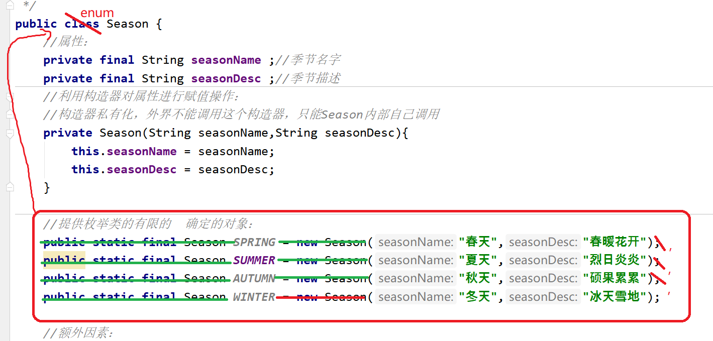


变为下面的枚举类：

```java
public enum Season {
    //提供枚举类的有限的 确定的对象：---\>enum枚举类要求对象（常量）必须放在最开始位置
    //多个对象之间用，进行连接，最后一个对象后面用;结束
    SPRING("春天","春暖花开"),
    SUMMER("夏天","烈日炎炎"),
    AUTUMN("秋天","硕果累累"),
    WINTER("冬天","冰天雪地");
    //属性：
    private final String seasonName ;//季节名字
    private final String seasonDesc ;//季节描述
    //利用构造器对属性进行赋值操作：
    //构造器私有化，外界不能调用这个构造器，只能Season内部自己调用
    private Season(String seasonName, String seasonDesc){
        this.seasonName = seasonName;
        this.seasonDesc = seasonDesc;
    }


    //额外因素：

    public String getSeasonName() {
        return seasonName;
    }

    public String getSeasonDesc() {
        return seasonDesc;
    }

    //toString();

    @Override
    public String toString() {
        return "Season{" +
            "seasonName='" + seasonName + '\\'' +
            ", seasonDesc='" + seasonDesc + '\\'' +
            '}';
    }
}

```


使用枚举类：

```java
public class TestSeason {
    //这是一个main方法，是程序的入口：
    public static void main(String[] args) {
        Season winter = Season.WINTER;
        System.out.println(winter);
        //enum关键字对应的枚举类的上层父类是 ：java.lang.Enum
        //但是我们自定义的枚举类的上层父类：Object
        System.out.println(Season.class.getSuperclass().getName());//java.lang.Enum
    }
}


```

在源码中经常看到别人定义的枚举类形态：

```java
public enum Season {
    SPRING,
    SUMMER,
    AUTUMN,
    WINTER;
}
```


为什么这么简单：因为这个枚举类底层没有属性，属性，构造器，toString，get方法都删掉不写了，然后案例来说应该

写为：SPRING() 现在连（）可以省略 就变成 SPRING

看到的形态就剩：常量名（对象名）

案例：Thread中的枚举类：State

```java

public enum State {
    /\*\*
        \* Thread state for a thread which has not yet started.
            \*/
            NEW,

    /\*\*
        \* Thread state for a runnable thread. A thread in the runnable
            \* state is executing in the Java virtual machine but it may
            \* be waiting for other resources from the operating system
                \* such as processor.
                \*/
                RUNNABLE,

    /\*\*
        \* Thread state for a thread blocked waiting for a monitor lock.
            \* A thread in the blocked state is waiting for a monitor lock
                \* to enter a synchronized block/method or
                \* reenter a synchronized block/method after calling
                \* {@link Object\#wait() Object.wait}.
                \*/
                BLOCKED,

    /\*\*
        \* Thread state for a waiting thread.
            \* A thread is in the waiting state due to calling one of the
            \* following methods:
    \* \<ul\>
        \* \<li\>{@link Object\#wait() Object.wait} with no timeout\</li\>
        \* \<li\>{@link \#join() Thread.join} with no timeout\</li\>
        \* \<li\>{@link LockSupport\#park() LockSupport.park}\</li\>
        \* \</ul\>
        \*
        \* \<p\>A thread in the waiting state is waiting for another thread to
            \* perform a particular action.
            \*
            \* For example, a thread that has called \<tt\>Object.wait()\</tt\>
            \* on an object is waiting for another thread to call
                \* \<tt\>Object.notify()\</tt\> or \<tt\>Object.notifyAll()\</tt\> on
                \* that object. A thread that has called \<tt\>Thread.join()\</tt\>
                \* is waiting for a specified thread to terminate.
                    \*/
                    WAITING,

    /\*\*
        \* Thread state for a waiting thread with a specified waiting time.
            \* A thread is in the timed waiting state due to calling one of
            \* the following methods with a specified positive waiting time:
    \* \<ul\>
        \* \<li\>{@link \#sleep Thread.sleep}\</li\>
        \* \<li\>{@link Object\#wait(long) Object.wait} with timeout\</li\>
        \* \<li\>{@link \#join(long) Thread.join} with timeout\</li\>
        \* \<li\>{@link LockSupport\#parkNanos LockSupport.parkNanos}\</li\>
        \* \<li\>{@link LockSupport\#parkUntil LockSupport.parkUntil}\</li\>
        \* \</ul\>
        \*/
        TIMED_WAITING,

    /\*\*
        \* Thread state for a terminated thread.
            \* The thread has completed execution.
            \*/
            TERMINATED;
}
```


## Enum类的常用方法

```java
public class TestSeason {
    //这是一个main方法，是程序的入口：
    public static void main(String[] args) {
        //用enum关键字创建的Season枚举类上面的父类是：java.lang.Enum,常用方法子类Season可以直接拿过来使用：
        //toString();---\>获取对象的名字
        Season autumn = Season.AUTUMN;
        System.out.println(autumn/\*.toString()\*/);//AUTUMN

        System.out.println("--------------------");
        //values:返回枚举类对象的数组
        Season[] values = Season.values();
        for(Season s:values){
            System.out.println(s/\*.toString()\*/);
        }

        System.out.println("--------------------");
        //valueOf：通过对象名字获取这个枚举对象
        //注意：对象的名字必须传正确，否则抛出异常
        Season autumn1 = Season.valueOf("AUTUMN");
        System.out.println(autumn1);
    }
}


```

## 枚举类实现接口

定义一个接口：

```java
public interface TestInterface {
    void show();
}
```

枚举类实现接口，并且重写show方法：

```java
public enum Season implements TestInterface {
    SPRING,
    SUMMER,
    AUTUMN,
    WINTER;

    @Override
    public void show() {
        System.out.println("这是Season....");
    }
}
```


测试类：

```java
public class Test {
    //这是一个main方法，是程序的入口：
    public static void main(String[] args) {
        Season autumn = Season.AUTUMN;
        autumn.show();
        Season summer = Season.SUMMER;
        summer.show();
    }
}

```

上面发现所有的枚举对象，调用这个show方法的时候走的都是同一个方法，结果都一样：

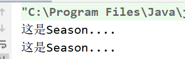


但是现在我想要：不同的对象 调用的show方法也不同：


```java
public enum Season implements TestInterface {
    SPRING{
        @Override
        public void show() {
            System.out.println("这是春天。。。");
        }
    },
    SUMMER{
        @Override
        public void show() {
            System.out.println("这是夏天。。");
        }
    },
    AUTUMN{
        @Override
        public void show() {
            System.out.println("这是秋天");
        }
    },
    WINTER{
        @Override
        public void show() {
            System.out.println("这是冬天");
        }
    };

    /\*@Override
        public void show() {
        System.out.println("这是Season....");
    }\*/
}

```

 


```java

public class Test {
    //这是一个main方法，是程序的入口：
    public static void main(String[] args) {
        Season autumn = Season.AUTUMN;
        autumn.show();
        Season summer = Season.SUMMER;
        summer.show();
    }
}

```

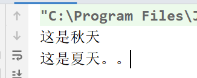


## 实际应用

```java
public class Person {
    //属性：
    private int age;
    private String name;
    private Gender sex;

    public int getAge() {
        return age;
    }

    public void setAge(int age) {
        this.age = age;
    }

    public String getName() {
        return name;
    }

    public void setName(String name) {
        this.name = name;
    }

    public Gender getSex() {
        return sex;
    }

    public void setSex(Gender sex) {
        this.sex = sex;
    }

    @Override
    public String toString() {
        return "Person{" +
            "age=" + age +
            ", name='" + name + '\\'' +
            ", sex='" + sex + '\\'' +
            '}';
    }
}

public enum Gender {
    男,
    女;
}

public class Test {
    //这是一个main方法，是程序的入口：
    public static void main(String[] args) {
        Person p = new Person();
        p.setAge(19);
        p.setName("lili");
        p.setSex(Gender.男);//传入枚举类Gender的对象：--\>在入口处对参数进行了限制
        System.out.println(p);
    }
}


```

还可以通过枚举结合switch处理：

```java
public class Test02 {
    //这是一个main方法，是程序的入口：
    public static void main(String[] args) {
        Gender sex = Gender.男;
        //switch后面的（）中可以传入枚举类型
        //switch后面的（）:int,short,byte,char,String ,枚举
        switch (sex){
            case 女:
                System.out.println("是个女孩");
                break;
            case 男:
                System.out.println("是个男孩");
                break;
        }
    }
}

```
