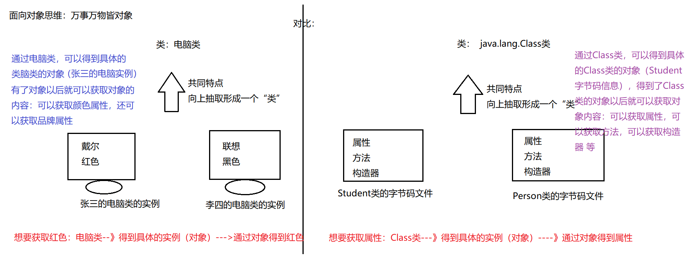

# 通过案例体会反射的好处

案例：美团外卖 ---\>付款 ---》要么用微信支付 要么用支付宝支付

```java
//接口的制定方：美团外卖
public interface Mtwm {
    //在线支付功能：
    void payOnline();
}

public class WeChat implements Mtwm{
    @Override
    public void payOnline() {
        //具体实现微信支付的功能：
        System.out.println("我已经点了外卖，正在使用微信支付");
    }
}
public class AliPay implements Mtwm {
    @Override
    public void payOnline() {
        //具体的支付宝支付：
        System.out.println("我已经点了外卖，我正在使用支付宝进行支付");
    }
}
public class BankCard implements Mtwm{
    @Override
    public void payOnline() {
        System.out.println("我已经定了外卖，我正在用招商银行信用卡支付");
    }
}
```


```java
 public class Test {
 public static void main(String[] args) {
 //定义一个字符串，用来模拟前台的支付方式：
 String str = "微信";
 if("微信".equals(str)){//str.equals("微信")---？避免空指针异常
 //微信支付：
 //new WeChat().payOnline();
 pay(new WeChat());
 }

 if("支付宝".equals(str)){
 //支付宝支付：
 //new AliPay().payOnline();
 pay(new AliPay());
 }

 if("招商银行".equals(str)){
 pay(new BankCard());
 }
 }
 //微信支付
 public static void pay(WeChat wc){
 wc.payOnline();
 }
 //支付宝支付
 public static void pay(AliPay ap){
 ap.payOnline();
 }

 //招商银行支付
 public static void pay(BankCard bc){
 bc.payOnline();
 }
 }
```

为了提高代码的扩展性---》面向对象特性：多态：


```java
public class Test {
    public static void main(String[] args) {
        //定义一个字符串，用来模拟前台的支付方式：
        String str = "微信";
        if("微信".equals(str)){//str.equals("微信")---？避免空指针异常
            //微信支付：
            pay(new WeChat());
        }

        if("支付宝".equals(str)){
            //支付宝支付：
            pay(new AliPay());
        }

        if("招商银行".equals(str)){
            pay(new BankCard());
        }
    }
    //方法形参是接口，具体传入的是接口的实现类的对象---》多态的一种形式
    public static void pay(Mtwm m){
        m.payOnline();
    }
}


```

多态确实可以提高代码的扩展性，但是：扩展性没有达到最好。

怎么没有达到最好：上面的分支，还是需要手动的删除或者添加。

解决办法：反射机制

利用反射实现上述功能：


```java
public class Demo {
    public static void main(String[] args) throws Exception {
        //定义一个字符串，用来模拟前台的支付方式：
        String str = "com.zhaoss.test01.AliPay"; //字符串：实际上：就是微信类的全限定路径

        //下面的代码就是利用反射：
        Class cls = Class.forName(str);//cls--\>Class类具体的对象--》AliPay字节码信息
        Object o = cls.newInstance();
        Method method = cls.getMethod("payOnline");
        method.invoke(o);
    }
}
```


# 通过概念再体会反射

JAVA反射机制是在运行状态中，对于任意一个类，都能够知道这个类的所有属性和方法；对于任意一个对象，

都能够调用它的任意方法和属性；这种动态获取信息以及动态调用对象方法的功能称为java语言的反射机制。

在编译后产生字节码文件的时候，类加载器子系统通过二进制字节流，负责从文件系统加载class文件。

在执行程序（java.exe）时候，将字节码文件读入JVM中---\>这个过程叫做类的加载。然后在内存中对应创建一个java.lang.Class对象--\>这个对象会被放入字节码信息中,这个Class对象,就对应加载那个字节码信息,这个对象将被作为程序访问方法区中的这个类的各种数据的外部接口。

所以：我们可以通过这个对象看到类的结构，这个对象就好像是一面镜子，透过镜子看到类的各种信息，我们形象的称之为反射

这种“看透”class的能力（the ability of the program to examine itself）被称为introspection（内省、内观、反省）。Reflection和introspection是常被并提的两个术语。

说明：在运行期间，如果我们要产生某个类的对象，Java虚拟机(JVM)会检查该类型的Class对象是否已被加载。

如果没有被加载，JVM会根据类的名称找到.class文件并加载它。一旦某个类型的Class对象已被加载到内存，就可以用它来产生该类型的所有对象。

补充:

动态语膏vs静态语言

1、动态语言

是一类在运行时可以改变其结构的语言:例如新的函数、对象、甚至代码可以

被引进，已有的函数可以被删除或是其他结构上的变化。通俗点说就是在运

行时代码可以根据某些条件改变自身结构。

主要动态语言: Object-C、 C\#、JavaScript、 PHP、 Python、 Erlang 。

2、静态语言

与动态语言相对应的，运行时结构不可变的语言就是静态语言。如Java、C、

C++。

所以Java不是动态语言，但Java可以称之为“准动态语言”。即Java有一定的动

态性，我们可以利用反射机制、字节码操作获得类似动态语言的特性。

Java的动态性让编程的时候更加灵活!

Class类的理解




# 提供丰富的类

```java
//作为一个父类
public class Person {
    //属性
    private int age;
    public String name;

    //方法
    private void eat(){
        System.out.println("Person---eat");
    }
    public void sleep(){
        System.out.println("Person---sleep");
    }
}
```

 

```java
//Student作为子类
public class Student extends Person {
    //属性：
    private int sno;//学号
    double height;//身高
    protected double weight;//体重
    public double score;//成绩

    //方法：
    public String showInfo(){
        return "我是一名三好学生";
    }
    private void work(){
        System.out.println("我以后会找工作--》成为码农 程序员 程序猿 程序媛");
    }

    //构造器
    public Student(){
        System.out.println("空参构造器");
    }
    private Student(int sno){
        this.sno = sno;
    }
    Student(int sno,double weight){
        this.sno = sno;
        this.weight = weight;
    }
}
```
 # 获取字节码信息的四种形式


```java

public class Test {
    public static void main(String[] args) throws ClassNotFoundException {
        //案例：以Person的字节码信息为案例
        //方式1：通过getClass()方法获取
        Person p = new Person();
        Class c1 = p.getClass();
        System.out.println(c1);

        //方式2：通过内置class属性：
        Class c2 = Person.class;
        System.out.println(c2);

        System.out.println(c1==c2);

        //注意：方式1和方式2 不常用

        //方式3：--》用的最多：调用Class类提供的静态方法forName
        Class c3 = Class.forName("com.zhaoss.test02.Person");
        //方式4：利用类的加载器(了解技能点)
        ClassLoader loader = Test.class.getClassLoader();
        Class c4 = loader.loadClass("com.zhaoss.test02.Person");
    }
}

```

# 可以作为Class类的实例的种类

Class类的具体的实例：

（1）类：外部类，内部类

（2）接口

（3）注解

（4）数组

（5）基本数据类型

（6）void

验证：

```java


public class Demo {
    public static void main(String[] args) {
        /\*
            Class类的具体的实例：
            （1）类：外部类，内部类
            （2）接口
            （3）注解
            （4）数组
            （5）基本数据类型
            （6）void
            \*/
            Class c1 = Person.class;
        Class c2 = Comparable.class;
        Class c3 = Override.class;

        int[] arr1 = {1,2,3};
        Class c4 = arr1.getClass();
        int[] arr2 = {5,6,7};
        Class c5 = arr2.getClass();
        System.out.println(c4==c5);//结果：true .同一个维度，同一个元素类型,得到的字节码就是同一个

        Class c6 = int.class;
        Class c7 = void.class;
    }
}
```

# 获取运行时类的完整结构

## 补充完善上面提供的丰富的类

1.  //作为一个父类

```java
public class Person implements Serializable {
    //属性
    private int age;
    public String name;

    //方法
    private void eat(){
        System.out.println("Person---eat");
    }
    public void sleep(){
        System.out.println("Person---sleep");
    }
}

```


```java
//Student作为子类
@MyAnnotation(value="hello")
public class Student extends Person implements MyInterface{
    //属性：
    private int sno;//学号
    double height;//身高
    protected double weight;//体重
    public double score;//成绩

    //方法：
    @MyAnnotation(value="himethod")
    public String showInfo(){
        return "我是一名三好学生";
    }
    public String showInfo(int a,int b){
        return "重载方法====我是一名三好学生";
    }
    private void work(){
        System.out.println("我以后会找工作--》成为码农 程序员 程序猿 程序媛");
    }
    void happy(){
        System.out.println("做人最重要的就是开心每一天");
    }
    protected int getSno(){
        return sno;
    }

    //构造器
    public Student(){
        System.out.println("空参构造器");
    }
    private Student(int sno){
        this.sno = sno;
    }
    Student(int sno,double weight){
        this.sno = sno;
        this.weight = weight;
    }
    protected Student(int sno,double height,double weight){
        this.sno = sno;
    }

    @Override
    @MyAnnotation(value="hellomyMethod")
    public void myMethod() {
        System.out.println("我重写了myMethod方法。。");
    }

    @Override
    public String toString() {
        return "Student{" +
            "sno=" + sno +
            ", height=" + height +
            ", weight=" + weight +
            ", score=" + score +
            '}';
    }
}
```

 

```java
/\*
    @Target:定义当前注解能够修饰程序中的哪些元素
        @Retention:定义注解的声明周期
            \*/
@Target({TYPE, FIELD, METHOD, PARAMETER, CONSTRUCTOR, LOCAL_VARIABLE})
            @Retention(RetentionPolicy.RUNTIME)
            public @interface MyAnnotation {
            String value();//属性
        }
```


```java
 public interface MyInterface {//自定义的接口
 //随便定义一个抽象方法：
 void myMethod();
 }
```

## 获取构造器和创建对象


```java
public class Test01 {
    public static void main(String[] args) throws NoSuchMethodException, IllegalAccessException, InvocationTargetException, InstantiationException {
        //获取字节码信息：
        Class cls = Student.class;

        //通过字节码信息可以获取构造器：
        //getConstructors只能获取当前运行时类的被public修饰的构造器
        Constructor[] c1 = cls.getConstructors();
        for(Constructor c:c1){
            System.out.println(c);
        }

        System.out.println("-------------------");
        //getDeclaredConstructors:获取运行时类的全部修饰符的构造器
        Constructor[] c2 = cls.getDeclaredConstructors();
        for(Constructor c:c2){
            System.out.println(c);
        }
        System.out.println("-------------------");
        //获取指定的构造器：
        //得到空构造器
        Constructor con1 = cls.getConstructor();
        System.out.println(con1);

        //得到两个参数的有参构造器：
        Constructor con2 = cls.getConstructor(double.class, double.class);
        System.out.println(con2);

        //得到一个参数的有参构造器：并且是private修饰的
        Constructor con3 = cls.getDeclaredConstructor(int.class);
        System.out.println(con3);

        //有了构造器以后我就可以创建对象：
        Object o1 = con1.newInstance();
        System.out.println(o1);

        Object o2 = con2.newInstance(180.5, 170.6);
        System.out.println(o2);
    }
}
```

 ## 获取属性和对属性进行赋值

```java
public class Test02 {
    public static void main(String[] args) throws NoSuchFieldException, IllegalAccessException, InstantiationException {
        //获取运行时类的字节码信息：
        Class cls = Student.class;
        //获取属性：
        //getFields：获取运行时类和父类中被public修饰的属性
        Field[] fields = cls.getFields();
        for(Field f:fields){
            System.out.println(f);
        }
        System.out.println("---------------------");
        //getDeclaredFields：获取运行时类中的所有属性
        Field[] declaredFields = cls.getDeclaredFields();
        for(Field f:declaredFields){
            System.out.println(f);
        }
        System.out.println("---------------------");
        //获取指定的属性：
        Field score = cls.getField("score");
        System.out.println(score);
        Field sno = cls.getDeclaredField("sno");
        System.out.println(sno);

        System.out.println("---------------------");
        //属性的具体结构：
        //获取修饰符
        /\*int modifiers = sno.getModifiers();
        System.out.println(modifiers);
        System.out.println(Modifier.toString(modifiers));\*/
            System.out.println(Modifier.toString(sno.getModifiers()));
        //获取属性的数据类型：
        Class clazz = sno.getType();
        System.out.println(clazz.getName());

        //获取属性的名字：
        String name = sno.getName();
        System.out.println(name);
        System.out.println("-------------------------------");
        //给属性赋值：(给属性设置值，必须要有对象)
        Field sco = cls.getField("score");
        Object obj = cls.newInstance();
        sco.set(obj,98);//给obj这个对象的score属性设置具体的值，这个值为98
        System.out.println(obj);
    }
}
```

## 获取方法和调用方法

```java
public class Test03 {
    public static void main(String[] args) throws NoSuchMethodException, IllegalAccessException, InstantiationException, InvocationTargetException {
        //获取字节码信息：
        Class cls = Student.class;
        //获取方法：
        //getMethods:获取运行时类的方法还有所有父类中的方法（被public修饰）
        Method[] methods = cls.getMethods();
        for(Method m:methods){
            System.out.println(m);
        }
        System.out.println("-----------------------");
        //getDeclaredMethods:获取运行时类中的所有方法：
        Method[] declaredMethods = cls.getDeclaredMethods();
        for(Method m:declaredMethods){
            System.out.println(m);
        }
        System.out.println("-----------------------");
        //获取指定的方法：
        Method showInfo1 = cls.getMethod("showInfo");
        System.out.println(showInfo1);
        Method showInfo2 = cls.getMethod("showInfo", int.class, int.class);
        System.out.println(showInfo2);
        Method work = cls.getDeclaredMethod("work",int.class);
        System.out.println(work);
        System.out.println("-----------------------");
        //获取方法的具体结构：
        /\*
            @注解
            修饰符 返回值类型 方法名(参数列表) throws XXXXX{}
        \*/
            //名字：
            System.out.println(work.getName());
        //修饰符：
        int modifiers = work.getModifiers();
        System.out.println(Modifier.toString(modifiers));
        //返回值：
        System.out.println(work.getReturnType());
        //参数列表：
        Class[] parameterTypes = work.getParameterTypes();
        for(Class c:parameterTypes){
            System.out.println(c);
        }

        //获取注解：
        Method myMethod = cls.getMethod("myMethod");
        Annotation[] annotations = myMethod.getAnnotations();
        for(Annotation a:annotations){
            System.out.println(a);
        }

        //获取异常：
        Class[] exceptionTypes = myMethod.getExceptionTypes();
        for(Class c:exceptionTypes){
            System.out.println(c);
        }


        //调用方法：
        Object o = cls.newInstance();
        myMethod.invoke(o);//调用o对象的mymethod方法

        System.out.println(showInfo2.invoke(o,12,45));;

    }
}
```


## 获取类的接口，所在包，注解

```java


public class Test04 {
    public static void main(String[] args) {
        //获取字节码信息：
        Class cls = Student.class;
        //获取运行时类的接口：
        Class[] interfaces = cls.getInterfaces();
        for(Class c:interfaces){
            System.out.println(c);
        }

        //得到父类的接口：
        //先得到父类的字节码信息：
        Class superclass = cls.getSuperclass();

        //得到接口：
        Class[] interfaces1 = superclass.getInterfaces();
        for(Class c:interfaces1){
            System.out.println(c);
        }

        //获取运行时类所在的包：
        Package aPackage = cls.getPackage();
        System.out.println(aPackage);
        System.out.println(aPackage.getName());

        //获取运行类的注解：
        Annotation[] annotations = cls.getAnnotations();
        for(Annotation a:annotations){
            System.out.println(a);
        }

    }
}
```

## 关于反射的面试题

【1】问题1：创建Person的对象，以后用new Person()创建,还是用反射创建？

【2】问题2：反射是否破坏了面向对象的封装性？

