# 标识符

**【1】标识符：读音 biao zhi fu**

**【2】什么是标识符？**

包，类，变量，方法.....等等,只要是起名字的地方,那个**名字**就是标识符

**【3】标识符定义规则：**

1.四个可以（组成部分）：数字，字母，下划线_，美元符号\$

注意：字母概念比较宽泛，指的是英文字母，汉字，日语，俄语......

但是我们一般起名字尽量使用英文字母

2.两个不可以：不可以以数字开头，不可以使用java中的关键字

3.见名知意：增加可读性

**4.大小写敏感**： int a ; int A;

**5.遵照驼峰命名：**

类名：首字母大写，其余遵循驼峰命名

方法名，变量名：首字母小写，其余遵循驼峰命名

包名：全部小写，不遵循驼峰命名

**6.长度无限制，但是不建议太长 asdfasdfasdfasdfasdfasdfasdfasdfasdfasdfasfd**

# 关键字

**关键字：**被JAVA语言赋予了特殊含义，用作专门用途的单词

特点：JAVA中所有关键字都为小写

官网：<https://docs.oracle.com/javase/tutorial/java/nutsandbolts/_keywords.html>

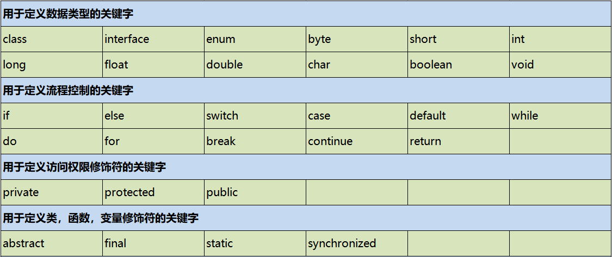


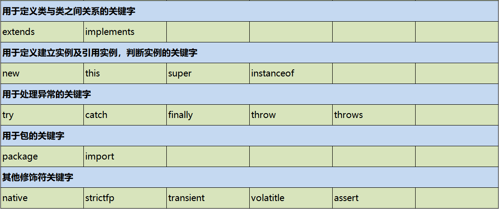


# 变量和常量

举例：

丽丽的年龄：去年17岁，今年18岁，明年19岁

年龄：17--》18---》19 --》值不断变化

年龄---》变量

常量： 17 ， 18 ， 19 ----》 常量中的字面常量

## 字面常量

**常量分为两种：**

常量通常指的是一个固定的值，例如：1、2、3、’a’、’b’、true、false、”helloWorld”等。

在Java语言中，主要是利用关键字final来定义一个常量。 常量一旦被初始化后不能再更改其值。

为了更好的区分和表述，一般将1、2、3、’a’、’b’、true、false、”helloWorld”等称为字面常量，而使用final修饰的PI等称为符号常量（字符常量）。

**字面常量的类型：**

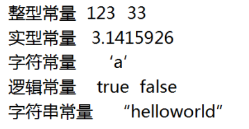


注意：逻辑常量就两个值，一个是true，一个是false

## 变量

变量本质上就是代表一个”可操作的存储空间”，空间位置是确定的，但是里面放置什么值不确定。我们可通过变量名来访问“对应的存储空间”，从而操纵这个“存储空间”存储的值。Java是一种强类型语言，每个变量都必须声明其数据类型。变量的数据类型决定了变量占据存储空间的大小。 比如，int a=3; 表示a变量的空间大小为4个字节。变量作为程序中最基本的存储单元，其要素包括变量名，变量类型和作用域。变量在使用前必须对其声明, 只有在变量声明以后，才能为其分配相应长度的存储空间。

【1】变量声明格式：

type varName [=value][,varName[=value]...]; //[ ]中的内容为可选项，即可有可无

数据类型 变量名 [=初始值] [,变量名 [=初始值]…];

案例：

int age = 19 , age2 = 90 ;

int age,age2;

【2】变量的声明：

（1）如果你只定义一个变量，没有给变量进行赋值的话，那么其实这个变量相当于没有定义：

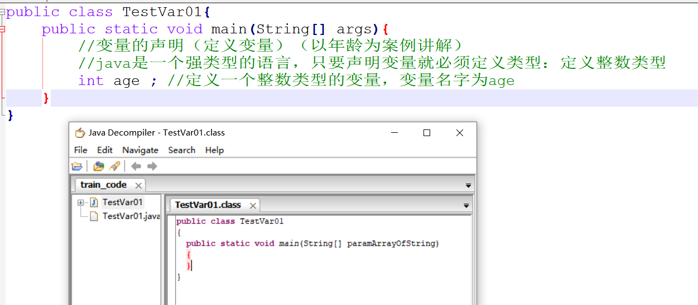


（2）变量如果没有进行赋值的话，那么使用的时候会出错，告诉你：尚未初始化变量：

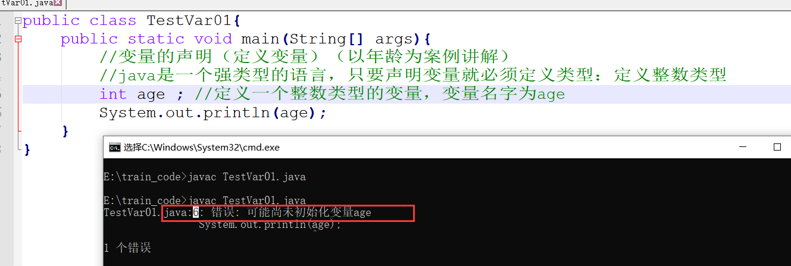


【3】变量的赋值：

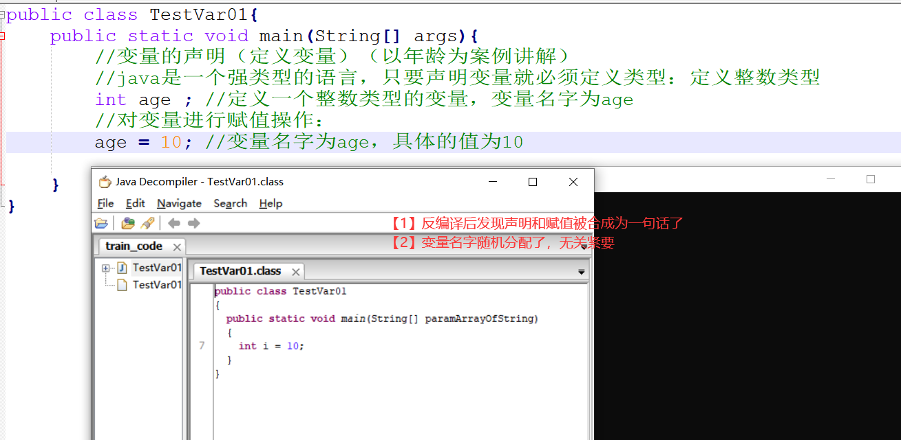


我们自己定义的时候直接就可以用一句话定义：

int age = 10;

变量的值可以更改：

```java
public class TestVar01{
    public static void main(String[] args){
        //变量的声明（定义变量）（以年龄为案例讲解）
        //java是一个强类型的语言，只要声明变量就必须定义类型：定义整数类型
        int age ; //定义一个整数类型的变量，变量名字为age
        //对变量进行赋值操作：
        age = 10; //变量名字为age，具体的值为10
        age = 12;
        age = 20;
        age = age + 4;
        age = 9;
        age = 9;
        System.out.println(age);
        
    }
}
```


变量不可以重复定义：

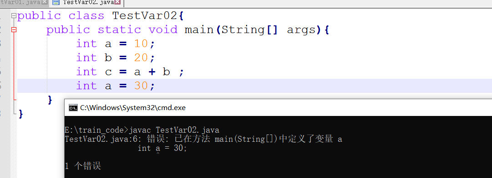


【4】变量的使用：

```java
public class TestVar01{
    public static void main(String[] args){
        //变量的声明（定义变量）（以年龄为案例讲解）
        //java是一个强类型的语言，只要声明变量就必须定义类型：定义整数类型
        int age ; //定义一个整数类型的变量，变量名字为age
        //对变量进行赋值操作：
        age = 10; //变量名字为age，具体的值为10
        age = 12;
        age = 20;
        age = age + 4;
        age = 9;
        age = 9;
        System.out.println(age);
        System.out.println(age-2);
        System.out.println(age+10);
        int num = age + 66;
        System.out.println(num);
        
    }
}
```


扩展：

```java
public class TestVar02{
    public static void main(String[] args){
        int a = 10;
        int b = 20;
        int c = a + b ;
    }
}
```


现在对上述代码进行“反编译过程”“反汇编过程”

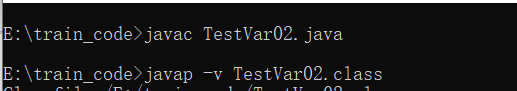


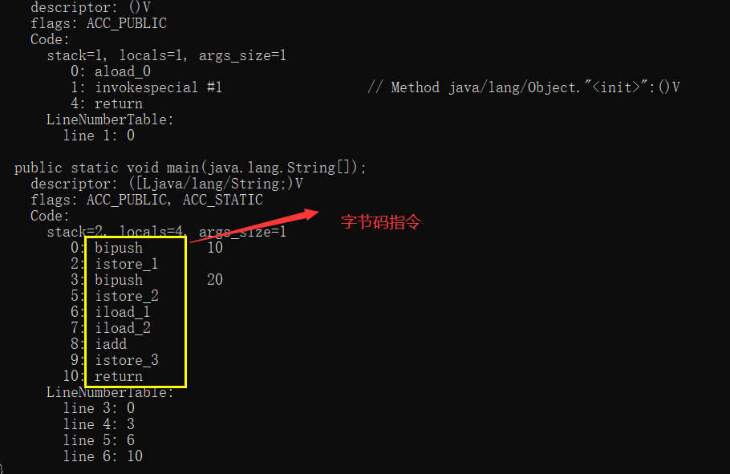


【5】变量的内存：

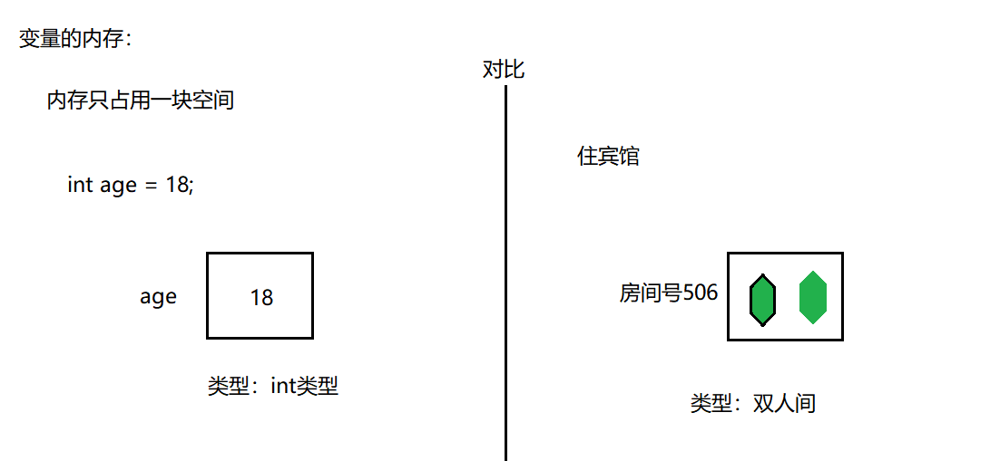


【6】习题：

```java
public class TestVar03{
    public static void main(String[] args){
        int num1 = 10;
        int num2 = 20;
        num1 = num2;
        num2 = num2 + 10;
        num1 = num2 - 10;
        num2 = num1;
        System.out.println("num1="+num1);
        System.out.println("num2="+num2);
    }
}
```


内存分析：

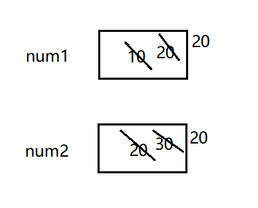


结果：

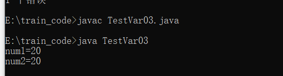


【7】变量的作用域：

作用域指的就是作用范围，变量在什么范围中有效

作用范围就是离它最近的{}

备注：一会我们写的代码，不要去运行，会出错

```java
/\*
    局部变量：定义在方法中
    成员变量：定义在类中，方法外
    \*/
public class TestVar04{
    int b = 20;
    public static void main(String[] args){
        System.out.println(a);//no
        int a = 10;
        System.out.println(a);//yes
        System.out.println(b);//yes
        {
            int c = 40;
            System.out.println(c);//yes
            int a = 50;//属于变量的重复定义
        }
        System.out.println(c);//no
    }

    public void eat(){
        System.out.println(b);//yes
        System.out.println(a);//no
        int a = 30;//不是变量的重复定义
        System.out.println(a);//yes
    }
}
```


# 基本数据类型

Java是一种强类型语言，每个变量都必须声明其数据类型。

Java的数据类型可分为两大类：基本数据类型（primitive data type）和引用数据类型（reference data type）。

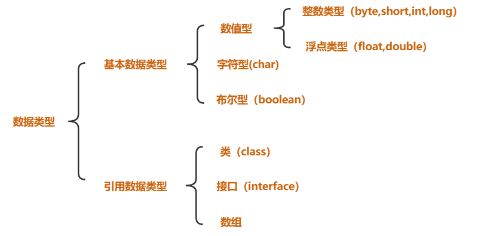


PS:巧妙记忆：除了基本数据类型以外的所有类型都属于引用数据类型，本章重点：基本数据类型

## 整数类型

### 整数类型常量

十进制整数，如：99, -500, 0

八进制整数，要求以 0 开头，如：015

十六进制数，要求 0x 或 0X 开头，如：0x15

二进制：要求0b或者0B开头，如：0b11

几进制：就是逢几进1的问题：

平时实际生活中用的最多的是：十进制

计算机用二进制最多

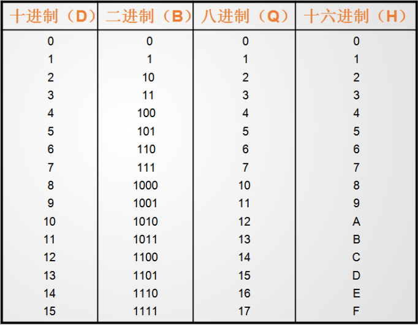


扩展：进制转换问题

【1】二进制转换为十进制：

二进制： 1101

1\*2\^3 + 1\*2\^2 + 0\*2\^1 + 1\*2\^0

= 8 + 4 + 0 + 1

= 13

【2】十进制转换为二进制：

十进制 13

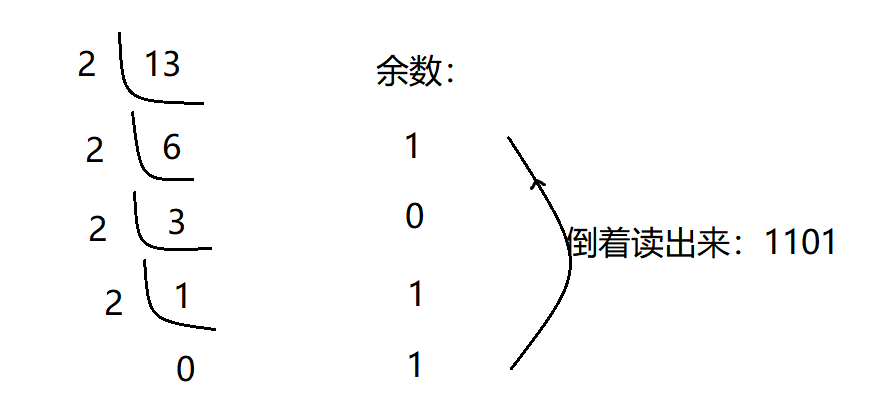


【3】八进制转换十进制：

八进制： 16

1\*8\^1 + 6\*8\^0

= 8 + 6

=14

【4】十进制转换为八进制：

十进制14：

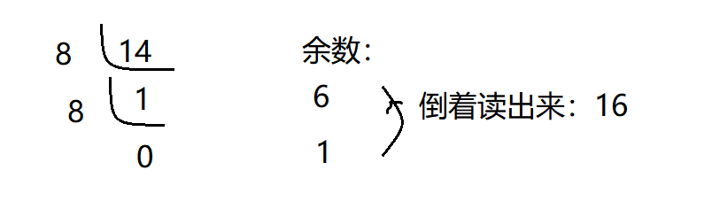


【5】八进制转换为十六进制：

把十进制当做一个中转站：

八进制---》十进制---》十六进制

实际上根本不用自己转换这么麻烦：我们可以直接用系统中提供给我们的计算器：

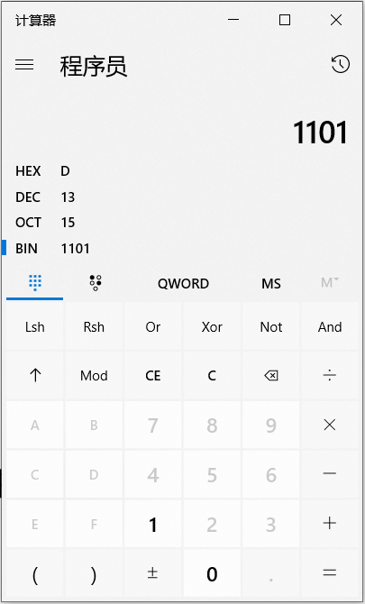


### 整数类型变量

**整型数据类型：**


比如：byte的右侧表数范围127怎么算出来的？

byte: 1字节 = 8位

二进制：01111111

1\*2\^6 + 1\*2\^5 + 1\*2\^4 + 1\*2\^3 + 1\*2\^2 + 1\*2\^1 + 1\*2\^0

= 64 + 32 + 16 +8 +4 + 2 +1

= 127

代码：

```java
public class TestVar05{
    public static void main(String[] args){
        //定义整数类型的变量：
        //给变量赋值的时候，值可以为不同进制的：
        int num1 = 12 ;//默认情况下赋值就是十进制的情况
        System.out.println(num1);
        int num2 = 012;//前面加上0，这个值就是八进制的
        System.out.println(num2);
        int num3 = 0x12;//前面加上0x或者0X，这个值就是十六进制的
        System.out.println(num3);
        int num4 = 0b10;//前面加上0b或者0B,这个值就是二进制的
        System.out.println(num4);
        
        //定义byte类型的变量：
        byte b = 126;//定义了一个byte类型的变量，名字叫b，赋值为12
        System.out.println(b);
        //注意：超范围的赋值会报错。
        short s = 30000;
        System.out.println(s);
        int i = 1234;
        System.out.println(i);
        //整数类型默认就是int类型的，所以12345678910是一个int类型的数，对于int类型来说，它超出范围了
        //要想把一个数给long类型变量，那么后面加上L(推荐)或者l就可以了
        long num5 = 12345678910L;
        System.out.println(num5);
        //注意：只有这个数超出int类型的范围了后面才需要加上L，否则无需加L也可以赋值给long类型：
        long num6 = 12;
        System.out.println(num6);
        
    }
}
```


## 浮点类型

### 浮点类型常量

（1）十进制数形式，例如:

3.14 314.0 0.314

（2）科学记数法形式，如

314e2 314E2 (E的大小写没有区分) 314E-2

double f = 314e2; //314\*10\^2--\>31400.0

double f2 = 314e-2; //314\*10\^(-2)--\>3.14

### 浮点类型变量

float类型又被称作单精度类型，尾数可以精确到7位有效数字，在很多情况下，float类型的精度很难满足需求。

而double表示这种类型的数值精度约是float类型的两倍，又被称作双精度类型，绝大部分应用程序都采用double类型。

float类型的数值有一个后缀F或者f ，没有后缀F/f的浮点数值默认为double类型。

也可以在浮点数值后添加后缀D或者d， 以明确其为double类型。

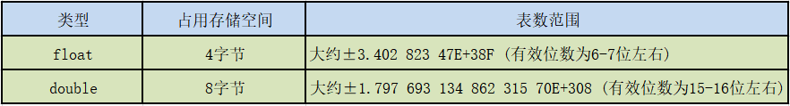


PS：有效数字指的是从左开始第一个不为0的数到最后一个数

代码：

```java
public class TestVar06{
    public static void main(String[] args){
        //浮点类型的常量有两种形式：
        //十进制形式：
        double num1 = 3.14;
        System.out.println(num1);
        //科学计数法形式：
        double num2 = 314E-2;
        System.out.println(num2);
        
        //浮点类型的变量：
        //注意：浮点型默认是double类型的，要想将一个double类型的数赋给float类型，必须后面加上F或者f
        float f1 = 3.14234567898623F;
        System.out.println(f1);
        //注意：double类型后面可以加D或者d，但是一般我们都省略不写
        double d1 = 3.14234567898623D;
        System.out.println(d1);
        
        //注意：我们最好不要进行浮点类型的比较：
        float f2 = 0.3F;
        double d2 = 0.3;
        System.out.println(f2==d2);
        /\*
            区别：
            = 赋值运算： 将等号右侧的值赋给等号左侧
            == 判断==左右两侧的值是否相等 ：结果要么相等 要么不相等
            ==运算符的结果就是要么是true，要么是false
            \*/
            
    }
}
```


## 字符类型

【1】Java中使用单引号来表示字符常量，字符型在内存中占2个字节。

char 类型用来表示在Unicode编码表中的字符。Unicode编码被设计用来处理各种语言的文字，它占2个字节，可允许有65536个字符。

【2】转义字符：

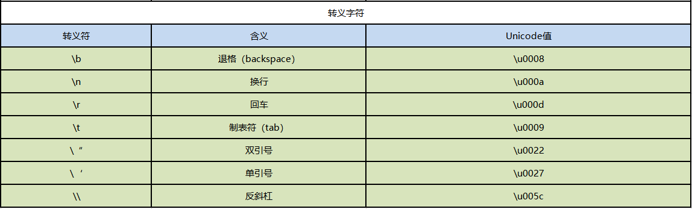


【3】ASCII表：

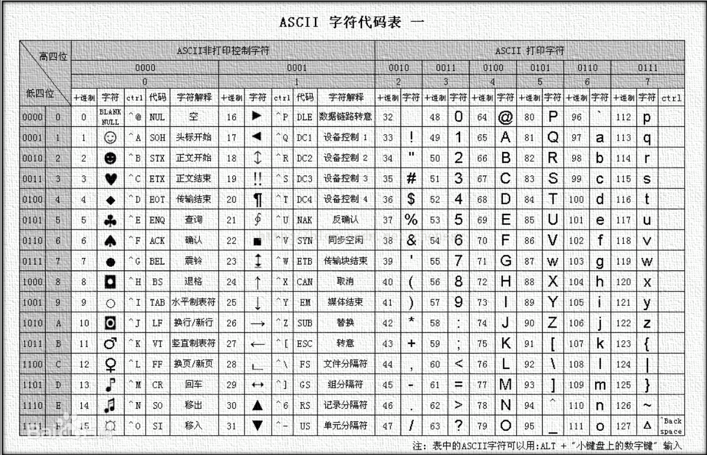


【4】Unicode编码表：

https://www.cnblogs.com/csguo/p/7401874.html

代码1：

```java
public class TestVar07{
    public static void main(String[] args){
        //定义字符类型的变量：
        char ch1 = 'a';
        System.out.println(ch1);
        char ch2 = 'A';
        System.out.println(ch2);
        char ch3 = '4';
        System.out.println(ch3);
        char ch4 = '中';
        System.out.println(ch4);
        char ch5 = '?';
        System.out.println(ch5);
        //java中无论：字母，数字，符号，中文都是字符类型的常量，都占用2个字节。
        char ch6 = ' ';
        System.out.println(ch6);
        //字符类型：单引号引起来的单个字符
        System.out.println("--------------------------------");
        /\*
            转义字符：
            \\将后面的普通字符转换为特殊含义
            \*/
            char ch7 = '\\n';
        System.out.println("aaa"+ch7+"bbb");
        
        System.out.println("aaa\\nbbb");// \\n 换行
        
        System.out.println("aaaaaaa\\tbbb"); // \\t 制表符
        
        System.out.println("aaa\\bbbb");//aabbb \\b 向前退一格
        System.out.println("aaa\\rbbb");//bbb \\r 将光标到本行开头 ：回车
        
        System.out.println("\\"java\\""); // \\" 将双引号原样输出 \\' 将单引号原样输出 \\\\ 将\\原样输出
    }
}
```


代码2：

```java
public class TestVar08{
    public static void main(String[] args){
        char ch1 = 'A';
        System.out.println(ch1);//A
        System.out.println(ch1+90);//155
        System.out.println(155-ch1);//90
        //char类型我们看到的样子就是它本身的字面常量,但是底层在进行计算的时候，实际上是按照一个码进行计算的。
        //这个码就是ASCII
        //之前说char类型是按照Unicode码表进行存储的 (Unicode兼容了ASCII码，Unicode的前128位置ASCII)
        
        char ch2 = '中';
        System.out.println(ch2);// 中
        System.out.println(ch2+90);// 20103
        System.out.println(20103-ch2);// 90
        
        //转换：
        int num1 = (int)ch2;
        System.out.println(num1);//20013
        
        char ch = (char)20013;
        System.out.println(ch);
        
        int num2 = '中';
        char ch5 = 20013;
        System.out.println(ch5);
        
        //面试题：
        char ch6 = '2'+2;
        System.out.println(ch6);//'4'---\>4
    }
}
```


### 编码和字符集

【1】什么是编码？

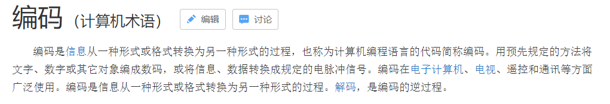


【2】通过生活案例：

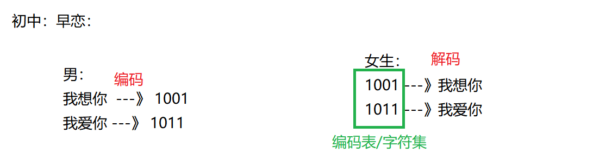


【3】由权威机构形成的编码表才可以称之为：字符集

-   ASCII

英文字符集

用一个字节的7位表示

-   IOS8859-1

西欧字符集

用一个字节的8位表示

-   GB2312

简体中文字符集

最多使用两个字节编码

PS：中文：2个字节

GB2312兼容了ASCII中的字符：

-   GBK

GB2312的升级，加入了繁体字

最多使用两个字节编码

疑问：

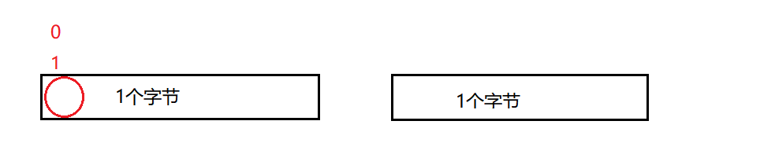


首位如果是0：一个字节代码代表一个字符

首位如果是1：那么一个字节不够，要加上后面的字节才能完整的表示一个字符。

-   Unicode

国际通用字符集，融合了目前人类使用的所有字符。为每个字符分配唯一的字符码。

退出了UTF标准：

三种编码方案： UTF-8，UTF-16,UTF-32

以UTF-8为案例讲解：

中文： 珊 ---》Unicode ： 29642

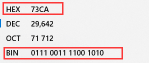


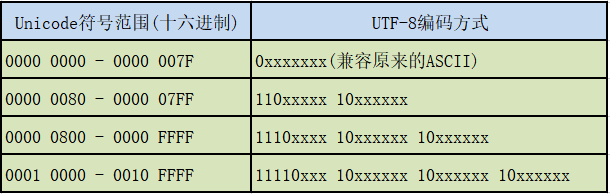


底层存储：


UTF-8标准最多可以用6个字节表示：

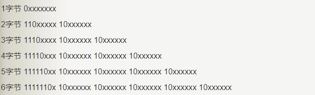


以后我们用的最多的就是UTF-8.

### 解释乱码问题

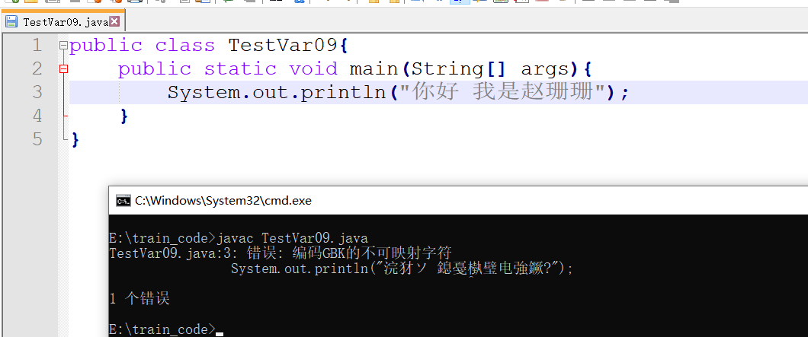


用记事本选择编码方法的时候一般要选择为ANSI---》获取当前操作系统的编码格式：GBK

## 布尔类型

boolean类型有两个常量值，true和false，在内存中占一位（不是一个字节），不可以使用 0 或非 0 的整数替代 true 和 false ，这点和C语言不同。 boolean 类型用来判断逻辑条件，一般用于程序流程控制 。

```java
public class TestVar09{
    public static void main(String[] args){
        //创建一个布尔类型的变量：
        boolean flag1 = true;
        System.out.println(flag1);
        boolean flag2 = false;
        System.out.println(flag2);
        boolean flag3 = 5==9;
        System.out.println(flag3);
        boolean flag4 = 5\<9;
        System.out.println(flag4);
    }
}
```


## 基本数据类型的转换

【1】什么是类型转换：

在赋值运算或者算数运算的时候，要求数据类型一致，就要进行类型的转换。

【2】类型转换的种类：

自动转换，强制转换

【3】内存演示：

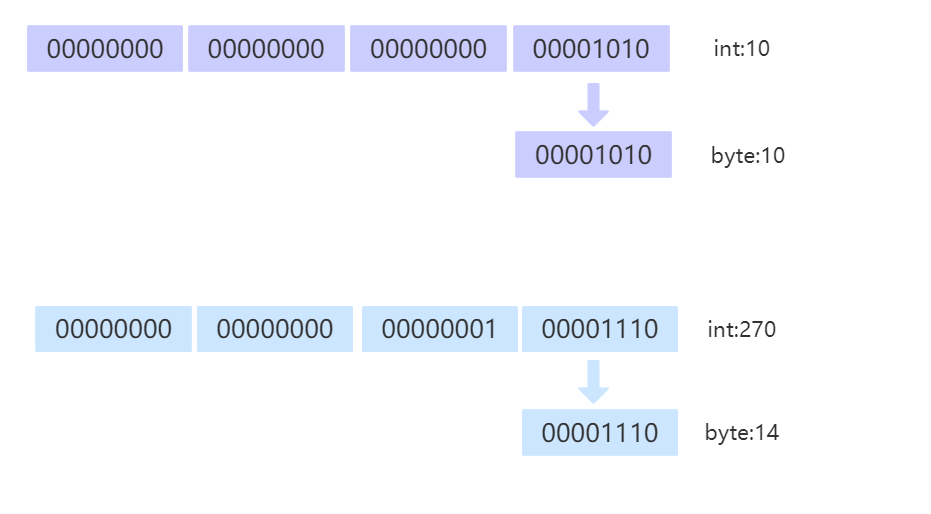


【4】代码：

```java
public class TestVar10{
    public static void main(String[] args){
        //类型转换的两种形式：
        double d = 6;//int--\>double 自动类型转换
        System.out.println(d);
        int i = (int)6.5;//double---\>int 强制类型转换 （强转）
        System.out.println(i);
        
        //在同一个表达式中，有多个数据类型的时候，应该如何处理：
        //多种数据类型参与运算的时候，整数类型，浮点类型，字符类型都可以参与运算，唯独布尔类型不可以参与运算。
        //double d2 = 12+1294L+8.5F+3.81+'a'+true;
        double d2 = 12+1294L+8.5F+3.81+'a';
        System.out.println(d2);
        /\*
            类型级别：(从低到高的)
            byte,short,char--\>int---\>long---\>float---\>double
            级别用来做什么？当一个表达式中有多种数据类型的时候，要找出当前表达式中级别最高的那个类型，然后
            其余的类型都转换为当前表达式中级别最高的类型进行计算。
            double d2 = 12+1294L+8.5F+3.81+'a';
        = 12.0+1294.0+8.5+3.81+97.0
            \*/
            int i2 = (int)(12+1294L+8.5F+3.81+'a');
        System.out.println(i2);
        /\*
            在进行运算的时候：
            左=右 : 直接赋值
                左\<右 ：强转
                左\>右 ：直接自动转换
                \*/
                
                //以下情况属于特殊情形：对于byte，short，char类型来说，只要在他们的表数范围中，赋值的时候就不需要进行
                //强转了直接赋值即可。
                byte b = 12;
        System.out.println(b);
        byte b2 = (byte)270;
        System.out.println(b2);
        
        
        
    }
}
```


## 练习：final，字符常量，Scanner的使用

```java
import java.util.Scanner;//形象理解：在java.util下将Scanner拿过来用
public class TestVar11{
    public static void main(String[] args){
        //实现功能：求圆的周长和面积
        //【1】提取变量：提取变量，就是为了一劳永逸，以后只要改变变量的值，下面只要用到这个变量的地方，取值也都发生变化了
        //【2】一个变量被final修饰，这个变量就变成了一个常量，这个常量的值就不可变了
        // 这个常量就是我们所说的 字符常量 ---》pi
        // 约定俗成的规定：字符常量的名字全部大写
        //【3】使用扫描器：Scanner的使用--》注意通过形象的理解去使用
        final double PI = 3.14;
        //拿来一个扫描器：
        Scanner sc = new Scanner(System.in);
        //给一个友好性的提示：
        System.out.print("请录入一个半径：");
        //让扫描器扫描键盘录入的int类型的数据：
        int r = sc.nextInt();
        
        //求周长：
        double c = 2\*PI\*r;
        System.out.println("周长为："+c);
        
        //求面积：
        //PI = 9.29;报错：TestVar11.java:12: 错误: 无法为最终变量pi分配值
        double s = PI\*r\*r;
        System.out.println("面积为："+s);
        
        
    }
}
```


## 练习：加深对Scanner的使用

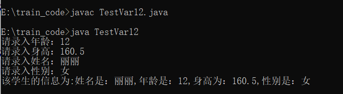


```java
import java.util.Scanner;
public class TestVar12{
    public static void main(String[] args){
        //键盘录入学生的信息：年龄，身高，姓名，性别：
        //键盘录入年龄：(接收int类型数据)
        Scanner sc = new Scanner(System.in);
        System.out.print("请录入年龄：");
        int age = sc.nextInt();
        //键盘录入身高：（接收double类型数据）
        System.out.print("请录入身高：");
        double height = sc.nextDouble();
        //键盘录入姓名：(接收String类型数据--》字符串)
        System.out.print("请录入姓名：");
        String name = sc.next();
        //键盘录入性别：(接受char类型)
        System.out.print("请录入性别：");
        String sexStr = sc.next();
        char sex = sexStr.charAt(0);
        //上面两句可以合为一句表示：char sex = sc.next().charAt(0);
        System.out.println("该学生的信息为:姓名是："+name+",年龄是："+age+",身高为："+height+",性别是："+sex);
    }
}
```

