# Java中的运算符

【1】Java 语言支持如下运算符：

-   算术运算符

\+，-，\*，/，%，++（自增），--（自减）

-   赋值运算符

=

-   扩展赋值运算符

\+=，-=，\*=，/=

-   关系运算符

\>，\<，\>=，\<=，==，!=

-   逻辑运算符

&，\|， &&，\|\|，!，\^

-   位运算符

&，\|，\^，\~ ， \>\>，\<\<，\>\>\> (了解！！！)

-   条件运算符

？：

【2】相关概念辨析

\+ 运算符 操作符 Operator

5+6 表达式 expression

5 6 操作数 Operand

int m =5+6; 语句 Sentence

# 算术运算符

## /和%

【1】/ 除法运算符 ： 表示两个数相除运算

% 取余运算符： 用来求余数的

```java
public class TestOpe01{

    public static void main(String[] args){

        //打印结果：

        System.out.println(12/3);

        System.out.println(12%5);

        System.out.println(12/3.0);

        System.out.println(12%5.0);

    }

}
```


【2】练习：

```java
import java.util.Scanner;

public class TestOpe02{

    public static void main(String[] args){

        //实现功能：任意给出一个四位数，求出每位上的数字并输出

        

        //1.任意给出一个四位数：

        Scanner input = new Scanner(System.in);

        System.out.println("请录入一个四位数：");

        int num = input.nextInt();

        

        

        //2.求出每位上的数字：

        //个位数：

        int num1 = num%10;

        //十位数：

        int num2 = num/10%10;//1234---\>123---\>3

        //百位数：

        int num3 = num/100%10;//1234---\>12---\>2

        //千位数：

        int num4 = num/1000;//1234---\>1

        

        

        //3.输出每位上的数字：

        System.out.println("个位上的数为："+num1);

        System.out.println("十位上的数为："+num2);

        System.out.println("百位上的数为："+num3);

        System.out.println("千位上的数为："+num4);

    }

    

}
```


## +

【1】+的作用：

（1）表示正数

（2）表示相加操作

（3）进行字符串的拼接

【2】代码练习：

```java
public class TestOpe03{

    public static void main(String[] args){

        //表示正数：

        System.out.println(+5);//5

        //相加操作：

        System.out.println(5+6);//11

        System.out.println(5+'6');//59

        //字符串的拼接：

        //规则：+左右两侧的任意一侧有字符串，那么这个加号就是字符串拼接的作用，结果一定是字符串

        int num = 56;

        System.out.println("num="+num);//"num=56" ---\> num=56

        System.out.println(5+6+"7");//11+"7"---\>"117" ---\>117

        System.out.println(5+'6'+"7");//59 +"7"---\>"597" ---\>597

        System.out.println("5"+6+"7");//"56"+"7" ---\>"567"---\>567

        System.out.println("5"+'6'+"7");//"56"+"7"---\>"567"---\>567

        System.out.println("5"+'6'+'7');//"56"+'7'---\>"567"---567

    }

}
```


## ++

【1】++：

```java
public class TestOpe04{

    public static void main(String[] args){

        int a = 5;

        a++;//理解为：相当于 a=a+1 操作

        System.out.println(a);//6

        

        a = 5;

        \++a;//理解为：相当于 a=a+1 操作

        System.out.println(a); //6

        

        //总结：++单独使用的时候，无论放在前还是后，都是加1操作

        

        //将++参与到运算中：

        //规则：看++在前还是在后，如果++在后：先运算，后加1 如果++在前，先加1，后运算

        a = 5;

        int m = a++ + 7;//先运算 m=a+7 再加1： a = a+1

        System.out.println(m);//12

        System.out.println(a);//6

        

        a = 5;

        int n = ++a + 7;//先加1 a=a+1 再运算： n = a+7

        System.out.println(n);//13

        System.out.println(a);//6

    }

}
```


无论这个变量是否参与到运算中去，只要用++运算符，这个变量本身就加1操作

只是说如果变量参与到运算中去的话，对运算结果是产生影响：

看++在前还是在后，如果++在后：先运算，后加1 如果++在前，先加1，后运算

【2】练习：

```java
public class TestOpe05{

    public static void main(String[] args){

        int a = 5;

        System.out.println(a++ + a++);

        System.out.println(a++ + ++a);

        System.out.println(++a + a++);

        System.out.println(++a + ++a);

    }

}
```


运算过程：

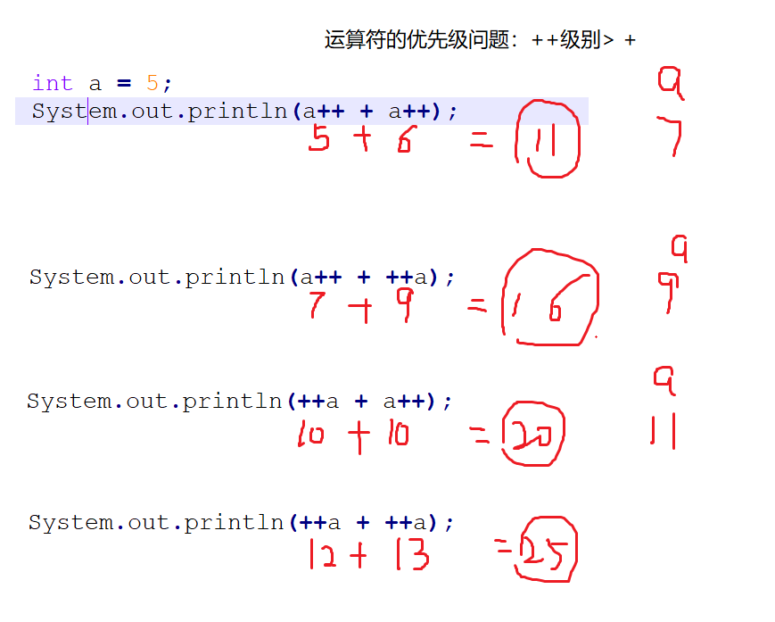


# 赋值运算符

【1】=的作用： 将等号右侧的值赋给等号左侧：

int age = 19;

int age = 10+3+8;

【2】练习：

```java
public class TestOpe06{
    public static void main(String[] args){
        //任意给出两个数，交换两个数并输出：
        //1.给出两个数：
        int num1 = 10;
        int num2 = 20;
        
        //2.输出交换前的两个数：
        System.out.println("交换前："+num1+"\\t"+num2);
        
        //3.交换
        /\*
            错误代码：
            num1 = num2;
        num2 = num1;
        \*/
            //解决办法：
            //引入一个中间变量:
            int t;
        t = num1;
        num1 = num2;
        num2 = t;
        /\*
            int t;
        t = num2;
        num2 = num1;
        num1 = t;
        
        \*/
            
            //4.输出交换后的两个数：
            System.out.println("交换后："+num1+"\\t"+num2);
    }
}
```


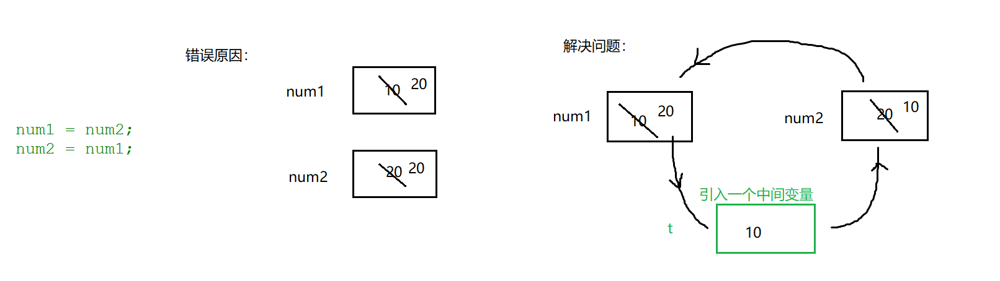


面试题：两个数交换的四种方式：<https://www.cnblogs.com/Brad-Lee/p/5808299.html>


# 扩展赋值运算符

【1】代码：

```java
public class TestOpe07{
    public static void main(String[] args){
        //实现功能：给出三个数，求和：
        //1.给出三个数：
        int num1 = 10;
        int num2 = 20;
        int num3 = 30;
        //2.求和
        //int sum = num1+num2+num3;
        //定义一个变量，用来接收和：
        int sum = 0;
        sum = sum + num1;//等效： sum += num1;
        sum = sum + num2;// sum += num2;
        sum = sum + num3;//sum += num3;
        //3.将和输出：
        System.out.println("和："+sum);
    }
}
```


内存：

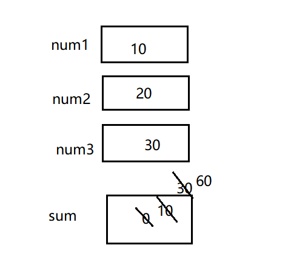


【2】a+=b 和 a=a+b 区别：

（1）a+=b 可读性稍差 编译效率高 底层自动进行类型转换

（2）a=a+b 可读性好 编译效率低 手动进行类型转换

【3】面试题

（1）请问a+=b相当于a=a+b,那么也相当于 a=b+a吗？

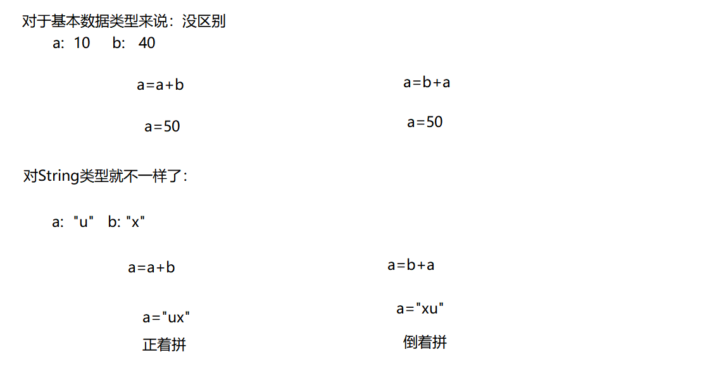


（2）下面的代码哪一句出错： 4

byte a = 10; ---\>1

int b = 20; ---\>2

a+=b; ----\>3

a = a+b ;----\>4

更正： a = (byte)(a+b);

# 关系运算符

```java
public class TestOpe08{
    public static void main(String[] args){
        //\>，\<，\>=，\<=，==，!=
        //关系运算符最终结果：要么是true要么是false
        System.out.println(4\>9);//false
        System.out.println(4\<9);//true
        System.out.println(4\>=9);//false
        System.out.println(4\<=9);//true
        System.out.println(4==9);//false
        System.out.println(4!=9);//true
        System.out.println((5\<9)!=(6==8));//true
    }
}
```


# 逻辑运算符

&，\|， &&，\|\|，!，\^

逻辑运算符：进行逻辑运算的，运算符左右连接的都是 布尔类型的操作数，最终表达式的结果是布尔值：要么是true，要么false

代码：

```java
public class TestOpe09{
    public static void main(String[] args){
        // 逻辑与 ：& 规律：只要有一个操作数是false，那么结果一定是false
        System.out.println(true&true);
        System.out.println(true&false);
        System.out.println(false&false);
        System.out.println(false&true);
        
        // 短路与：&& 规律：效率高一些，只要第一个表达式是false，那么第二个表达式就不用计算了，结果一定是false
        System.out.println(true&&true);
        System.out.println(true&&false);
        System.out.println(false&&false);
        System.out.println(false&&true);
        
        // 逻辑或：\| 规律：只要有一个操作数是true，那么结果一定是true
        System.out.println(true\|true);
        System.out.println(true\|false);
        System.out.println(false\|false);
        System.out.println(false\|true);
        
        // 短路或：\|\| 规律：效率高一些，只要第一个表达式是true，那么第二个表达式就不用计算了，结果一定是true
        System.out.println(true\|\|true);
        System.out.println(true\|\|false);
        System.out.println(false\|\|false);
        System.out.println(false\|\|true);
        
        //逻辑非： ! 规律：相反结果
        System.out.println(!true);//false
        System.out.println(!false);//true
        
        //逻辑异或： \^ 规律：两个操作数相同，结果为false，不相同，结果为true
        System.out.println(true\^true);
        System.out.println(true\^false);
        System.out.println(false\^false);
        System.out.println(false\^true);
    }
}
```


再做一个加深的练习：看代码 说结果：

```java
public class TestOpe10{
    public static void main(String[] args){
        int i=8;
        System.out.println((5\>7)&&(i++==2)); //false
        System.out.println(i); //8


        int a=8;
        System.out.println((5\>7)&(a++==2)); //false
        System.out.println(a); //9


        int m=8;
        System.out.println((5\<7)&&(m++==2)); //false
        System.out.println(m); //9

        int b=2;
        System.out.println((5\<7)&(b++==2)); //true
        System.out.println(b); //3

        int c=2;
        System.out.println((5\<7)&(++c==2)); //false
        System.out.println(c); //3
    }
}

```

# 条件运算符

【1】条件运算符：又称： 三元运算符/三目运算符

【2】格式：

a?b:c

其中a是一个布尔类型的表达式，返回结果要么是true要么false，通过a的结果决定最终表达式的结果:

如果a的结果是true，那么表达式最终结果为b

如果a的结果是false，那么表达式最终结果为c

代码：

```java
public class TestOpe11{
    public static void main(String[] args){
        int num = (5\>7)?6:9 ;
        System.out.println(num);

        String str = (4==4)?"你好":"你不好" ;
        System.out.println(str);

        System.out.println((4==4)?"你好":"你不好");
    }
}

```

练习：

1.  import java.util.\*;//\*代表所有

```java
 public class TestOpe12{
 public static void main(String[] args){
 //实现功能：男孩女孩选择晚饭吃什么，如果意见一致，听男生的，如果意见不一致，听女生的
 
 //1.要让男孩女孩选择晚饭吃什么：
 Scanner sc = new Scanner(System.in);
 System.out.println("请选择今晚吃什么：1.火锅 2.烧烤 3.麻辣烫 4.西餐");
 System.out.println("请男孩选择：");
 int boyChoice = sc.nextInt();
 System.out.println("请女孩选择：");
 int girlChoice = sc.nextInt();
 //2.判断：
 System.out.println(boyChoice==girlChoice?"听男孩的":"听女孩的");
 }
 }

```

PS:三目运算符可以代替后续我们要学习的if-else

# 位运算符(了解)

位运算符：&，\|，\^，\~ ， \>\>，\<\<，\>\>\>

如何区分逻辑运算符和位运算符：

逻辑运算符：左右连接的是布尔类型的操作数

位运算符：左右连接的是具体的数值

【1】\<\< 左移

3\<\<2 = 12

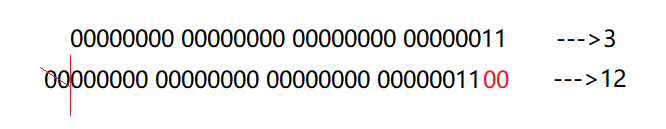


面试题： 4乘以8最快的方式： 4\<\<3

【2】\>\> 有符号右移

6\>\>2 = 1

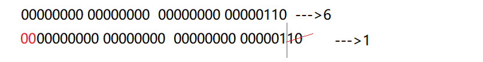


\-6\>\>2 = -2

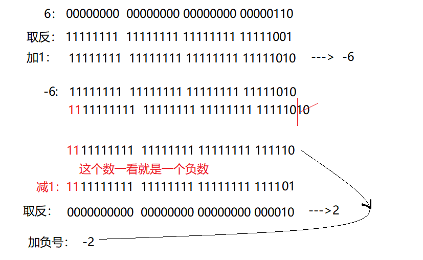


【3】\>\>\> 无符号右移：

6\>\>\>2 = 1

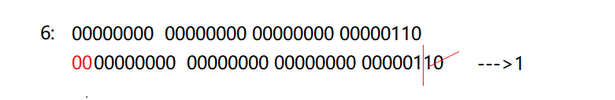


【4】 & 与

6&3 = 2

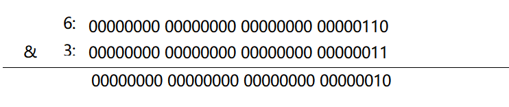


【5】\| 或

6\|3=7

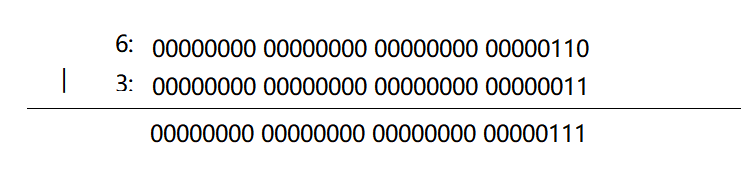


【6】\^异或：

6\^3 = 5

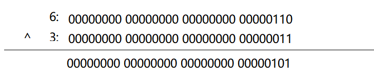


【7】\~反：

\~6 = -7

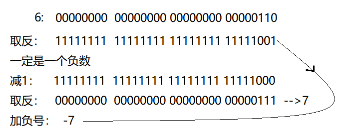


PS：

byte类型的表数范围的 -128是怎么算出来的

127： 01111111

\-128： 10000000

一看就是个负数

减1： 01111111

取反： 10000000 ---》2\^7 = 128

加负号： -128

# 运算符总结

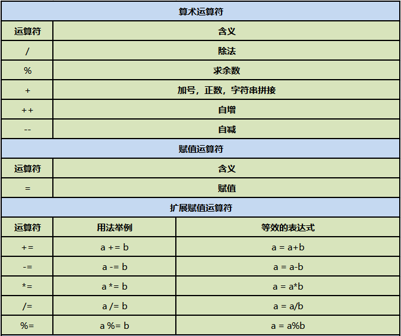


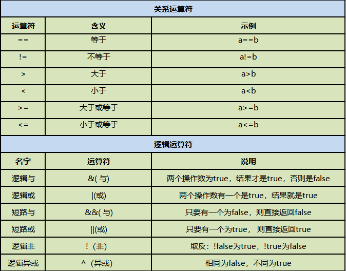


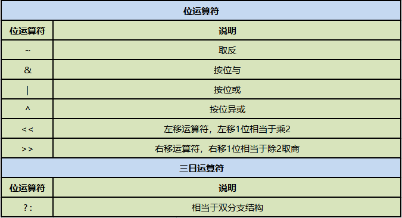


# 运算符的优先级别

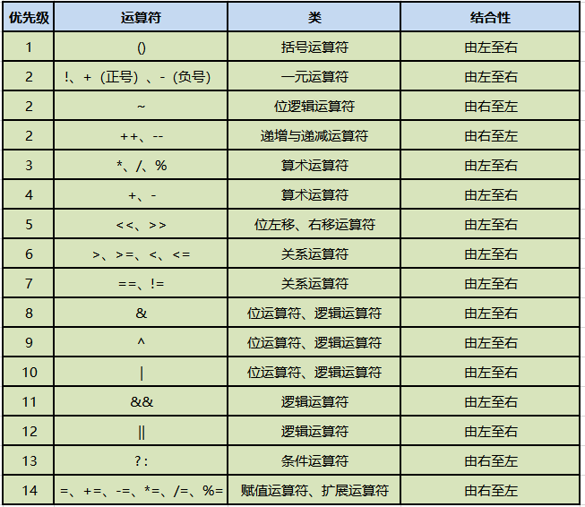


不需要去刻意的记优先级关系

赋值\<三目\<逻辑\<关系\<算术\<单目

理解运算符的结合性

PS:实际开发中我们不会写特别复杂的表达式，你要想先算谁就用()

案例：

5\<6 \| \&apos;A&apos;\>&apos;a&apos; && 12\*6\<=45+23&&!true

=5\<6 \| \&apos;A&apos;\>&apos;a&apos; && 12\*6\<=45+23&&false

= 5\<6 \| \&apos;A&apos;\>&apos;a&apos; &&72\<=68&&false

= true\|false&&false&&false

= true&&false&&false

=false&&false

=false
