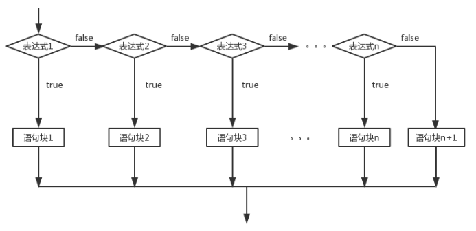
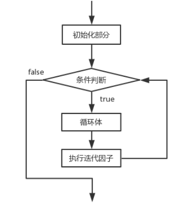
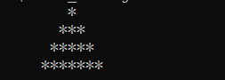

# 第4章_流程控制

# 引入

【1】流程控制的作用：

流程控制语句是用来控制程序中各语句执行顺序的语句，可以把语句组合成能完成一定功能的小逻辑模块。

【2】控制语句的分类：

控制语句分为三类：顺序、选择和循环。

“顺序结构”代表“先执行a，再执行b”的逻辑。

“条件判断结构”代表“如果…，则…”的逻辑。

“循环结构”代表“如果…，则再继续…”的逻辑。

三种流程控制语句就能表示所有的事情！不信，你可以试试拆分你遇到的各种事情。这三种基本逻辑结构是相互支撑的，它们共同构成了算法的基本结构，无论怎样复杂的逻辑结构，都可以通过它们来表达。所以任何一种高级语言都具备上述两种结构。

本章是大家真正进入编程界的“门票”。

【3】流程控制的流程：


# 分支结构(选择结构)

# if

### 单分支

【1】语法结构:

| if(布尔表达式){   语句块  }  |
|------------------------------|

if语句对布尔表达式进行一次判定，若判定为真，则执行{}中的语句块，否则跳过该语句块。流程图如图所示：


【2】代码：

```java
public class TestIf01{
    public static void main(String[] args){
        //实现一个功能：给出三个数（1-6），对三个数求和计算，根据和的大小来分配不同的奖品
        //1.给出三个数：
        int num1 = 6;
        int num2 = 2;
        int num3 = 3;
        //2.求和
        int sum = 0;
        sum += num1;
        sum += num2;
        sum += num3;
        System.out.println("和为："+sum);

        //3.根据和判断奖品：
        //如果和大于等于14，那么就是一等奖
        if(sum\>=14){
            System.out.println("一等奖");
            System.out.println("恭喜你很幸运，中了一等奖");
        }

        if(sum\>=10&&sum\<14){
            System.out.println("二等奖");
        }

        if(sum\>=6&&sum\<10){
            System.out.println("三等奖");
        }

        if(sum\<6){
            System.out.println("四等奖");
        }

        /\*
            if-单分支：
                （1）结构：
                if(条件表达式，这个表达式的结果是布尔值：要么是false，要么是true){
                    //如果上面()中的表达式返回结果是true，那么执行{}中代码
                    //如果上面()中的表达式返回结果是false ，那么不执行{}中代码
                    //PS:{}中的代码是否执行，取决于()中表达式的返回结果
                }
        （2）上面的代码中，我用四个单分支拼凑出四个选择，每个选择是独立的，依次判断执行的
            （3）if后面的()中的条件，要按照自己需求尽量完善
            （4）{}可以省略不写,但是一旦省略，这个if就只负责后面的一句话，所以我们不建议初学者省略
            \*/
    }
}

```

### 多分支

【1】语法结构：

| if(布尔表达式1) {   语句块1;  } else if(布尔表达式2) {   语句块2;  }……  else if(布尔表达式n){   语句块n;  } else {   语句块n+1;  }  |
|-------------------------------------------------------------------------------------------------------------------------------------|

当布尔表达式1为真时，执行语句块1；否则，判断布尔表达式2，当布尔表达式2为真时，执行语句块2；否则，继续判断布尔表达式3······；如果1\~n个布尔表达式均判定为假时，则执行语句块n+1，也就是else部分。流程图如图所示：




【2】数轴分析：


【3】代码：

```java
public class TestIf02{
    public static void main(String[] args){
        //实现一个功能：给出三个数（1-6），对三个数求和计算，根据和的大小来分配不同的奖品
        //1.给出三个数：
        int num1 = 6;
        int num2 = 4;
        int num3 = 2;
        //2.求和
        int sum = 0;
        sum += num1;
        sum += num2;
        sum += num3;
        System.out.println("和为："+sum);

        //3.根据和判断奖品：
        /\*
            利用一个多分支
            【1】结构：
            if(){

            }else if(){

            }else if(){

            }...
                else{

                }
        【2】else:隐藏了一个条件，跟上面分支条件表达式相反的功能 (详见数轴分析)
            【3】多分支：好处：只要满足一个 分支以后，后面的分支就不需要判断了 --》效率高
            【4】我们写代码的时候，尽量保证else的存在--》else分支相当于“兜底”“备胎”的作用，别的分支都不走，就会走这个分支了
            \*/
            if(sum\>=14){
                System.out.println("一等奖");
            }else if(sum\>=10){//隐藏了sum\<14
                System.out.println("二等奖");
            }else if(sum\>=6){//隐藏了sum\<10
                System.out.println("三等奖");
            }else{//隐藏了sum\<6
                System.out.println("四等奖");
            }


    }
}

```

### 双分支

【1】语法结构:

| if(布尔表达式){  语句块1  }else{   语句块2  }  |
|------------------------------------------------|

当布尔表达式为真时，执行语句块1，否则，执行语句块2。也就是else部分。流程图如图所示：


### 随机数

随机数：这个数在生成之前我们不确定这个数是多少，不可知

在java中依靠一个类：Math类帮助我们生成，这个类中有一个方法专门用来生成随机数：


Math.random() -------\> [0.0,1.0)

Math.random()\*6 -----\>[0.0,6.0)

(int)(Math.random()\*6) -----\>[0,5]

(int)(Math.random()\*6) +1 -----\>[1,6]

应用到程序中：

```java
int num1 = (int)(Math.random()\*6) +1;
int num2 = (int)(Math.random()\*6) +1;
int num3 = (int)(Math.random()\*6) +1;
```


练习：

[32,98] - [0,66]+32 - (int)(Math.random()\*67) + 32

### 分支的嵌套使用

分支结构练习1

练习：

会员购物时，不同积分享受的折扣不同，规则如下：


计算会员购物时获得的折扣，效果如下：


本题主要考的是 程序的优化：

```java
import java.util.Scanner;
public class TestIf04{
    public static void main(String[] args){
        //1.给出积分：
        Scanner sc = new Scanner(System.in);
        System.out.print("请输入会员积分：");

        //先判断键盘录入的数据是不是int类型的
        if(sc.hasNextInt()==true){//是int类型数据：
            //将这个int类型的数据接收：
            int score = sc.nextInt();
            //判断这个积分是否是正数：
            if(score\>=0){
                String discount = "";
                //2.根据积分判断折扣：
                if(score\>=8000){
                    discount = "0.6";
                }else if(score\>=4000){
                    discount = "0.7";
                }else if(score\>=2000){
                    discount = "0.8";
                }else{
                    discount = "0.9";
                }
                System.out.println("该会员享受的折扣为："+discount);

            }else{//score\<0
                System.out.println("对不起，你录入的积分是负数！不符合需求！");
            }
        }else{//不是int类型的数据
            System.out.println("你录入的积分不是整数！");
        }

    }
}

```

分支结构练习2

练习：

小朋友搬桌子：

年龄大于7岁，可以搬桌子；

如果年龄大于5岁，性别是男，可以搬桌子；

否则不可以搬动桌子，提示：你还太小了

本题主要考的是：逻辑

方式1：性别用0或者1接收：

```java
import java.util.Scanner;
public class TestIf05{
    public static void main(String[] args){
        //1.录入小朋友的年龄：
        Scanner sc = new Scanner(System.in);
        System.out.println("请录入小朋友的年龄：");
        int age = sc.nextInt();

        //2.根据年龄判断：
        if(age\>=7){
            System.out.println("yes");
        }else if(age\>=5){
            //录入小朋友的性别；
            System.out.println("请录入小朋友的性别：男：1 女 ：0");
            int sex = sc.nextInt();
            if(sex==1){//男生
                System.out.println("yes");
            }else{//女孩
                System.out.println("no");
            }
        }else{//age\<5
            System.out.println("no");
        }
    }
}

```

方式2：性别用男或者女接收：

```java
import java.util.Scanner;
public class TestIf06{
    public static void main(String[] args){
        //1.录入小朋友的年龄：
        Scanner sc = new Scanner(System.in);
        System.out.println("请录入小朋友的年龄：");
        int age = sc.nextInt();

        //2.根据年龄判断：
        if(age\>=7){
            System.out.println("yes");
        }else if(age\>=5){
            //录入小朋友的性别；
            System.out.println("请录入小朋友的性别：");
            String str = sc.next();
            char sex = str.charAt(0);
            if(sex=='男'){
                System.out.println("yes");
            }else{
                System.out.println("no");
            }
        }else{//age\<5
            System.out.println("no");
        }
    }
}

```

## switch

【1】switch多分支结构(多值情况)

语法结构：

| switch (表达式) {   case 值1:   语句序列1;   [break];   case 值2:   语句序列2;   [break];   … … … … …   [default:默认语句;]  }  |
|---------------------------------------------------------------------------------------------------------------------------------|

switch语句会根据表达式的值从相匹配的case标签处开始执行，一直执行到break语句处或者是switch语句的末尾。如果表达式的值与任一case值不匹配，则进入default语句（如果存在default语句的情况）。根据表达式值的不同可以执行许多不同的操作。switch语句中case标签在JDK1.5之前必须是整数（long类型除外）或者枚举，不能是字符串，在JDK1.7之后允许使用字符串(String)。大家要注意，当布尔表达式是等值判断的情况，可以使用if-else if-else多分支结构或者switch结构，如果布尔表达式区间判断的情况，则只能使用if-else if-else多分支结构。switch多分支结构的流程图如图所示：


【2】练习

```java
public class TestSwitch{
    public static void main(String[] args){
        /\*
            实现一个功能：
            根据给出的学生分数，判断学生的等级：
            \>=90 -----A
            \>=80 -----B
            \>=70 -----C
            \>=60 -----D
            \<60 -----E

            用if分支：
            if(score\>=90){

            }else if(score\>=80){

            }
        \*/
            //1.给出学生的成绩：
            int score = 167;
        //2.根据成绩判断学生的等级：
        switch(score/10){
            case 10 :
            case 9 : System.out.println("A级");break;
            case 8 : System.out.println("B级");break;
            case 7 : System.out.println("C级");break;
            case 6 : System.out.println("D级");break;
            default:System.out.println("成绩错误");break;
            case 5 :
            case 4 :
            case 3 :
            case 2 :
            case 1 :
            case 0 : System.out.println("E级");break;

        }
        /\*
            【1】语法结构：
            switch(){
                case \* :
                case \* :
                    .......
            }
        【2】switch后面是一个()，()中表达式返回的结果是一个等值，这个等值的类型可以为：
            int,byte,short,char,String,枚举类型
            【3】这个()中的等值会依次跟case后面的值进行比较，如果匹配成功，就执行:后面的代码
            【4】为了防止代码的“穿透”效果：在每个分支后面加上一个关键词break，遇到break这个分支就结束了
            【5】类似else的“兜底”“备胎”的分支：default分支
            【6】default分支可以写在任意的位置上，但是如果没有在最后一行，后面必须加上break关键字，
            如果在最后一行的话，break可以省略
            【7】相邻分支逻辑是一样的，那么就可以只保留最后一个分支，上面的都可以省去不写了
            【8】switch分支和if分支区别：
            表达式是等值判断的话--》if ，switch都可以
            如果表达式是区间判断的情况---》if最好
            【9】switch应用场合：就是等值判断，等值的情况比较少的情况下
            \*/
    }
}

```

# 循环结构

## while

【1】语法结构：

| while (布尔表达式) {   循环体;  }  |
|------------------------------------|

在循环刚开始时，会计算一次“布尔表达式”的值，若条件为真，执行循环体。而对于后来每一次额外的循环，都会在开始前重新计算一次。

语句中应有使循环趋向于结束的语句，否则会出现无限循环–––"死"循环。

while循环结构流程图如图所示:


【2】练习：1+2+3+4+5

```java
public class TestWhile{
    public static void main(String[] args){
        //功能：1+2+3+4+5
        //1.定义变量：
        int num1 = 1;
        int num2 = 2;
        int num3 = 3;
        int num4 = 4;
        int num5 = 5;
        //2.定义一个求和变量，用来接收和：
        int sum = 0;
        sum += num1;
        sum += num2;
        sum += num3;
        sum += num4;
        sum += num5;

        //3.输出和
        System.out.println(sum);
    }
}

```

上述代码缺点：变量的定义个数太多了

解决：

```java
public class TestWhile{
    public static void main(String[] args){
        //功能：1+2+3+4+5
        //1.定义变量：
        int num = 1;
        //2.定义一个求和变量，用来接收和：
        int sum = 0;
        sum += num;
        num++;
        sum += num;
        num++;
        sum += num;
        num++;
        sum += num;
        num++;
        sum += num;
        num++;

        //3.输出和
        System.out.println(sum);
    }
}

```

上述代码缺点：重复写的代码太多了

解决：---》引入java中循环结构：

```java
public class TestWhile{
    public static void main(String[] args){
        //功能：1+2+3+4+5
        //1.定义变量：
        int num = 1;**[1]条件初始化**
            //2.定义一个求和变量，用来接收和：
            int sum = 0;
        while(num\<=5){**[2]条件判断**
            sum += num;**[3]循环体**
                num++;**[4]迭代**
                      }
        //3.输出和
        System.out.println(sum);
    }
}

```

总结：

【1】循环作用：将部分代码重复执行。

循环只是提高了程序员编写代码的效率，但是底层执行的时候依然是重复执行。

【2】循环四要素：


初始化谁，就判断谁，判断谁，就迭代谁

执行过程：[1][2][3][4] [2][3][4] [2][3][4]。。。。

【3】循环的执行过程：


【4】验证循环的执行过程：


### 练习

【1】1+2+3+4+5+。。。。+100

【2】2+4+6+8+。。。。+998+1000

【3】5+10+15+20+。。。+100

【4】99+97+95+。。5+3+1

【5】1\*3\*5\*7\*9\*11\*13

```java
public class TestWhile02{
    public static void main(String[] args){
        /\*
            【1】1+2+3+4+5+。。。。+100
            int i = 1;
        int sum = 0;
        while(i\<=100){
            sum += i;
            i++;
        }
        System.out.println(sum);
        【2】2+4+6+8+。。。。+998+1000
            int i = 2;
        int sum = 0;
        while(i\<=1000){
            sum += i;
            i = i+2;
        }
        System.out.println(sum);
        【3】5+10+15+20+。。。+100
            int i = 5;
        int sum = 0;
        while(i\<=100){
            sum += i;
            i = i+5;
        }
        System.out.println(sum);

        【4】99+97+95+。。5+3+1
            int i = 99;
        int sum = 0;
        while(i\>=1){
            sum += i;
            i = i-2;
        }
        System.out.println(sum);
        【5】1\*3\*5\*7\*9\*11\*13

            \*/
            int i = 1;
        int result = 1;
        while(i\<=13){
            result \*= i;
            i = i+2;
        }
        System.out.println(result);
    }
}

```

## do-while

【1】语法结构：

| do {   循环体;   } while(布尔表达式) ;  |
|-----------------------------------------|

do-while循环结构会先执行循环体，然后再判断布尔表达式的值，若条件为真，执行循环体，当条件为假时结束循环。do-while循环的循环体至少执行一次。do-while循环结构流程图如图所示：


【2】代码：

```java
public class TestDoWhile{
    public static void main(String[] args){
        //1+2+3+4+...100
        //while方式:
        /\*
            int i = 101;
        int sum = 0;
        while(i\<=100){
            sum += i;
            i++;
        }
        System.out.println(i);//101
        System.out.println(sum);//0
        \*/
            //do-while方式：

            int i = 101;
        int sum = 0;
        do{
            sum += i;
            i++;
        }while(i\<=100);//一定要注意写这个分号，否则编译出错
        System.out.println(i);//102
        System.out.println(sum);//101
        /\*
            【1】while和do-while的区别:
        while:先判断，再执行
            do-while:先执行，再判断---》至少被执行一次，从第二次开始才进行判断
                【2】什么场合使用do-while:

        while(考试是否通过){
            考试；
        }
        \---》不合适
            do{
                考试；
            }while(考试是否通过);
        \---》合适
            \*/

    }
}

```

## for

【1】语法结构：

| for (初始表达式; 布尔表达式; 迭代因子) {   循环体;  }  |
|--------------------------------------------------------|

for循环语句是支持迭代的一种通用结构，是最有效、最灵活的循环结构。for循环在第一次反复之前要进行初始化，即执行初始表达式；随后，对布尔表达式进行判定，若判定结果为true，则执行循环体，否则，终止循环；最后在每一次反复的时候，进行某种形式的“步进”，即执行迭代因子。

1.  初始化部分设置循环变量的初值
2.  条件判断部分为任意布尔表达式
3.  迭代因子控制循环变量的增减

for循环在执行条件判定后，先执行的循环体部分，再执行步进。

for循环结构的流程图如图所示：




【2】代码：

```java
public class TestFor01{
    public static void main(String[] args){
        //1+2+3+..+100
        //while:
        /\*int i = 1;
        int sum = 0;
        while(i\<=100){
            sum += i;
            i++;
        }
        System.out.println(sum);
        \*/

            //for:
            int sum = 0;
        int i;
        for(i = 1;i\<=100;i++){
            sum += i;
        }
        System.out.println(sum);
        System.out.println(i);

        /\*
            【1】for的结构：
            for(条件初始化;条件判断;迭代){
                循环体；
            }

        【2】i的作用域：作用范围：离变量最近{} ---\>可以自己去控制
            【3】for循环格式特别灵活：格式虽然很灵活，但是我们自己写代码的时候不建议灵活着写。
            for(;;){} --\>死循环

                int i = 1;
        for(;i\<=100;){
            sum += i;
            i++;
        }

        【4】死循环：
            for(;;){}

        while(true){}

        do{

        }while(true);

        【5】循环分为两大类：
            第一类：当型 while(){} for(;;){}
        第二类：直到型 do{}while();

        【6】以后常用：for循环
            【7】do-while,while,for循环谁的效率高？ 一样高
                \*/
                }
}

```

## 关键字

在任何循环语句的主体部分，均可用break控制循环的流程。break用于强行退出循环，不执行循环中剩余的语句。

continue 语句用在循环语句体中，用于终止某次循环过程，即跳过循环体中尚未执行的语句，接着进行下一次是否执行循环的判定。

return的作用,结束当前所在方法的执行.

### break

【1】通过练习感受break的作用：作用：停止循环：

```java
public class TestFor02{
    public static void main(String[] args){
        //功能：求1-100的和，当和第一次超过300的时候，停止程序
        int sum = 0;
        for(int i=1;i\<=100;i++){
            sum += i;
            if(sum\>300){//当和第一次超过300的时候
                //停止循环
                break;//停止循环
            }
            System.out.println(sum);
        }

    }
}

```

【2】加深理解：

```java
public class TestFor03{
    public static void main(String[] args){
        //break的作用：停止最近的循环
        /\*
            for(int i=1;i\<=100;i++){
                System.out.println(i);
                if(i==36){
                    break;//1-36
                }
            }
        \*/
            for(int i=1;i\<=100;i++){
                System.out.println(i);
                while(i==36){
                    break; //1-100 ---》break停止的是while循环，而不是外面的for循环
                }
            }
    }
}

```

【3】break带标签的使用：

```java
public class TestFor04{
    public static void main(String[] args){
        outer: ----》定义标签结束的位置
            for(int i=1;i\<=100;i++){
                System.out.println(i);
                while(i==36){
                    break outer; ----》根据标签来结束循环
                }
            }
    }
}

```

多层循环也可以使用标签，按照自己的需求去设定即可：


### continue

【1】通过案例感受continue的作用：结束本次循环，继续下一次循环

```java
public class TestFor05{
    public static void main(String[] args){
        //功能：输出1-100中被6整除的数：
        //方式1：
        /\*
            for(int i=1;i\<=100;i++){
                if(i%6==0){//被6整除
                    System.out.println(i);
                }
            }
        \*/

            //方式2：
            for(int i=1;i\<=100;i++){
                if(i%6!=0){//不被6整除
                    continue;//停止本次循环，继续下一次循环
                }
                System.out.println(i);
            }
    }
}

```

【2】加深理解：

```java
public class TestFor06{
    public static void main(String[] args){
        //continue:结束本次离它近的循环，继续下一次循环
        /\*
            for(int i=1;i\<=100;i++){
                if(i==36){
                    continue;//1-100中间没有36
                }
                System.out.println(i);
            }
        \*/

            for(int i=1;i\<=100;i++){
                while(i==36){
                    System.out.println("------");
                    continue; //1-35+死循环
                }
                System.out.println(i);
            }
    }
}

```

【3】continue带标签的使用：

```java
public class TestFor07{
    public static void main(String[] args){

        outer:
        for(int i=1;i\<=100;i++){
            while(i==36){
                continue outer; //1-100没有36
            }
            System.out.println(i);
        }
    }
}

```


### return

return的作用：跟循环无关，就是程序中遇到return那么return所在的那个方法就停止执行了：

```java
public class TestFor08{
    public static void main(String[] args){
        //return:遇到return结束当前正在执行的方法
        for(int i=1;i\<=100;i++){
            while(i==36){
                return;
            }
            System.out.println(i);
        }

        System.out.println("-----");
    }
}

```

## 循环练习

【1】练习1：

```java
public class TestFor09{
    public static void main(String[] args){
        /\* 输出1-100中被5整除的数,每行输出6个\*/
            //引入一个计数器：
            int count = 0;//初始值为0
        for(int i=1;i\<=100;i++){
            if(i%5==0){//被5整除的数
                System.out.print(i+"\\t");
                count++;//每在控制台输出一个数，count就加1操作
                if(count%6==0){
                    System.out.println();//换行
                }
            }
        }
    }
}

```

【2】练习2：

```java
import java.util.Scanner;
public class TestFor10{
    public static void main(String[] args){
        /\*
            实现一个功能：
            【1】请录入10个整数，当输入的数是666的时候，退出程序。
            【2】判断其中录入正数的个数并输出。
            【3】判断系统的退出状态：是正常退出还是被迫退出。
            \*/
            //引入一个计数器：
            int count = 0;
        //引入一个布尔类型的变量：
        boolean flag = true; //---》理解为一个“开关”，默认情况下开关是开着的
        Scanner sc = new Scanner(System.in);
        for(int i=1;i\<=10;i++){//i:循环次数
            System.out.println("请录入第"+i+"个数：");
            int num = sc.nextInt();
            if(num\>0){//录入的正数
                count++;
            }
            if(num==666){
                flag = false;//当遇到666的时候，“开关”被关上了
                //退出循环：
                break;
            }

        }

        System.out.println("你录入的正数的个数为："+count);


        if(flag){//flag==true
            System.out.println("正常退出！");
        }else{//flag==false
            System.out.println("被迫退出！");
        }


    }
}

```

## 循环的嵌套使用

### 双重循环

乘法口诀

乘法口诀：

1\*1=1

1\*2=2 2\*2=4

1\*3=3 2\*3=6 3\*3=9

1\*4=4 2\*4=8 3\*4=12 4\*4=16

1\*5=5 2\*5=10 3\*5=15 4\*5=20 5\*5=25

1\*6=6 2\*6=12 3\*6=18 4\*6=24 5\*6=30 6\*6=36

1\*7=7 2\*7=14 3\*7=21 4\*7=28 5\*7=35 6\*7=42 7\*7=49

1\*8=8 2\*8=16 3\*8=24 4\*8=32 5\*8=40 6\*8=48 7\*8=56 8\*8=64

1\*9=9 2\*9=18 3\*9=27 4\*9=36 5\*9=45 6\*9=54 7\*9=63 8\*9=72 9\*9=81

代码：

```java
public class TestFor11{
    public static void main(String[] args){
        //1\*6=6 2\*6=12 3\*6=18 4\*6=24 5\*6=30 6\*6=36
        /\*
            System.out.print("1\*6=6"+"\\t");
        System.out.print("2\*6=12"+"\\t");
        System.out.print("3\*6=18"+"\\t");
        System.out.print("4\*6=24"+"\\t");
        System.out.print("5\*6=30"+"\\t");
        System.out.print("6\*6=36"+"\\t");

        for(int i=1;i\<=6;i++){
            System.out.print(i+"\*6="+i\*6+"\\t");
        }
        //换行
        System.out.println();

        //1\*7=7 2\*7=14 3\*7=21 4\*7=28 5\*7=35 6\*7=42 7\*7=49
        for(int i=1;i\<=7;i++){
            System.out.print(i+"\*7="+i\*7+"\\t");
        }
        //换行
        System.out.println();

        //1\*8=8 2\*8=16 3\*8=24 4\*8=32 5\*8=40 6\*8=48 7\*8=56 8\*8=64
        for(int i=1;i\<=8;i++){
            System.out.print(i+"\*8="+i\*8+"\\t");
        }
        //换行
        System.out.println();
        \*/

            for(int j=1;j\<=9;j++){
                for(int i=1;i\<=j;i++){
                    System.out.print(i+"\*"+j+"="+i\*j+"\\t");
                }
                //换行
                System.out.println();
            }
    }
}

```

1\*9=9 2\*9=18 3\*9=27 4\*9=36 5\*9=45 6\*9=54 7\*9=63 8\*9=72 9\*9=81

1\*8=8 2\*8=16 3\*8=24 4\*8=32 5\*8=40 6\*8=48 7\*8=56 8\*8=64

1\*7=7 2\*7=14 3\*7=21 4\*7=28 5\*7=35 6\*7=42 7\*7=49

1\*6=6 2\*6=12 3\*6=18 4\*6=24 5\*6=30 6\*6=36

1\*5=5 2\*5=10 3\*5=15 4\*5=20 5\*5=25

1\*4=4 2\*4=8 3\*4=12 4\*4=16

1\*3=3 2\*3=6 3\*3=9

1\*2=2 2\*2=4

1\*1=1

代码：

```java
public class TestFor12{
    public static void main(String[] args){

        /\*
            //1\*8=8 2\*8=16 3\*8=24 4\*8=32 5\*8=40 6\*8=48 7\*8=56 8\*8=64
            for(int i=1;i\<=8;i++){
                System.out.print(i+"\*8="+i\*8+"\\t");
            }
        //换行
        System.out.println();


        //1\*7=7 2\*7=14 3\*7=21 4\*7=28 5\*7=35 6\*7=42 7\*7=49
        for(int i=1;i\<=7;i++){
            System.out.print(i+"\*7="+i\*7+"\\t");
        }
        //换行
        System.out.println();

        //1\*6=6 2\*6=12 3\*6=18 4\*6=24 5\*6=30 6\*6=36
        for(int i=1;i\<=6;i++){
            System.out.print(i+"\*6="+i\*6+"\\t");
        }
        //换行
        System.out.println();


        \*/

            for(int j=9;j\>=1;j--){
                for(int i=1;i\<=j;i++){
                    System.out.print(i+"\*"+j+"="+i\*j+"\\t");
                }
                //换行
                System.out.println();
            }
    }
}

```

打印各种形状

【1】长方形：


```java
for(int j=1;j\<=4;j++){//j:控制行数
    //\*\*\*\*\*\*\*\*\*
    for(int i=1;i\<=9;i++){//i:控制\*的个数
        System.out.print("\*");
    }
    //换行：
    System.out.println();
}
```


【2】距离前面有一定空隙的长方形：


1.  for(int j=1;j\<=4;j++){//j:控制行数
2.  //加入空格：
3.  for(int i=1;i\<=5;i++){//i:控制空格的个数
4.  System.out.print(" ");
5.  }
6.  //\*\*\*\*\*\*\*\*\*
7.  for(int i=1;i\<=9;i++){//i:控制\*的个数
8.  System.out.print("\*");
9.  }
10.  //换行：
11.  System.out.println();
12.  }

【3】平行四边形：


1.  for(int j=1;j\<=4;j++){//j:控制行数
2.  //加入空格：
3.  for(int i=1;i\<=(9-j);i++){//i:控制空格的个数
4.  System.out.print(" ");
5.  }
6.  //\*\*\*\*\*\*\*\*\*
7.  for(int i=1;i\<=9;i++){//i:控制\*的个数
8.  System.out.print("\*");
9.  }
10.  //换行：
11.  System.out.println();
12.  }

【4】三角形：




1.  for(int j=1;j\<=4;j++){//j:控制行数
2.  //加入空格：
3.  for(int i=1;i\<=(9-j);i++){//i:控制空格的个数
4.  System.out.print(" ");
5.  }
6.  //\*\*\*\*\*\*\*\*\*
7.  for(int i=1;i\<=(2\*j-1);i++){//i:控制\*的个数
8.  System.out.print("\*");
9.  }
10.  //换行：
11.  System.out.println();
12.  }

【5】菱形：


1.  //上面三角形：
2.  for(int j=1;j\<=4;j++){//j:控制行数
3.  //加入空格：
4.  for(int i=1;i\<=(9-j);i++){//i:控制空格的个数
5.  System.out.print(" ");
6.  }
7.  //\*\*\*\*\*\*\*\*\*
8.  for(int i=1;i\<=(2\*j-1);i++){//i:控制\*的个数
9.  System.out.print("\*");
10.  }
11.  //换行：
12.  System.out.println();
13.  }
14.  
15.  //下面三角形：
16.  for(int j=1;j\<=3;j++){//j:控制行数
17.  //加入空格：
18.  for(int i=1;i\<=(j+5);i++){//i:控制空格的个数
19.  System.out.print(" ");
20.  }
21.  //\*\*\*\*\*\*\*\*\*
22.  for(int i=1;i\<=(7-2\*j);i++){//i:控制\*的个数
23.  System.out.print("\*");
24.  }
25.  //换行：
26.  System.out.println();
27.  }

【6】空心菱形：


1.  //上面三角形：
2.  for(int j=1;j\<=4;j++){//j:控制行数
3.  //加入空格：
4.  for(int i=1;i\<=(9-j);i++){//i:控制空格的个数
5.  System.out.print(" ");
6.  }
7.  //\*\*\*\*\*\*\*\*\*
8.  for(int i=1;i\<=(2\*j-1);i++){//i:控制\*的个数
9.  if(i==1\|\|i==(2\*j-1)){
10.  System.out.print("\*");
11.  }else{
12.  System.out.print(" ");
13.  }
14.  }
15.  //换行：
16.  System.out.println();
17.  }
18.  
19.  //下面三角形：
20.  for(int j=1;j\<=3;j++){//j:控制行数
21.  //加入空格：
22.  for(int i=1;i\<=(j+5);i++){//i:控制空格的个数
23.  System.out.print(" ");
24.  }
25.  //\*\*\*\*\*\*\*\*\*
26.  for(int i=1;i\<=(7-2\*j);i++){//i:控制\*的个数
27.  if(i==1\|\|i==(7-2\*j)){
28.  System.out.print("\*");
29.  }else{
30.  System.out.print(" ");
31.  }
32.  }
33.  //换行：
34.  System.out.println();
35.  }

扩展：菱形打印方式2

【1】实心菱形：


```java
public class TestFor14{
    public static void main(String[] args){
        //先打印出一个正方形，然后某些位置上打印\* 某些位置上打印空格：
        int size = 17;
        int startNum = size/2+1;//起始列号
        int endNum = size/2+1;//结束列号
        //引入一个布尔类型的变量---》理解为“开关”
        boolean flag = true;
        for(int j=1;j\<=size;j++){
            //\*\*\*\*\*
            for(int i=1;i\<=size;i++){
                if(i\>=startNum&&i\<=endNum){
                    System.out.print("\*");
                }else{
                    System.out.print(" ");
                }
            }
            //换行
            System.out.println();
            if(endNum==size){
                flag = false;
            }

            if(flag){//flag是true相当于在菱形的上半侧 flag是false相当于在菱形的下半侧
                startNum--;
                endNum++;
            }else{
                startNum++;
                endNum--;
            }
        }
    }
}

```

【2】空心菱形：


```java
public class TestFor14{
    public static void main(String[] args){
        //先打印出一个正方形，然后某些位置上打印\* 某些位置上打印空格：
        int size = 17;
        int startNum = size/2+1;//起始列号
        int endNum = size/2+1;//结束列号
        //引入一个布尔类型的变量---》理解为“开关”
        boolean flag = true;
        for(int j=1;j\<=size;j++){
            //\*\*\*\*\*
            for(int i=1;i\<=size;i++){
                if(i==startNum\|\|i==endNum){
                    System.out.print("\*");
                }else{
                    System.out.print(" ");
                }
            }
            //换行
            System.out.println();
            if(endNum==size){
                flag = false;
            }

            if(flag){//flag是true相当于在菱形的上半侧 flag是false相当于在菱形的下半侧
                startNum--;
                endNum++;
            }else{
                startNum++;
                endNum--;
            }
        }
    }
}

```

### 三重循环

百钱买百鸡

【1】二重循环可以帮我们解决：二元一次方程组的问题：

```java
public   class   TestFor15 {
    public   static   void   main (String[] args){
        for ( int  a=1;a\<=5;a++){
            for ( int  b=3;b\<=6;b++){
                if (a+b==7){
                    System. out .println(a+"----"+b);
                }
            }
        }
    }
}
```


【2】三重循环可以帮我们解决：三元一次方程组的问题：
