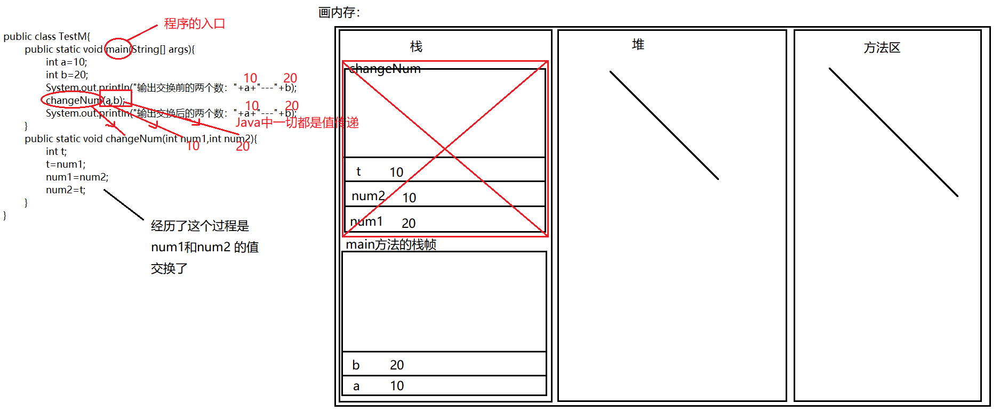

# 方法的定义和调用

【1】什么是方法？

方法(method)就是一段用来完成特定功能的代码片段，类似于其它语言的函数(function)。

方法用于定义该类或该类的实例的行为特征和功能实现。 方法是类和对象行为特征的抽象。方法很类似于面向过程中的函数。面向过程中，函数是最基本单位，整个程序由一个个函数调用组成。面向对象中，整个程序的基本单位是类，方法是从属于类和对象的。

【2】方法声明格式：

| [修饰符1 修饰符2 …] 返回值类型 方法名(形式参数列表){   Java语句；… … …  }  |
|----------------------------------------------------------------------------|

【3】方法的调用方式：

| 对象名.方法名(实参列表)  |
|--------------------------|

【4】方法的详细说明

-   形式参数：在方法声明时用于接收外界传入的数据。
-   实参：调用方法时实际传给方法的数据。
-   返回值：方法在执行完毕后返还给调用它的环境的数据。
-   返回值类型：事先约定的返回值的数据类型，如无返回值，必须显示指定为为void。

【5】代码：

```java
public class TestMethod01{

    //方法的定义：（写方法）
    public static int add(int num1,int num2){
        int sum = 0;
        sum += num1;
        sum += num2;
        return sum;//将返回值返回到方法的调用处
    }

    public static void main(String[] args){
        //10+20:
        //方法的调用：（用方法）
        int num = add(10,20);
        System.out.println(num);
        /\*
            int num1 = 10;
        int num2 = 20;
        int sum = 0;
        sum += num1;
        sum += num2;
        System.out.println(sum);
        \*/
            //30+90:
            int sum = add(30,90);
        System.out.println(sum);
        /\*
            int num3 = 30;
        int num4 = 90;
        int sum1 = 0 ;
        sum1 += num3;
        sum1 += num4;
        System.out.println(sum1);
        \*/
            //50+48:
            System.out.println(add(50,48));

    }


}

```
【6】总结：

1.方法是：对特定的功能进行提取，形成一个代码片段，这个代码片段就是我们所说的方法

2.方法和方法是并列的关系，所以我们定义的方法不能写到main方法中

3.方法的定义--》格式：

修饰符 方法返回值类型 方法名(形参列表){

方法体;

return 方法返回值;

}

4.方法的作用：提高代码的复用性

5.总结方法定义的格式：

1) 修饰符: 暂时使用public static ---\>面向对象一章讲解

2) 方法返回值类型 : 方法的返回值对应的数据类型

数据类型： 可以是基本数据类型（byte,short,int,long,float,double,char,boolean） 也可以是引用数据类型

3) 方法名 :见名知意，首字母小写，其余遵循驼峰命名， eg: addNum ,一般尽量使用英文来命名

4) 形参列表 :方法定义的时候需要的形式参数 ： int num1, int num2 --\>相当于告诉方法的调用者：需要传入几个参数，需要传入的参数的类型

实际参数：方法调用的时候传入的具体的参数： 10,20 --\>根据形式参数的需要传入的

5)方法体：具体的业务逻辑代码

6) return 方法返回值;

方法如果有返回值的话： return+方法返回值，将返回值返回到方法的调用处

方法没有返回值的话：return可以省略不写了，并且方法的返回值类型为：void

```java
public class TestMethod02{

    public static void add(int num1,int num2){
        int sum = 0;
        sum += num1;
        sum += num2;
        System.out.println(sum);
        //return;
    }

    public static void main(String[] args){
        //10+20:
        //方法的调用：（用方法）
        add(10,20);
        //30+90:
        add(30,90);
        //50+48:
        //System.out.println(add(50,48));//报错：TestMethod02.java:22: 错误: 此处不允许使用 '空' 类型

    }

}

```
什么时候有返回值，什么时候没有返回值？ 看心情--》看需求

6.方法的定义需要注意什么？

1）形参列表要怎么写：定义几个参数，分别是什么类型的 ---》不确定因素我们会当做方法的形参

2) 方法到底是否需要返回值 ，如果需要的话，返回值的类型是什么

7.方法的调用需要注意什么？

1）实际参数要怎么传入：传入几个参数，传入什么类型的

2） 方法是否有返回值需要接受

## 练习

【1】基本功能：

```java
import java.util.Scanner;
public class TestMethod03{
    public static void main(String[] args){
        //功能：我心里有一个数，你来猜，看是否猜对
        //1.你猜一个数
        Scanner sc = new Scanner(System.in);
        System.out.println("请你猜一个数：");
        int yourGuessNum = sc.nextInt();
        //2.我心里有一个数
        int myHeartNum = 5;
        //3.将两个数比对：
        System.out.println(yourGuessNum==myHeartNum?"猜对了":"猜错了");
    }
}

```
对猜数功能提取为一个方法：

```java
import java.util.Scanner;
public class TestMethod03{
    public static void main(String[] args){
        //功能：我心里有一个数，你来猜，看是否猜对
        //1.你猜一个数
        Scanner sc = new Scanner(System.in);
        System.out.println("请你猜一个数：");
        int yourGuessNum = sc.nextInt();

        //调用猜数的方法：
        guessNum(yourGuessNum);
    }

    //方法的定义：功能：实现猜数功能：
    public static void guessNum(int yourNum){
        //我心里有一个数(1-6)
        int myHeartNum = (int)(Math.random()\*6)+1;
        //将两个数比对：
        System.out.println(yourNum==myHeartNum?"猜对了":"猜错了");
    }
}

```
## 面试题：两个数交换是否成功

【1】面试题：请问下面代码中两个数是否交换成功：

```java

```
|----------------------------------------------------------------------------------------------------------------------------------------------------------------------------------------------------------------------------------------------------------------------------------------------------------------------------------|

结果：没有交换成功：


原因：




# 方法的重载

【1】什么是方法的重载：

方法的重载是指一个类中可以定义多个方法名相同，但参数不同的方法。 调用时，会根据不同的参数自动匹配对应的方法。

注意本质：重载的方法，实际是完全不同的方法，只是名称相同而已！

【2】构成方法重载的条件：

❀不同的含义：形参类型、形参个数、形参顺序不同

❀ 只有返回值不同不构成方法的重载

如：int a(String str){}与 void a(String str){}不构成方法重载

❀ 只有形参的名称不同，不构成方法的重载

如：int a(String str){}与int a(String s){}不构成方法重载

【3】代码：

```java
public class TestMethod05{
    public static void main(String[] args){
        //10+20:
        int sum = add(10,20);
        System.out.println(sum);

        //20+40+80:
        //System.out.println(add(add(20,40),80));
        System.out.println(add(20,40,80));
        //30+60+90+120:
        //System.out.println(add(add(30,60),add(90,120)));
        System.out.println(add(30,60,90,120));
        //9.8+4.7:
        //System.out.println(add(9.8,4.7));
        System.out.println(add(9.8,4.7));
    }

    //定义一个方法：两个数相加：两个int类型数据相加
    public static int add(int num1,int num2){
        return num1+num2;
    }

    //定义一个方法：三个数相加：
    public static int add(int num1,int num2,int num3){
        return num1+num2+num3;
    }

    //定义一个方法：四个数相加：
    public static int add(int num1,int num2,int num3,int num4){
        return num1+num2+num3+num4;
    }
    //定义一个方法：两个数相加：两个double类型的数据相加
    public static double add(double num1,double num2){
        return num1+num2;
    }


}

```
总结：

1.方法的重载：在同一个类中，方法名相同，形参列表不同的多个方法，构成了方法的重载。

2.方法的重载只跟：方法名和形参列表有关，与修饰符，返回值类型无关。

3.注意：形参列表不同指的是什么？

（1）个数不同

add() add(int num1) add(int num1,int num2)

（2）顺序不同

add(int num1,double num2) add(double num1,int num2)

（3）类型不同

add(int num1) add(double num1)

4.请问下面的方法是否构成了方法的重载？

(1)add(int a) 和 add(int b) ---\>不构成,相当于方法的重复定义

(2)public static int add(int a) 和 public static void add(int b) ---\>不构成

【4】扩充：

```java
public class TestMethod06{
    public static void main(String[] args){
        add(5);
        //级别：byte,short,char--\>int--\>long--\>float---\>double
    }
    
    public static void add(double num1){
        System.out.println("------2");
    }
    public static void add(float num1){
        System.out.println("------3");
    }
    public static void add(long num1){
        System.out.println("------4");
    }
    /\*
        public static void add(int num1){
        System.out.println("------1");
    }
    \*/
}
```

