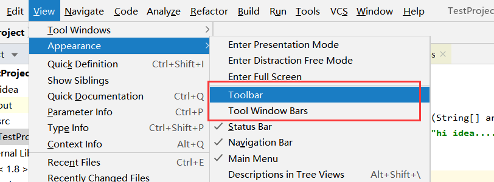
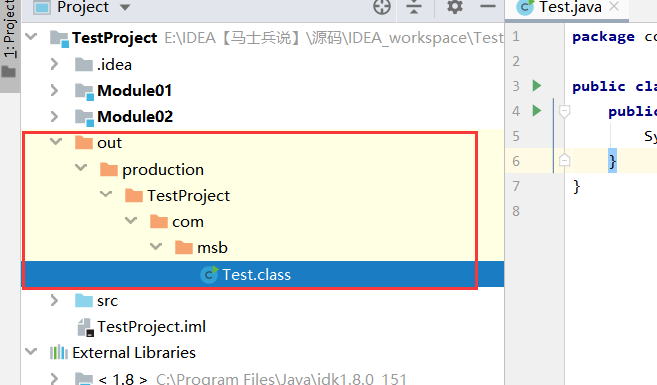
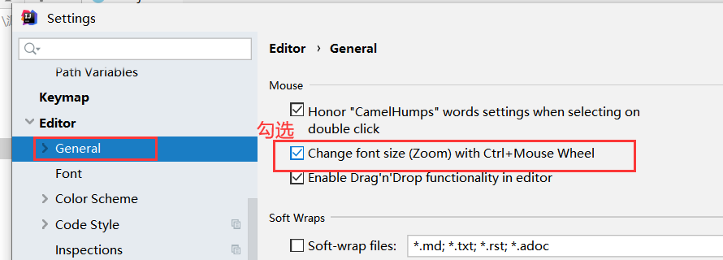
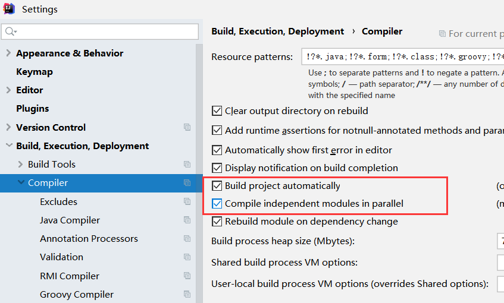
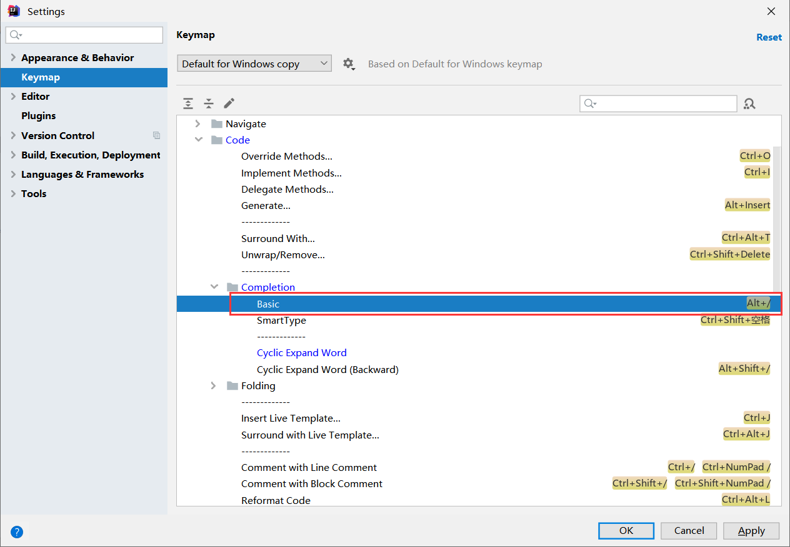
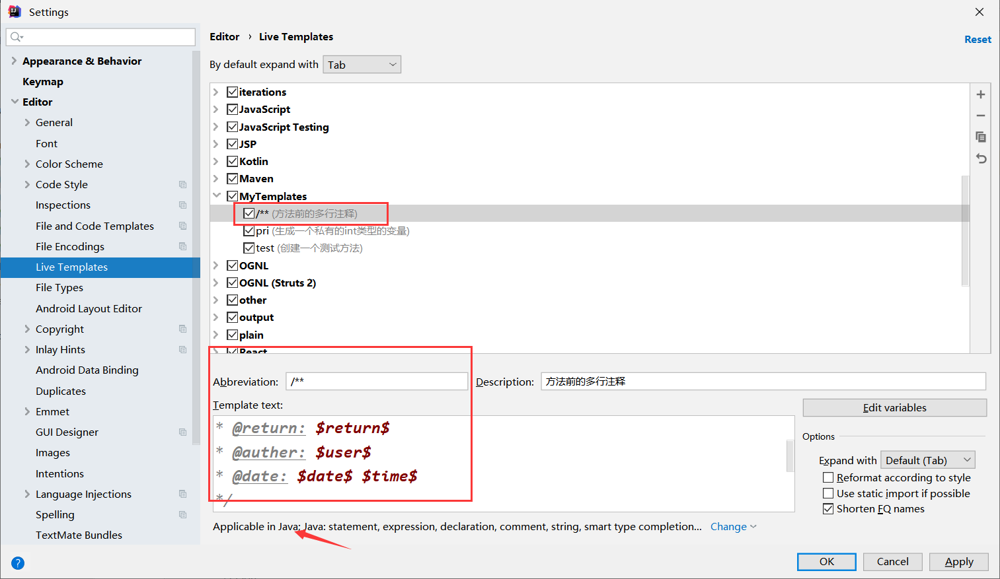

# IDE

集成开发环境（IDE，Integrated Development Environment ）是用于提供程序开发环境的应用程序，一般包括代码编辑器、编译器、调试器和图形用户界面等工具。集成了代码编写功能、分析功能、编译功能、调试功能等一体化的开发软件服务套。所有具备这一特性的软件或者软件套（组）都可以叫集成开发环境。如微软的Visual Studio系列，Borland的C++ Builder、Delphi系列等。该程序可以独立运行，也可以和其它程序并用。IDE多被用于开发HTML应用软件。例如，许多人在设计网站时使用IDE（如HomeSite、DreamWeaver等），因为很多项任务会自动生成。编程开发软件将编辑、编译、调试等功能集成在一个桌面环境中,这样就大大方便了用户。

❀优点

节省时间和精力。IDE的目的就是要让开发更加快捷方便，通过提供工具和各种性能来帮助开发者组织资源，减少失误，提供捷径。

建立统一标准。当一组程序员使用同一个开发环境时，就建立了统一的工作标准，当IDE提供预设的模板，或者不同团队分享代码库时，这一效果就更加明显了。

管理开发工作。首先，IDE提供文档工具，可以自动输入开发者评论，或者迫使开发者在不同区域编写评论。其次，IDE可以展示资源，更便于发现应用所处位置，无需在文件系统里面艰难的搜索。

❀缺点

学习曲线问题。IDE基本上是比较复杂的工具，为了更好的熟练使用，需要一定的时间和耐心。

初学者的困难。对初学者来说，使用IDE来学习开发有相当的难度，不适合学习一种新语言时使用。

无法修复坏代码或设计。开发者不能完全依赖工具的便捷，还是必须保持专业水准和熟练度，开发的成果好坏主要还是看开发员的技术。

# JetBrains公司介绍

【1】IntelliJ IDEA就是Java的IDE。

【2】市场占有率竹节攀升，超过了Eclipse。

【3】JetBrains公司介绍：

JetBrains是一家捷克的软件开发公司，该公司位于捷克的布拉格，并在俄罗斯的圣彼得堡及美国麻州波士顿都设有办公室，该公司最为人所熟知的产品是Java编程语言开发撰写时所用的[集成开发环境](https://baike.baidu.com/item/%E9%9B%86%E6%88%90%E5%BC%80%E5%8F%91%E7%8E%AF%E5%A2%83/298524)：IntelliJ IDEA。公司旗下还有其它产品，比如：

➢WebStorm: 用于开发JavaScript、HTML5、 CS3等前端技术;

➢PyCharm: 用于开发python（python语言热度排行榜排名第一，在人工智能大数据领域应用）

➢PhpStorm: 用于开发PHP

➢RubyMine: 用于开发Ruby/Rails

➢AppCode: 用于开发Objective - C/Swift,替换xcode的

➢CLion: 用于开发C/C++

➢DataGrip: 用于开发数据库和SQL

➢Rider: 用于开发.NET

➢GoLand: 用于开发Go（区块链主流开发语言就是Go语言）

【4】官网：<https://www.jetbrains.com/>

# IntelliJ_IDEA介绍

【1】IDEA 全称IntelliJ IDEA，是用于java语言开发的集成环境IDE(Integrated Development Environment)，也可用于其他语言。

IntelliJ在业界被公认为最好的java开发工具之一，尤其在智能代码助手、代码自动提示、重构、J2EE支持、Ant、JUnit、CVS整合、代码审查、 创新的GUI设计等方面的功能可以说是超常的。

IDEA是JetBrains公司的产品，这家公司总部位于捷克共和国的首都布拉格，开发人员以严谨著称的东欧程序员为主。

【2】IDEA的支持：

【3】IDEA的优势（相对于Eclipse）

①强大的整合能力。比如: Git、 Maven、 Spring 等

②提示功能的快速、便捷

③提示功能的范围广

④好用的快捷键和代码模板

⑤精准搜索

# IntelliJ_IDEA的下载和安装的准备

【2】安装的准备：

（1）硬件环境：

内存8G以上

CPU i5以上

安装在固态硬盘下

（2）软件环境：

需要安装JDK

# IDEA的卸载

对于免安装的idea：

（1）删除安装文件

（2）到用户下将idea的缓存，配置的目录删除掉即可

安装idea:

(1)可以用控制面板--》程序

# IDEA页面展示

【1】项目下内容：

➢工程下的src类似于Eclipse下的src目录，用于存放代码。。

➢工程下的.idea 和TestProject.iml文件都是IDEA工程特有的。类似于Eclipse 工程下的settings、.classpath、.project 等。

【2】配置：

# Module的概念和使用

【1】在Eclipse中我们有Workspace (工作空间)和Project (工程)的概念，在IDEA中只有Project (工程)和Module (模块)的概念。

这里的对应关系为:

| IDEA官网说明:  An Eclipse workspace is similar to a project in IntelliJ IDEA  An Eclipse project maps to a module in IntelliJ IDEA |
| ------------------------------------------------------------ |
| 翻译:  Eclipse中 workspace 相当于 IDEA中的Project  Eclipse中 Project 相当于 IDEA中的Module |

在IntelliJ IDEA中Project(工程) 是最顶级的级别，次级别是Module(模块)。

一个Project下可以有多个Module。

【2】从Eclipse 转过来的人总是下意识地要在同一个窗口管理n个项目，这在Intellij IDEA是无法做到的。Intellij IDEA提供的解决方案是打开多个项目实例，即打开多个项目窗口。即:一个Project 打开一个Window窗口。

【3】IDEA这样设置的原因：

目前主流的大型项目都是分布式部署的，结构都是类似这种多Module的。

这类项目一般是这样划分的，比如: 积分模块、任务模块、活动模块等等，模块之间彼此可以相互依赖。这些Module之间都是处于同一个项目业务下的模块，彼此之间是有不可分割的业务关系的。

【4】out目录的说明：里面存放的是编译后的字节码文件

【5】删除模块：

# IDEA的常用设置

【1】进入设置：

【2】设置主题：

【3】编辑区的字体变大或者变小：

【4】鼠标悬浮在代码上有提示：

【5】自动导包和优化多余的包：

手动导包：快捷键：alt+enter

自动导包和优化多余的包：

【6】同一个包下的类，超过指定个数的时候，导包合并为\*

【7】显示行号 ， 方法和方法间的分隔符：

【8】忽略大小写，进行提示：

【9】多个类不隐藏，多行显示：

【10】设置默认的字体，字体大小，字体行间距：(编辑区和控制台都会变化)

【11】修改代码中注释的字体颜色：

【12】修改类头的文档注释信息：---》注意：对新建的类才有效

/\*\*

\* @Auther: zhaoss

\* @Date: \${DATE} - \${MONTH} - \${DAY} - \${TIME}

\* @Description: \${PACKAGE_NAME}

\* @version: 1.0

\*/

【13】设置项目文件编码：

文件右下角可以调节编码格式：

【14】自动编译：

【15】省电模式：

【16】代码显示结构：

【17】导入jar包：

【18】生成序列化版本号：

# IDEA的常用快捷键

【1】创建内容：alt+insert

【2】main方法：psvm

【3】输出语句：sout  
【4】复制行：ctrl+d

【5】删除行：ctrl+y

【6】代码向上/下移动：Ctrl + Shift + Up / Down

【7】搜索类： ctrl+n

【8】生成代码 ：alt + Insert（如构造函数等，getter,setter,hashCode,equals,toString）

【9】百能快捷键 : alt + Enter （导包，生成变量等）

【10】单行注释或多行注释 ： Ctrl + / 或 Ctrl + Shift + /

【11】重命名 shift+f6

【12】for循环 直接 ：fori 回车即可

【13】代码块包围：try-catch,if,while等 ctrl+alt+t

【14】 代码自动补全提示:

【15】 idea代码字体大小放大和缩小的快捷键

【16】代码一层一层调用的快捷键：

点进源码：ctrl+鼠标悬浮在代码上+点进去即可：

【17】显示代码结构 : alt + 7

【18】显示导航栏： alt +1

【19】撤回：ctrl+z

【20】REDO操作：

如果跟搜狗输入法的快捷键冲突，可以选择将搜狗的快捷键取消。

【21】缩进：tab 取消缩进： shift+tab

# 模板的使用

## 代码模板是什么

它的原理就是配置一些常用代码字母缩写，在输入简写时可以出现你预定义的固定模式的代码，使得开发效率大大提高，同时也可以增加个性化。最简单的例子就是在Java中输入sout会出现System.out.println();

（一）所处位置：

（1）Live Templates

（2）Postfix Completion

（二）区别：

【1】

Live Templates中可以做用户的个性化定制。

Postfix Completion中只能用，不能修改。

【2】使用方式不同

## 修改现有模板

【1】案例1：改main方法： psvm

【2】案例2：修饰属性的修饰符：

## 常用的代码模板

【1】模板1： main方法：

main 或者 psvm

【2】模板2：输出语句：

sout 或者 .sout

一些变型：  
soutp:打印方法的形参

soutm:打印方法的名字

soutv:打印变量

【3】模板3： 循环

普通for循环： fori（正向） 或者 .fori （正向） . forr(逆向)

增强for循环： iter 或者 .for

（可以用于数组的遍历，集合的遍历）

【4】模板4： 条件判断

ifn 或者 .null ：判断是否为null （if null）

inn 或者 .nn ：判断不等于null (if not null)

【5】模板5： 属性修饰符：

prsf : private static final

psf :public static final

## 自定义模板

【1】测试方法：

【2】常用属性：(\$\$中的内容其实就是在定义光标的位置，光标可以切换，用回车切换)

【3】方法注释模板：

/\*\*

\* 功能描述:

\* @param: \$param\$

\* @return: \$return\$

\* @auther: \$user\$

\* @date: \$date\$ \$time\$

\*/

# IDEA中的断点调试

## 常用断点调试快捷键

调试在开发中大量应用：

【1】Debug的优化设置：更加节省内存空间：

设置Debug连接方式，默认是Socket。 Shared memory是Windows 特有的一个属性，一般在Windows系统下建议使用此设置，

内存占用相对较少。

【2】常用断点调试快捷键：

一步一步的向下运行代码，不会走入任何方法中。

一步一步的向下运行代码，不会走入系统类库的方法中，但是会走入自定义的方法中。

一步一步的向下运行代码，会走入系统类库的方法中，也会走入自定义的方法中。

跳出方法

结束程序

进入到下一个断点，如果没有下一个断点了，就直接运行到程序结束。

 在当前次取消未执行的断点。

## 条件判断，查看表达式的值

【1】条件判断：

说明:

调试的时候，在循环里增加条件判断，可以极大的提高效率，心情也能惧悦。

具体操作:

在断点处右击调出条件断点。可以在满足某个条件下，实施断点。

【2】查看表达式的值：

选择行，alt+f8。

