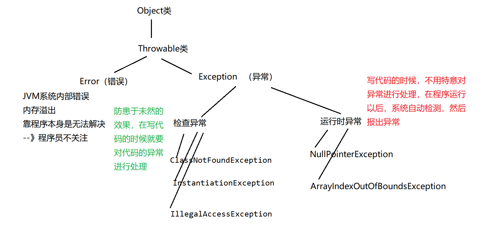

# 习题的引入

【1】代码：

```java
public class Test {
    //这是一个main方法，是程序的入口：
    public static void main(String[] args) {
        //实现一个功能：键盘录入两个数，求商：
        Scanner sc = new Scanner(System.in);
        System.out.println("请录入第一个数：");
        int num1 = sc.nextInt();
        System.out.println("请录入第二个数：");
        int num2 = sc.nextInt();
        System.out.println("商："+num1/num2);

    }
}

```
运行结果：


测试过程发现问题：

录入的数据应为int类型，但是录入非int类型数据的时候，出异常：


除数为0的时候：


异常：Exception：在程序的运行过程中，发生了不正常的现象，阻止了程序的运行，我们称之为发生异常。

# 通过if-else解决异常

```java
public class Test {
    //这是一个main方法，是程序的入口：
    public static void main(String[] args) {
        //实现一个功能：键盘录入两个数，求商：
        Scanner sc = new Scanner(System.in);
        System.out.println("请录入第一个数：");
        if(sc.hasNextInt()){
            int num1 = sc.nextInt();
            System.out.println("请录入第二个数：");
            if(sc.hasNextInt()){
                int num2 = sc.nextInt();
                if(num2 == 0){
                    System.out.println("对不起，除数不能为0");
                }else{
                    System.out.println("商："+num1/num2);
                }
            }else{
                System.out.println("对不起，你录入的不是int类型的数据！");
            }
        }else{
            System.out.println("对不起，你录入的不是int类型的数据！");
        }
    }
}


```
用if-else堵漏洞的缺点：

（1）代码臃肿，业务代码和处理异常的代码混在一起。

（2）可读性差

（3）程序员需要花费大量的经历来维护这个漏洞

（4）程序员很难堵住所有的漏洞。

# 

# try-catch

【1】基于if-else处理异常缺点太多，所以java中专门出了一个异常处理机制：

“异常三连” try-catch-finally

【2】异常出现了以后怎么看：


【3】捕获异常： try-catch

对应代码：

```java
public class Test2 {
    public static void main(String[] args) {
        //实现一个功能：键盘录入两个数，求商：
        try{
            Scanner sc = new Scanner(System.in);
            System.out.println("请录入第一个数：");
            int num1 = sc.nextInt();
            System.out.println("请录入第二个数：");
            int num2 = sc.nextInt();
            System.out.println("商："+num1/num2);
        }catch(Exception ex){
            System.out.println("对不起，程序出现异常！");
        }

        System.out.println("----谢谢你使用计算器111");
        System.out.println("----谢谢你使用计算器222");
        System.out.println("----谢谢你使用计算器333");
        System.out.println("----谢谢你使用计算器444");
        System.out.println("----谢谢你使用计算器555");
        System.out.println("----谢谢你使用计算器666");
    }
}

```
原理：

把可能出现异常的代码放入try代码块中，然后将异常封装为对象，被catch后面的()中的那个异常对象接收，接收以后：执行catch后面的{}里面的代码，然后try-catch后面的代码，该怎么执行就怎么执行。

详细说一下：

（1）try中没有异常，catch中代码不执行。

（2）try中有异常，catch进行捕获：

如果catch中异常类型和你出的异常类型匹配的话：走catch中的代码--》进行捕获

如果catch中异常类型和你出的异常类型不匹配的话：不走catch中的代码--》没有捕获成功，程序相当于遇到异常了，中断了，后续代码不执行

注意：

（1）try中如果出现异常，然后用catch捕获成功的话，那么try中后续的代码是不会执行的。

（2）如果catch捕获异常成功，那么try-catch后面的代码该执行还是执行没有影响。

# catch中如何处理异常

```java
public class Test3 {
    public static void main(String[] args) {
        //实现一个功能：键盘录入两个数，求商：
        try{
            Scanner sc = new Scanner(System.in);
            System.out.println("请录入第一个数：");
            int num1 = sc.nextInt();
            System.out.println("请录入第二个数：");
            int num2 = sc.nextInt();
            System.out.println("商："+num1/num2);
        }catch(Exception ex){
            //第一种处理：什么都不写，什么都不做

            //第二种处理：输出自定义异常信息
            //System.out.println("对不起，你的代码有问题！");

            //第三种处理：打印异常信息：
            /\*(1)调用toString方法，显示异常的类名（全限定路径）\*/
                /\*System.out.println(ex);
            System.out.println(ex.toString());\*/
                /\*(2)显示异常描述信息对应的字符串，如果没有就显示null
                System.out.println(ex.getMessage());\*/
                /\*(3)显示异常的堆栈信息：将异常信息捕获以后，在控制台将异常的效果给我们展示出来，方便我们查看异常\*/
                /\* ex.printStackTrace();\*/

                //第四种处理：抛出异常：
                throw ex;
        }

        System.out.println("----谢谢你使用计算器111");
    }
}


```
# try-catch-finally

**【1】在什么情况下，try-catch后面的代码不执行？**

（1）throw抛出异常的情况

（2）catch中没有正常的进行异常捕获

（3）在try中遇到return

**【2】怎么样才可以将 try-catch后面的代码 必须执行？**

只要将必须执行的代码放入finally中，那么这个代码无论如何一定执行。

**【3】return和finally执行顺序？**

先执行finally最后执行return

**【4】什么代码会放在finally中呢？**

关闭数据库资源，关闭IO流资源，关闭socket资源。

**【5】有一句话代码很厉害，它可以让finally中代码不执行!**

[System.exit(0);//终止当前的虚拟机执行](file:///D:\下载\System.exit(0);\终止当前的虚拟机执行)

代码：

```java
import java.util.Scanner;

public class Test3 {
    public static void main(String[] args) {
        //实现一个功能：键盘录入两个数，求商：
        try{
            Scanner sc = new Scanner(System.in);
            System.out.println("请录入第一个数：");
            int num1 = sc.nextInt();
            System.out.println("请录入第二个数：");
            int num2 = sc.nextInt();
            System.out.println("商："+num1/num2);
            System.exit(0);//终止当前的虚拟机执行
            return;
        }catch(ArithmeticException ex){
            //throw ex;
        }finally {
            System.out.println("----谢谢你使用计算器111");
        }


    }
}


```
# 多重catch

【1】try中出现异常以后，将异常类型跟catch后面的类型依次比较，按照代码的顺序进行比对，执行第一个与异常类型匹配的catch语句

【2】一旦执行其中一条catch语句之后，后面的catch语句就会被忽略了！

【3】在安排catch语句的顺序的时候，一般会将特殊异常放在前面（并列），一般化的异常放在后面。

先写子类异常，再写父类异常。

【4】在JDK1.7以后，异常新处理方式：可以并列用\|符号连接：


```java
import java.util.InputMismatchException;
import java.util.Scanner;

public class Test4 {
    public static void main(String[] args) {
        Integer
            //实现一个功能：键盘录入两个数，求商：
            try{
                Scanner sc = new Scanner(System.in);
                System.out.println("请录入第一个数：");
                int num1 = sc.nextInt();
                System.out.println("请录入第二个数：");
                int num2 = sc.nextInt();
                System.out.println("商："+num1/num2);
            }catch(ArithmeticException ex){
                System.out.println("对不起，除数不可以为0");
            }catch(InputMismatchException ex){
                System.out.println("对不起，你录入的数据不是int类型的数据");
            }catch(Exception ex){
                System.out.println("对不起，你的程序出现异常");
            }finally {
                System.out.println("----谢谢你使用计算器111");
            }
    }
}


```
# 异常的分类

【1】层次结构：




注意：程序中语法错误，逻辑错误 都不属于上面的Error，Exception

【2】运行时异常：

```java
public class Test5 {
    //这是一个main方法，是程序的入口：
    public static void main(String[] args) {
        //运行时异常：
        int[] arr = {1,2,3};
        System.out.println(arr.length);
        /\*int[] arr2 = null;
        System.out.println(arr2.length);\*/
            System.out.println(arr[10]);
    }
}

```
【3】检查异常：

处理方式1：try-catch嵌套try-catch

```java
public class Test6 {
    //这是一个main方法，是程序的入口：
    public static void main(String[] args) {
        //检查异常：
        try {
            try {
                Class.forName("com.msb.test01.Test").newInstance();
            } catch (InstantiationException e) {
                e.printStackTrace();
            } catch (IllegalAccessException e) {
                e.printStackTrace();
            }
        } catch (ClassNotFoundException e) {
            e.printStackTrace();
        }
    }
}

```
处理方式2：多重catch

```java
public class Test6 {
    //这是一个main方法，是程序的入口：
    public static void main(String[] args) {
        //检查异常：
        try {
            Class.forName("com.msb.test01.Test").newInstance();
        } catch (ClassNotFoundException \| InstantiationException \| IllegalAccessException e) {
            e.printStackTrace();
        }
    }
}

```
处理方式3：throws

```java
public class Test6 {
    //这是一个main方法，是程序的入口：
    public static void main(String[] args) throws ClassNotFoundException, IllegalAccessException, InstantiationException {
        //检查异常：
        Class.forName("com.msb.test01.Test").newInstance();
    }
}

```
# throw和throws的区别

```java
import java.util.Scanner;

public class Test7 {
    //这是一个main方法，是程序的入口：
    public static void main(String[] args) throws Exception {
        //实现一个功能：两个数相除，当除数为0的时候，程序出现异常。
        /\*try {
            devide();
        } catch (Exception e) {
            e.printStackTrace();
        }\*/
            devide();
    }
    public static void devide() throws Exception {
        Scanner sc = new Scanner(System.in);
        System.out.println("请录入第一个数：");
        int num1 = sc.nextInt();
        System.out.println("请录入第二个数：");
        int num2 = sc.nextInt();
        if(num2 == 0 ){//除数为0 ，制造异常。
            //制造运行时异常：
            /\*throw new RuntimeException();\*/
                //制造检查异常：
                /\*try {
                    throw new Exception();
                } catch (Exception e) {
                    e.printStackTrace();
                }\*/
                    throw new Exception();
        }else{
            System.out.println("商："+num1/num2);
        }
    }
}


```
总结：

throw和throws的区别：

（1）位置不同：

throw：方法内部

throws: 方法的签名处，方法的声明处

（2）内容不同：

throw+异常对象（检查异常，运行时异常）

throws+异常的类型（可以多个类型，用，拼接）

（3）作用不同：

throw：异常出现的源头，制造异常。

throws:在方法的声明处，告诉方法的调用者，这个方法中可能会出现我声明的这些异常。然后调用者对这个异常进行处理：

要么自己处理要么再继续向外抛出异常

## 练习：

```java

public class Student {
    private String name;
    private int age;
    private String sex;

    public String getName() {
        return name;
    }

    public void setName(String name) {
        this.name = name;
    }

    public int getAge() {
        return age;
    }

    public void setAge(int age) {
        this.age = age;
    }

    public String getSex() {
        return sex;
    }

    public void setSex(String sex) throws Exception {
        if(sex.equals("男")\|\|sex.equals("女")){
            this.sex = sex;
        }else{//非男非女
            //解决办法1：
            /\*this.sex = "男";\*/
                //解决办法2：给个友好型提示，但是打印结果为默认的null效果
                /\*System.out.println("对不起，你的性别错误了");\*/
                //解决办法3：
                //制造运行时异常：
                /\*throw new RuntimeException("性别不对！");\*/
                //制造检查异常
                /\*try {
                    throw new Exception();
                } catch (Exception e) {
                    e.printStackTrace();
                }\*/
                    throw new Exception();
        }
    }

    @Override
    public String toString() {
        return "Student{" +
            "name='" + name + '\\'' +
            ", age=" + age +
            ", sex='" + sex + '\\'' +
            '}';
    }

    public Student() {
    }

    public Student(String name, int age, String sex) {
        this.name = name;
        this.age = age;
        //this.sex = sex;
        try {
            this.setSex(sex);
        } catch (Exception e) {
            e.printStackTrace();
        }
    }
}


public class Test {
    //这是一个main方法，是程序的入口：
    public static void main(String[] args) {
        //创建一个Student的对象：
        /\*Student s = new Student();
        s.setName("菲菲");
        s.setAge(19);
        try {
            s.setSex("asdfasdfasdf");
        } catch (Exception e) {
            e.printStackTrace();
        }
        System.out.println(s);\*/

            Student s2 = new Student("娜娜",21,"asdfasdfasdf");
        System.out.println(s2);
    }
}


```
# 重载和重写的异常


【1】重载：

```java
public class Demo {
    public void a() throws Exception{

    }
    public void a(int age) throws ArithmeticException{

    }
}


```
【2】重写：


子类 \<= 父类

# 自定义异常

自定义的异常可以继承：运行时异常

```java
public class MyException extends RuntimeException {

    static final long serialVersionUID = -70348971907L;

    public MyException(){

    }
    public MyException(String msg){
        super(msg);
    }
}

```
也可以继承检查异常：

```java
public class MyException extends Exception {

    static final long serialVersionUID = -70348971907L;

    public MyException(){

    }
    public MyException(String msg){
        super(msg);
    }
}


```
如果继承的是运行时异常，那么在使用的时候无需额外处理

如果继承的是检查异常，那么使用的时候需要try-catch捕获或者throws向上抛
