# 1 Mybatis入门

原生JDBC实现CURD的问题

> 1 编码繁琐
> 2 需要我们自己将结果集映射成对象
> 3 性能不太好  连接池 缓存
> 4 SQL语句和java代码的耦合度特别高
> 5 … …


MyBatis 本是Apache的一个开源项目iBatis, 2010年这个项目由Apache Software Foundation 迁移到了Google Code，且改名为MyBatis 。2013年11月迁移到GitHub。iBATIS一词来源于“internet”和“abatis”的组合，是一个基于Java的持久层框架。
MyBatis 是一款优秀的持久层框架，它支持定制化 SQL、存储过程以及高级映射。MyBatis 避免了几乎所有的 JDBC 代码和手动设置参数以及获取结果集。MyBatis 可以使用简单的 XML 或注解来配置和映射原生信息，将接口和 Java 的 POJOs(Plain Ordinary Java Object,普通的 Java对象)映射成数据库中的记录。


## 1 认识框架

框架（Framework）是一个框子——指其约束性，也是一个架子——指其支撑性。是一个基本概念上的结构，用于去解决或者处理复杂的问题。框架这个广泛的定义使用的十分流行，尤其在软件概念。
框架( Framework )对于java来说,就是一系列为了解决特定问题而定义的一系列接口和实现类,在组织框架代码时,使用了一系列优秀的设计模式,使代码无论在性能上还是API操作上得到很大提升.框架可以看做是项目开发的半成品,基本的底层操作已经封装完毕,通过框架,程序员可以从底层代码中解脱出来,专注于业务逻辑的完成和性能的优化。框架规定了你的应用的体系结构。它定义了整体结构，类和对象的分割，各部分的主要责任，类和对象怎么协作，以及控制流程。框架预定义了这些设计参数，以便于应用设计者或实现者能集中精力于应用本身的特定细节。

如果将开发完成的软件比作是一套已经装修完毕的新房，那框架就好比是一套已经修建好的毛坯房。用户直接购买毛坯房，建筑质量和户型合理有保证，还省去了自己建造房屋的时间，一举多得。
在开发过程是使用框架，同样可以保证减少开发时间、降低开发难度，并且还保证设计质量。好比和世界上最优秀的软件工程师是一个项目的，并且他们完成的还是基础、全局的工作。想想是不是很嗨的一件事情。


框架还有一个作用是约束。莎士比亚说,"一千个观众眼中有一千个哈姆雷特" 即仁者见仁,智者见智.说每个人都会对作品有不同的理解，每个人对待任何事物都有自己的看法，一千个人就有可能有一千种不同的看法1000人心中有1000个哈姆雷特。同样的技术解决同样的问题会产生不同流程和风格的解决方案，而采用一种框架其实就是限制用户必须使用其规定的方案来实现，**可以降低程序员之间沟通以及日后维护的成本。**


常用的基于JavaEE的三大开源框架，已经从SSH、SSH2过渡到了SSM：SpringMVC、Spring、MyBatis >>> springBoot


<font face="微软雅黑" size=6 color=#FF0000>总之，框架是一个半成品，已经对基础的代码进行了封装并提供相应的API，开发者在使用框架是直接调用封装好的API可以省去很多代码编写，从而提高工作效率和开发速度。</font>


## 2 认识ORM

DBC的缺点：

需要手动的完成面向对象的Java语言、面向关系的数据库之间数据的转换，代码繁琐无技术含量，影响了开发效率。

如图所示，查询是需要手动的将结果集的列数据转换为Java对象的属性；而添加操作时需要手动将Java对象的属性转换为数据库表的列字段。

关于面向对象的Java语言、面向关系的数据库之间数据的转换必须要做，问题在于这个转换是否可以不由开发者来做。可以的。ORM框架就是专门来做这个问题的，相当于在面向对象语言和关系数据库之间搭建一个桥梁。

==ORM，Object-Relationl Mapping，对象关系映射，它的作用是在关系型数据库和对象之间作一个映射，这样我们在具体的操作数据库的时候，只要像平时操作对象一样操作它就可以了，ORM框架会根据映射完成对数据库的操作，就不需要再去和复杂的SQL语句打交道了==。

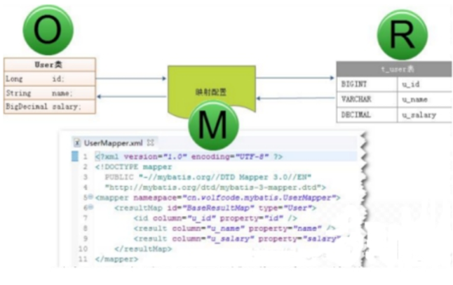


另外学习ORM必须知道两个概念：持久化、持久层

**什么是“持久化”**

持久（Persistence），<font color=#FF0000>即把数据（如内存中的对象）保存到可永久保存的存储设备中（如磁盘）</font>。持久化的主要应用是将内存中的数据存储在关系型的数据库中，当然也可以存储在磁盘文件中、XML数据文件中等等。

**什么是 “持久层”**

持久层（Persistence Layer），即专注于实现数据持久化应用领域的某个特定系统的一个逻辑层面，将数据使用者和数据实体相关联。之前使用JDBC访问数据库的DAO层，后面采用MyBatis访问数据库的mapper层，就是持久层。

**Mybatis是一持久层的款半自动的ORM映射框架**


## 3 认识MyBatis

>MyBatis 本是Apache的一个开源项目iBatis, 2010年这个项目由Apache Software Foundation 迁移到了Google Code，且改名为MyBatis 。2013年11月迁移到GitHub。iBATIS一词来源于“internet”和“abatis”的组合，是一个基于Java的持久层框架。

MyBatis 是一款优秀的持久层框架，它支持定制化 SQL、存储过程以及高级映射。MyBatis 避免了几乎所有的 JDBC 代码和手动设置参数以及获取结果集。MyBatis 可以使用简单的 XML 或注解来配置和映射原生信息，将接口和 Java 的 POJOs(Plain Ordinary Java Object,普通的 Java对象)映射成数据库中的记录。

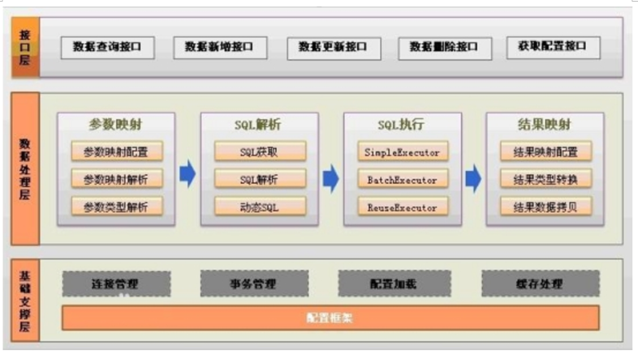

精简解释：MyBatis是一个半自动ORM框架，其本质是对JDBC的封装。使用MyBatis重点需要程序员编写SQL命令，不需要写一行JDBC代码


# 2 MyBatis初次使用


## 1 创建maven项目导入相关依赖

但凡是框架,使用都是分三步走

1导入jar文件,maven

2处理配置文件

3开发业务代码

先创建一个空项目,用于存放后面Mybatis相关项目模块

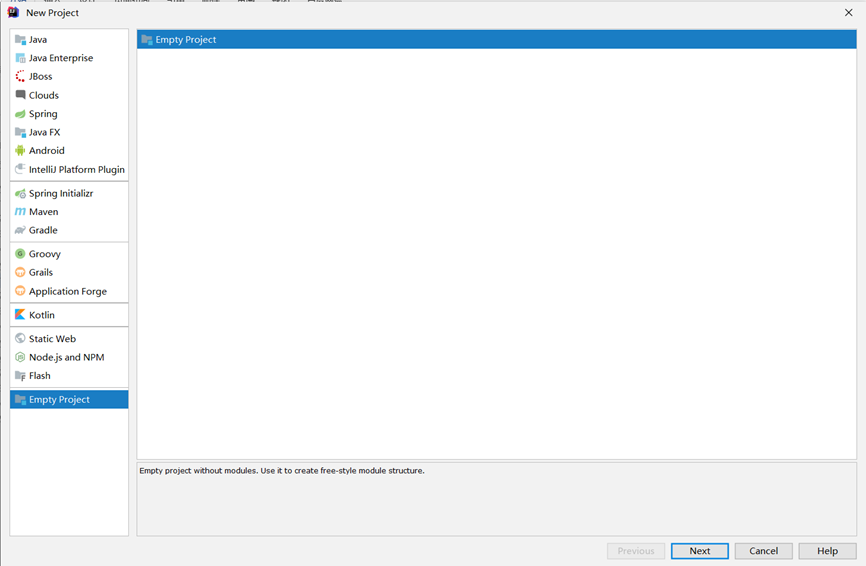


项目名为mybatisAll即可

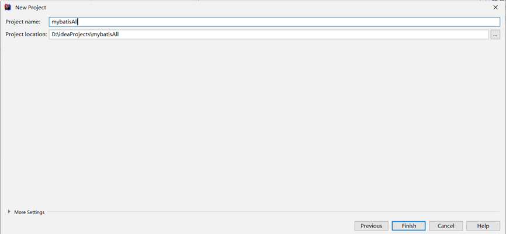


这里不显示项目名 没关系,如果想看到项目名,可以close项目后,再次open即可


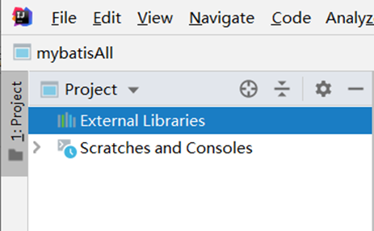


关闭项目

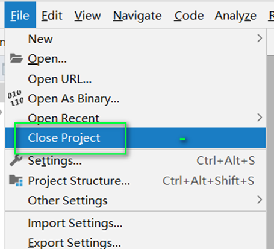


再次open

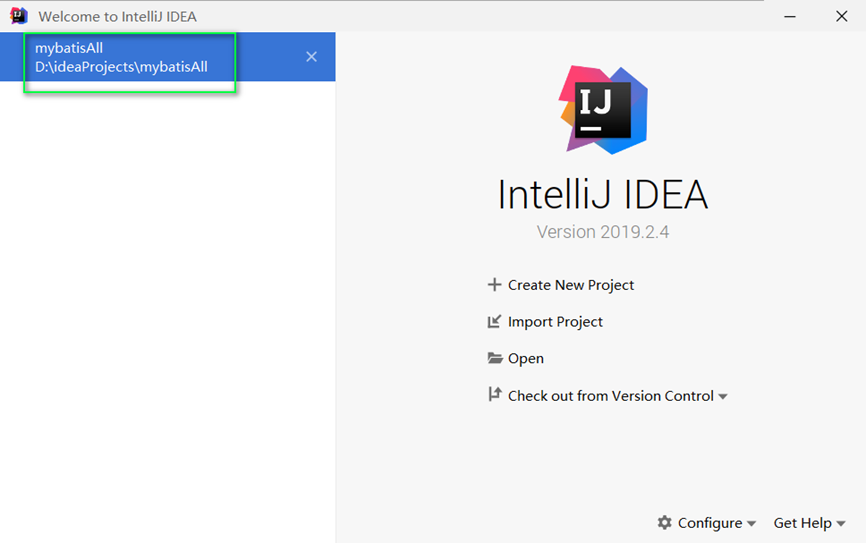


项目名就显示了

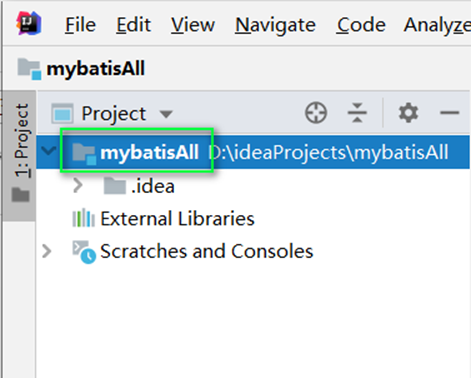


接下来设置maven为我们自己安装的,不用idea自带的(当然用自带的也行)

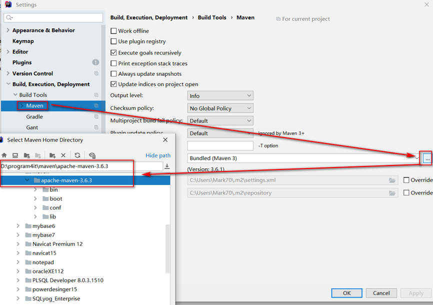


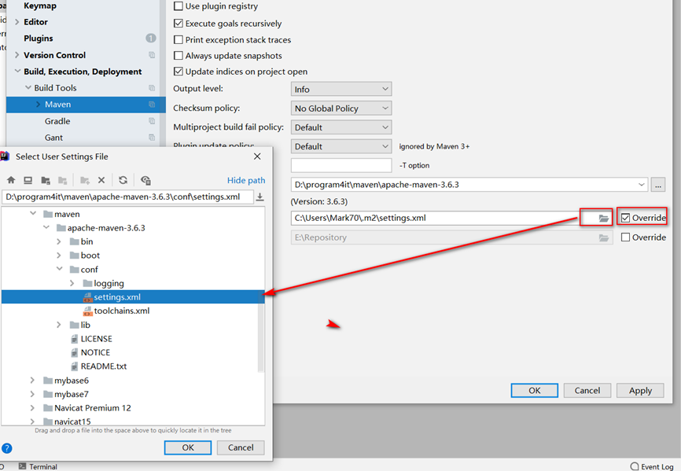


在当前项目中创建模块

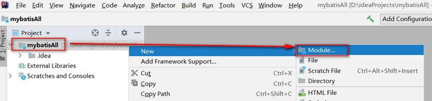


选择maven项目 next

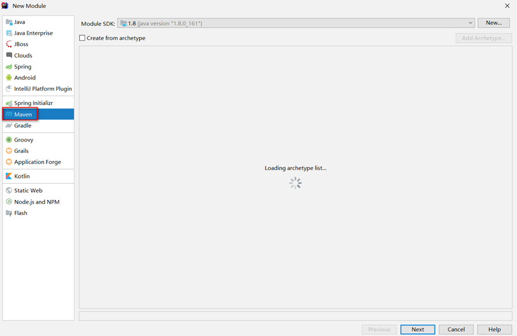


输入groupid和aitifactid  然后finish

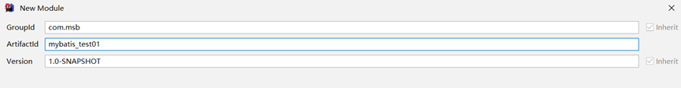


检查项目目前在磁盘上的存放路径 然后next

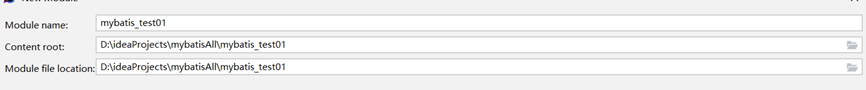


检查项目目录结构是否有缺失

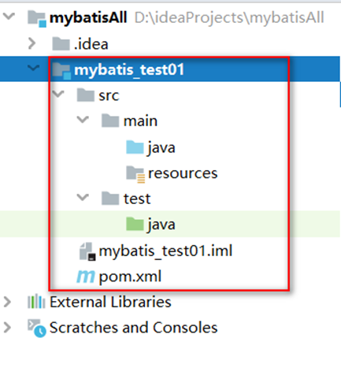


MyBatis官网说明文档   https://mybatis.org/mybatis-3/zh/index.html

在pom.xml中导入MyBatis相关依赖jar文件


```xml
<?xml version="1.0" encoding="UTF-8"?>
<project xmlns="http://maven.apache.org/POM/4.0.0"
         xmlns:xsi="http://www.w3.org/2001/XMLSchema-instance"
         xsi:schemaLocation="http://maven.apache.org/POM/4.0.0 http://maven.apache.org/xsd/maven-4.0.0.xsd">
    <modelVersion>4.0.0</modelVersion>
    <groupId>com.msb</groupId>
    <artifactId>mybatisTest01</artifactId>
    <version>1.0-SNAPSHOT</version>
    <packaging>jar</packaging>
    <dependencies>
        <!--mysqlConnector-->
        <dependency>
            <groupId>mysql</groupId>
            <artifactId>mysql-connector-java</artifactId>
            <version>8.0.16</version>
        </dependency>
        <!--mybatis 核心jar包-->
        <dependency>
            <groupId>org.mybatis</groupId>
            <artifactId>mybatis</artifactId>
            <version>3.5.3</version>
        </dependency>
        <!--junit-->
        <dependency>
            <groupId>junit</groupId>
            <artifactId>junit</artifactId>
            <version>4.13.1</version>
            <scope>test</scope>
        </dependency>
        <!--lombok -->
        <dependency>
            <groupId>org.projectlombok</groupId>
            <artifactId>lombok</artifactId>
            <version>1.18.12</version>
            <scope>provided</scope>
        </dependency>
    </dependencies>
</project>
```


安装lombok插件后,重启idea

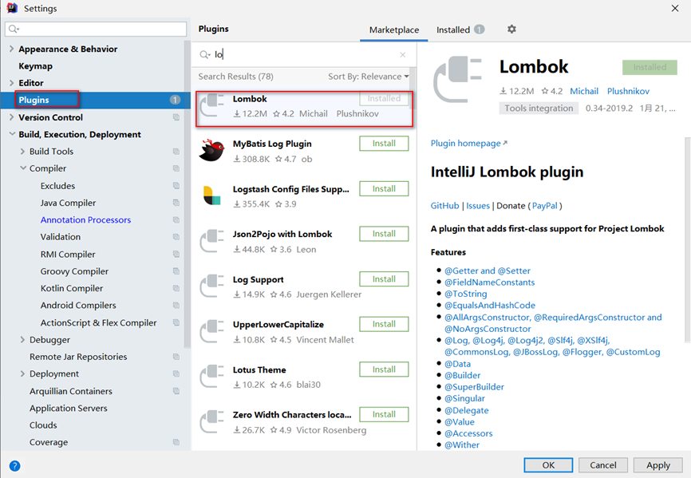


导入lombok依赖后,单独设置启用注解处理

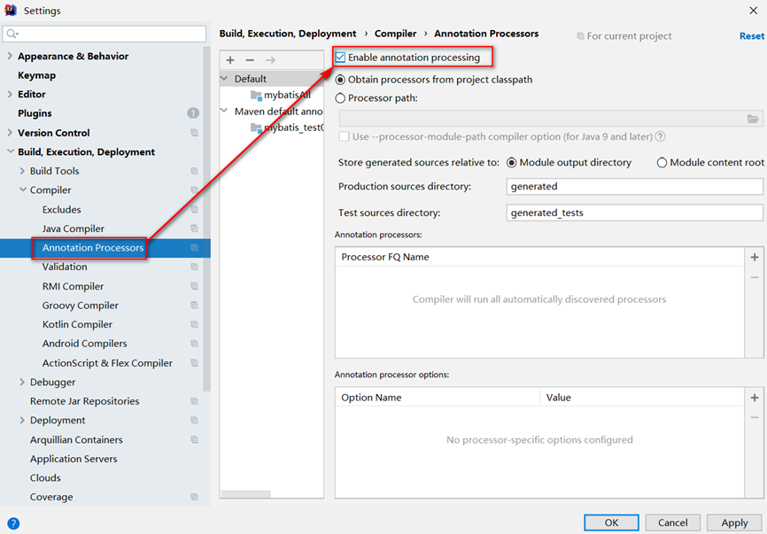


## 2  准备数据库_包结构和实体类

数据库


项目结构

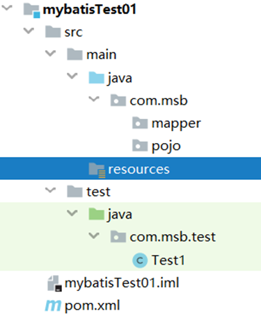

 实体类Dept

```java
 package com.msb.pojo;
import lombok.AllArgsConstructor;
import lombok.Data;
import lombok.NoArgsConstructor;
import java.io.Serializable;
/**

 * @Author: Ma HaiYang
 * @Description: MircoMessage:Mark_7001
    */
    @Data
    @AllArgsConstructor
    @NoArgsConstructor
    public class Dept implements Serializable {
    private Integer deptno;
    private String dname;
    private String loc;
    }
```


## 3 准备Mapper映射文件和核心配置文件

resources目录下 创建 com/msb/mapper目录,然后添加DeptMapper.xml映射文件

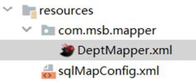

```xml
<?xml version="1.0" encoding="UTF-8" ?>
<!DOCTYPE mapper
        PUBLIC "-//mybatis.org//DTD Mapper 3.0//EN"
        "http://mybatis.org/dtd/mybatis-3-mapper.dtd">
<mapper namespace="aaa">
    <!--public List<Dept> findAll(){    }-->
    <select id="findAll" resultType="com.msb.pojo.Dept" >
        select * from dept
    </select>
</mapper>
```


resources目录下准备sqlMapConfig.xml 核心配置文件

```xml
<?xml version="1.0" encoding="UTF-8" ?>
<!DOCTYPE configuration
        PUBLIC "-//mybatis.org//DTD Config 3.0//EN"
        "http://mybatis.org/dtd/mybatis-3-config.dtd">
<configuration>
    <environments default="development">
        <environment id="development">
            <transactionManager type="JDBC"/>
            <dataSource type="POOLED">
                <property name="driver" value="com.mysql.cj.jdbc.Driver"/>
                <property name="url" value="jdbc:mysql://127.0.0.1:3306/mydb?useSSL=false&amp;useUnicode=true&amp;characterEncoding=UTF-8&amp;serverTimezone=Asia/Shanghai"/>
                <property name="username" value="root"/>
                <property name="password" value="root"/>
            </dataSource>
        </environment>
    </environments>
    <!--加载mapper映射文件-->
    <mappers>
        <mapper resource="com/msb/mapper/DeptMapper.xml"/>
    </mappers>
</configuration>
```


## 4 运行测试

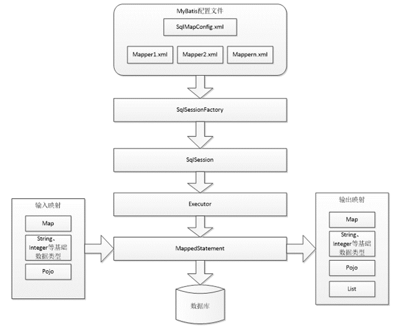

在test目录下开发测试代码并运行


```java
 package com.msb.test;
import com.msb.pojo.Dept;
import org.apache.ibatis.io.Resources;
import org.apache.ibatis.session.SqlSession;
import org.apache.ibatis.session.SqlSessionFactory;
import org.apache.ibatis.session.SqlSessionFactoryBuilder;
import org.junit.After;
import org.junit.Before;
import org.junit.Test;
import java.io.IOException;
import java.io.InputStream;
import java.util.List;
/**

 * @Author: Ma HaiYang
 * @Description: MircoMessage:Mark_7001
    */
    public class Test1 {
    private SqlSession sqlSession;
    @Before
    public void init(){
        SqlSessionFactoryBuilder ssfb =new SqlSessionFactoryBuilder();
        InputStream resourceAsStream = null;
        try {
            resourceAsStream = Resources.getResourceAsStream("sqlMapConfig.xml");
        } catch (IOException e) {
            e.printStackTrace();
        }
        SqlSessionFactory factory=ssfb.build(resourceAsStream) ;
        sqlSession=factory.openSession();
    }
    @Test
    public void testFindAll(){
        // 调用SQL语句
        List<Dept> list = sqlSession.selectList("findAll");
        for (Dept dept : list) {
            System.out.println(dept);
        }
    }
    @After
    public void release(){
        // 关闭SQLSession
        sqlSession.close();
    }
    }
```


# 3 MyBatis配置详解

### 1_log4j1和log4j2的简单配置

项目中添加依赖

```xml
<!-- log4j2 -->
<dependency>
    <groupId>org.apache.logging.log4j</groupId>
    <artifactId>log4j-core</artifactId>
    <version>2.12.1</version>
</dependency>
<!-- log4j1 -->
<dependency>
    <groupId>log4j</groupId>
    <artifactId>log4j</artifactId>
    <version>1.2.17</version>
</dependency>
```


	在mybatis.cfg.xml中配置MyBatis所使用的具体日志实现。如果不指定将自动搜索。可能会搜到log4j，但是如果优先搜到了其他的日志实现呢，所以还是设置为好。这一来log4j就跑不了了。

log4j 1

	将log4j.properties文件负责到src下。另外在其中可以将全局的日志级别调高，避免大量debug信息的干扰。同时将对映射文件的操作调低，可以用来显示SQL语句的调试信息。开发阶段，建议启动控制的日志。

 #定义全局日志级别调试阶段推荐debug

```properties
log4j.rootLogger=debug,stdout 
log4j.appender.stdout=org.apache.log4j.ConsoleAppender
log4j.appender.stdout.Target=System.err
log4j.appender.stdout.layout=org.apache.log4j.SimpleLayout
log4j.appender.logfile=org.apache.log4j.FileAppender
log4j.appender.logfile.File=d:/msb.log
log4j.appender.logfile.layout=org.apache.log4j.PatternLayout
log4j.appender.logfile.layout.ConversionPattern=%d{yyyy-MM-dd HH:mm:ss} %l %F %p %m%n
```

在核心配置文件中可以选择的其他日志处理方式

log4j 2

将log4j2.xml文件负责到resources下。

```xml
 <?xml version="1.0" encoding="UTF-8"?>
<Configuration status="DEBUG">
    <Appenders>
        <Console name="Console" target="SYSTEM_ERR">
            <PatternLayout pattern="%d{YYYY-MM-dd HH:mm:ss} [%t] %-5p %c{1}:%L - %msg%n" />
        </Console>
        <RollingFile name="RollingFile" filename="log/test.log"
                     filepattern="${logPath}/%d{YYYYMMddHHmmss}-fargo.log">
            <PatternLayout pattern="%d{YYYY-MM-dd HH:mm:ss} [%t] %-5p %c{1}:%L - %msg%n" />
            <Policies>
                <SizeBasedTriggeringPolicy size="10 MB" />
            </Policies>
            <DefaultRolloverStrategy max="20" />
        </RollingFile>
    </Appenders>
    <Loggers>
        <Root level="INFO">
            <AppenderRef ref="Console" />
        </Root>
    </Loggers>
</Configuration>
```


核心配置文件中可以指定日志打印方式

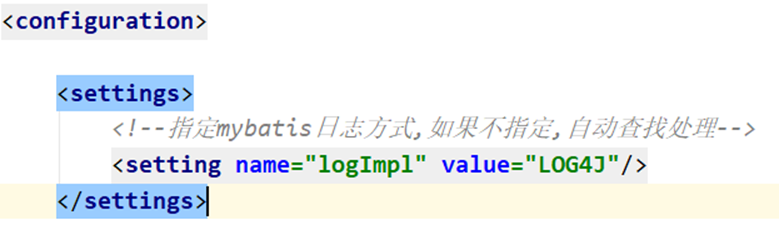


## 2_关于事务配置

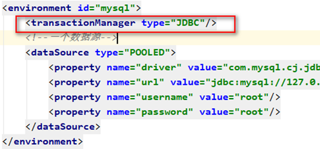

在mybatis核心配置文件中 envirment中 通过transactionManager配置事务的处理策略

<font color=#FF000>JDBC</font> – 这个配置直接简单使用了 JDBC 的提交和回滚设置。它依赖于从数据源得到的连接来管理事务范围。

<font color=#FF000>MANAGED </font>– 这个配置几乎没做什么。它从来不提交或回滚一个连接。而它会让容器来管理事务的整个生命周期(比如 Spring 或 JEE 应用服务器的上下文) 默认情况下它会关闭连接。然而一些容器并不希望这样, 因此如果你需要从连接中停止它,将closeConnection 属性设置为 false. mybatis本身并不做事务的处理,交给其他框架去处理事务,如spring


## 3_关于映射文件的加载方式

1.mapper映射文件的文件路径导入 使用的mapper标签的resource属性

2.网络资源路径 使用的mapper标签的url属性

3.接口的全限定名导入 使用的是mapper标签的class属性 (基于接口的代理模式开发)

4.包扫描形式加载所有的mapper映射文件 使用的是 package标签

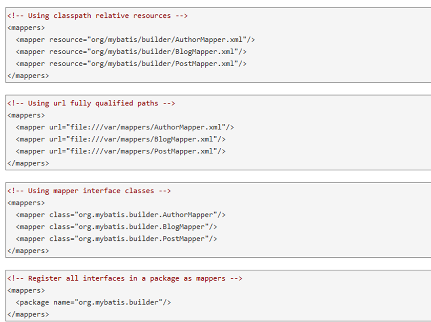

## 4_关于实体类别名处理

在mybatis核心配置文件中使用别名处理

```xml
 <!--设置实体类别名-->
<typeAliases>
    <!--
    通过包扫描给所有的实体类起别名
    给指定报名下的所有类起别名
    默认每个实体类的别名是首字母小写的类名
    Dept   dept
    Emp    emp
    -->
    <package name="com.msb.pojo"/>
</typeAliases>
```


在映射文件的resultType 返回值类型  和paramterType 上就可以使用别名了

```xml
<select id="selectByEmpno"  resultType="emp">
    select * from emp where empno = 7566
</select>
```


## 5_关于外部属性配置文件存储数据库连接信息

在resources下准备jdbc.properties属性配置文件

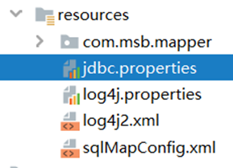


配置文件中的内容

```properties
jdbc_driver=com.mysql.cj.jdbc.Driver
jdbc_url=jdbc:mysql://127.0.0.1:3306/mydb?useSSL=false&useUnicode=true&characterEncoding=UTF-8&serverTimezone=Asia/Shanghai
jdbc_username=root
jdbc_password=root
```

在核心配置文件中引入db.properties属性文件

```xml
 <?xml version="1.0" encoding="UTF-8" ?>
<!-- xml文档约束 约束xml文档中可以有哪些标签,哪些属性,以及标签的包含关系和顺序....
dtd 约束
schema 约束
-->

<!DOCTYPE configuration
        PUBLIC "-//mybatis.org//DTD Config 3.0//EN"
        "http://mybatis.org/dtd/mybatis-3-config.dtd">
<configuration>
    <properties resource="jdbc.properties"></properties>
    <settings>
        <!--设置日志处理方式-->
        <setting name="logImpl" value="LOG4J"/>
    </settings>
    <!--设置实体类别名-->
    <typeAliases>
        <!--
        通过包扫描给所有的实体类起别名
        给指定报名下的所有类起别名
        默认每个实体类的别名是首字母小写的类名
        Dept   dept
        Emp    emp
        -->
        <package name="com.msb.pojo"/>
    </typeAliases>
    <!--配置数据库链接信息-->
    <environments default="mysql">
        <!--数据源1-->
        <environment id="mysql">
            <transactionManager type="JDBC"/>
            <!--一个数据源-->
            <dataSource type="POOLED">
                <property name="driver" value="${jdbc_driver}"/>
                <property name="url" value="${jdbc_url}"/>
                <property name="username" value="${jdbc_username}"/>
                <property name="password" value="${jdbc_password}"/>
            </dataSource>
        </environment>
    </environments>
    <!--加载映射文件的-->
    <mappers>
        <mapper resource="com/msb/mapper/DeptMapper.xml"/>
    </mappers>
</configuration>
```


# 4 MyBatis传统DAO模式开发

>		普通模式,也称为传统DAO模式,就是在传统DAO模式下,定义接口和实现类,如 interface EmpDao  class EmpDaoImpl implements EmpDao.  在实现类中,用SQLSession对象调用select insert delete update 等方法实现.目前极为少见.在传统模式下,我们需要知道SqlSession对象 实现CURD和 参数传递的处理


## 1_sqlSession查询的三种方式

SqlSession对象本身的API中就有三个查询方法,分别能够实现如下查询方式

1返回单个对象 selectOne

2返回对象List集合 selectList

3返回对象Map集合 selectMap

接下来我们就对这三个方法进行一个快速的学习

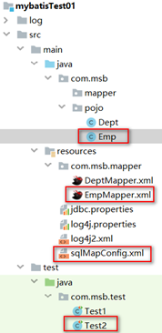


创建Emp实体类

```java
@AllArgsConstructor
@NoArgsConstructor
@Data
public class Emp implements Serializable {
    private Integer empno;
    private String ename;
    private String job;
    private Integer mgr;
    private Date hiredate;
    private Double sal;
    private Double comm;
    private Integer deptno;
}
```

准备Mapper映射文件

```xml
<?xml version="1.0" encoding="UTF-8" ?>
<!DOCTYPE mapper
        PUBLIC "-//mybatis.org//DTD Mapper 3.0//EN"
        "http://mybatis.org/dtd/mybatis-3-mapper.dtd">
<mapper namespace="EmpMapper">
    <!--
    返回单个对象
    public Emp findOne();
    id 相当于方法名
    resultType 相当于返回值类型
        sql语句的查询结果用哪个类来进行封装 如果返回值类型是集合,这里写的也是集合中的元素对应的类,不是集合本身作为类型
    paramaterType 参数类型
    SQL语句就是具体的方法体的实现
    -->
    <select id="findOne" resultType="emp" >
        select * from emp where empno = 7499
    </select>
    <!--
    返回多个对象List集合
    查询全部的员工信息
    public List<Emp> findAll()
    -->
    <select id="findAll" resultType="emp">
        select * from emp
    </select>
    <!--返回多个对象的Map集合
    把查询出来的数据中的某一列作为键,整条数据封装的对象作为值
    public Map<key,Emp> findEmpMap()
    <empno,Emp>
    <key,Emp>
    -->
    <select id="findEmpMap" resultType="map">
        select * from emp
    </select>
</mapper>
```

sqlMapConfig中导入EmpMapper映射文件

```xml
<!--加载mapper映射文件-->
<mappers>
    <mapper resource="com/msb/mapper/DeptMapper.xml"/>
    <mapper resource="com/msb/mapper/EmpMapper.xml"/>
</mappers>

```


测试代码

```java
package com.msb.test;
import com.msb.pojo.Dept;
import com.msb.pojo.Emp;
import org.apache.ibatis.io.Resources;
import org.apache.ibatis.session.SqlSession;
import org.apache.ibatis.session.SqlSessionFactory;
import org.apache.ibatis.session.SqlSessionFactoryBuilder;
import org.junit.After;
import org.junit.Before;
import org.junit.Test;
import java.io.IOException;
import java.io.InputStream;
import java.util.List;
import java.util.Map;
import java.util.Set;
/**

 * @Author: Ma HaiYang
 * @Description: MircoMessage:Mark_7001
    */
    public class Test2 {
    private SqlSession sqlSession;
    @Before
    public void init(){
        SqlSessionFactoryBuilder ssfb =new SqlSessionFactoryBuilder();
        InputStream resourceAsStream = null;
        try {
            resourceAsStream = Resources.getResourceAsStream("sqlMapConfig.xml");
        } catch (IOException e) {
            e.printStackTrace();
        }
        SqlSessionFactory factory=ssfb.build(resourceAsStream) ;
        sqlSession=factory.openSession();
    }
    @Test
    public void testSelectOne(){
        // 查询单个对象
        System.out.println("sqlSession查询单个对象");
        Emp emp = sqlSession.selectOne("findOne");
        System.out.println(emp);
    }
    @Test
    public void testSelectList(){
        // 查询多个对象的List集合
        System.out.println("sqlSession查询对象List集合");
        List<Emp> emps = sqlSession.selectList("EmpMapper.findAll");
        emps.forEach(System.out::println);
    }
    @Test
    public void testSelectMap(){
        // 查询多个对象的Map集合
        System.out.println("sqlSession查询对象Map集合");
        Map<Integer, Emp> empMap = sqlSession.selectMap("findEmpMap", "EMPNO");
        Set<Integer> empnos = empMap.keySet();
        for (Integer empno : empnos) {
            System.out.println(empno+" :" +empMap.get(empno));
        }
    }
    @After
    public void release(){
        // 关闭SQLSession
        sqlSession.close();
    }
}
```

## 2_sqlSession传递参数的三种方式

1 单个基础数据类型作为参数

2 多个基础数据类型的map 集合作为参数

3 引用类型作为参数


Mapper映射文件

```xml
 <?xml version="1.0" encoding="UTF-8" ?>
<!DOCTYPE mapper
        PUBLIC "-//mybatis.org//DTD Mapper 3.0//EN"
        "http://mybatis.org/dtd/mybatis-3-mapper.dtd">
<mapper namespace="EmpMapper2">
    <!--
    参数为一个基本数据类型
    根据员工工号查询员工的全部信息,返回单个员工对象
    public Emp findByEmpno(int empno);
    parameterType 在有参数情况下也是可以省略不写  mybatis 可以根据实际情况自动判断
    如果要写parameterType 那么就要写对
    在SQL语句上可以使用${}  #{} 代表参数的占位
    如果参数是单个基本数据类型,{}中名字可以随便写,见名知意
    ${} 代表mybatis底层使用Statment语句对象,参数是以字符串拼接的形式设置
    #{} 代表mybatis底层使用的preparedStatment语句对象,参数使用?作为占位符处理
    #{} 以后常用
    -->
    <select id="findByEmpno" resultType="emp" parameterType="int">
        select  * from emp where empno = #{empno}
    </select>
    <!--
    参数为map集合
    查询指定部门号和指定最低薪资的员工信息
    20 号部门 且工资在1500以上的员工信息
    public List<Emp> findEmpByDeptnoAndSal(int deptno,double sal);
    <  >  最好要进行转译处理,参照HTML转译  w3school在线文档中有转译符号对应规则
     Map<String,Object> args=new HashMap<>();
        args.put("deptno", 20);
        args.put("sal", 1500.0);
    #{}中写的是map集合中,参数的键
    -->
    <select id="findEmpByDeptnoAndSal" resultType="emp" parameterType="map">
    </select>
    <!--
   参数为对象
   emp >>>  deptno   sal
   参数是我们自定义的类型,那么 #{}中写的是参数的属性名
   -->
    <select id="findEmpByDeptnoAndSal2" resultType="emp" parameterType="emp">
    </select>
</mapper>
```

测试代码

```java
 package com.msb.test;
import com.msb.pojo.Emp;
import org.apache.ibatis.io.Resources;
import org.apache.ibatis.session.SqlSession;
import org.apache.ibatis.session.SqlSessionFactory;
import org.apache.ibatis.session.SqlSessionFactoryBuilder;
import org.junit.After;
import org.junit.Before;
import org.junit.Test;
import java.io.IOException;
import java.io.InputStream;
import java.util.HashMap;
import java.util.List;
import java.util.Map;
import java.util.Set;
/**

 * @Author: Ma HaiYang
 * @Description: MircoMessage:Mark_7001
    */
    public class Test3 {
    private SqlSession sqlSession;
    @Before
    public void init(){
        SqlSessionFactoryBuilder ssfb =new SqlSessionFactoryBuilder();
        InputStream resourceAsStream = null;
        try {
            resourceAsStream = Resources.getResourceAsStream("sqlMapConfig.xml");
        } catch (IOException e) {
            e.printStackTrace();
        }
        SqlSessionFactory factory=ssfb.build(resourceAsStream) ;
        sqlSession=factory.openSession();
    }
    @Test
    public void testSingleArg(){
        // 测试单个基本数据类型作为参数
        Emp emp = sqlSession.selectOne("findByEmpno", 7499);
        System.out.println(emp);
    }
    @Test
    public void testMapArg(){
        // 测试Map集合作为参数
        Map<String,Object> args=new HashMap<>();
        args.put("deptno", 20);
        args.put("sal", 3000.0);
        List<Emp> emps = sqlSession.selectList("findEmpByDeptnoAndSal", args);
        emps.forEach(System.out::println);
    }
    @Test
    public void testEmpArg(){
        // 测试Map集合作为参数
        Emp arg =new Emp();
        arg.setDeptno(10);
        arg.setSal(2000.0);
        List<Emp> emps = sqlSession.selectList("findEmpByDeptnoAndSal2", arg);
        emps.forEach(System.out::println);
    }
    @After
    public void release(){
        // 关闭SQLSession
        sqlSession.close();
    }
}
```

## 3_sqlSession完成DML所有操作

Mapper映射文件

```xml
<?xml version="1.0" encoding="UTF-8" ?>
<!DOCTYPE mapper
        PUBLIC "-//mybatis.org//DTD Mapper 3.0//EN"
        "http://mybatis.org/dtd/mybatis-3-mapper.dtd">
<mapper namespace="EmpMapper3">
    <!--
    增删方法的返回值类型都是int
    resultType就无需指定了
    insert update delete 标签中没有resultType
    但是仍然可以有paramaterType
    -->
    <!-- 增加方法
    public int addEmp(Emp emp);
    -->
    <insert id="addEmp" parameterType="emp">
    </insert>
    <!--修改
    根据工号修改员工姓名
    public int updateEmp(Emp emp);
    -->
    <update id="updateEmp" parameterType="emp">
    </update>
    <!-- 删除
    删除大于给定工号的员工信息
    public int deleteEmp(int empno)
    -->
    <delete id="deleteEmp" parameterType="int">
        delete from emp where empno >= #{empno}
    </delete>
</mapper>
```


测试代码

```java
package com.msb.test;
import com.msb.pojo.Emp;
import org.apache.ibatis.io.Resources;
import org.apache.ibatis.session.SqlSession;
import org.apache.ibatis.session.SqlSessionFactory;
import org.apache.ibatis.session.SqlSessionFactoryBuilder;
import org.junit.After;
import org.junit.Before;
import org.junit.Test;
import java.io.IOException;
import java.io.InputStream;
import java.util.Date;
import java.util.HashMap;
import java.util.List;
import java.util.Map;
/**
 * @Author: Ma HaiYang
 * @Description: MircoMessage:Mark_7001
 */
public class Test4 {
    private SqlSession sqlSession;
    @Before
    public void init(){
        SqlSessionFactoryBuilder ssfb =new SqlSessionFactoryBuilder();
        InputStream resourceAsStream = null;
        try {
            resourceAsStream = Resources.getResourceAsStream("sqlMapConfig.xml");
        } catch (IOException e) {
            e.printStackTrace();
        }
        SqlSessionFactory factory=ssfb.build(resourceAsStream) ;
        sqlSession=factory.openSession(true);
    }
    @Test
    public void testInsert(){
        Emp emp =new Emp(null,"按住啦Baby","SALESMAN",7839,new Date(),3100.0, 200.0,10 );
        int rows = sqlSession.insert("addEmp", emp);
        System.out.println(rows);
        // 手动提交事务
        //sqlSession.commit();
        /*增删改 要提交事务
        * sqlSession.commit();手动提交事务
        * sqlSession=factory.openSession(true); 设置事务自动提交
        * */
    }
    @Test
    public void testUpdate(){
        Emp emp =new Emp( );
        emp.setEname("晓明");
        emp.setEmpno(7937);
        int rows = sqlSession.update("updateEmp", emp);
        System.out.println(rows);
    }
    @Test
    public void testDelete(){
        int rows = sqlSession.delete("deleteEmp", 7936);
        System.out.println(rows);
    }
    @After
    public void release(){
        // 关闭SQLSession
        sqlSession.close();
    }
}
```

# 5 MyBatis代理模式开发

前面已经使用MyBatis完成了对Emp表的CRUD操作，都是由SqlSession调用自身方法发送SQL命令并得到结果的，实现了MyBatis的入门。

但是却存在如下缺点：

1.    不管是selectList()、selectOne()、selectMap()，都是通过SQLSession对象的API完成增删改查,都只能提供一个查询参数。如果要多个参数，需要封装到JavaBean或者Map中，并不一定永远是一个好办法。

2.    返回值类型较固定。

3.    只提供了映射文件，没有提供数据库操作的接口，不利于后期的维护扩展。

在MyBatis中提供了另外一种成为**Mapper代理（或称为接口绑定）**的操作方式。在实际开发中也使用该方式。下面我们就是要Mapper代理的方式来实现对Emp表的CRUD操作吧，还有完成多个参数传递、模糊查询、自增主键回填等更多的技能实现。搭建好的项目框架如图所示，相比而言，增加了接口EmployeeMapper。但是却会引起映射文件和测试类的变化。

 

优点:

1有接口 模块之间有规范了

2参数的处理多样了,接口中的方法参数列表由我们自己决定

3通过代理模式由mybatis提供接口的实现类对象 我们不用写实现类了


项目结构:注意文件路径和文件位置!!!

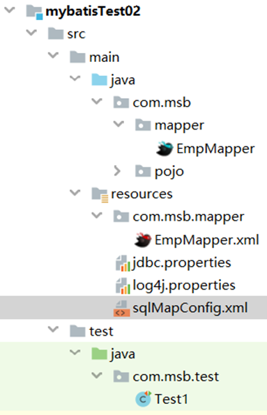


准备接口和mapper映射文件

EmpMapper接口

```java
package com.msb.mapper;
import com.msb.pojo.Emp;
import java.util.List;
/**

 * @Author: Ma HaiYang
 * @Description: MircoMessage:Mark_7001
    */
public interface EmpMapper {
    /**
     * 该方法用于查询全部的员工信息
     * @return 全部员工信息封装的Emp对象的List集合
        */
    List<Emp> findAll();
 }

```


EmpMapper.xml映射文件

```xml
 <?xml version="1.0" encoding="UTF-8" ?>
<!DOCTYPE mapper
        PUBLIC "-//mybatis.org//DTD Mapper 3.0//EN"
        "http://mybatis.org/dtd/mybatis-3-mapper.dtd">
<mapper namespace="com.msb.mapper.EmpMapper">
    <!--
    1 接口的名字和Mapper映射为文件名字必须保持一致(不包含拓展名)
    2 Mapper映射文件的namespace必须是接口的全路径名
    3 sql语句的id必须是对应方法的名
    4 DeptMapper映射文件应该和接口编译之后放在同一个目录下
    -->
    <!--List<Emp> findAll();-->
    <select id="findAll" resultType="emp" >
        select * from emp
    </select>
</mapper>
```


在sqlMapConfig.xml核心配置文件中使用包扫描形式加载所有的映射文件

```xml
 <!--加载mapper映射文件-->
<mappers>
    <!--通过类的全路径去找mapper映射文件-->
    <mapper class="com.msb.mapper.EmpMapper"/>
</mappers>
```


 测试代码

```java
package com.msb.test;
import com.msb.mapper.EmpMapper;
import com.msb.pojo.Dept;
import com.msb.pojo.Emp;
import org.apache.ibatis.io.Resources;
import org.apache.ibatis.session.SqlSession;
import org.apache.ibatis.session.SqlSessionFactory;
import org.apache.ibatis.session.SqlSessionFactoryBuilder;
import org.junit.After;
import org.junit.Before;
import org.junit.Test;
import java.io.IOException;
import java.io.InputStream;
import java.util.List;
/**

 * @Author: Ma HaiYang
 * @Description: MircoMessage:Mark_7001
    */
    public class Test1 {
    private SqlSession sqlSession;
    @Before
    public void init(){
        SqlSessionFactoryBuilder ssfb =new SqlSessionFactoryBuilder();
        InputStream resourceAsStream = null;
        try {
            resourceAsStream = Resources.getResourceAsStream("sqlMapConfig.xml");
        } catch (IOException e) {
            e.printStackTrace();
        }
        SqlSessionFactory factory=ssfb.build(resourceAsStream) ;
        sqlSession=factory.openSession();
    }
    @Test
    public void testFindAll(){
        EmpMapper empMapper=sqlSession.getMapper(EmpMapper.class);
        List<Emp> emps = empMapper.findAll();
        emps.forEach(System.out::println);
    }
    @After
    public void release(){
        // 关闭SQLSession
        sqlSession.close();
    }
}
```


**代理模式浅析**

mybatis是如何通过代理模式实现查询的

这条语句的底层使用了动态代理模式，动态创建一个EmployeeMapper的一个代理对象并赋给接口引用。所以在MyBatis中不需要显式提供Mapper接口的实现类，这也是简单的地方。


# 6 代理模式下开发各种功能

## 1_多种参数传递问题

>1单个基本数据类型
>
>2多个基本数据类型
>
>3单个引用数据类型
>
>4map集合数据类型
>
>5多个引用数据类型

接口

```java
package com.msb.mapper;
import com.msb.pojo.Emp;
import org.apache.ibatis.annotations.Param;
import java.util.List;
import java.util.Map;
/**
 * @Author: Ma HaiYang
 * @Description: MircoMessage:Mark_7001
 */
public interface EmpMapper {
    /**
     * 该方法用于查询全部的员工信息
     * @return 全部员工信息封装的Emp对象的List集合
     */
    List<Emp> findAll();
    /**
     * 根据员工编号查询单个员工信息的方法
     * @param empno 员工编号
     * @return 如果找到了返回Emp对象,找不到返回null
     */
    Emp findByEmpno(int empno);
    /**
     * 根据员工编号和薪资下限去查询员工信息
     * @param empno 员工编号
     * @param sal 薪资下限
     * @return 多个Emp对象的List集合
     */
    List<Emp> findByDeptnoAndSal(@Param("deptno") int deptno,@Param("sal") double sal);
    List<Emp> findByDeptnoAndSal2(Map<String,Object> map);
    List<Emp> findByDeptnoAndSal3(Emp emp);
    List<Emp> findByDeptnoAndSal4(@Param("empa") Emp empa,@Param("empb") Emp empb);
}

```

mapper映射文件

```xml
<?xml version="1.0" encoding="UTF-8" ?>
<!DOCTYPE mapper
        PUBLIC "-//mybatis.org//DTD Mapper 3.0//EN"
        "http://mybatis.org/dtd/mybatis-3-mapper.dtd">
<mapper namespace="com.msb.mapper.EmpMapper">
    <!--
    1 接口的名字和Mapper映射为文件名字必须保持一致(不包含拓展名)
    2 Mapper映射文件的namespace必须是接口的全路径名
    3 sql语句的id必须是对应方法的名
    4 DeptMapper映射文件应该和接口编译之后放在同一个目录下
    -->
    <!--List<Emp> findAll();-->
    <select id="findAll" resultType="emp" >
        select * from emp
    </select>
    <!--
    单个基本数据类型作为方法参数
    #{}中可以随便写,遵循见名知意
    Emp findByEmpno(int empno);
    -->
    <select id="findByEmpno" resultType="emp" >
        select * from emp where empno =#{empno}
    </select>
    <!--
     多个基本数据类型作为方法参数
     List<Emp> findByDeptnoAndSal(@Param("detpno") int deptno,@Param("sal") double sal);
     方式1 arg*     arg0 arg1 arg2 数字是索引,从0开始
     方式2 param*   param1 param2 param3 数字是编号,从1开始
     使用别名
     List<Emp> findByDeptnoAndSal(@Param("detpno") int deptno,@Param("sal") double sal);
     通过@Param注解使用别名之后,就不能再使用arg* 但是可以继续使用param*
    -->
    <select id="findByDeptnoAndSal" resultType="emp">
    </select>
    <!--
    参数是map,{}写键的名字
    -->
    <select id="findByDeptnoAndSal2" resultType="emp" parameterType="map" >
    </select>
    <!--单个引用类型,{}中写的使用对象的属性名-->
    <select id="findByDeptnoAndSal3" resultType="emp" parameterType="emp" >
    </select>
    <!--
    多个引用类型作为方法参数
     List<Emp> findByDeptnoAndSal4(@Param("empa") Emp empa,@Param("empb") Emp empb);
     如果用@Param定义了别名,那么就不能使用arg*.属性名,但是可以使用param*.属性名和别名.属性名
    -->
    <select id="findByDeptnoAndSal4" resultType="emp"  >
    </select>
</mapper>

```

测试 代码

```java
package com.msb.testDemo;
import com.msb.mapper.EmpMapper;
import com.msb.pojo.Emp;
import com.msb.util.SqlSessionUtil;
import org.apache.ibatis.session.SqlSession;
import java.util.List;
public class Test1 {
    public static void main(String[] args) {
        SqlSession sqlSession = SqlSessionUtil.getSqlSession(true);
        /*
        * 帮助我们生成一个接口下的实现类对象的
        *
        * */
        EmpMapper mapper = sqlSession.getMapper(EmpMapper.class);
        List<Emp> emps = mapper.getAllEmp();
        for(Emp emp:emps) {
            System.out.println(emp);
        }
        // 1单个基本数据类型作为方法参数
        Emp emp = mapper.getByEmpno(7902);
        System.out.println(emp);
        // 2多个基本数据类型作为方法参数
        List<Emp> emps2 = mapper.getByDeptnoAndSal(10, 1500);
        for(Emp em:emps2) {
            System.out.println(em);
        }
        // 3单个引用类型作为方法参数
        Emp condition=new Emp();
        condition.setDeptno(10);
        condition.setSal(1500.0);
        List<Emp> emps3 = mapper.getByDeptnoAndSal2(condition);
        for(Emp em:emps3) {
            System.out.println(em);
        }
        // 4多个引用类型作为方法参数
        Emp condition1=new Emp();
        condition1.setDeptno(10);
        Emp condition2=new Emp();
        condition2.setSal(1500.0);
        List<Emp> emps4 = mapper.getByDeptnoAndSal3(condition1,condition2);
        for(Emp em:emps4) {
            System.out.println(em);
        }
        sqlSession.close();
    }
}
```


## 2 模糊查询功能

	在进行模糊查询时，在映射文件中可以使用concat()函数来连接参数和通配符。另外注意对于特殊字符，比如<，不能直接书写，应该使用字符实体替换。

接口

```java
/**
 * 根据名字做模糊查询
 * @param name 模糊查询的文字
 * @return  Emp对象List集合
 */
List<Emp> findByEname( String name);
```

mapper映射文件

```xml
<!--List<Emp> getByName(String name);-->
<select id="findByEname"  resultType="emp" >
    select * from emp where ename like concat('%',#{name},'%')
</select>
```


## 3_主键自增回填

	MySQL支持主键自增。有时候完成添加后需要立刻获取刚刚自增的主键，由下一个操作来使用。比如结算构造车后，主订单的主键确定后，需要作为后续订单明细项的外键存在。如何拿到主键呢，MyBatis提供了支持，可以非常简单的获取。


接口

```java
public interface DeptMapper {
    int addDept(Dept dept);
    int addDept2(Dept dept);
}
```

mapper映射文件

```xml
<mapper namespace="com.msb.mapper.DeptMapper">
   <!-- int addDept(Dept dept);
   useGeneratedKeys="true" 返回数据库帮我们生成的主键
   keyProperty="deptno" 生成的主键值用我们dept对象那个属性存储
   -->
    <insert id="addDept" parameterType="dept" useGeneratedKeys="true" keyProperty="deptno">
    </insert>
    <insert id="addDept2" parameterType="dept">
        <selectKey order="AFTER" keyProperty="deptno"  resultType="int">
            select @@identity
        </selectKey>
    </insert>
</mapper>

```

测试代码

```java
SqlSession sqlSession = SqlSessionUtil.getSqlSession(true);
DeptMapper mapper = sqlSession.getMapper(DeptMapper.class);
Dept dept =new Dept(null,"AI学院","北京");
int i = mapper.addDept2(dept);
System.out.println(i);
System.out.println(dept.getDeptno());
sqlSession.close();

```

方式1

useGeneratedKeys：表示要使用自增的主键

keyProperty：表示把自增的主键赋给JavaBean的哪个成员变量。

以添加Dept对象为例，添加前Dept对象的deptno是空的，添加完毕后可以通过getDeptno() 获取自增的主键。

方式2

order：取值AFTER|BEFORE，表示在新增之后|之前执行<selectKey>中的SQL命令

keyProperty：执行select @@identity后结果填充到哪个属性中

resultType：结果类型。


**技术扩展**
在很多应用场景中需要新增数据后获取到新增数据的主键值，针对这样的需求一般由三种解决方式：

* 主键自定义，用户通过UUID或时间戳等方式生成唯一主键，把这个值当做主键值。在分布式场景中应用较多。
* 查询后通过select max(主键) from 表获取主键最大值。这种方式在多线程访问情况下可能出现问题。
* 查询后通过select @@identity获取最新生成主键。要求这条SQL必须在insert操作之后，且数据库连接没有关闭。

## 4_实现DML操作

EmpMapper接口

```java
/**
 * 增加员工信息
 * @param emp 存储新增员工信息的Emp对象
 * @return 对数据库数据产生影响的行数
 */
int addEmp(Emp emp);
/**
 * 根据员工编号修改员工姓名的方法
 * @param empno 要修改的员工编号
 * @param ename 修改之后的新的员工名字
 * @return 对数据库数据产生影响的行数
 */
int updateEnameByEmpno(@Param("empno") int empno,@Param("ename") String ename);
/**
 * 根据员工编号删除员工信息
 * @param empno 要删除的员工编号
 * @return 对数据库数据产生影响的行数
 */
int deleteByEmpno(int empno);
```

EmpMapper映射 文件

```xml
<!--int addEmp(Emp emp);-->
<insert id="addEmp" >
</insert>
<!--int updateEnameByEmpno(@Param("empno") int empno,@Param("ename") String ename);-->
<update id="updateEnameByEmpno" >
</update>
<!--int deleteByEmpno(int empno);-->
<update id="deleteByEmpno" >
    delete from emp where empno =#{empno}
</update>
```

测试代码

```java
package com.msb.test;
import com.msb.mapper.DeptMapper;
import com.msb.mapper.EmpMapper;
import com.msb.pojo.Dept;
import com.msb.pojo.Emp;
import org.apache.ibatis.io.Resources;
import org.apache.ibatis.session.SqlSession;
import org.apache.ibatis.session.SqlSessionFactory;
import org.apache.ibatis.session.SqlSessionFactoryBuilder;
import org.junit.After;
import org.junit.Before;
import org.junit.Test;
import java.io.IOException;
import java.io.InputStream;
import java.util.Date;
/**
 * @Author: Ma HaiYang
 * @Description: MircoMessage:Mark_7001
 */
public class Test3 {
    private SqlSession sqlSession;
    @Before
    public void init(){
        SqlSessionFactoryBuilder ssfb =new SqlSessionFactoryBuilder();
        InputStream resourceAsStream = null;
        try {
            resourceAsStream = Resources.getResourceAsStream("sqlMapConfig.xml");
        } catch (IOException e) {
            e.printStackTrace();
        }
        SqlSessionFactory factory=ssfb.build(resourceAsStream) ;
        sqlSession=factory.openSession();
    }
    @Test
    public void testAddEmp(){
        EmpMapper mapper = sqlSession.getMapper(EmpMapper.class);
        mapper.addEmp(new Emp(null, "TOM", "SALESMAN", 7521, new Date(), 2314.0, 100.0, 10));
        sqlSession.commit();
    }
    @Test
    public void testUpdateEnameByEmpno(){
        EmpMapper mapper = sqlSession.getMapper(EmpMapper.class);
        mapper.updateEnameByEmpno(7938, "TOM");
        sqlSession.commit();
    }
    @Test
    public void testDeletByEmpno(){
        EmpMapper mapper = sqlSession.getMapper(EmpMapper.class);
        mapper.deleteByEmpno(7938);
        sqlSession.commit();
    }
    @After
    public void release(){
        // 关闭SQLSession
        sqlSession.close();
    }
}

```

# 7 动态SQL

	经常遇到很多按照很多查询条件进行查询的情况，比如京东根据不同的条件筛选商品。其中经常出现很多条件不取值的情况，在后台应该如何完成最终的SQL语句呢？

 


	如果采用JDBC进行处理，需要根据条件是否取值进行SQL语句的拼接，一般情况下是使用StringBuilder类及其append方法实现，还是有些繁琐的。如果你有使用 JDBC 或其它类似框架的经验，你就能体会到根据不同条件拼接 SQL语句的痛苦。例如拼接时要确保不能忘记添加必要的空格，还要注意去掉列表最后一个列名的逗号。利用动态 SQL 这一特性可以彻底摆脱这种痛苦。
	
	MyBatis在简化操作方法提出了动态SQL功能，将使用Java代码拼接SQL语句，改变为在XML映射文件中截止标签拼接SQL语句。相比而言，大大减少了代码量，更灵活、高度可配置、利于后期维护。
	
	MyBatis中动态SQL是编写在mapper.xml中的，其语法和JSTL类似，但是却是基于强大的OGNL表达式实现的。
	
	MyBatis也可以在注解中配置SQL，但是由于注解功能受限，尤其是对于复杂的SQL语句，可读性很差，所以较少使用。


## 1_if标签

接口

 ```java
public interface EmpMapper2 {
   List<Emp> findByCondition(Emp emp);
}
 ```

映射文件

```xml
<?xml version="1.0" encoding="UTF-8" ?>
<!DOCTYPE mapper
        PUBLIC "-//mybatis.org//DTD Mapper 3.0//EN"
        "http://mybatis.org/dtd/mybatis-3-mapper.dtd">
<mapper namespace="com.msb.mapper.EmpMapper2">
<!--List<Emp> findByCondition(Emp emp);-->
    <select id="findByCondition" resultType="emp">
        select * from emp where 1=1
        <if test="empno != null">
            and empno =#{empno}
        </if>
        <if test="ename != null and ename != ''">
            and ename like concat('%',#{ename},'%')
        </if>
        <if test="job != null and job != ''">
            and job =#{job}
        </if>
        <if test="mgr != null">
            and mgr =#{mgr}
        </if>
        <if test="hiredate != null">
            and hiredate =#{hiredate}
        </if>
        <if test="sal != null">
            and sal =#{sal}
        </if>
        <if test="comm != null">
            and comm =#{comm}
        </if>
        <if test="deptno != null">
            and deptno =#{deptno}
        </if>
    </select>
</mapper>

```

测试代码

```java
public static void main(String[] args) {
    SqlSession sqlSession = MyBatisUtil.getSqlSession(false);
    EmpMapper2 mapper = sqlSession.getMapper(EmpMapper2.class);
    Emp condition =new Emp();
   /* condition.setDeptno(20);*/
   /* condition.setSal(3000.0);*/
   /*condition.setHiredate(new java.sql.Date(81,1,22));*/
   condition.setComm(0.0);
   condition.setDeptno(20);
    List<Emp> emps = mapper.findEmpByCondition(condition);
    for (Emp e:emps
         ) {
        System.out.println(e);
    }
}

```

## 2_where标签

> 用于处理where关键字和and
>
> 默认删除第一个and逻辑连接符

```xml
<select id="findEmpByCondition" resultType="emp">
    select * from emp
    <where>
        <if test="empno != null">
            and empno= #{empno}
        </if>
        <if test="ename != null and ename != ''">
            and ename= #{ename}
        </if>
        <if test="job != null and job != ''">
            and job= #{job}
        </if>
        <if test="mgr != null ">
            and mgr= #{mgr}
        </if>
        <if test="hiredate != null ">
            and hiredate= #{hiredate}
        </if>
        <if test="sal != null">
            and sal= #{sal}
        </if>
        <if test="comm != null ">
             and comm =#{comm}
        </if>
        <if test="deptno != null ">
            and deptno= #{deptno}
        </if>
    </where>
</select>

```


## 3_choose标签

前面的when条件成立 后面的 when就不再判断了

```xml
 <select id="findEmpByCondition2" resultType="emp">
    select * from emp
    <where>
        <choose>
            <when test="empno != null">
                and empno= #{empno}
            </when>
            <when test="ename != null and ename != ''">
                and ename= #{ename}
            </when>
            <when test="job != null and job != ''">
                and job= #{job}
            </when>
            <when test="mgr != null ">
                and mgr= #{mgr}
            </when>
            <when test="hiredate != null ">
                and hiredate= #{hiredate}
            </when>
            <when test="sal != null">
                and sal= #{sal}
            </when>
            <when test="comm != null ">
                and comm =#{comm}
            </when>
            <when test="deptno != null ">
                and deptno= #{deptno}
            </when>
        </choose>
    </where>
</select>

```


## 4_set标签

接口

```java
 int updateEmpByCondtion(Emp emp);
```


映射文件

```xml
 <!--int updateEmpByCondtion(Emp emp);-->
<update id="updateEmpByCondtion" >
    update emp
    <set>
        <if test="ename != null and ename != '' ">
            , ename =#{ename}
        </if>
        <if test="job != null and ename != '' ">
            , job =#{job}
        </if>
        <if test="mgr != null ">
            , mgr =#{mgr}
        </if>
        <if test="hiredate != null ">
            , hiredate =#{hiredate}
        </if>
        <if test="sal != null ">
            , sal =#{sal}
        </if>
        <if test="comm != null ">
            , comm =#{comm}
        </if>
        <if test="deptno != null ">
            , deptno =#{deptno}
        </if>
    </set>
    where empno =#{empno}
</update>
```

## 5_trim标签

> Trim 标签处理 set  ，可以为他包裹起来的SQL语句前后 增加/删除 关键词/固定字符

````xml
<update id="updateEmpByCondition2" >
    update emp
    <!--prefix 要增加什么前缀
    prefixOverrides 要去除什么前缀
    suffix 要增加什么后缀
    suffixOverrides 要去除什么后缀
    set 是trim的一种特殊情况
    -->
    <trim prefix="set"  suffixOverrides="," >
        <if test="ename != null and ename != ''">
            ename= #{ename},
        </if>
        <if test="job != null and job != ''">
            job= #{job},
        </if>
        <if test="mgr != null ">
            mgr= #{mgr},
        </if>
        <if test="hiredate != null ">
            hiredate= #{hiredate},
        </if>
        <if test="sal != null">
            sal= #{sal},
        </if>
        <if test="comm != null ">
            comm =#{comm},
        </if>
        <if test="deptno != null ">
            deptno= #{deptno},
        </if>
    </trim>
    where  empno = #{empno}
</update>
````

Trim标签  处理where

```xml
	<select id="findByCondition" resultMap="EmpMap">
        select * from emp 
        <trim prefix="where" prefixOverrides="and">
            <if test="empno != null">
                and empno =#{empno}
            </if>
            <if test="ename != null and ename != ''">
                <bind name="likePattern" value="'%'+ename+'%'"/>
                and ename like #{likePattern}
            </if>
            <if test="job != null and job != ''">
                and job =#{job}
            </if>
            <if test="mgr != null">
                and mgr =#{mgr}
            </if>
            <if test="hiredate != null">
                and hiredate =#{hiredate}
            </if>
            <if test="sal != null">
                and sal =#{sal}
            </if>
            <if test="comm != null">
                and comm =#{comm}
            </if>
            <if test="deptno != null">
                and deptno =#{deptno}
            </if>
        </trim>
    </select>
```

## 6_bind标签

一般用于处理模糊查询的模板

接口

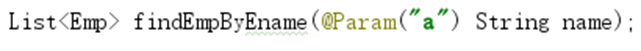


SQL语句

```xml
<!-- bind 写一个局部SQL模板，模糊 like 常用-->
    <select id="findEmpByEname" resultMap="EmpMap">
        <bind name="likePatten" value="'%'+param1+'%'"/>
        select * from emp where ename like #{likePatten};
    </select>
```


## 7_nclude

引用提前写好的 SQL 标签的SQL语句

```xml
	<sql id="empColumn">empno,ename,job,mgr,hiredate,sal,comm,deptno</sql>
	<sql id="baseSelect">
        select <include refid="empColumn"></include> from emp
	</sql>
```


## 8_sql标签

```xml
 <sql id="empColumn">empno,ename,job,mgr,hiredate,sal,comm,deptno</sql>
<sql id="baseSelect">select <include refid="empColumn"></include> from emp</sql>
<!--List<Emp> findByCondition(Emp emp);-->
<select id="findByCondition" resultType="emp">
    <include refid="baseSelect"></include>
    <trim prefix="where" prefixOverrides="and">
        <if test="empno != null">
            and empno =#{empno}
        </if>
        <if test="ename != null and ename != ''">
            <bind name="likePattern" value="'%'+ename+'%'"/>
            and ename like #{likePattern}
        </if>
        <if test="job != null and job != ''">
            and job =#{job}
        </if>
        <if test="mgr != null">
            and mgr =#{mgr}
        </if>
        <if test="hiredate != null">
            and hiredate =#{hiredate}
        </if>
        <if test="sal != null">
            and sal =#{sal}
        </if>
        <if test="comm != null">
            and comm =#{comm}
        </if>
        <if test="deptno != null">
            and deptno =#{deptno}
        </if>
    </trim>
</select>

```

## 9_foreach标签

```xml
 <!--List<Emp> findByEmpnos1(int[] empnos);
 collection=""  遍历的集合或者是数组
                 参数是数组,collection中名字指定为array
                 参数是List集合,collection中名字指定为list
 separator=""   多个元素取出的时候 用什么文字分隔
 open=""        以什么开头
 close=""       以什么结尾
 item=""        中间变量名
 for(Person per:PersonList)
 -->
 <select id="findByEmpnos1" resultType="emp">
     select * from emp  where empno in
     <foreach collection="array" separator="," open="(" close=")" item="deptno">
         #{deptno}
     </foreach>
 </select>
<!-- List<Emp> findByEmpnos2(List<Integer> empnos);-->
 <select id="findByEmpnos2" resultType="emp">
     select * from emp  where empno in
     <foreach collection="list" separator="," open="(" close=")" item="deptno">
         #{deptno}
     </foreach>
 </select>

```


# 8 MyBatis实现多表查询

前面已经使用MyBatis完成了对Emp表的CRUD操作，不管是使用SqlSession直接操作，还是使用Mapper代理方式，都只是完成了对单个数据库表的操作。这肯定是远远不够的。

在实际开发中，经常会将来自多张表的数据在一个位置显示。比如查询并显示的员工信息中会有来自部门表、岗位表的数据，而后台一般是定义一个方法


## 1 关联查询

### 1 手动处理映射关系

实体类

```java
public class Emp  implements Serializable {
    private Integer empno;
    private String name;
    private String job;
    private Integer mgr;
    private Date hiredate;
    private Double sal;
    private Double comm;
    private Integer deptno;
}
```

映射文件

```xml
<mapper namespace="com.msb.mapper.EmpMapper">
    <!--手动处理数据库查询字段和封装实体类属性之间的映射关系
    1 主键一般使用id属性
    2 当属性名和查询出的数据表字段名相同 可以不写映射关系
    -->
    <resultMap id="empMap" type="emp">
        <!--<id property="empno" column="empno"></id>-->
        <result property="name" column="ename"></result>
        <!--<result property="job" column="job"></result>
        <result property="sal" column="sal"></result>
        <result property="hiredate" column="hiredate"></result>
        <result property="mgr" column="mgr"></result>
        <result property="comm" column="comm"></result>
        <result property="deptno" column="deptno"></result>-->
    </resultMap>
    <select id="findByEmpno" resultMap="empMap" >
        select * from emp where empno =#{empno}
    </select>
</mapper>

```

### 2 一对一关联查询

数据准备: 创建项目表和项目记录表

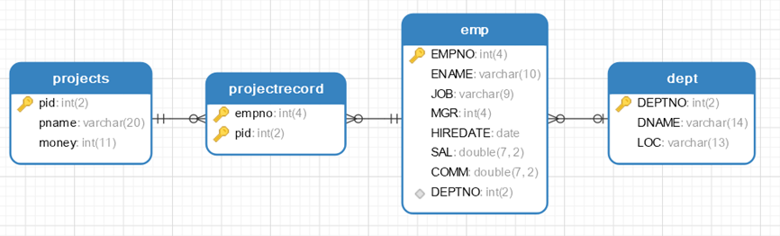


```sql
CREATE TABLE `projects`  (
  `pid` int(2) NOT NULL AUTO_INCREMENT,
  `pname` varchar(20) CHARACTER SET utf8mb4 COLLATE utf8mb4_0900_ai_ci NOT NULL,
  `money` int(11) NULL DEFAULT NULL,
  PRIMARY KEY (`pid`) USING BTREE
) ENGINE = InnoDB CHARACTER SET = utf8mb4 COLLATE = utf8mb4_0900_ai_ci ROW_FORMAT = Dynamic;
INSERT INTO `projects` VALUES (1, ' ***大学OA', 500000);
INSERT INTO `projects` VALUES (2, '学生选课系统', 100000);
INSERT INTO `projects` VALUES (3, '讲师测评系统', 20000);
INSERT INTO `projects` VALUES (4, '线上问答系统 ', 20000);
CREATE TABLE `projectrecord`  (
  `empno` int(4) NOT NULL,
  `pid` int(2) NOT NULL,
  PRIMARY KEY (`empno`, `pid`) USING BTREE,
  INDEX `fk_project_pro`(`pid`) USING BTREE,
  CONSTRAINT `fk_emp_pro` FOREIGN KEY (`empno`) REFERENCES `emp` (`EMPNO`) ON DELETE CASCADE ON UPDATE CASCADE,
  CONSTRAINT `fk_project_pro` FOREIGN KEY (`pid`) REFERENCES `projects` (`pid`) ON DELETE CASCADE ON UPDATE CASCADE
) ENGINE = InnoDB CHARACTER SET = utf8mb4 COLLATE = utf8mb4_0900_ai_ci ROW_FORMAT = Dynamic;
INSERT INTO `projectrecord` VALUES (7369, 1);
INSERT INTO `projectrecord` VALUES (7521, 1);
INSERT INTO `projectrecord` VALUES (7369, 2);
INSERT INTO `projectrecord` VALUES (7499, 2);
INSERT INTO `projectrecord` VALUES (7521, 2);
INSERT INTO `projectrecord` VALUES (7369, 3);
INSERT INTO `projectrecord` VALUES (7499, 3);
INSERT INTO `projectrecord` VALUES (7521, 3);
INSERT INTO `projectrecord` VALUES (7369, 4);
INSERT INTO `projectrecord` VALUES (7499, 4);
```


需求:根据编号查询员工信息及所在的部门信息

实体类添加一个部门作为属性


实体类

```java
@AllArgsConstructor
@NoArgsConstructor
@Data
public class Emp implements Serializable {
    private Integer empno;
    private String ename;
    private String job;
    private Integer mgr;
    private Date hiredate;
    private Double sal;
    private Double comm;
    private Integer deptno;
    // 组合一个Dept对象作为自己的属性
    private Dept dept;
}

```

接口

```java
public interface EmpMapper {
    /**
     * 根据员工编号查询员工的所有信息并携带所在的部门信息
     * @param empno 要查询的员工编号
     * @return Emp对象,组合了Dept对象作为属性,对部门信息进行存储
     */
    Emp findEmpJoinDeptByEmpno(int empno);
}
```

映射文件

```xml
<?xml version="1.0" encoding="UTF-8" ?>
<!DOCTYPE mapper
        PUBLIC "-//mybatis.org//DTD Mapper 3.0//EN"
        "http://mybatis.org/dtd/mybatis-3-mapper.dtd">
<mapper namespace="com.msb.mapper.EmpMapper">
    <!--Emp findEmpJoinDeptByEmpno(int empno);-->
    <resultMap id="empJoinDept" type="emp">
        <!--设置emp本身的八个属性的映射关系-->
        <id property="empno" column="empno"></id>
        <result property="ename" column="ename"></result>
        <result property="job" column="job"></result>
        <result property="sal" column="sal"></result>
        <result property="hiredate" column="hiredate"></result>
        <result property="mgr" column="mgr"></result>
        <result property="comm" column="comm"></result>
        <result property="deptno" column="deptno"></result>
        <!--
        association 处理一对一
        封装一对一信息关系的标签
        property  emp类的属性名
        javaType  用哪个类的对象给属性赋值
        -->
        <association property="dept" javaType="dept">
            <id column="deptno" property="deptno"></id>
            <result column="dname" property="dname"></result>
            <result column="loc" property="loc"></result>
        </association>
    </resultMap>
    <select id="findEmpJoinDeptByEmpno" resultMap="empJoinDept" >
        select * from
        emp e
        left join dept  d
        on e.deptno =d.deptno
        where empno = #{empno}
    </select>
</mapper>

```

测试代码

```java
@Test
public void testOneToOne() throws ParseException {
    EmpMapper mapper = sqlSession.getMapper(EmpMapper.class);
    Emp emp = mapper.findEmpJoinDeptByEmpno(7499);
    System.out.println(emp);
}
```


3 一对多关联查询

根据部门号查询部门信息及该部门的所有员工信息

实体类

```java
@Data
@AllArgsConstructor
@NoArgsConstructor
public class Dept implements Serializable {
    private Integer deptno;
    private String dname;
    private String loc;
    // 组合一个Emp的List集合作为属性
    private List<Emp> empList;
}
```

接口

```java
package com.msb.mapper;
import com.msb.pojo.Dept;
/**
 * @Author: Ma HaiYang
 * @Description: MircoMessage:Mark_7001
 */
public interface DeptMapper {
    /**
     * 根据部门编号查询部门信息及该部分的所有员工信息
     * @param deptno 要查询的部门编号
     * @return Dept对象,内部组合了一个Emp的List属性用于封装部门的所有员工信息
     */
    Dept findDeptJoinEmpsByDeptno(int deptno);
}

```

映射文件

```xml
<?xml version="1.0" encoding="UTF-8" ?>
<!DOCTYPE mapper
        PUBLIC "-//mybatis.org//DTD Mapper 3.0//EN"
        "http://mybatis.org/dtd/mybatis-3-mapper.dtd">
<mapper namespace="com.msb.mapper.DeptMapper">
    <!--Dept findDeptJoinEmpsByDeptno(int deptno);-->
    <resultMap id="deptJoinEmps" type="dept">
        <id column="deptno" property="deptno"></id>
        <result column="dname" property="dname"></result>
        <result column="loc" property="loc"></result>
        <!--处理一对多关系的标签-->
        <collection property="empList" ofType="emp" >
            <!--设置emp本身的八个属性的映射关系-->
            <id property="empno" column="empno"></id>
            <result property="ename" column="ename"></result>
            <result property="job" column="job"></result>
            <result property="sal" column="sal"></result>
            <result property="hiredate" column="hiredate"></result>
            <result property="mgr" column="mgr"></result>
            <result property="comm" column="comm"></result>
            <result property="deptno" column="deptno"></result>
        </collection>
    </resultMap>
    <select id="findDeptJoinEmpsByDeptno" resultMap="deptJoinEmps">
        select * from dept d left join emp e on d.deptno =e.deptno where d.deptno =#{deptno}
    </select>
</mapper>

```

测试代码

```java
@Test
public void testOneToMany() throws ParseException {
    DeptMapper mapper = sqlSession.getMapper(DeptMapper.class);
    Dept dept = mapper.findDeptJoinEmpsByDeptno(20);
    System.out.println(dept);
    System.out.println("---------");
    List<Emp> empList = dept.getEmpList();
    empList.forEach(System.out::println);
}

```

4 多对多关联查询

根据项目编号查询项目信息,以及参与到该项目之中的所有的员工信息

实体类

```java
@NoArgsConstructor
@AllArgsConstructor
@Data
public class Project  implements Serializable {
    private Integer pid;
    private String pname;
    private Integer money;
    // 组合一个ProjectRecord对象集合作为属性
    private List<ProjectRecord> projectRecords;
}
@Data
@AllArgsConstructor
@NoArgsConstructor
public class ProjectRecord implements Serializable {
    private Integer empno;
    private Integer pid;
    // 组合一个Emp对象作为属性
    private Emp emp;
}

```

接口

```java
package com.msb.mapper;
import com.msb.pojo.Emp;
import com.msb.pojo.Project;
/**
 * @Author: Ma HaiYang
 * @Description: MircoMessage:Mark_7001
 */
public interface ProjectMapper {
    /**
     * 根据项目编号查询一个项目信息及参与该项目的所有员工信息
     * @param pid 项目编号
     * @return 所有信息封装的Project对象
     */
    Project findProjectJoinEmpsByPid(int pid);
}
```

映射文件

```xml
<!DOCTYPE mapper
        PUBLIC "-//mybatis.org//DTD Mapper 3.0//EN"
        "http://mybatis.org/dtd/mybatis-3-mapper.dtd">
<mapper namespace="com.msb.mapper.ProjectMapper">
    <!--Project findProjectJoinEmpsByPid(int pid);-->
    <resultMap id="projectJoinEmps" type="project">
        <id column="pid" property="pid"></id>
        <result column="pname" property="pname"></result>
        <result column="money" property="money"></result>
        <!--一对多 集合属性 collection-->
        <collection property="projectRecords" ofType="projectRecord">
            <id column="empno" property="empno"></id>
            <id column="pid" property="pid"></id>
            <!--一对一 -->
            <association property="emp" javaType="emp">
                <id property="empno" column="empno"></id>
                <result property="ename" column="ename"></result>
                <result property="job" column="job"></result>
                <result property="sal" column="sal"></result>
                <result property="hiredate" column="hiredate"></result>
                <result property="mgr" column="mgr"></result>
                <result property="comm" column="comm"></result>
                <result property="deptno" column="deptno"></result>
            </association>
        </collection>
    </resultMap>
    <select id="findProjectJoinEmpsByPid"  resultMap="projectJoinEmps">
        select * from
        project p
        left join projectrecord pr
        on p.pid = pr.pid
        left join emp e
        on e.empno = pr.empno
        where p.pid= #{pid}
    </select>
</mapper>
```

测试代码

```java
@Test
public void testManyToMany() throws ParseException {
    ProjectMapper mapper = sqlSession.getMapper(ProjectMapper.class);
    Project project = mapper.findProjectJoinEmpsByPid(2);
    System.out.println(project.getPid());
    System.out.println(project.getPname());
    System.out.println(project.getMoney());
    List<ProjectRecord> projectRecords = project.getProjectRecords();
    for (ProjectRecord projectRecord : projectRecords) {
        Emp emp = projectRecord.getEmp();
        System.out.println(emp);
    }
}
```

## 2 级联查询

级联查询，顾名思义，就是利于数据库表间的外键关联关系进行自动的级联查询操作。使用MyBatis实现级联查询，除了实体类增加关联属性外，还需要在映射文件中进行配置。

### 1 立即加载


### 2 延迟加载

**延迟加载，又称按需加载**。延迟加载的内容等到真正使用时才去进行加载（查询）。多用在关联对象或集合中。

延迟加载的好处：先从单表查询、需要时再从关联表去关联查询，大大降低数据库在单位时间内的查询工作量,将工作在时间上的分配更加均匀，而且单表要比关联查询多张表速度要快。

延迟加载的设置

第一步：全局开关：在sqlMapConfig.xml中打开延迟加载的开关。配置完成后所有的association和collection元素都生效

 

```xml
  <settings>
      <setting name="lazyLoadingEnabled" value="true"/>
      <setting name="aggressiveLazyLoading" value="true"/>
  </settings>
```


<font color=#008000>lazyLoadingEnabled</font>:是否开启延迟加载。是Mybatis是否启用懒加载的全局开关。当开启时，所有关联对象都会延迟加载。特定关联关系中可通过设置fetchType属性来覆盖该项的开关状态

<font color=#008000 >aggressiveLazyLoading</font>：当开启时，任何方法的调用都会懒加载对象的所有属性。否则，每个属性会按需加载,

第二步：分开关：指定的association和collection元素中配置<font color=#0000FF>fetchType</font>属性。eager：表示立刻加载；lazy：表示延迟加载。**将覆盖全局延迟设置。**

## 3 总结

#### resultMap中的常见属性

<table style="text-align: center;" cellpadding="30" >
    <tr style="background-color:#E2EFD9 ;">
			<td>property</td>
			<td>需要映射到JavaBean 的属性名称</td>
		</tr>
		<tr>
			<td >javaType</td>
			<td>property的类型，一个完整的类名，或者是一个类型别名。如果你匹配的是一个JavaBean，那MyBatis 通常会自行检测到</td>
		</tr>
		<tr style="background-color:#E2EFD9 ;">
			<td>column</td>
			<td>数据表的列名或者列别名</td>
		</tr>
		<tr>
			<td>jdbcType</td>
			<td>column在数据库表中的类型。这个属性只在insert,update   或delete 的时候针对允许空的列有用。JDBC 需要这项，但MyBatis 不需要</td>
		</tr>
		<tr style="background-color:#E2EFD9 ;">
			<td>typeHandler</td>
			<td>使用这个属性可以覆写类型处理器，实现javaType、jdbcType之间的相互转换。一般可以省略，会探测到使用的什么类型的typeHandler进行处理</td>
		</tr>
		<tr>
			<td>fetchType</td>
			<td>自动延迟加载</td>
		</tr>
		<tr style="background-color:#E2EFD9 ;">
			<td>select</td>
			<td>association、collection的属性，使用哪个查询查询属性的值，要求指定namespace+id的全名称</td>
		</tr>
		<tr>
			<td>ofType</td>
			<td>collection的属性，指明集合中元素的类型（即泛型类型）</td>
		</tr>
	</table>


#### 级联查询和多表查询的比较及其选择

<table style="text-align: center;" cellpadding="30" >
    <tr style="background-color:#E2EFD9 ;">
        	<td>SQL语句数量</td>
		<td>多条</td>
    	<td>一条</td>
	</tr>
	<tr>
		<td >性能</td>
		<td>性能低</td>
    	<td>性能高</td>
	</tr>
	<tr style="background-color:#E2EFD9 ;">
		<td>延迟加载</td>
		<td>立即加载、延迟加载</td>
    	<td>只有立即加载</td>
	</tr>
	<tr>
		<td>灵活性</td>
		<td>更灵活</td>
    	<td>不灵活</td>
	</tr>
	<tr style="background-color:#E2EFD9 ;">
		<td>SQL难易度</td>
		<td>简单</td>
    	<td>复杂</td>
	</tr>
	<tr>
		<td>选择依据</td>
		<td>简单、灵活</td>
    	<td>高性能</td>
	</tr>
</table>


**ResultType和ResultMap使用场景**

1)     如果你做的是单表的查询并且封装的实体和数据库的字段一一对应   resultType

2)     如果实体封装的属性和数据库的字段不一致  resultMap

3)      使用N+1级联查询的时候  resultMap

4)     使用的是多表的连接查询  resultMap

 

**一对一关联映射的实现**

1)     实例：学生和学生证、雇员和工牌

2)     数据库层次：主键关联或者外键关联（参看之前内容）

3)      MyBatis层次：在映射文件的设置双方均使用association即可，用法相同

 

**多对多映射的实现**

1)     实例：学生和课程、用户和角色

2)      数据库层次：引入一个中间表将一个多对多转为两个一对多

3)      MyBatis层次

方法1：在映射文件的设置双方均使用collection即可，不用引入中间类

方法2：引入中间类和中间类的映射文件，按照两个一对多处理


**自关联映射**

1)     实例：Emp表中的员工和上级。一般是一对多关联

2)     数据库层次：外键参考当前表的主键（比如mgr参考empno）

3)    MyBatis层次：按照一对多处理，但是增加的属性都写到一个实体类中，增加的映射也都写到一个映射文件中


# 9 MyBatis注解开发

```java
public interface DeptMapper {
    Dept findDeptByDeptno(int deptno);
    @Select("select * from dept where deptno =#{deptno}")
    Dept findByDeptno(int deptno);
    int updateDept(Dept dept);
    int addDept(Dept dept);
    @Delete("delete from dept where deptno =#{deptno}")
    int removeDept(int deptno);
}

```

1.使用注解没有实现Java代码和SQL语句的解耦

2.无法实现SQL语句的动态拼接

3.进行多表的查询时定制ResultMap比较麻烦


**注解和XML的优缺点**

<table style="text-align: center;" cellpadding="30" >
    <tr style="background-color:#E2EFD9 ;">
        	<td>优点</td>
		<td>类和类之间的解耦</td>
    	<td>简化配置</td>
	</tr>
	<tr>
		<td > </td>
		<td>利于修改。直接修改XML文件，无需到源代码中修改。</td>
    	<td>使用起来直观且容易，提升开发效率</td>
	</tr>
	<tr style="background-color:#E2EFD9 ;">
		<td></td>
		<td>配置集中在XML中，对象间关系一目了然，利于快速了解项目和维护</td>
    	<td>类型安全，编译器进行校验，不用等到运行期才会发现错误</td>
	</tr>
	<tr>
		<td></td>
		<td>容易和其他系统进行数据交交换</td>
    	<td>注解的解析可以不依赖于第三方库，可以直接使用Java自带的反射</td>
	</tr>
</table>


# 10 缓存

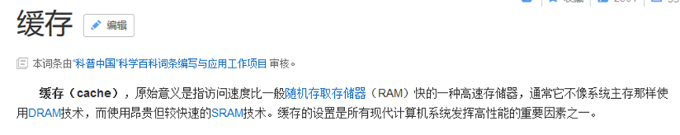

>​	是一种临时存储少量数据至内存或者是磁盘的一种技术.减少数据的加载次数,可以降低工作量,提高程序响应速度
>
>​	缓存的重要性是不言而喻的。mybatis的缓存将相同查询条件的SQL语句执行一遍后所得到的结果存在内存或者某种缓存介质当中，当下次遇到一模一样的查询SQL时候不在执行SQL与数据库交互，而是直接从缓存中获取结果，减少服务器的压力；尤其是在查询越多、缓存命中率越高的情况下，使用缓存对性能的提高更明显。
>
>​	MyBatis允许使用缓存，缓存一般放置在高速读/写的存储器上，比如服务器的内存，能够有效的提供系统性能。MyBatis分为<font color=#FF0000>一级缓存和二级缓存</font>，同时也可配置关于缓存设置。
>
>​	一级存储是SqlSession上的缓存，二级缓存是在SqlSessionFactory(namespace)上的缓存。默认情况下，MyBatis开启一级缓存，没有开启二级缓存。当数据量大的时候可以借助一些第三方缓存框架或Redis缓存来协助保存Mybatis的二级缓存数据。

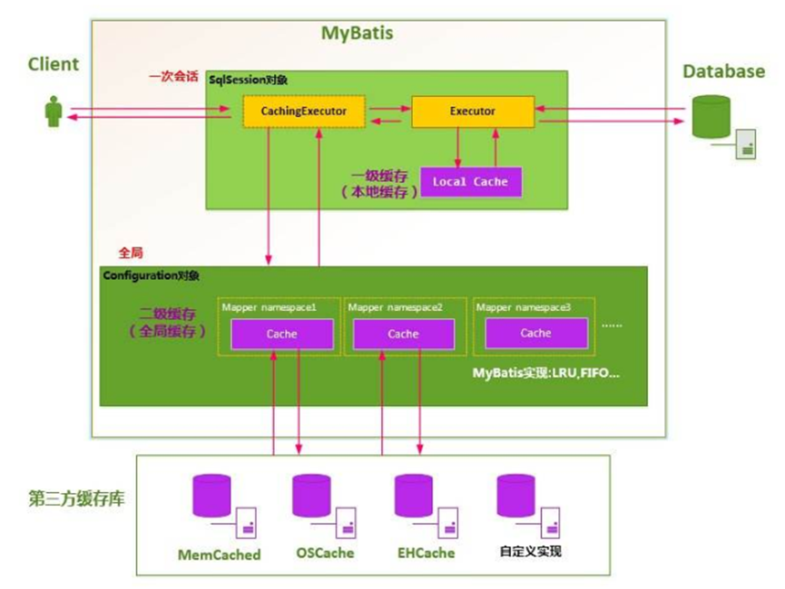


## 1 一级缓存

一级存储是SqlSession上的缓存，默认开启，是一种内存型缓存,不要求实体类对象实现Serializable接口。

缓存中的数据使用键值对形式存储数据

==namespace + sqlid + args + offset     >>>   hash 值作为键,查询出的结果作为值==

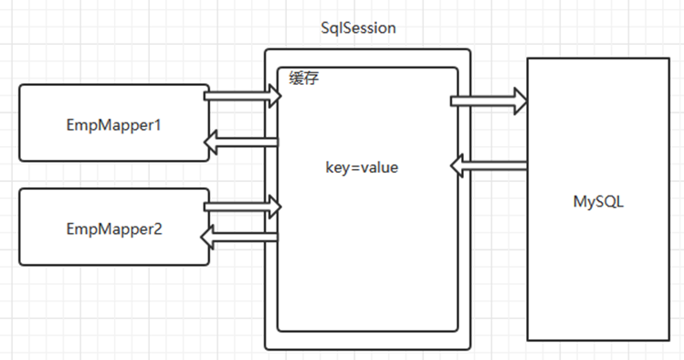

测试 代码

```java
@Test
public void testFindDeptByDetpno()   {
    EmpMapper mapper = sqlSession.getMapper(EmpMapper.class);
    Emp emp = mapper.findByEmpno(7521);
    System.out.println(emp);
    // 中间发生了增删改或者是调用了SqlSession调用了commit,会自动清空缓存
    sqlSession.commit();// 增删改的时候调用
    EmpMapper mapper2 = sqlSession.getMapper(EmpMapper.class);
    Emp emp2 = mapper2.findByEmpno(7521);
    System.out.println(emp2); 
    
    System.out.println(emp==emp2);// 没有commit之前为True
    System.out.println(mapper==mapper2);// false 表示确实产生了两个代理对象
}

```

## 2 二级缓存

二级缓存是以namespace为标记的缓存，可以是由一个SqlSessionFactory创建的SqlSession之间共享缓存数据。默认并不开启。下面的代码中创建了两个SqlSession，执行相同的SQL语句，尝试让第二个SqlSession使用第一个SqlSession查询后缓存的数据。要求实体类必须实现序列化接口


接口

```java
public interface EmpMapper {
    Emp findByEmpno(int empno);
}
```


映射文件

```xml
<mapper namespace="com.msb.mapper.EmpMapper">
    <cache/>
    <select id="findByEmpno" resultType="emp" useCache="true" flushCache="false">
        select * from emp where empno =#{empno}
    </select>
</mapper>

```

测试 代码

```java
package com.msb.test;
import com.msb.mapper.EmpMapper;
import com.msb.pojo.Emp;
import org.apache.ibatis.io.Resources;
import org.apache.ibatis.session.SqlSession;
import org.apache.ibatis.session.SqlSessionFactory;
import org.apache.ibatis.session.SqlSessionFactoryBuilder;
import org.junit.After;
import org.junit.Before;
import org.junit.Test;
import java.io.IOException;
import java.io.InputStream;
/**
 * @Author: Ma HaiYang
 * @Description: MircoMessage:Mark_7001
 */
public class Test3 {
    private SqlSession sqlSession;
    private SqlSession sqlSession2;
    @Before
    public void init(){
        SqlSessionFactoryBuilder ssfb =new SqlSessionFactoryBuilder();
        InputStream resourceAsStream = null;
        try {
            resourceAsStream = Resources.getResourceAsStream("sqlMapConfig.xml");
        } catch (IOException e) {
            e.printStackTrace();
        }
        SqlSessionFactory factory=ssfb.build(resourceAsStream) ;
        sqlSession=factory.openSession();
        sqlSession2=factory.openSession();
    }
    @Test
    public void testFindDeptByDetpno()   {
        EmpMapper mapper = sqlSession.getMapper(EmpMapper.class);
        Emp emp = mapper.findByEmpno(7521);
        System.out.println(emp);
        // SqlSession提交之后,才会将查询的结果放入二级缓存
        sqlSession.commit();
        EmpMapper mapper2 = sqlSession2.getMapper(EmpMapper.class);
        Emp emp2 = mapper2.findByEmpno(7521);
        System.out.println(emp2);
    }
    @After
    public void release(){
        // 关闭SQLSession
        sqlSession.close();
        sqlSession2.close();
    }
}

```

**注意：**

​	其中的commit()，执行该命令后才会将该SqlSession的查询结果从一级缓存中放入二级缓存，供其他SqlSession使用。另外执行SqlSession的close()也会将该SqlSession的查询结果从一级缓存中放入二级缓存。两种方式区别在当前SqlSession是否关闭了。

执行结果显示进行了两次对数据库的SQL查询，说明二级缓存并没有开启。需要进行如下步骤完成开启。


1)    全局开关：在sqlMapConfig.xml文件中的<font color=blue><settings></font>标签配置开启二级缓存

```xml
<settings>
    <setting name="cacheEnabled" value="true"/>
</settings>
```

cacheEnabled的默认值就是true，所以这步的设置可以省略。

2)    分开关：在要开启二级缓存的mapper文件中开启缓存：

```xml
<mapper namespace="com.msb.mapper.EmployeeMapper">
    <cache/>
</mapper>
```

3)    二级缓存未必完全使用内存,有可能占用硬盘存储,缓存中存储的JavaBean对象必须实现序列化接口,

```java
public class Emp implements  Serializable {  }
```


经过设置后，查询结果如图所示。发现第一个SqlSession会首先去二级缓存中查找，如果不存在，就查询数据库，<font color=#FF0000>在commit()或者close()的时候将数据放入到二级缓存</font>。第二个SqlSession执行相同SQL语句查询时就直接从二级缓存中获取了。

**注意：**

​	1)    MyBatis的二级缓存的缓存介质有多种多样，而并不一定是在内存中，所以需要对JavaBean对象实现序列化接口。

2)    二级缓存是以 namespace 为单位的，不同 namespace 下的操作互不影响

​	3)    加入Cache元素后，会对相应命名空间所有的select元素查询结果进行缓存，而其中的insert、update、delete在操作是会清空整个namespace的缓存。

​	4)    cache 有一些可选的属性 type, eviction, flushInterval, size, readOnly, blocking。

 ```xml
<cache type="" readOnly="" eviction=""flushInterval=""size=""blocking=""/>
 ```


<cache type="" readOnly="" eviction=""flushInterval=""size=""blocking=""/>
<table style="text-align: center;" cellpadding="30" >
    <style>
        td {
            text-align:center;
        }
        p {
          text-align:center;
        }
    </style>
    <tr style="background-color:#E2EFD9 ;">
        	<td>type</td>
         <td><p>自定义缓存类，要求实现org.apache.ibatis.cache.Cache接口</p></td>
			<td>null</td>
		</tr>
		<tr>
        	<td>readOnly</td>
            <td ><p>是否只读</p>
                <p> true:给所有调用者返回缓存对象的相同实例。因此这些对象不能被修改。 </p>
                <span> 这提供了很重要的性能优势。</span>
                <p>false:会返回缓存对象的拷贝(通过序列化)。</p>
                <p> 这会慢一些,但是安全</p>
			</td>
			<td>false</td>
		</tr>
		<tr style="background-color:#E2EFD9 ;">
        	<td>eviction</td>
			<td>	 
                <p>缓存策略<br>LRU（默认） – 最近最少使用：移除最长时间不被使用的对象。</p>
                <p>FIFO – 先进先出：按对象进入缓存的顺序来移除它们。</p>
                <p>SOFT – 软引用：基于垃圾回收器状态和软引用规则移除对象。</p>
                <p>WEAK – 弱引用：更积极地基于垃圾收集器状态和弱引用规则移除对象。</p>
			</td>
			<td>LRU</td>
		</tr>
		<tr>
        	<td>flushInterval</td>
			<td><p>
                	刷新间隔，毫秒为单位。默认为null，也就是没有刷新间隔，
                </p>
                <p>
                    只有执行update、insert、delete语句才会刷新
                </p>
			</td>
			<td>null</td>
		</tr>
		<tr style="background-color:#E2EFD9 ;">
        	 <td>size</td>
			<td><p>缓存对象个数<p></td>
			<td>1024</td>
		</tr>
		<tr>
        	<td>blocking</td>
			<td>
                <p>是否使用阻塞性缓存BlockingCache</p>
                <p>true：在查询缓存时锁住对应的Key，如果缓存命中了则会释放对应的锁，</p>
                <span>否则会在查询数据库以后再释放锁，</span>
                <p>保证只有一个线程到数据库中查找指定key对应的数据</p>
                <p>false：不使用阻塞性缓存，性能更好</p>
			</td>
			<td>false</td>
		</tr>
</table>


5)    如果在加入Cache元素的前提下让个别select 元素不使用缓存，可以使用useCache属性，设置为false。useCache控制当前sql语句是否启用缓存  flushCache控制当前sql执行一次后是否刷新缓存

 ```xml
<select id="findByEmpno" resultType="emp" useCache="true" flushCache="false">
 ```


## 3 三方缓存

>分布式缓存框架：我们系统为了提高系统并发和性能，一般对系统进行分布式部署（集群部署方式）不适用分布缓存， 缓存的数据在各个服务单独存储，不方便系统开发。所以要使用分布式缓存对缓存数据进行集中管理.ehcache,redis ,memcache缓存框架。

Ehcache：是一种广泛使用的开源java分布式缓存。主要面向通用缓存，javaEE 和 轻量级容器。它具有内存和磁盘存储功能。被用于大型复杂分布式web application的

这里的三方缓存是作为二级缓存使用的

导入依赖的jar文件

```xml
 <dependency>
    <groupId>org.mybatis.caches</groupId>
    <artifactId>mybatis-ehcache</artifactId>
    <version>1.0.2</version>
</dependency>
<dependency>
    <groupId>net.sf.ehcache</groupId>
    <artifactId>ehcache</artifactId>
    <version>2.10.1</version>
</dependency>
<dependency>
    <groupId>org.slf4j</groupId>
    <artifactId>slf4j-nop</artifactId>
    <version>1.7.2</version>
</dependency>
```

去各自的sql映射文件里,开启二级缓存,并把缓存类型指定为EhcacheCache

```xml
 <cache type="org.mybatis.caches.ehcache.EhcacheCache"/>
```

在资源目录下放置一个缓存配置文件,文件名为: ehcache.xml 内容如下

```xml
<?xml version="1.0" encoding="UTF-8"?>
<ehcache xmlns:xsi="http://www.w3.org/2001/XMLSchema-instance"
         xsi:noNamespaceSchemaLocation="ehcache.xsd"
         updateCheck="true" monitoring="autodetect"
         dynamicConfig="true">
    <diskStore path="D:\msb\ehcache" />
    <defaultCache
            maxElementsInMemory="1000"
            maxElementsOnDisk="10000000"
            eternal="false"
            overflowToDisk="true"
            timeToIdleSeconds="120"
            timeToLiveSeconds="120"
            diskExpiryThreadIntervalSeconds="120"
            memoryStoreEvictionPolicy="LRU">
    </defaultCache>
</ehcache>
        <!--  Cache配置
        ·           name：Cache的唯一标识
        ·           maxElementsInMemory：内存中最大缓存对象数。
        ·           maxElementsOnDisk：磁盘中最大缓存对象数，若是0表示无穷大。
        ·           eternal：Element是否永久有效，一但设置了，timeout将不起作用。
        ·           overflowToDisk：配置此属性，当内存中Element数量达到maxElementsInMemory时，Ehcache将会Element写到磁盘中。
        ·           timeToIdleSeconds：设置Element在失效前的允许闲置时间。仅当element不是永久有效时使用，可选属性，默认值是0，也就是可闲置时间无穷大。
        ·           timeToLiveSeconds：设置Element在失效前允许存活时间。最大时间介于创建时间和失效时间之间。仅当element不是永久有效时使用，默认是0.，也就是element存活时间无穷大。
        ·           diskExpiryThreadIntervalSeconds：磁盘失效线程运行时间间隔，默认是120秒。
        ·           diskSpoolBufferSizeMB：这个参数设置DiskStore（磁盘缓存）的缓存区大小。默认是30MB。每个Cache都应该有自己的一个缓冲区。
        ·           memoryStoreEvictionPolicy：当达到maxElementsInMemory限制时，Ehcache将会根据指定的策略去清理内存。默认策略是LRU（最近最少使用）。你可以设置为FIFO（先进先出）或是LFU（较少使用）。     -->
```


# 11 逆向工程

> MyBatisPlus 内容，简略分析，可以参考后面具体内容

MyBatis的一个主要的特点就是需要程序员自己编写SQL，那么如果表太多的话，难免会很麻烦，所以MyBatis官方提供了一个逆向工程，可以针对单表自动生成MyBatis执行所需要的代码（包括mapper.xml，mapper.java，pojo）。一般在开发中，常用的逆向工程方式是通过数据库的表生成代码。

 

 

创建maven项目导入逆向工程依赖

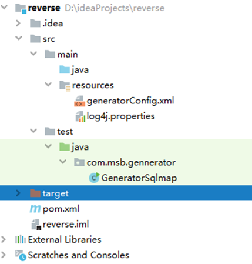

```xml
<dependencies>
  
    <!-- mysql驱动包 -->
    <dependency>
        <groupId>mysql</groupId>
        <artifactId>mysql-connector-java</artifactId>
        <version>8.0.16</version>
    </dependency>
    <!-- 日志包，方便查看执行信息-->
    <dependency>
        <groupId>org.slf4j</groupId>
        <artifactId>slf4j-log4j12</artifactId>
        <version>1.6.1</version>
    </dependency>
    <!-- 代码生成工具jar -->
    <dependency>
        <groupId>org.mybatis.generator</groupId>
        <artifactId>mybatis-generator-core</artifactId>
        <version>1.3.2</version>
    </dependency>
</dependencies>
```


配置逆向工程配置文件 在resources目录下放置一个名为generatorConfig.xml的配置文件,文件内容如下

```xml
<?xml version="1.0" encoding="UTF-8"?>
<!DOCTYPE generatorConfiguration
  PUBLIC "-//mybatis.org//DTD MyBatis Generator Configuration 1.0//EN"
  "http://mybatis.org/dtd/mybatis-generator-config_1_0.dtd">
<generatorConfiguration>
   <context id="testTables" targetRuntime="MyBatis3">
      <commentGenerator>
         <!-- 是否去除自动生成的注释 true：是 ： false:否 -->
         <property name="suppressAllComments" value="true" />
      </commentGenerator>
      <!--数据库连接的信息：驱动类、连接地址、用户名、密码 -->
      <!-- <jdbcConnection driverClass="com.mysql.jdbc.Driver"
         connectionURL="jdbc:mysql://localhost:3306/mybatis" userId="root"
         password="123">
      </jdbcConnection> -->
       <jdbcConnection driverClass="com.mysql.cj.jdbc.Driver"
         connectionURL="jdbc:mysql://127.0.0.1:3306/mydb?useSSL=false&amp;useUnicode=true&amp;characterEncoding=UTF-8&amp;serverTimezone=Asia/Shanghai&amp;allowPublicKeyRetrieval=true"
         userId="root"
         password="root">
      </jdbcConnection> 
      <!-- 默认false，把JDBC DECIMAL 和 NUMERIC 类型解析为 Integer，为 true时把JDBC DECIMAL 和 
         NUMERIC 类型解析为java.math.BigDecimal -->
      <javaTypeResolver>
         <property name="forceBigDecimals" value="false" />
      </javaTypeResolver>
      <!-- targetProject:生成PO类的位置 -->
      <javaModelGenerator targetPackage="com.msb.pojo"
         targetProject=".\src">
         <!-- enableSubPackages:是否让schema作为包的后缀 -->
         <property name="enableSubPackages" value="false" />
         <!-- 从数据库返回的值被清理前后的空格 -->
         <property name="trimStrings" value="true" />
      </javaModelGenerator>
        <!-- targetProject:mapper映射文件生成的位置 -->
      <sqlMapGenerator targetPackage="com.msb.mapper"
         targetProject=".\src">
         <!-- enableSubPackages:是否让schema作为包的后缀 -->
         <property name="enableSubPackages" value="false" />
      </sqlMapGenerator>
      <!-- targetPackage：mapper接口生成的位置 -->
      <javaClientGenerator type="XMLMAPPER"
         targetPackage="com.msb.mapper"
         targetProject=".\src">
         <!-- enableSubPackages:是否让schema作为包的后缀 -->
         <property name="enableSubPackages" value="false" />
      </javaClientGenerator>
      <!-- 指定数据库表 -->
      
      <table tableName="dept" domainObjectName="Dept"
       enableCountByExample="false" enableUpdateByExample="false" enableDeleteByExample="false"    
               enableSelectByExample="false" selectByExampleQueryId="false" >
               <columnOverride column="id" javaType="Integer" />
         </table>
      
   </context>
</generatorConfiguration>

```

在resources目录下放置一个名为log4j.properties的配置文件,文件内容如下

```properties
log4j.rootLogger=debug,stdout
log4j.appender.stdout=org.apache.log4j.ConsoleAppender
log4j.appender.stdout.Target=System.err
log4j.appender.stdout.layout=org.apache.log4j.SimpleLayout
log4j.appender.logfile=org.apache.log4j.FileAppender
log4j.appender.logfile.File=d:/msb.log
log4j.appender.logfile.layout=org.apache.log4j.PatternLayout
log4j.appender.logfile.layout.ConversionPattern=%d{yyyy-MM-dd HH:mm:ss} %l %F %p %m%n
```

运行逆向工程代码

```java
package com.msb.gennerator;
import org.mybatis.generator.api.MyBatisGenerator;
import org.mybatis.generator.config.Configuration;
import org.mybatis.generator.config.xml.ConfigurationParser;
import org.mybatis.generator.internal.DefaultShellCallback;
import java.io.File;
import java.util.ArrayList;
import java.util.List;
/**
 *
 */
public class GeneratorSqlmap {
    public void generator() throws Exception{
        List<String> warnings = new ArrayList<String>();
        boolean overwrite = true;
        File configFile = new File("D:\\ideaProjects\\reverse\\target\\classes\\generatorConfig.xml");
        ConfigurationParser cp = new ConfigurationParser(warnings);
        Configuration config = cp.parseConfiguration(configFile);
        DefaultShellCallback callback = new DefaultShellCallback(overwrite);
        MyBatisGenerator myBatisGenerator = new MyBatisGenerator(config,
                callback, warnings);
        myBatisGenerator.generate(null);
    }
    public static void main(String[] args) throws Exception {
        try {
            GeneratorSqlmap generatorSqlmap = new GeneratorSqlmap();
            generatorSqlmap.generator();
        } catch (Exception e) {
            e.printStackTrace();
        }
    }
}

```

生成的实体类和Mapper接口和Mapper映射文件,包含了基本的CURD功能,哪里需要文件就放哪里

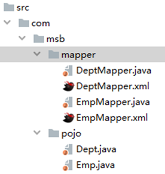

# 12 main目录下配置文件打包问题

```xml
<build>
    <!--告诉maven将项目源码中的xml文件也进行编译，并放到编译目录中-->
    <resources>
        <resource>
            <directory>src/main/java</directory>
            <includes>
                <include>**/*.xml</include>
            </includes>
            <filtering>true</filtering>
        </resource>
        <resource>
            <directory>src/main/resources</directory>
            <filtering>true</filtering>
        </resource>
    </resources>
</build>
```


