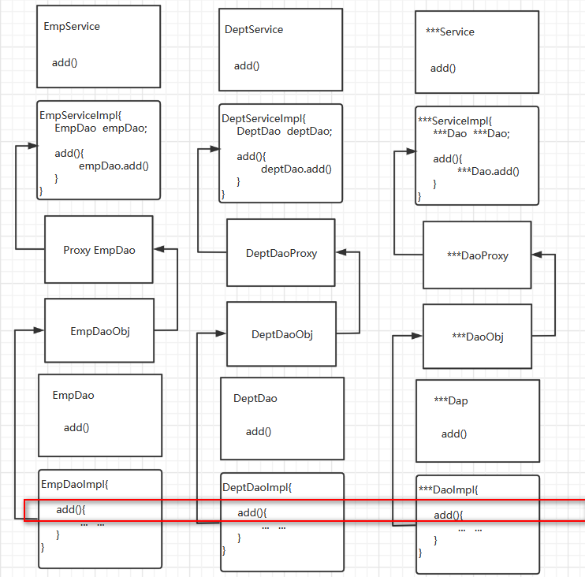
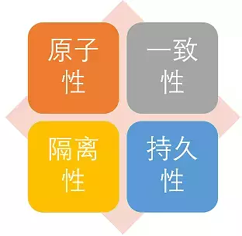
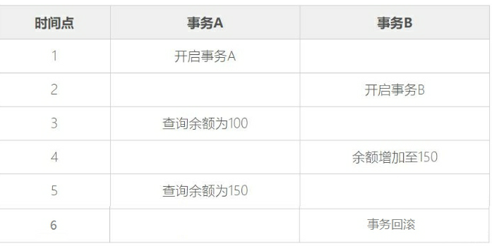
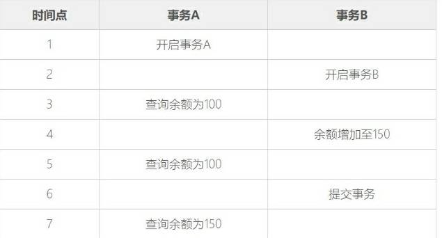
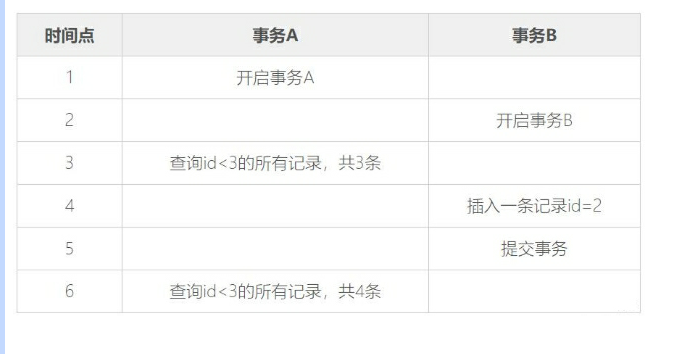
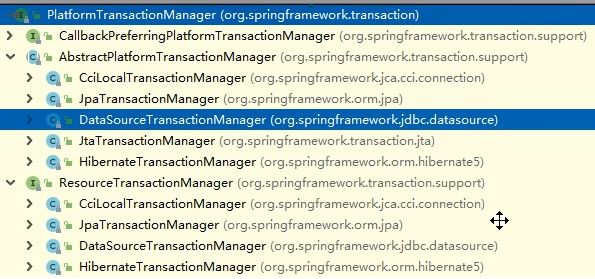
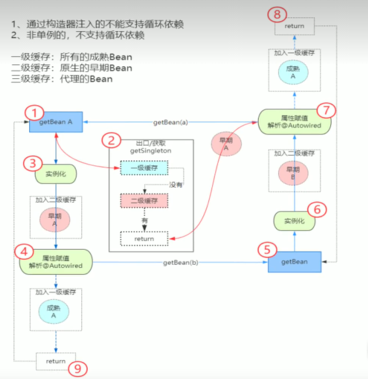

# 概念：

* Spring是**一个轻量级 **Java开发框架，目的是为了解决企业级应用开发的业务逻辑层和其他各层的耦合问题。它是一个分层的JavaSE/JavaEE full-stack（一站式）轻量级开源框架，为开发Java应用程序提供全面的基础架构支持。Spring负责基础架构，因此Java开发者可以专注于应用程序的开发。

* Spring最根本的使命是**解决企业级应用开发的复杂性，**即简化*Java*开发。

* Spring可以做很多事情，它为企业级开发提供给了丰富的功能，但是这些功能的底层都依赖于它的

两个核心特性，也就是**依赖注入（dependency injection，DI**）和**面向切面编程**（**aspect-**

**oriented programming，AOP）**。

为了降低Java开发的复杂性，Spring采取了以下4种关键策略

* 基于POJO的轻量级和最小侵入性编程；

* 通过依赖注入和面向接口实现松耦合；

* 基于切面和惯例进行声明式编程；

* 通过切面和模板减少样板式代码。


# Spring的俩大核心概念

## IOC（控制翻转）：

控制翻转，也叫依赖注入，他就是不会直接创建对象，只是把对象声明出来，在代码 中不直

接与对象和服务进行连接，但是在配置文件中描述了哪一项组件需要哪一项服 务，容器将他

们组件起来。在一般的IOC场景中容器创建了所有的对象，并设置了必 要的属性将他们联系

在一起，等到需要使用的时候才把他们声明出来，使用注解就跟 方便了，容器会自动根据注

解把对象组合起来

## 其中还有一个点DI(依赖注入)

## AOP（面对切面编程）

面对切面编程，这是一种编程模式，他允许程序员通过自定义的横切点进行模块 化，将那些

影响多个类的行为封装到课重用的模块中。 例子：比如日志输出，不使用AOP的话就需要把

日志的输出语句放在所有类中，方法 中，但是有了AOP就可以把日志输出语句封装一个可重

用模块，在以声明的方式将他 们放在类中，每次使用类就自动完成了日志输出。


# Bean的生命周期

1 通过构造器创建bean实例           执行构造器
2 为bean属性赋值                         执行set方法
3 初始化bean                                调用bean的初始化方法,需要配置指定调用的方法
4 bean的获取                                容器对象 getBean方法
5 容器关闭销毁bean                      调用销毁方法,需要配置指定调用的方法

```java
public class User {
    private Integer userid;
    private String username;
    private String password;
    public void initUser(){
        System.out.println("第三步:User初始化");
    }
    public User() {
        System.out.println("第一步:User构造");
    }
    public void destoryUser(){
        System.out.println("第五步:User销毁");
    }
    @Override
    public String toString() {
        return "User{" +
                "userid=" + userid +
                ", username='" + username + '\'' +
                ", password='" + password + '\'' +
                '}';
    }
    public User(Integer userid, String username, String password) {
        this.userid = userid;
        this.username = username;
        this.password = password;
    }
    public void setUserid(Integer userid) {
        System.out.println("setUserid");
        this.userid = userid;
    }
    public void setUsername(String username) {
        System.out.println("第二步:User属性赋值");
        this.username = username;
    }
    public void setPassword(String password) {
        this.password = password;
    }
}
```

配置Bean

```xml
<?xml version="1.0" encoding="UTF-8"?>
<beans xmlns="http://www.springframework.org/schema/beans"
       xmlns:xsi="http://www.w3.org/2001/XMLSchema-instance"
       xmlns:p="http://www.springframework.org/schema/p"
       xmlns:c="http://www.springframework.org/schema/c"
       xsi:schemaLocation="http://www.springframework.org/schema/beans
       http://www.springframework.org/schema/beans/spring-beans.xsd">
    <!--  -->
    <bean id="user" class="com.msb.bean.User" init-method="initUser" destroy-method="destoryUser">
        <property name="username" value="xiaoming"></property>
    </bean>
</beans>
```

根据 Class、property 通过反射去找构造器创建实例，然后对property属性根据 set 方法注入依赖也叫赋值，

通过指定 init-method(初始化方法) 来对我们的对象再次进行操作，第四步获取 Bean 对象，第五步项目结束Context销毁，调用销毁方法销毁Bean


==以上我们是对一般的过程其实在这个基础上我们还可以再次增加两步，这个叫后置处理器，处理后的顺序：==

1 通过构造器创建bean实例           执行构造器
2 为bean属性赋值                         执行set方法
<font color=red>3 把bean实例传递给bean的后置处理器的方法</font>
4 初始化bean                                调用bean的初始化方法,需要配置指定调用的方法
<font color=red>5 把bean实例传递给bean的后置处理器的方法</font>
6 bean的获取                                容器对象 getBean方法
7 容器关闭销毁bean                      调用销毁方法,需要配置指定调用的方法


==添加后置处理器==

**1 创建后置处理器 实现 BeanPostProcesser  重写两个方法**

```java

import org.springframework.beans.BeansException;
import org.springframework.beans.factory.config.BeanPostProcessor;
// 1 创建后置处理器 实现 BeanPostProcesser  重写两个方法
public class MyBeanProcesser implements BeanPostProcessor {
    @Override
    public Object postProcessBeforeInitialization(Object bean, String beanName) throws BeansException {
        //Object bean      实例化的bean
        //String beanName  bean的id
        System.out.println("bean:初始化方法之前");
        return bean;// 这里必须return bean
    }
    @Override
    public Object postProcessAfterInitialization(Object bean, String beanName) throws BeansException {
        System.out.println("bean:初始化方法之后");
        return bean;// 这里必须returnbean
    }
}
```

**2 配置后置处理器,对容器中的所有bean添加后置处理器的生命周期**

```xml
<?xml version="1.0" encoding="UTF-8"?>
<beans xmlns="http://www.springframework.org/schema/beans"
       xmlns:xsi="http://www.w3.org/2001/XMLSchema-instance"
       xmlns:p="http://www.springframework.org/schema/p"
       xmlns:c="http://www.springframework.org/schema/c"
       xsi:schemaLocation="http://www.springframework.org/schema/beans
       http://www.springframework.org/schema/beans/spring-beans.xsd">
    <bean id="user" class="com.msb.bean.User" init-method="initUser" destroy-method="destoryUser">
        <property name="username" value="xiaoming"></property>
    </bean>
    
    <bean id="myBeanProcesser" class="com.msb.beanProcesser.MyBeanProcesser"></bean>
</beans>
```

**BeanPostProcessor接口作用：**

> 如果我们想在Spring容器中完成bean实例化、配置以及其他初始化方法前后要添加一些自己逻辑处理。我们需要定义一个或多个BeanPostProcessor接口实现类，然后注册到Spring IoC容器中。

1、接口中的两个方法都要将传入的bean返回，而不能返回null，如果返回的是null那么我们通过getBean方法将得不到目标。
2、ApplicationContext会自动检测在配置文件中实现了BeanPostProcessor接口的所有bean，并把它们注册为后置处理器，然后在容器创建bean的适当时候调用它，因此部署一个后置处理器同部署其他的bean并没有什么区别。而使用BeanFactory实现的时候，bean 后置处理器必须通过代码显式地去注册，在IoC容器继承体系中的ConfigurableBeanFactory接口中定义了注册方法


**总结**

完整的过程：

>创建实例 --> set赋值 --> 再次初始化对象--> 获取Bean对象--> 销毁Bean对象
>
>
>
>创建实例 --> set赋值 -->把bean实例传递给bean的后置处理器的方法 --> 再次初始化对象 --> 把bean实例传递给bean的后置处理器的方法 ---> 获取Bean对象--> 销毁Bean对象


# Bean自动装配

通过property标签可以手动指定给属性进行注入
我们也可以通过自动转配,完成==属性的自动注入==,就是自动装配,可以简化DI的配置

```xml
<?xml version="1.0" encoding="UTF-8"?>
<beans xmlns="http://www.springframework.org/schema/beans"
       xmlns:xsi="http://www.w3.org/2001/XMLSchema-instance"
       xmlns:p="http://www.springframework.org/schema/p"
       xmlns:c="http://www.springframework.org/schema/c"
       xsi:schemaLocation="http://www.springframework.org/schema/beans
       http://www.springframework.org/schema/beans/spring-beans.xsd">
    <bean id="dept" class="com.msb.bean.Dept"></bean>
    <!--
    autowire 属性控制自动将容器中的对象注入到当前对象的属性上
    byName 根据目标id值和属性值注入,要保证当前对象的属性值和目标对象的id值一致
    byType 根据类型注入,要保证相同类型的目标对象在容器中只有一个实例
    -->
    <bean id="emp" class="com.msb.bean.Emp" autowire="byName"></bean>
</beans>
```


# Spring注解管理Bean

## 1注解方式创建对象IOC

导入依赖 aop

@Component    放在类上,用于标记,告诉spring当前类需要由容器实例化bean并放入容器中
  该注解有三个子注解
  @Controller   用于实例化controller层bean
        @Service        用于实例化service层bean
        @Repository  用于实例化持久层bean
  当不确定是哪一层,就用Component
这几个注解互相混用其实也可以,但是不推荐

## 2注解方式依赖注入DI

@Autowired   根据属性数据类型自动装配
@Qualifier      根据属性名称注入依赖
@Resources   可以根据类型,也可以根据名称注入
@Value           注入普通数据类型(8+String)

````java
// 详解 
/*
    * @Autowired
    * 根据类型到容器中去寻找对应的对象,找到后给当前属性赋值
    * 不需要依赖 set方法
    * 属性类型可以是接口,会自动匹配对应的实现类对象
    * @Autowired配合 @Qualifier,可以通过名称指定注入的对象
    *
    * @Resource 如果不配置name 那么就是根据类型注入
    * @Resource(name="userDaoImplB") 配置name,就是根据名称注入
    *
    *
    * @Resource  是JDK中javax包的注解
    * @Autowired 和 @Qualifier 是spring中的注解
    *
    * @Value 可以个普通属性赋值
    * @Value 可以使用${}这种表达式获取系统的变量值
    *        或者是.properties属性配置文件中的值
    *
    * */
````


# 代理

*概念*：在使用对象的时候，不直接使用用一个代理对象代理他，这样可以在目标**对象基础上增强额外的功能**。

*分类*：静态代理，动态代理


## 静态代理

>​	静态代理中**代理类**与**被代理类**都**需要实现同一个接口**，这就说明我们的**一个静态代理类只能代理一个类**，并且还要事先知道我们**要代理哪个类才能写代理类**，如果我们**有其他类还想使用代理那就必须再写一个代理类**。

​	然而在实际开发中我们是可能是有非常多的类是需要被代理的，并且事先我们可能并不知道我们要代理哪个类。所以如果继续使用静态代理反而会增加许多的工作量，并且**效率低下**，**代码复用率也不好**。

```java
public class Test1 {
    public static void main(String[] args) {
        /**
        lawyer律师代替Person张三打官司，不用张三直接打，可以更加清楚
        */
        Person person =new Person("张三");
        Court court=new Lawyer(person);
        court.doCourt();
    }
}
// 接口
interface Court{
    void doCourt();
}
// 代理类
class Lawyer implements Court{
    private Person person;
    public Lawyer(Person person) {
        this.person = person;
    }
    @Override
    public void doCourt() {
        System.out.println("律师取证:视频证明张三当时正在旅游,不在案发现场");
        System.out.println("律师总结:张三不可能去杀人");
        person.doCourt();
    }
}
// 被代理的类
class Person implements Court{
    private String name;
    public Person(String name) {
        this.name = name;
    }
    @Override
    public void doCourt() {
        System.out.println(name+"说:我没有杀人");
    }
}
```


## 动态代理

*概念*：动态代理可以**针对**于一些**不特定的类**或者一些**不特定的方法**进行代理,我们可以在程序运行时动态的变化代理的规则，**代理类在程序运行时才创建的代理模式成为动态代理**。这种情况下，代理类并不是在Java代码中定义好的，而是在程序运行时根据我们的在Java代码中的“指示”动态生成的

实现方法：JDK自带的Proxy、CJlib

|  **Proxy**  |   **JDK动态代理**    |  **面向接口**  |
| :---------: | :------------------: | :------------: |
| ***cglib*** | ***第三方动态代理*** | ***面向父类*** |

实现案例：

Proxy:

```java
public class ProxyTest1 {

    public static void main(String[] args) {
        Dinner dinner = new Person("张三");
        ClassLoader loader = dinner.getClass().getClassLoader();
        Class<?>[] interfaces = dinner.getClass().getInterfaces();
        /*
           Object proxy, 代理对象
           Method method,被代理的方法
           Object[] args,被代理方法运行时的实参
         */
        /*InvocationHandler invocationHandler = (proxy,
                                              method,
                                              params)->{
            System.out.println("invoked 方法执行");

            return null;
        };*/
        InvocationHandler invocationHandler = new InvocationHandler() {
            @Override
            public Object invoke(Object proxy, Method method, Object[] args) throws Throwable {
                Object res = new Object();

                if (method.getName().equals("eat")) {
                    System.out.println("饭前洗手");
                    // 让原有的eat的方法去运行
                    res =method.invoke(dinner, args);
                    System.out.println("饭后刷碗");
                }
                else{
                    // 如果是其他方法,那么正常执行就可以了
                    res =method.invoke(dinner, args);
                }
                return res;
            }
        };

        /**
         * 动态代理
         * 需要三次个参数 loader代理类，增强的对象，
         *              interfaces 实现的接口，
         *              增强方法 invoke()
         */
        Dinner dinner1 = (Dinner) Proxy.newProxyInstance(loader,interfaces,invocationHandler);
        dinner1.eat("包子");
    }
}
interface Dinner{
    void eat(String foodName);
    void drink();
}

class Person implements Dinner{
    private String name;
    public Person(String name) {
        this.name = name;
    }
    @Override
    public void eat(String foodName) {
        System.out.println(name+"正在吃"+foodName);
    }
    @Override
    public void drink( ) {
        System.out.println(name+"正在喝茶");
    }
}
class Student implements Dinner{
    private String name;
    public Student(String name) {
        this.name = name;
    }
    @Override
    public void eat(String foodName) {
        System.out.println(name+"正在食堂吃"+foodName);
    }
    @Override
    public void drink( ) {
        System.out.println(name+"正在喝可乐");
    }
}
```

Cglib

```java
public class ProxyTest2 {

    public static void main(String[] args) {
        // 获取一个Person的代理对象
        Person person = new Person();
        // 1 获得一个Enhancer对象
        Enhancer enhancer = new Enhancer();
        // 2 设置父类字节码
        enhancer.setSuperclass(Person.class);
        // 3 获取MethodIntercepter对象 用于定义增强规则
        MethodInterceptor methodInterceptor = new MethodInterceptor() {
            /*
            * Object o 生成之后的代理对象 personProxy
            * Method method 父类中原本要执行的方法  Person>>> eat()要增强的方法（还没有被增强，父类方法）
            * Object[] objects 实际传入的参数
            * MethodProxy methodProxy 子类中重写父类的方法 personProxy >>> eat()代理对象增强的方法（增强的方法，子类对象）
            * */
            @Override
            public Object intercept(Object o, Method method, Object[] objects, MethodProxy methodProxy) throws Throwable {
                Object res = null;

                if (method.getName().equals("eat")) {
                    System.out.println("饭前洗手");
                    res=methodProxy.invokeSuper(o,objects);
                    System.out.println("饭后刷碗");
                }else{
                    // 如果是其他方法 不增强运行
                    res=methodProxy.invokeSuper(o,objects); // 子类对象方法在执行,默认会调用父类对应被重写的方法
                }
                return res;
            }
        };
        // 4 设置methodInterceptor
        enhancer.setCallback(methodInterceptor);
        // 5 获得代理对象
        Person personProxy = (Person)enhancer.create();
        // 6 使用代理对象完成功能
        personProxy.eat("包子");
    }
}

class Person  {
    public Person( ) {
    }
    public void eat(String foodName) {
        System.out.println("张三正在吃"+foodName);
    }
}
```

> 总结

* 在**不修改原有代码**的 或者没有办法修改原有代码的情况下  **增强对象功能**  **使用代理对象** 代替原来的对象去完成功能进而达到拓展功能的目的
* **JDK Proxy 动态代理面向接口的动态代理**  一定**要有接口**和**实现类**的存在 代理对象**增强的是实现类** 在实现接口的方法重写的方法   生成的代理对象只能转换成 接口的不能转换成 被代理类代理对象只能增强接口中定义的方法  **实现类中其他和接口无关的方法是无法增强的代理对象只能读取到接口中方法上的注解 不能读取到实现类方法上的注解**


# AOP

全名：Aspect Oriented Programmings，面向切面编程，通过**预编译**和**运行时生成动态代理**实现程序功能的统一维护的一种技术。AOP是OOP的延续，是Spring框架的一个重要内容，是函数式编程的一种衍生范式。利用AOP可以对业务逻辑的各个部分进行隔离，从而使各个部分的耦合性降低，提高程序的可重用行，提高开发效率。

---

AOP切面编程一般可以帮助我们在不修改现有代码的情况下,对程序的功能进行拓展,往往用于实现 日志处理,权限控制,性能检测,事务控制等
AOP实现的原理就是动态代理,在有接口的情况下,使用JDK动态代理,在没有接口的情况下使用cglib动态代理




AOP中的术语辨析

1 连接点 Joint point：类里面那些可以被增强的方法

2 切入点 Pointcu：实际被增强的方法,称之为切入点

3 通知 Advice:：实际增强的逻辑部分称为通知 (增加的功能)

4 目标对象 Target：被增强功能的对象(被代理的对象)

5 切面Aspect： 表现为功能相关的一些advice方法放在一起声明成的一个Java类

6 织入 Weaving：创建代理对象并实现功能增强的声明并运行过程


具体操作

```java
/*
事先准备 dao 以及他的实现类
我们直接编写 Aspect 层的代码
*/

@Component
@Aspect
public class DaoAspect {
    /*
    切入点表达式: 通过一个表达式来确定AOP要增强的是哪个或者那些方法
    语法结构:execution([权限修饰符][返回值类型][类的全路径名][方法名](参数 列表) )
    execution(* com.msb.dao.UserDaoImpl.add(..))   //指定切点为UserDaoImpl.add方法
    execution(* com.msb.dao.UserDaoImpl.*(..))     //指定切点为UserDaoImpl.所有的方法
    execution(* com.msb.dao.*.*(..))               //指定切点为dao包下所有的类中的所有的方法
    execution(* com.msb.dao.*.add(..))             // 指定切点为dao包下所有的类中的add的方法
    execution(* com.msb.dao.*.add*(..))            // 指定切点为dao包下所有的类中的add开头的方法
    *  */
    //定义公共切点
    @Pointcut("execution( * com.zjj.aop.dao.*.add*(..) )")
    public void addPointCut(){

    }

    /*
     * 前置通知: 切点方法执行之前先执行的功能
     * 参数列表可以用JoinPoint接收切点对象
     * 可以获取方法执行的参数
     * */
    @Before("addPointCut()") // 这里用了公共切点，不然又要写一次公共切点上的 @PointCut()
    public void methodBefore(JoinPoint joinPoint) {
        System.out.println("Before invoked");
    }


    /*
     * 后置通知:方法执行之后要增强的功能
     * 无论切点方法是否出现异常都会执行的方法
     * 参数列表可以用JoinPoint接收切点对象
     * */
    @After("addPointCut()")
    public void methodAfter(JoinPoint joinPoint){
        System.out.println("After invoked");
    }

    /*
     * 返回通知:切点方法正常运行结束后增强的功能
     * 如果方法运行过程中出现异常,则该功能不运行
     * 参数列表可以用 JoinPoint joinPoint接收切点对象
     * 可以用Object res接收方法返回值,需要用returning指定返回值名称
     * */
    @AfterReturning( value = "addPointCut()",returning = "res")
    public void methodAfterReturning(JoinPoint joinPoint,Object res){
        System.out.println("AfterReturning invoked");
    }
    /*
     * 异常通知:切点方法出现异常时运行的增强功能
     * 如果方法运行没有出现异常,则该功能不运行
     * 参数列表可以用Exception ex接收异常对象 需要通过throwing指定异常名称
     * */
    @AfterThrowing( value = "addPointCut()",throwing = "ex")
    public void methodAfterThrowing(Exception ex){
        System.out.println("AfterThrowing invoked");
    }

    /*环绕通知:在切点方法之前和之后都进行功能的增强
     * 需要在通知中定义方法执行的位置,并在执行位置之前和之后自定义增强的功能
     * 方法列表可以通过ProceedingJoinPoint获取执行的切点
     * 通过proceedingJoinPoint.proceed()方法控制切点方法的执行位置
     * proceedingJoinPoint.proceed()方法会将切点方法的返回值获取到,并交给我们,可以做后续处理
     * 我们在环绕通知的最后需要将切点方法的返回值继续向上返回,否则切点方法在执行时接收不到返回值
     * */
    @Around("addPointCut()")
    public Object methodAround(ProceedingJoinPoint proceedingJoinPoint) throws Throwable {
        System.out.println("aroundA invoked");
        Object proceed = proceedingJoinPoint.proceed();
        System.out.println("aroundB invoked");
        return proceed;
    }

}
```

测试

```java
@SpringBootTest(classes = MyAOPSpringApplication.class)
public class SpringAOPTests {
    @Resource
    ApplicationContext context;
    @Test
    public void t1() {
        UserService userService = context.getBean(UserService.class);
        userService.addUser(10, "小明");
    }
}
```

结果：

> aroundA invoked
>
> Before invoked
>
> userDao add ... ...
>
> AfterReturning invoked
>
> After invoked
>
> aroundB invoked

面试题

如果在不使用框架的前提下你要做权限的校验你会怎么做?

> 我会在要鉴权的方法加入环绕通知，在请求到方法前先进行一次查找，一般这些数据我们会在redis中也会存储一个，第一次查过来我们去redis中找，找到直接让他操作并且在之后提交事务，但是没找到的时候我们先让他去操作，但是不提交事务，同时去数据库中查找他的信息，找到后添加redis，提交事务，没找到就回滚事务即可。


# 事务

## 事务的概念

事务（Transaction）指的是一个操作序列，该操作序列中的多个操作要么都做，要么都不做，是一个不可分割的工作单位，是数据库环境中的逻辑工作单位，由DBMS中的事务管理子系统负责事务的处理。

目前常用的存储引擎有InnoDB（MySQL5.5以后默认的存储引擎）和MyISAM（MySQL5.5之前默认的存储引擎），其中InnoDB支持事务处理机制，而MyISAM不支持。

## 事务的特性

事务处理可以确保除非事务性序列内的所有操作都成功完成，否则不会永久更新面向数据的资源。通过将一组相关操作组合为一个要么全部成功要么全部失败的序列，可以简化错误恢复并使应用程序更加可靠。

但并不是所有的操作序列都可以称为事务，这是因为一个操作序列要成为事务，必须满足事务的原子性（Atomicity）、一致性（Consistency）、隔离性（Isolation）和持久性（Durability）。这四个特性简称为ACID特性。




1)     原子性

原子是自然界最小的颗粒，具有不可再分的特性。事务中的所有操作可以看做一个原子，事务是应用中不可再分的最小的逻辑执行体。

使用事务对数据进行修改的操作序列，要么全部执行，要么全不执行。通常，某个事务中的操作都具有共同的目标，并且是相互依赖的。如果数据库系统只执行这些操作中的一部分，则可能会破坏事务的总体目标，而原子性消除了系统只处理部分操作的可能性。

2)      一致性

一致性是指事务执行的结果必须使数据库从一个一致性状态，变到另一个一致性状态。当数据库中只包含事务成功提交的结果时，数据库处于一致性状态。一致性是通过原子性来保证的。

例如：在转账时，只有保证转出和转入的金额一致才能构成事务。也就是说事务发生前和发生后，数据的总额依然匹配。

3)      隔离性

隔离性是指各个事务的执行互不干扰，任意一个事务的内部操作对其他并发的事务，都是隔离的。也就是说：并发执行的事务之间既不能看到对方的中间状态，也不能相互影响。

例如：在转账时，只有当A账户中的转出和B账户中转入操作都执行成功后才能看到A账户中的金额减少以及B账户中的金额增多。并且其他的事务对于转账操作的事务是不能产生任何影响的。

4)     持久性

持久性指事务一旦提交，对数据所做的任何改变，都要记录到永久存储器中，通常是保存进物理数据库，即使数据库出现故障，提交的数据也应该能够恢复。但如果是由于外部原因导致的数据库故障，如硬盘被损坏，那么之前提交的数据则有可能会丢失。

## 事务的并发问题

脏读（Dirty read）

当一个事务正在访问数据并且对数据进行了修改，而这种修改还没有提交到数据库中，这时另外一个事务也访问了这个数据，然后使用了这个数据。因为这个数据是还没有提交的数据，那么另外一个事务读到的这个数据是“脏数据”，依据“脏数据”所做的操作可能是不正确的。




不可重复读

（Unrepeatableread）: 指在一个事务内多次读同一数据。在这个事务还没有结束时，另一个事务也访问该数据。那么，在第一个事务中的两次读数据之间，由于第二个事务的修改导致第一个事务两次读取的数据可能不太一样。这就发生了在一个事务内两次读到的数据是不一样的情况，因此称为不可重复读。




幻读

（Phantom read）: 幻读与不可重复读类似。它发生在一个事务（T1）读取了几行数据，接着另一个并发事务（T2）插入了一些数据时。在随后的查询中，第一个事务（T1）就会发现多了一些原本不存在的记录，就好像发生了幻觉一样，所以称为幻读。




**不可重复度和幻读区别：**

不可重复读的重点是修改，幻读的重点在于新增或者删除。

**解决不可重复读的问题只需锁住满足条件的行，解决幻读需要锁表**

例1（同样的条件, 你读取过的数据, 再次读取出来发现值不一样了 ）：事务1中的A先生读取自己的工资为 1000的操作还没完成，事务2中的B先生就修改了A的工资为2000，导 致A再读自己的工资时工资变为 2000；这就是不可重复读。

例2（同样的条件, 第1次和第2次读出来的记录数不一样 ）：假某工资单表中工资大于3000的有4人，事务1读取了所有工资大于3000的人，共查到4条记录，这时事务2又插入了一条工资大于3000的记录，事务1再次读取时查到的记录就变为了5条，这样就导致了幻读

## 事务的隔离级别

事务的隔离级别用于决定如何控制并发用户读写数据的操作。数据库是允许多用户并发访问的，如果多个用户同时开启事务并对同一数据进行读写操作的话，有可能会出现脏读、不可重复读和幻读问题，所以MySQL中提供了四种隔离级别来解决上述问题。

事务的隔离级别从低到高依次为READ UNCOMMITTED、READ COMMITTED、REPEATABLE READ以及SERIALIZABLE，隔离级别越低，越能支持高并发的数据库操作。

​                                   

## spring中可以使用如下方式实现事务的控制

1 编程式(不推荐)

2 声明式(掌握)

​	1) 注解(简单,必会)

​	2) XML配置(繁琐,了解)


  **Spring声明式事务的实现方式,底层就是AOP,AOP的底层就是动态代理**

Spring事务管理相关的API

事务管理器接口: PlatformTransactionManager  针对不同的框架,提供了不同的实现类




注解方式实现事务控制
在applicationContext.xml配置事务相关的配置

```xml
<?xml version="1.0" encoding="UTF-8"?>
<beans xmlns="http://www.springframework.org/schema/beans"
       xmlns:xsi="http://www.w3.org/2001/XMLSchema-instance"
       xmlns:p="http://www.springframework.org/schema/p"
       xmlns:c="http://www.springframework.org/schema/c"
       xmlns:util="http://www.springframework.org/schema/util"
       xmlns:context="http://www.springframework.org/schema/context"
       xmlns:aop="http://www.springframework.org/schema/aop"
       xmlns:tx="http://www.springframework.org/schema/tx"
       xsi:schemaLocation="
       http://www.springframework.org/schema/beans
       http://www.springframework.org/schema/beans/spring-beans.xsd
       http://www.springframework.org/schema/util
       http://www.springframework.org/schema/util/spring-util.xsd
       http://www.springframework.org/schema/context
       http://www.springframework.org/schema/context/spring-context.xsd
       http://www.springframework.org/schema/aop
       http://www.springframework.org/schema/aop/spring-aop.xsd
       http://www.springframework.org/schema/tx
       http://www.springframework.org/schema/tx/spring-tx.xsd
">
    <!--spring 注解扫描-->
    <context:component-scan base-package="com.msb"/>
    <!--读取jdbc配置文件-->
    <context:property-placeholder location="classpath:jdbc.properties"/>
    <!--配置德鲁伊连接池-->
    <bean id="dataSource" class="com.alibaba.druid.pool.DruidDataSource">
        <property name="username" value="${jdbc_username}"></property>
        <property name="password" value="${jdbc_password}"></property>
        <property name="url" value="${jdbc_url}"></property>
        <property name="driverClassName" value="${jdbc_driver}"></property>
    </bean>
    <!--配置JDBCTemplate对象,并向里面注入DataSource-->
    <bean id="jdbcTemplate" class="org.springframework.jdbc.core.JdbcTemplate">
        <!--通过set方法注入连接池-->
        <property name="dataSource" ref="dataSource"></property>
    </bean>
    <!--配置一个事务管理器-->
    <bean id="transactionManager" class="org.springframework.jdbc.datasource.DataSourceTransactionManager">
        <!--将数据源注入事务管理器-->
        <property name="dataSource"  ref="dataSource"></property>
    </bean>
    <!--开启事务注解-->
    <tx:annotation-driven transaction-manager="transactionManager"/>
</beans>
```


```java
@Service
//@Transactional //加在类上,代表类中的所有方法都添加了事务控制
public class AccountServiceImpl implements AccountService {
    @Autowired
    private AccountDao accountDao;
    @Override
    @Transactional// 放在方法上,就是仅仅对当前方法增加了事务控制
    public int transMoney(int from, int to, int money) {
        int rows=0;
        rows+=accountDao.transMoney(from, 0 - money);
        int i =1/0;
        rows+=accountDao.transMoney(to, money);
        return rows;
    }
}
```

再次测试,就算是service方法运行出现异常,自动会回滚,如果没有,那么自动提交


@Transactional 注解的一些参数和参数的含义
@Transactional(propagation = Propagation.REQUIRED,isolation = Isolation.READ_UNCOMMITTED,readOnly = true,rollbackFor = ClassCastException.class,noRollbackFor = NullPointerException.class,timeout = 10)

```java
@Target({ElementType.TYPE, ElementType.METHOD})
@Retention(RetentionPolicy.RUNTIME)
@Inherited
@Documented
public @interface Transactional {
    @AliasFor("transactionManager")
    String value() default "";
    @AliasFor("value")
    String transactionManager() default "";
    String[] label() default {};
    Propagation propagation() default Propagation.REQUIRED;
    Isolation isolation() default Isolation.DEFAULT;
    int timeout() default -1;
    String timeoutString() default "";
    boolean readOnly() default false;
    Class<? extends Throwable>[] rollbackFor() default {};
    String[] rollbackForClassName() default {};
    Class<? extends Throwable>[] noRollbackFor() default {};
    String[] noRollbackForClassName() default {};
}
```

## propagation  事务的传播行为(面试)

多事务方法之间调用,事务是如何管理的

|     事务传播行为类型      |                             说明                             |
| :-----------------------: | :----------------------------------------------------------: |
|   PROPAGATION_REQUIRED    | 如果当前没有事务，就新建一个事务，如果已经存在一个事务中，加入到这个事务中。这是最常见的选择(默认)。 |
|   PROPAGATION_SUPPORTS    |     支持当前事务，如果当前没有事务，就以非事务方式执行。     |
|   PROPAGATION_MANDATORY   |        使用当前的事务，如果当前没有事务，就抛出异常。        |
| PROPAGATION_REQUIRES_NEW  |         新建事务，如果当前存在事务，把当前事务挂起。         |
| PROPAGATION_NOT_SUPPORTED |  以非事务方式执行操作，如果当前存在事务，就把当前事务挂起。  |
|     PROPAGATION_NEVER     |       以非事务方式执行，如果当前存在事务，则抛出异常。       |
|    PROPAGATION_NESTED     | 如果当前存在事务，则在嵌套事务内执行。如果当前没有事务，则执行与PROPAGATION_REQUIRED类似的操作。 |

如果service层  add方法调用了 addDept和addEmp两个方法

==***PROPAGATION_REQUIRED***==
如果add方法有事务,那么addDept和addEmp就加入到add方法里的事务
如果add方法没有事务,那么就新建一个事务,将addDept和addEmp加入到这个新的事务中

==***PROPAGATION_REQUIRES_NEW***==
无论add是否有事务,都建立一个新的事务,所有的方法都加入到新的事务中,add原来的事务就不用了


**isolation 事务的隔离级别**

1) DEFAULT （默认） 
这是一个PlatfromTransactionManager默认的隔离级别，使用数据库默认的事务隔离级别。另外四个与JDBC的隔离级别相对应。
MySQL默认REPEATABLE_READ   
Oracle默认READ_COMMITTED

2) READ_UNCOMMITTED （读未提交） 
这是事务最低的隔离级别，它允许另外一个事务可以看到这个事务未提交的数据。这种隔离级别会产生脏读，不可重复读和幻像读。 

3) READ_COMMITTED （读已提交） 
保证一个事务修改的数据提交后才能被另外一个事务读取，另外一个事务不能读取该事务未提交的数据。这种事务隔离级别可以避免脏读出现，但是可能会出现不可重复读和幻像读。 

4) REPEATABLE_READ （可重复读） 
这种事务隔离级别可以防止脏读、不可重复读，但是可能出现幻像读。它除了保证一个事务不能读取另一个事务未提交的数据外，还保证了不可重复读。

5) SERIALIZABLE（串行化） 
这是花费最高代价但是最可靠的事务隔离级别，事务被处理为顺序执行。除了防止脏读、不可重复读外，还避免了幻像读。

 

*timeout 超时时间*
事务一定要在多长时间之内提交,如果不提交就会回滚

*readOnly 只读事务*
事务是否只能读取数据库的数据,如果为true,则不允许进行增删改

*rollbackFor 指定发生回滚的异常*
当方法发生哪些异常时才会回滚

*noRollbackFor 指定不发生回滚的异常*
当方法发生哪些异常时,不会回滚


# 面试题

## spring的循环依赖是什么？怎么解决?

循环依赖：

​	指循环引用，是两个或多个Bean之间相互持有对方的引用

三种依赖方式：

​	1、A依赖B ,B依赖A 	   					——> 直接依赖

​	2、A依赖C，C依赖B，B依赖A	   ——> 间接依赖

​	3、A依赖A 											——> 自我依赖

为什么会产生这个问题呢？

​	因为我们的 Spring 其中一大特点就是Spring IOC 、DI，Spring会自动帮我们创建对象和对对象赋值，而一旦产生循环依赖问题就会导致我们初始化的时候陷入阻塞状态，最终导致Spring容器都无法启动

解决办法

>​	使用缓存，缓存就是将所有缓存好的Bean，全部放在一个容器中缓存起来，并且呢，将已经完全实例化，但是没有完成赋值的Bean标记起来。然后呢，再Bean第一次实例化完成后，在扫描一次容器将没有完成赋值的Bean的属性完成赋值就可以了。(@Autowriter的对象)
>
>目前循环依赖只在属性==set注入==且==单例==的情况下才能解决


## 解决循环依赖问题一定要使用二级缓存吗？

不一定，但是为什么又要设计二级缓存？假设我们只有一个缓存容器，并且缓存是直接开放给用户可以调用的，未完成赋值的Bean和已完成赋值的Bean全部放入一个容器的话，调用者就有可能会拿到未赋值的Bean，这对于用户来说是没有意义的，可能会造成空指针异常。所以基于这样的考虑，Spring将能够直接提供给用户使用的Bean放在了一级缓存中，这样的Bean称之为终态Bean；将已经完成初始化，但还不能提供给用户使用的Bean放在了二级缓存，称之为临时Bean。

## 为什么在二级缓存的基础上还要创建三级缓存

Spring中的有很多的注入的Bean需要去创建代理的Bean，但是不是所有的Bean都需要去实例化之后就立马要创建代理Bean，是要等到Bean初始化之后，完成之后才能够去创建代理Bean，因此的循环依赖呢Spring又不得不去提前的创建代理Bean，如果不创建代理Bean，注入原始的Bean就会产生错误。所以Spring设计三级缓存专门存储这些代理Bean，但是每个代理Bean的Bean的创建规则他又不一样，因此呢，Spring的三级缓存中并不是直接去保存代理Bean的引用，而是保存了创建代理Bean的Factory


## 什么是 Spring 三级缓存？

singletonObjects   		 		<ConCurrentHashMap<> 	  ——>   	 一级缓存

earlySingletonObjects	 	<HashMap<>				  			——>   	 二级缓存

singletonFactories				<HashMap<>						 	 ——>   	 三级缓存


一级缓存就是终态缓存；二级缓存就是临时缓存；三级缓存就是代理工厂的缓存




## 什么情况下循环依赖无法解决？

1、多实例Bean 通过 set注入无法解决

2、构造器注入注入的Bean无法解决

3、单里的代理Bean通过 set注入无法解决

4、设置@DependsOn注解的Bean注入无法解决


## 后序补充.......


