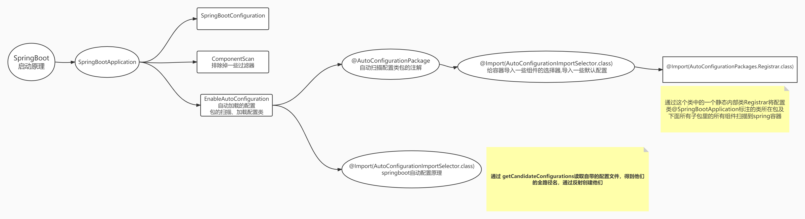
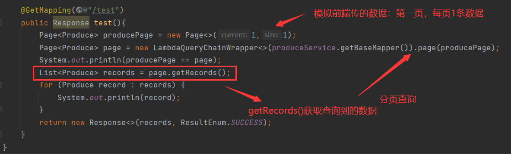
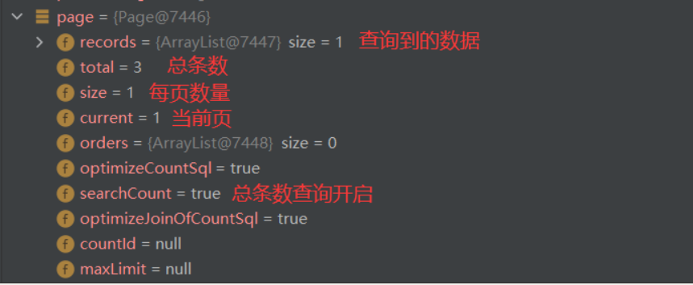
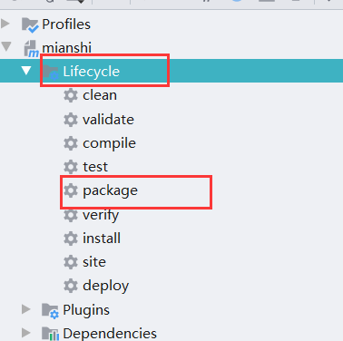

# 简介

## 原有Spring优缺点分析

优点：

> Spring是Java企业版（JAVAEE)开发的一种相对简单的方法，通过依赖注入和面向切面编程，用简单 的Java对象实现了EJB==(Enterprise Java Beans技术的简称, 又被称为企业Java Beans)==的功能

缺点：

* 虽然Spring的组件**代码是轻量级**的，但它的**配置却是重量级**的
* **依赖管理**也是一件耗时耗力的事情，会产生版本不兼容的问题


## SpringBoot概念简介

>Spring Boot是Spring公司的一个顶级项目，和Spring Framework是一个级别的。
>Spring Boot实际上是利用Spring Framework 4 自动配置特性完成。编写项目时不需要编写xml文件。发展到现在，Spring Boot已经具有很很大的生态圈，各种主流技术已经都提供了Spring Boot的启动器。

## 什么是启动器

>Spring框架在项目中作用是Spring整合各种其他技术，让其他技术使用更加方便。Spring Boot的启动器**实际上就是一个依赖**。这个依赖中包含了整个这个技术的相关jar包，还包含了这个技术的自动配置，以前绝大多数XML配置都不需要配置了。当然了，启动器中自动配置无法实现所有内容的自动配置，在使用Spring Boot时还需要进行少量的配置（这个配置不是在xml中了，而是在properties或yml中即可）。如果是**Spring自己封装的启动器**的artifact id**名字满足：spring-boot-starter-*xxxx***，如果是**第三方公司提供的启动**满足：***xxxx*-spring-boot-starter**。以后每次使用Spring Boot整合其他技术时首先需要考虑导入启动器。


# Spring Boot优点

①　使用Spring Boot可以创建独立的Spring应用程序
②　在Spring Boot中**直接嵌入了Tomcat**、Jetty、Undertow等Web  容器，在使用SpringBoot做Web开发时**不需要部署WAR文件**
③　通过提供自己的启动器(Starter)依赖，简化项目构建配置
④　尽量的自动配置Spring和第三方库
⑤　绝对没有代码生成，也不需要XML配置文件


# Spring Boot的核心

**起步依赖**：起步依赖本质上是一个Maven项目对象模型（Project Object Model，POM），定义了对其他库的传递依赖，这些东西加在一起即支持某项功能。 简单的说，起步依赖就是将具备某种功能的坐标打包到一起，并提供一些默认的功能。

**自动配置** ：Spring Boot的自动配置是一个运行时（更准确地说，是应用程序启动时）的过程，考虑了众多因素，才决定 Spring配置应该用哪个，不该用哪个。该过程是Spring自动完成的。


# 启动原理分析




```java
static class Registrar implements ImportBeanDefinitionRegistrar, DeterminableImports {
    @Override
    public void registerBeanDefinitions(AnnotationMetadata metadata, BeanDefinitionRegistry registry) {
        register(registry, new PackageImports(metadata).getPackageNames().toArray(new String[0]));
    }
    @Override
    public Set<Object> determineImports(AnnotationMetadata metadata) {
        return Collections.singleton(new PackageImports(metadata));
    }
}
```

将配置类@SpringBootApplication标注的类所在包及下面所有子包里的所有组件扫描到spring容器


```java
protected List<String> getCandidateConfigurations(AnnotationMetadata metadata, AnnotationAttributes attributes) {
		List<String> configurations = SpringFactoriesLoader.loadFactoryNames(getSpringFactoriesLoaderFactoryClass(),
				getBeanClassLoader());
		Assert.notEmpty(configurations, "No auto configuration classes found in META-INF/spring.factories. If you "
				+ "are using a custom packaging, make sure that file is correct.");
		return configurations;
	}
```

**通过 getCandidateConfigurations读取自带的配置文件，得到他们的全路径名，通过反射创建他们**


# 异常处理和拦截器

**均与SpringMVC中处理一致**


# 分页

主要参数：

当前页 、一页n个(每页的数量)、 总条数

## 属性介绍

|  属性名  |   类型   | 默认值 |                             描述                             |
| :------: | :------: | :----: | :----------------------------------------------------------: |
| overflow | boolean  | false  | 溢出总页数后是否进行处理<br/>(默认不处理,参见 `插件#continuePage` 方法) |
| maxLimit |   Long   |        | 单页分页条数限制<br/>(默认无限制,参见 `插件#handlerLimit` 方法) |
|  dbType  |  DbType  |        | 数据库类型<br/>(根据类型获取应使用的分页方言,参见 `插件#findIDialect` 方法) |
| dialect  | IDialect |        |        方言实现类<br/>(参见 `插件#findIDialect` 方法)        |

> 建议单一数据库类型的均设置 dbType

```java
	@GetMapping("/test")
    public Response test(){
        Page<Produce> producePage = new Page<>(1,1);
        Page<Produce> page = produceService.page(producePage);
        System.out.println(producePage == page);
        List<Produce> records = page.getRecords();
        for (Produce record : records) {
            System.out.println(record);
        }
        return new Response<>(records, ResultEnum.SUCCESS);
    }

```




默认是会查询总条数，都有get、set方法，可以根据自己的需求设置（点开Page类看看）




# 项目打包和部署

## 打包

SpringBoot项目打包在linux服务器中运行:
    ①jar类型项目会打成jar包:
    jar类型项目使用SpringBoot打包插件打包时，会在打成的jar中内置一个tomcat的jar。所以我们可以使用jdk直接运行该jar项目可，jar项目中有一个功能，将功能代码放到其内置的tomcat中运行。我们直接使用浏览器访问即可。
    ②war类型项目会打成war包:
    在打包时需要将内置的tomcat插件排除，配置servlet的依赖。将war正常的放到tomcat服务器中运行即可。




## 部署

**注：这里是部署到Tomcat（war），jar直接编译启动**

### 第一步：

	在部署到Tomcat 之前我们要将我们项目中的Tomcat(==它在Web中==)去掉，但是我们在项目中又有可能要使用他提供的jar包 HttpServlet 之类的，所以我们还需要再将它手动导入，但是他不需要他打包。

```xml
<!--配置SpringBoot的web启动器-->
<dependency>
    <groupId>org.springframework.boot</groupId>
    <artifactId>spring-boot-starter-web</artifactId>
    <!--排除web启动中自动依赖的tomcat插件-->
    <exclusions>
        <exclusion>
            <groupId>org.springframework.boot</groupId>
            <artifactId>spring-boot-starter-tomcat</artifactId>
        </exclusion>
    </exclusions>
</dependency>

<!--
    手动依赖tomcat插件，但是表明项目打包时该依赖不会被打进去，目的主要是保证开发阶段本地SpringBoot
    项目可以正常运行
-->
<dependency>
    <groupId>org.springframework.boot</groupId>
    <artifactId>spring-boot-starter-tomcat</artifactId>
    <!--打包的时候可以不用包进去，别的设施会提供。事实上该依赖理论上可以参与编译，测试，运行等周期。
        相当于compile，但是打包阶段做了exclude操作-->
    <scope>provided</scope>
</dependency>
```

### 第二步：

SpringBoot的**启动类继承SpringBootServletInitializer**，并**重写configure**

```java
@SpringBootApplication
public class MyApplication extends SpringBootServletInitializer {
    //重写配置方法
    @Override
    protected SpringApplicationBuilder configure(SpringApplicationBuilder application) {
        return application.sources(MyApplication.class);
    }
    public static void main(String[] args) {
        //启动SpringBoot
        SpringApplication.run(MyApplication.class,args);
    }
}
```

使用package命令打包项目，并将war包放到tomcat下的webapps下，启动tomcat即可。


### 注：

* 部署到tomcat之后我们的URL就会变化，tomcat会自动编译war包，我们的**项目名和war包同名**，所以不想改变提前修改
* **端口号也是tomcat的端口号**（tomcat/conf/server.xml）


# 面试题

## SpringBoot约定大于配置理解

约定大于配置是一种开发原则，就是减少人为的配置，直接用默认的配置就能获得我们想要的结果。
　　SpringBoot的约定大于配置，按我的理解是：对比SpringMVC，需要在web.xml里面配置前端控制器，还需要在核心配置文件（*-servlet.xml）中配置视图解析器啥的，更要配置第三方的Tomcat服务器。而SpringBoot就不需要我们配置这些，他内嵌了Tomcat服务器，我们只需要在Maven配置文件（Pom.xml）里面导入SpringMVC所需要的依赖就可以了。
　　这就是SpringBoot的优势，在传统所需要配置的地方，SpringBoot都进行了约定（配置好了），开发人员能配置得更少，更直接地开发项目，写业务逻辑代码。
spring boot和maven的约定大于配置体现 点：
　　1.maven的目录文件结构
　　1）默认有resources文件夹,存放资源配置文件。src-main-resources,src-main-java
默认的编译生成的类都在targetwen。
　　2）默认有target文件夹，将生成class文件盒编程生成的jar存放在target文件夹下

2.spring boot默认的配置文件必须是，也只能是application.命名的yml文件或者properties文件，且唯一

1）spring boot默认只会去src-main-resources文件夹下去找application配置文件


这个问题呢，我从四个方面来回答。

首先，约定优于配置是一种软件设计的范式，它的核心思想，是减少软件开发人员对于配置项的。从而让开发人员更加聚焦在业务逻辑上

第二个呢，Spring boot就是约定优于配置这一理念下的产物，它类似于spring框架下的一个脚手架，通过spring boot，我们可以快速开发基于spring生态下的应用程序。基于传统的spring框架开发web应用的时候，我们需要做很多和业务无关，并且只需要做一次的配置项，比如

1. 管理架包的依赖

2. web.xml的维护

3. spring MVC中的一个叫 Dispatch-Servlet.x ml 配置项的一个维护

4. 应用需要自己手动去部署到web容器

5. 第三方组件集成到spring IOC容器中，我们需要做配置项的维护

而在SpringBoot中，我们不再需要去做这些繁琐的配置，因为SpringBoot已经帮我们自动完成了，而完成这样一个动作的前提就是基于==约定优于配置==这样一个思想。

最后呢，Spring boot约定优于配置的体现有很多，

比如第一个spring boat start启动依赖，它能够帮助我们管理所有的jar包版本。

第二个，如果当前的应用依赖了web这样一个 jar 包，那么spring boot会自动内置Tomcat，他们看着容器来去运行web应用，我们不再需要去单独进行应用部署。

第三，Spring boot的自动装配机制的实现中，通过扫描约定路径下的spring.factory文件去进行识别配置类，从而去实现类的自动装载

第四，Spring boot？默认会加载resource目录下的application.property文件。总的来说啊，约定优于配置呢，是一个比较常见的软件设计思想，它的核心本质都是为了去更加高效，以及更加便捷的去实现软件系统的开发和维护。


**自我总结：**

​	约定大于配置，不是说我们要设定啥，原来规定的是什么就不能改变，不是这个意思。他真正的意思是说当我们配置某个选项时，springboot会自动帮我们加载可能会与其相关的配置，就好比我们应用依赖了 web，那么spring boot会自动内置Tomcat，他们看着容器来去运行web应用，我们不再需要去单独进行应用部署。

​	总的来说啊，约定优于配置呢，是一个比较常见的软件设计思想，它的核心本质都是为了去更加高效，以及更加便捷的去实现软件系统的开发和维护。


