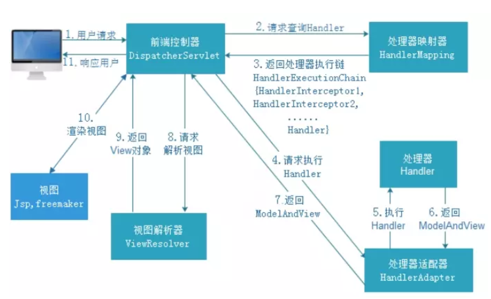

# 简介


M   model      模型层   DAO封装        >>> Mybatis
V    view         视图层   html css js  jsp 
C    controller 控制层   Servlet封装    >>> springMVC 

SpringMVC是spring为展现层提供的基于MVC设计理念的优秀WEB框架,是目前最主流的MVC框架之一
SpringMVC通过一套注解,可以让普通的JAVA类成为contrllor控制器,无需继承Servlet,实现了控制层和Servlet之间的解耦
SpringMVC支持Rest风格的URL写法
SpringMVC采用了松耦合,可热插的主键结构,比其他的框架更具扩展性和灵活性


# 执行流程





1DispatcherServlet：前端控制器
用户请求到达前端控制器，它就相当于 mvc 模式中的 c，dispatcherServlet 是整个流程控制的中心，由 它调用其它组件处理用户的请求，dispatcherServlet 的存在降低了组件之间的耦合性。

**2 HandlerMapping：处理器映射器**
HandlerMapping 负责根据用户请求找到 Handler 即处理器，SpringMVC 提供了不同的映射器实现不同的 映射方式，例如：配置文件方式，实现接口方式，注解方式等。

3 Handler：处理器 (自己定义的Controller处理单元)
它就是我们开发中要编写的具体业务控制器。由 DispatcherServlet 把用户请求转发到 Handler。由 Handler 对具体的用户请求进行处理。

**4 HandlAdapter：处理器适配器**
通过 HandlerAdapter 对处理器进行执行，这是适配器模式的应用，通过扩展适配器可以对更多类型的处理器进行执行


5 View Resolver：视图解析器
View Resolver 负责将处理结果生成 View 视图，View Resolver 首先根据逻辑视图名解析成物理视图名 即具体的页面地址，再生成 View 视图对象，最后对 View 进行渲染将处理结果通过页面展示给用户。

6 View：视图
SpringMVC 框架提供了很多的 View 视图类型的支持，包括：jstlView、freemarkerView、pdfView等。我们最常用的视图就是 jsp。 一般情况下需要通过页面标签或页面模版技术将模型数据通过页面展示给用户，需要由程序员根据业务需求开 发具体的页面。

7 <mvc:annotation-driven>说明
在 SpringMVC 的各个组件中，处理器映射器、处理器适配器、视图解析器称为 SpringMVC 的三大组件。
使 用 <mvc:annotation-driven> 自动加载 RequestMappingHandlerMapping （处理映射器） 和 RequestMappingHandlerAdapter （ 处 理 适 配 器 ） ， 可 用 在 SpringMVC.xml 配 置 文 件 中 使 用 <mvc:annotation-driven>替代注解处理器和适配器的配置。


HandlerMapping的实现类的作用
实现类RequestMappingHandlerMapping，它会处理@RequestMapping 注解，并将其注册到请求映射表中。

HandlerAdapter的实现类的作用
实现类RequestMappingHandlerAdapter，则是处理请求的适配器，确定调用哪个类的哪个方法，并且构造方法参数，返回值。

当配置了mvc:annotation-driven/后，Spring就知道了我们启用注解驱动。然后Spring通过context:component-scan/标签的配置，会自动为我们将扫描到的@Component，@Controller，@Service，@Repository等注解标记的组件注册到工厂中，来处理我们的请求,这个时候接收返回json数据、参数验证、统一异常等功能。


# 重要注解

## 1、RequestMapping

紧耦合方式(了解)
DispatcherServlet中的service方法直接将此次请求的request对象传递给调用的单元方法即可。同时在单元方法上声明形参HttpServletRequest来接收request实参即可。
**解耦合方式(熟练)**
DispatcherServlet在其service方法中将请求数据根据需求从request对象中获取出来后，将数据直接传递给对应的单元方法使用。同时在单元方法上直接声明对应的形参接收请求数据即可。在单元方法上声明形参来接收请求数据时，形参名必须和请求数据的键名一致，DispatcherServlet会将调用单元方法的形参名作为请求数据的键名获取请求数据，然后传递给单元方法。

```java
@RestController
public class TestDataController {
    /*紧耦合方式参数注入
    * 使用传统的HttpServletRequest对象获取参数  javax.servlet
    * */
    @RequestMapping("/getParamByRequest.do")
    public String getParam1(HttpServletRequest req, HttpServletResponse resp){
        String username = req.getParameter("username");
        String password = req.getParameter("password");
        System.out.println("username:"+username+"   password:"+password);
        return "getParamSuccess";
    }
    /*解耦合方式参数注入
    * HttpServletRequest对象获取参数 通过SpringMVC框架功能,自动转换参数
    * 处理单元参数列表中参数名必须和请求中的参数名一致
                                        * 如不一致,可以通过@RequestParma注解进行转换
    * */
    @RequestMapping("/getParamByArgName.do")
    public String getParam2(String username,@RequestParam("pwd") int password){
        System.out.println("username:"+username+"   password:"+password);
        return "getParamSuccess";
    }
}
```


## 2、PathVariable注解和RESTful风格的支持

**普通形式的url**

```java
*/contextPath/aaa.do
*/contextPath/aaa.jsp
*/contextPath/aaa.html
*/contextPath/css/aaa.css
*/contextPath/js/aaa.js
*/contextPath/aaa.do?id=10&username=root
```

**restFul风格的url**

```java
*/contextPath/aaa/10/root
*/contextPath/aaa
```

```java
@Controller
public class PathController {
    @RequestMapping("/testPathVariable/{id}/{username}")
    public String testPathVariable(@PathVariable("id") Integer id, @PathVariable("username") String username){
        System.out.println("id:"+id);
        System.out.println("username:"+username);
        System.out.println("testPathVariable1");
        return "success";
    }
}
```


# 响应处理


1、单元方法返回值为void


>在SpringMVC中如果对于当前的控制单元，没有写对应的返回值，这个时候**SpringMVC就会找和自己控制单元名称一致的页面展示**，**如果没有配置视图解析器的前缀和后缀是没有产生404**,需要注意控制单元仍然可以进。

2、转发和重定向ServletAPI 实现

```java
@RequestMapping("demo1")
    public void testDemo1(HttpServletRequest request, HttpServletResponse response) throws Exception {
        // 请求转发
        //request.getRequestDispatcher("/forward.jsp").forward(request,response);
        // 响应重定向
        response.sendRedirect(request.getContextPath()+"/redirect.jsp");
    }
```

>单元方法的返回值类型设置void。因为使用response对象在单元方法中直接对此次请求进行了响应，不再通过DispatcherServlet了，既然已经响应了，就不需要再给DispatcherServlet返回值了。在单元方法上声明HttpServletResponse形参，来接收此次请求的response对象。

3、使用forward关键字完成响应

```java
 /*
    * 返回字符串告诉DispatcherServlet跳转的路径
    * 在路径之前放上一个forward: 关键字,就是请求转发
    * 如果路径前的关键字是forward,那么可以省略不写
    * */
    @RequestMapping("demo2")
    public String testDemo2() throws Exception {
        //return "forward:/forwardPage.jsp";
        return "/forwardPage.jsp";
    }
```

使用通过单元方法的返回值来告诉DispatcherServlet请求转发指定的资源,如果是请求转发，**forward关键字可以*省略不写*的**

4、使用redirect关键字完成响应

```java
/*
     * 返回字符串告诉DispatcherServlet跳转的路径
     * 在路径之前放上一个redirect: 关键字,就是重定向
     * 如果路径前的关键字是redirect,那么不可以省略
     * /表示当前项目下.这里不需要项目的上下文路径
     * */
    @RequestMapping("demo3")
    public String testDemo3() throws Exception {
        return "redirect:/redirectPage.jsp";
    }
```

使用通过单元方法的返回值来告诉DispatcherServlet重定向指定的资源，注意这个**redirect关键字*不可以省去***


5、使用View视图转发和重定向

```java
 @RequestMapping("demo4")
    public View testDemo4(HttpServletRequest req)   {
        View  view =null;
        // 请求转发
        //view =new InternalResourceView("/forwardPage.jsp");
        // 重定向
        view=new RedirectView(req.getContextPath()+"/redirectPage.jsp");
        return view;
    }
```

>RedirectView中所做的操作，最终的实现是在renderMergedOutputModel中完成实现的，简单来说RedirectView实现了链接的重定向，并且将数据保存到FlashMap中，这样在跳转后的链接中可以获取一些数据.


6、使用ModelAndView转发重定向

```java
@RequestMapping("demo5")
    public ModelAndView testDemo5(HttpServletRequest req)   {
        ModelAndView mv=new ModelAndView();
        // 请求转发
        //mv.setViewName("forward:/forwardPage.jsp");
        //mv.setView(new InternalResourceView("/forwardPage.jsp"));
        // 重定向
        //mv.setViewName("redirect:/redirectPage.jsp");
        mv.setView(new RedirectView(req.getContextPath()+"/redirectPage.jsp"));
        return mv;
    }
```

​	ModelAndView中的Model代表模型，View代表视图，这个名字就很好地解释了该类的作用。业务处理器调用模型层处理完用户请求后，把结果数据存储在该类的model属性中，把要返回的视图信息存储在该类的view属性中，然后让该ModelAndView返回该Spring MVC框架。


# 作用域传参


> PageContext对象

作用域范围:当前jsp页面内有效

> request对象

作用域范围:一次请求内。

作用: 解决了一次请求内的资源的数据共享问题

> session对象

作用域范围:一次会话内有效。

说明:浏览器不关闭,并且后台的session不失效，在任意请求中都可以获取到同一个session对象。

作用:解决了一个用户不同请求的数据共享问题。

> application(ServletContext)对象

作用域范围:整个项目内有效。

特点:一个项目只有一个，在服务器启动的时候即完成初始化创建无论如何获取都是同一个项目。

作用:解决了不同用户的数据共享问题。


# 拦截器

## 引入

>==过滤器的作用是保护请求的服务器资源，在请求资源被执行之前==，如果请求地址符合拦截范围，则会先执行过滤器。==过滤器的执行时机，是在Servlet之前执行的==。但是在使用了SpringMVC后，Servlet只有一个了，也就是DisptcherServlet。那么，如果我们仍然使用过滤器来完成请求的拦截，因为过滤器是在Servlet之前执行的，就会造成，==过滤器会拦截DispatcherServlet所有的请求==。那么，如果我们有==部分请求不想被拦截==，怎么办？

## 拦截器使用


Spring MVC中的拦截器（Interceptor）类似于Servlet中的过滤器（Filter），它主要用于拦截用户请求并作相应的处理。例如通过拦截器可以进行权限验证、记录请求信息的日志、判断用户是否登录等。
    要使用Spring MVC中的拦截器，就需要对拦截器类进行定义和配置。通常拦截器类可以通过两种方式来定义。
    1.通过实现HandlerInterceptor接口，或继承HandlerInterceptor接口的实现类（如HandlerInterceptorAdapter）来定义。
    2.通过实现WebRequestInterceptor接口，或继承WebRequestInterceptor接口的实现类来定义。

## 拦截器和过滤器的区别

1. 拦截器SpringMVC的，而过滤器是servlet的。	

2. 拦截器不依赖与servlet容器,由spring容器初始化，过滤器依赖与servlet容器,由servlet容器初始化。. 

3. 拦截器只能对action请求起作用，而过滤器则可以对几乎所有的请求起作用。
4. 拦截器可以访问action上下文、值栈里的对象，而过滤器不能访问。
5. 在action的生命周期中，拦截器可以多次被调用，而过滤器只能在容器初始化时被调用一次。
6. 拦截器可以获取IOC容器中的各个bean，而过滤器就不太方便，这点很重要，在拦截器里注入一个service，可以调用业务逻辑。

```java
public class MyInterceptor implements HandlerInterceptor {
    @Override
    public boolean preHandle(HttpServletRequest request, HttpServletResponse response, Object handler) throws Exception {
        /*在请求到达我们定义的handler之前工作的*/
        System.out.println("MyInterceptor preHandle");
        /*返回的是true,代表放行,可以继续到达handler*/
        return true;
    }
    @Override
    public void postHandle(HttpServletRequest request, HttpServletResponse response, Object handler, ModelAndView modelAndView) throws Exception {
        System.out.println("MyInterceptor postHandle");
        /*handler 处理单元返回ModelAndView 时候进行 拦截*/
    }
    @Override
    public void afterCompletion(HttpServletRequest request, HttpServletResponse response, Object handler, Exception ex) throws Exception {
        /*
        页面渲染完毕,但是还没有给浏览器响应数据的时候
         */
        System.out.println("MyInterceptor afterCompletion");
    }
}
```

## 多个拦截器执行顺序

多个拦截器同时存在时,执行的顺序由配置顺序决定. 先配置谁, 谁就先执行.多个拦截器可以理解为拦截器栈, 先进后出(后进先出), 如图所示:


# 异常处理

## SpringMVC异常简介

​	系统中异常包括两类：预期异常(检查型异常)和运行时异常 RuntimeException，前者通过捕获异常从而获取异常信息， 后者主要通过规范代码开发、测试通过手段减少运行时异常的发生

## 具体实现

### 1使用@ExceptionHandler注解处理异常


缺点：只能处理当前Controller中的异常。

```java
 @ExceptionHandler(value ={ArithmeticException.class,NullPointerException.class} )
    public ModelAndView handelException(){
        ModelAndView mv =new ModelAndView();
        mv.setViewName("error1.jsp");
        return mv;
    }
```

### 2使用：@ControllerAdvice+@ExceptionHandler

此处优先级低于局部异常处理器

```java
@ControllerAdvice
public class GloableExceptionHandler1 {
    @ExceptionHandler(value ={ArithmeticException.class,NullPointerException.class} )
    public ModelAndView handelException(){
        ModelAndView mv =new ModelAndView();
        mv.setViewName("error1.jsp");
        return mv;
    }
}
```

### 3使用：SimpleMappingExceptionResolver

```java
/**
 * 全局异常
 */
  @Configuration
  public class GloableException2 {
    @Bean
    public SimpleMappingExceptionResolver getSimpleMappingExceptionResolver(){
        SimpleMappingExceptionResolver resolver = new SimpleMappingExceptionResolver();
        Properties prop = new Properties();
        prop.put("java.lang.NullPointerException","error1.jsp");
        prop.put("java.lang.ArithmeticException","error2.jsp");
        resolver.setExceptionMappings(prop);
        return resolver;
    }
}
```

### 4自定义的HandlerExceptionResolver

```java
/**
 * 全局异常
 * HandlerExceptionResolve
 */
  @Configuration
  public class GloableException3 implements HandlerExceptionResolver {
    @Override
    public ModelAndView resolveException(HttpServletRequest httpServletRequest, HttpServletResponse httpServletResponse, Object o, Exception e) {
        ModelAndView mv = new ModelAndView();
        if(e instanceof NullPointerException){
                mv.setViewName("error1");
        }
        if(e instanceof ArithmeticException){
                mv.setViewName("error2");
        }
        mv.addObject("msg",e);
        return mv;
    }}
```

# 其他注解

## @RequestBody

作用：

​	用于获取请求体json格式的字符串内容。直接使用得到是 key=value&key=value...结构的数据，get 请求方式不适用。

属性：

​	required：是否必须有请求体。默认值是:true。当取值为 true 时,get 请求方式会报错。如果取值 为 false，get 请求得到是null。

## @CrossOrigin 

作用：

​	解决ajax请求之间的跨域问题

属性:

origins  ： 允许可访问的域列表IP

maxAge：准备响应前的缓存持续的最大时间（以秒为单位）。
