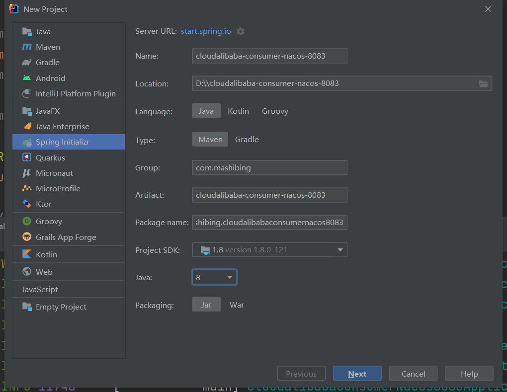
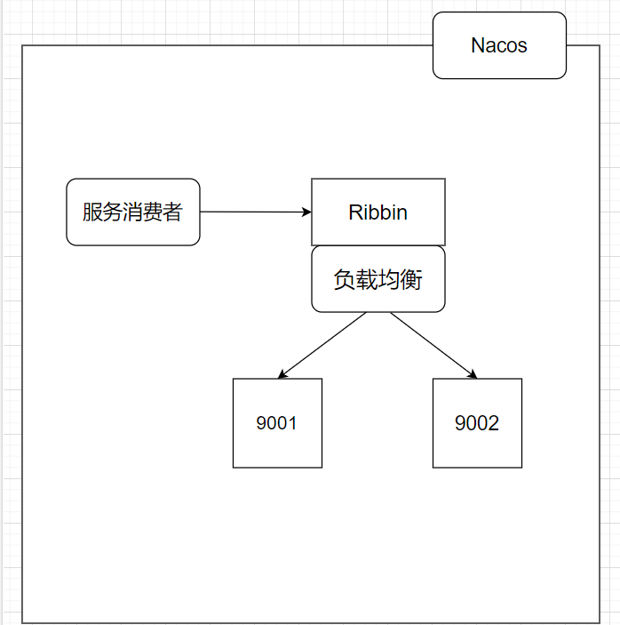
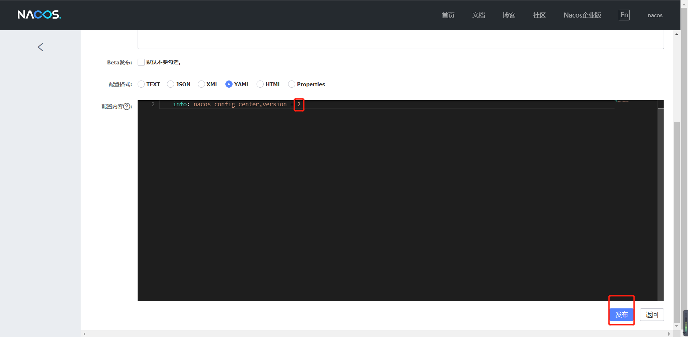
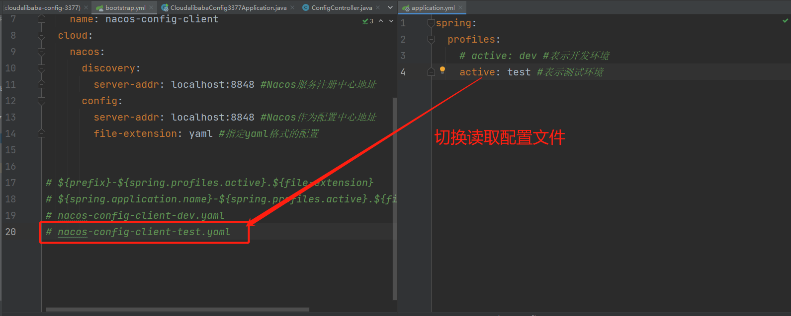
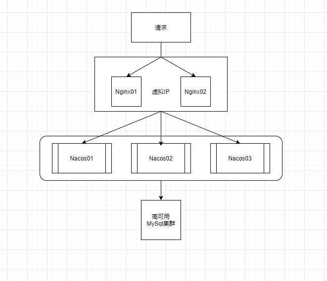
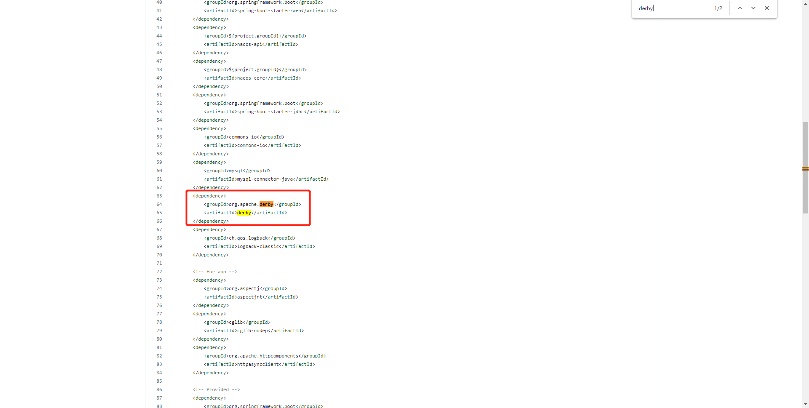
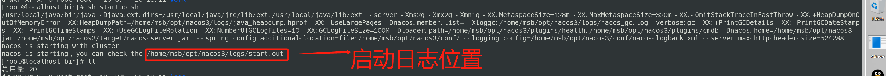
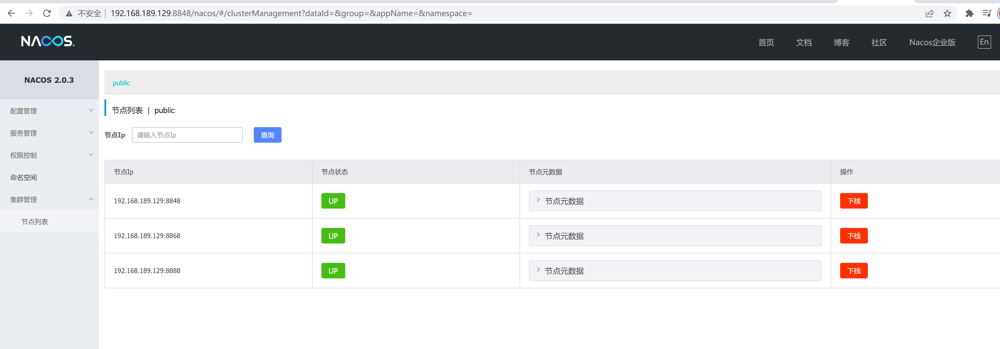
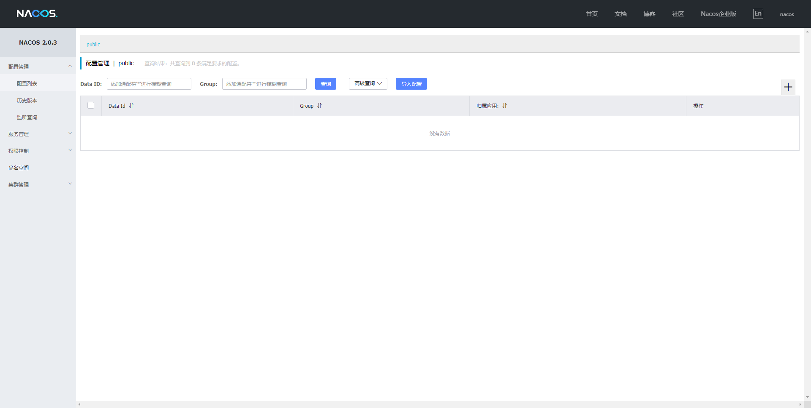

# 微服务简介

## 1 什么是微服务

2014年，Martin Fowler（**马丁·福勒** ） 提出了微服务的概念，定义了微服务是由以单一应用程序构成的小服务，自己拥有自己的进程与轻量化处理，服务依业务功能设计，以全自动的方式部署，与其他服务使用 HTTP API 通信。同时服务会使用最小的规模的集中管理能力，服务可以用不同的编程语言与数据库等组件实现。


马丁·福勒是敏捷联盟的成员，于2001年，同其他16名合著者一起协助创作了“敏捷软件开发宣言”。他负责维护一个bliki网站---一种blog和wiki的混合衍生物，他还使控制反转(Inversion of Control)“依赖注入模式(Dependency Injection)”一词得到普及。

### 架构的演变

随着互联网的发展，网站应用的规模也不断的扩大，进而导致系统架构也在不断的进行变化，从互联网早起到现在，系统架构大体经历了下面几个过程：


#### 单体应用架构：

把所有功能都集中在一个应用中，统一部署，开发成本、部署成本和维护成本低

* 优点：项目架构简单，适合用户量少的项目，开发成本低，项目部署在一个节点上，维护方便。
* 缺点：功能集中在一个工程中，对于大型项目比一开发和维护，项目模块紧耦合，单点容错率低，无法对不同的模块功能进行针对性的优化和水平拓展

#### 垂直应用架构：

所谓垂直应用架构，其实就是把之前的单体应用拆分成多个应用，以提升效率，比如电商系统可以拆分成：电商系统、后台系统、CMS系统

* 优点：项目拆分实现了流量分担，解决了并发问题，而且可以针对不同模块进行优化和水平拓展，同时不同的系统之间不会互相影响，提高容错率
* 缺点：系统之间互相存在，无法进行相互调用，系统之间互相独立，会造成一部分功能的冗余

#### 分布式架构：

随着业务的增加，在垂直应用架构中冗余的业务代码越来越多，就需要将冗余的部分抽取出来，统一做成业务层单独处理，变成一个单独的服务，控制层调用不同的业务层服务就能完成不同的业务功能，具体表现就是一个项目拆分成表现层和服务层两个部分，服务层中包含业务逻辑，表现层只需要处理和页面的交互，业务逻辑都是调用服务层的服务来实现，这就是分布式架构。

* 优点：抽取公共的功能作为服务层，提高代码复用行。
* 缺点：系统间耦合度变高，调用关系错综复杂，难以维护。

#### SOA架构：

分布式架构中的缺点就是调用复杂，而且当服务越来越多，或者当某一个服务压力过大需要水平拓展和负载均衡，对于资源调度和治理就需要用到治理中心SOA（Service Oriented Architecture）为核心来解决，同时治理中心还可以帮助我们解决服务之间协议不同的问题。

* 优点：使用治理中心（ESB\dubbo）解决了服务见调用关系的自动调节
* 缺点：服务间会有依赖关系，一旦某个环节出错会影响较大（服务雪崩），服务关系复杂，运维、测试部署困难。

#### 微服务架构：

微服务架构在某种程度上面架构SOA继续发展的下一步，它更加强调服务的“彻底拆分”，目的就是提高效率，微服务架构中，每个服务必须独立部署同时互不影响，微服务架构更加轻巧，轻量级。

#### 微服务架构与SOA架构的不同

1. 微服务架构比SOA架构会更加的精细，让专业的人去做专业的。
2. 目的是提高效率每个服务之间互不影响，微服务架构中，每个服务需要独立部署
3. SOA架构中可能数据库存储会发生共享，微服务强调每个服务都是单独数据库，保证每个服务之间互不影响。
4. 微服务项目架构比SOA架构更加适合与互联网公司迅捷开发、快速迭代版本，因为粒度非常精细。

为何使用微服务呢？


微服务就像集群作战，可以提升性能


微服务架构：


* 优点：服务原子化拆分，独立打包、部署和升级，保证每个微服务清晰的任务划分，利于扩展
* 缺点：分布式系统开发的技术成本高（容错、分布式事务等），复杂性更高，每个微服务进行分布式独立部署，当进行模块调用的时候，分布式将会变得更加麻烦。

#### Spring Cloud 发展历史

**Spring Cloud netflix -> Spring Cloud Alibaba**

1. 2020-12-22日**Spring** 官方博客宣布，`Spring Cloud 2020.0.0`正式发布。`2020.0.0`是第一个使用新的版本号命名方案的**Spring Cloud** 发行版本。在此之前**Spring Cloud** 使用英国伦敦地铁站的命名方式来命名一个大版本（`train version`），如果不按照新的版本号命名的话，本次的版本号应该是Ilford。
2. 更新版本没有什么大惊小怪的，但是本次更新却正式开启了**Spring Cloud Netflix** 体系的终结进程。**Netflix** 公司是目前微服务落地中最成功的公司。它开源了诸如**Eureka** 、**Hystrix** 、**Zuul** 、**Feign** 、**Ribbon** 等等广大开发者所知微服务套件，统称为**Netflix OSS** 。在当时**Netflix OSS** 成为微服务组件上事实的标准。但是在2018年**Netflix** 公司宣布其核心组件**Hystrix** 、**Ribbon** 、**Zuul** 、**Eureka** 等进入**维护状态** ，不再进行新特性开发，只修BUG。这直接影响了**Spring Cloud** 项目的发展路线，**Spring** 官方不得不采取了应对措施，在2019年的在 **SpringOne 2019** 大会中，**Spring Cloud** 宣布 **Spring Cloud Netflix项目进入维护模式** ，并在2020年移除相关的**Netflix OSS** 组件。
3. Spring Cloud Aalibaba 成为了主流


## 2 Spring Cloud Alibaba

### 简介

Spring Cloud Alibaba 致力于提供微服务开发的一站式解决方案。此项目包含开发分布式应用微服务的必需组件，方便开发者通过 Spring Cloud 编程模型轻松使用这些组件来开发分布式应用服务。

依托 Spring Cloud Alibaba，您只需要添加一些注解和少量配置，就可以将 Spring Cloud 应用接入阿里微服务解决方案，通过阿里中间件来迅速搭建分布式应用系统。

### 主要功能

* **服务限流降级** ：默认支持 WebServlet、WebFlux, OpenFeign、RestTemplate、Spring Cloud Gateway, Zuul, Dubbo 和 RocketMQ 限流降级功能的接入，可以在运行时通过控制台实时修改限流降级规则，还支持查看限流降级 Metrics 监控。
* **服务注册与发现** ：适配 Spring Cloud 服务注册与发现标准，默认集成了 Ribbon 的支持。
* **分布式配置管理** ：支持分布式系统中的外部化配置，配置更改时自动刷新。
* **消息驱动能力** ：基于 Spring Cloud Stream 为微服务应用构建消息驱动能力。
* **分布式事务** ：使用 @GlobalTransactional 注解， 高效并且对业务零侵入地解决分布式事务问题。
* **阿里云对象存储** ：阿里云提供的海量、安全、低成本、高可靠的云存储服务。支持在任何应用、任何时间、任何地点存储和访问任意类型的数据。
* **分布式任务调度** ：提供秒级、精准、高可靠、高可用的定时（基于 Cron 表达式）任务调度服务。同时提供分布式的任务执行模型，如网格任务。网格任务支持海量子任务均匀分配到所有 Worker（schedulerx-client）上执行。
* **阿里云短信服务** ：覆盖全球的短信服务，友好、高效、智能的互联化通讯能力，帮助企业迅速搭建客户触达通道。

### 组件

**[Sentinel]** ：阿里巴巴源产品，把流量作为切入点，从流量控制、熔断降级、系统负载保护等多个维度保护服务的稳定性。

**[Nacos]** ：一个更易于构建云原生应用的动态服务发现、配置管理和服务管理平台。

**[RocketMQ]** ：一款开源的分布式消息系统，基于高可用分布式集群技术，提供低延时的、高可靠的消息发布与订阅服务。

**[Dubbo]** ：Apache Dubbo™ 是一款高性能 Java RPC 框架。

**[Seata]** ：阿里巴巴开源产品，一个易于使用的高性能微服务分布式事务解决方案。

**[Alibaba Cloud OSS]** : 阿里云对象存储服务（Object Storage Service，简称 OSS），是阿里云提供的海量、安全、低成本、高可靠的云存储服务。您可以在任何应用、任何时间、任何地点存储和访问任意类型的数据。

**[Alibaba Cloud SchedulerX]**: 阿里中间件团队开发的一款分布式任务调度产品，提供秒级、精准、高可靠、高可用的定时（基于 Cron 表达式）任务调度服务。

**[Alibaba Cloud SMS]** : 覆盖全球的短信服务，友好、高效、智能的互联化通讯能力，帮助企业迅速搭建客户触达通道。


# Spring Cloud Alibaba Nacos下载和安装

## Nacos介绍

​	Nacos（Naming Configuration Service） 是一个易于使用的动态服务发现、配置和服务管理平台，用于构建云原生应用程序

​	**服务发现是微服务架构中的关键组件之一**。Nacos 致力于帮助您发现、配置和管理微服务。Nacos 提供了一组简单易用的特性集，帮助您快速实现动态服务发现、服务配置、服务元数据及流量管理。

​	Nacos 帮助您更敏捷和容易地构建、交付和管理微服务平台。 Nacos 是构建以“服务”为中心的现代应用架构 (例如微服务范式、云原生范式) 的服务基础设施。


## 什么是Nacos？

1. Nacos = **注册中心+配置中心组合**

2. Nacos支持几乎所有主流类型的“服务”的发现、配置和管理，常见的服务如下：

   Kubernetes Service

   gRPC & Dubbo RPC Service

   Spring Cloud RESTful Service

   

## 为何使用Nacos？

​	为何使用注册中心呢？我们以入住酒店的前台为例子，稍微加以解释。先设想一个没有服务前台的酒店，客人入住需要自己寻找合适居住的房间，客人不知道每个房间的情况，无法确定那个房间是打扫干净可以入住，客人只能逐个房间寻找，如果遇到已经居住房客的房间一定很尴尬，显然这是不正常的情况。正常的情况是酒店会安排服务台，酒店打扫干净可以入住的房间会登记注册到服务台，这样客人来住店，只需要在前台就可以查找到可以入住的房间，这样就无需等待快速的入住。显然，服务器提供发注册和发现机制可以让房客快速找到合适的房间，快速解决入住问题。


​	采用微服务以后，软件微服务组件各自独立，但最终还要组合为一个整体作为一个软件系统服务于最终客户，这时软件组件之间也需要彼此通讯，彼此调用方法。微服务架构内部发起通讯调用方法的一方成为“**服务消费者**”，提供远程方法调用的服务器称为“**服务提供者**”，往往为了提高系统性能，会提供多个服务器作为**服务提供者**，此时**服务消费者**找到**服务提供者**的过程，就类似于用户在找房间的过程。为了帮助**服务消费者**快速的发现**服务提供者**，在微服务框架中都会引入**注册中心。注册中心**类似于酒店的前台，提供在软件服务的注册和发现功能，**服务提供者**会先在注册中心进行**注册**，声明可以对外提供服务，而**服务消费者**只需要在注册中心就可以快速**发现**找到可以使用的服务，快速使用服务。注册中心实现了服务提供和服务消费的快速撮合功能。


## Nacos下载和安装

官网网址：https://nacos.io/zh-cn/index.html


官网文档网址：https://nacos.io/zh-cn/docs/quick-start.html

注意：使用官网推荐的稳定版本：


下载地址：https://github.com/alibaba/nacos/releases


#### 下载之后安装过程

1. 解压以后找到bin目录


2. 执行指令：

   ### Linux/Unix/Mac

   启动命令(standalone代表着单机模式运行，非集群模式):

   ```shell
   sh startup.sh -m standalone
   ```

   ### Windows

   启动命令(standalone代表着单机模式运行，非集群模式):

   ```shell
   startup.cmd -m standalone
   ```

3. 结果：

   

4. 得到结果以后为了验证是否成功开启Nacos，我们需要访问：http://localhost:8848/nacos


5. 出现此界面表示已经成功启动Nacos，默认的账号密码是：nacos/nacos


6. 到这里就是成功开启了Nacos服务了。

# Nacos服务提供者注册

## Nacos代替Eureka

​	Nacos可以直接提供注册中心（Eureka）+配置中心（Config），所以它的好处显而易见，我们在上节课成功安装和启动了Nacos以后就可以发现Nacos本身就是一个小平台，它要比之前的Eureka更加方便，不需要我们在自己做配置。


## Nacos服务注册中心

​	服务发现是微服务架构中的关键组件之一。在这样的架构中，手动为每个客户端配置服务列表可能是一项艰巨的任务，并且使得动态扩展极其困难。Nacos Discovery 帮助您自动将您的服务注册到 Nacos 服务器，Nacos 服务器会跟踪服务并动态刷新服务列表。此外，Nacos Discovery 将服务实例的一些元数据，如主机、端口、健康检查 URL、主页等注册到 Nacos。

​	学习任何知识我们都需要从它的官方文档入手，所以我们直接来看官网给我们提供的文档：https://spring.io/projects/spring-cloud-alibaba#learn


​	

## 如何引入Nacos Discovery进行服务注册/发现

### 创建新项目

聚合项目：由于聚合带来的诸多好处，在SpringBoot项目开发中也广泛采用，开发中将SpringBoot项目按照功能分成子模块开发，所以我们在使用Spring Cloud Alibaba完成项目的时候，也是采用聚合项目来完成。

​	父项目	


​	子项目


### POM

​	父项目pom文件

```java
<?xml version="1.0" encoding="UTF-8"?>
<project xmlns="http://maven.apache.org/POM/4.0.0" xmlns:xsi="http://www.w3.org/2001/XMLSchema-instance"
         xsi:schemaLocation="http://maven.apache.org/POM/4.0.0 https://maven.apache.org/xsd/maven-4.0.0.xsd">
    <modelVersion>4.0.0</modelVersion>
    <parent>
        <groupId>org.springframework.boot</groupId>
        <artifactId>spring-boot-starter-parent</artifactId>
        <version>2.4.10</version>
        <relativePath/> <!-- lookup parent from repository -->
    </parent>
    <groupId>com.mashibing</groupId>
    <artifactId>SpringCloudAlibabaMSB</artifactId>
    <version>0.0.1-SNAPSHOT</version>
    <name>SpringCloudAlibabaMSB</name>
    <packaging>pom</packaging>
    <description>SpringCloudAlibabaMSB</description>
    <properties>
        <java.version>1.8</java.version>
        <spring-cloud-alibaba-version>2.2.5.RELEASE</spring-cloud-alibaba-version>
    </properties>
    <dependencies>
        <dependency>
            <groupId>org.springframework.boot</groupId>
            <artifactId>spring-boot-starter-web</artifactId>
        </dependency>
        <dependency>
            <groupId>org.springframework.boot</groupId>
            <artifactId>spring-boot-starter-tomcat</artifactId>
            <scope>provided</scope>
        </dependency>
        <dependency>
            <groupId>org.springframework.boot</groupId>
            <artifactId>spring-boot-starter-test</artifactId>
            <scope>test</scope>
        </dependency>
    </dependencies>
    <dependencyManagement>
        <dependencies>
            <dependency>
                <groupId>com.alibaba.cloud</groupId>
                <artifactId>spring-cloud-alibaba-dependencies</artifactId>
                <version>${spring-cloud-alibaba-version}</version>
                <type>pom</type>
                <scope>import</scope>
            </dependency>
        </dependencies>
    </dependencyManagement>

    <modules>
        <module>cloudAlibaba-Nacos-9001</module>
    </modules>

</project>
```

​	子项目pom文件

```java
<?xml version="1.0" encoding="UTF-8"?>
<project xmlns="http://maven.apache.org/POM/4.0.0" xmlns:xsi="http://www.w3.org/2001/XMLSchema-instance"
         xsi:schemaLocation="http://maven.apache.org/POM/4.0.0 https://maven.apache.org/xsd/maven-4.0.0.xsd">
    <modelVersion>4.0.0</modelVersion>
    <parent>
        <groupId>com.mashibing</groupId>
        <artifactId>SpringAlibabaMSB</artifactId>
        <version>0.0.1-SNAPSHOT</version>
        <relativePath/> <!-- lookup parent from repository -->
    </parent>
    <groupId>com.mashibing</groupId>
    <artifactId>cloudalibaba-nacos-9001</artifactId>
    <version>0.0.1-SNAPSHOT</version>
    <name>cloudalibaba-nacos-9001</name>
    <description>cloudalibaba-nacos-9001</description>

    <dependencies>
        <dependency>
            <groupId>org.springframework.boot</groupId>
            <artifactId>spring-boot-starter-web</artifactId>
        </dependency>
        <dependency>
            <groupId>com.alibaba.cloud</groupId>
            <artifactId>spring-cloud-starter-alibaba-nacos-discovery</artifactId>
        </dependency>
    </dependencies>
</project>
```


### YML


```java
server:
  port: 9001
spring:
  application:
    name: nacos-provider
  cloud:
    discovery:
      server-addr: 127.0.0.1:8848

management:
  endpoint:
    web:
      exposure:
        include: '*'
```

### 启动类

```java
package com.mashibing.cloudalibabanacos9001;

import org.springframework.boot.SpringApplication;
import org.springframework.boot.autoconfigure.SpringBootApplication;
import org.springframework.cloud.client.discovery.EnableDiscoveryClient;

@SpringBootApplication
@EnableDiscoveryClient//加此注解
public class CloudalibabaNacos9001Application {

    public static void main(String[] args) {
        SpringApplication.run(CloudalibabaNacos9001Application.class, args);
    }

}

```


### 业务类

```java
import org.springframework.beans.factory.annotation.Value;
import org.springframework.web.bind.annotation.GetMapping;
import org.springframework.web.bind.annotation.PathVariable;
import org.springframework.web.bind.annotation.RestController;

@RestController
public class DemoController {

    @Value("${server.port}")
    private String serverPort;

    @GetMapping(value = "/mashibing")
    public String getServerPort(){
        return "Hello Nacos Discovery"+serverPort;
    }

}
```


### 测试

**注意，在启动项目前一定要启动Nacos**


## 练习

​	根据上面的练习演示，在创建一个新的9002端口作为服务注册到Nacos中，为了下节课来做准备


# Nacos服务消费者注册和负载均衡

## 服务消费者

​	上节课我们成功配置了Nacos服务提供者的注册，那么这节课我们将配置服务消费者，同时来验证Nacos自带负载均衡。


## 具体配置

### 新建Module



#### pom

```java
<?xml version="1.0" encoding="UTF-8"?>
<project xmlns="http://maven.apache.org/POM/4.0.0" xmlns:xsi="http://www.w3.org/2001/XMLSchema-instance"
         xsi:schemaLocation="http://maven.apache.org/POM/4.0.0 https://maven.apache.org/xsd/maven-4.0.0.xsd">
    <modelVersion>4.0.0</modelVersion>
    <parent>
        <groupId>com.mashibing</groupId>
        <artifactId>SpringAlibabaMSB</artifactId>
        <version>0.0.1-SNAPSHOT</version>
        <relativePath/> <!-- lookup parent from repository -->
    </parent>
    <groupId>com.mashibing</groupId>
    <artifactId>cloudalibaba-consumer-nacos-8083</artifactId>
    <version>0.0.1-SNAPSHOT</version>
    <name>cloudalibaba-consumer-nacos-8083</name>
    <description>cloudalibaba-consumer-nacos-8083</description>
    <properties>
        <java.version>1.8</java.version>
    </properties>
    <dependencies>
        <dependency>
            <groupId>org.springframework.boot</groupId>
            <artifactId>spring-boot-starter-web</artifactId>
        </dependency>
        <dependency>
            <groupId>com.alibaba.cloud</groupId>
            <artifactId>spring-cloud-starter-alibaba-nacos-discovery</artifactId>
        </dependency>
    </dependencies>
</project>
```

注意父项目要添加<models>标记

```java
<modules>
    <module>cloudalibaba-nacos-9001</module>
    <module>cloudalibaba-nacos-9002</module>
    <module>cloudalibaba-consumer-nacos-8083</module>
</modules>
```


#### yml

```java
server:
  port: 8083
spring:
  application:
    name: nacos-consumer
  cloud:
    discovery:
      server-addr: localhost:8848

```


#### 主启动

```java
package com.mashibing.cloudalibabaconsumernacos8083;

import org.springframework.boot.SpringApplication;
import org.springframework.boot.autoconfigure.SpringBootApplication;
import org.springframework.cloud.client.discovery.EnableDiscoveryClient;

@SpringBootApplication
@EnableDiscoveryClient
public class CloudalibabaConsumerNacos8083Application {

    public static void main(String[] args) {
        SpringApplication.run(CloudalibabaConsumerNacos8083Application.class, args);
    }

}
```

#### 测试

注意：要先启动Nacos，然后再来启动服务


## 远程调用Ribbon

​	大家现在肯定很疑惑，这个服务消费者不是要调用具体服务吗？但是现在仅仅是创建出来了，和上节课创建的服务者也没有多大的区别啊？这具体怎么用那？

是这样的，我们现在想要让这个服务的消费者去调用服务提供者，我们就需要通过Ribbon来进行调用，那么首先我们先来了解Ribbon。


#### 什么是Ribbon

​	它是一个基于HTTP和TCP**客户端**负载均衡器。它虽然只是一个工具类库，它却是**每一个微服务**的基础设施。因为实际上，对于服务间调用、API网关请求转发都需要经过Ribbon负载均衡来实现。总体来说，Ribbon的主要作用是：从注册服务器端拿到对应服务列表后以负载均衡的方式访问对应服务。

​	何时使用Ribbon呢？一般情况下当一个模块需要从另外一个模块获取数据时候就需要使用Ribbon的远程访问功能了。

​	要注意的是Nacos已经整合了Ribbon，所以我们想要使用只需要导入Spring Cloud Alibaba Nacos的依赖就可以直接使用了。




​	

#### 具体使用

RestTemplate封装了Ribbon调用的过程，其中getForObject是最常用方法，同时还要在服务消费者中配置RestTemplate：

```java
@Bean
@LoadBalanced
public RestTemplate restTemplate(){
    return new RestTemplate();
}

restTemplate.getForObject(arg1,arg2,arg3...);
```

**第一个参数url表示被调用的目标Rest接口位置**

1. url的第一部分是在Nacos中注册的服务提供者名称，如果多个服务提供者注册相同名称，Ribbon会自动寻找其中一个服务提供者，并且调用接口方法。这个就是负载均衡功能。
2. url后半部是控制器的请求路径。

**第二个参数是返回值类型**

1. JavaBean类型或者JavaBean数组类型，如果控制器返回的是List集合，需要使用数组类型接收。

**第三个参数是可变参数**

1. 是传递给url的动态参数，使用参数时候需要在url上需要使用{1}、{2}、{3}进行参数占位，这样传递的参数就会自动替换占位符。


## 验证Nacos自带负载均衡

​	我们现在知道了如果我们想要让服务消费者consumer-nacos-8083调用服务提供者nacos-9001或者9002，那么必然要使用Ribbon，所以我们要做的第一件事情就是先让9001或者9002服务对外提供接口，用于访问，由于9001已经有对外提供的接口了，所以我们只需要仿照完成9002即可

```java
package com.mashibing.cloudalibabanacos9002.controller;

import org.springframework.beans.factory.annotation.Value;
import org.springframework.web.bind.annotation.GetMapping;
import org.springframework.web.bind.annotation.RestController;

@RestController
public class DemoController {

    @Value("${server.port}")
    private String serverPort;

    @GetMapping(value = "/mashibing")
    public String getServerPort(){
        return "Hello Nacos Discovery"+serverPort;
    }

}
```

​	接下来我们就需要通过服务消费8083者来访问9001或者9002，但是在这之前，我们先在consumer-nacos-8083模块中的yml文件里添加一句话

```java
server:
  port: 8083
spring:
  application:
    name: nacos-consumer
  cloud:
    discovery:
      server-addr: localhost:8848

# 消费者将要去访问的微服务名称（注册成功的Nacos的微服务提供者）
service-url:
  nacos-user-service: http://nacos-provider
```

​	因为我们要是使用Ribbon，所以我们还需要在启动类上配置restTemplate

```java
import org.springframework.boot.SpringApplication;
import org.springframework.boot.autoconfigure.SpringBootApplication;
import org.springframework.cloud.client.discovery.EnableDiscoveryClient;
import org.springframework.cloud.client.loadbalancer.LoadBalanced;
import org.springframework.context.annotation.Bean;
import org.springframework.web.client.RestTemplate;

@SpringBootApplication
@EnableDiscoveryClient
public class CloudalibabaConsumerNacos8083Application {

    public static void main(String[] args) {
        SpringApplication.run(CloudalibabaConsumerNacos8083Application.class, args);
    }

    @Bean
    @LoadBalanced
    public RestTemplate restTemplate(){
        return new RestTemplate();
    }

}
```

​	配置好之后，我们就可以在8083的消费者上来通过Ribbon来自动的负载均衡调用9001或者9002的服务提供者了

```java
package com.mashibing.cloudalibabaconsumernacos8083.controller;

import org.springframework.beans.factory.annotation.Value;
import org.springframework.web.bind.annotation.GetMapping;
import org.springframework.web.bind.annotation.PathVariable;
import org.springframework.web.bind.annotation.RestController;
import org.springframework.web.client.RestTemplate;

import javax.annotation.Resource;

@RestController
public class DemoController {

    @Resource
    private RestTemplate restTemplate;

    /**
     * 消费者去访问具体服务，这种写法可以实现
     * 配置文件和代码的分离
     */
    @Value("${service-url.nacos-user-service}")
    private String serverURL;

    @GetMapping(value = "consumer/nacos")
    public String getDiscovery(){
        System.err.println(serverURL);
        return restTemplate.getForObject(serverURL+"/mashibing",String.class);
    }
}
```

测试结果：

```java
访问：http://localhost:8083/consumer/nacos

结果：Hello Nacos Discovery9001/9002(负载均衡切换显示)
```


总结：因为Nacos中本身就集成了Ribbon所以它本身就自带负载均衡


# Nacos服务注册中心对比提升

## 各种服务注册中心对比

| 服务注册与发现框架 | CAP模型 | 控制台管理 | 社区活跃度      |
| ------------------ | ------- | ---------- | --------------- |
| Eureka             | AP      | 支持       | 低(2.x版本闭源) |
| Zookeeper          | CP      | 不支持     | 中              |
| Consul             | CP      | 支持       | 高              |
| Nacos              | AP/CP   | 支持       | 高              |

### CAP模型

​	计算机专家 埃里克·布鲁尔（Eric Brewer）于 2000 年在 ACM 分布式计算机原理专题讨论会（简称：PODC）中提出的分布式系统设计要考虑的三个核心要素：

​		一致性（Consistency）：同一时刻的同一请求的实例返回的结果相同，所有的数据要求具有强一致性(Strong Consistency)

​		可用性（Availability）：所有实例的读写请求在一定时间内可以得到正确的响应

​		分区容错性（Partition tolerance）：在网络异常（光缆断裂、设备故障、宕机）的情况下，系统仍能提供正常的服务

​	以上三个特点就是CAP原则（又称CAP定理），但是三个特性不可能同时满足，所以分布式系统设计要考虑的是在满足P（分区容错性）的前提下选择C（一致性）还是A（可用性），即：CP或AP


### CP原则：一致性 + 分区容错性原则

​	CP 原则属于强一致性原则，要求所有节点可以查询的数据随时都要保持一直（同步中的数据不可查询），即：若干个节点形成一个逻辑的共享区域，某一个节点更新的数据都会立即同步到其他数据节点之中，当数据同步完成后才能返回成功的结果，但是在实际的运行过程中网络故障在所难免，如果此时若干个服务节点之间无法通讯时就会出现错误，从而牺牲了以可用性原则（A），例如关系型数据库中的事务。


### AP原则：可用性原则 + 分区容错性原则

​	AP原则属于弱一致性原则，在集群中只要有存活的节点那么所发送来的所有请求都可以得到正确的响应，在进行数据同步处理操作中即便某些节点没有成功的实现数据同步也返回成功，这样就牺牲一致性原则（C 原则）。

​	使用场景：对于数据的同步一定会发出指令，但是最终的节点是否真的实现了同步，并不保证，可是却可以及时的得到数据更新成功的响应，可以应用在网络环境不是很好的场景中。

​	

## Nacos支持CP和AP

​	Nacos无缝支持一些主流的开源生态，同时再阿里进行Nacos设计的时候重复的考虑到了市场化的运作（市面上大多都是以单一的实现形式为主，例如：Zookeeper使用的是 CP、而 Eureka采用的是AP），在Nacos中提供了两种模式的动态切换。

​	


## Nacos 何时选择切换模式

1. 一般来说，如果不需要储存服务界别的信息且服务实例通过nacos-client注册，并能够保持心跳上报，那么就可以选择AP模式。如Spring Cloud 和 Dubbo，都适用于AP模式，AP模式为了服务的可用性减弱了一致性，因此AP模式下只支持注册临时实例。
2. 如果需要在服务级别编辑或者储存配置信息，那么CP是必须的，K8S服务和DNS服务则是用于CP模式。CP模式下则支持注册持久化实例，此时则是以Raft协议为集群运行模式，该模式下注册实例之前必须先注册服务，如果服务不存在，则会返回错误。

3. 切换命令（默认是AP）：

```java
curl -X PUT '$NACOS_SERVER:8848/nacos/v1/ns/operator/switches?entry=serverMode&value=CP'
```


注意：临时和持久化的区别主要在健康检查失败后的表现，持久化实例健康检查失败后会被标记成不健康，而临时实例会直接从列表中被删除。


# Nacos之服务配置中心

##  基础配置

Nacos不仅仅可以作为注册中心来使用，同时它支持作为配置中心


首先我们还是新建Model：cloudalibaba-config-3377

### pom文件

​	这里我们主要要引入的是此依赖，这个依赖依据在官网上可以找到:https://spring-cloud-alibaba-group.github.io/github-pages/greenwich/spring-cloud-alibaba.html#_an_example_of_using_nacos_discovery_for_service_registrationdiscovery_and_call

```java
<dependency> 
    <groupId> com.alibaba.cloud </groupId> 
    <artifactId> spring-cloud-starter-alibaba-nacos-config </artifactId> 
</dependency>
```


### YML配置

​	要注意的是这里我们要配置两个，因为Nacos同SpringCloud-config一样，**在项目初始化时，要保证先从配置中心进行配置拉取，拉取配置之后，才能保证项目的正常启动**。

​	**springboot中配置文件的加载是存在优先级顺序的，bootstrap优先级高于application**

​	分别要配置的是，这里bootstrap.yml配置好了以后，作用是两个，第一个让3377这个服务注册到Nacos中，第二个作用就是去Nacos中去读取指定后缀为yaml的配置文件：

bootstrap.yml

```java
# nacos配置
server:
  port: 3377

spring:
  application:
    name: nacos-config-client
  cloud:
    nacos:
      discovery:
        server-addr: localhost:8848 #Nacos服务注册中心地址
      config:
        server-addr: localhost:8848 #Nacos作为配置中心地址
        file-extension: yaml #指定yaml格式的配置
```

application.yml

```java
spring:
  profiles:
    active: dev # 表示开发环境
```


### 主启动

```java
package com.mashibing.cloudalibabaconfig3377;

import org.springframework.boot.SpringApplication;
import org.springframework.boot.autoconfigure.SpringBootApplication;
import org.springframework.cloud.client.discovery.EnableDiscoveryClient;

@SpringBootApplication
@EnableDiscoveryClient
public class CloudalibabaConfig3377Application {

    public static void main(String[] args) {
        SpringApplication.run(CloudalibabaConfig3377Application.class, args);
    }

}
```


### 业务类

​	这里的@RefreshScope实现配置自动更新，意思为如果想要使配置文件中的配置修改后不用重启项目即生效，可以使用@RefreshScope配置来实现

```java
import org.springframework.beans.factory.annotation.Value;
import org.springframework.cloud.context.config.annotation.RefreshScope;
import org.springframework.web.bind.annotation.RestController;

@RestController
@RefreshScope //支持Nacos的动态刷新功能
public class ConfigClientController {

    @Value("${config.info}")
    private String configInfo;

    @GetMapping("/config/info")
    public String getConfigInfo(){
        return configInfo;
    }

}
```

### Nacos配置规则

​	在 Nacos Spring Cloud 中，`dataId` 的完整格式如下（详情可以参考官网 https://nacos.io/zh-cn/docs/quick-start-spring-cloud.html）：

```java
${prefix}-${spring.profiles.active}.${file-extension}
```

1. `prefix` 默认为 `spring.application.name` 的值，也可以通过配置项 `spring.cloud.nacos.config.prefix`来配置。
2. `spring.profiles.active` 即为当前环境对应的 profile，注意：**当 `spring.profiles.active` 为空时，对应的连接符 `-` 也将不存在，dataId 的拼接格式变成 `${prefix}.${file-extension}`**（不能删除）
3. `file-exetension` 为配置内容的数据格式，可以通过配置项 `spring.cloud.nacos.config.file-extension` 来配置。目前只支持 `properties` 和 `yaml` 类型。
4. 通过 Spring Cloud 原生注解 `@RefreshScope` 实现配置自动更新：
5. **所以根据官方给出的规则我们最终需要在Nacos配置中心添加的配置文件的名字规则和名字为：**

```java
# ${spring.application.name}-${spring.profiles.active}.${file-extension}
# nacos-config-client-dev.yaml
# 微服务名称-当前环境-文件格式
```


## Nacos平台创建配置操作

增加配置


```java
config: 
    info: nacos config center,version = 1
```

然后在配置中心就会看到刚刚发布的配置


## 自动配置更新

修改Nacos配置，不需要重启项目即可自动刷新


修改版本号为2，点击发布



## 测试

 启动服务访问服务来测试（没有修改之前是1，修改之后不需要重启项目既可以直接获取最新配置）：http://localhost:3377/config/info


## bootsrap.*文件不读取问题

**在spring cloud2.4之后将[bootstrap](https://so.csdn.net/so/search?q=bootstrap&spm=1001.2101.3001.7020).enabled设置为false。**

### 解决方式一：

添加bootstrap的POM依赖：

```xml
<dependency>
    <groupId>org.springframework.cloud</groupId>
    <artifactId>spring-cloud-starter-bootstrap</artifactId>
    <!-- 自行修改相应版本-->
    <version>3.0.2</version>
</dependency>
```

### 解决方式二：

添加环境变量：


spring.cloud.bootstrap.enabled=true 


**特殊说明：**如果你不是spring cloud项目，只是spring boot项目，在启动无法加载到bootstrap的配置，应该为如下解决方式：

```xml
<dependency>
    <groupId>org.springframework.cloud</groupId>
    <artifactId>spring-cloud-context</artifactId>
    <version>3.0.1.RELEASE</version>
</dependency>
```


# Nacos命名空间分组和DataID三者关系

## 名词解释

**命名空间**（Namespace）

​	用于进行租户粒度的配置隔离。不同的命名空间下，可以存在相同的 Group 或 Data ID 的配置。Namespace 的常用场景之一是不同环境的配置的区分隔离，例如开发测试环境和生产环境的资源（如配置、服务）隔离等。

**配置分组**（Group）

​	Nacos 中的一组配置集，是组织配置的维度之一。通过一个有意义的字符串（如 Buy 或 Trade ）对配置集进行分组，从而区分 Data ID 相同的配置集。当您在 Nacos 上创建一个配置时，如果未填写配置分组的名称，则配置分组的名称默认采用 DEFAULT_GROUP 。配置分组的常见场景：不同的应用或组件使用了相同的配置类型，如 database_url 配置和 MQ_topic 配置。

**配置集 ID**（Data ID）

​	Nacos 中的某个配置集的 ID。配置集 ID 是组织划分配置的维度之一。Data ID 通常用于组织划分系统的配置集。一个系统或者应用可以包含多个配置集，每个配置集都可以被一个有意义的名称标识。Data ID 通常采用类 Java 包（如 com.taobao.tc.refund.log.level）的命名规则保证全局唯一性。此命名规则非强制。

​	配置集：一组相关或者不相关的配置项的集合称为配置集。在系统中，一个配置文件通常就是一个配置集，包含了系统各个方面的配置。例如，一个配置集可能包含了数据源、线程池、日志级别等配置项。


### 三者关系

​	这三者的关系类似于Java里面的package名和类名，最外层的Namespace是可以用于区分部署环境的，Group和DataID逻辑上区分两个目标对象。


**默认情况**

Namespace=public，Group=DEFAULT_GROUP，默认Cluster是DEFAULT


**具体情况**

​	Nacos默认的命名空间是public，我们就可以利用Namespace来实现隔离，比如我们现在有三个环境：开发、测试、生产环境，我们就可以创建三个Namespace，不同的N amespace之间是隔离的。

​	Group本身就是分组的意思，它可以把不同的微服务划分到同一个分组里面去。

​	剩下的就是具体微服务，一个Service可以包含多个Cluster，Nacos默认Cluster是DEFAULT，Cluster是对指定微服务的一个虚拟划分。比如说，将一个Service部署在北京和和杭州的机房中，北京机房的Service就可以起名为（BJ），杭州机房中的Service就可以起名为（HZ），这样就可以尽量让同一个机房的微服务互相调用，提升性能。


## 切换不同环境

### DataID方案

1. 指定spring.profile.active和配置文件的DataID来使不同环境下读取不同的配置，配置规则：默认空间+新建dev和test两个DataId：

   1. 新建dev配置DataID（已经创建完成）
   2. 新建test配置DataID

   

2. 通过spring.profile.active属性就能进行多环境下配置文件的读取

   

   

   ```java
   spring:
     profiles:
       # active: dev #表示开发环境
       active: test #表示测试环境
   ```

   

3. 测试

   最后再次访问：http://localhost:3377/localhost/config/info

   

   

### Group方案

​	根据之前的讲解我们都知道Group为分组默认是：DEFAULT_GROUP，所以现在我们就需要分出两组，一组是“Dev开发组”，一组是“test测试组”

 1. 新建Group

    DEV_GROUP


​		TEST_GROUP


配置列表，两个DataID一致，但是分组不同的配置文件：


2. 完成以上配置以后，接下来就需要通过bootstrap+application来配合完成，具体方式：在config下增加一条Group的配置即可，可以配置为DEV_GROUP或TEST_GROUP

​	bootstrap:

```java
# nacos配置
server:
  port: 3377

spring:
  application:
    name: nacos-config-client
  cloud:
    nacos:
      discovery:
        server-addr: localhost:8848 #Nacos服务注册中心地址
      config:
        server-addr: localhost:8848 #Nacos作为配置中心地址
        file-extension: yaml #指定yaml格式的配置
        group: TEST_GROUP #增加分组

```

​	application:

```java
spring:
  profiles:
    # active: dev #表示开发环境
    # active: test #表示测试环境
    active: info
```


3. 测试（可以测试不同分组）：

   最后再次访问：http://localhost:3377/localhost/config/info


### Namespace空间方案

​	我们已经把DataID方案和Group方案完成了，然后接下来我们来看一下Namespace（命名空间）方案，默认此方案为public，此方案不能删除，我们现在来新建两个命名空间方案


1. 新建dev/test的Namespace


1. 服务管理-服务列表页面查看

   此时我们就可以切换对应的命名空间，然后再通过Group和DataID来进行切换，如果想要切换命名空间，我们就需要通过命名空间ID来进行切换

   

   

2. 按照域名配置（Namespace+Group+DataId）编写

   ​	先通过namespace命名空间ID来确认使用的命名空间

   

   ```java
   # nacos配置
   server:
     port: 3377
   
   spring:
     application:
       name: nacos-config-client
     cloud:
       nacos:
         discovery:
           server-addr: localhost:8848 #Nacos服务注册中心地址
         config:
           server-addr: localhost:8848 #Nacos作为配置中心地址
           file-extension: yaml #指定yaml格式的配置
           group: TEST_GROUP # 指定分组
           namespace: 4ba4bf0e-210c-41ce-954c-23538de1dcbc #指定命名空间
   ```

   ```java
   spring:
     profiles:
       active: dev #表示开发环境
       # active: test #表示测试环境
       # active: info
   ```

   ​	

   然后再回到Nacos配置列表，添加Dev命名空间下的配置，添加3条

   

   

   

3. 测试：访问http://localhost:3377/localhost/config/info来进行测试


# Nacos集群架构说明

​	到目前为止，我们已经对Nacos的一些基本使用和配置已经掌握，但是这些还不够，我们还需要了解一个非常重要的点，就是Nacos的集群相关的操作，那我们就先从Nacos集群配置的概念说起

## Nacos支持三种部署模式

1. 单机模式 - 用于测试和单机试用
2. 集群模式 - 用于生产环境，确保高可用
3. 多集群模式 - 用于多数据中心场景

## 集群部署说明

参考网站：https://nacos.io/zh-cn/docs/cluster-mode-quick-start.html

**架构图**：部署生产使用的集群模式


**具体拆分**




## 预备环境

​	默认Nacos使用嵌入式数据库实现数据的存储，所以，如果启动多个默认配置下的Nacos节点，数据储存存在一致性问题，为了解决这个问题，Nacos采用了集中存储方式来支持集群化部署，目前仅支持MySql的存储。

1. 推荐使用Linux
2. 可以使用内部数据源或者外部数据源（推荐使用外部）MySql


# Nacos持久化切换配置

## Nacos持久化配置

​	Nacos默认自带嵌入式数据库derby，所以我们每次创建一个Nacos实例就会有一个derby，当有多个Nacos节点的时候，就会出现一致性问题，所以Nacos支持了外部数据库统一数据管理MySql。



## Nacos默认derby切换MySql

具体配置方式可以参考官网：https://nacos.io/zh-cn/docs/deployment.html

1. 我们需要找到Nacos安装目录下的conf目录中的Sql脚本，然后在数据库中进行执行

   注意：需要我们先创建好数据库并且使用：

   ```java
   CREATE DATABASE nacos_config;
   USE nacos_config;
   ```


2. 修改**conf/application.properties**文件，增加支持mysql数据源配置（目前只支持mysql），添加mysql数据源的url、用户名和密码。

```java
spring.datasource.platform=mysql

db.num=1
db.url.0=jdbc:mysql://127.0.0.1:3306/nacos_config?characterEncoding=utf8&connectTimeout=1000&socketTimeout=3000&autoReconnect=true&serverTimezone=UTC
db.user=root
db.password=root
```

​	这里表示更改Nacos数据库为本机MySql数据库

**注意：**这里需要注意几个点，一个是url地址需要改，另外数据库的用户和密码也需要更改，同时还有一个是官网上在**db.url.0=jdbc:mysql**这个属性上少了一个属性为**serverTimezone=UTC**需要我们手动添加

## 测试

重启Nacos服务，此时之前所创建的Namespace+Group+DataID将全部消失，因为这些数据是保存在之前Nacos内嵌的derby数据库中，现在使用的是本地的MySql数据库，此时我们可以添加配置测试，在查看数据库nacos_config中的config_info表，此时就会有新添加的配置内容


# Nacos之Linux版本安装

## Linux版Nacos+MySql生产环境配置

​	在之前的课程中我们已经给大家讲解过了Nacos生产环境下需要搭建集群配置，那么这里我们预计需要：1个Nginx+3个Nacos注册中心+1个MySql


## 具体配置：

1. 在官网上下载NacosLinux版本：https://github.com/alibaba/nacos/releases


2. 在Linux系统中解压此文件，并且把其中nacos目录拷贝到nacos目录中

```java
tar -zxvf nacos-server-2.0.3.tar.gz
```

3. 打开nacos目录下的bin目录输入命令即可执行


# Nacos集群配置

 

## 更改Nacos启动命令配置原理

我们现在知道，想要启动Naocs只需要启动startup.sh命令即可，但是如果启动3个Nacos那？所以如果我们需要启动多个Nacos，其实Nacos本身默认启动就是集群模式。

注意点：如果是linux虚拟机，需要分配至少4g以上内存

## 具体配置

### Linux服务器上MySql数据库配置

1. 在Linux系统上执行SQL脚本，具体位置在nacos目录下的conf中，这里的操作和之前是一样的，我们可以直接打开这个文件然后拷贝到数据库中执行，当然也是要创建数据库使用数据库然后在复制脚本内容，执行即可

```java
create database nacos_config;
use nacos_config;
```


2. 修改application.properties配置文件，但是修改之前我们最好做一个备份。

```java
cp application.properties application.properties.init
```

3. 这里的修改和我们之间的在win上的修改是完全一样的，所以我们只要打开这个文件，加上对应的内容即可

```java
spring.datasource.platform=mysql

db.num=1
db.url.0=jdbc:mysql://127.0.0.1:3306/nacos_config?characterEncoding=utf8&connectTimeout=1000&socketTimeout=3000&autoReconnect=true&serverTimezone=UTC
db.user=root
db.password=123456
```

4. 还要注意一点，这个文件中的两个服务的端口号也要对应修改

```java
#*************** Spring Boot Related Configurations ***************#
### Default web context path:
server.servlet.contextPath=/nacos
### Default web server port:
server.port=8888/8868
```


### Linux服务器上Nacos的集群配置cluter.conf

1. 这里开始正式配置集群，首先我们要更改cluter.conf这个配置文件，当然我们也需要备份，但是这里它的原始名称为：cluster.conf.example，我们需要把它保留同时复制出一个cluster.conf来进行更改

```java
cp cluster.conf.example cluster.conf
```


2. 具体配置内容，这里我们在配置集群的时候不能直接写127.0.0.1这样，这样分不清楚，所以我们需要知道具体的IP地址，我们可以通过：

```java
ip a #查看具体ip	
```


具体需修改内容，这里注意，我们在修改端口的时候一定要有一定的偏移量，因为Nacos2.0本身新增了占用端口，所以我们在设置端口号的时候注意要避开，不要占用端口，以下是官网截图：


```java
# 格式： ip地址:端口号
192.168.189.129:8848
192.168.189.129:8868
192.168.189.129:8888
```

### 启动三个阶段的Nacos测试

当上方配置完成之后，我们此时就可以启动三个节点的Nacos进行测试，启动方式和Win上区别不大：

1. 但是要注意一点，因为我们要开放端口测试，所以我们在启动nacos之前，要进行关闭防火墙操作：

```java
// 关闭防火墙服务-但是开启还会自动启动
systemctl stop firewalld
// 彻底关闭-开机不会启动防火墙
systemctl disable firewalld
```

2. 启动三个nacos节点，分别进入到三个Nacos节点的bin目录中进行启动：


```java
sh startup.sh //启动命令
```

3. 启动完成以后，我们可以分别看一下启动日志，防止启动出现问题，启动路径：



4. 这里我们可以通过cat命令或者tail -f命令

```java
cat /home/msb/opt/nacos3/logs/start.out
tail -f /home/msb/opt/nacos3/logs/start.out
```


5. 通过浏览器分别访问三个阶段的Nacos，测试是否成功启动

在看到所有服务都启动成功之后，我们通过浏览器访问对应地址，就可以进入到对应节点的Nacos控制台上，然后我们可以查看集群管理，节点列表



**有可能只能启动一个，这是因为JVM设置的参数太大可以修改start.sh但是还是建议在开两台机器，将服务部署到其他机器上，还有一种办法就是将这个机器的内存调大大的**


### Nginx配置

1. 我们需要找到Nginx的配置文件，然后做备份

```java
cd /usr/local/nginx
cp nginx.conf nginx.conf.bk
```


2. 修改nginx.conf

```java
worker_processes  1;

events {
    worker_connections  1024;
}

stream {
      upstream nacos {
        server 192.168.1.52:8848;
        server 192.168.1.52:8868;
        server 192.168.1.52:8888;
      }


     server {
        listen  81;
        proxy_pass nacos;
     }
}
```

## 测试启动

1. 首先进入到Nginx目录下，启动Nginx，同时要带着我们设置过得配置文件启动

```java
cd /usr/local/nginx/sbin
./nginx
```

2. 通过访问Nginx来测试是否能够访问到Nacos，在win系统浏览器网址上输入：

```java
http://192.168.189.129:81/nacos/
```


3. 使用账号密码nacos，nacos成功登录就表示此时已经完成全部配置




### 添加配置

1. 在Nacos平台上添加配置


2. 在数据库中检查是否有这一条配置，如果有表示成功添加


### 配置微服务为Linux版Nacos集群并注册进Nacos

1. 我们以9002为例，此时我们要修改application.yaml文件，把之前的Nacos端口换成Nacos集群

```java
server:
  port: 9002
spring:
  application:
    name: nacos-provider
  cloud:
    nacos:
      discovery:
        # server-addr: localhost:8848
        # 换成nginx的81端口，做集群
        server-addr: http://192.168.189.129:81


management:
  endpoint:
    web:
      exponsure:
        include: '*'

```

2. 配置完成启动服务，我们就可以在Naocs平台上看见对应的微服务了，此时表示服务注册成功


### 总结


