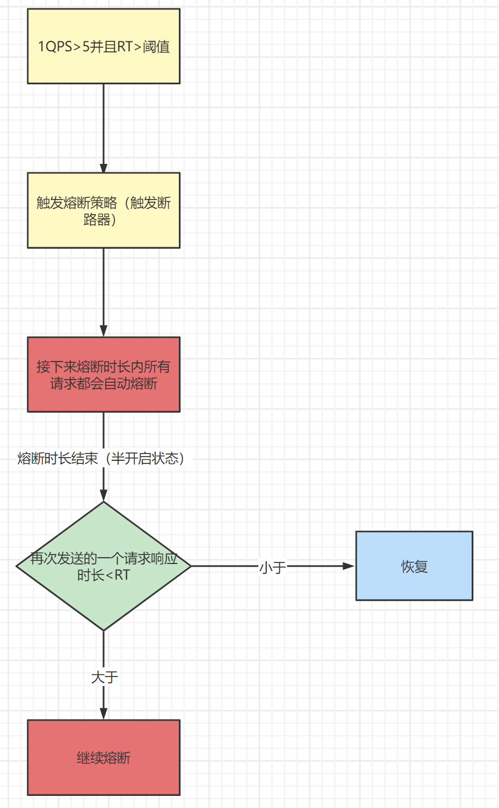
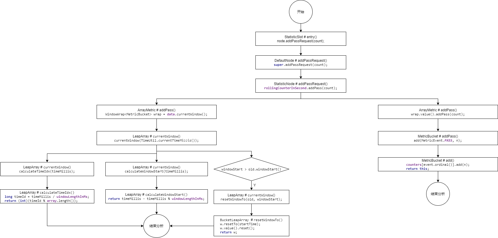
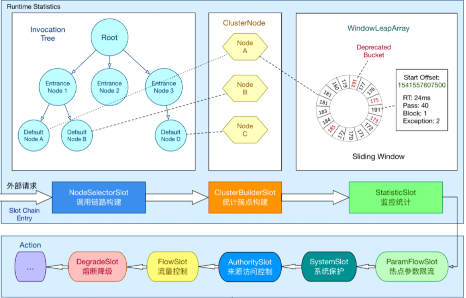

# Sentinel核心源码分析-课程开篇

Sentinel是分布式系统的防御系统。以流量为切入点，通过动态设置的流量控制、服务熔断等手段达到 保护系统的目的，通过服务降级增强服务被拒后用户的体验。


## Sentinel工作原理

**ProcessorSlotChain**

Sentinel 的核心骨架，将不同的 Slot 按照顺序串在一起（责任链模式），从而将不同的功能（限流、降级、系统保护）组合在一起。slot chain 其实可以分为两部分：统计数据构建部分（statistic）和判断部分（rule checking）。核心结构


Sentinel 将 `ProcessorSlot` 作为 SPI 接口进行扩展，使得 Slot Chain 具备了扩展的能力。您可以自行加入自定义的 slot 并编排 slot 间的顺序，从而可以给 Sentinel 添加自定义的功能。


## 官方版本说明

通过官方网站我们可以看到现在应该使用的Sentinel版本，通过官方的要求我们下载对应版本的Sentinel源码：https://github.com/alibaba/spring-cloud-alibaba/wiki/%E7%89%88%E6%9C%AC%E8%AF%B4%E6%98%8E


## Sentinel源码下载

下载地址：https://github.com/alibaba/Sentinel/tree/release-1.8

下载方式，我们可以下载zip包，也可以直接通过idea进行下载和打开


# Sentinel核心概念

Sentinel作为ali开源的一款轻量级流控框架，**主要以流量为切入点，从流量控制、熔断降级、系统负载保护等多个维度来帮助用户保护服务的稳定性**。相比于Hystrix，Sentinel的设计更加简单，在 Sentinel中资源定义和规则配置是分离的，也就是说用户可以先通过Sentinel API给对应的业务逻辑定义资源（埋点），然后在需要的时候再配置规则，通过这种组合方式，极大的增加了Sentinel流控的灵活性。

引入Sentinel带来的性能损耗非常小。只有在业务单机量级超过25W QPS的时候才会有一些显著的影响（5% - 10% 左右），单机QPS不太大的时候损耗几乎可以忽略不计。

Sentinel提供两种埋点方式：

- try-catch 方式（通过 SphU.entry(...)），用户在 catch 块中执行异常处理 

- if-else 方式（通过 SphO.entry(...)），当返回 false 时执行异常处理 

## 工作流程

在此之前，需要先了解一下Sentinel的工作流程


在 Sentinel里面，所有的资源都对应一个资源名称（resourceName），每次资源调用都会创建一个 Entry 对象。Entry 可以通过对主流框架的适配自动创建，也可以通过注解的方式或调用 SphU API 显式创建。Entry 创建的时候，同时也会创建一系列功能插槽（slot chain），这些插槽有不同的职责，例如默认情况下会创建一下7个插槽：

- NodeSelectorSlot 负责收集资源的路径，并将这些资源的调用路径，以树状结构存储起来，用于根据调用路径来限流降级；
- ClusterBuilderSlot 则用于存储资源的统计信息以及调用者信息，例如该资源的 RT, QPS, thread count 等等，这些信息将用作为多维度限流，降级的依据，对应簇点链路；
- StatisticSlot 则用于记录、统计不同纬度的 runtime 指标监控信息；
- FlowSlot 则用于根据预设的限流规则以及前面 slot 统计的状态，来进行流量控制，对应流控规则；
- AuthoritySlot 则根据配置的黑白名单和调用来源信息，来做黑白名单控制，对应授权规则；
- DegradeSlot 则通过统计信息以及预设的规则，来做熔断降级，对应熔断规则；
- SystemSlot 则通过系统的状态，例如 load1 等，来控制总的入口流量，对应系统规则；

重要的概念：

- slot chain：插槽
- Node：根节点
- Context：对资源操作时的上下文环境，每个资源操作(`针对Resource进行的entry/exit`)必须属于一个Context，如果程序中未指定Context，会创建name为"sentinel_default_context"的默认Context。一个Context生命周期内可能有多个资源操作，Context生命周期内的最后一个资源exit时会清理该Context，这也预示这真个Context生命周期的结束。
- Entry：表示一次资源操作，内部会保存当前调用信息。在一个Context生命周期中多次资源操作，也就是对应多个Entry，这些Entry形成parent/child结构保存在Entry实例中


## 官方案例演示

我们先从官方文档提供的演示代码来进行分析


我们来改写一下，如果只有一个资源情况如下

```java
package demo;

import com.alibaba.csp.sentinel.Entry;
import com.alibaba.csp.sentinel.SphU;
import com.alibaba.csp.sentinel.context.ContextUtil;
import com.alibaba.csp.sentinel.slots.block.BlockException;

public class ContextDemo {
    public void ContextUtil(){
        //创建一个来自appA访问的Context
        //Context的名称为entrance1
        ContextUtil.enter("entrance1", "appA");
        // Entry就是一个资源操作对象
        Entry nodeA = null;
        try {
            //获取资源resource的entry
            nodeA = SphU.entry("resource1");//后续会展开这个位置
            // 如果代码走到这个位置，说明当前资源的请求通过了流控，可以继续进行相关业务处理
        } catch (BlockException e) {
            // 如果没有通过走到了这里，就表示请求被限流，这里进行降级操作
            e.printStackTrace();
        }finally {
            if (nodeA != null) {
                nodeA.exit();
            }
        }
        //释放Context
        ContextUtil.exit();
    }
}
```

多个资源的情况

```java
public class ContextDemo {
    public void ContextUtil(){
        //创建一个来自appA访问的Context
        //Context的名称为entrance1
        ContextUtil.enter("entrance1", "appA");
        // Entry就是一个资源操作对象
        Entry nodeA = null;
        Entry nodeB = null;
        try {
            //获取资源resource1的entry
            nodeA = SphU.entry("resource1");
            // 如果代码走到这个位置，说明当前资源的请求通过了流控，可以继续进行相关业务处理

            //获取资源resource2的entry
            nodeB = SphU.entry("resource2");
            // 如果代码走到这个位置，说明当前资源的请求通过了流控，可以继续进行相关业务处理
        } catch (BlockException e) {
            // 如果没有通过走到了这里，就表示请求被限流，这里进行降级操作
            e.printStackTrace();
        }finally {
            if (nodeA != null) {
                nodeA.exit();
            }
            if (nodeB != null) {
                nodeB.exit();
            }
        }
        //释放Context
        ContextUtil.exit();
    }
}
```


# Sentinel源码解析-Node之间的关系

在上节课我们通过官方演示代码，搞清楚一个Context之中，Resource和Entry的关系，一个Context中可以有多个Resource，每个资源都必须都应一个Entry，这节课我们来研究一下Node之间的关系


## Node 关系官方图解

这张图的上班部分其实体现了Node之间的关系，官方提供的图不够明显，我们需要进行细化


要先理解这个官方提供的图，我们需要看一下源码的关系


从这张图片我们能够提取出几个Node：

- Node：接口，Sentinel 里面的各种种类的统计节点
- StatisticNode：统计节点，是Node的实现类，用于完成数据统计
- EntranceNode：DefaultNode的子类，入口节点，一个Context会有一个入口节点，用于统计当前Context的总体流量数据，统计维度为Context
- DefaultNode：默认节点，用于统计一个resource在当前Context中的流量数据，DefaultNode持有指定的Context和指定的Resource的统计数据，意味着DefaultNode是以Context和Resource为维度的统计节点
- ClusterNode：ClusterNode保存的是同一个Resource的相关的统计信息，是以Resource为维度的，不区分Context，这个是和DefaultNode的区别

## Node之间的关系

Node 接口定义了一个 Node 类所需要提供的各项指标数据统计的相关功能，为外部屏蔽滑动窗口的存在。提供记录请求被拒绝、请求被放行、请求处理异常、请求处理成功的方法，以及获取当前时间窗口统计的请求总数、平均耗时等方法。


## 案例代码改进

昨天我们通过官方提供的演示案例写一个演示代码，那么我们为了理解这个Node之间的关系，我们再来增加一些代码，为了理解Node之间的关系

```java
//增加一个Context
package demo;

import com.alibaba.csp.sentinel.Entry;
import com.alibaba.csp.sentinel.Sph;
import com.alibaba.csp.sentinel.SphU;
import com.alibaba.csp.sentinel.context.ContextUtil;
import com.alibaba.csp.sentinel.slots.block.BlockException;

public class ContextDemo {
    public void ContextUtil(){
        // 创建一个来自appA访问的Context
        // Context的名称为entrance1
        ContextUtil.enter("entrance1", "appA");
        // Entry就是一个资源操作对象
        Entry nodeA = null;
        Entry nodeB = null;
        try {
            // 获取资源resource的entry
            nodeA = SphU.entry("resource1");//后续会展开这个位置
            // 如果代码走到这个位置，就说明当前请求通过了流控，可以继续记性相关业务处理
            nodeB = SphU.entry("resource2");
            // 如果代码走到这个位置，就说明当前请求通过了流控，可以继续记性相关业务处理
        } catch (BlockException e) {
            // 如果没有通过走到了这里，就表示请求被限流，这里进行降级操作
            e.printStackTrace();
        } finally {
            if (nodeA != null) {
                nodeA.exit();
            }
            if (nodeB != null) {
                nodeB.exit();
            }
        }
        // 释放Context
        ContextUtil.exit();

       // ---------------------创建另一个来自appA访问的Context------------------------------

        // 创建一个来自appA访问的Context
        // Context的名称为entrance1
        ContextUtil.enter("entrance2", "appA");
        // Entry就是一个资源操作对象
        Entry nodeC = null;
        try {
            nodeB = SphU.entry("resource2");
            // 如果代码走到这个位置，就说明当前请求通过了流控，可以继续记性相关业务处理
            nodeC = SphU.entry("resource3");
        } catch (BlockException e) {
            // 如果没有通过走到了这里，就表示请求被限流，这里进行降级操作
            e.printStackTrace();
        } finally {
            if (nodeB != null) {
                nodeB.exit();
            }
            if (nodeC != null) {
                nodeC.exit();
            }
        }
        // 释放Context
        ContextUtil.exit();
    }
}
```


# Sentinel源码解析-源码入口

##  分析入口

在微服务的使用Sentinel实际工作场景中，我们只需要引入对应依赖：spring-cloud-starter-alibaba-sentinel，就会进行自动装配，所以我们之间看META-INF/spring.factories，然后我们这里从SentinelAutoConfiguration开始看起


为了我们方便跟踪，我们在找到这个类型以后，直接通过源码进行查看，然后在这个类型中我们要找到以下代码，之前我们就说过Sentinel是通过AOP的方式进行切入的，从这里我们看到了Aspect关键字，所以我们就从这里跟进去

```java
@Bean
@ConditionalOnMissingBean
public SentinelResourceAspect sentinelResourceAspect() {
    return new SentinelResourceAspect();
}
```

跟进去以后，我们就会发现这里就是再利用AOP通过@SentinelResource为注解来作为切入点，进行切入

```java
@Aspect //切面
public class SentinelResourceAspect extends AbstractSentinelAspectSupport {

    //指定切入点为SentinelResource注解
    @Pointcut("@annotation(com.alibaba.csp.sentinel.annotation.SentinelResource)")
    public void sentinelResourceAnnotationPointcut() {
    }
...
}
```

再往下跟我们会发现，还有@Around注解进行环绕通知，根据我们之前学习的知道我们从这里可以得知，其实这就是是利用@SentinelResource注解作为切点，然后在通过AOP环绕通知，来进行增强，在执行原方法前，来执行对应操作，当然这里我们可以看出，一旦出现了限流或者限流就会走BlockException。

```java
// 环绕通知
@Around("sentinelResourceAnnotationPointcut()")
public Object invokeResourceWithSentinel(ProceedingJoinPoint pjp) throws Throwable {
    Method originMethod = resolveMethod(pjp);

    SentinelResource annotation = originMethod.getAnnotation(SentinelResource.class);
    if (annotation == null) {
        // Should not go through here.
        throw new IllegalStateException("Wrong state for SentinelResource annotation");
    }
    String resourceName = getResourceName(annotation.value(), originMethod);
    EntryType entryType = annotation.entryType();
    int resourceType = annotation.resourceType();
    Entry entry = null;
    try {
        // 创建资源操作对象
        entry = SphU.entry(resourceName, resourceType, entryType, pjp.getArgs());
        // 调用原方法
        return pjp.proceed();
    } catch (BlockException ex) {
        return handleBlockException(pjp, annotation, ex);
    } catch (Throwable ex) {
        Class<? extends Throwable>[] exceptionsToIgnore = annotation.exceptionsToIgnore();
        // The ignore list will be checked first.
        if (exceptionsToIgnore.length > 0 && exceptionBelongsTo(ex, exceptionsToIgnore)) {
            throw ex;
        }
        if (exceptionBelongsTo(ex, annotation.exceptionsToTrace())) {
            traceException(ex);
            return handleFallback(pjp, annotation, ex);
        }

        // No fallback function can handle the exception, so throw it out.
        throw ex;
    } finally {
        if (entry != null) {
            entry.exit(1, pjp.getArgs());
        }
    }
}
```

在以上的这段代码中还有一个问题，我们在之前就说过，在创建资源操作对象的时候我们需要先创建Context，但是明显这里没有显示创建，但是实际上我们如果看Context概念的话，就会知道，如果程序中未指定Context，会创建name为"sentinel_default_context"的默认Context，然后我们继续往下跟踪。

```java
public static Entry entry(String name, int resourceType, EntryType trafficType, Object[] args)
    throws BlockException {
    //限流方法
    return Env.sph.entryWithType(name, resourceType, trafficType, 1, args);
}
```

进入到entry方法中，这里的entryWithType方法就是我们要看的真正的限流的方法，具体的实现方法在**com.alibaba.csp.sentinel.CtSph.entryWithType**

```java
@Override
public Entry entryWithType(String name, int resourceType, EntryType entryType, int count, Object[] args)
    throws BlockException {
    return entryWithType(name, resourceType, entryType, count, false, args);
}

@Override
public Entry entryWithType(String name, int resourceType, EntryType entryType, int count, boolean prioritized,
                           Object[] args) throws BlockException {
    // 这里将资源的名称和信息封装称为资源对象
    StringResourceWrapper resource = new StringResourceWrapper(name, entryType, resourceType);
    // 返回一个Entry资源操作对象
    // prioritized属性表示优先级，默认值为false，表示当前请求不按照优先级执行，直接执行
    return entryWithPriority(resource, count, prioritized, args);
}
```

我们接下来来具体分析核心方法entryWithPriority

```java
private Entry entryWithPriority(ResourceWrapper resourceWrapper, int count, boolean prioritized, Object... args)
    throws BlockException {
    // 从当前线程中获取Context
    // 一个请求会占用一个线程，并且绑定一个Context
    Context context = ContextUtil.getContext();
    // 一个请求对应一个Context
   	// 如果当前类型为NullContext，表示此时请求已经超出了阈值，无需检测规则
    if (context instanceof NullContext) {
        // The {@link NullContext} indicates that the amount of context has exceeded the threshold,
        // so here init the entry only. No rule checking will be done.
        return new CtEntry(resourceWrapper, null, context);
    }
	
    // 此时如果获取Context为空，就创建默认的sentinel_default_context，并且会放入到当前线程中
    if (context == null) {
        // Using default context.
        context = InternalContextUtil.internalEnter(Constants.CONTEXT_DEFAULT_NAME);
    }

    // 判断全局开关，如果是关闭状态，直接返回无需检测规则
    // Global switch is close, no rule checking will do.
    if (!Constants.ON) {
        return new CtEntry(resourceWrapper, null, context);
    }
    /**
     * 这里是整个架构的核心所在，这里是在构建一个处理链，这个处理链是一个单向链表结构，类似于Filter一样，构建这个链条的
     * 原因是对业务进行解耦，像限流资源保护有很多，比如限流、降级、热点参数、系统降级等等，如果都写在一起就耦合很严重，我们知道oop的
     * 思想就是让每个类确定各自的职责，不要让他做不相干的事情，所以这里将业务进行全面解耦，然后在解耦的同时又通过链式编程将它们串起来
     */
    ProcessorSlot<Object> chain = lookProcessChain(resourceWrapper);

    /*
         * Means amount of resources (slot chain) exceeds {@link Constants.MAX_SLOT_CHAIN_SIZE},
         * so no rule checking will be done.
         */
    if (chain == null) {
        return new CtEntry(resourceWrapper, null, context);
    }

    Entry e = new CtEntry(resourceWrapper, chain, context);
    try {
        // 针对资源操作
        chain.entry(context, resourceWrapper, null, count, prioritized, args);
    } catch (BlockException e1) {
        e.exit(count, args);
        throw e1;
    } catch (Throwable e1) {
        // This should not happen, unless there are errors existing in Sentinel internal.
        RecordLog.info("Sentinel unexpected exception", e1);
    }
    return e;
}
```


# Sentinel源码解析-构建Context

我们继续分析当前这个类型中的InternalContextUtil.internalEnter(Constants.CONTEXT_DEFAULT_NAME);方法

```java
/**
* This class is used for skip context name checking.
此类型是用于跳过Context名称的检测
*/
private final static class InternalContextUtil extends ContextUtil {
    static Context internalEnter(String name) {
        // 从这里继续跟踪
        return trueEnter(name, "");
    }

    static Context internalEnter(String name, String origin) {
        return trueEnter(name, origin);
    }
}
```

首先这里要明确一下，一个Context的组成实际上需要name(名称)和origin(来源)，所以方法上传入这两个参数

```java
protected static Context trueEnter(String name, String origin) {
    // 从当前线程中获取当前context名称
    Context context = contextHolder.get();
    // 如果当前context为空
    if (context == null) {
        // 从缓存中获取，当前缓存中key值为：Context名称，value值为：EntranceNode
        // （因为后续创建的是EntranceNode），需要它的原因是因为构建Context需要EntranceNode
        Map<String, DefaultNode> localCacheNameMap = contextNameNodeMap;
        // 在缓存中获取EntranceNode
        DefaultNode node = localCacheNameMap.get(name);
        // 如果node为空
        if (node == null) {
            // 当前缓存的size>Context的最大数量，返回NULL_Context类型
            if (localCacheNameMap.size() > Constants.MAX_CONTEXT_NAME_SIZE) {
                setNullContext();
                return NULL_CONTEXT;
            } else {
                // 加锁
                LOCK.lock();
                try {
                    node = contextNameNodeMap.get(name);
                    // 这里两次判断是采用了双重检测锁的机制：为了防止并发创建
                    if (node == null) {
                        if (contextNameNodeMap.size() > Constants.MAX_CONTEXT_NAME_SIZE) {
                            setNullContext();
                            return NULL_CONTEXT;
                        } else {
                            // node赋值为EntranceNode
                            node = new EntranceNode(new StringResourceWrapper(name, EntryType.IN), null);
                            // Add entrance node.
                            // 将新建的EntranceNode添加到ROOT中
                            Constants.ROOT.addChild(node);
                            // 将新建的EntranceNode添加到缓存中
                            Map<String, DefaultNode> newMap = new HashMap<>(contextNameNodeMap.size() + 1);
                            newMap.putAll(contextNameNodeMap);
                            newMap.put(name, node);
                            contextNameNodeMap = newMap;
                        }
                    }
                } finally {
                    LOCK.unlock();
                }
            }
        }
        // 将name和node封装成Context
        context = new Context(node, name);
        // 设定来源
        context.setOrigin(origin);
        // 将context写入到当前线程中
        contextHolder.set(context);
    }
	// 返回Context
    return context;
}
```


# Sentinel源码解析-SlotChain入口解析


## 默认Chain解析

​	我们从这里继续分析，这个位置的chain.entry方法，但是此时这个chain是谁？

```java
//CtSph中
try {
    // 针对资源操作
    chain.entry(context, resourceWrapper, null, count, prioritized, args);
} catch (BlockException e1) {
    e.exit(count, args);
    throw e1;
} catch (Throwable e1) {
    // This should not happen, unless there are errors existing in Sentinel internal.
    RecordLog.info("Sentinel unexpected exception", e1);
}
```

那么这个位置开始，我们就要分析一下如下代码

官方定义：Sentinel 将 ProcessorSlot作为 SPI 接口进行扩展（1.7.2 版本以前 SlotChainBuilder作为 SPI），使得 Slot Chain 具备了扩展的能力。您可以自行加入自定义的 slot 并编排 slot 间的顺序，从而可以给 Sentinel 添加自定义的功能。

lookProcessChain()用于构建一个责任链。Sentinel的处理核心都在这个责任链中，链中每一个节点是一个Slot实例，这个链通过BlockException异常来告知调用入口最终的执行情况

```java
// 获取chain链
ProcessorSlot<Object> chain = lookProcessChain(resourceWrapper);
//-------------------具体看lookProcessChain方法---------------------
ProcessorSlot<Object> lookProcessChain(ResourceWrapper resourceWrapper) {
    // 先从chainMap获取，若是存在，则直接返回
    ProcessorSlotChain chain = chainMap.get(resourceWrapper);
    if (chain == null) {
        synchronized (LOCK) {
            chain = chainMap.get(resourceWrapper);
            if (chain == null) {
                // Entry size limit.
                if (chainMap.size() >= Constants.MAX_SLOT_CHAIN_SIZE) {
                    return null;
                }
				// 通过SlotChainProvider创建一个slot链
                chain = SlotChainProvider.newSlotChain();
                Map<ResourceWrapper, ProcessorSlotChain> newMap = new HashMap<ResourceWrapper, ProcessorSlotChain>(
                    chainMap.size() + 1);
                newMap.putAll(chainMap);
                // 添加到Map缓存中
                newMap.put(resourceWrapper, chain);
                chainMap = newMap;
            }
        }
    }
    return chain;
}
```

这个位置我们要具体分析SlotChainProvider这个类型，它的主要作用就是通过已解析的槽链构建器，创建槽链的提供者

从这里我们可以看出SlotChainBuilder及ProcessorSlot 使用Java SPI技术实现可配置化，即在/META-INF/services/接口全限命名 的文件中配置实现类，然后由ServiceLoader实现加载，这种技术在SpringBoot中都有使用。不作讲解。

```java
package com.alibaba.csp.sentinel.slotchain;

import com.alibaba.csp.sentinel.log.RecordLog;
import com.alibaba.csp.sentinel.slots.DefaultSlotChainBuilder;
import com.alibaba.csp.sentinel.spi.SpiLoader;

/**
 * A provider for creating slot chains via resolved slot chain builder SPI.
 *
 * @author Eric Zhao
 * @since 0.2.0
 */
public final class SlotChainProvider {

    private static volatile SlotChainBuilder slotChainBuilder = null;

    /**
     * The load and pick process is not thread-safe, but it's okay since the method should be only invoked
     * via {@code lookProcessChain} in {@link com.alibaba.csp.sentinel.CtSph} under lock.
     *
     * @return new created slot chain
     */
    public static ProcessorSlotChain newSlotChain() {
        if (slotChainBuilder != null) {
            return slotChainBuilder.build();
        }

        // 读取配置文件在/META-INF/services/接口全限定命名的文件中配置实现类.
        slotChainBuilder = SpiLoader.of(SlotChainBuilder.class).loadFirstInstanceOrDefault();

        if (slotChainBuilder == null) {
            // Should not go through here.
            RecordLog.warn("[SlotChainProvider] Wrong state when resolving slot chain builder, using default");
            //使用默认的DefaultSlotChainBuilder来构建ProcessorSlotChain
            slotChainBuilder = new DefaultSlotChainBuilder();
        } else {
            RecordLog.info("[SlotChainProvider] Global slot chain builder resolved: {}",
                slotChainBuilder.getClass().getCanonicalName());
        }
        //使用DefaultSlotChainBuilder构建
        return slotChainBuilder.build();
    }

    private SlotChainProvider() {}
}
```

到这里我们就清楚的知道了其实现在使用的是使用DefaultSlotChainBuilder.build()来创建的，以下是源码

在这个其中，做了几件事：

	1. 创建DefaultProcessorSlotChain
	2. 读取/META-INF/services/中的配置文件
	3. 强制转型为AbstractLinkedProcessorSlot（所有插槽的抽象父类）

```java
@Spi(isDefault = true)
public class DefaultSlotChainBuilder implements SlotChainBuilder {

    @Override
    public ProcessorSlotChain build() {
        // 创建DefaultProcessorSlotChain
        ProcessorSlotChain chain = new DefaultProcessorSlotChain();
		// 读取配置文件在/META-INF/services/接口全限定命名的文件
        List<ProcessorSlot> sortedSlotList = SpiLoader.of(ProcessorSlot.class).loadInstanceListSorted();
        for (ProcessorSlot slot : sortedSlotList) {
            if (!(slot instanceof AbstractLinkedProcessorSlot)) {
                RecordLog.warn("The ProcessorSlot(" + slot.getClass().getCanonicalName() + ") is not an instance of AbstractLinkedProcessorSlot, can't be added into ProcessorSlotChain");
                continue;
            }

            chain.addLast((AbstractLinkedProcessorSlot<?>) slot);
        }

        return chain;
    }
}
```

具体读取的内容如下：

```java
# Sentinel default ProcessorSlots 
com.alibaba.csp.sentinel.slots.nodeselector.NodeSelectorSlot
com.alibaba.csp.sentinel.slots.clusterbuilder.ClusterBuilderSlot
com.alibaba.csp.sentinel.slots.logger.LogSlot
com.alibaba.csp.sentinel.slots.statistic.StatisticSlot
com.alibaba.csp.sentinel.slots.block.authority.AuthoritySlot
com.alibaba.csp.sentinel.slots.system.SystemSlot
com.alibaba.csp.sentinel.slots.block.flow.FlowSlot
com.alibaba.csp.sentinel.slots.block.degrade.DegradeSlot
```

这些就是Sentinel提供的默认功能插槽


## NodeSelectorSlot解析

分析到这里我们就可以回到CtSph中，查看entry方法这个时候我们就知道了实际上调用entry方法的是DefaultProcessorSlotChain

```java
 try {
     // 针对资源操作
     chain.entry(context, resourceWrapper, null, count, prioritized, args);
 } catch (BlockException e1) {
     e.exit(count, args);
     throw e1;
 } catch (Throwable e1) {
     // This should not happen, unless there are errors existing in Sentinel internal.
     RecordLog.info("Sentinel unexpected exception", e1);
 }
```

那我们向下跟踪

```java
@Override
public void entry(Context context, ResourceWrapper resourceWrapper, Object t, int count, boolean prioritized, Object... args)
    throws Throwable {
    // 转到下一个节点
    first.transformEntry(context, resourceWrapper, t, count, prioritized, args);
}
```

这个位置是转入到下一个节点，那么下一个节点明显就是NodeSelectorSlot，那我们来看具体操作

```java
void transformEntry(Context context, ResourceWrapper resourceWrapper, Object o, int count, boolean prioritized, Object... args)
    throws Throwable {
    T t = (T)o;
    //NodeSelectorSlot
    entry(context, resourceWrapper, t, count, prioritized, args);
}
```

NodeSelectorSlot具体内容官网有给出解释：

这个 slot 主要负责收集资源的路径，并将这些资源的调用路径，以树状结构存储起来，用于根据调用路径来限流降级。

DefaultNode用于统计一个resource在当前Context中的流量数据，所以再结合NodeSelectorSlot，最终得出结论：处理不同的Context name，同一个Resource name的情况


```java
@Override
public void entry(Context context, ResourceWrapper resourceWrapper, Object obj, int count, boolean prioritized, Object... args)
    throws Throwable {

    // 从缓存中获取，创建DefaultNode
    DefaultNode node = map.get(context.getName());
    // 双重判断，如果判断为空
    if (node == null) {
        synchronized (this) {
            node = map.get(context.getName());
            if (node == null) {
                // 创建一个DefaultNode并且放入到缓存中
                node = new DefaultNode(resourceWrapper, null);
                HashMap<String, DefaultNode> cacheMap = new HashMap<String, DefaultNode>(map.size());
                cacheMap.putAll(map);
                cacheMap.put(context.getName(), node);
                map = cacheMap;
                // Build invocation tree
                // 将新建的Node添加到调用树中
                ((DefaultNode) context.getLastNode()).addChild(node);
            }

        }
    }
	
    context.setCurNode(node);
    // 触发下一个节点
    fireEntry(context, resourceWrapper, node, count, prioritized, args);
}
```


# Sentinel源码解析-ClusterBuilderSlot解析

上节课我们分析了SlotChain入口和NodeSelectorSlot那么这节课分析ClusterBuilderSlot

## 官方定义

ClusterBuilderSlot：则用于存储资源的统计信息以及调用者信息，例如该资源的 RT, QPS, thread count 等等，这些信息将用作为多维度限流，降级的依据；

那我们来进行分析，首先我们先看上节课分析到的位置

```java
//NodeSelectorSlot.entry()
@Override
public void entry(Context context, ResourceWrapper resourceWrapper, Object obj, int count, boolean prioritized, Object... args)
    throws Throwable {
    // 从缓存中获取，创建DefaultNode
    DefaultNode node = map.get(context.getName());
    // 双重判断，如果判断为空
    if (node == null) {
        synchronized (this) {
            node = map.get(context.getName());
            if (node == null) {
                // 创建一个DefaultNode并且放入到缓存中
                node = new DefaultNode(resourceWrapper, null);
                HashMap<String, DefaultNode> cacheMap = new HashMap<String, DefaultNode>(map.size());
                cacheMap.putAll(map);
                cacheMap.put(context.getName(), node);
                map = cacheMap;
                // Build invocation tree
                // 将新建的Node添加到调用树中
                ((DefaultNode) context.getLastNode()).addChild(node);
            }

        }
    }

    context.setCurNode(node);
    // 触发下一个节点
    fireEntry(context, resourceWrapper, node, count, prioritized, args);
}
```

再触发下一个节点以后，调用的是父级AbstractLinkedProcessorSlot.fireEntry()方法，然后next调用transformEntry

```java
@Override
public void fireEntry(Context context, ResourceWrapper resourceWrapper, Object obj, int count, boolean prioritized, Object... args)
    throws Throwable {
    if (next != null) {
        // 调用下一个节点
        next.transformEntry(context, resourceWrapper, obj, count, prioritized, args);
    }
}
//next就代表循环到下一个节点所以这里调用entry的就是ClusterBuilderSlot
@SuppressWarnings("unchecked")
void transformEntry(Context context, ResourceWrapper resourceWrapper, Object o, int count, boolean prioritized, Object... args)
        throws Throwable {
        T t = (T)o;
        entry(context, resourceWrapper, t, count, prioritized, args);
    }
```

## ClusterBuilderSlot

```java
// ClusterBuilderSlot.entry
@Override
public void entry(Context context, ResourceWrapper resourceWrapper, DefaultNode node, int count,
                  boolean prioritized, Object... args)
    throws Throwable {
    if (clusterNode == null) {
        synchronized (lock) {
            if (clusterNode == null) {
                // Create the cluster node.
                clusterNode = new ClusterNode(resourceWrapper.getName(), resourceWrapper.getResourceType());
                // key为资源 value为ClusterNode
                HashMap<ResourceWrapper, ClusterNode> newMap = new HashMap<>(Math.max(clusterNodeMap.size(), 16));
                newMap.putAll(clusterNodeMap);
                newMap.put(node.getId(), clusterNode);

                clusterNodeMap = newMap;
            }
        }
    }
 	// 添加节点
    node.setClusterNode(clusterNode);

    /*
         * if context origin is set, we should get or create a new {@link Node} of
         * the specific origin.
         */
    // 确认资源的来源
    if (!"".equals(context.getOrigin())) {
        Node originNode = node.getClusterNode().getOrCreateOriginNode(context.getOrigin());
        context.getCurEntry().setOriginNode(originNode);
    }

    fireEntry(context, resourceWrapper, node, count, prioritized, args);
}
```

## 总结：

ClusterNode作用就是与DefaultNode进行关联，即不同的DefaultNode都关联了一个ClusterNode，这样我们在不同上下文中都可以拿到当前资源一个总的流量统计情况。


# Sentinel源码解析-Slot分析后续1

这节课我们继续分析Sentinel调用链路中的Slot，那么我们还是先来分析StatisticSlot：

## StatisticSlot定义：

StatisticSlot 是 Sentinel 最为重要的类之一，用于根据规则判断结果进行相应的统计操作。

entry 的时候：依次执行后面的判断 slot。每个 slot 触发流控的话会抛出异常（BlockException的子类）。若有 BlockException抛出，则记录 block 数据；若无异常抛出则算作可通过（pass），记录 pass 数据。

exit 的时候：若无 error（无论是业务异常还是流控异常），记录 complete（success）以及 RT，线程数-1。

记录数据的维度：线程数+1、记录当前 DefaultNode 数据、记录对应的 originNode 数据（若存在 origin）、累计 IN 统计数据（若流量类型为 IN）。

## 分析源码核心方法

首先我们从ClusterNodeSlot中的entry方法中找到调用下一节点方法，然后向下跟踪，道理和之前的都一样，调用的是父级方法

```java
fireEntry(context, resourceWrapper, node, count, prioritized, args);
//-------------------父级方法-----------------------------
@Override
public void fireEntry(Context context, ResourceWrapper resourceWrapper, Object obj, int count, boolean prioritized, Object... args)
    throws Throwable {
    if (next != null) {
        next.transformEntry(context, resourceWrapper, obj, count, prioritized, args);
    }
}    
```

找到transformEntry方法，然后此时的下一个节点必然是StatisticSlot

```java
@SuppressWarnings("unchecked")
void transformEntry(Context context, ResourceWrapper resourceWrapper, Object o, int count, boolean prioritized, Object... args)
    throws Throwable {
    T t = (T)o;
    //StatisticSlot
    entry(context, resourceWrapper, t, count, prioritized, args);
}
```

然后我们来看StatisticSlot的核心方法，这里的核心思想就是：封装了基础的流量统计和获取方法

```java
@Override
public void entry(Context context, ResourceWrapper resourceWrapper, DefaultNode node, int count,
                  boolean prioritized, Object... args) throws Throwable {
    try {
        // Do some checking.
        // 此位置会调用SlotChain中后续的所有Slot，完成所有规则检测。
        fireEntry(context, resourceWrapper, node, count, prioritized, args);

        // Request passed, add thread count and pass count.
        // 代码运行到这个位置，就证明之前的所有Slot检测都通过了，此时就可以统计请求的相应数据了。
        // 增加线程数（+1）
        node.increaseThreadNum();
        // 增加通过请求的数量(这里涉及到滑动窗口算法)
        node.addPassRequest(count);
		// .....以下全部是流量统计的方法
}
```

看到这里以后，我们对StatisticSlot作用已经比较了解了，那么现在我们主要要分析这个位置，也就是说向下分析一下的节点

```java
fireEntry(context, resourceWrapper, node, count, prioritized, args);
```

这里向下的节点调用方式和之前的都一样，所以剩下的节点非别为：


但是其实这里的ParamFlowSlot包括SystemSlot和AuthoritySlot我们在操作的时候其实就已经知道了它们就是根据不同维度进行统计和检测，那么这三个我们就不再详细分析，这条链路中我们要主要分析流控和熔断：FlowSlot、DegradeSlot

## FlowSlot定义：

这个slot 主要根据预设的资源的统计信息，按照固定的次序，依次生效。如果一个资源对应两条或者多条流控规则，则会根据如下次序依次检验，直到全部通过或者有一个规则生效为止:

- 指定应用生效的规则，即针对调用方限流的；
- 调用方为 other 的规则；
- 调用方为 default 的规则。

## 分析核心方法

进入到核心方法的方式和之前的都一样，所以我们直接来看

```java
@Override
public void entry(Context context, ResourceWrapper resourceWrapper, DefaultNode node, int count,
                  boolean prioritized, Object... args) throws Throwable {
    //检测并且应用流量规则
    checkFlow(resourceWrapper, context, node, count, prioritized);
    //触发下一个Slot
    fireEntry(context, resourceWrapper, node, count, prioritized, args);
}
```

那我们先来分析checkFlow方法

```java
void checkFlow(ResourceWrapper resource, Context context, DefaultNode node, int count, boolean prioritized)
    throws BlockException {
    // 在这里继续跟踪
    checker.checkFlow(ruleProvider, resource, context, node, count, prioritized);
}
//---------------checkFlow具体实现----------------------
public void checkFlow(Function<String, Collection<FlowRule>> ruleProvider, ResourceWrapper resource,
                      Context context, DefaultNode node, int count, boolean prioritized) throws BlockException {
    // 判断规则和资源不能为空
    if (ruleProvider == null || resource == null) {
        return;
    }
    // 获取到指定资源的所有流控规则
    Collection<FlowRule> rules = ruleProvider.apply(resource.getName());
    // 逐个应用流控规则。若无法通过则抛出异常，后续规则不再应用
    if (rules != null) {
        for (FlowRule rule : rules) {
            if (!canPassCheck(rule, context, node, count, prioritized)) {
                // FlowException继承BlockException
                throw new FlowException(rule.getLimitApp(), rule);
            }
        }
    }
}
```

这里我们需要注意一下FlowRule（流控规则），它继承自AbstractRule，那我们来看一下AbstractRule其中的两个类型，分别是资源名称和资源的来源

```java
private String resource;
private String limitApp;
```

那么通过这里我们就可以得知，流控的规则设置其实就是通过这个FlowRule来完成的，同样它的数据来源，就是我们使用的Sentinel-dashboard，当然也可以通过代码来进行设置

```java
public class FlowRule extends AbstractRule {

    public FlowRule() {
        super();
        // 来源默认Default
        setLimitApp(RuleConstant.LIMIT_APP_DEFAULT);
    }

    public FlowRule(String resourceName) {
        super();
        // 资源名称
        setResource(resourceName);
        setLimitApp(RuleConstant.LIMIT_APP_DEFAULT);
    }

    /**
     * The threshold type of flow control (0: thread count, 1: QPS).
     */
    // 设置阈值类型0是线程1为QPS
    private int grade = RuleConstant.FLOW_GRADE_QPS;

    /**
     * Flow control threshold count.
     */
    // 单机阈值
    private double count;

    /**
     * Flow control strategy based on invocation chain.
     * 直接流控
     * {@link RuleConstant#STRATEGY_DIRECT} for direct flow control (by origin);
     * 关联流控
     * {@link RuleConstant#STRATEGY_RELATE} for relevant flow control (with relevant resource);
     * 链路流控
     * {@link RuleConstant#STRATEGY_CHAIN} for chain flow control (by entrance resource).
     */
    // 流控模式
    private int strategy = RuleConstant.STRATEGY_DIRECT;

    /**
     * Reference resource in flow control with relevant resource or context.
     */
    // 关联流控模式，关联的资源设置
    private String refResource;

    /**
     * Rate limiter control behavior.
     * 0. default(reject directly), 1. warm up, 2. rate limiter, 3. warm up + rate limiter
     */
    // 流控效果 0快速失败 1预热（令牌桶算法） 2排队等待（漏斗算法） 3预热+排队等待（目前控制台没有）
    private int controlBehavior = RuleConstant.CONTROL_BEHAVIOR_DEFAULT;

    // warp up预热时长
    private int warmUpPeriodSec = 10;

    /**
     * Max queueing time in rate limiter behavior.
     */
    // 排队等待的超时时间
    private int maxQueueingTimeMs = 500;

    // 是否为集群模式
    private boolean clusterMode;
    /**
     * Flow rule config for cluster mode.
     */
    // 集群模式配置
    private ClusterFlowConfig clusterConfig;

    /**
     * The traffic shaping (throttling) controller.
     */
    private TrafficShapingController controller;

   // ....省略以下方法
}

```

这里还涉及到两个算法：令牌桶算法和漏斗算法

- 令牌桶算法：令牌桶算法的原理是系统会以一个恒定的速度往桶里放入令牌，而如果请求需要被处理，则需要先从桶里获取一个令牌，当桶里没有令牌可取时，则拒绝服务。
- 漏斗算法：漏桶算法思路很简单，请求先进入到漏桶里，漏桶以固定的速度出水，也就是处理请求，当水加的过快，则会直接溢出，也就是拒绝请求，可以看出漏桶算法能强行限制数据的传输速率。


# Sentinel源码解析-Slot分析后续2

这节课我们继续分析Sentinel调用链路中的Slot，那么我们还是继续分析FlowSlot

## FlowSlot获取全部流控规则

上节课我们分析到这个位置，这节课我们主要研究一下如何获取全部的流控规则

```java
// 获取到指定资源的所有流控规则
Collection<FlowRule> rules = ruleProvider.apply(resource.getName());
// 逐个应用流控规则。若无法通过则抛出异常，后续规则不再应用
if (rules != null) {
    for (FlowRule rule : rules) {
        if (!canPassCheck(rule, context, node, count, prioritized)) {
            // FlowException继承BlockException
            throw new FlowException(rule.getLimitApp(), rule);
        }
    }
}
-------------------------------------------------------------------------------------------
// 这里调用的apply方法就是FlowSlot中的对应方法
private final Function<String, Collection<FlowRule>> ruleProvider = new Function<String, Collection<FlowRule>>() {
    @Override
    public Collection<FlowRule> apply(String resource) {
        // Flow rule map should not be null.
        // 获取所有资源和对应的流控规则 key为资源名称，value为该资源对应的所有流控规则
        Map<String, List<FlowRule>> flowRules = FlowRuleManager.getFlowRuleMap();
        // 获取指定资源的流控规则
        return flowRules.get(resource);
    }
};
```

那我们来看apply方法，要注意的是其中的FlowRuleManager其实如果我们通过代码的方式来设置流控就会使用到它，因为它提供了对应的方法FlowRuleManager.loadRules()

```java
/**
* Load {@link FlowRule}s, former rules will be replaced.
* 添加新的流控规则
* @param rules new rules to load.
*/
public static void loadRules(List<FlowRule> rules) {
    currentProperty.updateValue(rules);
}
```

但是现在这个位置源码用的FlowRuleManager.getFlowRuleMap()，其实通过这个方法我们就可以得知，FlowRuleManager的作用就是设置对应资源的流控规则，资源对应的流控规则(list集合)组成一个Map

```java
// 获取所有资源和对应的流控规则 key为资源名称，value为该资源对应的所有流控规则
Map<String, List<FlowRule>> flowRules = FlowRuleManager.getFlowRuleMap();
```

那我们现在来看FlowRuleChecker.checkFlow()方法如何应用规则，这里我们要注意遍历

```java
public void checkFlow(Function<String, Collection<FlowRule>> ruleProvider, ResourceWrapper resource,
                      Context context, DefaultNode node, int count, boolean prioritized) throws BlockException {
    // 判断规则和资源不能为空
    if (ruleProvider == null || resource == null) {
        return;
    }
    // 获取到指定资源的所有流控规则
    Collection<FlowRule> rules = ruleProvider.apply(resource.getName());
    // 逐个应用流控规则。若无法通过则抛出异常，后续规则不再应用
    if (rules != null) {
        for (FlowRule rule : rules) {
            // 遍历规则，应用规则，判断是否能够通过规则
            if (!canPassCheck(rule, context, node, count, prioritized)) {
                // FlowException继承BlockException
                throw new FlowException(rule.getLimitApp(), rule);
            }
        }
    }
}
```

那我们需要跟进去看一下canPassCheck方法

```java
public boolean canPassCheck(/*@NonNull*/ FlowRule rule, Context context, DefaultNode node, int acquireCount,boolean prioritized) {
    // 从规则中获取要限定的来源
    String limitApp = rule.getLimitApp();
    // 如果来源为空，则请求直接通过
    if (limitApp == null) {
        return true;
    }

    // 处理集群流控
    if (rule.isClusterMode()) {
        return passClusterCheck(rule, context, node, acquireCount, prioritized);
    }

    // 处理单机流控
    return passLocalCheck(rule, context, node, acquireCount, prioritized);
}
```

那么这里我们要关注的是处理单机流控的方法passLocalCheck

```java
private static boolean passLocalCheck(FlowRule rule, Context context, DefaultNode node, int acquireCount,
                                      boolean prioritized) {
    // 根据请求选择节点
    Node selectedNode = selectNodeByRequesterAndStrategy(rule, context, node);
    if (selectedNode == null) {
        return true;
    }

    // 根据配置FlowRule配置的流控效果(流控效果:直接拒绝、排队等待、预热)，选择不同的Controller，判断是否通过
    return rule.getRater().canPass(selectedNode, acquireCount, prioritized);
}
```

在这里我们来看一下根据请求来选择节点

```java
static Node selectNodeByRequesterAndStrategy(/*@NonNull*/ FlowRule rule, Context context, DefaultNode node) {
    // The limit app should not be empty.
    // 获取限定来源(调用方)、流控模式（直接）、获取context中的调用发（从当前上下文环境中获取）
    String limitApp = rule.getLimitApp();
    int strategy = rule.getStrategy();
    String origin = context.getOrigin();

    // 判断来源如果不是Default（默认）和Other（其他）
    if (limitApp.equals(origin) && filterOrigin(origin)) {
        if (strategy == RuleConstant.STRATEGY_DIRECT) {
            // Matches limit origin, return origin statistic node.
            return context.getOriginNode();
        }

        return selectReferenceNode(rule, context, node);
        //如果是默认来源
    } else if (RuleConstant.LIMIT_APP_DEFAULT.equals(limitApp)) {
        // 是否是直接流控模式
        if (strategy == RuleConstant.STRATEGY_DIRECT) {
            // Return the cluster node.
            // 返回统计数据
            return node.getClusterNode();
        }

        return selectReferenceNode(rule, context, node);
        // 其他来源other
    } else if (RuleConstant.LIMIT_APP_OTHER.equals(limitApp)
               && FlowRuleManager.isOtherOrigin(origin, rule.getResource())) {
        if (strategy == RuleConstant.STRATEGY_DIRECT) {
            return context.getOriginNode();
        }

        return selectReferenceNode(rule, context, node);
    }

    return null;
}
```

那到这为止，我们就知道如何获取流控规则和针对不同来源的不同操作，那么现在还有一个问题就是，就是这个位置的解析

```java
// 根据配置FlowRule配置的流控效果(流控效果:直接拒绝、排队等待、预热)，选择不同的Controller，判断是否通过
return rule.getRater().canPass(selectedNode, acquireCount, prioritized);
```

## 流控效果对应的Controller

其实这个位置的rule.getRater()的返回值类型为TrafficShapingController，而这里的类结构为：

```java
TrafficShapingController getRater() {
    return controller;
}
```


其实从这里我们就能看出针对不同的流控模式，针对不同的控制器来进行处理，那么我们这里演示一个DefaultController


那我们现在来看一下具体DefaultController的操作，在DefaultController中，首先获取当前的线程数或者QPS数，如果当前的线程数或者QPS+申请的数量>配置的总数，则不通过，如果当前线程数或者QPS+申请的数量<=配置的总数，则直接通过

```java
public class DefaultController implements TrafficShapingController {

    private static final int DEFAULT_AVG_USED_TOKENS = 0;

    private double count;
    private int grade;

    public DefaultController(double count, int grade) {
        this.count = count;
        this.grade = grade;
    }

    @Override
    public boolean canPass(Node node, int acquireCount) {
        return canPass(node, acquireCount, false);
    }

    @Override
    public boolean canPass(Node node, int acquireCount, boolean prioritized) {
        //获取当前node节点的线程数或者请求通过的qps总数
        int curCount = avgUsedTokens(node);
        //当前请求数（请求的令牌）+申请总数是否（已经消耗的令牌）>该资源配置的总数（阈值）
        if (curCount + acquireCount > count) {
            if (prioritized && grade == RuleConstant.FLOW_GRADE_QPS) {
                long currentTime;
                long waitInMs;
                currentTime = TimeUtil.currentTimeMillis();
                waitInMs = node.tryOccupyNext(currentTime, acquireCount, count);
                if (waitInMs < OccupyTimeoutProperty.getOccupyTimeout()) {
                    node.addWaitingRequest(currentTime + waitInMs, acquireCount);
                    node.addOccupiedPass(acquireCount);
                    sleep(waitInMs);

                    // PriorityWaitException indicates that the request will pass after waiting for {@link @waitInMs}.
                    throw new PriorityWaitException(waitInMs);
                }
            }
            return false;
        }
        return true;
    }

    private int avgUsedTokens(Node node) {
        if (node == null) {
            return DEFAULT_AVG_USED_TOKENS;
        }
        return grade == RuleConstant.FLOW_GRADE_THREAD ? node.curThreadNum() : (int)(node.passQps());
    }

    private void sleep(long timeMillis) {
        try {
            Thread.sleep(timeMillis);
        } catch (InterruptedException e) {
            // Ignore.
        }
    }
}
```

## 流程总结


# Sentinel源码解析-熔断降级DegradeSlot解析

上节课我们分析完了限流FlowSlot，那么我们继续想下一个链路中的元素来看，下一个就是熔断降级的Slot，那我们直接来看核心方法

```java
//DegradeSlot.entry
@Override
public void entry(Context context, ResourceWrapper resourceWrapper, DefaultNode node, int count,
                  boolean prioritized, Object... args) throws Throwable {
    // 熔断降级检测
    performChecking(context, resourceWrapper);
    // 触发下一个节点
    fireEntry(context, resourceWrapper, node, count, prioritized, args);
}
```

那我们先来跟踪熔断降级检测的方法，在这里我们可以看见，这里其实就是对熔断器的状态进行判断

```java
void performChecking(Context context, ResourceWrapper r) throws BlockException {
    // 获取所有资源的熔断器
    List<CircuitBreaker> circuitBreakers = DegradeRuleManager.getCircuitBreakers(r.getName());
    // 判断是否获取到熔断器，如果为空直接结束
    if (circuitBreakers == null || circuitBreakers.isEmpty()) {
        return;
    }
    for (CircuitBreaker cb : circuitBreakers) {
        // 判断所有熔断器的状态，如果是开启状态直接抛出异常
        if (!cb.tryPass(context)) {
            // 此异常继承于BlockException
            throw new DegradeException(cb.getRule().getLimitApp(), cb.getRule());
        }
    }
}
```

而真正判断是否需要开启熔断器是在exit方法中进行的，这个方法是在业务方法执行以后调用了，熔断器需要手机业务异常或者业务的执行时间来判断是开启熔断

```java
@Override
public void exit(Context context, ResourceWrapper r, int count, Object... args) {
    // 如果当前其他的Slot已经有了BlockException，就直接跳过
    Entry curEntry = context.getCurEntry();
    if (curEntry.getBlockError() != null) {
        fireExit(context, r, count, args);
        return;
    }
    // 通过资源名称获取熔断器
    List<CircuitBreaker> circuitBreakers = DegradeRuleManager.getCircuitBreakers(r.getName());
    if (circuitBreakers == null || circuitBreakers.isEmpty()) {
        fireExit(context, r, count, args);
        return;
    }

    if (curEntry.getBlockError() == null) {
        // passed request
        // 调用CircuitBreaker的onRequestComplete()方法
        for (CircuitBreaker circuitBreaker : circuitBreakers) {
            circuitBreaker.onRequestComplete(context);
        }
    }

    fireExit(context, r, count, args);
}
```

在这个代码中，有一个比较关键的地方就是CircuitBreaker（熔断器），那我们来分析一下：

## CircuitBreaker熔断器

首先我们要知道其实CircuitBreaker是一个接口

```java
/**
 * 熔断器中将三种熔断策略封装（慢调用比例/异常比例/异常数）为两种熔断器：
 * 响应时间熔断器、异常熔断器
 */
public interface CircuitBreaker {

    /**
     * Get the associated circuit breaking rule.
     *
     * @return associated circuit breaking rule
     * 获取熔断规则
     */
    DegradeRule getRule();

    /**
     * Acquires permission of an invocation only if it is available at the time of invoking.
     *
     * @param context context of current invocation
     * @return {@code true} if permission was acquired and {@code false} otherwise
     * 判断是否需要降级 返回值为false开启降级
     */
    boolean tryPass(Context context);

    /**
     * Get current state of the circuit breaker.
     *
     * @return current state of the circuit breaker
     * 当前熔断器状态
     */
    State currentState();

    /**
     * <p>Record a completed request with the context and handle state transformation of the circuit breaker.</p>
     * <p>Called when a <strong>passed</strong> invocation finished.</p>
     *
     * @param context context of current invocation
     * 回调方法 当请求通过后触发
     */
    void onRequestComplete(Context context);

    /**
     * Circuit breaker state.
     * 三种熔断器状态：
     * OPEN开启
     * HALF_OPEN半开启
     * CLOSED关闭
     */
    enum State {
        /**
         * In {@code OPEN} state, all requests will be rejected until the next recovery time point.
         */
        OPEN,
        /**
         * In {@code HALF_OPEN} state, the circuit breaker will allow a "probe" invocation.
         * If the invocation is abnormal according to the strategy (e.g. it's slow), the circuit breaker
         * will re-transform to the {@code OPEN} state and wait for the next recovery time point;
         * otherwise the resource will be regarded as "recovered" and the circuit breaker
         * will cease cutting off requests and transform to {@code CLOSED} state.
         */
        HALF_OPEN,
        /**
         * In {@code CLOSED} state, all requests are permitted. When current metric value exceeds the threshold,
         * the circuit breaker will transform to {@code OPEN} state.
         */
        CLOSED
    }
}

```

以上代码中其中三种熔断状态对应的原理如下（这个原理在基础应用讲过）



## 熔断策略

对应的实现类有两个ExceptionCircuitBreaker（异常熔断器）、ResponseTimeCircuitBreaker（响应时间熔断器），这个我们可以从类图看到


那我们这里来看看ExceptionCircuitBreaker(异常熔断器)，对应的策略是


我们来看对应回调方法ExceptionCircuitBreaker.onRequestComplete

```java
@Override
public void onRequestComplete(Context context) {
    Entry entry = context.getCurEntry();
    if (entry == null) {
        return;
    }
    Throwable error = entry.getError();
    // 异常事件窗口计数器
    SimpleErrorCounter counter = stat.currentWindow().value();
    // 如果有异常，异常数+1
    if (error != null) {
        counter.getErrorCount().add(1);
    }
    // 总异常数+1
    counter.getTotalCount().add(1);

    handleStateChangeWhenThresholdExceeded(error);
}

private void handleStateChangeWhenThresholdExceeded(Throwable error) {
    // 如果熔断器已经开启直接返回
    if (currentState.get() == State.OPEN) {
        return;
    }

    // 进入办开启状态
    if (currentState.get() == State.HALF_OPEN) {
        // In detecting request
        if (error == null) {
            // 本次请求没有出现异常，关闭熔断器
            fromHalfOpenToClose();
        } else {
            // 本次请求出现异常，打开熔断
            fromHalfOpenToOpen(1.0d);
        }
        return;
    }

    List<SimpleErrorCounter> counters = stat.values();
    long errCount = 0; //异常数量
    long totalCount = 0; //总异常数
    for (SimpleErrorCounter counter : counters) {
        errCount += counter.errorCount.sum();
        totalCount += counter.totalCount.sum();
    }
    // 请求数量<最小的请求数量时不开启熔断
    if (totalCount < minRequestAmount) {
        return;
    }
    double curCount = errCount;
    // 熔断策略为慢调用比例
    if (strategy == DEGRADE_GRADE_EXCEPTION_RATIO) {
        // Use errorRatio
        // 计算百分比
        curCount = errCount * 1.0d / totalCount;
    }
    // 错误率或者错误数大于阈值时开启熔断
    if (curCount > threshold) {
        transformToOpen(curCount);
    }
}
```


# Sentinel源码分析-滑动时间窗口算法原理

在之前的学习中，我们已经学习完成了Sentinel源码的Node关系、责任链调用，那么这节课我们就要学习Sentinel核心源码中的一个非常重要的算法“滑动时间窗口算法”


## 时间窗算法

那么在了解滑动时间窗算法之前，我们先要来了解时间窗算法，也可以称之为：固定时间窗算法

概念：固定时间窗口计数器算法思想：在固定的时间窗口内，可以允许固定数量的请求进入。超过数量就拒绝或者排队，等下一个时间段进入。

那我们来看图分析：


具体分析一下：

1. 将当前的时间分为10t大小的几个时间窗
2. 规则是阈值为100个请求数，每个时间窗里面的请求数量不能超过阈值100
3. 10t到16t进入请求10个，16t到20t进入请求50个，总数60个请求，没有超过阈值100
4. 20t到26t进入请求60个，26t到30t进入请求20个，总数80个请求，没有超过阈值100
5. 30t到40t之间进入请求120个，超过阈值20个，所以20个请求无法进入

存在问题：16t到26t之间也是10t大小的一个时间窗，但是请求总数为110，超过阈值，这种固定时间窗无法处理这部分超出的请求，解决办法就是使用滑动时间窗。

## 滑动时间窗算法

使用滑动时间窗的原因，就在于虽然以上提到超出阈值的部分分别在两个时间窗中，但是实际上我们要清楚，我们系统限流的目的是要在任意时间都要能应对突然的流量暴增，如果使用以上的算法，就会造成在16t和26t之间的请求无法限流，从而严重会导致服务雪崩。

要解决的话，我们就需要使用滑动时间窗算法，具体原理如下：

滑动时间窗限流算法解决了固定时间窗限流算法的问题。其没有划分固定的时间窗起点与终点，而是将每一次请求的到来时间点作为统计时间窗的终点，起点则是终点向前推时间窗长度的时间点。这种时间窗称为“滑动时间窗”

看图分析：

此图中我们可以分析中，实际上当前的时间窗不再是固定的，而是可以从时间的起始位置一直向右滑动


这样的话就可以解决固定时间窗带来的问题，如图所示：

其原理就是：

1. 当前时间窗口为滑动窗口，可以从左向右按照时间顺序进行滑动，并且大小为10t，同时此时的阈值为100
2. 红色线的位置进入一个请求，此时想要判断这个请求是否能够正常通过，就要看当前滑动窗口中的请求数量是否达到阈值，如果当前没有达到阈值100，就可以正常通过，但是如果一旦超过阈值，就会被进行限流。

没有超过阈值：


超过阈值：


但是此时滑动时间窗还是有问题的，问题就是会出现大量的重复统计，造成系统效率下降，如下图所示：

在此图中我们就可以看出，这个蓝色的区域就是重复统计的区域，也就是说每一次移动时间窗口，都需要重新统计重复区域的请求数量，从而导致浪费大量的系统资源。


 ## 滑动时间窗口算法-改进

想要解决以上的问题，我们就需要更加细粒度话的计算，增加多个子时间窗口：样本窗口

概念：

1. 样本窗口的长度必须小于滑动窗口长度，如果等于滑动窗口长度就会变成固定时间窗口
2. 一般滑动窗口长度是样本窗口的整数倍，比如：4*样本窗口=1个滑动窗口
3. 每个样本窗口在到达终点时间时，会统计本样本窗口中的流量数据并且记录下来。
4. 当一个请求达到时，会统计当前请求时间点所在的样本窗口中的流量数据，然后在获取当前请求时间的样本窗口以外的同一个滑动窗口中的样本窗口的统计数据，进行求和，如果没有超出阈值，则通过，否则就会被限流。

原理图：


下一个进入请求的时间点

此时这个请求将不会被限流，因为本次请求的时间的对应的样本窗口只有5个请求加上之前重复的样本窗口统计的流量值，没有超过阈值100，所以本次请求会通过。


# Sentinel源码分析-Sentinel滑动时间窗口算法源码解析

上节课我们分析了Sentinel的滑动时间窗口算法原理，那么这节课我们来研究一下源码中的具体实现

## 整体流程图



## 源码分析

那我们就按照这个流程图来从头分析

首先看StatisticSlot.entry方法中node.addPassRequest(count)方法，这里我之前就提到过用到了滑动窗口算法，那我们来具体分析

```java
// 增加通过请求的数量(这里涉及到滑动窗口算法)
node.addPassRequest(count);
```

进入方法DefaultNode.addPassRequest

```java
@Override
public void addPassRequest(int count) {
    super.addPassRequest(count);
    this.clusterNode.addPassRequest(count);
}
```

继续向下跟踪

```java
@Override
public void addPassRequest(int count) {
    // 为滑动计数器增加本次的访问数据
    rollingCounterInSecond.addPass(count);
    rollingCounterInMinute.addPass(count);
}
```

最后进入ArrayMetric.addPass，这是一个使用数组保存数据的计量器类

```java
@Override
public void addPass(int count) {
    // 获取当前时间点所在的样本窗口
    WindowWrap<MetricBucket> wrap = data.currentWindow();
    // 将当前请求的计数量添加到当前样本窗口的统计数据中
    wrap.value().addPass(count);
}
```

先来跟踪data.currentWindow();

```java
public WindowWrap<T> currentWindow() {
    // 获取当前时间所在的样本窗口
    return currentWindow(TimeUtil.currentTimeMillis());
}
```

这里就会进入LeapArray（环形数组）中的currentWindow方法中,这个环形数组，其实就是Sentinel官方提供的原理图中的环形数组WindowLeapArray



```java
// 环形数组
public abstract class LeapArray<T> {
    // 样本窗口长度
    protected int windowLengthInMs;
    // 一个时间窗中包含的时间窗数量
    protected int sampleCount;
    // 时间窗长度
    protected int intervalInMs;
    private double intervalInSecond;
 
    // 这个一个数组，元素为WindowWrap样本窗口
    // 注意，这里的泛型 T 实际为 MetricBucket 类型
    protected final AtomicReferenceArray<WindowWrap<T>> array;
 ......   
}  
```

这里要注意这个数组，这个数组里面所存放的类型就是WindowWrap窗口类型，泛型T是MetricBucket这里我们来看一下这个类型

```java
public WindowWrap(long windowLengthInMs, long windowStart, T value) {
    //样本窗口长度
    this.windowLengthInMs = windowLengthInMs;
    //样本窗口的起始时间戳
    this.windowStart = windowStart;
    //当前样本窗口的统计数据 其类型为MetricBucket
    this.value = value;
}
```

```java
//..LeapArray
public WindowWrap<T> currentWindow() {
    // 获取当前时间所在的样本窗口
    return currentWindow(TimeUtil.currentTimeMillis());
}
//------------------------------------------------------------
public WindowWrap<T> currentWindow(long timeMillis) {
        if (timeMillis < 0) {
            return null;
        }
        // 计算当前时间所在的样本窗口id，即在计算数组LeapArray中的索引
        int idx = calculateTimeIdx(timeMillis);
        // Calculate current bucket start time.
     	// 计算当前样本窗口的开始时间点
        long windowStart = calculateWindowStart(timeMillis);
     .....
 }
```

在这里我们先分析calculateTimeIdx方法

```java
private int calculateTimeIdx(/*@Valid*/ long timeMillis) {
    // 计算当前时间在那个样本窗口（样本窗口下标），当前时间/样本窗口长度
    long timeId = timeMillis / windowLengthInMs;
    // Calculate current index so we can map the timestamp to the leap array.
    // 计算具体索引，这个array就是装样本窗口的数组
    return (int)(timeId % array.length());
}
```

timeId（样本窗口下标）原理如下：


具体索引原理：


这里分析完成我们接着分析这里，计算当前样本窗口的起点

```java
// 计算当前样本窗口的开始时间点
long windowStart = calculateWindowStart(timeMillis);
//------------------------------
protected long calculateWindowStart(/*@Valid*/ long timeMillis) {
    // 计算当前样本窗口的起点 当前时间点-（当前时间点%样本窗口长度）
    return timeMillis - timeMillis % windowLengthInMs;
}
```

原理如下：


这里分析完成之后我们继续向下分析

```java
while (true) {
    // 获取到当前时间所在的样本窗口
    WindowWrap<T> old = array.get(idx);
    // 如果获取不到，表示没有创建
    if (old == null) {
        /*
                 *     B0       B1      B2    NULL      B4
                 * ||_______|_______|_______|_______|_______||___
                 * 200     400     600     800     1000    1200  timestamp
                 *                             ^
                 *                          time=888
                 *            bucket is empty, so create new and update
                 *
                 * If the old bucket is absent, then we create a new bucket at {@code windowStart},
                 * then try to update circular array via a CAS operation. Only one thread can
                 * succeed to update, while other threads yield its time slice.
                 */
        // 创建新的时间窗口
        WindowWrap<T> window = new WindowWrap<T>(windowLengthInMs, windowStart, newEmptyBucket(timeMillis));
        // 通过CAS方式将新建窗口放入Array
        if (array.compareAndSet(idx, null, window)) {
            // Successfully updated, return the created bucket.
            return window;
        } else {
            // Contention failed, the thread will yield its time slice to wait for bucket available.
            Thread.yield();
        }
        // 若当前样本窗口的起始时间点与计算出的样本窗口起始点相同，则说明两个是同一个样本窗口
    } else if (windowStart == old.windowStart()) {
        /*
                 *     B0       B1      B2     B3      B4
                 * ||_______|_______|_______|_______|_______||___
                 * 200     400     600     800     1000    1200  timestamp
                 *                             ^
                 *                          time=888
                 *            startTime of Bucket 3: 800, so it's up-to-date
                 *
                 * If current {@code windowStart} is equal to the start timestamp of old bucket,
                 * that means the time is within the bucket, so directly return the bucket.
                 */
        return old;
        // 若当前样本窗口的起始时间点 大于 计算出的样本窗口起始时间点，说明计算出的样本窗口已经过时了，
        // 需要将原来的样本窗口替换
    } else if (windowStart > old.windowStart()) {
        /*
                 *   (old)
                 *             B0       B1      B2    NULL      B4
                 * |_______||_______|_______|_______|_______|_______||___
                 * ...    1200     1400    1600    1800    2000    2200  timestamp
                 *                              ^
                 *                           time=1676
                 *          startTime of Bucket 2: 400, deprecated, should be reset
                 *
                 * If the start timestamp of old bucket is behind provided time, that means
                 * the bucket is deprecated. We have to reset the bucket to current {@code windowStart}.
                 * Note that the reset and clean-up operations are hard to be atomic,
                 * so we need a update lock to guarantee the correctness of bucket update.
                 *
                 * The update lock is conditional (tiny scope) and will take effect only when
                 * bucket is deprecated, so in most cases it won't lead to performance loss.
                 */
        if (updateLock.tryLock()) {
            try {
                // Successfully get the update lock, now we reset the bucket.
                // 替换掉老的样本窗口
                return resetWindowTo(old, windowStart);
            } finally {
                updateLock.unlock();
            }
        } else {
            // Contention failed, the thread will yield its time slice to wait for bucket available.
            Thread.yield();
        }
        // 当前样本窗口的起始时间点 小于 计算出的样本窗口起始时间点，
        // 这种情况一般不会出现，因为时间不会倒流。除非人为修改了系统时钟
    } else if (windowStart < old.windowStart()) {
        // Should not go through here, as the provided time is already behind.
        return new WindowWrap<T>(windowLengthInMs, windowStart, newEmptyBucket(timeMillis));
    }
}
```

这里的原理如下：


具体是如何替换的拿，我们来看源码

```java
// 替换掉老的样本窗口
return resetWindowTo(old, windowStart);
//------------------------------------------------------------
// BucketLeapArray.resetWindowTo
@Override
protected WindowWrap<MetricBucket> resetWindowTo(WindowWrap<MetricBucket> w, long startTime) {
    // Update the start time and reset value.
    // 更新窗口起始时间
    w.resetTo(startTime);
    // 将多维度统计数据清零
    w.value().reset();
    return w;
}
```

更新数据分析

```java
public MetricBucket reset() {
    // 将每个维度的统计数据清零
    for (MetricEvent event : MetricEvent.values()) {
        counters[event.ordinal()].reset();
    }
    initMinRt();
    return this;
}
```

最后我们再来看一下具体是那个维度，其实是通过维度

```java
@Override
public void addPass(int count) {
    // 获取当前时间点所在的样本窗口
    WindowWrap<MetricBucket> wrap = data.currentWindow();
    // 将当前请求的计数量添加到当前样本窗口的统计数据中
    wrap.value().addPass(count);
}
//----------------------------------------
public void addPass(int n) {
    add(MetricEvent.PASS, n);
}
```


# Sentinel 源码分析-滑动窗口数据统计解析

## 源码结构图


## 分析源码

上节课我们通过分析源码已经知道了滑动窗口算法在Sentinel中的应用，那么这节课我们来研究一些其中的数据统计，首先入口我们就从限流的Slot：FlowSlot的entry方法入手：

```java
@Override
public void entry(Context context, ResourceWrapper resourceWrapper, DefaultNode node, int count,
                  boolean prioritized, Object... args) throws Throwable {
    //检测并且应用流控规则
    checkFlow(resourceWrapper, context, node, count, prioritized);
    //触发下一个Slot
    fireEntry(context, resourceWrapper, node, count, prioritized, args);
}

void checkFlow(ResourceWrapper resource, Context context, DefaultNode node, int count, boolean prioritized)
    throws BlockException {
    // 从这里进入
    checker.checkFlow(ruleProvider, resource, context, node, count, prioritized);
}
```

checkFlow方法里面找到遍历所有规则的canPassCheck方法然后在进入canPass方法，找到DefaultController对应实现，快速失败的流控效果，我们从这里来看，这里我们要关注的是avgUsedTokens方法，这个方法实际上就是获取当前时间窗里面的已经统计的数据

```java
@Override
public boolean canPass(Node node, int acquireCount, boolean prioritized) {
    //获取当前node节点的线程数或者请求通过的qps总数
    // 获取当前时间窗已经统计的数据
    int curCount = avgUsedTokens(node);
    //当前请求数（请求的令牌）+申请总数是否（已经消耗的令牌）>该资源配置的总数（阈值）
    // 以前的数据+新的数据
    if (curCount + acquireCount > count) {
        if (prioritized && grade == RuleConstant.FLOW_GRADE_QPS) {
            long currentTime;
            long waitInMs;
            currentTime = TimeUtil.currentTimeMillis();
            waitInMs = node.tryOccupyNext(currentTime, acquireCount, count);
            if (waitInMs < OccupyTimeoutProperty.getOccupyTimeout()) {
                node.addWaitingRequest(currentTime + waitInMs, acquireCount);
                node.addOccupiedPass(acquireCount);
                sleep(waitInMs);

                // PriorityWaitException indicates that the request will pass after waiting for {@link @waitInMs}.
                throw new PriorityWaitException(waitInMs);
            }
        }
        return false;
    }
    return true;
}
```

所以这里我们跟进一下，看如何获取已经统计的数据

```java
private int avgUsedTokens(Node node) {
    // 如果没有选出node，代表没有做统计工作，直接返回0
    if (node == null) {
        return DEFAULT_AVG_USED_TOKENS;
    }
    // 判断阈值类型，如果为QPS，则返回当前统计的QPS
    // 如果为线程数，则返回当前的线程数总量
    return grade == RuleConstant.FLOW_GRADE_THREAD ? node.curThreadNum() : (int)(node.passQps());
}
```

这里实际上就是判断阈值类型，我们这里看QPS类型的统计


```java
@Override
public double passQps() {
    // rollingCounterInSecond.pass() 当前时间窗中统计的通过请求数量
    // rollingCounterInSecond.getWindowIntervalInSec() 时间窗口长度
    // 这两个数相除，计算出的就是QPS
    return rollingCounterInSecond.pass() / rollingCounterInSecond.getWindowIntervalInSec();
}
```

那么这里就需要查看pass方法，看是如何统计通过请求总量的

```java
@Override
public long pass() {
    // 更新array中当前时间点所在样本窗口实例中的数据
    data.currentWindow();
    long pass = 0;
    // 将当前时间窗口中的所有样本窗口统计的value读取出来，并且记录
    List<MetricBucket> list = data.values();
	
    for (MetricBucket window : list) {
        pass += window.pass();
    }
    return pass;
}
```

那么这里我们先跟踪values()，其实这里就是拿出没有过时有效的样本窗口数据

```java
public List<T> values() {
    return values(TimeUtil.currentTimeMillis());
}
// ----------------------------
public List<T> values(long timeMillis) {
    if (timeMillis < 0) {
        return new ArrayList<T>();
    }
    int size = array.length();
    List<T> result = new ArrayList<T>(size);
    // 这个遍历array中的每一个样本窗口实例
    for (int i = 0; i < size; i++) {
        WindowWrap<T> windowWrap = array.get(i);
        // 若当前遍历实例为空或者已经过时，则继续下一个
        if (windowWrap == null || isWindowDeprecated(timeMillis, windowWrap)) {
            continue;
        }
        result.add(windowWrap.value());
    }
    return result;
}
```

判断位置过时判断逻辑：

```java
public boolean isWindowDeprecated(long time, WindowWrap<T> windowWrap) {
    // 当前时间-样本窗口起始时间>时间窗口  说明过时了
    return time - windowWrap.windowStart() > intervalInMs;
}
```

那么这里分析完成以后我们再回到ArrayMetric中的pass方法中，看遍历方法，就是将所有的有效并且是通过维度的数据统计出来进行求和，看是否超过阈值。

```java
@Override
public long pass() {
    // 更新array中当前时间点所在样本窗口实例中的数据
    data.currentWindow();
    long pass = 0;
    // 将当前时间窗口中的所有样本窗口统计的value读取出来，并且记录
    List<MetricBucket> list = data.values();
	
    // 将List中所有pass维度的统计数据并取出求和
    for (MetricBucket window : list) {
        // 通过维度
        pass += window.pass();
    }
    return pass;
}
```

