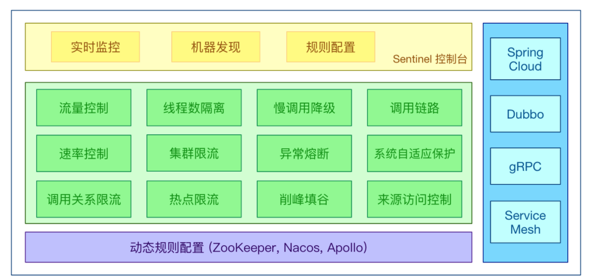
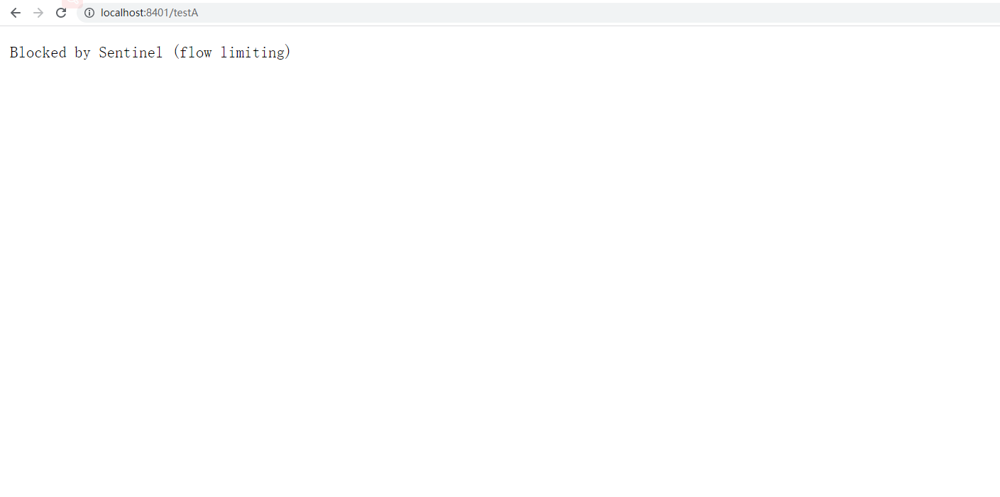
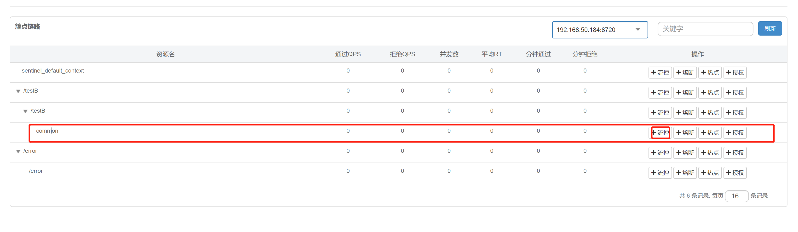
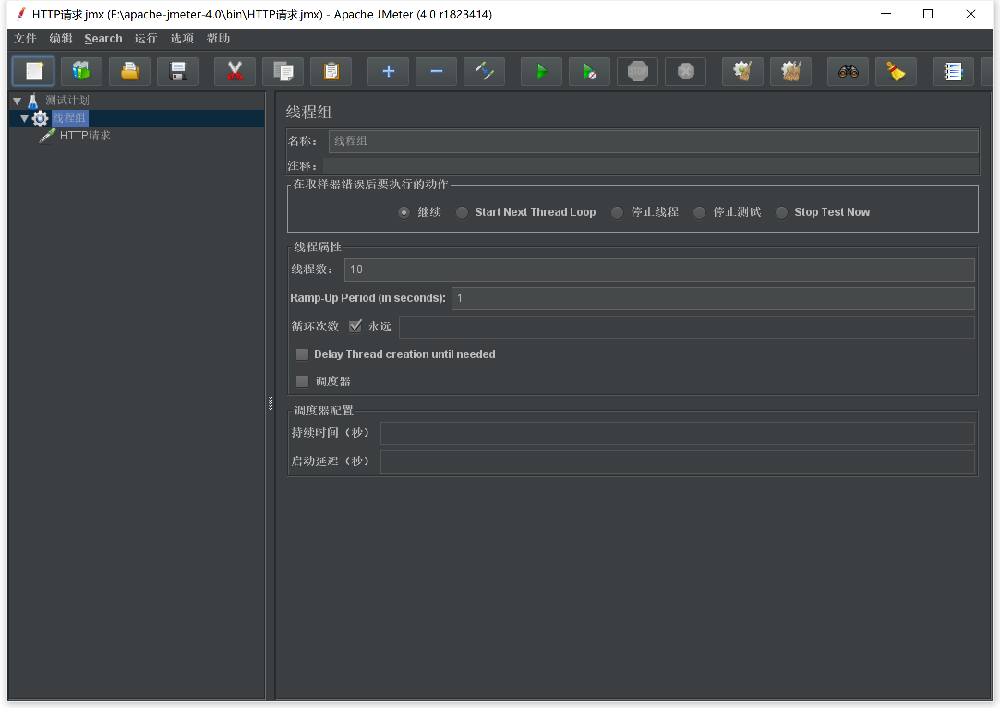
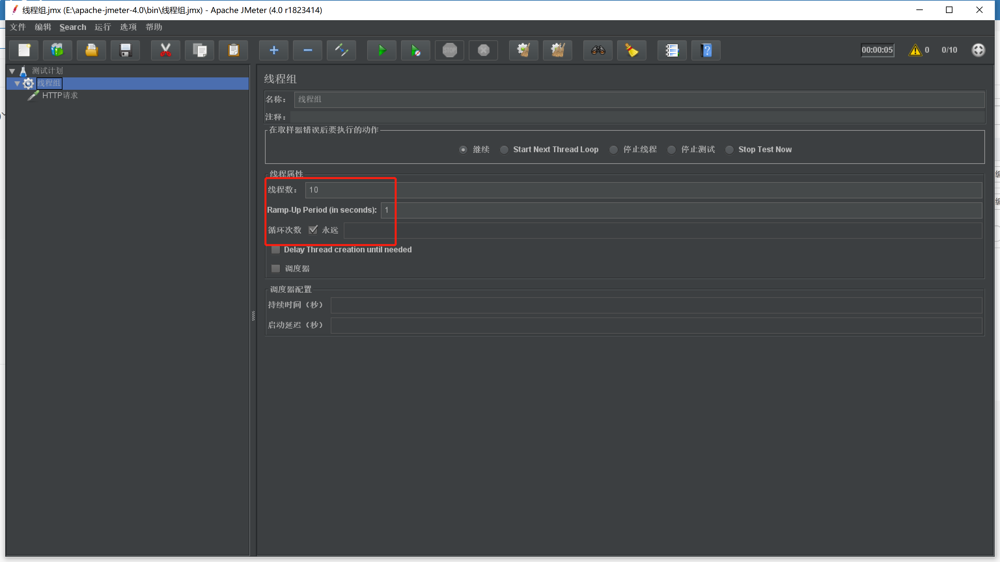
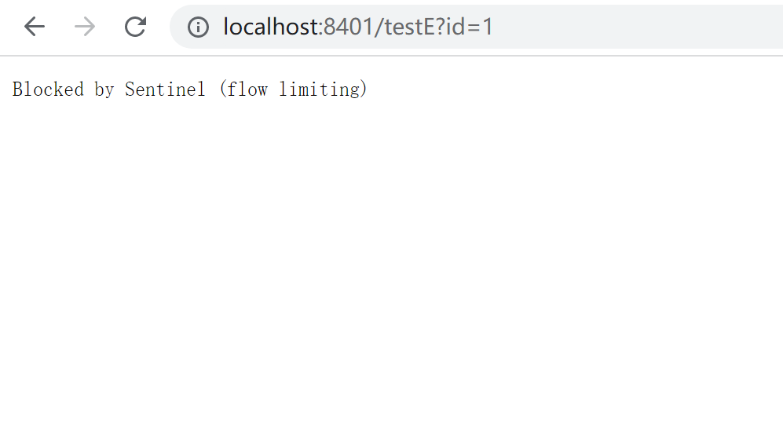
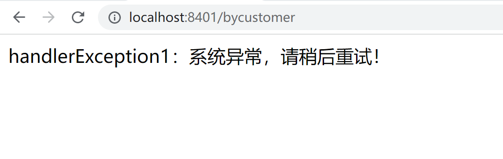
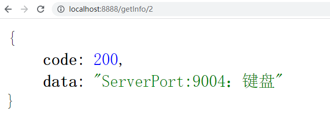
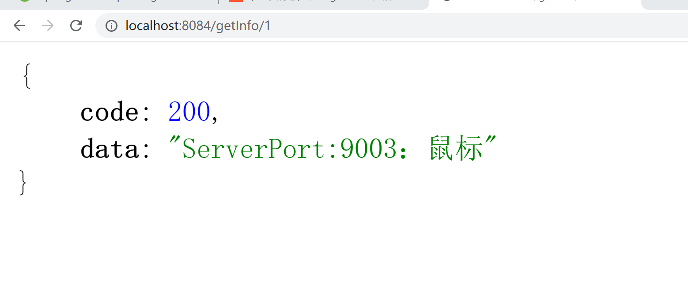

# Sentinel介绍

## 什么是Sentinel

1. **分布式系统的流量防卫兵**：随着微服务的普及，服务调用的稳定性变得越来越重要。[Sentinel](https://github.com/alibaba/Sentinel)以“流量”为切入点，在流量控制、断路、负载保护等多个领域开展工作，保障服务可靠性。

2. 特点：
   1. 
   2. **+丰富的应用场景**：Sentinel 承接了阿里巴巴近 10 年的双十一大促流量的核心场景，例如秒杀（即突发流量控制在系统容量可以承受的范围）、消息削峰填谷、集群流量控制、实时熔断下游不可用应用等。
   3. **完备的实时监控**：Sentinel 同时提供实时的监控功能。您可以在控制台中看到接入应用的单台机器秒级数据，甚至 500 台以下规模的集群的汇总运行情况。
   4. **广泛的开源生态**：Sentinel 提供开箱即用的与其它开源框架/库的整合模块，例如与 Spring Cloud、Apache Dubbo、gRPC、Quarkus 的整合。您只需要引入相应的依赖并进行简单的配置即可快速地接入 Sentinel。同时 Sentinel 提供 Java/Go/C++ 等多语言的原生实现。
   5. **完善的 SPI 扩展机制**：Sentinel 提供简单易用、完善的 SPI 扩展接口。您可以通过实现扩展接口来快速地定制逻辑。例如定制规则管理、适配动态数据源等。

3. 官网文档：https://github.com/alibaba/Sentinel/wiki/%E4%BB%8B%E7%BB%8D


## Sentinel好处

​	分布式系统面临的问题：复杂的体系结构中的应用程序有数十个依赖关系，每个依赖关系在某些时候将不可避免的失败，比如如下的例子中，当我们调用A、E、F、J、K这几个服务的时候如果其中一个服务出现问题会造成什么问题？其实就会出现整体系统效率全部下降，而且严重就会出现**服务雪崩**的问题！


​	**服务雪崩：**

​		多个微服务之间调用的时候，假设A调用B和C，B和C又调用其他的微服务，这就是所谓的**扇出**。如果扇出的某个链路上某个微服务调用的响应时间过程或者不可用，微服务A的调用就用占用越来越多的系统资源，从而引起系统崩溃，这也就是**服务雪崩**。其实就是服务的**高可用**遭到了破坏。

​		对于高流量的应用来说，单一的后端依赖可能会导致服务器上的所有资源都在几秒钟内饱和。同时还有可能造成这些应用程序导致服务之间的延迟增加，备份列队，线程和其他的系统资源紧张，导致整个系统发生更多的级联故障。这些都表示需要对故障和延迟进行隔离和管理，以便单个依赖关系失败，不能取消整个应用程序或系统，所以通常发生了一个模块的某个实例失败后，这时候这个模块依然还会接受流量，然后这个有问题的模块还调用其他的模块，这样就会发生级联故障，或者叫做**雪崩**。

​		要解决这种问题的出现我们就需要用到服务降级，而Sentinel就可以保证在一个依赖出现问题的情况下，不会导致整体服务失败，避免级联故障，提高分布式系统的弹性。

​	**Sentinel的熔断降级通过断路器实现：**

​		断路器：它本身是一种开关装置，当某个服务单元发生故障之后，通过断路器的故障监控（类似于熔断保险丝），向调用方返回一个符合预期的、可处理的备选响应（FallBack），而不是长时间的等待或者抛出调用方法无法出的异常，这样就保证了服务调用方的不会被长时间、不必要的占用，从而避免了故障在分布式系统中蔓延（类似于病毒传染），从而避免了故障在系统中蔓延，乃至崩溃。

​	**好处体现：**

​	对比与其他的产品而言，比如说Hystrix，他不需要我们自己手动搭建监控平台，而且它有一套类似于Nacos的Web界面，可以让我们进行更加细粒度的配置流控、速率、服务熔断、服务降级等

​	目前主流编程都是 约定>配置>代码，虽然我们的配置都可以写在代码中，但是我们还是要大面积的学习配置和注解的方式，尽量少些代码，这也是Sentinel的理念和初衷。

 




## Sentinel下载和安装

​	下载地址：https://github.com/alibaba/Sentinel/releases


官方提供的手册：https://spring-cloud-alibaba-group.github.io/github-pages/hoxton/en-us/index.html#_spring_cloud_alibaba_sentinel


**Sentinel 分为两个部分**

- 核心库（Java客户端）不依赖任何框架/库，只需要Java运行时环境，同时对Dubbo/SpringCloud 等框架也有较好的支持。 
- 控制台（Dashboard）基于 SpringBoot开发，打包后可以直接运行，不需要额外的Tomcat等应用容器。

**启动步骤**

- 前提：jdk1.8环境和8080端口不能被占用

- 启动命令：java -jar sentinel-dashboard-1.8.2.jar

- 访问地址：localhost:8080

- 输入默认账号密码：sentinel/sentinel

  

  


到这里为止，我们的Sentinel安装成功。

# Sentinel初始化监控


## Sentinel初始化工程演示

​	我们现在通过一个案例来让大家了解Sentinel的初始化演示，现在我们需要做几件事：

1. 启动Nacos8848成功
2. 创建新的Module：cloudalibaba-sentinel-service8401
3. 启动Sentinel8080
4. 启动微服务8401
5. 启动8401微服务后查看Sentinel控制台


## 搭建Sentinel项目

1. Sentinel的官方文档网址：https://sentinelguard.io/zh-cn/docs/quick-start.html
2. 创建项目cloudalibaba-sentinel-service8401
3. 导入依赖：

```java
<!-- Nacos客户端依赖 -->
<dependency>
    <groupId>com.alibaba.cloud</groupId>
    <artifactId>spring-cloud-starter-alibaba-nacos-discovery</artifactId>
</dependency>
<!-- sentinel依赖 -->
<dependency>
    <groupId>com.alibaba.cloud</groupId>
    <artifactId>spring-cloud-starter-alibaba-sentinel</artifactId>
</dependency>
```

4. 配置yaml文件，目的是让当前8401注册进Nacos，然后被Sentinel8080进行监控

```java
server:
  port: 8401

spring:
  application:
    name: cloudalibaba-sentinel-service
  cloud:
    nacos:
      discovery:
        server-addr: localhost:8848
    sentinel:
      transport:
        # 配置Sentinel dashboard地址
        dashboard: localhost:8080
        # 默认8719端口，键入被占用会自动从8719+1，直到找到未被占用的端口
        port: 8719

management:
  endpoints:
    web:
      exposure:
        include: '*'
```

5. 编写FlowLimitController

```java
package com.example.cloudalibabasentinel8401.controller;

import org.springframework.web.bind.annotation.GetMapping;
import org.springframework.web.bind.annotation.RestController;

@RestController
public class FlowLimitController {
    @GetMapping("/testA")
    public String testA(){
        return "-----testA";
    }

    @GetMapping("/testB")
    public String testB(){
        return "-----testB";
    }
}
```


## 测试

1. 当以上的这些配置配置好以后，我们就可以进行测试了，那我们的测试方式就是，首先保证Nacos和Sentinel都是启动状态，然后再来启动项目，按照我们的理解这个时候，就应该在Sentinel的dashboard上能体现出它监控的服务，但是此时并没有，原因是因为Sentinel本身采用的是懒加载机制，所以我们需要首先访问服务对应的接口，Sentinel才能工作。

```java
http://localhost:8401/testA
http://localhost:8401/testB
```

2. 访问之后我们来查看Sentinel的dashboard


3. 那么这个时候我们频繁快速的访问testA或者testB那么我们再来查看实时监控的时候，就会出现波动，体现此时Sentinel正在监控这我们的8401这个服务


# Sentinel流控规则

## 流控规则基本介绍


## 名词解释

- 资源名：唯一名称，默认请求路径
- 针对来源：Sentinel可以针对调用者进行限流，填写微服务名，默认default（不区分来源）
- 阈值类型/单机阈值：
  - QPS（每秒钟的请求数量）：当调用该API的QPS达到阈值的时候，进行限流
  - 线程数：当调用该API的线程数量达到阈值的时候，进行限流
- 是否集群：当前不需要集群
- 流控模式：
  - 直接：API达到限流条件时，直接限流
  - 关联：当关联的资源达到阈值时，就限流自己
  - 链路：只记录指定链路上的流量（指定资源从入口资源进来的流量，如果达到阈值，就进行限流）(API级别的针对来源)
- 流控效果：
  - 快速失败：直接失败，抛异常
  - Wam Up：根据codeFactor（冷加载因子，默认3）的值，从阈值/codeFacotor，经过预热时长，才达到设置的QPS阈值
  - 排队等待：匀速排队，让请求以匀速的速度通过，阈值类型必须设置为QPS，否则无效


## 具体操作

### 新增流控

**QPS直接失败案例**

1. 添加有两种方式，可以直接在流控规则选项中添加，也可以在簇点链路中添加，一般会采取第二种方式


2. 现在我们给"/testA"添加流控。


3. 这里的意思就是我们现在单机阈值设定为1，代表的是当前这个接口只能被1秒访问一次，超过这个阈值，就会被Sentinel阻塞，现在默认为直接失败，也就是会在前台有一个体现



**线程数直接失败案例**

1. 刚才我们可以的设置是通过QPS（每秒钟请求的数量）来设置的限流规则，但是我们这里其实还有一个线程数，是什么意思那？


2. QPS和并发线程数规则详解


3. 那我们要演示这种效果，我们就需要让一个线程再进来办理的时候需要0.8秒，但是这个时候后面的线程也在疯狂的访问，所以后面的线程就会不会生效。

```java
package com.example.cloudalibabasentinel8401.controller;

import com.alibaba.csp.sentinel.annotation.SentinelResource;
import org.springframework.web.bind.annotation.GetMapping;
import org.springframework.web.bind.annotation.RestController;

import java.util.concurrent.TimeUnit;

@RestController
public class FlowLimitController {
    @GetMapping("/testA")
    public String testA(){
        //暂停0.8秒
        try {
            TimeUnit.MILLISECONDS.sleep(800);
        } catch (InterruptedException e) {
            e.printStackTrace();
        }
        return "-----testA";
    }

    @GetMapping("/testB")
    public String testB(){
        return "-----testB";
    }
}
```

4. 这个时候我们重启项目，然后重新通过访问testA接口，通过两个网页（线程）来快速访问，这个时候我们来看效果，这里要注意，要重新添加流控规则。


**注意：这个时候虽然效果一致，但是是两种完全不同的规则，一种是QPS，一种是并发线程，这点大家一定要分清！**


# 流控规则-关联

​	首先我们先来回顾一下之前讲过的一些概念

## 名词解释

- 资源名：唯一名称，默认请求路径
- 针对来源：Sentinel可以针对调用者进行限流，填写微服务名，默认default（不区分来源）
- 阈值类型/单机阈值：
  - QPS（每秒钟的请求数量）：当调用该API的QPS达到阈值的时候，进行限流
  - 线程数：当调用该API的线程数量达到阈值的时候，进行限流
- 是否集群：当前不需要集群
- 流控模式：
  - 直接：API达到限流条件时，直接限流
  - 关联：当关联的资源达到阈值时，就限流自己
  - 链路：只记录指定链路上的流量（指定资源从入口资源进来的流量，如果达到阈值，就进行限流）(API级别的针对来源)
- 流控效果：
  - 快速失败：直接失败，抛异常
  - Wam Up：根据codeFactor（冷加载因子，默认3）的值，从阈值/codeFacotor，经过预热时长，才达到设置的QPS阈值
  - 排队等待：匀速排队，让请求以匀速的速度通过，阈值类型必须设置为QPS，否则无效


## 关联

​	官方解释：当关联的资源达到阈值时，就限流自己。

​	通俗解释来说，比如那我们的程序，现在有**testA**接口和**testB**接口，当A关联的资源B达到阈值后，就限流自己，也就是B到达阈值，限流A本身。就好像我家孩子在外面打架，我来处理一样。换到程序里面来说比如一个电商系统中，支付系统达到阈值，就限流下订单系统。


## 具体演示

​	当关联资源**/testB**的qps阈值超时1时，就限流**/testA**的Rest访问地址，当关联资源到阈值后限制配置好的资源名，首先我们先把FlowLimitController接口恢复原样

```java
@RestController
public class FlowLimitController {
    @GetMapping("/testA")
    public String testA(){
        return "-----testA";
    }

    @GetMapping("/testB")
    public String testB(){
        return "-----testB";
    }
}
```

​	给testA添加流控规则


​	为了演示效果，所以这里我们需要借助一个工具Postman，来模仿并发密集访问/testB，先来测试访问testB接口


​	这个时候我们需要多次密集访问TestB接口，所以我们需要添加配置，具体操作如下：


把数值修改为：

- Iterations：为20
- Delay：300

意思就是20个线程每间隔0.3秒访问一次，然后跑起来


​		这个时候我们来看网页中testA接口的效果


# 流控规则-链路

## 名词解释

- 资源名：唯一名称，默认请求路径
- 针对来源：Sentinel可以针对调用者进行限流，填写微服务名，默认default（不区分来源）
- 阈值类型/单机阈值：
  - QPS（每秒钟的请求数量）：当调用该API的QPS达到阈值的时候，进行限流
  - 线程数：当调用该API的线程数量达到阈值的时候，进行限流
- 是否集群：当前不需要集群
- 流控模式：
  - 直接：API达到限流条件时，直接限流
  - 关联：当关联的资源达到阈值时，就限流自己
  - 链路：只记录指定链路上的流量（指定资源从入口资源进来的流量，如果达到阈值，就进行限流）(API级别的针对来源)
- 流控效果：
  - 快速失败：直接失败，抛异常
  - Wam Up：根据coldFactor（冷加载因子，默认3）的值，从阈值/codeFacotor，经过预热时长，才达到设置的QPS阈值
  - 排队等待：匀速排队，让请求以匀速的速度通过，阈值类型必须设置为QPS，否则无效


## 链路

​	链路流控模式指的是，当从某个接口过来的资源达到限流条件时，开启限流，它的功能有点**类似于针对来源配置项**，**区别在于：针对来源是针对上级微服务，而链路流控是针对上级接口**，也就是说**它的粒度更细**。

​	比如在一个微服务中，两个接口都调用了同一个Service中的方法，并且**该方法用SentinelResource（用于定义资源）注解标注**了，然后对该注解标注的资源（方法）进行配置，则可以选择链路模式。

​	

## 具体演示

首先我们编写一个Service

```java
//service.TestService
@Service
public class TestService {
    // 定义限流资源
    @SentinelResource("common")
    public String common(){
        return "common";
    }
}
```

然后更改接口调用这个Service方法

```java
@RestController
public class FlowLimitController {
    @Autowired
    TestService testService;
    
    @GetMapping("/testA")
    public String testA(){
        return testService.common();
    }

    @GetMapping("/testB")
    public String testB(){
        return testService.common();
    }
}
```

接下来配置流控规则：

这里要注意不要对/testA或者/testB进行限流规则的配置，要给用SentinelResource注解标注的资源进行配置限流规则，这里的意思为当我们用入口资源访问被SentinelResource注解标注的资源方法时，当超过阈值就会被限流，但是此时实际效果是没有效果。




没有效果的原因是因为我们还需要添加配置，让Sentinel 源码中 CommonFilter 中的 WEB_CONTEXT_UNIFY 参数为 false，将其配置为 false 即可根据不同的URL 进行链路限流，如果不配置将不会生效。

```java
spring:
  application:
    name: cloudalibaba-sentinel-service
  cloud:
    nacos:
      discovery:
        server-addr: localhost:8848
    sentinel:
      transport:
        # 配置Sentinel dashboard地址
        dashboard: localhost:8080
        # 默认8719端口，键入被占用会自动从8719+1，直到找到未被占用的端口
        port: 8719
      # 配置为false
      web-context-unify: false
```

最后这个时候我们再来频繁的访问testB接口，就会出现异常的情况，这也是流量效果快速失败在链路上的体现，是直接抛出异常。


# Sentinel流控效果-预热

## 名词解释

- 资源名：唯一名称，默认请求路径
- 针对来源：Sentinel可以针对调用者进行限流，填写微服务名，默认default（不区分来源）
- 阈值类型/单机阈值：
  - QPS（每秒钟的请求数量）：当调用该API的QPS达到阈值的时候，进行限流
  - 线程数：当调用该API的线程数量达到阈值的时候，进行限流
- 是否集群：当前不需要集群
- 流控模式：
  - 直接：API达到限流条件时，直接限流
  - 关联：当关联的资源达到阈值时，就限流自己
  - 链路：只记录指定链路上的流量（指定资源从入口资源进来的流量，如果达到阈值，就进行限流）(API级别的针对来源)
- **流控效果：**
  - 快速失败：直接失败，抛异常
  - **Warm Up：根据coldFactor（冷加载因子，默认3）的值，从阈值/codeFacotor，经过预热时长，才达到设置的QPS阈值**
  - 排队等待：匀速排队，让请求以匀速的速度通过，阈值类型必须设置为QPS，否则无效


## 预热

官网手册地址：https://sentinelguard.io/zh-cn/docs/flow-control.html

概念：Warm Up方式，即预热/冷启动方式。该方式主要用于系统长期处于低水位的情况下，当流量突然增加时，直接把系统拉升到高水位可能瞬间把系统压垮。通过"冷启动"，让通过的流量缓慢增加，在一定时间内逐渐增加到阈值上限，给冷系统一个预热的时间，避免冷系统被压垮的情况。

​	预热公式：阈值/coldFactor（默认值为3），经过预热时间后才会达到阈值。

​	冷启动的过程系统允许通过的QPS曲线如下图：


简单理解：


​	使用场景：一般秒杀系统中会有这样的流控设置，为了防止秒杀瞬间造成系统崩溃。


## 案例

​	默认coldFactor为3，当发起请求即请求QPS从（阈值/3）开始，经过多长预热时长才逐步升至设定的QPS阈值，当前阈值设置为10，预热时长设置为5秒。

​	最终的效果，系统初始化时阈值/3约等于3，即阈值在此时为3，经过5秒后阈值才慢慢升高到10

首先我们先来设置流控效果：


测试，我们用最简单的方法进行测试，直接在浏览器上手动刷新，然后我们来看Sentinel的实时监控


# Sentinel流控效果-排队等待

## 名词解释

- 资源名：唯一名称，默认请求路径
- 针对来源：Sentinel可以针对调用者进行限流，填写微服务名，默认default（不区分来源）
- 阈值类型/单机阈值：
  - QPS（每秒钟的请求数量）：当调用该API的QPS达到阈值的时候，进行限流
  - 线程数：当调用该API的线程数量达到阈值的时候，进行限流
- 是否集群：当前不需要集群
- 流控模式：
  - 直接：API达到限流条件时，直接限流
  - 关联：当关联的资源达到阈值时，就限流自己
  - 链路：只记录指定链路上的流量（指定资源从入口资源进来的流量，如果达到阈值，就进行限流）(API级别的针对来源)
- **流控效果：**
  - 快速失败：直接失败，抛异常
  - Warm Up：根据coldFactor（冷加载因子，默认3）的值，从阈值/codeFacotor，经过预热时长，才达到设置的QPS阈值
  - **排队等待（匀速器）：匀速排队，让请求以匀速的速度通过，阈值类型必须设置为QPS，否则无效**

## 排队等待

​	官方文档：https://sentinelguard.io/zh-cn/docs/flow-control.html

​	概念：匀速排队方式会严格控制请求通过的间隔时间，也即是让请求以均匀的速度通过，对应的是漏桶算法。

​	这种方式主要用于处理间隔性突发的流量，例如消息队列。想象一下这样的场景，在某一秒有大量的请求到来，而接下来的几秒则处于空闲状态，我们希望系统能够在接下来的空闲期间逐渐处理这些请求，而不是在第一秒直接拒绝多余的请求（削峰填谷）。

​	例图：


### 匀速器

​	它的中心思想是，以固定的间隔时间让请求通过。当请求到来的时候，如果当前请求距离上个通过的请求通过的时间间隔不小于预设值，则让当前请求通过。否则，计算当前请求的预期通过时间，如果该请求的预期通过时间小于规则预设的 timeout 时间，则该请求会等待直到预设时间到来通过（排队等待处理）；若预期的通过时间超出最大排队时长，则直接拒接这个请求。


​	Sentinel 匀速排队等待策略是漏桶算法结合虚拟队列等待机制实现的。

​	注意：匀速排队模式暂时不支持 QPS > 1000 的场景。


## 演示

流控规则：


为了看到效果，我们在代码中进行打印，更改8401微服务中的FlowLimitController

```java
package com.example.cloudalibabasentinel8401.controller;

import com.alibaba.csp.sentinel.annotation.SentinelResource;
import com.example.cloudalibabasentinel8401.service.TestService;
import lombok.extern.slf4j.Slf4j;
import org.springframework.beans.factory.annotation.Autowired;
import org.springframework.web.bind.annotation.GetMapping;
import org.springframework.web.bind.annotation.RestController;

import java.util.concurrent.TimeUnit;

@RestController
@Slf4j
public class FlowLimitController {
    @Autowired
    TestService testService;
    @GetMapping("/testA")
    public String testA(){
        log.info(Thread.currentThread().getName()+"：testA");
        return testService.common();
    }

    @GetMapping("/testB")
    public String testB(){
        return testService.common();
    }
}
```

最后我们可以通过Postman来进行测试，发送请求时没有延迟，同时发送10条请求，然后我们会发现就是排队效果1秒执行一个请求，同时我们在Idea中也可以看到打桩效果


 

# Sentinel 熔断降级简介

## 基本概念

### 服务降级

> 当我们的服务调用者,去调用服务的时候;一定的时间内,如果被调用的没有反应;自己直接返回了;

### 服务熔断

> 当我们出发了熔断以后; 服务调用者不会去调用服务提供者;
>
> 在一个周期里面所有的请求都不会再去调用了;
>
> 周期以后会重新发送一个请求服务提供者;如果提供者正常响应了,会关闭熔断器;没有,熔断器继续开启;


## 基本介绍	

​	除了流量控制以外，对调用链路中不稳定的资源进行熔断降级也是保障高可用的重要措施之一。一个服务常常会调用别的模块，可能是另外的一个远程服务、数据库，或者第三方 API 等。例如，支付的时候，可能需要远程调用银联提供的 API；查询某个商品的价格，可能需要进行数据库查询。然而，这个被依赖服务的稳定性是不能保证的。如果依赖的服务出现了不稳定的情况，请求的响应时间变长，那么调用服务的方法的响应时间也会变长，线程会产生堆积，最终可能耗尽业务自身的线程池，服务本身也变得不可用。


​	现代微服务架构都是分布式的，由非常多的服务组成。不同服务之间相互调用，组成复杂的调用链路。以上的问题在链路调用中会产生放大的效果。复杂链路上的某一环不稳定，就可能会层层级联，最终导致整个链路都不可用。因此我们需要对不稳定的**弱依赖服务调用**进行熔断降级，暂时切断不稳定调用，避免局部不稳定因素导致整体的雪崩。熔断降级作为保护自身的手段，通常在客户端（调用端）进行配置。


## 熔断策略

​	Sentinel 提供了一下几种熔断策略：

- 慢调用比例 (`SLOW_REQUEST_RATIO`)：选择以慢调用比例作为阈值，需要设置允许的慢调用 RT（即最大的响应时间），请求的响应时间大于该值则统计为慢调用。当单位统计时长（`statIntervalMs`）内请求数目大于设置的最小请求数目，并且慢调用的比例大于阈值，则接下来的熔断时长内请求会自动被熔断。经过熔断时长后熔断器会进入探测恢复状态（HALF-OPEN 状态），若接下来的一个请求响应时间小于设置的慢调用 RT 则结束熔断，若大于设置的慢调用 RT 则会再次被熔断。
- 异常比例 (`ERROR_RATIO`)：当单位统计时长（`statIntervalMs`）内请求数目大于设置的最小请求数目，并且异常的比例大于阈值，则接下来的熔断时长内请求会自动被熔断。经过熔断时长后熔断器会进入探测恢复状态（HALF-OPEN 状态），若接下来的一个请求成功完成（没有错误）则结束熔断，否则会再次被熔断。异常比率的阈值范围是 `[0.0, 1.0]`，代表 0% - 100%。
- 异常数 (`ERROR_COUNT`)：当单位统计时长内的异常数目超过阈值之后会自动进行熔断。经过熔断时长后熔断器会进入探测恢复状态（HALF-OPEN 状态），若接下来的一个请求成功完成（没有错误）则结束熔断，否则会再次被熔断。

**比例阈值**：$$\frac{单位时间内慢调用的个数}{单位时间内所有请求书}$$


Sentinel在1.8.0版本对熔断降级做了大的调整，可以定义任意时长的熔断时间，引入了半开启恢复支持。下面梳理下相关特性。

熔断状态有三种状态，非别为OPEN、HALF_OPEN、CLOSED

| 状态      | 说明                                                         |
| --------- | ------------------------------------------------------------ |
| OPEN      | 表示熔断开启，拒绝所有请求                                   |
| HALF_OPEN | 探测恢复状态，如果接下来的一个请求顺利通过则表示结束熔断，否则继续熔断 |
| CLOSE     | 表示熔断关闭，请求顺利通过                                   |

## 熔断规则

熔断降级规则包含下面几个重要的属性：

| Field              | 说明                                                         | 默认值     |
| ------------------ | ------------------------------------------------------------ | ---------- |
| resource           | 资源名，即规则的作用对象                                     |            |
| grade              | 熔断策略，支持慢调用比例/异常比例/异常数策略                 | 慢调用比例 |
| count              | 慢调用比例模式下为慢调用临界 RT（超出该值计为慢调用）；异常比例/异常数模式下为对应的阈值 |            |
| timeWindow         | 熔断时长，单位为 s                                           |            |
| minRequestAmount   | 熔断触发的最小请求数，请求数小于该值时即使异常比率超出阈值也不会熔断（1.7.0 引入） | 5          |
| statIntervalMs     | 统计时长（单位为 ms），如 60*1000 代表分钟级（1.8.0 引入）   | 1000 ms    |
| slowRatioThreshold | 慢调用比例阈值，仅慢调用比例模式有效（1.8.0 引入）           |            |

官方文档网址：https://sentinelguard.io/zh-cn/docs/circuit-breaking.html

# Sentinel熔断策略-慢调用比例


## 慢调用比例

​	概念：选择以慢调用比例作为阈值，需要设置允许的慢调用 RT（即最大的响应时间），请求的响应时间大于该值则统计为慢调用。当单位统计时长（`statIntervalMs`）内请求数目大于设置的最小请求数目，并且慢调用的比例大于阈值，则接下来的熔断时长内请求会自动被熔断。经过熔断时长后熔断器会进入探测恢复状态（HALF-OPEN 状态），若接下来的一个请求响应时间小于设置的慢调用 RT 则结束熔断，若大于设置的慢调用 RT 则会再次被熔断。


​	简单理解：


举例：


## 案例演示

首先我们先添加一个控制器方法：

```java
@GetMapping("/testC")
public String testC(){
    try {
        TimeUnit.SECONDS.sleep(5);
    } catch (InterruptedException e) {
        e.printStackTrace();
    }
    return "----testC";
}
```

设置熔断策略，1QPS>5 并且这些请求的RT>300 并且大于比例阈值触发熔断


## 测试

通过JMeter测试，1秒钟发起10个线程请求/testC，此时就会触发熔断效果，停止测试以后，10秒钟以后恢复正常



# Sentinel熔断策略-异常比例

## 异常比例

​	概念：异常比例 (`ERROR_RATIO`)：当单位统计时长（`statIntervalMs`）内请求数目大于设置的最小请求数目，并且异常的比例大于阈值，则接下来的熔断时长内请求会自动被熔断。经过熔断时长后熔断器会进入探测恢复状态（HALF-OPEN 状态），若接下来的一个请求成功完成（没有错误）则结束熔断，否则会再次被熔断。异常比率的阈值范围是 `[0.0, 1.0]`，代表 0% - 100%。

​	注意：异常降级**仅针对业务异常**，对 Sentinel 限流降级本身的异常（`BlockException`）不生效。


简单理解：


## 案例

编写测试接口

```java
@GetMapping("/testD")
public String testD(Integer id){
    if(id != null && id > 1){
        throw new RuntimeException("异常比例测试");
    }
    return "------------testD";
}
```

设置熔断策略异常比例


## 测试

我们通过JMeter来测试，设定HTTP请求地址


1秒钟发送10个请求


当启动JMeter的时候，就会触发熔断，因为此时我们1秒钟发送10个请求超过了最小请求数5，同时超过了阈值，满足了两个条件，当熔断时长过后就会恢复正常。


# Sentinel熔断策略-异常数

## 异常数

​	概念：异常数 (`ERROR_COUNT`)：当单位统计时长内的异常数目超过阈值之后会自动进行熔断。经过熔断时长后熔断器会进入探测恢复状态（HALF-OPEN 状态），若接下来的一个请求成功完成（没有错误）则结束熔断，否则会再次被熔断。

​	注意：异常降级**仅针对业务异常**，对 Sentinel 限流降级本身的异常（`BlockException`）不生效。


简单理解：


## 案例演示

编写接口

```java
@GetMapping("/testE")
public String testE(Integer id){
    if(id != null && id > 1){
        throw new RuntimeException("异常数测试");
    }
    return "------------testE";
}
```

设置异常数策略，当1秒钟内请求超过5并且异常数大约5个的时候触发熔断


## 测试

通过JMeter来测试


1秒钟发送10个请求



此时就会触发熔断



# Sentinel 热点规则（上）

## 概念

何为热点？热点即经常访问的数据。很多时候我们希望统计某个热点数据中访问频次最高的 Top K 数据，并对其访问进行限制。比如：

- 商品 ID 为参数，统计一段时间内最常购买的商品 ID 并进行限制
- 用户 ID 为参数，针对一段时间内频繁访问的用户 ID 进行限制

热点参数限流会统计传入参数中的热点参数，并根据配置的限流阈值与模式，对包含热点参数的资源调用进行限流。热点参数限流可以看做是一种特殊的流量控制，仅对包含热点参数的资源调用生效

官网：https://sentinelguard.io/zh-cn/docs/parameter-flow-control.html


这里还有相对应的高级选项，我们这里先了解基本规则。

## 使用@SentinelResource注解

其实这个热点限流其实就是更加细粒度的流控规则，那么如果想使用它就必须要配合对应SentinelResource注解。

Sentinel 提供了 @SentinelResource 注解用于定义资源，它有很多的参数，我们这里主要关注两个参数：

1. value：代表资源名称，必需项，因为需要通过resource name找到对应的规则，这个是必须配置的
2. blockHandler：blockHandler 对应处理 BlockException 的方法名称，可选项，访问范围需要是 public，返回类型需要与原方法相匹配，参数类型需要和原方法相匹配并且最后加一个额外的参数，类型为 BlockException。

## 案例讲解


### @SentinelResource(value="xxx")

那现在我们要完成以上图中的效果，这个时候我们首先要编写代码，在FlowLimitController中编写代码

```java
@GetMapping("/testHotKey")
@SentinelResource("testHotKey")
public String testHotKey(@RequestParam(value = "hot1",required = false) String hot1,
                         @RequestParam(value = "hot2",required = false)String hot2,
                         @RequestParam(value = "hot13",required = false) String hot3){
    return "----testHotKey";
}
```

然后再来配置热点规则


这里要说明一下，参数索引0实际上代表的就是我们设置的hot1参数


测试，此时如果我们传入参数hot1，并且超过阈值，就会出现限流，但是此时的限流效果为报错，显示不友好


### @SentinelResource(value="xxx",blockHandler="xxx")

刚才的演示中，我们明显发现这种限流方法的提示效果非常不友好，所以如果我们需要能够得到友好的提示，我们就需要使用@SentinelResource注解提供的另外一个参数blockHandler，这个参数是可以指定当出现异常时的处理方法，具体操作如下：

```java
@GetMapping("/testHotKey")
@SentinelResource(value = "testHotKey",blockHandler = "handler_HotKey")
public String testHotKey(@RequestParam(value = "hot1",required = false) String hot1,
                         @RequestParam(value = "hot2",required = false)String hot2,
                         @RequestParam(value = "hot13",required = false) String hot3){
    return "----testHotKey";
}

//处理异常方法，方法签名要和对应的接口方法保持一致
public String handler_HotKey(String hot1, String hot2,String hot3,BlockException exception){
    return "系统繁忙稍后重试。。";
}
```

然后热点规则不变，我们最终的到的限流效果如下：


# Sentinel 热点规则（下）

## 概念

何为热点？热点即经常访问的数据。很多时候我们希望统计某个热点数据中访问频次最高的 Top K 数据，并对其访问进行限制。比如：

- 商品 ID 为参数，统计一段时间内最常购买的商品 ID 并进行限制
- 用户 ID 为参数，针对一段时间内频繁访问的用户 ID 进行限制

热点参数限流会统计传入参数中的热点参数，并根据配置的限流阈值与模式，对包含热点参数的资源调用进行限流。热点参数限流可以看做是一种特殊的流量控制，仅对包含热点参数的资源调用生效

官网：https://sentinelguard.io/zh-cn/docs/parameter-flow-control.html


## 参数例外项

​	其实参数例外项就是可以达到更加细粒度的控制，比如我们当前的例子中，目前hot1参数在访问时超过阈值就会被限流，但是我们可以通过参数例外项设置hot1具体等于特殊的某个值的时候，触发不同的限流效果。假如hot1的值等于5时，它的阈值可以达到200。

​	**注意：**参数例外项中的参数类型仅支持一下7种数据类型


## 案例演示

当前我们需要让hot1的值为5的时候阈值可以达到200，首先Sentinel页面中修改对应热点规则（在这之前，先演示传递一个参数，否则配置失败）


此时的规则为：如果当前hot1值为除5以外的其他值，都会走普通的阈值规则，但是如果一旦hot1的值为5的时候，将会走参数例外项，此时的阈值为200，我们通过浏览器测试，当hot1的值等于5是只要阈值不超过200就不会出现限流。


​	注意：题我们到现在代码中使用了@SentinelResource注解，此注解处理的是**Sentinel控制台配置的异常**，通过blockHandler属性设置对应方法来处理和程序本身异常无关。

​	所以以下程序中如果hot1的值等于6还是会出现RuntimeException。

```
@SentinelResource(value = "testHotKey",blockHandler = "handler_HotKey")
public String testHotKey(@RequestParam(value = "hot1",required = false) String hot1,
                         @RequestParam(value = "hot2",required = false) String hot2,
                         @RequestParam(value = "hot3",required = false) String hot3){
    if("6".equals(hot1)){
        throw new RuntimeException("运行时异常");
    }
    return "-----testHotKey";
}
```


# Sentinel 系统规则

​	Sentinel 系统自适应限流从整体维度对应用入口流量进行控制，结合应用的 Load、CPU 使用率、总体平均 RT、入口 QPS 和并发线程数等几个维度的监控指标，通过自适应的流控策略，让系统的入口流量和系统的负载达到一个平衡，让系统尽可能跑在最大吞吐量的同时保证系统整体的稳定性。

## 系统规则

​	系统保护规则是从应用级别 的入口流量进行控制，从单台机器的 load、CPU 使用率、平均 RT、入口 QPS 和并发线程数等几个维度监控应用指标，让系统尽可能跑在最大吞吐量的同时保证系统整体的稳定性。

​	系统保护规则是应用整体维度的，而不是资源维度的，并且**仅对入口流量生效**。入口流量指的是进入应用的流量，比如 Web 服务或 Dubbo 服务端接收的请求，都属于入口流量。


**系统规则支持一下的模式：**

- **Load 自适应**（仅对 Linux/Unix-like 机器生效）：系统的 load1（1分钟平均负载） 作为启发指标，进行自适应系统保护。当系统 load1（1分钟平均负载） 超过设定的启发值（阈值），且系统当前的并发线程数超过估算的系统容量时才会触发系统保护（BBR 阶段）。系统容量由系统的 `maxQps(秒级统计的最大QPS) * minRt(秒级统计的最小响应时间)` 估算得出。设定参考值一般是 `CPU cores * 2.5`。
- **CPU usage**（1.5.0+ 版本）：当系统 CPU 使用率超过阈值即触发系统保护（取值范围 0.0-1.0），比较灵敏。
- **平均 RT**：当单台机器上所有入口流量的平均 RT 达到阈值即触发系统保护，单位是毫秒。
- **并发线程数**：当单台机器上所有入口流量的并发线程数达到阈值即触发系统保护。
- **入口 QPS**：当单台机器上所有入口流量的 QPS 达到阈值即触发系统保护。


## 案例演示

这里我们只通过入口QPS来进行测试，直接设置规则


最后测试效果不管现在我们访问那个接口只要超过阈值就会被限流


# @SentinelResource 自定义限流逻辑处理

​	Sentinel 提供了@SentinelResource注解用于定义资源,并提供了AspectJ的扩展用于自定义资源,处理BlockException等。

## 案例复习

之前我们用过这个注解，同时了解了它的两个属性：

- value：资源名称，必须项（唯一，不能为空）
- blockHandler：对应处理BlockException的函数名称可选项.blockHandler函数访问需要public,返回类型需要与原方法相匹配,参数类型需要和原方法相匹配并且最后加一个额外的参数,类型为BlockException.blockHandler 函数默认需要和原方法在同一个类中

我们之前利用这个注解完成了热点规则的学习，同时做了一个案例，我们简单复习一下，这个案例的核心思想就是我们传递一个指定参数，然后通过注解@SentinelResource注解标注资源进行限流，当出现限流以后，通过blockHandler属性设置限流以后的解决方法。


其实这个注解不仅仅可以用到热点规则上，还可以用到流控上，我们可以做一个资源的流控和一个请求的流控，通过此注解来解决限流之后问题。

## @SentinelResource 资源限流

**核心点：**使用@SentinelResource注解的blockHandler属性，定义出现限流效果时的解决方法。

编写一个新的控制器类型SentinelResourceTestController，使用@SentinelResource注解同时使用blockHandler属性

```java
@GetMapping("/byResource")
@SentinelResource(value = "byResource",blockHandler = "handler_resource")
public String byResource(){
    return "-----byResource";
}

public String handler_resource(BlockException exception){
    return "系统繁忙";
}
```

这里要注意一定要给byResource资源添加流控


具体规则


测试，测试我们去快速访问http://localhost:8401/byResource，就会出现我们使用@SentinelResource注解中blockHandler属性提供的解决限流异常的方法。


## @SentinelResource URL限流

**核心点：**使用@SentinelResource注解，但是不使用blockHandler属性，系统会调用默认限流异常处理方法。

其实这个注解，我们还可以更换请求地址为资源，比如我们在新建一个测试接口方法

```java
@GetMapping("/byRest")
@SentinelResource(value = "byRest")
public String byRest(){
    return "-----byRest";
}
```

给这个接口地址添加流控


此时如果没有自己定义限流处理方法，会走系统默认的


## 结论

1. @SentinelResource 既可以配置资源名称也可以配置URL
2. 如果配置了@SentinelResource的blockHandler属性对应方法，出现限流会调用对应方法
3. 如果没有配置@SentinelResource的blockHandler属性，系统会走默认的限流处理。


## 自定义限流处理逻辑

其实我们在使用@SentinelResource注解这两种方案的时候，会出现一些问题：

1. 没有体现我们自己的业务要求。
2. 自定义处理方法和业务代码耦合在一起。
3. 每个业务方法都添加一个限流处理方法，代码将会加剧膨胀。
4. 无法实现统一全局处理。 

解决：@**SentinelResource**除了**blockHandler**可以设置自定义限流处理逻辑方法以外，还提供另外一个属性来设置限流处理逻辑类型**blockHandlerClass**属性，此属性中设置的方法必需为 static 函数，否则无法解析。

### 具体逻辑

**第一步**

创建CustomerBlockHandler类型用于处理自定义限流处理逻辑，首先创建myhandler.CustomerBlockHandler

```java
/**
 * 此类型用来处理限流自定义逻辑
 */
public class CustomerBlockHandler {
    public static String handlerException1(BlockException exception){
        return "handlerException1：系统异常，请稍后重试！";
    }
    public static String handlerException2(BlockException exception){
        return "handlerException2：网络崩溃了，请稍后重试！";
    }
}
```

**第二步**

我们在SentinelResourceTestController类型中添加一个接口方法，同时设置@SentinelResource注解和blockHandlerClass属性对应的类型和这个类型中对应的处理方法

```java
/**
* 此方法用到了自定义限流处理类型CustomerBlockHandler
* 中的handlerException1方法来处理限流逻辑。
*/
@GetMapping("/bycustomer")
@SentinelResource(value = "bycustomer",
                  blockHandlerClass = CustomerBlockHandler.class,
                  blockHandler = "handlerException1")
public String bycustomer(){
    return "-----bycustomer";
}
```

**第三步**

测试：给bycustomer资源添加限流规则，然后来测试在超过限流阈值时处理方法是否为CustomerBlockHandler中handlerException1来进行处理。


添加流控规则以后，我们再来频繁访问http://localhost:8401/bycustomer，就会看见是CustomerBlockHandler类型的handlerException1方法来处理自定义限流逻辑



### 对应关系图


# Sentinel服务熔断环境搭建

服务熔断：应对微服务雪崩效应的一种链路保护机制，类似保险丝。

需要完成Sentinel整合Ribbon+openFeign，所以我们先要搭建环境，那么先从整合Ribbon开始

## 环境搭建

为了演示操作，所以在这里我们需要利用Ribbon进行负载均衡的调用，所以我们需要创建一个服务消费者cloudalibaba-consumer8084和两个服务提供者cloudalibaba-provider9003和cloudalibaba-provider9004，以下是结构图


其实我们之前就搭建过这种结构，比较简单，所以我们快速搭建

### 新建cloudalibaba-provider-9003/9004

在建立9003和9004之前，先建立一个共享项目cloudalibaba-commons，在其中新建一个类型JsonResult，这个类型用于返回JSON数据类型

```java
import lombok.AllArgsConstructor;
import lombok.Data;
import lombok.NoArgsConstructor;

@Data
@AllArgsConstructor
@NoArgsConstructor
public class JsonResult<T> {
    private Integer code;
    private T data;
}
```

创建服务提供者9003，9004基本上是一样的，所以我们建立9003复制就可以得到9004

**pom**

```java
<?xml version="1.0" encoding="UTF-8"?>
<project xmlns="http://maven.apache.org/POM/4.0.0" xmlns:xsi="http://www.w3.org/2001/XMLSchema-instance"
         xsi:schemaLocation="http://maven.apache.org/POM/4.0.0 https://maven.apache.org/xsd/maven-4.0.0.xsd">
    <modelVersion>4.0.0</modelVersion>
    <parent>
        <groupId>com.mashibing</groupId>
        <artifactId>SpringAlibabaMSB</artifactId>
        <version>0.0.1-SNAPSHOT</version>
        <relativePath/> <!-- lookup parent from repository -->
    </parent>
    <groupId>com.mashibing</groupId>
    <artifactId>cloudalibaba-provider-9003</artifactId>
    <version>0.0.1-SNAPSHOT</version>
    <name>cloudalibaba-provider-9003</name>
    <description>cloudalibaba-provider-9003</description>
    <properties>
        <java.version>1.8</java.version>
    </properties>
    <dependencies>
        <dependency>
            <groupId>org.springframework.boot</groupId>
            <artifactId>spring-boot-starter</artifactId>
        </dependency>
        <dependency>
            <groupId>org.springframework.boot</groupId>
            <artifactId>spring-boot-starter-test</artifactId>
            <scope>test</scope>
        </dependency>
        <dependency>
            <groupId>com.alibaba.cloud</groupId>
            <artifactId>spring-cloud-starter-alibaba-nacos-discovery</artifactId>
        </dependency>
        <dependency>
            <groupId>com.mashibing</groupId>
            <artifactId>cloudalibaba-commons</artifactId>
            <version>0.0.1-SNAPSHOT</version>
        </dependency>
    </dependencies>

    <build>
        <plugins>
            <plugin>
                <groupId>org.springframework.boot</groupId>
                <artifactId>spring-boot-maven-plugin</artifactId>
            </plugin>
        </plugins>
    </build>

</project>
```

**yml**

```java
server:
  port: 9003

spring:
  application:
    name: nacos-provider
  cloud:
    nacos:
      discovery:
        server-addr: localhost:8848 #配置Nacos地址

management:
  endpoints:
    web:
      exposure:
        include: '*'
```

**主启动添加注解**

```java
package com.mashibing.cloudalibabaprovider9003;

import org.springframework.boot.SpringApplication;
import org.springframework.boot.autoconfigure.SpringBootApplication;
import org.springframework.cloud.client.discovery.EnableDiscoveryClient;

@SpringBootApplication
@EnableDiscoveryClient
public class CloudalibabaProvider9003Application {

    public static void main(String[] args) {
        SpringApplication.run(CloudalibabaProvider9003Application.class, args);
    }

}
```

**控制器**

```java
package com.mashibing.cloudalibabaprovider9003.controller;

import com.mashibing.cloudalibabacommons.entity.JsonResult;
import lombok.extern.java.Log;
import org.springframework.beans.factory.annotation.Value;
import org.springframework.web.bind.annotation.GetMapping;
import org.springframework.web.bind.annotation.PathVariable;
import org.springframework.web.bind.annotation.RestController;

import java.util.HashMap;

@RestController
public class DataController {
    @Value("${server.port}")
    private String serverPort;

    //模仿数据库存储数据
    public static HashMap<Long,String> hashMap = new HashMap<>();
    static {
        hashMap.put(1l,"鼠标");
        hashMap.put(2l,"键盘");
        hashMap.put(3l,"耳机");
    }

    @GetMapping("info/{id}")
    public JsonResult<String> msbSql(@PathVariable("id") Long id){
        JsonResult<String> result = new JsonResult(1L,200,hashMap.get(id));
        return result;
    }
}
```

**注意：**9004和9003 一致，但是要注意修改yml文件端口号

### 新建cloudalibaba-consumer8084

**pom**

```java
<?xml version="1.0" encoding="UTF-8"?>
<project xmlns="http://maven.apache.org/POM/4.0.0" xmlns:xsi="http://www.w3.org/2001/XMLSchema-instance"
         xsi:schemaLocation="http://maven.apache.org/POM/4.0.0 https://maven.apache.org/xsd/maven-4.0.0.xsd">
    <modelVersion>4.0.0</modelVersion>
    <parent>
        <groupId>com.mashibing</groupId>
        <artifactId>SpringAlibabaMSB</artifactId>
        <version>0.0.1-SNAPSHOT</version>
        <relativePath/> <!-- lookup parent from repository -->
    </parent>
    <groupId>com.mashibing</groupId>
    <artifactId>cloudalibaba-consumer8084</artifactId>
    <version>0.0.1-SNAPSHOT</version>
    <name>cloudalibaba-consumer8084</name>
    <description>cloudalibaba-consumer8084</description>
    <properties>
        <java.version>1.8</java.version>
    </properties>
    <dependencies>
        <dependency>
            <groupId>org.springframework.boot</groupId>
            <artifactId>spring-boot-starter</artifactId>
        </dependency>

        <dependency>
            <groupId>org.springframework.boot</groupId>
            <artifactId>spring-boot-starter-test</artifactId>
            <scope>test</scope>
        </dependency>
        <!--SpringCloud ailibaba nacos -->
        <dependency>
            <groupId>com.alibaba.cloud</groupId>
            <artifactId>spring-cloud-starter-alibaba-nacos-discovery</artifactId>
        </dependency>
        <!--SpringCloud ailibaba sentinel -->
        <dependency>
            <groupId>com.alibaba.cloud</groupId>
            <artifactId>spring-cloud-starter-alibaba-sentinel</artifactId>
        </dependency>
        <dependency>
            <groupId>com.mashibing</groupId>
            <artifactId>cloudalibaba-commons</artifactId>
            <version>0.0.1-SNAPSHOT</version>
        </dependency>
    </dependencies>

    <build>
        <plugins>
            <plugin>
                <groupId>org.springframework.boot</groupId>
                <artifactId>spring-boot-maven-plugin</artifactId>
            </plugin>
        </plugins>
    </build>

</project>
```

**yml**

```java
server:
  port: 8084
spring:
  application:
    name: nacos-consumer
  cloud:
    nacos:
      discovery:
        server-addr: localhost:8848
    sentinel:
      transport:
        #配置Sentinel dashboard地址
        dashboard: localhost:8080
        #默认8719端口，假如被占用会自动从8719开始依次+1扫描,直至找到未被占用的端口
        port: 8719

#消费者将要去访问的微服务名称(注册成功进nacos的微服务提供者)
service-url:
  nacos-user-service: http://nacos-provider
```

主启动添加注解和9003/9004一致

**控制器**

```java
import com.mashibing.cloudalibabacommons.entity.JsonResult;
import lombok.extern.slf4j.Slf4j;
import org.springframework.beans.factory.annotation.Autowired;
import org.springframework.beans.factory.annotation.Value;
import org.springframework.web.bind.annotation.GetMapping;
import org.springframework.web.bind.annotation.PathVariable;
import org.springframework.web.bind.annotation.RestController;
import org.springframework.web.client.RestTemplate;

@RestController
@Slf4j
public class DemoController {
    //服务提供者URL
    @Value("${service-url.nacos-user-service}")
    private String SERVICE_URL;

    @Autowired
    private RestTemplate restTemplate;

    @GetMapping("/consumer/fallback/{id}")
    public JsonResult<String> fallback(@PathVariable Long id){
        //通过Ribbon发起远程访问，访问9003/9004
        JsonResult<String> result = restTemplate.getForObject(SERVICE_URL+"/info/"+id,JsonResult.class);
    	return result;
    }
}
```


## 最后测试

访问http://localhost:8084/consumer/fallback/1

查看最后结果是否为9003/9004切换调用


# SentinelResource的fallback属性

## fallback属性

**概念：**fallback 函数名称，可选项，用于在抛出异常的时候提供 fallback 处理逻辑。fallback 函数可以针对所有类型的异常（除了 `exceptionsToIgnore` 里面排除掉的异常类型）进行处理。fallback 函数签名和位置要求：

- 返回值类型必须与原函数返回值类型一致；
- 方法参数列表需要和原函数一致，或者可以额外多一个 `Throwable` 类型的参数用于接收对应的异常。
- fallback 函数默认需要和原方法在同一个类中。若希望使用其他类的函数，则可以指定 `fallbackClass` 为对应的类的 `Class` 对象，注意对应的函数必需为 static 函数，否则无法解析。

其实通过官网上提供的概念，我们不难看出这个属性类似于blockHandler，但是各位一定要注意他们有本质的不同。

**注意：**fallback属性和blockHandler属性的本质不同在于他们作用的异常不同：

- blockHandler：针对违反Sentinel控制台配置规则时触发BlockException异常时对应处理的属性
- fallback：针对Java本身出现的异常进行处理的对应属性。


## 案例演示

​	上节课我们已经完成环境的搭建，那我们就直接在8084项目的DemoController中编写对应代码

首先我们先来设置异常规则

```java
package com.mashibing.cloudalibabaconsumer8084;

import com.mashibing.cloudalibabacommons.entity.JsonResult;
import lombok.extern.slf4j.Slf4j;
import org.springframework.beans.factory.annotation.Autowired;
import org.springframework.beans.factory.annotation.Value;
import org.springframework.web.bind.annotation.GetMapping;
import org.springframework.web.bind.annotation.PathVariable;
import org.springframework.web.bind.annotation.RestController;
import org.springframework.web.client.RestTemplate;

@RestController
@Slf4j
public class DemoController {
    //服务提供者URL
    @Value("${service-url.nacos-user-service}")
    private String SERVICE_URL;

    @Autowired
    private RestTemplate restTemplate;

    @GetMapping("/consumer/fallback/{id}")
    public JsonResult<String> fallback(@PathVariable Long id){
        if(id<=3){
            //通过Ribbon发起远程访问，访问9003/9004
            JsonResult<String> result = restTemplate.getForObject(SERVICE_URL+"/info/"+id,JsonResult.class);
            System.err.println(result.getData());
            return result;
        }else{
            throw new NullPointerException("没有对应的数据记录");
        }
    }
}
```

​	此时我们任务添加了异常，此时如果我们访问http://localhost:8084/consumer/fallback/4（id非法）地址时，就会出现对应的显示效果：


​	明显此时显示效果非常不好，我们就可以通过@SentinelResource注解的fallback属性来解决这种java异常，给出友好提示

```java
@RestController
@Slf4j
public class DemoController {
    //服务提供者URL
    @Value("${service-url.nacos-user-service}")
    private String SERVICE_URL;

    @Autowired
    private RestTemplate restTemplate;

    @GetMapping("/consumer/fallback/{id}")
    //添加SentinelResource注解的fallback属性，同时设置方法来解决Java异常
    @SentinelResource(value = "falllback",fallback = "fallbackHandler")
    public JsonResult<String> fallback(@PathVariable Long id){
        if(id<=3){
            //通过Ribbon发起远程访问，访问9003/9004
            JsonResult<String> result = restTemplate.getForObject(SERVICE_URL+"/info/"+id,JsonResult.class);
            System.err.println(result.getData());
            return result;
        }else{
            throw new NullPointerException("没有对应的数据记录");
        }
    }
    //保证方法签名基本保持一致，但是要添加异常类型参数
    public JsonResult<String> fallbackHandler(Long id,Throwable e){
        JsonResult<String> result = new JsonResult<>(444,"出现未知商品id");
        return result;
    }
}
```

​	到这里为止，我们就很清楚的知道了fallback属性的作用，同时它和blockHandler属性类似，也可以设置fallbackClass属性，来指定对应类型，来处理对应的Java异常，当然要注意和blockHandlerClass属性一样，也需要让所有的方法都必需为 static 函数，否则无法解析。

## 同时配置blockHandler和fallback属性

​	通过上述的内容，我们很清楚的知道了fallback属性的作用，但是大家现在想一个问题，如果我们在使用@SentinelResource属性的时候，同时设置blockHandler属性和fallback属性时，并且同时出现了Sentinel异常和Java异常，这个时候会执行哪个方法那。

我们还是回顾一下blockHandler属性的概念：

- `blockHandler` / `blockHandlerClass`: `blockHandler` 对应处理 `BlockException` 的函数名称，可选项。blockHandler 函数访问范围需要是 `public`，返回类型需要与原方法相匹配，参数类型需要和原方法相匹配并且最后加一个额外的参数，类型为 `BlockException`。blockHandler 函数默认需要和原方法在同一个类中。若希望使用其他类的函数，则可以指定 `blockHandlerClass` 为对应的类的 `Class` 对象，注意对应的函数必需为 static 函数，否则无法解析。


## 案例演示

​	我们现在同时在DemoController中设置fallback属性和blockHandler属性

```java
@RestController
@Slf4j
public class DemoController {
    //服务提供者URL
    @Value("${service-url.nacos-user-service}")
    private String SERVICE_URL;

    @Autowired
    private RestTemplate restTemplate;

    @GetMapping("/consumer/fallback/{id}")
    //同时添加SentinelResource注解的fallback和blockHandler属性
    @SentinelResource(value = "falllback",fallback = "fallbackHandler",blockHandler = "blockHandler")
    public JsonResult<String> fallback(@PathVariable Long id){
        if(id<=3){
            //通过Ribbon发起远程访问，访问9003/9004
            JsonResult<String> result = restTemplate.getForObject(SERVICE_URL+"/info/"+id,JsonResult.class);
            System.err.println(result.getData());
            return result;
        }else{
            throw new NullPointerException("没有对应的数据记录");
        }
    }
    //处理Java异常
    public JsonResult<String> fallbackHandler(Long id,Throwable e){
        JsonResult<String> result = new JsonResult<>(444,"NullPointerException异常");
        return result;
    }

    //处理Sentinel限流
    public JsonResult<String> blockHandler(Long id, BlockException e){
        JsonResult<String> result = new JsonResult<>(445,"BlockException限流");
        return result;
    }
}
```

​	此时我们来设置Sentinel配置，我们通过熔断规则中的异常数来演示（当然也可以用其他的）

规则：在一秒内超过最小访问次数5次，并且异常数超过2的时候，就会触发熔断规则。


此时我们来访问http://localhost:8084/consumer/fallback/6看效果：

- 在没有触发熔断之前的异常交给fallback来处理


- 但是一旦触发熔断规则就变成了blockHandler来处理


## exceptionsToIgnore属性

- `exceptionsToIgnore`（since 1.6.0）：用于指定哪些异常被排除掉，不会计入异常统计中，也不会进入 fallback 逻辑中，而是会原样抛出。

```java
@RestController
@Slf4j
public class DemoController {
    //服务提供者URL
    @Value("${service-url.nacos-user-service}")
    private String SERVICE_URL;

    @Autowired
    private RestTemplate restTemplate;

    @GetMapping("/consumer/fallback/{id}")
    //同时添加SentinelResource注解的fallback和blockHandler属性
    @SentinelResource(value = "falllback",fallback = "fallbackHandler",blockHandler = "blockHandler",
            exceptionsToIgnore = {NullPointerException.class})//被标注的异常将会被 原样抛出
    public JsonResult<String> fallback(@PathVariable Long id){
        if(id<=3){
            //通过Ribbon发起远程访问，访问9003/9004
            JsonResult<String> result = restTemplate.getForObject(SERVICE_URL+"/info/"+id,JsonResult.class);
            System.err.println(result.getData());
            return result;
        }else{
            throw new NullPointerException("没有对应的数据记录");
        }
    }
    //处理Java异常
    public JsonResult<String> fallbackHandler(Long id,Throwable e){
        JsonResult<String> result = new JsonResult<>(444,"NullPointerException异常");
        return result;
    }

    //处理Sentinel限流
    public JsonResult<String> blockHandler(Long id, BlockException e){
        JsonResult<String> result = new JsonResult<>(445,"BlockException限流");
        return result;
    }
}
```


# OpenFeign基础应用

## 概念

OpenFeign是一种声明式、模板化的HTTP客户端。在Spring Cloud中使用OpenFeign，可以做到使用HTTP请求访问远程服务，就像调用本地方法一样的，开发者完全感知不到这是在调用远程方法，更感知不到在访问HTTP请求，用法其实就是编写一个接口，在接口上添加注解即可。

可以简单理解它是借鉴Ribbon的基础之上，封装的一套服务接口+注解的方式的远程调用器。

## OpenFeign能干什么

它的宗旨是在编写Java Http客户端接口的时候变得更加容易，其底层整合了Ribbon，所以也支持负载均衡。

之前我们使用Ribbon的时候，利用RestTemplate对Http请求进行封装处理，但是在实际开发中，由于对服务依赖的调用不可能就一处，往往一个接口会被多处调用，所以通常都会针对每个微服务自行封装一些客户端类来包装这些依赖服务的调用。所以OpenFeign在此基础之上做了进一步的封装，由它来帮助我们定义和实现依赖服务接口的定义，我们只需创建一个接口并使用注解的方式来配置它，即可完成对微服务提供方的接口绑定，简化Ribbon的操作。

## 具体使用

 这里我们通过一个案例来演示，首先我们要明确使用OpenFeign是使用在消费者端去远程调用，就必须要是用FeignClient注解，来标注要调用的服务提供者名称，然后在通过一个接口来定义要调用的方法，所以我们首先新建一个Model：cloudalibaba-openFeign-consumer-8888


### pom

注意：需要在父级项目引入对应依赖坐标

```java
<dependency>
    <groupId>org.springframework.cloud</groupId>
    <artifactId>spring-cloud-starter-openfeign</artifactId>
    <version>${openfeign-version}</version>
</dependency>
```

```java
<?xml version="1.0" encoding="UTF-8"?>
<project xmlns="http://maven.apache.org/POM/4.0.0" xmlns:xsi="http://www.w3.org/2001/XMLSchema-instance"
         xsi:schemaLocation="http://maven.apache.org/POM/4.0.0 https://maven.apache.org/xsd/maven-4.0.0.xsd">
    <modelVersion>4.0.0</modelVersion>
    <parent>
        <groupId>com.mashibing</groupId>
        <artifactId>SpringAlibabaMSB</artifactId>
        <version>0.0.1-SNAPSHOT</version>
        <relativePath/> <!-- lookup parent from repository -->
    </parent>
    <groupId>com.mashibing</groupId>
    <artifactId>cloudalibaba-openFeign-consumer-8888</artifactId>
    <version>0.0.1-SNAPSHOT</version>
    <name>cloudalibaba-openFeign-consumer-8888</name>
    <description>cloudalibaba-openFeign-consumer-8888</description>
    <properties>
        <java.version>1.8</java.version>
    </properties>
    <dependencies>
        <dependency>
            <groupId>org.springframework.boot</groupId>
            <artifactId>spring-boot-starter</artifactId>
        </dependency>
        <dependency>
            <groupId>org.springframework.boot</groupId>
            <artifactId>spring-boot-starter-test</artifactId>
            <scope>test</scope>
        </dependency>
        <dependency>
            <groupId>com.alibaba.cloud</groupId>
            <artifactId>spring-cloud-starter-alibaba-nacos-discovery</artifactId>
        </dependency>
        <dependency>
            <groupId>org.springframework.cloud</groupId>
            <artifactId>spring-cloud-starter-openfeign</artifactId>
        </dependency>
        <dependency>
            <groupId>com.mashibing</groupId>
            <artifactId>cloudalibaba-commons</artifactId>
            <version>0.0.1-SNAPSHOT</version>
        </dependency>
    </dependencies>


    <build>
        <plugins>
            <plugin>
                <groupId>org.springframework.boot</groupId>
                <artifactId>spring-boot-maven-plugin</artifactId>
            </plugin>
        </plugins>
    </build>
</project>
```

### java.lang.IllegalStateException: No Feign Client for loadBalancing defined. Did you forget to include spring-cloud-starter-loadbalancer?

由于Spring Cloud Feign在Hoxton.M2 RELEASED版本之后不再使用Ribbon而是使用spring-cloud-loadbalancer，所以不引入spring-cloud-loadbalancer会报错.

解决方法：
加入spring-cloud-loadbalancer依赖 并且在nacos中排除ribbon依赖，不然loadbalancer无效

排除ribbon依赖

```xml
  <!-- 服务注册/发现  -->
        <dependency>
            <groupId>com.alibaba.cloud</groupId>
            <artifactId>spring-cloud-starter-alibaba-nacos-discovery</artifactId>
            <exclusions>
                <exclusion>
                    <groupId>com.netflix.ribbon</groupId>
                    <artifactId>ribbon</artifactId>
                </exclusion>
            </exclusions>
        </dependency>
```

### YML配置

```java
server:
  port: 8888
spring:
  application:
    name: nacos-consumer-openFeign
  cloud:
    nacos:
      discovery:
        server-addr: localhost:8848

management:
  endpoints:
    web:
      exposure:
        include: '*'
```

### 主启动中添加注解

```
@SpringBootApplication
@EnableDiscoveryClient
@EnableFeignClients//添加此注解
public class CloudalibabaOpenFeignConsumer8888Application {

    public static void main(String[] args) {
        SpringApplication.run(CloudalibabaOpenFeignConsumer8888Application.class, args);
    }

}
```

### 调用服务提供者对外提供接口

这里要调用的是服务提供者9003/9004


```java
package com.mashibing.cloudalibabaopenFeignconsumer8888.service;

import com.mashibing.cloudalibabacommons.entity.JsonResult;
import org.springframework.cloud.openfeign.FeignClient;
import org.springframework.stereotype.Service;
import org.springframework.web.bind.annotation.GetMapping;
import org.springframework.web.bind.annotation.PathVariable;

/**
 * 此接口就是配合使用OpenFeign的接口，
 * 在此接口中添加@FeignClient接口同时标注
 * 要调用的服务端名称，同时使用与服务提供者
 * 方法签名一致的抽象方法来表示远程调用的
 * 具体内容
 */
@Service
//表示远程调用服务名称
@FeignClient("nacos-provider")
public interface OpenFeignService {
    /**
     * 此方法表示远程调用info/{id}接口
     */
    @GetMapping("info/{id}")
    public JsonResult<String> msbSql(@PathVariable("id") Long id);
}

```

### 控制器

```java
package com.mashibing.cloudalibabaopenFeignconsumer8888.controller;

import com.mashibing.cloudalibabacommons.entity.JsonResult;
import com.mashibing.cloudalibabaopenFeignconsumer8888.service.OpenFeignService;
import org.springframework.beans.factory.annotation.Autowired;
import org.springframework.web.bind.annotation.GetMapping;
import org.springframework.web.bind.annotation.PathVariable;
import org.springframework.web.bind.annotation.RestController;

@RestController
public class OpenFeignController {

    @Autowired
    private OpenFeignService openFeignService;

    @GetMapping("getInfo/{id}")
    public JsonResult<String> getInfo(@PathVariable("id") Long id){
        return openFeignService.msbSql(id);
    }

}
```

## 测试结果

能够远程调用的同时还有负载均衡效果



# OpenFeign超时时间控制

## 概念

OpenFeign 客户端默认等待1秒钟，但是如果服务端业务超过1秒，则会报错。为了避免这样的情况，我们需要设置feign客户端的超时控制。

## 解决办法

由于OpenFeign 底层是ribbon 。所以超时控制由ribbon来控制。在yml文件中配置

## 超时案例演示

首先演示超时效果，我们现在9003/9004上设置一个延迟3秒执行的方法，来模仿长业务线调用。

```java
@GetMapping("/timeOut")
public String timeOut() {
    try {
        System.out.println("延迟响应");
        TimeUnit.SECONDS.sleep(3);
    } catch (InterruptedException e) {
        e.printStackTrace();
    }
    return serverPort;
}
```

客户端8888通过OpenFeign来进行调用

```java
//OpenFeginController
@GetMapping("/testTimeout")
    public String TestTimeout(){
        return openFeginService.timeOut();
    }
}
```

### 测试结果

客户端报错：


## 设置超时控制案例演示

首先我们需要在8888消费者端的yml文件中配置超时时间，因为OpenFeign本身整合了Ribbon所以，这里其实我们用的是Ribbon来配置

### YML

```java
server:
  port: 8888
spring:
  application:
    name: nacos-consumer-openfegin
  cloud:
    nacos:
      discovery:
        server-addr: localhost:8848

#设置feign客户端超时时间(OpenFeign默认支持ribbon)
ribbon:
  #指的是建立连接所用的时间，适用于网络状况正常的情况下,两端连接所用的时间
  ReadTimeout: 5000
  #指的是建立连接后从服务器读取到可用资源所用的时间
  ConnectTimeout: 5000

management:
  endpoints:
    web:
      exposure:
        include: '*'
```

### 测试结果

正常响应


## OpenFeign日志打印

## 概念

Feign 提供了日志打印功能，我们可以通过配置来调整日志级别，从而了解 Feign 中 Http 请求的细节。
简单理解，就是对Feign接口的调用情况进行监控和输出

**日志级别：**

- NONE：默认的，不显示任何日志；

- BASIC：仅记录请求方法、URL、响应状态码及执行时间；

- HEADERS：除了 BASIC 中定义的信息之外，还有请求和响应的头信息；

- FULL：除了 HEADERS 中定义的信息之外，还有请求和响应的正文及元数据。

## 具体使用

需要在启动类中通过@Bean注解注入OpenFeign的日志功能

```java
@SpringBootApplication
@EnableFeignClients
public class CloudalibabaOpenFeginConsumer8888Application {

    public static void main(String[] args) {
        SpringApplication.run(CloudalibabaOpenFeginConsumer8888Application.class, args);
    }

    @Bean
    Logger.Level feignLoggerLevel(){
        //开启详细日志
        return Logger.Level.FULL;
    }
}

```

在yml中配置中配置

```java
server:
  port: 8888
spring:
  application:
    name: nacos-consumer-openfegin
  cloud:
    nacos:
      discovery:
        server-addr: localhost:8848

#设置feign客户端超时时间(OpenFeign默认支持ribbon)
ribbon:
  #指的是建立连接所用的时间，适用于网络状况正常的情况下,两端连接所用的时间
  ReadTimeout: 5000
  #指的是建立连接后从服务器读取到可用资源所用的时间
  ConnectTimeout: 5000

logging:
  level:
    # openfeign日志以什么级别监控哪个接口
    com.mashibing.cloudalibabaopenfeginconsumer8888.service.OpenFeginService: debug

management:
  endpoints:
    web:
      exposure:
        include: '*'
```

测试效果，发起一次调用以后的日志内容：


# Sentinel整合OpenFegin

根据之前的学习，我们已经学习过了包括Sentinel整合Ribbon，包括对OpenFegin的基本学习，那么这节课，我们就需要通过Sentinel来进行整合OpenFegin

## 引入OpenFegin

我们需要在当前的8084项目中引入对应的依赖

```java
<dependency>
    <groupId>org.springframework.cloud</groupId>
    <artifactId>spring-cloud-starter-openfeign</artifactId>
</dependency>
```

激活Sentinel对OpenFeign的支持，所以配置yml

```java
# 激活Sentinel对OpenFeign的支持
feign:
  sentinel:
    enabled: true
```

主启动类要添加@EnableFeignClients注解

```java
@SpringBootApplication
@EnableDiscoveryClient
@EnableFeignClients//注入Feign
public class CloudalibabaConsumer8084Application {

    public static void main(String[] args) {
        SpringApplication.run(CloudalibabaConsumer8084Application.class, args);
    }
    @Bean
    @LoadBalanced
    public RestTemplate getRestTemplate() {
        return new RestTemplate();
    }
}
```

## OpenFegin接口编写

这里我们的接口写法和之前保持一致，但是要注意，我们这里要多增加一个FeignClient的属性：

- fallback: 定义容错的处理类，当调用远程接口失败或超时时，会调用对应接口的容错逻辑，fallback指定的类必须实现@FeignClient标记的接口

```java
//当没有成功调用/info/{id}接口时会走fallback属性标注的类型的处理方法
@Service
@FeignClient(value = "nacos-provider",fallback = FeignServiceImpl.class)
public interface FeignService {
    /**
     * 远程调用对应方法
     */
    @GetMapping("info/{id}")
    public JsonResult<String> msbSql(@PathVariable("id") Long id);
}
```

实现类必须添加@Component注解，否则无法注入到容器中

```java
@Component
public class FeignServiceImpl implements FeignService{
    @Override
    public JsonResult<String> msbSql(Long id) {
        return new JsonResult<>(444,"服务降级返回！");
    }
}
```

这里完成后我们来编写控制器

```java
@Autowired
private FeignService feignService;

@GetMapping("getInfo/{id}")
public JsonResult<String> getInfo(@PathVariable("id") Long id){
    if(id > 3){
        throw new RuntimeException("没有该id");
    }
    return feignService.msbSql(id);
}
```

## 测试

此时如果我们访问http://localhost:8084/getInfo/1的地址，是没有问题的，但是如果此时我们人为结束9003/9004服务，这个时候就会触发fallback属性对应的处理类型，完成服务降级。



断开服务以后


# Sentinel持久化配置

 我们首先需要知道：在Sentinel Dashboard中配置规则之后重启应用就会丢失，所以实际生产环境中需要配置规则的持久化实现，Sentinel提供多种不同的数据源来持久化规则配置，包括file，redis、nacos、zk。


## Sentinel规则持久化到Nacos

将限流规则持久化进Nacos保存，只要刷新8401某个接口地址，Sentinel控制台的流控规则就能感应到，同时只要Nacos里面的配置不删除，针对8401上Sentinel的流控规则就持续有效。


其实就是实现Sentinel Dashboard与Nacos之间的相互通信

通过Nacos配置文件修改流控规则---拉取--->Sentinel Dashboard界面显示最新的流控规则

**注意：**在Nacos控制台上修改流控制，虽然可以同步到Sentinel Dashboard，但是Nacos此时应该作为一个流控规则的持久化平台，所以正常操作过程应该是开发者在Sentinel Dashboard上修改流控规则后同步到Nacos，遗憾的是目前Sentinel Dashboard不支持该功能。

## 具体操作

第一件事情我们首先要引入依赖：

```java
<dependency>
    <groupId>com.alibaba.csp</groupId>
    <artifactId>sentinel-datasource-nacos</artifactId>
    <version>1.8.1</version>
</dependency>
```

第二件事情我们需要配置YML

```java
# 端口号
server:
  port: 8890
# 服务名
spring:
  application:
    name: order
  cloud:
    nacos:
      discovery:
        # nacos注册中心地址
        server-addr: localhost:8848
    sentinel:
      transport:
        dashboard: localhost:8080
      datasource: # 配置Sentinel的持久化
        nacos:
          nacos:
            serverAddr: localhost:8848
            groupId: DEFAULT_GROUP
            dataId: order-sentinel.json
            ruleType: flow
  profiles:
    active: dev


```

第三步我们需要进入到Nacos控制台，添加配置


具体配置内容：

```java
[   
    {
        "resource": "test1",
        "limitApp": "default",
        "grade": 1,
        "count": 2,
        "strategy": 0,
        "controlBehavior": 0
    }
]
---------------具体内容含义-----------------
resource：资源名称；
limitApp：来源应用；
grade：阈值类型，0表示线程数，1表示QPS；
count：单机阈值；
strategy：流控模式，0表示直接，1表示关联，2表示链路；
controlBehavior：流控效果，0表示快速失败，1表示Warm Up，2表示排队等待；
clusterMode：是否集群。
```

控制器

```java
@RestController
public class OrderController {
    @GetMapping("/order/test1")
    @SentinelResource(value = "test1")
    public String test1() throws InterruptedException {
        return "test1 ";
    }
}
```


## 测试

当我们重启项目以后，我们访问对应接口http://localhost:8890/order/test1，就会在Sentinel界面上看到对应的限流规则：


## 总结

当我们配置成功之后我们每次访问接口的时候，我们都会从我们的仓库中去获取配置，有的话直接用，没有的话将持久化后的资源重新加入到sentinel配置中，在下一次的资源访问过程中就会经历这个判断。