# 目标

* 能够知道如何创建小程序项目
* 能够清楚小程序项目的基本组成结构
* 能够知道小程序页面由几部分组成
* 能够知道小程序中常见的组件如何使用
* 能够知道小程序如何进行协同开发和发布

# 目录结构介绍

1. pages用来存放所有小程序的页面
2. utils用来存放工具性质的模块（例如:格式化时间的自定义模块)
3. app.js小程序项目的入口文件
4. app.json小程序项目的全局配置文件
5. app.wxSS 小程序项目的全局样式文件
6. project.config.json项目的配置文件
7. sitemap.json用来配置小程序及其页面是否允许被微信索引

# 小程序页面组成部分

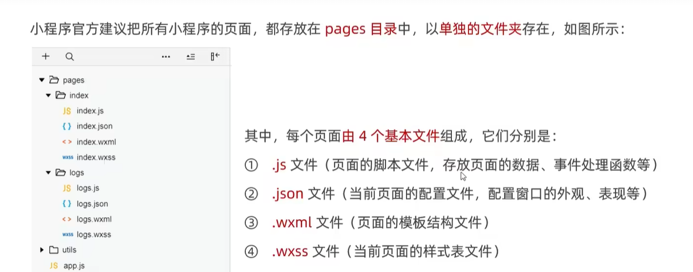

# JSON配置文件

`JSON`**是一种数据格式**，在实际开发中，JSON总是以**配置文件**的形式出现。小程序项目中也不例外:通过不同的.json配置文件，可以对小程序项目进行不同级别的配置。
小程序项目中有4种 json配置文件，分别是:

1. 项目根目录中的` app.json` 配置文件
2. 项目根目录中的 `project.config.json` 配置文件
3. 项目根目录中的`sitemap.json`配置文件
4. **每个页面文件夹中的 `.json` 配置文件**

## app.json

app.json是当前小程序的**全局配置**，包括了小程序的所有**页面路径、窗口外观、界面表现、底部 tab**等。Demo项目里边的app.json配置内容如下:

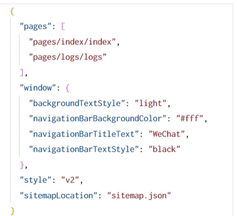

简单了解下这4个配置项的作用:

`pages`：用来记录当前小程序所有页面的路径

`window`：全局定义小程序所有页面的背景色、文字颜色等

`style`：全局定义小程序组件所使用的样式版本

`sitemapLocation`：用来指明sitemap.json的位置

## project.config.json

project.config.json是项目配置文件，用来记录我们`对小程序开发工具所做的个性化配置`，例如:

* `setting `中保存了`编译相关的配置`

* `projectname`中保存的是`项目名称`

* `appid `中保存的是`小程序的账号ID`

## sitemap.json文件

​		微信现已开放小程序内搜索，效果类似于PC网页的SEO。sitemap.json文件用来配置小程序页面是否允许微信索引。

​		当开发者允许微信索引时，微信会通过爬虫的形式，为小程序的页面内容建立索引。当用户的搜索关键字和页面的索引匹配成功的时候，小程序的页面将可能展示在搜索结果中。

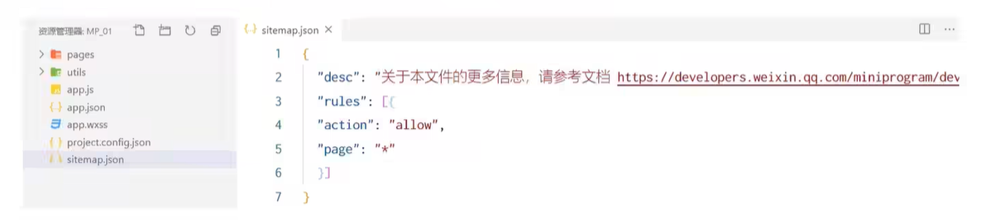

​		注意： `sitemap`的索引提示是默认开启的，如需要关闭sitemap的索引提示，可在小程序项目配置文件`project.config.json`的 `setting`中配置字段`checkSiteMap` 为`false`

## 页面的.json配置文件

​		小程序中的每一个页面，可以使用.json文件来**对本页面的窗口外观进行配置，页面中的配置项会覆盖app.json的window中相同的配置项**。

==页面配置项   >    全局配置==

## 新建小程序页面

​		只需要在 app.json -> pages中新增页面的存放路径，小程序开发者工具即可帮我们自动创建对应的页面文件

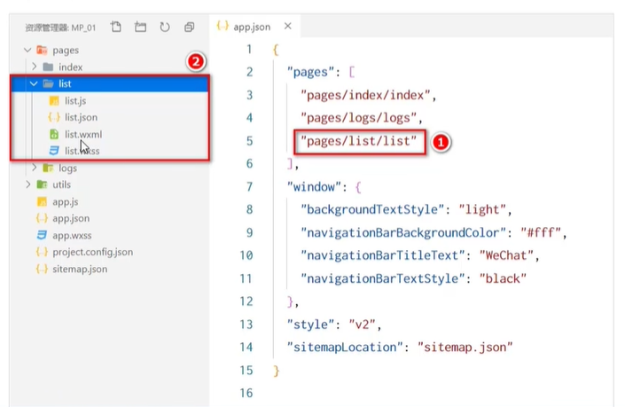

## 修改项目首页

​		只需要调整 `app.json` ->  `pages` 数组中页面路径的前后顺序，即可修改项目的首页。小程序会把排在第一位的页面，当作项目首页进行渲染，如图所示:

# WXML模板

​		WXML (WeiXin Markup Language)是小程序框架设计的一套`标签语言，用来构建小程序页面的结构`，其作用类似于网页开发中的HTML。

**WXML和HTML的区别**

1. **标签名称不同**
    * HTML ( div, span, img, a)
    * WXML ( view, text, image, navigator)
2. **属性节点不同**
    * \<a href="#">超链接</a>
    * \<navigator url=" /pages/home/home"></navigator>
3. **提供了类似于Vue中的模板语法**
    * 数据绑定
    * 列表渲染
    * 条件渲染

# WXSS

​		WXSS (Weixin Style Sheets)是一套样式语言，用于描述WXML的组件样式，类似于网页开发中的CSS,

> WXSS和CSS的区别

1. **新增了rpx尺寸单位**
    * cSS中需要手动进行像素单位换算，例如rem
    * WXSS在底层支持新的尺寸单位rpx，在不同大小的屏幕上小程序会自动进行换算
2. **提供了全局的样式和局部样式**
    * 项目根目录中的app.wxSs会作用于所有小程序页面
    * 局部页面的.wxss样式仅对当前页面生效
3. **WXSS仅支持部分CSS选择器**
    * .class和#id
    * element
    * 并集选择器、后代选择器
    * ::after和 ::before 等伪类选择器

# JS交互

​		一个项目仅仅提供界面展示是不够的，在小程序中，我们通过.js文件来处理用户的操作。例如:响应用户的点击、获取用户的位置等等。

## 分类

小程序中的JS文件分为三大类，分别是:

1. app.js
    是**整个小程序项目的入口文件**，通过调用**App()函数**来启动整个小程序
2. 页面的.js 文件
    是**页面的入口文件**，通过调用**Page()函数**来创建并运行页面
3. 普通的.js 文件
    是**普通的功能模块文件**，用来封装**公共的函数或属性**供页面使用

# 小程序的宿主环境

## 介绍

​		`宿主环境`( host environment）指的是==程序运行所必须的依赖环境==。

例如:
Android系统和iOS 系统是两个不同的宿主环境。安卓版的微信App是不能在 iOS环境下运行的所以，Android是安卓软件的宿主环境，==脱离了宿主环境的软件是没有任何意义的==!

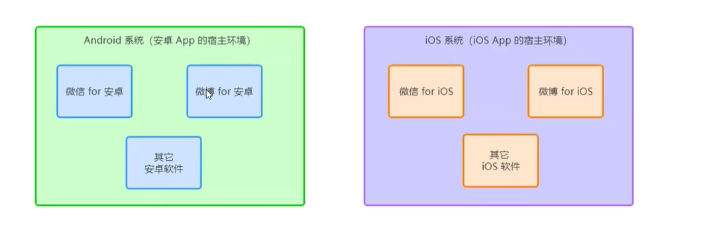

## 小程序的宿主环境

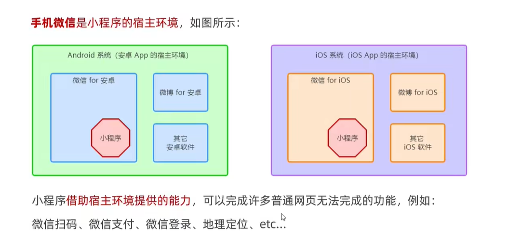)

## 小程序宿主环境包含的内容

1. 通信模型
2. 运行机制
3. 组件
4. API

### 通信模型

#### 通信主体

小程序中通信的主体是`渲染层`和`逻辑层`，其中

1. WXML模板和WXSS样式工作在渲染层
2. JS脚本工作在逻辑层

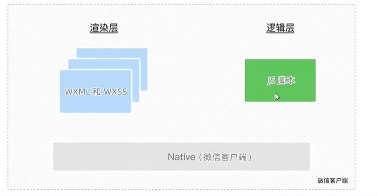

#### 通信模型

小程序中的通信模型分为两部分

①`渲染层`和`逻辑层`之间的通信

*  由微信客户端进行转发			

②`逻辑层`和`第三方服务器`之间的通信·

* 由微信客户端进行转发

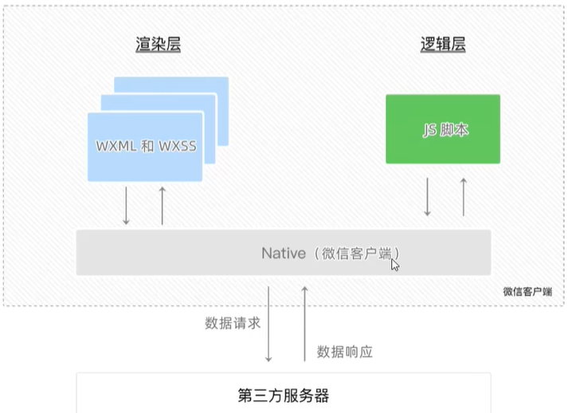

### 运行机制

#### 小程序启动过程

1. 把小程序的代码包下载到本地解析
2. app.json 全局配置文件
3. 执行 app.js 小程序入口文件，`调用App()创建小程序实例`
4. 渲染小程序首页
5. 小程序启动完成

#### 页面渲染的过程

1. 加载解析页面的.json配置文件
2. 加载页面的.wxml模板和.wxSS样式
3. 执行页面的.js 文件，`调用Page()创建页面实例`
4. 页面渲染完成

### 组件

`小程序中的组件也是由宿主环境提供的`，开发者可以基于组件快速搭建出漂亮的页面结构。官方把小程序的组件分为了9大类，分别是︰

1. **视图容器**
2. **基础内容**
3. **表单组件**
4. **导航组件**
5. 媒体组件
6. map地图组件
7. canvas画布组件
8. 开放能力
9. 无障碍访问

#### 常见的视图容器组件

1. **view**

* 普通视图区域
* 类似于HTML中的div，是一个块级元素常用来实现页面的布局效果

2. **scroll-view**

* 可滚动的视图区域
* 常用来实现滚动列表效果

3. **swiper和swiper-item**

* 轮播图容器组件和轮播图item组件

##### View组件的基本使用

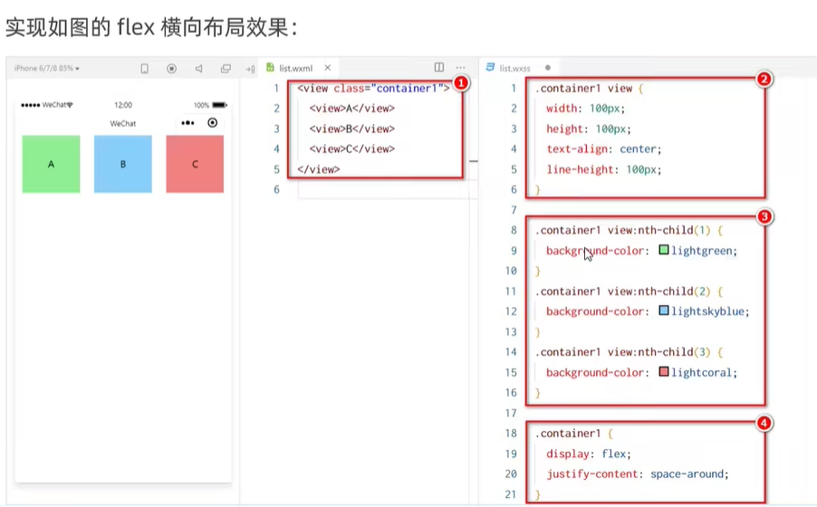

将 `view` 当成 `div` 使用即可

##### scroll-view基本使用

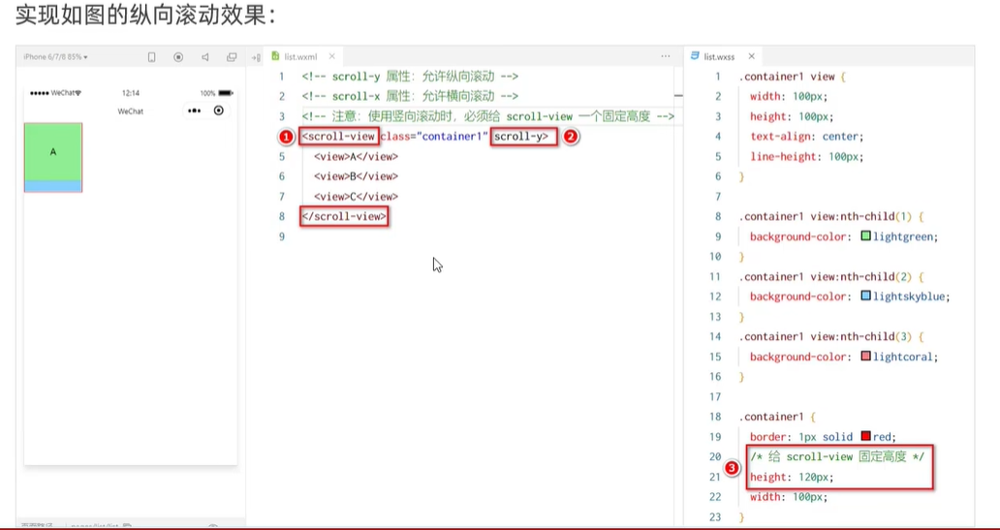

纵向滚动：要加一个强制性的高度

横向滚动：要加一个强制性的宽度

##### swiper和swiper-item的基本使用

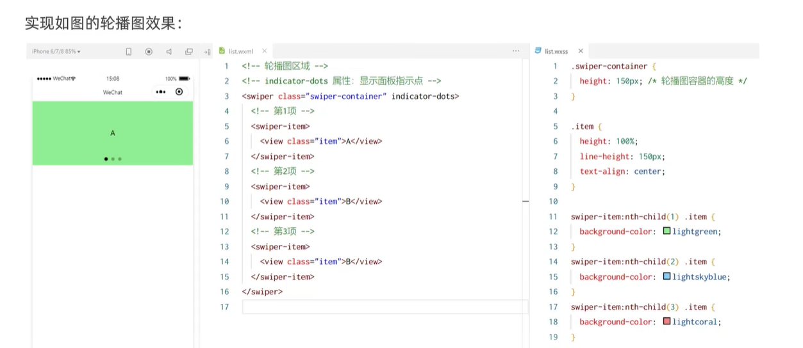

##### swiper常用属性

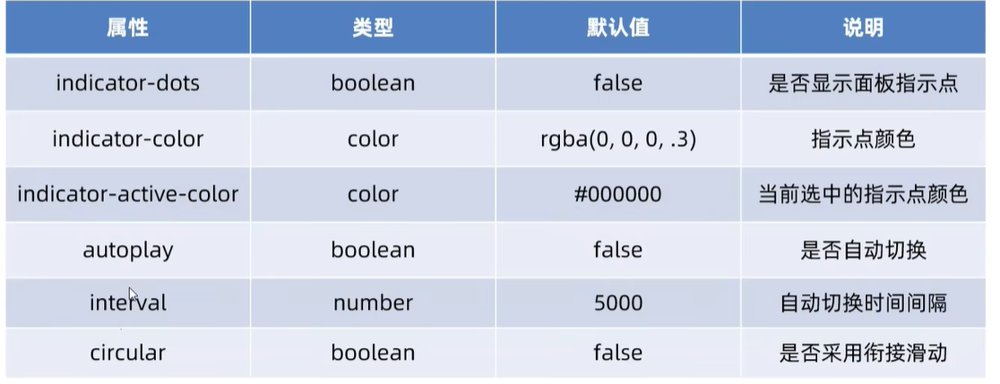

#### 常见的文本内容组件

1. text
    * 文本组件
    * 类似于HTML 中的span标签，是一个行内元素
2. rich-text
    * 富文本组件
    * 支持把HTML字符串渲染为WXML结构

##### text基本使用

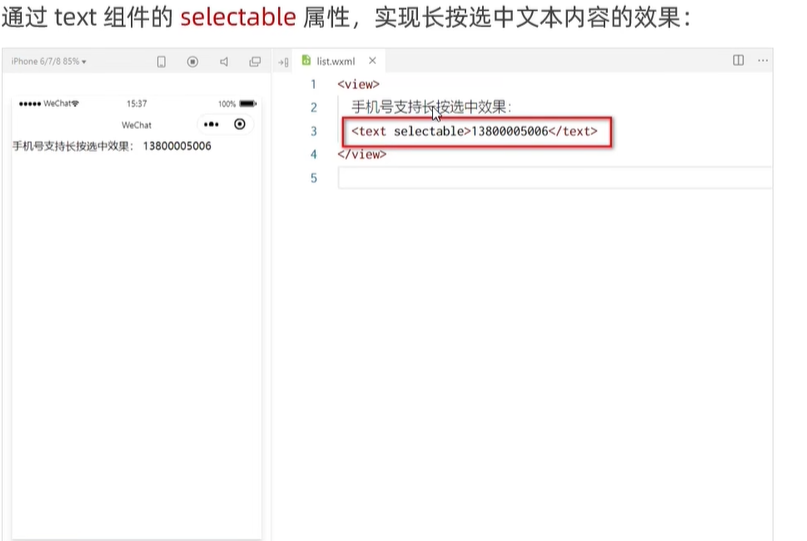

##### rich-text基本使用

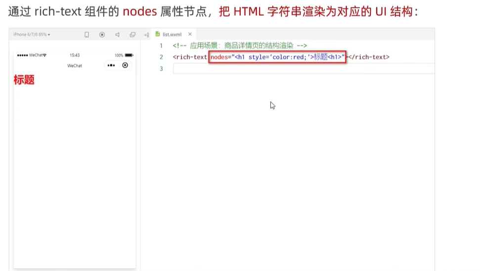

#### 其他组件

1. **button**
    * 按钮组件
    * 功能比 HTML中的button按钮丰富
    * 通过open-type属性可以调用微信提供的各种功能（客服、转发、获取用户授权、获取用户信息等)
2. **image**
    * 图片组件
    * image 组件默认宽度约300px、高度约240px
3. **navigator (后面课程会专门讲解)**
    * 页面导航组件
    * 类似于HTML中的a链接

##### button基本使用

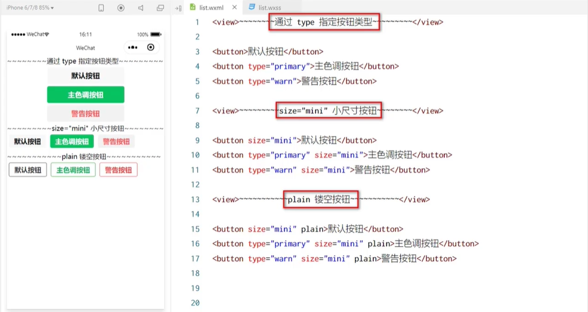

##### image组件基本使用

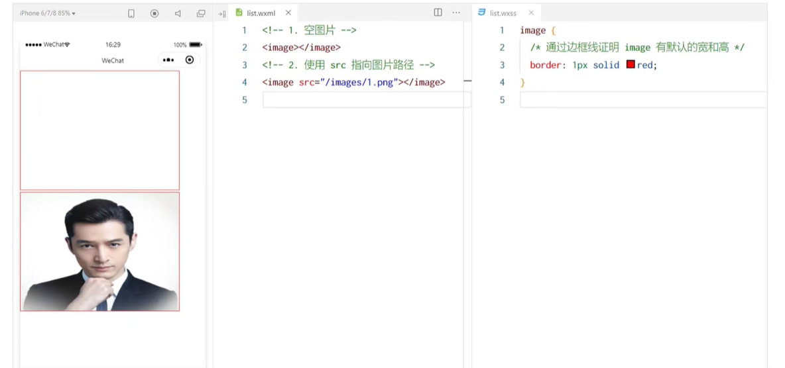

属性：

1. `mode` 属性：

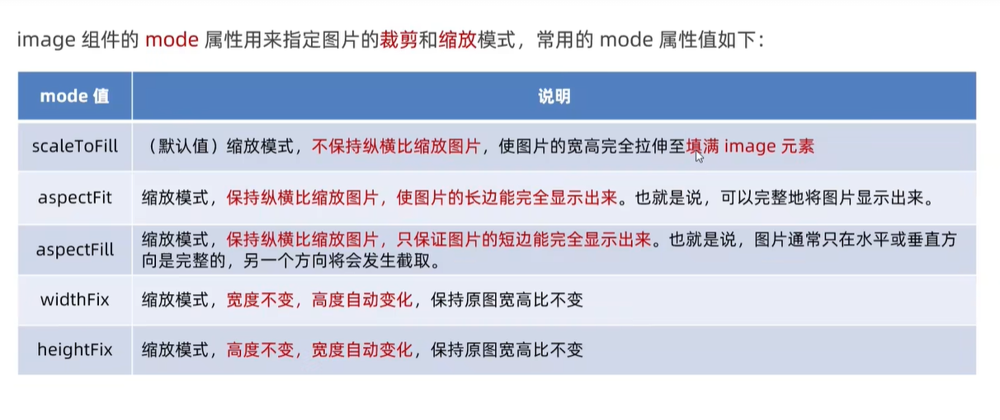

### API

​		==小程序中的API是由宿主环境提供的==，通过这些丰富的小程序API，开发者可以方便的调用微信提供的能力，例如:获取用户信息、本地存储、支付功能等。

他主要分为3大类：

1. **事件监听API**
    * 特点:以`on`开头，用来`监听某些事件的触发`
    * 举例: wx.`onWindowResize`(function callback)监听窗口尺寸变化的事件
2. **同步API**
    * 特点1∶以 `Sync `结尾的API都是同步API
    * 特点2:同步API的执行结果，可以通过函数返回值直接获取，如果执行出错会抛出异常
    * 举例: wx.`setStorageSync`('key', 'value')向本地存储中写入内容
3. **异步API**
    * 特点:类似于jQuery中的`$.ajax(options)`函数，需要通过success、fail、complete接收调用的结果
    * 举例: wx.`request`()发起网络数据请求，通过success回调函数接收数据

# 小程序的协同工作

​		在中大型的公司里，人员的分工非常仔细:同一个小程序项目，一般会有不同岗位、不同角色的员工同时参与设计与开发。
​		此时出于管理需要，我们迫切需要对==不同岗位、不同角色的员工的权限进行边界的划分==，使他们能够高效的进行协同工作。

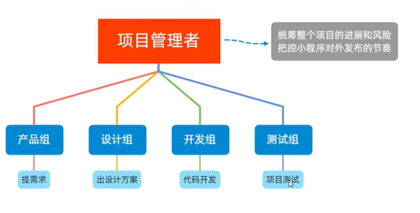

**开发流程**

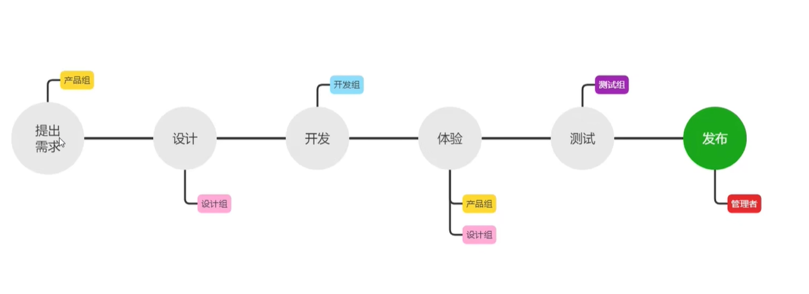

## 小程序成员管理

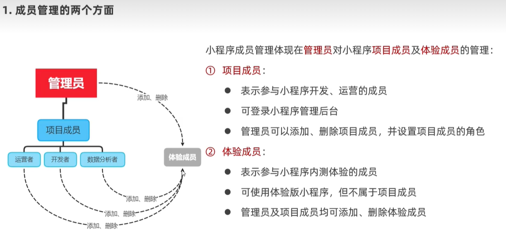

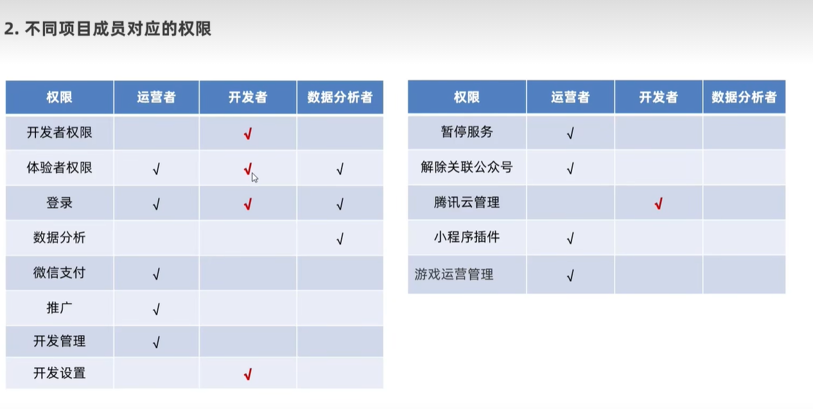

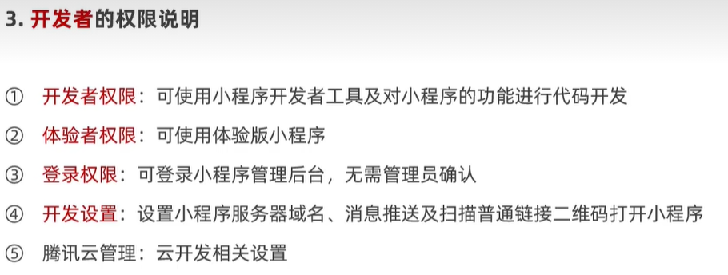

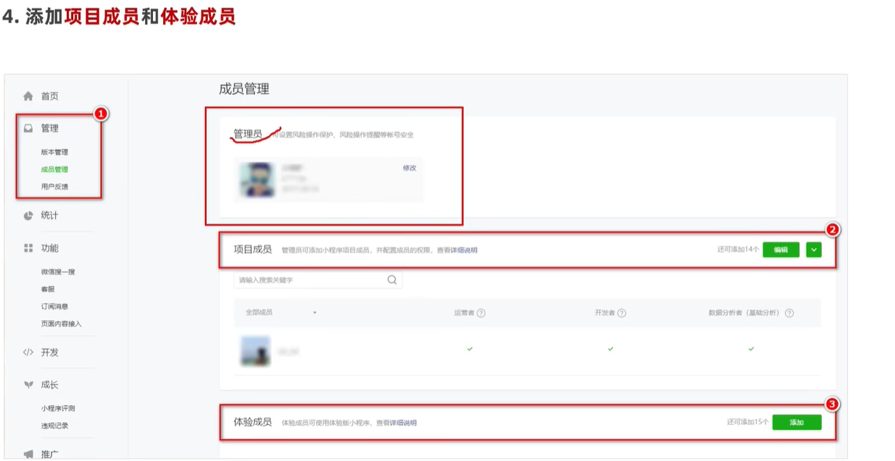

## 小程序的版本控制

### 软件开发过程中的不同版本

在软件开发过程中，根据时间节点的不同，会产出不同的软件版本，例如:

1. 开发者编写代码的同时，对项目代码进行自测（**开发版本**)
2. 直到程序达到一个稳定可体验的状态时，开发者把体验版本给到产品经理和测试人员进行**体验测试**

3. 最后修复完程序的 Bug后，**发布正式版**供外部用户使用

### 小程序版本

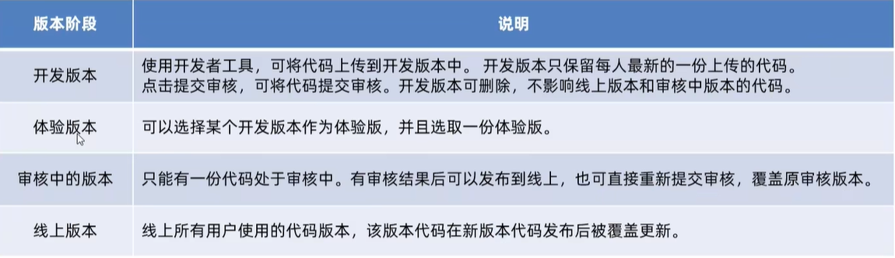

## 小程序协同和发布上线

主要有三大步：上传代码、提交审核、发布

### 上传代码

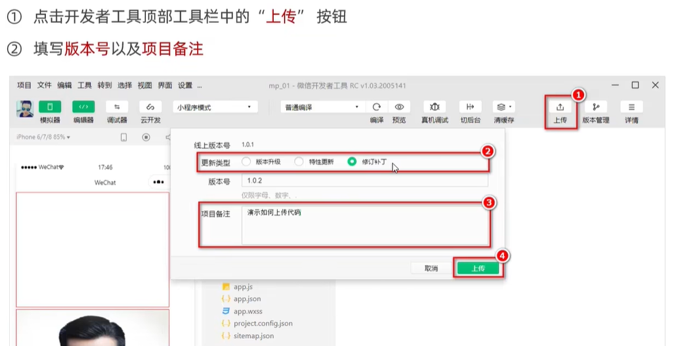

在后台查看上传之后的版本

`登录小程序管理后台`→>`管理`→>`版本管理`->`开发版本`，即可查看刚才提交上传的版本了:

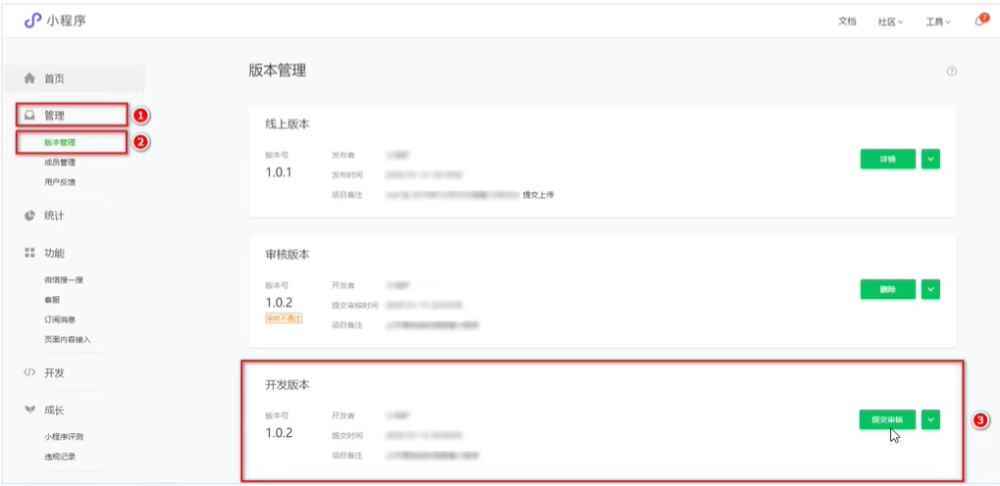

### 提交审核

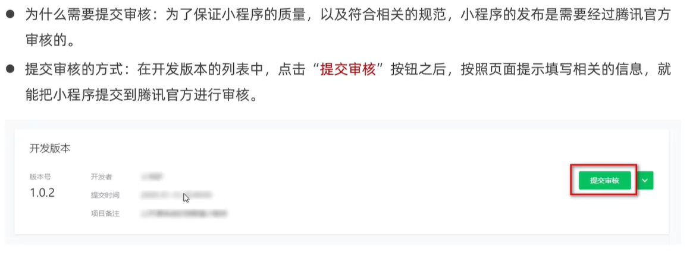

### 发布

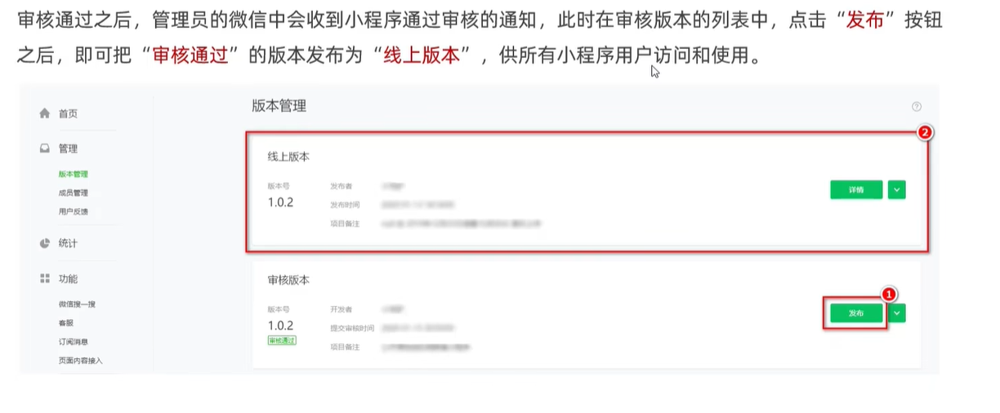

### 基于小程序码进行推广

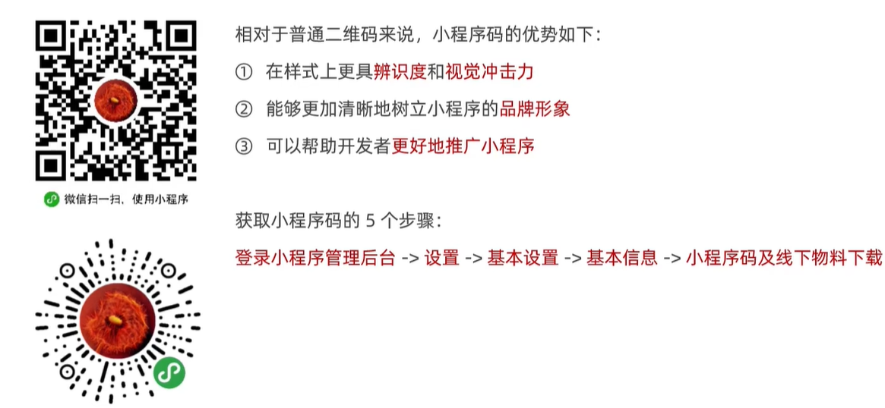

### 运营数据

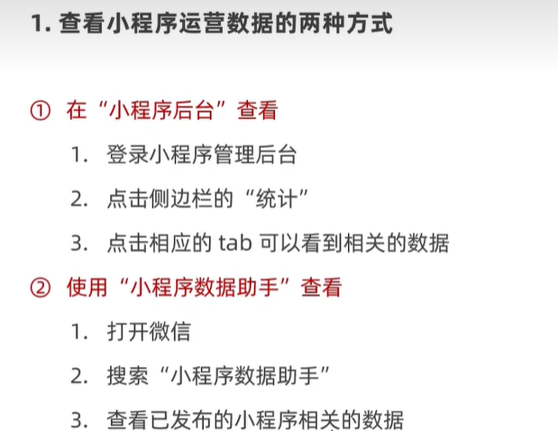

# 总结

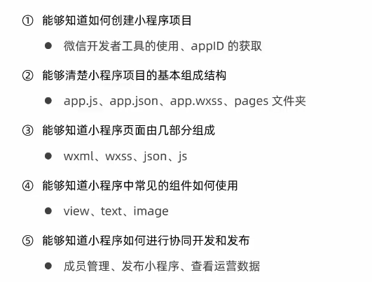

