# 目标

* 能够使用WXML模板语法渲染页面结构
* 能够使用wXSS样式美化页面结构
* 能够使用app.json对小程序进行全局性配置
* 能够使用page.json对小程序页面进行个性化配置
* 能够知道如何发起网络数据请求


# WXML模板语法

## 数据绑定

**数据绑定的基本原则**

1. 在data中定义数据
2. 在WXML中使用数据

在页面对应的.js 文件中，把数据定义到data对象中即可:

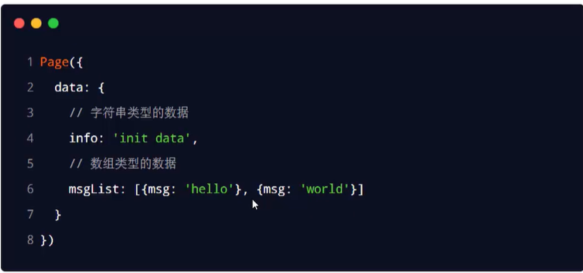


### Mustache语法的格式

把data中的数据绑定到页面中渲染，使用Mustache语法（**双大括号**）将变量包起来即可。语法格式为︰

```js
<view>{{你要绑定的数据}}</view>
```


### Mustache语法的应用场景

Mustache语法的主要应用场景如下:

* 绑定内容
* 绑定属性
* 运算（三元运算、算术运算等)

**动态绑定内容：**

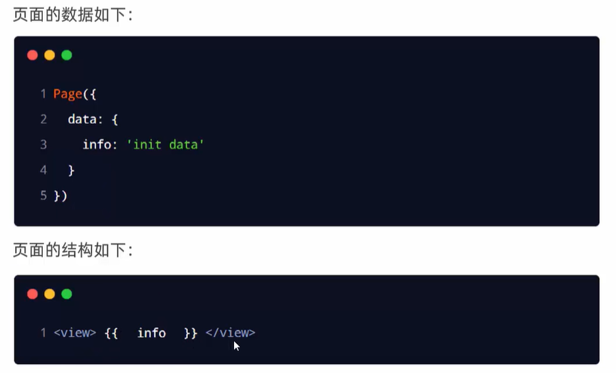


**动态绑定属性：**

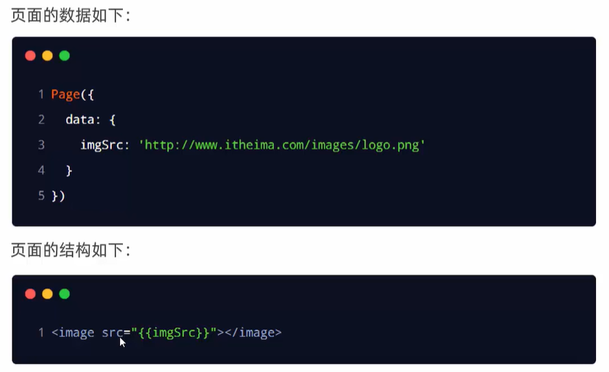


**运算：**

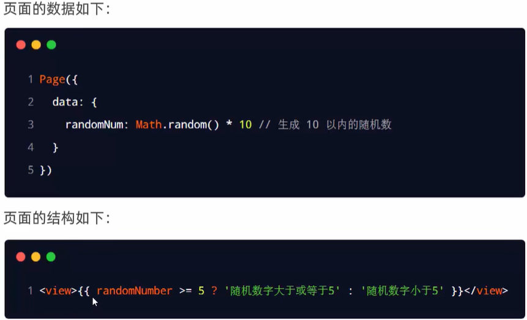


**算数运算：**

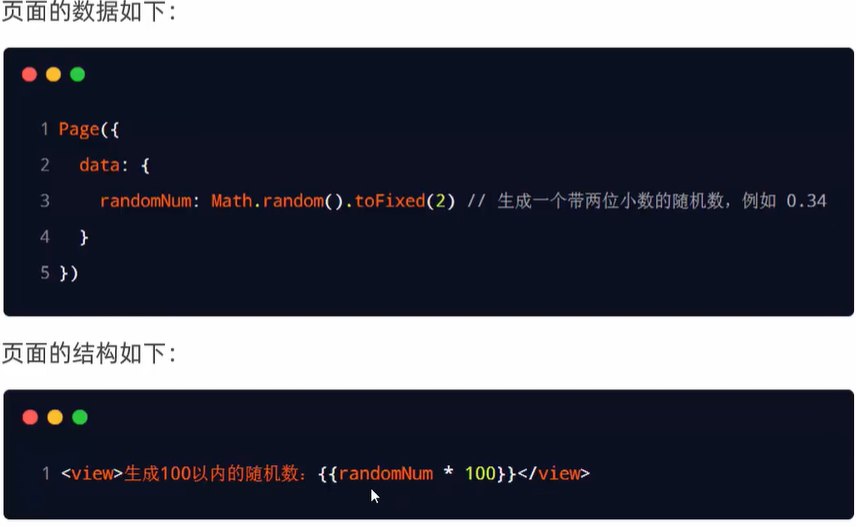


## 事件绑定

​		事件是`渲染层到逻辑层的通讯方式`。通过事件可以将用户在渲染层产生的行为，反馈到逻辑层进行业务的处理。

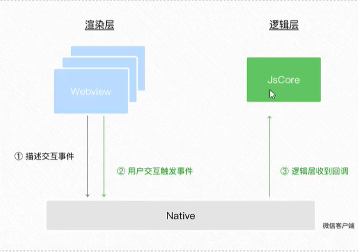


### 常见事件

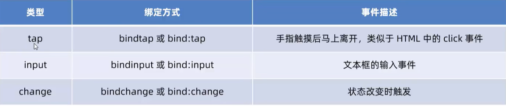


### 事件对象的属性列表

当事件回调触发的时候，会收到一个事件对象event，它的详细属性如下表所示:

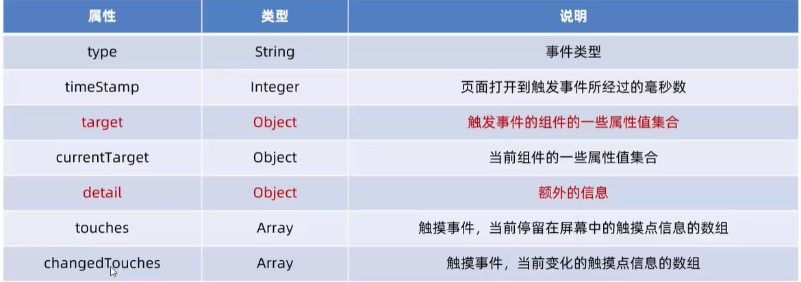


### target和currentTarget的区别

`target`是`触发该事件的源头组件`，而`currentTarget`则是`当前事件所绑定的组件`。举例如下:

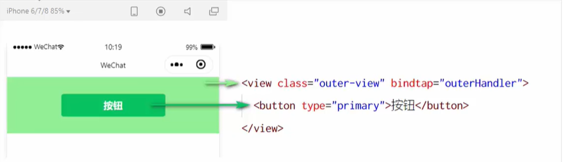


点击内部的按钮时，点击事件以`冒泡`的方式向外扩散，也会触发外层view 的tap事件处理函数。此时，对于外层的view来说:

* e.target指向的是触发事件的源头组件，因此**e.target是内部的按钮组件**

* e.currentTarget指向的是当前正在触发事件的那个组件，因此**e.currentTarget 是当前的view组件**

### bindtap语法格式

在小程序中，不存在HTML中的onclick鼠标点击事件，而是通过`tap事件`来响应用户的触摸行为。

1. 通过`bindtap`，可以为组件绑定tap 触摸事件，语法如下:

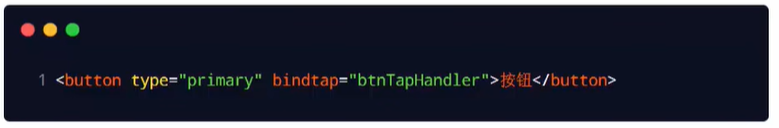


1. 在页面的.js文件中定义对应的事件处理函数，事件参数通过形参`event`(一般**简写成e**)来接收;

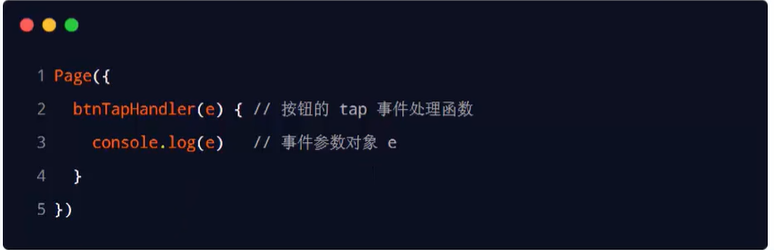


### 在事件处理函数中为data中的数据赋值

通过调用`this.setData(dataObject)`方法，可以给页面data中的数据重新赋值，示例如下:

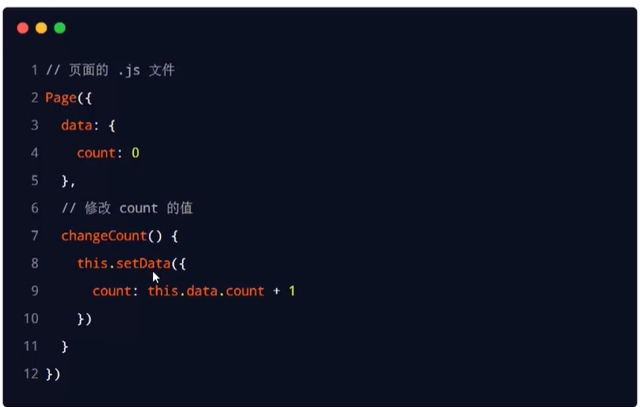


### 事件传参

​		小程序中的事件传参比较特殊，**不能在绑定事件的同时为事件处理函数传递参数**。例如，下面的代码将不能正常工作:

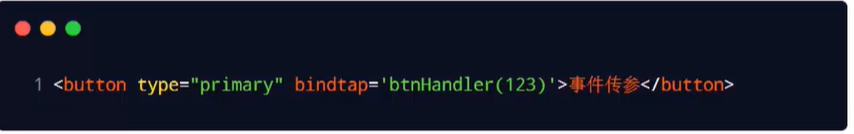


​		因为小程序会把 bindtap的属性值，统一当作事件名称来处理，相当于要调用一个名称为` btnHandler(123)`的事件处理函数。


​	可以为组件提供`data-\*`自定义属性传参，其中`*代表的是参数的名字`，示例代码如下:

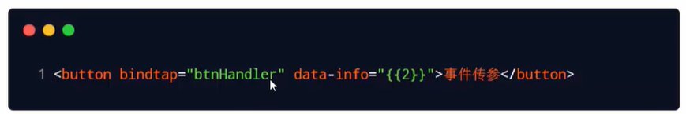


最终:

* `info `会被解析为`参数的名字`
* 数值`2`会被解析为`参数的值`


在事件处理函数中，通过`event.target.dataset.参数名`即可获取到`具体参数的值`，示例代码如下:

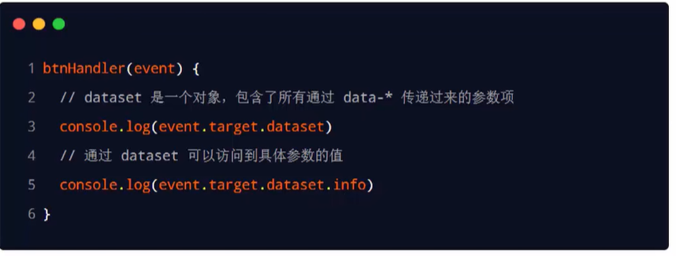


### bindinput的语法格式

​		在小程序中，通过`input`事件来响应文本框的输入事件，语法格式如下:通过bindinput，可以为文本框绑定输入事件:

1. 通过bindinput,可以为文本框绑定输入事件:

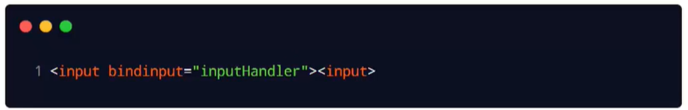


2. 在页面的.js 文件中定义事件处理函数:

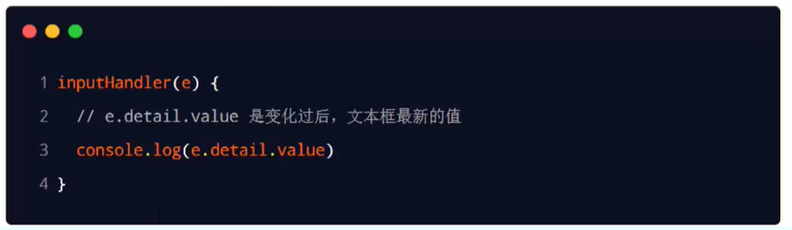


### 实现文本框和data之间的数据同步

实现步骤:

#### 1、定义数据

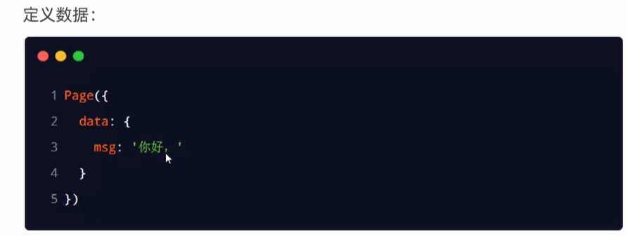


#### 2、渲染结构

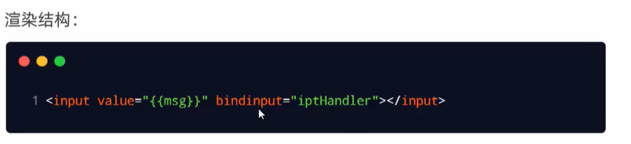


#### 3、美化样式

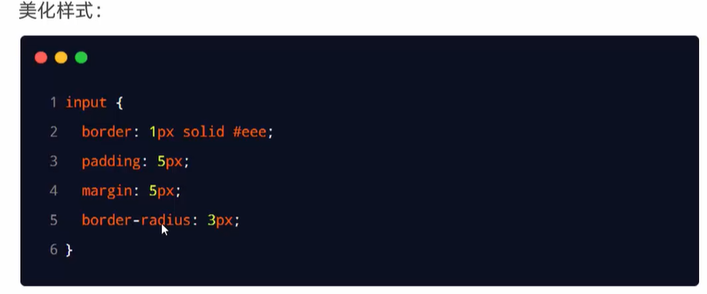


#### 4、绑定input事件处理函数

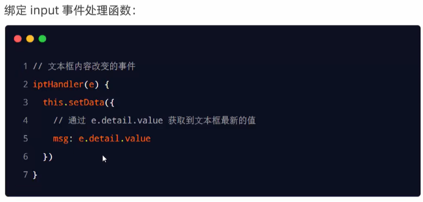


## 条件渲染

### wx:if

在下程序中，使用 `wx:if="{{condition}}"` 来判断是否需要渲染改代码块

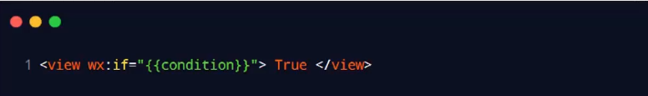


也可以用 `wx:elif` 和 `wx:else` 来添加else 判断：

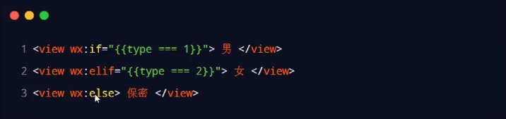


### 结合block

如果要==一次性控制多个组件的展示与隐藏==，可以使用一个\<block\>\</block\>标签将多个组件包装起来，并在\<block\>标签上使用 `wx:if ` 控制属性，示例如下:

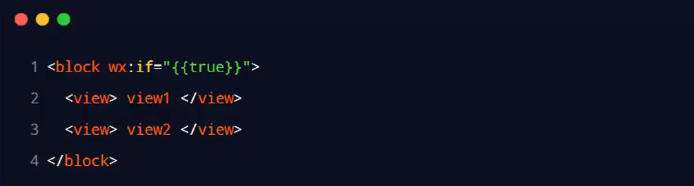


**注意**: \<block\>**并不是一个组件**，==它只是一个包裹性质的容器==，**不会在页面中做任何渲染**。


### hidden

​	隐藏，在小程序中，直接使用`hidden="{[ condition }}"`也能控制元素的显示与隐藏:

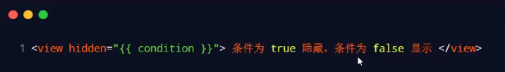


### wx:if 和 hidden 对比

1. 运行方式不同
    * wx:if以==**动态创建和移除元素**==的方式，控制元素的展示与隐藏
    * hidden以==**切换样式**==的方式（(display: none/block; )，控制元素的显示与隐藏

2. 使用建议
    * **==频繁切换==**时，建议使用**hidden**
    * **==控制条件复杂==**时，建议使用wx:if 搭配 wx:elif、wx:else进行展示与隐藏的切换


## 列表渲染

### wx:for

通过wx:for可以根据指定的数组，循环渲染重复的组件结构，语法示例如下:

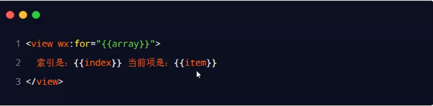


默认情况下，当前循环项的`索引`用`index`表示;当前`循环项`用`item`表示。


### 手动指定索引和当前项的变量名

* 使用**wx:for-index**可以指定**当前循环项**的`索引的变量名`
* 使用**wx:for-item**可以指定**当前项**的`变量名`

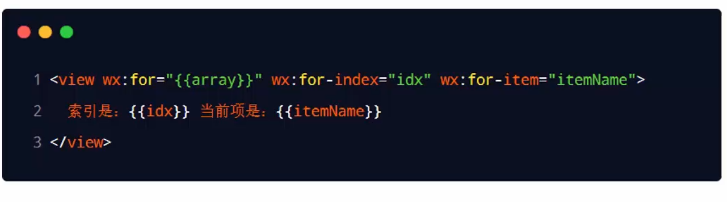


### wx:key的使用

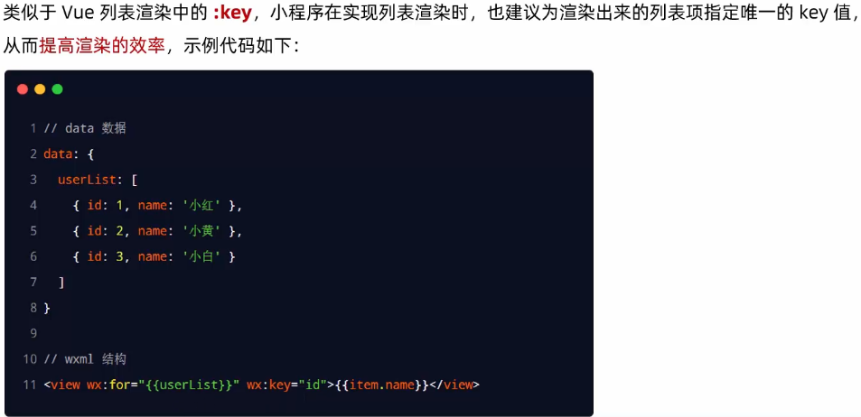


**注意** ：相当于添加指定索引，比如 id


# WXSS 模板样式

## 简介

1. 什么是 WXSS
    wxss (Weixin Style Sheets)是一套样式语言，用于美化WXML的组件样式，类似于网页开发中的CSS。
2. WXSS 和CSS的关系
    WXSS具有CSS大部分特性，同时，WXSS还对CSS进行了扩充以及修改，以适应微信小程序的开发。与CSS相比，WXSS扩展的特性有:
    * `rpx`尺寸单位
    * `@import`样式导入

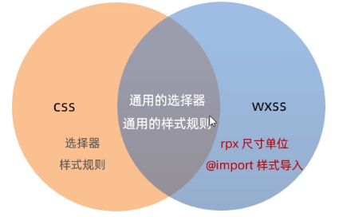


## rpx

rpx ( responsive pixel）是微信小程序独有的，用来`解决屏适配的尺寸单位`。

### 原理

rpx的实现原理非常简单:鉴于不同设备屏幕的大小不同，为了实现屏幕的自动适配，rpx把**所有设备**的屏幕，`在宽度上等分为750份`（即:`当前屏幕的总宽度为750rpx`) 。

* 在`较小`的设备上，`1rpx所代表的宽度较小`

* 在`较大`的设备上，`1rpx所代表的宽度较大`

看人下菜

小程序在不同设备上运行的时候，会自动把 rpx的样式单位换算成对应的像素单位来渲染，从而实现屏幕适配。

### rpx 和 px 之间的单位换算

在iPhone6上，屏幕宽度为**375px**，共有**750个物理像素**，等分为**750rpx**。则:

**750rpx = 375px = 750物理像素**
**1rpx = 0.5px =1物理像素**

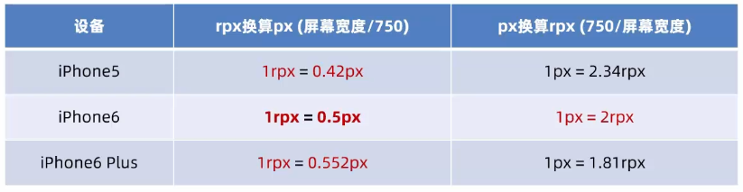


**官方建议**:开发微信小程序时，设计师可以用**iPhone6**作为视觉稿的标准。(**iPhone 换算结果是整数**)


## 样式导入

使用WXSS提供的@import语法，可以导入外联的样式表。

### @import的语法格式

@import后跟需要导入的外联样式表的相对路径，用;表示语句结束。示例如下:

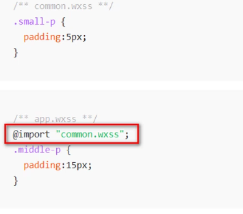


## 全局样式和局部样式

全局样式在 app.wxss

局部样式在自己最近的 xxxx.wxss


样式的优先级：**就近原则 ，其次看权重**


# 全局配置

小程序根目录下的`app.json`文件是小程序的`全局配置文件`。常用的配置项如下:

1. `pages`

    记录当前小程序所有页面的存放路径

2. `window`
    全局设置小程序窗口的外观

3. `tabBar`
    设置小程序底部的tabBar效果

4. `style`
    是否启用新版的组件样式

## 小程序窗口的组成部分

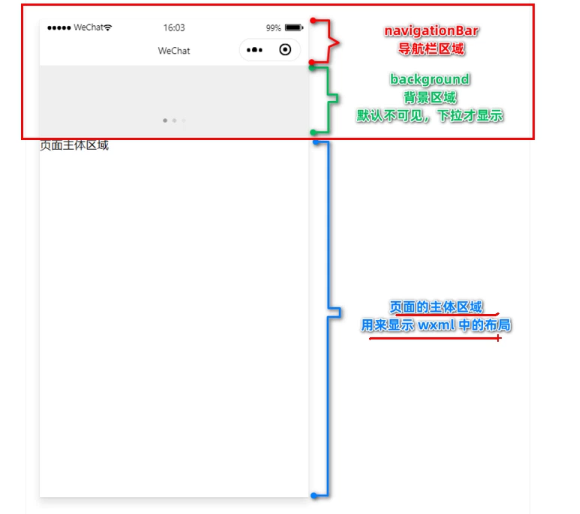


## Windows

### 了解 Window 结点常用的配置项

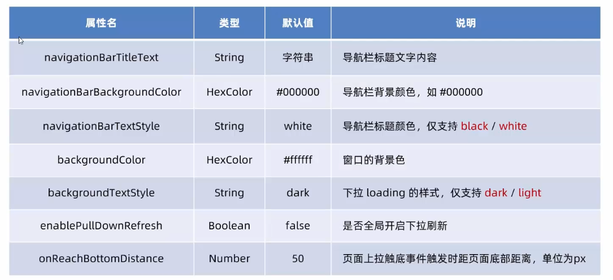


### 设置导航栏的标题

设置步骤： `app.json` -> `window` ->`` navigationBarTitleTex`

需求：把导航条上的标题，从默认的“WeChat”修改为“黑马程序员”，效果如图所示:

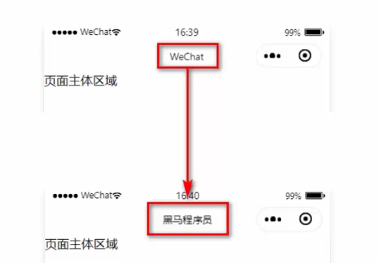


### 设置导航栏的背景色

设置步骤： `app.json` -> `window `-> `navigationBarBackgroundColor`

需求：把导航栏标题的背景色，从默认的 `#fff` 修改为 `#2b4b6b ` (**仅支持HEX格式**)，

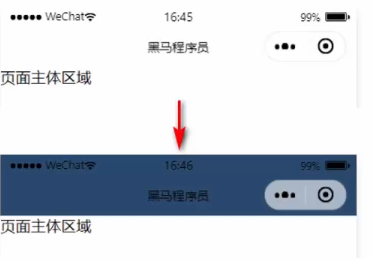


### 设置导航栏的标题颜色

设置步骤： `app.json` -> `window `-> `navigationBarTextStyle`

需求：把导航条上的标题，从默认的 `black`修改为`white`，效果如图所示:

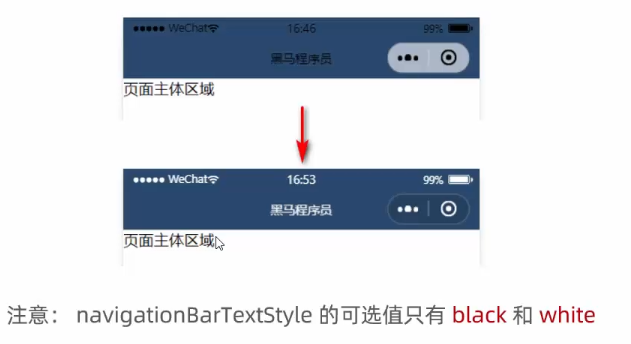


### 全局开启下拉刷新

概念：下拉刷新是移动端的专有名词，指的是通过手指在屏幕上的下拉滑动操作，从而`重新加载页面数据`的行为。

设置步骤：` app.json` -> `window `->把`enablePullDownRefresh `的值设置为`true` 。


**注意:**在app.json中启用下拉刷新功能，**会作用于每个小程序页面**!


### 设置下拉刷新时窗口的背景色

当全局开启下拉刷新功能之后，默认的窗口背景为白色。如果自定义下拉刷新窗口背景色，设置步骤为：`app.json `-> `window `->为`backgroundColor`**指定16进制的颜色值，例如：#efefef**。效果如下:

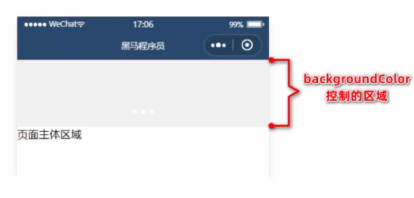


### 设置下拉刷新是 loading 样式

当全局开启下拉刷新功能之后，默认窗口的loading样式为白色，如果要更改loading 样式的效果。

设置步骤为：`app.json` -> `window `->为`backgroundTextStyle`指定`dark`值。效果如下:

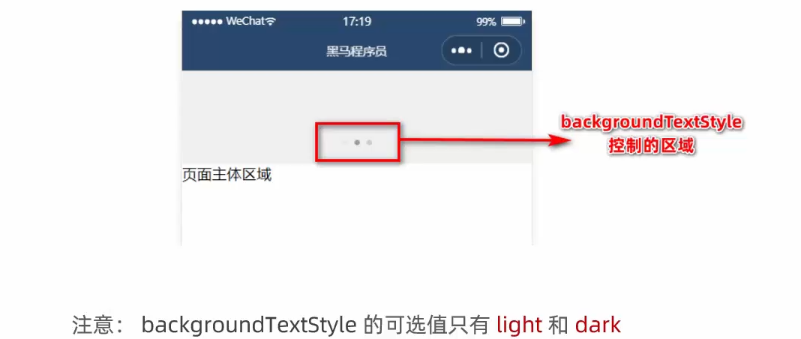


### 设置上拉触底的距离

概念:`上拉触底`是移动端的专有名词，通过手指在屏幕上的上拉滑动操作，从而`加载更多数据`的行为。

设置步骤:` app.json `-> `window `->为`onReachBottomDistance`设置新的数值


**注意**：**默认距离为`50px`**，如果没有特殊需求，建议使用默认值即可。


## tabBar

tabBar是移动端应用常见的页面效果，用于`实现多页面的快速切换`。小程序中通常将其分为:

* 底部 tabBar
* 顶部 tabBar

注意:

* tabBar中只能配置`最少2个、最多5个`tab页签
* 当渲染`顶部 tabBar`时，`不显示icon`，只显示文本

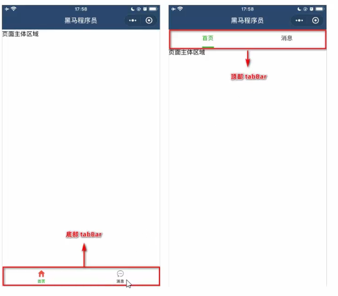


### tabBar的6个组成部分

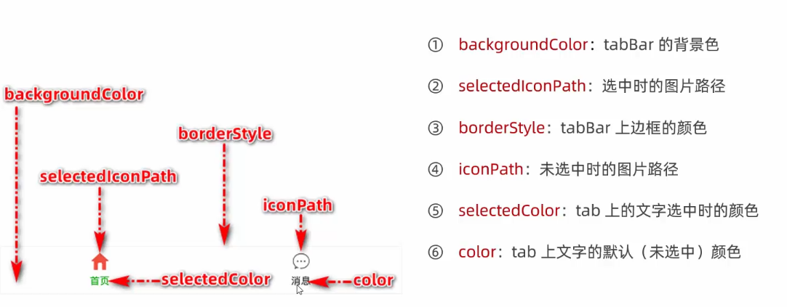


### tabBar结点的配置项

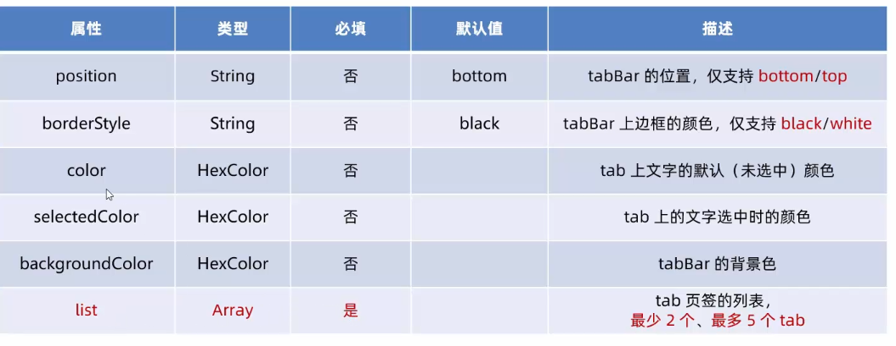


### 每个tab想的配置选项

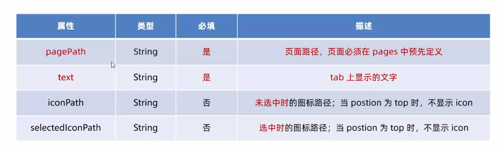


### 案例

1. 需求描述

    根据资料中提供的小图标、在小程序中配置如图所示的tabBar效果:

    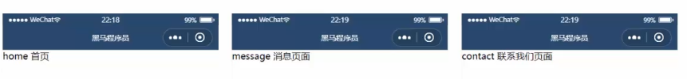

2. 实现步骤

    :one:拷贝图标资源

    :two:新建3个对应的tab页面

    :three:配置tabBar选项

3. 步骤一

    :one:把资料目录中的`images`文件夹，**拷贝到小程序项目根目录中**
    :two:将需要用到的小图标分为3组，每组两个，其中:

    * 图片名称中`包含-active`的是`选中之后的图标`
    * 图片名称中`不包含-active`的是`默认图标`

    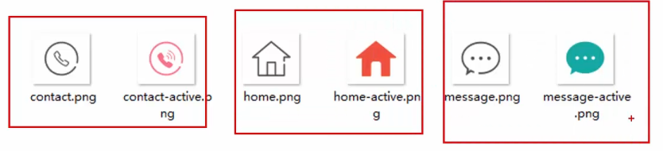

4. 步骤二

    通过app.json文件的pages节点，快速新建3个对应的tab页面，示例代码如下:

    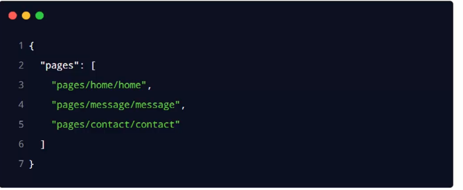

    其中，`home`是首页，`message`是消息页面，`contact`是联系我们页面。

    **注意：** tabBar页面都要要放在`pages` 最前面。

5. 步骤三

    打开`app.json` 配置文件，和pages、window平级，新增`tabBar`节点，tabBar节点中，新增`list`数组，这个数组中存放的，是每个tab 项的配置对象在list数组中，`新增每一个tab项的配置对象`。对象中包含的属性如下:

    * `pagePath `指定当前tab对应的页面路径【**`必填`**】
    * `text `指定当前tab上按钮的文字【**`必填`**】
    * `iconPath `指定当前tab未选中时候的图片路径【可选】
    * `selectedlconPath `指定当前tab 被选中后高亮的图片路径【可选】


# 页面配置

小程序中，每个页面都有自己的.json配置文件，用来对**当前页面**的窗口外观、页面效果等进行配置。

## 页面配置和全局配置的关系

小程序中，`app.json` 中的`window`节点，可以全局配置小程序中每个页面的窗口表现。

如果**某些小程序页面想要拥有特殊的窗口表现**，此时，“`页面级别的.json配置文件`”就可以实现这种需求。


**注意**：当页面配置与全局配置冲突时，根据**就近原则**，最终的效果以页面配置为准。


## 页面常见配置项

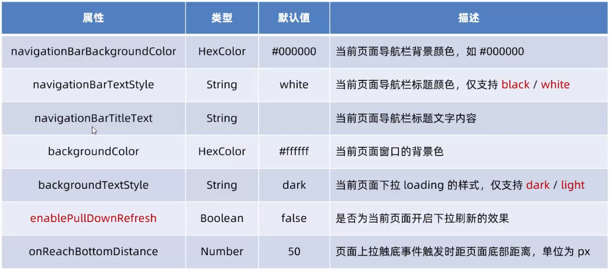


# 网络数据请求

## 小程序中网络数据请求的限制

出于`安全性`方面的考虑，小程序官方对`数据接口的请求`做出了如下两个限制:

1. 只能请求`HTTPS`类型的接口
2. 必须将`接口的域名`**添加到**`信任列表`中

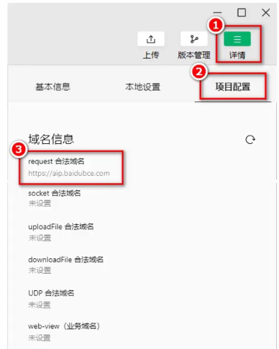


## 配置 request合法域名

需求描述：假设在自己的微信小程序中，希望请求https://www.escook.cn/域名下的接口

配置步骤：`登录微信小程序管理后台`->`开发`→`开发设置`→>`服务器域名`->``修改request合法域名``


注意事项:

1. 域名只支持https协议
2. 域名不能使用IP地址或 localhost
3. 域名必须经过ICP备案
4. 服务器域名一个月内最多可申请5次修改


## 发起Get请求

调用微信小程序提供的 `wx.request()`方法，可以发起GET数据请求，示例代码如下:

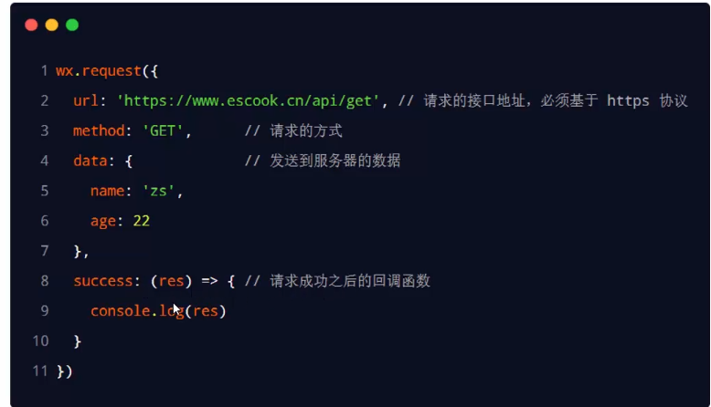


## 发起Post请求

调用微信小程序提供的 `wx.request()`方法，可以发起GET数据请求，示例代码如下:

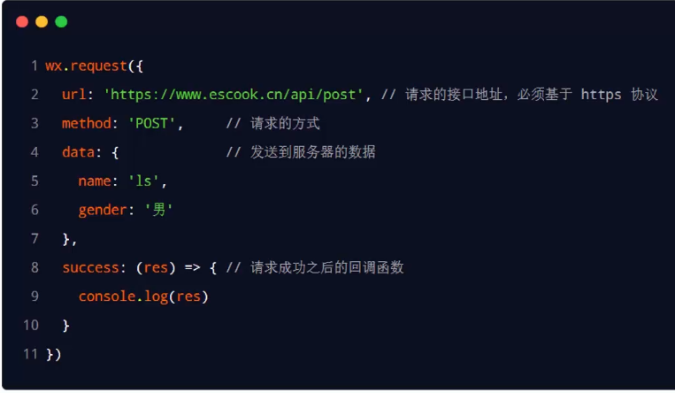


## 在页面刚加载时请求数据

在很多情况下，我们需要在**页面刚加载的时候，自动请求一些初始化的数据**。此时需要在页面的`onLoad`**事件**中调用获取数据的函数，示例代码如下:

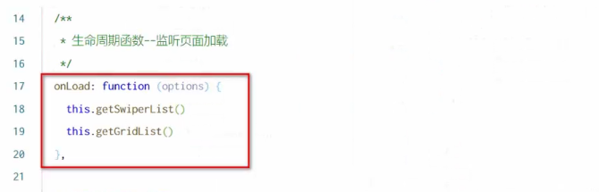


## 跳过reques合法域名校验

如果后端程序员**仅仅提供了http协议的接口、暂时没有提供 https协议的接口**。
此时为了不耽误开发的进度，我们可以在微信开发者工具中，临时开启「`开发环境不校验请求域名、TLS版本及 HTTPS证书`」选项，跳过request合法域名的校验。

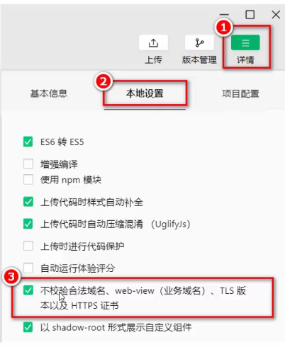


**注意：** 仅在开发时候使用，在正式发布的时候，微信的要求是必须https，所以要关了。


## 关于跨域和Ajax的说明

跨域问题**只存在于**`基于浏览器的Web开发中`。由于**小程序的宿主环境**不是浏览器，而是**微信客户端**，所以`小程序中不存在跨域的问题`。


Ajax技术的核心是依赖于浏览器中的XMLHttpRequest这个对象，由于`小程序的宿主环境是微信客户端`，所以小程序中**不能叫做**“发起Ajax请求”，而是叫做“`发起网络数据请求`”。


# 总结

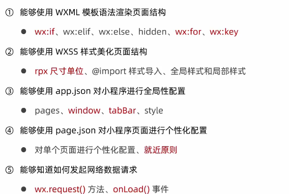


