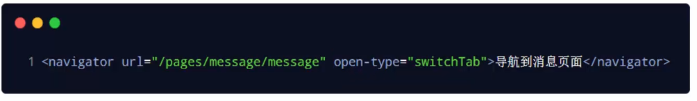
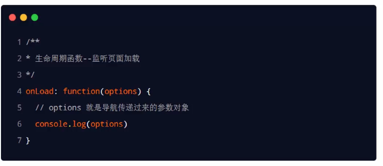

# 目标

* 能够知道如何实现页面之间的导航跳转
* 能够知道如何实现下拉刷新效果
* 能够知道如何实现上拉加载更多效果
* 能够知道小程序中常上的望带周期函数

# 页面导航

页面导航指的是`页面之间的相互跳转`。例如，浏览器中实现页面导航的方式有如下两种:

* \<a>链接
* location.href

## 小程序中实现页面导航的两种方式

* `声明式导航`
    1. 在页面上声明一个\<navigator>导航组件
    2. 通过点击\<navigator>组件实现页面跳转
* `编程式导航`
    调用小程序的导航APl，实现页面的跳转

## 声明式导航

### 导航到tabBar页面

`tabBar页面`指的是被配置为tabBar 的页面。
**注意：**在使用\<navigator>组件跳转到指定的tabBar页面时，需要指定`url`属性和`open-type`属性，其中:

* url表示要跳转的`页面的地址`，必须以 `/` 开头
* open-type表示`跳转的方式`，必须为`switchTab`

### 导航到非tabBar页面

`非tabBar页面`指的是没有被配置为tabBar的页面。
在使用\<navigator>组件跳转到普通的非 tabBar页面时，则需要指定`url`属性和`open-type`属性，其中

* url表示要跳转的`页面的地址`，必须以`/`开头
* open-type表示`跳转的方式`，必须为`navigate`

**注意：** 导航到非tabBar页面，open-type可以省略

### 后退导航

如果要后退到上一页面或多级页面，则需要指定`open-type`属性和`delta`属性，其中:

* `open-type`的值必须是`navigateBack`，表示要进行后退导航
* `delta`的值必须是`数字`，表示要后退的层级

**注意:**为了简便，如果**只是后退到上一页面**，则**可以省略delta属性**，因为其默认值就是1。

## 导航传参

### 声明式导航传参

navigator组件的url属性用来指定将要跳转到的页面的路径。同时，`路径的后面还可以携带参数`:

* `参数`与`路径`之间使用 `?` 分隔
* `参数键`与`参数值`用 `=` 相连
* `不同参数`用 `&` 分隔

### 编程式导航传参

调用`wx.navigateTo`(Object object)方法跳转页面时，也可以携带参数，代码示例如下:

### 在onLoad中接收导航参数

通过`声明式导航传参`或`编程式导航传参`所携带的参数，可以直接在`onLoad`事件中直接获取到

# 页面事件

## 下拉刷新

下拉刷新是移动端的专有名词，指的是通过手指在屏幕上的下拉滑动操作，从而**重新加载页面数据**的行为。

### 开启下拉刷新

启用下拉刷新有两种方式:

* **全局开启下拉刷新**
    在app.json的 window节点中，将`enablePullDownRefresh `设置为`true`

* **局部开启下拉刷新**
    在页面的.json配置文件中，将`enablePullDownRefresh `设置为`true`

在实际开发中，**推荐使用第2种方式**，为需要的页面**单独开启下拉刷新**的效果。

### 配置下拉刷新窗口的样式

在全局或页面的.json配置文件中，通过`backgroundColor`和 `backgroundTextStyle`来配置下拉刷新窗口的样式，其中:

* `backgroundColor `用来配置下拉刷新`窗口的背景颜色`，**仅支持16进制的颜色值**

* `backgroundTextStyle `用来配置下拉刷新`loading 的样式`，**仅支持dark和light**

### 监听页面的下拉刷新事件

在页面的.js文件中，通过`onPullDownRefresh()`函数即可监听当前页面的下拉刷新事件。

### 停止下拉刷新效果

当处理完下拉刷新后，下拉刷新的loading效果会一直显示，**不会主动消失**，所以需要手动隐loading效果。此时，调用`wx.stopPullDownRefresh()`可以停止当前页面的下拉刷新。示例

## 上拉触底

**上拉触底**是移动端的专有名词，通过手指在屏幕上的上拉滑动操作，从而**加载更多数据**的行为

主要是为了替代**数据的分页**。

### 监听页面的上拉触底事件

在页面的.js文件中，通过`onReachBottom()`函数即可监听当前页面的上拉触底事件。示例代码如下:

### 配置上拉触底距离

上拉触底距离指的是`触发上拉触底事件时，滚动条距离页面底部的距离`。

可以在全局或页面的.json配置文件中，通过`onReachBottomDistance`属性来配置上拉触底的距离。

小程序默认的触底距离是**50px**，在实际开发中，可以根据自己的需求修改这个默认值。

### 案例

#### 效果

#### 案例的实现步骤

1. 定义获取随机颜色的方法
2. 在页面加载时获取初始数据
3. 渲染UI结构并美化页面效果
4. **在上拉触底时调用获取随机颜色的方法**
5. **添加loading提示效果**
6. **对上拉触底进行节流处理**

#### 步骤一

#### 步骤二

#### 步骤三

#### 步骤四

#### 步骤五

#### 步骤六

1. **在data中定义isloading节流阀**
    * false表示当前没有进行任何数据请求
    * true表示当前正在进行数据请求
2. **在getColors()芳法中修改isloading节流阀的值**
    * 在刚调用getColors时将节流阀设置true
    * 在网络请求的complete回调函数中，将节流阀重置为false
3. **在onReachBottom中判断节流阀的值，从而对数据请求进行节流控制**
    * 如果节流阀的值为true，则阻止当前请求
    * 如果节流阀的值为false，则发起数据请求

## 扩展 - 自定义编译模式

# 生命周期

生命周期(Life Cycle)是指一个对象从`创建`→`运行`->`销毁`的整个阶段，**强调的是一个时间段**。例如:

* 张三**出生**，表示这个人`生命周期的开始`
* 张三**离世**，表示这个人`生命周期的结束`

## 生命周期的分类

在小程序中，生命周期分为两类，分别是:

* **应用生命周期**
    特指小程序从启动->运行->销毁的过程

* **页面生命周期**
    特指小程序中，每个页面的加载->渲染->销毁的过程

    

其中，`页面`的生命周期`范围较小`，`应用程序`的生命周期`范围较大`，如图所示:

## 生命周期函数

**生命周期函数**：是由小程序框架提供的`内置函数`，会伴随着生命周期，`自动按次序执行`。

**生命周期函数的作用**：允许程序员`在特定的时间点，执行某些特定的操作`。例如，页面刚加载的时候，可以在onLoad生命周期函数中初始化页面的数据。

**注意**：生命周期强调的是`时间段，生命周期函数`强调的是`时间点`。

## 生命周期函数的分类

小程序中的生命周期函数分为两类，分别是:

* **应用的生命周期函数**
    特指小程序从启动-→运行->销毁期间依次调用的那些函数

* **页面的生命周期函数**

    特指小程序中，每个页面从加载->渲染->销毁期间依次调用的那些函数

### 应用的生命周期函数

小程序的**应用生命周期函**数需要在**app.js** 中进行声明，示例代码如下:

### 页面的生命周期函数

# WXS脚本

WXS ( Weixin Script)是小程序独有的一套脚本语言，结合WXML，可以构建出页面的结构。

**wxs的应用场景**

`wxml中无法调用在页面的.js 中定义的函数`，但是，wxml中可以调用wxs 中定义的函数。因此，小程序中wxs的**典型应用场景就是“`过滤器`”**。

## 内嵌WXS脚本

wxs代码可以编写在 wxml文件中的\<wxS>标签内，就像Javascript代码可以编写在 html文件中的<script>标签内一样。
wxml文件中的每个\<WXS>\</WXS>标签，`必须提供 module属性`，用来指定`当前wxs 的模块名`称，方便在wxml中访问模块中的成员:

## 定义外联的WXS脚本

wxs 代码还可以编写在`以.wxs为后缀名的文件内`，就像javascript代码可以编写在以.js为后缀名的文件中—样。示例代码如下:

在wxml中引入外联的wxs 脚本时，**必须**为\<wxs>标签添加**module**和**src**属性，其中:

* `module`用来指定**模块的名称**
* `src`用来指定要引入的脚本的路径，且**必须**是**相对路径**

## 特点

1. 为了降低wxs (Weixin Script)的学习成本，wxs 语言在设计时借大量鉴了JavaScript 的语法。但是本质上，wxs和JavaScript是完全不同的两种语言!

2. 不能作为组件的事件回调

    

3. 隔离性

    * wxS 不能调用js 中定义的函数

    * wxS不能调用小程序提供的 API

4. 性能好

    在 iOS设备上，小程序内的wXS 会比JavaScript 代码快2~20倍

    在android设备上，二者的运行效率无差异

# 案例–本地生活（列表页面)

# 总结

