# 目标

* 能够知道如何自定义小程序组件
* 能够知道小程序组件中behaviors的作用
* 能够知道如何安装和配置vant-weapp 组件库
* 能够知道如何使用MobX实现全局数据共享
* 能够知道如何对小程序的API进行Promise化


# 自定义组件

## 组件的创建与引用

### 创建组件

1. 在项目的根目录中，鼠标右键，创建**components** -> **test**文件夹
2. 在新建的components -> test文件夹上，鼠标右键，点击“**新建Component**"
3. 键入组件的名称之后回车，会自动生成组件对应的4个文件，后缀名分别为.js，.json，.wxml和.wxs5

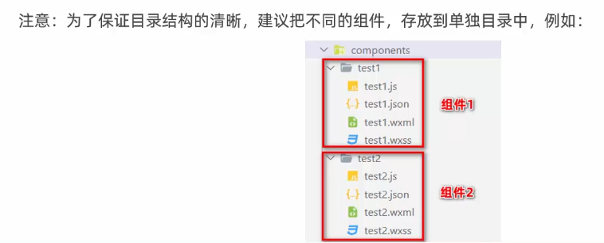


### 引用组件

组件的引用方式分为“**局部引用**”和“**全局引用**”，顾名思义:

* 局部引用:组件只能在当前被引用的页面内使用
* 全局引用:组件可以在每个小程序页面中使用

#### 局部引用组件

在页面的.json 配置文件中引用组件的方式，叫做“局部引用”。示例代码如下:

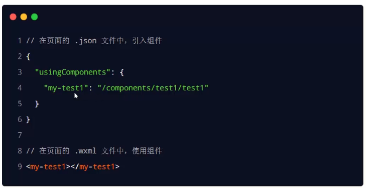


#### 全局引用组件

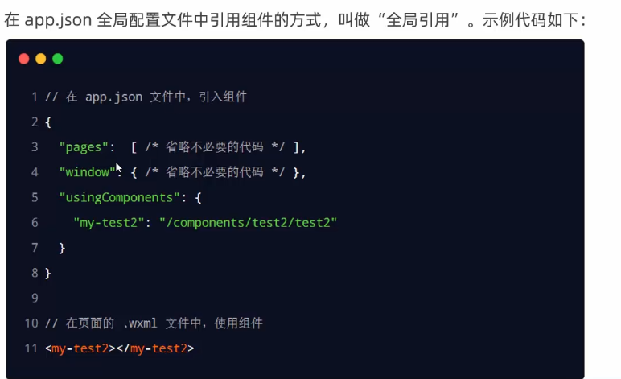


### 组件和页面的区别

从表面来看，组件和页面都是由.js、.json、.wxml和.wxss这四个文件组成的。但是，组件和页面的.js与.json文件有明显的不同:

* 组件的.json文件中需要声明"**component**": **true** 属性
* 组件的.js 文件中调用的是**Component()**函数
* 组件的事件处理函数需要定义到 **methods**节点中


## 样式

### 组件的样式隔离

默认情况下，自定义组件的样式只对当前组件生效，不会影响到组件之外的UI结构，如图所示:

* 组件A的样式**不会影响**组件C的样式
* 组件A的样式**不会影响**小程序页面的
* 样式小程序页面的样式**不会影响**组件A和C的样式

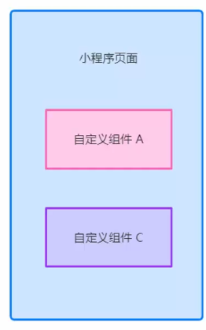


### 样式隔离注意点

* app.wxss中的全局样式对组件无效
* 只有class选择器会有样式隔离效果，id 选择器、属性选择器、标签选择器不受样式隔离的影响

**建议**：在**组件**和**引用组件的页面**中建议使用class选择器，**不要使用id、属性、标签选择器**!

### 修改组件的样式隔离选项

默认情况下，自定义组件的**样式隔离特性**能够**防止组件内外样式互相干扰的问题**。但有时，我们希望在外界能够控制组件内部的样式，此时，可以通过**stylelsolation**修改组件的样式隔离选项，用法如下:

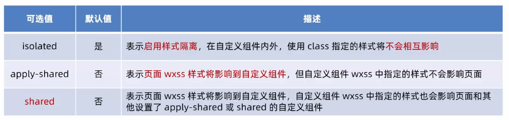


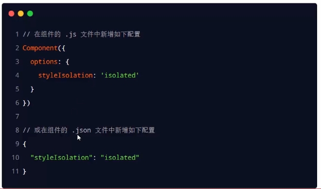


## 数据、方法和属性

### data数据

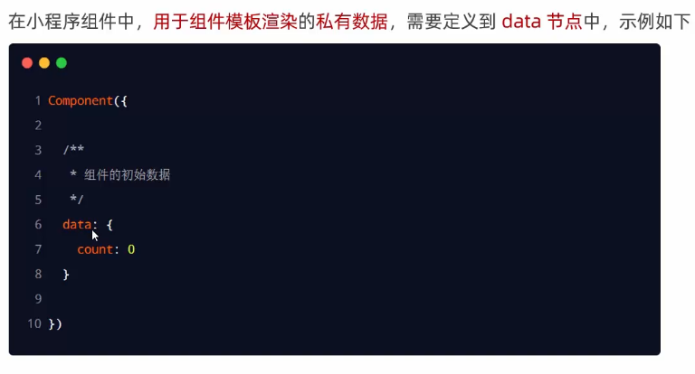


### methods方法

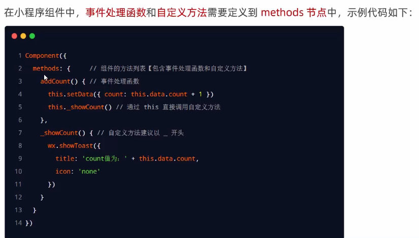


### properties属性

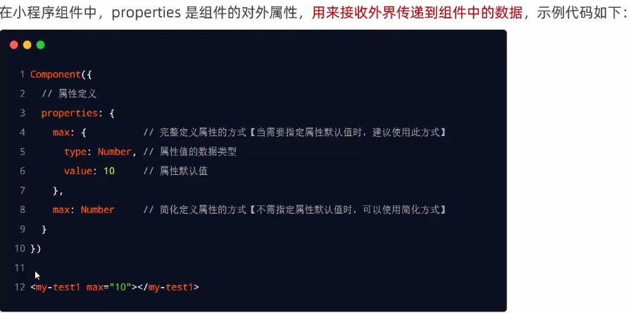


### data和properties的区别

在小程序的组件中，properties属性和data 数据的用法相同，它们都是**可读可写**的，只不过:

* data更倾向于**存储组件的私有数据**
* properties更倾向于**存储外界传递到组件中的数据**

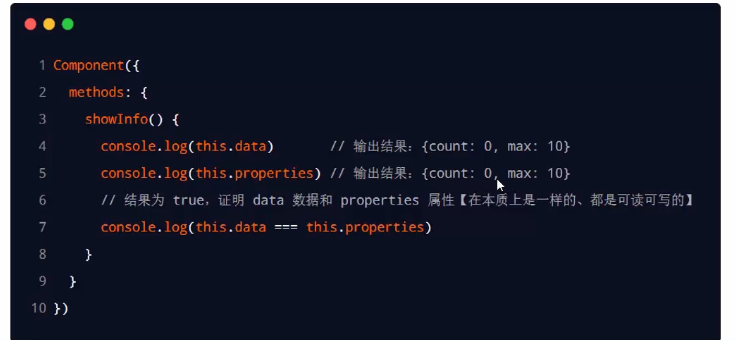


### 使用setData修改properties的值

由于**data数据**和 **properties属性**在本质上没有任何区别，因此 properties属性的值也可以用于页面渲染，或使用setData 为properties 中的属性重新赋值，示例代码如下:

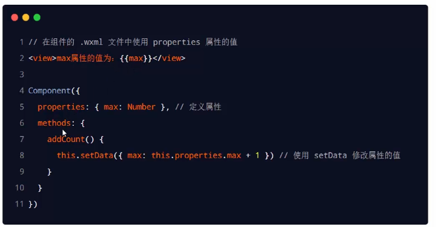


# 使用npm

目前，小程序中已经支持使用npm 安装第三方包，从而来提高小程序的开发效率。但是，在小程序中使用npm包有如下3个限制:

* 不支持依赖于Node.js内置库的包
* 不支持依赖于浏览器内置对象的包
* 不支持依赖于C++插件的包


## Vant WeAPP

Vant weapp是有赞前端团队开源的一套**小程序UI组件库**，助力开发者快速搭建小程序应用。它所使用的是**MIT开源许可协议**，对商业使用比较友好。

官网：https://youzan.github.io/vant-weapp/#/home

### 安装组件库

在小程序项目中，安装Vant组件库主要分为如下3步:

1. 通过npm安装（建议指定版本为**@1.3.3**)

    ```sh
    #初始化包管理配置---出现 package.json
    npm init -y 
    
    # 通过 npm 安装
    npm i @vant/weapp@1.3.3 -S --production
    
    # 通过 yarn 安装
    yarn add @vant/weapp --production
    
    # 安装 0.x 版本
    npm i vant-weapp -S --production
    
    ```

2. 构建npm包

3. 修改app.json

### 使用

安装完Vant组件库之后，可以在 `app.json`的`usingComponents`节点中引入需要的组件，即可在wxml中直接使用组件。示例代码如下:

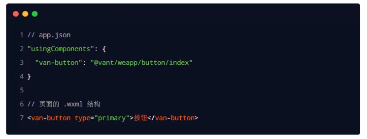


# 全局数据共享


# 分包


# 案例-自定义tabBar


# 总结


