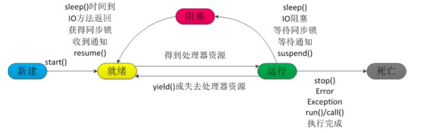

# 多线程


### wait 和 sleep 的区别

wait 进入阻塞状态，但是释放了锁

sleep进入阻塞状态，但是没有释放锁


### wait和notify要放在synchronize中

其实这样设计的原因**就是为了防止多线程并发运行时，程序的执行混乱问题**。不然在有可能会出现在wait没有执行结束的情况下，notify已经执行完毕，这样会导致我们一直处于休眠状态。


### 线程状态


1、`NEW`：初始状态，线程被构建，但是还没有调用 start 方法;

2、`RUNNABLED`：运行状态，JAVA 线程把操作系统中的就绪和运行两种状态统一称为“运行中” ；

3、`BLOCKED`：阻塞状态，表示线程进入等待状态,也就是线程因为某种原因放弃了 CPU 使用权，阻塞也分为几种情况 ：

* 等待阻塞：运行的线程执行了 Thread.sleep 、wait()、 join() 等方法JVM 会把当前线程设置为等待状态，当 sleep 结束、join 线程终止或者线程被唤醒后，该线程从等待状态进入到阻塞状态，重新抢占锁后进行线程恢复；

* 同步阻塞：运行的线程在获取对象的同步锁时，若该同步锁被其他线程锁占用了，那么jvm会把当前的线程放入到锁池中 ；

* 其他阻塞：发出了 I/O请求时，JVM 会把当前线程设置为阻塞状态，当 I/O处理完毕则线程恢复；

4、`WAITING`：等待状态，没有超时时间，要被其他线程或者有其它的中断操作；

执行wait()、join()、LockSupport.park()；

5、`TIME_WAITING`：超时等待状态，超时以后自动返回；

执行 Thread.sleep(long)、wait(long)、join(long)、LockSupport.park(long)、LockSupport.parkNanos(long)、LockSupport.parkUntil(long)

6、`TERMINATED`：终止状态，表示当前线程执行完毕 。


### 线程死亡（DEAD）

正常结束

1、run()或 call()方法执行完成，线程正常结束。

异常结束

2.、线程抛出一个未捕获的 Exception 或 Error。 

调用stop

3、 直接调用该线程的 stop()方法来结束该线程—该方法通常容易导致死锁，不推荐使用。





### 终止线程 4 种方式

1. 正常运行结束

程序运行结束，线程自动结束。 

2. 使用退出标志退出线程

    一般 run()方法执行完，线程就会正常结束，然而，常常有些线程是伺服线程。它们需要长时间的

    运行，只有在外部某些条件满足的情况下，才能关闭这些线程。使用一个变量来控制循环，例如：

    最直接的方法就是设一个 boolean 类型的标志，并通过设置这个标志为 true 或 false 来控制 while循环是否退出，代码示例：

    ```java
    public class ThreadSafe extends Thread {
        public volatile boolean exit = false;
        public void run() { while (!exit){
            //do something
        }
    }
    ```

    定义了一个退出标志 exit，当 exit 为 true 时，while 循环退出，exit 的默认值为 false.在定义 exit时，使用了一个 Java 关键字 volatile，这个关键字的目的是使 exit 同步，也就是说在同一时刻只能由一个线程来修改 exit 的值。

3. Interrupt 方法结束线程

    使用 interrupt()方法来中断线程有两种情况：

    1、线程处于阻塞状态：如使用了 sleep,同步锁的 wait,socket 中的 receive,accept 等方法时，会使线程处于阻塞状态。当调用线程的 interrupt()方法时，会抛出 InterruptException 异常。阻塞中的那个方法抛出这个异常，通过代码捕获该异常，然后 break 跳出循环状态，从而让我们有机会结束这个线程的执行。通常很多人认为只要调用 interrupt 方法线程就会结束，实际上是错的， 一定要先捕获 InterruptedException 异常之后通过 break 来跳出循环，才能正常结束 run 方法。

    2、线程未处于阻塞状态：使用 isInterrupted()判断线程的中断标志来退出循环。当使用interrupt()方法时，中断标志就会置 true，和使用自定义的标志来控制循环是一样的道理。

```java
public class ThreadSafe extends Thread {
    public void run() {
        while (!isInterrupted()){ //非阻塞过程中通过判断中断标志来退出
            try{
                Thread.sleep(51000);//阻塞过程捕获中断异常来退出
            }catch(InterruptedException e){
                e.printStackTrace();
                break;//捕获到异常之后，执行 break 跳出循环
            }
        }
    }
}
```


4. stop 方法终止线程（线程不安全）

    程序中可以直接使用 thread.stop()来强行终止线程，但是 stop 方法是很危险的，就象突然关闭计算机电源，而不是按正常程序关机一样，可能会产生不可预料的结果，不安全主要是：thread.stop()调用之后，创建子线程的线程就会抛出 ThreadDeatherror 的错误，并且会释放子线程所持有的所有锁。一般任何进行加锁的代码块，都是为了保护数据的一致性，如果在调用thread.stop()后导致了该线程所持有的所有锁的突然释放(不可控制)，那么被保护数据就有可能呈现不一致性，其他线程在使用这些被破坏的数据时，有可能导致一些很奇怪的应用程序错误。因此，并不推荐使用 stop 方法来终止线程。

    


### ——————————未完成


# 线程池


### 线程工厂的目的

当我们们构建核心线程和最大线程，可以通过线程工厂指定线程名字和其他信息，方便我们后期查错。


### 线程池的核心属性

```java
//本质就是一个int类型的数值，前三位标识线程池的状态，后二十九位标识线程的数量
private final AtomicInteger ctl = new AtomicInteger(ctlOf(RUNNING，0));
//本质就是29,为了方便对ctL做位运算使用的常量
private static final int COUNT_BITS = Integer.SIZE - 3;
//计算出线程池的线程最大容量
private static final int CAPACITY = (1 << COUNT_BITS)-1;


//线程池正常运行!		111 ——> -1
private static final int RUNNING= -1 <<COUNT_BITS;
//线程地被shutdown,继续执行完剩下的任务!				000 ——> 0
private static final int SHUTDOwN - 0<<COUNT_BITS;
//线程池被shutdownNow，线程池停止，并且所有任务中断	 001 ——> 1
private static final int STOP = 1 <<COUNT_BITS;
// shutdown或者shutdownNow之后，任务都被处理完之后，到这个过渡状态	010 ——> 2
private static final int TIDYING= 2 <<COUNT_BITS;
//线程池停止			 011 ——> 3
private static final int TERMINATED = 3 <<COUNT_BITS;
```


### 线程池核心的 execute 流程

线程池有两种执行 submit 和  execute ，但是其实都是在源码中 submit的返回值是Future 内部都是执行了 execute()方法，所以我们着重看execute就行，submit相当于他的加强

```java
public Future<?> submit(Runnable task) {
    if (task == null) throw new NullPointerException();
    RunnableFuture<Void> ftask = newTaskFor(task, null);
    execute(ftask);
    return ftask;
}
public <T> Future<T> submit(Callable<T> task) {
    if (task == null) throw new NullPointerException();
    RunnableFuture<T> ftask = newTaskFor(task);
    execute(ftask);
    return ftask;
}
```

execute源码

```java
public void execute(Runnable command) {
    if (command == null)
        throw new NullPointerException();
    // 拿到线程信息，高3位线程状态，其余29位 线程大小
    int c = ctl.get();
    // 基于workerCountOf()获取正在工作的线程数，判断是否小于核心线程数
    if (workerCountOf(c) < corePoolSize) {
        // 创建核心线程，并执行任务  ，传入true表示当前为核心线程
        if (addWorker(command, true))
            return;
        // 如果获取线核心线程失败，重新获取ctl
        c = ctl.get();
    }
    // 获取线程池状态，是否运行；如果线程池正在运行，就将任务追加到阻塞队列
    if (isRunning(c) && workQueue.offer(command)) {
        int recheck = ctl.get();
        if (! isRunning(recheck) && remove(command))
            reject(command);
        else if (workerCountOf(recheck) == 0)
            addWorker(null, false);
    }
    // 尝试创建最大线程数，如果成功返回true，失败了就进行拒绝策略
    else if (!addWorker(command, false))
        reject(command);
}
```


### 线程池增加工作线程的操作

```java
private boolean addWorker(Runnable firstTask, boolean core) {
    // 给for 循环追加标记
    retry:
    for (;;) {
        // 获取线程ctl
        int c = ctl.get();
        // 获取当前线程状态
        int rs = runStateOf(c);
		// 如果 rs >= SHUTDOWN，说明线程池执行了 shutdown 方法或者shutdownNow
        if (rs >= SHUTDOWN &&
            ! (rs == SHUTDOWN && //线程池听了
               firstTask == null && // 任务为null
               ! workQueue.isEmpty())) // 工作队列为空
            return false;

        for (;;) {
            // 获取当前工作线程个数
            int wc = workerCountOf(c);
            // 如果工作线程大于容量 或者 （ 工作线程 》核心线程 | 工作线程 》最大线程 ）
            if (wc >= CAPACITY ||
                wc >= (core ? corePoolSize : maximumPoolSize))
                return false;
            // 基于CAS的方式将工作线程数 + 1
            if (compareAndIncrementWorkerCount(c))
                break retry;
            c = ctl.get(); 
            // 如果没有成功的CAS，就要判断是否重新执行外部循环
            // 如果线程池状态改变,从外侧改变
            // 如果线程池状态没变，从内侧改变
            if (runStateOf(c) != rs)
                continue retry;
        }
    }
	
    //声明了两个标识
    boolean workerStarted = false;
    boolean workerAdded = false;
    // 真正的工作线程就是Worker
    Worker w = null;
    try {
        // 构建Worker,并将任务注入
        w = new Worker(firstTask);
        final Thread t = w.thread;
        if (t != null) {
            // 获取线程池的全局锁
            final ReentrantLock mainLock = this.mainLock;
            // 上锁的为因为，shutdown或者shutdownNow的时候，也需要获取锁资源
            mainLock.lock();
            try {
                // 获取线程池状态
                int rs = runStateOf(ctl.get());
			   // 判断线程池状态 < SHUTDOWN ，也就是RUNNING 状态
                if (rs < SHUTDOWN ||
                    (rs == SHUTDOWN && firstTask == null)) { // 线程池为SHUTDOWN同时任务为null
                    // 如果线程干活了。直接抛出异常
                    if (t.isAlive()) 
                        throw new IllegalThreadStateException();
                    // 将工作线程追加到 Workers(一个HashSet)存储
                    workers.add(w);
                    // 获取这个hashSet 长度
                    int s = workers.size();
                    // 如果现在的工作线程数 > 历史最大线程数，直接替换掉largestPoolSize
                    if (s > largestPoolSize)
                        largestPoolSize = s;
                    // 将工作线程设置为true，表示添加成功
                    workerAdded = true; 
                }
            } finally {
                // 最后释放锁
                mainLock.unlock();
            }
            // 如果工作线程添加成功，启动工作线程
            if (workerAdded) {
                t.start();
                // 设置启动工作线程为True
                workerStarted = true;
            }
        }
    } finally {
        // 如果工作线程启动失败
        if (! workerStarted)
            // 补救操作
            addWorkerFailed(w);
    }
    return workerStarted;
}
```


### 线程池的Work类

```java
public class ThreadPoolExecutor extends AbstractExecutorService {
    //***
    
    private final class Worker // 属于线程池的一个内部类
        extends AbstractQueuedSynchronizer
        implements Runnable  // 继承了Runnable 也就是相对于worker也是一个任务
    {
        
        private static final long serialVersionUID = 6138294804551838833L;

        final Thread thread;
        
        Runnable firstTask;
        
        volatile long completedTasks;

        Worker(Runnable firstTask) {
            setState(-1); 
            this.firstTask = firstTask;
            this.thread = getThreadFactory().newThread(this);
        }

		// 当调用worker 内部线程的 start() 方法时，实际是在调用worker类中的run()方法，实际执行的是runWorker()
        public void run() {
            runWorker(this);
        }
    }
}
```


### 线程池的 runWorker() 方法

```java
final void runWorker(Worker w) {
    // 获取当前线程
    Thread wt = Thread.currentThread();
    // 获取Worker 中的具体任务
    Runnable task = w.firstTask;
    // 将worker中的 task 置为 null
    w.firstTask = null;
    // 将有参构造中的标记(setState(-1))撤销，代表当前线程可以被打断
    w.unlock(); // allow interrupts
    // 标记，
    boolean completedAbruptly = true;
    try {
        // 如果 worker 中的 task有任务，直接执行当前任务，否则去队列中获取任务
        while (task != null || (task = getTask()) != null) {
            // 当前要执行，添加标记，shutdown也不能打断
            w.lock();
           // 判断当前线程池装，以及线程状态，判断是否需要被打断
            if ((runStateAtLeast(ctl.get(), STOP) ||
                 (Thread.interrupted() &&
                  runStateAtLeast(ctl.get(), STOP))) &&
                !wt.isInterrupted())
                wt.interrupt();
            // 执行任务的开始
            try {
                // 在执行任务之前做的事，前置增强
                beforeExecute(wt, task);
                Throwable thrown = null;
                try {
                    // 执行任务
                    task.run();
                } catch (RuntimeException x) {
                    thrown = x; throw x;
                } catch (Error x) {
                    thrown = x; throw x;
                } catch (Throwable x) {
                    thrown = x; throw new Error(x);
                } finally {
                     // 在执行任务之前做的事，后置增强
                    afterExecute(task, thrown);
                }
            } finally {
                // 任务处理结束
                task = null;
                // 标记当前worker处理的任务数 + 1
                w.completedTasks++;
                w.unlock();
            }
        }
        completedAbruptly = false;
    } finally {
        processWorkerExit(w, completedAbruptly);
    }
}
```


### 1、单核CPU设定多线程是否有意义？


### 2、线程数是不是越多越好？

​	并不是，这牵扯到线程调用问题举个反例，盖一个房子需要100H，我100人工作一小时就可以完成？显然不可以。甚至会降低效率，浪费资源


### 3、线程数设置多少最合适？

* **压测**（就是不停尝试，找到最合适的）， 一般情况下，为了安全不可能全部占用，我们留出一部分空间我们一般取80%，

:one:64核CPU我们全部使用，其他的程序就无法启动，显然不正常

* **通过公式计算**


:o: $32*8*(1+0.2)=30.72$​


### 如何优雅的结束一个线程？

:one: stop()方法，但是不建议，容易产生数据不一致情况		【**已废**】

:two: suspend()、resume()方法，暂停，继续方法，暂停的时候不会释放锁，容易产生死锁【**已废**】

:three: vlatile()，时间无法控制

* 不适合某些场景（比如还没有同步的时候，线程做了阻塞操作，没有办法循环回去）

* 打断时间也不是特别精确，比如一个阻塞容器，容量为5的时候结束生产者，
    但是，由于volatile同步线程标志位的时间控制不是很精确，有可能生产者还继续生产一段儿时间

:four: interrupt() and isInterrupted（比较优雅）


### 程序真的会一行一行的运行吗？

​	不一定，在没有相互依赖的语句，可能为了效率后面的语句会同时运行，运行完成的时间比前一个跟快。


### this对象溢出问题？

```java
public class Test {
    private static Integer num = 8;

    public Test() {
        new Thread(() -> {
            System.out.println(this.num);
        }).start();

    }

    public static void main(String[] args) throws IOException {
        Test test = new Test();
        System.in.read();
    }
}
```

最终结果可能是什么？

:one:、8

:two:、0

为什么是0呢，因为在我们初始化的时候有可能会导致我们创建的这个线程直接去读取未被初始化的Num，所以解决方案

* 可以在构造器中new但是不要启动，启动单另写一个方法启动


### 线程池的好处

1、降低资源消耗

​	线程的创建和销毁，通过重复利用已创建的线程降低线程创建和销毁造成的消耗。

2、调高响应速度

​	任务到了就直接可以上线程了，不用再new。当任务到达时，任务可以不需要等到线程创建就能立即执行

3、提高线程的可管理性

​	线程是稀缺资源，如果无限制的创建，不仅会消耗系统资源，还会降低系统的稳定性，使用线程池可以进行统一的分配，调优和监控

