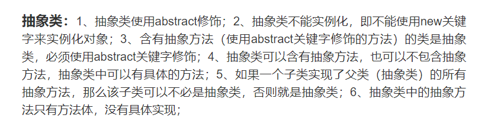

### 创建JAVA对象方式

一共5种

1、new 申请空间，执行构造方法

```java
Person p = new Person();
```

2、通过Class类中，newInstance()方法，默认去找空参（不建议）

```java
Class cla = Person.class;
Person p = (Person)cla.newInstance();
```

3、通过Construction类中的newInstance()找到对应构造方法去创建

```java
Class cla = Person.class;
Construction construction = cla.getConstruction(String.class);
Person p = (Person)construction.newInstance();
```

4、通过Object类中的Clone()

```java
//要实现Cloneable 重写
```

5、通过对象的反序列化

```java
FileInputStream fis = new FileInputStream("path");
ObjectInputStream ois = new ObjectInputStream(fis);
Person pp = (Person)ois.readObject();
```


### new一个对象的顺序(内含代码块)

* 假设一个类他的父类有**静态代码块**、**代码块**、**构造器**，自身也有**静态代码块**、**代码块**、构造器，以及**方法内部的代码块**

```java
public class TestFather {
    private  int age ;
    {
        System.out.println("这是父类构造块");
    }

    static {
        System.out.println("这是父类静态构造块");
    }

    public TestFather() {
    }
}
```

````java
public class Test extends TestFather {
    //属性
    int a;
    static int sa;
    //方法
    public void a(){
        System.out.println("-----a");
        {
            //普通块限制了局部变量的作用范围
            System.out.println("这是普通块");
            System.out.println("----000000");
            int num = 10;
            System.out.println(num);
        }
        //System.out.println(num);
        //if(){}
        //while(){}
    }
    public static void b(){
        System.out.println("------b");
    }
    //构造块
    {
        System.out.println("------这是构造块");
    }
    //静态块
    static{
        System.out.println("-----这是静态块");

    }
    //构造器
    public Test(){
        System.out.println("这是空构造器");
    }
    public Test(int a){
        this.a = a;
    }

    //这是一个main方法，是程序的入口：
    public static void main(String[] args) {
        Test t = new Test();
        t.a();
        Test t2 = new Test();
        t2.a();
    }
}
````


**总结：**

> *顺序*：
>
> * static变量或者方法
>
>     父类静态构造块  ->  静态构造块  ->  
>
> * Test t = new Test()
>
>     父类构造块  ->  构造块  ->  空参构造  ->  
>
> * t.a();
>
>     方法A  ->  方法中的构造块 ->
>
> * Test t2 = new Test()
>
>     父类构造块  ->  构造块  ->  空参构造  ->  
>
> * t2.a();
>
>     方法A  ->  方法中的构造块

总的来说，

* 父类方法在前
* 静态在前且**只加载一次**
* **构造块 》构造器 》 方法**

新的总结：

> ​	从JVM 的角度来说，再开始的时候先进性类的加载，( Loading [加载器获取 ] 》Linking [校验是否符合语法》附默认值》解析 ]  》initialization [初始化] ) ，在加载阶段我们就将我们的方法体放入了方法区中，初始化的时候就已经将我们的静态系列运行了，这也就是为什么 static 系列的东西只在程序过程中产生一次。


### JAVA有哪几种关键字，作用区间是什么


private：只有类中的子类和方法可以使用

default：只有和自己同一个包下的子类才能使用

protected：只有自己和子类可以直接使用

public：全部范围


### OverLoad 和 Override区别

OverLoad：重载，指同一个类中可以有多个名称相同的方法,但这些方法的参数列表各不相同(即参数个数或类型不同) 

Override：重写，表示子类中的方法可以与父类中的某个方法的名称和参数完全相同


注意：

Override注意事项:
      1.覆盖的方法的标志必须要和被覆盖的方法的标志完全匹配，才能达到覆盖的效果
      2.覆盖的方法的返回值必须和被覆盖的方法的返回一致
      3.覆盖的方法所抛出的异常必须和被覆盖方法的所==抛出的异常一致，或者是其子类==；
      4.被覆盖的==方法不能为private==，否则在其子类中只是新定义了一个方法，并没有对其进行覆盖。

Overload注意事项:
      1.在使用重载时只能通过不同的参数样式。例如，不同的参数类型，不同的参数个数，不同的参数顺序（当然，同一方法内的几个参数类型必须不一样，例如可以是fun(int,float)，但是不能为fun(int,int)）；
      2.不能通过访问权限、返回类型、抛出的异常进行重载；
      3.方法的异常类型和数目不会对重载造成影响；
      4.对于继承来说**，如果某一方法在父类中是访问权限是priavte**，那么就不能在子类对其进行重载，如果定义的话，也只是定义了一个新方法，而不会达到重载的效果

**总结：**

> 重载：名字相同是前提，是否合理看参数，其他都没啥关系，父类一旦私有就玩完
>
> 重写：继承实现是前提，子类起码大于父，犯的错误要更小，返回类型要一致


### 简述一下Java面向对象的基本特征，继承、封装与多态，以及你自己的应用？


继承：就好比一个父亲多个孩子，并且孩子还完全继承父类的方法，private修饰的方法也能继承，只		  是因为封装的特性阻碍了直接调用，但是提供了间接调用的方式，可以间接调用。并且后面多态的条件

封装：把对象的属性和操作（或服务）结合为一个**独立的整体**，并**尽可能隐藏对象的内部实现细节**。

​		  例如，内部属性只对外提供get、set方法，不能直接引用。

多态：多态，故名思意，事物的多种形态。多态跟属性无关，多态指的是方法的多态。打破单继承。

前提：

- **有继承性关系**
- **要有方法的重写**
- **必须是父类引用子类的对象**


### this和super

**this**

1. 对象内部指代自身的引用
2. 解决成员变量和局部变量的同名问题
3. 可以调用成员变量，不能调用局部变量
4. 可以调用成员方法
5. 在普通方法中可以省略this
6. 静态方法中不允许出现

**super**

1. 代表当前对象的直接父类对象的引用
2. 可以调用父类中非private成员变量和方法
3. super()可以调用父类的构造器，只限于构造方法中使用，且必须是第一条


### 怎样声明一个类不会被继承，什么场景下会用？

**final修饰的类**不能有子类 大部分都是出于**安全**考虑

举例：String、Math


### java是什么类型的语言？

#### 面向对象语言：

​	解释之前我们得引入一个概念，**面向过程**，举一个例子，要把大象装进冰箱需要几步

面向过程：

* 打开冰箱，把大象放进去，关上冰箱。

面向对象：

* 打开冰箱（负责：人走到冰箱前面，打开了）
* 存储（负责：大象先迈左腿，然后右腿，然后躺进去）
* 关闭冰箱（然后关上冰箱门。）

面向过程是：要先把事物分析成**不同的步骤**，然后根据步骤一步步的编程。

面向对象是：创建负责某个部分的负责人也就是我们所说的“对象”，在给对象赋值上相应的属性，进行方法形式的编程

**两者相辅相成缺一不可。**

1 解释型


2 编译型


### final 和 static 在JAVA中的意义？

1、static特点

> （1）在类加载的时候一起加载入方法区中的静态域中
> （2）先于对象存在
> （3）访问方式： 对象名.属性名    类名.属性名（推荐）

2、final特点

>修饰一个变量，变量的值不可以改变，这个变量也变成了一个字符常量，约定俗称的规定：名字大写
>
>final修饰方法，那么这个方法不可以被该类的子类重写：
>
>final修饰类，代表没有子类，该类不可以被继承：

3、项目使用场景 

static修饰属性的应用场景：

​	某些特定的数据想要在内存中共享，只有一块 --》这个情况下，就可以用static修饰的属性

final修饰属性的应用场景：

​	（1）使用Math类的时候无需导包，直接使用即可：

​	（2）Math类没有子类，不能被其他类继承了

​	（3）里面的属性全部被final修饰，方法也是被final修饰的，只是省略不写了

​				原因：子类没有必要进行重写。

​	（4）外界不可以创建对象：

​	（5）发现Math类中的所有的属性，方法都被static修饰

​				那么不用创建对象去调用，只能通过类名.属性名  类名.方法名 去调用

### JAVA 中的对象拷贝？


### 什么是接口？

1、制定标准

2、提供可扩展性

3、面向接口编程

### 接口和抽象类的区别：

​    


### 什么是内部类？

分类：4种

1、成员内部类

2、静态内部类

3、局部内部类

4、匿名内部类


### JAVA中的基本数据类型

1、8种数据类型

2、所占字节长度，最大最小

3、BigDecimal对象


### ArrayList是用来干嘛的？

1、原理

 


### Try、catch、finally、return

在`try` 、`catch` 、`finally` 只有一个return有用，也就是说只有最后一个有用

#### 一、try中带有return

```java
 case 3:{
                try {
                    i++;
                    System.out.println("try:"+i);
                    return i;
                }catch (Exception e){
                    i++;
                    System.out.println("catch:"+i);
                }finally {
                    i++;
                    System.out.println("finally:"+i);
                }
                return i;
            }
/*
init:24
try:25
finally:26
最终返回：25
由此可见：try -》 finally -》return
*/
```

​	因为当try中带有return时，会先执行return前的代码，然后暂时保存需要return的信息，再执行finally中的代码，最后再通过return返回之前保存的信息。所以，这里方法返回的值是try中计算后的25，而非finally中计算后的26。


再看一个例子

```java
static List t2(int param){
        int i = 1;
        List<Integer> list = new ArrayList<>();

        System.out.println("init:"+list);
        switch (param){
            case 1:{
                //方式一：
                try {
                    list.add(1);
                    System.out.println("try:"+list);
                    return list;
                }catch (Exception e){
                    i++;
                    list.add(2);
                    System.out.println("catch:"+list);
                    return list;
                }finally {
                    i++;
                    list.add(3);
                    System.out.println("finally:"+list);
                    return list;
                }
            }
            case 2:{
                try {
                    i++;
                    System.out.println("try:"+1);
                    int a =1/0;
                    return list;
                }catch (Exception e){
                    i++;
                    list.add(2);
                    System.out.println("catch:"+list);
                    return list;
                }finally {
                    i++;
                    list.add(3);
                    System.out.println("finally:"+list);
                    return list;
                }
            }
        }
        return null;
    }

/*
init:[]
try:1
catch:[2]
finally:[2, 3]
最终返回：[2, 3]
*/
```

　看完这个例子，可能会发现问题，刚提到return时会临时保存需要返回的信息，不受finally中的影响，为什么这里会有变化？其实问题出在参数类型上，上一个例子用的是基本类型，这里用的引用类型。list里存的不是变量本身，而是变量的地址，所以当finally通过地址改变了变量，还是会影响方法返回值的。


#### 二、catch中带有return

```java
static int t(){
        int i = 24;
        //方式一：
        try {
            i++;
            System.out.println("try:"+i);
            return i;
        }catch (Exception e){
            i++;
            System.out.println("catch:"+i);
            return i;
        }finally {
            i++;
            System.out.println("finally:"+i);
            return i;
        }
    }
/*
try:25
finally:26
最终返回：26
由此可见：try -》 finally
*/
```


#### 三、finally中带有return

```java
			  try {
                    i++;
                    System.out.println("try:"+i);
                    int a =i/0;
                    return i;
                }catch (Exception e){
                    i++;
                    System.out.println("catch:"+i);
                    return i;
                }finally {
                    i++;
                    System.out.println("finally:"+i);
                    return i;
                }
/**
init:24
try:25
catch:26
finally:27
最终返回：27
由此可见 try ->catch -> finally
*/
```

​	当finally中有return的时候，try中的return会失效，在执行完finally的return之后，就不会再执行try中的return。这种写法，编译是可以编译通过的，但是编译器会给予警告，所以不推荐在finally中写return，这会破坏程序的完整性，而且一旦finally里出现异常，会导致catch中的异常被覆盖。

> 基本数据只看值，先返回啥就是啥，后期改动不影响
>
> 引用数据返回只返他地址，后期改动有影响
>
> 多个return只看近


#### 四、总结：

1、finally中的代码总会被执行。

2、当try、catch中有return时，也会执行finally。return的时候，要注意返回值的类型，是否受到finally中代码的影响。

3、finally中有return时，会直接在finally中退出，导致try、catch中的return失效。


### 基本类型的转化

整型 

`byte` `short int  long`  对应字节 1、2 、4、8

浮点

`float` `double`             对应字节 4、8

字符型

`char`								 对应字节 1

布尔

`boolean`					      对应字节 看操作系统


#### 总结

1、长字节的可以直接接收短字节数，短字节数要接收长字节数要强转，同字节数可相互转化，比如 `float` 和 `int`。

2、父与子的关系也可这样理解


### 运算符


**不需要去刻意的记优先级关系**
**赋值<三目<逻辑<关系<算术<单目**


### 取余

```java
int a1= 9 % 4;   // 1
int a2= 9 % -4;  // 1
int a3= -9 % 4;	 // -1
int a4= -9 % -4; // -1
```

技巧：全部都当成正数算，**最后的符号与被除数相同**


### String、StringBuffer、StringBuilder区别与联系

1. String类是不可变类，即一旦一个String对象被创建后，包含在这个对象中的字符序列是不可改变的，直至这个对象销毁。

2. StringBuffer类则代表一个字符序列可变的字符串，可以通过append、insert、reverse、setChartAt、setLength等方法改变其内容。一旦生成了最终的字符串，调用toString方法将其转变为String

3. JDK1.5新增了一个StringBuilder类，与StringBuffer相似，构造方法和方法基本相同。不同是StringBuffer是线程安全的，而StringBuilder是线程不安全的，所以性能略高。通常情况下，创建一个内容可变的字符串，应该优先考虑使用StringBuilder

        StringBuilder:JDK1.5开始  效率高   线程不安全
        
        StringBuffer:JDK1.0开始   效率低    线程安全


### Jdk1.8中的stream有用过吗，详述一下stream的并行操作原理？stream并行的线程池是从哪里来的？

​	**Stream**作为Java8的一大亮点，它与java.io包里的**InputStream**和**OutputStream**是完全不同的概念。它是对容器对象功能的增强，它专注于对容器对象进行各种非常便利、高效的聚合操作或者大批量数据操作。

​	Stream API借助于同样新出现的Lambda表达式，极大的提高编程效率和程序可读性。同时，它==提供串行和并行两种模式进行汇聚操作==，并发模式能够充分利用多核处理器的优势，使用fork/join并行方式来拆分任务和加速处理过程。所以说，Java8中首次出现的 java.util.stream是一个函数式语言+多核时代综合影响的产物。

Stream有如下三个操作步骤：

一、创建Stream：从一个数据源，如集合、数组中获取流。

二、中间操作：一个操作的中间链，对数据源的数据进行操作。

三、终止操作：一个终止操作，执行中间操作链，并产生结果。


​	当数据源中的数据上了流水线后，这个过程对数据进行的所有操作都称为“中间操作”。中间操作仍然会返回一个流对象，因此多个中间操作可以串连起来形成一个流水线。比如map (mapToInt, flatMap 等)、filter、distinct、sorted、peek、limit、skip、parallel、sequential、unordered。

​	当所有的中间操作完成后，若要将数据从流水线上拿下来，则需要执行终止操作。终止操作将返回一个执行结果，这就是你想要的数据。比如：forEach、forEachOrdered、toArray、reduce、collect、min、max、count、anyMatch、allMatch、noneMatch、findFirst、findAny、iterator。

​	多个中间操作可以连接起来形成一个流水线，除非流水线上触发终止操作，否则中间操作不会执行任何处理！而在终止操作时一次性全部处理，称作“惰性求值”。

​	stream并行原理: 其实本质上就是在ForkJoin上进行了一层封装，将Stream 不断尝试分解成更小的split，然后使用fork/join 框架分而治之, parallize使用了默认的ForkJoinPool.common 默认的一个静态线程池.


### JAVA 注解

Annotation（注解）是 Java 提供的一种对元程序中元素关联信息和元数据（metadata）的途径和方法。Annatation(注解)是一个接口，程序可以通过反射来获取指定程序中元素的 Annotation 对象，然后通过该 Annotation 对象来获取注解中的元数据信息。

4 种标准元注解

元注解的作用是负责注解其他注解。 Java5.0 定义了 4 个标准的 meta-annotation 类型，它们被用来提供对其它 annotation 类型作说明。

@Target 修饰的对象范围

@Target说明了Annotation所修饰的对象范围： Annotation可被用于 packages、types（类、接口、枚举、Annotation 类型）、类型成员（方法、构造方法、成员变量、枚举值）、方法参数和本地变量（如循环变量、catch 参数）。在 Annotation 类型的声明中使用了 target 可更加明晰其修饰的目标

@Retention 定义 被保留的时间长短

Retention 定义了该 Annotation 被保留的时间长短：表示需要在什么级别保存注解信息，用于描述注解的生命周期（即：被描述的注解在什么范围内有效），取值（RetentionPoicy）由：

n SOURCE:在源文件中有效（即源文件保留）

n CLASS:在 class 文件中有效（即 class 保留）

n RUNTIME:在运行时有效（即运行时保留）

@Documented 描述**-javadoc**

@ Documented 用于描述其它类型的 annotation 应该被作为被标注的程序成员的公共 API，因此可以被例如 javadoc 此类的工具文档化。

@Inherited 阐述了某个被标注的类型是被继承的

@Inherited 元注解是一个标记注解，@Inherited 阐述了某个被标注的类型是被继承的。如果一个使用了@Inherited 修饰的 annotation 类型被用于一个 class，则这个 annotation 将被用于该 class 的子类


### SynchronizedMap 和 ConcurrentHashMap有什么区别

1、SynchronizedMap对整个map同步

2、ConcurrentHashMap对map的桶加锁


### yield 方法有什么用？

放弃当前线程资源，和其他线程再次同时竞争资源。


### 常用线程池

1、newSingleThreadExceutor 单线程池 ，只有一个线程

2、newFixedThreadPool  最大线程池，可以指定线程池大小

3、newcachedThreadPool  缓存线程池，没有线程有任务就创建线程，有空余线程来任务直接用。

4、newScheduledThreadPool 周期性线程池，定时任务


### 简述线程池的理解

1、降低资源消耗

​	线程的创建和销毁，通过重复利用已创建的线程降低线程创建和销毁造成的消耗。

2、调高响应速度

​	任务到了就直接可以上线程了，不用再new。当任务到达时，任务可以不需要等到线程创建就能立即执行

3、提高线程的可管理性

​	线程是稀缺资源，如果无限制的创建，不仅会消耗系统资源，还会降低系统的稳定性，使用线程池可以进行统一的分配，调优和监控


### 进程和线程的区别

1、进程是执行的程序，系统资源分配和调度的单位

2、线程是进程的一个实体，线程之间共享地址空间和其他资源（所以通信，同步等操作线程更加容易）

3、线程上下文切换快


进程相当于公司，线程相当于公司员工，两个公司交流慢，内部员工交流快


### 死锁的必要条件

1、一个资源每次只能被一个线程使用

2、线程因请求资源而阻塞时，对获得的资源保持不放

3、线程已获得的资源，在未使用完之前，不能强行剥夺

4、若干线程之间形成头尾详解的线程资源需求，A要B，B要A


### 避免死锁

1、线程只有获得到A锁和B锁才能对某资源进行操作

2、获取锁的顺序是一定的


### Java线程池中队列常用类型有什么

1、ArrayBlockingQueue			基于数组，有界长度大小的FIFO队列

2、LinkedBlockingQueue		 基于链表

3、SynchronousQueue			  不存储元素的阻塞队列

4、PriorityBlockingQueue		优先级队列，无限阻塞队列，基于最小二叉堆

5、DelayQueue							 只有当前指定的时间到了才可以拿到数据，没有大小限制，只有获取数据的

​															才阻塞，放的时候没限制


### 线程安全需要保证几个基本特征

1、原子性

2、可见性

3、有序性（避免指令重排序）


### CAS原理

全称：CompareANdSwap，乐观锁，比较并交换，主要是通过处理器的指令来保证操作的原子性 。 


### CAS的缺点

1、ABA问题，就是在比较的时候，比较的和原来的内容恰好相同，但是不是同一个对象。 例如，现在有三个线程，2个是将10+5，还有 1 个是15-5，现在其中一个+5拿到资源开始操作，然后-5线程在进行操作，对于原来的值虽然没有变化，但是进行了操作，在另外一个+5进行原值比较的时候，会误认为没有改变，然后写入新值。他是基本数据类型的时候是没有问题的。但是要是对象的时候，这就有大问题了 ，我们这样就会让我们产生并发问题了。解决这类问题，最简单的办法就是加版本，在对比的时候，不仅仅对比值，还要比较版本。

2、循环时间过长开销大

3、只能保证一个共享变量的原子操作


### 线程池原理和核心参数

1、核心线程数

2、最大线程数

3、活跃时间

4、阻塞队列

5、拒绝策略


### 线程池的拒绝策略有哪些

1、AbortPolicy：直接丢弃，抛异常

2、CallerRunsPolicy：调用者所在的线程处理任务

3、DiscardOldestPolicy：丢弃最久的任务

4、DiscardPolicy：直接丢弃任务，也不抛出异常


### CycliBarrier和CountDownLatch区别

CyclicBarrier线程运行到某个点后停止运行，所有线程到达点，才重新运行

CountDownLatch 线程运行到某个点，给某个数值-1，


线程继续CyclicBarrier唤起一个

CountDownLatch可以唤起多个任务


CyclicBarrier可重用，CountDownLatch不可重用


### Get和Post请求区别

1、get用户信息获取，而其应该是安全的和幂等的

2、POST表示可能修改服务器上的资源的请求

3、Get请求的数据会附在URL之后

4、Get方式提交的数据取决于URL长度限制，理论上POST没有限制，可传较大量的数据

5、POST的安全性要比Get的安全性高


### 转发和重定向的区别

1、转发是服务器行为，重定向是客户端行为

2、重定向是两次请求，第一次是原来的A，然后服务器让他请求B，最后浏览器再请求B。


### JDBC

1.引入Jar包,加载驱动。

2.建立连接Connection,创建执行对象Statement。

3.执行语句。

4.处理结果(查询)。

5.释放资源(关闭连接对象)。


### Cookie是什么，有什么用？

1、cookie就是保存在客户端的纯文本文件

2、访问某些网页，并且对网页的一些设置进行修改，cookie就能跟踪并记录到这些修改。

3、网站服务器把少量数据存储到客户端的硬盘或内存


### HTTP请求状态码

10X		请求一部分，正在请求另外一部分

20X		请求成功

30X		转发

40X		没有资源

50X		服务器内部错误

