# 数据库存储引擎有哪些

Myisam、Innodb

# Myisam和Innodb有什么区别

|    区别    |                            MyISAM                            |                            InnoDB                            |
| :--------: | :----------------------------------------------------------: | :----------------------------------------------------------: |
|  数据结构  | .frm 存储表定义 <br/>.MYD  存储数据文件<br/>.MYI  存储索引文件 |           .frm 存储表定义<br/>.ibd 存储数据和索引            |
|  存储空间  | MyISAM**可被压缩，存储空间较小**<br/>支持三种存储：静态表[默认]、动态表、压缩表 | InnoDB**需要更多的内存和存储，它会在主内存中建立其专用的缓冲池用于高速缓冲数据和索引**。InnoDB所在的表都保存在同一个数据文件中（也可能是多个文件，或者是独立的表空间）<br/>InnoDB表的大小只受限于操作系统文件的大小，一般为2GB |
| 事务的支持 | MyISAM强调的是性能，每次查询具有原子性，其执行速度比Innodb类型更快，<br/>但是**不提供事务支持**。 | InnoDB除了***提供事务支持***和外部键等高级数据库功能。还具有事务提交（commit）、回滚（rollback）和崩溃修复能力（crach recovery capabilities）等这些事务安全（transaction-safe ACID compliant）型表 |
|  锁的支持  | 如果只是执行大量的查询, MyISAM是更好的选择。MyISAM在**增删**的时候需要**锁定整个表格**，效率会低一些 | innoDB支持行级锁，***删除插入***的时候只需要***锁定操作行***就行。如果有大量的插入、修改删除操作，使用InnoDB性能能会更高 |
|  查询效率  |                    **高**<br>支持全文索引                    |                  **低**<br/>不支持全文索引                   |
| 外键的支持 |                     MyISAM**不支持外键**                     |                           支持外键                           |


# 如何选择数据库引擎？

1、如果需要支持事务，选择InnoDB，不需要事务则选择MyISAM。

2、如果大部分表操作都是查询，选择MyISAM，有写又有读选InnoDB。

3、如果系统崩溃导致数据难以恢复，且成本高，不要选择MyISAM。


# 三范式是什么

第一范式：列不可再分 

第二范式：行可以唯一区分，主键约束 

第三范式：表的非主属性不能依赖与其他表的非主属性  外键约束 


简单来说，第一范式就是让属性原子化，不可再分；第二范式就是让数据具有主属性从而产生唯一标识（特别是为了标识有联合主键的情况）；第三范式就是表的非主属性不能依赖与其他表的非主属性，也可以说是表中的属性不能有依赖关系


# 什么是事务，有哪些特点

事务是用来维护数据库完整性的，具体体现就是多条sql语句，要么全部成功，要么全部失败。

特点：==ACID==

A:（原子性Atomicity）、C:一致性（Consistency）、I：隔离性（Isolation）、D：持久性（Durability）

1)原子性
原子是自然界最小的颗粒，具有不可再分的特性

2) 一致性
一致性是指事务执行的结果必须使数据库从一个一致性状态，变到另一个一致性状态。

3) 隔离性
隔离性是指各个事务的执行互不干扰

4)持久性
持久性指事务一旦提交，对数据所做的任何改变，都要记录到永久存储器中


# 事务的隔离级别有哪些

由低到高：

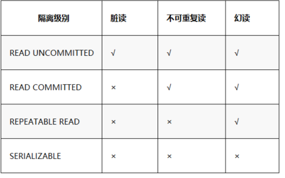

**READ UNCOMMITTED（读未提交）**

​	在这个隔离级别，所有事务都可以看到未提交事务的执行结果。在这种隔离级别上，可能会产生很多问题。所以这种隔离级别很少用于实际应用，而且它的性能也没有比其他性能好很多，而别的级别还有其他的优点。读取未提交数据，也被称为“脏读”。

**READ COMMITTED（读已提交）**

​	读已提交这种隔离级别是大多数数据库系统默认的隔离级别（但mysql默认的隔离级别却不是这种），满足了隔离的最早简单定义：一个事务开始时，只能看见已经提交事务所做的改变，一个事务从开始到提交前，所做的任何数据改变都是不可见的，除非已经提交。这种隔离级别也支持所谓的不可重复读。这意味着用户运行同一个语句两次，看到的结果是不同的。

**REPEATABLE READ（可重复读）**

​	mysql数据库默认的隔离级别。该级别解决了READ UNCOMMITTED导致的问题。它保证了同一事务的多个实例在并发读取事务时，会看到同样的数据行。不过这会导致另外一个问题“幻读”。InnoDB和Falcon存储引擎通过多版本并发控制解决了幻读问题。

**SERIALIZABLE（可串行化）**

​	该隔离级别是最高的隔离级别。它通过强制事务排序，使之不可能相互冲突，从而解决幻读问题。简而言之：SERIALIZABLE是在每个读的数据行加锁，在这个级别上可能导致大量的超时和锁竞争现象，实际应用中很少使用这个级别，但如果用户的应用为了数据的稳定性，需要强制减少并发，也可以选择这种隔离级别。


# 并发事务带来哪些问题?

**脏读（Dirty read）** 

​	当一个事务正在访问数据并且对数据进行了修改，而这种修改还没有提交到数据库中，这时另外一个事务也访问了这个数据，然后使用了这个数据。因为这个数据是还没有提交的数据，那么另外一个事务读到的这个数据是“脏数据”，依据“脏数据”所做的操作可能是不正确的。

 

 

**不可重复读（Unrepeatableread）**  

​	指在一个事务内多次读同一数据。在这个事务还没有结束时，另一个事务也访问该数据。那么，在第一个事务中的两次读数据之间，由于第二个事务的修改导致第一个事务两次读取的数据可能不太一样。这就发生了在一个事务内两次读到的数据是不一样的情况，因此称为不可重复读。

 

**幻读 （Phantom read）**

幻读与不可重复读类似。它发生在一个事务（T1）读取了几行数据，接着另一个并发事务（T2）插入了一些数据时。在随后的查询中，第一个事务（T1）就会发现多了一些原本不存在的记录，就好像发生了幻觉一样，所以称为幻读。

 


# 不可重复度和幻读区别？

不可重复读的重点是修改，幻读的重点在于新增或者删除。

解决不可重复读的问题只需锁住满足条件的行，解决幻读需要锁表 


# SQL优化手段有哪些？

1、查询语句中不要使用select *

2、尽量减少子查询，使用关联查询（left join,right join,inner join）替代

3、减少使用IN或者NOT IN ,使用exists，not exists或者关联查询语句替代

4、or 的查询尽量用 union或者union all 代替(在确认没有重复数据或者不用剔除重复数据时，union all会更好) 

5、应尽量避免在 where 子句中使用 != 或 <> 操作符，否则将引擎放弃使用索引而进行全表扫描。

6、应尽量避免在 where 子句中对字段进行 null 值判断，否则将导致引擎放弃使用索引而进行全表扫描，如： select id from t where num is null 可以在num上设置默认值0，确保表中num列没有null值，然后这样查询： select id from t where num=0


# undo log日志详解

1. 什么是undo log？
    撤销日志，在数据库事务开始之前，MYSQL会去记录更新前的数据到undo log文件中。如果事务回滚或者数据库崩溃时，可以利用undo log日志中记录的日志信息进行回退。同时也可以提供多版本并发控制下的读(MVCC)。（具体的MVCC实现机制详解看这篇博客）

2. undo log生命周期
    undo log产生： 在事务开始之前生成
    undo log销毁： **当事务提交之后，undo log并不能立马被删除**，而是放入待清理的链表，由purge线程判断是否由其他事务在使用undo段中表的上一个事务之前的版本信息，决定是否可以清理undo log的日志空间。
    **注意： undo log也会生产redo log，undo log也要实现持久性保护。**

3. **uodo log日志的作用**
    首先简单说一下**undolog 和redo log的区别**
    `undo log`是逻辑日志，实现事务的原子性
      undo log记录的是事务[`开始前`]的数据状态，记录的是更新之前的值
      undo log实现事务的`原子性`(**提供回滚**)
    `redo log`是物理日志，实现事务的持久性
      redo log记录的是事务[`完成后`]的数据状态，记录的是更新之后的值
      redo log实现事务的`持久性`(**保证数据的完整性**)

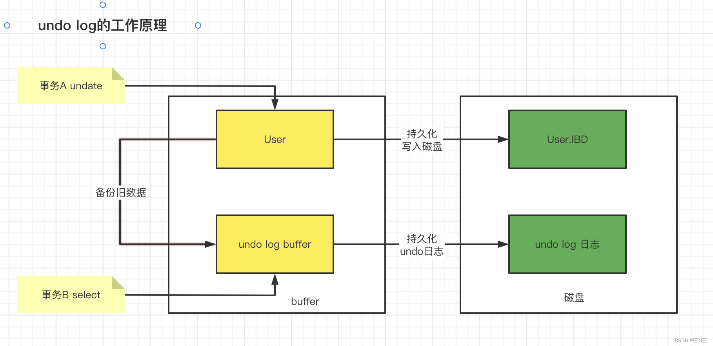

4. undo log版本链是什么？
    在undo log日志里，每条数据除了自有的那些字段(表id、日志类型、数据页号等等)，其实还会有两个隐藏字段，一个是trx_id，另一个是roll_pointer。这个trx_id就是最近一次更新的事务id，roll_pointer是指向你更新这个事务之前生成的undo log数据。

    这里给大家举个例子：
    假设有一个事务A，插入了一个数据A，此时的undo log数据结构如下：

    

    因为事务id是10，所以这条数据的trx_id=10。因为是插入数据，所以没有下一个undo log数据，roll_pointer是空的。接着，此时有一个事务B需要执行，事务B的id=20，那么执行完之后就会新生成一条undo log日志数据，trx_id=20，roll_pointer就会指向实际的回滚日志，也就是值A那条数据。结构如下图所示：

    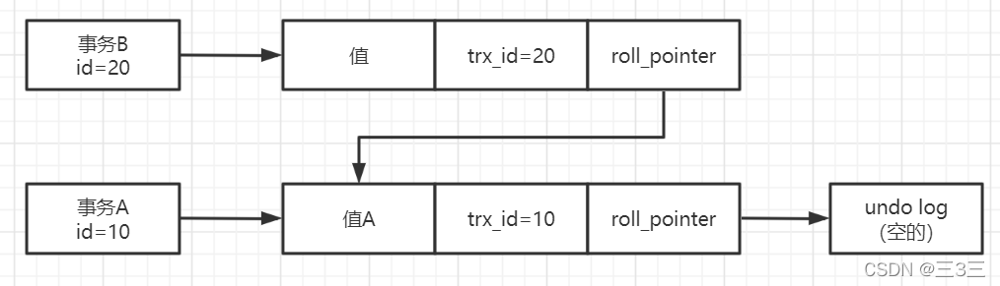

    以此类推，在这个多个事务中，每个事务新生成的undo log日志数据的roll_pointer都会指向前一个undo log日志数据，一次行程undo log版本链。

# MVCC详解

## 1.MVCC是什么？

MVCC，全称Multi-Version Concurrency Control，即**多版本并发控制**。MVCC是一种并发控制的方法，一般在数据库管理系统中，**实现对数据库的并发访问，在编程语言中实现事务内存**。

它主要是用来处理mysql在多线程操作缓存数据时出现的一系列并发问题。

## 2.前置知识点

1）什么是脏写、脏读、不可重复读、幻读？

2）四种隔离级别

3）undo log 版本链

## 3.基于undo log多版本链实现的ReadView机制

**ReadView (读视图)**是“`快照读`”SQL执行时MVCC提取数据的快

`照读`就是最普通的`Select`查询SQL语句

`当前读`指代执行下列语句时进行数据读取的方式

* insert、Updata、Delete、SELECT ... for update 、Select ... lock in share mode

数据结构：

```c
// 四个字段
m_ids: 当前活跃的事务编号集合
min_trx_id: 最小活跃事务编号
max_trx_id: 预分配事务编号，当前最大事务编号 + 1
creator_trx_id: ReadView创建者的事务编号    
```

假设mysql里有个数据，很早之前就有事务插入了，事务id是20，如下图所示：


此时，有两个事务并发过来执行，分别是事务A — id=30，要读取这行数据。事务B — id=35，要修改这行数据。此时事务A会做个判断，判断当前行的trx_id是否小于ReadView中的min_trx_id。此时发现30>20,所以可以得知在事务A开启之前，当前行的事务就已经提交了，因此shiwuA可以查到这条数据。如下图：

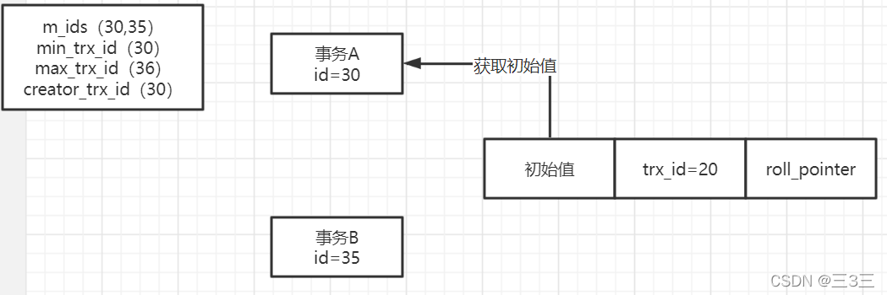

接着事务B开始操作，他把初始值修改成了值B，trx_id设置为自己的事务id，也就是35，同事roll_pointer指向了之前生成的undo log，然后事务B提交了。如下图：

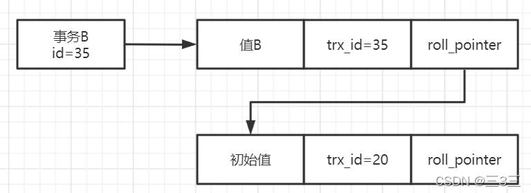

这个时候，事务A再查询，就会发现一个问题，事务A就会发现trx_id变成了35，那么trx_id大于min_trx_id，同时小于ReadView里的max_trx_id=36。说明这个事务可能是和自己差不多时间开始的，然后就会看下这个trx_id是否在m_ids中，在m_ids中发现了35的id，那么就证明当前的数据是和自己同一时间并发启动的事务然后提交的，所以按道理这条数据不能让他看到，就把这条数据屏蔽掉，然后顺着roll_pointer找之前的undo log数据，然后就会找到trx_id=20的那条数据，小于min_trx_id，说明这条数据是在事务A提交之前就完成的，符合查询条件，就把这条数据给暴露出去。

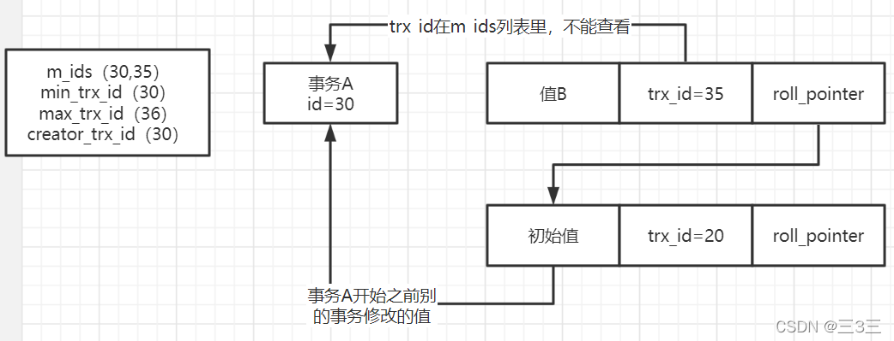

通过undo log多版本链，加上ReadView进行判断的机制，就可以让你读取你应该读取哪个版本的值。

## 4.ReadView机制是如何实现读已提交隔离级别（RC隔离级别）的？

首先了解下RC隔离级别：是指你事务在运行期间，只要别的事务修改数据并且提交了，你就可以读取到修改之后的数据。（这种情况还是会发生不可重复读和幻读）

下面我就用画图的形式，来和大家一步一步的讲解实现过程：
首先假设有个数据，是事务id=50之前就插入进去的，现在活跃着两个事务，事务A — id=60，事务B  — id=70。如下图：

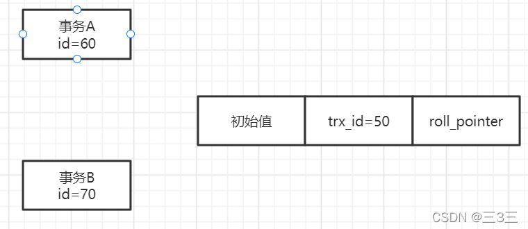

现在事务B将初始值修改成了值B，此时trx_id=70，同时会生成一个undo log数据。如下图：

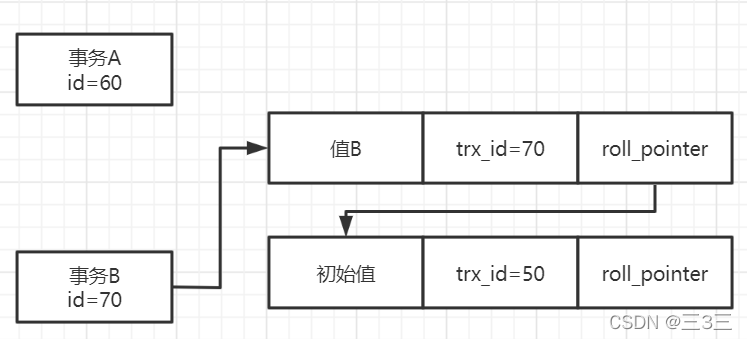

此时事务A发起查询操作，然后生成一个ReadView，m_ids=60、70，min_trx_id=60，max_trx_id=71，creator_trx_id=60。如下图：

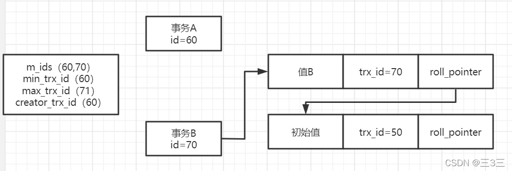

此时事务A发现trx_id=70，大于min_trx_id，并且小于max_trx_id，说明当前事务是和事务A同时提交的，但是又因为trx_id=70，在m_ids里，说明当前事务还没有提交。那么根据读已提交隔离级别要求，事务未提交之前是不能查看修改值的，所以这里事务A看不到事务B的值B，只能根据roll_pointer指向找到上一条undo log数据，在做判断，发现trx_id=50，小于事务A，说明已经提交完成，所以事务A查到的数据是初始值。
接着，这里我们再将事务B提交，那么提交之后，事务A再进行查询，此时会发现m_ids已经变成了m_ids=60，那么说明事务B已经不再活跃m_ids数据中了，说明事务B已经提交了，因此事务A可以查看到事务B的值B。

***这里需要注意一点，读已提交隔离级别中，事务每次执行，都会重新生成一个ReadView，因为只有这样才能获取到最新的事务id数据。***
以上就是基于ReadView实现的RC隔离级别的原理。

## 5. ReadView机制是如何实现可重复读隔离级别（RR隔离级别）的？

我们已经了解了基于ReadView机制实现RC隔离级别的实现原理了，那么应该对RR隔离级别的实现原理也有一个大概猜想了，下面我们还是通过画图方式，来了解实现RR隔离级别的原理。

这里注意：RR隔离级别里，你这个事务 读取一条数据，无论读取多少次，都是一个值，ReadView也一样，别的事务哪怕事务提交了，也不能看到修改后的值，这样就避免了不可重复读的问题。

首先假设有个数据，是事务id=50之前就插入进去的，现在活跃着两个事务，事务A — id=60，事务B — id=70。如下图：


这个时候，事务A发起查询操作，这时候会生成一个ReadView，这是creator_trx_id=60，m_ids=60、71，min_trx_id=60，max_trx_id=71。如下图：

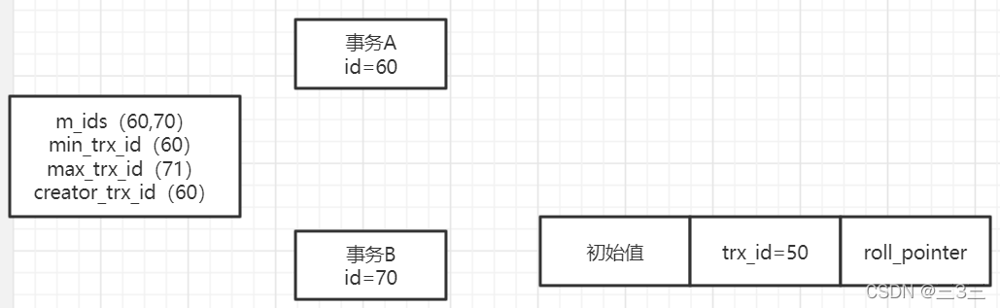

这个时候当前数据的trx_id=50，小于事务A的60，证明当前事务早在事务A之前提交了，所以事务A可以看到初始值。
接着就是事务B开始执行修改操作，此时trx_id=70，初始值改为值B，同时生成一个undo log，并且事务B提交了，也就是说此时事务B已经结束了。如下图：

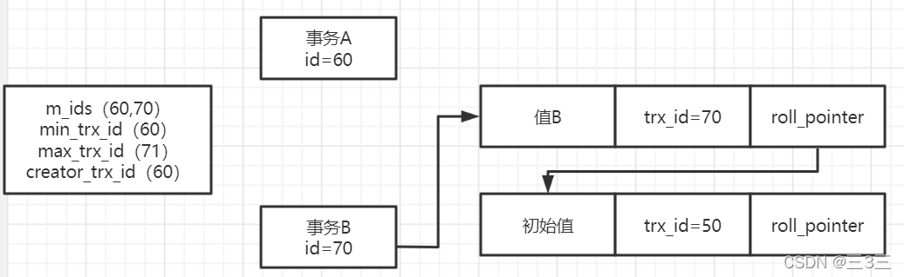

那么此时事务A再次进行查询操作，大家说m_ids的值是多少呢？答案是m_ids=60,70。因为在RR隔离级别中，ReadView一旦生成，就不会改变，这个时候，虽然事务B已经提交了，但是事务A中的ReadView里，还是会有60、70两个活跃事务id。那么此时，事务A会判断trx_id是否大于60，很明显70>60，然后再看m_ids中是否有trx_id=70，是有的，所以这时候事务A还是认为事务B此时还是处于未提交状态，因此不会被允许查看事务B的值，他会根据roll_pointer找到上一条undo log数据，再次判断，50<60,满足条件，因此事务A查到的数据还是初始值。

大家看到这里是不是就感觉到了一下子就避免了不可重复读的问题呢。
同理，当有个事务C插入一条数据，事务id=80，然后提交，在事务A中查看到的max_trx_id还是71，这里会判读80>71,因此事务A会知道，当前事务C是在事务A发起之后才执行的，明显是不能查看他的数据的，因此这里也不会出现幻读的情况。这些都是依托ReadView机制实现的。

到此，如何基于ReadView机制实现隔离级别，避免脏读、不可重复读和幻读的情况，这里就全部解释完毕了。

## 6.总结

**Mysql实现MVCC机制，就是基于`undo log多版本链表`+`ReadView机制`来实现的。默认的RR隔离级别，也是基于这套机制来实现的，处理避免脏读、不可重复读的问题，还能解决幻读的问题，因此我们一般都默认为RR隔离级别就好了。**

## 参考

* https://blog.csdn.net/LT11hka/article/details/122260034?spm=1001.2014.3001.5502

* https://www.bilibili.com/video/BV1hL411479T/?spm_id_from=333.337.search-card.all.click&vd_source=f162d5c25755e0d6b9cc358b4f3e8e4f

    

# MySQL常见的日志有哪些，分别起到了什么作用

1. bin log ：数据恢复、主从复制

MySQL Server 层也有一个日志文件叫做Binlog ，它可以被所有的存储引擎使用。

bin log 以事件的形式记录了所有的 DDL 和 DML 语句（因为他记录的是操作而不是数据值），可以用做主从复制和数据恢复

2. relay log ：中介日志

3. redo log

    记录修改后的值，属于物理日志

    redo log 的大小事固定的，前面的内容会被覆盖，所以不能用于数据回滚/数据恢复

    redo log 是 InnoDB存储引擎实现的，并不是所有引擎都有

4. undo log

    撤销日志，在数据库事务开始之前，MYSQL会去记录更新前的数据到undo log文件中。如果事务回滚或者数据库崩溃时，可以利用undo log日志中记录的日志信息进行回退。同时也可以提供多版本并发控制下的读(MVCC)

    具体查看：https://blog.csdn.net/LT11hka/article/details/125870981什么是Buffer Pool

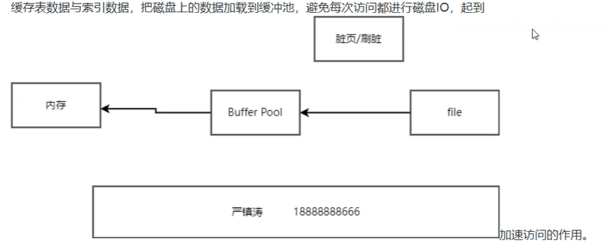

# Buffer pool 内存淘汰策略

冷热分区的LRU策略

冷热分区比：5:3

数据一进来先进入到冷区的头部，默认在1000ms之后如果再次访问，就会将他放入到热区


# 什么是hash索引


不适合做范围查找，innodb不支持hash索引


# MySQL为什么要用B+数做索引

1. B+树能显著的减少IO次数，提高效率
2. B+树的查询效率更加稳定，因为所有的数据都放在了叶子上
3. B+树能提高范围查询的效率，因为叶子结点指向下一个叶子结点


# 数据库优化，什么是数据库索引，有哪些类型

**1、按表列属性分类**
单列索引(主键索引,唯一索引,普通索引)和多列索引（组合索引），全文索引

* 主键索引
* 唯一索引：唯一索引是在一个或多个字段上创建的，但它强制保证每行记录的字段值唯一。
* 普通索引：普通索引是最常用的索引，它是在一个或多个字段上创建的，可以加快数据库查询的速度。
* 多列索引：组合索引是在多个字段上创建的，可以提高查询的效率。
* 全文索引：全文索引是用于文本搜索的特殊索引，它可以提高文本搜索的效率。

**2、按数据结构分类**

* 1） B+tree索引
    b+tree基于平衡二叉树的一种多路平衡查找树，所有记录都按照顺序存放在叶子节点中，各个叶子节点直接通过链表相连。与b树不同的是：非叶子节点只存储键值信息。所有叶子节点之间都有一个链指针。数据记录都存放在叶子节点中。
* 2）hash索引
    基于hash表结构实现的索引，mysql中只有MEMORY/HEAP和NDB存储引擎支持;InnoDB引擎支持自适应hash索引，但是是数据库自身创建使用的，而不能进行人为定义。当二级索引被频繁的访问时，便会自动创建自适应哈希索引;通过 命令SHOW ENGINE INNODB STATUS可查看自适应hash索引的使用情况;通过 命令SHOW VARIABLES LIKE ‘%ap%hash_index’ 查看是否打开自适应hash索引对比：
    由于hash索引是比较其hash值，hash索引只能进行等值查找而不能进行范围查找hash索引无法进行排序：原因同上不支持最左匹配原则，复合索引时合并一起计算hash值hash索引的检索效率很高可以一次定位，但是当发生大量hash碰撞的时候，链表变长，hash索引效率上是不如b+tree的由于存在hash碰撞的问题，当需要获得总数时候，hash 索引在任何时候都不能避免表扫描
* 3）T-tree索引
* 4）R-tree索引

**3、按存储结构分类**

* **1）聚簇索引(聚集索引)**
    InnoDB的聚簇索引实际上是在同一个BTree结构中同时存储了**索引和整行数据**，通过该索引查询**可以直接获取查询数据行**。
    聚簇索引不是一种单独的索引类型，而是一种数据的存储方式，聚簇索引的顺序，就是数据在硬盘上的物理顺序。
    在**mysql**通常聚簇索引是主键的同义词，**每张表只包含一个聚簇索引**(其他数据库不一定)。
* **2）非聚集索引(辅助索引，次级索引，二级索引)**
    非聚集索引在BTree的叶子节点中保存了**索引列和主键**。如果查询列不在该索引内，只能查到其主键值，还**需要回表操作查询聚簇索引进行查询**。
* **聚簇索引的优点：**
    **可以把相关数据保存在一起**，如：实现电子邮箱时，可以根据用户ID来聚集数据，这样只需要从磁盘读取少量的数据页就能获取某个用户全部邮件，如果没有使用聚集索引，则每封邮件都可能导致一次磁盘IO。
    **数据访问更快，聚集索引将索引和数据保存在同一个btree中**，因此从聚集索引中获取数据通常比在非聚集索引中查找要快。
    使用覆盖索引扫描的查询可以直接使用页节点中的主键值。
* **聚簇索引的缺点：**
    聚簇数据最大限度地提高了IO密集型应用的性能，但如果数据全部放在内存中，则访问的顺序就没有那么重要了，聚集索引也没有什么优势了
    插入速度严重依赖于插入顺序，按照主键的顺序插入是加载数据到innodb表中速度最快的方式，但如果不是按照主键顺序加载数据，那么在加载完成后最好使用optimize table命令重新组织一下表
    更新聚集索引列的代价很高，因为会强制innodb将每个被更新的行移动到新的位置。
    基于聚集索引的表在插入新行，或者主键被更新导致需要移动行的时候，可能面临页分裂的问题，当行的主键值要求必须将这一行插入到某个已满的页中时，存储引擎会将该页分裂成两个页面来容纳该行，这就是一次页分裂操作，页分裂会导致表占用更多的磁盘空间。
    聚集索引可能导致全表扫描变慢，尤其是行比较稀疏，或者由于页分裂导致数据存储不连续的时候。
    二级索引可能比想象的更大，因为在二级索引的叶子节点包含了引用行的主键列。
    二级索引访问需要两次索引查找，而不是一次。

# 索引的优缺点

1、优点：创建索引可以大大提高系统的性能。
第一、通过创建唯一性索引，可以保证数据库表中每一行数据的唯一性。 
第二、可以大大加快 数据的检索速度，这也是创建索引的最主要的原因。 
第三、可以加速表和表之间的连接，特别是在实现数据的参考完整性方面特别有意义。 
第四、在使用分组和排序子句进行数据检索时，同样可以显著减少查询中分组和排序的时间。 
第五、通过使用索引，可以在查询的过程中，使用优化隐藏器，提高系统的性能。
 也许会有人要问：增加索引有如此多的优点，为什么不对表中的每一个列创建一个索引呢？这种想法固然有其合理性，然而也有其片面性。虽然，索引有许多优点， 但是，为表中的每一个列都增加索引，是非常不明智的。

2、缺点
第一、创建索引和维护索引要耗费时间，这种时间随着数据量的增加而增加。 
第二、索引需要占物理空间，除了数据表占数据空间之外，每一个索引还要占一定的物理空间。如果要建立聚簇索引，那么需要的空间就会更大。 
第三、当对表中的数据进行增加、删除和修改的时候，索引也要动态的维护，这样就降低了数据的维护速度。

# 谈一下你对数据库b+tree的理解

Mysql索引使用的是B+树，因为索引是用来加快查询的，而B+树通过对数据进行排序所以是可以提高查询速度的，然后通过一个节点中可以存储多个元素，从而可以使得B+树的高度不会太高

在Mysql中一个Innodb页就是一个B+树节点，一个Innodb页默认16kb，所以一般情况下一颗两层的B+树可以存2000万行左右的数据，然后通过利用B+树叶子节点存储了所有数据并且进行了排序，并且叶子节点之间有指针，可以很好的支持全表扫描，范围查找等SQL语句

我们建议不要让B+树的层数超过三层，所以当数据了超过2000W行的时候就要进行分库分表。

# 聚集索引和非聚集索引的区别

1. 聚集索引：聚集索引是指将索引键值作为表中数据物理存储的顺序，并且只能有一个聚集索引。

2. 非聚集索引：非聚集索引不影响表中数据的物理存储顺序，可以有多个非聚集索引，每个索引都包含一个指向表中行的指针。

# 在日常工作中是如何进行数据库优化的

1. 使用正确的索引：为数据库表添加正确的索引可以加快查询速度，提高性能。

2. 合理分配内存：为数据库分配合理的内存可以减少磁盘I/O操作，提高系统性能。

3. 分析查询语句：分析SQL查询语句，改写查询语句，可以减少查询时间，提高数据库性能。

4. 合理分区：合理分区数据库表可以提高查询性能，减少I/O操作，提高系统性能。

5. 数据库优化：使用数据库优化工具，如MySQL优化器，可以改善数据库性能。

6. 合理使用存储过程：使用存储过程可以减少查询次数，提高数据库性能。

# 请列举几个索引失效的场景

(1)like 以%开头，索引无效；当like前缀没有%，后缀有%时，索引有效。

(2)or语句前后没有同时使用索引。当or左右查询字段只有一个是索引，该索引失效，只有当or左右查询字段均为索引时，才会生效

(3)组合索引，不是使用第一列索引，索引失效。

(4)数据类型出现隐式转化。如varchar不加单引号的话可能会自动转换为int型(用select查询时)，使索引无效，产生全表扫描。

(5)在索引列上使用 IS NULL 或 IS NOT NULL操作(在 where 子句中对字段进行 null 值判断)

(6)在索引字段上使用not，<>，!=。不等于操作符是永远不会用到索引的，因此对它的处理只会产生全表扫描。 优化方法： key<>0 改为 key>0 or key<0。

(7)对索引字段进行计算操作、字段上使用函数。

(8)当全表扫描速度比索引速度快时，mysql会使用全表扫描，此时索引失效。

索引失效分析工具：

可以使用explain命令加在要分析的sql语句前面，在执行结果中查看key这一列的值，如果为NULL，说明没有使用索引。

# 数据库锁的机制

**InnoDB支持行级锁(row-level locking)和表级锁，默认为行级锁（偏向于写）**在Mysql中，行级锁并不是直接锁记录，而是锁索引。InnoDB 行锁是通过给索引项加锁实现的，而索引分为主键索引和非主键索引两种

（1）命中索引才锁行，未命中索引默认锁整个索引，即锁表
（2）命中主键索引，直接锁主键索引对应的整行
（3）命中辅助索引，先锁命中的辅助索引，在锁该辅助索引所对应的主键索引

在实际应用中，要特别注意InnoDB行锁的这一特性，不然的话，可能导致大量的锁冲突，从而影响并发性能。
1、在不通过索引条件查询的时候,InnoDB 的效果就相当于表锁
2、当表有多个索引的时候,不同的事务可以使用不同的索引锁定不同的行,另外,不论 是使用主键索引、唯一索引或普通索引,InnoDB 都会使用行锁来对数据加锁。
3、由于 MySQL 的行锁是针对索引加的锁,不是针对记录加的锁,所以即便你的sql语句访问的是不同的记录行,但如果命中的是相同的被锁住的索引键，也还是会出现锁冲突的。
4、即便在条件中使用了索引字段,但是否使用索引来检索数据是由 MySQL 通过判断不同 执行计划的代价来决定的,如果 MySQL 认为全表扫描效率更高,比如对一些很小的表,它 就不会使用索引,这种情况下 InnoDB 将锁住所有行，相当于表锁。因此,在分析锁冲突时, 别忘了检查 SQL 的执行计划,以确认是否真正使用了索引

innodb的三种行锁算法，三种都是排他锁：
1、record lock：单个行记录上的锁
2、gap lock：间隙锁，锁定一个范围，但不包括记录本身。GAP锁的目的，是为了防止同一事务的两次当前读，出现幻读的情况。
3、Next-key lock：等于Record Lock结合Gap Lock，也就说Next-Key Lock既锁定记录本身也锁定一个范围，特别需要注意的是，InnoDB存储引擎还会对辅助索引下一个键值加上gap lock。对于行查询，innodb采用的都是Next-Key Lock，主要目的是解决幻读的问题，以满足相关隔离级别以及恢复和复制的需要。

Innodb自动使用间隙锁的条件：
（1）**必须在RR级别下**
（2）**检索条件必须有索引**（没有索引的话，mysql会全表扫描，那样会锁定整张表所有的记录，包括不存在的记录，此时其他事务不能修改不能删除不能添加）

死锁现象：
死锁就是两个或多个事务在未结束的情况下，用排他锁互相锁死的一种特殊情况，下面有两种死锁情况（仅供参考）

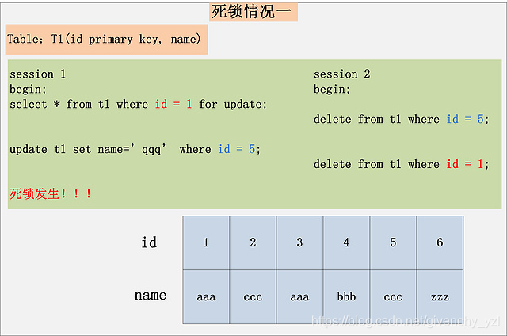

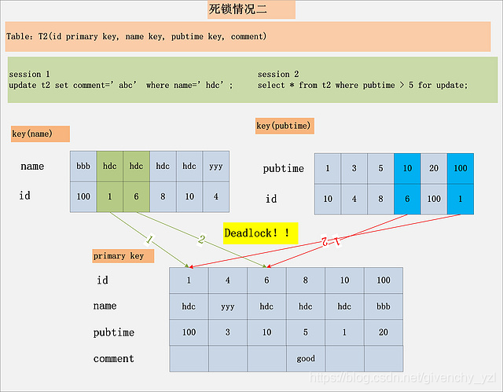

2、死锁产生的本质原理
死锁的发生与否，并不在于事务中有多少条SQL语句，死锁的关键在于：两个(或以上)的Session加锁的顺序不一致。而使用本文上面提到的，分析MySQL每条SQL语句的加锁规则，分析出每条语句的加锁顺序，然后检查多个并发SQL间是否存在以相反的顺序加锁的情况，就可以分析出各种潜在的死锁情况，也可以分析出线上死锁发生的原因。

**行锁优化建议：**
通过检查InnoDB_row_lock状态变量来分析系统上的行锁的争夺情况，在着手根据状态量来分析改善；
show status like ‘innodb_row_lock%’;//查看行锁的状态
尽可能让所有数据检索都通过索引来完成， 从而避免无索引行锁升级为表锁
合理设计索引，尽量缩小锁的范围
尽可能减少检索条件，避免间隙锁
尽量控制事务大小，减少锁定资源量和时间长度
尽可能低级别事务隔离

悲观锁
**在关系数据库管理系统里，悲观并发控制（又名“悲观锁”，Pessimistic Concurrency Control，缩写“PCC”）是一种并发控制的方法。它可以阻止一个事务以影响其他用户的方式来修改数据。**如果一个事务执行的操作都某行数据应用了锁，那只有当这个事务把锁释放，其他事务才能够执行与该锁冲突的操作。
悲观并发控制主要用于数据争用激烈的环境，以及发生并发冲突时使用锁保护数据的成本要低于回滚事务的成本的环境中。
优点：
悲观并发控制实际上是“先取锁再访问”的保守策略，为数据处理的安全提供了保证。

缺点：
（a）在效率方面，处理加锁的机制会让数据库产生额外的开销，还有增加产生死锁的机会；
（b） 在只读型事务处理中由于不会产生冲突，也没必要使用锁，这样做只能增加系统负载；还有会降低了并行性，一个事务如果锁定了某行数据，其他事务就必须等待该事务处理完才可以处理那行数

乐观锁
在关系数据库管理系统里，乐观并发控制（又名“乐观锁”，Optimistic Concurrency Control，缩写“OCC”）是一种并发控制的方法。它假设多用户并发的事务在处理时不会彼此互相影响，各事务能够在不产生锁的情况下处理各自影响的那部分数据。 相对于悲观锁，在对数据库进行处理的时候，乐观锁并不会使用数据库提供的锁机制。一般的实现乐观锁的方式就是记录数据版本。

在数据库中，乐观锁的实现有两种方式
1、使用版本号实现
每一行数据多一个字段version，每次更新数据对应版本号+1，
原理：读出数据，将版本号一同读出，之后更新，版本号+1，提交数据版本号大于数据库当前版本号，则予以更新，否则认为是过期数据，重新读取数据

2、使用时间戳实现
每一行数据多一个字段time
原理：读出数据，将时间戳一同读出，之后更新，提交数据时间戳等于数据库当前时间戳，则予以更新，否则认为是过期数据，重新读取数据

优点与不足
乐观并发控制相信事务之间的数据竞争(data race)的概率是比较小的，因此尽可能直接做下去，直到提交的时候才去锁定，所以不会产生任何锁和死锁。

如何选择
在乐观锁与悲观锁的选择上面，主要看下两者的区别以及适用场景就可以了：
1、乐观锁并未真正加锁，效率高。一旦锁的粒度掌握不好，更新失败的概率就会比较高，容易发生业务失败。
2、悲观锁依赖数据库锁，效率低。更新失败的概率比较低。随着互联网三高架构（高并发、高性能、高可用）的提出，悲观锁已经越来越少的被使用到生产环境中了，尤其是并发量比较大的业务场景。


# 在遇到死锁情况如何处理

死锁的发生与否，并不在于事务中有多少条SQL语句，死锁的关键在于：两个(或以上)的Session加锁的顺序不一致。分析MySQL每条SQL语句的加锁规则，分析出每条语句的加锁顺序，然后检查多个并发SQL间是否存在以相反的顺序加锁的情况，就可以分析出各种潜在的死锁情况，也可以分析出线上死锁发生的原因。

1. 使用数据库调试工具检查死锁，查看死锁发生的原因。

2. 尝试重新调整数据库的索引结构，减少数据库的查询和更新操作，以减少死锁的发生。

3. 将数据库的事务隔离级别调整为更低的级别，以减少死锁的发生。

4. 将数据库的事务超时时间设置得更短，以便及时中断发生死锁的事务。

5. 将死锁发生的数据表拆分成多个表，以减少数据表上的竞争。

# mysql和oracle的区别


# 数据库的根本特点

1、数据结构化 数据库系统实现了整体数据的结构化,这是数据库的最主要的特征之一

2、数据的共享性高,冗余度低,易扩充 因为数据是面向整体的,所以数据可以被多个用户、多个应用程序共享使用

3、数据独立性高 数据独立性包括数据的物理独立性和逻辑独立性。

4、数据由DBMS统一管理和控制 数据库的共享是并发的(concurrency)共享,即多个用户可以同时存取数据库中的数据,甚至可以同时存取数据库中的同一个数据;


# 数据库中数据共享是指

多个应用、多种语言、多个用户共享数据


# 数据库中产生数据不一致

1.并发控制不当

2.数据冗余

3.各种故障，错误

 

第一种往往是由于重复存放的数据未能进行一致性更新造成的

第二种情况是由于多用户共享数据库，而更新操作未能保持同步进行引起的

第三种是由于某种原因（硬件故障或软件故障等）而造成数据丢失或数据损坏等


# 运算


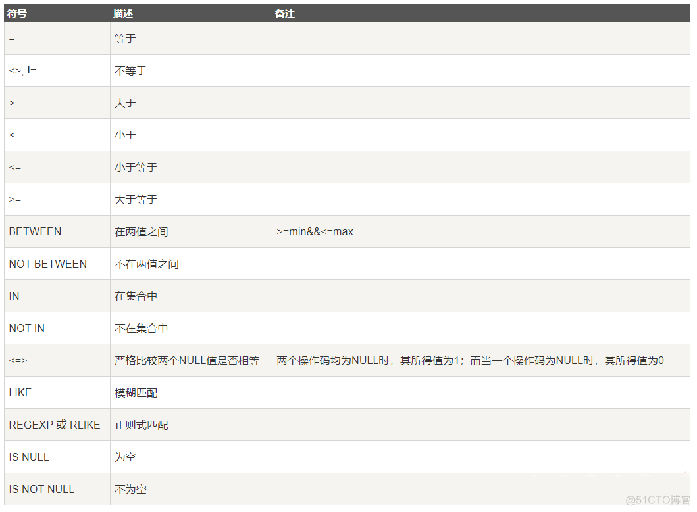


## 运算优先级

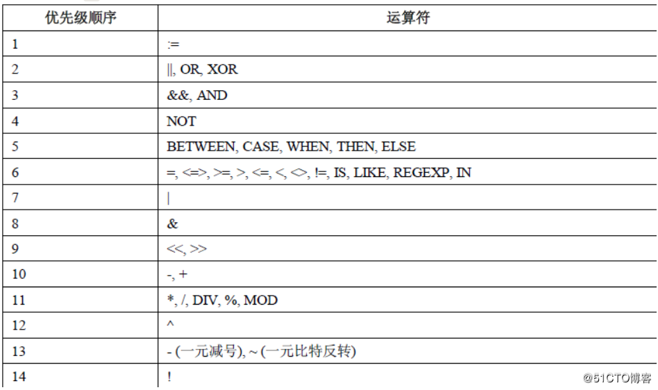


# 问题

1. MySQL索引使用有哪些注意事项呢?

2. MysQL遇到过死锁问题吗，你是如何解决的?

3. 日常工作中你是怎么优化SQL的?

4. 说说分库与分表的设计

5. InnoDB与MylSAM的区别

6. 数据库索引的原理，为什么要用B+树，为什么不用二叉树?

7. 聚集索引与非聚集索引的区别

8. limit 1000000加载很慢的话，你是怎么解决的呢?

    **方案一**：如果id是连续的，可以这样，返回上次查询的最大记录(偏移量)，再往下limit

    select id，name from employee where id>1000000 limit 10.

    **方案二**：在业务允许的情况下限制页数：

    建议跟业务讨论，有没有必要查这么后的分页啦。因为绝大多数用户都不会往后翻太多页。

    **方案三**：order by + 索引（id为索引）

    select id，name from employee order by id limit 1000000，10

    **方案四**：利用延迟关联或者子查询优化超多分页场景。（先快速定位需要获取的id段，然后再关联）

    SELECT a.* FROM employee a, (select id from employee where 条件 LIMIT 1000000,10 ) b where a.id=b.id

9. 如何选择合适的分布式主键方案呢?

10. 事务的隔离级别有哪些?MySQL的默认隔离级别是什么?

11. 什么是幻读，脏读，不可重复读呢?

12. 在高并发情况下，如何做到安全的修改同一行数据?

13. 数据库的乐观锁和悲观锁。

14. select for update有什么含义，会锁表还是锁行还是其他。

    select查询语句是不会加锁的，但是select …for update**除了有查询的作用外，还会加锁呢，而且它是悲观锁，排他锁。**

    那么它加的是行锁还是表锁，这就要看是不是用了索引/主键。

    **没用索引/主键的话就是表锁，否则就是是行锁**。

15. MySQL事务得四大特性以及实现原理

16. 如果某个表有近千万数据，CRUD比较慢，如何优化

17. 如何写sql能够有效的使用到复合索引。

18. mysql中in和exists的区别。

    * 子查询使用 exists，会先进行主查询，将查询到的每行数据循环带入子查询校验是否存在，过滤出整体的返回数据；子查询使用 in，会先进行子查询获取结果集，然后主查询匹配子查询的结果集，返回数据
    * 外表内表相对大小情况不一样时，查询效率不一样：两表大小相当，in 和 exists 差别不大；内表大，用 exists 效率较高；内表小，用 in 效率较高。
    * 不管外表与内表的大小，not exists 的效率一般要高于 not in，跟子查询的索引访问类型有关。

    1. IN 和 EXISTS 都可以用来检测一个值是否存在于一个子查询中，但它们之间有一些重要的区别：

    2. IN 操作符比较的是值，而 EXISTS 操作符比较的是整个子查询的结果。

    3. IN 操作符只能比较一列值，而 EXISTS 操作符可以比较多列值。

    4. IN 操作符不能使用带有“NOT”的条件，而 EXISTS 操作符可以使用带有“NOT”的条件。

    5. IN 操作符的效率比 EXISTS 操作符要低，因为它必须比较每一行，而 EXISTS 操作符只检查是否存在至少一行满足条件。

19. 数据库自增主键可能遇到什么问题。

20. MVCC熟悉吗，它的底层原理?

21. 数据库中间件了解过吗，sharding jdbc，mycat?

22. MYSQL的主从延迟，你怎么解决?

    配合 semi-sync 半同步复制；
    一主多从，分摊从库压力；
    强制走主库方案（强一致性）；
    sleep 方案：主库更新后，读从库之前先 sleep 一下；
    判断主备无延迟方案（例如判断 seconds_behind_master 参数是否已经等于 0、对比位点）；
    并行复制 — 解决从库复制延迟的问题；
    这里主要介绍我在项目中使用的几种方案，分别是半同步复制、实时性操作强制走主库、并行复制。

    

    参考资料：

    * https://blog.csdn.net/weixin_55496718/article/details/126739111
    * https://blog.csdn.net/chuige2013/article/details/128557320

23. 说一下大表查询的优化方案

24. 什么是数据库连接池?为什么需要数据库连接池呢?

    数据库连接池（Database Connection Pooling）在程序初始化时创建一定数量的数据库连接对象并将其保存在一块内存区中，它允许应用程序重复使用一个现有的数据库连接，而不是重新建立一个；释放空闲时间超过最大空闲时间的数据库连接以避免因为没有释放数据库连接而引起的数据库连接遗漏。

    ​     即在程序初始化的时候创建一定数量的数据库连接，用完可以放回去，下一个在接着用，通过配置连接池的参数来控制连接池中的初始连接数、最小连接、最大连接、最大空闲时间这些参数保证访问数据库的数量在一定可控制的范围类，防止系统崩溃，使用户的体验好

    **为什么使用数据库连接池？（形象的说就是用了可以放回去给别人用，大家共享）**

       数据库连接是一种关键、有限且昂贵的资源，创建和释放数据库连接是一个很耗时的操作，频繁地进行这样的操作将占用大量的性能开销，进而导致网站的响应速度下降，严重的时候可能导致服务器崩溃；数据库连接池可以节省系统许多开销。

    

25. 一条SQL语句在MySQL中如何执行的?

    from、where、select、group by having 、order by 、limit

    可以将SQL语句执行分为两种种情况
    **1、查询语句**

    > select * from student where ssex='男' and classid=1;

    * 先去检查语句是否有权限，如果没有权限，就会返回错误信息，如果有权限，就会西安查缓存查询，如果这条sql语句为key在缓存中查询有结果，则返回。
    * 通过分析器进行词法分析，提取sql语句的关键元素。比如上面的语句是select，提取关键字，表名student，条件ssex=男，classid=1.
    * 然后去判断sql语句是否有语法错误，提取的关键字是否有错误。没有就执行下一步
    * 优化器确定优化方案：查询是男的学生；查询班级编号为1 的学生
    * 优化器会根据自己的判断去选择一个自己认为最好的方案去执行
    * 进行权限验证

    **2、增删改**

    > update student set ssex='女' where classid=1

    * 先去查询一般这个数据，如果有缓存的话也是会用到缓存
    * 然后拿到查询的语句，把性别改为女，然后去调用引擎api接口，写入修改的数据，存储引擎innodb把数据保存在内存中，写入日志中，告诉执行器执行
    * 执行器执行，提交事务

26. innodb引擎中的索引策略了解过吗

    InnoDB引擎中的索引策略是一种索引优化技术，它通过分析表中的数据和索引结构，来调整索引结构，以最大程度地提高查询效率。它可以帮助数据库管理员改善查询性能，提高查询速度，减少索引大小，从而节省空间。InnoDB引擎中的索引策略主要有以下几种：

    1. 选择最佳索引：这种索引策略会选择最佳的索引来满足查询的要求，以便最大限度地提高查询性能。

    2. 索引合并：这种索引策略会将多个索引合并成一个索引，以减少索引大小，提高查询性能。

    3. 索引重建：这种索引策略会定期重建表中的索引，以避免索引碎片，提高查询性能。

    4. 索引优化：这种索引策略会根据查询的频率和数据的变化情况，调整索引的结构，以提高查询性能。

27. 一条SQL执行时间过长如何优化

28. MYSQL数据库服务器性能分析的方法命令有哪些?

29. Blob和text有什么区别?

    Blob和text是两种不同的对象类型，用于表示二进制数据。

    Blob是一种**不可变的原始数据类型**，可以表示任意大小的二进制数据，但是不能直接操作。它可以用于存储图像，视频，文档等文件类型。

    Text是一种**可变的原始数据类型**，可以表示字符串，可以直接操作。它可以用于存储文本，网页，JSON等文件类型。

30. mysql里记录货币用什么字段类型比较好?

    MySQL中最常用的字段类型来记录货币是DECIMAL（精度）或NUMERIC（精度）类型。DECIMAL（精度）和NUMERIC（精度）类型允许您指定小数点后的位数，以便更准确地表示货币值。

31. Mysql中有哪几种锁，列举一下?

32. Hash索引和B+树区别是什么?你在设计索引是怎么抉择的?

33. mysql 的内连接、左连接、右连接有什么区别?

34. 说说MySQL的基础架构图

35. 什么是内连接、外连接、交叉连接、笛卡尔积呢?

36. 说一下数据库的三大范式

37. Mysql的binlog有几种录入格式?分别有什么区别?

    1、Row-based格式：这种格式下，MySQL会记录每一行的变更，比如更新前后的值，插入前后的值，删除前后的值等，可以详细描述每一次变更。

    2、Statement-based格式：这种格式下，MySQL只会记录SQL语句本身，不会记录每一行的变更，只能描述变更的范围，比如更新了几行，插入了几行，删除了几行等。

    **区别**：

    Row-based格式比Statement-based格式更加详细，但是会占用更多的空间，Statement-based格式比Row-based格式占用的空间少，但是不能描述每一行的变更。

38. InnoDB引擎的4大特性,了解过吗

    1.事务安全：InnoDB引擎支持ACID事务，保证了事务的原子性、一致性、隔离性和持久性。

    2.行级锁：InnoDB引擎支持行级锁，可以实现多用户并发访问，提高系统的性能。

    3.外键约束：InnoDB引擎支持外键约束，可以防止数据的一致性和完整性。

    4.崩溃恢复能力：InnoDB引擎支持崩溃恢复能力，可以恢复在数据库崩溃时发生的数据损失。

39. 索引有哪些优缺点?索引有哪几种类型?

40. 创建索引有什么原则呢?

41. 创建索引的三种方式

42. 百万级别或以上的数据，你是如何删除的?

43. 什么是最左前缀原则?什么是最左匹配原则?

44. B树和B+树的区别，数据库为什么使用B+树而不是B树?

45. 覆盖索引、回表等这些，了解过吗?

     1、 覆盖索引： 查询列要被所建的索引覆盖，不必从数据表中读取，换句话说查询列要被所使用的索引覆盖。

     2、 回表：二级索引无法直接查询所有列的数据，所以通过二级索引查询到聚簇索引后，再查询到想要的数据，这种通过二级索引查询出来的过程，就叫做回表。

46. 非聚簇索引一定会回表查询吗?

47. 联合索引是什么?为什么需要注意联合索引中的顺序?

48. 数据库隔离级别与锁的关系

49. 聊聊InnoDb的锁，什么是死锁?怎么解决?

50. count(1)、count(*)与count(列名)的区别?

     1、count(*)包含了所有的列，相当于行数，在统计结果的时候，不会忽略列值为空的情况；
     2、count(1)在统计结果的时候也不会忽略列值为空的情况（即某个列为空时，仍进行统计）；
     3、count(列名)在统计的时候会忽略列名为空（null）的情况（即某个列为空时，不统计）；

     **列名要是为主键的话，count(列名)会比count(1)快，反之count(1)快；**

51. 什么是存储过程?有哪些优缺点?

52. SQL约束有哪几种呢?

     1. 主键约束(唯一约束 + 非空约束)
     2. 外键约束
     3. 唯一约束(允许一行数据为空)
     4. 默认值约束
     5. 检查约束
     6. 非空约束

53. char 和 varchar的区别

     |            | char                                    | varchar                                   |
     | ---------- | --------------------------------------- | ----------------------------------------- |
     | 长度       | 定长，长度固定                          | 不定长，长度可变                          |
     | 填充       | < 定长 ，用`空格`填充                   | 不填充                                    |
     | 存储       | 长度固定，速度快，空间大<br/>空间换时间 | 长度不固定，速度慢，空间小<br/>时间换空间 |
     | 最大字符量 | 255                                     | 65532                                     |

     总之，结合**性能角度（char更快）**和**节省磁盘空间角度（varchar更小）**，具体情况还需具体来设计数据库才是妥当的做法。

54. mysql中int(20)、char(20)、varchar(20)的区别

     int(20) 表示字段是int类型，显示长度是 20

     char(20)表示字段是固定长度字符串，长度为 20

     varchar(20) 表示字段是可变长度字符串，长度为 20

55. drop、delete与truncate的区别

56. UNION与UNION ALL的区别?

57. SQL的生命周期?

     //一条SQL由客户端发出后，经过连接和验证，发送到服务器，由服务器派发给线程处理
     1.应用服务器与数据库服务器建立一个连接（tcp/ip连接，GLP协议）
     2.数据库进程拿到请求sql
     3.解析并生成执行计划，执行（解析优化过程）
     4.读取数据到内存并进行逻辑处理
     5.通过步骤一的连接，发送结果到客户端
     6.关掉连接，释放资源

58. 一条Sql的执行顺序?

59. 关心过业务系统里面的sql耗时吗?统计过慢查询吗?对慢查询都怎么优化过?

60. 主键使用自增ID还是UUID，为什么? mysql自增主键用完了怎么办?

     > 最好是用**自增主键**，主要是以下两个原因：

     1. 如果表使用自增主键，那么每次插入新的记录，记录就会顺序添加到当前索引节点的后续位置，当一页写满，就会自动开辟一个新的页。

     2. 如果使用非自增主键(如uuid)，由于每次插入主键的值近似于随机，因此每次新记录都要被插到索引页的随机某个位置，此时MySQL为了将新记录插到合适位置而移动数据，甚至目标页面可能已经被回写到磁盘上而从缓存中清掉，此时又要从磁盘上读回来，这增加了很多开销，同时频繁的移动、分页操作造成索引碎片，得到了不够紧凑的索引结构，后续不得不通过OPTIMIZE TABLE来重建表并优化填充页面。

     不过，也不是所有的场景下都得使用自增主键，可能场景下，主键必须自己生成，不在乎那些性能的开销。那也没有问题。

     > 如果自增主键用完了，如何解决？

     MySQL的主键策略：id自增值达到上限以后，再申请下一个 id 时，仍然是最大值。

     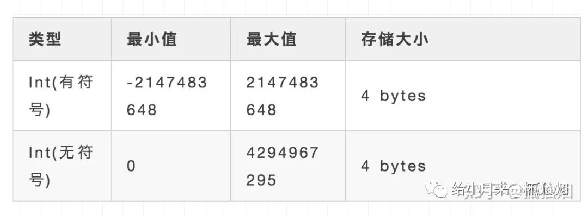

     将Int类型改为BigInt类型，BigInt的范围如下：

     

     bigint也不满足我的需要怎么办呢？

     可以使用雪花算法生成的id做主键，由于其也是大致递增的，对性能也不会产生影响，只需要由bigint改成更大范围的decimal就行。

     

61. MySQL数据库cpu飙升的话，要怎么处理呢?

62. 读写分离常见方案?

63. MySQL的复制原理以及流程

64. Innodb的事务实现原理?

65. 谈谈MySQL的Explain

66. Innodb的事务与日志的实现方式

67. 你们数据库是否支持emoji表情存储，如果不支持，如何操作?

68. 一个6亿的表a，一个3亿的表b，通过外间tid关联，你如何最快的查询出满足条件的第50000到第50200中的这200条数据记录。

69. Mysql一条SOL加锁分析

70. 回表问题和覆盖索引

71. MySQL索引

72. 回表问题和覆盖索引

73. 双写一致性

74. undo 、redo、binlog

75. Hash索引和B+树的区别是什么？

    1. B+树可以进行范围查询,Hash索引不能。
    2. B+树支持联合索引的最左侧原则，Hash索引不支持。B+树支持order by排序，Hash索引不支持。
    3. Hash索引在等值查询上比B+树效率更高。
    4. B+树使用like进行模糊查询的时候，like后面（比如%开头)的话可以起到优化的作用，Hash索引根本无法进行模糊查询

    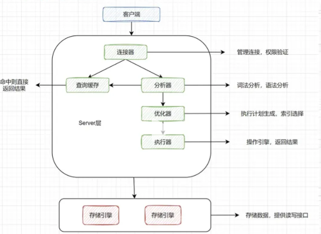

    

    Mysql逻辑架构图主要分三层:

    第一层负责连接处理，授权认证，安全等等

    第二层负责编译并优化SQL

    第三层是存储引擎。


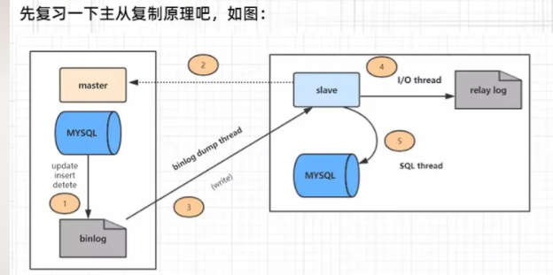

主从复制分了五个步骤进行

1. 主库的更新事件(update、insert、 delete)被写到 binlog
2. 从库发起连接，连接到主库。
3. 此时主库创建一个binlog dump thread，把 binlog的内容发送到从库。
4. 从库启动之后，创建一个I/O 线程，读取主库传过来的 binlog内容并写入到relay log
5. 还会创建一个SQL线程，从relay log里面读取内容，从Exec_Master_Log_Pos位置开始执行读取到的更新事件，将更新内容写入到slave的db


76. 
77. 

## 未完成

# ——————————未完成

