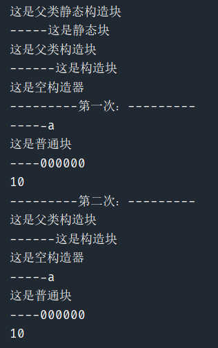
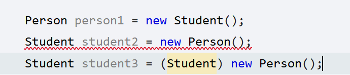
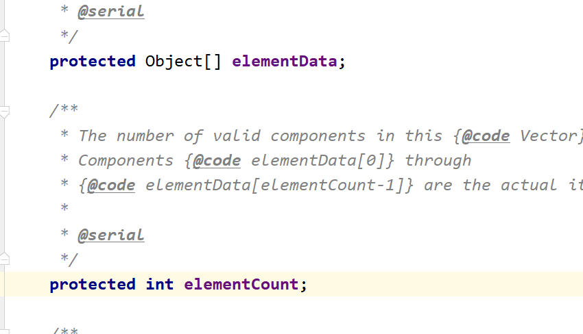
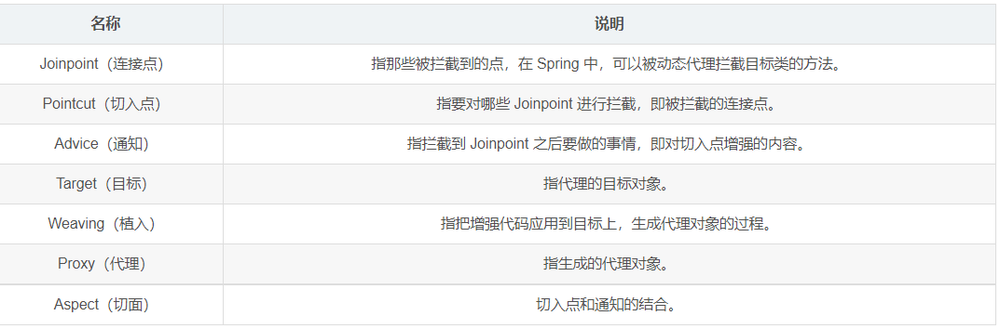
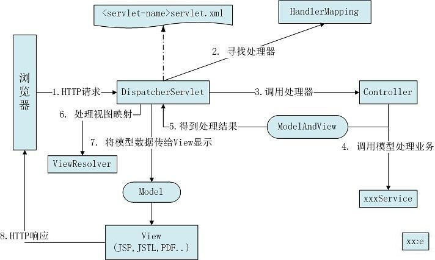
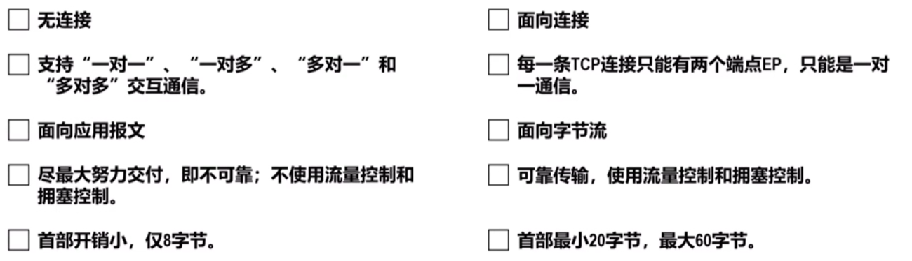
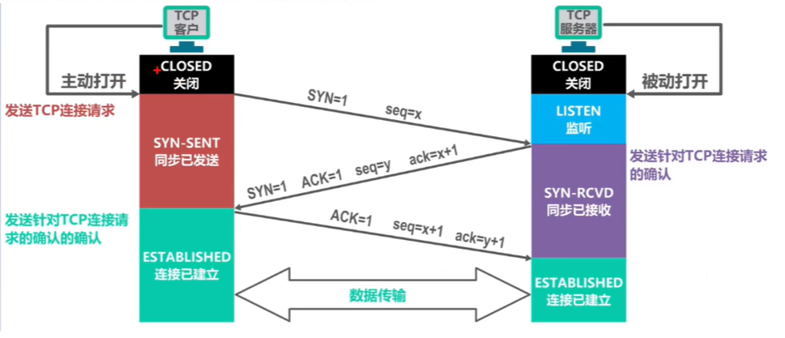

# javaSE基础(不含集合之后的内容)


### 创建JAVA对象方式

一共5种

1、new 申请空间，执行构造方法

```java
Person p = new Person();
```

2、通过Class类中，newInstance()方法，默认去找空参（不建议）

```java
Class cla = Person.class;
Person p = (Person)cla.newInstance();
```

3、通过Construction类中的newInstance()找到对应构造方法去创建

```java
Class cla = Person.class;
Construction construction = cla.getConstruction(String.class);
Person p = (Person)construction.newInstance();
```

4、通过Object类中的Clone()

```java
//要实现Cloneable 重写
```

5、通过对象的反序列化

```java
FileInputStream fis = new FileInputStream("path");
ObjectInputStream ois = new ObjectInputStream(fis);
Person pp = (Person)ois.readObject();
```


### new一个对象的顺序(内含代码块)

* 假设一个类他的父类有**静态代码块**、**代码块**、**构造器**，自身也有**静态代码块**、**代码块**、构造器，以及**方法内部的代码块**

```java
public class TestFather {
    private  int age ;
    {
        System.out.println("这是父类构造块");
    }

    static {
        System.out.println("这是父类静态构造块");
    }

    public TestFather() {
    }
}
```

````java
public class Test extends TestFather {
    //属性
    int a;
    static int sa;
    //方法
    public void a(){
        System.out.println("-----a");
        {
            //普通块限制了局部变量的作用范围
            System.out.println("这是普通块");
            System.out.println("----000000");
            int num = 10;
            System.out.println(num);
        }
        //System.out.println(num);
        //if(){}
        //while(){}
    }
    public static void b(){
        System.out.println("------b");
    }
    //构造块
    {
        System.out.println("------这是构造块");
    }
    //静态块
    static{
        System.out.println("-----这是静态块");

    }
    //构造器
    public Test(){
        System.out.println("这是空构造器");
    }
    public Test(int a){
        this.a = a;
    }

    //这是一个main方法，是程序的入口：
    public static void main(String[] args) {
        Test t = new Test();
        t.a();
        Test t2 = new Test();
        t2.a();
    }
}
````



**总结：**

> *顺序*：
>
> * static变量或者方法
>
>     父类静态构造块  ->  静态构造块  ->  
>
> * Test t = new Test()
>
>     父类构造块  ->  构造块  ->  空参构造  ->  
>
> * t.a();
>
>     方法A  ->  方法中的构造块 ->
>
> * Test t2 = new Test()
>
>     父类构造块  ->  构造块  ->  空参构造  ->  
>
> * t2.a();
>
>     方法A  ->  方法中的构造块

总的来说，

* 父类方法在前
* 静态在前且**只加载一次**
* **构造块 》构造器 》 方法**

新的总结：

> ​	从JVM 的角度来说，再开始的时候先进性类的加载，( Loading [加载器获取 ] 》Linking [校验是否符合语法》附默认值》解析 ]  》initialization [初始化] ) ，在加载阶段我们就将我们的方法体放入了方法区中，初始化的时候就已经将我们的静态系列运行了，这也就是为什么 static 系列的东西只在程序过程中产生一次。


### JAVA有哪几种关键字，作用区间是什么


private：只有类中的子类和方法可以使用

default：只有和自己同一个包下的子类才能使用

protected：只有自己和子类可以直接使用

public：全部范围


### OverLoad 和 Override区别

OverLoad：重载，指同一个类中可以有多个名称相同的方法,但这些方法的参数列表各不相同(即参数个数或类型不同) 

Override：重写，表示子类中的方法可以与父类中的某个方法的名称和参数完全相同


注意：

Override注意事项:
      1.覆盖的方法的标志必须要和被覆盖的方法的标志完全匹配，才能达到覆盖的效果
      2.覆盖的方法的返回值必须和被覆盖的方法的返回一致
      3.覆盖的方法所抛出的异常必须和被覆盖方法的所==抛出的异常一致，或者是其子类==；
      4.被覆盖的==方法不能为private==，否则在其子类中只是新定义了一个方法，并没有对其进行覆盖。

Overload注意事项:
      1.在使用重载时只能通过不同的参数样式。例如，不同的参数类型，不同的参数个数，不同的参数顺序（当然，同一方法内的几个参数类型必须不一样，例如可以是fun(int,float)，但是不能为fun(int,int)）；
      2.不能通过访问权限、返回类型、抛出的异常进行重载；
      3.方法的异常类型和数目不会对重载造成影响；
      4.对于继承来说**，如果某一方法在父类中是访问权限是priavte**，那么就不能在子类对其进行重载，如果定义的话，也只是定义了一个新方法，而不会达到重载的效果

**总结：**

> 重载：名字相同是前提，是否合理看参数，其他都没啥关系，父类一旦私有就玩完
>
> 重写：继承实现是前提，子类起码大于父，犯的错误要更小，返回类型要一致


### 简述一下Java面向对象的基本特征，继承、封装与多态，以及你自己的应用？


继承：就好比一个父亲多个孩子，并且孩子还完全继承父类的方法，private修饰的方法也能继承，只		  是因为封装的特性阻碍了直接调用，但是提供了间接调用的方式，可以间接调用。并且后面多态的条件

封装：把对象的属性和操作（或服务）结合为一个**独立的整体**，并**尽可能隐藏对象的内部实现细节**。

​		  例如，内部属性只对外提供get、set方法，不能直接引用。

多态：多态，故名思意，事物的多种形态。多态跟属性无关，多态指的是方法的多态。打破单继承。

前提：

- **有继承性关系**
- **要有方法的重写**
- **必须是父类引用子类的对象**


### this和super

**this**

1. 对象内部指代自身的引用
2. 解决成员变量和局部变量的同名问题
3. 可以调用成员变量，不能调用局部变量
4. 可以调用成员方法
5. 在普通方法中可以省略this
6. 静态方法中不允许出现

**super**

1. 代表当前对象的直接父类对象的引用
2. 可以调用父类中非private成员变量和方法
3. super()可以调用父类的构造器，只限于构造方法中使用，且必须是第一条


### 怎样声明一个类不会被继承，什么场景下会用？

**final修饰的类**不能有子类 大部分都是出于**安全**考虑

举例：String、Math


### java是什么类型的语言？

#### 面向对象语言：

​	解释之前我们得引入一个概念，**面向过程**，举一个例子，要把大象装进冰箱需要几步

面向过程：

* 打开冰箱，把大象放进去，关上冰箱。

面向对象：

* 打开冰箱（负责：人走到冰箱前面，打开了）
* 存储（负责：大象先迈左腿，然后右腿，然后躺进去）
* 关闭冰箱（然后关上冰箱门。）

面向过程是：要先把事物分析成**不同的步骤**，然后根据步骤一步步的编程。

面向对象是：创建负责某个部分的负责人也就是我们所说的“对象”，在给对象赋值上相应的属性，进行方法形式的编程

**两者相辅相成缺一不可。**

1 解释型


2 编译型


### final 和 static 在JAVA中的意义？

1、static特点

> （1）在类加载的时候一起加载入方法区中的静态域中
> （2）先于对象存在
> （3）访问方式： 对象名.属性名    类名.属性名（推荐）

2、final特点

>修饰一个变量，变量的值不可以改变，这个变量也变成了一个字符常量，约定俗称的规定：名字大写
>
>final修饰方法，那么这个方法不可以被该类的子类重写：
>
>final修饰类，代表没有子类，该类不可以被继承：

3、项目使用场景 

static修饰属性的应用场景：

​	某些特定的数据想要在内存中共享，只有一块 --》这个情况下，就可以用static修饰的属性

final修饰属性的应用场景：

​	（1）使用Math类的时候无需导包，直接使用即可：

​	（2）Math类没有子类，不能被其他类继承了

​	（3）里面的属性全部被final修饰，方法也是被final修饰的，只是省略不写了

​				原因：子类没有必要进行重写。

​	（4）外界不可以创建对象：

​	（5）发现Math类中的所有的属性，方法都被static修饰

​				那么不用创建对象去调用，只能通过类名.属性名  类名.方法名 去调用

### JAVA 中的对象拷贝？


### 什么是接口？

1、制定标准

2、提供可扩展性

3、面向接口编程

### 接口和抽象类的区别：

​    


### 什么是内部类？

分类：4种

1、成员内部类

2、静态内部类

3、局部内部类

4、匿名内部类


### JAVA中的基本数据类型

1、8种数据类型

2、所占字节长度，最大最小

3、BigDecimal对象


### ArrayList是用来干嘛的？

1、原理

 


### Try、catch、finally、return

在`try` 、`catch` 、`finally` 只有一个return有用，也就是说只有最后一个有用

#### 一、try中带有return

```java
 case 3:{
                try {
                    i++;
                    System.out.println("try:"+i);
                    return i;
                }catch (Exception e){
                    i++;
                    System.out.println("catch:"+i);
                }finally {
                    i++;
                    System.out.println("finally:"+i);
                }
                return i;
            }
/*
init:24
try:25
finally:26
最终返回：25
由此可见：try -》 finally -》return
*/
```

​	因为当try中带有return时，会先执行return前的代码，然后暂时保存需要return的信息，再执行finally中的代码，最后再通过return返回之前保存的信息。所以，这里方法返回的值是try中计算后的25，而非finally中计算后的26。


再看一个例子

```java
static List t2(int param){
        int i = 1;
        List<Integer> list = new ArrayList<>();

        System.out.println("init:"+list);
        switch (param){
            case 1:{
                //方式一：
                try {
                    list.add(1);
                    System.out.println("try:"+list);
                    return list;
                }catch (Exception e){
                    i++;
                    list.add(2);
                    System.out.println("catch:"+list);
                    return list;
                }finally {
                    i++;
                    list.add(3);
                    System.out.println("finally:"+list);
                    return list;
                }
            }
            case 2:{
                try {
                    i++;
                    System.out.println("try:"+1);
                    int a =1/0;
                    return list;
                }catch (Exception e){
                    i++;
                    list.add(2);
                    System.out.println("catch:"+list);
                    return list;
                }finally {
                    i++;
                    list.add(3);
                    System.out.println("finally:"+list);
                    return list;
                }
            }
        }
        return null;
    }

/*
init:[]
try:1
catch:[2]
finally:[2, 3]
最终返回：[2, 3]
*/
```

　看完这个例子，可能会发现问题，刚提到return时会临时保存需要返回的信息，不受finally中的影响，为什么这里会有变化？其实问题出在参数类型上，上一个例子用的是基本类型，这里用的引用类型。list里存的不是变量本身，而是变量的地址，所以当finally通过地址改变了变量，还是会影响方法返回值的。


#### 二、catch中带有return

```java
static int t(){
        int i = 24;
        //方式一：
        try {
            i++;
            System.out.println("try:"+i);
            return i;
        }catch (Exception e){
            i++;
            System.out.println("catch:"+i);
            return i;
        }finally {
            i++;
            System.out.println("finally:"+i);
            return i;
        }
    }
/*
try:25
finally:26
最终返回：26
由此可见：try -》 finally
*/
```


#### 三、finally中带有return

```java
			  try {
                    i++;
                    System.out.println("try:"+i);
                    int a =i/0;
                    return i;
                }catch (Exception e){
                    i++;
                    System.out.println("catch:"+i);
                    return i;
                }finally {
                    i++;
                    System.out.println("finally:"+i);
                    return i;
                }
/**
init:24
try:25
catch:26
finally:27
最终返回：27
由此可见 try ->catch -> finally
*/
```

​	当finally中有return的时候，try中的return会失效，在执行完finally的return之后，就不会再执行try中的return。这种写法，编译是可以编译通过的，但是编译器会给予警告，所以不推荐在finally中写return，这会破坏程序的完整性，而且一旦finally里出现异常，会导致catch中的异常被覆盖。

> 基本数据只看值，先返回啥就是啥，后期改动不影响
>
> 引用数据返回只返他地址，后期改动有影响
>
> 多个return只看近


#### 四、总结：

1、finally中的代码总会被执行。

2、当try、catch中有return时，也会执行finally。return的时候，要注意返回值的类型，是否受到finally中代码的影响。

3、finally中有return时，会直接在finally中退出，导致try、catch中的return失效。


### 基本类型的转化

整型 

`byte` `short int  long`  对应字节 1、2 、4、8

浮点

`float` `double`             对应字节 4、8

字符型

`char`								 对应字节 1

布尔

`boolean`					      对应字节 看操作系统


#### 总结

1、长字节的可以直接接收短字节数，短字节数要接收长字节数要强转，同字节数可相互转化，比如 `float` 和 `int`。

2、父与子的关系也可这样理解




### 运算符


**不需要去刻意的记优先级关系**
**赋值<三目<逻辑<关系<算术<单目**


### 取余

```java
int a1= 9 % 4;   // 1
int a2= 9 % -4;  // 1
int a3= -9 % 4;	 // -1
int a4= -9 % -4; // -1
```

技巧：全部都当成正数算，**最后的符号与被除数相同**


### String、StringBuffer、StringBuilder区别与联系

1. String类是不可变类，即一旦一个String对象被创建后，包含在这个对象中的字符序列是不可改变的，直至这个对象销毁。

2. StringBuffer类则代表一个字符序列可变的字符串，可以通过append、insert、reverse、setChartAt、setLength等方法改变其内容。一旦生成了最终的字符串，调用toString方法将其转变为String

3. JDK1.5新增了一个StringBuilder类，与StringBuffer相似，构造方法和方法基本相同。不同是StringBuffer是线程安全的，而StringBuilder是线程不安全的，所以性能略高。通常情况下，创建一个内容可变的字符串，应该优先考虑使用StringBuilder

        StringBuilder:JDK1.5开始  效率高   线程不安全
        
        StringBuffer:JDK1.0开始   效率低    线程安全


### Jdk1.8中的stream有用过吗，详述一下stream的并行操作原理？stream并行的线程池是从哪里来的？

​	**Stream**作为Java8的一大亮点，它与java.io包里的**InputStream**和**OutputStream**是完全不同的概念。它是对容器对象功能的增强，它专注于对容器对象进行各种非常便利、高效的聚合操作或者大批量数据操作。

​	Stream API借助于同样新出现的Lambda表达式，极大的提高编程效率和程序可读性。同时，它==提供串行和并行两种模式进行汇聚操作==，并发模式能够充分利用多核处理器的优势，使用fork/join并行方式来拆分任务和加速处理过程。所以说，Java8中首次出现的 java.util.stream是一个函数式语言+多核时代综合影响的产物。

Stream有如下三个操作步骤：

一、创建Stream：从一个数据源，如集合、数组中获取流。

二、中间操作：一个操作的中间链，对数据源的数据进行操作。

三、终止操作：一个终止操作，执行中间操作链，并产生结果。


​	当数据源中的数据上了流水线后，这个过程对数据进行的所有操作都称为“中间操作”。中间操作仍然会返回一个流对象，因此多个中间操作可以串连起来形成一个流水线。比如map (mapToInt, flatMap 等)、filter、distinct、sorted、peek、limit、skip、parallel、sequential、unordered。

​	当所有的中间操作完成后，若要将数据从流水线上拿下来，则需要执行终止操作。终止操作将返回一个执行结果，这就是你想要的数据。比如：forEach、forEachOrdered、toArray、reduce、collect、min、max、count、anyMatch、allMatch、noneMatch、findFirst、findAny、iterator。

​	多个中间操作可以连接起来形成一个流水线，除非流水线上触发终止操作，否则中间操作不会执行任何处理！而在终止操作时一次性全部处理，称作“惰性求值”。

​	stream并行原理: 其实本质上就是在ForkJoin上进行了一层封装，将Stream 不断尝试分解成更小的split，然后使用fork/join 框架分而治之, parallize使用了默认的ForkJoinPool.common 默认的一个静态线程池.


### JAVA 注解

Annotation（注解）是 Java 提供的一种对元程序中元素关联信息和元数据（metadata）的途径和方法。Annatation(注解)是一个接口，程序可以通过反射来获取指定程序中元素的 Annotation 对象，然后通过该 Annotation 对象来获取注解中的元数据信息。

4 种标准元注解

元注解的作用是负责注解其他注解。 Java5.0 定义了 4 个标准的 meta-annotation 类型，它们被用来提供对其它 annotation 类型作说明。

@Target 修饰的对象范围

@Target说明了Annotation所修饰的对象范围： Annotation可被用于 packages、types（类、接口、枚举、Annotation 类型）、类型成员（方法、构造方法、成员变量、枚举值）、方法参数和本地变量（如循环变量、catch 参数）。在 Annotation 类型的声明中使用了 target 可更加明晰其修饰的目标

@Retention 定义 被保留的时间长短

Retention 定义了该 Annotation 被保留的时间长短：表示需要在什么级别保存注解信息，用于描述注解的生命周期（即：被描述的注解在什么范围内有效），取值（RetentionPoicy）由：

n SOURCE:在源文件中有效（即源文件保留）

n CLASS:在 class 文件中有效（即 class 保留）

n RUNTIME:在运行时有效（即运行时保留）

@Documented 描述**-javadoc**

@ Documented 用于描述其它类型的 annotation 应该被作为被标注的程序成员的公共 API，因此可以被例如 javadoc 此类的工具文档化。

@Inherited 阐述了某个被标注的类型是被继承的

@Inherited 元注解是一个标记注解，@Inherited 阐述了某个被标注的类型是被继承的。如果一个使用了@Inherited 修饰的 annotation 类型被用于一个 class，则这个 annotation 将被用于该 class 的子类


### SynchronizedMap 和 ConcurrentHashMap有什么区别

1、SynchronizedMap对整个map同步

2、ConcurrentHashMap对map的桶加锁


### yield 方法有什么用？

放弃当前线程资源，和其他线程再次同时竞争资源。


### 常用线程池

1、newSingleThreadExceutor 单线程池 ，只有一个线程

2、newFixedThreadPool  最大线程池，可以指定线程池大小

3、newcachedThreadPool  缓存线程池，没有线程有任务就创建线程，有空余线程来任务直接用。

4、newScheduledThreadPool 周期性线程池，定时任务


### 简述线程池的理解

1、降低资源消耗

​	线程的创建和销毁，通过重复利用已创建的线程降低线程创建和销毁造成的消耗。

2、调高响应速度

​	任务到了就直接可以上线程了，不用再new。当任务到达时，任务可以不需要等到线程创建就能立即执行

3、提高线程的可管理性

​	线程是稀缺资源，如果无限制的创建，不仅会消耗系统资源，还会降低系统的稳定性，使用线程池可以进行统一的分配，调优和监控


### 进程和线程的区别

1、进程是执行的程序，系统资源分配和调度的单位

2、线程是进程的一个实体，线程之间共享地址空间和其他资源（所以通信，同步等操作线程更加容易）

3、线程上下文切换快


进程相当于公司，线程相当于公司员工，两个公司交流慢，内部员工交流快


### 死锁的必要条件

1、一个资源每次只能被一个线程使用

2、线程因请求资源而阻塞时，对获得的资源保持不放

3、线程已获得的资源，在未使用完之前，不能强行剥夺

4、若干线程之间形成头尾详解的线程资源需求，A要B，B要A


### 避免死锁

1、线程只有获得到A锁和B锁才能对某资源进行操作

2、获取锁的顺序是一定的


### Java线程池中队列常用类型有什么

1、ArrayBlockingQueue			基于数组，有界长度大小的FIFO队列

2、LinkedBlockingQueue		 基于链表

3、SynchronousQueue			  不存储元素的阻塞队列

4、PriorityBlockingQueue		优先级队列，无限阻塞队列，基于最小二叉堆

5、DelayQueue							 只有当前指定的时间到了才可以拿到数据，没有大小限制，只有获取数据的

​															才阻塞，放的时候没限制


### 线程安全需要保证几个基本特征

1、原子性

2、可见性

3、有序性（避免指令重排序）


### CAS原理

全称：CompareANdSwap，乐观锁，比较并交换，主要是通过处理器的指令来保证操作的原子性 。 


### CAS的缺点

1、ABA问题，就是在比较的时候，比较的和原来的内容恰好相同，但是不是同一个对象。 例如，现在有三个线程，2个是将10+5，还有 1 个是15-5，现在其中一个+5拿到资源开始操作，然后-5线程在进行操作，对于原来的值虽然没有变化，但是进行了操作，在另外一个+5进行原值比较的时候，会误认为没有改变，然后写入新值。他是基本数据类型的时候是没有问题的。但是要是对象的时候，这就有大问题了 ，我们这样就会让我们产生并发问题了。解决这类问题，最简单的办法就是加版本，在对比的时候，不仅仅对比值，还要比较版本。

2、循环时间过长开销大

3、只能保证一个共享变量的原子操作


### 线程池原理和核心参数

1、核心线程数

2、最大线程数

3、活跃时间

4、阻塞队列

5、拒绝策略


### 线程池的拒绝策略有哪些

1、AbortPolicy：直接丢弃，抛异常

2、CallerRunsPolicy：调用者所在的线程处理任务

3、DiscardOldestPolicy：丢弃最久的任务

4、DiscardPolicy：直接丢弃任务，也不抛出异常


### CycliBarrier和CountDownLatch区别

CyclicBarrier线程运行到某个点后停止运行，所有线程到达点，才重新运行

CountDownLatch 线程运行到某个点，给某个数值-1，


线程继续CyclicBarrier唤起一个

CountDownLatch可以唤起多个任务


CyclicBarrier可重用，CountDownLatch不可重用


### Get和Post请求区别

1、get用户信息获取，而其应该是安全的和幂等的

2、POST表示可能修改服务器上的资源的请求

3、Get请求的数据会附在URL之后

4、Get方式提交的数据取决于URL长度限制，理论上POST没有限制，可传较大量的数据

5、POST的安全性要比Get的安全性高


### 转发和重定向的区别

1、转发是服务器行为，重定向是客户端行为

2、重定向是两次请求，第一次是原来的A，然后服务器让他请求B，最后浏览器再请求B。


### JDBC

1.引入Jar包,加载驱动。

2.建立连接Connection,创建执行对象Statement。

3.执行语句。

4.处理结果(查询)。

5.释放资源(关闭连接对象)。


### Cookie是什么，有什么用？

1、cookie就是保存在客户端的纯文本文件

2、访问某些网页，并且对网页的一些设置进行修改，cookie就能跟踪并记录到这些修改。

3、网站服务器把少量数据存储到客户端的硬盘或内存


### HTTP请求状态码

10X		请求一部分，正在请求另外一部分

20X		请求成功

30X		转发

40X		没有资源

50X		服务器内部错误


### ——————————未完成


# 集合

## 基础

### ArrayList集合的add过程

<font size=5 color=#00000 >**1.7和1.8的区别**</font>

在1.7的时候创建不传参直接初始化为10,

在1.8的时候，只是空参构造初始化为{}，元素个数为0，什么时候为10呢？——》在第一次add时候


默认初始化一个数组长度 **1.7：10**    ；**1.8：0（在第一次add时候变为10）**，最大长度为Integer.MAX_VALUE=2147483647=<font color=#FF000 >(2^31)-1</font> ;


当`size`>10 时，list要变，也就是说数组要扩容，扩容为原来的<font color ="red" >1.5倍</font>


```java
	/**
	* minCapacity =size+1
	*/
	private void grow(int minCapacity) {
        // overflow-conscious code
        int oldCapacity = elementData.length;
        //新的数组长度
        int newCapacity = oldCapacity + (oldCapacity >> 1);
        // 扩容后还小于 size+1
        if (newCapacity - minCapacity < 0)
            newCapacity = minCapacity;
        // 扩容后大于 Integer.MAX_VALUE - 8
        if (newCapacity - MAX_ARRAY_SIZE > 0)
            newCapacity = hugeCapacity(minCapacity);
        // minCapacity is usually close to size, so this is a win:
        elementData = Arrays.copyOf(elementData, newCapacity);
    }
```


当到达极端情况下此时arr为最大时 2^31-8

```java
        int a = Integer.MAX_VALUE;
        //MAX_ARRAY_SIZE(2^31-8)
        int b = a - 8;
        // newCapacity
        int c = b + b >> 1;

        //MAX_ARRAY_SIZE(2^31-8)
        System.out.println("MAX_ARRAY_SIZE:"+b);
        // newCapacity
        System.out.println("newCapacity:"+c);
        // newCapacity - minCapacity( size + 1 )
        System.out.println("newCapacity - minCapacity:"+(c-(b+1)));
        // newCapacity - MAX_ARRAY_SIZE(2^31-8)
        System.out.println("newCapacity - MAX_ARRAY_SIZE:"+(c - (a-8)));
```

结果：

```yaml
MAX_ARRAY_SIZE: 2147483639
newCapacity: -1073741838
ewCapacity - minCapacity: 1073741818
newCapacity - MAX_ARRAY_SIZE: 1073741819
```


### 1.8为什么改变成1.7的头插法成尾插法？

剖析：

一个链表想要用**尾插**的形式插入数据，我们首先得知道他的*next*是否为*null*,

```java
class node<T>{
    T data;
    node next;
}
```

一个链表想要用**头插**的形式插入数据，我们首先得知道他的*pre*是否为*null*,其次找到之后还要将新元素的*next*指向原来的头结点

```java
class node<T> {
    T data;
    node pre;
    node next;
}
```

***总结：***

​	从创建开始他的头插的结构体 > 尾插的结构体，其次最主要的是**头插容易形成环形结构**，造成CPU的损耗，尾插法可以避免


### Victor 和 ArrayList区别

【1】底层Object数组，int类型属性表示数组中有效长度：



【2】Vector v=new Vector();调用构造器：


【3】add方法：


**总结：**

|        |              Vector              |                          ArrayList                           |
| :----: | :------------------------------: | :----------------------------------------------------------: |
|  底层  |               数组               |                             数组                             |
| 初始化 |       直接为长度为10的数组       | 1.7：直接为长度为10的数组<br/>1.8只初始化为{}元素个数为0的数组，在第一次add的时候扩大到10 |
|  扩容  |               2倍                |                             1.5                              |
| 安全性 | 安全<br/>add方法加了synchronized |                         不安全<br/>                          |
|  效率  |                低                |                              高                              |


### iterator(),Iterator,Iterable关系


**增强for循环  底层也是通过迭代器实现的：**

**总结：**

`iterator()` 是`Iterable` 接口 中的一个抽象方法，`ArrayList`内部类`Itr`实现了`Iterator`接口，`iterator()`是Arraylist内部的一个方法


### ListIterator迭代器

迭代器不可以和 list 同时操作一个对象，可以用迭代器对象直接操作

不仅有`正向迭代`还有`逆向迭代`

```java
 ArrayList<String> list = new ArrayList<>();
        list.add("aa");
        list.add("bb");
        list.add("cc");
        list.add("dd");
        list.add("ee");
        //在"cc"之后添加一个字符串"kk"
        ListIterator<String> it = list.listIterator();
while(it.hasNext()){
            if("cc".equals(it.next())){
                it.add("kk");
            }
        }
```


### LinkedList底层

​	<font color=red >链表，双向链表</font>

输入和输出结构顺序一致


### HashSet底层是什么

[HashMap](#hashMap_base_code)，所有的值都存在了 **key**中


**基本原理：**

​	在存放数据时，首先要对数据进行`hash`计算然后根据hash值存放到对应的数组地址上，地址重复时，再在该位置上引申上一个链表，在每个值插入之前我们都先要对存储过的值进行比较，用的是`equals` ,如果存在就不存了。

<font color=red >引申</font>

1、要放入HashSet的元素 要具备 `Hash` 、`equals` 两大方法且适合自己，即在自己的类要重写

2、哈希表 = 数组 +链表


### LinkedSet底层

​	<font color=red >哈希表+链表</font>

 唯一，输出顺序和输入顺序一致


### TreeSet底层

<font color=red > TreeMap</font> 底层数据结构为 <font color=red >二叉树</font> ,

他与输入结果 无序，输出结果，有序

一般情况下，随意输入，但是存储的时候，会经过比较器（内部比较强/外部比较器<font color=red >[多用]</font>），经过计算将结果放到合适的位置上，输出的时候，利用中序遍历输出得到一个<font color=red >升序的结果</font>。


<font color=red >引申</font>

**1、外部比较器**

要实现 `Comparator` 接口 ，重写 `camparr` 方法，自定义比较方式，**多用**


**2、二叉树的遍历方式**

​	3种：<font color =red >先序遍历、中序遍历、后序遍历</font>

**先、中、后说的是根节点**，例如

先：12 3 7 9

中：3 7 9 12 16

后：3 7 9 16 12


<div name="hashMap_base_code" >


### HashMap底层

#### 1.7底层遵照 <font color=red >哈希表结构 </font>(头插法)

1.7的源码

```java
	//哈希表默认的数组长度
    static final int DEFAULT_INITIAL_CAPACITY = 16;
	// 最大长度
    static final int MAXIMUM_CAPACITY = 1 << 30;
        //定义了一个float类型的变量，以后作为：默认的装填因子，加载因子是表示Hsah表中元素的填满的程度
        //太大容易引起哈西冲突，太小容易浪费  0.75是经过大量运算后得到的最好值
        //这个值其实可以自己改，但是不建议改，因为这个0.75是大量运算得到的
        static final float DEFAULT_LOAD_FACTOR = 0.75f;
        transient Entry<K,V>[] table;//主数组,每个元素为Entry类型，1.8改名为Node内部一样
        transient int size;
        int threshold;//数组扩容的界限值,门槛值   16*0.75=12 
        final float loadFactor;//用来接收装填因子的变量


        
        //【4】查看构造器：内部相当于：this(16,0.75f);调用了当前类中的带参构造器
        public HashMap() {
        this(DEFAULT_INITIAL_CAPACITY, DEFAULT_LOAD_FACTOR);
    }
        //【5】本类中带参数构造器：--》作用给一些数值进行初始化的！
        public HashMap(int initialCapacity, float loadFactor) {
        //【6】给capacity赋值，capacity的值一定是 大于你传进来的initialCapacity 的 最小的 2的倍数
        int capacity = 1;
        while (capacity < initialCapacity)
            capacity <<= 1;
                //【7】给loadFactor赋值，将装填因子0.75赋值给loadFactor
        this.loadFactor = loadFactor;
                //【8】数组扩容的界限值,门槛值
        threshold = (int)Math.min(capacity * loadFactor, MAXIMUM_CAPACITY + 1);
                
                //【9】给table数组赋值，初始化数组长度为16
        table = new Entry[capacity];
                   
    }
        //【10】调用put方法：
        public V put(K key, V value) {
                //【11】对空值的判断
            if (key == null)
                return putForNullKey(value);
                    //【12】调用hash方法，获取哈希码
            int hash = hash(key);
                    //【14】得到key对应在数组中的位置
            int i = indexFor(hash, table.length);
                    //【16】如果你放入的元素，在主数组那个位置上没有值，e==null  那么下面这个循环不走
                    //当在同一个位置上放入元素的时候
            for (Entry<K,V> e = table[i]; e != null; e = e.next) {
                Object k;
                            //哈希值一样  并且  equals相比一样   
                            //(k = e.key) == key  如果是一个对象就不用比较equals了
                if (e.hash == hash && ((k = e.key) == key || key.equals(k))) {
                    V oldValue = e.value;
                    e.value = value;
                    e.recordAccess(this);
                    return oldValue;
                }
            }
            modCount++;
                    //【17】走addEntry添加这个节点的方法：
            addEntry(hash, key, value, i);
            return null;
  		  }
        
        //【13】hash方法返回这个key对应的哈希值，内部进行二次散列，为了尽量保证不同的key得到不同的哈希码！
        final int hash(Object k) {
        int h = 0;
        if (useAltHashing) {
            if (k instanceof String) {
                return sun.misc.Hashing.stringHash32((String) k);
            }
            h = hashSeed;
        }
                //k.hashCode()函数调用的是key键值类型自带的哈希函数，
                //由于不同的对象其hashCode()有可能相同，所以需对hashCode()再次哈希，以降低相同率。
        h ^= k.hashCode();
        // This function ensures that hashCodes that differ only by
        // constant multiples at each bit position have a bounded
        // number of collisions (approximately 8 at default load factor).
                /*
                接下来的一串与运算和异或运算，称之为“扰动函数”，
                扰动的核心思想在于使计算出来的值在保留原有相关特性的基础上，
                增加其值的不确定性，从而降低冲突的概率。
                不同的版本实现的方式不一样，但其根本思想是一致的。
                往右移动的目的，就是为了将h的高位利用起来，减少哈西冲突
                */
        h ^= (h >>> 20) ^ (h >>> 12);
        return h ^ (h >>> 7) ^ (h >>> 4);
    }
        //【15】返回int类型数组的坐标
        static int indexFor(int h, int length) {
                //其实这个算法就是取模运算：h%length，取模效率不如位运算
        return h & (length-1);
    }
        //【18】调用addEntry
        void addEntry(int hash, K key, V value, int bucketIndex) {
                //【25】size的大小  大于 16*0.75=12的时候，比如你放入的是第13个，这第13个你打算放在没有元素的位置上的时候
        if ((size >= threshold) && (null != table[bucketIndex])) {
                        //【26】主数组扩容为2倍
            resize(2 * table.length);
                        //【30】重新调整当前元素的hash码
            hash = (null != key) ? hash(key) : 0;
                        //【31】重新计算元素位置
            bucketIndex = indexFor(hash, table.length);
        }
                //【19】将hash,key,value,bucketIndex位置  封装为一个Entry对象：
        createEntry(hash, key, value, bucketIndex);
    }
        //【20】
        void createEntry(int hash, K key, V value, int bucketIndex) {
                //【21】获取bucketIndex位置上的元素给e
        Entry<K,V> e = table[bucketIndex];
                //【22】然后将hash, key, value封装为一个对象，然后将下一个元素的指向为e （链表的头插法）
                //【23】将新的Entry放在table[bucketIndex]的位置上
        table[bucketIndex] = new Entry<>(hash, key, value, e);
                //【24】集合中加入一个元素 size+1
        size++;
    }
    //【27】
        void resize(int newCapacity) {
        Entry[] oldTable = table;
        int oldCapacity = oldTable.length;
        if (oldCapacity == MAXIMUM_CAPACITY) {
            threshold = Integer.MAX_VALUE;
            return;
        }
                //【28】创建长度为newCapacity的数组
        Entry[] newTable = new Entry[newCapacity];
        boolean oldAltHashing = useAltHashing;
        useAltHashing |= sun.misc.VM.isBooted() &&
                (newCapacity >= Holder.ALTERNATIVE_HASHING_THRESHOLD);
        boolean rehash = oldAltHashing ^ useAltHashing;
                //【28.5】转让方法：将老数组中的东西都重新放入新数组中
        transfer(newTable, rehash);
                //【29】老数组替换为新数组
        table = newTable;
                //【29.5】重新计算
        threshold = (int)Math.min(newCapacity * loadFactor, MAXIMUM_CAPACITY + 1);
    }
        //【28.6】
        void transfer(Entry[] newTable, boolean rehash) {
        int newCapacity = newTable.length;
        for (Entry<K,V> e : table) {
            while(null != e) {
                Entry<K,V> next = e.next;
                if (rehash) {
                    e.hash = null == e.key ? 0 : hash(e.key);
                }
                                //【28.7】将哈希值，和新的数组容量传进去，重新计算key在新数组中的位置
                int i = indexFor(e.hash, newCapacity);
                                //【28.8】头插法
                e.next = newTable[i];//获取链表上元素给e.next
                newTable[i] = e;//然后将e放在i位置 
                e = next;//e再指向下一个节点继续遍历
            }
        }
    }
```

1.7的头插可能会产生什么问题，为什么？

问题： 可能会产生环链

解析：

通过他的扩容过程中，正常状态下会，他原位置不会变化，只是因为他的结点插入方式为头插法导致我们在每一次的扩容过程之后都会导致我们的链表顺序要翻转一次，这就有一个问题，在单线程的情况下，这么设计是没有问题的，但是在多线程且没有锁的情况下可能会导致产生环。

**扩容前**


正常resize()后


简单解释一下：

假设现在两个线程都已经进入到了trasfer()方法并且同时到达 rehash的地方，线程Thread 2落后于 Thread 1

这时候Thread 1已经扩容结束，但是在线程 Thread 2中的 oldTable 并不是我们修改后的还是原来的，这就有问题了

Thread1结果


Thread2结果


|       Thread  1       |       Thread  2       |
| :-------------------: | :-------------------: |
|     进入transfer      |                       |
|                       |     进入transfer      |
|    e->3, next-> 2     |                       |
|                       |    e->3, next-> 2     |
|     开始rehash()      |                       |
|                       |     开始rehash()      |
|         扩容          |                       |
| 扩容结束(Thread1结果) |                       |
|                       |         扩容          |
|                       | 扩容结束(Thread2结果) |

总结：因为两个线程同时记录的了原链表最初的 结点e地址和 next地址，在一个线程修改完成后顺序由321变成了123，另一个线程再去修改 ，由于头插的缘故 最开始3->2在修改完成后的 2->3之间就回形成环路

#### 1.8底层遵照 <font color=red >哈希表结构 + 红黑树</font>（尾插法）

```java
// HashMap<String,Integer> map = new HashMap<>(); -->JDK 1.7开始类型推断，后面用钻石运算符即可。
public class HashMap<K,V> extends AbstractMap<K,V> 		//【1】继承的AbstractMap中，已经实现了Map接口
    implements Map<K,V>, Cloneable, Serializable { //【2】又实现了这个接口，多余，但是集合的设计者觉得没有必要删除，就这么地了

	//------------------属性部分：
	final float loadFactor;//【3-2】用来接收装填因子的变量
	/*
		【3-3】
		定义了一个float类型的变量，以后作为：默认的装填因子，加载因子是表示Hsah表中元素的填满的程度
        太大容易引起哈西冲突，太小容易浪费  0.75是经过大量运算后得到的最好值
        这个值其实可以自己改，但是不建议改，因为这个0.75是大量运算得到的
	*/
	static final float DEFAULT_LOAD_FACTOR = 0.75f;
	int threshold;//【6-3】数组扩容的界限值,门槛值
	transient Node<K,V>[] table;//【7-5】底层主数组
	//------------------构造器：
	//【3】调用空构造器
	public HashMap() {
		//【3-1】给装填因子loadFactor赋值
        this.loadFactor = DEFAULT_LOAD_FACTOR; // all other fields defaulted
    }
	
	//【4】调用有参构造器：
	public HashMap(int initialCapacity) {
		//【5】调用两个参数构造器
        this(initialCapacity, DEFAULT_LOAD_FACTOR);
    }
	//【6】
	public HashMap(int initialCapacity, float loadFactor) {
		//【6-1】健壮性考虑，传入的数据过小不行，过大不行
        if (initialCapacity < 0)
            throw new IllegalArgumentException("Illegal initial capacity: " +
                                               initialCapacity);
        if (initialCapacity > MAXIMUM_CAPACITY)
            initialCapacity = MAXIMUM_CAPACITY;
        if (loadFactor <= 0 || Float.isNaN(loadFactor))
            throw new IllegalArgumentException("Illegal load factor: " +
                                               loadFactor);
		//【6-2】给装填因子loadFactor赋值，赋值为0.75，这个值可以单独传入改变，但是不建议改变，一般都用默认的0.75
        this.loadFactor = loadFactor;
		//【6-3】给threshold赋值 
        this.threshold = tableSizeFor(initialCapacity);
    }
	//【6-4】返回的是大于initialCapacity的最接近的2的整数倍  ，比如initialCapacity传入10，这个方法返回16
	static final int tableSizeFor(int cap) {//（内部内容讲源码时候不用管，面试题中详讲）
        int n = cap - 1;
        n |= n >>> 1;
        n |= n >>> 2;
        n |= n >>> 4;
        n |= n >>> 8;
        n |= n >>> 16;
        return (n < 0) ? 1 : (n >= MAXIMUM_CAPACITY) ? MAXIMUM_CAPACITY : n + 1;
    }
	
	//------------------方法：
	//【7】调用put方法
	public V put(K key, V value) {
		//【7-1】首先调用hash方法计算哈希值：
		//【7-3】调用putVal方法传入五个参数：
        return putVal(hash(key), key, value, false, true);
    }
	//【7-2】计算hash值
	static final int hash(Object key) {
        int h;
        return (key == null) ? 0 : (h = key.hashCode()) ^ (h >>> 16);
    }
	//【7-4】调用
	final V putVal(int hash, K key, V value, boolean onlyIfAbsent,
                   boolean evict) {
        Node<K,V>[] tab;
		Node<K,V> p; 
		int n, i;
		//【7-6】将底层主数组table给tab，判断是否为null，第一次放数据一定是null
        if ((tab = table) == null || (n = tab.length) == 0)
			//【7-7】走入if分支：table是null，就对table进行扩容，走进resize方法
            n = (tab = resize()).length;//【7-21】table的length为16 ，n为16
		/*
		【7-22】
		i = (n - 1) & hash 根据哈希值和n计算放入数组的位置
		取出这个位置上的元素，看是否为空，如果是第一个元素，一定是null
		*/
        if ((p = tab[i = (n - 1) & hash]) == null)
			//【7-23】在这个位置上将元素封装为Node对象，放入对应位置
            tab[i] = newNode(hash, key, value, null);//封装Node节点new Node<>(hash, key, value, null);
        else {
            Node<K,V> e; K k;
            if (p.hash == hash &&
                ((k = p.key) == key || (key != null && key.equals(k))))
                e = p;
            else if (p instanceof TreeNode)
                e = ((TreeNode<K,V>)p).putTreeVal(this, tab, hash, key, value);
            else {
                for (int binCount = 0; ; ++binCount) {
                    if ((e = p.next) == null) {
                        p.next = newNode(hash, key, value, null);
                        if (binCount >= TREEIFY_THRESHOLD - 1)  
                            treeifyBin(tab, hash);
                        break;
                    }
                    if (e.hash == hash &&
                        ((k = e.key) == key || (key != null && key.equals(k))))
                        break;
                    p = e;
                }
            }
            if (e != null) {  
                V oldValue = e.value;
                if (!onlyIfAbsent || oldValue == null)
                    e.value = value;
                afterNodeAccess(e);
                return oldValue;
            }
        }
        ++modCount;
		//【7-25】size指的是放入集合的键值总数，size++操作，不大于threshold，resize方法不走
        if (++size > threshold)
            resize();
        afterNodeInsertion(evict);
        return null;
    }
	//【7-8】resize方法：---》假设最开始走的是HashMap的空构造器：
	final Node<K,V>[] resize() {
        Node<K,V>[] oldTab = table;//【7-9】table 是null
        int oldCap = (oldTab == null) ? 0 : oldTab.length; //【7-10】oldCap:0
        int oldThr = threshold;//【7-11】threshold为16，oldThr：16
        int newCap, newThr = 0;
        if (oldCap > 0) {//【7-12】不走
            if (oldCap >= MAXIMUM_CAPACITY) {
                threshold = Integer.MAX_VALUE;
                return oldTab;
            }
            else if ((newCap = oldCap << 1) < MAXIMUM_CAPACITY &&
                     oldCap >= DEFAULT_INITIAL_CAPACITY)
                newThr = oldThr << 1;
        }
        else if (oldThr > 0)  //【7-13】走
            newCap = oldThr;//newCap=16
        else {               //【7-14】不走
			 
            newCap = DEFAULT_INITIAL_CAPACITY;
			 
            newThr = (int)(DEFAULT_LOAD_FACTOR * DEFAULT_INITIAL_CAPACITY);
        }
        if (newThr == 0) {//【7-15】走
            float ft = (float)newCap * loadFactor;//【7-16】ft: 16*0.75=12
            newThr = (newCap < MAXIMUM_CAPACITY && ft < (float)MAXIMUM_CAPACITY ?
                      (int)ft : Integer.MAX_VALUE); //【7-17】newThr = 12
        }
		//【7-18】threshold赋值为newThr为12， ---》所以走空构造器这里threshold赋值为12，走有参构造器里面threshold赋值为12？？？？
        threshold = newThr;
        @SuppressWarnings({"rawtypes","unchecked"})
		//【7-19】创建Node数组，长度为newCap16
            Node<K,V>[] newTab = (Node<K,V>[])new Node[newCap];
		//【7-20】table赋值为newTab
        table = newTab;
        if (oldTab != null) {
            for (int j = 0; j < oldCap; ++j) {
                Node<K,V> e;
                if ((e = oldTab[j]) != null) {
                    oldTab[j] = null;
                    if (e.next == null)
                        newTab[e.hash & (newCap - 1)] = e;
                    else if (e instanceof TreeNode)
                        ((TreeNode<K,V>)e).split(this, newTab, j, oldCap);
                    else { 
                        Node<K,V> loHead = null, loTail = null;
                        Node<K,V> hiHead = null, hiTail = null;
                        Node<K,V> next;
                        do {
                            next = e.next;
                            if ((e.hash & oldCap) == 0) {
                                if (loTail == null)
                                    loHead = e;
                                else
                                    loTail.next = e;
                                loTail = e;
                            }
                            else {
                                if (hiTail == null)
                                    hiHead = e;
                                else
                                    hiTail.next = e;
                                hiTail = e;
                            }
                        } while ((e = next) != null);
                        if (loTail != null) {
                            loTail.next = null;
                            newTab[j] = loHead;
                        }
                        if (hiTail != null) {
                            hiTail.next = null;
                            newTab[j + oldCap] = hiHead;
                        }
                    }
                }
            }
        }
        return newTab;
    }
}
```


```java
public class HashMap<K,V> extends AbstractMap<K,V> 
    implements Map<K,V>, Cloneable, Serializable { 
	final float loadFactor;
	static final float DEFAULT_LOAD_FACTOR = 0.75f;
	int threshold;
	transient Node<K,V>[] table;
	public HashMap() {
        this.loadFactor = DEFAULT_LOAD_FACTOR; 
    }
	
	public HashMap(int initialCapacity) {
        this(initialCapacity, DEFAULT_LOAD_FACTOR);
    }
	public HashMap(int initialCapacity, float loadFactor) {
        if (initialCapacity < 0)
            throw new IllegalArgumentException("Illegal initial capacity: " +
                                               initialCapacity);
        if (initialCapacity > MAXIMUM_CAPACITY)
            initialCapacity = MAXIMUM_CAPACITY;
        if (loadFactor <= 0 || Float.isNaN(loadFactor))
            throw new IllegalArgumentException("Illegal load factor: " +
                                               loadFactor);
        this.loadFactor = loadFactor;
        this.threshold = tableSizeFor(initialCapacity);
    }
	static final int tableSizeFor(int cap) {
        int n = cap - 1;
        n |= n >>> 1;
        n |= n >>> 2;
        n |= n >>> 4;
        n |= n >>> 8;
        n |= n >>> 16;
        return (n < 0) ? 1 : (n >= MAXIMUM_CAPACITY) ? MAXIMUM_CAPACITY : n + 1;
    }
	
	//【8-1】put方法
	public V put(K key, V value) {
		//计算hash值
        return putVal(hash(key), key, value, false, true);
    }

	static final int hash(Object key) {
        int h;
        return (key == null) ? 0 : (h = key.hashCode()) ^ (h >>> 16);
    }
	//【8-2】调用putVal方法
	final V putVal(int hash, K key, V value, boolean onlyIfAbsent,
                   boolean evict) {
        Node<K,V>[] tab;
		Node<K,V> p; 
		int n, i;
		
		//【8-3】table不空了，不走if		
        if ((tab = table) == null || (n = tab.length) == 0)
            n = (tab = resize()).length;
		//【8-4】tab[i]不null，不走if
        if ((p = tab[i = (n - 1) & hash]) == null)
            tab[i] = newNode(hash, key, value, null);
        else {
            Node<K,V> e; K k;
			/*
				【8-5】
				判断p.hash == hash哈希值是否相等，即使hash相等也要做&&后续的判断，因为两个对象哈希值相等是有可能的
				(k = p.key) == key   == 比较地址值，String的话一样，不是字符串地址也不一样，
				Animal a1 = new Animal(19);		和 	Animal a2 = new Animal(19);	地址一定不同，就需要用后面的equals进行比较
			*/
            if (p.hash == hash &&
                ((k = p.key) == key || (key != null && key.equals(k))))   //----》哈希值相等，出现哈西碰撞
				//【8-6】将该数组位置的数据给e
                e = p;
            else if (p instanceof TreeNode)
                e = ((TreeNode<K,V>)p).putTreeVal(this, tab, hash, key, value);
            else {
                for (int binCount = 0; ; ++binCount) {
                    if ((e = p.next) == null) {
                        p.next = newNode(hash, key, value, null);
                        if (binCount >= TREEIFY_THRESHOLD - 1)  
                            treeifyBin(tab, hash);
                        break;
                    }
                    if (e.hash == hash &&
                        ((k = e.key) == key || (key != null && key.equals(k))))
                        break;
                    p = e;
                }
            }
            if (e != null) {  
                V oldValue = e.value;
                if (!onlyIfAbsent || oldValue == null)
                    e.value = value;//【8-7】新value替换老value
                afterNodeAccess(e);
                return oldValue;//【8-8】返回老value
            }
        }
        ++modCount;

        if (++size > threshold)
            resize();
        afterNodeInsertion(evict);
        return null;
    }

	final Node<K,V>[] resize() {
        Node<K,V>[] oldTab = table;
        int oldCap = (oldTab == null) ? 0 : oldTab.length; 
        int oldThr = threshold;
        int newCap, newThr = 0;
        if (oldCap > 0) {
            if (oldCap >= MAXIMUM_CAPACITY) {
                threshold = Integer.MAX_VALUE;
                return oldTab;
            }
            else if ((newCap = oldCap << 1) < MAXIMUM_CAPACITY &&
                     oldCap >= DEFAULT_INITIAL_CAPACITY)
                newThr = oldThr << 1;
        }
        else if (oldThr > 0) 
            newCap = oldThr;
        else {    
            newCap = DEFAULT_INITIAL_CAPACITY;
            newThr = (int)(DEFAULT_LOAD_FACTOR * DEFAULT_INITIAL_CAPACITY);
        }
        if (newThr == 0) {
            float ft = (float)newCap * loadFactor;
            newThr = (newCap < MAXIMUM_CAPACITY && ft < (float)MAXIMUM_CAPACITY ?
                      (int)ft : Integer.MAX_VALUE);
        }
        threshold = newThr;
        @SuppressWarnings({"rawtypes","unchecked"})
            Node<K,V>[] newTab = (Node<K,V>[])new Node[newCap];
        table = newTab;
        if (oldTab != null) {
            for (int j = 0; j < oldCap; ++j) {
                Node<K,V> e;
                if ((e = oldTab[j]) != null) {
                    oldTab[j] = null;
                    if (e.next == null)
                        newTab[e.hash & (newCap - 1)] = e;
                    else if (e instanceof TreeNode)
                        ((TreeNode<K,V>)e).split(this, newTab, j, oldCap);
                    else { 
                        Node<K,V> loHead = null, loTail = null;
                        Node<K,V> hiHead = null, hiTail = null;
                        Node<K,V> next;
                        do {
                            next = e.next;
                            if ((e.hash & oldCap) == 0) {
                                if (loTail == null)
                                    loHead = e;
                                else
                                    loTail.next = e;
                                loTail = e;
                            }
                            else {
                                if (hiTail == null)
                                    hiHead = e;
                                else
                                    hiTail.next = e;
                                hiTail = e;
                            }
                        } while ((e = next) != null);
                        if (loTail != null) {
                            loTail.next = null;
                            newTab[j] = loHead;
                        }
                        if (hiTail != null) {
                            hiTail.next = null;
                            newTab[j + oldCap] = hiHead;
                        }
                    }
                }
            }
        }
        return newTab;
    }
}
```


```java
public class HashMap<K,V> extends AbstractMap<K,V> 
    implements Map<K,V>, Cloneable, Serializable { 
	final float loadFactor;
	static final float DEFAULT_LOAD_FACTOR = 0.75f;
	int threshold;
	transient Node<K,V>[] table;
	public HashMap() {
        this.loadFactor = DEFAULT_LOAD_FACTOR; 
    }
	
	public HashMap(int initialCapacity) {
        this(initialCapacity, DEFAULT_LOAD_FACTOR);
    }
	public HashMap(int initialCapacity, float loadFactor) {
        if (initialCapacity < 0)
            throw new IllegalArgumentException("Illegal initial capacity: " +
                                               initialCapacity);
        if (initialCapacity > MAXIMUM_CAPACITY)
            initialCapacity = MAXIMUM_CAPACITY;
        if (loadFactor <= 0 || Float.isNaN(loadFactor))
            throw new IllegalArgumentException("Illegal load factor: " +
                                               loadFactor);
        this.loadFactor = loadFactor;
        this.threshold = tableSizeFor(initialCapacity);
    }
	static final int tableSizeFor(int cap) {
        int n = cap - 1;
        n |= n >>> 1;
        n |= n >>> 2;
        n |= n >>> 4;
        n |= n >>> 8;
        n |= n >>> 16;
        return (n < 0) ? 1 : (n >= MAXIMUM_CAPACITY) ? MAXIMUM_CAPACITY : n + 1;
    }
	
	//【9-1】put方法
	public V put(K key, V value) {
		//计算hash值
        return putVal(hash(key), key, value, false, true);
    }

	static final int hash(Object key) {
        int h;
        return (key == null) ? 0 : (h = key.hashCode()) ^ (h >>> 16);
    }
	//【9-2】调用putVal方法
	final V putVal(int hash, K key, V value, boolean onlyIfAbsent,
                   boolean evict) {
        Node<K,V>[] tab;
		Node<K,V> p; 
		int n, i;
		
		//【9-3】table不空了，不走if		
        if ((tab = table) == null || (n = tab.length) == 0)
            n = (tab = resize()).length;
		//【9-4】tab[i]不null，不走if
        if ((p = tab[i = (n - 1) & hash]) == null)
            tab[i] = newNode(hash, key, value, null);
        else {
            Node<K,V> e; K k;
			/*
				【9-5】
				判断p.hash == hash哈希值是否相等，即使hash相等也要做&&后续的判断，因为两个对象哈希值相等是有可能的
				此时“通话”和“重地”的哈希值一致，但是key不一致，if不走
			*/
            if (p.hash == hash &&
                ((k = p.key) == key || (key != null && key.equals(k))))
                e = p;
            else if (p instanceof TreeNode)//【9-6】p也不是红黑树，不走if
                e = ((TreeNode<K,V>)p).putTreeVal(this, tab, hash, key, value);
            else {
				//【9-7】走到这里，证明数组的这个位置是个链表了
                for (int binCount = 0; ; ++binCount) {//【9-8】无条件的死循环   binCount 链表上节点的个数
					//随着循环  p.next就是一路找链上元素
					//p.next要是没有元素，就要开始追加了呗
                    if ((e = p.next) == null) {//【9-10】一路next比较都没有key相同的数据
					
                        p.next = newNode(hash, key, value, null);//【9-11】追加在链表尾部 ---》 前七后八
						//【9-12】如果节点个数大于8，进行树化：要从链表转为红黑树
                        if (binCount >= TREEIFY_THRESHOLD - 1)  
                            treeifyBin(tab, hash);//【9-13】这里还涉及 剪枝 问题，树节点在6个以下，就又变成链表了
                        break;
                    }
					//【9-9】比较过程中：如果比较链表某个key相同，就break结束了，不用继续走了
                    if (e.hash == hash &&
                        ((k = e.key) == key || (key != null && key.equals(k))))
                        break;
                    p = e;
                }
            }
            if (e != null) {  
                V oldValue = e.value;
                if (!onlyIfAbsent || oldValue == null)
                    e.value = value;//【8-7】新value替换老value
                afterNodeAccess(e);
                return oldValue;//【8-8】返回老value
            }
        }
        ++modCount;

        if (++size > threshold)
            resize();
        afterNodeInsertion(evict);
        return null;
    }

	final Node<K,V>[] resize() {
        Node<K,V>[] oldTab = table;
        int oldCap = (oldTab == null) ? 0 : oldTab.length; 
        int oldThr = threshold;
        int newCap, newThr = 0;
        if (oldCap > 0) {
            if (oldCap >= MAXIMUM_CAPACITY) {
                threshold = Integer.MAX_VALUE;
                return oldTab;
            }
            else if ((newCap = oldCap << 1) < MAXIMUM_CAPACITY &&
                     oldCap >= DEFAULT_INITIAL_CAPACITY)
                newThr = oldThr << 1;
        }
        else if (oldThr > 0) 
            newCap = oldThr;
        else {    
            newCap = DEFAULT_INITIAL_CAPACITY;
            newThr = (int)(DEFAULT_LOAD_FACTOR * DEFAULT_INITIAL_CAPACITY);
        }
        if (newThr == 0) {
            float ft = (float)newCap * loadFactor;
            newThr = (newCap < MAXIMUM_CAPACITY && ft < (float)MAXIMUM_CAPACITY ?
                      (int)ft : Integer.MAX_VALUE);
        }
        threshold = newThr;
        @SuppressWarnings({"rawtypes","unchecked"})
            Node<K,V>[] newTab = (Node<K,V>[])new Node[newCap];
        table = newTab;
        if (oldTab != null) {
            for (int j = 0; j < oldCap; ++j) {
                Node<K,V> e;
                if ((e = oldTab[j]) != null) {
                    oldTab[j] = null;
                    if (e.next == null)
                        newTab[e.hash & (newCap - 1)] = e;
                    else if (e instanceof TreeNode)
                        ((TreeNode<K,V>)e).split(this, newTab, j, oldCap);
                    else { 
                        Node<K,V> loHead = null, loTail = null;
                        Node<K,V> hiHead = null, hiTail = null;
                        Node<K,V> next;
                        do {
                            next = e.next;
                            if ((e.hash & oldCap) == 0) {
                                if (loTail == null)
                                    loHead = e;
                                else
                                    loTail.next = e;
                                loTail = e;
                            }
                            else {
                                if (hiTail == null)
                                    hiHead = e;
                                else
                                    hiTail.next = e;
                                hiTail = e;
                            }
                        } while ((e = next) != null);
                        if (loTail != null) {
                            loTail.next = null;
                            newTab[j] = loHead;
                        }
                        if (hiTail != null) {
                            hiTail.next = null;
                            newTab[j + oldCap] = hiHead;
                        }
                    }
                }
            }
        }
        return newTab;
    }
}
```


**总结：**

默认（创建时只是初始化负载因子，数组长度是在第一次put的时候初始化的）**数组长度为16**，**最大程度${2^{30}}$**,**负载因子为0.75**，扩容时**扩大2倍**，最大不超过 ${2^{31}}$(一旦到达最开始的域值${2^{30}}$就变大)

1.8相对于1.7只是改变了数据结构


### Hashmap为什么要使用红黑树？

​	在jdk1.8版本后，java对HashMap做了改进，在**链表长度大于8**的时候，将后面的数据存在红黑树中，以加快检索速度 

​	红黑树虽然本质上是一棵二叉查找树，但它在二叉查找树的基础上增加了着色和相关的性质使得红黑树相对平衡，从而保证了红黑树的查找、插入、删除的时间复杂度最坏为O(log n)。加快检索速率。

<font color=red >引申</font>

在**链表长度小于6**的时候,红黑树又会变回二叉树


### 主数组的长度为什么是$2^n$？

**原因1：**

因为这个length的长度，会影响 key的位置：


实际上这个算法就是：  h%length   ,但是取模的话  效率太低，所以用位运算效率会很高。

**原因2：**

如果不是2的整数倍，那么 哈西碰撞 哈西冲突的概率就高了很多


### 装填因子0.75的原因

**如果装填因子是1， 那么数组满了再扩容，可以做到  最大的空间利用率** 
但是这是一个理想状态，元素不可能完全的均匀分布，很可能就哈西碰撞产生链表了。产生链表的话 查询时间就长了。 

* **空间好，时间不好**


**如果是0.5的话，就浪费空间，但是可以做到到0.5就扩容 ，然后哈西碰撞就少，不产生链表的话，那么查询效率很高**   

* **时间好，空间不好**


**总结：**

1 	空间利用率高，但是容易造成**hash冲突**，产生链表，降低查询效率；

0.5   不易造成Hash冲突，但是空间利用率低；

综上所述JDK官方折中处理取了一个中间值 0.75


### HashMap 的时间复杂度

在数组中结点没有产生链表的情况下O(1)

在产生链表但长度小于8的时候O(n)

链表长度大于等于8的时候O(logn)


### HashTable底层

底层遵照 <font color=red >哈希表结构 </font>


### LinkedMap底层

底层遵照 <font color=red >哈希表 + 链表</font>


### HashMap和Hashtable有什么区别？

|          |     HashMap      |     Hashtable      |
| -------- | :--------------: | :----------------: |
| 存储     | 允许`Key` 为null | 不允许`Key` 为null |
| 线程安全 |    线程不安全    |      线程安全      |

**推荐使用**：

​	在**Hashtable**的类注释可以看到，**Hashtable**是保留类**不建议使用**，推荐在**单线程环境**下使**用HashMap替代**，如果需要**多线程**使用则**用ConcurrentHashMap替代**。


### TreeMap底层

<font color=red >红黑树</font>

```java
public class TreeMap<K,V>{
        //重要属性：
        //外部比较器：
        private final Comparator<? super K> comparator;
        //树的根节点：
        private transient Entry<K,V> root = null;
        //集合中元素的数量：
        private transient int size = 0;
        //空构造器:
        public TreeMap() {
        comparator = null;//如果使用空构造器，那么底层就不使用外部比较器
    }
        //有参构造器：
        public TreeMap(Comparator<? super K> comparator) {
        this.comparator = comparator;//如果使用有参构造器，那么就相当于指定了外部比较器
    }
        
        public V put(K key, V value) {//k,V的类型在创建对象的时候确定了
        //如果放入的是第一对元素，那么t的值为null
        Entry<K,V> t = root;//在放入第二个节点的时候，root已经是根节点了
                //如果放入的是第一个元素的话，走入这个if中：
        if (t == null) {
                        //自己跟自己比
            compare(key, key); // type (and possibly null) check
                        //根节点确定为root
            root = new Entry<>(key, value, null);
                        //size值变为1
            size = 1;
            modCount++;
            return null;
        }
                
        int cmp;
        Entry<K,V> parent;
        // split comparator and comparable paths
                //将外部比较器赋给cpr:
        Comparator<? super K> cpr = comparator;
                //cpr不等于null，意味着你刚才创建对象的时候调用了有参构造器，指定了外部比较器
        if (cpr != null) {
            do {
                parent = t;
                cmp = cpr.compare(key, t.key);//将元素的key值做比较
                                //cmp返回的值就是int类型的数据：
                                //要是这个值《0 =0  》0
                if (cmp < 0)
                    t = t.left;
                else if (cmp > 0)
                    t = t.right;
                else//cpm==0
                                //如果key的值一样，那么新的value替换老的value  但是key不变 因为key是唯一的
                    return t.setValue(value);
            } while (t != null);
        }
                //cpr等于null，意味着你刚才创建对象的时候调用了空构造器，没有指定外部比较器，使用内部比较器
        else {
            if (key == null)
                throw new NullPointerException();
            Comparable<? super K> k = (Comparable<? super K>) key;
            do {
                parent = t;
                cmp = k.compareTo(t.key);//将元素的key值做比较
                if (cmp < 0)
                    t = t.left;
                else if (cmp > 0)
                    t = t.right;
                else
                    return t.setValue(value);
            } while (t != null);
        }
        Entry<K,V> e = new Entry<>(key, value, parent);
        if (cmp < 0)
            parent.left = e;
        else
            parent.right = e;
        fixAfterInsertion(e);
        size++;//size加1 操作
        modCount++;
        return null;
    }
        
        
}
 static final class Entry<K,V> implements Map.Entry<K,V> {
        K key;
        V value;
        Entry<K,V> left = null;
        Entry<K,V> right = null;
        Entry<K,V> parent;
        boolean color = BLACK;
 }

```


### Collection 和 Collections 区别

Collection，提供了对集合对象进行基本操作的通用**接口方法**，所有集合都是它的子类，比如 List、Set 等。

Collections，是一个**工具类**，它包含了很多静态方法，不能被实例化，比如排序方法： Collections. sort(list)等。


### Arrays.asList()方法之后的集合可以调用什么方法

​	`size()` 只有 size 方法可用，通过查看源码我们知道，将传递过去的数组变成了一个ArrayList集合，但是不是 java.util.ArrayList 而是 java.util.Arrays.ArrayList ,也就是Arrays中的一个内部类，他的方法只定义了`size `、`toArray`、`get`、`set `和 `indexOf`


### Map、Set、List的区别


**List**

> List 中存储的元素有序，指的是读出的顺序与存入的顺序是一致的。

①可以允许重复的对象；
②可以插入多个 null 元素；
③是一个有序容器，保持了每个元素的插入顺序，输出的顺序就是插入的顺序；
④常用的实现类有 ArrayList、LinkedList 和 Vector；ArrayList 最为流行，它提供了使用索引的随意访问，而 LinkedList 则对于经常需要从 List 中添加或删除元素的场合更为合适。


**Set**

> Set 存储的元素是无序的，这里的无序指的是存入的顺序与输出的顺序可能是不一致的。

①不允许重复对象；
②无序容器，你无法保证每个元素的存储顺序，TreeSet 通过 Comparator 或者 Comparable 维护了一个排序顺序；
③只允许一个 null 元素；
④Set 接口最流行的几个实现类是 HashSet、LinkedHashSet 以及 TreeSet；
最流行的是**基于 HashMap** 实现的 HashSet；
TreeSet 还实现了 SortedSet 接口，因此 TreeSet 是一个根据其 compare() 和 compareTo() 的定义进行排序的有序容器。


**Map**

> Map 存储的元素是键值对（key-value），键和值都是无序的，即存入顺序与输出顺序可能都不一样。

①Map 不是 Collection 的子接口或者实现类，Map 是一个接口；
②Map 的 每个 Entry 都持有两个对象，也就是一个键一个值，Map 可能会持有相同的值对象但键对象必须是唯一的；
③TreeMap 也通过 Comparator 或者 Comparable 维护了一个排序顺序；
④Map 里你可以拥有随意个 null 值，但最多只能有一个 null 键；
⑤Map 接口最流行的几个实现类是 HashMap、LinkedHashMap、Hashtable 和 TreeMap。（HashMap、TreeMap 最常用）


### [HashSet与TreeSet 区别](https://www.cnblogs.com/williamjie/p/9099038.html)

**HashSet**
HashSet有以下特点

* 不能保证元素的排列顺序，顺序有可能发生变化
* 不是同步的
* 集合元素可以是null,但只能放入一个null

​    当向HashSet集合中存入一个元素时，HashSet会调用该对象的hashCode()方法来得到该对象的hashCode值，然后根据 hashCode值来决定该对象在HashSet中存储位置。
简单的说，HashSet集合判断两个元素相等的标准是两个对象通过equals方法比较相等，并且两个对象的hashCode()方法返回值相等

​    注意，如果要把一个对象放入HashSet中，重写该对象对应类的equals方法，也应该重写其hashCode()方法。其规则是如果两个对 象通过equals方法比较返回true时，其hashCode也应该相同。另外，对象中用作equals比较标准的属性，都应该用来计算 hashCode的值。

**TreeSet类**
	TreeSet是SortedSet接口的唯一实现类，TreeSet可以确保集合元素处于排序状态。TreeSet支持两种排序方式，自然排序 和定制排序，其中自然排序为默认的排序方式。向TreeSet中加入的应该是同一个类的对象。
	TreeSet判断两个对象不相等的方式是两个对象通过equals方法返回false，或者通过CompareTo方法比较没有返回0
**自然排序**
	自然排序使用要排序元素的CompareTo（Object obj）方法来比较元素之间大小关系，然后将元素按照升序排列。
	Java提供了一个Comparable接口，该接口里定义了一个compareTo(Object obj)方法，该方法返回一个整数值，实现了该接口的对象就可以比较大小。
	obj1.compareTo(obj2)方法如果返回0，则说明被比较的两个对象相等，如果返回一个正数，则表明obj1大于obj2，如果是 负数，则表明obj1小于obj2。
	如果我们将两个对象的equals方法总是返回true，则这两个对象的compareTo方法返回应该返回0
**定制排序**
自然排序是根据集合元素的大小，以升序排列，如果要定制排序，应该使用Comparator接口，实现 int compare(T o1,T o2)方法。

**最重要：**

1、TreeSet 是二差树实现的,Treeset中的数据是自动排好序的，不允许放入null值。 

2、HashSet 是哈希表实现的,HashSet中的数据是无序的，可以放入null，但只能放入一个null，两者中的值都不能重复，就如数据库中唯一约束。 

3、HashSet要求放入的对象必须实现HashCode()方法，放入的对象，是以hashcode码作为标识的，而具有相同内容的 String对象，hashcode是一样，所以放入的内容不能重复。但是同一个类的对象可以放入不同的实例 。

 

**HashSet与TreeSet的使用场景** 

HashSet：哈希表是通过使用称为散列法的机制来存储信息的，元素并没有以某种特定顺序来存放 TreeSet：提供一个使用树结构存储Set接口的实现(红黑树算法)，对象以升序顺序存储，访问和遍历的时间很快。 
使用场景:HashSet是基于Hash算法实现的，其性能通常都优于TreeSet。我们通常都应该使用HashSet，在我们需要排序的功能时，我们才使用TreeSet。 


**HashSet与TreeSet的底层运行方式:** 
TreeSet集合对象的加入过程： 
TreeSet的底层是通过二叉树来完成存储的，无序的集合 
当我们将一个对象加入treeset中，treeset会将第一个对象作为根对象，然后调用对象的compareTo方法拿第二个对象和第一个比较，当返回至=0时，说明2个对象内容相等，treeset就不把第二个对象加入集合。返回>1时，说明第二个对象大于第一个对象，将第二个对象放在右边，返回-1时，则将第二个对象放在左边，依次类推 

HashSet集合对象的加入过程： 
hashset底层是hash值的地址，它里面存的对象是无序的。 
第一个对象进入集合时，hashset会调用object类的hashcode根据对象在堆内存里的地址调用对象重写的hashcode计算出一个hash值，然后第一个对象就进入hashset集合中的任意一个位置。 
第二个对象开始进入集合，hashset先根据第二个对象在堆内存的地址调用对象的计算出一个hash值，如果第二个对象和第一个对象在堆内存里的地址是相同的，那么得到的hash值也是相同的，直接返回true，hash得到true后就不把第二个元素加入集合（这段是hash源码程序中的操作）。如果第二个对象和第一个对象在堆内存里地址是不同的，这时hashset类会先调用自己的方法遍历集合中的元素，当遍历到某个元素时，调用对象的equals方法，如果相等，返回true，则说明这两个对象的内容是相同的，hashset得到true后不会把第二个对象加入集合。


### hashtabl、hashMap treeMap的区别

**实现方面**
	HashMap是继承自AbstractMap类，而HashTable是继承自Dictionary类。它们都同时实现了map、Cloneable（可复制）、Serializable（可序列化）这三个接口。存储的内容是基于key-value的键值对映射，不能有重复的key，而且一个key只能映射一个value。HashSet底层就是基于HashMap实现的。

**为空方面**
	Hashtable的key、value都不能为null；HashMap的key、value可以为null，不过只能有一个key为null，但可以有多个null的value；TreeMap键、值都不能为null。

**排序方面**
	Hashtable、HashMap具有无序特性。TreeMap是利用红黑树实现的（树中的每个节点的值都会大于或等于它的左子树中的所有节点的值，并且小于或等于它的右子树中的所有节点的值），实现了SortMap接口，能够对保存的记录根据键进行排序。所以一般需求排序的情况下首选TreeMap，默认按键的升序排序（深度优先搜索），也可以自定义实现Comparator接口实现排序方式。


**注：**HashTable是一个线程安全的类，它使用**synchronized**来锁住整张[Hash](https://so.csdn.net/so/search?q=Hash&spm=1001.2101.3001.7020)表来实现线程安全，即每次锁住整张表让线程独占，相当于所有线程进行读写时都去竞争一把锁，导致效率非常低下

Hashtable现在很少出现了，大家更多的会使用`ConcurrentHashMap`，引导面试官提问**ConcurrentHashMap**。


### ConcurrentHashMap原理与实现

分析问题：原理与实现主要是锁的原理与实现!我们可以从JDK1.7开始聊起:
	JDK1.7版本,ConcurrentHashMap内部使用段(Segment),ConcurrentLevel有16个分段，这16个分段有独立的锁机制，每个独立的机制都是一张表，表的下面是链表，这样就可以支持并发的同时保证每张表的线程安全，大大的题高了效率。

​	JDK1.8版本,ConcurrentHashMap内部使用sychronized + volatile + CAS的实现降低锁的粒度，大家可以认为粒度就是HashEntry (首节点)。

让我们看看具体是如何实现的:

* 插入、删除、扩容的时候都对数组中相应位置的元素加锁了，加锁用的是synchronized.

* table数组、Node中的val和next、以及一些控制字段都加了volatile
* 在更新一些关键变量的时候用到了sun.misc.Unsafe中的一些方法


**反思&扩展**
**ConcurrentHashMap有什么缺陷吗?**
	ConcurrentHashMap是设计为非阻塞的。在更新时会局部锁住某部分数据，但不会把整个表都锁住。同步读取操作则是完全非阻塞的。好处是在保证合理的同步前提下，效率很高。坏处是严格来说读取操作不能保证反映最近的更新。例如线程A调用putAll写入大量数据，期间线程B调用get，则只能get到目前为止已经顺利插入的部分数据。

**ConcurrentHashMap在JDK7和8之间的区别**
	JDK1.8的实现降低锁的粒度，JDK1.7版本锁的粒度是基于Segment的，包含多个HashEntry，而JDK1.8锁的粒度就是
HashEntry (首节
点)
	JDK1.8版本的数据结构变得更加简单，使得操作也更加清晰流畅，因为已经使用synchronized来进行同步，所以不需要分段锁的概念，也就不需要Segment这种数据结构了，由于粒度的降低，实现的复杂度也增加了
	JDK1.8使用红黑树来优化链表，基于长度很长的链表的遍历是一个很漫长的过程，而红黑树的遍历效率是很快的，代替一定阈值的链表，这样形成一个最佳拍档


### ——————————未完成


# 泛型

什么是泛型（Generic）：
泛型就相当于标签，一般我们在使用的时候基本上往集合中存入的都是相同类型的数据--》便于管理，所以现在什么引用数据类型都可以存入集合，不方便！


### 泛型上、下限

**上限**

```java
        List<Object> object = new ArrayList<>();
        List<Person> person = new ArrayList<>();
        List<Student> student = new ArrayList<>();

        List<? extends Person> list = null;
//        list = object;
        list = person;
        list=student;
```

所有直接承接类必须为 extends 的类的子类/同等级类，？是爹


**下限**

```java
        List<Object> object = new ArrayList<>();
        List<Person> person = new ArrayList<>();
        List<Student> student = new ArrayList<>();

        List<? super Person> list = null;
        list = object;
        list = person;
        //list=student;
```

所有直接承接类必须为 super 的类的父类/同等级类，？是子

**总结**

看上下限，就看 关键字是否为 super，super 下限（**只有子类才用super**)，否则为上限


### Java中的自增（i++/++i）是线程安全的吗，如何实现线程安全的自增？

**不安全**，**加锁，或者用原子类**

增加synchronized进行线程同步

使用lock、unlock处理Reetrantent 锁进行锁定

<font color=red >引申</font>

++操作破坏了原子性，使之线程不安全，JVM 为此类操作特意提供了一些同步类

原子类例如：**AtomicInteger** 


# 多线程

### wait 和 sleep 的区别

wait 进入阻塞状态，但是释放了锁

sleep进入阻塞状态，但是没有释放锁


### wait和notify要放在synchronize中

其实这样设计的原因**就是为了防止多线程并发运行时，程序的执行混乱问题**。不然在有可能会出现在wait没有执行结束的情况下，notify已经执行完毕，这样会导致我们一直处于休眠状态。


### 线程状态


1、`NEW`：初始状态，线程被构建，但是还没有调用 start 方法;

2、`RUNNABLED`：运行状态，JAVA 线程把操作系统中的就绪和运行两种状态统一称为“运行中” ；

3、`BLOCKED`：阻塞状态，表示线程进入等待状态,也就是线程因为某种原因放弃了 CPU 使用权，阻塞也分为几种情况 ：

* 等待阻塞：运行的线程执行了 Thread.sleep 、wait()、 join() 等方法JVM 会把当前线程设置为等待状态，当 sleep 结束、join 线程终止或者线程被唤醒后，该线程从等待状态进入到阻塞状态，重新抢占锁后进行线程恢复；

* 同步阻塞：运行的线程在获取对象的同步锁时，若该同步锁被其他线程锁占用了，那么jvm会把当前的线程放入到锁池中 ；

* 其他阻塞：发出了 I/O请求时，JVM 会把当前线程设置为阻塞状态，当 I/O处理完毕则线程恢复；

4、`WAITING`：等待状态，没有超时时间，要被其他线程或者有其它的中断操作；

执行wait()、join()、LockSupport.park()；

5、`TIME_WAITING`：超时等待状态，超时以后自动返回；

执行 Thread.sleep(long)、wait(long)、join(long)、LockSupport.park(long)、LockSupport.parkNanos(long)、LockSupport.parkUntil(long)

6、`TERMINATED`：终止状态，表示当前线程执行完毕 。


### 线程死亡（DEAD）

正常结束

1、run()或 call()方法执行完成，线程正常结束。

异常结束

2.、线程抛出一个未捕获的 Exception 或 Error。 

调用stop

3、 直接调用该线程的 stop()方法来结束该线程—该方法通常容易导致死锁，不推荐使用。


## 终止线程 4 种方式

### 正常运行结束

程序运行结束，线程自动结束。 

### 使用退出标志退出线程

一般 run()方法执行完，线程就会正常结束，然而，常常有些线程是伺服线程。它们需要长时间的

运行，只有在外部某些条件满足的情况下，才能关闭这些线程。使用一个变量来控制循环，例如：

最直接的方法就是设一个 boolean 类型的标志，并通过设置这个标志为 true 或 false 来控制 while循环是否退出，代码示例：

```java
public class ThreadSafe extends Thread {
    public volatile boolean exit = false;
    public void run() { while (!exit){
        //do something
    }
}
```

定义了一个退出标志 exit，当 exit 为 true 时，while 循环退出，exit 的默认值为 false.在定义 exit时，使用了一个 Java 关键字 volatile，这个关键字的目的是使 exit 同步，也就是说在同一时刻只能由一个线程来修改 exit 的值。

### Interrupt 方法结束线程

使用 interrupt()方法来中断线程有两种情况：

1、线程处于阻塞状态：如使用了 sleep,同步锁的 wait,socket 中的 receive,accept 等方法时，会使线程处于阻塞状态。当调用线程的 interrupt()方法时，会抛出 InterruptException 异常。阻塞中的那个方法抛出这个异常，通过代码捕获该异常，然后 break 跳出循环状态，从而让我们有机会结束这个线程的执行。通常很多人认为只要调用 interrupt 方法线程就会结束，实际上是错的， 一定要先捕获 InterruptedException 异常之后通过 break 来跳出循环，才能正常结束 run 方法。

2、线程未处于阻塞状态：使用 isInterrupted()判断线程的中断标志来退出循环。当使用interrupt()方法时，中断标志就会置 true，和使用自定义的标志来控制循环是一样的道理。

```java
public class ThreadSafe extends Thread {
    public void run() {
        while (!isInterrupted()){ //非阻塞过程中通过判断中断标志来退出
            try{
                Thread.sleep(51000);//阻塞过程捕获中断异常来退出
            }catch(InterruptedException e){
                e.printStackTrace();
                break;//捕获到异常之后，执行 break 跳出循环
            }
        }
    }
}
```


### stop 方法终止线程（线程不安全）

程序中可以直接使用 thread.stop()来强行终止线程，但是 stop 方法是很危险的，就象突然关闭计算机电源，而不是按正常程序关机一样，可能会产生不可预料的结果，不安全主要是：thread.stop()调用之后，创建子线程的线程就会抛出 ThreadDeatherror 的错误，并且会释放子线程所持有的所有锁。一般任何进行加锁的代码块，都是为了保护数据的一致性，如果在调用thread.stop()后导致了该线程所持有的所有锁的突然释放(不可控制)，那么被保护数据就有可能呈现不一致性，其他线程在使用这些被破坏的数据时，有可能导致一些很奇怪的应用程序错误。因此，并不推荐使用 stop 方法来终止线程。


### ——————————未完成


# 线程池

### 线程工厂的目的

当我们们构建核心线程和最大线程，可以通过线程工厂指定线程名字和其他信息，方便我们后期查错。


### 线程池的核心属性

```java
//本质就是一个int类型的数值，前三位标识线程池的状态，后二十九位标识线程的数量
private final AtomicInteger ctl = new AtomicInteger(ctlOf(RUNNING，0));
//本质就是29,为了方便对ctL做位运算使用的常量
private static final int COUNT_BITS = Integer.SIZE - 3;
//计算出线程池的线程最大容量
private static final int CAPACITY = (1 << COUNT_BITS)-1;


//线程池正常运行!		111 ——> -1
private static final int RUNNING= -1 <<COUNT_BITS;
//线程地被shutdown,继续执行完剩下的任务!				000 ——> 0
private static final int SHUTDOwN - 0<<COUNT_BITS;
//线程池被shutdownNow，线程池停止，并且所有任务中断	 001 ——> 1
private static final int STOP = 1 <<COUNT_BITS;
// shutdown或者shutdownNow之后，任务都被处理完之后，到这个过渡状态	010 ——> 2
private static final int TIDYING= 2 <<COUNT_BITS;
//线程池停止			 011 ——> 3
private static final int TERMINATED = 3 <<COUNT_BITS;
```


### 线程池核心的 execute 流程

线程池有两种执行 submit 和  execute ，但是其实都是在源码中 submit的返回值是Future 内部都是执行了 execute()方法，所以我们着重看execute就行，submit相当于他的加强

```java
public Future<?> submit(Runnable task) {
    if (task == null) throw new NullPointerException();
    RunnableFuture<Void> ftask = newTaskFor(task, null);
    execute(ftask);
    return ftask;
}
public <T> Future<T> submit(Callable<T> task) {
    if (task == null) throw new NullPointerException();
    RunnableFuture<T> ftask = newTaskFor(task);
    execute(ftask);
    return ftask;
}
```

execute源码

```java
public void execute(Runnable command) {
    if (command == null)
        throw new NullPointerException();
    // 拿到线程信息，高3位线程状态，其余29位 线程大小
    int c = ctl.get();
    // 基于workerCountOf()获取正在工作的线程数，判断是否小于核心线程数
    if (workerCountOf(c) < corePoolSize) {
        // 创建核心线程，并执行任务  ，传入true表示当前为核心线程
        if (addWorker(command, true))
            return;
        // 如果获取线核心线程失败，重新获取ctl
        c = ctl.get();
    }
    // 获取线程池状态，是否运行；如果线程池正在运行，就将任务追加到阻塞队列
    if (isRunning(c) && workQueue.offer(command)) {
        int recheck = ctl.get();
        if (! isRunning(recheck) && remove(command))
            reject(command);
        else if (workerCountOf(recheck) == 0)
            addWorker(null, false);
    }
    // 尝试创建最大线程数，如果成功返回true，失败了就进行拒绝策略
    else if (!addWorker(command, false))
        reject(command);
}
```


### 线程池增加工作线程的操作

```java
private boolean addWorker(Runnable firstTask, boolean core) {
    // 给for 循环追加标记
    retry:
    for (;;) {
        // 获取线程ctl
        int c = ctl.get();
        // 获取当前线程状态
        int rs = runStateOf(c);
		// 如果 rs >= SHUTDOWN，说明线程池执行了 shutdown 方法或者shutdownNow
        if (rs >= SHUTDOWN &&
            ! (rs == SHUTDOWN && //线程池听了
               firstTask == null && // 任务为null
               ! workQueue.isEmpty())) // 工作队列为空
            return false;

        for (;;) {
            // 获取当前工作线程个数
            int wc = workerCountOf(c);
            // 如果工作线程大于容量 或者 （ 工作线程 》核心线程 | 工作线程 》最大线程 ）
            if (wc >= CAPACITY ||
                wc >= (core ? corePoolSize : maximumPoolSize))
                return false;
            // 基于CAS的方式将工作线程数 + 1
            if (compareAndIncrementWorkerCount(c))
                break retry;
            c = ctl.get(); 
            // 如果没有成功的CAS，就要判断是否重新执行外部循环
            // 如果线程池状态改变,从外侧改变
            // 如果线程池状态没变，从内侧改变
            if (runStateOf(c) != rs)
                continue retry;
        }
    }
	
    //声明了两个标识
    boolean workerStarted = false;
    boolean workerAdded = false;
    // 真正的工作线程就是Worker
    Worker w = null;
    try {
        // 构建Worker,并将任务注入
        w = new Worker(firstTask);
        final Thread t = w.thread;
        if (t != null) {
            // 获取线程池的全局锁
            final ReentrantLock mainLock = this.mainLock;
            // 上锁的为因为，shutdown或者shutdownNow的时候，也需要获取锁资源
            mainLock.lock();
            try {
                // 获取线程池状态
                int rs = runStateOf(ctl.get());
			   // 判断线程池状态 < SHUTDOWN ，也就是RUNNING 状态
                if (rs < SHUTDOWN ||
                    (rs == SHUTDOWN && firstTask == null)) { // 线程池为SHUTDOWN同时任务为null
                    // 如果线程干活了。直接抛出异常
                    if (t.isAlive()) 
                        throw new IllegalThreadStateException();
                    // 将工作线程追加到 Workers(一个HashSet)存储
                    workers.add(w);
                    // 获取这个hashSet 长度
                    int s = workers.size();
                    // 如果现在的工作线程数 > 历史最大线程数，直接替换掉largestPoolSize
                    if (s > largestPoolSize)
                        largestPoolSize = s;
                    // 将工作线程设置为true，表示添加成功
                    workerAdded = true; 
                }
            } finally {
                // 最后释放锁
                mainLock.unlock();
            }
            // 如果工作线程添加成功，启动工作线程
            if (workerAdded) {
                t.start();
                // 设置启动工作线程为True
                workerStarted = true;
            }
        }
    } finally {
        // 如果工作线程启动失败
        if (! workerStarted)
            // 补救操作
            addWorkerFailed(w);
    }
    return workerStarted;
}
```


### 线程池的Work类

```java
public class ThreadPoolExecutor extends AbstractExecutorService {
    //***
    
    private final class Worker // 属于线程池的一个内部类
        extends AbstractQueuedSynchronizer
        implements Runnable  // 继承了Runnable 也就是相对于worker也是一个任务
    {
        
        private static final long serialVersionUID = 6138294804551838833L;

        final Thread thread;
        
        Runnable firstTask;
        
        volatile long completedTasks;

        Worker(Runnable firstTask) {
            setState(-1); 
            this.firstTask = firstTask;
            this.thread = getThreadFactory().newThread(this);
        }

		// 当调用worker 内部线程的 start() 方法时，实际是在调用worker类中的run()方法，实际执行的是runWorker()
        public void run() {
            runWorker(this);
        }
    }
}
```


### 线程池的 runWorker() 方法

```java
final void runWorker(Worker w) {
    // 获取当前线程
    Thread wt = Thread.currentThread();
    // 获取Worker 中的具体任务
    Runnable task = w.firstTask;
    // 将worker中的 task 置为 null
    w.firstTask = null;
    // 将有参构造中的标记(setState(-1))撤销，代表当前线程可以被打断
    w.unlock(); // allow interrupts
    // 标记，
    boolean completedAbruptly = true;
    try {
        // 如果 worker 中的 task有任务，直接执行当前任务，否则去队列中获取任务
        while (task != null || (task = getTask()) != null) {
            // 当前要执行，添加标记，shutdown也不能打断
            w.lock();
           // 判断当前线程池装，以及线程状态，判断是否需要被打断
            if ((runStateAtLeast(ctl.get(), STOP) ||
                 (Thread.interrupted() &&
                  runStateAtLeast(ctl.get(), STOP))) &&
                !wt.isInterrupted())
                wt.interrupt();
            // 执行任务的开始
            try {
                // 在执行任务之前做的事，前置增强
                beforeExecute(wt, task);
                Throwable thrown = null;
                try {
                    // 执行任务
                    task.run();
                } catch (RuntimeException x) {
                    thrown = x; throw x;
                } catch (Error x) {
                    thrown = x; throw x;
                } catch (Throwable x) {
                    thrown = x; throw new Error(x);
                } finally {
                     // 在执行任务之前做的事，后置增强
                    afterExecute(task, thrown);
                }
            } finally {
                // 任务处理结束
                task = null;
                // 标记当前worker处理的任务数 + 1
                w.completedTasks++;
                w.unlock();
            }
        }
        completedAbruptly = false;
    } finally {
        processWorkerExit(w, completedAbruptly);
    }
}
```


### 1、单核CPU设定多线程是否有意义？


### 2、线程数是不是越多越好？

​	并不是，这牵扯到线程调用问题举个反例，盖一个房子需要100H，我100人工作一小时就可以完成？显然不可以。甚至会降低效率，浪费资源


### 3、线程数设置多少最合适？

* **压测**（就是不停尝试，找到最合适的）， 一般情况下，为了安全不可能全部占用，我们留出一部分空间我们一般取80%，

:one:64核CPU我们全部使用，其他的程序就无法启动，显然不正常

* **通过公式计算**


:o: $32*8*(1+0.2)=30.72$​


### 如何优雅的结束一个线程？

:one: stop()方法，但是不建议，容易产生数据不一致情况		【**已废**】

:two: suspend()、resume()方法，暂停，继续方法，暂停的时候不会释放锁，容易产生死锁【**已废**】

:three: vlatile()，时间无法控制

* 不适合某些场景（比如还没有同步的时候，线程做了阻塞操作，没有办法循环回去）

* 打断时间也不是特别精确，比如一个阻塞容器，容量为5的时候结束生产者，
    但是，由于volatile同步线程标志位的时间控制不是很精确，有可能生产者还继续生产一段儿时间

:four: interrupt() and isInterrupted（比较优雅）


### 程序真的会一行一行的运行吗？

​	不一定，在没有相互依赖的语句，可能为了效率后面的语句会同时运行，运行完成的时间比前一个跟快。


### this对象溢出问题？

```java
public class Test {
    private static Integer num = 8;

    public Test() {
        new Thread(() -> {
            System.out.println(this.num);
        }).start();

    }

    public static void main(String[] args) throws IOException {
        Test test = new Test();
        System.in.read();
    }
}
```

最终结果可能是什么？

:one:、8

:two:、0

为什么是0呢，因为在我们初始化的时候有可能会导致我们创建的这个线程直接去读取未被初始化的Num，所以解决方案

* 可以在构造器中new但是不要启动，启动单另写一个方法启动


### 线程池的好处

1、降低资源消耗

​	线程的创建和销毁，通过重复利用已创建的线程降低线程创建和销毁造成的消耗。

2、调高响应速度

​	任务到了就直接可以上线程了，不用再new。当任务到达时，任务可以不需要等到线程创建就能立即执行

3、提高线程的可管理性

​	线程是稀缺资源，如果无限制的创建，不仅会消耗系统资源，还会降低系统的稳定性，使用线程池可以进行统一的分配，调优和监控


### ————————未完成


# JVM

### 基础内容


1、方法区

线程共享，方法区是逻辑上堆的一部分，虚拟机有一个在所有Java虚拟机线程之间共享的方法区。

运行时常量池、字段和方法数据，以及方法和构造函数的代码，包括类和实例初始化和接口初始化中使用的特殊方法。

如果方法区域中的内存无法满足分配请求，Java 虚拟机将抛出一个OutOfMemoryError

2、堆（虚拟机中最大的一块）

线程共享

堆是为所有类实例和数组分配内存的运行时数据区域。

内存不足OutOfMemoryError

3、java虚拟机栈				执行java方法								线程私有		深度不够时，Stack OverflowError

4、本地方法栈					执行本地方法（C++）			

5、程序计数器					记录程序执行到的位置			线程私有		深度不够时，Stack OverflowError


栈帧代表一个方法的运行，他的结构如图所示：


==还少一个附加信息==

**附加信息：栈帧的高度  +  虚拟机版本信息**

**栈帧信息：附加信息  +  动态链接  + 方法的返回地址** 

**局部变量表：方法中定义的局部变量以及方法的参数都会存放在这张表中，单纯的存储单元**

**操作数栈：以压栈以及出栈的方式存储操作数**

int a = 1;

int b = 1;

int c = a + b;

将a，b从表中拿出来，然后将c返回到表中

**方法的返回地址：当你一个方法执行的时候，只有两种方法可以退出**

* 遇到方法的返回字节码指令
* 出现异常，有异常处理，则交给异常处理器，没有就抛出异常

**动态链接：动态链接将这些符号方法引用转换为具体的方法引用，简单来说，符号引用转变为直接引用**

```java
void a() {
    b();
}
void b() {
    c();
}
void c() {}
// 如果调用a()最终执行的是c()
```

**但是这里有个问题，符号引用转变为直接引用，我们在类加载的时候已经做过了，为什么又要来一次？**

> 这是因为我们java的多态，我们在刚开始的时候并不知道，具体的实现方法，要在我们运行的过程中，
> 才能知道，我们运用的是哪一个，所以我们这个时候会再来一次 “符号的引用转变为直接引用”


### 类加载机制


类加载机制其实就是虚拟机把Class文件加载到内存并对数据进行校验，转换解析和初始化，形成可以虚拟机直接使用的Java类型，即java.lang.Class

1、装载

Class文件 ——> 二进制字节流 ——> 类加载器

1）通过一个类的全限定名获取这个类的二进制字节流

2）将这个字节流所代表的静态存储结构转换成为方法区的运行时数据结构

3）在Java堆中生成一个代表这个类的Java.lang.Class对象，作为我们方法区得数据访问入口

2、链接

1）验证，保证我们类加载的正确性

* 文件格式的验证（这一步其实在我们我们装载的时候进行）
* 元数据验证
* 字节码验证
* 符号引用验证

2）准备

为==类的静态变量分配内存==，并将其初始化为当前类型的==默认值==

3）解析

解析是从运行时常量池中的符号引用动态确定具体指的过程。

把类中的符号引用转换成直接引用

3、初始化

执行到Clinit方法，为静态变量赋值，初始化静态代码块，初始化当前类的父类。


### 类加载器


启动类加载器、扩展类加载器、系统加载器、自定义加载器

### 双亲委派机制

原名叫：父类委托机制


### 打破双亲委派机制

1.复写		重写classloader

2.SPI			Service Provider Interface      服务提供接口

可插拔设计，可以随时替换实现

3.OSGI 		热部署，热更新


### 对象的创建过程

1、对象类的加载——> ClassLoader

​	load

​	link(verification[检验是否符合标准],preparation[对对象附默认值],resolution[做解析])

​	initializing(类的初始化) -> 静态变量附默认值，并执行静态语句块

2、申请对象内存

3、成员变量附默认值

4、调用构造方法

​	成员变量顺序附初始值

​	执行构造方法语句


### 为什么要把堆和栈区分出来呢？栈中不是也可以存储数据吗？

**栈是运行时的单位，而堆是存储的单位。**

栈解决程序的运行问题，即程序如何执行，或者说如何处理数据；堆解决的是数据存储的问题，即数据怎么放、放在哪儿。

在Java中一个线程就会相应有一个线程栈与之对应，这点很容易理解，因为不同的线程执行逻辑有所不同，因此需要一个独立的线程栈。而堆则是所有线程共享的。栈因为是运行单位，因此里面存储的信息都是跟当前线程（或程序）相关信息的。包括局部变量、程序运行状态、方法返回值等等；而堆只负责存储对象信息。

 

1、从软件设计的角度看，栈代表了处理逻辑，而堆代表了数据。这样分开，使得处理逻辑更为清晰。分而治之的思想。这种隔离、模块化的思想在软件设计的方方面面都有体现。

2、 堆与栈的分离，使得堆中的内容可以被多个栈共享（也可以理解为多个线程访问同一个对象）。这种共享的收益是很多的。一方面这种共享提供了一种有效的数据交互方式(如：共享内存)，另一方面，堆中的共享常量和缓存可以被所有栈访问，节省了空间。

3、栈因为运行时的需要，比如保存系统运行的上下文，需要进行地址段的划分。由于栈只能向上增长，因此就会限制住栈存储内容的能力。而堆不同，堆中的对象是可以根据需要动态增长的，因此栈和堆的拆分，使得动态增长成为可能，相应栈中只需记录堆中的一个地址即可。

4、 面向对象就是堆和栈的完美结合。其实，面向对象方式的程序与以前结构化的程序在执行上没有任何区别。但是，面向对象的引入，使得对待问题的思考方式发生了改变，而更接近于自然方式的思考。当我们把对象拆开，你会发现，对象的属性其实就是数据，存放在堆中；而对象的行为（方法），就是运行逻辑，放在栈中。我们在编写对象的时候，其实即编写了数据结构，也编写的处理数据的逻辑。不得不承认，面向对象的设计，确实很美。

### 为什么不把基本类型放堆中呢？

因为其占用的空间一般是1~8个字节——需要空间比较少，而且因为是基本类型，所以不会出现动态增长的情况——长度固定，因此栈中存储就够了，如果把他存在堆中是没有什么意义的。可以这么说，基本类型和对象的引用都是存放在栈中，而且都是几个字节的一个数，因此在程序运行时，他们的处理方式是统一的。但是基本类型、对象引用和对象本身就有所区别了，因为一个是栈中的数据一个是堆中的数据。最常见的一个问题就是，Java中参数传递时的问题。

### 堆中存什么？栈中存什么？

堆中存的是对象。栈中存的是基本数据类型和堆中对象的引用。一个对象的大小是不可估计的，或者说是可以动态变化的，但是在栈中，一个对象只对应了一个4btye的引用（堆栈分离的好处：）。

 

### Java中的参数传递时传值呢？还是传引用？

参数是基本数据类型  -》按值传递  

参数是引用类型  —— 》 按引用传递 

注意String是个坑 ，他是值传递但是引用数据类型


### 为什么需要JVM

1、JVM可以帮助我们屏蔽底层的操作系统，一次编译，到处运行。

2、JVM可以运行Class文件


### JDK，JRE，JVM的关系


### 我们的编译器到底干了什么

仅仅是将我们的 .java 文件转换成了 .class文件  ，实际上就是文件格式化的转换，对等信息转换


### 对象被判定为不可达对象之后就死了吗？


finalize()只能调用一次

根：GC_Root


### Java堆进行分代处理


### 为什么Eden：S0：S1是8:1:1

98%的对象都是朝生夕死，在一块业务用一下，就等着死亡，比如我们new Radom() 用完就结束了。

eden区越小越容易发送young区GC，消耗性能

### 老年代的担保机制

Eden区有一个域值，如果对象超过Eden区的域值，他就直接进入到了Old区，年轻代扛不住。


### 如何确定一个对象是垃圾

* 引用计数法

​    **对于某个对象而言，只要应用程序中持有该对象的引用，就说明该对象不是垃圾，如果一个对象没有任何指针对其引用，它就是垃圾。**

==弊端:如果AB相互持有引用，导致永远不能被回收。== （很少用了）


循环使用，导致我们永远不能被回收。循环引用，内存泄漏，最终导致内存占用越来越多，导致内存溢出


* 可达性分析/跟搜索算法

通过GC_Root的对象(==活跃的引用，不是对象==)，开始向下搜找，看某个对象是否可达


能够作为GC_Root：

​	类加载器、Thread、虚拟机栈的本地变量表、static成员、常量引用、本地方法栈的变量等。

> 虚拟机栈（栈帧中的本地变量表)中引用的对象。方法区中类静态属性引用的对象。
> 方法区中常量引用的对象。
> 本地方法核中NI（即一般说的Native方法）引用的对象


### 垃圾收集器分类

* 串行收集器->Serial和Serial Old

**只能有一个垃圾回收线程执行，用户线程暂停。**

> 适用于内存比较小的嵌入式设备。

* 并行收集器[吞吐量优先]->Parallel Scanvenge、Parallel Old

**多条垃圾收集线程并行工作，但此时用户线程仍然处于等待状态。**

> 适用于科学计算、后台处理等若交互场景。

* 并发收集器[停顿时间优先]->CMS、G1

**用户线程和垃圾收集线程同时执行(但并不一定是并行的，可能是交替执行的)，垃圾收集线程在执行的时候不会停顿用户线程的运行。**

> 适用于相对时间有要求的场景，比知web。


### 吞吐量和停顿时间

* 停顿时间->垃圾收集器进行垃圾回收终端应用执行响应的时间

* 吞吐量->运行用户代码时间/(运行用户代码时间+垃圾收集时间)

> 停顿时间越短就越适合需要和用户交互的程序，良好的响应速度能提升用户体验;
>
> 高吞吐量则可以高效地利用cPu时间，尽快完成程序的运算任务，主要适洽在后台运算而不需要太多交互的任务。

小结:这两个指标也是评价垃圾回收器好处的标准。

### 垃圾收集算法

> 已经能够确定一个对象为垃圾之后，接下来要考虑的就是回收，怎么回收呢?得要有对应的算法，下面介绍常见的垃圾回收算法。

### 标记-清除(Mark-Sweep)

* 标记
    **找出内存中需要回收的对象，并且把它们标记出来**

    此时堆中所有的对象都会被扫描一遍，从而才能确定需要回收的对象，比较耗时

    

* 清除

    清除掉被标记需要回收的对象，释放出对应的内存空间

    

**缺点：**

> ​	标记清除之后会产生大量不连续的内存碎片，空间碎片太多可能会导致以后在程序运行过程中需要分配较大对象时，无法找到足够的连续内存而不得不提前触发另一次垃圾收集动作。
>
> (1)标记和清除两个过程都比较耗时,效率不高
>
> (2)会产生大量不连续的内存碎片，空间碎片太多可能会导致以后在程序运行过程中需要分配较大对象时，无法找到足够的连续内存而不得不提前触发另一次垃圾收集动作。


### 标记-复制算法(Mark-Copying)

将内存划分为两块相等的区域，每次只使用其中一块，如下图所示:


当其中一块内存使用完了，就将还存活的对象复制到另外一块上面，然后把已经使用过的内存空间一次清除掉。


**缺点：空间利用率低**


### 标记-整理(Mark-Compact)

> 复制收集算法在对象存活率较高时就要进行较多的复制操作，效率将会变低。更关键的是，如果不想浪费50%的空间，就需要有额外的空间进行分配担保，以应对被使用的内存中所有对象都有100%存活的极端情况，所以老年代一般不能直接选用这种算法。

**标记过程仍然与"标记-清除"算法一样，但是后续步骤不是直接对可回收对象进行清理，而是让所有存活的对象都向一端移动，然后直接清理掉端边界以外的内存。**

其实上述过程相对"复制算法"来讲，少了一个"保留区


让所有存活的对象都向一端移动，清除掉边界以外的内存


### 分代收集算法

既然上面介绍了 3 种垃圾收集算法，那么在堆内存中到底用哪一个呢？

Young区：复制算法(对象在被分配之后，可能生命周期比较短，young区复制效率比较高)

Old	  区：标记清除或者标记整理(Old区对象存活时间比较长，复制来复制去没有必要，不如做个标记然后清除)


### ZGC

官网: https://docs.oracle.com/en/java/javase/11/gctuning/z-garbage-collector1.html#GUID-A5A42691-095E-47BA-B6DC-FB4E5FAA43DO

​	JDK11新引入的ZGC收集器，不管是物理上还是逻辑上，ZGC中已经不存在新老年代的概念了会分为一个个page，当进行GC操作时会对page进行压缩，因此没有碎片问题，只能在64位的linux上使用，目前用得还比较少。

**(1）可以达到10ms以内的停顿时间要求**
**(2)支持TB级别的内存**
**(3）堆内存变大后停顿时间还是在10ms以内**


### 垃圾收集器


### Serial系列

​	**Serial收集器是最基本、发展历史最悠久的收集器，曾经（在JDK1.3.1之前)是虚拟机新生代收集的唯一选择。**

​	**它是一种单线程收集器，不仅仅意味着它只会使用一个CPU或者一条收集线程去完成垃圾收集工作，更重要的是其在进行垃圾收集的时候需要暂停其他线程。**

> 优点：简单高效,拥有很高的单线程收集效率缺点:收集过程需要暂停所有线程
>
> **算法：复制算法**
>
> 应用：client模式下的默认新生代收集器
>
> 适用范围：新生代


* serial Old

    Serial Old收集器是Serial收集器的老年代版本，也是一个单线程收集器，不同的是采用**"标记-整理算法”**，运行过程和Serial收集器一样。

    


### Parallel系列垃圾收集器

* ParNew
    **可以把这个收集器理解为Serial收集器的多线程版本。**

    > 重点：关注停顿时间
    >
    > 优点：在多CPU时,比Serial效率高。
    >
    > 缺点：收集过程暂停所有应用程序线程，单cPU时比Serial效率差。算法:复制算法
    >
    > 应用：运行在Server模式下的虚拟机中首选的新生代收集器
    >
    > 适用范围：新生代

    

* Parallel Scavenge
    **Parallel Scavenge收集器是一个新生代收集器，它也是使用复制算法的收集器，又是并行的多线程收集器，看上去和ParNew一样，但是Parallel Scanvenge更关注系统的吞吐量。**

> 吞吐量 = 运行用户代码的时间/(运行用户代码的时间+垃圾收集时间)
>
> 比如虚拟机总共运行了100分钟，垃圾收集时间用了1分钟，吞吐量=(100-1)/100=99%。
>
> 若吞吐量越大，意味着垃圾收集的时间越短，则用户代码可以充分利用CPU资源，尽快完成程序的运算任务。

-XX:MaxGCPauseMillis			控制最大的垃圾收集停顿时间，
-XX:GCRatio								直接设置吞吐量的大小。

* Parallel Old

    **Parallel Old收集器是Parallel Scavenge收集器的老年代版本，使用多线程和标记-整理算法进行垃圾回收，也是更加关注系统的吞吐量**


### CMS垃圾收集器

采取的是"标记-清除算法"，整个过程分为四步：

(1)初始标记 CMS initial mark					标记GC Roots直接关联对象，不用Tracing，速度很快

(2)并发标记 CMS concurrent mark		   进行GC Roots Tracing

(3)重新标记CMS remark								修改并发标记因用户程序变动的内容

(4)并发清除CMS concurrent sweep 			清除不可达对象回收空间，同时有新垃圾产生，留着下次清理称为

​																				 浮动垃圾

整个过程中，并发标记和并发编程，收集器线程可以与用户线程一起工作，所以总体来说，CMS收集器的内存回收过程是与用户线程一起并发的执行。


优点：并发收集、低停顿

缺点：产生大量的空间碎片并发阶段会降低吞吐量


### G1 调优策略

**(1）不要手动设置新生代和老年代的大小，只要设置整个堆的大小**
why: https://blogs.oracle.com/poonam/increased-heap-usage-with-g1-gc

> G1收集器在运行过程中，会自己调整新生代和老年代的大小
> 其实是通过adapt代的大小来调整对象晋升的速度和年龄，从而达到为收集器设置的暂停时间目标如果手动设置了大小就意味着放弃了G1的自动调优

**(2)不断调优暂停时间目标**

> 一般情况下这个值设置到100ms或者20oms都是可以的(不同情况下会不一样)，但如果设置成5oms就不太合理。暂停时间设置的太短，就会导致出现G1跟不上垃圾产生的速度。最终退化成Full GC。所以对这个参数的调优是一个持续的过程，逐步调整到最佳状态。暂停时间只是一个目标，并不能总是得到满足。

**(3)使用-XX:ConcGCThreads=n来增加标记线程的数量**

> IHOP如果阀值设置过高，可能会遇到转移失败的风险，比如对象进行转移时空间不足。如果阀值设置过低，就会使标记周期运行过于频繁,并且有可能混合收集期回收不到空间。
> IHOP值如果设置合理，但是在并发周期时间过长时，可以尝试增加并发线程数，调高ConcGCThreads。

**(4) MixedGC调优**

> -XX:InitiatingHeapOccupancyPercent
>
> -XX:G1MixedGCLiveThresholdPercent
>
> -XX:G1MixedGcCountTarger
>
> -XX:G10ldCSetRegionThresholdPercent

**(5)当增加堆内存大小**

**(6)不正常的Full GC**

> 有时候会发现系统刚刚启动的时候，就会发生一次Full GC，但是老年代空间比较充足，一般是由Metaspace区域引起的。可以通过MetaspaceSize适当增加其大家,比如256M。


### G1垃圾收集器

官网:
https://docs.oracle.com/javase/8/docs/technotes/guides/vm/gctuningLg1_gc.html#garbage_first_garbage_collection

**使用G1收集器时，Java堆的内存布局与就与其他收集器有很大差别，它将整个Java堆划分为多个大小相等的独立区域 (Region)，虽然还保留有新生代和老年代的概念，但新生代和老年代不再是物理隔离的了，它们都是一部分Region(不需要连续)的集合。**

每个Region大小都是一样的，可以是1M到32M之间的数值，但是必须保证是2的n次幂

如果对象太大，一个Region放不下[超过Region大小的50%]，那么就会直接放到Humongous中

设置Region大小: -XX:G1HeapRegionSize= <N> M

所谓Garbage-Frist，其实就是优先回收垃圾最多的Region区域

> (1)分代收集（仍然保留了分代的概念)
>
> (2）空间整合（整体上属于“标记-整理”算法，不会导致空间碎片)
>
> (3）可预测的停顿（比CNs更先进的地方在于能让使用者明确指定一个长度为w毫秒的时间片段内，消耗在垃圾收集上的时间不得超过N毫秒)


**工作过程可以分为如下几步**
初始标记0KIaitial Marking)									标记以下GC Roots能够关联的对象，并且修改TAS的值，需要

​																						 暂停用户线程

并发标记（Concurrent Marking)				 		 从GC Roots进行可达性分析，找出存活的对象，与用户线程并

​																						 发执行

最终标记Final Marking)											修正在并发标记阶段因为用户程序的并发执行导致变动的数

​																						  据，需暂停用户线程

筛选回收(Live Data Counting and Evacuation)   对各个Region的回收价值和成本进行排序，根据用户所期望

​																							的cc停顿时间制定回收计划


### 生产环境中，如何选择合适的垃圾收集器

https://docs.oracle.com/ljavase/8/docs/technotes/guides/vm/gctuning/collectors.html#sthref28

* 优先调整堆的大小让服务器自己来选择
* 如果内存小于100M，使用串行收集器
* 如果是单核，并且没有停顿时间要求，使用串行或JVM自己选
* 如果允许停顿时间超过1秒，选择并行或JVM自己选
* 如果响应时间最重要，并且不能超过1秒，使用并发收集器


### 如何判断是否使用G1垃圾收集器

https://docs.oracle.com/javase/8/docs/technotes/guides/vm/G1.html#use_cases

**JDK 7开始使用，JDK 8非常成熟，JDK9默认的垃圾收集器，适用于新老生代。**

**是否使用G1收集器?**

(1)50%以上的堆被存活对象占用

(2)对象分配和晋升的速度变化非常大

(3)垃圾回收时间比较长


### 什么时候才会进行垃圾回收

> GC是由JVM自动完成的，根据JVM系统环境而定，所以时机是不确定的。
> 当然，我们可以手动进行垃圾回收，比如调用System.gc()方法通知JVM进行一次垃圾回收，但是具体什么时刻运行也无法控制。也就是说System.gc()只是通知要回收，什么时候回收由VM决定。**但是不建议手动调用该方法，因为GC消耗的资源比较大。**

(1)当Eden区或者s区不够用

(2)老年代空间不够用

(3)方法区空间不够用

(4)System.gc()				// 通知    			时机也不确定   	执行的Full GC


### JVM 常用命令

* jps

    **查看java进程**

    > The jps command lists the instrumented Java HotSpot VWls on the target system. The command is limited toreporting information on JVMs for which it has the access permissions.

* jinfo

    **(1)实时查看和调整JVM配置参数**

    > The jinfo command prints Java configuration information for a specified Java process or core file or aremote debug server. The configuration information includes Java system properties and Java VirtualMachine (VM)command-line flags.

    **(2)查看用法**

    ``` 
    jinfo  -flag  name  PID			查看某个java进程的name属性的值
    
    jinfo  -flag  MaxHeapSize  PID
    jinfo  -flag  UseG1GC  PID
    ```

    **(3)修改**

    参数只有被标记为manageable的flags可以被实时修改

    ``` 
    jinfo -flag [+-]PID
    jinfo -flag  <name>=<value> PID
    ```

    **(4）查看曾经赋过值的一些参数**

    ``` 
    jinfo -flags PID
    ```

* jstat
    **(1）查看虚拟机性能统计信息**

    > The jstat command displays performance statistics for an instrumented Java HotSpot VwW. The target wW isidentified by its virtual machine identifier, or vmid option.

    **(2)查看类装载信息**

    jstat   -class   PID  1000  10				查看某个java进程的类装载信息，每1000毫秒输出一次，共输出10次

    **(3)查看垃圾收集信息**

    jstat   -gc   PID   1000   10

* jstack
    **(1)查看线程堆栈信息**

    > The jstack command prints Java stack traces of ]ava threads for a specified Java process,core file,orremote debug server.

    **(2)用法**


    jstack   	PID

* jmap

    (1)生成堆转储快照

    > The jmap command prints shared object memory maps or heap memory details of a specified process,corefile, or remote debug server.

    (2)打印出堆内存相关信息

    jmap	 -heap	 PID

    jinfo 	-flag	 UsePSAdaptiveSurvivorSizePolicy	 35352

    -XX: SurvivorRatio=8


### JVM性能优化指南


### ——————————未完成


# 数据库

### 数据库存储引擎有哪些

Myisam、Innodb

### Myisam和Innodb有什么区别

|    区别    |                            MyISAM                            |                            InnoDB                            |
| :--------: | :----------------------------------------------------------: | :----------------------------------------------------------: |
|  数据结构  | .frm 存储表定义 <br/>.MYD  存储数据文件<br/>.MYI  存储索引文件 |           .frm 存储表定义<br/>.ibd 存储数据和索引            |
|  存储空间  | MyISAM**可被压缩，存储空间较小**<br/>支持三种存储：静态表[默认]、动态表、压缩表 | InnoDB***需要更多的内存和存储，它会在主内存中建立其专用的缓冲池用于高速缓冲数据和索引***。InnoDB所在的表都保存在同一个数据文件中（也可能是多个文件，或者是独立的表空间）<br/>InnoDB表的大小只受限于操作系统文件的大小，一般为2GB |
| 事务的支持 | MyISAM强调的是性能，每次查询具有原子性，其执行速度比Innodb类型更快，<br/>但是**不提供事务支持**。 | InnoDB除了***提供事务支持***和外部键等高级数据库功能。还具有事务提交（commit）、回滚（rollback）和崩溃修复能力（crach recovery capabilities）等这些事务安全（transaction-safe ACID compliant）型表 |
|  锁的支持  | 如果只是执行大量的查询, MyISAM是更好的选择。MyISAM在**增删**的时候需要**锁定整个表格**，效率会低一些 | innoDB支持行级锁，***删除插入***的时候只需要***锁定操作行***就行。如果有大量的插入、修改删除操作，使用InnoDB性能能会更高 |
|  查询效率  |                    **高**<br>支持全文索引                    |                 ***低***<br/>不支持全文索引                  |
| 外键的支持 |                     MyISAM**不支持外键**                     |                          *支持外键*                          |


### 如何选择数据库引擎？

1、如果需要支持事务，选择InnoDB，不需要事务则选择MyISAM。

2、如果大部分表操作都是查询，选择MyISAM，有写又有读选InnoDB。

3、如果系统崩溃导致数据难以恢复，且成本高，不要选择MyISAM。


### 三范式是什么

第一范式：列不可再分 

第二范式：行可以唯一区分，主键约束 

第三范式：表的非主属性不能依赖与其他表的非主属性  外键约束 


简单来说，第一范式就是让属性原子化，不可再分；第二范式就是让数据具有主属性从而产生唯一标识（特别是为了标识有联合主键的情况）；第三范式就是表的非主属性不能依赖与其他表的非主属性，也可以说是表中的属性不能有依赖关系


### 什么是事务，有哪些特点

事务是用来维护数据库完整性的，具体体现就是多条sql语句，要么全部成功，要么全部失败。

特点：==ACID==

A:（原子性Atomicity）、C:一致性（Consistency）、I：隔离性（Isolation）、D：持久性（Durability）

1)原子性
原子是自然界最小的颗粒，具有不可再分的特性

2) 一致性
一致性是指事务执行的结果必须使数据库从一个一致性状态，变到另一个一致性状态。

3) 隔离性
隔离性是指各个事务的执行互不干扰

4)持久性
持久性指事务一旦提交，对数据所做的任何改变，都要记录到永久存储器中


### 事务的隔离级别有哪些

由低到高：


**READ UNCOMMITTED（读未提交）**

​	在这个隔离级别，所有事务都可以看到未提交事务的执行结果。在这种隔离级别上，可能会产生很多问题。所以这种隔离级别很少用于实际应用，而且它的性能也没有比其他性能好很多，而别的级别还有其他的优点。读取未提交数据，也被称为“脏读”。

**READ COMMITTED（读已提交）**

​	读已提交这种隔离级别是大多数数据库系统默认的隔离级别（但mysql默认的隔离级别却不是这种），满足了隔离的最早简单定义：一个事务开始时，只能看见已经提交事务所做的改变，一个事务从开始到提交前，所做的任何数据改变都是不可见的，除非已经提交。这种隔离级别也支持所谓的不可重复读。这意味着用户运行同一个语句两次，看到的结果是不同的。

**REPEATABLE READ（可重复读）**

​	mysql数据库默认的隔离级别。该级别解决了READ UNCOMMITTED导致的问题。它保证了同一事务的多个实例在并发读取事务时，会看到同样的数据行。不过这会导致另外一个问题“幻读”。InnoDB和Falcon存储引擎通过多版本并发控制解决了幻读问题。

**SERIALIZABLE（可串行化）**

​	该隔离级别是最高的隔离级别。它通过强制事务排序，使之不可能相互冲突，从而解决幻读问题。简而言之：SERIALIZABLE是在每个读的数据行加锁，在这个级别上可能导致大量的超时和锁竞争现象，实际应用中很少使用这个级别，但如果用户的应用为了数据的稳定性，需要强制减少并发，也可以选择这种隔离级别。


### 并发事务带来哪些问题?

**脏读（Dirty read）** 

​	当一个事务正在访问数据并且对数据进行了修改，而这种修改还没有提交到数据库中，这时另外一个事务也访问了这个数据，然后使用了这个数据。因为这个数据是还没有提交的数据，那么另外一个事务读到的这个数据是“脏数据”，依据“脏数据”所做的操作可能是不正确的。

 

 

**不可重复读（Unrepeatableread）**  

​	指在一个事务内多次读同一数据。在这个事务还没有结束时，另一个事务也访问该数据。那么，在第一个事务中的两次读数据之间，由于第二个事务的修改导致第一个事务两次读取的数据可能不太一样。这就发生了在一个事务内两次读到的数据是不一样的情况，因此称为不可重复读。

 

**幻读 （Phantom read）**

幻读与不可重复读类似。它发生在一个事务（T1）读取了几行数据，接着另一个并发事务（T2）插入了一些数据时。在随后的查询中，第一个事务（T1）就会发现多了一些原本不存在的记录，就好像发生了幻觉一样，所以称为幻读。

 


### 不可重复度和幻读区别？

不可重复读的重点是修改，幻读的重点在于新增或者删除。

解决不可重复读的问题只需锁住满足条件的行，解决幻读需要锁表 


### SQL优化手段有哪些？

1、查询语句中不要使用select *

2、尽量减少子查询，使用关联查询（left join,right join,inner join）替代

3、减少使用IN或者NOT IN ,使用exists，not exists或者关联查询语句替代

4、or 的查询尽量用 union或者union all 代替(在确认没有重复数据或者不用剔除重复数据时，union all会更好) 

5、应尽量避免在 where 子句中使用 != 或 <> 操作符，否则将引擎放弃使用索引而进行全表扫描。

6、应尽量避免在 where 子句中对字段进行 null 值判断，否则将导致引擎放弃使用索引而进行全表扫描，如： select id from t where num is null 可以在num上设置默认值0，确保表中num列没有null值，然后这样查询： select id from t where num=0


### MySQL常见的日志有哪些，分别起到了什么作用

1. bin log ：数据恢复、主从复制

MySQL Server 层也有一个日志文件叫做Binlog ，它可以被所有的存储引擎使用。

bin log 以事件的形式记录了所有的 DDL 和 DML 语句（因为他记录的是操作而不是数据值），可以用做主从复制和数据恢复

2. relay log ：中介日志

3. redo log

    记录修改后的值，属于物理日志

    redo log 的大小事固定的，前面的内容会被覆盖，所以不能用于数据回滚/数据恢复

    redo log 是 InnoDB存储引擎实现的，并不是所有引擎都有


### 什么是Buffer Pool


### Buffer pool 内存淘汰策略

冷热分区的LRU策略

冷热分区比：5:3

数据一进来先进入到冷区的头部，默认在1000ms之后如果再次访问，就会将他放入到热区


### 什么是hash索引


不适合做范围查找，innodb不支持hash索引


### MySQL为什么要用B+数做索引

1. B+树能显著的减少IO次数，提高效率
2. B+树的查询效率更加稳定，因为所有的数据都放在了叶子上
3. B+树能提高范围查询的效率，因为叶子结点指向下一个叶子结点


### 数据库优化，什么是数据库索引，有哪些类型


### 谈一下你对数据库b+tree的理解


### 聚集索引和非聚集索引的区别


### 在日常工作中是如何进行数据库优化的


### 请列举几个索引失效的场景


### 数据库锁的机制


### 在遇到死锁情况如何处理


### mysql和oracle的区别


### 数据库的根本特点

1、数据结构化 数据库系统实现了整体数据的结构化,这是数据库的最主要的特征之一

2、数据的共享性高,冗余度低,易扩充 因为数据是面向整体的,所以数据可以被多个用户、多个应用程序共享使用

3、数据独立性高 数据独立性包括数据的物理独立性和逻辑独立性。

4、数据由DBMS统一管理和控制 数据库的共享是并发的(concurrency)共享,即多个用户可以同时存取数据库中的数据,甚至可以同时存取数据库中的同一个数据;


### 数据库中数据共享是指

多个应用、多种语言、多个用户共享数据


### 数据库中产生数据不一致

1.并发控制不当

2.数据冗余

3.各种故障，错误

 

第一种往往是由于重复存放的数据未能进行一致性更新造成的

第二种情况是由于多用户共享数据库，而更新操作未能保持同步进行引起的

第三种是由于某种原因（硬件故障或软件故障等）而造成数据丢失或数据损坏等


### 运算


#### 运算优先级


### 问题

1. undo 、redo、binlog
2. 双写一致性
3. mysql的索引
4. 回表问题和覆盖索引
5. MVCC以及原理
6. 分库分表
7. 


### ——————————未完成


# JavaEE

Tomcat 有哪几种 connector 运行模式


Tomcat有几种部署方式


简述Servlet的生命周期


JSP 和 Servlet 的区别是什么


四大作用域有哪些


9大内置对象有哪些 


get请求和post请求的区别


forward和redirect的区别


tomcat容器是如何创建Servlet类实例，用到了什么原理


什么是Cookie，Session


Cookie 和 Session的区别是啥


cookie禁用了Session是否可用


Servlet是否线程安全，如何保证线程安全


### ——————————未完成


## Servlet

###  Servlet中 forward() 和 redirct() 的区别？

|                    |                           forward                            |                           redirct                            |
| :----------------: | :----------------------------------------------------------: | :----------------------------------------------------------: |
|    浏览器地址栏    |             请求转发是一种服务器的行为，不会变化             |              重定向是一种浏览器行为，会发生变化              |
|     请求的参数     | 可以从源组件传递到目标组件<br/>始终都是一个request和response |                                                              |
| 请求对象和响应对象 |              没有重新创建，而是传递给了目标组件              | 再次产生，请求中的参数是不会携带<br/>也可以携带一点简单信息，通过 url的拼接，如：**?name=zhangsan |
|      页面跳转      |            可以<br/>能帮助我们访问WEB-INF中的资源            |           可以<br/>不能帮助我们访问WEB-INF中的资源           |
|        范围        |                 只能转发给当前项目的内部资源                 |                      可以定向到外部资源                      |
|                    |                                                              |                                                              |

### Servlet的生命周期

阶段           次数        时机

创建          1次          第一次请求

初始化       1次          实例化之后

执行服务    多次        每次请求

销毁           1次         停止服务


### ——————————未完成


# MyBatis

### 什么是Mybatis

Mybatis是一个半ORM框架（对象关系映射）——》Hibernate 全ORM框架——》都是基于JDBC封装的框架

简化持久层开发

我们只需要专注于SQL语句，不用再去理会获取驱动；连接

为什么说是半自动，因为需要手动编写 sql 来完成

使用 Hibernate 查询关联对象或者关联集合对象时，可以根据对象关系模型直接获取，所以它是全自动的


### Mybatis优点

1. 基于SQL语句的编程，相对来说更加灵活
2. 和JDBC相比，减少了50%的代码量
3. 可以很好地和各种数据库兼容
4. 能够和Spring很好地兼容
5. 提供了非常灵活的标签，动态SQL语句


### Mybatis的缺点

1. SQL语句的编写工作量大。
2. SQL语句要和具体的数据库依赖很大，导致数据库的移植性很差，不能随意的切换数据库

###  $ 和 # 的区别

 #{}是预编译处理，在Mybatis出阿里的时候，会替换为？，然后调用PreparedSatement的set()方法对?赋值

 ${}Mybatis处理的时候直接替换，会有SQL注入的风险


### 属性名和字段名不一致

1. 查询的SQL语句我们可以通过别名处理
2. 通过resultMap来设置字段和属性的映射关系


### 如何获取自动生成的主键

在使用 insert 标签时候，设置2个属性，

```xml
<insert id="a" useGeneratedKeys="true" keyProperty="id">
        
</insert>
```


### Mybatis使用了那些设计模式

1. 缓存模块：装饰器模式
2. 日志模块：适配器模式，代理模式
3. SqlSessionFactory：工厂模式
4. Mapper接口：代理模式
5. SQLSessionFactoryBuilder ：建造者模式
6. ......


### Mybatis映射文件中处理CURD操作的标签以外还有那些标签

sql标签：SQL代码片段

cache：缓存

cache-ref

resultMap：结果集映射


全局配置文件中有哪些标签

peoperties

settings

typeHandler

interceprots

elements

mappers

...


### Mybatis的分页

分页：逻辑分页；物理分页

逻辑分页：不是真正的分页，RowBounds来分页

物理分页：我们都是通过拦截器来实现的分页


### Mybatis都有哪些Executor执行器？它们之间的区别是什么？


Mybatis有三种基本的Executor执行器，==SimpleExecutor==、==ReuseExecutor==、 ==BatchExecutor。==

SimpleExecutor:

> SQL的基本处理，当执行增删改查时，该类获取数据库连接，创建PrepareStatement或者Statement对象，执行[SQL语句](https://so.csdn.net/so/search?q=SQL语句&spm=1001.2101.3001.7020)，最后将数据库返回结果转化为设定的对象

ReuseExecutor：

>​	执行update或select，以sql作为key查找Statement对象(在statementMap对象中找)，存在就使 用，不存在就创建，用完后，不关闭Statement对象，而是放置于Map<String, Statement>内，供下一次使用。简言之，就是重复使用Statement对象。

BatchExecutor：

>​	执行update（没有select，mybatis认为delete和insert都是update，JDBC批处理不支持select），将所有sql都添 加到批处理中（addBatch()），等待统一执行（executeBatch()），它缓存了多个 Statement对象，每个Statement对象都是addBatch()完毕后，等待逐一执行 executeBatch()批处理。与JDBC批处理相同。

作用范围：Executor的这些特点，都严格限制在SqlSession生命周期范围内。


### Mybatis中Mapper接口一致性问题

1. Mapper接口名要和Mapper.xml的文件名一致
2. Mapper接口的方法名要和mapper.xml中存在相同的唯一id
3. Mapper接口的返回类型要和mapper.xml中定义的sql标签的返回类型一致
4. mapper.xml的namespace要和Mapper接口的全路径名一致


### 介绍一下Mybatis的工作原理


1. Mybatis启动加载

SqlSessionFactory：会完成全局配置文件和映射文件的加载解析操作，然后回把相关的信息保存到Configuration对象中，创建的SqlSessionFactory对象的实现是DeafaultSsqlSession对象。

SqlSession： 通过SqlSessionFactory获取SqlSeesion对象，创建的具体的是烈士DefaultSqlSession

2. Mybatis如何处理请求

SqlSession 中给提供了处理请求的方法 select update delete save 方法

调用对应的 executor 处理，如果有配置缓存处理 -》先走二级缓存，然后再走一级缓存，如果缓存中都没有查询到对应的数据，才会走数据库操作，交给StatementHandler来处理，通过ParamenterHandler处理SQL中的占位符，通过 ResultSetHandler 处理结果集的映射。


### Mybatis的缓存设计

1. 在Mybatis中有一个单独的缓存模块——》用到了装饰器模式
2. 缓存的使用 ，cache标签 ，<cache/> 
3. MyBatis中支持的缓存分类
    1. 一级缓存：基于会话
    2. 二级缓存：基于会话
    3. 三级缓存：分布式


在Mybatis中的缓存执行顺序：二级缓存——》一级缓存——》数据库查询


### mybatis三级缓存

一级缓存：内存上的缓存，**存储在SQLSession**中，在**Commit 和增删改的时候自动清空缓存**。**默认开启**。实体类**不需要**实现**序列化**接口

二级缓存：以 **namespace 为标记的缓存**，可以是**由一个SqlSessionFactory创建的SqlSession之间共享缓存数据**。默认并不开启。要求实体类**必须实现序列化**接口


三方缓存：我们系统为了提高系统并发和性能，一般对系统进行分布式部署（集群部署方式）不适用分布缓存， 缓存的数据在各个服务单独存储，不方便系统开发。所以要使用分布式缓存对缓存数据进行集中管理


### DefaultSqlSession是线程安全的吗

他是线程不安全的，我们在工作中都不会单独的使用DefaultSqlSession，而是整合Spring框架来使用。

那Spring是如何解决这个数据安全问题的？

线程不安全的原因是多个线程操作同一个对象，而这个对象被定义为一个成员变量，解决的方案就是吧这个成员变量作为一个局部变量，让多个线程不能同时操作就可以了

创建了一个SqiSessionTemplate模板对象，定义了数据库操作的相关的方法，本质上是通过代理对象获取了DefaultSqlSession对象来执行，而且把DefaultSqlSession对象声明在了局部变量中，从而解决了线程不安全的问题。


# Spring


### 什么是Spring

Spring是个java企业级应用的开源开发框架。Spring主要用来开发Java应用，但是有些==扩展==是针对构建J2EE平台的web应用。Spring框架目标是简化Java企业级应用开发，并通过POJO为基础的编程模型促进良好的编程习惯。

框架——》容器——》生态


### 项目中为什么使用Spring框架?

这么问的话，就直接说Spring框架的好处就可以了。比如说Spring有以下特点:

**轻量**： Spring是轻量的，基本的版本大约2MB。

**控制反转**：Spring通过控制反转实现了松散耦合，对象们给出它们的依赖，而不是创建或查找依赖的对象们。

**面向切面的编程(AOP)**：Spring支持面向切面的编程，并且把应用业务逻辑和系统服务分开。

**容器**：Spring 包含并管理应用中对象的生命周期和配置。

**MVC框架**： Spring的WEB框架是个精心设计的框架，是Web框架的一个很好的替代品。

**事务管理**：Spring提供一个持续的事务管理接口，可以扩展到上至本地事务下至全局事务(JTA)。

**异常处理**： Spring提供方便的API把具体技术相关的异常(比如由JDBC，Hibernate or JDO抛出的）转化为一致的unchecked 异常。


### Autowired 和Resource的区别

Resource和@Autowired都是做bean的注入时使用，其实@Resource并不是Spring的注解，它的包是javax.annotation.Resource，需要导入，但是Spring支持该注解的注入。

1、共同点
两者都可以写在字段和setter方法上。两者如果都写在字段上，那么就不需要再写setter方法。

2、不同点

(1)@Autowired

@Autowired为Spring提供的注解，需要导入包org.springframework.beans.factory.annotation.Autowired;只按照byType注入。

@Autowired注解是按照类型(byType）装配依赖对象，默认情况下它要求依赖对象必须存在，如果允许null值，可以设置它的required属性为false。

如果我们想使用按照名称(byName)来装配，可以结合@Qualifier注解一起使用。


(2)@Resource

@Resource默认按照ByName自动注入，由J2EE提供，需要导入包javax.annotation.Resource。

@Resource有两个重要的属性: name和type，而Spring将@Resource注解的name属性解析为bean的名字，而type属性则解析为bean的类型。所以，如果使用name属性，则使用byName的自动注入策略，而使用type属性时则使用byType自动注入策略。如果既不制定name也不制定type属性，这时将通过反射机制使用byName自动注入策略。


注:最好是将@Resource放在setter方法上，因为这样更符合面向对象的思想，通过set、get去操作属性，而不是直接去操作属性。
@Resource装配顺序:

1. 如果同时指定了name和type，则从Spring上下文中找到唯一匹配的bean进行装配，找不到则抛出异常。
2. 如果指定了name，则从上下文中查找名称(id）匹配的bean进行装配，找不到则抛出异常。
3. 如果指定了type，则从上下文中找到类似匹配的唯一bean进行装配，找不到或是找到多个，都会抛出异常。
4. ④如果既没有指定name，又没有指定type，则自动按照byName方式进行装配;如果没有匹配，则回退为一个原始类型进行匹配，如果匹配则自动装配。

@Resource的作用相当于@Autowired，只不过@Autowired按照byType自动注入。


### 依赖注入的方式有哪几种

一、构造器注入

将被依赖对象通过构造函数的参数注入给依赖对象，并且在初始化对象的时候注入。

优点：对象初始化完成后便可获得可使用的对象。
缺点：当需要注入的对象很多时，构造器参数列表将会很长;不够灵活。若有多种注入方式，每种方式只需注入指定几个依赖，那么就需要提供多个重载的构造函数，麻烦。

二、setter方法注入

IOC Service Provider通过调用成员变量提供的setter函数将被依赖对象注入给依赖类。

优点：灵活，可以选择性地注入需要的对象。
缺点：依赖对象初始化完成后由于尚未注入被依赖对象，因此还不能使用。

三、接口注入

依赖类必须要实现指定的接口，然后实现该接口中的一个函数，该函数就是用于依赖注入。该函数的参数就是要注入的对象。

优点：接口注入中，接口的名字、函数的名字都不重要，只要保证函数的参数是要注入的对象类型即可。

缺点：侵入性太强，不建议使用

PS:什么是侵入行?如果类A要使用别人提供的一个功能，若为了使用这功能，需要在自己的类中增加额外的代码，这就是侵入性。


### 说一下你对spring核心模块的理解

Spring是一个轻量级的loC和AOP容器框架。是为Java应用程序提供基础性服务的一套框架，目的是用天简化企业应用程序的开发，它使得开发者只需要关心业务需求。常见的配置方式有三种:基于XML的配置、基于注解的配置、基于Java的配置。

主要由以下几个模块组成:入口

Spring Core:核心类库，提供IOC服务;

Spring Context:提供框架式的Bean访问方式，以及企业级功能(JNDI、定时任务等);Spring AOP: AOP服务;

Spring DAO:对JDBC的抽象，简化了数据访问异常的处理;Spring ORM:对现有的ORM框架的支持;

Spring Web:提供了基本的面向Web的综合特性，例如多方文件上传;

Spring MVC:提供面向Web应用的Model-View-Controller实现。


### 说说你对Spring的IOC是怎么理解的?

(1)IOC就是控制反转，是指创建对象的控制权的转移。以前创建对象的主动权和时机是由自己把控的，而现
在这种权力转移到Spring容器中，并由容器根据配置文件去创建实例和管理各个实例之间的依赖关系。对象与对象之间松散耦合，也利于功能的复用。DI依赖注入，和控制反转是同一个概念的不同角度的描述，即应用程序在运行时依赖loC容器来动态注入对象需要的外部资源。

(2)最直观的表达就是，IOC让对象的创建不用去new了，可以由spring自动生产，使用java的反射机制，根据配置文件在运行时动态的去创建对象以及管理对象，并调用对象的方法的。

(3)Spring的IOC有三种注入方式:构造器注入、setter方法注入、根据注解注入。

==IOC让相互协作的组件保持松散的耦合，而AOP编程允许你把遍布于应用各层的功能分离出来形成可重用的功能组件==


> 


### String的AOP实现

​	面向切面编程（AOP[Aspect Oriented Programming]）和面向对象编程（OOP）类似，也是一种编程模式。AOP是通过**预编译**方式和**运行期间动态代理**实现程序功能和统一维护的一种技术。Spring AOP 是基于 AOP 编程模式的一个框架，它的使用有效减少了系统间的重复代码，达到了模块间的松耦合目的。

​	AOP切面编程一般**可以帮助我们在不修改现有代码的情况下,对程序的功能进行拓展,**往往用于实现 **日志处理**,**权限控制**，**性能检测**,**事务控制**等，便于减少系统的重复代码，降低模块间的耦合度，有利于未来的可扩展性和可维护性

​	AOP实现的原理就是**动态代理**,在**有接口**的情况下,**使用JDK动态代理**,在**没有接口**的情况下**使用cglib动态代理**。

**AOP中的术语辨析**

**1 连接点 Joint point:**
类里面那些<font color=#FF0000>**可以被增强的方法**</font>,这些方法称之为连接点
表示在程序中明确定义的点，典型的包括方法调用，对类成员的访问以及异常处理程序块的执行等等，它自身还可以嵌套其它 joint point

**2 切入点 Pointcut:** 
<font color=#FF0000>**实际被增强的方法**</font>,称之为切入点
表示一组 joint point，这些 joint point 或是通过逻辑关系组合起来，或是通过通配、正则表达式等方式集中起来，它定义了相应的 Advice 将要发生的地方

**3 通知 Advice:** 
实际增强的逻辑部分称为通知 (<font color=#FF0000>**增加的功能**</font>)
Advice 定义了在 Pointcut 里面定义的程序点具体要做的操作，它通过 before、after 和 around 来区别是在每个 joint point 之前、之后还是代替执行的代码。
通知类型: 1 前置通知 2 后置通知 3 环绕通知 4 异常通知 5 最终通知

**4 目标对象 Target：<font color=#FF0000>被增强功能的对象(被代理的对象</font>)**
织入 Advice 的目标对象

**5 切面Aspect： <font color=#FF0000>表现为功能相关的一些advice方法放在一起声明成的一个Java类</font>**
Aspect 声明类似于 Java 中的类声明，在 Aspect 中会包含着一些 Pointcut 以及相应的 Advice。

**6 织入 Weaving：**
**<font color=#FF0000>创建代理对象并实现功能增强的声明并运行过程</font>**
将 Aspect 和其他对象连接起来, 并创建 Adviced object 的过程



当然也可以使用AspectJ,SpringAOP中已经集成了AspectJ,AspectJ应该算得上是Java生态系统中最完整的AOP框架了。使用AOP之后我们可以把一些通用功能抽象出来，在需要用到的地方直接使用即可，这样可以大大简化代码量。我们需要增加新功能也方便，提高了系统的扩展性。日志功能、事务管理和权限管理等场景都用到了AOP。


#### 如何实现？？？

* 静态 AOP 实现， AOP 框架在编译阶段对程序源代码进行修改，生成了静态的 AOP 代理类（生成的 *.class文件已经被改掉了，需要使用特定的编译器），比如 AspectJ。
* 动态 AOP 实现， AOP 框架在运行阶段对动态生成代理对象（在内存中以 JDK 动态代理，或 CGlib 动态地生成 AOP代理类），如 SpringAOP。

**1）JDK的实现方式：**

JDK 动态代理是通过 JDK 中的 java.lang.reflect.Proxy 类实现的。
proxy 结合 invocationHandler 。前提条件：被代理类需要实现某一个接口
原理：
前置知识（java文件在编译器编译为class字节码，运行时加载对应类到方法区）
（1）运行期，根据被代理类，生成代理类的字节码，将被代理类包装到代理类中
（2）被代理类方法执行前后，插入统一处理逻辑
（3）使用的时候：使用代理类，不再使用被代理类（代理类中已经包裹了被代理类）


**2) CGLIB的实现方式：**
CGLIB（Code Generation Library）是一个高性能开源的代码生成包，它被许多 AOP 框架所使用，其底层是通过使用一个小而快的字节码处理框架 ASM（Java 字节码操控框架）转换字节码并生成新的类。因此 CGLIB 要依赖于 ASM 的包，解压 Spring 的核心包 spring-core-3.2.2.RELEASE.jar。

MethodInterceptor 完成方法执行前后的业务逻辑插入，再通过ASM字节码技术，生成代理类的字节码。
前置条件（被代理类不需要实现接口，但不能为final修饰）

**Spring 框架代理时：会根据是否实现接口来决定使用哪一种动态代理。**


### Spring AOP和AspectJ AOP有什么区别?

SpringAOP是属于运行时增强，而AspectlJ是编译时增强。SpringAOP基于代理(Proxying)，而AspectJ基于字节码操作（BytecodeManipulation) 。

SpringAOP已经集成了AspectJ，AspectJ应该算得上是Java生态系统中最完整的AOP框架了。AspectJ相比于
SpringAOP功能更加强大，但是SpringAOP相对来说更简单。

如果我们的切面比较少，那么两者性能差异不大。但是，当切面太多的话，最好选择AspectJ，它比SpringAOP快很多。

**在SpringAOP中，关注点和横切关注的区别是什么?**

关注点是应用中一个模块的行为，一个关注点可能会被定义成一个我们想实现的一个功能。横切关注点是一个关注点，此关注点是整个应用都会使用的功能，并影响整个应用，比如日志，安全和数据传输，几乎应用的每个模块都需要的功能。因此这些都属于横切关注点。

那什么是连接点呢?连接点代表一个应用程序的某个位置，在这个位置我们可以插入一个AOP切面，它实际上是个应用程序执行SpringAOP的位置。

切入点是什么?切入点是一个或一组连接点，通知将在这些位置执行。可以通过表达式或匹配的方式指明切入点。

**什么是通知呢?有哪些类型呢?**

通知是个在方法执行前或执行后要做的动作，实际上是程序执行时要通过SpringAOP框架触发的代码段。

Spring切面可以应用五种类型的通知:

* before:前置通知，在一个方法执行前被调用。
* after:在方法执行之后调用的通知，无论方法执行是否成功。
* after-returning:仅当方法成功完成后执行的通知。
* after-throwing:在方法抛出异常退出时执行的通知。
* around:在方法执行之前和之后调用的通知。


### 静态代理和动态代理

https://www.cnblogs.com/joy99/p/10865391.html


> a
>
> a
>
> a
>
> a
>
> 


### String和Springboot和SpringMVC的区别

#### 一、概念

**1、Spring**

Spring是一个开源容器框架，可以接管web层，业务层，dao层，[持久层](https://so.csdn.net/so/search?q=持久层&spm=1001.2101.3001.7020)的组件，并且可以配置各种bean,和维护bean与bean之间的关系。其核心就是控制反转(IOC),和面向切面(AOP),简单的说就是一个分层的轻量级开源框架。

**2、SpringMVC**

Spring [MVC](https://so.csdn.net/so/search?q=MVC&spm=1001.2101.3001.7020)属于SpringFrameWork的后续产品，已经融合在Spring Web Flow里面。SpringMVC是一种web层mvc框架，用于替代servlet（处理|响应请求，获取表单参数，表单校验等。SpringMVC是一个MVC的开源框架，SpringMVC=struts2+spring，springMVC就相当于是Struts2加上Spring的整合。

**3、SpringBoot**

Springboot是一个微服务框架，延续了spring框架的核心思想[IOC](https://so.csdn.net/so/search?q=IOC&spm=1001.2101.3001.7020)和AOP，简化了应用的开发和部署。Spring Boot是为了简化Spring应用的创建、运行、调试、部署等而出现的，使用它可以做到专注于Spring应用的开发，而无需过多关注XML的配置。提供了一堆依赖打包，并已经按照使用习惯解决了依赖问题—>习惯大于约定。

#### 二、原理和结构

**1、Spring的原理和组成**

Spring为简化我们的开发工作，封装了一系列的开箱即用的组件功能模块，包括：Spring JDBC 、Spring MVC 、Spring Security、 Spring [AOP](https://so.csdn.net/so/search?q=AOP&spm=1001.2101.3001.7020) 、Spring ORM 、Spring Test等。**如下图：**

**简化的理解图：**

**2、SpringMVC的原理和组成**

从上图中可以看出：[SpringMVC](https://so.csdn.net/so/search?q=SpringMVC&spm=1001.2101.3001.7020)是属于SpringWeb里面的一个功能模块（SpringWebMVC）。专门用来开发SpringWeb项目的一种MVC模式的技术框架实现。
**其原理如下：**



MVC：Model（模型）、VIew（视图）、Controller（控制器）；我们从开始接触并学习javaWeb开发就知道MVC这一种架构，如早起的Sturts1、Sturts2等。

**3、SpringBoot的原理和特性**

Spring Boot基本上是Spring框架的扩展，它消除了设置Spring应用程序所需的XML配置，为更快，更高效的开发生态系统铺平了道路。

Spring Boot中的一些特点：

1. 创建独立的spring应用。
2. 嵌入Tomcat, JettyUndertow 而且不需要部署他们。
3. 提供的“starters” poms来简化Maven配置。
4. 尽可能自动配置spring应用。
5. 提供生产指标,健壮检查和外部化配置。
6. 绝对没有代码生成和XML配置要求。

**组成和结构如下图：**

从图中可以看出SpringBoot是包含了Spring的核心（IOC）和（AOP）；以及封装了一些扩展，如Stater：


#### 三、区别与总结

**1.简单理解为：Spring包含了SpringMVC，而SpringBoot又包含了Spring或者说是在Spring的基础上做得一个扩展。**


**2、关系大概就是这样：**

spring mvc < spring < springboot

**3、Spring Boot 对比Spring的一些优点包括：**

1. 提供嵌入式容器支持
2. 使用命令java -jar独立运行jar
3. 在外部容器中部署时，可以选择排除依赖关系以避免潜在的jar冲突
4. 部署时灵活指定配置文件的选项
5. 用于集成测试的随机端口生成

**4、结论**

Spring Boot只是Spring本身的扩展，使开发，测试和部署更加方便。


### Spring中事务是如何回滚

在Service层的方法上加上`@Transactional`注解，在发生错误时，方法会抛出运行时异常，随即Spring会自动回滚事务。

Spring实现事务回滚的流程如下：

1、通过cglib，将方法上加了@Transactional注解的类创建生成代理对象

2、Controller在调用Service方法时，由于Service是代理对象，便会进入到DynamicAdvisedInterceptor类的intercept方法中

源码如下：

```java
		@Override
		@Nullable
		public Object intercept(Object proxy, Method method, Object[] args, MethodProxy methodProxy) throws Throwable {
			Object oldProxy = null;
			boolean setProxyContext = false;
			Object target = null;
			TargetSource targetSource = this.advised.getTargetSource();
			try {
				if (this.advised.exposeProxy) {
					// Make invocation available if necessary.
					oldProxy = AopContext.setCurrentProxy(proxy);
					setProxyContext = true;
				}
				// Get as late as possible to minimize the time we "own" the target, in case it comes from a pool...
				target = targetSource.getTarget();
				Class<?> targetClass = (target != null ? target.getClass() : null);
				List<Object> chain = this.advised.getInterceptorsAndDynamicInterceptionAdvice(method, targetClass);
				Object retVal;
				// Check whether we only have one InvokerInterceptor: that is,
				// no real advice, but just reflective invocation of the target.
				if (chain.isEmpty() && Modifier.isPublic(method.getModifiers())) {
					// We can skip creating a MethodInvocation: just invoke the target directly.
					// Note that the final invoker must be an InvokerInterceptor, so we know
					// it does nothing but a reflective operation on the target, and no hot
					// swapping or fancy proxying.
					Object[] argsToUse = AopProxyUtils.adaptArgumentsIfNecessary(method, args);
					retVal = methodProxy.invoke(target, argsToUse);
				}
				else {
					// We need to create a method invocation...
					retVal = new CglibMethodInvocation(proxy, target, method, args, targetClass, chain, methodProxy).proceed();
				}
				retVal = processReturnType(proxy, target, method, retVal);
				return retVal;
			}
			finally {
				if (target != null && !targetSource.isStatic()) {
					targetSource.releaseTarget(target);
				}
				if (setProxyContext) {
					// Restore old proxy.
					AopContext.setCurrentProxy(oldProxy);
				}
			}
		}
```

这段代码注意这一行，chain里只有一个对象，即TransactionInterceptor，下面会用到这个对象

```java
List<Object> chain = this.advised.getInterceptorsAndDynamicInterceptionAdvice(method, targetClass);
```

3、继续一层层方法进入，我们就会来到TransactionInterceptor的invoke方法，先获取被代理的对象类targetClass，随后进入核心类TransactionAspectSupport的invokeWithinTransaction方法中

```java
	public Object invoke(MethodInvocation invocation) throws Throwable {
		// Work out the target class: may be {@code null}.
		// The TransactionAttributeSource should be passed the target class
		// as well as the method, which may be from an interface.
		Class<?> targetClass = (invocation.getThis() != null ? AopUtils.getTargetClass(invocation.getThis()) : null);
 
		// Adapt to TransactionAspectSupport's invokeWithinTransaction...
		return invokeWithinTransaction(invocation.getMethod(), targetClass, invocation::proceed);
	}
```

4、TransactionAspectSupport的invokeWithinTransaction方法中，实现回滚的就是这几行，try catch包住要执行的事务方法，如果发生报错，就在catch中回滚事务

```java
			Object retVal;
			try {
				// This is an around advice: Invoke the next interceptor in the chain.
				// This will normally result in a target object being invoked.
				retVal = invocation.proceedWithInvocation();
			}
			catch (Throwable ex) {
				// target invocation exception
				completeTransactionAfterThrowing(txInfo, ex);
				throw ex;
			}
```


https://blog.51cto.com/u_14150615/2354013

1.代码中事务控制的3种方式
编程式事务：就是直接在代码里手动开启事务，手动提交，手动回滚。优点就是可以灵活控制，缺点就是太麻烦了，太多重复的代码了。

声明式事务：就是使用SpringAop配置事务，这种方式大大的简化了编码。需要注意的是切入点表达式一定要写正确。

注解事务：直接在Service层的方法上面加上@Transactional注解，个人比较喜欢用这种方式。


### Spring如何处理多线程的Bean

在一般情况下，只有无状态的Bean才可以在多线程环境下共享，在Spring中，绝大部分Bean都可以声明为singleton作用域，因为Spring对一些Bean中非线程安全状态采用ThreadLocal进行处理，解决线程安全问题。

ThreadLocal和线程同步机制都是为了解决多线程中相同变量的访问冲突问题。同步机制采用了“时间换空间”的方式，仅提供一份变量，不同的线程在访问前需要获取锁，没获得锁的线程则需要排队。而ThreadLocal采用了“空间换时间”的方式。

ThreadLocal会为每一个线程提供一个独立的变量副本，从而隔离了多个线程对数据的访问冲突。因为每一个线程都拥有自己的变量副本，从而也就没有必要对该变量进行同步了。ThreadLocal提供了线程安全的共享对象，在编写多线程代码时，可以把不安全的变量封装进ThreadLocal。


# SpringBoot

### 什么是SpringBoot

SpringBoot是基于Spring创建一个上层应用框架，14年发布1.0。会比以前的那种SSM基于配置的方式效率要高很多。....自己在想一些优点


### SpringBoot有哪些优点

1. 独立运行

2. 简化配置，预定由于配置的理念
3. 自动配置
4. 无代码生和XML配置
5. Acuator应用监控（微服务情况下）


### SpringBoot中的核心注解

1. @SpringBootApplication，他是一个组合注解

@ComponentScan ：默认情况下会扫描当前包及其子包下面所有被@Component注解修饰的Java类

@SpringBootConfiguration：组合了@Configuration这个注解，也就是说明被SpringBootApplication所标识的Java类就是一个Java配置类

@EnableAutoConfiguration：打开自动装配的功能--》META-INF/spring.factories文件中加载需要自动注入的Java类


### 介绍一下SpringBoot的自动装配原理

在启动SpringBoot项目的main方法的头部有一个@SpringBootApplication注解，在这个注解中组合了一个EnableAutoConfiguration注解，这个注解的作用就是打开自动装配，而在这个注解中又包含了一个@lmport注解，在这个注解中引入了一个实现了lmportSelector接口的类型，在对应的selectImports方法中会读取
META/INF目录下的splring.factories文件中需要被自动装配的所有的配置类，然后通过META-INF下面的spring-autoconfigure-metadata.properties文件做条件过滤。最后返回的就是需要自动装配的相关的对象。


### 谈一下 Starter 的理解

starter的作用是在META-INF目录下提供了一个 spring.factories文件，在该文件中我们添加了一个需要注入到Spring容器中的对应的配置类

第三方框架要整合到SpringBoot 项目中，也就是需要吧第三方框架的核心组件注入到Spring容器中，提供的方式是 spring.factories 文件

starter 也可以理解为一个启动器

starter命名规范：

官方：spring-boot-starter-xxx

非官方：xxx-spring-boot-starter


### SpringBoot需要单独的web容器吗

可以不需要，也可以要


### Springboot的启动方式

1. 直接通过main运行
2. 打成jar包，通过java命令运行，或者打成war包，放到web容器中启动
3. 使用Maven插件来运行


### SpringBoot如何解决跨域问题

1. 通过JSONP类解决跨域问题，但是只支持Get方式请求
2. 通过WebMVCConfigurer 重写里面的 addCorsMappings方法添加对应的运行跨域的请求
3. 注解@Cors


### SpringBoot项目中如何使用Log4j

在SpringBoot项目中默认提供了日志框架Logback，所以我们如果需要引入log4j的话，必须先排查Logback的依赖，然后再添加log4j的依赖，然后在src/main/resouces目录下创建log4j.properties文件，然后就可以进行日志的相关的配置。|

注：这也要看版本  ，2.3.7他就直接内置log4j


### bootstrap.yml文件作用

SpringBoot中默认支持的属性文件有卜面4种

application.properties application.xml
application.yml aplication.yaml

那么为什么还有一类bootstrap.yml bootstrap.properties文件

bootstrap.yml在SpringBoot中默认是不支持的，需要在SpringCloud环境下才支持，==作用是在SpringBoot项目启动之前启动的一个父容器，该父容器可以在SpringBoot容器启动之前完成一些加载初始化的操作==。比如加载配置中心中的信息。


### 谈谈你的Actuator理解

Actuator是SpringBoot中提供的四大神器之一，在单体架构中用到的是非常少的，但是在分布式微服务架构下就给非常有用了

1. 如果有服务出现了故障，定位服务
2. 对这个系统的性能作出监控
3. 统一日志管理


# SpringCloud

### 1.什么是SpringCloud

Spring cloud流应用程序启动器是基于Spring Boot 的Spring集成应用程序，提供与外部系统的集成。Spring cloud Task，一个生命周期短暂的微服务框架，用于快速构建执行有限数据处理的应用程序。

### 2.什么是微服务

微服务架构是一种架构模式或者说是一种架构风格，它提倡将单一应用程序划分为一组小的服务，每个服务运行在其独立的自己的进程中，服务之间相互协调、互相配合，为用户提供最终价值。服务之间采用轻量级的通信机制互相沟通（通常是基于HTTP的RESTful API),每个服务都围绕着具体的业务进行构建，并且能够被独立的构建在生产环境、类生产环境等。另外，应避免统一的、集中式的服务管理机制，对具体的一个服务而言，应根据业务上下文，选择合适的语言、工具对其进行构建，可以有一个非常轻量级的集中式管理来协调这些服务，可以使用不同的语言来编写服务，也可以使用不同的数据存储。

### 注册中心的核心概念?

采用微服务以后，软件微服务组件各自独立，但最终还要组合为一个整体作为一个软件系统服务于最终客户，这时软件组件之间也需要彼此通讯，彼此调用方法。微服务架构内部发起通讯调用方法的一方成为“**服务消费者**”，**提供远程方法调用的服务器称为“服务提供者”，往往为了提高系统性能**，**会提供多个服务器作为服务提供**，为了帮助服务消费者快速的发现服务提供者，在微服务框架中都会引入注册中心。


**注册中心实现了服务提供和服务消费的快速撮合功能**。

### 为何使用注册中心呢?

我们以入住酒店的前台为例子，稍微加以解释。先设想一个没有服务前台的酒店，客人入住需要自己寻找合适居住的房间，客人不知道每个房间的情况，无法确定那个房间是打扫干净可以入住，客人只能逐个房间寻找，如果遇到已经居住房客的房间一定很尴尬，显然这是不正常的情况。正常的情况是酒店会安排服务台，酒店打扫干净可以入住的房间会登记注册到服务台，这样客人来住店，只需要在前台就可以查找到可以入住的房间，这样就无需等待快速的入住。显然，服务器提供发注册和发现机制可以让房客快速找到合适的房间，快速解决入住问题。


# 分布式事务

### 常见的负载均衡算法

轮询，加权轮询，随机，最小链接，原地址散列


### 分布式ID有哪些生成方案

有2个问题：什么时候用？解决办法

* 什么时候用分布式ID

唯一性。通过分布式ID确认业务


* 解决方案

UUID：本地生成，调用简单，没有高可用的风险，但是长度有点长，造成存储的冗余

数据库自增ID：

提前批量生产

雪花算法


### 幂等


# 分布式锁

==set命令格式==：SET key value [EX seconds] [PX milliseconds] [NX|XX]

- `EX seconds` − 设置指定的到期时间(以秒为单位)。
- `PX milliseconds` - 设置指定的到期时间(以毫秒为单位)。
- `NX` - 仅在键不存在时设置键。
- `XX` - 只有在键已存在时才设置。

==使用这个：==SetNX （set if not exits）key  value ex 100 


### ——————————未完成


# Redis

### 数据结构

#### 1、string (key-value 类型)

相比于 C 的原生字符串，Redis 的 SDS 不光可以保存文本数据还可以保存二进制数据，并且获取字符串长度复杂度为 O(1)（C 字符串为 O(N)）,除此之外,Redis 的 SDS API 是安全的，不会造成缓冲区溢出。

1. **常用命令:** `set,get,strlen,exists,dect,incr,setex` 等等。
2. **应用场景** ：一般常用在需要计数的场景，比如用户的访问次数、热点文章的点赞转发数量等等。

**普通字符串的基本操作：**

```sh
127.0.0.1:6379> set key value #设置 key-value 类型的值
OK
127.0.0.1:6379> get key # 根据 key 获得对应的 value
"value"
127.0.0.1:6379> exists key  # 判断某个 key 是否存在
(integer) 1
127.0.0.1:6379> strlen key # 返回 key 所储存的字符串值的长度。
(integer) 5
127.0.0.1:6379> del key # 删除某个 key 对应的值
(integer) 1
127.0.0.1:6379> get key
(nil)
```

**批量设置** :

```sh
127.0.0.1:6379> mset key1 value1 key2 value2 # 批量设置 key-value 类型的值
OK
127.0.0.1:6379> mget key1 key2 # 批量获取多个 key 对应的 value
1) "value1"
2) "value2"
```

**计数器（字符串的内容为整数的时候可以使用）：**

```sh
127.0.0.1:6379> set number 1
OK
127.0.0.1:6379> incr number # 将 key 中储存的数字值增一
(integer) 2
127.0.0.1:6379> get number
"2"
127.0.0.1:6379> decr number # 将 key 中储存的数字值减一
(integer) 1
127.0.0.1:6379> get number
"1"
```

**过期**：

```sh
127.0.0.1:6379> expire key  60 # 数据在 60s 后过期
(integer) 1
127.0.0.1:6379> setex key 60 value # 数据在 60s 后过期 (setex:[set] + [ex]pire)
OK
127.0.0.1:6379> ttl key # 查看数据还有多久过期
(integer) 56
```


#### 2、list

​	特点是易于数据元素的插入和删除并且且可以灵活调整链表长度，但是链表的随机访问困难。 **双向链表**，即可以支持反向查找和遍历，更方便操作，不过带来了部分额外的内存开销）

1. **常用命令:** `rpush,lpop,lpush,rpop,lrange、llen` 等。
2. **应用场景:** 发布与订阅或者说消息队列、慢查询。

**通过 `rpush/lpop` 实现队列：**

```sh
127.0.0.1:6379> rpush myList value1 # 向 list 的头部（右边）添加元素
(integer) 1
127.0.0.1:6379> rpush myList value2 value3 # 向list的头部（最右边）添加多个元素
(integer) 3
127.0.0.1:6379> lpop myList # 将 list的尾部(最左边)元素取出
"value1"
127.0.0.1:6379> lrange myList 0 1 # 查看对应下标的list列表， 0 为 start,1为 end
1) "value2"
2) "value3"
127.0.0.1:6379> lrange myList 0 -1 # 查看列表中的所有元素，-1表示倒数第一
1) "value2"
2) "value3"
```

**通过 `rpush/rpop` 实现栈：**

```sh
127.0.0.1:6379> rpush myList2 value1 value2 value3
(integer) 3
127.0.0.1:6379> rpop myList2 # 将 list的头部(最右边)元素取出
"value3"
```

**通过 `lrange` 查看对应下标范围的列表元素：**

```sh
127.0.0.1:6379> rpush myList value1 value2 value3
(integer) 3
127.0.0.1:6379> lrange myList 0 1 # 查看对应下标的list列表， 0 为 start,1为 end
1) "value1"
2) "value2"
127.0.0.1:6379> lrange myList 0 -1 # 查看列表中的所有元素，-1表示倒数第一
1) "value1"
2) "value2"
3) "value3"
```

通过 `lrange` 命令，你可以基于 list 实现分页查询，性能非常高！

**通过 `llen` 查看链表长度：**

```sh
127.0.0.1:6379> llen myList
(integer) 3
```


#### 3、hash

​	hash 类似于 JDK1.8 前的 HashMap，内部实现也差不多(数组 + 链表)。不过，Redis 的 hash 做了更多优化。另外，hash 是一个 string 类型的 field 和 value 的映射表，**特别适合用于存储对象，后续操作的时候，你可以直接仅仅修改这个对象中的某个字段的值**。 比如我们可以 hash 数据结构来存储用户信息，商品信息等等。

1. **常用命令：** `hset,hmset,hexists,hget,hgetall,hkeys,hvals` 等。
2. **应用场景:** 系统中对象数据的存储。

```sh
127.0.0.1:6379> hset userInfoKey name "guide" description "dev" age "24"
OK
127.0.0.1:6379> hexists userInfoKey name # 查看 key 对应的 value中指定的字段是否存在。
(integer) 1
127.0.0.1:6379> hget userInfoKey name # 获取存储在哈希表中指定字段的值。
"guide"
127.0.0.1:6379> hget userInfoKey age
"24"
127.0.0.1:6379> hgetall userInfoKey # 获取在哈希表中指定 key 的所有字段和值
1) "name"
2) "guide"
3) "description"
4) "dev"
5) "age"
6) "24"
127.0.0.1:6379> hkeys userInfoKey # 获取 key 列表
1) "name"
2) "description"
3) "age"
127.0.0.1:6379> hvals userInfoKey # 获取 value 列表
1) "guide"
2) "dev"
3) "24"
127.0.0.1:6379> hset userInfoKey name "GuideGeGe" # 修改某个字段对应的值
127.0.0.1:6379> hget userInfoKey name
"GuideGeGe"
```


#### 4、set

 	set 类似于 Java 中的 HashSet 。Redis 中的 set 类型是一种**无序集合**，集合中的元素没有先后顺序。当你需要存储一个列表数据，又**不希望出现重复数据**时，set 是一个很好的选择，并且 **set 提供了判断某个成员是否在一个 set 集合内的重要接口，这个也是 list 所不能提供的**。可以基于 set 轻易实现交集、并集、差集的操作。比如：你可以将一个用户所有的关注人存在一个集合中，将其所有粉丝存在一个集合。Redis 可以非常方便的实现如共同关注、共同粉丝、共同喜好等功能。这个过程也就是求交集的过程。

1. **常用命令：** `sadd,spop,smembers,sismember,scard,sinterstore,sunion` 等。
2. **应用场景:** 需要存放的数据不能重复以及需要获取多个数据源交集和并集等场景

```sh
127.0.0.1:6379> sadd mySet value1 value2 # 添加元素进去
(integer) 2
127.0.0.1:6379> sadd mySet value1 # 不允许有重复元素
(integer) 0
127.0.0.1:6379> smembers mySet # 查看 set 中所有的元素
1) "value1"
2) "value2"
127.0.0.1:6379> scard mySet # 查看 set 的长度
(integer) 2
127.0.0.1:6379> sismember mySet value1 # 检查某个元素是否存在set 中，只能接收单个元素
(integer) 1
127.0.0.1:6379> sadd mySet2 value2 value3
(integer) 2
127.0.0.1:6379> sinterstore mySet3 mySet mySet2 # 获取 mySet 和 mySet2 的交集并存放在 mySet3 中
(integer) 1
127.0.0.1:6379> smembers mySet3
1) "value2"
```


#### 5、sorted set(也叫zset)

​	和 set 相比，sorted set 增加了一个权重参数 score，使得集合中的元素能够按 score 进行有序排列，还可以通过 score 的范围来获取元素的列表。有点像是 Java 中 HashMap 和 TreeSet 的结合体。

1. **常用命令：** `zadd,zcard,zscore,zrange,zrevrange,zrem` 等。
2. **应用场景：** 需要对数据根据某个权重进行排序的场景。比如在直播系统中，实时排行信息包含直播间在线用户列表，各种礼物排行榜，弹幕消息（可以理解为按消息维度的消息排行榜）等信息。

https://blog.csdn.net/qq_38545713/article/details/105439688

```sh
127.0.0.1:6379> zadd myZset 3.0 value1 # 添加元素到 sorted set 中 3.0 为权重
(integer) 1
127.0.0.1:6379> zadd myZset 2.0 value2 1.0 value3 # 一次添加多个元素
(integer) 2
127.0.0.1:6379> zcard myZset # 查看 sorted set 中的元素数量
(integer) 3
127.0.0.1:6379> zscore myZset value1 # 查看某个 value 的权重
"3"
127.0.0.1:6379> zrange  myZset 0 -1 # 顺序输出某个范围区间的元素，0 -1 表示输出所有元素
1) "value3"
2) "value2"
3) "value1"
127.0.0.1:6379> zrange  myZset 0 1 # 顺序输出某个范围区间的元素，0 为 start  1 为 stop
1) "value3"
2) "value2"
127.0.0.1:6379> zrevrange  myZset 0 1 # 逆序输出某个范围区间的元素，0 为 start  1 为 stop
1) "value1"
2) "value2"
```


### redis 是多线程还是单线程

​	通常说的 Redis 是单线程，主要是指 Redis 对外提供键值存储服务的主要流程，即网络 IO 和键值对读写是由⼀个线程来完成的。除此外 Redis 的其他功能，比如持久化、 异步删除、集群数据同步等，是由额外的线程执⾏的。在这一点上 Node 也是一样的，一般提到 Node 也是单线程的，但其实 Node 只有一个主线程是单线程，其他异步任务则由其他线程完成。这样做的原因是防止有同步代码阻塞，导致主线程被占用后影响后续的程序代码执行。

​	因此，严格地说 Redis 并不是单线程。但是我们⼀般把 Redis 称为单线程高性能，这样显得 Redis 更强一些。

​	这里需要注意一个问题，我们所说的Redis的单线程，不是指Redis程序真的只会有一个线程。这里所说的单线程，指的是Redis处理客户端发来的数据操作请求（增删改查），只会使用一个线程去执行。但是实际上，Redis在执行其他操作的时候，可能会开启多个进程或线程，比如说持久化。Redis执行BGSAVE指令，进行快照持久化时，就会fork出一个子进程，然后子进程去创建快照，完成持久化操作。


### **为什么Redis使用单线程？**

​	官方解释如下：因为Redis是基于内存的操作，CPU不是Redis的瓶颈，Redis的瓶颈最有可能是机器内存的大小或者网络带宽。既然单线程容易实现，而且CPU不会成为瓶颈，那就顺理成章地采用单线程的方案了。

​	上面的解释不是很好理解，我就简单说一说我自己的理解吧。我们知道，Redis将数据存放在内存当中，这也就意味着，Redis在操作数据时，不需要进行磁盘I/O。磁盘I/O是一个比较耗时的操作，所以对于需要进行磁盘I/O的程序，我们可以使用多线程，在某个线程进行I/O时，CPU切换到当前程序的其他线程执行，以此减少CPU的等待时间。而Redis直接操作内存中的数据，所以使用多线程并不能有效提升效率，相反，使用多线程反倒会因为需要进行线程的切换而降低效率。

​	除此之外，使用多线程的话，多个线程间进行同步，保证线程的安全，也是需要开销的。尤其是Redis的数据结构都是一些实现较为简单的集合结构，若使用多线程，将会频繁地发生线程冲突，线程的竞争频率较高，反倒会拖慢Redis的响应速度。

​	综上所述，Redis为了保持简单和高效，自然而然地就使用了单线程。


### **Redis如何提高CPU使用率**

​	前面也提过，现在的CPU一般都有多个核心，每个核心可以单独执行。Redis处理客户端请求使用单线程，那么自然而然，无法将CPU的所有核心都占用，也就造成了资源的浪费。而解决的方式也比较简单，我们可以在同一个服务器上开启多个Redis程序，每个Redis程序使用不同的端口，相互独立，以此提高CPU的使用率。而这多个Redis程序可以配置成主从节点，共同为一个程序服务，也可以相互独立，服务于多个程序。


### 未完成


# 设计模式


### 说一说程序的设计原则和设计模式

#### 设计原则

程序设计的要遵循的一些理论,也可以理解为程序设计的一种要求和目标,是面向对象程序设计的基石,也是面向对象程序设计的质量保障和依据

### 1.1单一职责原则

 

**解释**:

单一职责 SRP--Single Responsibility Principle

应该有且仅有一个原因引起类的变更

1==系统中的每个类都应该只有一个职==责,而所有类所关注的就是自身之职责的完成

2职责是指为”变化的原因”

3如果能想到多个原因去改变一个类,这个类就是多个职责

4并不是单一功能原则,并不是每个类只能有一个方法,而是单一”变化的愿意”原则

5如果一个类有多个职责,这些职责就耦合在了一起,当一个职责发生变化时,可能会影响其他职责

6多个职责耦合在一起,会影响服用性(可能只需要服用该类的某一个功能,但是该职责和其他职责耦合在一起,很难分离出来)

其实就是我们常说的高内聚低耦合原则,.单一职责原则是最简单也非常难实现的原则

**好处**

将功能分类,模块划分明确,修改一个模块不会造成其他模块的修改,降低模块之间的耦合度

**举例**:

​	MVC模式下,无论是Controller层还是service亦或是DAO层,针对每个表格都有独立的实现类,不要掺杂在一起,以免因为任何一个操作的变化都引起类的修改

**图解**:

饭店老板 既当厨师,又当服务员,这不合适

 

### 1.2开闭原则

**解释**

开闭原则 OCP--- Open Closed Principle

软件实体应该==对功能的拓展开放,对修改关闭的原则==, 因为需求有变化,要求我们设计程序时必须为程序功能的新增留好接口,在新增功能时,不要修改原有代码,而是新增代码.让程序实现对拓展开放,对修改关闭测设计要求

 

薛定谔的猫理论,用户需求不确定理论

1实现开闭原则的关键是抽象

2定义一个抽象层,之规定功能而不提供实现,实现通过定义具体的类来完成

3当需求变化时,不通过修改抽象层来完成,而是通过定义抽象层的新实现完成

4通过抽象类及接口,规定了具体的类的特征作为抽象层,相对稳定,不需要修改,从而满足对修改关闭,从抽象类到处的具体类可以作为改变系统的行为,从而满足对扩展开放

**好处**

1通过扩展已有软件系统,可以提供新的行为,以满足对软件新的需求,提高了软件系统的适应性和灵活性

2已有的软件模块,特别是重要的抽象层模块不能再修改,提高了软件系统的一定的稳定性和延续性

3这样的设计同时也满足了可复用性和可维护性

**举例**

​	MVC模式下,每一层都有接口,是和其他层对接的规范,新增功能时,我们可以选择新增Controller层和service层和mapper层代码 不用去修改原有代码

**图解**

每一个层次的要求都要留好接口,作为规范,增加功能就相当于多了一个实现类去实现接口,而不是在先有代码上修改,工厂方法模式

 

### 1.3里氏代换原则

**解释**

里氏代换原则 LSP------ Liskov Substitution Principle

所有引用的基类的地方必须能够透明的使用其子类的对象

凡是父类出现的地方,其子类就可以出现,而且调用子类还不能产生多于父类的错误和异常,调用者根本就不要需要知道是子类还是父类对象.但是反过来就不行,子类出现的地方父类未必就能使用

1==子类必须完全实现了父类的方法,具备父类完全的功能==

2子类可以有自己的特征

3覆盖和实现父类方法时,输入的参数可以被放大,但是不能被缩小

4覆盖和实现父类方法时,输出的结果可以被缩小,但是不能被放大

5覆盖和实现父类方法时,产生的异常可以被缩小,但是不能被放大

**好处**:

为我们如何实现良好的继承和使用多态提供了依据,也是实现开闭原则的重要保证

**举例**: 

白马 马也

乘白马 乘马也

黑马 马也

乘黑马 乘马也

乘的是马  什么颜色的马都是马

马 是父类  各种颜色的马是子类  要求的是父类,所有的子类对象都可以使用

 

娣 美人也  爱娣 非爱美人也

美人 父类  娣 子类  要求是子类的地方,父类不一定能够出现

 

父类作为方法参数和返回值,可以让参数更灵活

张三能开车 

张三就能开奥迪

张三就能开奔驰

张三就能开宝马

**图解**:

 

### 1.4依赖倒置原则

**解释**

依赖倒置 DIP--Dependence Inversion Principle

==高层模块不应该依赖底层模块,两者都应该依赖抽象(简单来说就是面向接口编程)==,抽象不应该依赖细节,细节应该依赖抽象

抽象:即是抽象类或者接口,两者是不能够实例化的

细节:即是具体的嫌累,实现接口或者继承抽象类的类

依赖正置就是类之间的依赖是实实在在的实现类之间的依赖,也就是面向实现编程

依赖倒置就是通过抽象(抽象类或者接口),使各个模块之间实现彼此独立,不相互应影响

依赖倒置有三种方式实现

1构造函数传递依赖对象 

2setter方法实现

3接口声明实现依赖对象 ()匿名内部类

依赖倒置原则要求

1每个类尽量都有接口和抽象类,或者抽象类和接口都有

2变量的表面类型应是接口和抽象类

3任何类都不应该从具体派生(尽量避免继承,做二次开发时,无法获得高层代码时除外)

4尽量不要覆盖基类已经实现好的方法(尽量不要重写父类方法)

**好处**:

采用依赖倒置原则可以降低模块之间的耦合性,提高系统的稳定性,减少并行开发的风险,提高代码的可读性和可维护性

**举例**:

一个类组合另一个类作为属性时,应尽量选择抽象类或者是接口,尽量避免直接组合实现类

电脑里的零件坏了,如硬盘,内存,CPU等,那么直接更换对应的配件,只要插槽一样就能互换,维护比较方便.插槽就是接口,具体的硬件就是实现类.留好接口可以随时换零件,如果零件直接焊死在电脑上,坏了就没有办法更换了

**图解**:

抽象的Driver接口和抽象的Car接口 实现司机开车功能

### 1.5接口隔离原则

**解释**

接口隔离原则 ISP Interface Segregation Principle

客户端不应该强行依赖他不需要的接口,类之间的依赖关系应该建立在最小的接口上,建立单一接口,不要建立庞大臃肿的接口,应该尽量细化接口,==接口的方法尽量少==,也就是说要为各个类建立专门的接口,而不要试图去建立一个庞大的接口供所有的依赖它的类去调用

接口隔离原则使用的一些规范

1接口尽量小,尽量细致

2接口尽量高内聚,尽量和其他接口撇清关系

3定制服务,为调用者提供且之提供他需要的方法

4接口设计有限度,根据业务及经验,仔细四高筹划,适度隔离接口

单一职责和接口隔离辨析

1单一职责原则侧重职责,接口隔离侧重对接口的依赖的隔离

2单一职责原则侧重约束类,其次是接口,针对程序中实现的细节

3接口隔离原则侧重约束接口,主要针对抽象需求,针对程序的整体框架的构建

**好处**:

防止庞大,臃肿的接口,避免接口污染,提高程序设计要求的细致划分性,降低大面积维护成本.一旦出现接口污染,会造成实现类中存在大量的不相关不需要去重写的方法

**举例**:

演员和角色以及整部戏的关系

**图解**:

不满足接口隔离原则的情况

 

满足接口隔离原则的情况


### 1.6迪米特法则

==最小知道原则==

**解释**

迪米特法则 LOD--Law of Demeter

只与你只直接的朋友通信 ,不要和不相关的人产生大量通信,如果两个类不必彼此通信,那么两个类就不应到发生直接的相互作用,如果其中的一个类需要调用另一个类的方法的话,可以通过第三者转发这个调用

迪米特法则的初衷是在于降低类之间的耦合.但是迪米特法则有可能造成一个后果就是程序中存在大量的中介类,这些中介类完全就是为了传递类间的相互调用关系,一定程度上增加了系统的复杂度

**好处**:

降低了类和类之间的耦合

**举例**:

找中介卖房子,不用我们自己直接接触大量的买房人员

**图解**:

 

 

 


### 具体的设计模式

* 创建型模式

* 结构性模式

* 行为型模式


### 谈谈你对单列模式的理解

1. 单例模式的核心：要保证一个了只有一个对象在当前容器中，而且需要保证提供一个实例全局访问方法

2. 实现单例的方式：饿汉式，懒汉式，枚举（官方推荐）


### 谈谈你对简单工厂模式理解

简单工厂又称为：静态工厂


### 谈谈你对简单工厂模式的理解


### 谈谈你对工厂方法模式的理解


### 谈谈你对代理模式的理解


### 谈谈你对模板模式的理解


### 谈谈你对观察者模式的理解


### 谈谈你对装饰器模式的理解


### 谈谈你对策略模式的理解


### 谈谈你对适配器模式的理解


 


### 未完成


# 计算机网络

### 子网掩码的应用

假如有两台计算机的IP地址分别为:192.168.1.100和192.168.2.101，假如使用一根网线直接连接这两台计算机.并且希望这两台计算机能够相互进行网络通信，该怎么办?

答案:将两台计算的的子网掩码设置为:255.255.0.0


### 简述 TCP 和UDP 的区别




除了上图所展示的区别外，使用TCP传输协议时，一旦建立好TCP连接后，系统需要实时的维护该连接，所以TCP所消耗的系统资源比UDP要多。

另外因为TCP的可靠性传输机制导致TCP传输数据时比UDP要慢的多。


### 三次挥手

由客户端的某个进程主动发起TCP连接建立，最初两端的TCP进程都处于关闭状态

TCP服务器被动等待客户进程的TCP请求，所以TCP服务器进入监听状态

TCP客户进程向TCP服务器进程发送TCP建接请求报文段，并且进入同步已发送状态

TCP连接请求报文段首部中的同步位SYN被设置为1，表明这是一个TCP连接请求报文段，32位序列号字段seq被设置了一个初始值x，作为TCP客户进程所选择的初始序号。

TCP服务器进程接收到TCP连接请求报文段后，如果同意建立连接，则向TCP客户进程发送TCP连接请求确认报文段，并且进入同步已接收状态，该报文段首部中的同步位SYN和确认位ACK都设置为1，表明这是一个

TCP连接请求确认报文段。序号字段seq被设置了一个初始值y，作为TCP服务器进进程选择的初始序号，确认号字段ack的值被设置成x+1，表明接收到了TCP客户进程序号为x的报文。

TCP客户进程收到TCP连接请求确认报文段后，还要向TCP服务器进程发送一个普通的TCP确认报文段，并且进入连接已建立状态，报文段首部中的**确认位ACK设置为1**，表明这是一个普通的TCP确认报文段。序列号字段**seq设置为x+1**，确认号字段**ack的值被设置成y+1**，表明接收到了TCP服务进程序号为y的报文，TCP服务器进程收到该确认报文段后也进入**连接已建立状态**。



### 四次挥手

四次挥手过程:TCP通过四次挥手来释放连接，数据通信结束后，TCP双方都可以释放连接

* 假设由客户进程主动关闭TCP连接
* **客户进程发送连接释放报文段**，并且进入**终止等待1状态**，该报文段中的首部终止位FIN设置位1，ACK设置为1，表明这是一个连接释放报文段，同时也对之前接收打报文段进行确认，seq=u表示TCP客户进程之前已发送过的数据的最后一个字节的序号+1，ack=v表示客户进程之前已收到的数据的最后一个字节的序号+1
* 服务器进程接收到TCP连接释放报文段后，会**发送一个普通的TCP确认报文段并且进入关闭等待状态**，此时TCP客户进程到服务器进程这个方向的连接就释放了，这时的TCP连接属于半关闭状态，也就是TCP客户进程已经没有数据要发送了，但是TCP服务器进程如果还有数据需要发送，客户进程则还需要接收，这个状态可能会持续一段时间，直到TCP服务器进程将数据发送完毕。
* **TCP客户**进程收到TCP确认报文段后就进入**终止等待2状态**，等待TCP服务器进程发出的TCP连接释放报文段。
* 当TCP服务器进程的没有数据要发送了后，释放连接（被动关闭)，**TCP服务器进程发送TCP连接释放报文段并进入最后确认状态**。FIN=1，ACK=1表明这是一个连接释放报文段，seq=w, ack=u+1同时也对之前收到的报文段进行确认。思考:为什么seq=w，而不是seq=v+1呢?
* TCP客户进程收到TCP连接释放报文段后，必须针对该报文段发送普通的TCP确认报文段，之后进入时间等待状态
* TCP服务器进程收到该报文段后就进入关闭状态
* 而TCP客户进程还需要经过**2MSL**后才能进入关闭状态。MSL(Maximum Segment Lifetime)意思是最**长报文段寿命，RFC793建议为2分钟。**


# ————————————未完成


mavencatch  只有一种数据结构 String


String的AOP实现

String和Springboot和SpringMVC的区别

Spring中事务是如何回滚


mybatis三级缓存


线程的状态


主键he唯一索引的区别

索引的数据结构

最左原则，联合索引


mysql数据隔离级别

乐观锁和悲观锁


redis 实现分布式锁

分布式锁


redis中key的删除

缓存击穿、缓存雪崩、缓存穿透


ereak和zookeeper的区别


fix远程api调用


jvm


# 字体配色


<font color ="red" >     	红色


<div style="background-color: #ffd700" >
    底色为橙色
</div>


什么是存储过程，他的作用是啥

载荷因子为什么是0.75

什么是缓存击穿、缓存穿透、缓存雪崩？


