注意： 

1. 所有的例题默认都是LeetCode上的，其他的会注明，没有写就是默认。
2. 数学公式打出来在本地还行，但是在hexo进行解析的时候无法解析，所以建议写完之后截图，直接放图片吧。


# 贪心算法

## 概念

顾名思义，贪心算法或贪心思想采用贪心的策略，保证每次操作都是局部最优的，从而使最后得到的结果是全局最优的。

举一个最简单的例子：小明和小王喜欢吃苹果，小明可以吃五个，小王可以吃三个。已知苹果园里有吃不完的苹果，求小明和小王一共最多吃多少个苹果。在这个例子中，我们可以选用的贪心策略为，每个人吃自己能吃的最多数量的苹果，这在==每个人身上都是局部最优的==。==又因为全局结果是局部结果的简单求和==，==且局部结果互不相干==，因此局部最优的策略也同样是全局最优的策略。

## 分配问题

455. 分发饼干

     假设你是一位很棒的家长，想要给你的孩子们一些小饼干。但是，每个孩子最多只能给一块饼干。

     对每个孩子 `i`，都有一个胃口值 `g[i]`，这是能让孩子们满足胃口的饼干的最小尺寸；并且每块饼干 `j`，都有一个尺寸 `s[j]` 。如果 `s[j] >= g[i]`，我们可以将这个饼干 `j` 分配给孩子 `i` ，这个孩子会得到满足。你的目标是尽可能满足越多数量的孩子，并输出这个最大数值。

     **提示：**

- `1 <= g.length <= 3 * 104`
- `0 <= s.length <= 3 * 104`
- `1 <= g[i], s[j] <= 231 - 1`

事例：

```
输入: g = [1,2], s = [1,2,3]
输出: 2
解释: 
你有两个孩子和三块小饼干，2个孩子的胃口值分别是1,2。
你拥有的饼干数量和尺寸都足以让所有孩子满足。
所以你应该输出2.
```

> 解题思路

根据题目要求，在要求拿到饼干的人，要尽量的多且拿到的有且仅有一块。所以为了大多数人拿到我们最好的方式就是先安排胃口小的，直至最后不够分。

```java
class Solution {
    public int findCountentChildren(int[] g,int[] s){
        // 根据饭量给孩子排序
        Arrays.sort(g);
        // 根据食物提供量给孩子排序
        Arrays.sort(s);
        // 记录结果
        int res = 0;
        int len1 = g.length;
        int len2 = s.length;
        for(int i = 0, j = 0; i < len1 && j < len2 ; ++i ,++j){
            // 优先提供前 i 个孩子的饭，后面吃的多，
            while(j < len2 && s[j] < g[i]){
                j++;
            }
            // 只要s还没有遍历结束，就证明前 i 个孩子是够吃的
            if(j < len2) res++;
        }
        return res;
    }
}
```


135. 分发糖果

     `n` 个孩子站成一排。给你一个整数数组 `ratings` 表示每个孩子的评分。

     你需要按照以下要求，给这些孩子分发糖果：

     - 每个孩子至少分配到 `1` 个糖果。
     - 相邻两个孩子评分更高的孩子会获得更多的糖果。

     请你给每个孩子分发糖果，计算并返回需要准备的 **最少糖果数目** 。

     **提示：**

     - `n == ratings.length`
     - `1 <= n <= 2 * 104`
     - `0 <= ratings[i] <= 2 * 104`

     **示例 ：**

     ```
     输入：ratings = [1,2,2]
     输出：4
     解释：你可以分别给第一个、第二个、第三个孩子分发 1、2、1 颗糖果。
          第三个孩子只得到 1 颗糖果，这满足题面中的两个条件。
     ```

     > 解题思路

     根据题意，最重要的就是要保证人手一个糖，其次呢还要保证在身边两侧的孩子分数高的要比自己多。

     最简单的方法就是利用降维的想法，将三个对象设定为两个，我们先考虑右侧的对象，然后再从右开始考虑左边的对象，这样就极大的降低了我们的难度

     ```java
     class Solution {
         
     	public int candy(int[] ratings) {
             int resCount = 0;
             int len = ratings.length;
             if(len==0) return 0;
             if(len==1) return 1;
             
        		// 初始一个容器来存储我们的分配过程
             int[] resCollect = new int[len];
             Arrays.fill(resCollect,1);// 保证人手一个
             
             // 先从左边开始
             for(int i = 1; i<len; ++i){
                 if(ratings[i]>ratings[i-1]){
                     resCollect[i] = resCollect[i-1]+1;
                 }
             }
             
             // 从右边开始
             for(int i = len -2 ;i>=0 ;--i){
                 // 要多一个条件 如果 收集的结果中左边的值已经右边的值，就不操作了
                 if(ratings[i]>ratings[i+1] && resCollect[i] <= resCollect[i + 1]) {
                     resCollect[i] = resCollect[i+1]+1;
                 }
             }
             
             // 为啥都是 +1 因为要尽量小
             
             // 处理好的 resCollect 就是我们最后的结果 
             return Arrays.stream(resCollect).sum();
             
             
         }
     }
     ```

     

## 区间问题

435. 无重叠区间

     给定一个区间的集合 `intervals` ，其中 `intervals[i] = [starti, endi]` 。返回 *需要移除区间的最小数量，使剩余区间互不重叠* 。

     **提示:**

     - `1 <= intervals.length <= 105`
     - `intervals[i].length == 2`
     - `-5 * 104 <= starti < endi <= 5 * 104`

     **示例:**

     ```
     输入: intervals = [[1,2],[2,3],[3,4],[1,3]]
     输出: 1
     解释: 移除 [1,3] 后，剩下的区间没有重叠。
     ```

     > 解题思路

     根据题目要求，他只是让我们去除数量最少的区间保证区间之间不重复，那么在同样起点的情况下，我们只需要删除长度最大的那个就行。

     ```java
     public class Solution{
         
     	 public int eraseOverlapIntervals(int[][] intervals) {
             int res = 0;
             int n = intervals.length;
             if (n==0 ) return 0;
             int[][] temp = new int[n][2];
             for (int i = 0; i < intervals.length; i++) {
                 System.arraycopy(intervals[i], 0, temp[i], 0, 2);
             }
             // 排序
             Arrays.sort(temp, (a, b) -> {
                 // 优先 左端点值 排序 xxxx -》 不需要管左端
                 // 因为只要右边 够小 左边一定小，只用按照右边排序即可
                 if ((a[0] - b[0]) != 0) {
                     return (a[0] - b[0]);
                 }
                 // 其次 再由 右端点值排序 ，同样的左值，结束点越早留给后面的空间越大
                 return a[1] - b[1];
             });
             // 和上面  2 选 1
             Arrays.sort(temp, new Comparator<int[]>() {
                 @Override
                 public int compare(int[] o1, int[] o2) {
                     return o1[1]-o2[1];
                 }
             });
             // 记录左右端点
             int R = temp[0][1];
             List<Integer> index = new ArrayList<>();
             for (int i = 1; i < n; ++i) {
                 // 下一个区间的 左端点如果 》R 就可以直接更新了，前面直接处理结束，不可能会再出现重叠
                 if (temp[i][0] >= R) {
                     R = temp[i][1];
                 } else {
                     // 如果左端点 < R 证明一定有区间重叠 ；去除这个区间
                     res++;
                     index.add(i);
                 }
             }
             // 这是多余的，用来观看处理后的结果
             for (int i = 0; i < temp.length; i++) {
                 if (!index.isEmpty() && i == index.get(0)) {
                     index.remove(0);
                     continue;
                 }
                 System.out.println(Arrays.toString(temp[i]));
             }
             return res;
         }
     }
     ```

     


# 并查集

并查集(Union-find Sets）是一种非常精巧而实用的数据结构，它主要用于处理一些不相交集合的合并问题和 处理`动态连接问题`。一些常见的用途有求连通子图、求最小生成树的Kruskal算法和求最近公共祖先（LCA）等

## 并查集的基本操作主要有:

1. 初始化init
2. 查询find
3. 合并unionn

```java
import java.io.BufferedReader;
import java.io.File;
import java.io.FileNotFoundException;
import java.io.FileReader;


public class UnionFind {

    /**
     * 处理之后的结构，用于处理之后保存同祖先的数据
     */
    private int[] parent;
    
    /**
    * 权重
    */
    private int[] weight;
    

    public UnionFind(int n) {
        parent = new int[n];
        for (int i = 1; i <= parent.length; ++i) {
            parent[i - 1] = i; // 没有关系调整之前，所有祖先都是自己
            weight[i - 1] = 1; // 没有关系调整之前，所有权重都是 1
        }
    }

    /**
     * 查找祖先结点
     * @param i
     * @return
     */
    public int find(int i) {
        if (i == parent[i - 1]) {
            return i;
        }
        weight[i] *= weight[parent[i - 1]];
        return find(parent[i - 1]);
    }

    /**
     * 合并 i j结点为同一个阵营
     * @param i
     * @param j
     */
    public void union(int i, int j) {
        int i_parent = find(i);
        int j_parent = find(j);
        if (i_parent == j_parent) return;
        parent[i_parent - 1] = j_parent;
    }


    public static void main(String[] args) throws Exception {
        String p = "C:\\Users\\Lenovo\\Desktop\\新建文本文档.txt";
        BufferedReader br = new BufferedReader(new FileReader(p));
        String[] s = br.readLine().split(" ");
        int N = Integer.parseInt(s[0]);
        int M = Integer.parseInt(s[1]);
        UnionFind unionFind = new UnionFind(N);
        String str = "";
        int cou = 0;
        while (cou < M && (str = br.readLine()) != null) {
            String[] ss = str.split(" ");
            int x= Integer.parseInt(ss[0]);
            int y = Integer.parseInt(ss[1]);cou++;
            unionFind.union(x, y);
        }


        // 问题
        int Q = Integer.parseInt(br.readLine());
        int[][] questions = new int[Q][2];
        cou = 0;
        while (cou < Q && (str = br.readLine()) != null) {
            String[] ss = str.split(" ");
            int x = Integer.parseInt(ss[0]);
            int y = Integer.parseInt(ss[1]);
            int parentX = unionFind.find(x);
            int parentY = unionFind.find(y);
            System.out.println(parentX==parentY);
        }
    }
}

```


# 拓扑排序

​		设G=(V，E)是一个具有n个顶点的有向图，V中顶点序列  V1，V2，... ，Vn，称为一个拓扑序列，当且仅当该顶点序列满足下列条件:

* 若<i，j>是图中的边（或从顶点`i -> j`有一条路径）:

    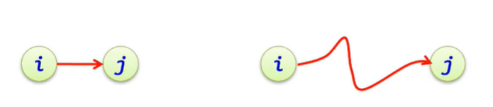

    ==则在拓扑序列中**顶点i必须排在顶点j之前**。  
    在一个有向图中找一个拓扑序列的过程称为拓扑排序。== 

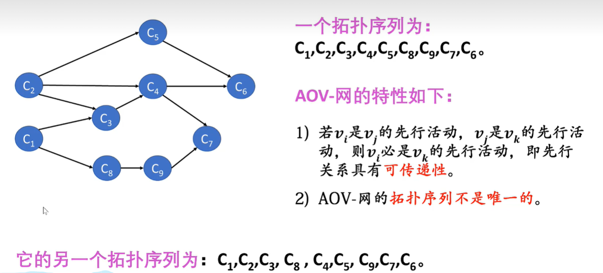

## 求拓扑排序的基本思想

1. 从有向图中选一个无前驱(入度为O)的顶点输出
2. 将此顶点和以它为起点的弧删除;
3. 重复 1 和 2，直到不存在无前驱的顶点;
4. 若此时输出的顶点数小于有向图中的顶点数，则说明有向图中存在回路，否则输出的顶点的顺序即为一个拓扑序列。


## 拓扑排序的算法步骤

1. 求所有顶点的入度，可以附设一个存放各顶点入度的数组indegree [ ]
2. 把所有入度为 0 的顶点入队列或栈
3. 当栈或队列不空时
    1. 出栈或出队列顶点为 u ,输出顶点 u 
    2. 顶点 u 的所有邻接点入度减一，如果有入度为 0 的顶点,则入栈或入队列

4. 若此时输出的顶点数小于有向图中的顶点数，则说明有向图中存在回路，否则输出的顶点的顺序即为一个拓扑序列。


## 伪代码(模板)

```java
// 拓扑排序
public boolean canFinish(int numCourses, int[][] prerequisites) {
    // 用一个容器初始化你的需求，建议数组，并且多出来一列，来代表我们当前结点的入度情况
    int[][] path = new int[numCourses][numCourses + 1];
    /* 这里推荐一个 函数 Arrays.fill(arr,to ,from , num ) 当然这是一个重载函数，自己看吧 */
    for (int i = 0; i < numCourses; ++i) {
        Arrays.fill(path[i], 0, numCourses, -1); // 使用-1才表示没有被入度 因为0也是一个结点
    }
    // 初始化邻接矩阵 path
    for (int i = 0; i < numCourses; ++i) {
        int x = prerequisites[i][0];
        int y = prerequisites[i][1];
        // 学习 x 的前提 y ,换言之：学完 y 才能学x，y是x的前提
        path[x][y] += 1;
        // 被新的结点当做前提/爹，所以他就有了儿子，他的出度就要 + 1 ;当然你记录入度也行
        path[x][numCourses] += 1;

    }

    // 找出入度为0的入栈，收入栈栈中作为我们的前驱元素
    Stack<Integer> stack = new Stack<>();
    for (int i = 0; i < numCourses; ++i) {
        // 判断入度
        if (path[i][numCourses] == 0) {
            // 收集前驱元素
            stack.push(i);
        }
    }

    // 开始排序
    // 排序结果收集
    List<Integer> sort = new ArrayList<>();
    // 前驱元素一旦清空，就表示结束排序了
    while (!stack.empty()) {
        Integer pop = stack.pop();
        // 收集排序
        sort.add(pop);
        /*
                code...

                // 如果出现新的入度为0的顶点，就再次入栈
            */
        for (int i = 0; i < numCourses; ++i) {
            // 入度为0 证明他已经在 栈中了，成为了先驱元素了
            // 在这打断，也是避免下面再次添加，导致OOM
            if (path[i][numCourses] == 0) continue;

            // 判断当前结点是否当了儿子，被pop入度
            if (path[i][pop] != -1) {
                // 去掉前驱元素入度的所有关联，让儿子有机会成为新的前驱元素
                path[i][numCourses] -= 1;
                // 这个其实不处理也可
                path[i][pop] -= 1;
            }

            // 再次判断，如果出现了新的先驱元素就入栈
            if (path[i][numCourses] == 0) stack.push(i);
        }
    }
    // 排序完毕之后
    //如果结点数 < 总数，表示有环，因为有环，所以也进不去stack；反之则没有环
    return sort.size() == numCourses;
}

```

## 事例

LeetCode207：https://leetcode.cn/problems/course-schedule/description/

```java
// 拓扑排序
public boolean tupu(int nums, int[][] pre) {
    // 最后多加一列表示 入度次数
    int[][] map = new int[nums][nums+1];
    for (int i = 0; i < map.length; i++) {
        Arrays.fill(map[i],0,nums, -1);
    }
    for (int[] ints : pre) {
        int x =ints[0];
        int y =ints[1];
        // x ->  y
        map[x][y] += 1;
        map[y][nums] += 1; // 入度数
    }

    // 找出入度为0的入栈
    Stack<Integer> stack = new Stack<>();
    for (int i = 0; i < map.length; i++) {
        if (0 == map[i][nums]) stack.add(i);
    }
    List<Integer> sort = new ArrayList<>();
    // 开始排序
    while (!stack.empty()) {
        Integer pop = stack.pop();
        sort.add(pop);
        for (int i = 0; i <  map[pop].length ; i++) {
            if (i == nums) {
                // 入度 -1
                if (map[pop][i] > 0)  map[pop][i] -= 1;
                continue;
            }

            if ( map[pop][i] < 0 ) { //
                continue;
            }
            // 入度为 0 的顶点，形成边的顶点入度 - 1
            if ( -1 != map[pop][i] ) {
                map[i][nums] -= 1; //入度顶点，入度次数 - 1
                map[pop][i] -= 1; // 删除掉入度为0的顶点所在的边
            }


            // 在排序的过程中形成新的入度为 0的点，入栈
            // 本家不要看
            if ( i!=pop &&  map[i][nums] == 0) stack.add(i);
        }
    }
    // 全部出来了，表示没有环
    return sort.size() == nums;
}

public boolean canFinish(int numCourses, int[][] prerequisites) {
    return tupu(numCourses, prerequisites);
}
```


# 回溯算法

## 伪代码(模板)

```java
    List<List<T>> res = new ArrayList<>(); //记录答案
    List<T> path = new ArrayList<>();  //记录路径
    public void backtracking(参数列表){
        if(终止条件){
            //收集结果
            //res.add();
            return;
        }
        
        for(元素集){
            // 处理结点
            
            // 递归
            
            // 回溯操作 ——> 撤销处理结点的情况
            
        }
    }
```

### 例题：

> ​	给你一个 无重复元素 的整数数组 candidates 和一个目标整数 target ，找出 candidates 中可以使数字和为目标数 target 的 所有 不同组合 ，并以列表形式返回。你可以按 任意顺序 返回这些组合。
>
> ​	candidates 中的 同一个 数字可以 无限制重复被选取 。如果至少一个数字的被选数量不同，则两种组合是不同的。

### 示例：

> 输入：candidates = [2,3,6,7], target = 7
> 输出：[[2,2,3],[7]]
> 解释：
> 2 和 3 可以形成一组候选，2 + 2 + 3 = 7 。注意 2 可以使用多次。
> 7 也是一个候选， 7 = 7 。
> 仅有这两种组合。

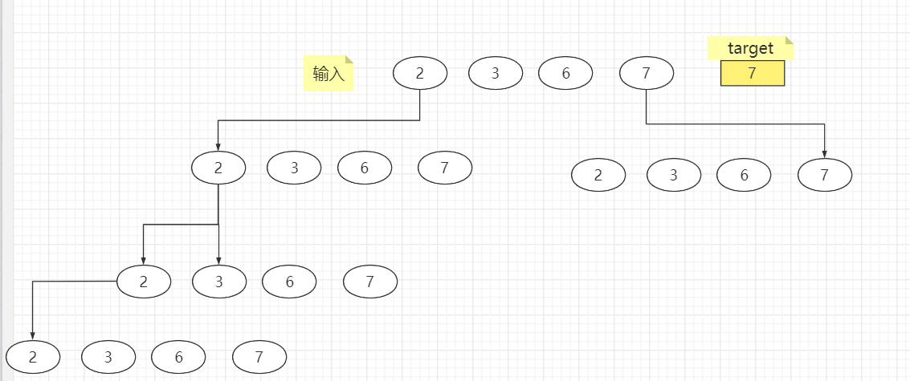

### 解释：

​	简单来说，就是递归，回溯是一个暴力手段，找得到就存，找不到的时候一旦到达叶子底部就回退路径，换一条路，其核心就是他的模板内容

```java
	List<List<Integer>> result = new ArrayList(); // 保存结果
	/*
	 保存路径 ->但是保存的时候要按着这个path重新new一个，引用对象，我们不改变对象
	 地址也就不变，但是改变这个对象的值，并不会影响对象地址，事实上我们时刻在改变
	 这个path集合元素，所以当元素条件符合时我们new一个出来让他保存这个结果，放到result中
	 让path继续运动
	*/
	List<Integer> path = new ArrayList();		
	public void backtracking(int[] temp,int target,int sum,int start ){
		// 结束条件
        if(sum == target){
            res.add(new ArrayList(path));
            return;
        }
        
        for(int i = 0 ; i < temp.length ; i++){
            int tt = temp[i] + sum ; 
            if(tt < target){
                // 处理结点
                path.add(temp[i]);
                //递归
                backtracking(temp.target,tt,i);
                // 回溯操作 ——> 撤销处理结点的情况
                path.remove(path.size()-1);
            }else break;
        }
    }
	public List<List<Integer>> combinationSum(int[] candidates, int target) {
        Arrays.sort(candidates);
        backtracking(candidates,0,target,0);
        return res;
    }

```


## 回溯算法中的优化

### 去重

​	我们一般取得数据都是取得叶子结点上的值，所以只要我们每次保证，在有序的集合中，相同层级下取出的数据和上一次回溯的结果不同即可。

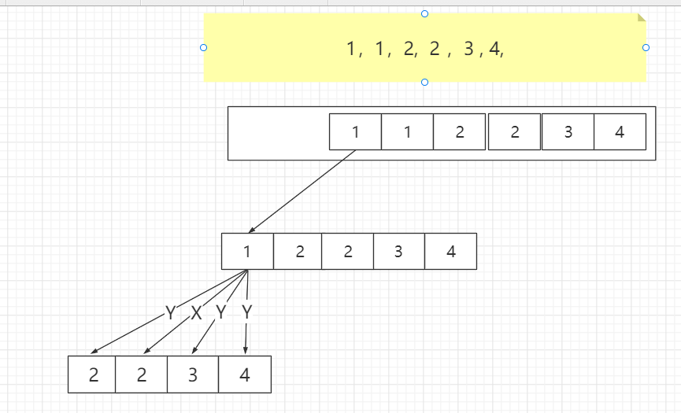

以这个为例，我们第一次可以直接取到地，但是这个时候我们也获取的第一次回溯的结点 ：2，我们下次就不能再去取他，这样 1、1、x，x只能取2,3,4这样就保证在1、1开头的组合没有重复的组合，同理当层取完回溯之后我们1、1开头的数据就取完了，第二个结点就不能再去取1了同理，其它层也是如此理解。


#### 伪代码

```java
public static List<List<Integer>> res = new ArrayList<>(); // 所有的叶子结点数据
public static List<Integer> path = new ArrayList<>(); // 当前路径的值，其实是一个临时变量

public /* 你要返回的数据类型 */ solution(int[] nums){
    Arrays.sort(nums);//在去重之前我们要保证有序
    dsf(nums,0);
    
}

public void dsf(int[] nums ,int start ){
    
    if(/*满足要求，或者到达界限开始判断存储*/){
        // 自定义判断
        
        res.add(new ArrayList(path));
        return;
    }
    
    int temp = Integer.MAX_VALUE; // 用来记录回溯数据
    for (int i = start; i < nums.length; i++) {
        if (nums[i] == temp) { // 同级去下一个元素之前，不可以重复去取已经判断过的点了
            continue;
        }
        path.add(nums[i]);

        dsf(nums,i+1);

        temp = path.remove(path.size() - 1);
    }
}
```

### 剪枝

​	其实剪枝就是提前退出循环、或者递归，这里要自己按照题目要求增加 <a>if语句</a>，比如在一个有序集合中我们要的数据必须小于0，但是我们在下一个数据就取到了5，而且所以之后的数据也就不用在进行递归遍历了，没有意义。

​	大概就是这意思，剪枝一定要注意。他确实是一个优化的大手段。但是也要注意不要过分剪枝，导致数据缺失，这里就要求我们的 <a>if语句判断必须严格，符合题意</a> 。


 

# 二叉树

## 简单的性质

1. 若规定根节点的层数为1，则一颗非空二叉树的第h层他的子节点最多：$2^{{h-1}}$

2. 若规定只有根节点的二叉树的深度为1，则深度为h的二叉树的==最大结点数是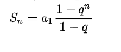 =  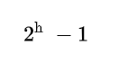

3. 一颗 N 个结点的树有  N-1  条边

4. 对任何一棵二叉树 T，如果其终端结点数为 n0，度为 2 的结点数为 n2，则 ==n0 = n2 + 1==。

    ==总结点数==：**n = n0 + n1 + n2 =n1 + 2n2 + 1** （两式联立即可推导上方结论）

5. 如果对一棵有 n 个结点的==完全二叉树==( 其深度为⌊log2n⌋+1 )的结点按层序编号( 从第 1 层到第⌊log2n⌋+1层，每层从左到右 )，则对任一结点 i(1≤i≤n)，有

    * 如果 i=1，则结点 i 是二叉树的根，无双亲；如果 i>1，则其双亲 PARENT(i)是结点⌊i/2⌋。
    * 如果 2i>n，则结点 i 无左孩子(结点 i 为叶子结点)；否则其左孩子 LCHILD(i)是结点 2i。
    * 如果 2i+1>n，则结点 i 无有孩子；否则其右孩子 RCHILD(i)是结点 2i+1


## 遍历二叉树的方法

> 前三种，先、中、后都是深度优先算法，层序遍历是广度优先算法

### 先序遍历

```java
public void dsf(TreeNode root){
    if(null == root){
        return;
    }
    // write
    System.out.println(root.val);
    
    dsf(root.left);
    
    dsf(root.right);
}
```

### 中序遍历

```java
public void dsf(TreeNode root){
    if(null == root){
        return;
    }
    dsf(root.left);
    
    // write
    System.out.println(root.val);
    
    dsf(root.right);
}
```

### 后序遍历

```java
public void dsf(TreeNode root){
    if(null == root){
        return;
    }
    dsf(root.left);
    
    dsf(root.right);
    
    // write
    System.out.println(root.val);
}
```

### 层序遍历

> 较于上面三种实现，这种实现代码更加复杂，理解起来有点麻烦。
>
> 
>
> 因为我们是一层一层的遍历，所以我们可以用队列来存储这一层的数据，在一层输出完了，这个队列就装载了他们子树的队列，具体实现可以参考一下代码

```java
public List<List<Integer>> levelOrder(TreeNode root) {
    List<List<Integer>> result = new ArrayList<>(); // 最后的结果
    Queue<TreeNode> queue = new ArrayDeque<>(); // 要查找的下一层结点

    if (null != root) { // 保证根的存在
        queue.add(root);
    }
    
    while (!queue.isEmpty()) { // 下一层没有元素了，那就是结束了
        List<Integer> level = new ArrayList<>(); // 存储这次遍历层的元素集合
        int size = queue.size(); // 队列里面有几个元素就证明这里遍历的结点个数是几个
        for (int i = 0; i < size; ++i) { 
            TreeNode poll = queue.poll(); // 遍历结束直接就出队了，没必要在保存，保存了会导致重复遍历
            level.add(poll.val); // 存入这层元素之一的结果值
            if (null != poll.left) { //存在左子树，在下一次的遍历中就要去遍历这个结点的左子树
                queue.add(poll.left);
            }
            if (null != poll.right) {//存在右子树，在下一次的遍历中就要去遍历这个结点的右子树
                queue.add(poll.right);
            }
        }
        // for循环的结束就预示着一层的结点元素遍历完成，我们要将这层的结果储存下来，然后继续下一层
        result.add(level);
    }
    return result;
}
```

 


# 查找

## 折半查找

前提：关键字有序排列

时间复杂去 O(logn)

模板

```java
	// T extends Comparable
	public boolean binSearch(List<T> list ,T key){
        int L = 0,R = list.size(),mid;
        if (null == list || R == 0) return false;
        
        while ( L <= R ){
            mid = L+R;
            if (List.get(mid).compareTo(key) == 0){
                return true;
            }else if (List.get(mid).compareTo(key) > 0){
                R = mid - 1;
            }else{
                L = mid + 1;
            }
        }
		return false;        
    }

```


## 树表 

###  引入

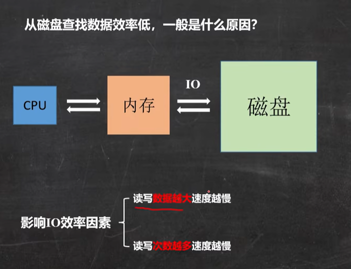

**索引**

 就是为了更快的查询数据，最典型的例子就是字典，我们根据拼音就可以更快找到对应的字


**现在如果自己设计一个文件系统的索引呢？**

方法一：线下表

每个元素都存储到线性表中Key就是索引，Value就是所存元素，这样咋一看没什么问题，但是当数据量过大，也就是线性表长度变大，插入或者删除的时候开销太大。所以不适合。

方法二：哈希表

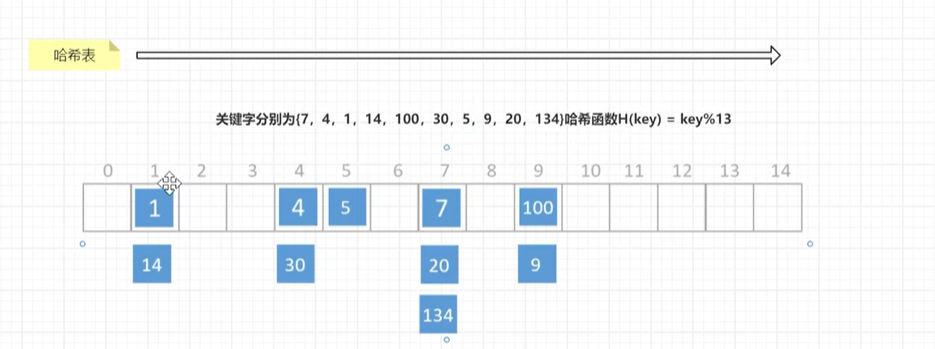


每次查找的时候直接hash一下就找到，但是这样就会出现两个问题：

1、hash冲突后，数据散列不均匀，产生大量的线性查询，效率变低

2、等值查询可以，但是遇到范围查询的时候我们还是要遍历所有的结点

总结下来 哈希表也不适合


方法三：树表

补充：树、二叉树、二叉排序树（BTS）、平衡二叉树（AVL）、红黑树、B树、B+树

### 二叉排序(BST)

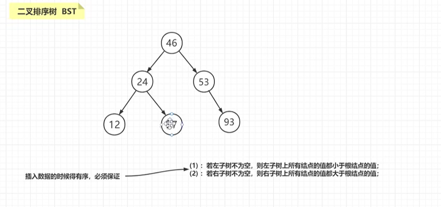

时间复杂度O(logn)

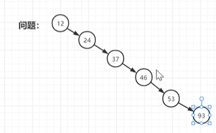

这样就有出先O(logn)的情况，所以我们有了平衡二叉树

### 平衡二叉树(AVL)

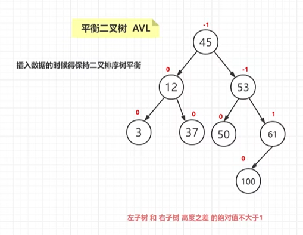

但是他也有问题，它使用了插入的效率弥补了查询的效率，一旦插入过多，查找的时间复杂度从O(log 2 N)也将退化成O ( N ) ，反而会影响我们的算法开销，这里我们再将其升级，这时候有了红黑树。

总结：**有了二叉搜索树，为什么还需要平衡二叉树？**

* 在学习二叉搜索树、平衡二叉树时，我们不止一次提到，二叉搜索树容易退化成一条链。
* 这时，查找的时间复杂度从O(log2N)也将退化成O(N )
* 引入对左右子树高度差有限制的平衡二叉树，保证查找操作的最坏时间复杂度也为O(logN)

### 红黑树(RBT)

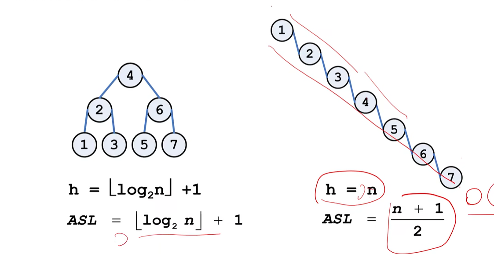

h ，时间

ASL，是查找算法的查找成功时的平均查找长度的缩写，是为确定记录在查找表中的位置，需和给定值进行比较的关键字个数的期望值。

从结论我们可以知道 红黑树的查找时间 《 极端情况下的 AVL  （n>1）

再结合ASL ，

* 当 n<8  ，红黑树  > AVL 
* 当 n=8  ，红黑树  = AVL 
* 当 n>8  ，红黑树  < AVL 

==所以结合h，ASL HashMap在链表长度大于8的时候会变成红黑树== 

#### 概念

红黑树，是一个自平衡的二叉查找树。除了符合二叉查找树的基本特性外它还具有：

1. 结点是红色或黑色。

2. 根结点是黑色。

3. 每个叶子结点都是黑色的空结点（==叶节点是指末梢的NULL结点==）。

4. 每个红色结点的两个子结点都是黑色。(==从每个叶子到根的所有路径上不能有两个连续的红色结点==)

5. 从任一结点到其每个叶子的所有路径都包含相同数目的黑色结点。（==相同的黑色高度==）

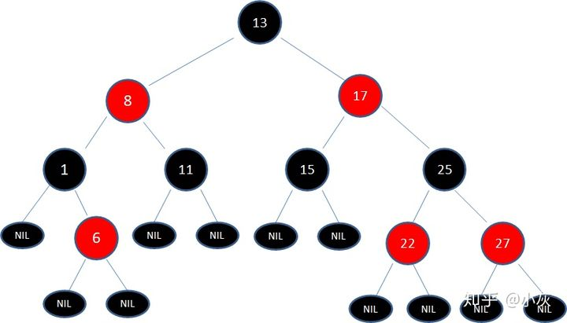

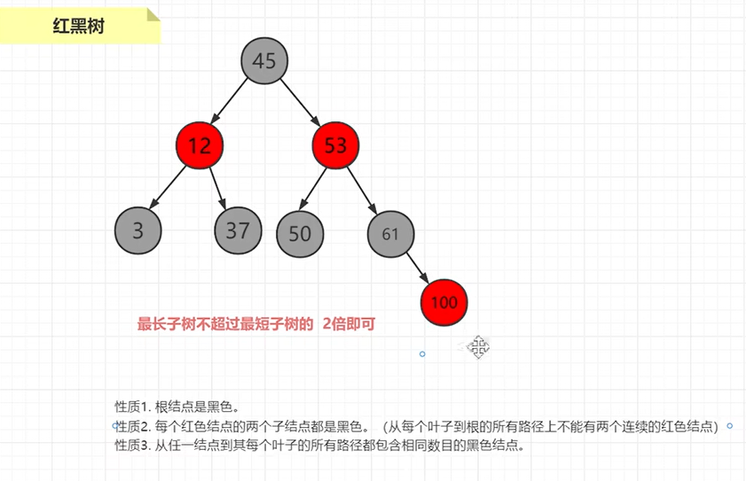

但是树的深度可能会无线增加，导致我们IO次数越多，影响读取的效率。

一些说明

* 约束4和5，保证了红黑树的大致平衡:根到叶子的所有路径中，最长路径不会超过最短路径的2倍。

* 使得红黑树在最坏的情况下，也能有O(log2N )的查找效率
    * 黑色高度为3时，最短路径:黑色→黑色→黑色，最长路径:黑色→红色→黑色→红色→黑色
    * 最短路径的长度为2(不算Nil的叶子节点)，最长路径为4。
    * 这是其他博客的举例，自己也不是很懂色
* 关于叶子节点:Java实现中，null代表空节点，无法看到黑色的空节点，反而能看到传统的红色叶子节点
* 默认新插入的节点为红色:因为父节点为黑色的概率较大，插入新节点为红色，可以避免颜色冲突

#### 特性

正是因为这些特性限制,才保证了红黑树的自平衡。红黑树==从根到叶子的最长路径不会超过最短路径的2倍==。


总结：

**有了平衡二叉树，为什么还需要红黑树？**

* AVL的左右子树高度差不能超过1，每次进行插入/删除操作时，几乎都需要通过旋转操作保持平衡
* ==在频繁进行插入/删除的场景中，频繁的旋转操作使得AVL的性能大打折扣==
* 红黑树通过牺牲严格的平衡，换取插入/删除时少量的旋转操作，整体性能优于AVL
    * 红黑树插入时的不平衡，不超过两次旋转就可以解决;
    * 删除时的不平衡，不超过三次旋转就能解决
* 红黑树的红黑规则，保证最坏的情况下，也能在O(log2N )时间内完成查找操作。


### B树

基于上面的分析，我们开始设计B树，==由原来的两个结点分支，变成现在多节点分支的树==。(==多路树==)

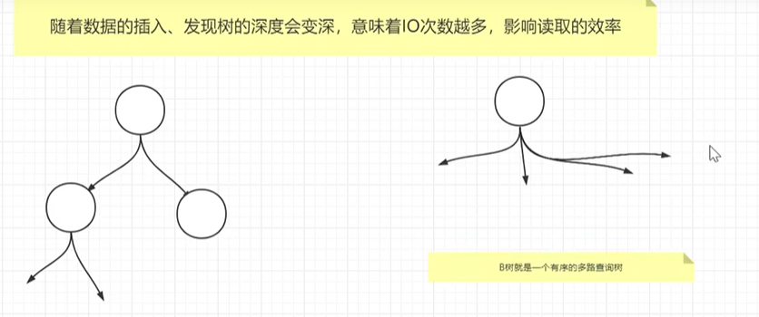

#### B树的基本概念

B树，又称为多路平衡查找树，是一棵平衡的m路搜索树。(m 表示孩子结点个数最大值)

它或者是空树，或者是满足下列性质的树：

1、 每个结点最多有m 棵子树（即至多含m − 1 个关键字），并具有如下结构：


其中，n是结点内关键码的实际个数，Pi (0<i<n<m)是指向子树的指针，Ki(1<i< n<m)是关键码，且Ki<Ki -1 (1 ≤i<n)

2、根结点至少有两个子女；除根结点以外的所有结点至少有[m/2|个子女

3、在子树P;中的所有关键码都小于K1，且大于K;;在子树P中的所有关键码都大于K

4、所有失败结点都位于同一层，它们都是查找失败时查找指针到达的结点。所有失败结点都是空结点，指向它们的指针都为空。

一个简单的3阶B树示例：


==B树是所有结点的平衡因子均等于0的多路查找树==，上图所示的底层**方形结点表示叶结点，在这些结点中没有存储任何信息**。

#### 特点

是一种多路搜索树（并不是二叉的）：

1. 定义任意非叶子结点最多只有M个儿子；且M>2；

2. 根结点的儿子数为[2, M]；

3. 除根结点以外的非叶子结点的儿子数为[M/2, M]；

4. 每个结点存放至少M/2-1（取上整）和至多M-1个关键字；（至少2个关键字）

5. 非叶子结点的关键字个数=指向儿子的指针个数-1；

6. 非叶子结点的关键字：K[1], K[2], …, K[M-1]；且K[i] < K[i+1]；

7. 非叶子结点的指针：P[1], P[2], …, P[M]；其中P[1]指向关键字小于K[1]的子树，P[M]指向关键字大于K[M-1]的子树，其它P[i]指向关键字属于(K[i-1], K[i])的子树；

8. 所有叶子结点位于同一层；

如：（M=3）

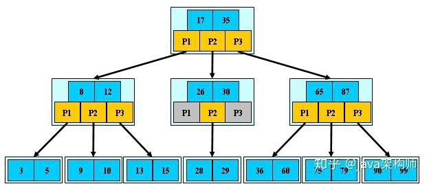

B-树的搜索，从根结点开始，对结点内的关键字（有序）序列进行二分查找，如果命中则结束，否则进入查询关键字所属范围的儿子结点；重复，直到所对应的儿子指针为空，或已经是叶子结点；

#### B树查找

引入前缀知识：磁盘预读

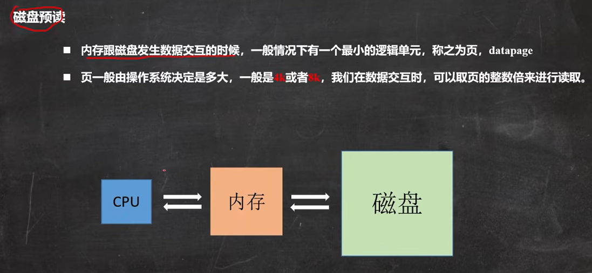

所以文件内存取值，不是是多少就是多少，他所占用的空间是，页大小的整数倍，12取16，

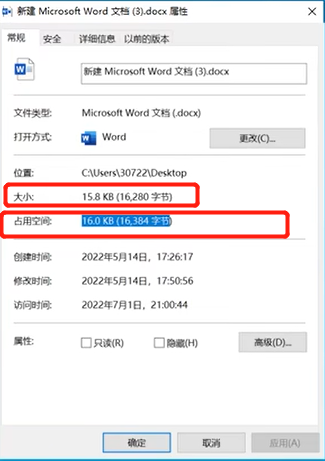


### B+树

​	B+ 树是一种树数据结构，是一个n叉树，每个节点通常有多个孩子，一棵B+树包含根节点、内部节点和叶子节点。根节点可能是一个叶子节点，也可能是一个包含两个或两个以上孩子节点的节点。

​	B+ 树的特点：能够保持数据稳定有序，其插入与修改拥有较稳定的对数时间复杂度。B+ 树元素自底向上插入。

#### 定义：

B+树是应文件系统所需而出的一种B树的变型树。一棵m阶的B+树和m阶的B-树的差异在于：

1. ==在B+树中，有n棵子树的结点中含有n个关键字，每个关键字不保存数据(每个关键字对应一个子树)，只用来索引，所有数据都保存在叶子节点；== 

    在B树中，具有n个关键字的子树含有n+1颗子树 

2. ==所有的叶子结点中包含了全部关键字的信息，及指向含这些关键字记录的指针，且叶子结点本身依关键字的大小自小而大顺序链接。== 

    B树中的关键字是不重复的

3. ==所有的非叶子结点可以看成是索引部分，结点中仅含其子树（根结点）中的最大（或最小）关键字。
    通常在B+树上有两个头指针，一个指向根结点，一个指向关键字最小的叶子结点。==

4. ==在B+树上有两个头指针，一个指向根节点，另一个指向关键字最小的叶子结点，所有叶子结点链接成一个不定长的线性链表。所以B+树可以进行随机查找和顺序查找。==

    B树只能进行随机查找


#### 特点

1. 其定义基本与B-树同，除了：

2. 非叶子结点的子树指针与关键字个数相同；

3. 非叶子结点的子树指针P[i]，指向关键字值属于[K[i], K[i+1])的子树（B-树是开区间）；

4. 为所有叶子结点增加一个链指针；

5. 所有关键字都在叶子结点出现；

如：（M=3）

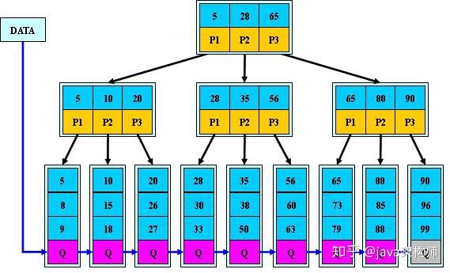


B+的搜索与B-树也基本相同，区别是B+树只有达到叶子结点才命中（B-树可以在非叶子结点命中），其性能也等价于在关键字全集做一次二分查找；

#### B+的特性

1. 所有关键字都出现在叶子结点的链表中（稠密索引），且链表中的关键字恰好是有序的；

2. 不可能在非叶子结点命中；

3. 非叶子结点相当于是叶子结点的索引（稀疏索引），叶子结点相当于是存储（关键字）数据的数据层；

4. 更适合文件索引系统；


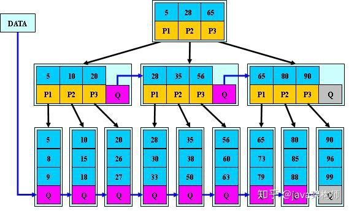


**B树是B+树的变体，在B+树的非根和非叶子结点再增加指向兄弟的指针**；B*树定义了非叶子结点关键字个数至少为(2/3)*M，即块的最低使用率为2/3（代替B+树的1/2）；
B+树的分裂：当一个结点满时，分配一个新的结点，并将原结点中1/2的数据复制到新结点，最后在父结点中增加新结点的指针；B+树的分裂只影响原结点和父结点，而不会影响兄弟结点，所以它不需要指向兄弟的指针；
B树的分裂：当一个结点满时，如果它的下一个兄弟结点未满，那么将一部分数据移到兄弟结点中，再在原结点插入关键字，最后修改父结点中兄弟结点的关键字（因为兄弟结点的关键字范围改变了）；如果兄弟也满了，则在原结点与兄弟结点之间增加新结点，并各复制1/3的数据到新结点，最后在父结点增加新结点的指针；
**所以，B\*树分配新结点的概率比B+树要低，空间使用率更高；**


### 面试题：

#### B树和B+树的区别？

B树特点

* 1、结点排序
* 2、一个结点可以存储多个元素多个元素也排序了


B+树的特点

* 它具有B树的全部特点(它是B树的升级)
* 叶子结点之间存在指针(他存在的意义就是快速的查找叶子结点)
* 非叶子结点上的元素在叶子节点上都冗余了，也就是说叶子结点中存储了所有的元素，且排好了序。


#### MySQL为什么选择B+树？

Mysql索引使用的是B+树，因为索引是用来加快查询的，而B+树通过对数据进行排序所以是可以提高查询速度的，然后通过一个节点中可以存储多个元素，从而可以使得B+树的高度不会太高

在Mysql中一个Innodb页就是一个B+树节点，一个Innodb页默认16kb，所以一般情况下一颗两层的B+树可以存2000万行左右的数据，然后通过利用B+树叶子节点存储了所有数据并且进行了排序，并且叶子节点之间有指针，可以很好的支持全表扫描，范围查找等SQL语句

我们建议不要让B+树的层数超过三层，所以当数据了超过2000W行的时候就要进行分库分表


#### 未完成


# 排序

* 交换排序

    > 两两比较待排序记录的排序码，交换不满足顺序要求的偶对，直到全部满足位置。
    >
    > 常见的`冒泡排序`和`快速排序`就属于交换类排序

* 插入类排序

    > ​	每步将一个待排序的记录，按其排序码大小，插到前面已经排序的文件中的适当位置，直到全部插入完为止
    >
    > 常见的排序方式：插入排序、希尔排序

* 选择类排序

    > ​	选择类排序的基本方法是：每步从待排序记录中选出排序码最小的记录，顺序放在已排序的记录序列的后面，知道全部排完。
    >
    > 常见的排序方式：选择排序、

* 选择类排序

* 线性时间非比较类排序

## 冒泡

**算法思想：** 

>从数组中第一个数开始，依次遍历数组中的每一个数，通过相邻比较交换，每一轮循环下来找出剩余未排序数的中的最大数并”冒泡”至数列的顶端。

**算法步骤：** 

1. 从数组中第一个数开始，依次与下一个数比较并次交换比自己小的数，直到最后一个数。如果发生交换，则继续下面的步骤，如果未发生交换，则数组有序，排序结束，此时时间复杂度为O(n)； 
2. 每一轮”冒泡”结束后，最大的数将出现在乱序数列的最后一位。重复步骤（1）。

**稳定性**：稳定排序。

**时间复杂度**： O(n)至O(n2)，平均时间复杂度为O(n2)。

**代码**

```java
public class MaoPao<T extends Comparable<T>>  {
    /**
     * 正序排序
     * @param ts
     */
    public void sort(T[] ts) {
        if (ts == null) {
            throw new NullPointerException("你要排序，那你先创建呀！");
        }
        int length = ts.length;
        for (int i = 0; i < length; i++) {
            for (int j = 0; j < length - i -1; j++) {
                if (1 == ts[j].compareTo(ts[j + 1])) {
                    T temp = ts[j + 1];
                    ts[j + 1] = ts[j];
                    ts[j] = temp;
                }
            }
        }
    }
    /**
     * 排序
     * @param ts 要比较的集合
     * @param away 比较的方式，true为升序，false为逆序
     */
    public void sort(T[] ts,boolean away) {
        if (ts == null) {
            throw new NullPointerException("你要排序，那你先创建呀！");
        }
        int flag = away ? 1 : -1;
        int length = ts.length;
        for (int i = 0; i < length; i++) {
            for (int j = 0; j < length - i -1; j++) {
                if (flag == ts[j].compareTo(ts[j + 1])) {
                    T temp = ts[j + 1];
                    ts[j + 1] = ts[j];
                    ts[j] = temp;
                }
            }
        }
    }
    public void test(T...t){
        System.out.println(t[0].compareTo(t[1]));
    }

    public static void main(String[] args) {
        MaoPao<Integer> maoPao = new MaoPao<>();
        Integer[] arr = new Integer[10];
        for (int i = 0; i < 10; i++) {
            arr[i] = new Random().nextInt(100);
        }
        System.out.println("初始化之前：" + Arrays.toString(arr));

        maoPao.sort(arr,true);
        System.out.println("升序排序后结果：" +Arrays.toString(arr));
        maoPao.sort(arr,false);
        System.out.println("降序排序后结果：" +Arrays.toString(arr));
    }
}
```


## 快速排序

> ​	冒泡排序是在相邻的两个记录进行比较和交换，每次交换只能上移或下移一个位置，导致总的比较与移动次数较多。快速排序又称分区交换排序，是对冒泡排序的改进，快速排序采用的思想是分治思想。

**算法原理：** 

1. 从待排序的n个记录中任意选取一个记录（通常选取第一个记录）为分区标准;

2. 把所有小于该排序列的记录移动到左边，把所有大于该排序码的记录移动到右边，中间放所选记录，称之为第一趟排序；

3. 然后对前后两个子序列分别重复上述过程，直到所有记录都排好序。

**稳定性**：不稳定排序。

**时间复杂度**： O（nlog2n）至O(n2)，平均时间复杂度为O（nlgn）。

**最好的情况**：是每趟排序结束后，每次划分使两个子文件的长度大致相等，时间复杂度为O（nlog2n）。

**最坏的情况**：是待排序记录已经排好序，第一趟经过n-1次比较后第一个记录保持位置不变，并得到一个n-1个元素的子记录；第二趟经过n-2次比较，将第二个记录定位在原来的位置上，并得到一个包括n-2个记录的子文件，依次类推，这样总的比较次数是： 

Cmax=∑i=1n−1(n−i)=n(n−1)/2=O(n2)

```java
public class QuickSort<T extends  Comparable>  {

    //a：待排序数组，low：最低位的下标，high：最高位的下标
    public void quickSort(int a[],int low, int high) {
        if(low>=high)
        {
            return;
        }

        int left=low;
        int right=high;
        int key=a[left]; /*用数组的第一个记录作为分区元素*/
        while(left!=right){
            while(left<right&&a[right]>=key) /*从右向左扫描，找第一个码值小于key的记录，并交换到key*/
                --right;
            a[left]=a[right];
            System.out.println("第1次交换："+Arrays.toString(a));
            while(left<right&&a[left]<=key) {
                ++left;
            }
            a[right]=a[left]; /*从左向右扫描，找第一个码值大于key的记录，并交换到右边*/
            System.out.println("第2次交换："+Arrays.toString(a));
        }
        a[left]=key; /*分区元素放到正确位置*/
        System.out.println("完整的一次：" +Arrays.toString(a));
        System.out.println();
        /* 
        一次操作完成后就等于将集合分区了，以key为中心的左右两侧都是小于、大于它的
        所以我们接下来也只需要将他的左分区、右分区按照上述方式重排即可得到最终答案
        */
        quickSort(a,low,left-1);
        quickSort(a,left+1,high);
    }
    public static void main(String[] args) {
        QuickSort<Integer> quickSort = new QuickSort();
        int[] arr = new int[10];
        for (int i = 0; i < 10; i++) {
            arr[i] = new Random().nextInt(100);
        }
        System.out.println("初始化之前：" + Arrays.toString(arr));

        quickSort.quickSort(arr,0,arr.length-1);
        System.out.println("排序后结果：" +Arrays.toString(arr));
    }
}
```


## 直接插入排序

**隶属**：插入排序

> ​	从待排序的n个记录中的第二个记录开始，依次与前面的记录比较并寻找插入的位置，每次外循环结束后，将当前的数插入到合适的位置。

**稳定性**：稳定排序。

**时间复杂度**： O(n)至O（n2），平均时间复杂度是**O（n2）**。

**最好情况**：当待排序记录已经有序，这时需要比较的次数是Cmin=n−1=O(n)。

**最坏情况**：如果待排序记录为逆序，则最多的比较次数为Cmax=∑i=1n−1(i)=n(n−1)2=O(n2)。

```java
public class InsertSort {
    //A：输入数组，len:数组长度
    static void insertSort(int A[],int len) {
        int temp;
        for(int i=1;i<len;i++)
        {
            int j=i-1;
            temp=A[i];
            int k = 1;
            System.out.println("第"+i+"次修改之前："+Arrays.toString(A));

            //查找到要插入的位置
            while(j>=0&&A[j]>temp) {
                A[j+1]=A[j];
                System.out.println("第"+i+"次中第"+k+"次修改："+Arrays.toString(A));
                k++;
                j--;
            }
            if(j!=i-1)  A[j+1]=temp;
            System.out.println("第"+i+"次修改之后："+Arrays.toString(A));
            System.out.println();
        }
    }

    public static void main(String[] args) {
        int len = 10;
        int[] temp = new int[len];
        for (int i = 0; i < len; i++) {
            temp[i] = new Random().nextInt(100);
        }
        System.out.println("初始化之前：" + Arrays.toString(temp));

        insertSort(temp,len);
        System.out.println("排序后结果：" +Arrays.toString(temp));
    }
}
```


## Shell排序(希尔排序)

Shell 排序又称缩小增量排序, 由D. L. Shell在1959年提出，是对直接插入排序的改进。

> Shell排序法是对相邻指定距离(称为增量)的元素进行比较，并不断把增量缩小至1，完成排序。
>
> Shell排序开始时增量较大，分组较多，每组的记录数目较少，故在各组内采用直接插入排序较快，后来增量di逐渐缩小，分组数减少，各组的记录数增多，但由于已经按di−1分组排序，文件叫接近于有序状态，所以新的一趟排序过程较快。因此Shell排序在效率上比直接插入排序有较大的改进。
>
> 在直接插入排序的基础上，将直接插入排序中的1全部改变成增量d即可，因为Shell排序最后一轮的增量d就为1。

**稳定性**：不稳定排序。

> 由于多次插入排序，我们知道一次插入排序是稳定的，不会改变相同元素的相对顺序，
>
> 但在不同的插入排序过程中，**相同的元素可能在各自的插入排序中移动，最后其稳定性就会被打乱**

**时间复杂度**：

> O(n1.3)到O(n2)。Shell排序算法的时间复杂度分析比较复杂，实际所需的时间取决于各次排序时增量的个数和增量的取值。研究证明，若增量的取值比较合理，希尔排序的时间复杂度约为**O(n^1.3）**;
>
> 对于增量的选择，Shell 最初建议增量选择为n/2，并且对增量取半直到 1

**适用性**：希尔排序只是适用于**线性表为顺序存储**的i情况，**不适用于链表**

```java
public class ShellSort {
    //A：输入数组，len:数组长度，d:初始增量(分组数)
    static void shellSort(int A[],int len, int d) {
        for(int inc=d;inc>0;inc/=2){ //循环的次数为增量缩小至1的次数
            for(int i=inc;i<len;++i){ //循环的次数为第一个分组的第二个元素到数组的结束
                int j=i-inc;
                int temp=A[i];
                while(j>=0&&A[j]>temp) {
                    A[j+inc]=A[j];
                    j=j-inc;
                }
                if((j+inc)!=i)//防止自我插入
                    A[j+inc]=temp;//插入记录
            }
        }
    }

    public static void main(String[] args) {
        int len = 10;
        int[] temp = new int[len];
        for (int i = 0; i < len; i++) {
            temp[i] = new Random().nextInt(100);
        }
        System.out.println("初始化之前：" + Arrays.toString(temp));

        shellSort(temp,len,1);
        System.out.println("排序后结果：" +Arrays.toString(temp));
    }
}
```


## 选择排序

**原理**

> ​	从所有记录中选出最小的一个数据元素与第一个位置的记录交换；然后在剩下的记录当中再找最小的与第二个位置的记录交换，循环到只剩下最后一个数据元素为止。

**稳定性**：不稳定排序。

**时间复杂度**： 最坏、最好和平均复杂度均为**O(n2)**，因此，简单选择排序也是常见排序算法中性能最差的排序算法。简单选择排序的比较次数与文件的初始状态没有关系，在第i趟排序中选出最小排序码的记录，需要做n-i次比较，因此总的比较次数是：∑i=1n−1(n−i)=n(n−1)/2=O(n2)。

```java
void selectSort(int A[],int len){
    int i,j,k;
    for(i=0;i<len;i++){
        k=i;
        for(j=i+1;j<len;j++){
            if(A[j]<A[k])
                k=j;
        }

        if(i!=k){
            A[i]=A[i]+A[k];
            A[k]=A[i]-A[k];
            A[i]=A[i]-A[k];
        }
    }
}
```


## 堆排序

> ​	直接选择排序中，第一次选择经过了n-1次比较，只是从排序码序列中选出了一个最小的排序码，而没有保存其他中间比较结果。所以后一趟排序时又要重复许多比较操作，降低了效率。J. Willioms和Floyd在1964年提出了堆排序方法，避免这一缺点。

**堆的性质**： 

1. 性质：完全二叉树或者是近似完全二叉树； 

2. 分类：大顶堆：父节点不小于子节点键值，小顶堆：父节点不大于子节点键值；图展示一个最小堆： 

3. 左右孩子：没有大小的顺序。

4. 堆的存储 
    一般都用数组来存储堆，i结点的父结点下标就为(i–1)/2。它的左右子结点下标分别为 2∗i+1 和 2∗i+2。如第0个结点左右子结点下标分别为1和2。 

5. 堆的操作 
    **建立**： 
    以最小堆为例，如果以数组存储元素时，一个数组具有对应的树表示形式，但树并不满足堆的条件，需要重新排列元素，可以建立“堆化”的树。

    **插入**： 
    将一个新元素插入到表尾，即数组末尾时，如果新构成的二叉树不满足堆的性质，需要重新排列元素，下图演示了插入15时，堆的调整。

    **删除**： 
    堆排序中，删除一个元素总是发生在堆顶，因为堆顶的元素是最小的（小顶堆中）。表中最后一个元素用来填补空缺位置，结果树被更新以满足堆条件。

**稳定性**：不稳定排序。

**插入代码实现**： 
每次插入都是将新数据放在数组最后。可以发现从这个新数据的父结点到根结点必然为一个有序的数列，现在的任务是将这个新数据插入到这个有序数据中，这就类似于直接插入排序中将一个数据并入到有序区间中，这是节点“上浮”调整。不难写出插入一个新数据时堆的调整代码：


## 归并排序

**算法思想：** 

> 归并排序属于比较类非线性时间排序，号称比较类排序中性能最佳者，在数据中应用中较广。
>
> 归并排序是分治法（Divide and Conquer）的一个典型的应用。将已有序的子序列合并，得到完全有序的序列；即先使每个子序列有序，再使子序列段间有序。若将两个有序表合并成一个有序表，称为二路归并。

**稳定性**：稳定排序算法；

**时间复杂度**: 最坏，最好和平均时间复杂度都是**O(nlgn)**。


## 计数排序

计数排序是一个非基于比较的排序算法，该算法于1954年由 Harold H. Seward 提出，它的优势在于在对于较小范围内的整数排序。它的复杂度为Ο(n+k)（其中k是待排序数的范围），快于任何比较排序算法，缺点就是非常消耗空间。很明显，如果而且当O(k)>O(n*log(n))的时候其效率反而不如基于比较的排序，比如堆排序和归并排序和快速排序。

**算法原理**： 

> 基本思想是对于给定的输入序列中的每一个元素x，确定该序列中值小于x的元素的个数。一旦有了这个信息，就可以将x直接存放到最终的输出序列的正确位置上。例如，如果输入序列中只有17个元素的值小于x的值，则x可以直接存放在输出序列的第18个位置上。当然，如果有多个元素具有相同的值时，我们不能将这些元素放在输出序列的同一个位置上，在代码中作适当的修改即可。

**算法步骤**： 

> （1）找出待排序的数组中最大的元素； 
> （2）统计数组中每个值为i的元素出现的次数，存入数组C的第i项； 
> （3）对所有的计数累加（从C中的第一个元素开始，每一项和前一项相加）； 
> （4）反向填充目标数组：将每个元素i放在新数组的第C(i)项，每放一个元素就将C(i)减去1。

**时间复杂度**：**Ο(n+k)**。

**空间复杂度**：**Ο(k)**。

**要求**：待排序数中最大数值不能太大。

**稳定性**：稳定。

​	

## 基数排序

基数排序属于“分配式排序”（distribution sort），是非比较类线性时间排序的一种，又称“桶子法”（bucket sort）。顾名思义，它是透过键值的部分信息，将要排序的元素分配至某些“桶”中，藉以达到排序的作用。

## 桶排序

桶排序也是分配排序的一种，但其是基于比较排序的，这也是与基数排序最大的区别所在。

**思想**：桶排序算法想法类似于散列表。首先要假设待排序的元素输入符合某种均匀分布，例如数据均匀分布在[ 0,1）区间上，则可将此区间划分为10个小区间，称为桶，对散布到同一个桶中的元素再排序。

**要求**：待排序数长度一致。

**排序过程**： 
（1）设置一个定量的数组当作空桶子； 
（2）寻访序列，并且把记录一个一个放到对应的桶子去； 
（3）对每个不是空的桶子进行排序。 
（4）从不是空的桶子里把项目再放回原来的序列中。

例如待排序列K= {49、 38 、 35、 97 、 76、 73 、 27、 49 }。这些数据全部在1—100之间。因此我们定制10个桶，然后确定映射函数f(k)=k/10。则第一个关键字49将定位到第4个桶中(49/10=4)。依次将所有关键字全部堆入桶中，并在每个非空的桶中进行快速排序。

**时间复杂度**： 
对N个关键字进行桶排序的时间复杂度分为两个部分： 
(1) 循环计算每个关键字的桶映射函数，这个时间复杂度是O(N)。

(2) 利用先进的比较排序算法对每个桶内的所有数据进行排序，对于N个待排数据，M个桶，平均每个桶[N/M]个数据，则桶内排序的时间复杂度为 ∑i=1MO(Ni∗logNi)=O(N∗logNM) 。其中Ni 为第i个桶的数据量。

因此，平均时间复杂度为线性的O(N+C)，C为桶内排序所花费的时间。当每个桶只有一个数，则最好的时间复杂度为：**O(N)**。


