这是为了总结一下好用的工具和收集一下知识点，方便后期自己查找

# 开发知识类资料

## 算法

### [代码随想录](https://programmercarl.com/)

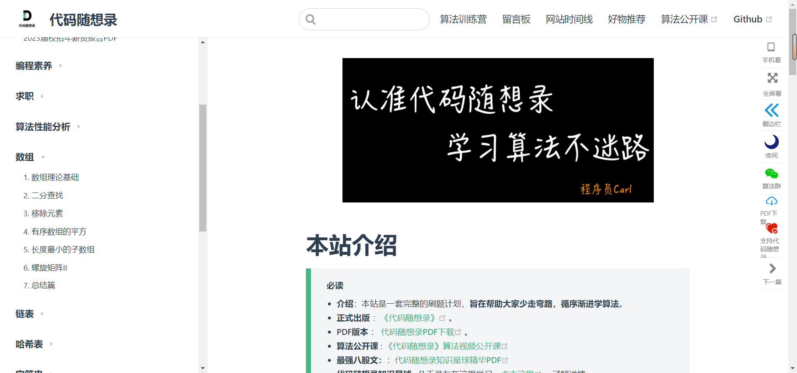

## 设计模式

### [原动力](https://www.ydlclass.com/doc21xnv/frame/design/#%E4%B8%80%E3%80%81%E8%AE%BE%E8%AE%A1%E6%A8%A1%E5%BC%8F)

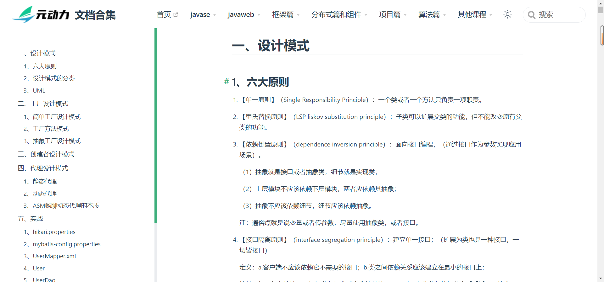

## 运维

### [Docker 快速入门](https://docker.easydoc.net/doc/81170005/cCewZWoN/lTKfePfP)

### [Docker镜像市场](http://hub.daocloud.io/)

## 扩展

### [学吧导航](https://www.xue8nav.com/)

> 里面有各种各类的资料考研、计算机等等

### [ETS' NoteBook](https://notebook.js.org/#/README?id=%E2%98%95%ef%b8%8f-java)

> 博主的gitalk博客，里面有计算机常见知识

# 开发工具类资料

[资源网PRO](https://www.zywpro.com/)

> 这是一个大佬上线的网站里面有各种软件

## [ 鱼皮结构化 SQL 生成器 ](http://sql.yupi.icu/  )

> 用业务逻辑写SQL，熟悉一下，大数据SQLBody可以少很多事

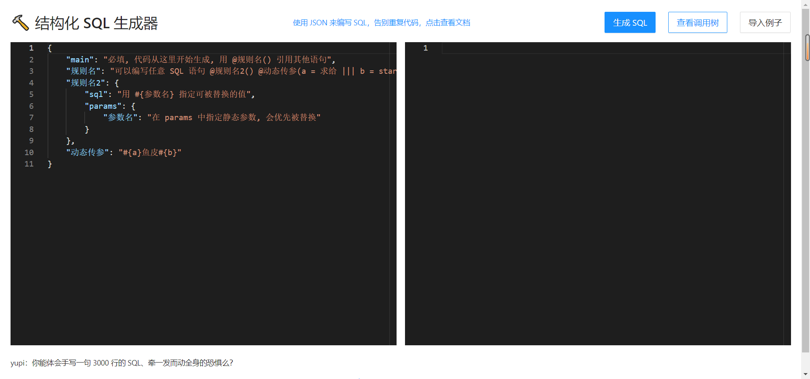

## [程序员盒子 - 专注于程序员编程学习提效_官网](https://www.coderutil.com)

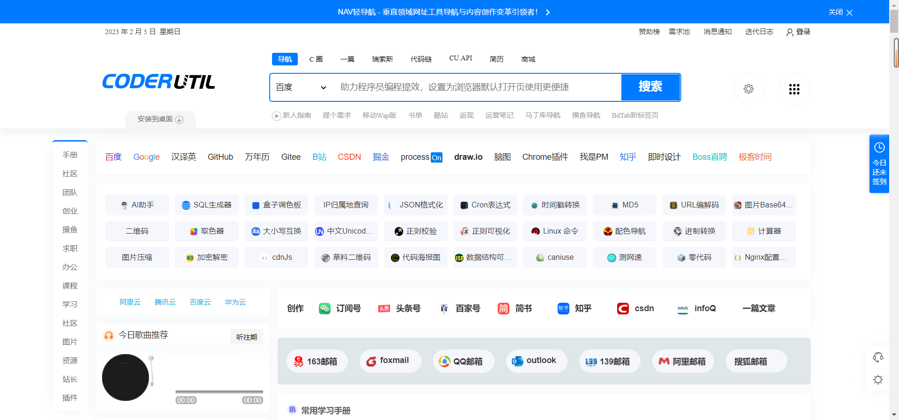

## [程序员导航](http://cxy521.com/)

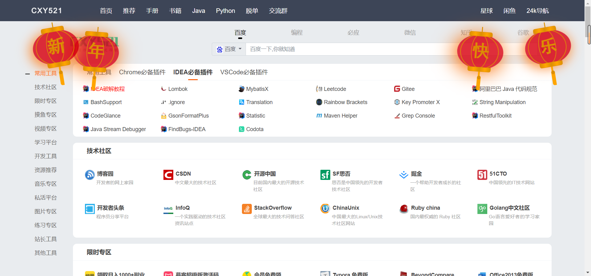

## [狂神资料](https://www.kuangstudy.com/)

## [EMOJI 图标](https://3water.com/emoji/i/SXphdElWQTZFT2M9)

## [国内多个地点网站测速结果](https://tool.chinaz.com/speedtest/slproweb.com)

## [PDF转xxx](https://tools.pdf24.org/zh/convert-pdf-to#s=1656686232831)

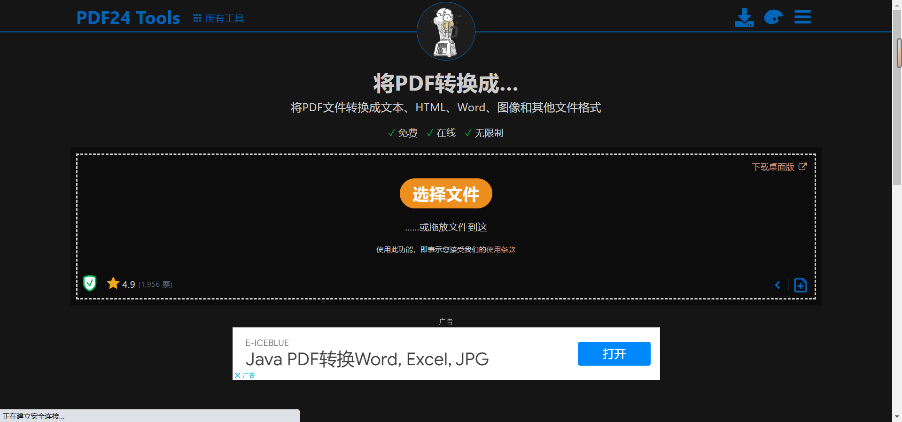

## [JSON可视化](https://jsoncrack.com/editor)

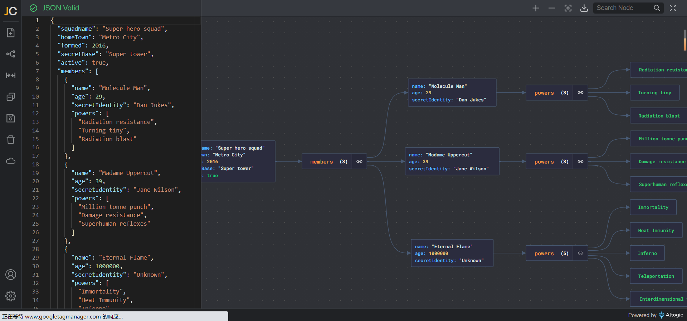

## [Gimhoy图床](https://pic.gimhoy.com/)

## [多媒体文件压缩-docSmall ](https://docsmall.com/)

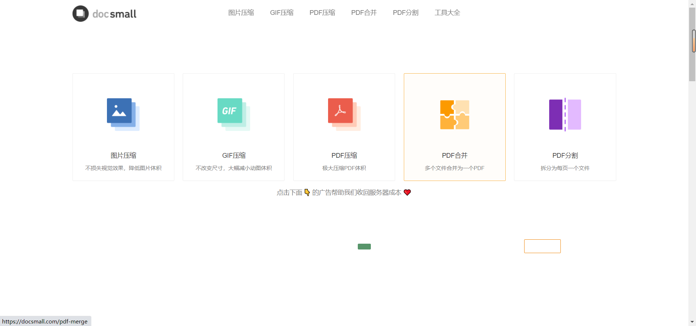

## [最优图片压缩](https://zh.recompressor.com/)

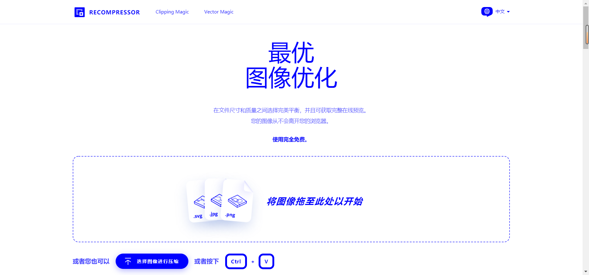

# 文案类资料

## [PPT超级市场](https://www.pptsupermarket.com/)

## [图表转Markdown](https://tableconvert.com/)

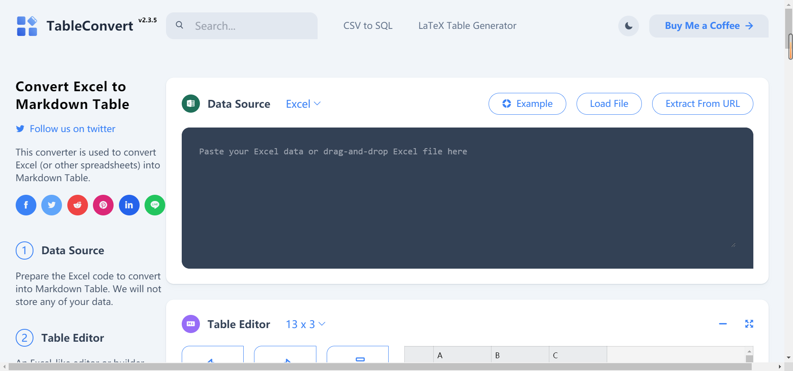

## [CodeInWord|在word中优雅展现的代码|代码高亮|word中插入代码|代码格式化](http://www.codeinword.com/)
> 让代码在Word文件中更加优美的展示

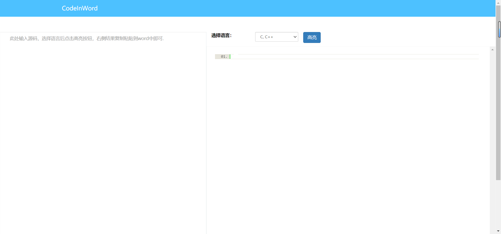

# 软件下载

## [大佬上线的全方位开发资料](http://download.java1234.com/)

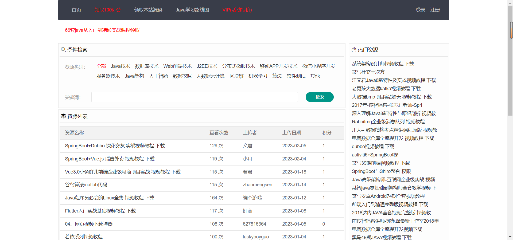

## [HelloWindows](https://hellowindows.cn)

> 这里是Windows官方挂载在GitHub上面的WIndows版本很纯洁的

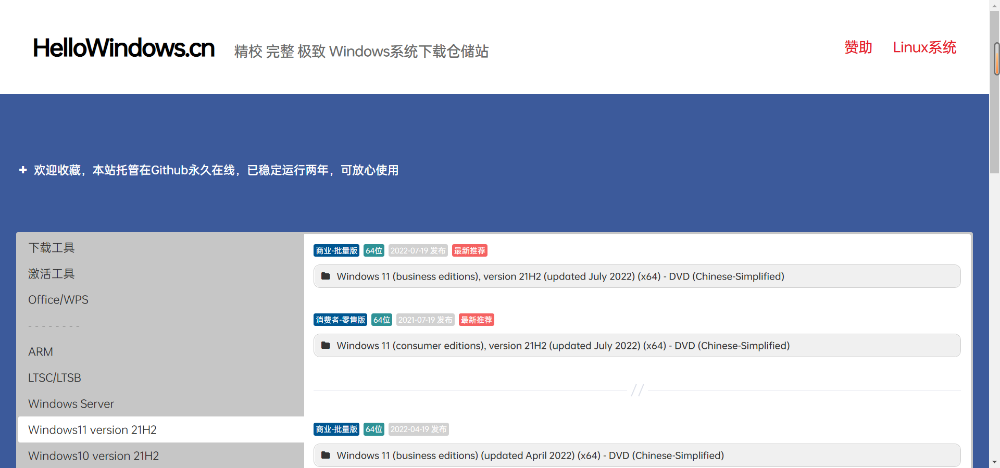

## [软件仓库](https://ruancang.net/)

> 这里面是学工党的福利网站，里面有各种设计软件

## [羽兔网](https://www.yutu.cn/)

> 这里面是学工党的福利网站，里面有各种设计软件，还有一些简单的编程资料

