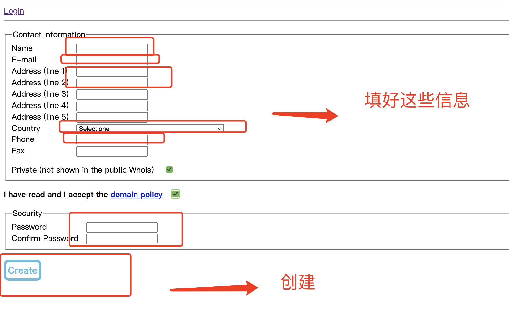
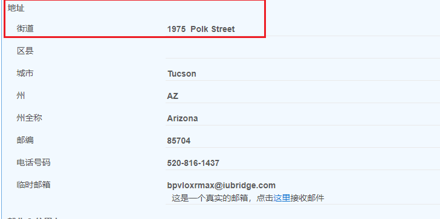
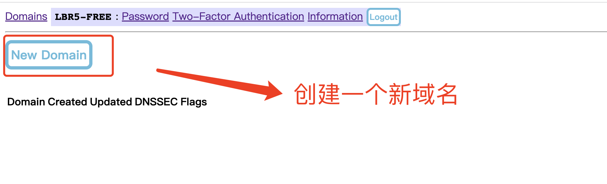
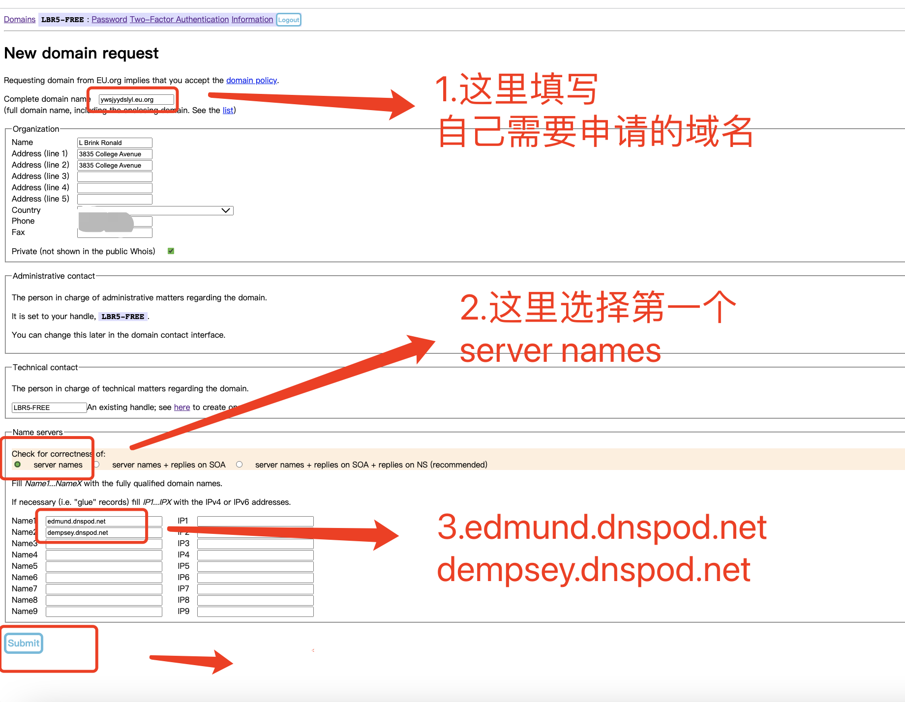
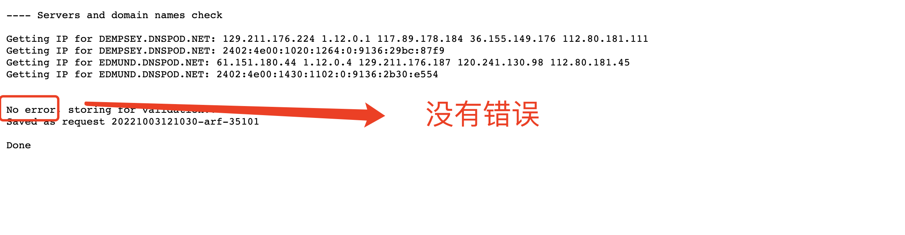
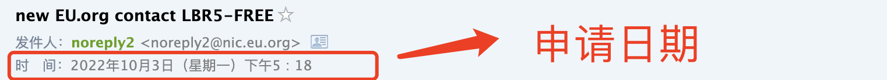
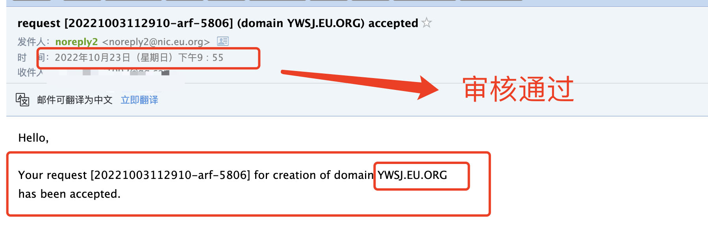
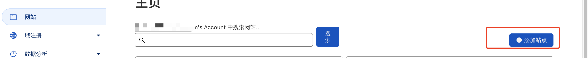
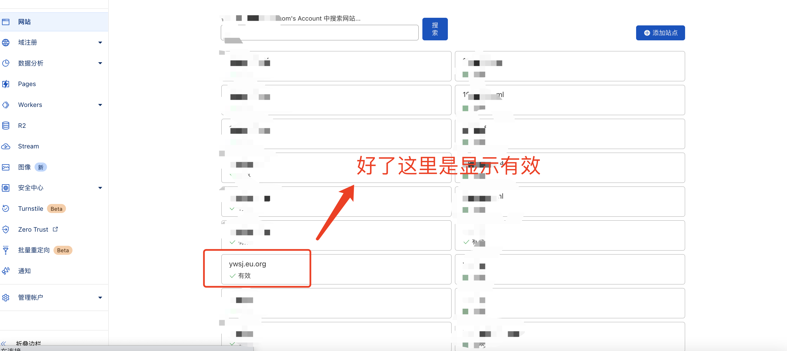

# 一、注册账号

首先进入注册页面注册一个网站的账号
https://nic.eu.org/arf/en/login/?next=/arf/en/

**点击Register注册**



注意：

1. **name**：随便起例如：TongZi Long (注意**中间必须有一个空格**)

2. E-main：一定要是你自己的，后面要收到邮件信息的

3. Address：可以参考地址生成器生成地址

    https://www.meiguodizhi.com/

    

4. Country：China
5. Password：密码


# 二、注册成功

注册账号成功以后，邮箱会收到一份激活邮件，按要求激活即可


注意：`nic-hdl` 要保存好，这个相当于我们的QQ号，不然要重新申请账号，密码是上面申请账号的时候设定的


# 三、申请域名

1. 登录成功以后新创建一个域名
    

2. dns地址可以填写这这个

    ```
    edmund.dnspod.net
    dempsey.dnspod.net
    ```

    

    注意：

    1. 申请的域名必须是三级域名所以他的后缀必须为：eu.org
    2. IPV4/6解析可写可不写（**后期配置DNS的时候还要换**）

3. 结果

    

    表示申请完成，等待审核即可，7-30天
    
    

# 四、绑定Cloudflare

## 4.1注册Cloudflare账号

https://www.cloudflare.com/zh-cn/

## 4.2登录Cloudflare账号

1. 添加站点-填入自己要绑定的域名
    
    选择免费
    

2. 添加 Cloudflare 名称服务器
    

3. 在eu.org中-选择自己的域名-Nameservers
    

4. 将Cloudflare中的两个地址替换到这里
    

5. 刚添加完是这样的
    
    **等待一段时间（不到一小时）** `要等，他不是立刻就好的`
    即可收到绑定成功的邮件-变成了这样-有效
    

    

    


