## 常用插件

#### 皮肤

>所有Jetbrains全家桶都适用

##### Cyan Light Theme

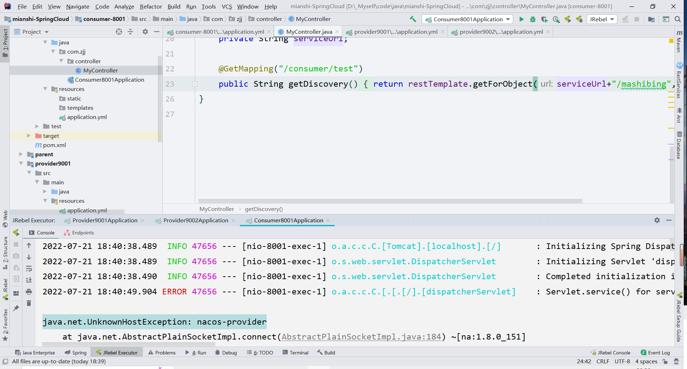


##### Vuesion Theme

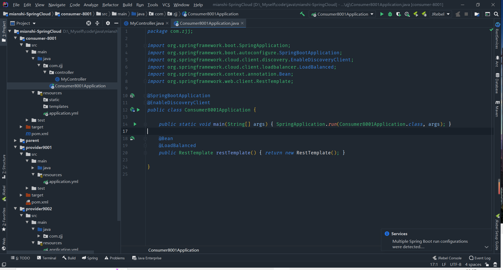


##### One Dark Theme

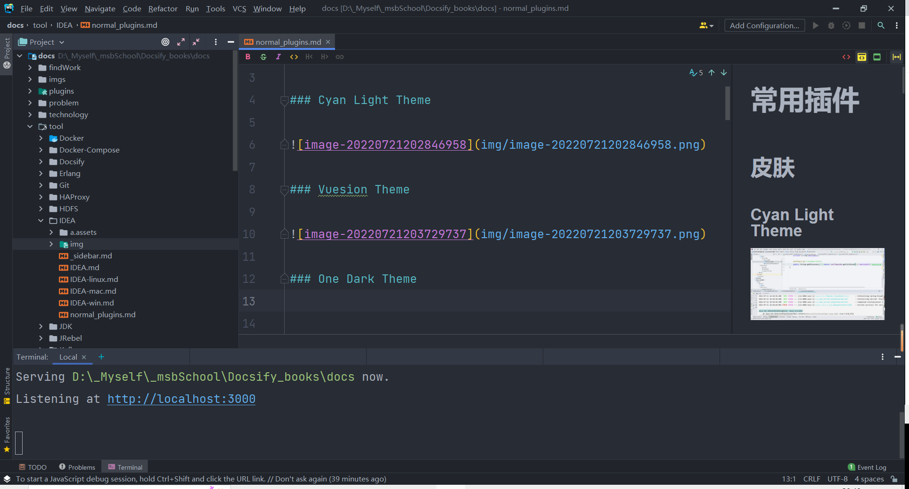


#### Atom Material ICons

> 文件夹图标修改

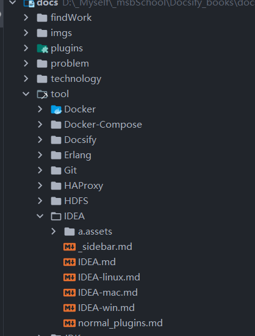


#### Maven Helper ******

> 查看Maven依赖，如果存在依赖冲突会直接爆红，很方便。

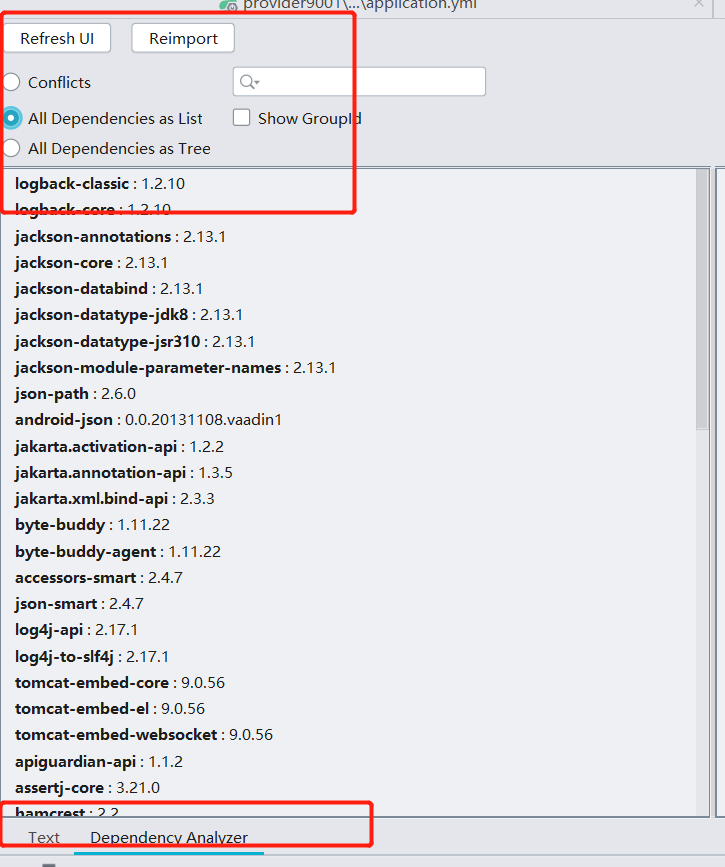


#### MybatisX

>这个不用多说懂的都懂

#### Lombok

> 这个不用多说懂的都懂

#### JRebel and XRebel

> 热部署工具

#### RestfulToolkits

> 可以直接根据URL查看本地的对应Controller，也可以当做Postman用

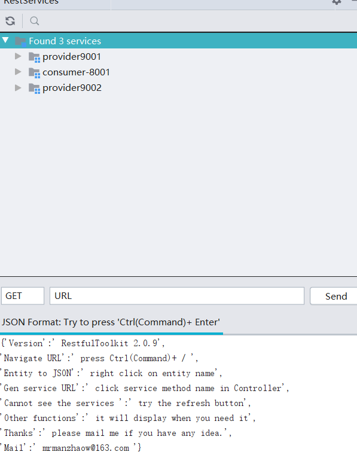


#### GsonFormat

> 可以帮助我们快速的将JSON对象转换为Bean

#### Rainbow Brakets

> 彩虹括号

#### arthas idea

> Arthas阿里开源的一款强大的JAVA在线诊断工具
>
> 缺点：需要输入一段很长的命令，如果有遗忘的话就去查看文档
> 这款插件就直接解决了这些问题。

#### VisualGC

> 诊断JVM堆栈工具

#### Zoolytic

> 一款Zookeeper结点查看分析插件。其实第三方也有一些工具。

#### SequenceDiagram

> 作用：快速查看某个方法的时序图，作用就是在我们查看项目源码时，查看方法的流程
>
> 注：只能查看我们自己写的源码，不能查看JDK的源码运行流程

##### 具体步骤

1、点击**方法名** ，然后右键点击 `SequenceDiagram`

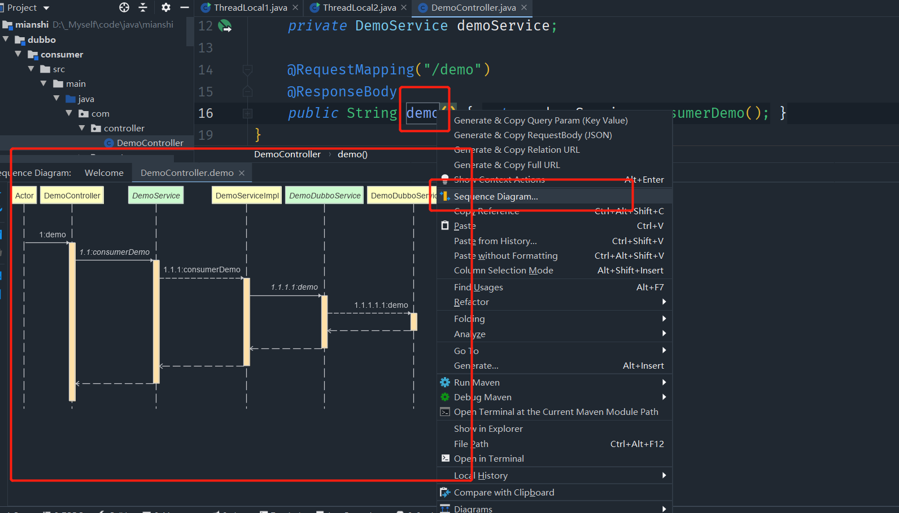


2、配置我们的生成策略

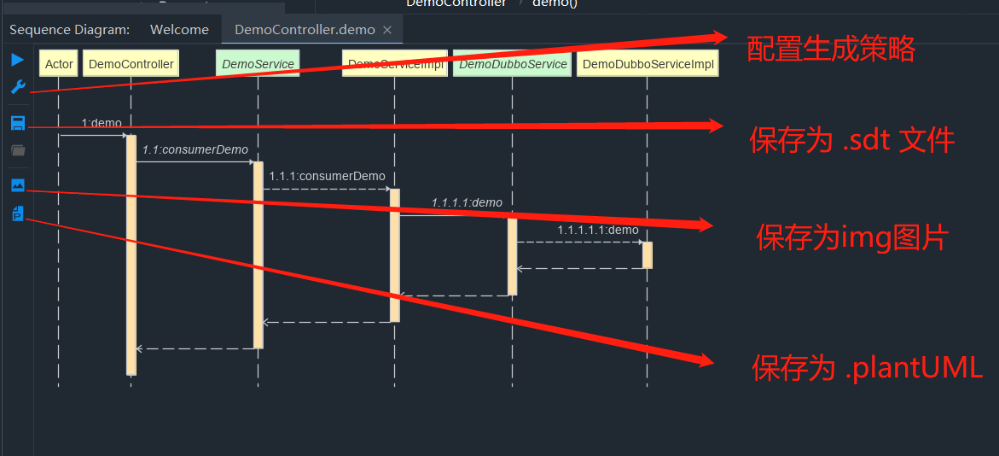


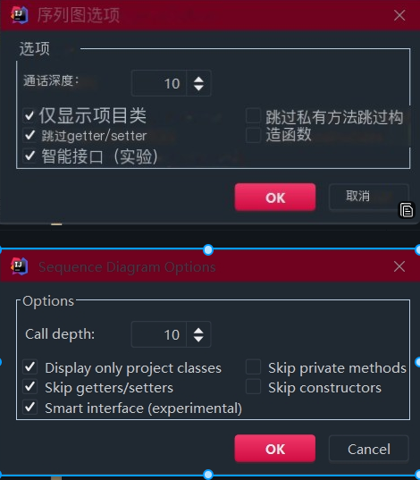


除了策略配置我们最常用的就还是最后一个保存为 .plantUML 文件，配合 `PlantUML Integration` 删除或者添加一下注解 更加完善我们的流程图

#### PlantUML Integration

> 作用：通过代码形式来写时序图，主要还是配合 SquenceDiagram

插件下载成功之后我们可以右键直接new出来 .PlantUML文件，自己直接写时序图，但是效率低不推荐还是配合Sequence吧

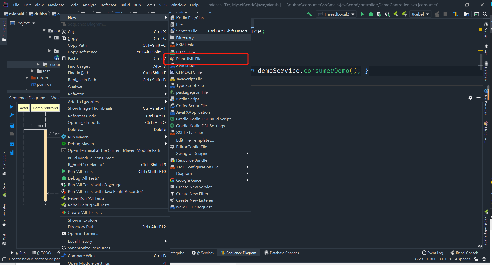


推荐一个 Sequence 和 PlantUML 二合一的应用：Sourcetrail ，有点难用，关键是英文，但是真的好用，等我死磕！！！

具体操作百度一下就行了

#### Easy Code

 自动生成作为为我自己常用的架构层次以及命名规则，在快速生产中没有他人硬性标准的情况下，不用额外配置，由于MybatisPlus的逆向工程(这老哥还要写那一套重复代码麻烦，我就鼠标点点！！！)

==下载完成之后，修改一下原来的配置模板文档(无脑粘贴没毛病)==

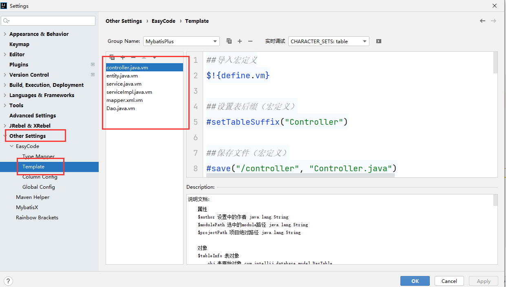


##### controller

```java
##导入宏定义
$!{define.vm}

##设置表后缀（宏定义）
#setTableSuffix("Controller")

##保存文件（宏定义）
#save("/controller", "Controller.java")

##包路径（宏定义）
#setPackageSuffix("controller")

##定义服务名
#set($serviceName = $!tool.append($!tool.firstLowerCase($!tableInfo.name), "Service"))

##定义实体对象名
#set($entityName = $!tool.firstLowerCase($!tableInfo.name))


import org.springframework.beans.factory.annotation.Autowired;
import $!{tableInfo.savePackageName}.service.$!{tableInfo.name}Service;
import org.springframework.web.bind.annotation.*;

import java.io.Serializable;
import java.util.List;

##表注释（宏定义）
#tableComment("表控制层")
@RestController
@RequestMapping("/$!tool.firstLowerCase($!tableInfo.name)")
public class $!{tableName} {
    /**
     * 服务对象
     */
    @Autowired
    private $!{tableInfo.name}Service $!{serviceName};

    
}
```

##### entity

我的实体类一般都叫pojo， 其中要整合MybatisPlus因为我在模板里面加了一个他的注解@TableName

```xml
   <!--MybatisPlus-->
        <dependency>
            <groupId>com.baomidou</groupId>
            <artifactId>mybatis-plus-boot-starter</artifactId>
            <version>3.4.2</version>
        </dependency>
```

```java
##导入宏定义
$!{define.vm}

##保存文件（宏定义）
#save("/pojo", ".java")

##包路径（宏定义）
#setPackageSuffix("pojo")

##自动导入包（全局变量）
$!{autoImport.vm}
import com.baomidou.mybatisplus.extension.activerecord.Model;
import java.io.Serializable;
import lombok.*;
import com.baomidou.mybatisplus.annotation.TableName;
import com.baomidou.mybatisplus.annotation.TableField;

##表注释（宏定义）
#tableComment("表实体类")

@AllArgsConstructor
@NoArgsConstructor
@Data
@ToString
@TableName(value = "$!{tableInfo.name}")
public class $!{tableInfo.name} implements Serializable {
#foreach($column in $tableInfo.fullColumn)
    /**
    * #if(${column.comment})${column.comment}#end
    
    */ 
    @TableField("$!{column.obj.name}")
    private $!{tool.getClsNameByFullName($column.type)} $!{column.name};
    
#end

}
```

##### entityHavaHash

```java
##导入宏定义
$!{define.vm}

##保存文件（宏定义）
#save("/pojo", ".java")

##包路径（宏定义）
#setPackageSuffix("pojo")

##自动导入包（全局变量）
$!{autoImport.vm}

import java.util.Objects;
import java.io.Serializable;
import lombok.*;
import com.baomidou.mybatisplus.annotation.TableName;
import com.baomidou.mybatisplus.annotation.TableField;

##表注释（宏定义）
#tableComment("表实体类")

@AllArgsConstructor
@NoArgsConstructor
@Data
@ToString
@TableName(value = "$!{tableInfo.name}")
public class $!{tableInfo.name} implements Serializable {
#foreach($column in $tableInfo.fullColumn)
    /**
    * #if(${column.comment})${column.comment}#end
    
    */ 
    @TableField("$!{column.name}")
    private $!{tool.getClsNameByFullName($column.type)} $!{column.name};
   
#end

    @Override
    public int hashCode() {
        return Objects.hash(#foreach($column in $tableInfo.fullColumn)$!{column.name} #if($velocityHasNext),#end#end);
    }


    @Override
    public boolean equals(Object obj) {
    
        if (this == obj) return true;
        if (obj == null || getClass() != obj.getClass()) return false;
        $!{tableInfo.name} that = ($!{tableInfo.name}) obj;
        return #foreach($column in $tableInfo.fullColumn) Objects.equals($!{column.name} , that.$!{column.name}) #if($velocityHasNext) && #end#end;
        
    }
}
```

##### Service

```java
##导入宏定义
$!{define.vm}

##设置表后缀（宏定义）
#setTableSuffix("Service")

##保存文件（宏定义）
#save("/service", "Service.java")

##包路径（宏定义）
#setPackageSuffix("service")

import com.baomidou.mybatisplus.extension.service.IService;
import $!{tableInfo.savePackageName}.pojo.$!tableInfo.name;

##表注释（宏定义）
#tableComment("表服务接口")
public interface $!{tableName} extends IService<$!tableInfo.name> {

}
```

##### ServiceImpl

```java
##导入宏定义
$!{define.vm}

##设置表后缀（宏定义）
#setTableSuffix("ServiceImpl")

##保存文件（宏定义）
#save("/service/impl", "ServiceImpl.java")

##包路径（宏定义）
#setPackageSuffix("service.impl")

import com.baomidou.mybatisplus.extension.service.impl.ServiceImpl;
import $!{tableInfo.savePackageName}.mapper.$!{tableInfo.name}Mapper;
import $!{tableInfo.savePackageName}.pojo.$!{tableInfo.name};
import $!{tableInfo.savePackageName}.service.$!{tableInfo.name}Service;
import org.springframework.stereotype.Service;
import org.springframework.beans.factory.annotation.Autowired;

##表注释（宏定义）
#tableComment("表服务实现类")
@Service
public class $!{tableName} extends ServiceImpl<$!{tableInfo.name}Mapper, $!{tableInfo.name}> implements $!{tableInfo.name}Service {
    @Autowired
    private $!{tableInfo.name}Mapper $tool.firstLowerCase($!{tableInfo.name})Mapper;
    
    
    
}

```

##### Dao  /  Mapper.java

我习惯叫mapper层，文件也是以 *Mapper 结尾

```java
##导入宏定义
$!{define.vm}

##设置表后缀（宏定义）
#setTableSuffix("Mapper")

##保存文件（宏定义）
#save("/mapper", "Mapper.java")

##包路径（宏定义）
#setPackageSuffix("mapper")

import com.baomidou.mybatisplus.core.mapper.BaseMapper;
import $!{tableInfo.savePackageName}.pojo.$!tableInfo.name;
import org.apache.ibatis.annotations.Mapper;

##表注释（宏定义）
#tableComment("表数据库访问层")

@Mapper
public interface $!{tableName} extends BaseMapper<$!tableInfo.name> {

}

```

##### Mapper.xml(映射文件，自己创建一下)

```java
##引入mybatis支持
$!{mybatisSupport.vm}

##设置保存名称与保存位置
$!callback.setFileName($tool.append($!{tableInfo.name}, "Mapper.xml"))
$!callback.setSavePath($tool.append($modulePath, "/src/main/resources/mapper"))

##拿到主键
#if(!$tableInfo.pkColumn.isEmpty())
    #set($pk = $tableInfo.pkColumn.get(0))
#end
## 拿到全索引列，用‘，’间隔
#set($sqlCloumn="#foreach($column in $tableInfo.fullColumn)$tool.hump2Underline($!column.name)#if($!foreach.hasNext),#end #end")

<?xml version="1.0" encoding="UTF-8"?>
<!DOCTYPE mapper PUBLIC "-//mybatis.org//DTD Mapper 3.0//EN" "http://mybatis.org/dtd/mybatis-3-mapper.dtd">
<mapper namespace="${tableInfo.savePackageName}.mapper.$!{tableInfo.name}Mapper">
#set($index = 0)
#set($separator = ", ")
    <!-- 所有字段 -->
    <sql id="AllColumn" >
        $sqlCloumn
    </sql>
    
    <!-- 所有字段映射 -->
    <resultMap type="${tableInfo.savePackageName}.pojo.$!{tableInfo.name}" id="AllMap">
#foreach($column in $tableInfo.fullColumn)
        <result property="$!column.name" column="$!column.obj.name" />
#end
    </resultMap>
    
    

</mapper>

```

##### 设置快捷操作***

直接导入我的JSON文件即可，将以下内容保存为.json文件并进行导入

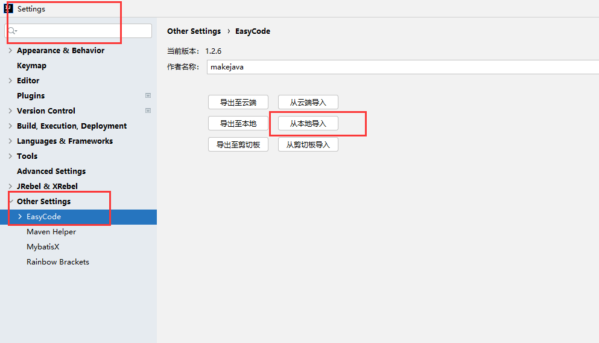


```json
{
  "author" : "makejava",
  "version" : "1.2.6",
  "userSecure" : "",
  "currTypeMapperGroupName" : "Default",
  "currTemplateGroupName" : "MybatisPlus",
  "currColumnConfigGroupName" : "Default",
  "currGlobalConfigGroupName" : "Default",
  "typeMapper" : { },
  "template" : {
    "MybatisPlus" : {
      "name" : "MybatisPlus",
      "elementList" : [ {
        "name" : "controller.java.vm",
        "code" : "##导入宏定义\n$!{define.vm}\n\n##设置表后缀（宏定义）\n##setTableSuffix(\"Controller\")\n\n##保存文件（宏定义）\n##save(\"/controller\", \"Controller.java\")\n\n##包路径（宏定义）\n##setPackageSuffix(\"controller\")\n\n##定义服务名\n##set($serviceName = $!tool.append($!tool.firstLowerCase($!tableInfo.name), \"Service\"))\n\n##定义实体对象名\n##set($entityName = $!tool.firstLowerCase($!tableInfo.name))\n\nimport com.baomidou.mybatisplus.core.conditions.query.QueryWrapper;\nimport com.baomidou.mybatisplus.extension.api.ApiController;\nimport com.baomidou.mybatisplus.extension.api.R;\nimport org.springframework.beans.factory.annotation.Autowired;\nimport com.baomidou.mybatisplus.extension.plugins.pagination.Page;\nimport $!{tableInfo.savePackageName}.pojo.$!tableInfo.name;\nimport $!{tableInfo.savePackageName}.service.$!{tableInfo.name}Service;\nimport org.springframework.web.bind.annotation.*;\n\nimport java.io.Serializable;\nimport java.util.List;\n\n##表注释（宏定义）\n##tableComment(\"表控制层\")\n@RestController\n@RequestMapping(\"/$!tool.firstLowerCase($!tableInfo.name)\")\npublic class $!{tableName} {\n    /**\n     * 服务对象\n     */\n    @Autowired\n    private $!{tableInfo.name}Service $!{serviceName};\n\n    \n}\n"
      }, {
        "name" : "entity.java.vm",
        "code" : "##导入宏定义\n$!{define.vm}\n\n##保存文件（宏定义）\n##save(\"/pojo\", \".java\")\n\n##包路径（宏定义）\n##setPackageSuffix(\"pojo\")\n\n##自动导入包（全局变量）\n$!{autoImport.vm}\nimport com.baomidou.mybatisplus.extension.activerecord.Model;\nimport java.io.Serializable;\nimport lombok.*;\nimport com.baomidou.mybatisplus.annotation.TableName;\nimport com.baomidou.mybatisplus.annotation.TableField;\n\n##表注释（宏定义）\n##tableComment(\"表实体类\")\n\n@AllArgsConstructor\n@NoArgsConstructor\n@Data\n@ToString\n@TableName(value = \"$tool.hump2Underline($!{tableInfo.name})\")\npublic class $!{tableInfo.name} implements Serializable {\n##foreach($column in $tableInfo.fullColumn)\n    /**\n    * ##if(${column.comment})${column.comment}##end\n    \n    */ \n    @TableField(\"$tool.hump2Underline($!{column.name})\")\n    private $!{tool.getClsNameByFullName($column.type)} $!{column.name};\n    \n##end\n\n}\n"
      }, {
        "name" : "service.java.vm",
        "code" : "##导入宏定义\n$!{define.vm}\n\n##设置表后缀（宏定义）\n##setTableSuffix(\"Service\")\n\n##保存文件（宏定义）\n##save(\"/service\", \"Service.java\")\n\n##包路径（宏定义）\n##setPackageSuffix(\"service\")\n\nimport com.baomidou.mybatisplus.extension.service.IService;\nimport $!{tableInfo.savePackageName}.pojo.$!tableInfo.name;\n\n##表注释（宏定义）\n##tableComment(\"表服务接口\")\npublic interface $!{tableName} extends IService<$!tableInfo.name> {\n\n}\n"
      }, {
        "name" : "serviceImpl.java.vm",
        "code" : "##导入宏定义\n$!{define.vm}\n\n##设置表后缀（宏定义）\n##setTableSuffix(\"ServiceImpl\")\n\n##保存文件（宏定义）\n##save(\"/service/impl\", \"ServiceImpl.java\")\n\n##包路径（宏定义）\n##setPackageSuffix(\"service.impl\")\n\nimport com.baomidou.mybatisplus.extension.service.impl.ServiceImpl;\nimport $!{tableInfo.savePackageName}.mapper.$!{tableInfo.name}Mapper;\nimport $!{tableInfo.savePackageName}.pojo.$!{tableInfo.name};\nimport $!{tableInfo.savePackageName}.service.$!{tableInfo.name}Service;\nimport org.springframework.stereotype.Service;\n\n##表注释（宏定义）\n##tableComment(\"表服务实现类\")\n@Service(\"$!tool.firstLowerCase($tableInfo.name)Service\")\npublic class $!{tableName} extends ServiceImpl<$!{tableInfo.name}Mapper, $!{tableInfo.name}> implements $!{tableInfo.name}Service {\n    @Autowired\n    private $!{tableInfo.name}Mapper $tool.firstLowerCase($!{tableInfo.name})Mapper;\n    \n    \n    \n}\n"
      }, {
        "name" : "mapper.java.vm",
        "code" : "##导入宏定义\n$!{define.vm}\n\n##设置表后缀（宏定义）\n##setTableSuffix(\"Mapper\")\n\n##保存文件（宏定义）\n##save(\"/mapper\", \"Mapper.java\")\n\n##包路径（宏定义）\n##setPackageSuffix(\"mapper\")\n\nimport com.baomidou.mybatisplus.core.mapper.BaseMapper;\nimport $!{tableInfo.savePackageName}.pojo.$!tableInfo.name;\nimport org.apache.ibatis.annotations.Mapper;\n\n##表注释（宏定义）\n##tableComment(\"表数据库访问层\")\n\n@Mapper\npublic interface $!{tableName} extends BaseMapper<$!tableInfo.name> {\n\n}\n"
      }, {
        "name" : "mapper.xml.vm",
        "code" : "##引入mybatis支持\n$!{mybatisSupport.vm}\n\n##设置保存名称与保存位置\n$!callback.setFileName($tool.append($!{tableInfo.name}, \"Mapper.xml\"))\n$!callback.setSavePath($tool.append($modulePath, \"/src/main/resources/mapper\"))\n\n##拿到主键\n##if(!$tableInfo.pkColumn.isEmpty())\n    ##set($pk = $tableInfo.pkColumn.get(0))\n##end\n## 拿到全索引列，用‘，’间隔\n##set($sqlCloumn=\"##foreach($column in $tableInfo.fullColumn)$tool.hump2Underline($!column.name)##if($!foreach.hasNext) ,##end ##end\")\n\n<?xml version=\"1.0\" encoding=\"UTF-8\"?>\n<!DOCTYPE mapper PUBLIC \"-//mybatis.org//DTD Mapper 3.0//EN\" \"http://mybatis.org/dtd/mybatis-3-mapper.dtd\">\n<mapper namespace=\"${tableInfo.savePackageName}.mapper.$!{tableInfo.name}Mapper\">\n\n    <sql id=\"All$!{tableInfo.name}Column\">$sqlCloumn</sql>   \n    <resultMap type=\"${tableInfo.savePackageName}.pojo.$!{tableInfo.name}\" id=\"$!{tableInfo.name}Map\">\n##foreach($column in $tableInfo.fullColumn)\n        <result property=\"$!column.name\" column=\"$!column.obj.name\" />\n##end\n    </resultMap>\n    \n    \n\n</mapper>\n"
      } ]
    }
  },
  "columnConfig" : { },
  "globalConfig" : { }
}
```

##### 注意

一定要选择你的Module、包路径、Path，因为它们分别对应的是你模板中的三个参数modulePath、tableInfo.savePackageName、我们所有的Save都是以Path的路径为根路径

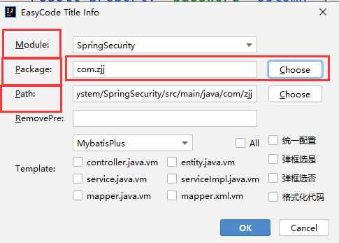


#### 未完成

## 设置

#### Service窗口

> 在微服务项目中，我们在创建多个模块后，想要启动特定的几个寻找起来非常麻烦我们这个时候就可以通过Service窗口快速找到我们的启动类
> 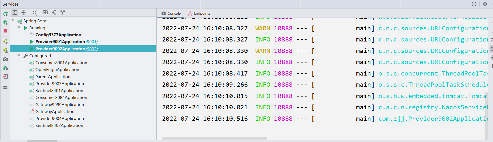

##### 具体步骤

1：开启idea，右下角会显示下图

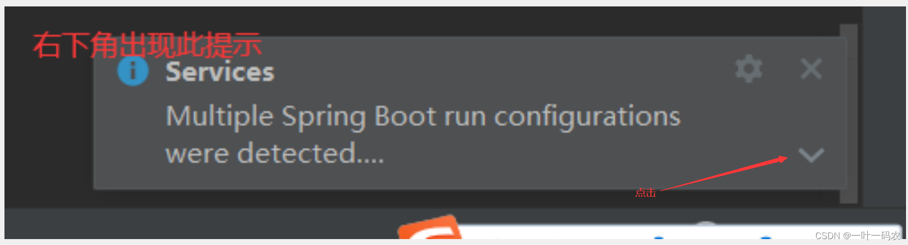


2、点击Show run configurations in Services

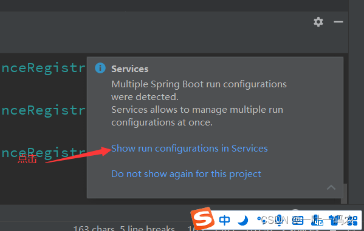


最终效果图如下：

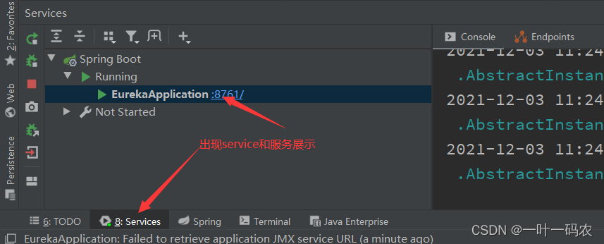


#### idea插件缓存位置修改（可选）

​	**注意不要有中文字符和空格**

```properties
idea.config.path=D:/_Porgram_IT/IntelliJIDEA2021.3.2/default_conf/.IntelliJIdea/config

idea.system.path=D:/_Porgram_IT/IntelliJIDEA2021.3.2/default_conf/.IntelliJIdea/system

idea.plugins.path=D:/_Porgram_IT/IntelliJIDEA2021.3.2/default_conf/.IntelliJIdea/config/plugins

idea.log.path=D:/_Porgram_IT/IntelliJIDEA2021.3.2/default_conf/.IntelliJIdea/log
```


#### 未完成

