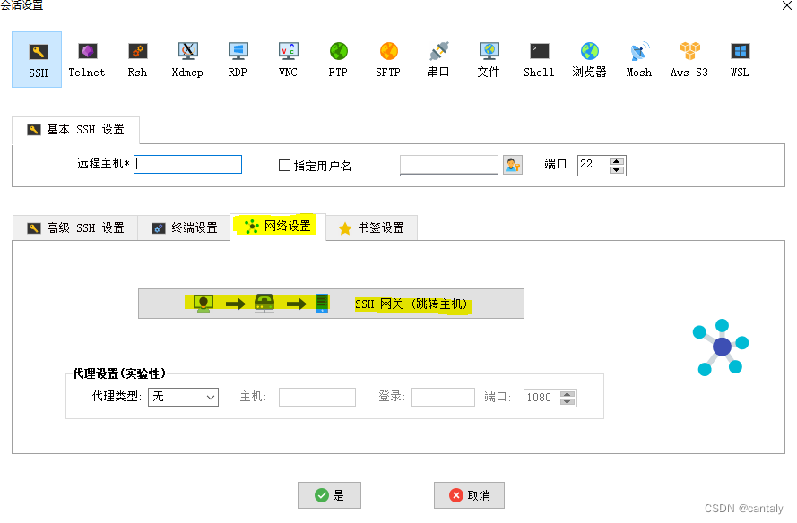

中文版下载地址：[http://mobaxterm.info/soft/MobaXterm中文版.zip](http://mobaxterm.info/soft/MobaXterm%E4%B8%AD%E6%96%87%E7%89%88.zip "http://mobaxterm.info/soft/MobaXterm中文版.zip")

[MobaXterm](https://so.csdn.net/so/search?q=MobaXterm&spm=1001.2101.3001.7020) 又名 MobaXVT，是一款增强型终端、X 服务器和 Unix 命令集（GNU/ Cygwin）工具箱。可以开启多个终端视窗，以最新的 X 服务器为基础的 X.Org，可以轻松地来试用 Unix/Linux 上的 GNU Unix 命令。这样一来，我们可以不用安装虚拟机来试用虚拟环境，然后只要通过 MobaXterm 就可以使用大多数的 linux 命令。MobaXterm 还有很强的扩展能力，可以集成插件来运行 Emacs、Fontforge、Gcc, G++ and development tools、MPlayer、Perl、Curl、Corkscrew、 Tcl / Tk / Expect、 Screen、 Png2Ico 、 NEdit  Midnight Commander 等程序。

MobaXterm 分免费开源版和收费专业版。

*   免费开源版：免费开源版又分便捷版（解压即用）和安装版（需要一步步安装）。免费版在终端底部还多了一个 "UNREGISTERED VERSION" 提示。
*   专业版（Professional）：专业版会在 sessions 数、SSH tunnels 数和其他一些定制化配置进行限制。

PuTTY足够成熟、小巧、专注核心任务，支持设置编码，键盘映射，通过plink做ssh隧道，通过pscp实现scp文件传输，通过psftp做sftp客户端，通过 puttygen 生成和管理ssh证书。可以说 putty虽然小，但是功能一个也没落下，麻雀虽小，五脏俱全。但是 Putty 没有多服务管理和标签页切换等的功能。

1、主要功能
======

支持各种连接 SSH，X11，RDP，VNC，FTP，MOSH  
支持 Unix 命令（bash，ls，cat，sed，grep，awk，rsync，…）  
连接 SSH 终端后支持 SFTP 传输文件  
各种丰富的插件（git/dig/aria2…）  
可运行 Windows 或软件

*   1.会话管理 ：MobaXterm允许您启动远程会话。您可以选择创建SSH，远程登录，Rlogin的，RDP，VNC，XDMCP，FTP，SFTP或串行会话。你开始每个会话会自动保存，并在左侧边栏显示。
*   2.图形化SFTP浏览器 ：当您登录到使用SSH远程服务器，图形SFTP浏览器弹出在左侧边栏。它可以让你拖动并直接从/到远程服务器使用安全SFTP连接拖放文件。
*   3.X11服务器 ：当您运行SSH，TELNET或RLOGIN/RSH会话。你将能够直接在本地WindowsPC上显示您的远程应用程序。在一个SSH会话，也没有[必要](https://www.cr173.com/k/biyao/?login=from_csdn "必要")为MobaXterm使用X11转发。以缓解并保护您的工作设置“DISPLAY”变量。
*   4.增强X扩展 ：基于X.org嵌入式X服务器提供了最近的X服务器的实现提供最新的功能：扩展功能，如OpenGL的，复合或RANDR都包括在内。还支持XDMCP协议。
*   5.多执行 ：编写一次，到处运行：这个工具可以让你在同一时间运行在许多不同的服务器相同的命令。
*   6.嵌入式服务器 ：MobaXterm可以启动网络守护程序进行远程访问。无需额外的工具或运行时需要的，以便使用这些守护程序。
*   7.嵌入式工具 ：MobaXterm带来了一些有用的工具，系统管理员，developpers，网站管理员。谁需要用计算机高效工作的所有用户。
*   8.远程UNIX的桌面（XDMCP）：由于MobaXterm您可以将远程Solaris桌面上工作。因为如果你是在本地Windows计算机上使用XDMCP协议工作。
*   9.远程Windows桌面（RDP） ： 利用远程Windows计算机/使用RDP协议的服务器控制。许多RDP配置设置在会话管理器可用。
*   10.SSH网关 ：在SSH，TELNET，RDP，VNC会话，您可以选择“SSH-网关”（又名“跳跃主机”）。以告诉MobaXterm先连接到SSH服务器连接到终端服务器之前要达到结束。这让你达到一个防火墙后面的一些服务器，并保护您的连接。
*   11.SSH隧道（端口转发） ：图形SSH隧道管理器允许您使用直观的图形化的工具来创建你的SSH隧道。
*   12.MobApt包管理器 ：MobaXterm包管理器（MobApt/apt-get的）。可以下载和使用更多的Unix工具直接进入MobaXterm终端。MobApt包管理器（apt-get的） 
*   13.文本编辑器 ：当您使用SSH连接到远程服务器上。您将可以直接使用嵌入式文本编辑器“MobaTextEditor”编辑远程文件。
*   只需双击他们！通过SSH/SFTP直版
*   14.宏支持 ：您可以记录在MobaXterm终端宏：一切你在终端类型将被记录。以便在以后重播其他服务器上。
*   15.密码管理 ： MobaXterm就是能救你的会话密码，并让他们安全使用“主密码”。
*   16.专业定制 ：MobaXterm专业版，您可以访问专业支持，并以“定制”的软件。这个程序可以生成MobaXterm的定制副本用自己的徽标和默认设置。

**多终端 分屏**
----------

MobaXterm 内置多标签页、横向纵向 2 分屏和田字形 4 分屏，用于一个窗口内管理多个连接。管理多台服务器不必开多个窗口。

多窗口同时执行相同命令
-----------

编写一次，到处执行:该工具允许您同时在许多不同的服务器上执行相同的命令。

内建 SFTP 文件传输
------------

如果用 SSH 连接远程主机，则左侧就会自动启动 SFTP 连接，列出服务器上的文件列表，无需任何配置。可以直接上传下载，更方便的是，还可以让文件列表的当前目录，直接跟随终端当前目录同步切换！

**关闭自动弹出 SFTP**：Moba 在连接上远程电脑之后，将自动打开左侧的SFTP侧边栏。有时我们并不需要 SFTP，同时主窗口是黑色的，SFTP 又是白色的，显得有点刺眼，因此可以将自动弹出SFTP 功能关闭掉。在菜单栏点击 「settings」 --> 「Configuration」，在弹出的对话框中选择 「SSH」，再将 「automaticall switch to SSH-browser tab after login」 前面的对勾去掉即可。

 

会话管理 ( SSH/Telnet/Rsh/Xdmcp/RDP/VNC/FTP/SFTP 等 )
------------------------------------------------

MobaXterm 允许您启动远程会话。 您可以选择创建 SSH、Telnet、Rlogin、RDP、VNC、XDMCP、FTP、SFTP 或串行会话。 您开始的每个会话都会自动保存并显示在左侧边栏中。

可以看到 MobaXterm 支持完整的远程桌面。Windows 服务器管理员特别推荐。

打开软件后，点击左上角的 会话（会话控制），在弹出的窗口中选择 SSH：

###  windows 远程桌面 (RDP)

使用RDP协议控制远程Windows计算机/服务器。在会话管理器中可以使用许多RDP配置设置。

更加友好的串口连接设置。MobaXterm 不仅支持串口连接，并且直接提供下拉框选择串口号和波特率，选择串口号时还会自动显示串口设备的名称。这一点对于开源硬件玩家是相当幸福的。

### linux 远程桌面 (XDMCP)

通过 MobaXterm 您可以在远程Solaris桌面上工作，就像使用XDMCP协议在Windows计算机上本地工作一样。

SSH gateway ( 跳转主机 )
--------------------

在 ssh, telnet, RDP, VNC 会话中，您可以选择一个“ssh -gateway”(又称“ssh -gateway”)。“跳转主机”)，以便告诉MobaXterm首先连接到SSH服务器，然后再连接到您最终想要到达的端服务器。这允许您访问防火墙后的一些服务器，并保护您的连接。

SSH 隧道 (端口转发)
-------------

图形化SSH隧道管理器允许您使用直观的图形化工具创建SSH隧道。

MobApt 包管理器
-----------

MobaXterm 包管理器 (MobApt / apt-get) 允许您直接下载和使用更多Unix工具到MobaXterm终端。

密码 管理
-----

MobaXterm能够保存您的会话密码，并通过使用“主密码”来保持它们的安全。

在终端语法高亮显示
---------

MobaXterm嵌入式终端可以突出显示语法或为关键字使用颜色，即使您连接到不支持颜色的远程服务器。这在分析日志文件、编辑代码或试图检测重要关键字时尤其有用。您甚至可以轻松地构建自己的语法定义。

2、常用设置
======

**注意：任何配置修改后都需要重启下 MobaXterm，否则不会生效。**

## 取消自动关闭连接

MobaXterm 使用 ssh 直接连接远程主机，或者通过跳板机登陆远程服务器可能会出现一段时候不操作就会自动关闭连接。要解决这个过一会就断开连接的问题，我们需要在勾选 Setting 下的 SSH Keepalive 选项。

右键快速复制粘贴
------------

在Moba及很多终端工具里，都有这样的功能：鼠标左键划选复制文件，右键粘贴文本。但在Moba中右键粘贴功能默认不打开，我们可以手动打开。

使用 Windows 环境变量
-------------------

如果您 Windows 下安装了 node、Python 等环境，发现相关命令无法在MobaXterm 使用，打开 Settings – Configuration – Terminal – 使用Windows 环境变量，如下截图。

## 导出/导入当先配置

### 导出

这样就回自动导出配置文件，是在安装目录同目录下的一个压缩文件

### 导入

### 补充

# 3、我习惯的快捷键

