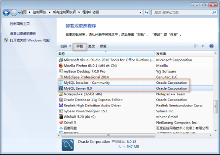

# MySQL安装（Windows）

> 下载自己想要的版本

## 前提提要

### 【1】MySQL的版本

近期主要历史版本有5.0/5.1/5.5/5.6/5.7，目前最新版本是MySQL8。6.0曾经是个内部试验版本，已取消了。

MySQL8.0的版本历史
1) 2016-09-12第一个DM(development milestone)版本8.0.0发布
2) 2018-04-19第一个GA(General Availability)版本开始，8.0.11发布
3) 2018-07-27 8.0.12GA发布
4) 2018-10-22 8.0.13GA发布
5) 2019-01-21 8.0.14GA发布
6) 2019-02-01 8.0.15GA发布
7) 最新的版本是8.0.18,2019年10月14日正式发布
8) ....后续更新

### 【2】官方下载地址

> 推荐第二种，但是新手建议第一种

#### 下载方式一

https://dev.mysql.com/downloads/windows/installer/8.0.html


#### 下载方式二

https://dev.mysql.com/downloads/mysql/

点击右边的`Looking for previous GA versions`（查找之前的稳定版本），会出现其他稳定版本可选（推荐下载 5.7.31 版本）


> mysql-xxx-win64.msi，后缀为msi的是windows安装包，即根据向导安装。
> mysql-xxx.zip，这个是windows源文件，需要编译。
> mysql-xxx-win64.zip，这个是解压即用，是编译好的windows64位 MySQL，需要手工配置。


### 【3】安装过程

#### 方式一的安装（安装包引导安装）

**1.双击MySQL安装文件mysql-installer-community-8.0.18.0.msi，出现安装类型选项。**

* Developer Default：开发者默认

* Server only：只安装服务器端 

* Client only：只安装客户端

* Full：安装全部选项
* Custom：自定义安装（`如果想要装到其他盘【除C盘】的位置，选择这个，然后百度，下方介绍的是·Server only`）


**2.选择，然后继续：**


**3.进入产品配置向导，配置多个安装细节，点击Next按钮即可。**


**4.高可靠性High Availability，采用默认选项即可。**

* Standalone MySQL Server/Classic MySQL Replication:独立MySQL服务器/经典MySQL复制

* InnoDB Cluster:InnoDB集群


**5.类型和网络 Type and Networking，采用默认选项即可。记住MySQL的监听端口默认是3306。**


**6.身份验证方法Authentication Method，采用默认选项即可。**

 

**7.账户和角色 Accounts and Roles。MySQL管理员账户名称是root，在此处指定root用户的密码。还可以在此处通过Add User按钮添加其他新账户，此处省略该操作。**


**8.Windows服务：Windows Service。**

* Configure MySQL Server as a Windows Service:给MySQL服务器配置一个服务项。

* Windows Service Name:服务名称，采用默认名称MySQL80即可。

* Start the MySQL at System Startup：系统启动时开启MySQL服务


**9.Apply Configuration：点击Execute按钮执行开始应用这些配置项。**

* Writing configuration file: 写配置文件。

* Updating Windows Firewall rules：更新Windows防火墙规则

* Adjusting Windows services：调整Windows服务

* Initializing database：初始化数据库

* Starting the server： 启动服务器

* Applying security setting：应用安全设置

* Updating the Start menu link：更新开始菜单快捷方式链接


**PS：如果配置出错，查看右侧的log，查看对应错误信息。**
**执行完成后，如下图所示。单击Finish完成安装，进入产品配置环节。**


**10.产品配置Product Configuration到此结束：点击Next按钮。**


**11.安装完成 Installation Complete。点击Finish按钮完成安装。**


**12.MySQL配置、登录**

**【1】登录：**
访问MySQL服务器对应的命令：mysql.exe ,位置：C:\Program Files\MySQL\MySQL Server 8.0\bin


（mysql.exe需要带参数执行，所以直接在图形界面下执行该命令会自动结束）


打开控制命令台：win+r:


执行mysql.exe命令的时候出现错误：


需要配置环境变量path:


**注意：控制命令台必须重启才会生效：**

**登录的命令：mysql  -hlocalhost -uroot –p**

* mysql：bin目录下的文件mysql.exe。mysql是MySQL的命令行工具，是一个客户端软件，可以对任何主机的mysql服务（即后台运行的mysqld）发起连接。

* -h：host主机名。后面跟要访问的数据库服务器的地址；**如果是登录本机，可以省略**

* -u：user 用户名。后面跟登录数据的用户名，第一次安装后以root用户来登录，是MySQL的管理员用户

* -p:   password 密码。一般不直接输入，而是回车后以保密方式输入。


**【2】访问数据库**

显示MySQL中的数据库列表：

```shell
show databases;
```

 默认有四个自带的数据库，每个数据库中可以有多个数据库表、视图等对象。

切换当前数据库的命令：

```shell
use mysql;
```

* MySQL下可以有多个数据库，如果要访问哪个数据库，需要将其置为当前数据库。

* 该命令的作用就是将数据库mysql（默认提供的四个数据库之一的名字）置为当前数据库

显示当前数据库的所有数据库表：

```shell
show tables;
```

MySQL 层次：不同项目对应不同的数据库组成 - 每个数据库中有很多表  - 每个表中有很多数据

**【3】退出数据库**

退出数据库可以使用quit或者exit命令完成，也可以用\q;  完成退出操作


#### 方式二的安装（离线安装）

##### 1、解压缩软件包

新建 MySQL 文件夹，解压缩包，进入文件夹 mysql-5.7.31-winx64。之后的操作都在此文件夹内。

##### 2、配置环境变量

打开”环境变量“，在`系统变量`内新建一个 `MYSQL_HOME` 变量，输入 MySQL 解压后文件夹的路径。


在`系统变量内`找到其中的 `Path`变量，双击打开，再最后加上 `%MYSQL_HOME%\bin`


如果打开 Path 是这样的框，则直接添加在文字尾部即可，但需要注意前后都要有 “ ; ” 。


##### 3、配置文件

进入解压缩后的文件内，新建 my.ini 文件，输入配置内容
( basedir 和 datadir 换成你自己的目录)

```c
[mysql]

# 设置mysql客户端默认字符集
default-character-set=utf8

[mysqld]

#设置3306端口
port = 3306

# 设置mysql的安装目录
basedir=D:\MySQL

# 设置mysql数据库的数据的存放目录
datadir=D:\MySQL\data

# 允许最大连接数
max_connections=200

# 服务端使用的字符集默认为8比特编码的latin1字符集
character-set-server=utf8

# 创建新表时将使用的默认存储引擎
default-storage-engine=INNODB 
```

##### 4、安装命令（`以下命令必须以管理员身份进行`）

以管理员身份打开cmd（win+x 后按 a 键）

切换至 bin 文件夹内

输入下面这个语句新建 data 文件夹，建立默认数据库

```lua
mysqld --initialize-insecure --user=mysql 
```

之后你会发现多了一个 data 文件夹，此时 MySQL 建立了默认的数据库，用户名为 root，密码为空。

##### 5、安装服务

输入下面语句：

```mipsasm
mysqld -install 
```

第一次安装的话会显示 `"Service successfully installed"`

如果已经安装过了，会显示 “The service already exists!”，这时需要移除服务：

```csharp
mysqld -remove 
```

切换 MySQL 版本的时候，需要先移除服务再安装。感觉免安装，切换版本挺容易的。
需要在原先的文件夹内 remove ，再在当前的文件夹内 install

##### 6、进入 MySQL

###### 启动 MySQL 服务

```dos
net start mysql 
```

###### 登录

输入登录语句：-u 指的是登录的用户名，-p 是密码，因为是默认安装的数据库，此时密码为空，回车即可。

```css
mysql -u root -p 
```

###### 设置密码

因为 MySQL 建立了默认的数据库，用户名为 root，密码为空，所以为了避免之后出现登录问题，登陆后先修改密码。new_password 部分是你的新密码。`（注意密码在单引号内部：'password'）`

```sql
ALTER USER 'root'@'localhost' IDENTIFIED BY 'new_password'; 
```

ok，我们的MySQl就安装完成了，现在我们就可以操作数据库啦！

不使用的时候最好停止 MySQL 服务。

```vbnet
net stop mysql 
```


### 【4】卸载

**1)停止MySQL服务：在命令行模式下执行net stop mysql或者在Windows服务窗口下停止服务**


**2)在控制面板中删除MySQL软件**




**3)删除软件文件夹：直接删除安装文件夹C:\Program Files\MySQL，其实此时该文件夹已经被删除或者剩下一个空文件夹。**

**4)删除数据文件夹：直接删除文件夹C:\ProgramData\MySQL。此步不要忘记，否则会影响MySQL的再次安装。**
**（ProgramData文件夹可能是隐藏的，显示出来即可）**
**（MySQL文件下的内容才是真正的MySQL中数据）**

**5)删除path环境变量中关于MySQL安装路径的配置** 


### MySQL 安装（Linux）

#### ——1.1

MySQL安装

##### 1、卸载原来的版本

###### 1、查看mysql的安装情况

```sh
rpm -qa | grep -i mysql
```


###### 2、删除上图安装的软件

```sh
rpm -ev --nodeps mysql57-community-release-el5-7.noarch
rpm -ev --nodeps mysql-community-server-5.7.18-1.el5.x86_64
rpm -ev --nodeps mysql-community-client-5.7.18-1.el5.x86_64
rpm -ev --nodeps mysql-community-libs-5.7.18-1.el5.x86_64
rpm -ev --nodeps mysql-community-common-5.7.18-1.el5.x86_64
rpm -ev --nodeps mysql-5.7.18-1.el5.x86_64
rpm -ev --nodeps mysql-community-libs-compat-5.7.18-1.el5.x86_64

```

###### 3、都删除成功之后，查找相关的mysql的文件

```sh
find / -name mysql
```


###### 4、删除全部文件

```sh
rm -rf /etc/selinux/targeted/active/modules/100/mysql
rm -rf /root/mysql
rm -rf /root/mysql/data/mysql
rm -rf /var/lib/mysql
rm -rf /var/lib/mysql/mysql
rm -rf /usr/share/mysql
```

###### 5、再次执行命令

```shell
rpm -qa | grep -i mysql
###如果没有显式则表示卸载完成
```


##### 2、删除mariadb-libs(不可省略)

```sh
### 检查mariadb-libs
rpm -qa|grep mariadb
### 卸载mariadb-libs
yum remove mariadb-libs

```


##### 3、安装MySQL

###### 1，输入

wegt https://dev.mysql.com/get/mysql版本号-community-release-el大版本-小版本.noarch.rpm

```sh
wget https://dev.mysql.com/get/mysql57-community-release-el5-7.noarch.rpm

```

###### 2、安装数据源

```sh
yum install mysql57-community-release-el5-7.noarch.rpm

```

###### 3、查看mysql源是否安装成功

```sh
yum repolist enabled | grep "mysql.*-community.*"

```

###### 4、安装数据库

```sh
yum install mysql-community-server


### 如果过期可以在运行安装程序之前导入密钥
rpm --import https://repo.mysql.com/RPM-GPG-KEY-mysql-2022
```

###### 5、启动mysql

```sh
### centos7
systemctl restart mysqld
systemctl status mysqld


### centos6
service mysqld start

service mysqld status
```

###### 6、显示mysql的随机密码

```sh
grep 'temporary password' /var/log/mysqld.log

```


###### 7、登录并修改mysql密码

登录：mysql -u root -p   		然后输入上面生成的密码

**_修改自定义密码，设置自己想要的密码_**

```sql
-- ALTER USER 'root'@'localhost' IDENTIFIED BY '密码';

ALTER USER 'root'@'localhost' IDENTIFIED BY 'root';
```

**_失败了的话就修改策略，将策略降低一下就可以了_**

查看密码策略：

```sql
SHOW VARIABLES LIKE 'validate_password%';
```

修改密码策略

```sql
-- 修改密码长度：（长度）
set global validate_password.length=1;
-- 修改密码等级：（等级）
set global validate_password.policy=0;
```


##### 4、其他配置

###### 1.开机自启

```sh
### 开机启动
systemctl enable mysql
### 关闭自动启动
systemctl disable mysqld
```


###### 2.远程连接

###### 方法一、创建一个用户 支持远程连接

①登录 ：mysql -u root -p

②创建用户： create user 'aaa'@'%' identified by '123456';

③授权所有权限给user这个新用户 ：grant all on *.* to 'aaa'@'%';

④退出mysql：quit;

###### 方法二、设置root用户支持远程连接

①登录：mysql -u root -p （ 注：系统提示输入数据库root用户的密码，输入完成后即进入mysql控制台，这个命令的第一个mysql是执行命令，第二个mysql是系统数据名称，不一样的。）

②设置权限：

赋予权限格式： grant 权限 on 数据库对象 to 用户@IP(或者相应正则)

```sql
-- 新建用户规则或者直接修改root用户的规则 ，2 选一
use mysql;

-- 这里表示赋予该用户所有数据库所有表（*.*表示所有表），%表示所有IP地址。
GRANT ALL PRIVILEGES ON *.* TO 'root'@'%' IDENTIFIED BY '123456' WITH GRANT OPTION;
-- 使root能再任何host访问
update user set host = '%' where user = 'root';      

-- 刷新
FLUSH PRIVILEGES;
```

③查看：

```sql
use mysql;
SELECT HOST,USER FROM USER;
```


 ④退出mysql：quit;


####  ——2

##### 1、查询镜像

```shell
docker search mysql
```

##### 2、拉取镜像

```shell
docker pull mysql:5.7
```

##### 3、构建容器

先自己创建配置文件基础模板（**要是后期要修改配置文件必须加入 模板中的两个元素，不然容器启动会出错**）

```shell
mkdir -p /root/mysql/conf
vim  /root/mysql/conf/my.cnf
```

**模板内容：**

```shell
### Copyright (c) 2016, 2021, Oracle and/or its affiliates.
###
### This program is free software; you can redistribute it and/or modify
### it under the terms of the GNU General Public License, version 2.0,
### as published by the Free Software Foundation.
###
### This program is also distributed with certain software (including
### but not limited to OpenSSL) that is licensed under separate terms,
### as designated in a particular file or component or in included license
### documentation.  The authors of MySQL hereby grant you an additional
### permission to link the program and your derivative works with the
### separately licensed software that they have included with MySQL.
###
### This program is distributed in the hope that it will be useful,
### but WITHOUT ANY WARRANTY; without even the implied warranty of
### MERCHANTABILITY or FITNESS FOR A PARTICULAR PURPOSE.  See the
### GNU General Public License, version 2.0, for more details.
###
### You should have received a copy of the GNU General Public License
### along with this program; if not, write to the Free Software
### Foundation, Inc., 51 Franklin St, Fifth Floor, Boston, MA  02110-1301 USA


!includedir /etc/mysql/conf.d/
!includedir /etc/mysql/mysql.conf.d/

[mysql]
default-character-set=utf8
[mysqld]
character_set_server=utf8
init_connect='SET NAMES utf8'
lower_case_table_names = 1

```

**构建容器**

```shell
docker run \
-p 3306:3306 \
-v /root/mysql/data:/var/lib/mysql \
-v /root/mysql/logs:/logs \
-v /root/.bashrc:/root/.bashrc \
-v /root/mysql/conf/my.cnf:/etc/mysql/my.cnf \
-e MYSQL_ROOT_PASSWORD=root \
--name mysql \
--hostname node1 \
--restart=always \
-d mysql:5.7
```

**注**：出错时将本地映射文件检查一下，要是不需要配置，只需映射直接删掉就可，以后再改配置文件

##### 4、进入容器

```shell
docker exec -it mysql /bin/bash
或者
docker exec -it mysql mysql -uroot -p
```


##### 5、查看远程连接

还有一些方法也可以试一下

```shell
1.赋予权限格式：grant 权限 on 数据库对象 to 用户@IP(或者相应正则)

　　　　注：可以赋予select,delete,update,insert,index等权限精确到某一个数据库某一个表。

　　　　GRANT ALL PRIVILEGES ON *.* TO '用户名'@'%' IDENTIFIED BY '密码' WITH GRANT OPTION;
	  GRANT ALL PRIVILEGES ON *.* TO 'root'@'%' IDENTIFIED BY '123456' WITH GRANT OPTION;

　　　　这里表示赋予该用户所有数据库所有表（*.*表示所有表），%表示所有IP地址。

2.刷新权限：FLUSH PRIVILEGES;

3.查看权限：select user,host from mysql.user;

二.意外
　　1.配置文件种指定了blind-address：
#　　　　查看Mysql配置文件种（一般是/etc/my.cnf种）是否指定了blind-address，这表示只能是某个或某几个ip能连接。如果有就将它注释了，前面加#号注释。然后从启mysql。
    　重启mysql：service mysqld restart,如果安装的是Mariadb（我的就是）,则需要使用systemctl restart mariadb.service
    　
    2.防火墙的原因：
　　　　可能会报：ERROR 2003 (HY000): Can't connect to MySQL server on '你要连接的IP' (111)。

　　　　原因：1.可能是Mysql端口不对（默认是3306），只需加参数 -P 你的端口指定就行；
　　　　
　　　2.还有可能是有防火墙阻止，可以通过telnet来测试（可以直接关闭防火墙）。
　　　　　　　　　　防火墙相关命令：

　　　　　　　　　　　　（1）查看防火墙状态：service  iptables status或者systemctl status firewalld或者firewall-cmd --state

　　　　　　　　　　　　（2）暂时关闭防火墙：systemctl stop firewalld或者service  iptables stop或者systemctl stop firewalld.service

　　　　　　　　　　　　（3）永久关闭防火墙：systemctl disable firewalld或者chkconfig iptables off或者systemctl disable firewalld.service

　　　　　　　　　　　　（4）重启防火墙：systemctl enable firewalld或者service iptables restart  或者systemctl restart firewalld.service

 　　　　　　　　　　　　 (5)永久关闭后重启：chkconfig iptables on

　　

　　3.端口未开启：（我遇到的就是这个原因）
　　　　　　Mysql：ERROR 2003 (HY000) 110（连接超时）

　　　　　　查看你的服务器是否把对应端口打开，未打开启动就行了。　
　　　　　　
   4.Navicat连接MySQL，出现2059 - authentication plugin 'caching_sha2_password'的解决方案
  	
  	0先进入容器，
  	docker exec -it mysql mysql -uroot -p
  	
#  	1#修改加密规则password是自己的密码，root也是登陆账户，下同。
  	use mysql;
    ALTER USER 'root'@'localhost' IDENTIFIED BY 'root' PASSWORD EXPIRE NEVER; 
    
##	2 #更新一下用户的密码 
	ALTER USER 'root'@'localhost' IDENTIFIED WITH mysql_native_password BY 'root';
	
##	3#刷新权限 
	FLUSH PRIVILEGES; 
	
##	4#更新一下用户的密码
	ALTER USER 'root'@'%' IDENTIFIED WITH mysql_native_password BY 'root'; 

```


#### ——2.2

Docker-compose安装，配置文件去仓库里面拉

https://gitee.com/zjj3366/my-notes/tree/master/Docker/MySQL


结束后直接用即可

