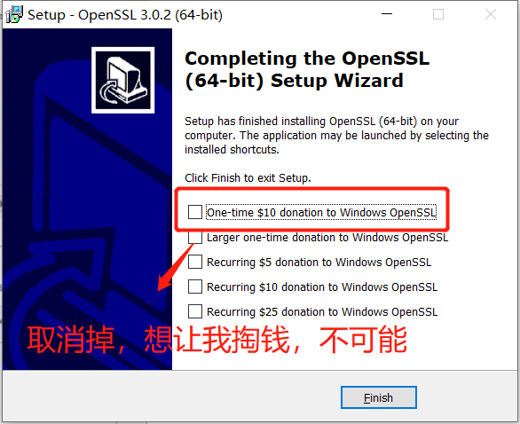

### OpenSSL安装教程（Windows）

openssl官网下载地址：http://slproweb.com/products/Win32OpenSSL.html


#### 安装环境:

>windows 10
>Win64 OpenSSL v1.1.1i


#### 一.下载openssl安装版

​	我这里是win10 64位,所以选的中间那个

 


#### 二.安装过程

​	也没啥特殊的 ，一直next，只有两点注意：

1、修改安装地址

2、最后一步，不要勾选，会掏钱。

  

  

  

  




#### 三.配置环境变量


 


#### 四.测试

```sh
openssl -version
```


### OpenSSL安装（Linux）

#### ——1

参考链接：https://blog.csdn.net/vector_data/article/details/107557941

##### 1.安装依赖C语言依赖

​	redis使用C语言编写，所以需要安装C语言库

```sh
yum install -y gcc zlib 
```

​	

##### 2.上传并解压

​	把 `openssl-1.1.1j.tar.gz` 上传到/usr/local/tmp中，解压文件

```
 cd /usr/local/tmp

 tar zxf openssl-1.1.1j.tar.gz 
 mv openssl-1.1.1j ../openssl
 
```


##### 3.编译并安装

​	进入解压文件夹

```sh
  cd /usr/local/openssl
```

​	 配置编译 

```sh
./config
```

​	编译安装	

```
make clean && make install
```

​	测试

```
openssl version -a
```

 


