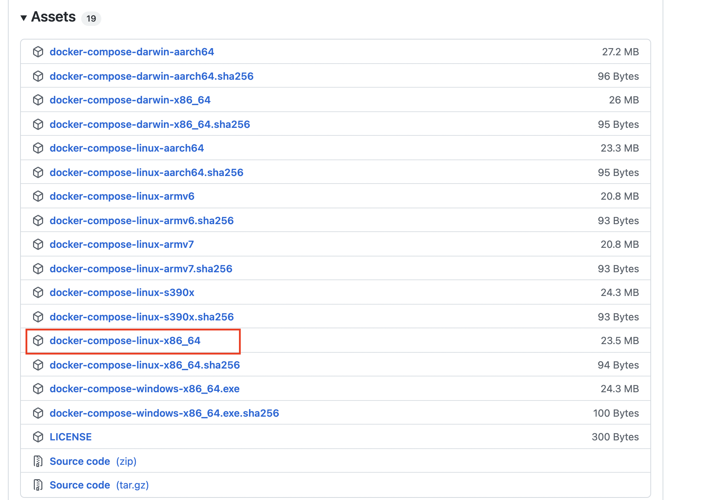
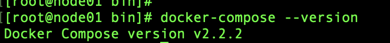

### Docker安装（Linux）

docker官网，自己选定自己的Linux版本，按照官方文档配置即可，以下CentOS7的

https://docs.docker.com/engine/install/centos/

#### 1、卸载原有的环境：

> 前提：有gcc 和 gcc-c++

```shell
sudo yum remove docker \
                  docker-client \
                  docker-client-latest \
                  docker-common \
                  docker-latest \
                  docker-latest-logrotate \
                  docker-logrotate \
                  docker-selinux \
                  docker-engine-selinux \
                  docker-engine
```


#### 2、安装对应的依赖环境和镜像地址

````shell
yum update -y
sudo yum install -y yum-utils 
````

安装依赖 

````shell
sudo yum-config-manager \ --add-repo http://mirrors.aliyun.com/docker-ce/linux/centos/docker-ce.repo
````

配置yum源之后更新软件包的索引

````shell
yum makecache fast

````


#### 3、直接安装docker CE

````shell
sudo yum install -y docker-ce docker-ce-cli containerd.io
````

报错时，大概率为**镜像仓库问题** ，直接执行 **步骤五** 的补充，再安装

#### 4、启动docker服务

````shell
sudo systemctl start docker 
````

#### 5、查看docker的版本

````shell
sudo docker version 
````

**补充：通过官方的镜像地址下载docker会比较慢， **

* 配置阿里云的镜像地址： **经历过3的镜像库问题也就是配置阿里云镜像地址**

````shell
yum-config-manager --add-repo http://mirrors.aliyun.com/docker-ce/linux/centos/docker-ce.repo
````

* yum更新下即可：

````shell
yum makecache fast 
````

#### 6、开机启动docker

````shell
sudo systemctl enable docker
````

#### 7、docker加速

* 补充：docker pull 下载镜像太慢，更换源进行网络加速的解决方案

```shell
步骤1：
sudo mkdir -p /etc/docker

步骤2：
sudo tee /etc/docker/daemon.json <<-'EOF'
{
  "registry-mirrors": ["https://glhlrb75.mirror.aliyuncs.com"]
}
EOF
或者（老师的）
sudo tee /etc/docker/daemon.json <<-'EOF'
{ 
	"registry-mirrors": ["https://v9j5rufo.mirror.aliyuncs.com"] 
}
EOF

步骤3：
sudo systemctl daemon-reload

步骤4：
sudo systemctl restart docker
```

#### 7、使用


[**阿里云安装docker：**](https://blog.csdn.net/qq_25760623/article/details/88657491)

 https://blog.csdn.net/qq_25760623/article/details/88657491 


### Docker-Compose安装（Linux）

#### 方式一

官网地址：https://docs.docker.com/compose 

#**推荐**： 国内地址：http://get.daocloud.io/#install-compose

```shell
sudo curl -L "https://github.com/docker/compose/releases/download/1.29.2/docker- compose-$(uname -s)-$(uname -m)" -o /usr/local/bin/docker-compose
```

速度比较慢的话使用下面的地址： 

```shell
curl -L https://get.daocloud.io/docker/compose/releases/download/1.25.0/docker- compose-`uname -s`-`uname -m` > /usr/local/bin/docker-compose
```

修改文件夹权限 

```shell
chmod +x /usr/local/bin/docker-compose
```

建立软连接 

```shell
ln -s /usr/local/bin/docker-compose /usr/bin/docker-compose
```

校验是否安装成功

```shell
docker-compose --version
```


#### 方式二

**手动下载 docker-compose 到本地，然后上传到 linux 服务器的 /usr/local/bin 路径下**

（1）百度网盘：链接: https://pan.baidu.com/s/1o_2XsILfwcA7mRn-f7A1wA 提取码: qiue  —— 网盘中 docker-compose 版本：2.2.2

（2）也可以去GitHub上下：https://github.com/docker/compose/releases




5. 重命名：

mv docker-compose-linux-x86_64 docker-compose

6. 授权：

 chmod +x ./docker-compose 

7. 查看版本：

docker-compose --version




#### 升级（方式三）

- 下载，命令如下👇：

```shell
sudo curl -L https://get.daocloud.io/docker/compose/releases/download/1.26.2/docker-compose-`uname -s`-`uname -m` > /usr/local/bin/docker-compose
```

#> 因Github国内访问不太稳定所以使用DaoCloud提供加速：[链接](http://get.daocloud.io/#install-compose)，你**可以通过URL中的版本号，自定义下载你所需要的版本文件。**

- 对命令进行一个授权

```shell
sudo chmod +x /usr/local/bin/docker-compose
```

- 查看compose版本命令

```shell
docker-compose --version
```

- 卸载

```shell
sudo rm /usr/local/bin/docker-compose
```


### 常见问题
#### 修改docker.daemon文件后启动失败
**前言**
在 docker 的官方文档中, 介绍了三种访问 docker Remote API 的方式, 分别是 unix 套接字文件/ tcp 监听端口和 fd 文件描述符. 由于 docker 默认会为我们开启本地 socket 套接字(/var/run/docker.sock) 所以本篇文章主要介绍如何让 docker 监听 tcp端口

**在 docker 配置文件中设置**
docker 1.12 版本之后, 建议在 docker 的 js 配置文件中配置, 路径为 /etc/docker/daemon.json 默认没有这个文件, 可以手动创建此文件, docker 启动时默认会读取此配置文件

```sh
vim /etc/docker/daemon.json
```

```json
{
    "hosts": [
        "tcp://0.0.0.0:2375",
        "unix:///var/run/docker.sock"
    ]
}
```


unix:///var/run/docker.sock注意上面?一定要写上本地的 [socket](https://so.csdn.net/so/search?q=socket&spm=1001.2101.3001.7020) 位置, 不然无法使用本地的 CLI 控制 docker

修改完js配置文件后, 重启 docker 服务

```sh
systemctl daemon-reload
systemctl restart docker
```


如果出现

> systemctl restart docker.service
> Job for docker.service failed because the control process exited with error code. See "systemctl status docker.service" and "journalctl -xe" for details.

因为 docker 的 socket 配置出现了冲突, 接下来查看 docker 的启动入口文件

```sh
vim /lib/systemd/system/docker.service        	 # Ubuntu的路径; 

vim /usr/lib/systemd/system/docker.service 		 # CentOS 的路径
```

​		在 docker 的启动入口文件中配置了 host 相关的信息, 而在 docker 的配置文件中也配置了 host 的信息, 所以发生了冲突. 解决办法, 建议将 docker 启动入口文件中的 `-H fd://` 删除, 再重启 docker 服务即可

```properties
# 原来的
ExecStart=/usr/bin/dockerd -H fd:// --containerd=/run/containerd/containerd.sock

# 修改后
ExecStart=/usr/bin/dockerd --containerd=/run/containerd/containerd.sock
```

**在 docker 启动入口中设置**

当然你也可以在启动入口配置[监听](https://so.csdn.net/so/search?q=监听&spm=1001.2101.3001.7020)的端口和本地 socket 信息

```sh
vim /lib/systemd/system/docker.service        	 # Ubuntu的路径; 

vim /usr/lib/systemd/system/docker.service 		 # CentOS 的路径
```

修改`ExecStart`

```properties
# 原来的
ExecStart=/usr/bin/dockerd -H fd:// --containerd=/run/containerd/containerd.sock

# 修改后
ExecStart=/usr/bin/dockerd -H tcp://0.0.0.0:2375 -H unix:///var/run/docker.sock
```

最下面两条配置是等价的, docker 默认的本地 socket 文件就在 `/var/run/docker.sock` 这个位置, 如果没有特殊需求, 不需要显示的进行配置

最后重启服务

```sh
systemctl daemon-reload
systemctl restart docker
```

#### docker容器中apt下载太慢

```shell
cp /etc/apt/sources.list /etc/apt/sources.list.bk

echo -e "deb http://mirrors.aliyun.com/debian/ stretch main non-free contrib \ndeb-src http://mirrors.aliyun.com/debian/ stretch main non-free contrib \ndeb http://mirrors.aliyun.com/debian-security stretch/updates main \ndeb-src http://mirrors.aliyun.com/debian-security stretch/updates main \ndeb http://mirrors.aliyun.com/debian/ stretch-updates main non-free contrib \ndeb-src http://mirrors.aliyun.com/debian/ stretch-updates main non-free contrib \ndeb http://mirrors.aliyun.com/debian/ stretch-backports main non-free contrib \ndeb-src http://mirrors.aliyun.com/debian/ stretch-backports main non-free contrib" > /etc/apt/sources.list

apt-get update

apt-get install -y vim
```


