<div align='center' ><font size='70'>工具安装</font></div>
# 目录

[TOC]

# 注解：

* ——1 .x：单机安装

* ——2 .x：Docker安装

* X ：方式 X  ,default=1 不写

* **注所有所需文件均可在gitee上找到**

  

# ———————————————

# PATH---------Linux

## Linux

### CentOS--7


**1.下载镜像文件**

  [ 清华大学开源软件镜像站](https://mirrors.tuna.tsinghua.edu.cn/)  

**2.开始安装**

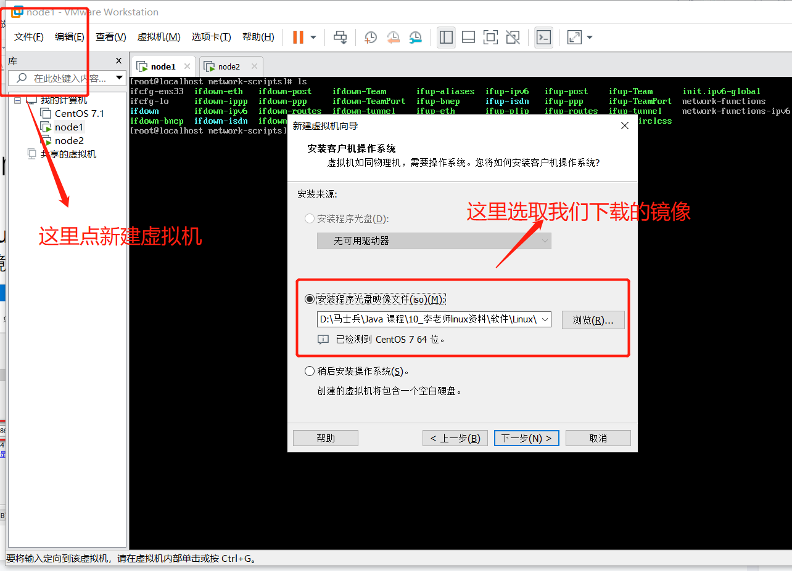


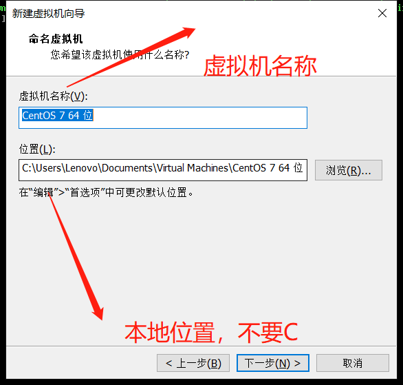


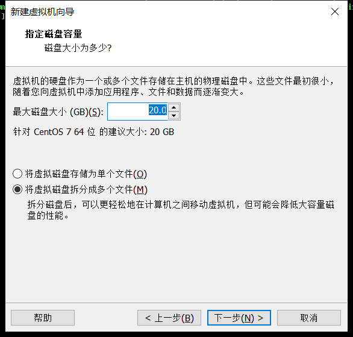


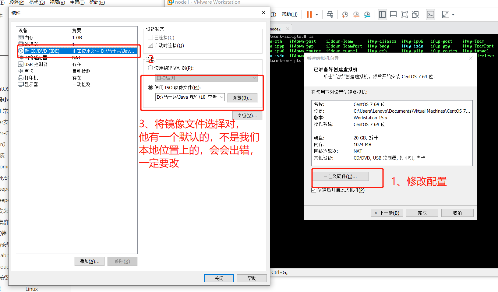


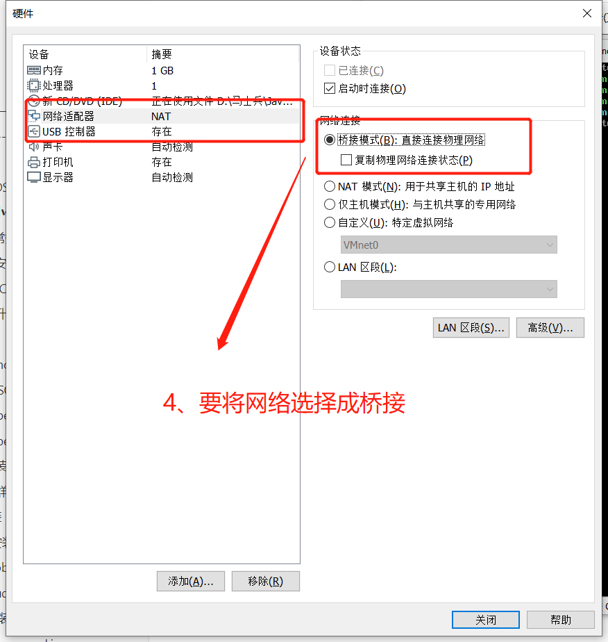


**3.开始进去虚拟机配置我们的软件**

**3.1语言**

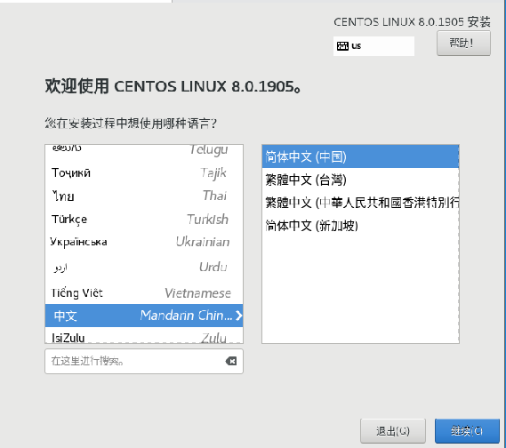


**3.2时区、软件选择**

软件选择：按照自己的需求选，第一次多选也不要少选

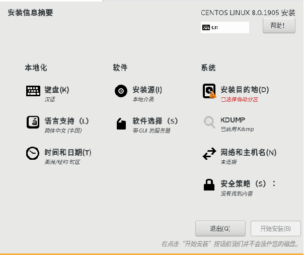


4.硬、软配置完成，开始安装，同时要创建管理员Root 和 基础用户


5.安装成功


**系统配置**

<div name="Linux_install_centos7">进入系统后~</div>
1、首先配置网络

要先切换到 root 用户上去，不然没权限。

```shell
方式一
sudo -i
password:当前普通用户密码

方式二
su -
password：root用户密码

```

 将  **ONBOOT ** 改为 yes ： 

```shell
 vim /etc/sysconfig/network-scripts/ifcfg-ens33
```


重启网络

```shell
# CentOS6
service network restart
#CentOS7
systemlctl restart network 

# 检查是否通畅
ping 114.114.114.114
```


2、 安装net-tools 和 vim（**有的话可直接跳过**）

```shell
yum install -y net-tools vim
```

检查自己的ip

```shell
ifconfig
```


3 启动sshd服务

```shell
service sshd start
```

<div name="Linux_minInstall_4"></div >
4、修改登录，让Root用户直接登录

[具体步骤](#problem-6)   		

<div name="Linux_minInstall_5"></div >
5、修改DNS连接,让xshell访问快一点

[具体步骤](#problem-5)

6、 **关闭指定端口防火墙：** 

```shell
systemctl status firewalld  

#开启80端口

firewall-cmd --zone=public --add-port=80/tcp --permanent  

#开启3306端口

firewall-cmd --zone=public --add-port=3306/tcp --permanent  

#重启防火墙：

firewall-cmd --reload

关闭防火墙 ，重启失效(Linux系统一重启Linux中的防火墙又会被开起)
service firewalld stop
禁用防火墙，永久有效
systemctl disable firewalld 或者  systemctl disable firewalld.service
启动防火墙 (对禁用的防火墙进行启动)
systemctl enable firewalld

```


## Docker安装

docker官网，自己选定自己的Linux版本，按照官方文档配置即可，以下CentOS7的

https://docs.docker.com/engine/install/centos/

#### 1、卸载原有的环境： 

```shell
sudo yum remove docker \
                  docker-client \
                  docker-client-latest \
                  docker-common \
                  docker-latest \
                  docker-latest-logrotate \
                  docker-logrotate \
                  docker-selinux \
                  docker-engine-selinux \
                  docker-engine
```


#### 2、安装对应的依赖环境和镜像地址

````shell
sudo yum install -y yum-utils 
````

官方安装(慢)

```shell
sudo yum-config-manager \ --add-repo \ https://download.docker.com/linux/centos/docker-ce.repo
```

安装过慢设置镜像 

````shell
sudo yum-config-manager \ --add-repo \ http://mirrors.aliyun.com/docker-ce/linux/centos/docker-ce.repo
````

#### 3、直接安装docker CE 

````shell
sudo yum install -y docker-ce docker-ce-cli containerd.io
````

报错时，大概率为**镜像仓库问题** ，直接执行 **步骤五** 的补充，再安装

#### 4、启动docker服务 

````shell
systemctl start docker 
````

#### 5、查看docker的版本 

````shell
docker version 
````

**补充：通过官方的镜像地址下载docker会比较慢， **

* 配置阿里云的镜像地址： **经历过3的镜像库问题也就是配置阿里云镜像地址**

````shell
yum-config-manager --add-repo http://mirrors.aliyun.com/docker-ce/linux/centos/docker-ce.repo
````

* yum更新下即可：

````shell
yum makecache fast 
````

#### 6、开机启动docker

````shell
sudo systemctl enable docker
````

* 补充：docker pull 下载镜像太慢，更换源进行网络加速的解决方案

```shell
步骤1：
sudo mkdir -p /etc/docker

步骤2：
sudo tee /etc/docker/daemon.json <<-'EOF'
{
  "registry-mirrors": ["https://glhlrb75.mirror.aliyuncs.com"]
}
EOF
或者（老师的）
sudo tee /etc/docker/daemon.json <<-'EOF'
{ 
	"registry-mirrors": ["https://v9j5rufo.mirror.aliyuncs.com"] 
}
EOF

步骤3：
sudo systemctl daemon-reload

步骤4：
sudo systemctl restart docker
```

#### 7、使用


[**阿里云安装docker：**](https://blog.csdn.net/qq_25760623/article/details/88657491)

 https://blog.csdn.net/qq_25760623/article/details/88657491 


## Docker-Compose安装

### 方式一

官网地址：https://docs.docker.com/compose 

**推荐**： 国内地址：http://get.daocloud.io/#install-compose

```shell
sudo curl -L "https://github.com/docker/compose/releases/download/1.29.2/docker- compose-$(uname -s)-$(uname -m)" -o /usr/local/bin/docker-compose
```

速度比较慢的话使用下面的地址： 

```shell
curl -L https://get.daocloud.io/docker/compose/releases/download/1.25.0/docker- compose-`uname -s`-`uname -m` > /usr/local/bin/docker-compose
```

修改文件夹权限 

```shell
chmod +x /usr/local/bin/docker-compose
```

建立软连接 

```shell
ln -s /usr/local/bin/docker-compose /usr/bin/docker-compose
```

校验是否安装成功

```shell
docker-compose --version
```


### 方式二

**手动下载 docker-compose 到本地，然后上传到 linux 服务器的 /usr/local/bin 路径下**

（1）百度网盘：链接: https://pan.baidu.com/s/1o_2XsILfwcA7mRn-f7A1wA 提取码: qiue  —— 网盘中 docker-compose 版本：2.2.2

（2）也可以去GitHub上下：https://github.com/docker/compose/releases


 

5. 重命名：

mv docker-compose-linux-x86_64 docker-compose

6. 授权：

 chmod +x ./docker-compose 

7. 查看版本：

docker-compose --version


 


### 升级（方式三）

- 下载，命令如下👇：

```shell
sudo curl -L https://get.daocloud.io/docker/compose/releases/download/1.26.2/docker-compose-`uname -s`-`uname -m` > /usr/local/bin/docker-compose
```

> 因Github国内访问不太稳定所以使用DaoCloud提供加速：[链接](http://get.daocloud.io/#install-compose)，你**可以通过URL中的版本号，自定义下载你所需要的版本文件。**

- 对命令进行一个授权

```shell
sudo chmod +x /usr/local/bin/docker-compose
```

- 查看compose版本命令

```shell
docker-compose --version
```

- 卸载

```shell
sudo rm /usr/local/bin/docker-compose
```


## Python升级

#### 一、**查看当前python版本**

```
[root@ansible ~]# python -V
Python 2.7.5
```

#### 二、**下载新的python包并安装**

​	进入python官网（https://www.python.org），选择需要的版本。此处我选择当前最新版本Python3.6.1

```
yum install gcc gcc-c++ -y

wget https://www.python.org/ftp/python/3.7.3/Python-3.7.3.tar.xz

tar xvf Python-3.7.3.tar.xz 

cd Python-3.7.3/

 ./configure
 
make

make install
```

#### 三、**验证**

```
#python -V     #一个是旧版本，一个是新版本
Python 2.7.5
# python3 -V
Python 3.7.3
```

#### 四、**设置3.X为默认版本**

​	查看 Python 的路径，在 /usr/bin 下面。可以看到 python 链接的是 python 2.7，所以，执行 python 就相当于执行 python 2.7。

```
[root@ansible ~]# ls -al /usr/bin | grep python
-rwxr-xr-x.   1 root root       11232 Dec  2  2016 abrt-action-analyze-python
lrwxrwxrwx.   1 root root           7 May 26  2017 python -> python2
lrwxrwxrwx.   1 root root           9 May 26  2017 python2 -> python2.7
-rwxr-xr-x.   1 root root        7136 Nov  6  2016 python2.7
```

将原来 python 的软链接重命名：

```
  mv /usr/bin/python /usr/bin/python.bak
```

将 python 链接至 python3：

```
  ln -s /usr/local/bin/python3 /usr/bin/python
```

#### 五、**配置yum**

​	升级 Python 之后，由于将默认的 python 指向了 python3，yum 不能正常使用，需要编辑 yum 的配置文件，此时：

```
[root@ansible-admin Python-3.7.3]# yum list
  File "/usr/bin/yum", line 30
    except KeyboardInterrupt, e:

SyntaxError: invalid syntax
```

​	修改/usr/bin/yum和/usr/libexec/urlgrabber-ext-down，将 #!/usr/bin/python 改为 #!/usr/bin/python2.7，保存退出即可。

> vim /usr/bin/yum
>
> vim /usr/libexec/urlgrabber-ext-down


<div name="jdk_install"></div>
## jdk安装

#### 1、下载对应的版本

**1.1下载Linux对应版本的JDK**

```shell
getconf  LONG_BIT
```

**1.2下载压缩文件**   

> jdk-8u261-linux-x64.tar.gz         

#### 2、解压压缩文件

```shell
tar -xvf   jdk-8u261-linux-x64.tar.gz  -C  /usr/local/  
```

#### 3、配置环境变量

```shell
vim  /etc/profile

#自己选定的目录
export JAVA_HOME=/usr/local/jdk1.8.0_261
export CLASSPATH=.:$JAVA_HOME/lib/dt.jar:$JAVA_HOME/lib/tools.jar
export PATH=$PATH:$JAVA_HOME/bin
```

#### 4、使用环境变量生效

```shell
source /etc/profile
```

[长久生效](#perblem-1)

#### 5、测试JDK是否安装成功

```shell
java -version
```


## Tomcat安装

### ——1

#### 1、下载Linux对应版本的Tomcat

​	  下载压缩文件     apache-tomcat-7.0.68.tar.gz         

#### 2、解压压缩文件

```shell
tar -xvf   apache-tomcat-7.0.68.tar.gz -C /usr/local/  #解压到的路径 
```

#### 3、配置环境变量

```shell
vim  /etc/profile

#自己定义为位置
export CATALINA_BASE=/usr/local/apache-tomcat-7.0.68
export PATH=$CATALINA_BASE/bin:$PATH

```

#### 4、使用环境变量生效

````shell
source /etc/profile
````

#### 5、启动Tomcat服务

* 注：要是远程访问你关注防火墙问题

启动Tomcat服务：

````shell
/usr/local/apache-tomcat-7.0.68/bin./startup.sh
````


启动Tomcat并输出启动日志 :

````shell
/usr/local/apache-tomcat-7.0.68/bin/startup.sh & tail -f  /usr/local/apache-tomcat-7.0.68/logs/catalina.out
````

<div name="mysql_install">

##  MySQL 安装


### ——1

#### 1、卸载原来的版本

##### 1、查看mysql的安装情况

```sh
rpm -qa | grep -i mysql
```


##### 2、删除上图安装的软件

```sh
rpm -ev --nodeps mysql57-community-release-el5-7.noarch
rpm -ev --nodeps mysql-community-server-5.7.18-1.el5.x86_64
rpm -ev --nodeps mysql-community-client-5.7.18-1.el5.x86_64
rpm -ev --nodeps mysql-community-libs-5.7.18-1.el5.x86_64
rpm -ev --nodeps mysql-community-common-5.7.18-1.el5.x86_64
rpm -ev --nodeps mysql-5.7.18-1.el5.x86_64
rpm -ev --nodeps mysql-community-libs-compat-5.7.18-1.el5.x86_64

```

##### 3、都删除成功之后，查找相关的mysql的文件

```sh
find / -name mysql
```

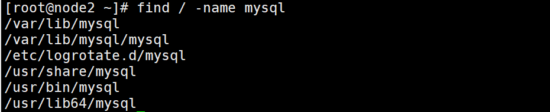


##### 4、删除全部文件

```sh
rm -rf /etc/selinux/targeted/active/modules/100/mysql
rm -rf /root/mysql
rm -rf /root/mysql/data/mysql
rm -rf /var/lib/mysql
rm -rf /var/lib/mysql/mysql
rm -rf /usr/share/mysql
```

##### 5、再次执行命令

```shell
rpm -qa | grep -i mysql
#如果没有显式则表示卸载完成
```


#### 2、删除mariadb-libs(不可省略)

```sh
# 检查mariadb-libs
rpm -qa|grep mariadb
# 卸载mariadb-libs
yum remove mariadb-libs

```


#### 3、安装MySQL

##### 1，输入：

wegt https://dev.mysql.com/get/mysql版本号-community-release-el大版本-小版本.noarch.rpm

```sh
wget https://dev.mysql.com/get/mysql57-community-release-el5-7.noarch.rpm

```

##### 2、安装数据源

```sh
yum install -y mysql57-community-release-el5-7.noarch.rpm

```

##### 3、查看mysql源是否安装成功

```sh
yum repolist enabled | grep "mysql.*-community.*"

```

##### 4、安装数据库

```sh
yum install -y  mysql-community-server

# 如果过期可以在运行安装程序之前导入密钥，有了就不用了
rpm --import https://repo.mysql.com/RPM-GPG-KEY-mysql-2022
```

##### 5、启动mysql

```sh
# centos7
systemctl restart mysqld
systemctl status mysqld


# centos6
service mysqld start
service mysqld status
```

##### 6、显示mysql的随机密码

```sh
grep 'temporary password' /var/log/mysqld.log

```


##### 7、登录并修改mysql密码

登录：mysql -u root -p   		然后输入上面生成的密码

**_修改自定义密码，设置新的密码，进入操作页面，修改密码策略可以修改成你想要的_**

```sql
-- ALTER USER 'root'@'localhost' IDENTIFIED BY '密码';

ALTER USER 'root'@'localhost' IDENTIFIED BY 'Root_21root';

ALTER USER 'root'@'localhost' IDENTIFIED BY 'root';
```

**_失败了的话就修改策略，将策略降低一下就可以了_**

查看密码策略：

```sql
SHOW VARIABLES LIKE '%password%';
```

修改密码策略

```sql
-- 修改密码长度：（长度）
set global validate_password_length=1;
-- 修改密码等级：（等级）
set global validate_password_policy=0;
```


#### 4、其他配置

##### 1.远程连接

###### 方法一、创建一个用户 支持远程连接

①登录 ：mysql -u root -p

②创建用户： create user 'aaa'@'%' identified by '123456';

③授权所有权限给user这个新用户 ：grant all on *.* to 'aaa'@'%';

④退出mysql：quit;

###### 方法二、设置root用户支持远程连接

①登录：mysql -u root -p （ 注：系统提示输入数据库root用户的密码，输入完成后即进入mysql控制台，这个命令的第一个mysql是执行命令，第二个mysql是系统数据名称，不一样的。）

②设置权限：

赋予权限格式： grant 权限 on 数据库对象 to 用户@IP(或者相应正则)

```sql
-- 新建用户规则或者直接修改root用户的规则 ，2 选一
use mysql;

-- 这里表示赋予该用户所有数据库所有表（*.*表示所有表），%表示所有IP地址。
GRANT ALL PRIVILEGES ON *.* TO 'root'@'%' IDENTIFIED BY '123456' WITH GRANT OPTION;
-- 使root能再任何host访问
update user set host = '%' where user = 'root';      

-- 刷新
FLUSH PRIVILEGES;
```

③查看：

```sql
use mysql;
SELECT HOST,USER FROM USER;
```

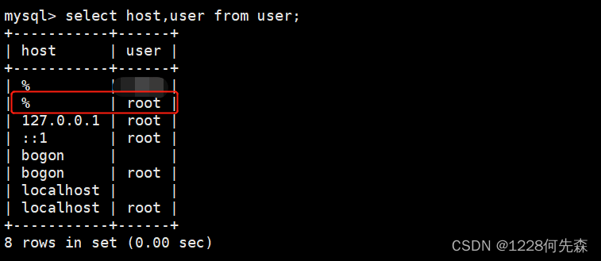


 ④退出mysql：quit;


##### 2.开机自启

```sh
# 开机启动
systemctl enable mysql
# 关闭自动启动
systemctl disable mysqld
```


###  ——2

#### 1、查询镜像

```shell
docker search mysql
```

#### 2、拉取镜像

```shell
docker pull mysql:5.7
```

#### 3、构建容器

先自己创建配置文件基础模板（**要是后期要修改配置文件必须加入 模板中的两个元素，不然容器启动会出错**）

```shell
mkdir -p /root/mysql/conf
vim  /root/mysql/conf/my.cnf
```

**模板内容：**

```shell

# Copyright (c) 2016, 2021, Oracle and/or its affiliates.
#
# This program is free software; you can redistribute it and/or modify
# it under the terms of the GNU General Public License, version 2.0,
# as published by the Free Software Foundation.
#
# This program is also distributed with certain software (including
# but not limited to OpenSSL) that is licensed under separate terms,
# as designated in a particular file or component or in included license
# documentation.  The authors of MySQL hereby grant you an additional
# permission to link the program and your derivative works with the
# separately licensed software that they have included with MySQL.
#
# This program is distributed in the hope that it will be useful,
# but WITHOUT ANY WARRANTY; without even the implied warranty of
# MERCHANTABILITY or FITNESS FOR A PARTICULAR PURPOSE.  See the
# GNU General Public License, version 2.0, for more details.
#
# You should have received a copy of the GNU General Public License
# along with this program; if not, write to the Free Software
# Foundation, Inc., 51 Franklin St, Fifth Floor, Boston, MA  02110-1301 USA


!includedir /etc/mysql/conf.d/
!includedir /etc/mysql/mysql.conf.d/

[mysql]
default-character-set=utf8
[mysqld]
character_set_server=utf8
init_connect='SET NAMES utf8'
lower_case_table_names = 1

```

**构建容器**

```shell
docker run \
-p 3306:3306 \
-v /root/mysql/data:/var/lib/mysql \
-v /root/mysql/logs:/logs \
-v /root/mysql/conf/my.cnf:/etc/mysql/my.cnf \
-e MYSQL_ROOT_PASSWORD=root \
--name mysql \
--hostname node1 \
--restart=always \
-d mysql:5.7
```

**注**：出错时将本地映射文件检查一下，要是不需要配置，只需映射直接删掉就可，以后再改配置文件

#### 4、进入容器

```shell
docker exec -it mysql /bin/bash
或者
docker exec -it mysql mysql -uroot -p
```

#### 5、查看远程连接

还有一些方法也可以试一下

```shell
1.赋予权限格式：grant 权限 on 数据库对象 to 用户@IP(或者相应正则)

　　　　注：可以赋予select,delete,update,insert,index等权限精确到某一个数据库某一个表。

　　　　GRANT ALL PRIVILEGES ON *.* TO '用户名'@'%' IDENTIFIED BY '密码' WITH GRANT OPTION;
	  GRANT ALL PRIVILEGES ON *.* TO 'root'@'%' IDENTIFIED BY '123456' WITH GRANT OPTION;

　　　　这里表示赋予该用户所有数据库所有表（*.*表示所有表），%表示所有IP地址。

2.刷新权限：FLUSH PRIVILEGES;

3.查看权限：select user,host from mysql.user;

二.意外
　　1.配置文件种指定了blind-address：
　　　　查看Mysql配置文件种（一般是/etc/my.cnf种）是否指定了blind-address，这表示只能是某个或某几个ip能连接。如果有就将它注释了，前面加#号注释。然后从启mysql。
    　重启mysql：service mysqld restart,如果安装的是Mariadb（我的就是）,则需要使用systemctl restart mariadb.service
    　
    2.防火墙的原因：
　　　　可能会报：ERROR 2003 (HY000): Can't connect to MySQL server on '你要连接的IP' (111)。

　　　　原因：1.可能是Mysql端口不对（默认是3306），只需加参数 -P 你的端口指定就行；
　　　　
　　　2.还有可能是有防火墙阻止，可以通过telnet来测试（可以直接关闭防火墙）。
　　　　　　　　　　防火墙相关命令：

　　　　　　　　　　　　（1）查看防火墙状态：service  iptables status或者systemctl status firewalld或者firewall-cmd --state

　　　　　　　　　　　　（2）暂时关闭防火墙：systemctl stop firewalld或者service  iptables stop或者systemctl stop firewalld.service

　　　　　　　　　　　　（3）永久关闭防火墙：systemctl disable firewalld或者chkconfig iptables off或者systemctl disable firewalld.service

　　　　　　　　　　　　（4）重启防火墙：systemctl enable firewalld或者service iptables restart  或者systemctl restart firewalld.service

 　　　　　　　　　　　　 (5)永久关闭后重启：chkconfig iptables on

　　

　　3.端口未开启：（我遇到的就是这个原因）
　　　　　　Mysql：ERROR 2003 (HY000) 110（连接超时）

　　　　　　查看你的服务器是否把对应端口打开，未打开启动就行了。　
　　　　　　
   4.Navicat连接MySQL，出现2059 - authentication plugin 'caching_sha2_password'的解决方案
  	
  	0先进入容器，
  	docker exec -it mysql mysql -uroot -p
  	
  	1#修改加密规则password是自己的密码，root也是登陆账户，下同。
  	use mysql;
    ALTER USER 'root'@'localhost' IDENTIFIED BY 'root' PASSWORD EXPIRE NEVER; 
    
	2 #更新一下用户的密码 
	ALTER USER 'root'@'localhost' IDENTIFIED WITH mysql_native_password BY 'root';
	
	3#刷新权限 
	FLUSH PRIVILEGES; 
	
	4#更新一下用户的密码
	ALTER USER 'root'@'%' IDENTIFIED WITH mysql_native_password BY 'root'; 

```

### ——2.1

前提安装了 docker-compose，配置  docker-comose.yml 文件

5.7：

```yml
version: "3.0"
services:
  mysql8:
    image: mysql:5.7.32
    container_name: my_db57
    restart: always
    volumes:
      - ./db:/var/lib/mysql
      - ./conf/my.cnf:/etc/my.cnf
      # 数据库初始化脚本，当Mysql容器首次启动时，会在 /docker-entrypoint-initdb.d目录下扫描 .sh，.sql，.sql.gz类型的文件。如果这些类型的文件存在，将执行它们来初始化一个数据库；
      - ./init/:/docker-entrypoint-initdb.d/
    environment:
      - MYSQL_ROOT_PASSWORD=123456
      # 指定初始化sql文件的数据库，简单来书就是新建一个数据库
      - MYSQL_DATABASE=my_db
      - TZ=Asia/Shanghai
    ports:
      - 3311:3306
```

8.0

```yml
version: "3.0"
services:
  mysql8:
    image: mysql:8.0.25
    container_name: my_db8
    restart: always
    volumes:
      - ./db:/var/lib/mysql
      - ./conf/my.cnf:/etc/my.cnf
      # 数据库初始化脚本，当Mysql容器首次启动时，会在 /docker-entrypoint-initdb.d目录下扫描 .sh，.sql，.sql.gz类型的文件。如果这些类型的文件存在，将执行它们来初始化一个数据库；
      - ./init/:/docker-entrypoint-initdb.d/
    environment:
      - MYSQL_ROOT_PASSWORD=123456
      # 指定初始化sql文件的数据库，简单来书就是新建一个数据库
      - MYSQL_DATABASE=my_db
      - TZ=Asia/Shanghai
    ports:
      - 3301:3306
```

配置文件 my.cnf 

5.7：

```shell
[mysql]
# 设置mysql客户端默认字符集
default-character-set=utf8mb4

[mysqld]
datadir=/var/lib/mysql
socket=/var/lib/mysql/mysql.sock

symbolic-links=0

log-error=/var/log/mysqld.log
pid-file=/var/run/mysqld/mysqld.pid
# 服务端使用的字符集默认为8比特编码的latin1字符集
character-set-server=utf8mb4

# 创建新表时将使用的默认存储引擎
default-storage-engine=INNODB
```

8.0：

```shell
[mysql]
# 设置mysql客户端默认字符集
default-character-set=utf8mb4
[mysqld]
# 允许最大连接数
max_connections=200

# 服务端使用的字符集默认为8比特编码的latin1字符集
character-set-server=utf8mb4

# 创建新表时将使用的默认存储引擎
default-storage-engine=INNODB
```

### 问题

1、Can't create/write to file '/var/run/mysqld/mysqld.pid

去配置文件中找到 errorlog的地址，查看错误日志

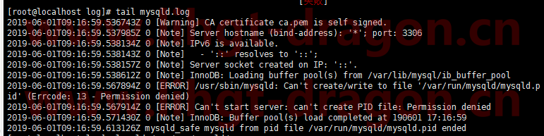


错误原因为：/var/run/mysqld/目录的拥有者为root，mysql不能在其中创建文件

使用如下命令修改目录使用者

```shell
# 先查看目录是否存在
ls -ld /var/run/mysqld/
# 权限
chown mysql.mysql /var/run/mysqld/
# 修改后重启mysql服务
/etc/init.d/mysqld start
```


## FastDFS安装

### ——1

#### 1.安装FastDFS依赖

FastDFS是C语言开发的应用。安装必须使用 make , cmake 和 gcc编译器。

```sh
  yum install -y make cmake gcc gcc-c++
```

#### 2 上传并解压libfastcommon-master

​	上传libfastcommon-master 到 /usr/local/tmp下。 libfastcommon是从FastDFS和FastDHT中提取出来的公共C函数库

​	解压 libfastcommon-master.zip 由于是zip文件所以要使用 unzip命令

```sh
  cd /usr/local/tmp
  unzip libfastcommon-master.zip
```

#### 3 编译并安装

​	libfastcommon没有提供make命令安装文件。使用的是shell脚本执行编译和安装。shell脚本为 make.sh

​	进入解压后的文件

```sh
 cd libfastcommon-master
```

​	编译

```sh
 ./make.sh
```

​	安装	

```sh
 ./make.sh install
```

​	有固定的默认安装位置。在/usr/lib64 和  /usr/include/fastcommon两个目录中

#### 4 创建软连接

​	 因为FastDFS 主程序设置的lib目录是 /usr/local/lib， 所以需要创建软连接

```sh
 ln -s /user/lib64/libfastcommon.so /usr/local/lib/libfastcommon.so
 ln -s /usr/local/lib64/libfdfsclient.so /usr/local/lib/libfdfsclient.so
```

#### 5 上传并解压FastDFS主程序

​	 上传 FastDFS_v5.08.tar.gz 到 /usr/local/tmp下后解压

```sh
 cd /usr/local/tmp
 tar zxf FastDFS_v5.08.tar.gz
```

#### 6 编译并安装FastDFS

​	进入到解压后的FastDFS文件中

```sh
 cd FastDFS
```

​	编译

```sh
 ./make.sh
```

​	安装

```sh
 ./make.sh install
```

​	安装后 FastDFS主程序所在的位置是

​	/usr/bin  可执行文件所在的位置

​	/etc/fdfs  配置文件所在的位置

​	/usr/bin  主程序代码所在位置

​	/usr/include/fastdfs 包含一些插件组所在的位置

#### 7 配置tracker

##### 7.1 复制配置文件

​	进入到 /etc/fdfs 中 ， 把tracker配置文件复制一份

```sh
  cd /etc/fdfs
  cp tracker.conf.sample tracker.conf
```

##### 7.2 创建数据目录

​	创建放置 tracker数据的目录

```sh
  mkdir -p /usr/local/fastdfs/tracker
```

#####  7.3 修改配置文件

​	修改 tracker.conf 设置 tracker 内容存储目录

```sh
base_path=/usr/local/fastdfs/tracker
 vim tracker.conf
```

 默认端口 22122   不需要修改

##### 7.4 启动服务

```sh
  service fdfs_trackerd start
```

​	启动成功后， 配置文件中 base_path 指向的目录出现 FastDFS服务相关数据目录(data目录， logs 目录)

##### 7.5 查看服务运行状态

```
  service fdfs_trackerd status
```

​	如果显示 is running 表示正常运行。

##### 7.6 关闭防火墙

```sh
 service iptables stop
  chkconfig iptables off
```

####  8 配置storage

  storage可以和tracker不在同一台服务器上。示例中把storage和tracker安装在同一台服务器上了。

#####     8.1 复制配置文件

​	进入到 /etc/fdfs, 把 storage 配置文件复制一份

```
 cd /etc/fdfs
 cp storage.conf.sample storage.conf
```

#####   8.2 创建目录

​	 创建两个目录， 把base用于存储基础数据和日志，store用于存储上传数据。

```sh
  mkdir -p /usr/local/fastdfs/storage/base
 mkdir -p /usr/local/fastdfs/storage/store
```

##### 8.3 修改配置文件

​	storage.conf配置文件用于描述存储服务的行为，需要进行下述修改

```sh
 vim /etc/fdfs/storage.conf
```

​	配置内容如下：

```sh
base_path=/usr/local/fastdfs/storage/base
store_path0=/usr/local/fastdfs/storage/store
tracker_server=tracker 服务IP：22122
```

​	base_path - 基础路径。用于保存storage server 基础数据内容和日志内容的目录。

​	store_path0 - 存储路径。是用于保存FastDFS中存储文件的目录，就是要创建256*256个子目录的位置。

​	base_path 和 store_path0 可以使用同一个目录。

​	tracker_server - 跟踪服务器位置。就是跟踪服务器的IP和端口。

​	启动服务

```sh
 service fdfs_storaged start
```

​	启动成功后，配置文件中base_path 指向的目录中出现FastDFS服务相关数据目录（data目录、logs目录）配置文件中的store_path0指向的目录中同样出现FastDFS存储相关数据录（data目录）。其中$store_path0/data/目录中默认创建若干子孙目录（两级目录层级总计256*256个目录），是用于存储具体文件数据的。

​	Storage 服务器启动比较慢，因为第一次启动的时候，需要创建256*256个目录。

​	查看启动状态

```sh
 service fdfs_storaged status
```


### ——2


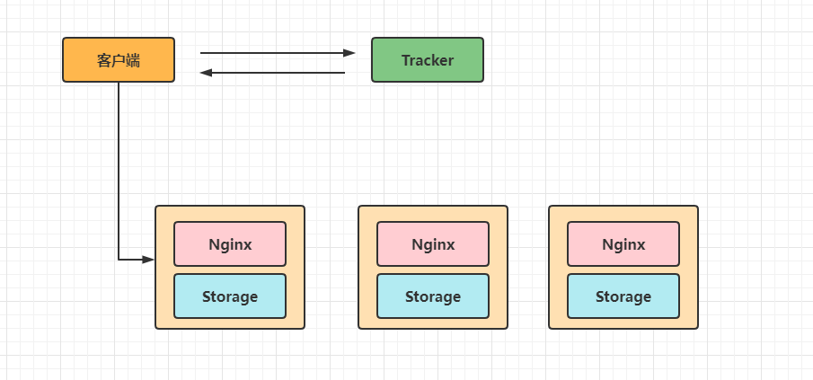


&emsp;&emsp;FastDFS的安装我们还是通过Docker来安装实现吧，直接在Linux上还装还是比较繁琐的，但就学习而言Docker安装还是非常高效的。Docker环境请自行安装哦，不清楚的可以看看我的Docker专题的内容。[https://blog.csdn.net/qq_38526573/category_9619681.html](Docker学习资料 "Docker学习资料")

#### 1.拉取镜像文件

&emsp;&emsp;首先我们可以通过 `docker search fastdfs` 来查询下有哪些镜像文件。

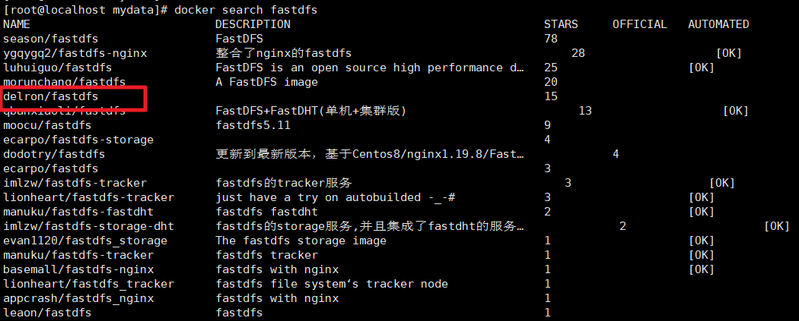


&emsp;&emsp;我们看到搜索到的镜像还是蛮多的，这里我们使用 `delron/fastdfs` 你也可以尝试使用其他的镜像来安装，你也可以制作自己的镜像来给别人使用哦，只是不同的镜像在使用的时候配置会有一些不一样，有些镜像没有提供Nginx的相关配置，使用的时候会繁琐一点。接下来通过 `docker pull delron/fastdfs`命令把镜像拉取下来。

```shell
docker pull delron/fastdfs
```


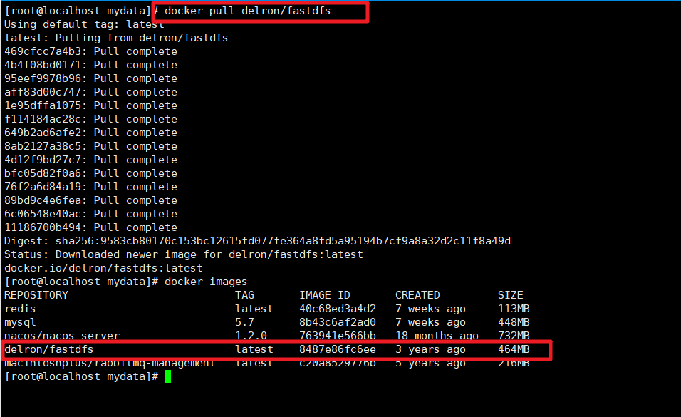


#### 2.构建Tracker服务

&emsp;&emsp;首先我们需要通过Docker命令来创建Tracker服务。命令为

```shell
docker run -d --name tracker --network=host -v /mydata/fastdfs/tracker:/var/fdfs delron/fastdfs tracker
```

&emsp;&emsp;tracker服务默认的端口为22122，-v 实现了容器和本地目录的挂载操作。

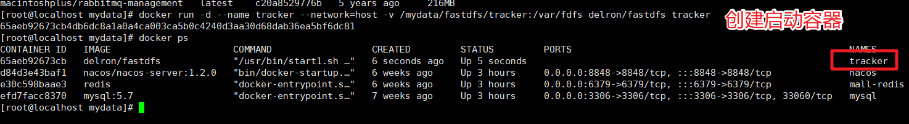


#### 3.构建Storage服务

&emsp;&emsp;接下来创建Storage服务，具体的执行命令如下

```shell
docker run -d --name storage --network=host  -e TRACKER_SERVER=192.168.1.195:22122 -v /mydata/fastdfs/storage:/var/fdfs -e GROUP_NAME=group1 delron/fastdfs storage
```

&emsp;&emsp;在执行上面命令的时候要注意对应的修改下，其中TRACKER_SERVER中的ip要修改为你的Tracker服务所在的服务IP地址。


&emsp;&emsp;默认情况下在Storage服务中是帮我们安装了Nginx服务的，相关的端口为

| 服务    | 默认端口 |
| ------- | -------- |
| tracker | 22122    |
| storage | 23000    |
| Nginx   | 8888     |

&emsp;&emsp;当然如果你发现这些相关的端口被占用了，或者想要对应的修改端口信息也可以的。要修改你可以先进入容器中查看下相关的配置文件信息。


&emsp;&emsp;然后查看storage.conf文件

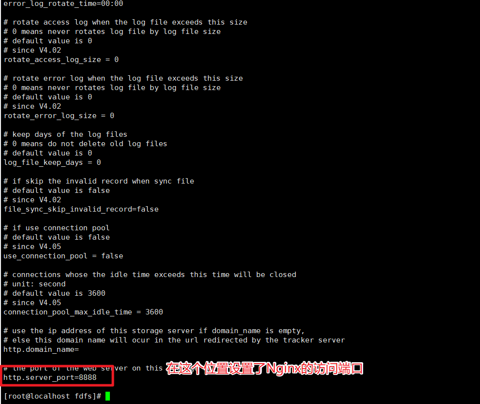


&emsp;&emsp;这个是storage监听的Nginx的端口8888，如果要修改那么我们还需要修改Nginx中的服务配置，这块的配置在 `/usr/local/nginx/conf`目录下


&emsp;&emsp;查看下文件

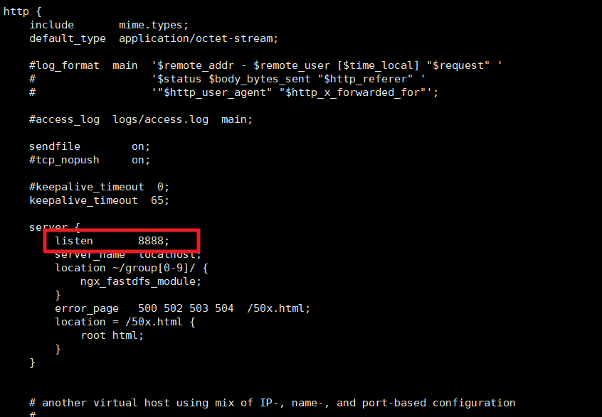


所以要修改端口号的话，这两个位置都得修改了。当然本文我们就使用默认的端口号来使用了。

#### 4.测试图片上传

&emsp;&emsp;好了，安装我们已经完成了，那么到底是否可以使用呢？我们来测试下。首先在虚拟机的/mydata/fastdfs/storage下保存一张图片。


&emsp;&emsp;然后我们再进入到storage容器中。并且进入到 `/var/fdfs`目录下,可以看到我们挂载的文件了


&emsp;&emsp;然后执行如下命令即可完成图片的上传操作

```shell
/usr/bin/fdfs_upload_file /etc/fdfs/client.conf 1.jpg
```


&emsp;&emsp;通过上面的提示我们看到文件上传成功了，而且返回了文件在storage中存储的信息。这时我们就可以通过这个信息来拼接访问的地址在浏览器中访问了：http://192.168.56.100:8888/group1/M00/00/00/wKg4ZGHcKLSAXibaAAezMuUrlS8235.jpg


&emsp;&emsp;好了到这儿FastDFS的服务安装成功了。


<div name="nginx_install_1" ></div>
## nginx安装


<div name="nginx_install_2">

### ——2

#### 1、拉取镜像

```shell
docker pull nginx:1.16.1
```

#### 2、创建挂载数据卷

```shell
mkdir -p /root/nginx/conf
vim /root/nginx/conf/nginx.conf
```

`nginx.conf内容：`

```shell
user  root;
worker_processes  auto;
 
error_log  /var/log/nginx/error.log warn;
pid        /var/run/nginx.pid;
 
 
events {
    worker_connections  1024;
}
 
 
http {
    include       /etc/nginx/mime.types;
    default_type  application/octet-stream;
 
    log_format  main  '$remote_addr - $remote_user [$time_local] "$request" '
                      '$status $body_bytes_sent "$http_referer" '
                      '"$http_user_agent" "$http_x_forwarded_for"';
 
    access_log  /var/log/nginx/access.log  main;
 
    sendfile        on;
    #tcp_nopush     on;
 
    keepalive_timeout  65;
 
    #gzip  on;
    
    
    server {
    	listen       80;
    	server_name  localhost;

    	#charset koi8-r;
    	#access_log  /var/log/nginx/host.access.log  main;

    	location / {
        	root   /usr/share/nginx/html;
        	index  index.html index.htm;
    	}

    	#error_page  404              /404.html;

    	# redirect server error pages to the static page /50x.html

    	error_page   500 502 503 504  /50x.html;
    	location = /50x.html {
        	root   /usr/share/nginx/html;
    	}
   
    }
}


```


#### 3、创建容器

```shell
# 注意ip一定要与检测ip相同
docker run \
-p 80:80 \
--name nginx  \
-v /root/nginx/conf/nginx.conf:/etc/nginx/nginx.conf \
-d nginx:1.16.1 

```


#### 4、查看

````shell
docker ps 
````


## Zookeeper安装

### ——1

#### 1     Zookeeper简介

​	zookeeper分布式管理软件。常用它做注册中心（依赖zookeeper的发布/订阅功能）、配置文件中心、分布式锁配置、集群管理等。

​	zookeeper一共就有两个版本。主要使用的是java语言写的。

#### 2     安装

##### 2.1   上传压缩文件

​	上传到 /usr/local/tmp中

#### 2.2   解压

```
 tar zxf apache-zookeeper-3.5.5-bin.tar.gz
 cp -r apache-zookeeper-3.5.5-bin ../zookeeper
```

#### 2.3   新建data目录

进入到zookeeper中

```
 cd /usr/local/zookeeper
 mkdir data
```

#### 2.4   修改配置文件

进入conf中

```
 cd conf
 cp zoo_sample.cfg zoo.cfg
 vim zoo.cfg
```

修改dataDir为data文件夹路径

```
dataDir=/usr/local/zookeeper/data
```


#### 2.5   启动zookeeper

进入bin文件夹

```
 cd /usr/local/zookeeper/bin
 ./zkServer.sh start
```

通过status查看启动状态。稍微有个等待时间

```shell
  ./zkServer.sh status
```


### ——2

**资料：**

https://www.cnblogs.com/kingkoo/p/8732448.html

https://www.bilibili.com/video/av80874666?from=search&seid=1629145025211999104&spm_id_from=333.337.0.0

#### 1     Zookeeper简介

​	zookeeper分布式管理软件。常用它做注册中心（依赖zookeeper的发布/订阅功能）、配置文件中心、分布式锁配置、集群管理等。

​	zookeeper一共就有两个版本。主要使用的是java语言写的。

#### 2     安装

##### 2.1   拉取镜像

 * 自定义zookeeper目录

   ```shell
   mkdir /root/zookeeper
   
   mkdir /root/zookeeper/data #原因参照上面 -在docker中data其实也不用在宿主机行自己生成(目前如此)
   
   #仓库官网查看版本或者用命令直接查
   docker search zookeeper
   
   #拉取特定版本（3.5）
   docker pull zookeeper:3.5
   
   ```

##### 2.2 创建并启动容器

​	**注：就目前而且 好像直接在docker中使用 zookeeper 不需要过多的配置，直接用命令创建吧，下面的解释先不看，具体原因后面补充**

命令：

```shell
docker run -d --name zookeeper -v /root/zookeeper/data:/data -p 2181:2181 --restart always zookeeper:3.5
```

- `--restart always`：始终重启
- https://www.cnblogs.com/ageovb/p/15328796.html

**解释**

* 1、这里为啥只挂载了 data 目录--》因为当我们 没有直接的安装压缩包时，我们的就没有配置文件，所以我们直接生成，容器中就回自动生成conf文件，其中就有我们需要的 一系列配置文件，我们第一次创建的时候就可以如此，我们在进**行配置文件的修改完成**后，要将所有配置文件放到我们  bash 目录中的 conf 文件中去。

* 2、第一次进入容器

  * 在bash目录下进入bin 目录然后输入开启客户端命令

    ```shell
    ./zkCli.sh
    ```

* 3、第二次进入容器

  ```shell
  docker exec -it zookeeper /bin/bash  -p    端口号
  或
  docker exec -it zookeeper zkCli.sh
  ```

**只看到这就可*，容器创建成功就可以直接用了，还没有出现问题。有待补充**

##### 2.3   修改配置文件

* 配置文件来源
  * 1、可以去我们的资料中直接解压出**conf**目录粘贴到我们的 zookeeper 目录中去
  * 2、可以直接进行第 3 步，完事之后直接会在容器中生成。找到conf文件，修改其中的 zoo.cfg文件，

进入容器后，找到conf中的 **zoo.cfg文件，接下来就是修改 **dataDir** 路径为容器中的 data文件目录。

前提是要下载 vim ，因为容器中没有，命令是：

```
apt-get update

apt-get install -y vim

cd conf
# 没有zoo.cfg 就先拷贝 zoo_sample.cfg 两个其实是一个文件，内容相同
#cp zoo_sample.cfg zoo.cfg
vim zoo.cfg
```

修改dataDir为data文件夹路径

```
dataDir=/usr/local/zookeeper/data
```


## Zookeeper集群搭建

### ——1

1.上传压缩包到/usr/local/tmp 下 并解压。

2.在 /usr/local下新建文件夹 zookeeper

```
# mkdir /usr/local/zookeeper
```

3.把解压的所有文件复制到zookeeper下， 并命名为zk1

```
# cp -r /usr/local/temp/zookeeper-3.4.8 /usr/local/zookeeper/zk1
```

4.在zk1下新建文件夹 data

5.在data下新建文件 myid, 里面写上 1

```
# vim myid
```

6.进入到zk1/conf 下 把 zoo_sample.cfg 复制一份叫做 zoo.cfg

7.编辑 zoo.cfg 内容，设置 dataDIR为 data文件夹， 并在文件最下面添加下面内容

```
server.1=192.168.93.10:2688:3888
server.2=192.168.93.10:2689:3889
server.3=192.168.93.10:2690:3890
```

 7.1 server.1中的1是myid的内容

 7.2 2688 2689 2690 是 zookeeper内部端口

 7.3 3888 3889 3890 是 leader端口

8.把zk1复制两份，分部叫做 zk2  zk3  并修改 myid 的值为 2，3 修改zoo.cfg中 dataDIR和clientPort

9.启动三个zookeeper

```
# ./zkServer.sh start
```

10.查看状态

```
# ./zkServer.sh status
```


### ——2

#### **1、准备**docker-compose.yml**文件**

```shell
version: '2'
services:
  zoo1:
    image: zookeeper:3.5
    restart: always
    container_name: zoo1
    ports:
      - "2182:2181"
    environment:
      ZOO_MY_ID: 1
      ZOO_SERVERS: server.1=0.0.0.0:2688:3888 server.2=zoo2:2689:3888 server.3=zoo3:2690:3888

  zoo2:
    image: zookeeper:3.5
    restart: always
    container_name: zoo2
    ports:
      - "2183:2181"
    environment:
      ZOO_MY_ID: 2
      ZOO_SERVERS: server.1=zoo1:2688:3888 server.2=0.0.0.0:2689:3888 server.3=zoo3:2690:3888

  zoo3:
    image: zookeeper:3.5
    restart: always
    container_name: zoo3
    ports:
      - "2184:2181"
    environment:
      ZOO_MY_ID: 3
      ZOO_SERVERS: server.1=zoo1:2688:3888 server.2=zoo2:2689:3888 server.3=0.0.0.0:2690:3888


```

#### **2、创建镜像**

* 要在创建的docker-compose.yml文件中使用命令

```shell
docker-compose up -d
```

#### **3、进入容器**

```shell
docker exec -it zoo1 /bin/bash

#查看zoo1 的状态
cd bin
./zkServer.sh status
```

* 如果出现，以下情况：

```
ZooKeeper JMX enabled by default
Using config: /conf/zoo.cfg
Client port not found in static config file. Looking in dynamic config file.
grep: : No such file or directory
Client port not found in the server configs
Client port not found. Looking for secureClientPort in the static config.
Unable to find either secure or unsecure client port in any configs. Terminating.
```

​	通过阅读我们知道他在conf中的zoo.cfg文件中缺少 **clientPort **我们只需要自行添加即可

```shell
#修改之前我们先装一下 vim
apt-get update

apt-get install -y vim 

#修改zoo.fcg文件
vim /conf/zoo.fcg

clientPort=2181
```

* 完事之后**重启**zoo1

  

  成功！！

  

#### 4、查看所有zookeeper的状态

```shell
docker exec -it zoo3 bash ./bin/zkServer.sh status
```

#### 5、进去客户端

```shell
docker exec -it zoo3 zkCli.sh
```


## redis安装

### ——1

#### 1.安装依赖C语言依赖

​	redis使用C语言编写，所以需要安装C语言库

```
 yum install -y gcc-c++ automake autoconf libtool make tcl 
```

​	

#### 2.上传并解压

​	把redis-5.0.5.tar.gz上传到/usr/local/tmp中，解压文件

```
 cd /usr/local/tmp

 tar zxf redis-5.0.5.tar.gz
```

 

#### 3.编译并安装

​	进入解压文件夹

```
  cd /usr/local/tmp/redis-5.0.5/
```

​	编译

```
 make
```

​	安装	（一定要干）

```
 make install PREFIX=/usr/local/redis
```

 

#### 4.开启守护进程

​	复制cd /usr/local/tmp/redis-5.0.5/中redis.conf配置文件	

```
 cp redis.conf /usr/local/redis/bin/
```

 **修改配置文件**	

```
 cd /usr/local/redis/bin/

 vim redis.conf
```

​	把daemonize的值由no修改为yes


#### 5.修改外部访问

​	在redis5中需要修改配置文件redis.conf允许外部访问。需要修改两处。

​	注释掉下面

​	bind 127.0.0.1

```
 bind 127.0.0.1
```

​	protected-mode yes 改成 no


#### 6.启动并测试

​	启动redis

 ```shell
./redis-server redis.conf
 ```

​	重启redis

```
./redis-cli shutdown
./redis-server redis.conf
```

​	启动客户端工具

​	在redis5中客户端工具对命令会有提供功能。

 ```shell
./redis-cli 
 ```

#### 7.增加自定义日志文件

​	打开redis.conf , 找到 logfile "" ，在引号中写入我们的日志文件目录，要写到文件，只写到日志目录是不行的，他无法打开， 而且这个文件你要先自己创建才能用，最好就是把文件的权限全部打开了

```sh
# 日志文件输出目录/文件
touch /usr/local/redis/log/run.log
# 修改redis.conf
logfile "/usr/local/redis/log/run.log"
# 修改日志文件的权限
chmod 777 /usr/local/redis/log/run.log
# 启动服务
./redis-server redis.conf

# 即使没有报错，也要手动看一下日志文件是否采集到了日志信息
tail -f /usr/local/redis/log/run.log
```


###  ——2

#### 1、拉取镜像文件

```shell
docker pull redis[:(版本号)]
```

#### 2、去gitee库中下载redis配置文件（docker不自带配置文件）【也可不进行此步骤】

**建议看完，先别操作，再看三，看完三之后再决定如何操作**


然后按照文章内容进行，忽略下载。

文章地址： https://www.jb51.net/article/203274.htm 

、


 **docker 镜像中没有redis.conf文件，要自己配置** 

```undefined
git pull --rebase https://gitee.com/zjj3366/mydemo.git master
```

#### 3、创建一个redis 服务容器 

**第二步进行了的**

```shell
docker run -p 6379:6379 \
--name myredis  \
-v /usr/local/docker/redis.conf:/etc/redis/redis.conf   \
-v /usr/local/docker/data:/data  \
-d redis  \
redis-server  /etc/redis/redis.conf  \
--appendonly yes

```

**第二步没有进行的**

```shell
docker run -p 6379:6379  \
--name myredis  \
-v /root/myredis/data:/data \
-v /root/myredis/conf/redis.conf:/etc/redis/redis.conf  \
-d redis:4.0  \
redis-server /etc/redis/redis.conf  \
--appendonly yes

```

**区别：**

​	其实也没有什么区别，只是映射的文件不同，也可以将第二步的文件直接创建到第二种创建服务容器的配置文件地址中去，这样也可使用第二个创建方式。


##  redis集群(Cluster)搭建

### ——1

​	前提：已经安装好redis单机版。

​	当集群中超过或等于1/2节点不可用时，整个集群不可用。为了搭建稳定集群，都采用奇数节点。

#### 1 .**复制redis配置文件**

​	从/usr/local/redis/bin下把redis.conf复制到当前目录中，命名为redis-7001.conf

```
# cp /usr/local/redis/bin/redis.conf /usr/local/redis/bin/redis-7001.conf
```

#### 2. **修改redis-7001.conf**

```
# cd /usr/local/redis/bin
# vim redis-7001.conf
```

​	需要修改如下

```
port 7001
cluster-enabled yes
cluster-config-file nodes-7001.conf
cluster-node-timeout 15000
# appendonly yes 如果开启aof默认，需要修改为yes。如果使用rdb，此处不需要修改
daemonize yes
protected-mode no
pidfile /var/run/redis_7001.pid
```

#### 3 .**复制配置文件，并修改内容**

​	把redis-7001.conf 复制5份，分别叫做redis-7002.conf、redis-7003.conf、redis-7004.conf、redis-7005.conf、redis-7006.conf 

```
# cp redis-7001.conf redis-7002.conf
# cp redis-7001.conf redis-7003.conf
# cp redis-7001.conf redis-7004.conf
# cp redis-7001.conf redis-7005.conf
# cp redis-7001.conf redis-7006.conf
```

 	新复制的5个配置文件都需要需改三处。

​	例如nodes-7002.conf中需要把所有7001都换成7002。

​	可以使用 :%s/7001/7002/g 进行全局修改。 

```
port 7002
cluster-config-file nodes-7002.conf
pidfile /var/run/redis_7002.pid
```


#### 4 .**启动6个redis**

​	可以使用redis-server结合6个配置文件进行启动6个实例。

​	执行之前一定要先删除dump.rdb

```
# rm -f dump.rdb
# vim startup.sh

./redis-server redis-7001.conf
./redis-server redis-7002.conf
./redis-server redis-7003.conf
./redis-server redis-7004.conf
./redis-server redis-7005.conf
./redis-server redis-7006.conf


# chmod a+x startup.sh
# ./startup.sh
```

#### 5. **查看启动状态**


#### 6. **建立集群** 

​	在redis3的时候需要借助ruby脚本实现集群。在redis5中可以使用自带的redis-cli实现集群功能，比redis3的时候更加方便了。

​	建议配置静态ip，ip改变集群失效

```
./redis-cli --cluster create 192.168.93.10:7001 192.168.93.10:7002 192.168.93.10:7003 192.168.93.10:7004 192.168.93.10:7005 192.168.93.10:7006 --cluster-replicas 1
```

  

#### 7. **测试**

​	集群测试时，千万不要忘记最后一个-c参数。

```
# ./redis-cli -p 7001 -c
# set age 18
```

#### 8 .**编写关闭脚本**

```
# vim stop.sh
# chmod a+x stop.sh

./redis-cli -p 7001 shutdown
./redis-cli -p 7002 shutdown
./redis-cli -p 7003 shutdown
./redis-cli -p 7004 shutdown
./redis-cli -p 7005 shutdown
./redis-cli -p 7006 shutdown
```


### ——2

​	**注：**1.如果是配置修改之前**已经创建过的集群时**，要先进行第七步操作。

​			2.要是想重启集群可以省略第一步，但是得**先删除已经创建的容器**，重新进行2、3（合并也行）

#### 0、创建网络

**目的：**让宿主机可以访问到自身

```shell
docker network create net-redis --subnet 172.38.0.0/16
```

补充：关于虚拟机的三种网路连接方式区别

 http://blog.csdn.net/bifengmiaozhuan/article/details/79887692?spm=1001.2101.3001.6661.1&utm_medium=distribute.pc_relevant_t0.none-task-blog-2~default~CTRLIST~Rate-1.pc_relevant_default&depth_1-utm_source=distribute.pc_relevant_t0.none-task-blog-2~default~CTRLIST~Rate-1.pc_relevant_default&utm_relevant_index=1 


#### 1、创建并修改配置文件

**注：**

```
In certain deployments, Redis Cluster nodes address discovery fails, because addresses are NAT-ted or because ports are forwarded (the typical case is Docker and other containers).

在某些部署中，Redis群集节点地址发现失败，因为地址是NAT，或者端口是转发的（典型情况是Docker和其他容器）。

In order to make Redis Cluster working in such environments, a static configuration where each node knows its public address is needed. The following two options are used for this scope, and are:

为了让Redis集群在这样的环境中工作，需要一种静态配置，其中每个节点都知道自己的公共地址。以下两个选项用于此范围，分别是：

cluster-announce-ip

cluster-announce-port
---------------------------------------------------------------------------------------
你的docker内网是172，你宿主的IP是192网段

根据redis的配置文件中的解释

要在你的配置文件上加上上面的2个配置
```


**方法一：**参考上面的方法一样行。

**方法二：**使用脚本

```shell
#cat <<EOF EOF在这里没有特殊的含义，你可以使用FOE或000等;
#表示以cat <<EOF 开始输入以 EOF 结束结束输入
#cat>创建文件，并把标准输入输出到后面的filename文件


# * cluster-announce-ip					192.168.1.195	#*群集ip
# * cluster-announce-port				700${port}		#*群集总线端口
# * cluster-announce-bus-port#*群集ip    1700${port}	   #*群集公布端口
# 集群 ip 是固定+10000

# 可以使用 :  %s/7001/7002/g     进行全局修改。 ---将全局的7001修改成7002

for port in $(seq 1 6); \ 
do \
mkdir  -p  /root/myredis/conf700${port}
touch  /root/myredis/conf700${port}/redis.conf
cat <<TTT > /root/myredis/conf700${port}/redis.conf port 6379
bind 0.0.0.0
port 700${port}
cluster-enabled yes
cluster-config-file nodes-700${port}.conf
cluster-node-timeout 15000
protected-mode no
pidfile /var/run/redis_ 700${port}.pid
cluster-announce-ip  192.168.1.195 
cluster-announce-port  700${port) 
cluster-announce-bus-port 1700${port) 
appendonly yes 
TTT 
done
```

#### 2、创建容器

**方法一：**手动创建容器，并启动

```shell
docker run -p 7001:7001   -p 17001:17001  --name redis7001  -v /root/myredis/conf7001/redis.conf:/etc/redis/redis.conf -v /root/myredis/data7001:/data -d redis redis-server /etc/redis/redis.conf --appendonly yes
```

​	7002 ~~~7006同上，自行修改参数


**方法二：**脚本一键启动，效果同上

​	**注意：**

* 其中要指定两个端口号**-p 1700${port}:1700${port}**不要忘记，否则会在创建几群的时候出现  **Waiting for the cluster to join   ** 。【具体原因，我还没查出来，后面补充】
* 在docker创建集群容器的时候，**一定要** 指定  ip 

**补充：**

* 那肯定是你端口没有开启，不要质疑，这里的端口不是7000-7005，而是17000-17005，因为redis设置集群的端口号是”redis端口+10000“，这个非常重要。并且7001:7006也是必须打开的。 

```shell
for port in $(seq 1 6);  \
do \
docker run -p 700${port}:700${port}   -p 1700${port}:1700${port}  --name redis700${port}  \
-v /root/redis/redis700${port}.conf:/etc/redis/redis.conf \
-v /root/redis/data700${port}:/data \
-d --ip 192.168.1.195 redis redis-server /etc/redis/redis.conf 
done
```

  

#### 3、进入容器

```shell
docker exec -it redis7001 /bin/bash
```


#### 4、创建集群

​	**注：**有一步操作，要自行进行确认，一定要输入 **yes** 而不是 **y** 或者其他之类的，除了 yes一律视为 **no** 。

```shell
redis-cli --cluster create 192.168.1.195:7001 192.168.1.195:7002 192.168.1.195:7003 192.168.1.195:7004 192.168.1.195:7005 192.168.1.195:7006 --cluster-replicas 1
```


#### 5、测试

​	集群测试时，千万不要忘记最后一个-c参数。

```shel
redis-cli -p 7001 -c
```


#### 6、关闭集群

**方法一：**

​	自行手动一个一个停止，并且删除容器

```shell
docker stop redis7001 #7002 ~~~7006

docker rm -f redis7001
```


**方法二：**

​	脚本程序，一劳永逸

```shell
for port in $(seq 1 6);  \
do \
docker stop redis700${port}
docker rm -f redis700${port}
done
```

#### 7、清空集群文件

```shell
for port in $(seq 1 6);  \
do \
rm  -rf  ./data700${port}/* 
done
```


## Solr安装

### ——1

​	Solr是使用Java编写，所以必选先安装JDK。

#### 1.上传并解压

​	上传压缩包solr-7.7.2.tgz到/usr/local/tmp中。

​	解压

```
 cd /usr/local/tmp
 tar zxf solr-7.7.2.tgz -C /usr/local/tmp
```

#### 2.复制到/usr/local中

```
 cp -r solr-7.7.2 ../solr
```

#### 3.修改启动参数

​	修改启动参数，否则启动时报警告。提示设置SOLR_ULIMIT_CHECKS=false

```
 cd /usr/local/solr/bin
 vim solr.in.sh
```


####  4.启动Solr

​	Solr内嵌Jetty，直接启动即可。监听8983端口。

​	solr默认不推荐root账户启动，如果是root账户启动需要添加-force参数。

```
# ./solr start -force
```

#### 5、可视化管理界面

​	在关闭防火墙的前提下，可以在windows的浏览器中访问Solr。

​	输入: http://192.168.93.10:8983 就可以访问Solr的可视化管理界面。

​	左侧有5个菜单。分别是：

​	（1）Dashboard：面板显示Solr的总体信息。

​	（2）Logging：日志

​	（3）Core Admin：Solr的核心。类似于数据的Database

​	（4）Java Perperties：所有Java相关属性。

​	（5）Thread Dump：线程相关信息。

​	（6）如果有Core，将显示在此处。


#### 6、新建核心

​	Solr安装完成后默认是没有核心的。需要手动配置。

​	需要在solr/server/solr下新建文件夹，并给定配置文件，否则无法建立。


##### 6.1.新建目录

​	在/usr/local/solr/server/solr中新建自定义名称目录。此处示例名称为testcore。

```
 cd /usr/local/solr/server/solr
 mkdir testcore
```

##### 6.2.复制配置文件

​	在configsets里面包含了_default和sample_techproducts_configs。里面都是配置文件示例。_default属于默认配置，较纯净。sample_techproducts_configs是带有了一些配置示例。

```
# cp -r configsets/_default/conf/ testcore/
```

##### 6.3.填写Core信息

​	在可视化管理界面中Core Admin中编写信息后点击Add Core后，短暂延迟后testcore就会创建成功。schema处不用更改。


##### 6.4.出现testcore

​	在客户端管理界面中，选择新建的Core后，就可以按照自己项目的需求进行操作了。


#### 7、分词Analysis

​	在Solr可视化管理界面中，Core的管理菜单项中都会有Analysis。表示根据Scheme.xml(managed-schema)中配置要求进行解析。

​	对英文解析就比较简单了，只要按照空格把英文语句拆分成英文单词即可。


​	但是如果条件是中文时，把一句话按照字进行拆分就不是很合理了。正确的方式是按照合理的词组进行拆分。

##### 7.1.配置步骤

​	上传ik-analyzer.jar到webapps中。

​	去https://search.maven.org/search?q=com.github.magese下载对应版本的ik-analyzer。可以在资料中直接获取。

##### 7.1.1上传jar到指定目录

​	上传ik-analyzer-7.7.0.jar到

​	/usr/local/solr/server/solr-webapp/webapp/WEB-INF/lib目录中

##### 7.1.2修改配置文件

​	修改/usr/local/solr/server/solr/testcore/conf/managed-schema

```
# vim /usr/local/solr/server/solr/testcore/conf/managed-schema
```

​	添加下面内容。

​	排版：Esc 退出编辑状态下：gg=G

```
<field name="myfield" type="text_ik" indexed="true" stored="true" />
    <fieldType name="text_ik" class="solr.TextField">
            <analyzer type="index">
                    <tokenizer class="org.wltea.analyzer.lucene.IKTokenizerFactory" useSmart="false" conf="ik.conf"/>
                    <filter class="solr.LowerCaseFilterFactory"/>
            </analyzer>
            <analyzer type="query">
                    <tokenizer class="org.wltea.analyzer.lucene.IKTokenizerFactory" useSmart="true" conf="ik.conf"/>
                    <filter class="solr.LowerCaseFilterFactory"/>
            </analyzer>
    </fieldType>
```

##### 7.1.3重启

```
# cd /usr/local/solr/bin
# ./solr stop -all
# ./solr start -force
```

##### 7.1.4验证

​	可以在可视化管理界面中找到myfield属性进行验证。


##### 7.2.managed-schema配置说明

##### 7.2.1< fieldType/>

​	表示定义一个属性类型。在Solr中属性类型都是自定义的。在上面配置中name=”text_ik”为自定义类型。当某个属性取值为text_ik时IK Analyzer才能生效。

##### 7.2.2< field/>

​	表示向Document中添加一个属性。

​	常用属性：

​		name: 属性名

​		type:属性类型。所有类型都是solr使用<fieldType>配置的

​		indexed: 是否建立索引

​		stored: solr是否把该属性值响应给搜索用户。

​		required：该属性是否是必须的。默认id是必须的。

​		multiValued：如果为true，表示该属性为复合属性，此属性中包含了多个其他的属性。常用在多个列作为搜索条件时，把这些列定义定义成一个新的复合属性，通过搜索一个复合属性就可以实现搜索多个列。当设置为true时与< copyField source="" dest=""/>结合使用

##### 7.2.3< uniqueKey>

​	唯一主键，Solr中默认定义id属性为唯一主键。ID的值是不允许重复的。

##### 7.2.4< dynamicField>

​	名称中允许*进行通配。代表满足特定名称要求的一组属性。

 	msb_java    

​	msb_bigdata

​	msb_UI

​        msb_*

#### 8、Dataimport

​	可以使用Solr自带的Dataimport功能把数据库中数据快速导入到solr中.

​	**必须保证managed-schema和数据库中表的列对应。，添加配置**


##### 8.1.修改配置文件

​	修改solrconfig.xml，添加下面内容

```
 <!-- 配置数据导入的处理器 -->
  <requestHandler name="/dataimport" class="org.apache.solr.handler.dataimport.DataImportHandler">
    <lst name="defaults">
	  <!--  加载data-config.xml  -->
      <str name="config">data-config.xml</str>
     </lst>
  </requestHandler>
```

##### 8.2.新建data-config.xml

​	和solrconfig.xml同一目录下新建data-config.xml

```
<?xml version="1.0" encoding="UTF-8"?>
<dataConfig>
        <dataSource type="JdbcDataSource"   
                driver="com.mysql.jdbc.Driver"   
                url="jdbc:mysql://192.168.1.135:3306/mytest"   
                user="root"   
                password="root"/>
        <document>
            <entity name="product" query="SELECT id,name,price from t_product">
                <!-- 
                 实现数据库的列和索引库的字段的映射
                 column 指定数据库的列表
                 name  指定索引库的字段名字，必须和schema.xml中定义的一样
                 -->
                 <field column="id" name="id"/>
                 <field column="name" name="name"/>
				 <field column="price" name="price"/>
            </entity>
         </document>
</dataConfig>
```

##### 8.3.添加jar

​	向solr-webapp中添加**三个jar**。在**dist中两个还有一个数据库驱动。（自己去maven-repository里面找一个 mysql-connector-java ）**


##### 8.4.操作   

​	重启solr后，在可视化管理页面中进行数据导入。

​	注意：

​	点击导入按钮后，要记得点击刷新按钮。


## **Erlang安装**

### ——1

​	RabbitMQ是使用Erlang语言编写的，所以需要先配置Erlang

#### 1 **修改主机名**

​	RabbitMQ是通过主机名进行访问的，必须指定能访问的主机名。

```
  vim /etc/sysconfig/network
  
  添加
  NETWORKING=yes
  HOSTNAME=node-1 #名字可以随意
```


```
    vim /etc/hosts
  
    ip network_hostname
eg: 192.168.1.195 node-1  
```

​	新添加了一行，前面为服务器ip，空格后面添加计算机主机名


#### 2 **安装依赖**

```
  yum -y install make gcc gcc-c++ kernel-devel m4 ncurses-devel openssl-devel unixODBC unixODBC-devel
```

#### 3 **上传并解压**

​	上传otp_src_22.0.tar.gz到/usr/local/tmp目录中，进入目录并解压。

 	解压时注意，此压缩包不具有gzip属性，解压参数没有z，只有xf

```
  cd /usr/local/tmp
  tar xf otp_src_22.0.tar.gz -C /usr/local/tmp
```

#### 4 **配置参数**

​	先新建/usr/local/erlang文件夹，作为安装文件夹

```
  mkdir -p /usr/local/erlang
```

​	 进入文件夹

```
  cd otp_src_22.0
```

​	 配置参数

```
  ./configure --prefix=/usr/local/erlang --with-ssl --enable-threads --enable-smp-support --enable-kernel-poll --enable-hipe --without-javac
```

####  5 **编译并安装**

​	编译 

```
  make
```

​	 安装

```
  make install
```

####  6 **修改环境变量**

​	修改/etc/profile文件

```
 vim /etc/profile
```

​	 在文件中添加下面代码 

```
export PATH=$PATH:/usr/local/erlang/bin
```

​	运行文件，让修改内容生效

```
  source /etc/profile
```

####  7 **查看配置是否成功**

```
  erl -version
```


## RabbitMQ**安装**

#### 1 **上传并解压**

​	上传rabbitmq-server-generic-unix-3.7.18.tar.xz到/usr/loca/tmp中

```
  cd /usr/local/tmp
  
  tar xf rabbitmq-server-generic-unix-3.7.18.tar.xz -C /usr/local/tmp
```

#### 2 **复制到local下**

​	复制解压文件到/usr/local下，命名为rabbitmq

```
  cp -r rabbitmq_server-3.7.18 /usr/local/rabbitmq
```

#### 3 **配置环境变量**

```
  vim /etc/profile
```

​	在文件中添加 

```
export PATH=$PATH:/usr/local/rabbitmq/sbin
```

​	解析文件

```
 source /etc/profile
```

####  4 **开启web管理插件**

​	进入rabbitmq/sbin目录

```
 cd /usr/local/rabbitmq/sbin
```

 	查看插件列表

```
  ./rabbitmq-plugins list
```

 	生效管理插件

```
  ./rabbitmq-plugins enable rabbitmq_management
```

####  5 **后台运行**

​	启动rabbitmq。

```
  ./rabbitmq-server -detached
```

​	停止命令，如果无法停止，使用kill -9 进程号进行关闭

```
 ./rabbitmqctl stop_app
```

#### 6 **查看web管理界面**

​	默认可以在安装rabbitmq的电脑上通过用户名：guest密码guest进行访问web管理界面

​	端口号：15672（放行端口，或关闭防火墙）

​	在虚拟机浏览器中输入：

​	<http://localhost:15672>

###  * RabbitMq账户管理

#### 1 **创建账户**

​	语法：./rabbitmqctl add_user username password

```
 cd /usr/local/rabbitmq/sbin
 
 ./rabbitmqctl add_user mashibing mashibing
```

#### 2 **给用户授予管理员角色**

​	其中smallming为新建用户的用户名

```
 ./rabbitmqctl set_user_tags mashibing administrator
```

####  3 **给用户授权**

​	“/” 表示虚拟机

​	mashibing 表示用户名

​	".*" ".*" ".*" 表示完整权限

```
 ./rabbitmqctl set_permissions -p "/" mashibing ".*" ".*" ".*"
```

####  4 **登录**

​	使用新建账户和密码在windows中访问rabbitmq并登录 

​	在浏览器地址栏输入：

​	<http://ip:15672/>

 	用户名：mashibing

​	密码：mashibing


## SolrCloud

​	Solr可以搭建具备容错能力和高可用的Solr集群。集群中集群配置、自动负载均衡和查询故障转移、			Zookeeper集群实现集群协调管理，这些全部功能统称为SolrCloud。

​	SolrCloud是基于Zookeeper进行管理的。在Solr中已经内置了Zookeeper相关内容，当执行集群创建命令会自动创建Zookeeper相关内容。这个使用的是Zookeeper的集群管理功能实现的。

#### 1.搭建

##### 1.1创建

​	SolrCloud已经包含在了Solr中，可以直接启动Solr集群。

```
 ./solr -e cloud -noprompt -force
```

​	此命令等同于# ./solr -e cloud -force全部参数为默认值。

​	运行成功后会在example文件夹多出cloud文件夹。

##### 1.2停止

```
 ./solr stop -all
```

##### 1.3重新运行

```
 ./solr start -c -p 8983 -s ../example/cloud/node1/solr/ -force
 ./solr start -c -p 7574 -z localhost:9983 -s ../example/cloud/node2/solr/ -force
```


## HDFS安装

### ——1


### ——2

1.拉取Hadoop镜像（可以在docker hub上找合适的镜像）：

```shell
docker pull singularities/hadoop
```

2.创建docker-compose.yml文件（可以在文本编辑器中写好后，复制），内容如下：

```yml

version: "2"

services:
  namenode:
    image: singularities/hadoop
    command: start-hadoop namenode
    environment:
      HDFS_USER: hdfsuser
    ports:
      - "8020:8020"
      - "14000:14000"
      - "50070:50070"
      - "10020:10020"
      - "13562:13562"
      - "19888:19888"
  datanode:
    image: singularities/hadoop
    command: start-hadoop datanode namenode
    environment:
      HDFS_USER: hdfsuser
    links:
      - namenode

```


3.创建hadoop，执行如下命令

```shell
docker-compose up -d
docker ps
```

4.开启多个datanode

```shell
docker-compose scale datanode=3
docker ps
```

5.查看hadoop控制面板。由于服务刚初始化，可能需要等一会。访问类似如下url：

```ruby
http://192.168.1.195:50070/dfshealth.html#tab-datanode
```

6.进入任意hadoop相关容器，**直接进行hdfs基础操作**
在任意datanode的容器中操作hdfs，会自动同步到其他的datanode容器中。

```bash
# 查看所有命令
hadoop fs
# 创建目录
hadoop fs -mkdir /hdfs #在根目录下创建hdfs文件夹
# 查看目录
hadoop fs -ls  /   #列出根目录下的文件列表
# 创建多级目录
hadoop fs -mkdir -p /hdfs/d1/d2
# 上传文件到HDFS
echo "hello world" >> local.txt   #创建文件
hadoop fs -put local.txt /hdfs/   #上传文件到hdfs
# 下载hdfs文件
hadoop fs -get /hdfs/local.txt
# 删除hdfs中的文件
hadoop fs -rm /hdfs/local.txt
# 删除hdfs中的目录
hadoop fs -rmdir /hdfs/d1/d2
```


## Kafka 安装

> 安装前提，kafka安装运行最低支持jdk7；本篇演示版本是基于jdk1.8；

官方下载地址：[Apache Kafka](https://link.zhihu.com/?target=http%3A//kafka.apache.org/downloads)

kafka 是由scala语言编写，下载稳定版本，即前一个版本


点击进入后，按如下方式点击下载


下载完成后进行解压缩

```sh
tar -zxvf kafka_2.12-2.8.0.tgz 
mv kafka_2.12-2.8.0 /usr/local/kafka
```

解压完成后进入kafka目录

```sh
cd /usr/local/kafka
```


kafka 是基于 Zookeeper 的消息管理系统，所以启动的时候是需要使用到 Zookeeper ，但其内置了Zookeeper ，所以只需要根据bin目录下的文件进行启动即可

启动Zookeeper 服务端命令

```text
./bin/zookeeper-server-start.sh ./config/zookeeper.properties 
```

Zookeeper 启动成功后会出现 `binding to port 0.0.0.0/0.0.0.0:2181` 所示结果表示启动成功；


启动kafka服务端命令

```text
 ./bin/kafka-server-start.sh  ./config/server.properties
```


## MyCat(Server安装)

* 前提：
  * 1、[jdk安装](#jdk_install)
  * 2、[mysql安装](#mysql_install) 
  
* 官网：http://www.mycat.org.cn/

* 首先准备四台虚拟机，安装好mysql，方便后续做读写分离和主从复制。**(3.3内容)**

  ```shell
  192.168.85.45 node01
  192.168.85.46 node02
  192.168.85.47 node03
  192.168.85.48 node04
  ```

  

#### 1、下载MyCat

http://dl.mycat.org.cn/1.6.7.6/20210930213049/Mycat-server-1.6.7.6-release-20210930213049-linux.tar.gz

```shell
windows下载安装包
```

#### 2、上传并解压压缩文件

```shell
 tar -zxvf Mycat-server-1.6.7.5-release-20200422133810-linux.tar.gz -C /usr/local/ 
```

#### 3、修改配置

0、配置环境变量（可选）

```shell
vim /etc/profile
# 添加如下配置信息：
export MYCAT_HOME=/usr/local/mycat
export PATH=$MYCAT_HOME/bin:$PATH:$JAVA_HOME/bin

# 生效
source /etc/profile

```


**修改server.xml schema.xml之前先备份**

```shell
cd /usr/local/mycat

cd conf

cp server.xml server.xml.list
cp schema.xml schema.xml.list

```

1、修改完成后的  **server.xml**

```xml
<?xml version="1.0" encoding="UTF-8"?>
<!-- - - Licensed under the Apache License, Version 2.0 (the "License"); 
        - you may not use this file except in compliance with the License. - You 
        may obtain a copy of the License at - - http://www.apache.org/licenses/LICENSE-2.0 
        - - Unless required by applicable law or agreed to in writing, software - 
        distributed under the License is distributed on an "AS IS" BASIS, - WITHOUT 
        WARRANTIES OR CONDITIONS OF ANY KIND, either express or implied. - See the 
        License for the specific language governing permissions and - limitations 
        under the License. -->
<!DOCTYPE mycat:server SYSTEM "server.dtd">
<mycat:server xmlns:mycat="http://io.mycat/">
        <user name="root" defaultAccount="true">
                <property name="password">root</property>
                <property name="schemas">TESTDB</property>
                <property name="defaultSchema">TESTDB</property>
        </user>
</mycat:server>

```


2、修改完成后的 schema.xml

```xml
<?xml version="1.0"?>
<!DOCTYPE mycat:schema SYSTEM "schema.dtd">
<mycat:schema xmlns:mycat="http://io.mycat/">
        <schema name="TESTDB" checkSQLschema="false" sqlMaxLimit="100" dataNode="dn1">
        </schema>
        <dataNode name="dn1" dataHost="host1" database="msb" />
        <dataHost name="host1" maxCon="1000" minCon="10" balance="0"
                          writeType="0" dbType="mysql" dbDriver="native" switchType="1"  slaveThreshold="100">
                <heartbeat>select user()</heartbeat>
                <writeHost host="hostM1" url="192.168.1.45:3306" user="root"
                                   password="root">
                         <readHost host="hostS1" url="192.168.1.46:3306" user="root" password="root"></readHost>
                </writeHost>
        </dataHost>
</mycat:schema>

```


3、修改 **hosts**  文件

```shell
vim /etc/hosts

#添加
#ip name
192.168.1.164 node01
```

#### 4、启动mycat

​		mycat的启动有两种方式，一种是控制台启动，一种是后台启动，在初学的时候建议大家使用控制台启动的方式，当配置文件写错之后，可以方便的看到错误，及时修改，但是在生产环境中，使用后台启动的方式比较稳妥。

​		**控制台启动：**

```shell
cd /usrlocal/mycat/bin
./mycat console

#加入环境变量后可直接启动
mycat console
```

​		**后台启动：**

```shell
cd /usrlocal/mycat/bin
./mycat start

#加入环境变量后可直接启动
mycat start
```

​		按照如上配置在安装的时候应该不会报错，如果出现错误，根据错误的提示解决即可。

#### 5、登录验证

​		**管理窗口的登录**

​		从另外的虚拟机去登录访问当前mycat，输入如下命令即可

```
mysql -uroot -proot -P 9066 -h ip
```

​		此时访问的是mycat的管理窗口，可以通过show @@help查看可以执行的命令

​		**数据窗口的登录**

​		从另外的虚拟机去登录访问mycat，输入命令如下：【用户设置】

```
mysql -uroot -proot -P8066 -h ip
```

​		当都能够成功的时候以为着mycat已经搭建完成。


## HAProxy安装	

### ——1

#### 1、准备好HAProxy的安装包
https://src.fedoraproject.org/repo/pkgs/haproxy/

#### 2、解压到/usr/local目录

#### 3、进入到解压后的目录，查看内核版本，进行编译
```shell
cd cd /usr/local/haproxy-1.8.25/

# 查看内核版本3.10=31
uname -r

make TARGET=linux31
```

#### 4、编译完成之后，开始进行安装

````shell
make install PREFIX=/usr/local/haproxy
````

#### 5、安装完成之后，创建目录，创建HAProxy配置文件
````shell
mkdir -p /usr/data/haproxy
mkdir /usr/local/haproxy/conf
vi /usr/local/haproxy/conf、haproxy.conf

````

6、向配置文件中添加配置信息

```shell
	global
		log 127.0.0.1 local0
		#log 127.0.0.1 local1 notice
		#log loghost local0 info
		maxconn 4096
		chroot /usr/local/haproxy
		pidfile /usr/data/haproxy/haproxy.pid
		uid 99
		gid 99
		daemon
		#debug
		#quiet
defaults
		log global
		mode tcp
		option abortonclose
		option redispatch
		retries 3
		maxconn 2000
		timeout connect 5000
		timeout client 50000
		timeout server 50000
listen proxy_status
	bind :48066
		mode tcp
		balance roundrobin
		server mycat_1 192.168.85.111:8066 check inter 10s
		server mycat_2 192.168.85.112:8066 check inter 10s
frontend admin_stats
	bind :7777
		mode http
		stats enable
		option httplog
		maxconn 10
		stats refresh 30s
		stats uri /admin
		stats auth admin:123123
		stats hide-version
		stats admin if TRUE
```

* stats uri /admin                   		   **账号**
* stats auth admin:123123       	   **密码**

#### 7、启动haproxy服务

```shell
	/usr/local/haproxy/sbin/haproxy -f /usr/local/haproxy/conf/haproxy.conf
```

#### 8、查看haproxy的进程，如果存在则说明没有问题
```shell
	ps -ef | grep haproxy
```

#### 9、打开浏览器访问,用户名为admin，密码为123123
​	http://192.168.1.164:7777/admin


## Keepalived安装

### ——1

#### 1、准备好Keepalived安装包
####  2、解压到/usr/local目录
```shell
tar -zxvf /usr/local/tmp/keepalived-1.4.5.tar.gz -C /usr/local/

```

####  3、安装需要依赖的环境组件
```shell
yum install gcc openssl-devel popt-devel -y

```

#### 4、进入到解压目录，进行编译
	cd /usr/local/keepalived-1.4.5
	./configure --prefix=/usr/local/keepalived	

#### 5、编译完成之后，进行安装

```shell
make && make install
```

#### 6、将keepalived的服务注册为系统服务
```shell
cp  -rf   /usr/local/keepalived-1.4.5/keepalived/etc/init.d/keepalived /etc/init.d/
mkdir /etc/keepalived
cp   -rf  /usr/local/keepalived/etc/keepalived/keepalived.conf /etc/keepalived/
cp   -rf  /usr/local/keepalived-1.4.5/keepalived/etc/sysconfig/keepalived /etc/sysconfig/
cp   -rf  /usr/local/keepalived/sbin/keepalived /usr/sbin/

```

#### 7、修改配置文件

```shell
vim  /etc/keepalived/keepalived.conf

```

**CentOS-6   下的配置文件**

```shell
! Configuration File for keepalived
global_defs {
   notification_email {
     acassen@firewall.loc
     failover@firewall.loc
     sysadmin@firewall.loc
   }
   notification_email_from Alexandre.Cassen@firewall.loc
   smtp_server 127.0.0.1
   smtp_connect_timeout 30
   router_id LVS_DEVEL
   vrrp_skip_check_adv_addr
   vrrp_garp_interval 0
   vrrp_gna_interval 0
}

vrrp_instance VI_1 {
	# 配置为主
    state MASTER
    # 设置网卡
    interface eth0
     # 虚拟路由ID，全局唯一
    virtual_router_id 51
    # 优先级，权重值
    priority 100
    advert_int 1
    authentication {
        auth_type PASS
        auth_pass 1111
    }
    virtual_ipaddress {
         192.168.1.100/24  dev eth0 label eth0:3:
    }
}

```

**CentOS-7   下的配置文件**

```conf
! Configuration File for keepalived
global_defs {
   notification_email {
     acassen@firewall.loc
     failover@firewall.loc
     sysadmin@firewall.loc
   }
   notification_email_from Alexandre.Cassen@firewall.loc
   smtp_server 127.0.0.1
   smtp_connect_timeout 30
   router_id LVS_DEVEL
   vrrp_skip_check_adv_addr
   vrrp_garp_interval 0
   vrrp_gna_interval 0
}

vrrp_instance VI_1 {
	# 配置为主
    state MASTER
    # 设置网卡
    interface ens33
     # 虚拟路由ID，全局唯一
    virtual_router_id 51
    # 优先级，权重值
    priority 100
    advert_int 1
    authentication {
        auth_type PASS
        auth_pass 1111
    }
    virtual_ipaddress {
        192.168.1.100/24 
    }
}

```

#### 8、启动keepalived

```shell
service keepalived start
#或者
systemctl start keepalived.service

```

#### 9、登录验证
```shell
mysql -uroot -p123456 -h 192.168.1.100 -P 48066

```


## mycat-web

### ——1

#### 1、下载mycat-web安装包

​	官方地址：http://dl.mycat.org.cn/

#### 2、解压安装包到/usr/local目录

```shell
tar -zxvf Mycat-web-1.0-SNAPSHOT-20170102153329-linux.tar.gz -C /usr/local/

```

#### 3、进入mycat-web的目录运行启动命令
```shell
	./start.sh &

```

#### 4、mycat-web的服务端口是8082，查看服务是否启动
```shell
	netstat -nlpt | grep 8082

```

#### 5、通过地址访问服务
```shell
	192.168.1.164:8082/mycat/
```

#### 6、mycat-web配置

##### 6.1、配置zookeeper(可选)

```shell
cd /usr/local/mycat-web/mycat-web/WEB-INF/classes

#修改mycat.properties文件，可以修改zookeeper的地址
vim mycat.properties
```

##### 6.2、添加mycat实例
	* 在页面的mycat配置
	
	* mycat服务管理中添加mycat实例，需要填写相关的参数


## Nacos安装

**注：**

* 安装之前必须 配置  [jdk](#jdk_install)

* 安装之前必须 配置  [mysql5.6.+](#mysql_install)

<div name="nacos_install_1">

### ——1

#### 1、准备安装包

官网：https://github.com/alibaba/nacos/releases

本篇我们选择version：2.0.3

#### 2、上传并解压

```shell
tar -zxvf nacos-server-2.0.3 .tar.gz -C /usr/local/

```

#### 3、修改配置

>1、使用nacos-mysql.sql
>
>​		为我们储存数据建立数据库、表
>
>2、`application.properties里面修改数据储存位置为mysql`

```shell
cd /usr/local/nacos/conf

```


```sql
-- 1 建立数据库
create  database nacos_config;
use nacos_config;

CREATE TABLE `config_info` (
  `id` bigint(20) NOT NULL AUTO_INCREMENT COMMENT 'id',
  `data_id` varchar(255) NOT NULL COMMENT 'data_id',
  `group_id` varchar(255) DEFAULT NULL,
  `content` longtext NOT NULL COMMENT 'content',
  `md5` varchar(32) DEFAULT NULL COMMENT 'md5',
  `gmt_create` datetime NOT NULL DEFAULT CURRENT_TIMESTAMP COMMENT '创建时间',
  `gmt_modified` datetime NOT NULL DEFAULT CURRENT_TIMESTAMP COMMENT '修改时间',
  `src_user` text COMMENT 'source user',
  `src_ip` varchar(50) DEFAULT NULL COMMENT 'source ip',
  `app_name` varchar(128) DEFAULT NULL,
  `tenant_id` varchar(128) DEFAULT '' COMMENT '租户字段',
  `c_desc` varchar(256) DEFAULT NULL,
  `c_use` varchar(64) DEFAULT NULL,
  `effect` varchar(64) DEFAULT NULL,
  `type` varchar(64) DEFAULT NULL,
  `c_schema` text,
  PRIMARY KEY (`id`),
  UNIQUE KEY `uk_configinfo_datagrouptenant` (`data_id`,`group_id`,`tenant_id`)
) ENGINE=InnoDB DEFAULT CHARSET=utf8 COLLATE=utf8_bin COMMENT='config_info';


CREATE TABLE `config_info_aggr` (
  `id` bigint(20) NOT NULL AUTO_INCREMENT COMMENT 'id',
  `data_id` varchar(255) NOT NULL COMMENT 'data_id',
  `group_id` varchar(255) NOT NULL COMMENT 'group_id',
  `datum_id` varchar(255) NOT NULL COMMENT 'datum_id',
  `content` longtext NOT NULL COMMENT '内容',
  `gmt_modified` datetime NOT NULL COMMENT '修改时间',
  `app_name` varchar(128) DEFAULT NULL,
  `tenant_id` varchar(128) DEFAULT '' COMMENT '租户字段',
  PRIMARY KEY (`id`),
  UNIQUE KEY `uk_configinfoaggr_datagrouptenantdatum` (`data_id`,`group_id`,`tenant_id`,`datum_id`)
) ENGINE=InnoDB DEFAULT CHARSET=utf8 COLLATE=utf8_bin COMMENT='增加租户字段';


CREATE TABLE `config_info_beta` (
  `id` bigint(20) NOT NULL AUTO_INCREMENT COMMENT 'id',
  `data_id` varchar(255) NOT NULL COMMENT 'data_id',
  `group_id` varchar(128) NOT NULL COMMENT 'group_id',
  `app_name` varchar(128) DEFAULT NULL COMMENT 'app_name',
  `content` longtext NOT NULL COMMENT 'content',
  `beta_ips` varchar(1024) DEFAULT NULL COMMENT 'betaIps',
  `md5` varchar(32) DEFAULT NULL COMMENT 'md5',
  `gmt_create` datetime NOT NULL DEFAULT CURRENT_TIMESTAMP COMMENT '创建时间',
  `gmt_modified` datetime NOT NULL DEFAULT CURRENT_TIMESTAMP COMMENT '修改时间',
  `src_user` text COMMENT 'source user',
  `src_ip` varchar(50) DEFAULT NULL COMMENT 'source ip',
  `tenant_id` varchar(128) DEFAULT '' COMMENT '租户字段',
  PRIMARY KEY (`id`),
  UNIQUE KEY `uk_configinfobeta_datagrouptenant` (`data_id`,`group_id`,`tenant_id`)
) ENGINE=InnoDB DEFAULT CHARSET=utf8 COLLATE=utf8_bin COMMENT='config_info_beta';


CREATE TABLE `config_info_tag` (
  `id` bigint(20) NOT NULL AUTO_INCREMENT COMMENT 'id',
  `data_id` varchar(255) NOT NULL COMMENT 'data_id',
  `group_id` varchar(128) NOT NULL COMMENT 'group_id',
  `tenant_id` varchar(128) DEFAULT '' COMMENT 'tenant_id',
  `tag_id` varchar(128) NOT NULL COMMENT 'tag_id',
  `app_name` varchar(128) DEFAULT NULL COMMENT 'app_name',
  `content` longtext NOT NULL COMMENT 'content',
  `md5` varchar(32) DEFAULT NULL COMMENT 'md5',
  `gmt_create` datetime NOT NULL DEFAULT CURRENT_TIMESTAMP COMMENT '创建时间',
  `gmt_modified` datetime NOT NULL DEFAULT CURRENT_TIMESTAMP COMMENT '修改时间',
  `src_user` text COMMENT 'source user',
  `src_ip` varchar(50) DEFAULT NULL COMMENT 'source ip',
  PRIMARY KEY (`id`),
  UNIQUE KEY `uk_configinfotag_datagrouptenanttag` (`data_id`,`group_id`,`tenant_id`,`tag_id`)
) ENGINE=InnoDB DEFAULT CHARSET=utf8 COLLATE=utf8_bin COMMENT='config_info_tag';


CREATE TABLE `config_tags_relation` (
  `id` bigint(20) NOT NULL COMMENT 'id',
  `tag_name` varchar(128) NOT NULL COMMENT 'tag_name',
  `tag_type` varchar(64) DEFAULT NULL COMMENT 'tag_type',
  `data_id` varchar(255) NOT NULL COMMENT 'data_id',
  `group_id` varchar(128) NOT NULL COMMENT 'group_id',
  `tenant_id` varchar(128) DEFAULT '' COMMENT 'tenant_id',
  `nid` bigint(20) NOT NULL AUTO_INCREMENT,
  PRIMARY KEY (`nid`),
  UNIQUE KEY `uk_configtagrelation_configidtag` (`id`,`tag_name`,`tag_type`),
  KEY `idx_tenant_id` (`tenant_id`)
) ENGINE=InnoDB DEFAULT CHARSET=utf8 COLLATE=utf8_bin COMMENT='config_tag_relation';


CREATE TABLE `group_capacity` (
  `id` bigint(20) unsigned NOT NULL AUTO_INCREMENT COMMENT '主键ID',
  `group_id` varchar(128) NOT NULL DEFAULT '' COMMENT 'Group ID，空字符表示整个集群',
  `quota` int(10) unsigned NOT NULL DEFAULT '0' COMMENT '配额，0表示使用默认值',
  `usage` int(10) unsigned NOT NULL DEFAULT '0' COMMENT '使用量',
  `max_size` int(10) unsigned NOT NULL DEFAULT '0' COMMENT '单个配置大小上限，单位为字节，0表示使用默认值',
  `max_aggr_count` int(10) unsigned NOT NULL DEFAULT '0' COMMENT '聚合子配置最大个数，，0表示使用默认值',
  `max_aggr_size` int(10) unsigned NOT NULL DEFAULT '0' COMMENT '单个聚合数据的子配置大小上限，单位为字节，0表示使用默认值',
  `max_history_count` int(10) unsigned NOT NULL DEFAULT '0' COMMENT '最大变更历史数量',
  `gmt_create` datetime NOT NULL DEFAULT CURRENT_TIMESTAMP COMMENT '创建时间',
  `gmt_modified` datetime NOT NULL DEFAULT CURRENT_TIMESTAMP COMMENT '修改时间',
  PRIMARY KEY (`id`),
  UNIQUE KEY `uk_group_id` (`group_id`)
) ENGINE=InnoDB DEFAULT CHARSET=utf8 COLLATE=utf8_bin COMMENT='集群、各Group容量信息表';


CREATE TABLE `his_config_info` (
  `id` bigint(64) unsigned NOT NULL,
  `nid` bigint(20) unsigned NOT NULL AUTO_INCREMENT,
  `data_id` varchar(255) NOT NULL,
  `group_id` varchar(128) NOT NULL,
  `app_name` varchar(128) DEFAULT NULL COMMENT 'app_name',
  `content` longtext NOT NULL,
  `md5` varchar(32) DEFAULT NULL,
  `gmt_create` datetime NOT NULL DEFAULT CURRENT_TIMESTAMP,
  `gmt_modified` datetime NOT NULL DEFAULT CURRENT_TIMESTAMP,
  `src_user` text,
  `src_ip` varchar(50) DEFAULT NULL,
  `op_type` char(10) DEFAULT NULL,
  `tenant_id` varchar(128) DEFAULT '' COMMENT '租户字段',
  PRIMARY KEY (`nid`),
  KEY `idx_gmt_create` (`gmt_create`),
  KEY `idx_gmt_modified` (`gmt_modified`),
  KEY `idx_did` (`data_id`)
) ENGINE=InnoDB DEFAULT CHARSET=utf8 COLLATE=utf8_bin COMMENT='多租户改造';


CREATE TABLE `tenant_capacity` (
  `id` bigint(20) unsigned NOT NULL AUTO_INCREMENT COMMENT '主键ID',
  `tenant_id` varchar(128) NOT NULL DEFAULT '' COMMENT 'Tenant ID',
  `quota` int(10) unsigned NOT NULL DEFAULT '0' COMMENT '配额，0表示使用默认值',
  `usage` int(10) unsigned NOT NULL DEFAULT '0' COMMENT '使用量',
  `max_size` int(10) unsigned NOT NULL DEFAULT '0' COMMENT '单个配置大小上限，单位为字节，0表示使用默认值',
  `max_aggr_count` int(10) unsigned NOT NULL DEFAULT '0' COMMENT '聚合子配置最大个数',
  `max_aggr_size` int(10) unsigned NOT NULL DEFAULT '0' COMMENT '单个聚合数据的子配置大小上限，单位为字节，0表示使用默认值',
  `max_history_count` int(10) unsigned NOT NULL DEFAULT '0' COMMENT '最大变更历史数量',
  `gmt_create` datetime NOT NULL DEFAULT CURRENT_TIMESTAMP COMMENT '创建时间',
  `gmt_modified` datetime NOT NULL DEFAULT CURRENT_TIMESTAMP COMMENT '修改时间',
  PRIMARY KEY (`id`),
  UNIQUE KEY `uk_tenant_id` (`tenant_id`)
) ENGINE=InnoDB DEFAULT CHARSET=utf8 COLLATE=utf8_bin COMMENT='租户容量信息表';


CREATE TABLE `tenant_info` (
  `id` bigint(20) NOT NULL AUTO_INCREMENT COMMENT 'id',
  `kp` varchar(128) NOT NULL COMMENT 'kp',
  `tenant_id` varchar(128) default '' COMMENT 'tenant_id',
  `tenant_name` varchar(128) default '' COMMENT 'tenant_name',
  `tenant_desc` varchar(256) DEFAULT NULL COMMENT 'tenant_desc',
  `create_source` varchar(32) DEFAULT NULL COMMENT 'create_source',
  `gmt_create` bigint(20) NOT NULL COMMENT '创建时间',
  `gmt_modified` bigint(20) NOT NULL COMMENT '修改时间',
  PRIMARY KEY (`id`),
  UNIQUE KEY `uk_tenant_info_kptenantid` (`kp`,`tenant_id`),
  KEY `idx_tenant_id` (`tenant_id`)
) ENGINE=InnoDB DEFAULT CHARSET=utf8 COLLATE=utf8_bin COMMENT='tenant_info';

CREATE TABLE `users` (
	`username` varchar(50) NOT NULL PRIMARY KEY,
	`password` varchar(500) NOT NULL,
	`enabled` boolean NOT NULL
);

CREATE TABLE `roles` (
	`username` varchar(50) NOT NULL,
	`role` varchar(50) NOT NULL,
	UNIQUE INDEX `idx_user_role` (`username` ASC, `role` ASC) USING BTREE
);

CREATE TABLE `permissions` (
    `role` varchar(50) NOT NULL,
    `resource` varchar(255) NOT NULL,
    `action` varchar(8) NOT NULL,
    UNIQUE INDEX `uk_role_permission` (`role`,`resource`,`action`) USING BTREE
);

INSERT INTO users (username, password, enabled) VALUES ('nacos', '$2a$10$EuWPZHzz32dJN7jexM34MOeYirDdFAZm2kuWj7VEOJhhZkDrxfvUu', TRUE);

INSERT INTO roles (username, role) VALUES ('nacos', 'ROLE_ADMIN');

```


```shell

#2 先留取备份
cp application.properties application.properties.bk

vim application.properties

# 在application.properties最后添加以下内容
spring.datasource.platform=mysql

db.num=1
db.url.0=jdbc:mysql://127.0.0.1:3306/nacos_config?characterEncoding=utf8&connectTimeout=1000&socketTimeout=3000&autoReconnect=true&serverTimezone=UTC
db.user=root
db.password=root
```

#### 4、开启nacos

```shell
/usr/local/nacos/bin/startup.sh
```

#### 5、查看

* 测试之前先关闭防火墙

http://192.168.1.52:8848/nacos


## Nacos集群配置

* 前提

> 1、安装  [jdk](#jdk_install)
>
> 2、安装之前必须 配置  [mysql5.6.+](#mysql_install)
>
> 3、配置 [nginx](#nginx_install_1)
>
> 4、配置 [Nacos（单机版-1）](#nacos_install_1)

* 懒加载

> 我们启动nginx之后可能不会立即开始代理，打开日志等一会，没有结果的时候重配一下


### ——1

​	* 此例中  `nginx:1.16` 安装教程为： [Nacos（单机版-1）](#nacos_install_1)

#### 1、修改集群配置文件

​	这里开始正式配置集群，首先我们要更改   **cluter.conf**   这个配置文件，当然我们也需要备份，但是这里它的**原始名称**为：**cluster.conf.example** ，我们需要把它保留同时复制出一个cluster.conf来进行更改

```shell
cd /usr/local/nacos/conf

# 先备份
cp cluster.conf.example cluster.conf

```

修改cluster.conf

```shell
# 格式： ip地址:端口号
#
# Copyright 1999-2018 Alibaba Group Holding Ltd.
#
# Licensed under the Apache License, Version 2.0 (the "License");
# you may not use this file except in compliance with the License.
# You may obtain a copy of the License at
#
#      http://www.apache.org/licenses/LICENSE-2.0
#
# Unless required by applicable law or agreed to in writing, software
# distributed under the License is distributed on an "AS IS" BASIS,
# WITHOUT WARRANTIES OR CONDITIONS OF ANY KIND, either express or implied.
# See the License for the specific language governing permissions and
# limitations under the License.
#

#it is ip
#example
#192.168.16.101:8847
#192.168.16.102
#192.168.16.10

#ip:port
192.168.124.133:3333
192.168.124.133:4444
192.168.124.133:5555
```

#### 2、编辑Nacos的启动脚本startup.sh

```shell
cd /usr/local/nacos/bin

# 先备份
cp startup.sh starup.sh.bk
vim  startup.sh 

```


```shell
#1  在while 的变量中添加 o 并且在case 中添加对应处理
        o)
            PORT=$OPTARG;;
        
#2  在nohup 和"$JAVA_OPT_EXT_FIX"之前配置这个
     $JAVA -Dserver.port=${PORT}  
 
```

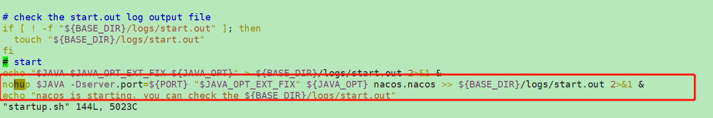

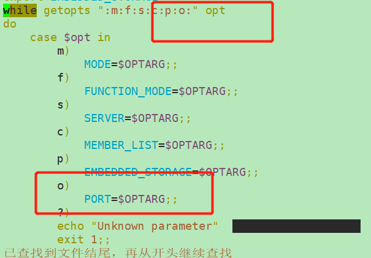


#### 3、配置nginx

```shell
    
    upstream  cluster{
	server 192.168.1.52:3333;
	server 192.168.1.52:4444;
	server 192.168.1.52:5555;
    }

	proxy_pass  http://cluter;
```

**图片中 `cluster`写错了 少了一个`s` ，其实问题也不大，但是要专业~~**


#### 4、启动Nginx

```shell

```

#### 5、查看测试

http://192.168.1.52:80/nacos


## OpenSSL安装

### ——1

参考链接：https://blog.csdn.net/vector_data/article/details/107557941

#### 1.安装依赖C语言依赖

​	redis使用C语言编写，所以需要安装C语言库

```sh
yum install -y gcc zlib 
```

​	

#### 2.上传并解压

​	把 `openssl-1.1.1j.tar.gz` 上传到/usr/local/tmp中，解压文件

```
 cd /usr/local/tmp

 tar zxf openssl-1.1.1j.tar.gz 
 mv openssl-1.1.1j ../openssl
 
```


#### 3.编译并安装

​	进入解压文件夹

```sh
  cd /usr/local/openssl
```

​	 配置编译 

```sh
./config
```

​	编译安装	

```
make clean && make install
```

​	测试

```
openssl version -a
```

 


## Kettle安装

 [他是java写的，所以跨平台，去看Windows里面的安装方法](#Windows_kettle)


# 未完成 ！————Linux


# PATH-------Windows

## MySQL安装

### 【1】MySQL的版本：

近期主要历史版本有5.0/5.1/5.5/5.6/5.7，目前最新版本是MySQL8。6.0曾经是个内部试验版本，已取消了。

MySQL8.0的版本历史
1) 2016-09-12第一个DM(development milestone)版本8.0.0发布
2) 2018-04-19第一个GA(General Availability)版本开始，8.0.11发布
3) 2018-07-27 8.0.12GA发布
4) 2018-10-22 8.0.13GA发布
5) 2019-01-21 8.0.14GA发布
6) 2019-02-01 8.0.15GA发布
7) 最新的版本是8.0.18,2019年10月14日正式发布
8) ....后续更新

### 【2】官方下载地址：
https://dev.mysql.com/downloads/windows/installer/8.0.html


### 【3】安装过程：
**1.双击MySQL安装文件mysql-installer-community-8.0.18.0.msi，出现安装类型选项。**

* Developer Default：开发者默认

* Server only：只安装服务器端 

* Client only：只安装客户端

* Full：安装全部选项
*  Custom：自定义安装


**2.选择，然后继续：**


**3.进入产品配置向导，配置多个安装细节，点击Next按钮即可。**


**4.高可靠性High Availability，采用默认选项即可。**

* Standalone MySQL Server/Classic MySQL Replication:独立MySQL服务器/经典MySQL复制

* InnoDB Cluster:InnoDB集群


**5.类型和网络 Type and Networking，采用默认选项即可。记住MySQL的监听端口默认是3306。**


**6.身份验证方法Authentication Method，采用默认选项即可。**

 

**7.账户和角色 Accounts and Roles。MySQL管理员账户名称是root，在此处指定root用户的密码。还可以在此处通过Add User按钮添加其他新账户，此处省略该操作。**


**8.Windows服务：Windows Service。**

* Configure MySQL Server as a Windows Service:给MySQL服务器配置一个服务项。

* Windows Service Name:服务名称，采用默认名称MySQL80即可。

* Start the MySQL at System Startup：系统启动时开启MySQL服务


**9.Apply Configuration：点击Execute按钮执行开始应用这些配置项。**

* Writing configuration file: 写配置文件。

* Updating Windows Firewall rules：更新Windows防火墙规则

* Adjusting Windows services：调整Windows服务

* Initializing database：初始化数据库

* Starting the server： 启动服务器

* Applying security setting：应用安全设置

* Updating the Start menu link：更新开始菜单快捷方式链接


**PS：如果配置出错，查看右侧的log，查看对应错误信息。**
**执行完成后，如下图所示。单击Finish完成安装，进入产品配置环节。**


**10.产品配置Product Configuration到此结束：点击Next按钮。**


**11.安装完成 Installation Complete。点击Finish按钮完成安装。**


### 【4】MySQL配置、登录

**【1】登录：**
访问MySQL服务器对应的命令：mysql.exe ,位置：C:\Program Files\MySQL\MySQL Server 8.0\bin


（mysql.exe需要带参数执行，所以直接在图形界面下执行该命令会自动结束）


打开控制命令台：win+r:


执行mysql.exe命令的时候出现错误：


需要配置环境变量path:


**注意：控制命令台必须重启才会生效：**

**登录的命令：mysql  -hlocalhost -uroot –p**

* mysql：bin目录下的文件mysql.exe。mysql是MySQL的命令行工具，是一个客户端软件，可以对任何主机的mysql服务（即后台运行的mysqld）发起连接。

* -h：host主机名。后面跟要访问的数据库服务器的地址；**如果是登录本机，可以省略**

* -u：user 用户名。后面跟登录数据的用户名，第一次安装后以root用户来登录，是MySQL的管理员用户

* -p:   password 密码。一般不直接输入，而是回车后以保密方式输入。 

  

  


**【2】访问数据库**

显示MySQL中的数据库列表：

```shell
show databases;
```

 默认有四个自带的数据库，每个数据库中可以有多个数据库表、视图等对象。

切换当前数据库的命令：

```shell
use mysql;
```

* MySQL下可以有多个数据库，如果要访问哪个数据库，需要将其置为当前数据库。

* 该命令的作用就是将数据库mysql（默认提供的四个数据库之一的名字）置为当前数据库

显示当前数据库的所有数据库表：

```shell
show tables;
```

MySQL 层次：不同项目对应不同的数据库组成 - 每个数据库中有很多表  - 每个表中有很多数据

**【3】退出数据库**

退出数据库可以使用quit或者exit命令完成，也可以用\q;  完成退出操作


### 【5】卸载

**1)停止MySQL服务：在命令行模式下执行net stop mysql或者在Windows服务窗口下停止服务**


**2)在控制面板中删除MySQL软件**


**3)删除软件文件夹：直接删除安装文件夹C:\Program Files\MySQL，其实此时该文件夹已经被删除或者剩下一个空文件夹。**

**4)删除数据文件夹：直接删除文件夹C:\ProgramData\MySQL。此步不要忘记，否则会影响MySQL的再次安装。**
**（ProgramData文件夹可能是隐藏的，显示出来即可）**
**（MySQL文件下的内容才是真正的MySQL中数据）**

**5)删除path环境变量中关于MySQL安装路径的配置** 


## Tomcat安装

下载

下载地址：http://tomcat.apache.org/


### 安装

tomcat由apache开源组织使用java开发的一款web容器,在使用之前需要安装JDK及配置JAVA_HOME.Tomcat是绿色软解，**解压就可使用**。如果之前已经安装了其他tomcat并且还配置了CATALINA_HOME 不要忘记修改CATALINA_HOME指向我们现在使用的这个tomcat

### Tomcat启动

运行startup.bat文件。

一定要配置JAVA_HOME   C:\Program Files\Java\jdk1.8.0_161
部分电脑需要配置CATALINA_HOME   D:/***/***/apache-tomcat-9.0.41
记住一个习惯:以后我们装任何一个软件路径都应该避免中文,空格和特殊符号,可以使用_

### Tomcat关闭

  运行shutdown.bat文件或者直接关闭掉启动窗口。

### 访问Tomcat

访问Tomcat的URL格式：http://ip:port

访问本机Tomcat的URL格式：http://localhost:8080


## Git安装

【1】Git官网：
https://git-scm.com/ 

【2】安装过程：

一直下一步


点击Git Bash Here打开Git终端：


## OpenSSL安装教程

openssl官网下载地址：http://slproweb.com/products/Win32OpenSSL.html


### 安装环境:

>windows 10
>Win64 OpenSSL v1.1.1i


### 一.下载openssl安装版

​	我这里是win10 64位,所以选的中间那个

 


### 二.安装过程

​	也没啥特殊的 ，一直next，只有两点注意：

1、修改安装地址

2、最后一步，不要勾选，会掏钱。

  

  

  

  

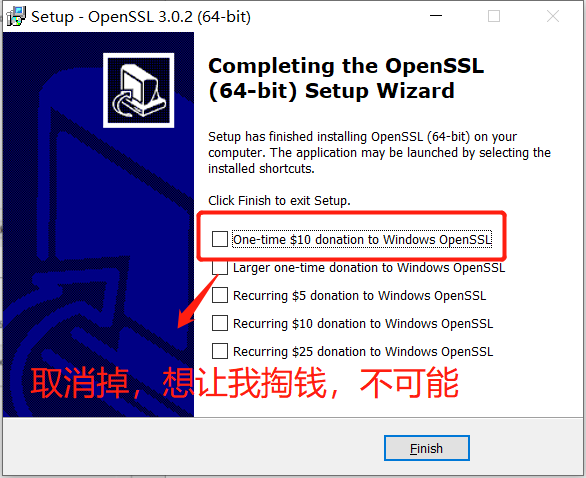

### 三.配置环境变量


 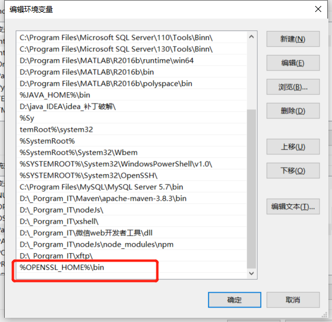


### 四.测试

```sh
openssl -version
```


## Kafka安装

​	kafka 的安装包其实没有分window 还是 linux, 所以下载的安装包还是之前的安装包，直接解压出来即可；


启动Zookeeper 服务端命令

```text
./bin\windows\zookeeper-server-start.bat  ./config\zookeeper.properties 
```

这边会报一个奇葩的错误，命令行太长，直接将压缩包解压到根目录或者桌面进行操作


启动成功


启动kafka服务端命令

```text
 ./bin\windows\kafka-server-start.bat  ./config\server.properties
```

启动成功


<div name="Windows_kettle">

## Kettle安装


下载地址：[https://sourceforge.net/project](https://link.zhihu.com/?target=https%3A//sourceforge.net/projects/pentaho/files/Data%20Integration/)

下载完成解压到任意路径


打开文件夹，找到Spoon.bat，创建桌面快捷方式，打开


成功打开，安装完成


最后还要配置下oracle的驱动

找到oracle的安装目录搜索关键字：ojdbc

把ojdbc5.jar文件复制到ETL的lib目录下


这样就可以在kettle里连接到数据库了


## redis安装

**下载地址：**https://github.com/tporadowski/redis/releases


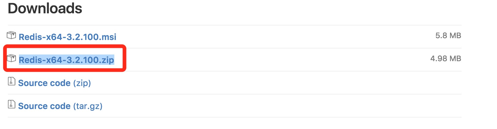


打开文件夹，内容如下：


打开一个 **cmd** 窗口 使用 cd 命令切换目录到 **C:\redis** 运行：

```sh
redis-server.exe redis.windows.conf
```

如果想方便的话，可以把 redis 的路径加到系统的环境变量里，这样就省得再输路径了，后面的那个 redis.windows.conf 可以省略，如果省略，会启用默认的。输入之后，会显示如下界面：


这时候另启一个 cmd 窗口，原来的不要关闭，不然就无法访问服务端了。

切换到 redis 目录下运行:

```
redis-cli.exe -h 127.0.0.1 -p 6379
```


# 未完成 ！———— Windows


# ———————————————

# 问题

## 0、布置在服务器中的东西，通过URL 无法访问

> ​	1、防火墙问题
>
> ​	2、端口 释放问题 ，**·我们要手动去配置我们服务器的安全组·**

<div name="perblem-1">

## 1、解决：CentOS 7 每次进入要重新加载环境变量


```shell
1.进入系统配置文件
vim ~/.bashrc

2.末尾添加如下代码
source /etc/profile

保存即可
:wq
```


## 2、端口占用、查看端口

```shell
查看是否运行端口   
netstat -tln 8080

查看端口属于哪个程序？端口被哪个进程占用(得到PID)	
lsof -i :8080  

关闭PID对应的程序            
kill -9 (PID)
```

<div name="preblem_2">

## 3、防火墙关闭、开启

```shell
关闭防火墙 ，重启失效(Linux系统一重启Linux中的防火墙又会被开起)
service firewalld stop

禁用防火墙，永久有效
systemctl disable firewalld
systemctl disable firewalld.service

启动防火墙 (对禁用的防火墙进行启动)
systemctl enable firewalld

防火墙相关命令：

1）查看防火墙状态：
service  iptables status或者systemctl status firewalld或者firewall-cmd --state

2）暂时关闭防火墙：
systemctl stop firewalld或者service  iptables stop或者systemctl stop firewalld.service

3）永久关闭防火墙：
systemctl disable firewalld或者chkconfig iptables off或者systemctl disable firewalld.service

4）重启防火墙：
systemctl enable firewalld或者service iptables restart  或者systemctl restart firewalld.service

5)永久关闭后重启：
chkconfig iptables on
```

## 4、failure: repodata/repomd.xml from epel: [Errno 256] No more mirrors to try.


http://mirrors.aliyun.com/epel/5/x86_64/repodata/repomd.xml: [Errno 14] HTTP Error 404 - Not Found的解决办法：

​	一直说那个XML文件不存在，以为是yum源是去读取xml当中的数据然后去下载。确实自己去访问也是404.还以	为是这阵子开会yum源都搞不能用了怎么。之前我用阿里用的挺好的。

​	最简单的办法就是删除 /etc/yum.repos.d/ 下所有的文件，重新来。

```shell
cd /etc/yum.repos.d/
mkdir repo_bak
mv *.repo repo_bak/
#下载缓存文件 版本自己控制
wget http://mirrors.aliyun.com/repo/Centos-7.repo
yum clean all
yum makecache

```

<div name="problem-5"></div>

## 5、Xshell连接centos7能连上但是连接过程很慢


```shell
原因：因为在登录时，需要反向解析dns。
解决方法：修改linux配置文件，

vim /etc/ssh/sshd_config

将 # UseDNS yes 此处注释去掉
改为：UseDNS no
```

[跳转到Linux安装_4](#Linux_minInstall_4)

<div name="problem-6"></div>
## 6、Xshell 连接Centos7，root拒绝登录，而其他用户可登陆？———— root用户直接登录

**PermitRootLogin**  的值改成  yes  ，并保存 

```shell
vim /etc/ssh/sshd_config
```

  


 重启sshd 服务 

```shell
service sshd restart
```


 如果上面命令提示文件不存在，可以用下面的命令 

```
systemctl restart sshd.service
```


 如果还不行，直接 重启服务器。。。 

```
reboot
```


意外的是，发现root依然不能登录。最后研究sshd_config的每一行意义，发现坑在这里： 

**注：有则看，无则跳**

  


文件的最后一行，有一行 ：AllowUsers xxx@192.168.1.*。这是写死的了，即：能远程登录的 用户名、IP 信息。难怪，其他用户一直无法登录。
所以，在后面追加：root@192.168.1.*
修改完的代码为：xxx@192.168.1.* root@192.168.1.*
然后再执行重启服务操作，然后发现root可以登录了！搞定！！！

> 注意：`xxx@192.168.1.* root@192.168.1.*` 之间要有空格。
>
> 或者直接将此行 代码直接注释掉，也可以。

[跳转到Linux安装_最小化安装_6](#Linux_minInstall_6)


<div name="problem-7"></div>
## 7、yum直接安装docker-ce报错找不到安装包

```shell
#更换成阿里云镜像仓库

yum-config-manager --add-repo   http://mirrors.aliyun.com/docker-ce/linux/centos/docker-ce.repo


```

[回到Docker安装步骤3](#docker_install_3)


## 8、docker 查看日志

```shell
 docker logs [OPTIONS] CONTAINER
  Options:
        --details        显示更多的信息
    -f, --follow         跟踪实时日志
        --since string   显示自某个timestamp之后的日志，或相对时间，如42m（即42分钟）
        --tail string    从日志末尾显示多少行日志， 默认是all
        
    -t, --timestamps     显示时间戳
        --until string   显示自某个timestamp之前的日志，或相对时间，如42m（即42分钟）		
        
```

​	查看指定时间后的日志，只显示最后100行：

```shell
$ docker logs -f -t --since="2018-02-08" --tail=100 CONTAINER_ID
```

​	查看最近30分钟的日志:

```shell
$ docker logs --since 30m CONTAINER_ID
```

​	查看某时间之后的日志：

```shell
$ docker logs -t --since="2018-02-08T13:23:37" CONTAINER_ID
```

​	查看某时间段日志：

```shell
$ docker logs -t --since="2018-02-08T13:23:37" --until "2018-02-09T12:23:37" CONTAINER_ID
```


## 9 、如何解决error: failed to push some refs to ‘https://gitee.com/

​	出现错误的主要原因是gitee(github)中的README.md文件不在本地代码目录中

​	此时我们要执行git pull --rebase origin master命令**README.md**拉到本地

```shell
git pull --rebase origin master
```

然后执行git push origin master

```shell
git push origin master
```

就ok啦！


## 10 、idea 官网下载插件过慢

 [(29条消息) Intellij IDEA下载插件太慢，怎么办？_Real_csdn_User的博客-CSDN博客_idea下载插件很慢](https://blog.csdn.net/Real_CSDN_User/article/details/113944496) 

### （1）查询自己的网络服务提供商

访问[iP138查询网](https://www.ip138.com/)，查看自己的网络服务提供商并记下它。比如我访问该网站截图如下：

如果你已经知道自己的网络服务提供商就不需要这一步。

### （2）查找访问插件网站最快的IP

Intellij IDEA的插件主页地址是[https://plugins.jetbrains.com](https://plugins.jetbrains.com/)。打开[网站测速 - 站长工具](http://tool.chinaz.com/speedtest/)，将插件的主页地址填入输入框内，点击查看分析按钮。一段时间后，就可以看到全中国各个地区访问插件主页的速度。点击表头“总耗时”右侧的小按钮，令全国各地访问插件主页的总耗时按增长顺序排列，这样耗时最短、速度最快的行就在最上方。从表格中找到与自己网络服务提供商相同的行，记下对应的IP地址。下面是我测量的访问插件主页的速度的结果：


### （3）在hosts文件中为plugins.jetbrains.com添加相关条目

用文本编辑器打开C:\Windows\System32\drivers\etc\hosts文件。在文件最下方添加一行文字：
[你记下的IP地址] plugins.jetbrains.com
[你记下的IP地址]用你记下的IP地址代替，记住不要带上方括号，而且IP地址和plugins.jetbrains.com之间有空格。例如我在文件中添加的文字是：
13.225.160.7 plugins.jetbrains.com
注意：编辑hosts文件需要管理员权限。

### 三、题外话

这种方法并不只限于加快下载IDEA插件的速度，只要你知道网络资源的网址，而且该网络资源使用了下载加速服务器，都可以用这种方法。


## 

# 未完成——问题


# 未完成

