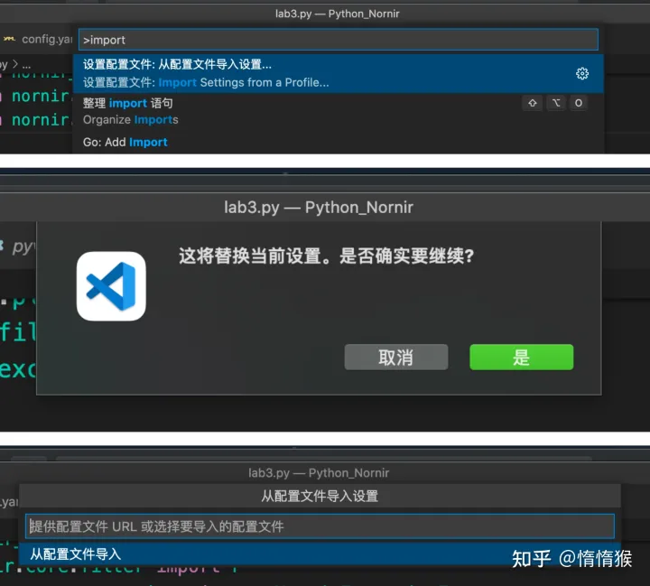

# 常用插件

## IntelliJ IDEA Keybindings
>这个插件的目的是为了契合我们 Idea 的快捷键的操作习惯
1. 先去自己的idea里面导出自己的配置

2. vscode 导入配置

  在vscode命令窗口里面输入，以下命令，导入我们自己的 `xml`文件

  ```shell
  Intelli Keybindings: mport Intellil Keybindings (XML)
  ```

3. 将 `Untitled-1` 的内容直接覆盖 `keybindings.json` 即可

    ```shell
[
        {
            "command": "workbench.action.closeActiveEditor",
            "key": "alt+5"
        },
        {
            "command": "editor.action.triggerSuggest",
            "key": "alt+[Backslash]",
            "when": "editorHasCompletionItemProvider && textInputFocus && !editorReadonly"
        },
        {
            "command": "editor.action.triggerParameterHints",
            "key": "alt+p",
            "when": "editorHasSignatureHelpProvider && editorTextFocus"
        },
        {
            "command": "editor.action.clipboardCopyAction",
            "key": "ctrl+c"
        },
        {
            "command": "editor.action.clipboardCopyAction",
            "key": "ctrl+[Insert]"
        },
        {
            "command": "editor.action.clipboardCutAction",
            "key": "ctrl+x"
        },
        {
            "command": "editor.action.clipboardCutAction",
            "key": "shift+[Delete]"
        },
        {
            "command": "editor.action.clipboardPasteAction",
            "key": "ctrl+v"
        },
        {
            "command": "editor.action.clipboardPasteAction",
            "key": "shift+[Insert]"
        },
        {
            "command": "redo",
            "key": "shift+ctrl+z"
        },
        {
            "command": "redo",
            "key": "shift+alt+[Backspace]"
        },
        {
            "command": "undo",
            "key": "ctrl+z"
        },
        {
            "command": "undo",
            "key": "alt+[Backspace]"
        },
        {
            "command": "workbench.view.debug",
            "key": "alt+5"
        },
        {
            "command": "workbench.action.navigateBack",
            "key": "ctrl+alt+[ArrowLeft]"
        },
        {
            "command": "references-view.showCallHierarchy",
            "key": "ctrl+alt+h",
            "when": "editorHasCallHierarchyProvider"
        },
        {
            "command": "git.commitAll",
            "key": "ctrl+k",
            "when": "!inDebugMode && !terminalFocus"
        },
        {
            "command": "workbench.view.debug",
            "key": "shift+alt+f9"
        },
        {
            "command": "editor.foldAll",
            "key": "shift+ctrl+[NumpadSubtract]",
            "when": "editorTextFocus && foldingEnabled"
        },
        {
            "command": "editor.foldAll",
            "key": "shift+ctrl+[Minus]",
            "when": "editorTextFocus && foldingEnabled"
        },
        {
            "command": "editor.fold",
            "key": "ctrl+[NumpadSubtract]",
            "when": "editorTextFocus && foldingEnabled"
        },
        {
            "command": "editor.fold",
            "key": "ctrl+[Minus]",
            "when": "editorTextFocus && foldingEnabled"
        },
        {
            "command": "editor.foldRecursively",
            "key": "ctrl+alt+[NumpadSubtract]",
            "when": "editorTextFocus && foldingEnabled"
        },
        {
            "command": "editor.foldRecursively",
            "key": "ctrl+alt+[Minus]",
            "when": "editorTextFocus && foldingEnabled"
        },
        {
            "command": "editor.action.blockComment",
            "key": "shift+ctrl+[Slash]",
            "when": "editorTextFocus && !editorReadonly"
        },
        {
            "command": "editor.action.blockComment",
            "key": "shift+ctrl+[NumpadDivide]",
            "when": "editorTextFocus && !editorReadonly"
        },
        {
            "command": "editor.action.commentLine",
            "key": "ctrl+[Slash]",
            "when": "editorTextFocus && !editorReadonly"
        },
        {
            "command": "editor.action.commentLine",
            "key": "ctrl+[NumpadDivide]",
            "when": "editorTextFocus && !editorReadonly"
        },
        {
            "command": "workbench.action.tasks.build",
            "key": "ctrl+f9"
        },
        {
            "command": "copyFilePath",
            "key": "shift+ctrl+c",
            "when": "!editorFocus"
        },
        {
            "command": "workbench.action.debug.run",
            "key": "shift+f9",
            "when": "debuggersAvailable"
        },
        {
            "command": "merge-conflict.accept.current",
            "key": "shift+alt+[ArrowRight]",
            "when": "isInDiffEditor"
        },
        {
            "command": "merge-conflict.accept.incoming",
            "key": "shift+alt+[ArrowLeft]",
            "when": "isInDiffEditor"
        },
        {
            "command": "workbench.action.quickOpenNavigateNext",
            "key": "ctrl+[Tab]",
            "when": "inQuickOpen"
        },
        {
            "command": "workbench.action.quickOpenNavigateNext",
            "key": "ctrl+[Tab]"
        },
        {
            "command": "git.openChange",
            "key": "ctrl+d"
        },
        {
            "command": "editor.action.goToDeclaration",
            "key": "f4",
            "when": "editorTextFocus"
        },
        {
            "command": "workbench.action.files.showOpenedFileInNewWindow",
            "key": "shift+f4",
            "when": "emptyWorkspaceSupport"
        },
        {
            "command": "acceptSelectedSuggestion",
            "key": "shift+ctrl+[Enter]",
            "when": "suggestWidgetVisible && textInputFocus"
        },
        {
            "command": "acceptSelectedSuggestion",
            "key": "shift+ctrl+[Enter]",
            "when": "acceptSuggestionOnEnter && suggestWidgetVisible && suggestionMakesTextEdit && textInputFocus"
        },
        {
            "command": "editor.action.deleteLines",
            "key": "ctrl+y",
            "when": "textInputFocus && !editorReadonly"
        },
        {
            "command": "deleteWordRight",
            "key": "ctrl+[Delete]",
            "when": "textInputFocus && !editorReadonly"
        },
        {
            "command": "deleteWordLeft",
            "key": "ctrl+[Backspace]",
            "when": "textInputFocus && !editorReadonly"
        },
        {
            "command": "editor.action.copyLinesDownAction",
            "key": "ctrl+d",
            "when": "editorTextFocus && !editorReadonly"
        },
        {
            "command": "editor.action.joinLines",
            "key": "shift+ctrl+j",
            "when": "editorTextFocus && !editorReadonly"
        },
        {
            "command": "cursorLineEnd",
            "key": "[End]",
            "when": "textInputFocus"
        },
        {
            "command": "cursorLineEndSelect",
            "key": "shift+[End]",
            "when": "textInputFocus"
        },
        {
            "command": "cursorLineStart",
            "key": "[Home]",
            "when": "textInputFocus"
        },
        {
            "command": "cursorLineStartSelect",
            "key": "shift+[Home]",
            "when": "textInputFocus"
        },
        {
            "command": "cursorBottom",
            "key": "ctrl+[PageDown]",
            "when": "textInputFocus"
        },
        {
            "command": "cursorBottomSelect",
            "key": "shift+ctrl+[PageDown]",
            "when": "textInputFocus"
        },
        {
            "command": "cursorTop",
            "key": "ctrl+[PageUp]",
            "when": "textInputFocus"
        },
        {
            "command": "cursorTopSelect",
            "key": "shift+ctrl+[PageUp]",
            "when": "textInputFocus"
        },
        {
            "command": "cursorWordRight",
            "key": "ctrl+[ArrowRight]",
            "when": "textInputFocus"
        },
        {
            "command": "cursorWordRightSelect",
            "key": "shift+ctrl+[ArrowRight]",
            "when": "textInputFocus"
        },
        {
            "command": "cursorPageDown",
            "key": "[PageDown]",
            "when": "textInputFocus"
        },
        {
            "command": "cursorPageDownSelect",
            "key": "shift+[PageDown]",
            "when": "textInputFocus"
        },
        {
            "command": "cursorPageUp",
            "key": "[PageUp]",
            "when": "textInputFocus"
        },
        {
            "command": "cursorPageUpSelect",
            "key": "shift+[PageUp]",
            "when": "textInputFocus"
        },
        {
            "command": "cursorWordLeft",
            "key": "ctrl+[ArrowLeft]",
            "when": "textInputFocus"
        },
        {
            "command": "cursorWordLeftSelect",
            "key": "shift+ctrl+[ArrowLeft]",
            "when": "textInputFocus"
        },
        {
            "command": "editor.action.smartSelect.grow",
            "key": "ctrl+w",
            "when": "editorTextFocus"
        },
        {
            "command": "lineBreakInsert",
            "key": "ctrl+[Enter]",
            "when": "textInputFocus && !editorReadonly"
        },
        {
            "command": "editor.action.insertLineAfter",
            "key": "shift+[Enter]",
            "when": "editorTextFocus && !editorReadonly"
        },
        {
            "command": "editor.action.insertLineBefore",
            "key": "ctrl+alt+[Enter]",
            "when": "editorTextFocus && !editorReadonly"
        },
        {
            "command": "cursorBottom",
            "key": "ctrl+[End]",
            "when": "textInputFocus"
        },
        {
            "command": "cursorTop",
            "key": "ctrl+[Home]",
            "when": "textInputFocus"
        },
        {
            "command": "editor.action.toggleColumnSelection",
            "key": "shift+alt+[Insert]"
        },
        {
            "command": "editor.action.smartSelect.shrink",
            "key": "shift+ctrl+w",
            "when": "editorTextFocus"
        },
        {
            "command": "editor.debug.action.selectionToRepl",
            "key": "alt+f8",
            "when": "debuggersAvailable && editorHasSelection"
        },
        {
            "command": "editor.unfoldAll",
            "key": "shift+ctrl+[NumpadAdd]",
            "when": "editorTextFocus && foldingEnabled"
        },
        {
            "command": "editor.unfoldAll",
            "key": "shift+ctrl+[Equal]",
            "when": "editorTextFocus && foldingEnabled"
        },
        {
            "command": "editor.unfold",
            "key": "ctrl+[NumpadAdd]",
            "when": "editorTextFocus && foldingEnabled"
        },
        {
            "command": "editor.unfold",
            "key": "ctrl+[Equal]",
            "when": "editorTextFocus && foldingEnabled"
        },
        {
            "command": "editor.unfoldRecursively",
            "key": "ctrl+alt+[NumpadAdd]",
            "when": "editorTextFocus && foldingEnabled"
        },
        {
            "command": "editor.unfoldRecursively",
            "key": "ctrl+alt+[Equal]",
            "when": "editorTextFocus && foldingEnabled"
        },
        {
            "command": "workbench.action.gotoSymbol",
            "key": "ctrl+f12",
            "when": "editorTextFocus"
        },
        {
            "command": "workbench.action.findInFiles",
            "key": "shift+ctrl+f"
        },
        {
            "command": "editor.action.nextMatchFindAction",
            "key": "f3",
            "when": "editorFocus"
        },
        {
            "command": "editor.action.nextMatchFindAction",
            "key": "f3",
            "when": "editorFocus && findInputFocussed"
        },
        {
            "command": "editor.action.nextMatchFindAction",
            "key": "ctrl+l",
            "when": "editorFocus"
        },
        {
            "command": "editor.action.nextMatchFindAction",
            "key": "ctrl+l",
            "when": "editorFocus && findInputFocussed"
        },
        {
            "command": "editor.action.previousMatchFindAction",
            "key": "shift+f3",
            "when": "editorFocus"
        },
        {
            "command": "editor.action.previousMatchFindAction",
            "key": "shift+f3",
            "when": "editorFocus && findInputFocussed"
        },
        {
            "command": "editor.action.previousMatchFindAction",
            "key": "shift+ctrl+l",
            "when": "editorFocus"
        },
        {
            "command": "editor.action.previousMatchFindAction",
            "key": "shift+ctrl+l",
            "when": "editorFocus && findInputFocussed"
        },
        {
            "command": "references-view.findReferences",
            "key": "alt+f7",
            "when": "editorHasReferenceProvider"
        },
        {
            "command": "workbench.action.navigateForward",
            "key": "ctrl+alt+[ArrowRight]"
        },
        {
            "command": "workbench.action.files.newUntitledFile",
            "key": "alt+[Insert]"
        },
        {
            "command": "git.pushTo",
            "key": "ctrl+alt+k",
            "when": "!inDebugMode && !terminalFocus"
        },
        {
            "command": "workbench.action.showCommands",
            "key": "shift+ctrl+a"
        },
        {
            "command": "workbench.action.showAllSymbols",
            "key": "ctrl+n"
        },
        {
            "command": "workbench.action.quickOpen",
            "key": "shift+ctrl+n"
        },
        {
            "command": "editor.action.goToImplementation",
            "key": "ctrl+alt+b",
            "when": "editorHasImplementationProvider && editorTextFocus && !isInEmbeddedEditor"
        },
        {
            "command": "workbench.action.gotoLine",
            "key": "ctrl+g"
        },
        {
            "command": "editor.action.marker.next",
            "key": "f2",
            "when": "editorFocus"
        },
        {
            "command": "editor.action.marker.prev",
            "key": "shift+f2",
            "when": "editorFocus"
        },
        {
            "command": "workbench.action.gotoSymbol",
            "key": "shift+ctrl+alt+n",
            "when": "editorTextFocus"
        },
        {
            "command": "editor.action.goToTypeDefinition",
            "key": "shift+ctrl+b",
            "when": "editorTextFocus"
        },
        {
            "command": "workbench.action.toggleSidebarVisibility",
            "key": "shift+[Escape]"
        },
        {
            "command": "workbench.action.maximizeEditor",
            "key": "shift+ctrl+f12"
        },
        {
            "command": "workbench.action.navigateToLastEditLocation",
            "key": "shift+ctrl+[Backspace]"
        },
        {
            "command": "editor.action.moveLinesDownAction",
            "key": "shift+alt+[ArrowDown]",
            "when": "editorTextFocus && !editorReadonly"
        },
        {
            "command": "editor.action.moveLinesUpAction",
            "key": "shift+alt+[ArrowUp]",
            "when": "editorTextFocus && !editorReadonly"
        },
        {
            "command": "workbench.action.files.newUntitledFile",
            "key": "shift+ctrl+alt+[Insert]"
        },
        {
            "command": "workbench.action.compareEditor.nextChange",
            "key": "f7",
            "when": "textCompareEditorVisible"
        },
        {
            "command": "workbench.action.nextEditor",
            "key": "alt+[ArrowRight]"
        },
        {
            "command": "editor.action.organizeImports",
            "key": "ctrl+alt+o",
            "when": "editorTextFocus && !editorReadonly && supportedCodeAction =~ /(\\s|^)source\\.organizeImports\\b/"
        },
        {
            "command": "workbench.action.compareEditor.previousChange",
            "key": "shift+f7",
            "when": "textCompareEditorVisible"
        },
        {
            "command": "workbench.action.previousEditor",
            "key": "alt+[ArrowLeft]"
        },
        {
            "command": "workbench.action.selectTheme",
            "key": "ctrl+[Backquote]"
        },
        {
            "command": "editor.action.previewDeclaration",
            "key": "shift+ctrl+i"
        },
        {
            "command": "editor.action.showHover",
            "key": "ctrl+q",
            "when": "editorTextFocus"
        },
        {
            "command": "workbench.action.openRecent",
            "key": "ctrl+e",
            "when": "!inQuickOpen"
        },
        {
            "command": "workbench.action.openPreviousEditorFromHistory",
            "key": "ctrl+e",
            "when": "inQuickOpen"
        },
        {
            "command": "editor.action.formatDocument",
            "key": "ctrl+alt+l",
            "when": "editorHasDocumentFormattingProvider && editorTextFocus && !editorReadonly && !inCompositeEditor"
        },
        {
            "command": "editor.action.rename",
            "key": "shift+f6",
            "when": "editorHasRenameProvider && editorTextFocus && !editorReadonly"
        },
        {
            "command": "editor.action.startFindReplaceAction",
            "key": "ctrl+r",
            "when": "editorFocus || editorIsOpen"
        },
        {
            "command": "workbench.action.replaceInFiles",
            "key": "shift+ctrl+r"
        },
        {
            "command": "workbench.action.debug.continue",
            "key": "f9",
            "when": "inDebugMode"
        },
        {
            "command": "workbench.action.tasks.reRunTask",
            "key": "shift+f10"
        },
        {
            "command": "editor.debug.action.runToCursor",
            "key": "alt+f9",
            "when": "debugState == 'stopped'"
        },
        {
            "command": "workbench.action.files.saveAll",
            "key": "ctrl+s"
        },
        {
            "command": "workbench.action.showCommands",
            "key": "shift shift"
        },
        {
            "command": "editor.action.selectHighlights",
            "key": "shift+ctrl+alt+j",
            "when": "editorFocus"
        },
        {
            "command": "editor.action.addSelectionToNextFindMatch",
            "key": "alt+j",
            "when": "editorFocus"
        },
        {
            "command": "workbench.action.showErrorsWarnings",
            "key": "ctrl+f1",
            "when": "editorTextFocus"
        },
        {
            "command": "editor.action.quickFix",
            "key": "alt+[Enter]",
            "when": "editorHasCodeActionsProvider && editorTextFocus && !editorReadonly"
        },
        {
            "command": "breadcrumbs.focus",
            "key": "alt+[Home]",
            "when": "breadcrumbsPossible"
        },
        {
            "command": "workbench.action.tasks.configureTaskRunner",
            "key": "shift+ctrl+alt+s"
        },
        {
            "command": "workbench.action.openGlobalSettings",
            "key": "ctrl+alt+s"
        },
        {
            "command": "editor.action.referenceSearch.trigger",
            "key": "ctrl+alt+f7",
            "when": "editorHasReferenceProvider && editorTextFocus && !inReferenceSearchEditor"
        },
        {
            "command": "workbench.action.debug.stepInto",
            "key": "f7",
            "when": "debugState != 'inactive'"
        },
        {
            "command": "workbench.action.debug.stepOut",
            "key": "shift+f8",
            "when": "debugState == 'stopped'"
        },
        {
            "command": "workbench.action.debug.stepOver",
            "key": "f8",
            "when": "debugState == 'stopped'"
        },
        {
            "command": "editor.debug.action.toggleBreakpoint",
            "key": "ctrl+f8",
            "when": "debuggersAvailable && editorTextFocus"
        },
        {
            "command": "java.action.showTypeHierarchy",
            "key": "ctrl+h",
            "when": "editorLangId == java && editorTextFocus"
        },
        {
            "command": "cursorUndo",
            "key": "shift+alt+j",
            "when": "textInputFocus"
        },
        {
            "command": "git.revertSelectedRanges",
            "key": "ctrl+alt+z",
            "when": "editorTextFocus && !editorReadonly"
        },
        {
            "command": "git.sync",
            "key": "ctrl+t"
        },
        {
            "command": "editor.action.dirtydiff.previous",
            "key": "shift+ctrl+alt+[ArrowUp]",
            "when": "editorTextFocus"
        },
        {
            "command": "workbench.view.debug",
            "key": "shift+ctrl+f8"
        },
        {
            "command": "-editor.action.clipboardCopyAction",
            "key": "ctrl+insert"
        },
        {
            "command": "-editor.action.clipboardCutAction",
            "key": "shift+delete"
        },
        {
            "command": "-editor.action.clipboardPasteAction",
            "key": "shift+insert"
        },
        {
            "command": "-redo",
            "key": "ctrl+shift+z"
        },
        {
            "command": "-redo",
            "key": "ctrl+y"
        },
        {
            "command": "-workbench.view.debug",
            "key": "ctrl+shift+d"
        },
        {
            "command": "-workbench.action.navigateBack",
            "key": "alt+left"
        },
        {
            "command": "-references-view.showCallHierarchy",
            "key": "shift+alt+h"
        },
        {
            "command": "-git.commitAll",
            "key": ""
        },
        {
            "command": "-workbench.action.closeActiveEditor",
            "key": "ctrl+w"
        },
        {
            "command": "-workbench.action.closeActiveEditor",
            "key": "ctrl+f4"
        },
        {
            "command": "-editor.action.triggerSuggest",
            "key": "ctrl+i"
        },
        {
            "command": "-editor.action.triggerSuggest",
            "key": "ctrl+space"
        },
        {
            "command": "-editor.foldAll",
            "key": "ctrl+k ctrl+0"
        },
        {
            "command": "-editor.fold",
            "key": "ctrl+shift+["
        },
        {
            "command": "-editor.foldRecursively",
            "key": "ctrl+k ctrl+["
        },
        {
            "command": "-editor.action.blockComment",
            "key": "shift+alt+a"
        },
        {
            "command": "-editor.action.commentLine",
            "key": "ctrl+/"
        },
        {
            "command": "-workbench.action.tasks.build",
            "key": "ctrl+shift+b"
        },
        {
            "command": "-copyFilePath",
            "key": "shift+alt+c"
        },
        {
            "command": "-workbench.action.debug.run",
            "key": "ctrl+f5"
        },
        {
            "command": "-merge-conflict.accept.current",
            "key": ""
        },
        {
            "command": "-merge-conflict.accept.incoming",
            "key": ""
        },
        {
            "command": "-workbench.action.quickOpenNavigateNext",
            "key": ""
        },
        {
            "command": "-git.openChange",
            "key": ""
        },
        {
            "command": "-editor.action.goToDeclaration",
            "key": ""
        },
        {
            "command": "-workbench.action.files.showOpenedFileInNewWindow",
            "key": "ctrl+k o"
        },
        {
            "command": "-acceptSelectedSuggestion",
            "key": "tab"
        },
        {
            "command": "-acceptSelectedSuggestion",
            "key": "enter"
        },
        {
            "command": "-editor.action.deleteLines",
            "key": "ctrl+shift+k"
        },
        {
            "command": "-deleteWordRight",
            "key": "ctrl+delete"
        },
        {
            "command": "-deleteWordLeft",
            "key": "ctrl+backspace"
        },
        {
            "command": "-editor.action.copyLinesDownAction",
            "key": "shift+alt+down"
        },
        {
            "command": "-editor.action.joinLines",
            "key": ""
        },
        {
            "command": "-cursorLineEnd",
            "key": ""
        },
        {
            "command": "-cursorLineEndSelect",
            "key": ""
        },
        {
            "command": "-cursorLineStart",
            "key": ""
        },
        {
            "command": "-cursorLineStartSelect",
            "key": ""
        },
        {
            "command": "-cursorBottom",
            "key": "ctrl+end"
        },
        {
            "command": "-cursorBottomSelect",
            "key": "ctrl+shift+end"
        },
        {
            "command": "-cursorTop",
            "key": "ctrl+home"
        },
        {
            "command": "-cursorTopSelect",
            "key": "ctrl+shift+home"
        },
        {
            "command": "-cursorWordRight",
            "key": ""
        },
        {
            "command": "-cursorWordRightSelect",
            "key": ""
        },
        {
            "command": "-cursorPageDown",
            "key": "pagedown"
        },
        {
            "command": "-cursorPageDownSelect",
            "key": "shift+pagedown"
        },
        {
            "command": "-cursorPageUp",
            "key": "pageup"
        },
        {
            "command": "-cursorPageUpSelect",
            "key": "shift+pageup"
        },
        {
            "command": "-cursorWordLeft",
            "key": "ctrl+left"
        },
        {
            "command": "-cursorWordLeftSelect",
            "key": "ctrl+shift+left"
        },
        {
            "command": "-editor.action.smartSelect.grow",
            "key": ""
        },
        {
            "command": "-lineBreakInsert",
            "key": ""
        },
        {
            "command": "-editor.action.insertLineAfter",
            "key": "ctrl+enter"
        },
        {
            "command": "-editor.action.insertLineBefore",
            "key": "ctrl+shift+enter"
        },
        {
            "command": "-editor.action.toggleColumnSelection",
            "key": ""
        },
        {
            "command": "-editor.action.smartSelect.shrink",
            "key": "shift+alt+left"
        },
        {
            "command": "-editor.debug.action.selectionToRepl",
            "key": ""
        },
        {
            "command": "-editor.unfoldAll",
            "key": "ctrl+k ctrl+j"
        },
        {
            "command": "-editor.unfold",
            "key": "ctrl+shift+]"
        },
        {
            "command": "-editor.unfoldRecursively",
            "key": "ctrl+k ctrl+]"
        },
        {
            "command": "-workbench.action.gotoSymbol",
            "key": "ctrl+shift+o"
        },
        {
            "command": "-workbench.action.findInFiles",
            "key": "ctrl+shift+f"
        },
        {
            "command": "-editor.action.nextMatchFindAction",
            "key": "enter"
        },
        {
            "command": "-editor.action.previousMatchFindAction",
            "key": "shift+enter"
        },
        {
            "command": "-references-view.findReferences",
            "key": "shift+alt+f12"
        },
        {
            "command": "-workbench.action.navigateForward",
            "key": "alt+right"
        },
        {
            "command": "-workbench.action.files.newUntitledFile",
            "key": "ctrl+n"
        },
        {
            "command": "-git.pushTo",
            "key": ""
        },
        {
            "command": "-workbench.action.showCommands",
            "key": "f1"
        },
        {
            "command": "-workbench.action.showCommands",
            "key": "ctrl+shift+p"
        },
        {
            "command": "-workbench.action.showAllSymbols",
            "key": "ctrl+t"
        },
        {
            "command": "-workbench.action.quickOpen",
            "key": "ctrl+p"
        },
        {
            "command": "-workbench.action.quickOpen",
            "key": "ctrl+r"
        },
        {
            "command": "-editor.action.goToImplementation",
            "key": "ctrl+f12"
        },
        {
            "command": "-editor.action.marker.next",
            "key": "alt+f8"
        },
        {
            "command": "-editor.action.marker.prev",
            "key": "shift+alt+f8"
        },
        {
            "command": "-editor.action.goToTypeDefinition",
            "key": ""
        },
        {
            "command": "-workbench.action.toggleSidebarVisibility",
            "key": "ctrl+b"
        },
        {
            "command": "-workbench.action.maximizeEditor",
            "key": ""
        },
        {
            "command": "-workbench.action.navigateToLastEditLocation",
            "key": "ctrl+k ctrl+q"
        },
        {
            "command": "-editor.action.moveLinesDownAction",
            "key": "alt+down"
        },
        {
            "command": "-editor.action.moveLinesUpAction",
            "key": "alt+up"
        },
        {
            "command": "-workbench.action.compareEditor.nextChange",
            "key": "alt+f5"
        },
        {
            "command": "-workbench.action.nextEditor",
            "key": "ctrl+pagedown"
        },
        {
            "command": "-editor.action.organizeImports",
            "key": "shift+alt+o"
        },
        {
            "command": "-editor.action.triggerParameterHints",
            "key": "ctrl+shift+space"
        },
        {
            "command": "-workbench.action.compareEditor.previousChange",
            "key": "shift+alt+f5"
        },
        {
            "command": "-workbench.action.previousEditor",
            "key": "ctrl+pageup"
        },
        {
            "command": "-workbench.action.selectTheme",
            "key": "ctrl+k ctrl+t"
        },
        {
            "command": "-editor.action.previewDeclaration",
            "key": ""
        },
        {
            "command": "-editor.action.showHover",
            "key": "ctrl+k ctrl+i"
        },
        {
            "command": "-editor.action.formatDocument",
            "key": "shift+alt+f"
        },
        {
            "command": "-editor.action.rename",
            "key": "f2"
        },
        {
            "command": "-editor.action.startFindReplaceAction",
            "key": "ctrl+h"
        },
        {
            "command": "-workbench.action.replaceInFiles",
            "key": "ctrl+shift+h"
        },
        {
            "command": "-workbench.action.debug.continue",
            "key": "f5"
        },
        {
            "command": "-workbench.action.tasks.reRunTask",
            "key": ""
        },
        {
            "command": "-editor.debug.action.runToCursor",
            "key": ""
        },
        {
            "command": "-workbench.action.files.saveAll",
            "key": "ctrl+k s"
        },
        {
            "command": "-editor.action.selectHighlights",
            "key": "ctrl+shift+l"
        },
        {
            "command": "-editor.action.addSelectionToNextFindMatch",
            "key": "ctrl+d"
        },
        {
            "command": "-workbench.action.showErrorsWarnings",
            "key": ""
        },
        {
            "command": "-editor.action.quickFix",
            "key": "ctrl+."
        },
        {
            "command": "-breadcrumbs.focus",
            "key": "ctrl+shift+;"
        },
        {
            "command": "-workbench.action.tasks.configureTaskRunner",
            "key": ""
        },
        {
            "command": "-workbench.action.openGlobalSettings",
            "key": ""
        },
        {
            "command": "-editor.action.referenceSearch.trigger",
            "key": ""
        },
        {
            "command": "-workbench.action.debug.stepInto",
            "key": "f11"
        },
        {
            "command": "-workbench.action.debug.stepOut",
            "key": "shift+f11"
        },
        {
            "command": "-workbench.action.debug.stepOver",
            "key": "f10"
        },
        {
            "command": "-editor.debug.action.toggleBreakpoint",
            "key": "f9"
        },
        {
            "command": "-java.action.showTypeHierarchy",
            "key": ""
        },
        {
            "command": "-cursorUndo",
            "key": "ctrl+u"
        },
        {
            "command": "-git.revertSelectedRanges",
            "key": "ctrl+k ctrl+r"
        },
        {
            "command": "-git.sync",
            "key": ""
        },
        {
            "command": "-editor.action.dirtydiff.previous",
            "key": "shift+alt+f3"
        },
        {
            "command": "-editor.action.triggerSuggest",
            "key": "ctrl+[Space]"
        },
        {
            "command": "-editor.action.triggerParameterHints",
            "key": "ctrl+p"
        },
    {
        	// 回车确定提示代码，一定要删除注释
        "key": "enter",
            "command": "acceptSelectedSuggestion",
            "when": "editorTextFocus && suggestWidgetVisible"
        }
    ]
    ```
    
    


# 常用设置

## 配置

> 注意：这里一定要下载一个插件 `IntelliJ IDEA Keybindings` 
>
> 我们下面的配置是我们的自己的idea快捷键的配置
1. 我们自己创建一个 **xxx.code-profile** 文件，然后将下面所有的内容复制到新的文件中保存即可

    ```json
    {"name":"vscode_setting","settings":"{\"settings\":\"{\\r\\n  \\\"gitlens.advanced.messages\\\": {\\r\\n    \\\"suppressGitMissingWarning\\\": true\\r\\n  },\\r\\n  \\\"editor.suggestSelection\\\": \\\"first\\\",\\r\\n  \\\"vsintellicode.modify.editor.suggestSelection\\\": \\\"choseToUpdateConfiguration\\\",\\r\\n  \\\"vsicons.dontShowNewVersionMessage\\\": true,\\r\\n  \\\"editor.fontSize\\\": 18,\\r\\n  \\\"security.workspace.trust.untrustedFiles\\\": \\\"open\\\",\\r\\n  \\\"redhat.telemetry.enabled\\\": true,\\r\\n  \\\"editor.inlineSuggest.enabled\\\": true,\\r\\n  \\\"java.configuration.maven.globalSettings\\\": \\\"C:\\\\\\\\\\\\\\\\Users\\\\\\\\\\\\\\\\Lenovo\\\\\\\\\\\\\\\\.m2\\\\\\\\\\\\\\\\settings.xml\\\",\\r\\n  \\\"java.configuration.maven.userSettings\\\": \\\"C:\\\\\\\\\\\\\\\\Users\\\\\\\\\\\\\\\\Lenovo\\\\\\\\\\\\\\\\.m2\\\\\\\\\\\\\\\\settings.xml\\\",\\r\\n  \\\"workbench.editor.enablePreview\\\": false,\\r\\n  \\\"git.ignoreMissingGitWarning\\\": true,\\r\\n  \\\"workbench.startupEditor\\\": \\\"none\\\",\\r\\n  \\\"update.mode\\\": \\\"none\\\",\\r\\n  \\\"workbench.iconTheme\\\": \\\"vscode-icons\\\",\\r\\n  \\\"editor.formatOnPaste\\\": true,\\r\\n  \\\"Lua.telemetry.enable\\\": true,\\r\\n  \\\"editor.mouseWheelZoom\\\": true,\\r\\n  \\\"editor.suggest.snippetsPreventQuickSuggestions\\\": false,\\r\\n  \\\"workbench.editor.untitled.hint\\\": \\\"hidden\\\",\\r\\n  \\\"settingsSync.ignoredExtensions\\\": [\\\"ms-ceintl.vscode-language-pack-zh-hans\\\"],\\r\\n  \\\"oneDarkPro.bold\\\": true,\\r\\n  \\\"oneDarkPro.vivid\\\": true,\\r\\n  \\\"workbench.editorAssociations\\\": {\\r\\n    \\\"*.md\\\": \\\"default\\\"\\r\\n  },\\r\\n  \\\"explorer.compactFolders\\\": false,\\r\\n  \\\"workbench.tree.indent\\\": 16,\\r\\n  \\\"terminal.integrated.automationProfile.windows\\\": {},\\r\\n  \\\"terminal.integrated.profiles.windows\\\": {\\r\\n    \\\"PowerShell\\\": {\\r\\n      \\\"source\\\": \\\"PowerShell\\\",\\r\\n      \\\"icon\\\": \\\"terminal-powershell\\\"\\r\\n    },\\r\\n    \\\"Command Prompt\\\": {\\r\\n      \\\"path\\\": [\\r\\n        \\\"${env:windir}\\\\\\\\Sysnative\\\\\\\\cmd.exe\\\",\\r\\n        \\\"${env:windir}\\\\\\\\System32\\\\\\\\cmd.exe\\\"\\r\\n      ],\\r\\n      \\\"args\\\": [],\\r\\n      \\\"icon\\\": \\\"terminal-cmd\\\"\\r\\n    },\\r\\n    \\\"Git-Bash\\\": {\\r\\n      \\\"path\\\": \\\"D:\\\\\\\\_Porgram_IT\\\\\\\\Git\\\\\\\\bin\\\\\\\\bash.exe\\\"\\r\\n    },\\r\\n    \\\"NuShell\\\": {\\r\\n      \\\"path\\\": \\\"D:\\\\\\\\_Porgram_IT\\\\\\\\NuShell\\\\\\\\nu.exe\\\"\\r\\n    }\\r\\n  },\\r\\n\\\"terminal.integrated.automationShell.windows\\\": \\\"D:\\\\\\\\_Porgram_IT\\\\\\\\Git\\\\\\\\bin\\\\\\\\bash.exe\\\",\\r\\n  // 默认终端\\r\\n  \\\"terminal.integrated.defaultProfile.windows\\\": \\\"Git-Bash\\\",\\r\\n  \\\"typescript.disableAutomaticTypeAcquisition\\\": true,\\r\\n  \\\"explorer.autoReveal\\\": false,\\r\\n  \\\"[javascript]\\\": {\\r\\n    \\\"editor.defaultFormatter\\\": \\\"vscode.typescript-language-features\\\"\\r\\n  },\\r\\n  \\\"[html]\\\": {\\r\\n    \\\"editor.defaultFormatter\\\": \\\"vscode.html-language-features\\\"\\r\\n  },\\r\\n  // 注释颜色\\r\\n  \\\"editor.tokenColorCustomizations\\\": {\\r\\n    \\\"comments\\\": \\\"#29A66C\\\"\\r\\n  },\\r\\n\\r\\n  \\\"files.autoGuessEncoding\\\": true,\\r\\n  \\\"workbench.list.smoothScrolling\\\": true,\\r\\n  \\\"editor.cursorSmoothCaretAnimation\\\": true,\\r\\n  \\\"editor.smoothScrolling\\\": true,\\r\\n  \\\"editor.cursorBlinking\\\": \\\"smooth\\\",\\r\\n  // \\\"editor.mouseWheelZoom\\\": true,\\r\\n  // \\\"editor.formatOnPaste\\\": true,\\r\\n  \\\"editor.formatOnType\\\": true,\\r\\n  \\\"editor.formatOnSave\\\": true,\\r\\n  \\\"editor.wordWrap\\\": \\\"on\\\",\\r\\n  \\\"editor.guides.bracketPairs\\\": true,\\r\\n  //\\\"editor.bracketPairColorization.enabled\\\": true, (此设置vscode在较新版本已默认开启)\\r\\n  // \\\"editor.suggest.snippetsPreventQuickSuggestions\\\": false,\\r\\n  \\\"editor.acceptSuggestionOnEnter\\\": \\\"smart\\\",\\r\\n  // \\\"editor.suggestSelection\\\": \\\"recentlyUsed\\\",\\r\\n  \\\"window.dialogStyle\\\": \\\"custom\\\",\\r\\n  \\\"debug.showBreakpointsInOverviewRuler\\\": true,\\r\\n  \\\"files.autoSave\\\": \\\"afterDelay\\\",\\r\\n  \\\"workbench.colorTheme\\\": \\\"Monokai Dimmed\\\",\\r\\n  \\\"explorer.confirmDelete\\\": false,\\r\\n  \\\"files.associations\\\": {\\r\\n    \\\"*.cjson\\\": \\\"jsonc\\\",\\r\\n    \\\"*.wxss\\\": \\\"css\\\",\\r\\n    \\\"*.wxs\\\": \\\"javascript\\\",\\r\\n    \\\"wxml\\\": \\\"html\\\"\\r\\n  },\\r\\n  \\\"emmet.includeLanguages\\\": {\\r\\n    \\\"wxml\\\": \\\"html\\\"\\r\\n  },\\r\\n  \\\"minapp-vscode.disableAutoConfig\\\": true,\\r\\n  \\\"editor.lineHeight\\\": 2\\r\\n}\\r\\n\"}","keybindings":"{\"keybindings\":\"[\\r\\n    {\\r\\n        \\\"command\\\": \\\"workbench.action.closeActiveEditor\\\",\\r\\n        \\\"key\\\": \\\"alt+4\\\"\\r\\n    },\\r\\n    {\\r\\n        \\\"command\\\": \\\"editor.action.triggerSuggest\\\",\\r\\n        \\\"key\\\": \\\"alt+[Backslash]\\\",\\r\\n        \\\"when\\\": \\\"editorHasCompletionItemProvider && textInputFocus && !editorReadonly\\\"\\r\\n    },\\r\\n    {\\r\\n        \\\"command\\\": \\\"editor.action.triggerParameterHints\\\",\\r\\n        \\\"key\\\": \\\"alt+p\\\",\\r\\n        \\\"when\\\": \\\"editorHasSignatureHelpProvider && editorTextFocus\\\"\\r\\n    },\\r\\n    {\\r\\n        \\\"command\\\": \\\"editor.action.clipboardCopyAction\\\",\\r\\n        \\\"key\\\": \\\"ctrl+c\\\"\\r\\n    },\\r\\n    {\\r\\n        \\\"command\\\": \\\"editor.action.clipboardCopyAction\\\",\\r\\n        \\\"key\\\": \\\"ctrl+[Insert]\\\"\\r\\n    },\\r\\n    {\\r\\n        \\\"command\\\": \\\"editor.action.clipboardCutAction\\\",\\r\\n        \\\"key\\\": \\\"ctrl+x\\\"\\r\\n    },\\r\\n    {\\r\\n        \\\"command\\\": \\\"editor.action.clipboardCutAction\\\",\\r\\n        \\\"key\\\": \\\"shift+[Delete]\\\"\\r\\n    },\\r\\n    {\\r\\n        \\\"command\\\": \\\"editor.action.clipboardPasteAction\\\",\\r\\n        \\\"key\\\": \\\"ctrl+v\\\"\\r\\n    },\\r\\n    {\\r\\n        \\\"command\\\": \\\"editor.action.clipboardPasteAction\\\",\\r\\n        \\\"key\\\": \\\"shift+[Insert]\\\"\\r\\n    },\\r\\n    {\\r\\n        \\\"command\\\": \\\"redo\\\",\\r\\n        \\\"key\\\": \\\"shift+ctrl+z\\\"\\r\\n    },\\r\\n    {\\r\\n        \\\"command\\\": \\\"redo\\\",\\r\\n        \\\"key\\\": \\\"shift+alt+[Backspace]\\\"\\r\\n    },\\r\\n    {\\r\\n        \\\"command\\\": \\\"undo\\\",\\r\\n        \\\"key\\\": \\\"ctrl+z\\\"\\r\\n    },\\r\\n    {\\r\\n        \\\"command\\\": \\\"undo\\\",\\r\\n        \\\"key\\\": \\\"alt+[Backspace]\\\"\\r\\n    },\\r\\n    {\\r\\n        \\\"command\\\": \\\"workbench.view.debug\\\",\\r\\n        \\\"key\\\": \\\"alt+5\\\"\\r\\n    },\\r\\n    {\\r\\n        \\\"command\\\": \\\"workbench.action.navigateBack\\\",\\r\\n        \\\"key\\\": \\\"ctrl+alt+[ArrowLeft]\\\"\\r\\n    },\\r\\n    {\\r\\n        \\\"command\\\": \\\"references-view.showCallHierarchy\\\",\\r\\n        \\\"key\\\": \\\"ctrl+alt+h\\\",\\r\\n        \\\"when\\\": \\\"editorHasCallHierarchyProvider\\\"\\r\\n    },\\r\\n    {\\r\\n        \\\"command\\\": \\\"git.commitAll\\\",\\r\\n        \\\"key\\\": \\\"ctrl+k\\\",\\r\\n        \\\"when\\\": \\\"!inDebugMode && !terminalFocus\\\"\\r\\n    },\\r\\n    {\\r\\n        \\\"command\\\": \\\"workbench.view.debug\\\",\\r\\n        \\\"key\\\": \\\"shift+alt+f9\\\"\\r\\n    },\\r\\n    {\\r\\n        \\\"command\\\": \\\"editor.foldAll\\\",\\r\\n        \\\"key\\\": \\\"shift+ctrl+[NumpadSubtract]\\\",\\r\\n        \\\"when\\\": \\\"editorTextFocus && foldingEnabled\\\"\\r\\n    },\\r\\n    {\\r\\n        \\\"command\\\": \\\"editor.foldAll\\\",\\r\\n        \\\"key\\\": \\\"shift+ctrl+[Minus]\\\",\\r\\n        \\\"when\\\": \\\"editorTextFocus && foldingEnabled\\\"\\r\\n    },\\r\\n    {\\r\\n        \\\"command\\\": \\\"editor.fold\\\",\\r\\n        \\\"key\\\": \\\"ctrl+[NumpadSubtract]\\\",\\r\\n        \\\"when\\\": \\\"editorTextFocus && foldingEnabled\\\"\\r\\n    },\\r\\n    {\\r\\n        \\\"command\\\": \\\"editor.fold\\\",\\r\\n        \\\"key\\\": \\\"ctrl+[Minus]\\\",\\r\\n        \\\"when\\\": \\\"editorTextFocus && foldingEnabled\\\"\\r\\n    },\\r\\n    {\\r\\n        \\\"command\\\": \\\"editor.foldRecursively\\\",\\r\\n        \\\"key\\\": \\\"ctrl+alt+[NumpadSubtract]\\\",\\r\\n        \\\"when\\\": \\\"editorTextFocus && foldingEnabled\\\"\\r\\n    },\\r\\n    {\\r\\n        \\\"command\\\": \\\"editor.foldRecursively\\\",\\r\\n        \\\"key\\\": \\\"ctrl+alt+[Minus]\\\",\\r\\n        \\\"when\\\": \\\"editorTextFocus && foldingEnabled\\\"\\r\\n    },\\r\\n    {\\r\\n        \\\"command\\\": \\\"editor.action.blockComment\\\",\\r\\n        \\\"key\\\": \\\"shift+ctrl+[Slash]\\\",\\r\\n        \\\"when\\\": \\\"editorTextFocus && !editorReadonly\\\"\\r\\n    },\\r\\n    {\\r\\n        \\\"command\\\": \\\"editor.action.blockComment\\\",\\r\\n        \\\"key\\\": \\\"shift+ctrl+[NumpadDivide]\\\",\\r\\n        \\\"when\\\": \\\"editorTextFocus && !editorReadonly\\\"\\r\\n    },\\r\\n    {\\r\\n        \\\"command\\\": \\\"editor.action.commentLine\\\",\\r\\n        \\\"key\\\": \\\"ctrl+[Slash]\\\",\\r\\n        \\\"when\\\": \\\"editorTextFocus && !editorReadonly\\\"\\r\\n    },\\r\\n    {\\r\\n        \\\"command\\\": \\\"editor.action.commentLine\\\",\\r\\n        \\\"key\\\": \\\"ctrl+[NumpadDivide]\\\",\\r\\n        \\\"when\\\": \\\"editorTextFocus && !editorReadonly\\\"\\r\\n    },\\r\\n    {\\r\\n        \\\"command\\\": \\\"workbench.action.tasks.build\\\",\\r\\n        \\\"key\\\": \\\"ctrl+f9\\\"\\r\\n    },\\r\\n    {\\r\\n        \\\"command\\\": \\\"copyFilePath\\\",\\r\\n        \\\"key\\\": \\\"shift+ctrl+c\\\",\\r\\n        \\\"when\\\": \\\"!editorFocus\\\"\\r\\n    },\\r\\n    {\\r\\n        \\\"command\\\": \\\"workbench.action.debug.run\\\",\\r\\n        \\\"key\\\": \\\"shift+f9\\\",\\r\\n        \\\"when\\\": \\\"debuggersAvailable\\\"\\r\\n    },\\r\\n    {\\r\\n        \\\"command\\\": \\\"merge-conflict.accept.current\\\",\\r\\n        \\\"key\\\": \\\"shift+alt+[ArrowRight]\\\",\\r\\n        \\\"when\\\": \\\"isInDiffEditor\\\"\\r\\n    },\\r\\n    {\\r\\n        \\\"command\\\": \\\"merge-conflict.accept.incoming\\\",\\r\\n        \\\"key\\\": \\\"shift+alt+[ArrowLeft]\\\",\\r\\n        \\\"when\\\": \\\"isInDiffEditor\\\"\\r\\n    },\\r\\n    {\\r\\n        \\\"command\\\": \\\"workbench.action.quickOpenNavigateNext\\\",\\r\\n        \\\"key\\\": \\\"ctrl+[Tab]\\\",\\r\\n        \\\"when\\\": \\\"inQuickOpen\\\"\\r\\n    },\\r\\n    {\\r\\n        \\\"command\\\": \\\"workbench.action.quickOpenNavigateNext\\\",\\r\\n        \\\"key\\\": \\\"ctrl+[Tab]\\\"\\r\\n    },\\r\\n    {\\r\\n        \\\"command\\\": \\\"git.openChange\\\",\\r\\n        \\\"key\\\": \\\"ctrl+d\\\"\\r\\n    },\\r\\n    {\\r\\n        \\\"command\\\": \\\"editor.action.goToDeclaration\\\",\\r\\n        \\\"key\\\": \\\"f4\\\",\\r\\n        \\\"when\\\": \\\"editorTextFocus\\\"\\r\\n    },\\r\\n    {\\r\\n        \\\"command\\\": \\\"workbench.action.files.showOpenedFileInNewWindow\\\",\\r\\n        \\\"key\\\": \\\"shift+f4\\\",\\r\\n        \\\"when\\\": \\\"emptyWorkspaceSupport\\\"\\r\\n    },\\r\\n    {\\r\\n        \\\"command\\\": \\\"acceptSelectedSuggestion\\\",\\r\\n        \\\"key\\\": \\\"shift+ctrl+[Enter]\\\",\\r\\n        \\\"when\\\": \\\"suggestWidgetVisible && textInputFocus\\\"\\r\\n    },\\r\\n    {\\r\\n        \\\"command\\\": \\\"acceptSelectedSuggestion\\\",\\r\\n        \\\"key\\\": \\\"shift+ctrl+[Enter]\\\",\\r\\n        \\\"when\\\": \\\"acceptSuggestionOnEnter && suggestWidgetVisible && suggestionMakesTextEdit && textInputFocus\\\"\\r\\n    },\\r\\n    {\\r\\n        \\\"command\\\": \\\"editor.action.deleteLines\\\",\\r\\n        \\\"key\\\": \\\"ctrl+y\\\",\\r\\n        \\\"when\\\": \\\"textInputFocus && !editorReadonly\\\"\\r\\n    },\\r\\n    {\\r\\n        \\\"command\\\": \\\"deleteWordRight\\\",\\r\\n        \\\"key\\\": \\\"ctrl+[Delete]\\\",\\r\\n        \\\"when\\\": \\\"textInputFocus && !editorReadonly\\\"\\r\\n    },\\r\\n    {\\r\\n        \\\"command\\\": \\\"deleteWordLeft\\\",\\r\\n        \\\"key\\\": \\\"ctrl+[Backspace]\\\",\\r\\n        \\\"when\\\": \\\"textInputFocus && !editorReadonly\\\"\\r\\n    },\\r\\n    {\\r\\n        \\\"command\\\": \\\"editor.action.copyLinesDownAction\\\",\\r\\n        \\\"key\\\": \\\"ctrl+d\\\",\\r\\n        \\\"when\\\": \\\"editorTextFocus && !editorReadonly\\\"\\r\\n    },\\r\\n    {\\r\\n        \\\"command\\\": \\\"editor.action.joinLines\\\",\\r\\n        \\\"key\\\": \\\"shift+ctrl+j\\\",\\r\\n        \\\"when\\\": \\\"editorTextFocus && !editorReadonly\\\"\\r\\n    },\\r\\n    {\\r\\n        \\\"command\\\": \\\"cursorLineEnd\\\",\\r\\n        \\\"key\\\": \\\"[End]\\\",\\r\\n        \\\"when\\\": \\\"textInputFocus\\\"\\r\\n    },\\r\\n    {\\r\\n        \\\"command\\\": \\\"cursorLineEndSelect\\\",\\r\\n        \\\"key\\\": \\\"shift+[End]\\\",\\r\\n        \\\"when\\\": \\\"textInputFocus\\\"\\r\\n    },\\r\\n    {\\r\\n        \\\"command\\\": \\\"cursorLineStart\\\",\\r\\n        \\\"key\\\": \\\"[Home]\\\",\\r\\n        \\\"when\\\": \\\"textInputFocus\\\"\\r\\n    },\\r\\n    {\\r\\n        \\\"command\\\": \\\"cursorLineStartSelect\\\",\\r\\n        \\\"key\\\": \\\"shift+[Home]\\\",\\r\\n        \\\"when\\\": \\\"textInputFocus\\\"\\r\\n    },\\r\\n    {\\r\\n        \\\"command\\\": \\\"cursorBottom\\\",\\r\\n        \\\"key\\\": \\\"ctrl+[PageDown]\\\",\\r\\n        \\\"when\\\": \\\"textInputFocus\\\"\\r\\n    },\\r\\n    {\\r\\n        \\\"command\\\": \\\"cursorBottomSelect\\\",\\r\\n        \\\"key\\\": \\\"shift+ctrl+[PageDown]\\\",\\r\\n        \\\"when\\\": \\\"textInputFocus\\\"\\r\\n    },\\r\\n    {\\r\\n        \\\"command\\\": \\\"cursorTop\\\",\\r\\n        \\\"key\\\": \\\"ctrl+[PageUp]\\\",\\r\\n        \\\"when\\\": \\\"textInputFocus\\\"\\r\\n    },\\r\\n    {\\r\\n        \\\"command\\\": \\\"cursorTopSelect\\\",\\r\\n        \\\"key\\\": \\\"shift+ctrl+[PageUp]\\\",\\r\\n        \\\"when\\\": \\\"textInputFocus\\\"\\r\\n    },\\r\\n    {\\r\\n        \\\"command\\\": \\\"cursorWordRight\\\",\\r\\n        \\\"key\\\": \\\"ctrl+[ArrowRight]\\\",\\r\\n        \\\"when\\\": \\\"textInputFocus\\\"\\r\\n    },\\r\\n    {\\r\\n        \\\"command\\\": \\\"cursorWordRightSelect\\\",\\r\\n        \\\"key\\\": \\\"shift+ctrl+[ArrowRight]\\\",\\r\\n        \\\"when\\\": \\\"textInputFocus\\\"\\r\\n    },\\r\\n    {\\r\\n        \\\"command\\\": \\\"cursorPageDown\\\",\\r\\n        \\\"key\\\": \\\"[PageDown]\\\",\\r\\n        \\\"when\\\": \\\"textInputFocus\\\"\\r\\n    },\\r\\n    {\\r\\n        \\\"command\\\": \\\"cursorPageDownSelect\\\",\\r\\n        \\\"key\\\": \\\"shift+[PageDown]\\\",\\r\\n        \\\"when\\\": \\\"textInputFocus\\\"\\r\\n    },\\r\\n    {\\r\\n        \\\"command\\\": \\\"cursorPageUp\\\",\\r\\n        \\\"key\\\": \\\"[PageUp]\\\",\\r\\n        \\\"when\\\": \\\"textInputFocus\\\"\\r\\n    },\\r\\n    {\\r\\n        \\\"command\\\": \\\"cursorPageUpSelect\\\",\\r\\n        \\\"key\\\": \\\"shift+[PageUp]\\\",\\r\\n        \\\"when\\\": \\\"textInputFocus\\\"\\r\\n    },\\r\\n    {\\r\\n        \\\"command\\\": \\\"cursorWordLeft\\\",\\r\\n        \\\"key\\\": \\\"ctrl+[ArrowLeft]\\\",\\r\\n        \\\"when\\\": \\\"textInputFocus\\\"\\r\\n    },\\r\\n    {\\r\\n        \\\"command\\\": \\\"cursorWordLeftSelect\\\",\\r\\n        \\\"key\\\": \\\"shift+ctrl+[ArrowLeft]\\\",\\r\\n        \\\"when\\\": \\\"textInputFocus\\\"\\r\\n    },\\r\\n    {\\r\\n        \\\"command\\\": \\\"lineBreakInsert\\\",\\r\\n        \\\"key\\\": \\\"ctrl+[Enter]\\\",\\r\\n        \\\"when\\\": \\\"textInputFocus && !editorReadonly\\\"\\r\\n    },\\r\\n    {\\r\\n        \\\"command\\\": \\\"editor.action.insertLineAfter\\\",\\r\\n        \\\"key\\\": \\\"shift+[Enter]\\\",\\r\\n        \\\"when\\\": \\\"editorTextFocus && !editorReadonly\\\"\\r\\n    },\\r\\n    {\\r\\n        \\\"command\\\": \\\"editor.action.insertLineBefore\\\",\\r\\n        \\\"key\\\": \\\"ctrl+alt+[Enter]\\\",\\r\\n        \\\"when\\\": \\\"editorTextFocus && !editorReadonly\\\"\\r\\n    },\\r\\n    {\\r\\n        \\\"command\\\": \\\"cursorBottom\\\",\\r\\n        \\\"key\\\": \\\"ctrl+[End]\\\",\\r\\n        \\\"when\\\": \\\"textInputFocus\\\"\\r\\n    },\\r\\n    {\\r\\n        \\\"command\\\": \\\"cursorTop\\\",\\r\\n        \\\"key\\\": \\\"ctrl+[Home]\\\",\\r\\n        \\\"when\\\": \\\"textInputFocus\\\"\\r\\n    },\\r\\n    {\\r\\n        \\\"command\\\": \\\"editor.action.toggleColumnSelection\\\",\\r\\n        \\\"key\\\": \\\"shift+alt+[Insert]\\\"\\r\\n    },\\r\\n    {\\r\\n        \\\"command\\\": \\\"editor.action.smartSelect.shrink\\\",\\r\\n        \\\"key\\\": \\\"shift+ctrl+w\\\",\\r\\n        \\\"when\\\": \\\"editorTextFocus\\\"\\r\\n    },\\r\\n    {\\r\\n        \\\"command\\\": \\\"editor.debug.action.selectionToRepl\\\",\\r\\n        \\\"key\\\": \\\"alt+f8\\\",\\r\\n        \\\"when\\\": \\\"debuggersAvailable && editorHasSelection\\\"\\r\\n    },\\r\\n    {\\r\\n        \\\"command\\\": \\\"editor.unfoldAll\\\",\\r\\n        \\\"key\\\": \\\"shift+ctrl+[NumpadAdd]\\\",\\r\\n        \\\"when\\\": \\\"editorTextFocus && foldingEnabled\\\"\\r\\n    },\\r\\n    {\\r\\n        \\\"command\\\": \\\"editor.unfoldAll\\\",\\r\\n        \\\"key\\\": \\\"shift+ctrl+[Equal]\\\",\\r\\n        \\\"when\\\": \\\"editorTextFocus && foldingEnabled\\\"\\r\\n    },\\r\\n    {\\r\\n        \\\"command\\\": \\\"editor.unfold\\\",\\r\\n        \\\"key\\\": \\\"ctrl+[NumpadAdd]\\\",\\r\\n        \\\"when\\\": \\\"editorTextFocus && foldingEnabled\\\"\\r\\n    },\\r\\n    {\\r\\n        \\\"command\\\": \\\"editor.unfold\\\",\\r\\n        \\\"key\\\": \\\"ctrl+[Equal]\\\",\\r\\n        \\\"when\\\": \\\"editorTextFocus && foldingEnabled\\\"\\r\\n    },\\r\\n    {\\r\\n        \\\"command\\\": \\\"editor.unfoldRecursively\\\",\\r\\n        \\\"key\\\": \\\"ctrl+alt+[NumpadAdd]\\\",\\r\\n        \\\"when\\\": \\\"editorTextFocus && foldingEnabled\\\"\\r\\n    },\\r\\n    {\\r\\n        \\\"command\\\": \\\"editor.unfoldRecursively\\\",\\r\\n        \\\"key\\\": \\\"ctrl+alt+[Equal]\\\",\\r\\n        \\\"when\\\": \\\"editorTextFocus && foldingEnabled\\\"\\r\\n    },\\r\\n    {\\r\\n        \\\"command\\\": \\\"workbench.action.gotoSymbol\\\",\\r\\n        \\\"key\\\": \\\"ctrl+f12\\\",\\r\\n        \\\"when\\\": \\\"editorTextFocus\\\"\\r\\n    },\\r\\n    {\\r\\n        \\\"command\\\": \\\"workbench.action.findInFiles\\\",\\r\\n        \\\"key\\\": \\\"shift+ctrl+f\\\"\\r\\n    },\\r\\n    {\\r\\n        \\\"command\\\": \\\"editor.action.nextMatchFindAction\\\",\\r\\n        \\\"key\\\": \\\"f3\\\",\\r\\n        \\\"when\\\": \\\"editorFocus\\\"\\r\\n    },\\r\\n    {\\r\\n        \\\"command\\\": \\\"editor.action.nextMatchFindAction\\\",\\r\\n        \\\"key\\\": \\\"f3\\\",\\r\\n        \\\"when\\\": \\\"editorFocus && findInputFocussed\\\"\\r\\n    },\\r\\n    {\\r\\n        \\\"command\\\": \\\"editor.action.nextMatchFindAction\\\",\\r\\n        \\\"key\\\": \\\"ctrl+l\\\",\\r\\n        \\\"when\\\": \\\"editorFocus\\\"\\r\\n    },\\r\\n    {\\r\\n        \\\"command\\\": \\\"editor.action.nextMatchFindAction\\\",\\r\\n        \\\"key\\\": \\\"ctrl+l\\\",\\r\\n        \\\"when\\\": \\\"editorFocus && findInputFocussed\\\"\\r\\n    },\\r\\n    {\\r\\n        \\\"command\\\": \\\"editor.action.previousMatchFindAction\\\",\\r\\n        \\\"key\\\": \\\"shift+f3\\\",\\r\\n        \\\"when\\\": \\\"editorFocus\\\"\\r\\n    },\\r\\n    {\\r\\n        \\\"command\\\": \\\"editor.action.previousMatchFindAction\\\",\\r\\n        \\\"key\\\": \\\"shift+f3\\\",\\r\\n        \\\"when\\\": \\\"editorFocus && findInputFocussed\\\"\\r\\n    },\\r\\n    {\\r\\n        \\\"command\\\": \\\"editor.action.previousMatchFindAction\\\",\\r\\n        \\\"key\\\": \\\"shift+ctrl+l\\\",\\r\\n        \\\"when\\\": \\\"editorFocus\\\"\\r\\n    },\\r\\n    {\\r\\n        \\\"command\\\": \\\"editor.action.previousMatchFindAction\\\",\\r\\n        \\\"key\\\": \\\"shift+ctrl+l\\\",\\r\\n        \\\"when\\\": \\\"editorFocus && findInputFocussed\\\"\\r\\n    },\\r\\n    {\\r\\n        \\\"command\\\": \\\"references-view.findReferences\\\",\\r\\n        \\\"key\\\": \\\"alt+f7\\\",\\r\\n        \\\"when\\\": \\\"editorHasReferenceProvider\\\"\\r\\n    },\\r\\n    {\\r\\n        \\\"command\\\": \\\"workbench.action.navigateForward\\\",\\r\\n        \\\"key\\\": \\\"ctrl+alt+[ArrowRight]\\\"\\r\\n    },\\r\\n    {\\r\\n        \\\"command\\\": \\\"workbench.action.files.newUntitledFile\\\",\\r\\n        \\\"key\\\": \\\"alt+[Insert]\\\"\\r\\n    },\\r\\n    {\\r\\n        \\\"command\\\": \\\"git.pushTo\\\",\\r\\n        \\\"key\\\": \\\"ctrl+alt+k\\\",\\r\\n        \\\"when\\\": \\\"!inDebugMode && !terminalFocus\\\"\\r\\n    },\\r\\n    {\\r\\n        \\\"command\\\": \\\"workbench.action.showCommands\\\",\\r\\n        \\\"key\\\": \\\"shift+ctrl+a\\\"\\r\\n    },\\r\\n    {\\r\\n        \\\"command\\\": \\\"workbench.action.showAllSymbols\\\",\\r\\n        \\\"key\\\": \\\"ctrl+n\\\"\\r\\n    },\\r\\n    {\\r\\n        \\\"command\\\": \\\"workbench.action.quickOpen\\\",\\r\\n        \\\"key\\\": \\\"shift+ctrl+n\\\"\\r\\n    },\\r\\n    {\\r\\n        \\\"command\\\": \\\"editor.action.goToImplementation\\\",\\r\\n        \\\"key\\\": \\\"ctrl+alt+b\\\",\\r\\n        \\\"when\\\": \\\"editorHasImplementationProvider && editorTextFocus && !isInEmbeddedEditor\\\"\\r\\n    },\\r\\n    {\\r\\n        \\\"command\\\": \\\"workbench.action.gotoLine\\\",\\r\\n        \\\"key\\\": \\\"ctrl+g\\\"\\r\\n    },\\r\\n    {\\r\\n        \\\"command\\\": \\\"editor.action.marker.next\\\",\\r\\n        \\\"key\\\": \\\"f2\\\",\\r\\n        \\\"when\\\": \\\"editorFocus\\\"\\r\\n    },\\r\\n    {\\r\\n        \\\"command\\\": \\\"editor.action.marker.prev\\\",\\r\\n        \\\"key\\\": \\\"shift+f2\\\",\\r\\n        \\\"when\\\": \\\"editorFocus\\\"\\r\\n    },\\r\\n    {\\r\\n        \\\"command\\\": \\\"workbench.action.gotoSymbol\\\",\\r\\n        \\\"key\\\": \\\"shift+ctrl+alt+n\\\",\\r\\n        \\\"when\\\": \\\"editorTextFocus\\\"\\r\\n    },\\r\\n    {\\r\\n        \\\"command\\\": \\\"editor.action.goToTypeDefinition\\\",\\r\\n        \\\"key\\\": \\\"shift+ctrl+b\\\",\\r\\n        \\\"when\\\": \\\"editorTextFocus\\\"\\r\\n    },\\r\\n    {\\r\\n        \\\"command\\\": \\\"workbench.action.toggleSidebarVisibility\\\",\\r\\n        \\\"key\\\": \\\"shift+[Escape]\\\"\\r\\n    },\\r\\n    {\\r\\n        \\\"command\\\": \\\"workbench.action.maximizeEditor\\\",\\r\\n        \\\"key\\\": \\\"shift+ctrl+f12\\\"\\r\\n    },\\r\\n    {\\r\\n        \\\"command\\\": \\\"workbench.action.navigateToLastEditLocation\\\",\\r\\n        \\\"key\\\": \\\"shift+ctrl+[Backspace]\\\"\\r\\n    },\\r\\n    {\\r\\n        \\\"command\\\": \\\"editor.action.moveLinesDownAction\\\",\\r\\n        \\\"key\\\": \\\"shift+alt+[ArrowDown]\\\",\\r\\n        \\\"when\\\": \\\"editorTextFocus && !editorReadonly\\\"\\r\\n    },\\r\\n    {\\r\\n        \\\"command\\\": \\\"editor.action.moveLinesUpAction\\\",\\r\\n        \\\"key\\\": \\\"shift+alt+[ArrowUp]\\\",\\r\\n        \\\"when\\\": \\\"editorTextFocus && !editorReadonly\\\"\\r\\n    },\\r\\n    {\\r\\n        \\\"command\\\": \\\"workbench.action.files.newUntitledFile\\\",\\r\\n        \\\"key\\\": \\\"shift+ctrl+alt+[Insert]\\\"\\r\\n    },\\r\\n    {\\r\\n        \\\"command\\\": \\\"workbench.action.compareEditor.nextChange\\\",\\r\\n        \\\"key\\\": \\\"f7\\\",\\r\\n        \\\"when\\\": \\\"textCompareEditorVisible\\\"\\r\\n    },\\r\\n    {\\r\\n        \\\"command\\\": \\\"workbench.action.nextEditor\\\",\\r\\n        \\\"key\\\": \\\"alt+[ArrowRight]\\\"\\r\\n    },\\r\\n    {\\r\\n        \\\"command\\\": \\\"editor.action.organizeImports\\\",\\r\\n        \\\"key\\\": \\\"ctrl+alt+o\\\",\\r\\n        \\\"when\\\": \\\"editorTextFocus && !editorReadonly && supportedCodeAction =~ /(\\\\\\\\s|^)source\\\\\\\\.organizeImports\\\\\\\\b/\\\"\\r\\n    },\\r\\n    {\\r\\n        \\\"command\\\": \\\"workbench.action.compareEditor.previousChange\\\",\\r\\n        \\\"key\\\": \\\"shift+f7\\\",\\r\\n        \\\"when\\\": \\\"textCompareEditorVisible\\\"\\r\\n    },\\r\\n    {\\r\\n        \\\"command\\\": \\\"workbench.action.previousEditor\\\",\\r\\n        \\\"key\\\": \\\"alt+[ArrowLeft]\\\"\\r\\n    },\\r\\n    {\\r\\n        \\\"command\\\": \\\"workbench.action.selectTheme\\\",\\r\\n        \\\"key\\\": \\\"ctrl+[Backquote]\\\"\\r\\n    },\\r\\n    {\\r\\n        \\\"command\\\": \\\"editor.action.previewDeclaration\\\",\\r\\n        \\\"key\\\": \\\"shift+ctrl+i\\\"\\r\\n    },\\r\\n    {\\r\\n        \\\"command\\\": \\\"editor.action.showHover\\\",\\r\\n        \\\"key\\\": \\\"ctrl+q\\\",\\r\\n        \\\"when\\\": \\\"editorTextFocus\\\"\\r\\n    },\\r\\n    {\\r\\n        \\\"command\\\": \\\"workbench.action.openRecent\\\",\\r\\n        \\\"key\\\": \\\"ctrl+e\\\",\\r\\n        \\\"when\\\": \\\"!inQuickOpen\\\"\\r\\n    },\\r\\n    {\\r\\n        \\\"command\\\": \\\"workbench.action.openPreviousEditorFromHistory\\\",\\r\\n        \\\"key\\\": \\\"ctrl+e\\\",\\r\\n        \\\"when\\\": \\\"inQuickOpen\\\"\\r\\n    },\\r\\n    {\\r\\n        \\\"command\\\": \\\"editor.action.formatDocument\\\",\\r\\n        \\\"key\\\": \\\"ctrl+alt+l\\\",\\r\\n        \\\"when\\\": \\\"editorHasDocumentFormattingProvider && editorTextFocus && !editorReadonly && !inCompositeEditor\\\"\\r\\n    },\\r\\n    {\\r\\n        \\\"command\\\": \\\"editor.action.rename\\\",\\r\\n        \\\"key\\\": \\\"shift+f6\\\",\\r\\n        \\\"when\\\": \\\"editorHasRenameProvider && editorTextFocus && !editorReadonly\\\"\\r\\n    },\\r\\n    {\\r\\n        \\\"command\\\": \\\"editor.action.startFindReplaceAction\\\",\\r\\n        \\\"key\\\": \\\"ctrl+r\\\",\\r\\n        \\\"when\\\": \\\"editorFocus || editorIsOpen\\\"\\r\\n    },\\r\\n    {\\r\\n        \\\"command\\\": \\\"workbench.action.replaceInFiles\\\",\\r\\n        \\\"key\\\": \\\"shift+ctrl+r\\\"\\r\\n    },\\r\\n    {\\r\\n        \\\"command\\\": \\\"workbench.action.debug.continue\\\",\\r\\n        \\\"key\\\": \\\"f9\\\",\\r\\n        \\\"when\\\": \\\"inDebugMode\\\"\\r\\n    },\\r\\n    {\\r\\n        \\\"command\\\": \\\"workbench.action.tasks.reRunTask\\\",\\r\\n        \\\"key\\\": \\\"shift+f10\\\"\\r\\n    },\\r\\n    {\\r\\n        \\\"command\\\": \\\"editor.debug.action.runToCursor\\\",\\r\\n        \\\"key\\\": \\\"alt+f9\\\",\\r\\n        \\\"when\\\": \\\"debugState == 'stopped'\\\"\\r\\n    },\\r\\n    {\\r\\n        \\\"command\\\": \\\"workbench.action.files.saveAll\\\",\\r\\n        \\\"key\\\": \\\"ctrl+s\\\"\\r\\n    },\\r\\n    {\\r\\n        \\\"command\\\": \\\"workbench.action.showCommands\\\",\\r\\n        \\\"key\\\": \\\"shift shift\\\"\\r\\n    },\\r\\n    {\\r\\n        \\\"command\\\": \\\"editor.action.selectHighlights\\\",\\r\\n        \\\"key\\\": \\\"shift+ctrl+alt+j\\\",\\r\\n        \\\"when\\\": \\\"editorFocus\\\"\\r\\n    },\\r\\n    {\\r\\n        \\\"command\\\": \\\"editor.action.addSelectionToNextFindMatch\\\",\\r\\n        \\\"key\\\": \\\"alt+j\\\",\\r\\n        \\\"when\\\": \\\"editorFocus\\\"\\r\\n    },\\r\\n    {\\r\\n        \\\"command\\\": \\\"workbench.action.showErrorsWarnings\\\",\\r\\n        \\\"key\\\": \\\"ctrl+f1\\\",\\r\\n        \\\"when\\\": \\\"editorTextFocus\\\"\\r\\n    },\\r\\n    {\\r\\n        \\\"command\\\": \\\"editor.action.quickFix\\\",\\r\\n        \\\"key\\\": \\\"alt+[Enter]\\\",\\r\\n        \\\"when\\\": \\\"editorHasCodeActionsProvider && editorTextFocus && !editorReadonly\\\"\\r\\n    },\\r\\n    {\\r\\n        \\\"command\\\": \\\"breadcrumbs.focus\\\",\\r\\n        \\\"key\\\": \\\"alt+[Home]\\\",\\r\\n        \\\"when\\\": \\\"breadcrumbsPossible\\\"\\r\\n    },\\r\\n    {\\r\\n        \\\"command\\\": \\\"workbench.action.tasks.configureTaskRunner\\\",\\r\\n        \\\"key\\\": \\\"shift+ctrl+alt+s\\\"\\r\\n    },\\r\\n    {\\r\\n        \\\"command\\\": \\\"workbench.action.openGlobalSettings\\\",\\r\\n        \\\"key\\\": \\\"ctrl+alt+s\\\"\\r\\n    },\\r\\n    {\\r\\n        \\\"command\\\": \\\"editor.action.referenceSearch.trigger\\\",\\r\\n        \\\"key\\\": \\\"ctrl+alt+f7\\\",\\r\\n        \\\"when\\\": \\\"editorHasReferenceProvider && editorTextFocus && !inReferenceSearchEditor\\\"\\r\\n    },\\r\\n    {\\r\\n        \\\"command\\\": \\\"workbench.action.debug.stepInto\\\",\\r\\n        \\\"key\\\": \\\"f7\\\",\\r\\n        \\\"when\\\": \\\"debugState != 'inactive'\\\"\\r\\n    },\\r\\n    {\\r\\n        \\\"command\\\": \\\"workbench.action.debug.stepOut\\\",\\r\\n        \\\"key\\\": \\\"shift+f8\\\",\\r\\n        \\\"when\\\": \\\"debugState == 'stopped'\\\"\\r\\n    },\\r\\n    {\\r\\n        \\\"command\\\": \\\"workbench.action.debug.stepOver\\\",\\r\\n        \\\"key\\\": \\\"f8\\\",\\r\\n        \\\"when\\\": \\\"debugState == 'stopped'\\\"\\r\\n    },\\r\\n    {\\r\\n        \\\"command\\\": \\\"editor.debug.action.toggleBreakpoint\\\",\\r\\n        \\\"key\\\": \\\"ctrl+f8\\\",\\r\\n        \\\"when\\\": \\\"debuggersAvailable && editorTextFocus\\\"\\r\\n    },\\r\\n    {\\r\\n        \\\"command\\\": \\\"java.action.showTypeHierarchy\\\",\\r\\n        \\\"key\\\": \\\"ctrl+h\\\",\\r\\n        \\\"when\\\": \\\"editorLangId == java && editorTextFocus\\\"\\r\\n    },\\r\\n    {\\r\\n        \\\"command\\\": \\\"cursorUndo\\\",\\r\\n        \\\"key\\\": \\\"shift+alt+j\\\",\\r\\n        \\\"when\\\": \\\"textInputFocus\\\"\\r\\n    },\\r\\n    {\\r\\n        \\\"command\\\": \\\"git.revertSelectedRanges\\\",\\r\\n        \\\"key\\\": \\\"ctrl+alt+z\\\",\\r\\n        \\\"when\\\": \\\"editorTextFocus && !editorReadonly\\\"\\r\\n    },\\r\\n    {\\r\\n        \\\"command\\\": \\\"git.sync\\\",\\r\\n        \\\"key\\\": \\\"ctrl+t\\\"\\r\\n    },\\r\\n    {\\r\\n        \\\"command\\\": \\\"editor.action.dirtydiff.previous\\\",\\r\\n        \\\"key\\\": \\\"shift+ctrl+alt+[ArrowUp]\\\",\\r\\n        \\\"when\\\": \\\"editorTextFocus\\\"\\r\\n    },\\r\\n    {\\r\\n        \\\"command\\\": \\\"workbench.view.debug\\\",\\r\\n        \\\"key\\\": \\\"shift+ctrl+f8\\\"\\r\\n    },\\r\\n    {\\r\\n        \\\"command\\\": \\\"-editor.action.clipboardCopyAction\\\",\\r\\n        \\\"key\\\": \\\"ctrl+insert\\\"\\r\\n    },\\r\\n    {\\r\\n        \\\"command\\\": \\\"-editor.action.clipboardCutAction\\\",\\r\\n        \\\"key\\\": \\\"shift+delete\\\"\\r\\n    },\\r\\n    {\\r\\n        \\\"command\\\": \\\"-editor.action.clipboardPasteAction\\\",\\r\\n        \\\"key\\\": \\\"shift+insert\\\"\\r\\n    },\\r\\n    {\\r\\n        \\\"command\\\": \\\"-redo\\\",\\r\\n        \\\"key\\\": \\\"ctrl+shift+z\\\"\\r\\n    },\\r\\n    {\\r\\n        \\\"command\\\": \\\"-redo\\\",\\r\\n        \\\"key\\\": \\\"ctrl+y\\\"\\r\\n    },\\r\\n    {\\r\\n        \\\"command\\\": \\\"-workbench.view.debug\\\",\\r\\n        \\\"key\\\": \\\"ctrl+shift+d\\\"\\r\\n    },\\r\\n    {\\r\\n        \\\"key\\\": \\\"ctrl+w\\\",\\r\\n        \\\"command\\\": \\\"-workbench.action.closeGroup\\\",\\r\\n        \\\"when\\\": \\\"activeEditorGroupEmpty && multipleEditorGroups\\\"\\r\\n    },\\r\\n    {\\r\\n        \\\"command\\\": \\\"-workbench.action.navigateBack\\\",\\r\\n        \\\"key\\\": \\\"alt+left\\\"\\r\\n    },\\r\\n    {\\r\\n        \\\"command\\\": \\\"-references-view.showCallHierarchy\\\",\\r\\n        \\\"key\\\": \\\"shift+alt+h\\\"\\r\\n    },\\r\\n    {\\r\\n        \\\"command\\\": \\\"-git.commitAll\\\",\\r\\n        \\\"key\\\": \\\"\\\"\\r\\n    },\\r\\n    {\\r\\n        \\\"command\\\": \\\"-workbench.action.closeActiveEditor\\\",\\r\\n        \\\"key\\\": \\\"ctrl+w\\\"\\r\\n    },\\r\\n    {\\r\\n        \\\"command\\\": \\\"-editor.action.triggerSuggest\\\",\\r\\n        \\\"key\\\": \\\"ctrl+i\\\"\\r\\n    },\\r\\n    {\\r\\n        \\\"command\\\": \\\"-editor.action.triggerSuggest\\\",\\r\\n        \\\"key\\\": \\\"ctrl+space\\\"\\r\\n    },\\r\\n    {\\r\\n        \\\"command\\\": \\\"-editor.foldAll\\\",\\r\\n        \\\"key\\\": \\\"ctrl+k ctrl+0\\\"\\r\\n    },\\r\\n    {\\r\\n        \\\"command\\\": \\\"-editor.fold\\\",\\r\\n        \\\"key\\\": \\\"ctrl+shift+[\\\"\\r\\n    },\\r\\n    {\\r\\n        \\\"command\\\": \\\"-editor.foldRecursively\\\",\\r\\n        \\\"key\\\": \\\"ctrl+k ctrl+[\\\"\\r\\n    },\\r\\n    {\\r\\n        \\\"command\\\": \\\"-editor.action.blockComment\\\",\\r\\n        \\\"key\\\": \\\"shift+alt+a\\\"\\r\\n    },\\r\\n    {\\r\\n        \\\"command\\\": \\\"-editor.action.commentLine\\\",\\r\\n        \\\"key\\\": \\\"ctrl+/\\\"\\r\\n    },\\r\\n    {\\r\\n        \\\"command\\\": \\\"-workbench.action.tasks.build\\\",\\r\\n        \\\"key\\\": \\\"ctrl+shift+b\\\"\\r\\n    },\\r\\n    {\\r\\n        \\\"command\\\": \\\"-copyFilePath\\\",\\r\\n        \\\"key\\\": \\\"shift+alt+c\\\"\\r\\n    },\\r\\n    {\\r\\n        \\\"command\\\": \\\"-workbench.action.debug.run\\\",\\r\\n        \\\"key\\\": \\\"ctrl+f5\\\"\\r\\n    },\\r\\n    {\\r\\n        \\\"command\\\": \\\"-merge-conflict.accept.current\\\",\\r\\n        \\\"key\\\": \\\"\\\"\\r\\n    },\\r\\n    {\\r\\n        \\\"command\\\": \\\"-merge-conflict.accept.incoming\\\",\\r\\n        \\\"key\\\": \\\"\\\"\\r\\n    },\\r\\n    {\\r\\n        \\\"command\\\": \\\"-workbench.action.quickOpenNavigateNext\\\",\\r\\n        \\\"key\\\": \\\"\\\"\\r\\n    },\\r\\n    {\\r\\n        \\\"command\\\": \\\"-git.openChange\\\",\\r\\n        \\\"key\\\": \\\"\\\"\\r\\n    },\\r\\n    {\\r\\n        \\\"command\\\": \\\"-editor.action.goToDeclaration\\\",\\r\\n        \\\"key\\\": \\\"\\\"\\r\\n    },\\r\\n    {\\r\\n        \\\"command\\\": \\\"-workbench.action.files.showOpenedFileInNewWindow\\\",\\r\\n        \\\"key\\\": \\\"ctrl+k o\\\"\\r\\n    },\\r\\n    {\\r\\n        \\\"command\\\": \\\"-acceptSelectedSuggestion\\\",\\r\\n        \\\"key\\\": \\\"tab\\\"\\r\\n    },\\r\\n    {\\r\\n        \\\"command\\\": \\\"-acceptSelectedSuggestion\\\",\\r\\n        \\\"key\\\": \\\"enter\\\"\\r\\n    },\\r\\n    {\\r\\n        \\\"command\\\": \\\"-editor.action.deleteLines\\\",\\r\\n        \\\"key\\\": \\\"ctrl+shift+k\\\"\\r\\n    },\\r\\n    {\\r\\n        \\\"command\\\": \\\"-deleteWordRight\\\",\\r\\n        \\\"key\\\": \\\"ctrl+delete\\\"\\r\\n    },\\r\\n    {\\r\\n        \\\"command\\\": \\\"-deleteWordLeft\\\",\\r\\n        \\\"key\\\": \\\"ctrl+backspace\\\"\\r\\n    },\\r\\n    {\\r\\n        \\\"command\\\": \\\"-editor.action.copyLinesDownAction\\\",\\r\\n        \\\"key\\\": \\\"shift+alt+down\\\"\\r\\n    },\\r\\n    {\\r\\n        \\\"command\\\": \\\"-editor.action.joinLines\\\",\\r\\n        \\\"key\\\": \\\"\\\"\\r\\n    },\\r\\n    {\\r\\n        \\\"command\\\": \\\"-cursorLineEnd\\\",\\r\\n        \\\"key\\\": \\\"\\\"\\r\\n    },\\r\\n    {\\r\\n        \\\"command\\\": \\\"-cursorLineEndSelect\\\",\\r\\n        \\\"key\\\": \\\"\\\"\\r\\n    },\\r\\n    {\\r\\n        \\\"command\\\": \\\"-cursorLineStart\\\",\\r\\n        \\\"key\\\": \\\"\\\"\\r\\n    },\\r\\n    {\\r\\n        \\\"command\\\": \\\"-cursorLineStartSelect\\\",\\r\\n        \\\"key\\\": \\\"\\\"\\r\\n    },\\r\\n    {\\r\\n        \\\"command\\\": \\\"-cursorBottom\\\",\\r\\n        \\\"key\\\": \\\"ctrl+end\\\"\\r\\n    },\\r\\n    {\\r\\n        \\\"command\\\": \\\"-cursorBottomSelect\\\",\\r\\n        \\\"key\\\": \\\"ctrl+shift+end\\\"\\r\\n    },\\r\\n    {\\r\\n        \\\"command\\\": \\\"-cursorTop\\\",\\r\\n        \\\"key\\\": \\\"ctrl+home\\\"\\r\\n    },\\r\\n    {\\r\\n        \\\"command\\\": \\\"-cursorTopSelect\\\",\\r\\n        \\\"key\\\": \\\"ctrl+shift+home\\\"\\r\\n    },\\r\\n    {\\r\\n        \\\"command\\\": \\\"-cursorWordRight\\\",\\r\\n        \\\"key\\\": \\\"\\\"\\r\\n    },\\r\\n    {\\r\\n        \\\"command\\\": \\\"-cursorWordRightSelect\\\",\\r\\n        \\\"key\\\": \\\"\\\"\\r\\n    },\\r\\n    {\\r\\n        \\\"command\\\": \\\"-cursorPageDown\\\",\\r\\n        \\\"key\\\": \\\"pagedown\\\"\\r\\n    },\\r\\n    {\\r\\n        \\\"command\\\": \\\"-cursorPageDownSelect\\\",\\r\\n        \\\"key\\\": \\\"shift+pagedown\\\"\\r\\n    },\\r\\n    {\\r\\n        \\\"command\\\": \\\"-cursorPageUp\\\",\\r\\n        \\\"key\\\": \\\"pageup\\\"\\r\\n    },\\r\\n    {\\r\\n        \\\"command\\\": \\\"-cursorPageUpSelect\\\",\\r\\n        \\\"key\\\": \\\"shift+pageup\\\"\\r\\n    },\\r\\n    {\\r\\n        \\\"command\\\": \\\"-cursorWordLeft\\\",\\r\\n        \\\"key\\\": \\\"ctrl+left\\\"\\r\\n    },\\r\\n    {\\r\\n        \\\"command\\\": \\\"-cursorWordLeftSelect\\\",\\r\\n        \\\"key\\\": \\\"ctrl+shift+left\\\"\\r\\n    },\\r\\n    {\\r\\n        \\\"command\\\": \\\"-editor.action.smartSelect.grow\\\",\\r\\n        \\\"key\\\": \\\"\\\"\\r\\n    },\\r\\n    {\\r\\n        \\\"command\\\": \\\"-lineBreakInsert\\\",\\r\\n        \\\"key\\\": \\\"\\\"\\r\\n    },\\r\\n    {\\r\\n        \\\"command\\\": \\\"-editor.action.insertLineAfter\\\",\\r\\n        \\\"key\\\": \\\"ctrl+enter\\\"\\r\\n    },\\r\\n    {\\r\\n        \\\"command\\\": \\\"-editor.action.insertLineBefore\\\",\\r\\n        \\\"key\\\": \\\"ctrl+shift+enter\\\"\\r\\n    },\\r\\n    {\\r\\n        \\\"command\\\": \\\"-editor.action.toggleColumnSelection\\\",\\r\\n        \\\"key\\\": \\\"\\\"\\r\\n    },\\r\\n    {\\r\\n        \\\"command\\\": \\\"-editor.action.smartSelect.shrink\\\",\\r\\n        \\\"key\\\": \\\"shift+alt+left\\\"\\r\\n    },\\r\\n    {\\r\\n        \\\"command\\\": \\\"-editor.debug.action.selectionToRepl\\\",\\r\\n        \\\"key\\\": \\\"\\\"\\r\\n    },\\r\\n    {\\r\\n        \\\"command\\\": \\\"-editor.unfoldAll\\\",\\r\\n        \\\"key\\\": \\\"ctrl+k ctrl+j\\\"\\r\\n    },\\r\\n    {\\r\\n        \\\"command\\\": \\\"-editor.unfold\\\",\\r\\n        \\\"key\\\": \\\"ctrl+shift+]\\\"\\r\\n    },\\r\\n    {\\r\\n        \\\"command\\\": \\\"-editor.unfoldRecursively\\\",\\r\\n        \\\"key\\\": \\\"ctrl+k ctrl+]\\\"\\r\\n    },\\r\\n    {\\r\\n        \\\"command\\\": \\\"-workbench.action.gotoSymbol\\\",\\r\\n        \\\"key\\\": \\\"ctrl+shift+o\\\"\\r\\n    },\\r\\n    {\\r\\n        \\\"command\\\": \\\"-workbench.action.findInFiles\\\",\\r\\n        \\\"key\\\": \\\"ctrl+shift+f\\\"\\r\\n    },\\r\\n    {\\r\\n        \\\"command\\\": \\\"-editor.action.nextMatchFindAction\\\",\\r\\n        \\\"key\\\": \\\"enter\\\"\\r\\n    },\\r\\n    {\\r\\n        \\\"command\\\": \\\"-editor.action.previousMatchFindAction\\\",\\r\\n        \\\"key\\\": \\\"shift+enter\\\"\\r\\n    },\\r\\n    {\\r\\n        \\\"command\\\": \\\"-references-view.findReferences\\\",\\r\\n        \\\"key\\\": \\\"shift+alt+f12\\\"\\r\\n    },\\r\\n    {\\r\\n        \\\"command\\\": \\\"-workbench.action.navigateForward\\\",\\r\\n        \\\"key\\\": \\\"alt+right\\\"\\r\\n    },\\r\\n    {\\r\\n        \\\"command\\\": \\\"-workbench.action.files.newUntitledFile\\\",\\r\\n        \\\"key\\\": \\\"ctrl+n\\\"\\r\\n    },\\r\\n    {\\r\\n        \\\"command\\\": \\\"-git.pushTo\\\",\\r\\n        \\\"key\\\": \\\"\\\"\\r\\n    },\\r\\n    {\\r\\n        \\\"command\\\": \\\"-workbench.action.showCommands\\\",\\r\\n        \\\"key\\\": \\\"f1\\\"\\r\\n    },\\r\\n    {\\r\\n        \\\"command\\\": \\\"-workbench.action.showCommands\\\",\\r\\n        \\\"key\\\": \\\"ctrl+shift+p\\\"\\r\\n    },\\r\\n    {\\r\\n        \\\"command\\\": \\\"-workbench.action.showAllSymbols\\\",\\r\\n        \\\"key\\\": \\\"ctrl+t\\\"\\r\\n    },\\r\\n    {\\r\\n        \\\"command\\\": \\\"-workbench.action.quickOpen\\\",\\r\\n        \\\"key\\\": \\\"ctrl+p\\\"\\r\\n    },\\r\\n    {\\r\\n        \\\"command\\\": \\\"-workbench.action.quickOpen\\\",\\r\\n        \\\"key\\\": \\\"ctrl+r\\\"\\r\\n    },\\r\\n    {\\r\\n        \\\"command\\\": \\\"-editor.action.goToImplementation\\\",\\r\\n        \\\"key\\\": \\\"ctrl+f12\\\"\\r\\n    },\\r\\n    {\\r\\n        \\\"command\\\": \\\"-editor.action.marker.next\\\",\\r\\n        \\\"key\\\": \\\"alt+f8\\\"\\r\\n    },\\r\\n    {\\r\\n        \\\"command\\\": \\\"-editor.action.marker.prev\\\",\\r\\n        \\\"key\\\": \\\"shift+alt+f8\\\"\\r\\n    },\\r\\n    {\\r\\n        \\\"command\\\": \\\"-editor.action.goToTypeDefinition\\\",\\r\\n        \\\"key\\\": \\\"\\\"\\r\\n    },\\r\\n    {\\r\\n        \\\"command\\\": \\\"-workbench.action.toggleSidebarVisibility\\\",\\r\\n        \\\"key\\\": \\\"ctrl+b\\\"\\r\\n    },\\r\\n    {\\r\\n        \\\"command\\\": \\\"-workbench.action.maximizeEditor\\\",\\r\\n        \\\"key\\\": \\\"\\\"\\r\\n    },\\r\\n    {\\r\\n        \\\"command\\\": \\\"-workbench.action.navigateToLastEditLocation\\\",\\r\\n        \\\"key\\\": \\\"ctrl+k ctrl+q\\\"\\r\\n    },\\r\\n    {\\r\\n        \\\"command\\\": \\\"-editor.action.moveLinesDownAction\\\",\\r\\n        \\\"key\\\": \\\"alt+down\\\"\\r\\n    },\\r\\n    {\\r\\n        \\\"command\\\": \\\"-editor.action.moveLinesUpAction\\\",\\r\\n        \\\"key\\\": \\\"alt+up\\\"\\r\\n    },\\r\\n    {\\r\\n        \\\"command\\\": \\\"-workbench.action.compareEditor.nextChange\\\",\\r\\n        \\\"key\\\": \\\"alt+f5\\\"\\r\\n    },\\r\\n    {\\r\\n        \\\"command\\\": \\\"-workbench.action.nextEditor\\\",\\r\\n        \\\"key\\\": \\\"ctrl+pagedown\\\"\\r\\n    },\\r\\n    {\\r\\n        \\\"command\\\": \\\"-editor.action.organizeImports\\\",\\r\\n        \\\"key\\\": \\\"shift+alt+o\\\"\\r\\n    },\\r\\n    {\\r\\n        \\\"command\\\": \\\"-editor.action.triggerParameterHints\\\",\\r\\n        \\\"key\\\": \\\"ctrl+shift+space\\\"\\r\\n    },\\r\\n    {\\r\\n        \\\"command\\\": \\\"-workbench.action.compareEditor.previousChange\\\",\\r\\n        \\\"key\\\": \\\"shift+alt+f5\\\"\\r\\n    },\\r\\n    {\\r\\n        \\\"command\\\": \\\"-workbench.action.previousEditor\\\",\\r\\n        \\\"key\\\": \\\"ctrl+pageup\\\"\\r\\n    },\\r\\n    {\\r\\n        \\\"command\\\": \\\"-workbench.action.selectTheme\\\",\\r\\n        \\\"key\\\": \\\"ctrl+k ctrl+t\\\"\\r\\n    },\\r\\n    {\\r\\n        \\\"command\\\": \\\"-editor.action.previewDeclaration\\\",\\r\\n        \\\"key\\\": \\\"\\\"\\r\\n    },\\r\\n    {\\r\\n        \\\"command\\\": \\\"-editor.action.showHover\\\",\\r\\n        \\\"key\\\": \\\"ctrl+k ctrl+i\\\"\\r\\n    },\\r\\n    {\\r\\n        \\\"command\\\": \\\"-editor.action.formatDocument\\\",\\r\\n        \\\"key\\\": \\\"shift+alt+f\\\"\\r\\n    },\\r\\n    {\\r\\n        \\\"command\\\": \\\"-editor.action.rename\\\",\\r\\n        \\\"key\\\": \\\"f2\\\"\\r\\n    },\\r\\n    {\\r\\n        \\\"command\\\": \\\"-editor.action.startFindReplaceAction\\\",\\r\\n        \\\"key\\\": \\\"ctrl+h\\\"\\r\\n    },\\r\\n    {\\r\\n        \\\"command\\\": \\\"-workbench.action.replaceInFiles\\\",\\r\\n        \\\"key\\\": \\\"ctrl+shift+h\\\"\\r\\n    },\\r\\n    {\\r\\n        \\\"command\\\": \\\"-workbench.action.debug.continue\\\",\\r\\n        \\\"key\\\": \\\"f5\\\"\\r\\n    },\\r\\n    {\\r\\n        \\\"command\\\": \\\"-workbench.action.tasks.reRunTask\\\",\\r\\n        \\\"key\\\": \\\"\\\"\\r\\n    },\\r\\n    {\\r\\n        \\\"command\\\": \\\"-editor.debug.action.runToCursor\\\",\\r\\n        \\\"key\\\": \\\"\\\"\\r\\n    },\\r\\n    {\\r\\n        \\\"command\\\": \\\"-workbench.action.files.saveAll\\\",\\r\\n        \\\"key\\\": \\\"ctrl+k s\\\"\\r\\n    },\\r\\n    {\\r\\n        \\\"command\\\": \\\"-editor.action.selectHighlights\\\",\\r\\n        \\\"key\\\": \\\"ctrl+shift+l\\\"\\r\\n    },\\r\\n    {\\r\\n        \\\"command\\\": \\\"-editor.action.addSelectionToNextFindMatch\\\",\\r\\n        \\\"key\\\": \\\"ctrl+d\\\"\\r\\n    },\\r\\n    {\\r\\n        \\\"command\\\": \\\"-workbench.action.showErrorsWarnings\\\",\\r\\n        \\\"key\\\": \\\"\\\"\\r\\n    },\\r\\n    {\\r\\n        \\\"command\\\": \\\"-editor.action.quickFix\\\",\\r\\n        \\\"key\\\": \\\"ctrl+.\\\"\\r\\n    },\\r\\n    {\\r\\n        \\\"command\\\": \\\"-breadcrumbs.focus\\\",\\r\\n        \\\"key\\\": \\\"ctrl+shift+;\\\"\\r\\n    },\\r\\n    {\\r\\n        \\\"command\\\": \\\"-workbench.action.tasks.configureTaskRunner\\\",\\r\\n        \\\"key\\\": \\\"\\\"\\r\\n    },\\r\\n    {\\r\\n        \\\"command\\\": \\\"-workbench.action.openGlobalSettings\\\",\\r\\n        \\\"key\\\": \\\"\\\"\\r\\n    },\\r\\n    {\\r\\n        \\\"command\\\": \\\"-editor.action.referenceSearch.trigger\\\",\\r\\n        \\\"key\\\": \\\"\\\"\\r\\n    },\\r\\n    {\\r\\n        \\\"command\\\": \\\"-workbench.action.debug.stepInto\\\",\\r\\n        \\\"key\\\": \\\"f11\\\"\\r\\n    },\\r\\n    {\\r\\n        \\\"command\\\": \\\"-workbench.action.debug.stepOut\\\",\\r\\n        \\\"key\\\": \\\"shift+f11\\\"\\r\\n    },\\r\\n    {\\r\\n        \\\"command\\\": \\\"-workbench.action.debug.stepOver\\\",\\r\\n        \\\"key\\\": \\\"f10\\\"\\r\\n    },\\r\\n    {\\r\\n        \\\"command\\\": \\\"-editor.debug.action.toggleBreakpoint\\\",\\r\\n        \\\"key\\\": \\\"f9\\\"\\r\\n    },\\r\\n    {\\r\\n        \\\"command\\\": \\\"-java.action.showTypeHierarchy\\\",\\r\\n        \\\"key\\\": \\\"\\\"\\r\\n    },\\r\\n    {\\r\\n        \\\"command\\\": \\\"-cursorUndo\\\",\\r\\n        \\\"key\\\": \\\"ctrl+u\\\"\\r\\n    },\\r\\n    {\\r\\n        \\\"command\\\": \\\"-git.revertSelectedRanges\\\",\\r\\n        \\\"key\\\": \\\"ctrl+k ctrl+r\\\"\\r\\n    },\\r\\n    {\\r\\n        \\\"command\\\": \\\"-git.sync\\\",\\r\\n        \\\"key\\\": \\\"\\\"\\r\\n    },\\r\\n    {\\r\\n        \\\"command\\\": \\\"-editor.action.dirtydiff.previous\\\",\\r\\n        \\\"key\\\": \\\"shift+alt+f3\\\"\\r\\n    },\\r\\n    {\\r\\n        \\\"command\\\": \\\"-editor.action.triggerSuggest\\\",\\r\\n        \\\"key\\\": \\\"ctrl+[Space]\\\"\\r\\n    },\\r\\n    {\\r\\n        \\\"command\\\": \\\"-editor.action.triggerParameterHints\\\",\\r\\n        \\\"key\\\": \\\"ctrl+p\\\"\\r\\n    },\\r\\n    {\\r\\n        \\\"key\\\": \\\"ctrl+f4\\\",\\r\\n        \\\"command\\\": \\\"-workbench.action.closeActiveEditor\\\"\\r\\n    },\\r\\n    {\\r\\n        \\\"key\\\": \\\"ctrl+f4\\\",\\r\\n        \\\"command\\\": \\\"-workbench.action.closeGroup\\\",\\r\\n        \\\"when\\\": \\\"activeEditorGroupEmpty && multipleEditorGroups\\\"\\r\\n    },\\r\\n    {\\r\\n        \\\"key\\\": \\\"ctrl+f4\\\",\\r\\n        \\\"command\\\": \\\"-workbench.action.terminal.killEditor\\\",\\r\\n        \\\"when\\\": \\\"terminalEditorFocus && terminalFocus && terminalHasBeenCreated && resourceScheme == 'vscode-terminal' || terminalEditorFocus && terminalFocus && terminalProcessSupported && resourceScheme == 'vscode-terminal'\\\"\\r\\n    },\\r\\n    {\\r\\n        \\\"key\\\": \\\"ctrl+w\\\",\\r\\n        \\\"command\\\": \\\"-workbench.action.terminal.killEditor\\\",\\r\\n        \\\"when\\\": \\\"terminalEditorFocus && terminalFocus && terminalHasBeenCreated && resourceScheme == 'vscode-terminal' || terminalEditorFocus && terminalFocus && terminalProcessSupported && resourceScheme == 'vscode-terminal'\\\"\\r\\n    },\\r\\n    {\\r\\n        \\\"key\\\": \\\"alt+1\\\",\\r\\n        \\\"command\\\": \\\"-workbench.action.openEditorAtIndex1\\\"\\r\\n    },\\r\\n    {\\r\\n        \\\"key\\\": \\\"alt+2\\\",\\r\\n        \\\"command\\\": \\\"-workbench.action.openEditorAtIndex2\\\"\\r\\n    },\\r\\n    {\\r\\n        \\\"key\\\": \\\"alt+3\\\",\\r\\n        \\\"command\\\": \\\"-workbench.action.openEditorAtIndex3\\\"\\r\\n    },\\r\\n    {\\r\\n        \\\"key\\\": \\\"alt+4\\\",\\r\\n        \\\"command\\\": \\\"-workbench.action.openEditorAtIndex4\\\"\\r\\n    },\\r\\n    {\\r\\n        \\\"key\\\": \\\"alt+5\\\",\\r\\n        \\\"command\\\": \\\"-workbench.action.openEditorAtIndex5\\\"\\r\\n    },\\r\\n    {\\r\\n        \\\"key\\\": \\\"alt+6\\\",\\r\\n        \\\"command\\\": \\\"-workbench.action.openEditorAtIndex6\\\"\\r\\n    },\\r\\n    {\\r\\n        \\\"key\\\": \\\"alt+8\\\",\\r\\n        \\\"command\\\": \\\"-workbench.action.openEditorAtIndex8\\\"\\r\\n    },\\r\\n    {\\r\\n        \\\"key\\\": \\\"alt+7\\\",\\r\\n        \\\"command\\\": \\\"-workbench.action.openEditorAtIndex7\\\"\\r\\n    },\\r\\n    {\\r\\n        \\\"key\\\": \\\"alt+9\\\",\\r\\n        \\\"command\\\": \\\"-workbench.action.openEditorAtIndex9\\\"\\r\\n    },\\r\\n    {\\r\\n        \\\"key\\\": \\\"ctrl+alt+1\\\",\\r\\n        \\\"command\\\": \\\"workbench.action.terminal.focusAtIndex1\\\"\\r\\n    },\\r\\n    {\\r\\n        \\\"key\\\": \\\"ctrl+alt+2\\\",\\r\\n        \\\"command\\\": \\\"workbench.action.terminal.focusAtIndex2\\\"\\r\\n    },\\r\\n    {\\r\\n        \\\"key\\\": \\\"ctrl+alt+3\\\",\\r\\n        \\\"command\\\": \\\"workbench.action.terminal.focusAtIndex3\\\"\\r\\n    },\\r\\n    {\\r\\n        \\\"key\\\": \\\"ctrl+alt+4\\\",\\r\\n        \\\"command\\\": \\\"workbench.action.terminal.focusAtIndex4\\\"\\r\\n    },\\r\\n    {\\r\\n        \\\"key\\\": \\\"ctrl+alt+5\\\",\\r\\n        \\\"command\\\": \\\"workbench.action.terminal.focusAtIndex5\\\"\\r\\n    },\\r\\n    {\\r\\n        \\\"key\\\": \\\"alt+f4\\\",\\r\\n        \\\"command\\\": \\\"workbench.action.closeWindow\\\"\\r\\n    },\\r\\n    {\\r\\n        \\\"key\\\": \\\"alt+f4\\\",\\r\\n        \\\"command\\\": \\\"-workbench.action.closeWindow\\\"\\r\\n    },\\r\\n    {\\r\\n        \\\"key\\\": \\\"ctrl+shift+w\\\",\\r\\n        \\\"command\\\": \\\"-workbench.action.closeWindow\\\"\\r\\n    }\\r\\n]\",\"platform\":3}","tasks":"{\"tasks\":\"{}\"}","extensions":"[{\"identifier\":{\"id\":\"aaron-bond.better-comments\",\"uuid\":\"7a0110bb-231a-4598-aa1b-0769ea46d28b\"},\"displayName\":\"Better Comments\"},{\"identifier\":{\"id\":\"aixcoder-plugin.aixcoder\",\"uuid\":\"b858f9ab-d02f-4270-a609-2996c2224555\"},\"displayName\":\"aiXcoder Code Completer\"},{\"identifier\":{\"id\":\"aykutsarac.jsoncrack-vscode\",\"uuid\":\"87c9998f-5c0f-49ee-b89f-51340cdc449a\"},\"displayName\":\"JSON Crack\"},{\"identifier\":{\"id\":\"chandzhang.wechat-snippet\",\"uuid\":\"6412b276-b4eb-4283-a0c1-3f55ef822ab3\"}},{\"identifier\":{\"id\":\"christian-kohler.path-intellisense\",\"uuid\":\"a41c1549-4053-44d4-bf30-60fc809b4a86\"},\"displayName\":\"Path Intellisense\"},{\"identifier\":{\"id\":\"davidanson.vscode-markdownlint\",\"uuid\":\"daf8b44d-8aae-4da2-80c5-1f770219f643\"},\"displayName\":\"markdownlint\"},{\"identifier\":{\"id\":\"dracula-theme.theme-dracula\",\"uuid\":\"4e44877c-1c8d-4f9c-ba86-1372d0fbeeb1\"},\"displayName\":\"Dracula Official\"},{\"identifier\":{\"id\":\"esbenp.prettier-vscode\",\"uuid\":\"96fa4707-6983-4489-b7c5-d5ffdfdcce90\"},\"displayName\":\"Prettier - Code formatter\"},{\"identifier\":{\"id\":\"fabiospampinato.vscode-monokai-night\",\"uuid\":\"99bb71cc-b8a5-43bf-b6a8-371f9f0f4ca3\"},\"displayName\":\"Monokai Night Theme\"},{\"identifier\":{\"id\":\"formulahendry.auto-close-tag\",\"uuid\":\"d3836729-9cc1-42c1-b2af-d50071f57d29\"},\"displayName\":\"Auto Close Tag\"},{\"identifier\":{\"id\":\"formulahendry.code-runner\",\"uuid\":\"a6a0c5b2-d078-4bf5-a9ee-4e37054414b3\"},\"displayName\":\"Code Runner\"},{\"identifier\":{\"id\":\"github.vscode-pull-request-github\",\"uuid\":\"69ddd764-339a-4ecc-97c1-9c4ece58e36d\"},\"displayName\":\"GitHub Pull Requests and Issues\"},{\"identifier\":{\"id\":\"golang.go\",\"uuid\":\"d6f6cfea-4b6f-41f4-b571-6ad2ab7918da\"},\"displayName\":\"Go\"},{\"identifier\":{\"id\":\"iehong.miniprogram-minapp\",\"uuid\":\"9a47a185-78f8-42ba-b964-d0ab4ffa383f\"},\"displayName\":\"小程序格式化/高亮/自动补全\"},{\"identifier\":{\"id\":\"igorsbitnev.error-gutters\",\"uuid\":\"ee7bc8d7-b65f-4174-8ee2-88c7848d5099\"},\"displayName\":\"Error Gutters\"},{\"identifier\":{\"id\":\"k--kato.intellij-idea-keybindings\",\"uuid\":\"f30b63fa-e34a-40af-a573-5de5ecfb6c5e\"},\"displayName\":\"IntelliJ IDEA Keybindings\"},{\"identifier\":{\"id\":\"keyring.lua\",\"uuid\":\"d4d8d0a4-54f0-4f10-b8fb-b53f1575c53c\"}},{\"identifier\":{\"id\":\"kisstkondoros.vscode-gutter-preview\",\"uuid\":\"eedfd044-d5ac-4389-973d-3ac1fdb98ad5\"},\"displayName\":\"Image preview\"},{\"identifier\":{\"id\":\"lehni.vscode-fix-checksums\",\"uuid\":\"4ecd3cb4-21a4-48d5-b9ae-f5d9b1882fde\"},\"displayName\":\"Fix VSCode Checksums\"},{\"identifier\":{\"id\":\"mhutchie.git-graph\",\"uuid\":\"438221f8-1107-4ccd-a6fe-f3b7fe0856b7\"},\"displayName\":\"Git Graph\"},{\"identifier\":{\"id\":\"ms-ceintl.vscode-language-pack-zh-hans\",\"uuid\":\"e4ee7751-6514-4731-9cdb-7580ffa9e70b\"},\"displayName\":\"Chinese (Simplified) (简体中文) Language Pack for Visual Studio Code\"},{\"identifier\":{\"id\":\"ms-vscode-remote.remote-wsl\",\"uuid\":\"f0c5397b-d357-4197-99f0-cb4202f22818\"},\"displayName\":\"WSL\"},{\"identifier\":{\"id\":\"ms-vscode.cpptools\",\"uuid\":\"690b692e-e8a9-493f-b802-8089d50ac1b2\"},\"displayName\":\"C/C++\"},{\"identifier\":{\"id\":\"naumovs.color-highlight\",\"uuid\":\"121396ad-85a1-45ec-9fd1-d95028a847f5\"},\"displayName\":\"Color Highlight\"},{\"identifier\":{\"id\":\"octref.vetur\",\"uuid\":\"2f5dd8cb-d251-4d70-abfe-ddebcb077483\"},\"displayName\":\"Vetur\"},{\"identifier\":{\"id\":\"oderwat.indent-rainbow\",\"uuid\":\"eaa2127d-cb69-4ab9-8505-a60c9ee5f28b\"}},{\"identifier\":{\"id\":\"overtrue.miniapp-helper\",\"uuid\":\"81419d9c-d99e-4ee9-83ff-f72ac956efec\"},\"displayName\":\"小程序开发助手\"},{\"identifier\":{\"id\":\"redhat.java\",\"uuid\":\"198a707e-28af-4e84-8610-6e2f628dd12d\"},\"displayName\":\"Language Support for Java(TM) by Red Hat\"},{\"identifier\":{\"id\":\"remisa.shellman\",\"uuid\":\"2783c7a6-dc32-471d-ab7f-863ca5e8deb3\"},\"displayName\":\"shellman\"},{\"identifier\":{\"id\":\"ritwickdey.liveserver\",\"uuid\":\"b63c44fd-0457-4696-99e9-dbfdf70d77de\"},\"displayName\":\"Live Server\"},{\"identifier\":{\"id\":\"sumneko.lua\",\"uuid\":\"3a15b5a7-be12-47e3-8445-88ee3eabc8b2\"},\"displayName\":\"Lua\"},{\"identifier\":{\"id\":\"timonwong.shellcheck\",\"uuid\":\"f95d8fff-f70a-4ae5-bb06-5c47ddbc8fc6\"},\"displayName\":\"ShellCheck\"},{\"identifier\":{\"id\":\"usernamehw.errorlens\",\"uuid\":\"9d8c32ab-354c-4daf-a9bf-20b633734435\"},\"displayName\":\"Error Lens\"},{\"identifier\":{\"id\":\"visualstudioexptteam.intellicode-api-usage-examples\",\"uuid\":\"9fa2a00e-3bfa-4c2a-abc4-a865bb2b5cf3\"},\"displayName\":\"IntelliCode API Usage Examples\"},{\"identifier\":{\"id\":\"visualstudioexptteam.vscodeintellicode\",\"uuid\":\"876e8f93-74d0-4f4f-91b7-34a09f19f444\"},\"displayName\":\"IntelliCode\"},{\"identifier\":{\"id\":\"vscjava.vscode-java-debug\",\"uuid\":\"61fcd0cf-64d7-4836-8d6b-d55f4fb83281\"},\"displayName\":\"Debugger for Java\"},{\"identifier\":{\"id\":\"vscjava.vscode-java-dependency\",\"uuid\":\"7865e561-1c83-410e-9b99-aabada597a7e\"},\"displayName\":\"Project Manager for Java\"},{\"identifier\":{\"id\":\"vscjava.vscode-java-pack\",\"uuid\":\"96f11e1f-1a46-4592-b084-f025b2c2a81f\"},\"displayName\":\"Extension Pack for Java\"},{\"identifier\":{\"id\":\"vscjava.vscode-java-test\",\"uuid\":\"67c06b0d-1891-42ca-b2a8-113e79bff069\"},\"displayName\":\"Test Runner for Java\"},{\"identifier\":{\"id\":\"vscjava.vscode-maven\",\"uuid\":\"b0f06c6b-24fb-4d7b-bd79-bc5e2fa17312\"},\"displayName\":\"Maven for Java\"},{\"identifier\":{\"id\":\"vscode-icons-team.vscode-icons\",\"uuid\":\"9ccc1dd7-7ec4-4a46-bd4f-7d7b8b9d322a\"},\"displayName\":\"vscode-icons\"},{\"identifier\":{\"id\":\"vue.volar\",\"uuid\":\"a5223b43-8621-4351-a14e-3d560f85f277\"},\"displayName\":\"Vue Language Features (Volar)\"}]","globalState":"{\"storage\":{\"workbench.panel.markers.hidden\":\"[{\\\"id\\\":\\\"workbench.panel.markers.view\\\",\\\"isHidden\\\":false}]\",\"workbench.panel.output.hidden\":\"[{\\\"id\\\":\\\"workbench.panel.output\\\",\\\"isHidden\\\":false}]\",\"terminal.hidden\":\"[{\\\"id\\\":\\\"terminal\\\",\\\"isHidden\\\":false}]\",\"workbench.explorer.views.state.hidden\":\"[{\\\"id\\\":\\\"workbench.explorer.emptyView\\\",\\\"isHidden\\\":false},{\\\"id\\\":\\\"outline\\\",\\\"isHidden\\\":true},{\\\"id\\\":\\\"workbench.explorer.openEditorsView\\\",\\\"isHidden\\\":true},{\\\"id\\\":\\\"workbench.explorer.fileView\\\",\\\"isHidden\\\":false},{\\\"id\\\":\\\"timeline\\\",\\\"isHidden\\\":true},{\\\"id\\\":\\\"npm\\\",\\\"isHidden\\\":true},{\\\"id\\\":\\\"mavenProjects\\\",\\\"isHidden\\\":false},{\\\"id\\\":\\\"javaProjectExplorer\\\",\\\"isHidden\\\":false},{\\\"id\\\":\\\"go.explorer\\\",\\\"isHidden\\\":false},{\\\"id\\\":\\\"vueComponentPreview\\\",\\\"isHidden\\\":false}]\",\"workbench.scm.views.state.hidden\":\"[{\\\"id\\\":\\\"workbench.scm.repositories\\\",\\\"isHidden\\\":true},{\\\"id\\\":\\\"workbench.scm\\\",\\\"isHidden\\\":false},{\\\"id\\\":\\\"gitlens.views.commits\\\",\\\"isHidden\\\":false},{\\\"id\\\":\\\"gitlens.views.repositories\\\",\\\"isHidden\\\":true},{\\\"id\\\":\\\"gitlens.views.fileHistory\\\",\\\"isHidden\\\":false},{\\\"id\\\":\\\"gitlens.views.lineHistory\\\",\\\"isHidden\\\":true},{\\\"id\\\":\\\"gitlens.views.branches\\\",\\\"isHidden\\\":false},{\\\"id\\\":\\\"gitlens.views.remotes\\\",\\\"isHidden\\\":false},{\\\"id\\\":\\\"gitlens.views.stashes\\\",\\\"isHidden\\\":false},{\\\"id\\\":\\\"gitlens.views.tags\\\",\\\"isHidden\\\":false},{\\\"id\\\":\\\"gitlens.views.contributors\\\",\\\"isHidden\\\":true},{\\\"id\\\":\\\"gitlens.views.searchAndCompare\\\",\\\"isHidden\\\":false}]\",\"workbench.view.search.state.hidden\":\"[{\\\"id\\\":\\\"workbench.view.search\\\",\\\"isHidden\\\":false}]\",\"workbench.activity.pinnedViewlets2\":\"[{\\\"id\\\":\\\"workbench.view.explorer\\\",\\\"pinned\\\":true,\\\"visible\\\":true,\\\"order\\\":0},{\\\"id\\\":\\\"workbench.view.search\\\",\\\"pinned\\\":true,\\\"visible\\\":true,\\\"order\\\":1},{\\\"id\\\":\\\"workbench.view.scm\\\",\\\"pinned\\\":true,\\\"visible\\\":true,\\\"order\\\":2},{\\\"id\\\":\\\"workbench.view.debug\\\",\\\"pinned\\\":true,\\\"visible\\\":true,\\\"order\\\":3},{\\\"id\\\":\\\"workbench.view.extensions\\\",\\\"pinned\\\":true,\\\"visible\\\":true,\\\"order\\\":4},{\\\"id\\\":\\\"workbench.view.remote\\\",\\\"pinned\\\":true,\\\"visible\\\":true,\\\"order\\\":4},{\\\"id\\\":\\\"workbench.view.extension.test\\\",\\\"pinned\\\":true,\\\"visible\\\":false,\\\"order\\\":6},{\\\"id\\\":\\\"workbench.view.extension.references-view\\\",\\\"pinned\\\":true,\\\"visible\\\":false,\\\"order\\\":7},{\\\"id\\\":\\\"workbench.view.extension.project-manager\\\",\\\"pinned\\\":true,\\\"visible\\\":false,\\\"order\\\":8},{\\\"id\\\":\\\"workbench.view.extension.CppRenameActivityBar\\\",\\\"pinned\\\":true,\\\"visible\\\":false,\\\"order\\\":8},{\\\"id\\\":\\\"workbench.view.extension.gitlens\\\",\\\"pinned\\\":true,\\\"visible\\\":false,\\\"order\\\":9},{\\\"id\\\":\\\"workbench.view.extension.github-pull-requests\\\",\\\"pinned\\\":true,\\\"visible\\\":true,\\\"order\\\":8},{\\\"id\\\":\\\"workbench.view.extension.github-pull-request\\\",\\\"pinned\\\":true,\\\"visible\\\":false,\\\"order\\\":9},{\\\"id\\\":\\\"workbench.view.extension.chatgpt-china-view-container\\\",\\\"pinned\\\":true,\\\"visible\\\":false,\\\"order\\\":10},{\\\"id\\\":\\\"workbench.view.extension.blackbox\\\",\\\"pinned\\\":true,\\\"visible\\\":false,\\\"order\\\":8},{\\\"id\\\":\\\"workbench.view.sync\\\",\\\"pinned\\\":true,\\\"visible\\\":false},{\\\"id\\\":\\\"workbench.view.editSessions\\\",\\\"pinned\\\":true,\\\"visible\\\":false},{\\\"id\\\":\\\"userDataProfiles\\\",\\\"pinned\\\":true,\\\"visible\\\":false}]\",\"workbench.view.debug.state.hidden\":\"[{\\\"id\\\":\\\"workbench.debug.welcome\\\",\\\"isHidden\\\":false},{\\\"id\\\":\\\"workbench.debug.variablesView\\\",\\\"isHidden\\\":false},{\\\"id\\\":\\\"workbench.debug.watchExpressionsView\\\",\\\"isHidden\\\":false},{\\\"id\\\":\\\"workbench.debug.callStackView\\\",\\\"isHidden\\\":false},{\\\"id\\\":\\\"workbench.debug.loadedScriptsView\\\",\\\"isHidden\\\":false},{\\\"id\\\":\\\"workbench.debug.breakPointsView\\\",\\\"isHidden\\\":false},{\\\"id\\\":\\\"jsBrowserBreakpoints\\\",\\\"isHidden\\\":false},{\\\"id\\\":\\\"extension.firefox.loadedScripts\\\",\\\"isHidden\\\":false},{\\\"id\\\":\\\"jsExcludedCallers\\\",\\\"isHidden\\\":false},{\\\"id\\\":\\\"CppSshTargetsView\\\",\\\"isHidden\\\":false}]\",\"nps/lastSessionDate\":\"Mon May 09 2022\",\"nps/sessionCount\":\"2\",\"workbench.telemetryOptOutShown\":\"true\",\"workbench.statusbar.hidden\":\"[\\\"status.workspaceTrust.ced84bd65cac2020e149b8bb5f05f392\\\",\\\"status.workspaceTrust.8b568fc9784b485e72ff41b04795e6c9\\\",\\\"status.workspaceTrust.181bf5e14e18ff22aaf05f3835ba68b8\\\",\\\"status.workspaceTrust.1c3a1b5e3647b1d83f421a69eed3078d\\\",\\\"status.workspaceTrust.1644506196568\\\",\\\"status.workspaceTrust.1648780791363\\\",\\\"status.workspaceTrust.942764c98667db41979592e93091ee9e\\\",\\\"status.workspaceTrust.9a0fcd2eb404c299775638bba3a58fb2\\\",\\\"status.workspaceTrust.1649386240405\\\",\\\"status.workspaceTrust.1649386292689\\\",\\\"status.workspaceTrust.f5bc81549ee2a11cec26e1cd09b61b50\\\",\\\"status.workspaceTrust.9777f97be390a19ff555a6e299fd742a\\\",\\\"status.workspaceTrust.1650076370239\\\",\\\"status.workspaceTrust.1650548014159\\\",\\\"status.workspaceTrust.1650549031730\\\",\\\"status.workspaceTrust.1650614652575\\\",\\\"status.workspaceTrust.1650638235789\\\",\\\"status.workspaceTrust.ef39fa8c78ae8812e76b60c2099b58f8\\\",\\\"status.workspaceTrust.d1ec302e36b1d16196fd7afb37edbe70\\\",\\\"status.workspaceTrust.1651909502054\\\",\\\"status.workspaceTrust.2d021e07b6f16257449ec23116d550a1\\\",\\\"status.workspaceTrust.1652066679432\\\",\\\"status.workspaceTrust.1652103327391\\\",\\\"status.workspaceTrust.b597c70459e48e3f56eb34eb698ec8bf\\\",\\\"status.workspaceTrust.5f5d5d5c1b89edfad80c1f6b4373d4a2\\\",\\\"status.workspaceTrust.b0280b93d7fce8293b56a8a0e6dbcdb1\\\",\\\"status.workspaceTrust.25a93758c6cd859a0b0fadb08e070a36\\\",\\\"status.workspaceTrust.d761f0c43fe1ebde3f07d9cb18bc2a2c\\\",\\\"status.workspaceTrust.1652363104730\\\",\\\"status.workspaceTrust.1652506451439\\\",\\\"status.workspaceTrust.1652507310181\\\",\\\"status.workspaceTrust.f156f14ccfec5de216598442d8ddbf47\\\",\\\"status.workspaceTrust.1652968356783\\\",\\\"status.workspaceTrust.1653007103657\\\",\\\"status.workspaceTrust.18f243b9c7daf61dc15a056643177029\\\",\\\"status.workspaceTrust.0333dbc6e274b787cfb7422075c3fdd7\\\",\\\"status.workspaceTrust.beb1c29fa4d6c65fa4584a04b17adf06\\\",\\\"status.workspaceTrust.fec533a8a35544433ea2b0f12ab61f89\\\",\\\"status.workspaceTrust.73b986b849cb03fdd634849551a8a389\\\",\\\"status.workspaceTrust.7d46990a9e4d31df244be840e891827d\\\",\\\"status.workspaceTrust.1654527196076\\\",\\\"status.workspaceTrust.4b2606dc50cc15d97e11c61400a5d1fd\\\",\\\"status.workspaceTrust.ade672c19f3d722dc7125ef476297b99\\\",\\\"status.workspaceTrust.a0ed096e46585c488ca4bd50902cdce9\\\",\\\"status.workspaceTrust.32cfb263cc92b00256062ce9fd130ef0\\\",\\\"status.workspaceTrust.876cbd23c44b57a4f4e6a64b68398dac\\\",\\\"status.workspaceTrust.86de91659efc95c70d65d5841040d673\\\",\\\"status.workspaceTrust.1655083249574\\\",\\\"status.workspaceTrust.834387b19474cbfd1076b0f9d3535bfa\\\",\\\"status.workspaceTrust.bc88658871c95a4b19bc35add6fd3b9a\\\",\\\"status.workspaceTrust.e723e0b7bd0ff5f50a0e41d67cf9a1bf\\\",\\\"status.workspaceTrust.9c9aabb2b4efefe214eec14579023c96\\\",\\\"status.workspaceTrust.1656150562137\\\",\\\"status.workspaceTrust.e9c6c2f44126d1e237c0f8618c8dac74\\\",\\\"status.workspaceTrust.93a30feea6aa78a08880c092c441d2d0\\\",\\\"status.workspaceTrust.1661495341407\\\",\\\"status.workspaceTrust.e7e0f0b721f26550d28c74a382c1ecb2\\\",\\\"status.workspaceTrust.92cfd895837f7d85f99bef74294a40a0\\\",\\\"status.workspaceTrust.3a51514dc194502aa35179aca2a1fa34\\\",\\\"status.workspaceTrust.1661831970995\\\",\\\"status.workspaceTrust.367fa090354ef867cde6f6361280561f\\\",\\\"status.workspaceTrust.d9c70975a932a2ad7c4d05ad6a00e818\\\",\\\"status.workspaceTrust.b92c44dfb9024d6fc4f0c50e3df62d5c\\\",\\\"status.workspaceTrust.1662041159041\\\",\\\"status.workspaceTrust.02f664eb062449d89a9f813b05423fc5\\\",\\\"status.workspaceTrust.1664375552899\\\",\\\"status.workspaceTrust.2fc80478f3b2b30306332225fc6ffa89\\\",\\\"status.workspaceTrust.1665061204921\\\",\\\"status.workspaceTrust.976d49aeb452e2c03d878f85cda0477f\\\",\\\"status.workspaceTrust.22b24c0e80a00662e913ebca045ba21c\\\",\\\"status.workspaceTrust.b59bfb598c9f7fb938993db692a79215\\\",\\\"status.workspaceTrust.1664d301eb88208e9875e65dcf6784d8\\\",\\\"status.workspaceTrust.6c4cc2257bfd0491e8b15f51004ba8ca\\\",\\\"status.workspaceTrust.1665236112214\\\",\\\"status.workspaceTrust.08a1f14e1d1dfd73bc1619c4cb183af4\\\",\\\"status.workspaceTrust.47cb1eb10cf1511eb3ae790ff5edb077\\\",\\\"status.workspaceTrust.1665681197017\\\",\\\"status.workspaceTrust.129a6eb21f3c064ff1643ebd21dbe9c8\\\",\\\"status.workspaceTrust.804b3bef86764ee7bdb8bba194f04dd6\\\",\\\"status.workspaceTrust.e24cc76f4a510d49a97ab45522495d5d\\\",\\\"status.workspaceTrust.1e40b78b3f6d5f3512124a3359a350a0\\\",\\\"status.workspaceTrust.faa4d5870a18e0b5cc7e948ae1e68b18\\\",\\\"status.workspaceTrust.50627052736b969be3c8a8c74024a8f8\\\",\\\"status.workspaceTrust.34f968622fb9e2241800043665c3e302\\\",\\\"status.workspaceTrust.5c91b3506a7664fee49664b4616d638d\\\",\\\"status.workspaceTrust.e44680f31ba1b74e5bbfc2614570b506\\\",\\\"status.workspaceTrust.1666784217539\\\",\\\"status.workspaceTrust.1666864774963\\\",\\\"status.workspaceTrust.1666879959610\\\",\\\"status.workspaceTrust.b46786b6e8ec951a856cd46a39c429a1\\\",\\\"status.workspaceTrust.7dd9c99b2fc65bb4b404598624b237db\\\",\\\"status.workspaceTrust.bab3c9cae84bc434ce88e915bd49452f\\\",\\\"status.workspaceTrust.1667055339974\\\",\\\"status.workspaceTrust.1ff4a22d17fd629f8d734be28144b7f2\\\",\\\"status.workspaceTrust.1667188563685\\\",\\\"status.workspaceTrust.1667229383033\\\",\\\"status.workspaceTrust.a2dfae13fc6a11970174a816e1e9f3a7\\\",\\\"status.workspaceTrust.d47d67aa5ffffeeef9cbdd34a10cc72e\\\",\\\"status.workspaceTrust.30c4980dd71e4e004558c534923aa164\\\",\\\"status.workspaceTrust.5997070f10ff7f0f576fa374f7bee046\\\",\\\"status.workspaceTrust.6204c1c2996ada2ada71d5698e41c98b\\\",\\\"status.workspaceTrust.9e9d4b24569ec4c298d84410f458db26\\\",\\\"status.workspaceTrust.1668588579395\\\",\\\"status.workspaceTrust.1668846744947\\\",\\\"status.workspaceTrust.4c89070d1e3babf53183f10da525d9b1\\\",\\\"status.workspaceTrust.1668950474682\\\",\\\"status.workspaceTrust.778fc6c73b85555e83029fc6a07e9487\\\",\\\"status.workspaceTrust.1670083199876\\\",\\\"status.workspaceTrust.1670083295189\\\",\\\"status.workspaceTrust.1671701629851\\\",\\\"status.workspaceTrust.c9eb786092090d5d83ebc3410585e692\\\",\\\"status.workspaceTrust.1671954801097\\\",\\\"status.workspaceTrust.d816c6465acc5eeca6c36b1dac332e95\\\",\\\"status.workspaceTrust.1672462726111\\\",\\\"status.workspaceTrust.1a0829435a6a6ebb9999cdb58a58e5cf\\\"]\",\"colorThemeData\":\"{\\\"id\\\":\\\"vs-dark vscode-theme-monokai-dimmed-themes-dimmed-monokai-color-theme-json\\\",\\\"label\\\":\\\"Monokai Dimmed\\\",\\\"settingsId\\\":\\\"Monokai Dimmed\\\",\\\"themeTokenColors\\\":[{\\\"settings\\\":{\\\"foreground\\\":\\\"#C5C8C6\\\"}},{\\\"settings\\\":{\\\"foreground\\\":\\\"#C5C8C6\\\"},\\\"scope\\\":[\\\"meta.embedded\\\",\\\"source.groovy.embedded\\\"]},{\\\"settings\\\":{\\\"fontStyle\\\":\\\"\\\",\\\"foreground\\\":\\\"#9A9B99\\\"},\\\"scope\\\":\\\"comment\\\"},{\\\"settings\\\":{\\\"fontStyle\\\":\\\"\\\",\\\"foreground\\\":\\\"#9AA83A\\\"},\\\"scope\\\":\\\"string\\\"},{\\\"settings\\\":{\\\"fontStyle\\\":\\\"\\\",\\\"foreground\\\":\\\"#D08442\\\"},\\\"scope\\\":\\\"string source\\\"},{\\\"settings\\\":{\\\"fontStyle\\\":\\\"\\\",\\\"foreground\\\":\\\"#6089B4\\\"},\\\"scope\\\":\\\"constant.numeric\\\"},{\\\"settings\\\":{\\\"fontStyle\\\":\\\"\\\",\\\"foreground\\\":\\\"#408080\\\"},\\\"scope\\\":\\\"constant.language\\\"},{\\\"settings\\\":{\\\"fontStyle\\\":\\\"\\\",\\\"foreground\\\":\\\"#8080FF\\\"},\\\"scope\\\":\\\"constant.character, constant.other\\\"},{\\\"settings\\\":{\\\"fontStyle\\\":\\\"\\\",\\\"foreground\\\":\\\"#6089B4\\\"},\\\"scope\\\":\\\"keyword\\\"},{\\\"settings\\\":{\\\"fontStyle\\\":\\\"\\\",\\\"foreground\\\":\\\"#C7444A\\\"},\\\"scope\\\":\\\"support\\\"},{\\\"settings\\\":{\\\"fontStyle\\\":\\\"\\\",\\\"foreground\\\":\\\"#9872A2\\\"},\\\"scope\\\":\\\"storage\\\"},{\\\"settings\\\":{\\\"fontStyle\\\":\\\"\\\",\\\"foreground\\\":\\\"#9B0000\\\"},\\\"scope\\\":\\\"entity.name.class, entity.name.type, entity.name.namespace, entity.name.scope-resolution\\\"},{\\\"settings\\\":{\\\"fontStyle\\\":\\\"\\\",\\\"foreground\\\":\\\"#C7444A\\\"},\\\"scope\\\":\\\"entity.other.inherited-class\\\"},{\\\"settings\\\":{\\\"fontStyle\\\":\\\"\\\",\\\"foreground\\\":\\\"#CE6700\\\"},\\\"scope\\\":\\\"entity.name.function\\\"},{\\\"settings\\\":{\\\"fontStyle\\\":\\\"\\\",\\\"foreground\\\":\\\"#6089B4\\\"},\\\"scope\\\":\\\"variable.parameter\\\"},{\\\"settings\\\":{\\\"fontStyle\\\":\\\"\\\",\\\"foreground\\\":\\\"#9872A2\\\"},\\\"scope\\\":\\\"entity.name.tag\\\"},{\\\"settings\\\":{\\\"fontStyle\\\":\\\"\\\",\\\"foreground\\\":\\\"#9872A2\\\"},\\\"scope\\\":\\\"entity.other.attribute-name\\\"},{\\\"settings\\\":{\\\"fontStyle\\\":\\\"\\\",\\\"foreground\\\":\\\"#9872A2\\\"},\\\"scope\\\":\\\"support.function\\\"},{\\\"settings\\\":{\\\"fontStyle\\\":\\\"\\\",\\\"foreground\\\":\\\"#676867\\\"},\\\"scope\\\":\\\"keyword\\\"},{\\\"settings\\\":{\\\"fontStyle\\\":\\\"\\\",\\\"foreground\\\":\\\"#6089B4\\\"},\\\"scope\\\":\\\"variable.other, variable.js, punctuation.separator.variable\\\"},{\\\"settings\\\":{\\\"fontStyle\\\":\\\"\\\",\\\"foreground\\\":\\\"#008200\\\"},\\\"scope\\\":\\\"punctuation.section.embedded -(source string source punctuation.section.embedded), meta.brace.erb.html\\\"},{\\\"settings\\\":{\\\"fontStyle\\\":\\\"\\\",\\\"foreground\\\":\\\"#FF0B00\\\"},\\\"scope\\\":\\\"invalid\\\"},{\\\"settings\\\":{\\\"fontStyle\\\":\\\"\\\",\\\"foreground\\\":\\\"#6089B4\\\"},\\\"scope\\\":\\\"variable.other.php, variable.other.normal\\\"},{\\\"settings\\\":{\\\"fontStyle\\\":\\\"\\\",\\\"foreground\\\":\\\"#9872A2\\\"},\\\"scope\\\":\\\"meta.function-call.object\\\"},{\\\"settings\\\":{\\\"fontStyle\\\":\\\"\\\",\\\"foreground\\\":\\\"#9872A2\\\"},\\\"scope\\\":\\\"variable.other.property\\\"},{\\\"settings\\\":{\\\"fontStyle\\\":\\\"\\\",\\\"foreground\\\":\\\"#9872A2\\\"},\\\"scope\\\":[\\\"keyword.control\\\",\\\"keyword.operator.new.cpp\\\",\\\"keyword.operator.delete.cpp\\\",\\\"keyword.other.using\\\",\\\"keyword.other.operator\\\"]},{\\\"settings\\\":{\\\"fontStyle\\\":\\\"\\\",\\\"foreground\\\":\\\"#D0B344\\\"},\\\"scope\\\":\\\"meta.tag\\\"},{\\\"settings\\\":{\\\"fontStyle\\\":\\\"\\\",\\\"foreground\\\":\\\"#6089B4\\\"},\\\"scope\\\":\\\"entity.name.tag\\\"},{\\\"settings\\\":{\\\"fontStyle\\\":\\\"\\\",\\\"foreground\\\":\\\"#9AA83A\\\"},\\\"scope\\\":\\\"meta.doctype, meta.tag.sgml-declaration.doctype, meta.tag.sgml.doctype\\\"},{\\\"settings\\\":{\\\"fontStyle\\\":\\\"\\\",\\\"foreground\\\":\\\"#9AA83A\\\"},\\\"scope\\\":\\\"meta.tag.inline source, text.html.php.source\\\"},{\\\"settings\\\":{\\\"fontStyle\\\":\\\"\\\",\\\"foreground\\\":\\\"#9872A2\\\"},\\\"scope\\\":\\\"meta.tag.other, entity.name.tag.style, entity.name.tag.script, meta.tag.block.script, source.js.embedded punctuation.definition.tag.html, source.css.embedded punctuation.definition.tag.html\\\"},{\\\"settings\\\":{\\\"fontStyle\\\":\\\"\\\",\\\"foreground\\\":\\\"#D0B344\\\"},\\\"scope\\\":\\\"entity.other.attribute-name, meta.tag punctuation.definition.string\\\"},{\\\"settings\\\":{\\\"fontStyle\\\":\\\"\\\",\\\"foreground\\\":\\\"#6089B4\\\"},\\\"scope\\\":\\\"meta.tag string -source -punctuation, text source text meta.tag string -punctuation\\\"},{\\\"settings\\\":{\\\"fontStyle\\\":\\\"\\\",\\\"foreground\\\":\\\"#D0B344\\\"},\\\"scope\\\":\\\"punctuation.section.embedded -(source string source punctuation.section.embedded), meta.brace.erb.html\\\"},{\\\"settings\\\":{\\\"foreground\\\":\\\"#9AA83A\\\"},\\\"scope\\\":\\\"meta.toc-list.id\\\"},{\\\"settings\\\":{\\\"fontStyle\\\":\\\"\\\",\\\"foreground\\\":\\\"#9AA83A\\\"},\\\"scope\\\":\\\"string.quoted.double.html, punctuation.definition.string.begin.html, punctuation.definition.string.end.html, punctuation.definition.string.end.html source, string.quoted.double.html source\\\"},{\\\"settings\\\":{\\\"fontStyle\\\":\\\"\\\",\\\"foreground\\\":\\\"#6089B4\\\"},\\\"scope\\\":\\\"punctuation.definition.tag.html, punctuation.definition.tag.begin, punctuation.definition.tag.end\\\"},{\\\"settings\\\":{\\\"fontStyle\\\":\\\"\\\",\\\"foreground\\\":\\\"#9872A2\\\"},\\\"scope\\\":\\\"meta.selector.css entity.other.attribute-name.id\\\"},{\\\"settings\\\":{\\\"fontStyle\\\":\\\"\\\",\\\"foreground\\\":\\\"#676867\\\"},\\\"scope\\\":\\\"support.type.property-name.css\\\"},{\\\"settings\\\":{\\\"fontStyle\\\":\\\"\\\",\\\"foreground\\\":\\\"#C7444A\\\"},\\\"scope\\\":\\\"meta.property-group support.constant.property-value.css, meta.property-value support.constant.property-value.css\\\"},{\\\"settings\\\":{\\\"foreground\\\":\\\"#CC555A\\\"},\\\"scope\\\":\\\"variable.language.js\\\"},{\\\"settings\\\":{\\\"foreground\\\":\\\"#D08442\\\"},\\\"scope\\\":[\\\"punctuation.definition.template-expression\\\",\\\"punctuation.section.embedded.coffee\\\"]},{\\\"settings\\\":{\\\"foreground\\\":\\\"#C5C8C6\\\"},\\\"scope\\\":[\\\"meta.template.expression\\\"]},{\\\"settings\\\":{\\\"fontStyle\\\":\\\"\\\",\\\"foreground\\\":\\\"#D0B344\\\"},\\\"scope\\\":\\\"meta.function-call.object.php\\\"},{\\\"settings\\\":{\\\"foreground\\\":\\\"#9AA83A\\\"},\\\"scope\\\":\\\"punctuation.definition.string.end.php, punctuation.definition.string.begin.php\\\"},{\\\"settings\\\":{\\\"foreground\\\":\\\"#676867\\\"},\\\"scope\\\":\\\"source.php.embedded.line.html\\\"},{\\\"settings\\\":{\\\"fontStyle\\\":\\\"\\\",\\\"foreground\\\":\\\"#D08442\\\"},\\\"scope\\\":\\\"punctuation.section.embedded.begin.php, punctuation.section.embedded.end.php\\\"},{\\\"settings\\\":{\\\"fontStyle\\\":\\\"\\\",\\\"foreground\\\":\\\"#9AA83A\\\"},\\\"scope\\\":\\\"constant.other.symbol.ruby\\\"},{\\\"settings\\\":{\\\"fontStyle\\\":\\\"\\\",\\\"foreground\\\":\\\"#D0B344\\\"},\\\"scope\\\":\\\"variable.language.ruby\\\"},{\\\"settings\\\":{\\\"fontStyle\\\":\\\"\\\",\\\"foreground\\\":\\\"#D9B700\\\"},\\\"scope\\\":\\\"keyword.other.special-method.ruby\\\"},{\\\"settings\\\":{\\\"foreground\\\":\\\"#D08442\\\"},\\\"scope\\\":[\\\"punctuation.section.embedded.begin.ruby\\\",\\\"punctuation.section.embedded.end.ruby\\\"]},{\\\"settings\\\":{\\\"fontStyle\\\":\\\"\\\",\\\"foreground\\\":\\\"#D0B344\\\"},\\\"scope\\\":\\\"keyword.other.DML.sql\\\"},{\\\"settings\\\":{\\\"fontStyle\\\":\\\"italic\\\",\\\"foreground\\\":\\\"#E0EDDD\\\"},\\\"scope\\\":\\\"meta.diff, meta.diff.header\\\"},{\\\"settings\\\":{\\\"fontStyle\\\":\\\"\\\",\\\"foreground\\\":\\\"#dc322f\\\"},\\\"scope\\\":\\\"markup.deleted\\\"},{\\\"settings\\\":{\\\"fontStyle\\\":\\\"\\\",\\\"foreground\\\":\\\"#cb4b16\\\"},\\\"scope\\\":\\\"markup.changed\\\"},{\\\"settings\\\":{\\\"foreground\\\":\\\"#219186\\\"},\\\"scope\\\":\\\"markup.inserted\\\"},{\\\"settings\\\":{\\\"foreground\\\":\\\"#9872A2\\\"},\\\"scope\\\":\\\"markup.quote\\\"},{\\\"settings\\\":{\\\"foreground\\\":\\\"#9AA83A\\\"},\\\"scope\\\":\\\"markup.list\\\"},{\\\"settings\\\":{\\\"foreground\\\":\\\"#6089B4\\\"},\\\"scope\\\":\\\"markup.bold, markup.italic\\\"},{\\\"settings\\\":{\\\"fontStyle\\\":\\\"\\\",\\\"foreground\\\":\\\"#FF0080\\\"},\\\"scope\\\":\\\"markup.inline.raw\\\"},{\\\"settings\\\":{\\\"foreground\\\":\\\"#D0B344\\\"},\\\"scope\\\":\\\"markup.heading\\\"},{\\\"settings\\\":{\\\"fontStyle\\\":\\\"\\\",\\\"foreground\\\":\\\"#D0B344\\\"},\\\"scope\\\":\\\"markup.heading.setext\\\"},{\\\"settings\\\":{\\\"fontStyle\\\":\\\"bold\\\"},\\\"scope\\\":\\\"markup.heading.markdown\\\"},{\\\"settings\\\":{\\\"fontStyle\\\":\\\"italic\\\",\\\"foreground\\\":\\\"\\\"},\\\"scope\\\":\\\"markup.quote.markdown\\\"},{\\\"settings\\\":{\\\"fontStyle\\\":\\\"bold\\\"},\\\"scope\\\":\\\"markup.bold.markdown\\\"},{\\\"settings\\\":{\\\"foreground\\\":\\\"#AE81FF\\\"},\\\"scope\\\":\\\"string.other.link.title.markdown,string.other.link.description.markdown\\\"},{\\\"settings\\\":{\\\"foreground\\\":\\\"\\\"},\\\"scope\\\":\\\"markup.underline.link.markdown,markup.underline.link.image.markdown\\\"},{\\\"settings\\\":{\\\"fontStyle\\\":\\\"italic\\\"},\\\"scope\\\":\\\"markup.italic.markdown\\\"},{\\\"settings\\\":{\\\"fontStyle\\\":\\\"strikethrough\\\"},\\\"scope\\\":\\\"markup.strikethrough\\\"},{\\\"settings\\\":{\\\"foreground\\\":\\\"\\\"},\\\"scope\\\":\\\"markup.list.unnumbered.markdown, markup.list.numbered.markdown\\\"},{\\\"settings\\\":{\\\"foreground\\\":\\\"\\\"},\\\"scope\\\":[\\\"punctuation.definition.list.begin.markdown\\\"]},{\\\"settings\\\":{\\\"foreground\\\":\\\"#6796e6\\\"},\\\"scope\\\":\\\"token.info-token\\\"},{\\\"settings\\\":{\\\"foreground\\\":\\\"#cd9731\\\"},\\\"scope\\\":\\\"token.warn-token\\\"},{\\\"settings\\\":{\\\"foreground\\\":\\\"#f44747\\\"},\\\"scope\\\":\\\"token.error-token\\\"},{\\\"settings\\\":{\\\"foreground\\\":\\\"#b267e6\\\"},\\\"scope\\\":\\\"token.debug-token\\\"},{\\\"settings\\\":{\\\"foreground\\\":\\\"#c7444a\\\"},\\\"scope\\\":\\\"variable.language\\\"}],\\\"semanticTokenRules\\\":[],\\\"extensionData\\\":{\\\"_extensionId\\\":\\\"vscode.theme-monokai-dimmed\\\",\\\"_extensionIsBuiltin\\\":true,\\\"_extensionName\\\":\\\"theme-monokai-dimmed\\\",\\\"_extensionPublisher\\\":\\\"vscode\\\"},\\\"themeSemanticHighlighting\\\":true,\\\"colorMap\\\":{\\\"dropdown.background\\\":\\\"#525252\\\",\\\"list.activeSelectionBackground\\\":\\\"#707070\\\",\\\"quickInputList.focusBackground\\\":\\\"#707070\\\",\\\"list.inactiveSelectionBackground\\\":\\\"#4e4e4e\\\",\\\"list.hoverBackground\\\":\\\"#444444\\\",\\\"list.highlightForeground\\\":\\\"#e58520\\\",\\\"button.background\\\":\\\"#565656\\\",\\\"editor.background\\\":\\\"#1e1e1e\\\",\\\"editor.foreground\\\":\\\"#c5c8c6\\\",\\\"editor.selectionBackground\\\":\\\"#676b7180\\\",\\\"minimap.selectionHighlight\\\":\\\"#676b7180\\\",\\\"editor.selectionHighlightBackground\\\":\\\"#575b6180\\\",\\\"editor.lineHighlightBackground\\\":\\\"#303030\\\",\\\"editorLineNumber.activeForeground\\\":\\\"#949494\\\",\\\"editor.wordHighlightBackground\\\":\\\"#4747a180\\\",\\\"editor.wordHighlightStrongBackground\\\":\\\"#6767ce80\\\",\\\"editorCursor.foreground\\\":\\\"#c07020\\\",\\\"editorWhitespace.foreground\\\":\\\"#505037\\\",\\\"editorIndentGuide.background\\\":\\\"#505037\\\",\\\"editorIndentGuide.activeBackground\\\":\\\"#707057\\\",\\\"editorGroupHeader.tabsBackground\\\":\\\"#282828\\\",\\\"tab.inactiveBackground\\\":\\\"#404040\\\",\\\"tab.border\\\":\\\"#303030\\\",\\\"tab.inactiveForeground\\\":\\\"#d8d8d8\\\",\\\"tab.lastPinnedBorder\\\":\\\"#505050\\\",\\\"peekView.border\\\":\\\"#3655b5\\\",\\\"panelTitle.activeForeground\\\":\\\"#ffffff\\\",\\\"statusBar.background\\\":\\\"#505050\\\",\\\"statusBar.debuggingBackground\\\":\\\"#505050\\\",\\\"statusBar.noFolderBackground\\\":\\\"#505050\\\",\\\"titleBar.activeBackground\\\":\\\"#505050\\\",\\\"statusBarItem.remoteBackground\\\":\\\"#3655b5\\\",\\\"ports.iconRunningProcessForeground\\\":\\\"#cccccc\\\",\\\"activityBar.background\\\":\\\"#353535\\\",\\\"activityBar.foreground\\\":\\\"#ffffff\\\",\\\"activityBarBadge.background\\\":\\\"#3655b5\\\",\\\"sideBar.background\\\":\\\"#272727\\\",\\\"sideBarSectionHeader.background\\\":\\\"#505050\\\",\\\"menu.background\\\":\\\"#272727\\\",\\\"menu.foreground\\\":\\\"#cccccc\\\",\\\"pickerGroup.foreground\\\":\\\"#b0b0b0\\\",\\\"inputOption.activeBorder\\\":\\\"#3655b5\\\",\\\"focusBorder\\\":\\\"#3655b5\\\",\\\"terminal.ansiBlack\\\":\\\"#1e1e1e\\\",\\\"terminal.ansiRed\\\":\\\"#c4265e\\\",\\\"terminal.ansiGreen\\\":\\\"#86b42b\\\",\\\"terminal.ansiYellow\\\":\\\"#b3b42b\\\",\\\"terminal.ansiBlue\\\":\\\"#6a7ec8\\\",\\\"terminal.ansiMagenta\\\":\\\"#8c6bc8\\\",\\\"terminal.ansiCyan\\\":\\\"#56adbc\\\",\\\"terminal.ansiWhite\\\":\\\"#e3e3dd\\\",\\\"terminal.ansiBrightBlack\\\":\\\"#666666\\\",\\\"terminal.ansiBrightRed\\\":\\\"#f92672\\\",\\\"terminal.ansiBrightGreen\\\":\\\"#a6e22e\\\",\\\"terminal.ansiBrightYellow\\\":\\\"#e2e22e\\\",\\\"terminal.ansiBrightBlue\\\":\\\"#819aff\\\",\\\"terminal.ansiBrightMagenta\\\":\\\"#ae81ff\\\",\\\"terminal.ansiBrightCyan\\\":\\\"#66d9ef\\\",\\\"terminal.ansiBrightWhite\\\":\\\"#f8f8f2\\\",\\\"terminal.inactiveSelectionBackground\\\":\\\"#676b7140\\\"},\\\"watch\\\":false}\",\"workbench.panel.repl.hidden\":\"[{\\\"id\\\":\\\"workbench.panel.repl.view\\\",\\\"isHidden\\\":false}]\",\"workbench.panel.pinnedPanels\":\"[{\\\"id\\\":\\\"workbench.panel.output\\\",\\\"name\\\":\\\"输出\\\",\\\"pinned\\\":true,\\\"badgeEnabled\\\":true,\\\"order\\\":1,\\\"visible\\\":true},{\\\"id\\\":\\\"terminal\\\",\\\"name\\\":\\\"终端\\\",\\\"pinned\\\":true,\\\"badgeEnabled\\\":true,\\\"order\\\":3,\\\"visible\\\":true},{\\\"id\\\":\\\"refactorPreview\\\",\\\"name\\\":\\\"重构预览\\\",\\\"pinned\\\":true,\\\"visible\\\":false},{\\\"id\\\":\\\"workbench.panel.repl\\\",\\\"name\\\":\\\"调试控制台\\\",\\\"pinned\\\":true,\\\"badgeEnabled\\\":true,\\\"order\\\":2,\\\"visible\\\":true},{\\\"id\\\":\\\"workbench.panel.markers\\\",\\\"name\\\":\\\"问题\\\",\\\"pinned\\\":true,\\\"badgeEnabled\\\":true,\\\"order\\\":0,\\\"visible\\\":true}]\",\"workbench.welcomePage.walkthroughMetadata\":\"[[\\\"ms-vscode.cpptools#cppWelcome\\\",{\\\"firstSeen\\\":1651907812550,\\\"stepIDs\\\":[\\\"verify.compiler.mac\\\",\\\"verify.compiler.linux\\\",\\\"verify.compiler.windows\\\",\\\"open.project\\\",\\\"setup.intellisense\\\",\\\"run.project.mac\\\",\\\"run.project.linux\\\",\\\"run.project.windows\\\",\\\"install.cmake.tools\\\",\\\"watch.tutorials\\\"],\\\"manaullyOpened\\\":false}],[\\\"vscjava.vscode-java-pack#javaWelcome\\\",{\\\"firstSeen\\\":1651907812550,\\\"stepIDs\\\":[\\\"java.runtime\\\",\\\"java.showProjectExplorer\\\",\\\"java.showProjectExplorer.inactive\\\",\\\"java.debugAndTest\\\",\\\"java.extensions\\\",\\\"java.more\\\"],\\\"manaullyOpened\\\":false}],[\\\"ms-vscode-remote.remote-wsl#wslWelcome\\\",{\\\"firstSeen\\\":1651908494752,\\\"stepIDs\\\":[\\\"explore.commands\\\",\\\"open.wslwindow\\\",\\\"create.project\\\",\\\"open.project\\\",\\\"linux.environment\\\",\\\"install.tools\\\",\\\"run.debug\\\",\\\"come.back\\\"],\\\"manaullyOpened\\\":false}]]\",\"workbench.view.extensions.state.hidden\":\"[{\\\"id\\\":\\\"extensions.popularExtensionsList\\\",\\\"isHidden\\\":false},{\\\"id\\\":\\\"extensions.enabledExtensionList\\\",\\\"isHidden\\\":false},{\\\"id\\\":\\\"extensions.disabledExtensionList\\\",\\\"isHidden\\\":false},{\\\"id\\\":\\\"extensions.recommendedList\\\",\\\"isHidden\\\":false},{\\\"id\\\":\\\"extensions.listView\\\",\\\"isHidden\\\":false},{\\\"id\\\":\\\"workbench.views.extensions.installed.empty\\\",\\\"isHidden\\\":false},{\\\"id\\\":\\\"workbench.views.extensions.installed\\\",\\\"isHidden\\\":false},{\\\"id\\\":\\\"workbench.views.extensions.workspaceRecommendations\\\",\\\"isHidden\\\":false},{\\\"id\\\":\\\"workbench.views.extensions.popular\\\",\\\"isHidden\\\":false},{\\\"id\\\":\\\"workbench.views.extensions.otherRecommendations\\\",\\\"isHidden\\\":false},{\\\"id\\\":\\\"workbench.views.extensions.enabled\\\",\\\"isHidden\\\":true},{\\\"id\\\":\\\"workbench.views.extensions.disabled\\\",\\\"isHidden\\\":true},{\\\"id\\\":\\\"workbench.views.extensions.marketplace\\\",\\\"isHidden\\\":false},{\\\"id\\\":\\\"workbench.views.extensions.searchInstalled\\\",\\\"isHidden\\\":false},{\\\"id\\\":\\\"workbench.views.extensions.searchEnabled\\\",\\\"isHidden\\\":false},{\\\"id\\\":\\\"workbench.views.extensions.searchDisabled\\\",\\\"isHidden\\\":false},{\\\"id\\\":\\\"workbench.views.extensions.searchOutdated\\\",\\\"isHidden\\\":false},{\\\"id\\\":\\\"workbench.views.extensions.searchBuiltin\\\",\\\"isHidden\\\":false},{\\\"id\\\":\\\"workbench.views.extensions.searchWorkspaceUnsupported\\\",\\\"isHidden\\\":false},{\\\"id\\\":\\\"workbench.views.extensions.builtinFeatureExtensions\\\",\\\"isHidden\\\":false},{\\\"id\\\":\\\"workbench.views.extensions.builtinThemeExtensions\\\",\\\"isHidden\\\":false},{\\\"id\\\":\\\"workbench.views.extensions.builtinProgrammingLanguageExtensions\\\",\\\"isHidden\\\":false},{\\\"id\\\":\\\"workbench.views.extensions.untrustedUnsupportedExtensions\\\",\\\"isHidden\\\":false},{\\\"id\\\":\\\"workbench.views.extensions.untrustedPartiallySupportedExtensions\\\",\\\"isHidden\\\":false},{\\\"id\\\":\\\"workbench.views.extensions.virtualUnsupportedExtensions\\\",\\\"isHidden\\\":false},{\\\"id\\\":\\\"workbench.views.extensions.virtualPartiallySupportedExtensions\\\",\\\"isHidden\\\":false},{\\\"id\\\":\\\"workbench.views.extensions.deprecatedExtensions\\\",\\\"isHidden\\\":false},{\\\"id\\\":\\\"workbench.views.extensions.searchRecentlyUpdated\\\",\\\"isHidden\\\":false}]\",\"memento/gettingStartedService\":\"{\\\"pickAFolderTask-Other\\\":{\\\"done\\\":true},\\\"ms-vscode.cpptools#cppWelcome#open.project\\\":{\\\"done\\\":true},\\\"settings\\\":{\\\"done\\\":true},\\\"settingsSync\\\":{\\\"done\\\":true},\\\"settingsSyncWeb\\\":{\\\"done\\\":true},\\\"installGit\\\":{\\\"done\\\":true}}\",\"workbench.panel.alignment\":\"center\",\"fileBasedRecommendations/promptedFileExtensions\":\"[\\\"development\\\"]\",\"fileBasedRecommendations/promptedRecommendations\":\"{\\\"vue\\\":[\\\"vue.volar\\\"],\\\"java\\\":[\\\"vscjava.vscode-java-pack\\\"]}\",\"github-onlymarryu\":\"[{\\\"id\\\":\\\"github.copilot\\\",\\\"name\\\":\\\"GitHub Copilot\\\",\\\"allowed\\\":true},{\\\"id\\\":\\\"vscode.github\\\",\\\"name\\\":\\\"GitHub\\\",\\\"allowed\\\":true}]\",\"terminal.integrated.showTerminalConfigPrompt\":\"false\",\"workbench.activityBar.hidden\":\"false\",\"workbench.sideBar.position\":\"0\",\"workbench.statusBar.hidden\":\"false\",\"workbench.view.extension.gitlens.state.hidden\":\"[{\\\"id\\\":\\\"gitlens.views.welcome\\\",\\\"isHidden\\\":false}]\",\"workbench.view.extension.project-manager.state.hidden\":\"[{\\\"id\\\":\\\"projectsExplorerFavorites\\\",\\\"isHidden\\\":false},{\\\"id\\\":\\\"projectsExplorerGit\\\",\\\"isHidden\\\":false},{\\\"id\\\":\\\"projectsExplorerSVN\\\",\\\"isHidden\\\":false},{\\\"id\\\":\\\"projectsExplorerAny\\\",\\\"isHidden\\\":false},{\\\"id\\\":\\\"projectsExplorerMercurial\\\",\\\"isHidden\\\":false},{\\\"id\\\":\\\"projectsExplorerVSCode\\\",\\\"isHidden\\\":false},{\\\"id\\\":\\\"projectManagerHelpAndFeedback\\\",\\\"isHidden\\\":false}]\",\"workbench.view.extension.test.state.hidden\":\"[{\\\"id\\\":\\\"workbench.view.testing\\\",\\\"isHidden\\\":false},{\\\"id\\\":\\\"go.test.profile\\\",\\\"isHidden\\\":false}]\",\"workbench.view.remote.state.hidden\":\"[{\\\"id\\\":\\\"targetsWsl\\\",\\\"isHidden\\\":false},{\\\"id\\\":\\\"~remote.helpPanel\\\",\\\"isHidden\\\":false},{\\\"id\\\":\\\"targetsContainers\\\",\\\"isHidden\\\":false},{\\\"id\\\":\\\"detailsContainers\\\",\\\"isHidden\\\":false},{\\\"id\\\":\\\"devVolumes\\\",\\\"isHidden\\\":false},{\\\"id\\\":\\\"sshHosts\\\",\\\"isHidden\\\":false}]\",\"workbench.view.extension.github-pull-request.state.hidden\":\"[{\\\"id\\\":\\\"github:createPullRequest\\\",\\\"isHidden\\\":false},{\\\"id\\\":\\\"github:compareChanges\\\",\\\"isHidden\\\":false},{\\\"id\\\":\\\"prStatus:github\\\",\\\"isHidden\\\":false},{\\\"id\\\":\\\"github:activePullRequest\\\",\\\"isHidden\\\":false},{\\\"id\\\":\\\"github:activePullRequest:welcome\\\",\\\"isHidden\\\":false}]\",\"cpp.1.lastSessionDate\":\"Mon May 09 2022\",\"cpp.1.sessionCount\":\"2\",\"java.2.lastSessionDate\":\"Mon May 09 2022\",\"java.2.sessionCount\":\"2\",\"javascript.1.lastSessionDate\":\"Mon May 09 2022\",\"javascript.1.sessionCount\":\"2\",\"typescript.1.lastSessionDate\":\"Mon May 09 2022\",\"typescript.1.sessionCount\":\"2\",\"memento/workbench.editor.keybindings\":\"{\\\"searchHistory\\\":[\\\"\\\\\\\"backspace backspace\\\\\\\"\\\",\\\"gu\\\",\\\"gb\\\",\\\"GUAN\\\",\\\"guanbi\\\",\\\"guanb\\\",\\\"sa\\\",\\\"as\\\",\\\"\\\\\\\"shift+c\\\\\\\"\\\",\\\"g\\\",\\\"\\\\\\\"ctrl+oem_3\\\\\\\"\\\",\\\"term\\\",\\\"terminal.ac\\\",\\\"terminal.activ\\\",\\\"terminal.active\\\",\\\"terminal.\\\",\\\"window\\\",\\\"window.te\\\",\\\"ter\\\",\\\"termi\\\",\\\"terminal\\\",\\\"{   \\\\\\\"key\\\\\\\": \\\\\\\"alt+1\\\\\\\",   \\\\\\\"command\\\\\\\": \\\\\\\"workbench.action.openEditorAtIndex1\\\\\\\" }\\\",\\\"{   \\\\\\\"key\\\\\\\": \\\\\\\"alt+1\\\\\\\",   \\\\\\\"command\\\\\\\": \\\\\\\"workbench.action.openEditorAtIndex1\\\\\\\" \\\",\\\"{   \\\\\\\"key\\\\\\\": \\\\\\\"alt+1\\\\\\\",   \\\\\\\"command\\\\\\\": \\\\\\\"\\\\\\\" \\\",\\\"workbench.action.openEditorAtIndex1\\\",\\\"workbench.action.openEditorAtInde\\\",\\\"workbench.action.openEdito\\\",\\\"workbench.action.ope\\\",\\\"cha\\\",\\\"查看：\\\",\\\"查看:\\\",\\\"查看:d\\\",\\\"查看:dak\\\",\\\"查看:打开ziy\\\",\\\"查看:打开资源\\\",\\\"资源\\\",\\\"\\\\\\\"alt+enter\\\\\\\"\\\",\\\"fuz\\\",\\\"复制\\\",\\\"gua\\\",\\\"\\\\\\\"ctrl+f4 ctrl+a\\\\\\\"\\\",\\\"\\\\\\\"ctrl\\\\\\\"\\\",\\\"\\\\\\\"ctrl+f4 ctrl\\\\\\\"\\\",\\\"关闭编辑\\\",\\\"\\\\\\\"ctrl+w\\\\\\\"\\\",\\\"关闭bia\\\",\\\"\\\\\\\"alt+1\\\\\\\"\\\",\\\"\\\\\\\"alt+1 ctrl+a\\\\\\\"\\\",\\\"\\\\\\\"alt+4\\\\\\\"\\\",\\\"\\\\\\\"ctrl+v\\\\\\\"\\\",\\\"{   \\\\\\\"key\\\\\\\": \\\\\\\"alt+4\\\\\\\",   \\\\\\\"command\\\\\\\": \\\\\\\"workbench.action.openEditorAtIndex4\\\\\\\" }\\\",\\\"workbench.action.openEditorAtIndex4\\\",\\\"workbench.action.openEditorAtIndex\\\",\\\"workbench.action.y\\\",\\\"workbench.action.t\\\",\\\"workbench.action.te\\\",\\\"workbench.action.ter,om\\\",\\\"workbench.action.ter,oma;\\\",\\\"workbench.action.termi\\\",\\\"workbench.action.terminal\\\",\\\"\\\\\\\"ctrl+alt+numpad1\\\\\\\"\\\",\\\"\\\\\\\"ctrl+alt+numpad1 ctrl+alt\\\\\\\"\\\",\\\"Debu\\\",\\\"Debug\\\",\\\"Debug:\\\",\\\"Debug:Stop\\\",\\\"\\\\\\\"end shift\\\\\\\"\\\",\\\"\\\\\\\"end shift+1\\\\\\\"\\\",\\\"\\\\\\\"shift+1\\\\\\\"\\\",\\\"w\\\",\\\"woe\\\",\\\"woeke\\\",\\\"woek\\\",\\\"woekbench.a\\\",\\\"woekbench.ac\\\",\\\"work\\\",\\\"workbench.\\\",\\\"workbench.ac\\\",\\\"workbench.action\\\",\\\"workbench.action.\\\",\\\"workbench.action.ter\\\",\\\"workbench.action.termina\\\",\\\"workbench.action.terminal.\\\",\\\"workbench.action.terminal.fo\\\",\\\"workbench.action.terminal.focus\\\",\\\"\\\\\\\"shift+keyincomposition\\\\\\\"\\\",\\\"\\\\\\\"shift+keyincomposition ctrl\\\\\\\"\\\",\\\"\\\\\\\"shift+alt+1\\\\\\\"\\\",\\\"\\\\\\\"ctrl+shift\\\\\\\"\\\",\\\"\\\\\\\"ctrl+shift+1 ctrl+shift+alt+win+r\\\\\\\"\\\",\\\"\\\\\\\"ctrl+alt\\\\\\\"\\\",\\\"\\\\\\\"ctrl+alt+1\\\\\\\"\\\",\\\"\\\\\\\"ctrl+alt+1 ctrl\\\\\\\"\\\",\\\"workbench.action.terminal.focusA\\\",\\\"\\\\\\\"ctrl+f4\\\\\\\"\\\",\\\"\\\\\\\"ctrl+f4 alt+f4\\\\\\\"\\\",\\\"\\\\\\\"alt+f4\\\\\\\"\\\",\\\"\\\\\\\"keyincomposition keyincomposition\\\\\\\"\\\",\\\"guan\\\",\\\"关闭\\\"]}\",\"remote.explorerType\":\"wsl\",\"snippets.usageTimestamps\":\"[[\\\"snippets/snippets.json/internal.switch\\\",1664872752646],[\\\"snippets/snippets.json/setmetatable\\\",1664892266501],[\\\"snippets/snippets.json/getmetatable\\\",1664892462375],[\\\"snippets/snippets.json/if\\\",1670144166555],[\\\"snippets/java.json/main\\\",1670310709972],[\\\"snippets/java.json/Public method\\\",1671699294878]]\",\"commandPalette.mru.cache\":\"{\\\"usesLRU\\\":true,\\\"entries\\\":[{\\\"key\\\":\\\"go.tools.install\\\",\\\"value\\\":1},{\\\"key\\\":\\\"editor.action.autoFix\\\",\\\"value\\\":4},{\\\"key\\\":\\\"fixChecksums.apply\\\",\\\"value\\\":10},{\\\"key\\\":\\\"workbench.action.openGlobalKeybindings\\\",\\\"value\\\":11},{\\\"key\\\":\\\"intellij.importKeyMapsSchema\\\",\\\"value\\\":15},{\\\"key\\\":\\\"workbench.profiles.actions.exportProfile\\\",\\\"value\\\":16}]}\",\"commandPalette.mru.counter\":\"17\",\"tabs-list-width-horizontal\":\"172\",\"workbench.view.extension.chatgpt-china-view-container.state.hidden\":\"[{\\\"id\\\":\\\"chatgpt-china.view\\\",\\\"isHidden\\\":false}]\",\"workbench.view.extension.blackbox.state.hidden\":\"[{\\\"id\\\":\\\"blackbox-onboarding\\\",\\\"isHidden\\\":false}]\",\"extensionTips/promptedExecutableTips\":\"{\\\"docker\\\":[\\\"ms-azuretools.vscode-docker\\\",\\\"ms-vscode-remote.remote-containers\\\"]}\"}}"}
    ```

2. 导入配置

    打开vscode的命令窗口，输入下面的命令，选择自己刚刚配置的文件即可

    ```sh
    import settings from a profile
    ```

    

    导入成功后，vscode就会在自动调整配置的同时，下载、安装配置文件中指定的插件。

    

## 快捷键

### 代码提示

```sh
Alt+\
```

### 参数提示

```sh
Alt+p
```

### 窗口关闭

```sh
Alt+4
```

### 终端切换

```sh
Shift+Alt+1/2.../9
```

### 窗口切换

```sh
Alt + ← / Alt + →
```


