valine:
  placeholder: "1. æé—®å‰è¯·å…ˆä»”细阅读本文档⚡\n2. 页é¢æ˜¾ç¤ºé—®é¢˜ğŸ’¥ï¼Œè¯·æä¾›æ§åˆ¶å°æˆªå›¾ğŸ“¸æˆ–者您的测试网å€\n3. 其他任何报错💣，请æ供详细æ述和截图📸，ç¥é£Ÿç”¨æ„‰å¿«ğŸ’ª"

# 谈谈你对设计模å¼çš„ç†è§£

1.首先谈设计模å¼çš„作用：ç»éªŒçš„传承，æ高了软件å¤ç”¨çš„水平，最终达到æ高软件开å‘效ç‡

**五大åŸåˆ™**

| 设计åŸåˆ™                    | 简å•è¯´æ˜                                                     |
| --------------------------- | :----------------------------------------------------------- |
| å•ä¸€èŒè´£                    | 一个类åªè´Ÿè´£ä¸€é¡¹èŒè´£                                         |
| 里æ°æ›¿æ¢åŸåˆ™                | å­ç±»å¯ä»¥æ‰©å±•çˆ¶ç±»çš„功能，但ä¸èƒ½æ”¹å˜çˆ¶ç±»åŸæœ‰çš„功能             |
| ä¾èµ–倒置åŸåˆ™                | è¦ä¾èµ–äºæŠ½è±¡ï¼Œä¸è¦ä¾èµ–äºå…·ä½“，核心æ€æƒ³æ˜¯**é¢å‘æ¥å£ç¼–程**     |
| æ¥å£éš”离åŸåˆ™                | 建立å•ä¸€æ¥å£ï¼Œä¸è¦å»ºç«‹åºå¤§è‡ƒè‚¿çš„æ¥å£ï¼Œå°½é‡ç»†åŒ–æ¥å£ï¼Œæ¥å£ä¸­çš„方法尽é‡å°‘ |
| 迪米特法则 （最少知é“åŸåˆ™ï¼‰ | 一个对象应该对其他对象ä¿æŒæœ€å°‘的了解                         |
| 开闭åŸåˆ™                    | 对扩展开放，对修改关闭                                       |

2.设计模å¼çš„分类


3.创建å‹æ¨¡å¼ï¼šéƒ½æ˜¯ç”¨æ¥å¸®åŠ©æˆ‘们创建对象的ï¼

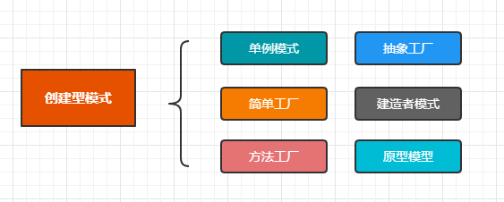

4.结æ„性模å¼:关注对象和类的组织

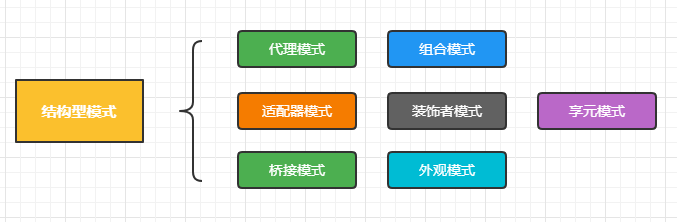

5.行为å‹æ¨¡å¼:关注系统中对象之间的相互交æ¢ï¼Œç ”究系统在è¿è¡Œæ—¶å¯¹è±¡ä¹‹é—´çš„相互通信和å作，进一步æ˜ç¡®å¯¹è±¡çš„èŒè´£ï¼Œå…±æœ‰11中模å¼

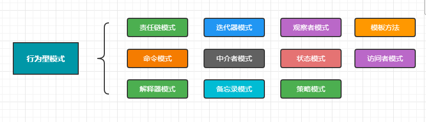


# 一ã€åˆ›å»ºå‹æ¨¡å¼


## 1.å•ä¾‹æ¨¡å¼

作用：å•ä¾‹æ¨¡å¼çš„核心是**ä¿è¯ä¸€ä¸ªç±»åªæœ‰ä¸€ä¸ªå®ä¾‹ï¼Œå¹¶ä¸”æ供一个访问å®ä¾‹çš„全局访问点。**

| å®ç°æ–¹å¼     | 优缺点                                  |
| ------------ | :-------------------------------------- |
| é¥¿æ±‰å¼       | 线程安全，调用效ç‡é«˜ ，但是ä¸èƒ½å»¶è¿ŸåŠ è½½ |
| æ‡’æ±‰å¼       | 线程安全，调用效ç‡ä¸é«˜ï¼Œèƒ½å»¶è¿ŸåŠ è½½      |
| åŒé‡æ£€æµ‹é”å¼ | 在懒汉å¼çš„基础上解决并å‘问题            |
| é™æ€å†…éƒ¨ç±»å¼ | 线程安全，资æºåˆ©ç”¨ç‡é«˜ï¼Œå¯ä»¥å»¶æ—¶åŠ è½½    |
| æšä¸¾å•ä¾‹     | 线程安全，调用效ç‡é«˜ï¼Œä½†æ˜¯ä¸èƒ½å»¶è¿ŸåŠ è½½  |

### 饿汉å¼

也就是类加载的时候立å³å®ä¾‹åŒ–对象，å®ç°çš„步骤是先ç§æœ‰åŒ–æ„造方法，对外æ供唯一的é™æ€å…¥å£æ–¹æ³•ï¼Œå®ç°å¦‚下

```java
/**
 * å•ä¾‹æ¨¡å¼ï¼šé¥¿æ±‰å¼
 *
 */
public class SingletonInstance1 {
	// 声æ˜æ­¤ç±»å‹çš„å˜é‡ï¼Œå¹¶å®ä¾‹åŒ–，当该类被加载的时候就完æˆäº†å®ä¾‹åŒ–并ä¿å­˜åœ¨äº†å†…存中
	private final static SingletonInstance1 instance = new SingletonInstance1();

	// ç§æœ‰åŒ–所有的æ„造方法,防止直æ¥é€šè¿‡new关键字å®ä¾‹åŒ–
	private SingletonInstance1(){}
	// 对外æ供一个è·å–å®ä¾‹çš„é™æ€æ–¹æ³•
	public static SingletonInstance1 getInstance(){
		return instance;
	}
}

```

饿汉å¼å•ä¾‹æ¨¡å¼ä»£ç ä¸­ï¼Œstaticå˜é‡ä¼šåœ¨ç±»è£…载时åˆå§‹åŒ–，此时也ä¸ä¼šæ¶‰åŠå¤šä¸ªçº¿ç¨‹å¯¹è±¡è®¿é—®è¯¥å¯¹è±¡çš„问题。虚拟机ä¿è¯åªä¼šè£…载一次该类，肯定ä¸ä¼šå‘生并å‘访问的问题。因此，å¯ä»¥çœç•¥synchronized关键字

问题：如æœåªæ˜¯åŠ è½½æœ¬ç±»ï¼Œè€Œä¸æ˜¯è¦è°ƒç”¨getInstance()，甚至永远没有调用，则会造æˆèµ„æºæµªè´¹ï¼

```java
/**
 * å•ä¾‹æ¨¡å¼ï¼šé¥¿æ±‰å¼
 *
 */
public class SingletonInstance1 {
    private byte[] b1 = new byte[1024*1024];
    private byte[] b2 = new byte[1024*1024];
    private byte[] b3 = new byte[1024*1024];
	// 声æ˜æ­¤ç±»å‹çš„å˜é‡ï¼Œå¹¶å®ä¾‹åŒ–，当该类被加载的时候就完æˆäº†å®ä¾‹åŒ–并ä¿å­˜åœ¨äº†å†…存中
	private final static SingletonInstance1 instance = new SingletonInstance1();

	// ç§æœ‰åŒ–所有的æ„造方法,防止直æ¥é€šè¿‡new关键字å®ä¾‹åŒ–
	private SingletonInstance1(){}
	// 对外æ供一个è·å–å®ä¾‹çš„é™æ€æ–¹æ³•
	public static SingletonInstance1 getInstance(){
		return instance;
	}
}
```

### 懒汉å¼

```java
/**
 * å•ä¾‹æ¨¡å¼ï¼šæ‡’汉å¼
 *
 */
public class SingletonInstance2 {
	// 声æ˜æ­¤ç±»å‹çš„å˜é‡,但没有å®ä¾‹åŒ–
	private static SingletonInstance2 instance = null;

	// ç§æœ‰åŒ–所有的æ„造方法,防止直æ¥é€šè¿‡new关键字å®ä¾‹åŒ–
	private SingletonInstance2(){}
	// 对外æ供一个è·å–å®ä¾‹çš„é™æ€æ–¹æ³•ï¼Œä¸ºäº†æ•°æ®å®‰å…¨æ·»åŠ synchronized关键字
	public static synchronized SingletonInstance2 getInstance(){
		if(instance == null){
			// 当instanceä¸ä¸ºç©ºçš„时候æ‰å®ä¾‹åŒ–
			instance = new SingletonInstance2();
		}
		return instance;
	}
}

```

  æ­¤ç§æ–¹å¼åœ¨ç±»åŠ è½½å如æœæˆ‘们一直没有调用getInstance方法，那么就ä¸ä¼šå®ä¾‹åŒ–对象。å®ç°äº†å»¶è¿ŸåŠ è½½ï¼Œä½†æ˜¯å› ä¸ºåœ¨æ–¹æ³•ä¸Šæ·»åŠ äº†synchronized关键字，æ¯æ¬¡è°ƒç”¨getInstance方法都会åŒæ­¥ï¼Œæ‰€ä»¥å¯¹æ€§èƒ½çš„å½±å“比较大。

### åŒé‡æ£€æµ‹é”

```java
/**
 * å•ä¾‹æ¨¡å¼ï¼šæ‡’汉å¼
 * åŒé‡æ£€æµ‹æœºåˆ¶
 *
 */
public class SingletonInstance3 {
	// 声æ˜æ­¤ç±»å‹çš„å˜é‡,但没有å®ä¾‹åŒ–
	private static volatile  SingletonInstance3 instance = null;

	// ç§æœ‰åŒ–所有的æ„造方法,防止直æ¥é€šè¿‡new关键字å®ä¾‹åŒ–
	private SingletonInstance3(){}
	// 对外æ供一个è·å–å®ä¾‹çš„é™æ€æ–¹æ³•ï¼Œ
	public static  SingletonInstance3 getInstance(){
		if(instance == null){
			synchronized(SingletonInstance3.class){
				if(instance == null){
                    // 1.分é…内存空间  2. 执行æ„造方法，å®ä¾‹åŒ–对象 3.把这个对象赋值给这个空间
                    // 如æœä¸åŠ volatile 会执行é‡æ’åº 1 3 2 
					instance = new SingletonInstance3();
				}
			}
		}
		return instance;
	}
}

```

ä¸åŠ volatile有指令é‡æ’åºçš„问题。添加åå¯ä»¥è§£å†³ã€‚

### é™æ€å†…部类

```java
/**
 * é™æ€å†…部类å®ç°æ–¹å¼
 *
 */
public class SingletonInstance4 {
	// é™æ€å†…部类
	public static class SingletonClassInstance{
		// 声æ˜å¤–部类å‹çš„é™æ€å¸¸é‡
		public static final SingletonInstance4 instance = new SingletonInstance4();
	}
	// ç§æœ‰åŒ–æ„造方法
	private SingletonInstance4(){}

	// 对外æ供的唯一è·å–å®ä¾‹çš„方法
	public static SingletonInstance4 getInstance(){
		return SingletonClassInstance.instance;
	}
}

```

### æšä¸¾å•ä¾‹

```java
/**
 * å•ä¾‹æ¨¡å¼ï¼šæšä¸¾æ–¹å¼å®ç°
 *
 */
public enum SingletonInstance5 {

	// 定义一个æšä¸¾å…ƒç´ ï¼Œåˆ™è¿™ä¸ªå…ƒç´ å°±ä»£è¡¨äº†SingletonInstance5çš„å®ä¾‹
	INSTANCE;

	public void singletonOperation(){
		// 功能处ç†
	}
}

```

## 2.æ€ä¹ˆè§£å†³å射爆破å•ä¾‹

  在å•ä¾‹ä¸­æˆ‘们定义的ç§æœ‰çš„æ„造器，但是我们知é“å射是å¯ä»¥æ“作ç§æœ‰çš„å±æ€§å’Œæ–¹æ³•çš„，这时我们应该æ€ä¹ˆå¤„ç†ï¼Ÿ

```java
public static void main(String[] args) throws Exception, IllegalAccessException {
	SingletonInstance1 s1 = SingletonInstance1.getInstance();
	// åå°„æ–¹å¼è·å–å®ä¾‹
	Class c1 = SingletonInstance1.class;
	Constructor constructor = c1.getDeclaredConstructor(null);
	constructor.setAccessible(true);
	SingletonInstance1 s2 = (SingletonInstance1)constructor.newInstance(null);
	System.out.println(s1);
	System.out.println(s2);
}

```

输出结æœ

```txt
com.dpb.single.SingletonInstance1@15db9742
com.dpb.single.SingletonInstance1@6d06d69c

```

产生了两个对象，和å•ä¾‹çš„设计åˆè¡·è¿èƒŒäº†ã€‚
解决的方å¼æ˜¯åœ¨æ— å‚æ„造方法中手动抛出异常æ§åˆ¶,或者声æ˜ä¸€ä¸ªå…¨å±€å˜é‡æ¥æ§åˆ¶ã€‚

```java
// ç§æœ‰åŒ–所有的æ„造方法,防止直æ¥é€šè¿‡new关键字å®ä¾‹åŒ–
private SingletonInstance2(){
	if(instance != null){
		// åªèƒ½æœ‰ä¸€ä¸ªå®ä¾‹å­˜åœ¨ï¼Œå¦‚æœå†æ¬¡è°ƒç”¨è¯¥æ„造方法就抛出异常，防止åå°„æ–¹å¼å®ä¾‹åŒ–
		throw new RuntimeException("å•ä¾‹æ¨¡å¼åªèƒ½åˆ›å»ºä¸€ä¸ªå¯¹è±¡");
	}
}

```

上é¢è¿™ç§æ–¹å¼æˆ‘们还å¯ä»¥é€šè¿‡ååºåˆ—化的方å¼æ¥ç ´è§£

```java
public static void main(String[] args) throws Exception, IllegalAccessException {
	SingletonInstance2 s1 = SingletonInstance2.getInstance();
	// å°†å®ä¾‹å¯¹è±¡åºåˆ—化到文件中
	ObjectOutputStream oos = new ObjectOutputStream(
			new FileOutputStream("c:/tools/a.txt"));
	oos.writeObject(s1);
	oos.flush();
	oos.close();
	// å°†å®ä¾‹ä»æ–‡ä»¶ä¸­ååºåˆ—化出æ¥
	ObjectInputStream ois = new ObjectInputStream(
			new FileInputStream("c:/tools/a.txt"));
	SingletonInstance2 s2 = (SingletonInstance2) ois.readObject();
	ois.close();
	System.out.println(s1);
	System.out.println(s2);
}

```

我们åªéœ€è¦åœ¨å•ä¾‹ç±»ä¸­é‡å†™readResolve方法并在该方法中返å›å•ä¾‹å¯¹è±¡å³å¯ï¼Œå¦‚下:

```java
package com.dpb.single;

import java.io.ObjectStreamException;
import java.io.Serializable;

/**
 * å•ä¾‹æ¨¡å¼ï¼šæ‡’汉å¼
 *
 */
public class SingletonInstance2 implements Serializable{

	// 声æ˜æ­¤ç±»å‹çš„å˜é‡,但没有å®ä¾‹åŒ–
	private static SingletonInstance2 instance = null;

	// ç§æœ‰åŒ–所有的æ„造方法,防止直æ¥é€šè¿‡new关键字å®ä¾‹åŒ–
	private SingletonInstance2(){
		if(instance != null){
			// åªèƒ½æœ‰ä¸€ä¸ªå®ä¾‹å­˜åœ¨ï¼Œå¦‚æœå†æ¬¡è°ƒç”¨è¯¥æ„造方法就抛出异常，防止åå°„æ–¹å¼å®ä¾‹åŒ–
			throw new RuntimeException("å•ä¾‹æ¨¡å¼åªèƒ½åˆ›å»ºä¸€ä¸ªå¯¹è±¡");
		}
	}
	// 对外æ供一个è·å–å®ä¾‹çš„é™æ€æ–¹æ³•ï¼Œä¸ºäº†æ•°æ®å®‰å…¨æ·»åŠ synchronized关键字
	public static synchronized SingletonInstance2 getInstance(){
		if(instance == null){
			// 当instanceä¸ä¸ºç©ºçš„时候æ‰å®ä¾‹åŒ–
			instance = new SingletonInstance2();
		}
		return instance;
	}
	// é‡å†™è¯¥æ–¹æ³•ï¼Œé˜²æ­¢åºåˆ—化和ååºåˆ—化è·å–å®ä¾‹
	private Object readResolve() throws ObjectStreamException{
		return instance;
	}
}

```

说æ˜:readResolve方法是基äºå›è°ƒçš„，ååºåˆ—化时，如æœå®šä¹‰äº†readResolve()则直æ¥è¿”å›æ­¤æ–¹æ³•æŒ‡å®šçš„对象，而ä¸éœ€è¦åœ¨åˆ›å»ºæ–°çš„对象ï¼

## 3.说说你在哪些框æ¶ä¸­çœ‹åˆ°äº†å•ä¾‹çš„设计

1.Spring中的Bean对象，默认是å•ä¾‹æ¨¡å¼

2.相关的工å‚对象都是å•ä¾‹ï¼Œæ¯”如：MyBatis中的SqlSessionFactory，Spring中的BeanFactory

3.ä¿å­˜ç›¸å…³é…置信æ¯çš„都是å•ä¾‹ï¼Œæ¯”如：MyBatis中的Configuration对象，SpringBoot中的å„个XXXAutoConfiguration对象等

4.应用程åºçš„日志应用，一般都会通过å•ä¾‹æ¥å®ç°

5.æ•°æ®åº“è¿æ¥æ± çš„设计也是å•ä¾‹æ¨¡å¼

## 4.å·¥å‚模å¼

  å·¥å‚模å¼çš„作用是帮助我们创建对象，我们ä¸ç”¨è‡ªå·±æ¥åˆ›å»ºï¼Œæ ¹æ®éœ€è¦åˆ›å»ºçš„对象的å¤æ‚度我们å¯ä»¥æŠŠå·¥å‚模å¼åˆ†ä¸ºç®€å•å·¥å‚，工å‚方法和抽象工å‚。

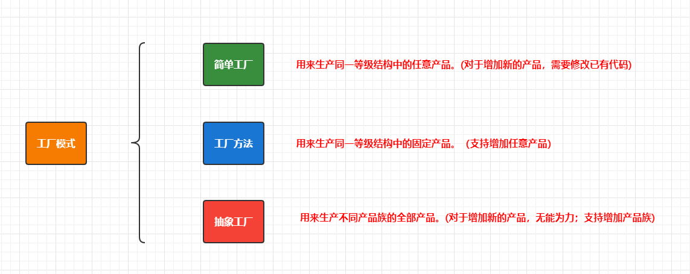

### 4.1 简å•å·¥å‚

  简å•å·¥å‚模å¼åˆç§°ä¸ºé™æ€å·¥å‚方法，他å¯ä»¥æ ¹æ®ä¸åŒçš„å‚数而返å›ä¸åŒçš„å®ä¾‹ï¼Œç®€å•å·¥å‚模å¼ä¸“门定义一个类æ¥è´Ÿè´£åˆ›å»ºå…¶ä»–类的å®ä¾‹ï¼Œè¢«åˆ›å»ºçš„å®ä¾‹é€šå¸¸éƒ½å…·æœ‰å…±åŒçš„父类。

JDK中的简å•å·¥å‚应用：DataFormat

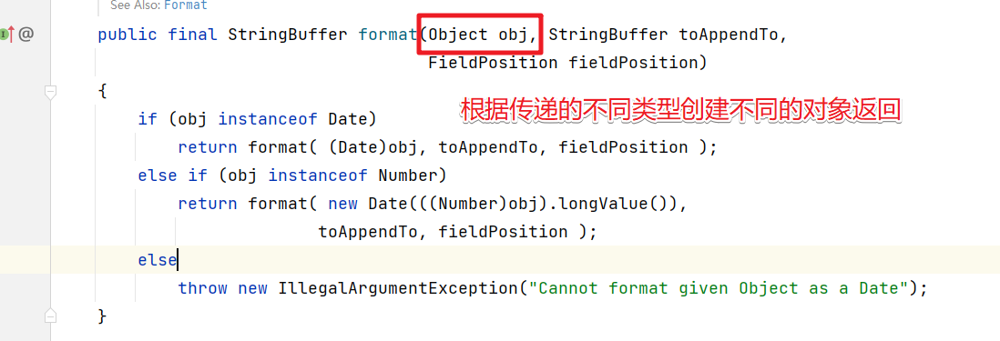

自己写一个简å•å·¥å‚的案例


```java
/**
 * 简å•å·¥å‚
 */
public class SimpleFactory {

    public static void main(String[] args) {
        // æ ¹æ®å¯¹åº”çš„ç±»å‹è¿”å›ç›¸å…³äº§å“
        CarFactory.createCar("奥迪").run();
        CarFactory.createCar("Byd").run();
    }
}

// 定义公共的æ¥å£
interface Car{
    void run();
}

class Audi implements Car{
    @Override
    public void run() {
        System.out.println("奥迪在跑...");
    }
}

class Byd implements Car{
    @Override
    public void run() {
        System.out.println("Byd在跑...");
    }
}

// 创建对应的简å•å·¥å‚ç±»
class CarFactory{
    public static Car createCar(String type){
        if("奥迪".equals(type)){
            return new Audi();
        }else if("Byd".equals(type)){
            return new Byd();
        }else{
            throw new RuntimeException("该产å“ä¸èƒ½ç”Ÿäº§");
        }
    }
}
```

我们å¯ä»¥å‘ç°ç®€å•å·¥å‚对äºæ–°å¢äº§å“是无能为力的ï¼ä¸ä¿®æ”¹åŸæœ‰ä»£ç æ ¹æœ¬å°±æ²¡åŠæ³•æ‰©å±•!!!

### 4.2 å·¥å‚方法

  针对äºç®€å•å·¥å‚的短æ¿ï¼Œå¼•å‡ºäº†å·¥å‚方法模å¼ï¼Œå®šä¹‰ä¸€ä¸ªç”¨æˆ·åˆ›å»ºå¯¹è±¡çš„æ¥å£ï¼Œè®©å­ç±»å†³å®šå®ä¾‹åŒ–哪个类，工å‚方法使一个类的å®ä¾‹åŒ–延迟到了其å­ç±»ä¸­ã€‚

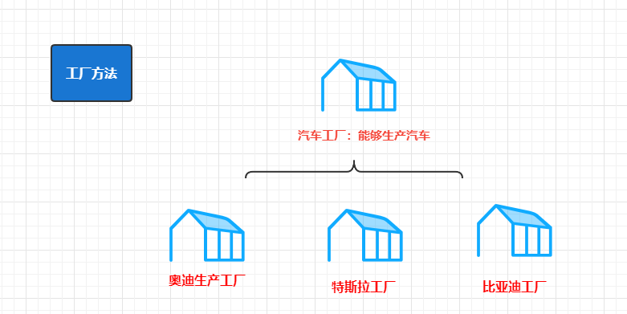

代ç å®ç°ï¼š

```java
/**
 * å·¥å‚方法模å¼
 */
public class FactoryMethod {

    public static void main(String[] args) {
        new AudiCarFactory().createCar().run();
        new BydCarFactory().createCar().run();
    }


    public static interface  Car{
        public void run();
    }

    public static class Byd implements Car{
        @Override
        public void run() {
            System.out.println("比亚迪...");
        }
    }

    public static class Audi implements Car{
        @Override
        public void run() {
            System.out.println("奥迪...");
        }
    }

    public static interface CarFactory{
        public Car createCar();
    }

    // 扩展的工å‚
    public static class AudiCarFactory implements CarFactory{
        @Override
        public Car createCar() {
            return new Audi();
        }
    }

    public static class BydCarFactory implements CarFactory{
        @Override
        public Car createCar() {
            return new Byd();
        }
    }
}
```

简å•å·¥å‚和工å‚方法模å¼çš„对比

1. 简å•å·¥å‚åªæœ‰ä¸€ä¸ªå·¥å‚，而工å‚方法有多个工å‚
2. 简å•å·¥å‚ä¸æ”¯æŒæ‰©å±•ï¼Œè€Œå·¥å‚方法支æŒæ‰©å±•ï¼Œæ‰©å±•çš„æ–¹å¼å°±æ˜¯æ·»åŠ å¯¹åº”çš„å·¥å‚ç±»å³å¯
3. 简å•å·¥å‚代ç å¤æ‚度ä½ï¼Œå·¥å‚方法代ç å¤æ‚度高
4. ...

### 4.3 抽象工å‚

  上é¢çš„两ç§æ–¹å¼å®ç°çš„å·¥å‚都是生产åŒä¸€å¤§ç±»çš„产å“，如æœè¦å®ç°ç”Ÿäº§ä¸åŒç±»å‹çš„产å“这时我们就å¯ä»¥ç”¨æŠ½è±¡å·¥å‚模å¼æ¥å®ç°ã€‚

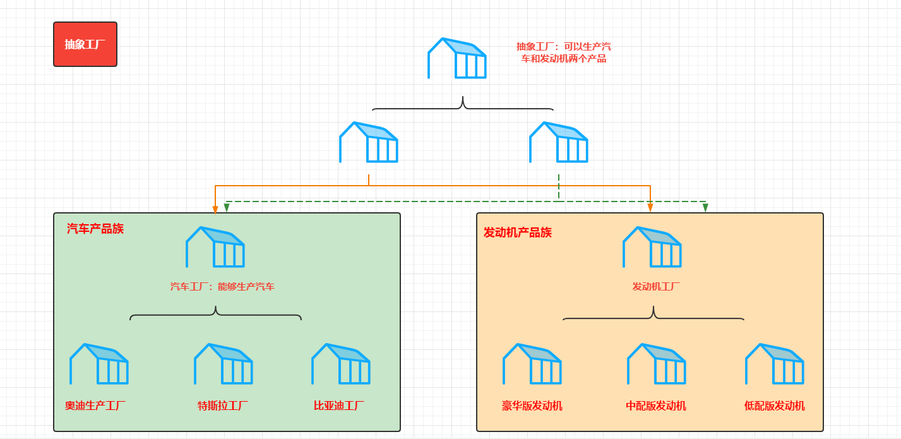

代ç å®ç°ï¼š

```java
/**
 * 抽象工å‚：多个产å“æ—
 */
public class AbstractFactory {

    public static void main(String[] args) {
        Car car = new LuxuryEngineCarFacory().createCar();
        Engine engine = new LuxuryEngineCarFacory().createEngine();
        car.run();
        engine.run();
    }

    // 抽象工å‚
    public static interface AbstarctComponentFactory{
        Car createCar();
        Engine createEngine();
    }

    public static class LuxuryEngineCarFacory implements AbstarctComponentFactory{
        @Override
        public Engine createEngine() {
            return new LuxuryEngineFactory().createEngine();
        }

        @Override
        public Car createCar() {
            return new BydCarFactory().createCar();
        }
    }

    public static class LowEngineCarFacory implements AbstarctComponentFactory{
        @Override
        public Car createCar() {
            return new AudiCarFactory().createCar();
        }

        @Override
        public Engine createEngine() {
            return new LowEngineFactory().createEngine();
        }
    }

    // 汽车产å“æ—
    public static interface  Car{
        public void run();
    }

    public static class Byd implements Car {
        @Override
        public void run() {
            System.out.println("比亚迪...");
        }
    }

    public static class Audi implements Car {
        @Override
        public void run() {
            System.out.println("奥迪...");
        }
    }

    public static interface CarFactory{
        public Car createCar();
    }

    // 扩展的工å‚
    public static class AudiCarFactory implements CarFactory {
        @Override
        public Car createCar() {
            return new Audi();
        }
    }

    public static class BydCarFactory implements  CarFactory{
        @Override
        public Car createCar() {
            return new Byd();
        }
    }

    // å‘动机产å“æ—
    public static interface Engine{
        public void run();
    }

    public static class LuxuryEngine implements Engine{
        @Override
        public void run() {
            System.out.println("豪å版å‘动机...");
        }
    }

    public static class LowEngine implements Engine{
        @Override
        public void run() {
            System.out.println("ä½é…版å‘动机...");
        }
    }

    public static interface EngineFactory{
        public Engine createEngine();
    }

    public static class LuxuryEngineFactory implements EngineFactory{
        @Override
        public Engine createEngine() {
            return new LuxuryEngine();
        }
    }

    public static class LowEngineFactory implements EngineFactory{
        @Override
        public Engine createEngine() {
            return new LowEngine();
        }
    }
}

```

三者的对比：

1. 简å•å·¥å‚模å¼(é™æ€å·¥å‚模å¼) ：虽然æŸç§ç¨‹åº¦ä¸ç¬¦åˆè®¾è®¡åŸåˆ™ï¼Œä½†å®é™…使用最多。
2. å·¥å‚方法模å¼ï¼šä¸ä¿®æ”¹å·²æœ‰ç±»çš„å‰æ下，通过å¢åŠ æ–°çš„å·¥å‚ç±»å®ç°æ‰©å±•ã€‚
3. 抽象工å‚模å¼ï¼šä¸å¯ä»¥å¢åŠ äº§å“，å¯ä»¥å¢åŠ äº§å“æ—ï¼

## 5.建造者模å¼

  å®é™…å¼€å‘中，我们所需è¦çš„对象æ„建时é常å¤æ‚，且有很多步骤需è¦å¤„ç†æ—¶ï¼Œè¿™æ—¶å»ºé€ è€…模å¼å°±å¾ˆé€‚åˆã€‚比如MyBatis中的SqlSessionFactory对象的创建，我们ä¸å…‰è¦åˆ›å»ºSqlSessionFactory本身的对象，还有完æˆMyBatis的全局é…置文件和映射文件的加载解ææ“作，之å把解æ出æ¥çš„ä¿¡æ¯ç»‘定在SqlSessionFactory对象中，

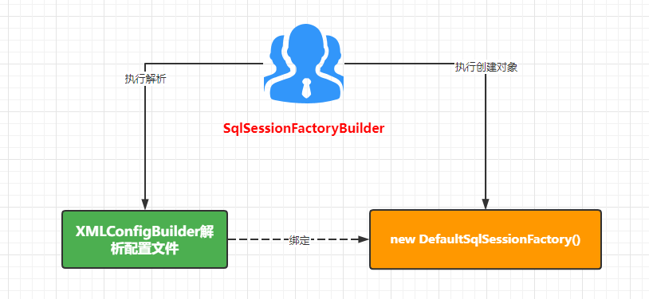

ç›´æ¥å‚考MyBatis的代ç å³å¯

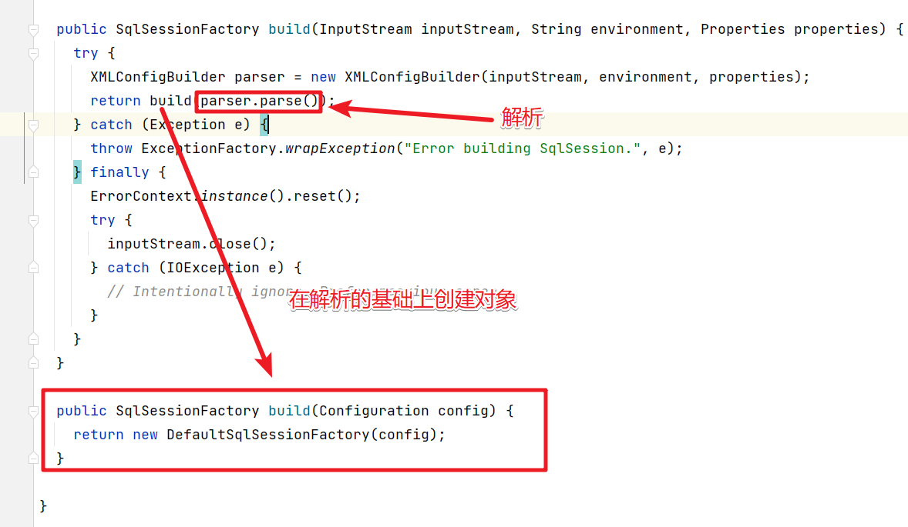

所以建造者模å¼çš„作用就是帮助我们解决了å¤æ‚对象的创建


建造者模å¼å’Œå·¥å‚模å¼çš„区别：

* 关注的维度是ä¸ä¸€æ ·çš„
* å·¥å‚模å¼åˆ›å»ºå¯¹è±¡ new 出æ¥
* 建造者模å¼å…³æ³¨çš„是对象创建的本身


## 6.åŸå‹æ¨¡å¼

  在java中我们知é“通过new关键字创建的对象是é常ç¹ççš„(类加载判断，内存分é…，åˆå§‹åŒ–ç­‰)，在我们需è¦å¤§é‡å¯¹è±¡çš„情况下，åŸå‹æ¨¡å¼å°±æ˜¯æˆ‘们å¯ä»¥è€ƒè™‘å®ç°çš„æ–¹å¼ã€‚
  åŸå‹æ¨¡å¼æˆ‘们也称为克隆模å¼ï¼Œå³ä¸€ä¸ªæŸä¸ªå¯¹è±¡ä¸ºåŸå‹å…‹éš†å‡ºæ¥ä¸€ä¸ªä¸€æ¨¡ä¸€æ ·çš„对象，该对象的å±æ€§å’ŒåŸå‹å¯¹è±¡ä¸€æ¨¡ä¸€æ ·ã€‚而且对äºåŸå‹å¯¹è±¡æ²¡æœ‰ä»»ä½•å½±å“。åŸå‹æ¨¡å¼çš„克隆方å¼æœ‰ä¸¤ç§ï¼šæµ…克隆和深度克隆.

| åŸå‹æ¨¡å¼ | è¯´æ˜                                                         |
| -------- | :----------------------------------------------------------- |
| 浅克隆   | åªæ˜¯æ‹·è´æœ¬å¯¹è±¡,其对象内部的数组ã€å¼•ç”¨å¯¹è±¡ç­‰éƒ½ä¸æ‹·è´ï¼Œ``还是指å‘åŸç”Ÿå¯¹è±¡çš„å†…éƒ¨å…ƒç´ åœ°å€ |
| 深度克隆 | æ·±å¤åˆ¶æŠŠè¦å¤åˆ¶çš„对象所引用的对象都å¤åˆ¶äº†ä¸€é                 |

### 6.1 浅克隆

  被å¤åˆ¶å¯¹è±¡çš„所有å˜é‡éƒ½å«æœ‰ä¸åŸæ¥çš„对象相åŒçš„值，而所有的对其他对象的引用ä»ç„¶æŒ‡å‘åŸæ¥çš„对象。æ¢è¨€ä¹‹ï¼Œæµ…å¤åˆ¶ä»…ä»…å¤åˆ¶æ‰€è€ƒè™‘的对象，而ä¸å¤åˆ¶å®ƒæ‰€å¼•ç”¨çš„对象。 Objectç±»æ供的方法clone=åªæ˜¯æ‹·è´æœ¬å¯¹è±¡= ， =其对象内部的数组ã€å¼•ç”¨å¯¹è±¡ç­‰éƒ½ä¸æ‹·è´= ，还是指å‘åŸç”Ÿå¯¹è±¡çš„内部元素地å€.

  被克隆的对象必须Cloneable,Serializable这两个æ¥å£;

```java
package com.bobo.prototype;

import java.io.Serializable;
import java.util.Date;

public class User implements Cloneable, Serializable {

    private String name;

    private Date birth;

    private int age;

    /**
     * å®ç°å…‹éš†çš„方法
     * @return
     * @throws CloneNotSupportedException
     */
    @Override
    protected Object clone() throws CloneNotSupportedException {
        return super.clone();
    }

    public String getName() {
        return name;
    }

    public void setName(String name) {
        this.name = name;
    }

    public Date getBirth() {
        return birth;
    }

    public void setBirth(Date birth) {
        this.birth = birth;
    }

    public int getAge() {
        return age;
    }

    public void setAge(int age) {
        this.age = age;
    }

    public static void main(String[] args) throws Exception {
        // 创建一个普通对象
        Date date =  new Date(666666);
        User user = new User();
        user.setName("波波烤鸭");
        user.setAge(18);
        user.setBirth(date);
        System.out.println("åŸå‹å¯¹è±¡çš„å±æ€§ï¼š" + user);
        // 克隆对象
        User cloneUser = (User) user.clone();
        System.out.println("克隆的对象的å±æ€§ï¼š" + cloneUser);
        // 修改åŸå‹å¯¹è±¡çš„å±æ€§
        date.setTime(12345677);
        // 修改克隆对象的å±æ€§
        cloneUser.setName("波哥");
        System.out.println("åŸå‹å¯¹è±¡çš„å±æ€§ï¼š" + user);
        System.out.println("克隆的对象的å±æ€§ï¼š" + cloneUser);
    }

    @Override
    public String toString() {
        return "User{" +
                "name='" + name + '\'' +
                ", birth=" + birth +
                ", age=" + age +
                '}';
    }
}

```

输出结æœ

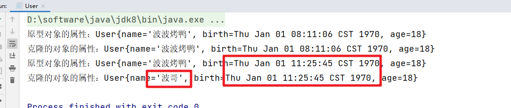

浅克隆的问题:虽然产生了两个完全ä¸åŒçš„对象，但是被å¤åˆ¶çš„对象的所有å˜é‡éƒ½å«æœ‰ä¸åŸæ¥çš„对象相åŒçš„值，而所有的对其他对象的引用都ä»ç„¶æŒ‡å‘åŸæ¥çš„对象。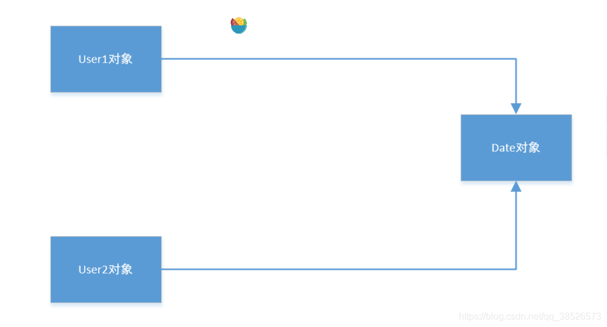

### 6.2 深度克隆

  被å¤åˆ¶å¯¹è±¡çš„所有å˜é‡éƒ½å«æœ‰ä¸åŸæ¥çš„对象相åŒçš„值，除å»é‚£äº›å¼•ç”¨å…¶ä»–对象的å˜é‡ã€‚那些引用其他对象的å˜é‡å°†æŒ‡å‘被å¤åˆ¶è¿‡çš„新对象，而ä¸å†æ˜¯åŸæœ‰çš„那些被引用的对象。æ¢è¨€ä¹‹ï¼Œæ·±å¤åˆ¶æŠŠè¦å¤åˆ¶çš„对象所引用的对象都å¤åˆ¶äº†ä¸€é。
å®ç°çš„效æœæ˜¯:

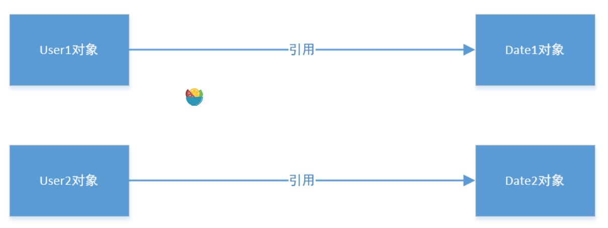

深度克隆(deep clone)有两ç§å®ç°æ–¹å¼ï¼Œç¬¬ä¸€ç§æ˜¯åœ¨æµ…克隆的基础上å®ç°ï¼Œç¬¬äºŒç§æ˜¯é€šè¿‡åºåˆ—化和ååºåˆ—化å®ç°ï¼Œæˆ‘们分别æ¥ä»‹ç»

æ–¹å¼ä¸€ï¼šåœ¨æµ…克隆的基础上å®ç°

```java
    /**
     * å®ç°å…‹éš†çš„方法
     * @return
     * @throws CloneNotSupportedException
     */
    @Override
    protected Object clone() throws CloneNotSupportedException {
        User user = (User) super.clone();
        // å®ç°æ·±åº¦å…‹éš†
        user.birth = (Date) this.birth.clone();
        return user;
    }
```

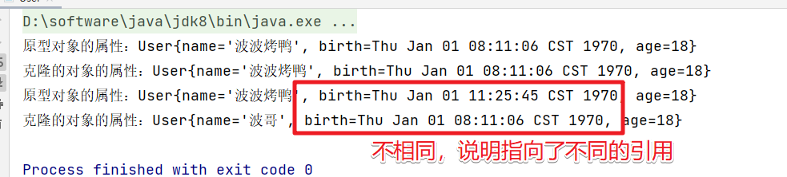

æ–¹å¼äºŒï¼šåºåˆ—化和ååºåˆ—化

| å称     | è¯´æ˜                         |
| -------- | :--------------------------- |
| åºåˆ—化   | 把对象转æ¢ä¸ºå­—节åºåˆ—的过程。 |
| ååºåˆ—化 | 把字节åºåˆ—æ¢å¤ä¸ºå¯¹è±¡çš„过程。 |

```java
public static void main(String[] args) throws CloneNotSupportedException, Exception {
	Date date =  new Date(1231231231231l);
	User user = new User();
	user.setName("波波烤鸭");
	user.setAge(18);
	user.setBirth(date);
	System.out.println("-----åŸå‹å¯¹è±¡çš„å±æ€§------");
	System.out.println(user);

	//使用åºåˆ—化和ååºåˆ—化å®ç°æ·±å¤åˆ¶
	ByteArrayOutputStream bos = new ByteArrayOutputStream();
	ObjectOutputStream    oos = new ObjectOutputStream(bos);
	oos.writeObject(user);
	byte[] bytes = bos.toByteArray();

	ByteArrayInputStream  bis = new ByteArrayInputStream(bytes);
	ObjectInputStream	  ois = new ObjectInputStream(bis);

	//克隆好的对象ï¼
	User user1 = (User) ois.readObject();   

	// 修改åŸå‹å¯¹è±¡çš„值
	date.setTime(221321321321321l);
	System.out.println(user.getBirth());

	System.out.println("------克隆对象的å±æ€§-------");
	System.out.println(user1);
}

```


## 7.谈谈你对创建å‹æ¨¡å¼çš„ç†è§£

  Javaçš„23ç§è®¾è®¡æ¨¡å¼åˆ†ä¸º3类，分别是

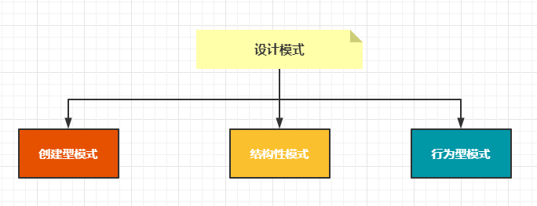

而创建å‹æ¨¡å¼ä¸­æœ‰åŒ…å«çš„如下的相关模å¼ï¼š

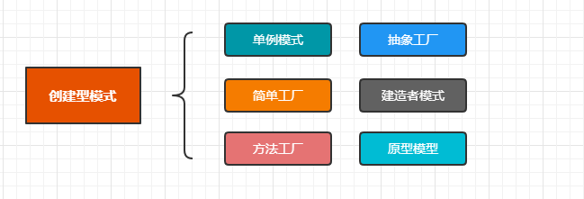

而æ¯ä¸ªè®¾è®¡æ¨¡å¼çš„作用如下：

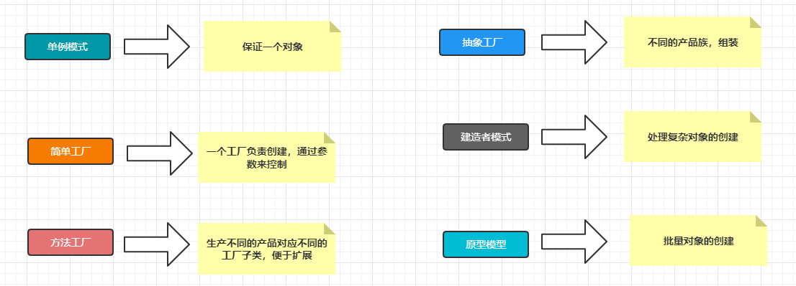


# 二ã€ç»“æ„性模å¼


## 1.代ç†æ¨¡å¼

### 1.1 代ç†æ¨¡å¼çš„作用

  代ç†æ¨¡å¼çš„作用是通过代ç†å¯¹è±¡æ¥å¢å¼ºç›®æ ‡å¯¹è±¡çš„功能。利用的是AOP横切的æ€æƒ³ã€‚

### 1.2 代ç†æ¨¡å¼çš„å®ç°æ–¹å¼

  代ç†æ¨¡å¼çš„å®ç°æ–¹å¼æœ‰ä¸‰ç§ï¼šé™æ€ä»£ç†ï¼ŒåŠ¨æ€ä»£ç†(JDK动æ€ä»£ç†å’ŒCGLIB动æ€ä»£ç†)


#### 1.2.1 é™æ€ä»£ç†

我们先声æ˜æ¥å£å’Œç›®æ ‡å®ç°ç±»

```java
/**
 * 定义公共æ¥å£
 */
public interface SomeService {
    String doSome();
}
```

目标类

```java
/**
 * 目标对象 target
 */
public class SomeServiceImpl implements SomeService {
    @Override
    public String doSome() {
        System.out.println("目标对象：doSome()" );
        return "hello ...";
    }
}
```

然å创建对应的代ç†ç±»

```java
/**
 * 代ç†ç±»
 *     å¢å¼ºå®ç°ç±»
 *     å’Œå®ç°ç±»å®ç°åŒä¸€ä¸ªæ¥å£
 */
public class SomeProxy implements SomeService{

    private SomeService target;

    public SomeProxy(SomeService target){
        this.target = target;
    }

    /**
     * å¢å¼ºçš„方法
     * @return
     */
    @Override
    public String doSome() {
        System.out.println("目标方法执行之å‰...");
        String s = target.doSome();
        System.out.println("目标方法执行之å...");
        return s.toUpperCase();
    }
}
```

然å测试å®ç°

```java
public class MainTest {
    public static void main(String[] args) {
        SomeService some = new SomeServiceImpl();
        SomeProxy proxy = new SomeProxy(some);
        System.out.println(proxy.doSome());
    }
}
```

对应的输出结æœ

```java
目标方法执行之å‰...
目标对象：doSome()
目标方法执行之å...
HELLO ...
```

å¯ä»¥çœ‹åˆ°ä»£ç†å¯¹è±¡å®ç°äº†ç›®æ ‡å¯¹è±¡çš„调用，åŒæ—¶å¢å¼ºäº†ç›®æ ‡å¯¹è±¡çš„功能。

#### 1.2.2 JDK动æ€ä»£ç†

  上é¢çš„é™æ€ä»£ç†æˆ‘们需è¦æ‰‹åŠ¨çš„创建一个对应的代ç†æ¥å®ç°ï¼Œä¸æ˜¯å¤ªçµæ´»ï¼Œé’ˆå¯¹ç›®æ ‡å¯¹è±¡æœ‰å®ç°ç›¸å…³æ¥å£çš„情况，我们å¯ä»¥ä½¿ç”¨JDK动æ€ä»£ç†ã€‚

```java
public class JdkDynamicProxy {

    /**
     * JDK动æ€ä»£ç†ï¼šç›®æ ‡å¯¹è±¡å¿…é¡»å®ç°ç›¸å…³çš„æ¥å£
     * @param args
     */
    public static void main(String[] args) {
        SomeService target = new SomeServiceImpl();
        SomeService proxy = (SomeService) Proxy.newProxyInstance(JdkDynamicProxy.class.getClassLoader(), // 类加载器
                target.getClass().getInterfaces() // 目标对象å®ç°çš„相关æ¥å£
                , new InvocationHandler() { // 代ç†å¯¹è±¡çš„å›è°ƒæ–¹æ³•
                    @Override
                    public Object invoke(Object proxy, Method method, Object[] args) throws Throwable {
                        System.out.println("before...");
                        Object invoke = method.invoke(target, args);
                        System.out.println("end...");
                        if (invoke != null) {
                            return invoke.toString().toUpperCase();
                        }
                        return null;
                    }
                });
        // 通过代ç†å¯¹è±¡æ¥æ‰§è¡Œ
        System.out.println("proxy.doSome() = " + proxy.doSome());

    }
}
```

输出结æ„

```
before...
目标对象：doSome()
end...
proxy.doSome() = HELLO ...
```

#### 1.2.3 CGLIB动æ€ä»£ç†

  如æœç›®æ ‡å¯¹è±¡å®ç°äº†å¯¹åº”çš„æ¥å£æˆ‘们å¯ä»¥é€šè¿‡JDK动æ€ä»£ç†çš„æ–¹å¼æ¥å®ç°ï¼Œä½†å¦‚æœç›®æ ‡å¯¹è±¡æ²¡æœ‰å®ç°ä»»ä½•çš„æ¥å£ï¼Œè¿™æ—¶æˆ‘们åªèƒ½é€šè¿‡CGLIB动æ€ä»£ç†æ¥å®ç°äº†ï¼Œè¿™æ—¶æˆ‘们需è¦å•ç‹¬å¼•å…¥cglibçš„ä¾èµ–

```java
public class CGLIBDynamicProxy {

    /**
     * CGLIB动æ€ä»£ç†
     * @param args
     */
    public static void main(String[] args) {
        SomeService target = new SomeServiceImpl();
        SomeServiceImpl proxy = new MethodInterceptor() {

            /**
             * 创建 CGLIB 代ç†å¯¹è±¡çš„方法
             * @return
             */
            public SomeServiceImpl createProxy() {
                // 创建å¢å¼ºå™¨
                Enhancer e = new Enhancer();
                // 指定父类
                e.setSuperclass(target.getClass());
                // 指定å›è°ƒæ¥å£å¯¹è±¡
                e.setCallback(this);
                // 创建CGLIB代ç†å¯¹è±¡
                return (SomeServiceImpl) e.create();
            }

            /**
             * 拦截å›è°ƒçš„方法
             */
            @Override
            public Object intercept(Object o, Method method, Object[] objects, MethodProxy methodProxy) throws Throwable {
                System.out.println("cglib -- befor" );
                Object res = method.invoke(target, args);
                System.out.println("cglib -- end");
                return res.toString().toUpperCase();
            }
        }.createProxy();
        System.out.println("proxy.doSome() = " + proxy.doSome());
    }
}
```

输出的结æœ

```
cglib -- befor
目标对象：doSome()
cglib -- end
proxy.doSome() = HELLO ...
```

## 2.适é…器模å¼

### 2.1 适é…器的作用

  适é…器模å¼çš„作用是把两个ä¸å…¼å®¹çš„对象通过适é…器能够è¿æ¥èµ·æ¥å·¥ä½œã€‚

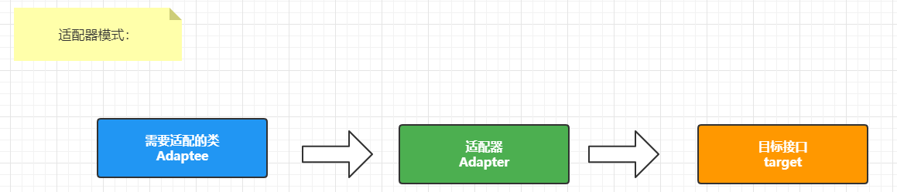

### 2.2 具体案例分æ

  以MyBatis中的日志模å—为例æ¥ä»‹ç»ã€‚常è§çš„日志框æ¶æœ‰log4j,log4j2,slf4j,logbak等，但是æ¯ç§æ—¥å¿—框æ¶ä¸­çš„日志级别都有差异。

log4j2çš„æ¥å£ï¼š

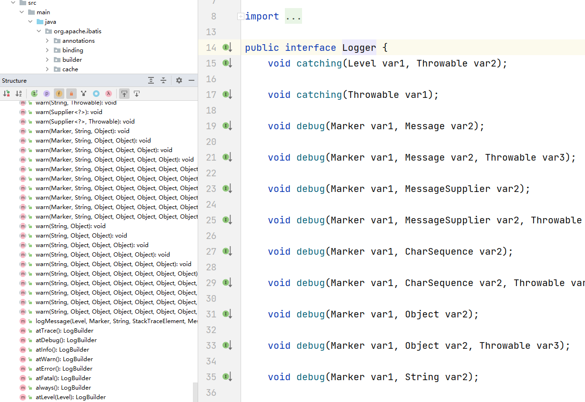

slf4jçš„æ¥å£

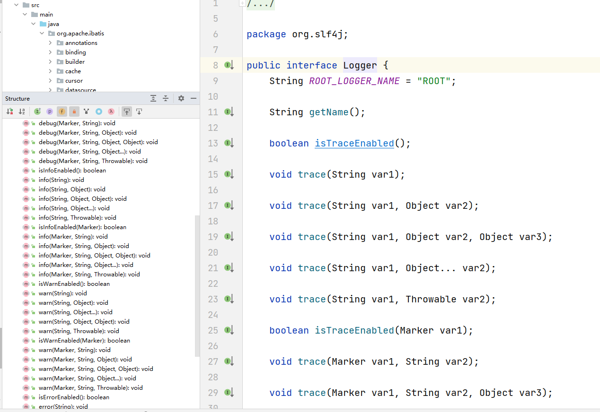

也就是å¯ä»¥çœ‹åˆ°ä¸åŒçš„日志框æ¶é‡Œé¢æ‰€å®šä¹‰çš„日志级别和对应的方法都有区别，那么我们的框æ¶æ€ä¹ˆæ¥ç»Ÿä¸€ä½¿ç”¨è¿™äº›æ—¥å¿—框æ¶å‘¢ï¼Ÿåœ¨MyBatis中通过定义了一个日志æ¥å£ï¼Œå®šä¹‰äº†æ—¥å¿—具有的级别和方法。

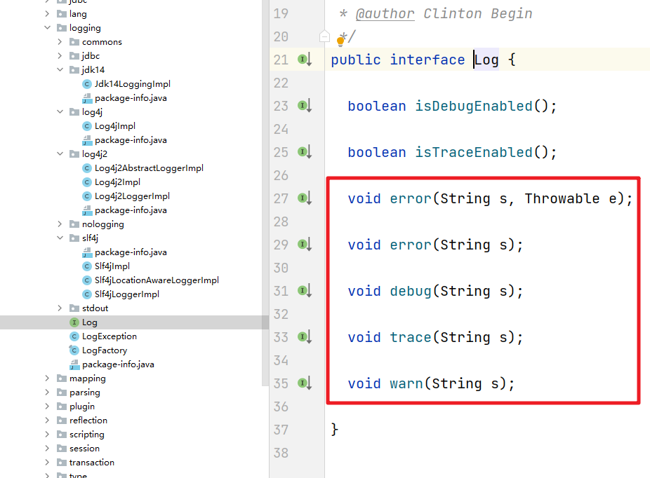

那这时候我们就å‘ç°å…·ä½“的日志框æ¶å’Œè¿™ä¸ªæ¥å£å…¶å®æ˜¯æ²¡æœ‰åŠæ³•ç›´æ¥æ¥ä½¿ç”¨çš„。

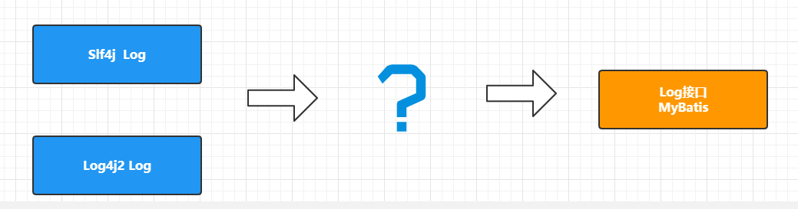

这时我们就需è¦é€šè¿‡å¯¹åº”的适é…器æ¥å¤„ç†è¿™ç§æƒ…况，以Slf4J为例。

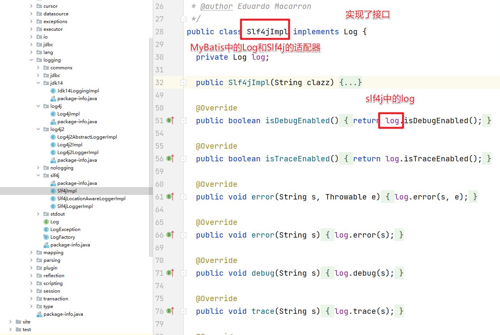

## 3.装饰者模å¼

### 3.1 装饰者模å¼çš„作用

  装饰者模å¼åˆç§°ä¸ºåŒ…装模å¼([Wrapper](https://so.csdn.net/so/search?q=Wrapper&spm=1001.2101.3001.7020)),作用是用æ¥åŠ¨æ€çš„为一个对象å¢åŠ æ–°çš„功能。装饰模å¼æ˜¯ä¸€ç§ç”¨äºä»£æ›¿ç»§æ‰¿çš„技术， 无须通过继承å¢åŠ å­ç±»å°±èƒ½æ‰©å±•å¯¹è±¡çš„新功能 。使用对象的关è”关系代替继承关系，更加çµæ´»ï¼ŒåŒæ—¶é¿å…ç±»å‹ä½“系的快速膨胀。

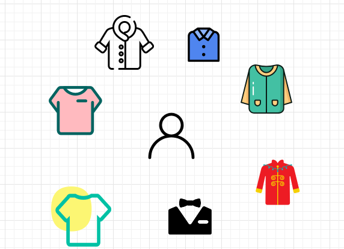

### 3.2 装饰者模å¼çš„应用

  装饰者模å¼çš„应用场景还是é常多的，比如

* IOæµä¸­çš„FileInputStream，FileOutputStreamç­‰
* Spring中的å„ç§Wrapper
* MyBatis中的缓存设计

我们以MyBatis中的缓存å®ä¾‹ä¸ºä¾‹æ¥çœ‹çœ‹å…¶å…·ä½“çš„å®ç°ã€‚

首先是Cacheæ¥å£

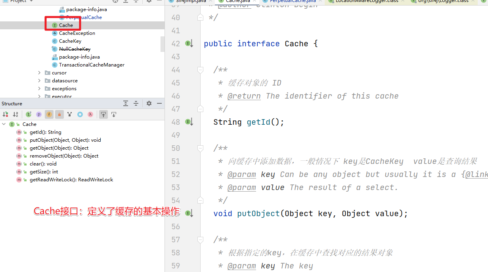

然å是PerpetualCacheå®ç°ï¼šä»…ä»…å®ç°äº†æ•°æ®åŸºäºå†…存的读写æ“作。功能å•ä¸€ã€‚

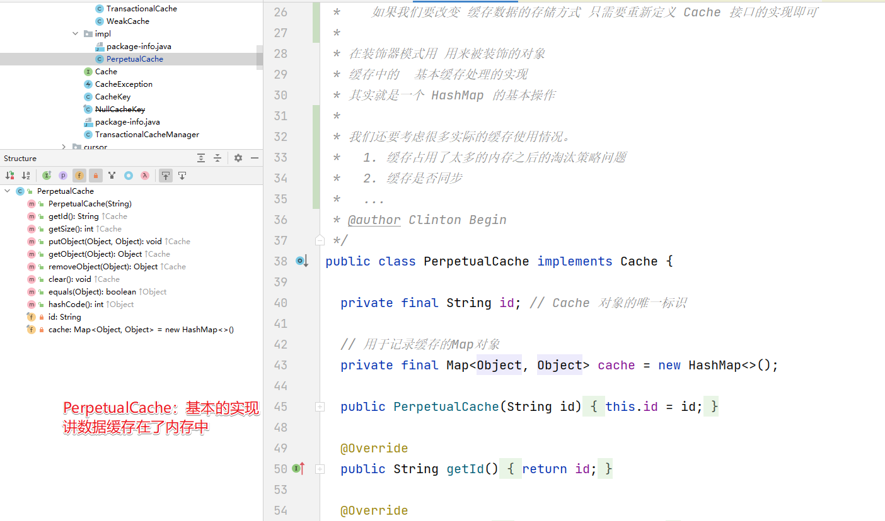

装饰类：然å在MyBatis中给我们æ供了很多的装饰类。

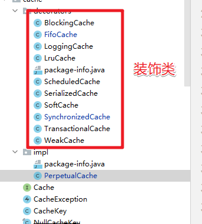

æ¯ä¸ªè£…饰类都有自己的作用

* BlockingCache：阻å¡çš„
* LruCache:æ ¹æ®Lru规则æ¥æ·˜æ±°ç¼“存数æ®
* FifoCache：根æ®FIFO规则æ¥æ·˜æ±°ç¼“存数æ®
* ....

æºç ä¸­çš„装饰：

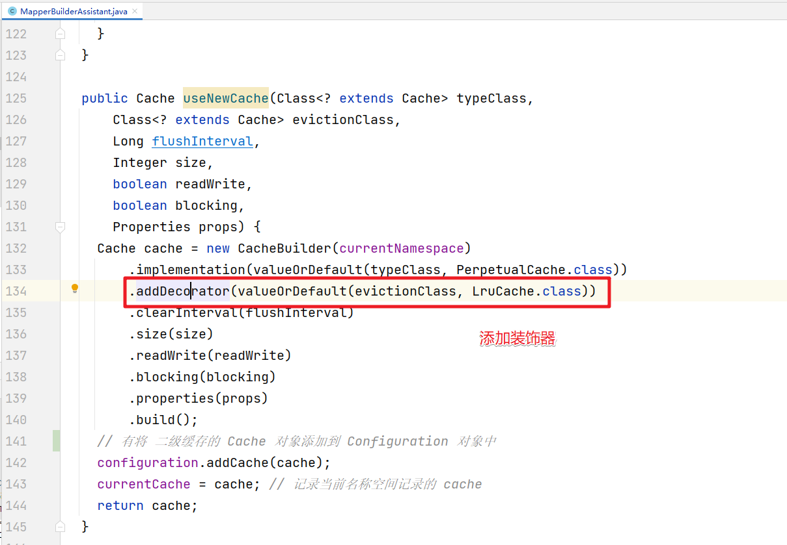

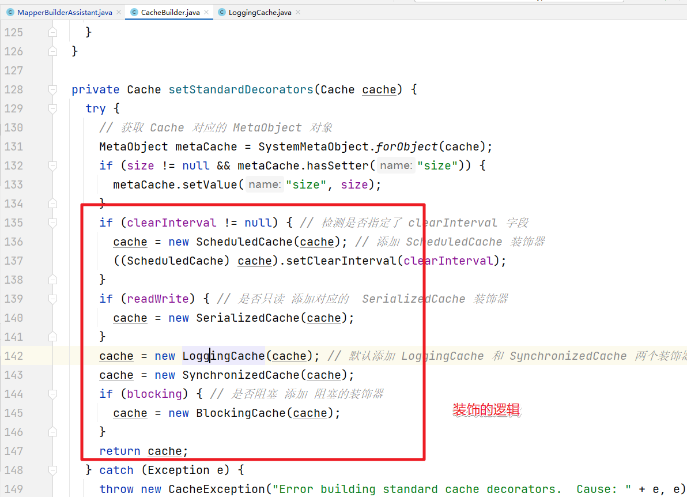

| 比较 | è¯´æ˜                                                         |
| ---- | :----------------------------------------------------------- |
| 优点 | 1. 扩展对象功能，比继承çµæ´»ï¼Œä¸ä¼šå¯¼è‡´ç±»ä¸ªæ•°æ€¥å‰§å¢åŠ <br />2. å¯ä»¥å¯¹ä¸€ä¸ªå¯¹è±¡è¿›è¡Œå¤šæ¬¡è£…饰,创造出ä¸åŒè¡Œä¸ºçš„组åˆ,得到功能更加强大的对象<br />3. 具体æ„建类和具体装饰类å¯ä»¥ç‹¬ç«‹å˜åŒ–,&#x3c;br />用户å¯ä»¥æ ¹æ®éœ€è¦è‡ªå·±å¢åŠ æ–°çš„具体æ„件å­ç±»å’Œå…·ä½“装饰å­ç±»ã€‚ |
| 缺点 | 1.  产生很多å°å¯¹è±¡ã€‚大é‡å°å¯¹è±¡å æ®å†…存，一定程度上影å“性能。<br />2. 装饰模å¼æ˜“äºå‡ºé”™ï¼Œè°ƒè¯•æ’查比较麻烦。 |

## 4.组åˆæ¨¡å¼

### 4.1 组åˆæ¨¡å¼çš„作用

&emsp;&emsp;å…¶å®è§£å†³çš„是对象ä¸å¯¹è±¡ä¹‹é—´çš„包å«å…³ç³»ã€‚也就是 部分-整体 的层次结æ„。

### 4.2 组åˆæ¨¡å¼çš„应用

&emsp;&emsp;组åˆæ¨¡å¼åœ¨é…置文件的加载解æ中其å®ä¼šç”¨çš„相对比较多。以SpringSecurityçš„é…置文件为例

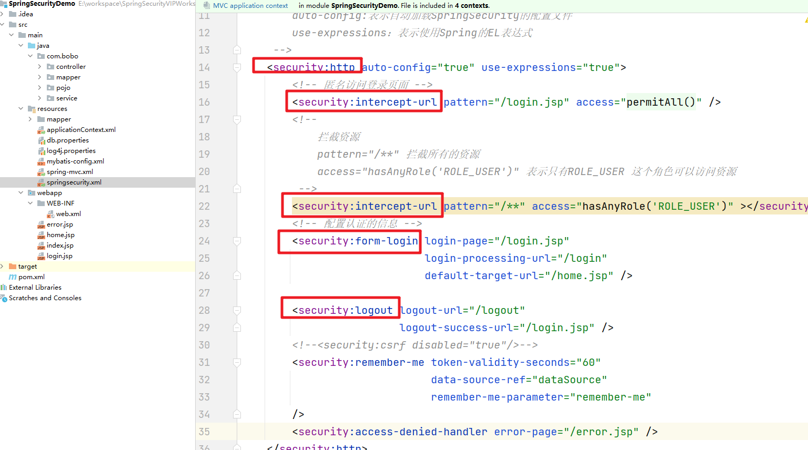

上é¢æ˜¯å…·ä½“的定义

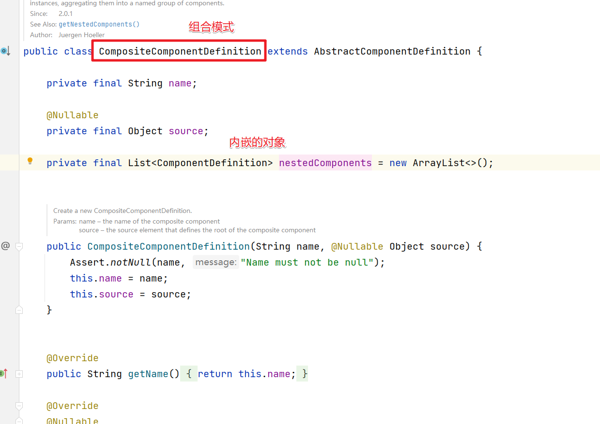

应用

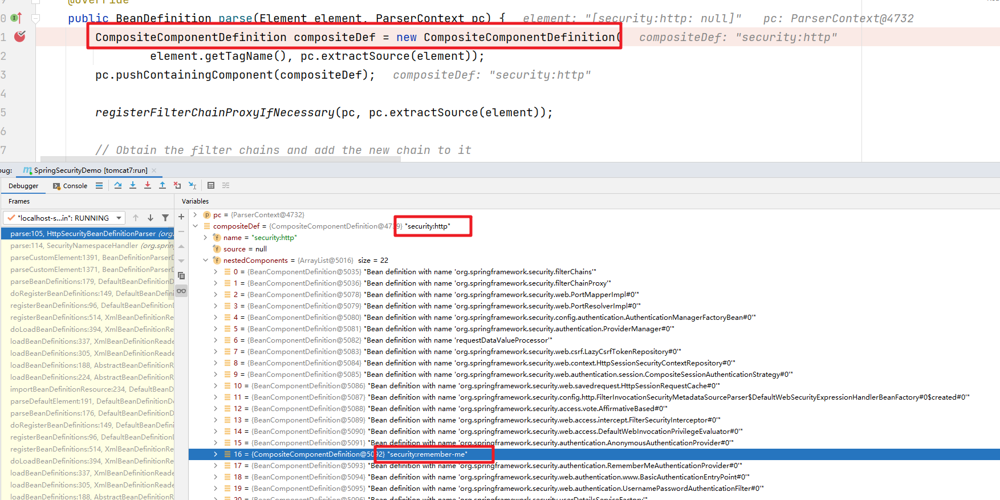

## 5.é—¨é¢æ¨¡å¼

&emsp;&emsp;é—¨é¢æ¨¡å¼ä¹Ÿç§°ä¸ºå¤–观模å¼ï¼Œä»–éšè—了系统的å¤æ‚性，并å‘客户端æ供了一个å¯ä»¥è®¿é—®ç³»ç»Ÿçš„æ¥å£ã€‚è¿™ç§ç±»å‹çš„设计模å¼å±äºç»“æ„性模å¼ã€‚为å­ç³»ç»Ÿä¸­çš„一组æ¥å£æ供了一个统一的访问æ¥å£ï¼Œè¿™ä¸ªæ¥å£ä½¿å¾—å­ç³»ç»Ÿæ›´å®¹æ˜“被访问或者使用。

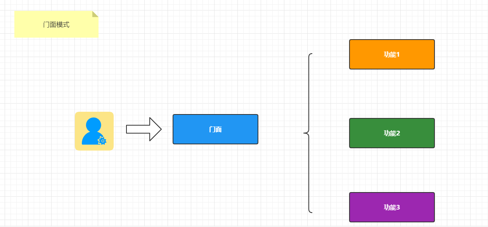

&emsp;&emsp;具体的例å­æ¯”如：MyBatis中的SqlSessionæ¥å£ï¼Œå¯¹å¤–æ供了数æ®åº“æ“作的相关功能，具体的å®ç°ç»†èŠ‚对调用者是éšè—的，这ç§æ¨¡å¼åœ¨å®é™…项目和框æ¶ä¸­å¾ˆé¢‘ç¹

## 6.æ¡¥æ¥æ¨¡å¼

&emsp;&emsp;æ¡¥æ¥æ¨¡å¼çš„出ç°æ˜¯æ›¿ä»£æ‰å¤šå±‚继承的问题。æ高了系统的扩展性。

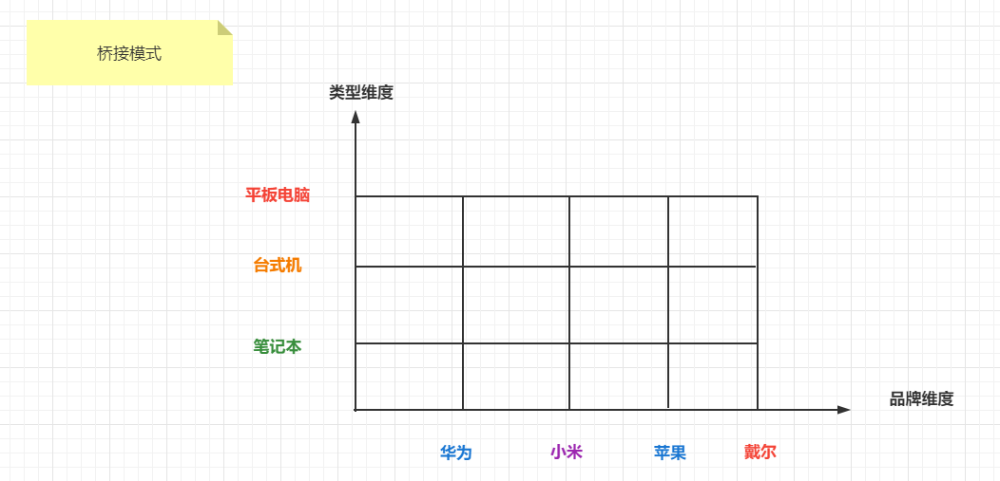

具体的应用比如JDBC中的DriverManagerå…¶å®æœ‰ç”¨åˆ°æ¡¥æ¥æ¨¡å¼ï¼Œä¸åŒçš„æ•°æ®åº“å‚商对应ä¸åŒçš„驱动和è¿æ¥

## 7.享元模å¼

&emsp;&emsp;这个问题相对æ¥è¯´æ¯”较冷门，用到的也比较少，主è¦æ˜¯é’ˆå¯¹å†…存这å—的节çœå¤„ç†ï¼Œå¦‚æœæœ‰å¾ˆå¤šä¸ªå®Œå…¨ç›¸åŒæˆ–相似的对象，我们å¯ä»¥é€šè¿‡äº«å…ƒæ¨¡å¼ï¼ŒèŠ‚çœå†…å­˜.

享元模å¼ä»¥å…±äº«çš„æ–¹å¼é«˜æ•ˆåœ°æ”¯æŒå¤§é‡ç»†ç²’度对象的é‡ç”¨ã€‚

享元对象能åšåˆ°å…±äº«çš„关键是区分了内部状æ€å’Œå¤–部状æ€ã€‚
•  **内部状æ€** ：å¯ä»¥å…±äº«ï¼Œä¸ä¼šéšç¯å¢ƒå˜åŒ–而改å˜
•  **外部状æ€** ：ä¸å¯ä»¥å…±äº«ï¼Œä¼šéšç¯å¢ƒå˜åŒ–而改å˜

比如以围棋为例:

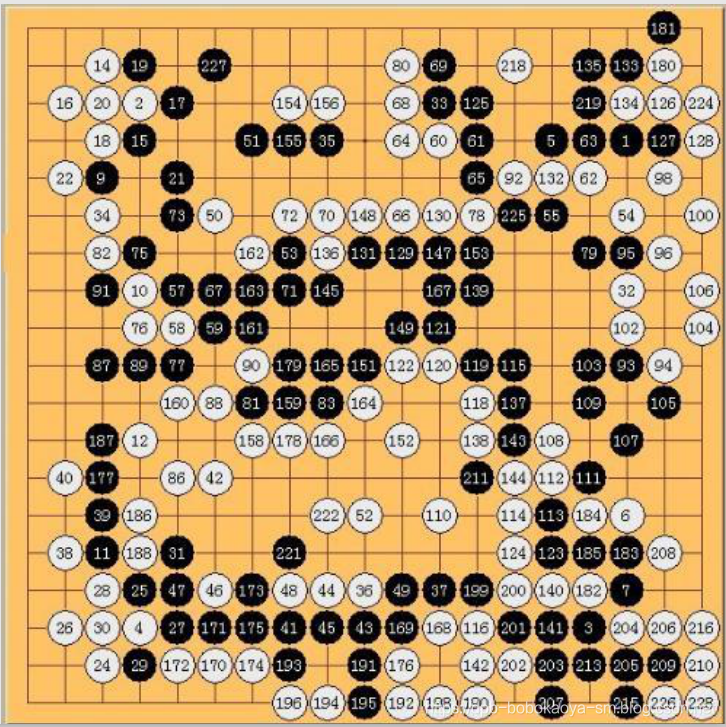

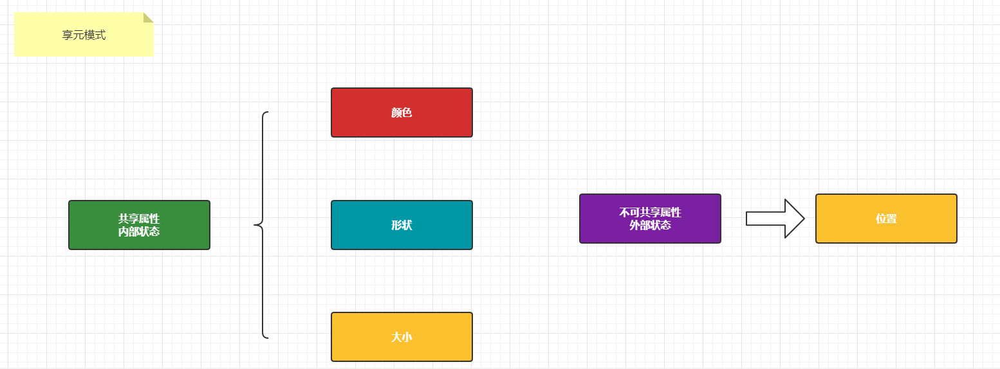


# 三ã€è¡Œä¸ºå‹æ¨¡å¼

&emsp;&emsp;行为å‹æ¨¡å¼å…³æ³¨çš„是对象之间的通信，也就是æ述多个类或者对象之间，通过å作共åŒå®Œæˆä¸€ä¸ªä»»åŠ¡ã€‚主è¦æ¶‰åŠçš„是 **对象** å’Œ **算法**之间èŒè´£çš„分é…。

行为å‹æ¨¡å¼åˆ†ä¸ºä¸¤ç±»ï¼š

* 类行为模å¼ï¼š 通过继承机制æ¥åœ¨ç±»é—´åˆ†æ´¾è¡Œä¸ºã€‚ 主è¦æ˜¯é€šè¿‡å¤šæ€æ¥åˆ†é…父类和å­ç±»çš„èŒè´£
* 对象行为模å¼ï¼š 通过组åˆæˆ–èšåˆï¼Œåœ¨å¯¹è±¡é—´åˆ†æ´¾è¡Œä¸ºã€‚通过对象关è”等方å¼æ¥åˆ†é…类的èŒè´£ã€‚

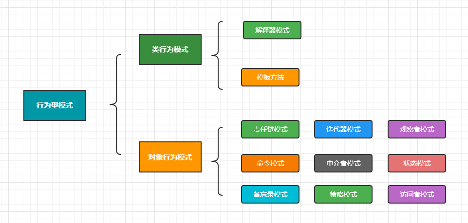

## 1.解释器模å¼

### 1.1 解释器模å¼çš„作用

&emsp;&emsp;解释器模å¼åœ¨ä¸šåŠ¡å¼€å‘é¢æ˜¯å¾ˆå°‘æ¥è§¦åˆ°çš„。主è¦çš„作用是定义的解释器æ¥è§£æå„ç§è¡¨è¾¾å¼ï¼Œæ¯”如SQL语å¥ï¼ŒSPEL表达å¼ï¼Œæƒé™æ³¨è§£ä¸­çš„è¡¨è¾¾å¼ hasAnyRole('ROLE_ADMIN')等。

### 1.2 解释器的应用

&emsp;&emsp;比较常è§çš„应用比如Spring中的针对SPEL表达å¼åšçš„解æ处ç†

```java
    public static void main(String[] args) {
        SpelExpressionParser parser = new SpelExpressionParser();
        Expression expression = parser.parseExpression("500-100*2+60");
        Object value = expression.getValue();
        System.out.println("value = " + value);
    }
```


## 2.模æ¿æ¨¡å¼

### 2.1 模æ¿æ¨¡å¼çš„作用

&emsp;&emsp;模æ¿æ¨¡å¼æ˜¯ä¸€ç§ç›¸å¯¹ç®€å•çš„设计模å¼ã€‚作用是在父类中固定程åºçš„执行顺åºï¼Œå…·ä½“çš„å®ç°åœ¨å­ç±»ä¸­å®ç°ã€‚比如银行定义æ¯ä¸ªäººå»é“¶è¡Œå¼€æˆ·çš„æµç¨‹ï¼Œ

1. å–å·
2. 填写å•å­
3. 等待
4. åŠç†ä¸šåŠ¡
5. 结æŸ

然åæ¯ä¸ªäººæ¥å¼€æˆ·éƒ½ä¼šèµ°è¿™ä¸ªæµç¨‹ï¼Œåªæ˜¯æ¯ä¸ªäººçš„具体æ“作内容会有区别


### 2.2 模æ¿æ¨¡å¼çš„应用

&emsp;&emsp;模æ¿æ¨¡å¼çš„应用就比较多如下：

1. Servlet中的doGet和doPost方法
2. Spring中的JdbcTemplate
3. MyBatis中的Executor处ç†
4. .....


## 3.责任链模å¼

### 3.1 责任链模å¼çš„作用

&emsp;&emsp;将能够处ç†åŒä¸€ç±»è¯·æ±‚的对象è¿æˆä¸€æ¡é“¾ï¼Œæ‰€æ交的请求沿ç€é“¾ä¼ é€’，链上的对象é€ä¸ªåˆ¤æ–­æ˜¯å¦æœ‰èƒ½åŠ›å¤„ç†è¯¥è¯·æ±‚，如æœèƒ½åˆ™å¤„ç†ï¼Œå¦‚æœä¸èƒ½åˆ™ä¼ é€’给链上的下一个对象处ç†ã€‚

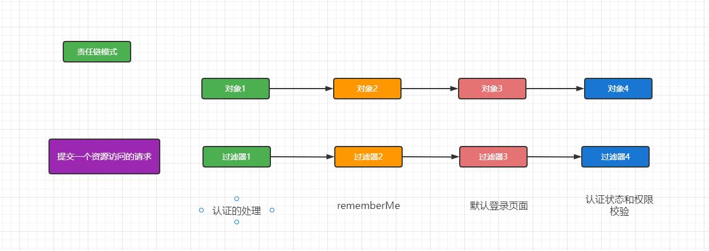


### 3.2 责任链模å¼çš„应用

&emsp;&emsp;责任链模å¼çš„应用场景比较多，对大家æ¥è¯´å°è±¡æ¯”较深刻的应该是SpringSecurity中的处ç†è¯·æ±‚的过滤器链了。

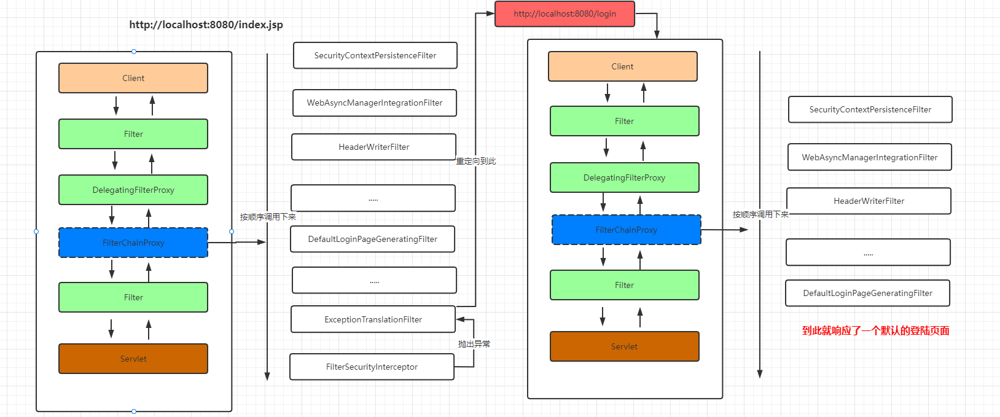

&emsp;&emsp;å¯ä»¥å’Œé¢è¯•å®˜å…·ä½“èŠä¸‹SpringSecurity中的这å—设计。当然还有一些其他的也å¯èŠæ¯”如：

1. Java中，异常机制就是一ç§è´£ä»»é“¾æ¨¡å¼ã€‚一个tryå¯ä»¥å¯¹åº”多个catch，当第一个catchä¸åŒ¹é…ç±»å‹ï¼Œåˆ™è‡ªåŠ¨è·³åˆ°ç¬¬äºŒä¸ªcatch.
2. Javascript语言中，事件的冒泡和æ•è·æœºåˆ¶ã€‚Java语言中，事件的处ç†é‡‡ç”¨è§‚察者模å¼ã€‚
3. SpringMVC中，拦截器的调用也是典å‹çš„责任链模å¼
4. åŒæ ·çš„Servlet中的过滤器链åŒæ ·æ˜¯è´£ä»»é“¾æ¨¡å¼çš„å®ç°ã€‚


## 4.观察者模å¼

### 4.1 观察者模å¼çš„作用

&emsp;&emsp;建立对象ä¸å¯¹è±¡ä¹‹é—´çš„ä¾èµ–关系，一个对象å‘生改å˜æ—¶ï¼Œä¼šè‡ªåŠ¨é€šçŸ¥å…¶ä»–对象。这个场景中，å‘生改å˜çš„对象被称为观察目标，被通知的对象称为观察者。一个观察目标å¯ä»¥æœ‰å¤šä¸ªè§‚察者，而这些观察者之间å¯ä»¥æ²¡æœ‰è”系，å¯ä»¥æ ¹æ®éœ€è¦å¢åŠ æˆ–删除观察者。

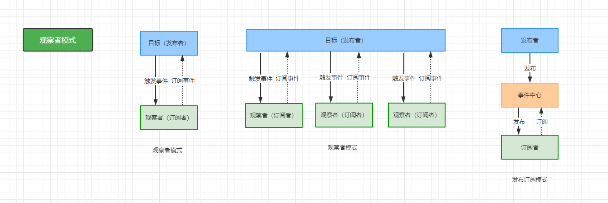


### 4.2 观察者模å¼çš„应用

&emsp;&emsp;观察者模å¼åœ¨Java编程中用到最多的å¯èƒ½å°±æ˜¯äº‹ä»¶æ¨¡å—的处ç†ï¼Œå¯ä»¥å’Œé¢è¯•å®˜è¯¦ç»†çš„èŠä¸‹Spring的事件管ç†æœºåˆ¶æˆ–者SpringBoot的事件处ç†æœºåˆ¶ã€‚我们以SpringBoot的事件机制为例æ¥è¯´æ˜

https://blog.csdn.net/qq_38526573/article/details/122143258 å•ç‹¬é€šè¿‡ä¸€ç¯‡æ–‡ç« æ¥è¯´æ˜äº‹ä»¶çš„本质。


## 5.策略模å¼

### 5.1 策略模å¼çš„作用

&emsp;&emsp;策略模å¼çš„作用就是我们想è¦å®ç°æŸä¸ªç›®çš„，å®ç°çš„æ–¹å¼å¯ä»¥æœ‰å¾ˆå¤šç§ï¼Œé‚£ä¹ˆè¿™é‡Œçš„æ¯ä¸€ç§å®ç°æ–¹å¼éƒ½å¯ä»¥ç§°ä¸ºä¸€ç§ç­–略。比如：

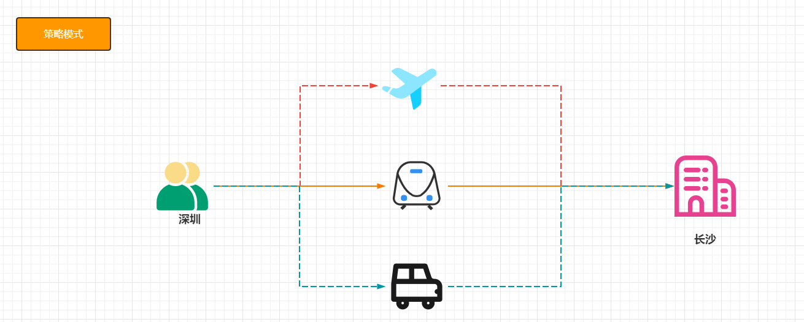


&emsp;&emsp;我们å¯ä»¥å°†æ¯ä¸€ç§äº¤é€šæ–¹å¼éƒ½å°è£…为一个独立的类，这就是一ç§ç­–略。为了ä¿è¯ç­–略的一致性，还å¯ä»¥ç”¨ä¸€ä¸ªæŠ½è±¡çš„交通方å¼ç±» æ¥ åšäº¤é€šæ–¹å¼çš„定义。


### 5.2 策略模å¼çš„应用

&emsp;&emsp;策略模å¼åœ¨å®é™…å¼€å‘中用到的åŒæ ·ä¼šæ¯”较多。

1. AOP 中根æ®ä¸åŒçš„ç­–ç•¥å¯ä»¥é€šè¿‡JDK动æ€ä»£ç†æˆ–者CGLIB代ç†æ¥åˆ›å»ºä»£ç†å¯¹è±¡
2. Spring框æ¶ä¸­çš„Resourcesæ¥å£ï¼Œèµ„æºè®¿é—®çš„ç­–ç•¥
3. Servlet中的service方法，会根æ®å®¢æˆ·ç«¯çš„ä¸åŒæ交方å¼æ¥è°ƒç”¨å¯¹åº”çš„doGet或者doPost方法æ¥å¤„ç†è¯·æ±‚
4. Shiro中的多Realm认è¯ä¸­ï¼Œæ ¹æ®æˆ‘们ä¸åŒçš„é…ç½®å¯ä»¥ä½¿ç”¨æ‰€æœ‰Realm认è¯é€šè¿‡æˆ–者其中一个认è¯é€šè¿‡ç­‰
5. SpringSecurity中的Authentication对象的存储方å¼
6. .......


## 6.迭代器模å¼

### 6.1 迭代器模å¼çš„作用

场景：访问èšåˆå¯¹è±¡ä¸­çš„å„个元素的时候，比如链表的éå†ã€‚我们一般是将éå†çš„方法也放在链表类中。但是如æœéœ€è¦ä¿®æ”¹éå†æ–¹æ³•ï¼Œå°±éœ€è¦ä¿®æ”¹é“¾è¡¨ç±»çš„代ç ï¼Œè¿èƒŒäº†å¼€é—­åŸåˆ™ã€‚

迭代器模å¼å°±æ˜¯åœ¨å®¢æˆ·è®¿é—®å’Œèšåˆç±»ä¹‹é—´æ’入一个迭代器，这样就将**èšåˆå¯¹è±¡** å’Œ **éå†æ–¹æ³•**解耦了，并且对外éšè—å…¶å®ç°ç»†èŠ‚。


### 6.2 迭代器模å¼çš„应用

1. JDK中的List/Set集åˆä¸­çš„迭代器
2. ......


## 7.中介者模å¼

### 7.1 中介则模å¼çš„作用

&emsp;&emsp;对象之间具有很强的关è”性，而且有大é‡çš„相互调用，这ç§æƒ…况下，如æœä¸€ä¸ªå¯¹è±¡å‘生了å˜åŒ–，就需è¦è¿½è¸ªè¯¥å¯¹è±¡å…³è”的其他对象，并进行相应的处ç†ï¼Œè¿™å°±å˜å¾—很å¤æ‚。而中介者模å¼ï¼Œå°±æ˜¯ç”¨ä¸€ä¸ªä¸­ä»‹è€…对象æ¥å°è£…一系列的对象交互，中介者使å„对象ä¸éœ€è¦æ˜¾å¼çš„相互引用，这就使得系统å˜å¾—ä½è€¦åˆã€‚比如：

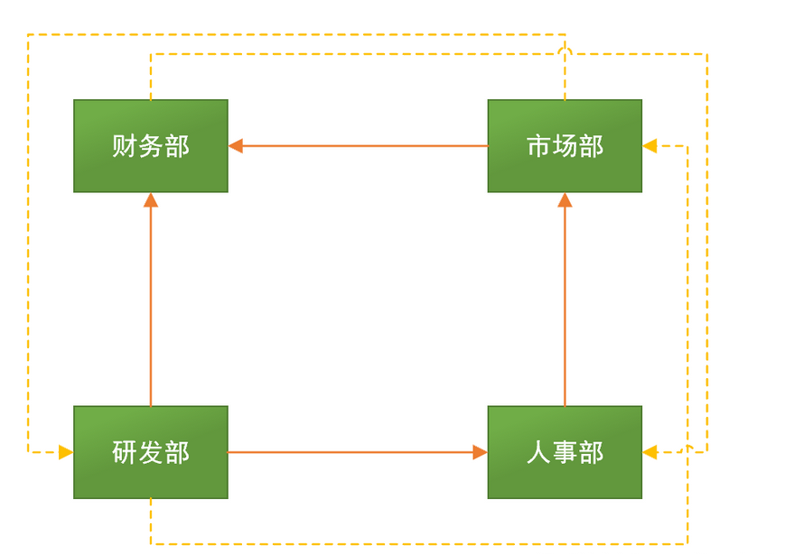

å‡å¦‚没有总ç»ç†ã€‚下é¢ä¸‰ä¸ªéƒ¨é—¨ï¼šè´¢åŠ¡éƒ¨ã€å¸‚场部ã€ç ”å‘部。财务部è¦å‘工资，让大家核对公å¸éœ€è¦è·Ÿå¸‚场部和研å‘部都通气；市场部è¦æ¥ä¸ªæ–°é¡¹ç›®ï¼Œéœ€è¦ç ”å‘部处ç†æŠ€æœ¯ã€éœ€è¦è´¢åŠ¡éƒ¨å‡ºèµ„金。市场部跟å„个部门打交é“。 虽然åªæœ‰ä¸‰ä¸ªéƒ¨é—¨ï¼Œä½†æ˜¯å…³ç³»é常乱。

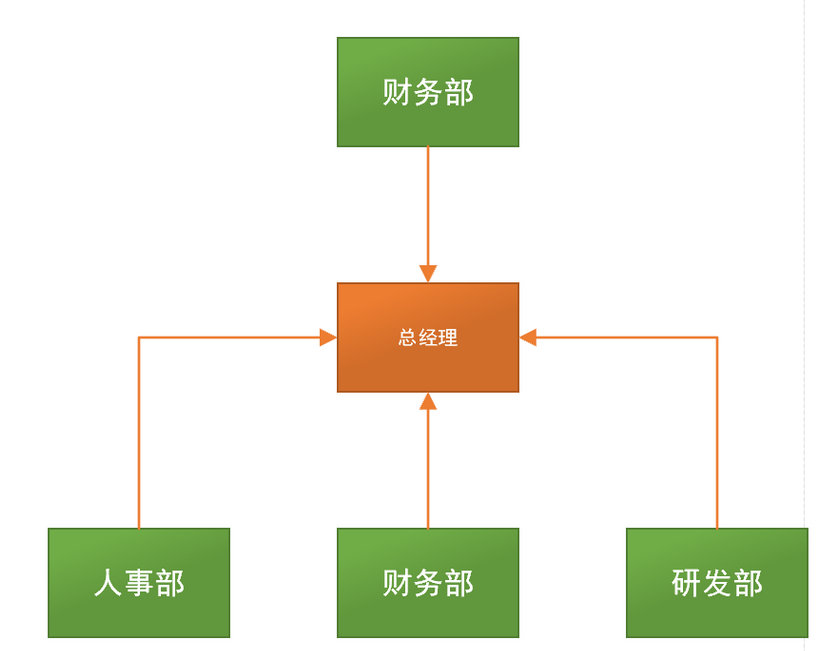


å®é™…上，公å¸éƒ½æœ‰æ€»ç»ç†ã€‚å„个部门有什么事情都通报到总ç»ç†è¿™é‡Œï¼Œæ€»ç»ç†å†é€šçŸ¥å„个相关部门。


### 7.2 中介则模å¼çš„应用

1. MVC模å¼ä¸­çš„C，æ§åˆ¶å™¨å°±æ˜¯ä¸€ä¸ªä¸­ä»‹è€…对象，Må’ŒV都和C打交é“
2. 代ç†å¯¹è±¡ä¸­çš„invoke方法，客户端和目标对象都是通过invokeæ¥æ‰“交到的。
3. .....


## 8.状æ€æ¨¡å¼

场景： 如æœä¸€ä¸ªå¯¹è±¡çš„è¡Œä¸ºä¼šæ ¹æ® å…¶æŸä¸ªå±æ€§çš„å˜åŒ–而ä¸åŒï¼Œé‚£è¿™ä¸ªå±æ€§å°±å¯ä»¥è¢«ç§°ä¸ºè¯¥å¯¹è±¡çš„状æ€ã€‚这样的对象也被称为有状æ€å¯¹è±¡ï¼ˆstateful）。如æœè¿™æ ·çš„对象因为æŸäº›äº‹ä»¶ï¼Œå…¶å†…部状æ€å‘生了改å˜ï¼Œé‚£ä¹ˆç³»ç»Ÿçš„行为也è¦éšä¹‹å‘生å˜åŒ–çš„è¯ï¼Œå°±å¯ä»¥ä½¿ç”¨çŠ¶æ€æ¨¡å¼ã€‚


## 9.命令模å¼

场景：请求的å‘é€è€…å’Œæ¥æ”¶è€…之间解耦，让对象之间的调用关系更加çµæ´»ã€‚å‘é€è€…å’Œæ¥æ”¶è€…之间没有直æ¥çš„引用关系，å‘é€è¯·æ±‚的对象åªéœ€è¦çŸ¥é“如何å‘é€ï¼Œè€Œä¸å¿…关心如何完æˆè¯·æ±‚。


## 10.备忘录模å¼

场景：记录一个对象的内部状æ€ï¼Œå½“用户å悔时能撤销当å‰çš„æ“作，是数æ®æ¢å¤åˆ°å®ƒåŸæ¥çš„状æ€ã€‚比如我们编程的时候，ctrl+z 就是撤销当å‰æ“作，æ¢å¤åˆ°ä¿®æ”¹å‰çš„状æ€ã€‚åˆå«å¿«ç…§æ¨¡å¼ã€‚


## 11.访问者模å¼

场景：有些集åˆå¯¹è±¡ä¸­ä¼šæœ‰å¤šç§ä¸åŒçš„元素，æ¯ç§å…ƒç´ éƒ½æœ‰ä¸åŒçš„访问者 å’Œ 处ç†æ–¹å¼ã€‚è¿™ç§è¢«å¤„ç†çš„æ•°æ®å…ƒç´ ç›¸å¯¹ç¨³å®šï¼Œä½†æ˜¯å¤„ç†æ–¹å¼æ¯”较多样的情况，å¯ä»¥ç”¨è®¿é—®è€…模å¼æ¥å¤„ç†ã€‚

访问者模å¼å°†æ•°æ®ç»“æ„中的å„元素的æ“作分离出æ¥ï¼Œå°è£…æˆç‹¬ç«‹çš„类，使其在ä¸æ”¹å˜æ•°æ®ç»“æ„çš„å‰æ下，å¯ä»¥æ·»åŠ ä½œç”¨äºè¿™äº›å…ƒç´ çš„æ–°æ“作。为数æ®ç»“æ„中的æ¯ä¸ªå…ƒç´ æ供多ç§è®¿é—®æ–¹å¼ã€‚


